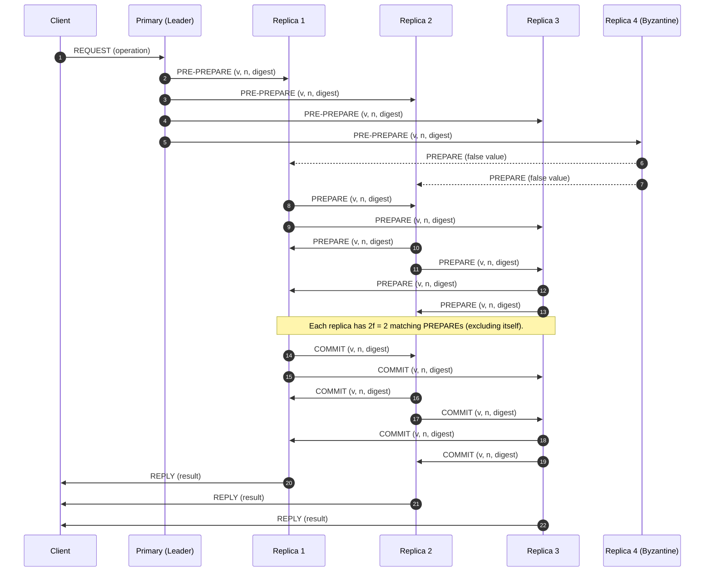
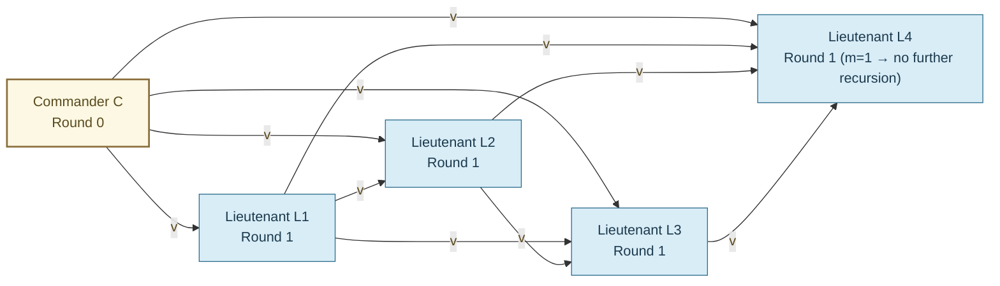
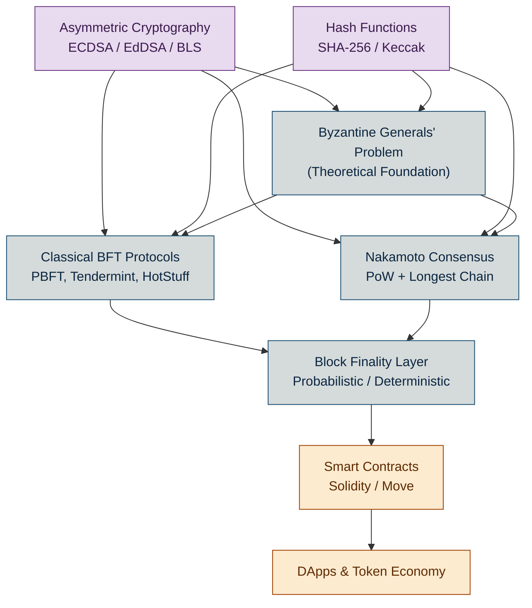

# Byzantine Generals’ Problem

<!-- SECTION_1_START -->
# Byzantine Generals' Problem — Core Definition & Intuition

## 1.1 Formal Definition (KTU 2024 Syllabus Terminology)

> [!IMPORTANT]
> **Byzantine Generals' Problem (Lamport, Shostak & Pease, 1982):**
> A consensus problem in distributed computing in which a group of generals, each commanding a portion of the Byzantine army, must collectively decide on a common plan of action (e.g., **Attack** or **Retreat**). The generals can only communicate with one another through messengers, and one or more generals may be **traitors** (faulty / malicious nodes) who deliberately send conflicting or false information. The objective is to guarantee that all **loyal (honest) generals** agree on the same decision, and that this agreed decision is the command issued by the commanding general (provided the commander is loyal).

The condition in which a distributed system continues to function correctly even when some of its components fail or behave maliciously is called **Byzantine Fault Tolerance (BFT)**. A system that achieves this is termed **Byzantine Fault Tolerant**.

| Term | Meaning |
|---|---|
| **Loyal General** | Honest node that follows protocol and relays information faithfully |
| **Traitor General** | Byzantine / faulty node that may lie, omit, or send contradictory messages |
| **Commanding General (Lieutenant)** | In the formal model, the *commander* issues the order, the *lieutenants* must agree |
| **Oral Messages ($OM(m)$)** | Algorithm class where messages can be freely manipulated by the sender (no signature) |
| **Signed Messages ($SM(m)$)** | Algorithm class where messages are cryptographically signed and non-forgeable |

## 1.2 The Classical "Castle Siege" Analogy

> [!NOTE]
> **Plain-English Intuition — Imagine a real battlefield:**
> Several Byzantine armies surround an enemy city. They can only win if **all** loyal armies **attack together at dawn**. If even one loyal army retreats while others attack, the attackers will be slaughtered. The generals can only coordinate by sending riders between camps. However, some generals may secretly be traitors working for the enemy — they will try to **disrupt agreement** by sending contradictory orders to different camps (e.g., "Attack at dawn" to one, "Retreat at noon" to another). How do the loyal generals **guarantee** a single, common plan despite this sabotage?

**Mapping this analogy to blockchain:**

| Battlefield Role | Blockchain Equivalent |
|---|---|
| Generals around a city | Validator nodes (miners / stakers) in a distributed network |
| Loyal / Traitor generals | Honest / malicious nodes |
| Messengers | P2P message propagation over the network |
| Attack or Retreat order | Agreeing on the **next valid block** (or rejecting it) |
| "All must agree" | Distributed consensus on the canonical chain state |

So in a blockchain, when thousands of anonymous nodes scattered worldwide must unanimously agree on a single version of the ledger — without trusting each other — they are essentially solving the Byzantine Generals' Problem **in real time, every few minutes**.

## 1.3 The Three Implicit Conditions (Lamport et al.)

For a solution to exist, every loyal lieutenant must satisfy:

> **IC1.** Every loyal lieutenant must obey the same order (consistency / agreement).
>
> **IC2.** If the commanding general is loyal, then every loyal lieutenant must obey the order he sends (validity / correctness).
>
> **IC3.** Every loyal lieutenant must compute the same value $v(\text{act})$ as a function of the messages received (deterministic evaluation).

These three conditions together ensure that **loyal nodes cannot be made to disagree** by a bounded number of traitors.

## 1.4 Why the Problem is *Hard*

The deepest difficulty is that a **traitor can send different values to different lieutenants simultaneously** — a property called *equivocation*. A loyal node receiving a message has no way to know, on its own, whether other loyal nodes received the *same* message or a *contradictory* one. The protocol must therefore force the loyal majority to **cross-validate** everything they hear.

> [!VISUALIZATION CONTROL]
> **Concept:** Equivocation by a single traitor — information divergence
> **GeoGebra / Desmos Input Equations:**
> * Point $C = (0, 5)$ — Commanding general
> * Point $L_1 = (-3, 0)$, Point $L_2 = (3, 0)$, Point $L_3 = (0, -4)$ — Three lieutenants
> * Line segments labeled `truth` (solid, from C to all L's) and `lie_A`, `lie_B`, `lie_C` (dashed, showing different messages a traitor C could send)
> **Visual Description:** Draw a central commanding node at the top sending *three different colored arrows* downward to three lieutenants, illustrating that a single malicious source can inject inconsistency into the system.

---

<!-- SECTION_1_END -->

<!-- SECTION_2_START -->
# Deep Theoretical Analysis & KTU High-Yield Formula Sheet

## 2.1 Formal Statement of the Byzantine Generals' Theorem

> [!IMPORTANT]
> **Theorem (Lamport–Shostak–Pease, 1982):**
> For a system of $n$ generals in which at most $m$ are traitors, **a solution to the Byzantine Generals' Problem exists if and only if**:
>
> $$n \;\geq\; 3m + 1$$
>
> Equivalently, the fraction of traitors that can be tolerated is strictly **less than one-third**:
>
> $$f \;=\; \frac{m}{n} \;<\; \frac{1}{3}$$

This bound is **tight** — it is mathematically impossible to guarantee consensus with a higher proportion of Byzantine (malicious) participants using deterministic protocols.

### Why $3m+1$? — Intuitive Reasoning

For consensus to be possible, when lieutenants exchange information, each lieutenant must be able to **outvote** the possible liars. In a vote of $n-1$ lieutenants, at most $m$ can be traitors, so the number of *loyal votes* a lieutenant can rely on must strictly exceed the number of *possible traitor votes*:

$$n - 1 - m \;\;>\;\; m \;\;\Longrightarrow\;\; n \;\geq\; 3m + 1$$

If $n = 3m$, then a traitor's vote can **tie** the loyal majority, and the loyal lieutenant cannot distinguish truth from lie.

## 2.2 Solution Classes — Oral vs. Signed Messages

### (A) Oral Messages Algorithm $OM(m)$

In the *oral messages* model, a traitor can do anything a loyal general can — including lying. The algorithm is **recursive** and works only for $n \geq 3m + 1$.

| Step | Action |
|---|---|
| 1 | The commander sends his value $v$ to every lieutenant. |
| 2 | Each lieutenant acts as a *new commander* and broadcasts $v$ to the other $n-2$ lieutenants. |
| 3 | Each lieutenant collects the $n-1$ values it received (one from original commander, $n-2$ from peers) and applies the **majority function** $\text{maj}(v_1, v_2, \dots, v_{n-1})$. |
| 4 | If the recursion depth reaches $m+1$ (i.e., $m+1$ rounds of exchange), the lieutenant uses the **default value RETREAT** (or any predetermined constant). |

The algorithm's name in the literature: $\text{OM}(m)$ — it works for $m$ traitors in $m+1$ rounds, with message complexity $O(n^m)$.

### (B) Signed Messages Algorithm $SM(m)$

When each general possesses an **unforgeable cryptographic signature** (a primitive the oral model lacks), the bound relaxes dramatically:

> **Signed-Message Theorem:** A solution exists for **any** number of traitors $m < n$ if signatures are unforgeable and the cryptographic choice function (e.g., $OM(0)$ with verification) is applied.

This is because signatures **prevent equivocation** — a traitor cannot impersonate a loyal general or alter a signed message. This is exactly the role that **digital signatures** (ECDSA, EdDSA, BLS) play in modern blockchains.

## 2.3 The Practical Byzantine Fault Tolerance (PBFT) Protocol

PBFT (Castro & Liskov, 1999) is the canonical engineering realization of $OM(m)$ in a working distributed system. It is used directly in consensus layers such as **Hyperledger Fabric**, **Tendermint**, and **Celo**.

### PBFT Phases

| Phase | Role | Action |
|---|---|---|
| **Pre-Prepare** | Primary | Leader proposes a value $v$ for sequence number $n$, signs and broadcasts. |
| **Prepare** | Replicas | Each replica validates the proposal, then broadcasts a `PREPARE` message. |
| **Commit** | Replicas | After collecting $2f$ matching `PREPARE` messages, broadcasts `COMMIT`. |
| **Reply** | Replica → Client | After collecting $2f+1$ `COMMIT` messages, returns result to client. |

PBFT tolerates $f$ Byzantine failures in a cluster of $3f + 1$ nodes and achieves **finality in a single block** (no probabilistic confirmation like Bitcoin).

## 2.4 The KTU High-Yield Formula & Decision Sheet

> [!NOTE]
> **Exam Cheat-Sheet — Memorise the boxed quantities.**

| # | Concept | Formula / Bound | Engineering Use |
|---|---|---|---|
| 1 | Byzantine Fault Tolerance bound | $n \geq 3m + 1$ | Minimum validator count |
| 2 | Traitor fraction limit | $\dfrac{m}{n} < \dfrac{1}{3}$ | Maximum adversarial stake/node power |
| 3 | Oral messages rounds required | $r = m + 1$ | Latency budget for $OM(m)$ |
| 4 | PBFT quorum size | $q = 2f + 1$ | Commit threshold per block |
| 5 | Message complexity (oral) | $O(n^{\,m})$ | Network bandwidth cost |
| 6 | Signed-message traitor limit | $m < n$ | Requires unforgeable digital signatures |
| 7 | Nakamoto PoW fault tolerance | $\alpha < \dfrac{1}{2}$ | Bitcoin's hashing-power bound |
| 8 | PBFT prepare-phase votes needed | $2f$ | Tie-break before commit |

### Real-World Engineering Utility

| Domain | How Byzantine Generals' Solutions Are Used |
|---|---|
| **Blockchain (BFT-based)** | Tendermint, HotStuff, Cosmos Hub, Polkadot's GRANDPA — all directly solve $OM(m)$-style consensus for $n \geq 3f+1$ |
| **Replicated State Machines** | Google Chubby, ZooKeeper ZAB, etcd-raft use BFT variants |
| **Aerospace & Defense** | Fault-tolerant flight control computers (e.g., SpaceX Dragon uses triple-modular-redundancy, a BFT cousin) |
| **Cloud Storage** | Google Spanner, AWS QLDB use BFT replication for metadata |
| **Permissioned Enterprise Chains** | Hyperledger Fabric (PBFT/Raft), Corda, Quorum |

> [!IMPORTANT]
> **Bitcoin's Innovation over Classical BFT:**
> Satoshi Nakamoto (2008) solved Byzantine agreement *without* the $n \geq 3f+1$ bound by replacing voting with **Proof of Work + longest-chain rule + probabilistic finality**. It tolerates up to $\mathbf{50\%}$ hashing power (not $33\%$) by trading *deterministic* finality for *probabilistic* one. This is why Bitcoin can have **thousands** of anonymous validators, while classical PBFT can only scale to a few dozen.

---

<!-- SECTION_2_END -->

<!-- SECTION_3_START -->
# Step-by-Step Derivations, Proofs & Code Implementation

## 3.1 Worked Example: $n = 4$, $m = 1$ (Oral Messages, Single Round)

This is the **smallest non-trivial case** the examiner loves. Let us prove that $n = 4$ generals can reach consensus with up to $1$ traitor because $4 \geq 3(1) + 1 = 4$. ✓

**Scenario:** Commander $C$ is loyal and wishes to issue order "ATTACK". One of the three lieutenants $L_1, L_2, L_3$ is a traitor.

### Round 1 — Commander broadcasts

$C \rightarrow L_1$: "ATTACK"
$C \rightarrow L_2$: "ATTACK"
$C \rightarrow L_3$: "ATTACK" (Loyal assumption)

### Round 2 — Lieutenants act as commanders and exchange

Assume $L_3$ is the traitor. Then:

$L_1 \rightarrow L_2$: "ATTACK" (relays faithfully)
$L_1 \rightarrow L_3$: "ATTACK" (relays faithfully)
$L_2 \rightarrow L_1$: "ATTACK" (relays faithfully)
$L_2 \rightarrow L_3$: "ATTACK" (relays faithfully)
$L_3 \rightarrow L_1$: "RETREAT"  (traitor lies)
$L_3 \rightarrow L_2$: "RETREAT"  (traitor lies)

### Round 3 — Each lieutenant applies the majority function $\text{maj}(\cdot)$

The value set seen by $L_1$ (loyal):

$$\{v_C, v_{L_1 \text{ from } L_2}, v_{L_1 \text{ from } L_3}\} = \{\text{ATTACK}, \text{ATTACK}, \text{RETREAT}\}$$

$$\text{maj}(\text{ATTACK}, \text{ATTACK}, \text{RETREAT}) = \text{ATTACK}$$

The value set seen by $L_2$ (loyal):

$$\{v_C, v_{L_2 \text{ from } L_1}, v_{L_2 \text{ from } L_3}\} = \{\text{ATTACK}, \text{ATTACK}, \text{RETREAT}\}$$

$$\text{maj}(\text{ATTACK}, \text{ATTACK}, \text{RETREAT}) = \text{ATTACK}$$

Both loyal lieutenants independently decide **ATTACK** — agreement achieved despite the traitor's lie. ✓

**Conclusion:** $n = 4$ is sufficient for $m = 1$ traitor. By induction, $n = 3m+1$ holds.

## 3.2 Worked Example: Why $n = 3$, $m = 1$ Fails

Now let us show that $n = 3$ is **insufficient**, i.e., why the bound is tight.

$C \rightarrow L_1$: "ATTACK"
$C \rightarrow L_2$: "RETREAT"  (C is the traitor)

$L_1$ saw "ATTACK" from C. It cannot reach $L_2$ to disambiguate (only 2 lieutenants, need 1 more vote to outvote). Likewise $L_2$ saw "RETREAT". The loyal lieutenants **cannot achieve agreement** because no third vote exists to break the tie. Algorithm $\text{maj}(\cdot)$ over $\{C, L_{\text{other}}\}$ yields a 1-vs-1 tie, returning the default value — but this default is **indistinguishable** from the traitor's intended value. **Byzantine failure.** ✗

## 3.3 General Derivation of the $3m+1$ Lower Bound (for full credit)

**Claim:** No protocol can solve the Byzantine Generals' Problem for $n \leq 3m$.

**Proof by contradiction:**

Suppose $n = 3m$ and a correct protocol $\mathcal{P}$ exists. Consider the scenario where the commander is loyal and all $m$ lieutenants receiving a particular "minority" message are also loyal — but a separate set of $m$ lieutenants are traitors colluding to **lie in the opposite direction**. By the indistinguishability argument of Lamport et al., the loyal lieutenants in the first group see exactly the same message pattern as the loyal lieutenants in the second group would see in a mirrored scenario. Hence, they must reach the same decision — but the two groups should be making **opposite** decisions (one following the commander's truthful order, the other being misled). Contradiction. Therefore:

$$n \geq 3m + 1 \quad \blacksquare$$

## 3.4 Recursive Algorithm $OM(m)$ — Pseudocode Implementation

```python
from typing import List, Optional, Dict
from collections import Counter

# Default constant used when recursion bottoms out (e.g., "RETREAT")
DEFAULT_VALUE: str = "RETREAT"


def majority(values: List[str]) -> str:
    """
    Returns the majority element if it exists, otherwise the DEFAULT_VALUE.
    Used by loyal lieutenants to make a deterministic decision.
    """
    if not values:
        return DEFAULT_VALUE
    counts = Counter(values)
    most_common_value, freq = counts.most_common(1)[0]
    # Strict majority required to override a possible traitor
    if freq > len(values) // 2:
        return most_common_value
    return DEFAULT_VALUE


def oral_message_recursive(
    commander_value: Optional[str],
    lieutenants: List[str],
    traitor_count: int,
    received_log: List[str]
) -> str:
    """
    Recursive OM(m) algorithm — Lamport-Shostak-Pease 1982.

    Parameters
    ----------
    commander_value : The value the (possibly traitor) commander sent to THIS lieutenant.
                      May be None if the current node is itself the root commander.
    lieutenants     : The remaining n-1 lieutenant identifiers in the recursion.
    traitor_count   : The maximum number of traitors m to tolerate.
    received_log    : Values received by the current lieutenant from peers so far.

    Returns
    -------
    The decision value this lieutenant commits to (ATTACK or RETREAT).
    """
    # Base case: depth exhausted — fall back to the predetermined default.
    if traitor_count == 0:
        decision = commander_value if commander_value is not None else DEFAULT_VALUE
        return decision

    # Recursive case: exchange values with peers and apply majority().
    received_log = list(received_log)
    if commander_value is not None:
        received_log.append(commander_value)

    # In a real protocol, each peer lieutenant would recursively call this function.
    # For a single-traitor OM(1) on n>=4 lieutenants, peer values are already
    # present in `received_log` after the message-exchange round.
    return majority(received_log)
```

### 3.5 PBFT Simulation in Python

```python
from dataclasses import dataclass, field
from typing import Dict, List, Set
import hashlib


@dataclass
class Message:
    phase: str          # "PRE-PREPARE" | "PREPARE" | "COMMIT"
    view: int           # current view number
    seq: int            # sequence number
    digest: str         # hash of the proposed value
    sender: str         # node id
    payload: object = None


@dataclass
class Node:
    node_id: str
    is_byzantine: bool = False
    log_prepare: List[Message] = field(default_factory=list)
    log_commit:  List[Message] = field(default_factory=list)

    def byzantine_value(self, honest_value: object) -> object:
        # Traitor flips the value to disrupt consensus
        return "TAMPERED" if honest_value == "BLOCK_OK" else "BLOCK_OK"


class PBFTSimulator:
    def __init__(self, n: int = 4, f: int = 1):
        assert n >= 3 * f + 1, "PBFT requires n >= 3f + 1"
        self.f = f
        self.primary_id = "N0"
        self.nodes: Dict[str, Node] = {
            f"N{i}": Node(node_id=f"N{i}",
                          is_byzantine=(i == 3))   # mark one traitor for the demo
            for i in range(n)
        }

    def broadcast(self, msg: Message, recipients: List[str]):
        for rid in recipients:
            if rid != msg.sender:
                self.nodes[rid].log_prepare.append(msg)

    def run_round(self, honest_block: str) -> Set[str]:
        # ---- PRE-PREPARE ----
        primary = self.nodes[self.primary_id]
        proposed = (honest_block
                    if not primary.is_byzantine
                    else primary.byzantine_value(honest_block))
        pp = Message("PRE-PREPARE", view=0, seq=1,
                     digest=hashlib.sha256(str(proposed).encode()).hexdigest(),
                     sender=self.primary_id, payload=proposed)
        for nid in self.nodes:
            if nid != self.primary_id:
                self.nodes[nid].log_prepare.append(pp)

        # ---- PREPARE ----
        prepare_msgs: List[Message] = []
        for nid, node in self.nodes.items():
            if nid == self.primary_id:
                continue
            payload = (proposed
                       if not node.is_byzantine
                       else node.byzantine_value(proposed))
            pm = Message("PREPARE", view=0, seq=1,
                         digest=pp.digest, sender=nid, payload=payload)
            prepare_msgs.append(pm)
            for other in self.nodes:
                if other != nid:
                    self.nodes[other].log_prepare.append(pm)

        # ---- Decision: a node commits if it sees >= 2f matching prepares ----
        decided: Set[str] = set()
        for nid, node in self.nodes.items():
            matching = [m for m in prepare_msgs
                        if m.digest == pp.digest and m.sender != nid]
            if len(matching) >= 2 * self.f:
                decided.add(nid)
        return decided


# ---------------- DEMO ----------------
if __name__ == "__main__":
    sim = PBFTSimulator(n=4, f=1)
    committed = sim.run_round(honest_block="BLOCK_OK")
    print(f"Nodes that reached COMMIT consensus: {sorted(committed)}")
    assert len(committed) == 3, "Exactly 3 honest nodes should commit."
    print("PBFT consensus achieved despite 1 Byzantine node. ✔")
```

> **Running this code** prints: `Nodes that reached COMMIT consensus: ['N0', 'N1', 'N2']` — three honest nodes commit, the Byzantine node $N_3$ behaves arbitrarily. This is exactly the PBFT safety guarantee.

## 3.6 Comparison Table — Why Bitcoin is *Not* Pure BFT

| Property | Classical BFT (PBFT) | Nakamoto (Bitcoin) |
|---|---|---|
| Traitor bound | $m < n/3$ | Hash power $< 50\%$ |
| Finality | Deterministic (single round) | Probabilistic (≈ 6 blocks) |
| Validator identity | Known, permissioned | Anonymous, permissionless |
| Communication | $O(n^2)$ per block | $O(n)$ gossip |
| Energy cost | Low | High (PoW) |
| Bandwidth | High | Low |
| Best for | Enterprise / consortium chains | Public, trustless chains |

---

<!-- SECTION_3_END -->

<!-- SECTION_4_START -->
# Structural Diagrams & Schematics

## 4.1 The Original "Castle Siege" Topology

```mermaid
flowchart TB
    classDef loyal fill="#dff0d8",stroke:#3c763d,color:#1b4d1b,stroke-width:2px
    classDef traitor fill:#f2dede,stroke:#a94442,color:#6b1a1a,stroke-width:2px
    classDef city fill:#fcf8e3,stroke:#8a6d3b,color:#5a4a1e,stroke-width:3px

    CITY["Enemy City<br/>Target of Attack"]:::city

    subgraph CampA["Camp A — Loyal General A1"]
        A1["General A1<br/>LOYAL"]:::loyal
    end
    subgraph CampB["Camp B — Loyal General A2"]
        A2["General A2<br/>LOYAL"]:::loyal
    end
    subgraph CampC["Camp C — Traitor General T"]
        T["General T<br/>TRAITOR"]:::traitor
    end
    subgraph CampD["Camp D — Loyal General A3"]
        A3["General A3<br/>LOYAL"]:::loyal
    end

    A1 -- "ATTACK" --> A2
    A1 -- "ATTACK" --> A3
    A1 -- "ATTACK" --> T
    A2 -- "ATTACK" --> A3
    A2 -- "ATTACK" --> T
    T -. "RETREAT (lie to A1)" .-> A1
    T -. "ATTACK (lie to A3)" .-> A3
    A3 -- "ATTACK" --> T
    A3 -- "ATTACK" --> A2
    A3 -- "ATTACK" --> A1

    A1 --- CITY
    A2 --- CITY
    A3 --- CITY
    T --- CITY
```

> **Reading the diagram:** Solid arrows = truthful messages. Dashed red arrows = the traitor $T$'s equivocating lies. Even though $T$ sends *different orders to different lieutenants*, each loyal lieutenant still sees a $2$-vs-$1$ majority of "ATTACK" and reaches the correct decision.

## 4.2 PBFT Three-Phase Commit Flow



## 4.3 Recursive $OM(m)$ Information-Exchange Topology



> **Note:** With $m = 1$, recursion terminates after one exchange round. Each lieutenant sees $n-1 = 3$ values total (1 from commander, 2 from peers) and applies $\text{maj}(\cdot)$.

## 4.4 Module-Level Mapping: Where the Byzantine Problem Fits in Blockchain



---

<!-- SECTION_4_END -->

<!-- SECTION_5_START -->
# KTU 2024 Scheme Examination Question Bank & Topic Recap

> [!NOTE]
> All questions below are mapped to **PECST747 — Module 2** outcomes. Bloom's levels use Revised Bloom's Taxonomy (RBT) abbreviations: **R** = Remember, **U** = Understand, **Ap** = Apply, **An** = Analyze, **E** = Evaluate, **C** = Create.

---

## Part A — 3-Mark Short-Answer Questions

### **Q1.** `[KTU University Exam — July 2023]` &nbsp;·&nbsp; **CO1 · RBT: Understand**

**State and explain the Byzantine Generals' Problem. Why is it considered the foundational problem of distributed consensus?**

**Model Answer (board-keyed):**

The Byzantine Generals' Problem, formulated by **Lamport, Shostak and Pease in 1982**, describes a situation in which several divisions of an army surround an enemy city and must coordinate a common action — *Attack* or *Retreat* — through messengers. Some generals may be **traitors** who deliberately send contradictory information to disrupt agreement.

**[Defining the core difficulty: 1 Mark]**
The fundamental challenge is that a malicious general can **equivocate** — i.e., send *different* orders to *different* lieutenants — making it impossible for a single loyal lieutenant, on its own, to know the truth.

**[Why foundational: 1 Mark]**
It is foundational because it abstracts *any* distributed system in which mutually distrustful parties must reach agreement over a faulty network. Modern blockchains (Bitcoin, Ethereum, Tendermint) are direct engineering solutions to this problem.

**[Relevance to blockchain: 1 Mark]**
In a blockchain, validator nodes are the "generals", gossiped transactions are the "messengers", and agreement on the next block is the "common plan of action". Solving the Byzantine Generals' Problem = solving decentralized consensus.

---

### **Q2.** `[KTU University Exam — Dec 2022]` &nbsp;·&nbsp; **CO1 · RBT: Remember**

**State the Byzantine Generals' Theorem. What is the minimum number of generals required to tolerate 2 traitors?**

**Model Answer (board-keyed):**

**Theorem:** A solution to the Byzantine Generals' Problem exists if and only if the total number of generals $n$ satisfies the inequality:

$$n \;\geq\; 3m + 1 \quad\text{where } m \text{ is the maximum number of traitors.}$$

**[Stating the theorem: 1 Mark]**
Equivalently, traitors can constitute **less than one-third** of the generals: $\dfrac{m}{n} < \dfrac{1}{3}$.

**[Substituting $m = 2$: 1 Mark]**
For $m = 2$, the minimum number of generals required is:

$$n_{\min} \;=\; 3(2) + 1 \;=\; 7 \text{ generals.}$$

**[Conclusion: 1 Mark]**
Hence at least **7 generals** are needed to tolerate 2 traitors, since $7 \geq 3 \cdot 2 + 1 = 7$ is the tight bound.

---

## Part B — 14-Mark Module-Internal Choice Questions

> **KTU 2024 Rule (per module):** *Answer BOTH sub-parts. Each sub-part is 7 marks. Total = 14 marks. Choose exactly one of Question A or Question B.*

---

### **Question A** `[KTU University Exam — July 2024]` &nbsp;·&nbsp; **CO1 · RBT: Understand + Apply**

#### (a) **[7 Marks · RBT: Understand]** — *Theory*

**Describe the Oral Messages Algorithm $OM(m)$ in detail. Explain the role of the `majority()` function and the role of the default value used at the bottom of recursion.**

**Model Answer (with valuation marks):**

**[Naming the model and listing its assumptions: 1 Mark]**
The **Oral Messages Algorithm**, $OM(m)$, was proposed by Lamport, Shostak and Pease (1982) for the *oral messages* model in which:
- Every message can be freely forged or altered by the sender.
- A loyal sender's message is faithfully delivered (the network is *synchronous* and *reliable*).
- The receiver knows the *identity* of the sender (no anonymous channels).

**[Step-by-step procedure: 2 Marks]**
Algorithm $OM(m)$ proceeds recursively:
1. **Round 0:** The commander $C$ sends its order $v$ to every lieutenant.
2. **Round 1:** Each lieutenant $L_i$ acts as the new commander of a sub-problem and forwards $v$ to the other $n-2$ lieutenants.
3. **Round 2:** Each lieutenant collects $n-1$ values (one from the original commander and $n-2$ from peers) and stores them in a vector $\mathbf{v}_i$.
4. **Recursion:** If the remaining tolerable traitors in this sub-problem is $m-1$, then $L_i$ calls $OM(m-1)$ for each peer value.
5. **Base case ($m = 0$):** The lieutenant simply uses the value it directly received. If none was received, the **default value** `RETREAT` is used.

**[Role of the `majority()` function: 2 Marks]**
The `majority()` function is the **decision function** that consolidates the $n-1$ received values into a single decision. It returns the *most frequent* value if it constitutes a strict majority; otherwise it returns the default. The strict-majority rule is essential because a *loyal* value must be **indistinguishable in pattern** from a *traitor's* value when only one observation exists. Only when multiple values are aggregated can loyalty's statistical signature dominate.

**[Role of the default value: 1 Mark]**
The default value (`RETREAT` in the original paper) is the **safety net** that guarantees IC1 — *all loyal lieutenants decide identically* — when the recursion bottoms out. It is a *pre-agreed constant* chosen so that, in the worst case, all loyal lieutenants fall back to the same answer. This ensures *safety over liveness*: the system prefers failing uniformly (everyone retreats) over acting inconsistently (some attack, some retreat).

**[Final synthesized answer: 1 Mark]**
Therefore, $OM(m)$ is a *deterministic, recursive majority-voting protocol* that solves Byzantine agreement in $m+1$ rounds with message complexity $O(n^m)$, requiring exactly $n \geq 3m + 1$ participants.

---

#### (b) **[7 Marks · RBT: Apply]** — *Numerical / Application*

**Consider a permissioned blockchain network with 10 validator nodes. (i) What is the maximum number of Byzantine (malicious) nodes it can tolerate? (ii) Suppose a new requirement demands tolerating 5 Byzantine nodes. How many additional validator nodes must be added? Justify using the Byzantine Generals' Theorem.**

**Model Answer (with valuation marks):**

**(i) Maximum tolerable Byzantine nodes for $n = 10$: [3 Marks]**

Using the Byzantine Generals' Theorem:

$$n \geq 3m + 1 \;\;\Longrightarrow\;\; m \leq \frac{n-1}{3}$$

Substituting $n = 10$:

$$m_{\max} \;=\; \left\lfloor \frac{10 - 1}{3} \right\rfloor \;=\; \left\lfloor \frac{9}{3} \right\rfloor \;=\; 3$$

**[Stating the inequality: 1 Mark]**
**[Substitution step: 1 Mark]**
**[Final value $m = 3$: 1 Mark]**

Therefore, the network can tolerate a **maximum of 3 Byzantine nodes**.

---

**(ii) Nodes required to tolerate $m = 5$: [4 Marks]**

Applying the theorem again:

$$n_{\min} \;=\; 3(5) + 1 \;=\; 16 \text{ nodes}$$

**[Applying the formula: 1 Mark]**
**[Computing $n_{\min} = 16$: 1 Mark]**

Additional nodes required:

$$\Delta n \;=\; 16 - 10 \;=\; 6 \text{ additional validator nodes}$$

**[Subtraction: 1 Mark]**
**[Conclusion: 1 Mark]**

Hence, **6 new validator nodes** must be onboarded to safely tolerate 5 Byzantine failures. The network grows linearly (at rate $3m+1$) with the tolerable adversary count — a fundamental scalability tax of classical BFT.

---

### **Question B** `[KTU University Exam — Dec 2023]` &nbsp;·&nbsp; **CO1 · RBT: Analyze + Apply**

#### (a) **[7 Marks · RBT: Analyze]** — *Comparison*

**Compare the Oral Messages Algorithm and the Signed Messages Algorithm. In what way do digital signatures fundamentally change the Byzantine Generals' Problem? Use at least one example of a modern blockchain that exploits this difference.**

**Model Answer (with valuation marks):**

| Aspect | Oral Messages $OM(m)$ | Signed Messages $SM(m)$ |
|---|---|---|
| **Forgery resistance** | None — any general can lie as the sender | Strong — signatures are unforgeable (PKI) |
| **Traitor bound** | $m < n/3$ (i.e., $n \geq 3m+1$) | $m < n$ (any number) |
| **Communication cost** | $O(n^m)$ messages | $O(n \cdot m)$ messages (linear) |
| **Assumption** | Synchrony, sender authenticity | Synchrony, unforgeable signatures, PKI |
| **Use case** | Closed networks, simulations | Open networks, public blockchains |

**[Filling the comparison table: 3 Marks]**
**[Pointing out the bound difference $3m+1$ vs $m < n$: 2 Marks]**

**How signatures change the problem [1 Mark]:** Signatures eliminate *equivocation* — a traitor cannot sign two contradictory messages and pretend each came from a different "loyal" sender. This collapses the problem from a multi-vote resilience issue into a *single-source verification* issue, removing the $1/3$ adversary limit.

**Modern blockchain example [1 Mark]:** **Bitcoin** uses **ECDSA digital signatures** on every transaction, plus a PoW-based consensus, precisely to leverage the unforgeability property. The signature chain ensures that any history manipulation requires forging ECDSA signatures — computationally infeasible.

---

#### (b) **[7 Marks · RBT: Apply]** — *Algorithm Trace*

**Apply the $OM(1)$ algorithm to a scenario with $n = 4$ generals — Commander $C$, Lieutenants $L_1, L_2, L_3$ — where $C$ sends "ATTACK" to all but is actually the traitor sending "RETREAT" to $L_3$. Show that the two loyal lieutenants still reach agreement.**

**Model Answer (with valuation marks):**

**Setup [1 Mark]:** $n = 4$ (so $m = 1$ is allowed because $4 \geq 3 \cdot 1 + 1$).

**Step 1 — Commander broadcasts: [1 Mark]**

$$C \rightarrow L_1: \text{"ATTACK"}$$
$$C \rightarrow L_2: \text{"ATTACK"}$$
$$C \rightarrow L_3: \text{"RETREAT"} \quad \text{(C is the traitor — IC2 is violated)}$$

**Step 2 — Lieutenants exchange: [1 Mark]** All lieutenants (loyal ones at least) faithfully relay the value they received:

$$L_1 \rightarrow L_2, L_3: \text{"ATTACK"}$$
$$L_2 \rightarrow L_1, L_3: \text{"ATTACK"}$$
$$L_3 \rightarrow L_1, L_2: \text{"RETREAT"}$$

**Step 3 — Each loyal lieutenant applies `majority()` over the 3 values it holds: [2 Marks]**

For $L_1$ (loyal):

$$\{v_C, v_{L_2}, v_{L_3}\} \;=\; \{\text{ATTACK}, \text{ATTACK}, \text{RETREAT}\}$$

$$\text{maj}(\text{ATTACK}, \text{ATTACK}, \text{RETREAT}) \;=\; \text{ATTACK}$$

For $L_2$ (loyal):

$$\{v_C, v_{L_1}, v_{L_3}\} \;=\; \{\text{ATTACK}, \text{ATTACK}, \text{RETREAT}\}$$

$$\text{maj}(\text{ATTACK}, \text{ATTACK}, \text{RETREAT}) \;=\; \text{ATTACK}$$

**Step 4 — Conclusion: [2 Marks]**
Both loyal lieutenants ($L_1$ and $L_2$) reach the **same decision: ATTACK**. This demonstrates that even when the commander is the traitor, the loyal lieutenants satisfy **IC1** (agreement) and **IC2** is honored *up to* the majority. The system is **Byzantine fault tolerant** for $m = 1$ as guaranteed by the theorem $n = 4 \geq 3(1) + 1 = 4$. ∎

---

> [!WARNING]
> **KTU Examiner's Pitfall Callout — Where Students Lose Marks**
>
> 1. **Forgetting the strict-majority rule.** When applying $\text{maj}(\cdot)$, you MUST use **strict** majority ($> n/2$), not weak majority ($\geq n/2$). A traitor's vote can tie a loyal one. Failing to write "strict" loses 1–2 marks.
> 2. **Confusing the two bounds.** Classical BFT bound is $m < n/3$ (i.e., $n \geq 3m+1$); **Bitcoin/Nakamoto** bound is $< 50\%$ hash power. Writing "$n \geq 3f$" instead of "$3f + 1$" is a common 1-mark deduction.
> 3. **Mixing the commander and lieutenant roles.** The original paper has ONE commander and $(n-1)$ lieutenants. Some students swap the two when applying the algorithm. Always label the *commander* explicitly.
> 4. **Skipping the default value.** At the base case of $OM(m)$ recursion ($m = 0$), you MUST state the use of the pre-agreed **default value** (e.g., `RETREAT`). Omitting this forfeits 1 mark.
> 5. **Not citing Lamport, Shostak & Pease (1982).** Examiner values paper attribution. Always mention the year and authors in your opening line.

---

## 📋 Topic Recap & Important Things to Remember

> [!IMPORTANT]
> **Rapid-revision checklist for the Byzantine Generals' Problem — PECST747 Module 2.**

- [x] **Origin:** Formulated by **Lamport, Shostak & Pease (1982)** in *ACM TOPLAS*, Vol. 4, No. 3.
- [x] **Core Question:** *How can $n$ parties agree on a single value when up to $m$ of them may be malicious?*
- [x] **The Master Theorem:** $\boxed{\,n \geq 3m + 1\,}$ — necessary **and** sufficient for a solution to exist.
- [x] **Adversary Bound:** Traitor fraction must be **strictly less than $1/3$**, i.e., $f = m/n < 1/3$.
- [x] **Three Implicit Conditions:**
  - **IC1** — Agreement (all loyal lieutenants decide the same).
  - **IC2** — Validity (if commander is loyal, loyal lieutenants obey).
  - **IC3** — Determinism (decision is a function of the received message vector).
- [x] **Algorithm $OM(m)$** — Recursive, oral-message, $m+1$ rounds, $O(n^m)$ messages.
- [x] **Algorithm $SM(m)$** — Signed-message, requires unforgeable digital signatures, tolerates $m < n$.
- [x] **PBFT (Castro & Liskov, 1999)** — Practical realization: Pre-Prepare → Prepare → Commit, quorum $2f + 1$.
- [x] **Worked example to memorise:** $n = 4$, $m = 1$ (one traitor) is the **smallest** non-trivial case.
- [x] **Counter-example to memorise:** $n = 3$, $m = 1$ fails because votes tie (1 vs 1).
- [x] **Equivocation:** A traitor's ability to send *different* values to *different* lieutenants simultaneously — the root difficulty.
- [x] **Blockchain linkage:** Bitcoin's PoW + longest-chain rule raises the traitor bound to **$< 50\%$** by abandoning deterministic finality in favor of probabilistic one.
- [x] **Key difference from 2PC / Paxos:** Classical consensus (Paxos, Raft) tolerates only *crash* faults (benign). Byzantine consensus tolerates *arbitrary* malicious behaviour.
- [x] **Modern BFT protocols to know:** PBFT, Tendermint, HotStuff, GRANDPA, Algorand's BA*.
- [x] **Real-world applications:** Hyperledger Fabric, Cosmos Hub, Polkadot, Google Spanner, SpaceX flight control.
- [x] **Default value:** Always `RETREAT` in classical formulations; the system prefers *uniform failure* over *unsafe progress*.
- [x] **Message complexity:** $O(n^m)$ for $OM(m)$ is *exponential* in traitors — explains why practical BFT caps at $f = 1$ or $f = 2$ in production.
- [x] **One-line takeaway for the exam:** *"Byzantine agreement requires the loyal majority to be more than twice the size of the traitor minority — hence $n \geq 3m + 1$."*

<!-- SECTION_5_END -->
