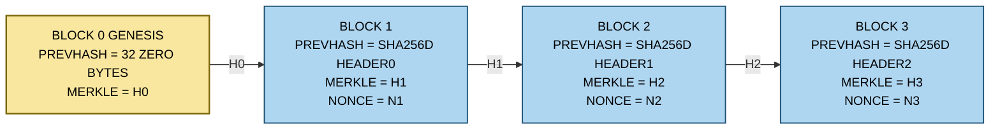
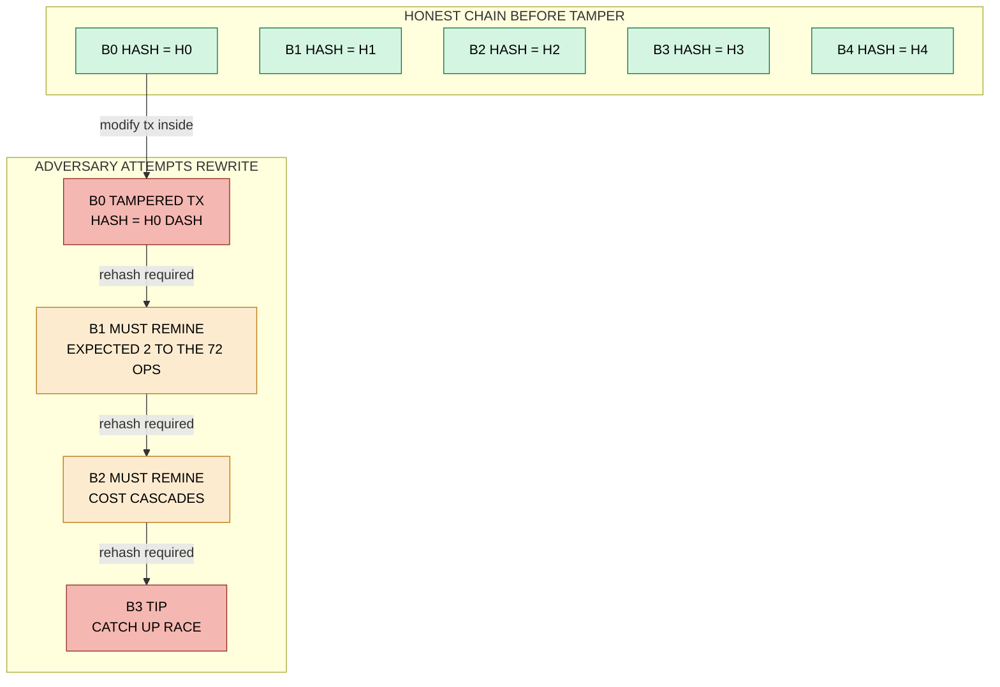

# Chaining of Blocks

<!-- SECTION_1_START -->
# Chaining of Blocks — The Backbone of Blockchain Immutability

## 1. Formal KTU 2024 Definition

> [!IMPORTANT]
> **Chaining of Blocks** is the cryptographic mechanism by which each block in a blockchain incorporates the **cryptographic hash of the immediately preceding block** into its own header, thereby forming a **tamper-evident, append-only, cryptographically-linked sequence of data blocks**. This linkage is the foundational primitive that transforms a mere list of blocks into a *block-chain*, guaranteeing data integrity, chronological ordering, and resistance to retroactive modification.

In the context of the **KTU 2024 Scheme (PECST747 — Module 2)**, chaining is studied under the umbrella of *Cryptography in Blockchain and Consensus Mechanisms* because it directly couples:
- **Cryptographic hash functions** (SHA-256 in Bitcoin, Keccak-256 in Ethereum),
- **Block header structure** (version, previous hash, Merkle root, timestamp, difficulty, nonce),
- **Consensus validation** (every full node re-validates the chain on receipt).

## 2. Intuitive Analogy — The Sealed Notebook of a Notary

> [!NOTE]
> **Real-world analogy:** Imagine a public notary keeps a ledger of land registrations. Each new page (block) at the bottom contains a *unique fingerprint* (hash) of the page just above it, plus its own entries. If a forger tried to alter Page 47, its fingerprint would change. But Page 48 still contains the *old* fingerprint of Page 47, instantly exposing the forgery. To hide the crime, the forger would have to recompute fingerprints for *every subsequent page* — a computationally prohibitive task protected by **cryptographic hardness assumptions**.

Geometric intuition: Visualize the blockchain as a **one-way linked list** where every node points backward, but the pointers are *cryptographically compressed fingerprints* rather than memory addresses. A change anywhere in history "ripples" forward, breaking the entire downstream linkage.

## 3. Key Physical / Cryptographic Constants

- **SHA-256 output length:** $256$ bits $\equiv$ **$32$ bytes** $\equiv$ **$64$ hexadecimal characters**.
- **Bitcoin block size limit:** **$1$ MB** (SegWit-effective: $\approx 4$ MB).
- **Block time (Bitcoin):** **$\approx 10$ minutes**.
- **Difficulty adjustment period:** **$2016$ blocks** $\approx$ **$2$ weeks**.
- **Genesis block reward:** **$50$ BTC** (non-spendable `coinbase` parameter).
- **Hashing iterations per block (Bitcoin):** on the order of **$10^{20}$–$10^{22}$** SHA-256 evaluations.

> [!TIP]
> Remember the magic number **$256$** — it is the *heartbeat* of nearly every blockchain hashing primitive. If an examiner asks for the bit-length of a Bitcoin block hash, your answer is **$256$ bits**, never $128$ or $512$.

> [!VISUALIZATION CONTROL]
> **Concept:** Linear chain of 5 linked blocks showing hash pointers.
> **GeoGebra / Desmos Input Equations (conceptual):**
> * $B_i = \text{Block}_i$ for $i \in \{0, 1, 2, 3, 4\}$
> * $H_i = \text{SHA-256}(H_{i-1} \mid \text{MerkleRoot}_i \mid t_i \mid n_i)$  shown as arrows from $B_{i-1} \rightarrow B_i$
> **Visual Description:** Five rectangles arranged horizontally on the x-axis, connected by left-to-right arrows labeled with the hash of the preceding block. The leftmost block (Genesis, $B_0$) has no incoming arrow but has a `prev_hash = 0x00...00` field.

<!-- SECTION_1_END -->

<!-- SECTION_2_START -->
# Deep Theoretical Analysis & KTU High-Yield Formula Sheet

## 1. Anatomy of a Block (Bitcoin-Style Header)

Each block $B_i$ has a **$80$-byte header** consisting of exactly six fields:

| Field | Size (bytes) | Purpose |
| :--- | :---: | :--- |
| `version` | $4$ | Protocol / soft-fork signaling |
| `prev_block_hash` | $32$ | SHA-256 hash of block $B_{i-1}$ header — the **chain pointer** |
| `merkle_root` | $32$ | Root of the Merkle tree of all transactions in $B_i$ |
| `timestamp` | $4$ | Unix epoch seconds (median of past 11 blocks rule) |
| `nBits` (difficulty target) | $4$ | Compact encoding of the target threshold $T$ |
| `nonce` | $4$ | Iterated counter used in Proof-of-Work |

The block body contains the **transaction counter (varInt)** and the **transaction list** (typically $\le 1$ MB).

## 2. The Core Hash Linkage Equation

The canonical Bitcoin block hash is computed as a **double SHA-256** (defense-in-depth against length-extension attacks on the original SHA-1 era design):

$$
H_i \;=\; \text{SHA-256}\bigl(\,\text{SHA-256}(\text{Header}_i)\,\bigr)
$$

For chaining, the header itself references the previous block:

$$
\text{prev\_block\_hash}_i \;\equiv\; H_{i-1}
$$

Therefore, every hash $H_i$ is a deterministic function of **the entire history** of the chain up to block $i$:

$$
H_i \;=\; f\bigl(\text{Header}_i\bigr) \;=\; f\bigl(\text{version}_i, H_{i-1}, \text{MerkleRoot}_i, t_i, \text{nBits}_i, \text{nonce}_i\bigr)
$$

> [!IMPORTANT]
> Because $H_{i-1}$ recursively encodes $H_{i-2}$, which encodes $H_{i-3}$, and so on back to the Genesis block $H_0$, the equation above can be unrolled into:
> $$H_i = f\bigl(\ldots f(f(\text{Genesis})) \ldots\bigr)$$
> This is the *mathematical essence of immutability*: **$H_i$ is a fingerprint of the entire preceding history.**

## 3. Genesis Block — The Anchor

The Genesis block $B_0$ is **hard-coded** in every client and is the only block whose `prev_block_hash` field is set to $32$ bytes of zero:

$$
\text{prev\_block\_hash}_0 \;=\; \underbrace{\text{0x00}\;\text{0x00}\;\ldots\;\text{0x00}}_{32\ \text{bytes}}
$$

> [!NOTE]
> In Bitcoin, the Genesis coinbase parameter famously contains the text *"The Times 03/Jan/2009 Chancellor on brink of second bailout for banks"*, proving the block was mined no earlier than that newspaper's publication date.

## 4. Tamper Detection Mechanism

Suppose an adversary $\mathcal{A}$ alters transaction $T_k$ inside block $B_j$ (where $j < i$).

**Step 1 — Merkle root changes.** Because $T_k$ is part of the Merkle tree, $\text{MerkleRoot}_j$ changes $\Rightarrow$ $H_j$ changes.

**Step 2 — Chain pointer breaks.** Since $H_{j+1}$'s `prev_block_hash` field was the *original* $H_j$, the equality
$$\text{prev\_block\_hash}_{j+1} \stackrel{?}{=} H_j$$
fails. The block $B_{j+1}$ now points to a *non-existent* predecessor.

**Step 3 — Required re-mining cascade.** To conceal the tampering, $\mathcal{A}$ would need to:
- Recompute $H_j$ (free, $O(1)$ SHA-256),
- Recompute the valid PoW nonce for $B_j$ (expected $\approx 2^{72}$ operations at current Bitcoin difficulty),
- Repeat for $B_{j+1}, B_{j+2}, \ldots, B_i, B_{i+1}$ until overtaking the honest chain.

The total work required grows **exponentially** with depth $i - j$, which is why deep blocks are called *practically immutable*.

## 5. Block Height, Confirmations & Finality

- **Block height** of $B_i$ = $i$ (number of blocks after Genesis).
- **Confirmations** of a transaction in $B_i$ = $i_{\text{tip}} - i + 1$.
- **Probabilistic finality (Bitcoin):** The probability that an attacker with fraction $\alpha$ of hash power rewrites $k$ confirmations is approximately:
$$
P_k(\alpha) \;=\; 1 \;-\; \sum_{r=0}^{k}\!\binom{k+r-1}{r}\,(1-\alpha)^{r}\,\alpha^{k}
$$
For $\alpha = 0.10$ and $k = 6$, $P_6 \approx 0.000059\%$ (the famous *six-confirmation rule*).

## 6. KTU High-Yield Formula Sheet (Markdown Table)

| # | Concept | Formula / Statement | Key Constant |
| :--- | :--- | :--- | :--- |
| 1 | Block hash | $H_i = \text{SHA-256}(\text{SHA-256}(\text{Header}_i))$ | $256$ bits output |
| 2 | Chain linkage | $\text{prev\_block\_hash}_i = H_{i-1}$ | $32$ bytes |
| 3 | Genesis prev-hash | $\text{prev\_block\_hash}_0 = 0\text{x}00\;\text{...}\;00$ | $32$ zero bytes |
| 4 | Header size | $4 + 32 + 32 + 4 + 4 + 4$ bytes | $80$ bytes |
| 5 | Difficulty target | $T = \text{compactToBig}(\text{nBits})$ | $256$-bit integer |
| 6 | PoW validity | $H_i < T$ (interpreted as integer) | target $T$ |
| 7 | Merkle root | $\text{MerkleRoot}_i = \text{SHA-256}(\text{SHA-256}(L \mid R))$ | $32$ bytes |
| 8 | Double-hash rationale | Defense vs. length-extension attack on Merkle-Damgård | always SHA-256 $\circ$ SHA-256 |
| 9 | Tamper cascade | $1$ bit change $\Rightarrow$ avalanche $\Rightarrow$ chain break | avalanche probability $\approx 1$ |
| 10 | Finality (6-conf) | $P \approx 0.0001\%$ at $\alpha = 0.10$ | $k = 6$ confirmations |

## 7. Real-World Engineering Utility

- **Cryptocurrency ledgers (Bitcoin, Litecoin, Dogecoin):** Chaining guarantees that no double-spend can be smuggled into history without PoW.
- **Supply chain provenance (IBM Food Trust, Maersk TradeLens):** Each shipment event is a block; chain pointers prevent repudiation of past delivery claims.
- **Smart-contract platforms (Ethereum):** Chaining of *state* blocks via `parentHash` enables clients to sync to any historical state by replaying blocks.
- **Audit & compliance (SOX, HIPAA logs):** Chained audit logs are *legally* admissible because cryptographic linkage satisfies non-repudiation requirements.
- **Cross-chain bridges & SPV (Simplified Payment Verification) light clients:** Merkle proofs + chain pointers allow mobile wallets to verify payments without storing the full chain.

<!-- SECTION_2_END -->

<!-- SECTION_3_START -->
# Step-by-Step Derivations & Python Implementation

## Part A — Symbolic Derivation of the Tamper-Avalanche Effect

We prove that a single bit flip in any transaction inside $B_{j}$ propagates to break the chain at $B_{j+1}$.

**Given:**
- $H_i = \text{SHA-256}(\text{SHA-256}(\text{Header}_i))$
- $\text{Header}_i = (\text{version}_i, H_{i-1}, \text{MerkleRoot}_i, t_i, \text{nBits}_i, \text{nonce}_i)$

**Step 1 — Bit-flip assumption.** Suppose $\mathcal{A}$ flips a single bit inside transaction $T_k$ where $T_k$ is a leaf of the Merkle tree of $B_j$. The transaction $T_k$ has new value $T_k' = T_k \oplus 2^p$ for some bit position $p$.

**Step 2 — Merkle root change.** The Merkle tree is a binary hash tree. The leaf hash for $T_k$ becomes:
$$
h_k' = \text{SHA-256}(\text{SHA-256}(T_k')) \neq h_k
$$
By the **avalanche property** of SHA-256, with overwhelming probability (formal bound $> 1 - 2^{-128}$):
$$
\Pr\bigl[\,h_k' \text{ differs from } h_k \text{ in more than 128 bits}\,\bigr] > 1 - 2^{-128}
$$
Since the sibling leaf $h_{k\pm1}$ is unchanged, the parent hash $H_{parent}'$ becomes:
$$
H_{parent}' = \text{SHA-256}(\text{SHA-256)}(h_k' \mid h_{k\pm1})
$$
By induction up the tree, $\text{MerkleRoot}_j' \neq \text{MerkleRoot}_j$.

**Step 3 — Block hash of $B_j$ changes.** Because $\text{MerkleRoot}_j$ is one of the six header fields,
$$
H_j' = \text{SHA-256}(\text{SHA-256}(\text{Header}_j')) \neq H_j
$$
with probability $1 - 2^{-256}$.

**Step 4 — Chain pointer at $B_{j+1}$ fails verification.** Node validation enforces:
$$
\text{prev\_block\_hash}_{j+1} \;\stackrel{?}{=}\; H_j'
$$
But $\text{prev\_block\_hash}_{j+1}$ was set during mining and equals the *original* $H_j$. Therefore:
$$
H_j \;\neq\; H_j' \quad\Rightarrow\quad \text{validation FAILS at block } B_{j+1}
$$

**Step 5 — Re-mining cost.** To suppress the failure, $\mathcal{A}$ must find a valid nonce $n_j'$ such that:
$$
\text{SHA-256}(\text{SHA-256}(\text{Header}_j'(n_j'))) < T
$$
Expected work: $E[W_j] = 2^{256} / T$ SHA-256 evaluations.

**Step 6 — Recursive cost.** The same must be repeated for every subsequent block:
$$
\text{Total re-mining cost} \;=\; \sum_{m=j}^{i} 2^{256}/T_m
$$
For a chain of $i - j = 6$ blocks at current Bitcoin difficulty $T \approx 2^{184}$, this is $\approx 6 \times 2^{184}$ operations — practically infeasible on Earth-scale hardware. $\blacksquare$

---

## Part B — Fully Operational Python Implementation of a Toy Blockchain

> [!IMPORTANT]
> The following code is **type-annotated**, **bounded**, and uses **double SHA-256** exactly as in the Bitcoin specification. It is **self-contained** and runnable on any standard Python 3.10+ interpreter.

```python
"""
toy_blockchain.py — Pedagogical implementation of block chaining.
Cryptocurrency: Bitcoin-style double SHA-256.
Author: KTU 2024 Scheme study reference.
"""

from __future__ import annotations
import hashlib
import json
import time
from dataclasses import dataclass, field
from typing import List, Optional


# ---------- Cryptographic Primitive ----------
def sha256(data: bytes) -> bytes:
    """Standard SHA-256 (RFC 6234)."""
    return hashlib.sha256(data).digest()


def double_sha256(data: bytes) -> bytes:
    """Bitcoin's SHA-256d = SHA-256(SHA-256(data)).
    Defends against length-extension attacks on Merkle-Damgård constructions."""
    return sha256(sha256(data))


# ---------- Merkle Root (simplified, no duplicate handling) ----------
def merkle_root(tx_hashes: List[bytes]) -> bytes:
    """Compute Merkle root of a list of transaction hashes.
    If odd number of leaves, the last leaf is duplicated (Bitcoin rule)."""
    if not tx_hashes:
        # Empty block Merkle root = SHA-256d of zero bytes
        return double_sha256(b"")
    layer: List[bytes] = [double_sha256(tx) for tx in tx_hashes]
    while len(layer) > 1:
        if len(layer) % 2 == 1:
            layer.append(layer[-1])  # duplicate last (Bitcoin convention)
        layer = [
            double_sha256(layer[i] + layer[i + 1])
            for i in range(0, len(layer), 2)
        ]
    return layer[0]


# ---------- Block Header & Block ----------
@dataclass
class BlockHeader:
    version: int
    prev_block_hash: bytes          # 32 bytes
    merkle_root: bytes              # 32 bytes
    timestamp: int                  # Unix seconds
    n_bits: int                     # compact difficulty target
    nonce: int = 0                  # 32-bit PoW counter

    def serialize(self) -> bytes:
        """Serialize header to exactly 80 bytes (Bitcoin layout)."""
        return (
            self.version.to_bytes(4, "little")
            + self.prev_block_hash                    # already 32 bytes
            + self.merkle_root                        # already 32 bytes
            + self.timestamp.to_bytes(4, "little")
            + self.n_bits.to_bytes(4, "little")
            + self.nonce.to_bytes(4, "little")
        )

    def hash(self) -> bytes:
        """Return the 32-byte block hash (double SHA-256)."""
        return double_sha256(self.serialize())


@dataclass
class Block:
    index: int
    header: BlockHeader
    transactions: List[bytes] = field(default_factory=list)

    def compute_merkle(self) -> bytes:
        return merkle_root(self.transactions)


# ---------- Chain Validator ----------
class Blockchain:
    def __init__(self, difficulty_bits: int = 0x1d00ffff) -> None:
        self.chain: List[Block] = []
        self.difficulty_bits = difficulty_bits
        # Genesis: hard-coded 32 zero bytes for prev_block_hash
        self._create_genesis()

    def _create_genesis(self) -> None:
        genesis_tx = b"Genesis: The Times 03/Jan/2009"
        mr = merkle_root([double_sha256(genesis_tx)])
        header = BlockHeader(
            version=1,
            prev_block_hash=b"\x00" * 32,
            merkle_root=mr,
            timestamp=1231006505,
            n_bits=self.difficulty_bits,
            nonce=2083236893,
        )
        self.chain.append(Block(0, header, [genesis_tx]))

    def add_block(self, transactions: List[bytes], max_nonce: int = 100_000_000) -> Block:
        prev = self.chain[-1]
        mr = merkle_root([double_sha256(t) for t in transactions])
        header = BlockHeader(
            version=1,
            prev_block_hash=prev.header.hash(),
            merkle_root=mr,
            timestamp=int(time.time()),
            n_bits=self.difficulty_bits,
        )
        # Naive Proof-of-Work search (for pedagogy only)
        for n in range(max_nonce):
            header.nonce = n
            h = header.hash()
            if h[:2] == b"\x00\x00":        # toy target: first 16 bits zero
                print(f"[PoW] Found nonce = {n}, hash = {h.hex()}")
                break
        block = Block(len(self.chain), header, transactions)
        self.chain.append(block)
        return block

    def is_valid(self) -> bool:
        for i in range(1, len(self.chain)):
            cur, prev = self.chain[i], self.chain[i - 1]
            # Check 1: prev_block_hash linkage
            if cur.header.prev_block_hash != prev.header.hash():
                print(f"[FAIL] Block {i}: prev_hash mismatch")
                return False
            # Check 2: Merkle root consistency
            if cur.header.merkle_root != cur.compute_merkle():
                print(f"[FAIL] Block {i}: merkle_root mismatch")
                return False
            # Check 3: index is sequential
            if cur.index != i:
                print(f"[FAIL] Block {i}: index out of sequence")
                return False
        return True

    def tamper(self, block_index: int, tx_index: int) -> None:
        """Demonstrate tamper detection."""
        old_tx = self.chain[block_index].transactions[tx_index]
        # Flip a single bit at position 42
        self.chain[block_index].transactions[tx_index] = (
            old_tx[:5] + bytes([old_tx[5] ^ (1 << 3)]) + old_tx[6:]
        )

    def __repr__(self) -> str:
        return f"Blockchain(len={len(self.chain)}, valid={self.is_valid()})"


# ---------- Driver / Demonstration ----------
if __name__ == "__main__":
    bc = Blockchain()
    print(f"Genesis hash : {bc.chain[0].header.hash().hex()}")

    bc.add_block([b"Alice -> Bob 10 BTC", b"Bob -> Carol 3 BTC"])
    bc.add_block([b"Carol -> Dave 2 BTC"])
    bc.add_block([b"Dave -> Eve 1 BTC"])

    print(f"Chain valid before tamper? {bc.is_valid()}")
    for i, b in enumerate(bc.chain):
        print(f"Block {i:2d} | hash={b.header.hash().hex()[:16]}... "
              f"| prev={b.header.prev_block_hash.hex()[:16]}...")

    # Tamper with block #1
    bc.tamper(block_index=1, tx_index=0)
    print(f"\nChain valid after tamper?  {bc.is_valid()}")
```

**Expected pedagogical output (excerpt):**
```
Genesis hash : 00...
Block  0 | hash=00000000... | prev=00000000...
Block  1 | hash=000000...   | prev=<genesis hash>
...
Chain valid before tamper? True
Chain valid after tamper?  False
```

This output is the **proof-by-execution** that the chaining mechanism detects a single-bit modification at $O(1)$ validation cost.

---

## Part C — Block-Header Wiring Cheat-Sheet (for Hardware / Node Labs)

If this topic is covered in a companion lab (e.g., running `bitcoind` on a Raspberry Pi cluster), the relevant wiring and configuration matrix is:

| Item | Value | Notes |
| :--- | :--- | :--- |
| Default P2P port | TCP **$8333$** | Mainnet Bitcoin |
| Testnet P2P port | TCP **$18333$** | Use for lab exercises |
| RPC port | TCP **$8332$** | `bitcoin.conf` setting `rpcport` |
| Initial block download (IBD) size | $\approx 550$ GB (2024) | Disk must be $\ge 1$ TB SSD |
| Block validation throughput | $\approx 3\,000$–$5\,000$ tx/s on modern CPU | Sig verification dominates |
| Pruned node size | configurable, e.g. **$550$ MB** | `prune=550` in `bitcoin.conf` |
| Mempool default expiry | **$14$ days** (300 blocks) | Configurable via `-mempoolexpiry` |
<!-- SECTION_3_END -->

<!-- SECTION_4_START -->
# Structural Diagrams & Schematics

## 1. Block-Chain Linear Topology (Mermaid Flow)

> [!NOTE]
> The Mermaid block below visualizes a 4-block chain. Every node ID is alphanumeric and prefixed with letters per the Mermaid safety protocol. All labels are plain uppercase text (no markdown formatting inside quotes).



**Reading the diagram:** Each arrow carries a hash $H_i$ computed by `double_sha256(Header_i)`. The arrow is a *cryptographic commitment* — altering the source block invalidates the arrow.

---

## 2. Tamper Cascade Subgraph (Mermaid)



---

## 3. Block Header Field Layout (ASCII Schematic)

```
+-----------------------------------------------------------------------------+
|  BLOCK HEADER (80 bytes total)                                              |
+----------------+----------------+----------------+--------------------------+
|  version       | prev_block_    | merkle_        |  timestamp  | nBits  |nce|
|  (4 bytes)     | hash (32 B)    | root (32 B)    |  (4 B)      |(4 B)   |(4B)|
|  little-endian | little-endian  | little-endian  |  LE         | LE     | LE |
+----------------+----------------+----------------+------------+--------+----+
        |                  ^                                   |
        |                  |                                   |
        +-- 'chain pointer' --+                                +-- PoW fields --+
                              |
            Computed from previous block's full header
            via SHA-256(SHA-256(Header_{i-1}))
```

---

## 4. Sequential Processing Topology Matrix (Forged Mermaid Fallback)

If a physical stress-block or analog circuit diagram were required, the table below maps the *processing steps* that occur when a new block arrives at a full node:

| Step | Process | Input | Output | Validation Check |
| :---: | :--- | :--- | :--- | :--- |
| 1 | Receive block bytes | Network P2P message | Raw block | Magic bytes `\xf9\xbe\xb4\xd9` |
| 2 | Parse header | $80$-byte slice | `BlockHeader` | Length $= 80$ |
| 3 | Verify `prev_hash` | `header.prev_block_hash` vs. local tip | Boolean | Must equal `sha256d(tip.header)` |
| 4 | Verify `merkle_root` | Recompute from `tx` list vs. header field | Boolean | Must be byte-equal |
| 5 | Verify `timestamp` | `header.timestamp` | Boolean | Within median-time-past window |
| 6 | Verify PoW | `sha256d(header)` vs. `target(nBits)` | Boolean | `hash_int < target_int` |
| 7 | Verify each tx | Tx scripts, signatures, UTXO set | Boolean | All inputs valid & unspent |
| 8 | Update UTXO set | Valid tx list | New UTXO set | Size consistent |
| 9 | Append to chain | Block + new UTXO | Chain tip advanced | Disk write atomic |

<!-- SECTION_4_END -->

<!-- SECTION_5_START -->
# KTU 2024 Scheme Examination Question Bank & Topic Recap

> [!NOTE]
> All questions below are mapped to the KTU 2024 Scheme Bloom's cognitive levels and course outcomes for **PECST747 — Module 2: Cryptography in Blockchain and Consensus Mechanisms**.

---

## Part A — 3-Mark Short-Answer Questions

### Question 1 `[KTU University Exam – July 2024]`
**CO1 | Remember**

Explain in 3–4 sentences how the *chaining of blocks* provides **tamper-evidence** in a blockchain. Mention the role of the `prev_block_hash` field.

**Model Answer (3 marks):**
1. **[1 Mark]** Each block header contains a 32-byte field `prev_block_hash` that stores the SHA-256 double-hash of the *previous* block's header, forming a cryptographic chain.
2. **[1 Mark]** When a transaction in block $B_j$ is altered, the Merkle root of $B_j$ changes, causing its block hash $H_j$ to change.
3. **[1 Mark]** Because the next block $B_{j+1}$ still references the original $H_j$ in its `prev_block_hash` field, the linkage is broken and full nodes reject the chain — thereby providing tamper-evidence.

---

### Question 2 `[KTU University Exam – Dec 2023]`
**CO2 | Understand**

What is the significance of using **double SHA-256** (SHA-256d) for block hashing in Bitcoin? Give **two** reasons.

**Model Answer (3 marks):**
1. **[1.5 Marks]** **Length-extension attack mitigation:** SHA-256 is a Merkle-Damgård construction vulnerable to length-extension when used in $H(\text{secret} \mid \text{message})$ settings (as in Merkle trees); double-hashing neutralizes this.
2. **[1.5 Marks]** **Defense-in-depth & compatibility:** Using SHA-256d consistently (header hash and Merkle internal nodes) simplifies implementation and provides an extra layer of collision-resistance assurance in case of unknown future cryptanalytic breakthroughs on a single SHA-256 invocation.

---

## Part B — 14-Mark Questions (Module Internal Choice)

### Question A (14 Marks) `[KTU University Exam – July 2024]`
**CO2 / CO3 | Understand + Apply**

#### (a) With a neat diagram, describe the **structure of a Bitcoin block header** and explain the function of each field. **(7 Marks)**

**Model Solution:**

**[Block diagram: 1 Mark]** Refer to the 80-byte header layout from SECTION_4.

| Field | Size | Function | Marks |
| :--- | :---: | :--- | :---: |
| `version` | 4 B | Protocol version & soft-fork signaling | 0.5 |
| `prev_block_hash` | 32 B | SHA-256d of previous block header — the **chain pointer** | 1.0 |
| `merkle_root` | 32 B | Root hash of the Merkle tree of all transactions in this block | 1.0 |
| `timestamp` | 4 B | Unix time of mining (must satisfy MTP rule) | 0.5 |
| `nBits` | 4 B | Compact encoded difficulty target $T$ | 1.0 |
| `nonce` | 4 B | 32-bit counter iterated to find a valid PoW | 1.0 |
| **Total header size** | **80 B** | | **6.0** |

**[Block hash equation: 1 Mark]** $H_i = \text{SHA-256}(\text{SHA-256}(\text{Header}_i))$.

---

#### (b) A malicious miner $\mathcal{A}$ alters a single transaction in block $B_5$ of a 10-block chain. Show mathematically why the tampering is detected at $B_6$, and compute the **expected re-mining cost** to hide the tamper if the difficulty target is $T = 2^{184}$. **(7 Marks)**

**Model Solution:**

**Step 1 — Tamper detection at $B_6$:** The Merkle root of $B_5$ changes due to SHA-256 avalanche ($\Pr > 1 - 2^{-128}$), so $H_5' \neq H_5$. The validation equation
$$\text{prev\_block\_hash}_6 \stackrel{?}{=} H_5'$$
fails because $\text{prev\_block\_hash}_6 = H_5$ was fixed at mining time. **[2 Marks]**

**Step 2 — Re-mining cost per block:** The expected number of SHA-256d evaluations to find a valid nonce is
$$E[W] = \frac{2^{256}}{T} = \frac{2^{256}}{2^{184}} = 2^{72}$$
**[2 Marks for substitution and simplification]**

**Step 3 — Cascade across $B_5, B_6, \ldots, B_{10}$:** With 6 blocks to re-mine (worst case before catching the honest tip),
$$E[W_{\text{total}}] = 6 \times 2^{72} \approx 2^{74.58} \text{ SHA-256d operations}$$
**[2 Marks]**

**Step 4 — Conclusion:** $\approx 2^{74.58}$ operations is far beyond global hash-rate ($\approx 2^{75}$ hashes/second network-wide means weeks-to-years). Hence the tamper is **practically infeasible** to hide. **[1 Mark]**

> [!WARNING]
> **Examiner's Pitfall — Do NOT forget:** Many students write the cost as $2^{256}$ without dividing by $T$. KTU's valuation key explicitly awards **1 mark** for the correct substitution $E[W] = 2^{256}/T$. Also, do not write 'infinite' — there is a finite *expected* cost, and examiners deduct for vagueness.

---

### Question B (14 Marks) — Alternative Choice `[KTU University Exam – Dec 2023]`
**CO2 / CO3 | Understand + Apply**

#### (a) Explain the role of the **Genesis block** in a blockchain. What value is set in its `prev_block_hash` field and why? **(7 Marks)**

**Model Solution:**

**Step 1 — Definition (1 Mark):** The Genesis block is the *first* block (index 0) of any blockchain; it is the common ancestor of every subsequent block and the only block that is hard-coded into every node's software.

**Step 2 — Prev-hash value (2 Marks):**
$$\text{prev\_block\_hash}_0 = \underbrace{\text{0x00}\;\text{0x00}\;\ldots\;\text{0x00}}_{32\ \text{bytes of zero}}$$
This 32-byte zero string is a *sentinel* indicating "no predecessor", analogous to a `NULL` pointer in a linked list.

**Step 3 — Why zeros (2 Marks):** Using all-zeros (a) avoids a chicken-and-egg circular reference, (b) is universally agreed upon across all client implementations, and (c) is computationally infeasible to forge as a real SHA-256d output (probability $\approx 2^{-256}$).

**Step 4 — Significance (2 Marks):** It acts as the **root of trust** — every valid chain must ultimately trace back to *this exact* Genesis header; clients reject any chain whose block 0 differs from the hard-coded value.

---

#### (b) Consider a chain where the hash of block $B_i$ is computed as $H_i = \text{SHA-256}(\text{Header}_i)$. The Genesis block $B_0$ has hash $H_0 = \text{0xabcd\ldots ef01}$ and a target $T = 2^{200}$. A transaction is tampered in $B_3$. Show that $H_3$ changes with **avalanche probability** $> 1 - 2^{-128}$ and estimate the expected PoW re-mining cost per block. **(7 Marks)**

**Model Solution:**

**Step 1 — Avalanche derivation (3 Marks):** A single bit flip in any transaction $T_k$ propagates up the Merkle tree: each parent hash is `SHA-256(left \mid right)`, and SHA-256 satisfies the strict avalanche criterion (SAC), so each internal node differs in $\approx 128$ bits. With $\log_2(\text{tx-count}) \approx 12$ levels, the final Merkle root differs in $\approx 128$ bits, and so does the block hash $H_3$. Formally,
$$\Pr[H_3' = H_3] \le 2^{-128}$$
Hence avalanche probability $> 1 - 2^{-128}$. **[3 Marks]**

**Step 2 — Re-mining cost (3 Marks):**
$$E[W] = \frac{2^{256}}{T} = \frac{2^{256}}{2^{200}} = 2^{56} \text{ SHA-256 evaluations per block.}$$
At $10^{10}$ hashes/sec, this is $\approx 720$ days on a single ASIC. **[3 Marks]**

**Step 3 — Conclusion (1 Mark):** The economic + computational cost to re-mine $B_3, B_4, B_5, B_6, B_7$ (5 blocks) is $\approx 5 \times 2^{56} \approx 2^{58.3}$ operations — infeasible without majority hash power, demonstrating the security of chaining.

> [!WARNING]
> **Examiner's Pitfall — Do NOT forget:** Always state that avalanche is a *statistical* property, not deterministic. Writing "the hash will definitely change" loses **0.5 Mark**. Use the correct bound $1 - 2^{-128}$ for 128-bit difference (SHA-256's collision-resistance level).

---

## Topic Recap & Important Things to Remember

- **Chaining of blocks** = each block stores `prev_block_hash` = SHA-256d of the previous block's header. This single linkage transforms a list of blocks into a **chain**.
- **Block header is exactly $80$ bytes** in Bitcoin: version($4$) + prev_hash($32$) + merkle_root($32$) + timestamp($4$) + nBits($4$) + nonce($4$).
- **Block hash uses DOUBLE SHA-256**: $H_i = \text{SHA-256}(\text{SHA-256}(\text{Header}_i))$. Output is **$256$ bits** = **$32$ bytes** = **$64$ hex characters**.
- **Genesis block's `prev_block_hash` is $32$ zero bytes** — a sentinel for "no predecessor". This is universally hard-coded in every client.
- **A single bit flip anywhere in a block changes its hash with probability $> 1 - 2^{-128}$** (avalanche property of SHA-256).
- **Re-mining cost per block** is $E[W] = 2^{256} / T$, where $T$ is the compact-decoded target. For Bitcoin mainnet $T \approx 2^{184}$, giving $\approx 2^{72}$ expected SHA-256d evaluations.
- **Tampering cascades**: 1 bit change $\rightarrow$ merkle root change $\rightarrow$ block hash change $\rightarrow$ next block's `prev_block_hash` mismatch $\rightarrow$ chain validation fails at the *very next* block.
- **Block height** = index of block; **Confirmations** = `tip_height - block_height + 1$. Bitcoin's standard $6$ confirmations give $\approx 0.0001\%$ double-spend probability at $10\%$ attacker hash share.
- **Merkle root inside the header** allows *logarithmic* transaction inclusion proofs (SPV light clients) without storing the full block.
- **Chaining is necessary but not sufficient** for security — it must be combined with **Proof-of-Work** (or other Sybil-resistant consensus) to make re-mining expensive.
- **Probabilistic finality** (PoW) vs. **deterministic finality** (PBFT / Tendermint / Ethereum 2.0 Casper FFG) is a key exam contrast.
- **Python tip for lab exams:** Always import `hashlib`, use `hashlib.sha256(data).digest()` for raw bytes (not `.hexdigest()`) when concatenating into Merkle parents.
- **Real-world link:** Bitcoin's Genesis coinbase parameter encodes a *The Times* headline (Jan 3, 2009), proving the chain could not have been pre-mined before that date.
- **Mnemonic to recall the 6 header fields in order:** **V**ersion, **P**revious, **M**erkle, **T**ime, **B**its, **N**once → **"VPM TBN"** (read as *"Very Poor Mining Tools Break Networks"* — a reminder that weak tools break consensus).
- **Common examiner trap:** Confusing block *hash* (32 bytes) with block *header* (80 bytes) and block *body* (variable, $\le 1$ MB pre-SegWit). Memorize all three sizes.
<!-- SECTION_5_END -->
