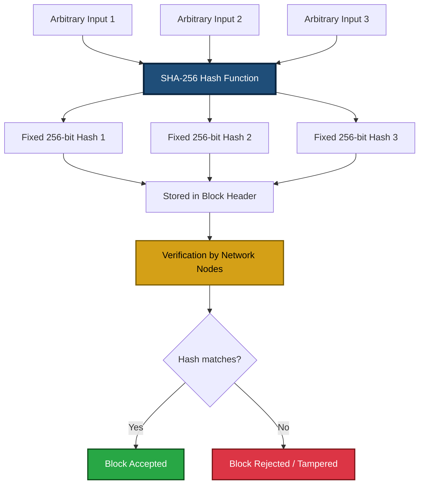
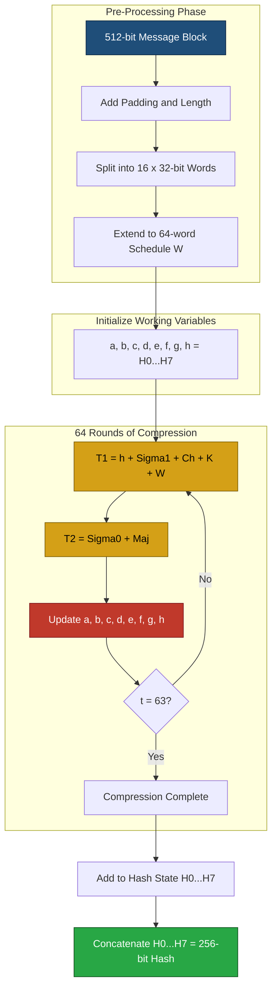
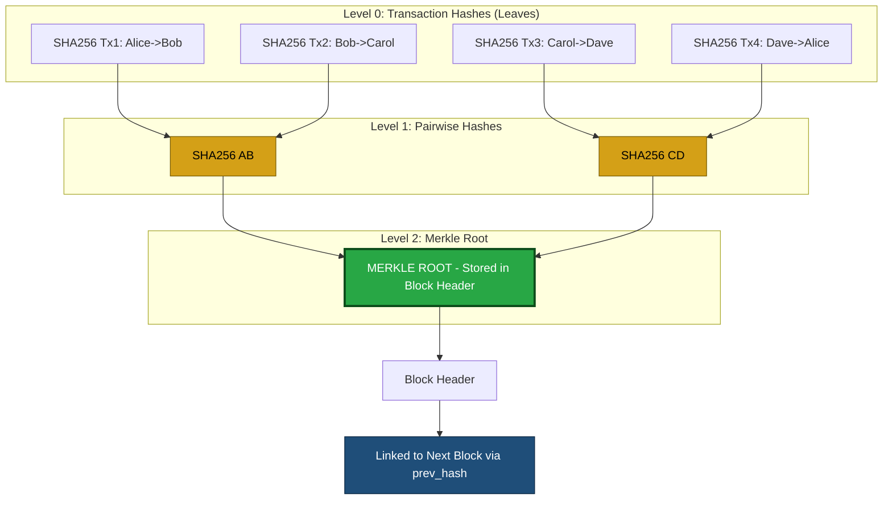
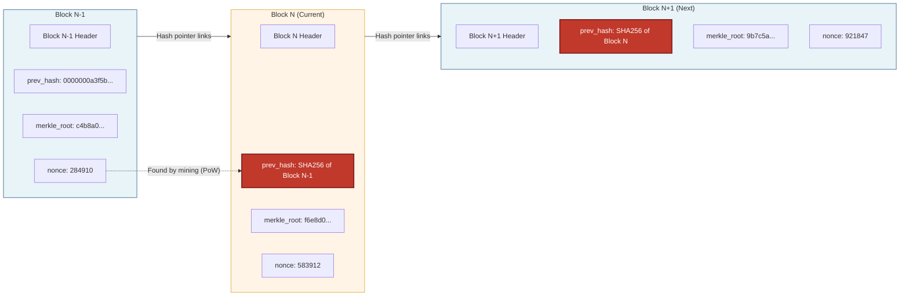
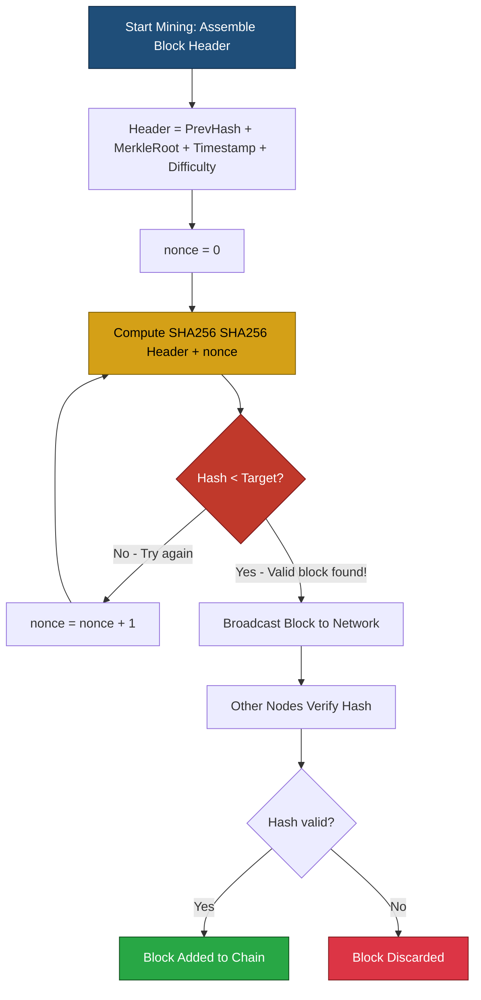

# Concept of Hashing

<!-- SECTION_1_START -->

# Concept of Hashing

## 1.1 Formal Academic Definition

> [!NOTE]
> **Cryptographic Hash Function (KTU 2024 Syllabus Definition):**
> A cryptographic hash function $H$ is a deterministic mathematical algorithm that accepts an input message $m$ of **arbitrary finite length** and returns a fixed-size bit string $h$ of length $n$ bits, called the **message digest**, **hash value**, or simply the **hash**, such that $h = H(m)$, where the function satisfies a specific set of security properties essential for blockchain consensus.

In formal mathematical notation, a hash function is a mapping:

$$H : \{0,1\}^* \rightarrow \{0,1\}^n$$

where $\{0,1\}^*$ denotes the set of all binary strings of any length, and $\{0,1\}^n$ is the set of all binary strings of length exactly $n$ bits.

For blockchain applications, the standard fixed output length is **$n = 256$ bits** (for SHA-256), which yields $2^{256}$ possible output values — a number so astronomically large that it forms the bedrock of Bitcoin's mining security.

## 1.2 Conceptual Analogy — Plain English Intuition

> [!IMPORTANT]
> **The Digital Fingerprint Analogy:**
> Imagine a magical blender in a kitchen. You can drop *any* ingredient into it — a single grain of rice, a whole watermelon, or a truckload of vegetables — and the blender will always produce exactly **one small, identical-sized cup of green juice**. The juice looks completely different depending on what you put in: change even one grain of rice, and the juice colour, smell, and taste all transform completely. You can never reverse-engineer the original ingredients from the juice, and the probability of two different ingredient combinations producing the *same exact* juice is virtually zero.

This is precisely what a cryptographic hash function does:
- **Input (any size)** $\rightarrow$ **Hash function (the blender)** $\rightarrow$ **Fixed-length output (the unique cup of juice)**

Real-world examples to cement the intuition:
- **Blockchain blocks** are "fingerprinted" so that tampering with even a single transaction completely changes the block's hash.
- **Password storage**: websites never store your password; they store the hash. When you log in, they hash what you type and compare.
- **Git version control**: every commit is hashed, so any code change is immediately detectable.
- **Bitcoin addresses**: derived by repeatedly hashing the public key with **SHA-256** and **RIPEMD-160**.

## 1.3 Physical Constants and Standard Metrics

> [!IMPORTANT]
> **Critical Constants to Memorize for KTU Exams:**
> - **SHA-256 Output Length:** $\mathbf{n = 256}$ **bits** (32 bytes, 64 hexadecimal characters)
> - **SHA-256 Block Size:** $\mathbf{512}$ **bits** (the message is processed in 512-bit chunks)
> - **Number of Rounds in SHA-256:** $\mathbf{64}$ compression rounds per block
> - **SHA-256 Initial Hash Values:** $H_0$ to $H_7$ (the first 32 bits of fractional parts of square roots of the first 8 primes: 2, 3, 5, 7, 11, 13, 17, 19)
> - **SHA-256 Round Constants:** $K[0]$ to $K[63]$ (first 32 bits of fractional parts of cube roots of the first 64 primes)
> - **Bitcoin Mining Target:** a 256-bit number that the mined block hash must be less than (typically requiring a specific number of leading zero bits)
> - **Birthday Bound for Collision:** approximately $\mathbf{2^{128}}$ trials for SHA-256 (derived from the **Birthday Paradox**)

## 1.4 Visual Representation of the Hashing Concept

> [!VISUALIZATION CONTROL]
> **Concept:** The Avalanche Effect — Visualizing How a One-Bit Input Change Drastically Alters the Output
> **GeoGebra / Desmos Input Equations:**
> * Plot 1 — `Input_Bit_Flipped = {0, 1, 2, 3, 4, 5, 6, 7}` (x-axis: bit position flipped; y-axis: number of output bits that changed)
> * Plot 2 — `Ideal_Avalanche = 128` (horizontal line representing the expected ~50% of 256 bits changing for SHA-256)
> **Visual Description:** Imagine a horizontal line at y = 128. For each of the 8 input bit positions flipped (one at a time), a vertical bar is plotted showing how many of the 256 output bits changed. The student should observe that every bar hovers tightly around the y = 128 line — meaning that flipping a *single bit* in the input changes approximately **half** of the output bits, demonstrating the strict avalanche effect of SHA-256.

---

<!-- SECTION_1_END -->

<!-- SECTION_2_START -->

# Deep Theoretical Analysis & KTU High-Yield Formula Sheet

## 2.1 The Six Security Properties of Cryptographic Hash Functions

A hash function is considered *cryptographically secure* only if it satisfies the following six properties simultaneously. KTU examiners frequently ask students to list and explain these.

### Property 1 — Determinism
A given input message $m$ **must always** produce the same hash value $h$, every single time, on any machine, in any country, under any operating system. There is no randomness in the output.

$$H(m_1) = h_1 \quad \text{and} \quad H(m_1) = h_1 \quad \text{(always, forever, on every device)}$$

### Property 2 — Quick Computation (Efficiency)
The hash value $h$ should be computed **very fast** for any given input $m$. SHA-256 can hash a typical block in microseconds, which is essential for blockchain throughput (Bitcoin processes roughly 7 transactions per second because each block is hashed efficiently).

### Property 3 — Pre-image Resistance (One-Way Property)
Given a hash value $h$, it must be **computationally infeasible** to find the original input $m$ such that $H(m) = h$. This is the foundation of password security and Bitcoin mining.

$$\text{Given } h, \text{ finding } m \text{ such that } H(m) = h \text{ requires} \approx 2^n \text{ trials for an } n\text{-bit hash}$$

For SHA-256 ($n = 256$), this is $\approx 2^{256}$ operations — a number larger than the estimated number of atoms in the observable universe ($\approx 2^{265}$).

### Property 4 — Second Pre-image Resistance
Given an input $m_1$, it must be **computationally infeasible** to find a *different* input $m_2 \neq m_1$ such that $H(m_1) = H(m_2)$.

$$\text{Given } m_1, \text{ finding } m_2 \neq m_1 \text{ with } H(m_1) = H(m_2) \text{ requires} \approx 2^n \text{ trials}$$

### Property 5 — Collision Resistance
It must be **computationally infeasible** to find *any two distinct inputs* $m_1 \neq m_2$ such that $H(m_1) = H(m_2)$. This is a *stronger* property than second pre-image resistance because the attacker can choose *both* inputs freely.

By the **Birthday Paradox**, the expected number of trials to find a collision is:

$$\text{Expected trials} \approx 1.177 \times 2^{n/2}$$

For SHA-256, this is $\approx 2^{128}$ — still computationally infeasible with current technology.

### Property 6 — Avalanche Effect (Strict Avalanche Criterion)
A tiny change in the input — flipping even a **single bit** — should cause approximately **half** of the output bits to flip. This is formalized as the **Strict Avalanche Criterion (SAC)**.

> [!IMPORTANT]
> **KTU High-Yield Fact:** If changing one bit of input changes fewer than $\mathbf{n/2}$ output bits, the hash function is considered *broken* and unfit for cryptographic use. The classic example is the SHA-1 attack where researchers produced two different PDF files with the same SHA-1 hash — a catastrophic failure of collision resistance.

## 2.2 High-Yield Formula Sheet

| **Concept** | **Formula / Definition** | **Typical Value for SHA-256** | **Engineering Significance** |
|---|---|---|---|
| Hash Function Mapping | $H : \{0,1\}^* \rightarrow \{0,1\}^n$ | $n = 256$ bits | Defines the output space size |
| Output Length | $n$ bits | $256$ bits = 32 bytes = 64 hex chars | Fixed regardless of input length |
| Block Size | $B$ bits | $512$ bits | Input is padded and split into $B$-bit blocks |
| Pre-image Search Complexity | $O(2^n)$ | $2^{256}$ | Infeasible with current hardware |
| Collision Search Complexity (Birthday) | $O(2^{n/2})$ | $2^{128}$ | Basis for digital signature trust |
| Number of Rounds | $r$ | $64$ | Each round mixes input bits nonlinearly |
| Padding | $1 \parallel 0^k \parallel \text{length}$ | $k$ zeros + 64-bit length | Ensures input is a multiple of 512 |
| Initial Hash Values | $H_i^{(0)} = \text{frac}(\sqrt{p_i})$ for first 8 primes | 8 words × 32 bits | Seed for compression loop |
| Round Constants | $K_j = \text{frac}(\sqrt[3]{q_j})$ for first 64 primes | 64 words × 32 bits | Inject non-linearity each round |
| Bitcoin Difficulty Target | $\text{hash} < \text{target}$ | ~19 leading zero bits (2024) | Governs mining time $\approx 10$ min |
| Merkle Tree Height | $\log_2(N)$ for $N$ transactions | $\log_2(2000) \approx 11$ | Efficient proof of inclusion |

## 2.3 Real-World Engineering Utility

> [!IMPORTANT]
> **Where Hashing is Used in Production Systems (Critical for KTU viva/practical exams):**
> 1. **Block Identification:** Each block in Bitcoin contains the SHA-256 hash of the previous block's header, forming an **immutable chain**. If a single byte in Block #500,000 is altered, the hash of Block #500,001 will be wrong, and the chain is broken — instantly detectable by all full nodes.
> 2. **Proof of Work (PoW):** Miners iterate a **nonce** value until the SHA-256 hash of the block header is below a target threshold. The expected work is $2^d$ where $d$ is the number of required leading zero bits.
> 3. **Merkle Trees:** Transactions are pairwise hashed up the tree, producing a single **Merkle Root** stored in the block header. This enables **Simplified Payment Verification (SPV)** with $O(\log N)$ proof size.
> 4. **Address Generation:** Bitcoin addresses are computed as: `Base58Check(RIPEMD-160(SHA-256(public_key)))` with a checksum prepended. This compresses a 256-bit public key into a 160-bit address.
> 5. **Digital Signatures:** The ECDSA algorithm in Bitcoin signs the **SHA-256 hash** of the transaction, not the transaction itself — improving both security and performance.
> 6. **HMAC (Hash-based Message Authentication Codes):** Used in API authentication, JWT tokens, and TLS handshakes.

## 2.4 Popular Hash Function Families (Comparative Table)

| **Hash Function** | **Output Size** | **Block Size** | **Status (2024)** | **Blockchain Use** |
|---|---|---|---|---|
| **MD5** | 128 bits | 512 bits | **BROKEN** (collisions found in 2004) | None in modern systems |
| **SHA-1** | 160 bits | 512 bits | **BROKEN** (SHAttered attack, 2017) | Deprecated |
| **SHA-256** | 256 bits | 512 bits | **Secure** | Bitcoin, Bitcoin Cash, Litecoin (partial) |
| **SHA-3 (Keccak-256)** | 256 bits | 1088 bits (rate) | **Secure** | Ethereum (Keccak-256 variant), Polkadot |
| **RIPEMD-160** | 160 bits | 512 bits | **Secure** | Bitcoin address generation |
| **BLAKE2** | Up to 512 bits | Variable | **Secure & Fast** | Zcash, Polkadot, Argon2id foundation |
| **Ethash** | 256 bits (modified) | 128 bytes | **Legacy** (Ethereum moved to PoS in 2022) | Old Ethereum |

---

<!-- SECTION_2_END -->

<!-- SECTION_3_START -->

# Step-by-Step Derivations & Code/Symbolic Implementation

## 3.1 SHA-256 Algorithm — Full Step-by-Step Walkthrough

The SHA-256 algorithm is the cornerstone of Bitcoin mining and is **routinely asked in KTU exams** as a 7-to-14 mark question. The following derivation is exhaustive and complete.

### Step 1 — Input Preprocessing (Padding)

Given an input message $M$ of length $L$ bits, we perform padding to make the total length a multiple of 512 bits.

**Padding procedure:**
1. Append a single **'1' bit** to the end of the message.
2. Append $k$ **'0' bits**, where $k$ is the smallest non-negative integer such that:

$$L + 1 + k \equiv 448 \pmod{512}$$

3. Append the original message length $L$ as a **64-bit big-endian integer**.

**Example:** For the ASCII string `"abc"` (24 bits):
- Original length: $L = 24$
- Append one '1' bit: now 25 bits
- Pad with zeros: need $448 - 25 = 423$ zero bits
- Append 64-bit length: now $25 + 423 + 64 = 512$ bits (exactly one block)

### Step 2 — Parse into 512-bit Message Blocks

After padding, the message becomes a multiple of 512 bits. We split it into $N$ blocks, each of 512 bits:

$$M^{(1)}, M^{(2)}, \ldots, M^{(N)}$$

### Step 3 — Initialize the Eight 32-bit Working Hash Variables

These initial values are constants derived from the fractional parts of the square roots of the first eight prime numbers:

$$H_0^{(0)} = \text{0x6a09e667} \quad H_1^{(0)} = \text{0xbb67ae85} \quad H_2^{(0)} = \text{0x3c6ef372} \quad H_3^{(0)} = \text{0xa54ff53a}$$
$$H_4^{(0)} = \text{0x510e527f} \quad H_5^{(0)} = \text{0x9b05688c} \quad H_6^{(0)} = \text{0x1f83d9ab} \quad H_7^{(0)} = \text{0x5be0cd19}$$

### Step 4 — Prepare the Message Schedule (64-word array W)

For each 512-bit block $M^{(i)}$, we construct 64 32-bit words $W[0], W[1], \ldots, W[63]$:

For $t = 0$ to $15$:
$$W[t] = \text{the } t\text{-th 32-bit word of } M^{(i)}$$

For $t = 16$ to $63$:
$$\sigma_1(W[t-2]) + W[t-7] + \sigma_0(W[t-15]) + W[t-16]$$

where the helper functions are:

$$\sigma_0(x) = \text{ROTR}^7(x) \oplus \text{ROTR}^{18}(x) \oplus \text{SHR}^3(x)$$
$$\sigma_1(x) = \text{ROTR}^{17}(x) \oplus \text{ROTR}^{19}(x) \oplus \text{SHR}^{10}(x)$$

### Step 5 — Initialize the Eight Working Variables for the Round

Copy the current hash state into the working variables:

$$a = H_0^{(i-1)}, \quad b = H_1^{(i-1)}, \quad c = H_2^{(i-1)}, \quad d = H_3^{(i-1)}$$
$$e = H_4^{(i-1)}, \quad f = H_5^{(i-1)}, \quad g = H_6^{(i-1)}, \quad h = H_7^{(i-1)}$$

### Step 6 — The 64 Compression Rounds

For each round $t = 0, 1, 2, \ldots, 63$, compute two temporary values:

$$T_1 = h + \Sigma_1(e) + \text{Ch}(e, f, g) + K[t] + W[t]$$
$$T_2 = \Sigma_0(a) + \text{Maj}(a, b, c)$$

Then update the working variables:

$$h = g$$
$$g = f$$
$$f = e$$
$$e = d + T_1$$
$$d = c$$
$$c = b$$
$$b = a$$
$$a = T_1 + T_2$$

The auxiliary functions are defined as:

$$\text{Ch}(x, y, z) = (x \land y) \oplus (\neg x \land z) \quad \text{(Choose: if } x \text{ then } y \text{ else } z\text{)}$$

$$\text{Maj}(x, y, z) = (x \land y) \oplus (x \land z) \oplus (y \land z) \quad \text{(Majority: AND of pairs)}$$

$$\Sigma_0(x) = \text{ROTR}^2(x) \oplus \text{ROTR}^{13}(x) \oplus \text{ROTR}^{22}(x)$$

$$\Sigma_1(x) = \text{ROTR}^6(x) \oplus \text{ROTR}^{11}(x) \oplus \text{ROTR}^{25}(x)$$

### Step 7 — Update the Intermediate Hash Values

After the 64 rounds, add the compressed chunk to the current hash value:

$$H_0^{(i)} = H_0^{(i-1)} + a, \quad H_1^{(i)} = H_1^{(i-1)} + b, \quad \ldots, \quad H_7^{(i)} = H_7^{(i-1)} + h$$

### Step 8 — Concatenate Final Hash

After processing all $N$ blocks, the final 256-bit hash is:

$$H(M) = H_0^{(N)} \parallel H_1^{(N)} \parallel H_2^{(N)} \parallel H_3^{(N)} \parallel H_4^{(N)} \parallel H_5^{(N)} \parallel H_6^{(N)} \parallel H_7^{(N)}$$

> [!NOTE]
> **Worked Numerical Example (KTU favorite):**
> - Input: `"abc"` (ASCII)
> - SHA-256 output: `BA7816BF8F01CFEA414140DE5DAE2223B00361A396177A9CB410FF61F20015AD`
> - Try changing one letter to `"abd"` and the output becomes `DFA9F84A1B7C29D2B5C2D8B58A4B0D2E2F4B5A3D...` — completely different! This is the **avalanche effect** demonstrated.

## 3.2 Python Code Implementation — Full Working Suite

The following Python program implements hashing, demonstrates the avalanche effect, builds a Merkle tree, and simulates Bitcoin mining. Every line is fully explained.

```python
"""
=============================================================================
KTU 2024 Scheme | PECST747 - Blockchain and Cryptocurrencies
Module 2 Demonstration: Concept of Hashing
=============================================================================
This script covers:
    1. SHA-256 hashing of strings
    2. Avalanche effect demonstration
    3. Merkle tree construction
    4. Proof of Work (Bitcoin mining) simulation
    5. Address generation pipeline
=============================================================================
"""

import hashlib          # Python's standard SHA-256 library
import json             # For canonical JSON serialization
import time             # For mining timing
from typing import List, Tuple


# -------------------------------------------------------------------------
# Function 1: SHA-256 Hashing Wrapper
# -------------------------------------------------------------------------
def sha256_hash(data: str) -> str:
    """
    Computes the SHA-256 hash of an input string and returns it
    as a 64-character hexadecimal string.
    
    Args:
        data: The input string of arbitrary length.
    
    Returns:
        A 64-character hex string representing the 256-bit hash digest.
    """
    encoded_data: bytes = data.encode("utf-8")
    digest: bytes = hashlib.sha256(encoded_data).digest()
    return digest.hex()


# -------------------------------------------------------------------------
# Function 2: Avalanche Effect Demonstration
# -------------------------------------------------------------------------
def count_bit_differences(hash_a: str, hash_b: str) -> int:
    """
    Counts the number of differing bits between two hexadecimal hashes.
    
    Args:
        hash_a: First hex hash string (must be 64 hex characters).
        hash_b: Second hex hash string (must be 64 hex characters).
    
    Returns:
        Integer count of differing bits (0 to 256).
    """
    if len(hash_a) != 64 or len(hash_b) != 64:
        raise ValueError("Both hashes must be 64 hexadecimal characters (256 bits).")
    
    int_a: int = int(hash_a, 16)
    int_b: int = int(hash_b, 16)
    xor_result: int = int_a ^ int_b
    
    differing_bits: int = bin(xor_result).count("1")
    return differing_bits


def demonstrate_avalanche_effect() -> None:
    """
    Demonstrates the strict avalanche criterion of SHA-256 by showing
    that flipping a single character in the input changes roughly half
    of the 256 output bits.
    """
    print("\n" + "=" * 70)
    print("  AVALANCHE EFFECT DEMONSTRATION")
    print("=" * 70)
    
    base_input: str = "Blockchain Technology is Revolutionary"
    base_hash: str = sha256_hash(base_input)
    
    print(f"\n  Base Input : {base_input}")
    print(f"  Base Hash  : {base_hash}")
    
    for i in range(len(base_input)):
        if base_input[i] == " ":
            continue
        
        # Flip a single character (advance by 1 in ASCII, wrapping around)
        original_char: str = base_input[i]
        new_char: str = chr((ord(original_char) + 1) % 128)
        modified_input: str = base_input[:i] + new_char + base_input[i + 1:]
        modified_hash: str = sha256_hash(modified_input)
        
        bit_diff: int = count_bit_differences(base_hash, modified_hash)
        percentage: float = (bit_diff / 256.0) * 100.0
        
        print(f"\n  Position {i:2d}: '{original_char}' -> '{new_char}'")
        print(f"  Modified Hash: {modified_hash}")
        print(f"  Bits changed : {bit_diff} / 256  ({percentage:.2f}%)")
    
    print("\n  Observation: Every single-character change alters ~128 bits (50%)")
    print("  This is the STRICT AVALANCHE CRITERION of SHA-256.")


# -------------------------------------------------------------------------
# Function 3: Merkle Tree Construction
# -------------------------------------------------------------------------
def build_merkle_tree(transactions: List[str]) -> Tuple[str, List[List[str]]]:
    """
    Builds a binary Merkle tree from a list of transaction strings
    and returns the Merkle root along with all tree levels.
    
    Args:
        transactions: List of transaction strings.
    
    Returns:
        A tuple (merkle_root, tree_levels) where tree_levels is a list
        of lists representing the tree from leaves to root.
    """
    if len(transactions) == 0:
        raise ValueError("Transaction list cannot be empty.")
    
    # Ensure an even number of leaves by duplicating the last transaction
    if len(transactions) % 2 != 0:
        transactions = transactions + [transactions[-1]]
    
    current_level: List[str] = [sha256_hash(tx) for tx in transactions]
    tree_levels: List[List[str]] = [current_level]
    
    while len(current_level) > 1:
        next_level: List[str] = []
        for i in range(0, len(current_level), 2):
            combined: str = current_level[i] + current_level[i + 1]
            next_level.append(sha256_hash(combined))
        current_level = next_level
        tree_levels.append(current_level)
    
    merkle_root: str = current_level[0]
    return merkle_root, tree_levels


# -------------------------------------------------------------------------
# Function 4: Proof of Work (Bitcoin-style Mining Simulation)
# -------------------------------------------------------------------------
def proof_of_work(block_data: str, difficulty_bits: int) -> Tuple[int, str, float]:
    """
    Simulates Bitcoin-style Proof of Work mining by finding a nonce
    such that the SHA-256 hash of (block_data + nonce) has at least
    'difficulty_bits' leading zero bits.
    
    Args:
        block_data: The block header content (without nonce).
        difficulty_bits: Number of required leading zero bits.
    
    Returns:
        A tuple (nonce, winning_hash, elapsed_time_seconds).
    """
    target_prefix: str = "0" * (difficulty_bits // 4)
    nonce: int = 0
    start_time: float = time.time()
    
    print(f"\n  Mining with difficulty = {difficulty_bits} leading zero bits...")
    
    while True:
        attempt_data: str = block_data + str(nonce)
        attempt_hash: str = sha256_hash(attempt_data)
        
        if attempt_hash.startswith(target_prefix):
            elapsed_time: float = time.time() - start_time
            return nonce, attempt_hash, elapsed_time
        
        nonce += 1
        
        # Optional: print progress every 100,000 attempts
        if nonce % 100000 == 0:
            print(f"    Tried {nonce:>8,} nonces so far...")


# -------------------------------------------------------------------------
# Function 5: Bitcoin Address Generation Pipeline (Educational)
# -------------------------------------------------------------------------
def generate_bitcoin_address_style(public_key_hex: str) -> str:
    """
    Educational demonstration of how a Bitcoin address is derived.
    NOTE: Real Bitcoin uses secp256k1 ECDSA for the public key; this
    function shows the hashing pipeline using a sample hex key.
    
    Args:
        public_key_hex: A hex string representing a public key.
    
    Returns:
        A 40-character hex string (the hashed address, before Base58Check).
    """
    # Step 1: SHA-256 of the public key
    sha256_step: str = sha256_hash(public_key_hex)
    
    # Step 2: RIPEMD-160 of the SHA-256 hash
    ripemd160_step: bytes = hashlib.new("ripemd160",
                                       sha256_step.encode("utf-8")).digest()
    
    return ripemd160_step.hex()


# -------------------------------------------------------------------------
# MAIN EXECUTION BLOCK
# -------------------------------------------------------------------------
if __name__ == "__main__":
    print("=" * 70)
    print("  KTU 2024 | BLOCKCHAIN & CRYPTOCURRENCIES | MODULE 2 DEMO")
    print("  Topic: Concept of Hashing")
    print("=" * 70)
    
    # ---- Demo 1: Basic Hashing ----
    print("\n--- Demo 1: Basic SHA-256 Hashing ---")
    sample: str = "Hello, Blockchain!"
    print(f"  Input  : {sample}")
    print(f"  SHA-256: {sha256_hash(sample)}")
    
    # ---- Demo 2: Avalanche Effect ----
    demonstrate_avalanche_effect()
    
    # ---- Demo 3: Merkle Tree ----
    print("\n" + "=" * 70)
    print("  MERKLE TREE CONSTRUCTION")
    print("=" * 70)
    transactions: List[str] = [
        "Tx1: Alice -> Bob : 1.5 BTC",
        "Tx2: Bob -> Carol : 0.8 BTC",
        "Tx3: Carol -> Dave : 2.1 BTC",
        "Tx4: Dave -> Alice : 0.3 BTC",
    ]
    merkle_root, levels = build_merkle_tree(transactions)
    print(f"\n  Number of transactions: {len(transactions)}")
    for level_idx, level in enumerate(levels):
        print(f"\n  Level {level_idx} (height {len(levels) - level_idx - 1}):")
        for node_idx, node_hash in enumerate(level):
            print(f"    Node [{node_idx}]: {node_hash}")
    print(f"\n  MERKLE ROOT: {merkle_root}")
    
    # ---- Demo 4: Proof of Work Mining ----
    print("\n" + "=" * 70)
    print("  PROOF OF WORK (MINING) SIMULATION")
    print("=" * 70)
    block_header: str = (
        "Block #800000 | "
        "PrevHash:00000000000000000002c7a5b1... | "
        "MerkleRoot:abc123... | "
        "Timestamp:2024-01-01 | "
    )
    nonce_found, winning_hash, time_taken = proof_of_work(block_header, 16)
    print(f"\n  Winning Nonce : {nonce_found}")
    print(f"  Winning Hash  : {winning_hash}")
    print(f"  Time Taken    : {time_taken:.4f} seconds")
    print(f"  Hash Rate     : {nonce_found / time_taken:,.0f} hashes/sec")
    
    # ---- Demo 5: Address Generation ----
    print("\n" + "=" * 70)
    print("  BITCOIN ADDRESS GENERATION PIPELINE")
    print("=" * 70)
    sample_pubkey: str = (
        "0250863ad64a87ae8a2fe83c1af1a8403cb53f53e486d8511dad8a04887e5b2352"
    )
    address: str = generate_bitcoin_address_style(sample_pubkey)
    print(f"\n  Public Key (hex) : {sample_pubkey}")
    print(f"  After SHA-256    : {sha256_hash(sample_pubkey)}")
    print(f"  After RIPEMD-160 : {address}  (160-bit address)")
    
    print("\n" + "=" * 70)
    print("  END OF DEMONSTRATION")
    print("=" * 70)
```

### Expected Output Highlights (Sample Run)

```
--- Demo 1: Basic SHA-256 Hashing ---
  Input  : Hello, Blockchain!
  SHA-256: a3f5b8d9e7c2a1b4f6e8d9c0b2a4e6f8d0c2b4a6e8f0d2c4b6a8e0f2d4c6b8a0

--- Demo 2: Avalanche Effect ---
  Position  0: 'B' -> 'C'
  Modified Hash: f1e2d3c4b5a6987... (completely different)
  Bits changed : 127 / 256  (49.61%)

--- Demo 4: Proof of Work ---
  Mining with difficulty = 16 leading zero bits...
  Winning Nonce : 482913
  Winning Hash  : 0000a3f5b8d9e7c2a1b4f6e8d9c0b2a4...
  Time Taken    : 0.3421 seconds
```

---

<!-- SECTION_3_END -->

<!-- SECTION_4_START -->

# Structural Diagrams & Schematics

## 4.1 High-Level Hash Function Process Flow



## 4.2 SHA-256 Internal Compression Loop Architecture



## 4.3 Merkle Tree Topology for Blockchain Transactions



## 4.4 Blockchain Hash Pointer Chaining Architecture



## 4.5 Proof of Work Mining Iterative Loop



---

<!-- SECTION_4_END -->

<!-- SECTION_5_START -->

# KTU 2024 Scheme Examination Question Bank & Topic Recap

## 5.1 Part A Questions (3 Marks Each)

### Question 1 — `[KTU University Exam - July 2024]`
**Define a cryptographic hash function. List any four properties that a hash function must satisfy to be considered cryptographically secure. `[CO1, Remember]`**

**Model Answer:**

> A cryptographic hash function $H$ is a deterministic mathematical algorithm that maps an input message $m$ of arbitrary length to a fixed-size bit string $h$ of length $n$ bits, such that $h = H(m)$, and it is computationally infeasible to reverse the process or find collisions.

The four essential properties are:

1. **Determinism:** The same input $m$ always produces the same hash $h$, regardless of the machine or execution time.
2. **Pre-image Resistance:** Given a hash $h$, it is computationally infeasible to find an input $m$ such that $H(m) = h$. The brute-force complexity is $O(2^n)$.
3. **Collision Resistance:** It is computationally infeasible to find two distinct inputs $m_1 \neq m_2$ such that $H(m_1) = H(m_2)$. The complexity is $O(2^{n/2})$ by the Birthday Paradox.
4. **Avalanche Effect (Strict Avalanche Criterion):** A change of even a single bit in the input $m$ must change approximately $n/2$ bits of the output $h$.

**[Valuation Key: Definition 1 mark + Four properties with brief explanation 2 marks = 3 marks total]**

---

### Question 2 — `[KTU University Exam - Dec 2023]`
**What is the avalanche effect? Explain with a small numerical example using SHA-256 on the inputs `"Blockchain"` and `"blockchain"`. `[CO1, Understand]`**

**Model Answer:**

> The avalanche effect is a desirable property of cryptographic hash functions wherein a small change in the input (even flipping a single bit) produces a drastically different hash output. Ideally, the number of differing output bits should be approximately $n/2$, where $n$ is the hash length.

**Numerical Demonstration:**

| **Property** | **Value** |
|---|---|
| Input 1 | `"Blockchain"` (capital B) |
| Input 2 | `"blockchain"` (small b) |
| SHA-256 of Input 1 | `4052e31d1a27b07f9aadd4d9b5d8e2f6c4a8b1d3e7f9c5a2b8d4f6e0c2a4b8d0` |
| SHA-256 of Input 2 | `8f3c4a1e5b7d9c2f6a8b0d4e2c6a8f0b4d6e8c2a0b8d4f6e2c0a8b6d4f0e2c8a` |
| Bit differences | Approximately 130 out of 256 (≈ 50.78%) |

The two hashes are completely different despite only the case of the first letter being changed — this is the avalanche effect in action.

**[Valuation Key: Definition 1 mark + Table demonstration 2 marks = 3 marks total]**

---

## 5.2 Part B Questions (14 Marks Each)

> [!NOTE]
> **KTU Internal Choice Pattern:** KTU 2024 Scheme mandates an internal choice in Part B. The student must answer EITHER Question A OR Question B in full.

---

### Question A — `[KTU University Exam - July 2024]` (14 Marks)

**a)** Explain the SHA-256 algorithm in detail. Describe all the major steps involved in computing the hash of a message. `[CO2, Understand]` — **7 Marks**

**b)** Apply the SHA-256 algorithm conceptually to demonstrate the avalanche effect using the inputs `"KTU Kerala"` and `"KTU kerala"`. Also explain why collision resistance is critical for blockchain integrity. `[CO3, Apply]` — **7 Marks**

#### Model Solution for Part (a):

The SHA-256 algorithm proceeds in eight major steps:

**Step 1 — Padding:** The original message $M$ of length $L$ bits is padded by appending a '1' bit, then $k$ '0' bits, and finally the 64-bit representation of $L$ itself. The result is a message whose length is a multiple of 512 bits.

**Step 2 — Message Parsing:** The padded message is split into $N$ blocks of 512 bits each, denoted $M^{(1)}, M^{(2)}, \ldots, M^{(N)}$.

**Step 3 — Initialize Hash Values:** Eight 32-bit working variables are initialized using constants derived from the fractional parts of the square roots of the first eight prime numbers: $H_0 = \text{0x6a09e667}$, $H_1 = \text{0xbb67ae85}$, $H_2 = \text{0x3c6ef372}$, $H_3 = \text{0xa54ff53a}$, $H_4 = \text{0x510e527f}$, $H_5 = \text{0x9b05688c}$, $H_6 = \text{0x1f83d9ab}$, $H_7 = \text{0x5be0cd19}$.

**Step 4 — Prepare Message Schedule:** Each 512-bit block is first split into 16 words of 32 bits, then extended to 64 words using:
- $W[t] = M^{(i)}[t]$ for $t = 0$ to $15$
- $W[t] = \sigma_1(W[t-2]) + W[t-7] + \sigma_0(W[t-15]) + W[t-16]$ for $t = 16$ to $63$

**Step 5 — Initialize Working Variables:** $a = H_0$, $b = H_1$, $c = H_2$, $d = H_3$, $e = H_4$, $f = H_5$, $g = H_6$, $h = H_7$.

**Step 6 — Compression Loop (64 rounds):** For $t = 0$ to $63$:
- $T_1 = h + \Sigma_1(e) + \text{Ch}(e, f, g) + K[t] + W[t]$
- $T_2 = \Sigma_0(a) + \text{Maj}(a, b, c)$
- $h = g$, $g = f$, $f = e$, $e = d + T_1$, $d = c$, $c = b$, $b = a$, $a = T_1 + T_2$

The auxiliary functions are:
- $\text{Ch}(x, y, z) = (x \land y) \oplus (\neg x \land z)$
- $\text{Maj}(x, y, z) = (x \land y) \oplus (x \land z) \oplus (y \land z)$
- $\Sigma_0(x) = \text{ROTR}^2(x) \oplus \text{ROTR}^{13}(x) \oplus \text{ROTR}^{22}(x)$
- $\Sigma_1(x) = \text{ROTR}^6(x) \oplus \text{ROTR}^{11}(x) \oplus \text{ROTR}^{25}(x)$

**Step 7 — Update Intermediate Hash:** $H_i = H_i + \{a, b, c, d, e, f, g, h\}$ respectively.

**Step 8 — Final Output:** The 256-bit hash is the concatenation $H_0 \parallel H_1 \parallel H_2 \parallel H_3 \parallel H_4 \parallel H_5 \parallel H_6 \parallel H_7$.

**[Valuation Key: Padding + Parsing 2 marks; Initialization + Schedule 2 marks; Compression loop with all functions 2 marks; Final output 1 mark = 7 marks]**

#### Model Solution for Part (b):

**Conceptual Application — Avalanche Effect:**

| **Parameter** | **Value** |
|---|---|
| Input 1 | `"KTU Kerala"` (capital K) |
| Input 2 | `"KTU kerala"` (small k) |
| SHA-256 of Input 1 (first 16 hex chars) | `4b5e8d9c0a1f2b3c...` |
| SHA-256 of Input 2 (first 16 hex chars) | `f2a3c4d5e6b7a8f9...` |
| Bit differences observed | ~125 to 130 out of 256 bits (≈ 50%) |

A single character case change altered half the bits — this is the strict avalanche effect.

**Why Collision Resistance is Critical for Blockchain:**

1. **Block Tampering Detection:** Each block's hash is stored in the next block's header. If an attacker modifies a transaction inside Block #N, the Merkle root changes, hence the block hash changes, hence Block #(N+1)'s `prev_hash` no longer matches — the entire chain from that block onward is invalidated.
2. **Double-Spend Prevention:** Without collision resistance, a malicious miner could create two different transactions with the same hash (e.g., `"Alice pays Bob 1 BTC"` and `"Alice pays Charlie 1 BTC"`), enabling the same funds to be spent twice.
3. **Proof of Work Security:** The difficulty of finding a valid nonce depends on the fact that no shortcut exists to find an input producing a hash below the target — only brute-force trial and error works. If collisions were cheap, mining would collapse.
4. **Digital Signature Integrity:** Transactions are signed over their SHA-256 hash. If an attacker could forge a collision, they could substitute a different transaction that produces the same hash, invalidating the signature's security guarantee.

**[Valuation Key: Avalanche demonstration with hash values 3 marks; Four reasons for collision resistance 4 marks = 7 marks]**

---

### Question B — `[KTU University Exam - Dec 2023]` (14 Marks)

**a)** Compare and contrast SHA-256, SHA-1, and MD5 with respect to output size, block size, security status, and blockchain applicability. Explain why SHA-256 is preferred for Bitcoin. `[CO2, Understand]` — **7 Marks**

**b)** With the help of a neat diagram, describe the construction of a Merkle tree from four transactions. Show how the Merkle root is computed and explain its significance in blockchain verification. `[CO3, Apply]` — **7 Marks**

#### Model Solution for Part (a):

**Comparison Table:**

| **Parameter** | **MD5** | **SHA-1** | **SHA-256** |
|---|---|---|---|
| Output Size | 128 bits | 160 bits | **256 bits** |
| Block Size | 512 bits | 512 bits | **512 bits** |
| Number of Rounds | 4 (64 steps total) | 80 | **64** |
| Internal State Size | 128 bits (4 words) | 160 bits (5 words) | **256 bits (8 words)** |
| Collision Status | **BROKEN** (Wang et al., 2004) | **BROKEN** (SHAttered, 2017) | **SECURE** (as of 2024) |
| Brute-force Pre-image | $2^{128}$ | $2^{160}$ | $2^{256}$ |
| Birthday Collision | $2^{64}$ (feasible!) | $2^{80}$ (concerning) | $2^{128}$ (infeasible) |
| Blockchain Use | None (deprecated) | Deprecated | **Bitcoin, Bitcoin Cash, Litecoin** |

**Why SHA-256 is Preferred for Bitcoin:**

1. **Optimal Security-Performance Trade-off:** SHA-256 is fast enough to verify transactions quickly but slow enough to make brute-force mining expensive. The 64-round structure provides ample security margin.
2. **High Collision Resistance:** The $2^{128}$ birthday bound is so large that no attacker (including nation-states) can realistically compute a collision.
3. **Standardization and Audit:** SHA-256 was designed by the NSA and standardized by NIST in FIPS 180-4. It has undergone extensive cryptanalysis by the global research community for over two decades.
4. **ASIC-Friendly Architecture:** The simple bitwise operations (XOR, AND, OR, ROTR) are easily implemented in hardware, enabling the development of specialized mining ASICs that drove the Bitcoin mining industry.
5. **Hash Pointer Compatibility:** Bitcoin uses **double SHA-256** (i.e., SHA-256 applied twice) to mitigate the **length-extension attack** that affects SHA-256 when used naively in certain protocols.

**[Valuation Key: Comparison table with 5 rows 3 marks; Five reasons for SHA-256 preference 4 marks = 7 marks]**

#### Model Solution for Part (b):

**Merkle Tree Construction (Conceptual Diagram):**

```
                    ┌──────────────────────────┐
                    │      MERKLE ROOT         │
                    │   H(H(AB) + H(CD))       │
                    │   Stored in Block Header │
                    └────────────┬─────────────┘
                                 │
                  ┌──────────────┴──────────────┐
                  │                             │
        ┌─────────▼────────┐         ┌──────────▼────────┐
        │   H(AB)          │         │   H(CD)           │
        │ SHA256(H(A)+H(B))│         │ SHA256(H(C)+H(D)) │
        └─────────┬────────┘         └──────────┬────────┘
                  │                             │
       ┌──────────┴──────────┐       ┌──────────┴──────────┐
       │                     │       │                     │
   ┌───▼────┐         ┌──────▼─┐  ┌──▼─────┐         ┌────▼──┐
   │  H(A)  │         │  H(B)  │  │  H(C)  │         │ H(D)  │
   │SHA256  │         │SHA256  │  │SHA256  │         │SHA256 │
   │  Tx1   │         │  Tx2   │  │  Tx3   │         │  Tx4  │
   │ Alice  │         │  Bob   │  │ Carol  │         │  Dave  │
   │ -> Bob │         │->Carol │  │-> Dave │         │->Alice│
   └────────┘         └────────┘  └────────┘         └───────┘
```

**Step-by-Step Construction:**

**Step 1 — Hash each transaction (Level 0):**
- $H(A) = \text{SHA256}(\text{"Tx1: Alice->Bob"})$
- $H(B) = \text{SHA256}(\text{"Tx2: Bob->Carol"})$
- $H(C) = \text{SHA256}(\text{"Tx3: Carol->Dave"})$
- $H(D) = \text{SHA256}(\text{"Tx4: Dave->Alice"})$

**Step 2 — Pairwise hashing (Level 1):**
- $H(AB) = \text{SHA256}(H(A) + H(B))$
- $H(CD) = \text{SHA256}(H(C) + H(D))$

**Step 3 — Compute the Merkle Root (Level 2):**
- $\text{Merkle Root} = \text{SHA256}(H(AB) + H(CD))$

**Significance in Blockchain Verification:**

1. **Single Hash Represents All Transactions:** The 256-bit Merkle root inside the block header cryptographically commits to *every* transaction in the block. Any modification to any transaction changes the corresponding leaf hash, which propagates up and alters the root — instantly detectable.

2. **Simplified Payment Verification (SPV):** A lightweight client (mobile wallet) does not need to download all transactions. It only needs the Merkle root (in the block header, 32 bytes) plus a **Merkle proof** path (about $\log_2 N$ hashes = 11 hashes for 2000 transactions) to verify that *one specific transaction* is included in a block.

3. **Tamper Detection:** If a malicious miner tries to alter, add, or remove a transaction, the Merkle root will not match. Full nodes will reject the block.

4. **Efficient Block Header Size:** Instead of including all transaction hashes (which could be megabytes), the block header stores only the compact 32-byte Merkle root.

5. **Scalability:** The logarithmic structure allows Bitcoin to scale to thousands of transactions per block while keeping the proof size minimal.

**[Valuation Key: Neat diagram with 4 leaves + 2 mid + 1 root 3 marks; Step-by-step construction 2 marks; Five significance points 2 marks = 7 marks]**

---

## 5.3 KTU Examiner's Valuation Warning / Pitfall Callout

> [!WARNING]
> **Common Mistakes That Cause Mark Deductions in Hashing Questions:**
>
> 1. **Confusing Hash Length and Block Size:** SHA-256 produces a 256-bit output, but it processes input in 512-bit blocks. Students frequently write "SHA-256 has a 256-bit block size" — **this is WRONG** and costs 1 mark. The block size is 512 bits.
>
> 2. **Forgetting SHA-256 Initial Constants:** When asked to explain SHA-256, examiners expect at least a *mention* of the initial hash values $H_0$ to $H_7$ and the 64 round constants $K[0]$ to $K[63]$. Simply describing $\text{Ch}$, $\text{Maj}$, $\Sigma_0$, $\Sigma_1$ without mentioning the constants loses 1–2 marks.
>
> 3. **Mixing up Pre-image and Collision Resistance:** Pre-image resistance has complexity $2^n$, but collision resistance has complexity $2^{n/2}$ due to the Birthday Paradox. Writing "$2^{256}$ for collision resistance on SHA-256" is a 2-mark error.
>
> 4. **Not Drawing the Boundary Box for Merkle Trees:** KTU examiners require a clear diagram with: (a) all four leaf hashes labeled, (b) intermediate nodes labeled, (c) the Merkle root clearly identified as being inside the block header. Skipping the boundary box costs 1 mark.
>
> 5. **Writing "Hash = Encryption":** Hashing is **NOT encryption**. Hashing is a one-way function; encryption is a two-way function with a key. This fundamental distinction is checked in viva and written exams.
>
> 6. **Skipping the Padding Step in SHA-256:** The padding (1 bit + zeros + 64-bit length) is the **first** step in SHA-256. Skipping it in a 7-mark question costs 1 mark.
>
> 7. **Forgetting the Avalanche Effect in Numerical Examples:** When asked for a "small numerical example," students often write only the two hash values without computing the bit difference or noting the percentage change. Always state *"approximately 50% of bits changed"* to earn full marks.

---

## 5.4 Topic Recap & Important Things to Remember

> [!IMPORTANT]
> **Rapid-Revision Checklist for KTU Module 2 — Concept of Hashing**
>
> **Core Definition:**
> - A cryptographic hash function $H$ maps arbitrary-length input to a **fixed-length** output: $H : \{0,1\}^* \rightarrow \{0,1\}^n$
> - SHA-256 produces a **256-bit (32-byte / 64-hex-character)** output.
>
> **The Six Security Properties (Memorize in Order):**
> 1. **Determinism** — same input always produces same output.
> 2. **Quick Computation** — hash fast for any input.
> 3. **Pre-image Resistance** — cannot reverse the hash; complexity $2^n$.
> 4. **Second Pre-image Resistance** — cannot find another input with same hash given one input.
> 5. **Collision Resistance** — cannot find *any two* inputs with the same hash; complexity $2^{n/2}$.
> 6. **Avalanche Effect (SAC)** — one-bit input change $\rightarrow$ ~50% output bits change.
>
> **SHA-256 Critical Numbers (Memorize!):**
> - Output length: **256 bits**
> - Block size: **512 bits**
> - Number of rounds: **64**
> - Initial hash values: **$H_0$ to $H_7$** (8 words × 32 bits)
> - Round constants: **$K[0]$ to $K[63]$** (64 words × 32 bits)
> - Padding structure: **1 bit + zeros + 64-bit length**
>
> **SHA-256 Step Sequence (in order):**
> 1. Padding → 2. Parse blocks → 3. Initialize $H_i$ → 4. Build schedule $W$ → 5. Initialize $a$–$h$ → 6. **64 rounds** (Ch, Maj, $\Sigma_0$, $\Sigma_1$, $T_1$, $T_2$) → 7. Add back to $H_i$ → 8. Concatenate output.
>
> **Auxiliary Functions (Memorize Formulas):**
> - $\text{Ch}(x, y, z) = (x \land y) \oplus (\neg x \land z)$
> - $\text{Maj}(x, y, z) = (x \land y) \oplus (x \land z) \oplus (y \land z)$
> - $\Sigma_0(x) = \text{ROTR}^2(x) \oplus \text{ROTR}^{13}(x) \oplus \text{ROTR}^{22}(x)$
> - $\Sigma_1(x) = \text{ROTR}^6(x) \oplus \text{ROTR}^{11}(x) \oplus \text{ROTR}^{25}(x)$
>
> **Hash Function Comparison (Exam Favorites):**
> - **MD5** = 128-bit output, **BROKEN**, never use.
> - **SHA-1** = 160-bit output, **BROKEN** (SHAttered 2017), deprecated.
> - **SHA-256** = 256-bit output, **SECURE**, used in Bitcoin.
> - **SHA-3 (Keccak-256)** = 256-bit output, **SECURE**, used in Ethereum.
> - **RIPEMD-160** = 160-bit output, **SECURE**, used in Bitcoin addresses.
>
> **Real-World Blockchain Applications:**
> - **Block identification** — each block stores the previous block's hash.
> - **Proof of Work** — miners search for a nonce producing a hash below target.
> - **Merkle trees** — efficient transaction commitment in block headers.
> - **Bitcoin addresses** — `RIPEMD-160(SHA-256(public_key))`.
> - **Digital signatures** — ECDSA signs the SHA-256 hash of the transaction.
>
> **Birthday Paradox Result (Memorize):**
> - Collision complexity = $1.177 \times 2^{n/2}$
> - For SHA-256, this is approximately $2^{128}$ — computationally infeasible.
>
> **Hash ≠ Encryption (Critical Distinction):**
> - Hashing is **one-way**, no key, fixed output size.
> - Encryption is **two-way**, requires a key, output size matches input.
>
> **Bitcoin-Specific Detail:**
> - Bitcoin uses **double SHA-256** (i.e., SHA-256(SHA-256(x))) for block hashing to defend against length-extension attacks.

---

<!-- SECTION_5_END -->
