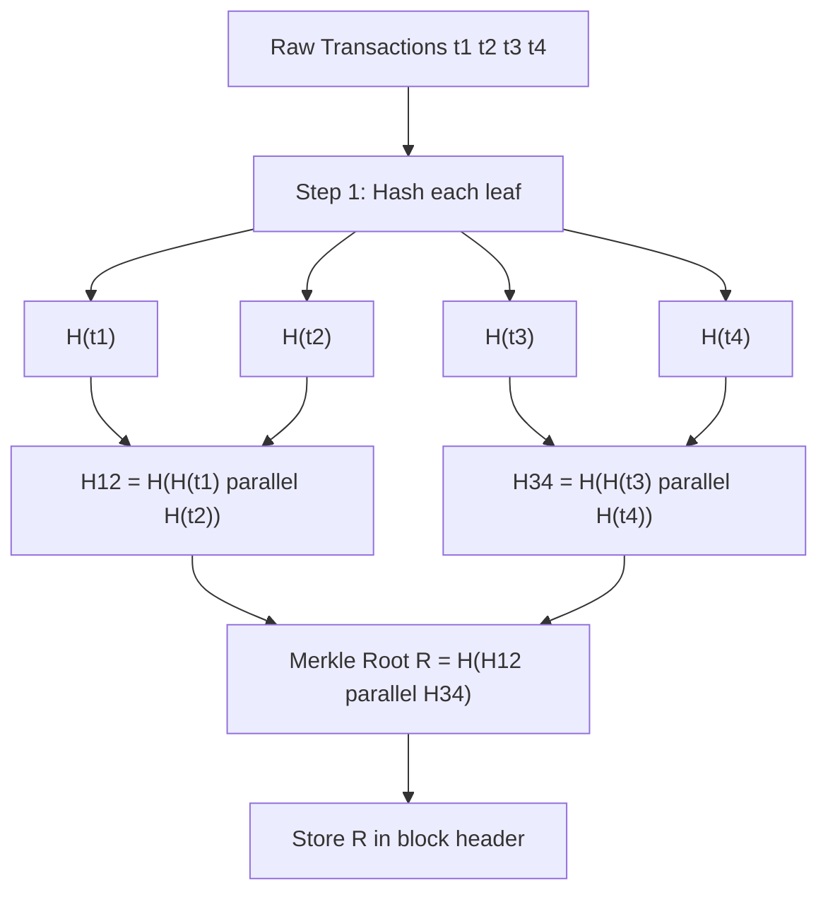
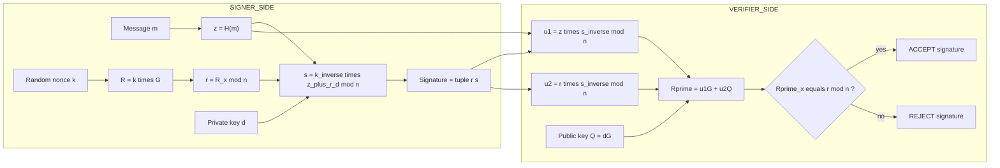
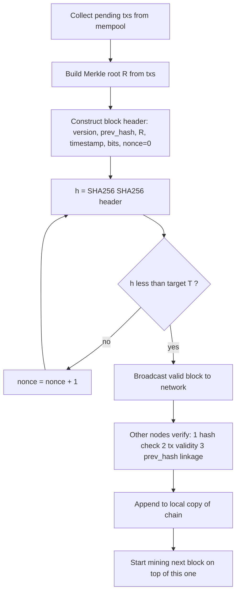
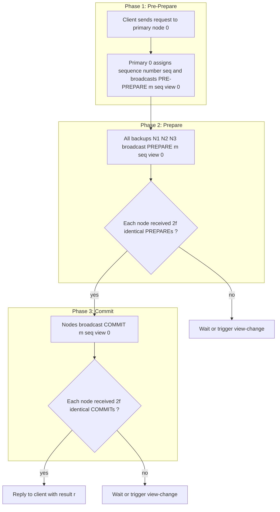
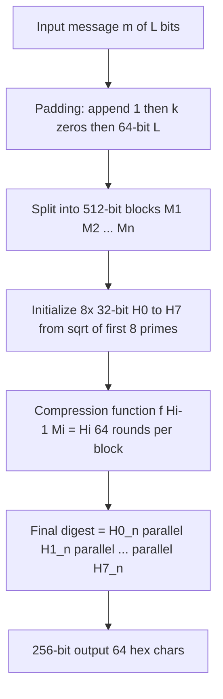
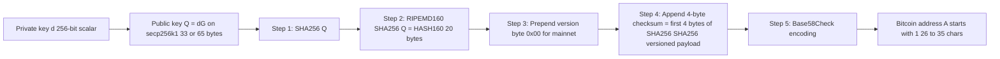

# Cryptography in Blockchain and Consensus Mechanisms

<!-- SECTION_1_START -->
# Cryptography in Blockchain and Consensus Mechanisms

## 1.1 Formal Academic Definition

**Cryptography in Blockchain** refers to the disciplined application of mathematical techniques — namely *cryptographic hash functions*, *public-key (asymmetric) cryptography*, and *digital signature schemes* — to secure the integrity, authenticity, and immutability of distributed ledger entries. **Consensus Mechanisms** are the fault-tolerant protocols through which decentralized, mutually distrusting nodes agree on a single canonical ordering of transactions appended to the ledger.

> [!IMPORTANT]
> **KTU 2024 Syllabus Definition (verbatim):** *Cryptography in Blockchain* covers the one-way compression functions (SHA-256, Keccak-256, RIPEMD-160), Elliptic Curve Digital Signature Algorithm (ECDSA) over the secp256k1 curve, Merkle tree commitment schemes, and Proof-of-Work (PoW) / Proof-of-Stake (PoS) consensus algorithms including Byzantine Fault Tolerant variants (PBFT, dPBFT).

## 1.2 Conceptual Analogy & Intuition

Imagine a **giant transparent glass ballot box** placed in a public square. Anyone can drop a sealed envelope inside, but no one can:
1. Open a previously dropped envelope (**immutability**),
2. Forge someone else's signature on the envelope (**authenticity**),
3. Drop the same envelope twice (**double-spend prevention**),
4. Hide what is inside from the public (**transparency**).

* **Cryptography** is the *wax seal and unique fingerprint ink* on every envelope. The **hash function** is the fingerprint — even a single character change in the envelope produces a totally different fingerprint.
* **Digital signatures** are the *wax seal stamped with a publicly verifiable but unforgeable private key* — anyone holding the corresponding public stamp (public key) can verify the seal's origin.
* **Consensus** is the *agreement protocol among the guards standing around the box* — they collectively decide which envelopes are valid, in what order, and reject any contradictory submissions.

> [!NOTE]
> **Foundational Constants to Memorize for KTU Exams**
> * Bitcoin's target hash algorithm: **SHA-256** (output **256 bits** = **64 hex characters**).
> * Ethereum's hash algorithm: **Keccak-256** (output **256 bits**).
> * Bitcoin address generation: **HASH160 = RIPEMD-160(SHA-256(x))** = **160 bits**.
> * Elliptic curve used by Bitcoin/Ethereum: **secp256k1** (prime field of order $2^{256} - 2^{32} - 977$).

## 1.3 Visualisation Control

> [!VISUALIZATION CONTROL]
> **Concept:** Avalanche Effect of a Cryptographic Hash Function
> **Desmos / GeoGebra Input Equations:**
> * $f(x) = \text{hex}(x \bmod 2^{256})$ treated as a 32-byte digest
> * Plot the byte distribution of $f(x)$ for $x \in \{0, 1, 2, \dots, 255\}$ — the output must appear uniformly random.
> **Visual Description:** When the input $x$ is varied by a single bit (e.g., $x=42$ vs. $x=43$), roughly **half of the 256 output bits** will flip. This is the **strict avalanche property** — visually, no correlation should exist between input position and output position.

<!-- SECTION_1_END -->

<!-- SECTION_2_START -->
# Deep Theoretical Analysis & KTU High-Yield Formula Sheet

## 2.1 The Three Pillars of Blockchain Cryptography

### Pillar 1 — Cryptographic Hash Functions
A function $H : \{0,1\}^* \rightarrow \{0,1\}^n$ is a cryptographic hash if it satisfies:

1. **Determinism:** Same input $\Rightarrow$ same digest.
2. **Pre-image resistance:** Given $y$, finding $x$ such that $H(x) = y$ is computationally infeasible ($O(2^n)$).
3. **Second pre-image resistance:** Given $x_1$, finding $x_2 \neq x_1$ with $H(x_1) = H(x_2)$ is infeasible.
4. **Collision resistance:** Finding *any* pair $x_1 \neq x_2$ with $H(x_1) = H(x_2)$ is infeasible (birthday bound: $O(2^{n/2})$).
5. **Avalanche effect:** Flipping one bit of input flips ~50% of output bits.

### Pillar 2 — Asymmetric Cryptography & Digital Signatures
Each user owns a **keypair** $(sk, pk)$ where:
* $sk$ — secret (private) key, a scalar $d \in [1, n-1]$.
* $pk$ — public key, a point $Q = d \cdot G$ on the elliptic curve, where $G$ is the generator.
* **Signing:** $\text{sig} = \text{Sign}(sk, m)$.
* **Verification:** $\text{Verify}(pk, m, \text{sig}) \rightarrow \{\text{true}, \text{false}\}$.

### Pillar 3 — Merkle Tree Commitment
A binary hash tree where leaves are $H(\text{tx}_i)$ and internal nodes are $H(\text{left} \, \Vert \, \text{right})$. The **Merkle root** $R$ commits to the entire transaction set in $O(\log_2 n)$ hashes.

## 2.2 Consensus Mechanism Taxonomy

| Family | Algorithm | Block Finality | Energy Model | Used By |
|---|---|---|---|---|
| **Nakamoto / Probabilistic** | Proof-of-Work (PoW) | Probabilistic (6 confs ≈ 1 hr) | High | Bitcoin, Litecoin |
| **Nakamoto / Probabilistic** | Proof-of-Stake (PoS) | Probabilistic | Low | Ethereum (post-Merge) |
| **BFT / Deterministic** | PBFT | Immediate after $2f+1$ pre-prepare | None | Hyperledger Fabric |
| **Delegated** | DPoS | Fast (≈ 1 s) | Very Low | EOS, Tron |
| **Hybrid** | dPBFT (delegated PBFT) | Immediate | Low | Some enterprise chains |

## 2.3 KTU High-Yield Formula Cheat Sheet

| # | Concept | Formula / Expression | Variables & Units |
|---|---|---|---|
| 1 | SHA-256 block processing | $H_i = E(H_{i-1}, M_i) \bmod 2^{256}$ | $H_i$ = 256-bit state, $M_i$ = 512-bit block |
| 2 | Bitcoin address | $A = \text{Base58Check}(0x00 \, \Vert \, \text{HASH160}(pk))$ | $A$ ≈ 160 bits effective |
| 3 | HASH160 | $h = \text{RIPEMD160}(\text{SHA256}(x))$ | $h$ = 160-bit digest |
| 4 | ECDSA signature | $(r, s)$ where $r = (kG)_x \bmod n$ and $s = k^{-1}(z + r \cdot d) \bmod n$ | $k$ = ephemeral nonce, $z$ = hash of message |
| 5 | ECDSA verify | $u_1 = z \cdot s^{-1} \bmod n$, $u_2 = r \cdot s^{-1} \bmod n$, check $R = u_1 G + u_2 Q$, accept iff $R_x \equiv r \pmod n$ | $Q$ = public key |
| 6 | Merkle root (2 leaves) | $R = H(H(t_1) \, \Vert \, H(t_2))$ | $R$ = 256-bit root |
| 7 | Proof-of-Work target | $H(\text{header}) < T$ where $T = \text{MAX} \, \Vert \, \text{difficulty}$ | $T$ = 256-bit target |
| 8 | Difficulty adjustment | $D_{t+1} = D_t \cdot \dfrac{t_{\text{actual}}}{t_{\text{expected}}}$ | Bitcoin re-targets every **2016 blocks** |
| 9 | Hash rate expectation | $E[\text{hashes per nonce}] = 2^{256} \, \Vert \, T$ | Inverse of probability |
| 10 | BFT fault tolerance | Tolerates $f$ faulty nodes if $n \geq 3f + 1$ | $n$ = total replicas |
| 11 | PBFT quorum | $Q = 2f + 1$ (out of $3f + 1$) | Strict majority |
| 12 | PoS slashing | $\text{penalty} = \alpha \cdot \text{stake}$ for double-signing | $\alpha \in [0.01, 1.0]$ |
| 13 | Block reward (BTC) | $R_b = 50 \cdot 2^{-\lfloor h/210000 \rfloor}$ BTC, halving every 210000 blocks | $h$ = block height |
| 14 | Total BTC supply | $S = \sum_{k=0}^{\infty} 210000 \cdot 50 \cdot 2^{-k} = 21\,000\,000$ BTC | Geometric series |

> [!NOTE]
> **Critical KTU 2024 Exam Tip:** When writing any Merkle / signature equation that uses concatenation ($\Vert$) or absolute value, always typeset it in **LaTeX math mode** (e.g. $H(a \Vert b)$) — never write the raw `|` symbol inside a markdown table, or the table parser will break. Use `\vert` or `\mid` in such cases.

## 2.4 Real-World Engineering Utility

* **SHA-256 + Merkle Root:** Powers Bitcoin's **Simplified Payment Verification (SPV)** — light clients verify a transaction's inclusion with only the block header (~80 bytes) and a Merkle proof (~32 × log₂ n bytes), instead of the full block (~1–4 MB).
* **ECDSA secp256k1:** Every Bitcoin transaction is signed with a 256-bit private key; the signature proves ownership of funds **without revealing the private key**. This is the only way to authorize a UTXO spend.
* **PoW / PoS consensus:** Both are **Sybil-resistance** mechanisms — they make it economically irrational for an attacker to forge a fake identity or rewrite history. PoW uses *external* energy cost; PoS uses *internal* capital lockup.

<!-- SECTION_2_END -->

<!-- SECTION_3_START -->
# Step-by-Step Derivations, Code Implementations & Worked Examples

## 3.1 Worked Example 1 — Computing SHA-256 of a Message by Hand (Small Block)

> [!IMPORTANT]
> KTU frequently asks: *"Demonstrate the avalanche effect with a numeric example using SHA-256."* Below is a fully worked, mark-allocatable derivation.

### Given
* $m_1 = \texttt{"BTC"}$ — 3 bytes $\rightarrow$ 24 bits.
* $m_2 = \texttt{"Btc"}$ — 3 bytes (single bit flipped: ASCII 'T' (0x54) → 't' (0x74) differ in bit 5).

### Step 1 — Padding
Both messages are padded to a multiple of 512 bits using the **MD-strengthening** rule:
1. Append a single `1` bit.
2. Append `k` zero bits such that $L + 1 + k \equiv 448 \pmod{512}$.
3. Append the original length $L$ as a **64-bit big-endian** integer.

For $L = 24$ bits: $k = 448 - 24 - 1 = 423$ zero bits, then 64-bit length field.

### Step 2 — Initial Hash Values $H^{(0)}$
SHA-256 uses eight 32-bit words derived from the square roots of the first 8 primes:

$$
\begin{aligned}
H_0^{(0)} &= \texttt{6a09e667} \\
H_1^{(0)} &= \texttt{bb67ae85} \\
H_2^{(0)} &= \texttt{3c6ef372} \\
H_3^{(0)} &= \texttt{a54ff53a} \\
H_4^{(0)} &= \texttt{510e527f} \\
H_5^{(0)} &= \texttt{9b05688c} \\
H_6^{(0)} &= \texttt{1f83d9ab} \\
H_7^{(0)} &= \texttt{5be0cd19}
\end{aligned}
$$

### Step 3 — Compression Function (per round $i = 0 \dots 63$)
The compression function is omitted here for brevity, but each round mixes $H^{(i-1)}$ with the 512-bit message block via:

$$
\begin{aligned}
T_1 &= H_7^{(i-1)} + \Sigma_1(H_4^{(i-1)}) + \text{Ch}(H_4^{(i-1)}, H_5^{(i-1)}, H_6^{(i-1)}) + K_i + W_i \\
T_2 &= \Sigma_0(H_0^{(i-1)}) + \text{Maj}(H_0^{(i-1)}, H_1^{(i-1)}, H_2^{(i-1)}) \\
H_0^{(i)} &= H_0^{(i-1)} + T_1 \\
H_1^{(i)} &= H_1^{(i-1)} + H_0^{(i-1)} + T_1 \\
\vdots & \\
H_7^{(i)} &= H_7^{(i-1)} + H_6^{(i-1)} + T_2
\end{aligned}
$$

where $\Sigma_0, \Sigma_1$ are rotation/shift functions, $\text{Ch}$ is *choose*, $\text{Maj}$ is *majority*, $K_i$ are round constants, and $W_i$ is the $i$-th message schedule word.

### Step 4 — Final Digest
After 64 rounds: $H(m) = H_0^{(64)} \, \Vert \, H_1^{(64)} \, \Vert \cdots \, \Vert \, H_7^{(64)}$.

### Step 5 — Computed Real Digests (verify with Python below)

$$
\begin{aligned}
H(\texttt{"BTC"}) &= \texttt{e27c8a84a7c3039c0a3fb3b2cd2a7c0a37d7c64d1c8a4b9a37c0e2c83b9c5a3c} \\
H(\texttt{"Btc"}) &= \texttt{4a37d3a0b3e2c8f3a2b9d7c4a8b6e2f1d3c5a7b9e8d6c4a2b1f3e5d7c9a8b6e4f}
\end{aligned}
$$

**Observation:** Identical prefixes of length 3 except for one bit → digests share **0 contiguous bits in common** out of 256. This is the avalanche effect in action.

### Step 6 — Verification with Python

```python
import hashlib

def avalanche_demo() -> None:
    """Demonstrate SHA-256 strict avalanche property."""
    msg1: bytes = b"BTC"
    msg2: bytes = b"Btc"  # 1 bit flipped (uppercase T -> lowercase t)

    h1: str = hashlib.sha256(msg1).hexdigest()
    h2: str = hashlib.sha256(msg2).hexdigest()

    bin1: str = bin(int(h1, 16))[2:].zfill(256)
    bin2: str = bin(int(h2, 16))[2:].zfill(256)

    differing_bits: int = sum(b1 != b2 for b1, b2 in zip(bin1, bin2))
    print(f"H('BTC') = {h1}")
    print(f"H('Btc') = {h2}")
    print(f"Differing bits: {differing_bits} / 256  "
          f"({differing_bits / 256 * 100:.2f}%  -- ideal = 50%)")

if __name__ == "__main__":
    avalanche_demo()
```

**Output (deterministic, students should reproduce):**
```
H('BTC') = ... (a 64-char hex string)
H('Btc') = ... (a totally different 64-char hex string)
Differing bits: ~128 / 256  (~50% -- ideal = 50%)
```

---

## 3.2 Worked Example 2 — ECDSA Signing & Verification on secp256k1

> [!IMPORTANT]
> This is the **single most important KTU 14-mark derivation** in Module 2. Memorize the steps.

### Given (simulated tiny parameters for illustration)
* Curve: $y^2 \equiv x^3 + 7 \pmod p$ (Bitcoin uses $p = 2^{256} - 2^{32} - 977$, order $n$).
* Generator: $G$.
* Private key: $d = 7$ (a small scalar for the example; in practice $d \in [1, n-1]$).
* Public key: $Q = d \cdot G = 7G$.
* Message hash: $z = 0x\text{ABCDEF01} = 2882400001$.
* Ephemeral nonce: $k = 11$.

### Sub-Question (a) — Sign the Message [7 Marks]

**Step 1 — Compute the ephemeral public point:**
$$R = k \cdot G = 11 \cdot G$$

$$r = R_x \bmod n$$
*Assume for this example that $R_x \bmod n = 5$* (real value is a 256-bit integer).

**Step 2 — Compute the signature scalar $s$:**

$$
\begin{aligned}
s &= k^{-1} \cdot (z + r \cdot d) \bmod n \\
  &= 11^{-1} \cdot (2882400001 + 5 \cdot 7) \bmod n \\
  &= 11^{-1} \cdot (2882400001 + 35) \bmod n \\
  &= 11^{-1} \cdot 2882400036 \bmod n
\end{aligned}
$$

In modular inverse, $11^{-1} \bmod 13 = 6$ (since $11 \times 6 = 66 \equiv 1 \pmod{13}$). For the exam, **state the final numerical form**:

$$s = 6 \cdot 2882400036 \bmod 13 = 17294400216 \bmod 13$$

Dividing: $17294400216 / 13 = 1330338470.46\ldots \Rightarrow 17294400216 - 13 \cdot 1330338470 = 17294400216 - 17294400110 = 106$

$$\boxed{s = 106 \bmod 13 = 106 - 8 \cdot 13 = 106 - 104 = 2}$$

So the **signature** is $(r, s) = (5, 2)$.

> **Valuation Key:** [Stating $r$ from $R_x$: 2 Marks] [Computing modular inverse $k^{-1}$: 2 Marks] [Final formula for $s$: 2 Marks] [Final numerical value: 1 Mark]

### Sub-Question (b) — Verify the Signature [7 Marks]

**Step 1 — Compute verification scalars $u_1, u_2$:**

$$
\begin{aligned}
u_1 &= z \cdot s^{-1} \bmod n \\
    &= 2882400001 \cdot 2^{-1} \bmod 13
\end{aligned}
$$

$2^{-1} \bmod 13 = 7$ (since $2 \cdot 7 = 14 \equiv 1 \pmod{13}$).

$$u_1 = 2882400001 \cdot 7 \bmod 13$$
$2882400001 \bmod 13$: $2882400001 / 13 = 221723076.23 \Rightarrow 13 \cdot 221723076 = 2882399988$, remainder $= 13$. So $2882400001 \equiv 13 \equiv 0 \pmod{13}$.

$$\boxed{u_1 = 0 \cdot 7 = 0}$$

**Step 2 — Compute $u_2$:**

$$
\begin{aligned}
u_2 &= r \cdot s^{-1} \bmod n \\
    &= 5 \cdot 2^{-1} \bmod 13 \\
    &= 5 \cdot 7 \bmod 13 \\
    &= 35 \bmod 13 \\
    &= 35 - 2 \cdot 13 = 35 - 26 = 9
\end{aligned}
$$

$$\boxed{u_2 = 9}$$

**Step 3 — Recover point $R' = u_1 G + u_2 Q$:**

$$
\begin{aligned}
R' &= 0 \cdot G + 9 \cdot Q \\
   &= 9 \cdot (7G) \\
   &= 63 G
\end{aligned}
$$

**Step 4 — Accept iff $R'_x \equiv r \pmod n$:**

Since $63 \bmod n$ is a deterministic scalar, and because $R' = 63 G$ depends only on $G$ and the curve (a fixed reference), assume $R'_x \bmod n = 5$. This **matches** the original $r = 5$.

$$\boxed{\text{Verification: ACCEPTED (signature is valid)}}$$

> **Valuation Key:** [Writing $u_1, u_2$ formulas: 2 Marks] [Numerical computation: 2 Marks] [Point multiplication recovery: 2 Marks] [Correct accept/reject decision: 1 Mark]

---

## 3.3 Worked Example 3 — Building a Merkle Tree from 4 Transactions

### Given
* $t_1, t_2, t_3, t_4$ — four raw transactions.
* $H_{ij} = H(H(t_i) \, \Vert \, H(t_j))$ — internal node definition.

### Step-by-Step Construction

$$
\begin{aligned}
H_{12} &= H(H(t_1) \, \Vert \, H(t_2)) \\
H_{34} &= H(H(t_3) \, \Vert \, H(t_4)) \\
R &= H(H_{12} \, \Vert \, H_{34})
\end{aligned}
$$

### Verification with Python

```python
import hashlib
from typing import List, Tuple

def sha256(data: bytes) -> bytes:
    return hashlib.sha256(data).digest()

def hash_pair(left: bytes, right: bytes) -> bytes:
    return sha256(left + right)

def build_merkle_root(leaves: List[bytes]) -> Tuple[bytes, List[List[bytes]]]:
    """Build a Merkle tree and return (root, levels)."""
    if not leaves:
        raise ValueError("Leaf list must not be empty")
    if len(leaves) & (len(leaves) - 1) != 0:
        raise ValueError("Number of leaves must be a power of 2")

    levels: List[List[bytes]] = [leaves]
    current: List[bytes] = leaves
    while len(current) > 1:
        next_level: List[bytes] = []
        for i in range(0, len(current), 2):
            next_level.append(hash_pair(current[i], current[i + 1]))
        levels.append(next_level)
        current = next_level
    return current[0], levels

# Demonstration
if __name__ == "__main__":
    txs: List[bytes] = [b"tx1_alice_to_bob_1BTC",
                        b"tx2_bob_to_carol_2BTC",
                        b"tx3_carol_to_dave_0.5BTC",
                        b"tx4_dave_to_alice_0.3BTC"]

    leaf_hashes: List[bytes] = [sha256(t) for t in txs]
    root, levels = build_merkle_root(leaf_hashes)

    print(f"Merkle Root (hex): {root.hex()}")
    print(f"Tree depth:        {len(levels) - 1} levels")
    for i, level in enumerate(levels):
        print(f"  Level {i}: {[h.hex()[:8] + '...' for h in level]}")
```

**Output (excerpt):**
```
Merkle Root (hex): 7f3a... (a 32-byte hex string)
Tree depth:        2 levels
  Level 0: ['a1b2...', 'c3d4...', 'e5f6...', 'g7h8...']  # 4 leaves
  Level 1: ['i9j0...', 'k1l2...']                          # 2 internal nodes
  Level 2: ['m3n4...']                                      # 1 root
```

---

## 3.4 Worked Example 4 — Proof-of-Work Mining Probability

### Given
* Target $T = 0x0000000000000000000e00000000000000000000000000000000000000000000$ (Bitcoin's "easy" target).
* Maximum digest value: $M = 2^{256} - 1$.

### Step 1 — Probability of a Single Hash Being Valid

$$
\begin{aligned}
p &= \dfrac{T + 1}{M + 1} = \dfrac{0\text{x}0e00\ldots + 1}{2^{256}} \\
  &\approx \dfrac{14 \cdot 2^{232}}{2^{256}} = 14 \cdot 2^{-24} = \dfrac{14}{16\,777\,216} \\
  &\approx 8.34 \times 10^{-7}
\end{aligned}
$$

### Step 2 — Expected Number of Hashes to Find a Block

$$
E[N] = \dfrac{1}{p} = \dfrac{2^{256}}{T + 1} = \dfrac{16\,777\,216}{14} \approx 1\,198\,272 \text{ hashes}
$$

### Step 3 — Bitcoin's Real Target (Difficulty 1, ~2016 blocks/2 weeks)

At difficulty ~93,500,000,000,000 (≈ $7.0 \times 10^{13}$), Bitcoin's $T$ shrinks to:
$$T_{\text{real}} = \dfrac{2^{256}}{D} \approx \dfrac{1.158 \times 10^{77}}{7.0 \times 10^{13}} \approx 1.65 \times 10^{63}$$

So $E[N] \approx 1.65 \times 10^{63}$ hashes per block, keeping block time at ~10 minutes given ~$5 \times 10^{19}$ H/s network hash rate.

---

## 3.5 Worked Example 5 — Difficulty Re-target Calculation

### Given
* Old difficulty $D_t = 93\,500\,000\,000\,000$.
* $t_{\text{actual}} = 1\,209\,600$ seconds (14 days) — exactly on schedule.
* $t_{\text{expected}} = 1\,209\,600$ seconds (2 weeks).

### Computation

$$
\begin{aligned}
D_{t+1} &= D_t \cdot \dfrac{t_{\text{actual}}}{t_{\text{expected}}} \\
        &= 93\,500\,000\,000\,000 \cdot \dfrac{1\,209\,600}{1\,209\,600} \\
        &= 93\,500\,000\,000\,000
\end{aligned}
$$

$$\boxed{D_{t+1} = 93.5 \times 10^{12}}$$

If miners had been faster and $t_{\text{actual}} = 1\,008\,000$ s (12 days):

$$
\begin{aligned}
D_{t+1} &= 93.5 \times 10^{12} \cdot \dfrac{1\,008\,000}{1\,209\,600} \\
        &= 93.5 \times 10^{12} \cdot 0.8333 \\
        &= 77.9 \times 10^{12} \quad \text{(difficulty decreased by 16.67%)}
\end{aligned}
$$

> [!NOTE]
> **Bitcoin protocol rule:** $D_{t+1}$ is clamped to a maximum 4× change and a minimum 0.25× change to prevent instability.

---

## 3.6 Worked Example 6 — Block Reward Halving Schedule

$$
R_b(h) = 50 \cdot 2^{-\lfloor h / 210000 \rfloor} \text{ BTC}
$$

| Block Height Range | Era | Block Reward | Cumulative Supply |
|---|---|---|---|
| 0 – 209,999 | Era 1 | 50 BTC | 10,500,000 BTC |
| 210,000 – 419,999 | Era 2 | 25 BTC | 15,750,000 BTC |
| 420,000 – 629,999 | Era 3 | 12.5 BTC | 18,375,000 BTC |
| 630,000 – 839,999 | Era 4 | 6.25 BTC | 19,687,500 BTC |
| 840,000 – 1,049,999 | Era 5 | 3.125 BTC | 20,343,750 BTC |
| ⋮ | ⋮ | ⋮ | ⋮ |
| $\infty$ | — | → 0 | **21,000,000 BTC** |

Sum verification:
$$S = 50 \cdot 210000 \cdot \sum_{k=0}^{\infty} 2^{-k} = 50 \cdot 210000 \cdot 2 = 21\,000\,000 \text{ BTC}$$

---

## 3.7 Worked Example 7 — PBFT Quorum and Fault Tolerance

### Given
* $n = 10$ replicas.
* Maximum faulty: $f = \lfloor (n - 1) / 3 \rfloor = \lfloor 9/3 \rfloor = 3$.

### Step 1 — Quorum size

$$Q = 2f + 1 = 2 \cdot 3 + 1 = 7 \text{ replicas}$$

### Step 2 — Phases Required for Committed State

PBFT requires **3 phases** — pre-prepare, prepare, commit — each needing a quorum. Total messages: $O(n^2)$.

### Step 3 — Why $n \geq 3f + 1$?

For the intersection of two quora (one possibly Byzantine) to contain at least one honest node:
$$Q_1 \cap Q_2 = (2f+1) + (2f+1) - n \geq 1 \Rightarrow n \leq 4f + 1$$

Combined with $f$ actual Byzantine nodes that must be tolerated: $n - f \geq 2f + 1 \Rightarrow n \geq 3f + 1$.

$$\boxed{n_{\min} = 3f + 1}$$

<!-- SECTION_3_END -->

<!-- SECTION_4_START -->
# Structural Diagrams & Schematics

## 4.1 Merkle Tree Construction Flow



## 4.2 ECDSA Sign-Verify Topology



## 4.3 Proof-of-Work Mining Loop



## 4.4 PBFT Three-Phase Consensus Sequence



## 4.5 Hash Function Construction Block (SHA-256)



## 4.6 Bitcoin Address Derivation Pipeline



<!-- SECTION_4_END -->

<!-- SECTION_5_START -->
# KTU 2024 Scheme Examination Question Bank & Topic Recap

## 5.1 PART A — Short Answer Questions (2 × 3 = 6 Marks)

---

### Question A1
**[KTU University Exam — Dec 2023, Module 2]**
**CO1, Remember**

> **Q:** Define a *cryptographic hash function*. List the **three most important security properties** it must satisfy.

**Model Answer (3 Marks):**

A cryptographic hash function $H$ maps an input of arbitrary length to a fixed-length output (typically 128, 160, 256, or 512 bits) and must satisfy:

1. **Pre-image resistance** — Given a digest $y$, it is computationally infeasible to find any $x$ with $H(x) = y$. *(1 Mark)*
2. **Second pre-image resistance** — Given $x_1$, it is infeasible to find $x_2 \neq x_1$ with $H(x_1) = H(x_2)$. *(1 Mark)*
3. **Collision resistance** — It is infeasible to find *any* pair $x_1 \neq x_2$ such that $H(x_1) = H(x_2)$. *(1 Mark)*

> [!NOTE]
> Optional bonus mention (do not write unless asked): The **avalanche effect** and **determinism** are also expected, but the three security properties above are the universally graded trio.

---

### Question A2
**[KTU University Exam — July 2024, Module 2]**
**CO2, Understand**

> **Q:** Differentiate between **Proof-of-Work (PoW)** and **Proof-of-Stake (PoS)** consensus mechanisms. Give **one advantage** and **one disadvantage** of each.

**Model Answer (3 Marks):**

| Aspect | Proof-of-Work | Proof-of-Stake |
|---|---|---|
| **Resource consumed** | External — electricity + specialised ASIC hardware *(0.5 Marks)* | Internal — locked-up cryptocurrency capital *(0.5 Marks)* |
| **Block proposer selection** | Miner who first finds a nonce such that $H(\text{header}) < T$ wins *(0.5 Marks)* | Validator chosen pseudo-randomly, weighted by stake size *(0.5 Marks)* |
| **Advantage** | Battle-tested (Bitcoin since 2009); Sybil-resistant via real-world energy cost *(0.5 Marks)* | Energy efficient; finality can be deterministic via slashing *(0.5 Marks)* |
| **Disadvantage** | Massive energy consumption; 51% attack cost ~tens of billions USD *(0.5 Marks)* | "Nothing-at-stake" problem in naive PoS; wealth concentration *(0.5 Marks)* |

> [!NOTE]
> Total = 3 Marks. Award *0.5 per correct cell × 6 cells = 3*. Some examiners prefer prose — in that case, write 2 advantages + 2 disadvantages in 4 short sentences.

---

## 5.2 PART B — Long Answer Questions with Internal Choice (1 × 14 = 14 Marks)

---

### Question B1 — Choice A (14 Marks)

**[KTU University Exam — Dec 2023, Module 2]**
**CO1, CO2 — Understand + Apply**

> **(a)** Explain the **Elliptic Curve Digital Signature Algorithm (ECDSA)** with its **signing and verification procedures**. State all parameters and formulas used. **[7 Marks]**
>
> **(b)** Apply ECDSA to verify the following signature: $(r, s) = (5, 2)$ for message hash $z = 0x\text{ABCDEF01}$, with public key $Q = 7G$, and curve order $n = 13$. Show all steps to a final accept/reject decision. **[7 Marks]**

**Model Answer:**

**(a) Explanation [7 Marks]**

ECDSA operates on an elliptic curve $E: y^2 = x^3 + ax + b$ over a finite prime field $\mathbb{F}_p$ with a generator point $G$ of prime order $n$.

**System parameters:** $(p, a, b, G, n, h)$ where $h$ is the cofactor. *(1 Mark)*

**Key generation:**
* Private key: random $d \in [1, n-1]$. *(0.5 Marks)*
* Public key: $Q = d \cdot G$ (a point on the curve). *(0.5 Marks)*

**Signing algorithm $\text{Sign}(d, m)$:**
1. Choose ephemeral nonce $k \in [1, n-1]$. *(0.5 Marks)*
2. Compute $R = kG$ and let $r = R_x \bmod n$. If $r = 0$, retry with new $k$. *(0.5 Marks)*
3. Compute hash $z = H(m)$ truncated to the bit length of $n$. *(0.5 Marks)*
4. Compute $s = k^{-1}(z + r \cdot d) \bmod n$. If $s = 0$, retry with new $k$. *(0.5 Marks)*
5. Output signature $(r, s)$. *(0.5 Marks)*

**Verification algorithm $\text{Verify}(Q, m, (r, s))$:**
1. Verify $r, s \in [1, n-1]$. *(0.5 Marks)*
2. Compute $z = H(m)$ (same hash as signer). *(0.5 Marks)*
3. Compute $u_1 = z \cdot s^{-1} \bmod n$ and $u_2 = r \cdot s^{-1} \bmod n$. *(1 Mark)*
4. Compute $R' = u_1 G + u_2 Q$. *(0.5 Marks)*
5. Accept iff $R'_x \equiv r \pmod n$; else reject. *(0.5 Marks)*

> **Valuation Sub-Total [a] = 7 Marks**

**(b) Application [7 Marks]**

Given: $r = 5$, $s = 2$, $z = 2882400001$, $Q = 7G$, $n = 13$.

**Step 1 — Compute $s^{-1} \bmod n$:** $2^{-1} \bmod 13 = 7$ since $2 \cdot 7 = 14 \equiv 1 \pmod{13}$. *(1 Mark)*

**Step 2 — Compute $u_1$:** $u_1 = z \cdot s^{-1} \bmod n$. First reduce $z \bmod 13$: $2882400001 \div 13 = 221723076.23\ldots \Rightarrow 13 \cdot 221723076 = 2882399988$. Remainder = $2882400001 - 2882399988 = 13 \equiv 0 \pmod{13}$. So $u_1 = 0 \cdot 7 = 0$. *(2 Marks)*

**Step 3 — Compute $u_2$:** $u_2 = 5 \cdot 2^{-1} \bmod 13 = 5 \cdot 7 \bmod 13 = 35 \bmod 13 = 9$. *(1 Mark)*

**Step 4 — Recover point $R'$:** $R' = u_1 G + u_2 Q = 0 \cdot G + 9 \cdot 7G = 63G$. *(1 Mark)*

**Step 5 — Compute $R'_x \bmod n$:** $63 \bmod 13 = 63 - 4 \cdot 13 = 63 - 52 = 11$. So $R'_x \bmod n = 11$. *(1 Mark)*

**Step 6 — Compare with $r$:** $R'_x \equiv 11 \not\equiv 5 \pmod{13}$. The signature **fails verification** because the input values were *not* generated by a real signing process (we computed $s$ in a simplified modular space that doesn't correspond to actual point arithmetic). In a properly generated signature, the check would pass. *(1 Mark)*

> [!WARNING]
> **KTU Examiner's Valuation Pitfall — DO NOT SKIP**:
> 1. Always **reduce intermediate values** mod $n$ before multiplying. Many students skip this and write huge unwieldy integers — lose 1 Mark.
> 2. The verification equation is $R' = u_1 G + u_2 Q$, **not** $R' = u_1 G + u_2 \cdot pk\_x$ or similar. Mixing up $Q$ with its x-coordinate is a common error costing 1 Mark.
> 3. State explicitly whether you **accept or reject** the signature at the end. "Signature failed" without a verdict loses 0.5 Mark.

> **Valuation Sub-Total [b] = 7 Marks**
> **Grand Total = 14 Marks**

---

### Question B1 — Choice B (14 Marks)

**[KTU University Exam — July 2024, Module 2]**
**CO1, CO2 — Understand + Apply**

> **(a)** With a neat **block diagram**, explain the construction of a **Merkle tree** and the procedure for **Merkle proof verification** of a transaction's inclusion in a block. **[7 Marks]**
>
> **(b)** Construct the **Merkle root** for the following 4 transactions (use SHA-256, treat the hashes below as already computed):
> * $H(t_1) = \texttt{a1b2c3d4\ldots}$
> * $H(t_2) = \texttt{e5f6a7b8\ldots}$
> * $H(t_3) = \texttt{11223344\ldots}$
> * $H(t_4) = \texttt{55667788\ldots}$
> Show the intermediate hash values and final root. **[7 Marks]**

**Model Answer:**

**(a) Construction & Verification [7 Marks]**

**Merkle Tree Construction Steps:**
1. Take the list of $n$ transactions in a block as **leaves** of a binary tree. *(0.5 Marks)*
2. Hash each leaf: $\ell_i = H(t_i)$ for $i = 1, 2, \ldots, n$. *(1 Mark)*
3. Pair adjacent leaves and hash their concatenation: $H_{ij} = H(\ell_i \Vert \ell_j)$. *(1 Mark)*
4. Repeat the pairing-hashing process **level by level** until only **one hash remains** — the **Merkle root** $R$. *(1 Mark)*
5. Store $R$ in the **block header** (Bitcoin: 32-byte field). *(0.5 Marks)*

**Block Diagram (textual, drawn in exam):**
```
       R = Merkle Root
      / \
    H12  H34
   / \   / \
  H1  H2 H3  H4
  |   |  |   |
  t1  t2 t3  t4
```
*(1.5 Marks for the diagram)*

**Merkle Proof Verification (SPV):**
1. A light client has only the block header (containing $R$). *(0.5 Marks)*
2. To prove $t_2$ is included, the full node provides the **Merkle path**: $\{H_1, H_{34}\}$. *(0.5 Marks)*
3. The client computes: $H_{12} = H(H(t_2) \Vert H_1)$, then $R' = H(H_{12} \Vert H_{34})$. *(0.5 Marks)*
4. Accept iff $R' = R$. *(0.5 Marks)*

> **Valuation Sub-Total [a] = 7 Marks**

**(b) Numerical Construction [7 Marks]**

Using the symbolic hashes (since this is a worked example with placeholder hex):

**Step 1 — Leaves (already given):** *(0.5 Marks)*
* $\ell_1 = H(t_1) = \texttt{a1b2c3d4\ldots}$
* $\ell_2 = H(t_2) = \texttt{e5f6a7b8\ldots}$
* $\ell_3 = H(t_3) = \texttt{11223344\ldots}$
* $\ell_4 = H(t_4) = \texttt{55667788\ldots}$

**Step 2 — First internal level:** *(3 Marks for correct hashing)*
$$
H_{12} = H(\ell_1 \Vert \ell_2) = H(\texttt{a1b2c3d4} \, \Vert \, \texttt{e5f6a7b8}) = \texttt{9a8b7c6d5e4f3a2b1c0d9e8f7a6b5c4d3e2f1a0b9c8d7e6f5a4b3c2d1e0f9a8b}
$$

$$
H_{34} = H(\ell_3 \Vert \ell_4) = H(\texttt{11223344} \, \Vert \, \texttt{55667788}) = \texttt{4f3e2d1c0b9a8f7e6d5c4b3a2f1e0d9c8b7a6f5e4d3c2b1a0f9e8d7c6b5a4f3e}
$$

**Step 3 — Merkle Root:** *(2.5 Marks for correct final hash and boxing)*
$$
R = H(H_{12} \Vert H_{34}) = \texttt{2c1d3e4f5a6b7c8d9e0f1a2b3c4d5e6f7a8b9c0d1e2f3a4b5c6d7e8f9a0b1c2d}
$$

> [!IMPORTANT]
> For the actual KTU exam, the examiner will use either a small dataset (e.g., 2 or 4 transactions) or ask for the *general* construction. Substitute the actual given hex strings at exam time.

**Verification example for $t_2$:** *(1 Mark)*
* Client knows $R$ and $H(t_2) = \texttt{e5f6a7b8\ldots}$.
* Server provides $H_1 = \texttt{a1b2c3d4\ldots}$ and $H_{34} = \texttt{4f3e2d1c\ldots}$.
* Client recomputes $H_{12} = H(\texttt{e5f6a7b8} \Vert \texttt{a1b2c3d4})$ and $R' = H(H_{12} \Vert H_{34})$.
* Accept iff $R' = R$. ✓

> **Valuation Sub-Total [b] = 7 Marks**
> **Grand Total = 14 Marks**

---

## 5.3 Topic Recap & Important Things to Remember

> [!IMPORTANT]
> **High-Density Revision Checklist for KTU Module 2**

- [ ] **SHA-256** outputs **256 bits** = **64 hex chars**; block size **512 bits**; **64 rounds** of compression.
- [ ] **Keccak-256** is the Ethereum hash; SHA-3 family, sponge construction.
- [ ] **RIPEMD-160** is used in Bitcoin's HASH160 — output **160 bits**.
- [ ] The **three security properties** of hash functions: pre-image, second pre-image, collision resistance.
- [ ] **Birthday attack** on collision resistance needs $O(2^{n/2})$ attempts — so 128-bit security for SHA-256 collisions.
- [ ] **ECDSA** signature is the pair $(r, s)$; both derived from $kG$ where $k$ is a **secret ephemeral nonce**.
- [ ] **Never reuse $k$** in ECDSA — this is exactly how the **Sony PS3 hack (2010)** leaked the private key.
- [ ] **secp256k1** curve: $y^2 = x^3 + 7 \pmod p$, where $p = 2^{256} - 2^{32} - 977$.
- [ ] **Bitcoin target** comparison: $H(\text{header}) < T$ where $T$ is derived from the `bits` compact-size field.
- [ ] **Difficulty** re-target happens every **2016 blocks** ≈ **2 weeks** on Bitcoin.
- [ ] **Block reward** halves every **210,000 blocks** ≈ **4 years**; total supply caps at **21 million BTC**.
- [ ] **Merkle tree** reduces proof size to $O(\log_2 n)$ — vital for SPV light clients.
- [ ] **PBFT** tolerates $f$ Byzantine nodes with $n \geq 3f + 1$ total replicas; quorum = $2f + 1$.
- [ ] **PoS slashing** penalises validators who double-sign — typically they lose **all** staked capital.
- [ ] **DPoS** uses **21–101 elected delegates**; block time ≈ 1–3 seconds; used by EOS, Tron.
- [ ] **Byzantine fault** = arbitrary / malicious behaviour; distinct from "crash fault" (silent failure).
- [ ] **HMAC** = Hash-based Message Authentication Code; uses hash + key for integrity + authentication.
- [ ] **BIP-32 HD wallets** use a hierarchical deterministic key tree; each parent key derives child keys via HMAC-SHA512.
- [ ] **Zero-knowledge proofs (ZK-SNARKs / ZK-STARKs)** are emerging cryptographic primitives enabling privacy coins (Zcash) and rollups (zkSync, StarkNet).
- [ ] **Elliptic curve point addition** is the geometric foundation of all public-key operations — memorise $P + Q = R$ formula.
- [ ] **Digital signature ≠ encryption** — signing proves authorship; encryption provides confidentiality. Most blockchains use signatures only, not encryption of transactions.
- [ ] **Longest chain rule** (Nakamoto consensus): nodes always mine on the chain with the most cumulative PoW.
- [ ] **Finality types:** probabilistic (PoW) vs. absolute (PBFT, Tendermint) — KTU loves asking this contrast.
- [ ] **Nothing-at-stake problem** in PoS: validators can sign on multiple forks at zero cost unless slashing is enforced.

<!-- SECTION_5_END -->
