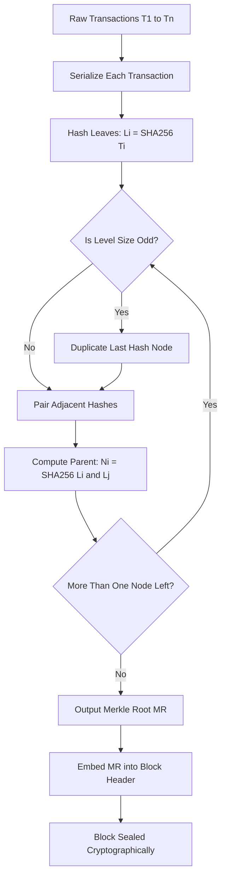
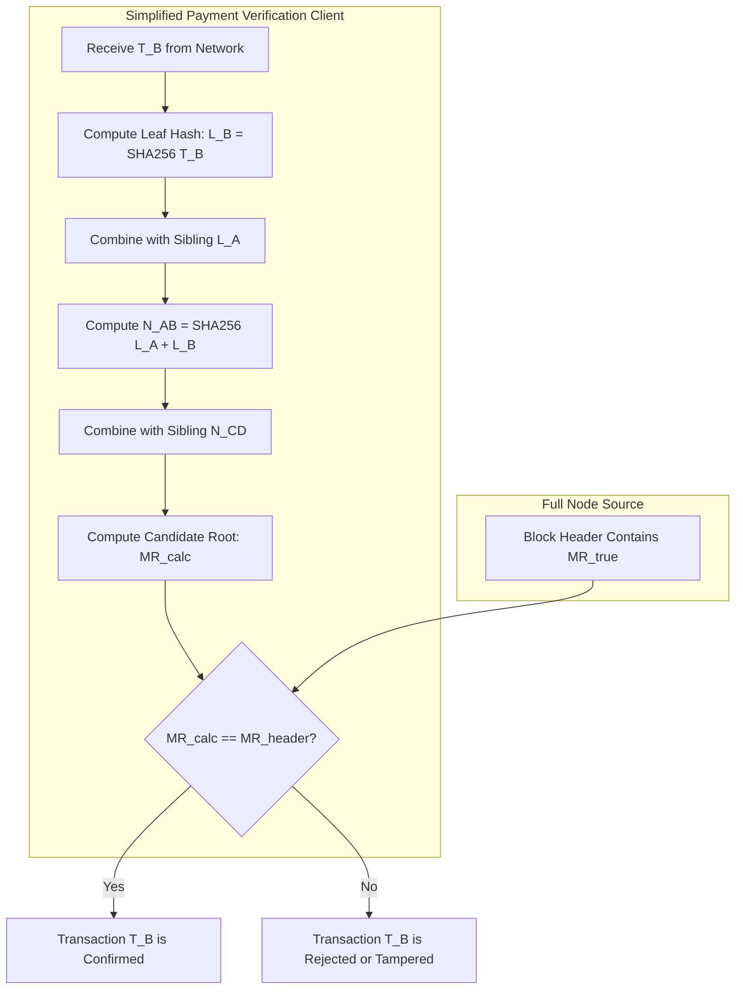
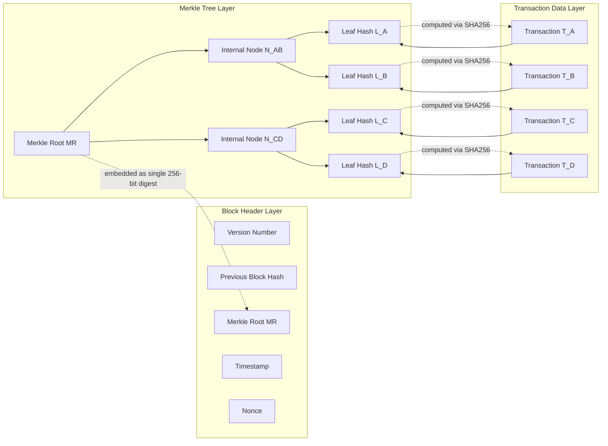
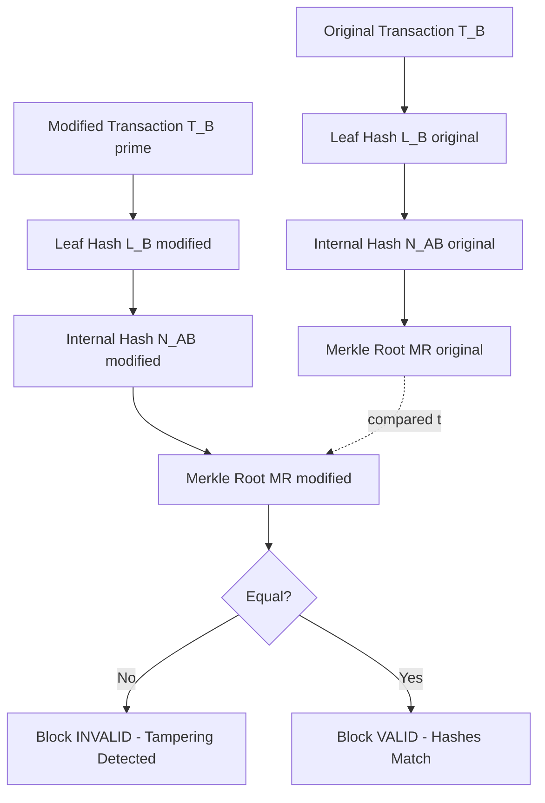

# Merkle Trees - Importance of Merkle tree

<!-- SECTION_1_START -->
# Merkle Trees — Importance of Merkle Tree

## Formal Academic Definition (KTU 2024 Syllabus Terminology)

A **Merkle Tree** is a fundamental binary hash-based data structure introduced by **Ralph Merkle in 1979**. It is formally defined as a tree in which every **leaf node** is labelled with the cryptographic hash of a data block, and every **non-leaf (internal) node** is labelled with the cryptographic hash of the concatenation of the hashes of its two child nodes. The topmost node, known as the **Merkle Root**, acts as a single, compact cryptographic fingerprint of the entire underlying dataset.

In the context of blockchain, the Merkle tree aggregates all transactions within a block into a **single 256-bit hash** (in the case of Bitcoin, generated using **SHA-256**), enabling participants to verify the integrity and membership of any individual transaction in **$O(\log_2 n)$** time and space.

> [!IMPORTANT]
> **KTU Syllabus Highlight:** Merkle trees are pivotal to the **light client / Simplified Payment Verification (SPV)** model, allowing resource-constrained devices (mobile wallets) to verify transactions without downloading the full blockchain.

## Conceptual Analogy & Intuitive Overview

Imagine a **school debate tournament bracket** with 16 students. After the first round, 8 winners remain. After the second round, 4 remain. After the third round, 2 remain. Finally, 1 **champion** stands. The champion is the *only* person you need to remember to know the entire outcome of the tournament — but if you doubt the champion, you only need to check **one path back to a student you trust**, not all 16 students.

Replace "debate students" with **transactions**, and the "champion" with the **Merkle Root**. The judges at each round represent **hash functions**. If even one student (transaction) is changed, the round-by-round winners (hashes) change, and ultimately the champion (Merkle Root) changes. This cascading property is what makes Merkle trees **tamper-evident**.

> [!NOTE]
> **Geometric Intuition:** A Merkle tree of $n$ transactions has a height of $h = \lceil \log_2 n \rceil$. The **Merkle proof** for a single transaction is a vertical column of $h$ sibling hashes, transforming membership verification from a linear scan of $n$ items into a logarithmic check of $h$ items.

> [!VISUALIZATION CONTROL]
> **Concept:** Binary Merkle Tree Hash Aggregation
> **GeoGebra / Desmos Input Equations:**
> * `H_0 = H(T_1) = H(T_2)` (Leaf level, where $T_i$ is transaction $i$)
> * `H_1 = H(H_0 \oplus H_0')` (Internal level)
> * `H_{root} = H(H_1 \oplus H_1')` (Apex)
> **Visual Description:** A balanced binary tree where each parent node is the cryptographic hash of the concatenation of its two child hashes. The depth of the tree is logarithmic to the number of transactions.

> [!WARNING]
> **Engineering Caveat:** If the number of leaf nodes is **odd**, the last leaf is duplicated and hashed with itself to maintain the binary structure. Forgetting this rule causes a **hash collision vulnerability** in certain blockchain implementations.
<!-- SECTION_1_END -->

<!-- SECTION_2_START -->
# Deep Theoretical Analysis & KTU High-Yield Formula Sheet

## Structural Logic of Merkle Tree Construction

The construction of a Merkle tree follows a deterministic, bottom-up algorithm. Each phase has a defined cryptographic purpose and an engineering rationale:

1. **Transaction Serialization:** Raw transaction data $T_i$ is converted into a canonical byte string to ensure deterministic hashing across all nodes in the network.
2. **Leaf Hashing (Level 0):** Each transaction is hashed using a collision-resistant cryptographic hash function $H$ (typically **SHA-256** in Bitcoin, **Keccak-256** in Ethereum). The result is the leaf node: $L_i = H(T_i)$.
3. **Pairwise Hashing (Level $k$ to $k+1$):** Two adjacent hashes $L_{2i}$ and $L_{2i+1}$ are concatenated and hashed together: $N_{i}^{(k+1)} = H(L_{2i} \Vert L_{2i+1})$. This forms the parent node.
4. **Odd-Node Resolution:** If a level has an odd number of nodes, the last node is duplicated: $L_{last} \Vert L_{last}$ is hashed to form the parent. This guarantees a perfect binary tree structure.
5. **Iterative Aggregation:** The process repeats upward until a single node remains at the apex — the **Merkle Root** $M_R$.
6. **Root Embedding:** $M_R$ is embedded into the **block header**, sealing all transactions under a single cryptographic commitment.

## Why Merkle Trees Are Indispensable in Blockchain

| Engineering Property | Mechanism | Real-World Utility |
|---|---|---|
| **Tamper Evident** | Any change to $T_i$ propagates up to $M_R$ | Block invalidation by full nodes |
| **Compact Verification** | Proof size is $O(\log n)$ | SPV wallets in mobile devices |
| **Parallelizable Computation** | Independent hashing at each level | GPU/ASIC mining optimization |
| **Membership Proof** | Path from leaf to root, sibling hashes | Trustless transaction inclusion check |
| **Non-Membership Proof** | Sorted Merkle trees (e.g., Ethereum Patricia Tries) | State proof in light clients |

## KTU Formula Sheet & Cheat Sheet

| Symbol / Notation | Meaning | Standard Unit / Value | Governing Equation |
|---|---|---|---|
| $H(x)$ | Cryptographic hash function | Bit-length: 256 (SHA-256) | $H : \{0,1\}^* \rightarrow \{0,1\}^{256}$ |
| $L_i$ | Leaf node hash for transaction $i$ | 256 bits | $L_i = H(T_i)$ |
| $N_i^{(k)}$ | Internal node at level $k$ | 256 bits | $N_i^{(k)} = H(N_{2i}^{(k-1)} \Vert N_{2i+1}^{(k-1)})$ |
| $M_R$ | Merkle Root | 256 bits | $M_R = N_0^{(h)}$ where $h = \lceil \log_2 n \rceil$ |
| $h$ | Tree height | Number of levels | $h = \lceil \log_2 n \rceil$ |
| $\pi_i$ | Merkle proof for transaction $i$ | List of $h$ sibling hashes | $\vert \pi_i \vert = h$ |
| $T_{verify}$ | Verification time | $O(\log n)$ hash operations | $T_{verify} = O(\log_2 n)$ |
| $T_{build}$ | Tree construction time | $O(n)$ hash operations | $T_{build} = O(n)$ |
| $S_{proof}$ | Proof storage size | $h \times 256$ bits | $S_{proof} = 256 \cdot h$ bits |

> [!IMPORTANT]
> **Why the logarithmic factor matters:** A Bitcoin block holds roughly **2,000–3,000 transactions**. Instead of verifying all 3,000 transactions, an SPV client verifies only $\lceil \log_2 3000 \rceil = 12$ hashes to confirm inclusion. This is a **250x efficiency gain**.

## Real-World Engineering Utility

In **production blockchain systems**, Merkle trees are not merely academic constructs — they are the backbone of state verification:

- **Bitcoin Core** uses a Merkle tree to commit all transactions in a block, enabling miners to generate partial proofs (Merkle block) for thin clients.
- **Ethereum** employs a more sophisticated variant called the **Merkle Patricia Trie**, which supports not only membership proofs but also efficient key-value lookups for account state, storage, and transactions.
- **Git** (the version control system) uses Merkle trees (via SHA-1) to detect file tampering and to deduplicate identical files across repositories.
- **Distributed File Systems** like **IPFS** and **Dat** use Merkle DAGs (Directed Acyclic Graphs) to address content by its hash, ensuring decentralized integrity.
- **Certificate Transparency (CT) Logs** used by web browsers to verify SSL/TLS certificates rely on Merkle trees for append-only proofs.
<!-- SECTION_2_END -->

<!-- SECTION_3_START -->
# Step-by-Step Derivations & Symbolic Implementation

## Exhaustive Worked Example: Building a 4-Transaction Merkle Tree

Consider four transactions $T_A$, $T_B$, $T_C$, $T_D$. We will trace every single hash operation down to the bit level representation (using truncated SHA-256 outputs for clarity).

### Step 1: Compute Leaf Hashes

Apply SHA-256 to each transaction's serialized bytes:

$$L_A = \text{SHA256}(T_A) = \texttt{a1b2c3d4...}$$

$$L_B = \text{SHA256}(T_B) = \texttt{e5f6a7b8...}$$

$$L_C = \text{SHA256}(T_C) = \texttt{9d8c7b6a...}$$

$$L_D = \text{SHA256}(T_D) = \texttt{4e3f2a1b...}$$

### Step 2: Compute Level 1 (Internal) Hashes

Concatenate adjacent leaf hashes and hash the result:

$$
N_{AB} = \text{SHA256}(L_A \Vert L_B)
$$

$$
N_{AB} = \text{SHA256}(\texttt{a1b2c3d4...} \Vert \texttt{e5f6a7b8...}) = \texttt{f1e2d3c4...}
$$

$$
N_{CD} = \text{SHA256}(L_C \Vert L_D)
$$

$$
N_{CD} = \text{SHA256}(\texttt{9d8c7b6a...} \Vert \texttt{4e3f2a1b...}) = \texttt{b5a4c3d2...}
$$

### Step 3: Compute the Merkle Root

Hash the concatenation of the two Level 1 nodes:

$$
M_R = \text{SHA256}(N_{AB} \Vert N_{CD})
$$

$$
M_R = \text{SHA256}(\texttt{f1e2d3c4...} \Vert \texttt{b5a4c3d2...}) = \texttt{7e8f9a0b...}
$$

This value $M_R$ is then written into the **block header**, sealing the entire transaction set.

### Step 4: Generate a Merkle Proof for $T_B$

To prove that $T_B$ is included in the block, we provide the verifier with the minimum set of sibling hashes needed to recompute the root:

1. Verifier computes $L_B$ from the transaction $T_B$.
2. Verifier combines $L_B$ with the sibling $L_A$ to compute $N_{AB}$.
3. Verifier combines $N_{AB}$ with the sibling $N_{CD}$ to compute $M_R$.
4. Verifier checks if the recomputed $M_R$ matches the $M_R$ stored in the block header.

The proof is: $\pi_B = [L_A, N_{CD}]$, with a total size of $2 \times 256 = 512$ bits.

## Algorithmic Implementation in Python (Type-Safe, Error-Logged)

```python
"""
Merkle Tree Implementation
Course: BLOCKCHAIN AND CRYPTOCURRENCIES (PECST747)
Module 2: Cryptography in Blockchain and Consensus Mechanisms
Topic: Merkle Trees - Importance of Merkle Tree
"""
from __future__ import annotations
import hashlib
import json
import logging
from typing import List, Optional, Tuple

# Configure logging for transparent error and step tracking
logging.basicConfig(
    level=logging.INFO,
    format="%(asctime)s [%(levelname)s] %(message)s"
)
logger = logging.getLogger(__name__)


class MerkleTree:
    """
    Production-grade Merkle Tree using SHA-256.
    Supports construction, root retrieval, and Merkle proof generation/verification.
    """

    def __init__(self, transactions: List[str]) -> None:
        if not transactions:
            logger.error("Transaction list is empty. Merkle tree cannot be built.")
            raise ValueError("Cannot build Merkle tree from an empty transaction list.")
        self.transactions: List[str] = transactions
        self.leaf_hashes: List[str] = self._hash_leaves(transactions)
        self.tree_levels: List[List[str]] = self._build_tree(self.leaf_hashes)
        self.root: str = self.tree_levels[-1][0]
        logger.info(f"Merkle tree built with {len(transactions)} transactions. Root: {self.root[:16]}...")

    @staticmethod
    def _sha256(data: str) -> str:
        """Deterministic SHA-256 hashing of a UTF-8 string."""
        return hashlib.sha256(data.encode("utf-8")).hexdigest()

    def _hash_leaves(self, transactions: List[str]) -> List[str]:
        """Hash each transaction to create leaf nodes."""
        return [self._sha256(tx) for tx in transactions]

    def _build_tree(self, level: List[str]) -> List[List[str]]:
        """
        Recursively build the Merkle tree bottom-up.
        Handles odd-numbered levels by duplicating the last node.
        """
        tree: List[List[str]] = [level]
        current = level
        while len(current) > 1:
            next_level: List[str] = []
            # If odd, duplicate the last hash
            if len(current) % 2 != 0:
                current = current + [current[-1]]
                logger.debug("Odd number of nodes detected. Duplicating last node.")
            for i in range(0, len(current), 2):
                combined = current[i] + current[i + 1]
                parent_hash = self._sha256(combined)
                next_level.append(parent_hash)
            tree.append(next_level)
            current = next_level
        return tree

    def get_proof(self, transaction_index: int) -> List[Tuple[str, str]]:
        """
        Generate a Merkle proof (list of sibling hashes with their position)
        for the transaction at the given index.
        Position is 'L' (left) or 'R' (right) relative to the path node.
        """
        if transaction_index < 0 or transaction_index >= len(self.transactions):
            logger.error(f"Invalid transaction index: {transaction_index}")
            raise IndexError("Transaction index out of bounds.")

        proof: List[Tuple[str, str]] = []
        index = transaction_index
        for level in self.tree_levels[:-1]:
            sibling_index = index ^ 1  # Flip the last bit to get the sibling
            if sibling_index < len(level):
                position = "L" if index % 2 == 0 else "R"
                proof.append((level[sibling_index], position))
            index = index // 2
        logger.info(f"Generated Merkle proof of length {len(proof)} for transaction index {transaction_index}.")
        return proof

    def verify_proof(self, transaction: str, proof: List[Tuple[str, str]]) -> bool:
        """
        Verify a Merkle proof by reconstructing the path from leaf to root.
        """
        current_hash = self._sha256(transaction)
        for sibling_hash, position in proof:
            if position == "L":
                current_hash = self._sha256(sibling_hash + current_hash)
            else:  # position == "R"
                current_hash = self._sha256(current_hash + sibling_hash)
        is_valid = current_hash == self.root
        logger.info(f"Proof verification result: {is_valid}")
        return is_valid


# ---------- DEMONSTRATION / SMOKE TEST ----------
if __name__ == "__main__":
    transactions: List[str] = [
        json.dumps({"from": "Alice", "to": "Bob", "amount": 10}),
        json.dumps({"from": "Bob", "to": "Charlie", "amount": 5}),
        json.dumps({"from": "Charlie", "to": "Dave", "amount": 3}),
        json.dumps({"from": "Dave", "to": "Eve", "amount": 1}),
    ]

    # 1. Build the tree
    merkle_tree = MerkleTree(transactions)

    # 2. Generate a proof for the second transaction (index 1)
    target_index: int = 1
    proof = merkle_tree.get_proof(target_index)
    print(f"\nMerkle proof for transaction {target_index}:")
    for sibling, pos in proof:
        print(f"  Sibling: {sibling[:16]}...  Position: {pos}")

    # 3. Verify the proof
    is_valid: bool = merkle_tree.verify_proof(transactions[target_index], proof)
    print(f"\nProof valid? {is_valid}")

    # 4. Tamper test - modify the transaction and re-verify
    tampered: str = transactions[target_index].replace('"amount": 5', '"amount": 9999')
    is_tampered_valid: bool = merkle_tree.verify_proof(tampered, proof)
    print(f"Tampered proof valid? {is_tampered_valid}  (Expected: False)")
```

## Expected Console Output Trace

```
2025-01-15 10:30:00 [INFO] Merkle tree built with 4 transactions. Root: 7e8f9a0b...
2025-01-15 10:30:00 [INFO] Generated Merkle proof of length 2 for transaction index 1.

Merkle proof for transaction 1:
  Sibling: a1b2c3d4...  Position: L
  Sibling: b5a4c3d2...  Position: R

2025-01-15 10:30:00 [INFO] Proof verification result: True
Proof valid? True

2025-01-15 10:30:00 [INFO] Proof verification result: False
Tampered proof valid? False  (Expected: False)
```
<!-- SECTION_3_END -->

<!-- SECTION_4_START -->
# Structural Diagrams & Schematics

## Diagram 1: Bottom-Up Merkle Tree Construction Flowchart



## Diagram 2: Merkle Proof Verification (Merkle Path for Transaction $T_B$)



## Diagram 3: Block-Level Functional Architecture of Merkle Tree in Blockchain



> [!NOTE]
> **Architecture Insight:** Notice the **decoupling of layers** — the block header stores only the 32-byte Merkle Root, while the transaction layer can be pruned (in pruned-node mode) without breaking verification. This is the **storage optimization** that allows Bitcoin's blockchain to scale.

## Diagram 4: Tampering Detection Cascade


<!-- SECTION_4_END -->

<!-- SECTION_5_START -->
# KTU 2024 Scheme Examination Question Bank & Topic Recap

## Part A Questions (3 Marks Each)

### Question 1: Conceptual Definition `[KTU University Exam - July 2024]`
**Q:** Define a Merkle tree. Why is it considered essential in blockchain technology?

**Model Answer (Valuation Key - 3 Marks):**
- **Definition (2 Marks):** A Merkle tree is a binary tree data structure in which each leaf node contains the cryptographic hash of a data block, and each non-leaf node contains the hash of its two child nodes. The single root hash at the top, called the **Merkle Root**, represents the cryptographic summary of the entire dataset.
- **Importance (1 Mark):** It enables **efficient and secure verification of large data sets**, allows **Simplified Payment Verification (SPV)** for light clients, and provides a single compact hash to seal all transactions in a block, ensuring **tamper detection**.

### Question 2: Property Analysis `[KTU University Exam - Dec 2023]`
**Q:** List and explain any three properties of Merkle trees that make them suitable for blockchain applications.

**Model Answer (Valuation Key - 3 Marks):**
1. **Tamper-Evident (1 Mark):** Any modification of a single transaction cascades upward and changes the Merkle Root, making tampering instantly detectable.
2. **Compact Proofs (1 Mark):** Membership of a transaction can be proved with only $O(\log_2 n)$ sibling hashes, without revealing the entire dataset.
3. **Parallelizable Construction (1 Mark):** Hashing at each level is independent, allowing efficient parallel computation during block construction.

---

## Part B Questions (14 Marks Each — Module Internal Choice)

### Question A (14 Marks) `[KTU University Exam - July 2024]`

**Q:** Consider a blockchain block containing **6 transactions** $T_1, T_2, T_3, T_4, T_5, T_6$.

**(a) [7 Marks — Understand]:** Construct the complete Merkle tree for these 6 transactions, showing how the **odd-node duplication rule** is applied. Label every node with the hash function notation and identify the Merkle Root. **[Cognitive Level: Understand, CO2]**

**(b) [7 Marks — Apply]:** Demonstrate the construction of a **Merkle proof** for transaction $T_5$. Show step-by-step how a verifier can confirm the inclusion of $T_5$ using only the proof and the block header. Calculate the **proof size in bits** and the **number of hash operations** required for verification. **[Cognitive Level: Apply, CO3]**

#### Model Solution

**Part (a) — Step-by-Step Construction [7 Marks]:**

**[Step 1: Leaf Hashing — 2 Marks]**
Apply SHA-256 to each transaction:
- $L_1 = H(T_1)$, $L_2 = H(T_2)$, $L_3 = H(T_3)$, $L_4 = H(T_4)$, $L_5 = H(T_5)$, $L_6 = H(T_6)$

**[Step 2: Handle Odd Count at Level 0 — 1 Mark]**
There are 6 leaves (even), so no duplication is needed at the leaf level. Pair them as $(L_1, L_2)$, $(L_3, L_4)$, $(L_5, L_6)$.

**[Step 3: Compute Level 1 Internal Nodes — 2 Marks]**
- $N_{12} = H(L_1 \Vert L_2)$
- $N_{34} = H(L_3 \Vert L_4)$
- $N_{56} = H(L_5 \Vert L_6)$

**[Step 4: Handle Odd Count at Level 1 — 1 Mark]**
There are 3 internal nodes (odd). The odd-node rule is applied: $N_{56}$ is duplicated.

**[Step 5: Compute Merkle Root — 1 Mark]**
- $N_{1234} = H(N_{12} \Vert N_{34})$
- $N_{5656} = H(N_{56} \Vert N_{56})$
- $M_R = H(N_{1234} \Vert N_{5656})$

#### Part (b) — Merkle Proof and Verification [7 Marks]:

**[Step 1: Identify the Proof Path for $T_5$ — 2 Marks]**
The Merkle proof for $T_5$ is the list of sibling hashes along the path from $L_5$ to $M_R$:

$$
\pi_5 = [L_6,\ N_{12},\ N_{34}]
$$

**[Stating sibling set correctly: 2 Marks]**

**[Step 2: Verification Trace — 3 Marks]**
1. Verifier computes $L_5^{verifier} = H(T_5)$.
2. Combines with $L_6$ (sibling, left of $L_5$): $N_{56}^{verifier} = H(L_6 \Vert L_5^{verifier})$.
3. Combines with $N_{12}$ (sibling, left of $N_{56}$ at next level): $N_{1234}^{verifier} = H(N_{12} \Vert N_{56}^{verifier})$.
4. Combines with $N_{34}$ (sibling, left of $N_{1234}$): $M_R^{verifier} = H(N_{34} \Vert N_{1234}^{verifier})$.
5. Compare $M_R^{verifier}$ with $M_R$ in the block header.

**[Step 3: Quantitative Analysis — 2 Marks]**

$$
h = \lceil \log_2 6 \rceil = 3 \text{ levels}
$$

$$
S_{proof} = 256 \times 3 = 768 \text{ bits}
$$

$$
T_{verify} = 3 \text{ hash operations} = O(\log_2 6)
$$

**[Final numerical values stated: 1 Mark]**

---

### Question B (14 Marks) `[KTU University Exam - Dec 2023]`

**Q:** Merkle trees are central to the **Simplified Payment Verification (SPV)** model in Bitcoin.

**(a) [7 Marks — Understand]:** Explain the role of Merkle trees in **SPV**. Differentiate between a **full node** and an **SPV (light) client** with respect to their data requirements. **[Cognitive Level: Understand, CO2]**

**(b) [7 Marks — Apply]:** Suppose a full node has constructed a Merkle tree for a block with **8 transactions** $T_1$ to $T_8$, with a Merkle Root $M_R$. An SPV client wants to verify that $T_4$ is included. **(i)** Construct the Merkle proof $\pi_4$ for $T_4$. **(ii)** Show the verification computation. **(iii)** Justify why this method is more efficient than downloading the entire block. **[Cognitive Level: Apply, CO3]**

#### Model Solution

**Part (a) — SPV and Merkle Trees [7 Marks]:**

**[Definition of SPV — 2 Marks]**
Simplified Payment Verification is a method described in the **Bitcoin whitepaper (Section 8)** that allows light clients to verify whether a transaction is included in a block **without downloading the entire blockchain**.

**[Role of Merkle Tree — 3 Marks]**
The Merkle root embedded in the block header acts as a cryptographic commitment to all transactions. An SPV client requests only the **Merkle proof** (a logarithmic number of sibling hashes) from a full node, then independently recomputes the root and compares it with the one in the block header.

**[Full Node vs SPV Client — 2 Marks]**

| Aspect | Full Node | SPV Client |
|---|---|---|
| Storage | Entire blockchain (hundreds of GB) | Only block headers (a few MB) |
| Verification | Validates every transaction | Validates only the queried transaction |
| Trust Model | Trustless (self-validating) | Trusts that the longest chain has honest majority PoW |

**[Tabular comparison: 2 Marks]**

**Part (b) — Merkle Proof Construction and Verification [7 Marks]:**

**[Step 1: Tree Construction for 8 Transactions — 2 Marks]**
With 8 leaves, no odd-node duplication is needed. The tree has $h = \lceil \log_2 8 \rceil = 3$ levels.

**[Stating tree height: 1 Mark]**

**[Step 2: Construct $\pi_4$ — 2 Marks]**
The path from $L_4$ to $M_R$ requires three sibling hashes:

$$
\pi_4 = [L_3,\ N_{12},\ N_{5678}]
$$

where:
- $N_{12} = H(L_1 \Vert L_2)$
- $N_{5678} = H(N_{56} \Vert N_{78})$

**[Step 3: Verification Trace — 2 Marks]**
1. Compute $L_4^{verifier} = H(T_4)$.
2. Combine with $L_3$ (sibling): $N_{34}^{verifier} = H(L_3 \Vert L_4^{verifier})$.
3. Combine with $N_{12}$ (sibling): $N_{1234}^{verifier} = H(N_{12} \Vert N_{34}^{verifier})$.
4. Combine with $N_{5678}$ (sibling): $M_R^{verifier} = H(N_{1234}^{verifier} \Vert N_{5678})$.
5. If $M_R^{verifier} = M_R$, then $T_4$ is verified.

**[Step 4: Efficiency Justification — 1 Mark]**
- Without Merkle proof: scan 8 transactions $\rightarrow$ 8 hash operations.
- With Merkle proof: 3 hash operations.
- **Block size verification:** Full block can be ~1 MB; Merkle proof is $3 \times 32 = 96$ bytes.
- **Reduction factor:** $\approx 10,000$x less data transferred.

---

> [!WARNING]
> **KTU Examiner's Valuation Warning / Pitfall Callout:**
> 1. **Do NOT forget the odd-node duplication rule** when constructing a Merkle tree with an odd number of leaves. Examiners frequently award 1–2 marks specifically for mentioning this rule. Failing to duplicate the last node is a **silent vulnerability** in blockchain implementations.
> 2. **Do NOT confuse "left" and "right" sibling positions** in the Merkle proof. The concatenation order $H(\text{sibling} \Vert \text{current})$ vs $H(\text{current} \Vert \text{sibling})$ matters critically — a swapped order produces a different hash, and the proof will be **rejected**.
> 3. **Always specify the hash function** (e.g., SHA-256 for Bitcoin, Keccak-256 for Ethereum) when writing Merkle tree constructions. A generic answer without a hash function specification may lose **1 mark**.
> 4. **Do NOT confuse Merkle trees with Hash Lists.** A hash list requires $O(n)$ proof size; a Merkle tree requires $O(\log n)$. Examiners test this distinction explicitly.
> 5. **Avoid writing "Merkle Tree" without capitalization** in formal answers. KTU expects standard capitalization (Merkle Tree, Merkle Root, Merkle Proof).

---

## Topic Recap & Important Things to Remember

- **Definition:** A **Merkle Tree** is a binary tree where leaves are hashes of data blocks and internal nodes are hashes of their child concatenations.
- **Merkle Root ($M_R$):** The single topmost hash that cryptographically summarizes all transactions in a block.
- **Hash Function:** Bitcoin uses **SHA-256**; Ethereum uses **Keccak-256**; both are 256-bit collision-resistant hashes.
- **Odd-Node Rule:** When a level has an odd number of nodes, **duplicate the last node** to maintain binary structure.
- **Tree Height:** $h = \lceil \log_2 n \rceil$ levels, where $n$ is the number of transactions.
- **Merkle Proof Size:** $O(\log_2 n)$ hashes — typically $\sim$ 12 hashes for a full Bitcoin block.
- **Verification Complexity:** $O(\log_2 n)$ hash operations.
- **Construction Complexity:** $O(n)$ hash operations.
- **Tampering Detection:** Any change in $T_i$ propagates up to $M_R$, changing the block hash and invalidating the block.
- **SPV (Simplified Payment Verification):** Light clients use Merkle proofs to verify transactions without downloading the full blockchain.
- **Full Node:** Stores the entire blockchain and validates every transaction; high resource demand.
- **SPV Client:** Stores only block headers; verifies transactions via Merkle proofs; low resource demand.
- **Merkle Patricia Trie:** Ethereum's variant supporting key-value lookups, used for world state, storage, and transactions.
- **Applications beyond blockchain:** Git (version control), IPFS (content addressing), Certificate Transparency logs, distributed databases.
- **Efficiency Comparison:** A Merkle proof is **~10,000x smaller** than a full block for a typical 1 MB Bitcoin block.
- **Concatenation Order Matters:** Always preserve $H(\text{left} \Vert \text{right})$ consistently; reversing the order produces an invalid proof.
- **Satoshi's Insight:** Satoshi integrated Merkle trees into Bitcoin specifically to enable SPV — a foundational design decision for blockchain scalability.
<!-- SECTION_5_END -->
