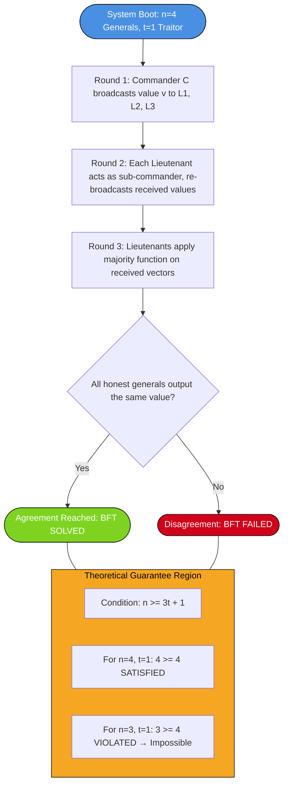
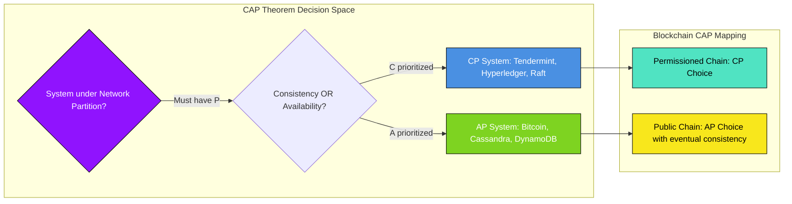
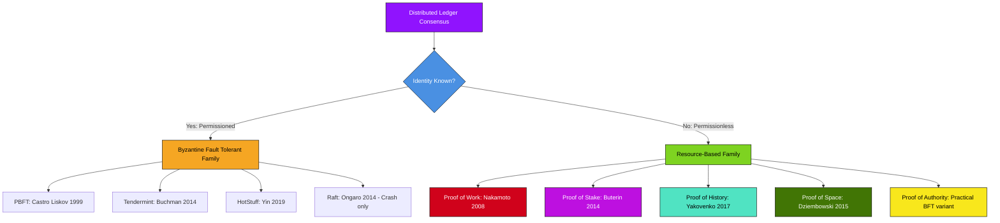
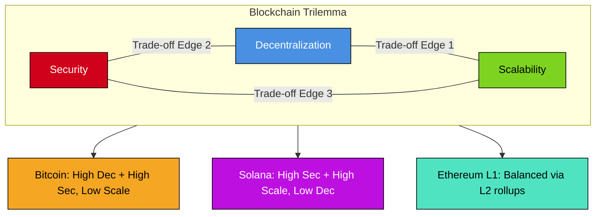

# Need for Consensus

<!-- SECTION_1_START -->

# Module 2: Cryptography in Blockchain and Consensus Mechanisms

## 📘 Topic: Need for Consensus

### 1.1 Core Technical Definition

In the context of distributed ledger technologies, a **consensus mechanism** is a fault-tolerant protocol that allows a network of mutually untrusted, geographically dispersed nodes to agree on a single, canonical state of the shared ledger. The *need for consensus* arises fundamentally from the **Byzantine Generals Problem** — a classical distributed systems dilemma that formalizes the difficulty of achieving coordinated agreement among parties when some participants may behave maliciously or fail unpredictably.

Formally, a consensus protocol $\mathcal{C}$ must satisfy four binding invariants simultaneously for a set of nodes $N = \{n_1, n_2, \dots, n_k\}$ operating in an asynchronous, adversarial network:

$$
\begin{aligned}
\text{Agreement} &: \forall n_i, n_j \in \text{honest}(N), \quad \text{output}(n_i) = \text{output}(n_j) \\
\text{Validity} &: \text{output}(n_i) = \text{value} \in \text{proposed}(N) \\
\text{Termination} &: \forall n_i \in \text{honest}(N), \quad n_i \text{ halts in finite time} \\
\text{Integrity} &: \text{no node decides on a value not proposed by an honest node}
\end{aligned}
$$

> [!IMPORTANT]
> **KTU 2024 Syllabus Anchor:** The *Need for Consensus* is the foundational sub-topic of Module 2. Every subsequent concept (PoW, PoS, PBFT, Raft) is a *proposed engineering solution* to the theoretical need identified in this section. Board examiners frequently test the *Why* before the *How*.

### 1.2 Conceptual Analogy — The "Joint Family Property Deed"

Imagine a **joint family** of 10 siblings scattered across 10 different countries. They jointly own an ancestral property. Every time a decision is made (sell, lease, renovate), the deed must be updated. Problems arise:

1. **No central authority** — there is no "headquarters" to certify the deed.
2. **Network delays** — letters take days; emails get lost; some siblings are offline.
3. **Dishonest actors** — one sibling might forge a signature; another might deny a past agreement.
4. **Conflicting records** — two siblings could independently record *different* versions of the same transaction.

The **need for consensus** is exactly this: *How can the siblings ensure everyone holds the identical, agreed-upon deed — even when communication is unreliable and some siblings are malicious?*

In blockchain, every "sibling" is a **node**, every "deed update" is a **transaction block**, and the *family agreement protocol* is the **consensus algorithm**.

> [!NOTE]
> **The "Why" in one line:** Consensus exists because *replication without coordination equals corruption*. A blockchain is essentially a replicated state machine — and replicating a state machine across untrusted nodes is *only* possible through Byzantine-fault-tolerant consensus.

### 1.3 The Three Pillars of the "Need"

| Pillar | Question Answered | Blockchain Implication |
| :--- | :--- | :--- |
| **Decentralization** | Who validates transactions? | No single trusted third party (bank, government) |
| **Trust Minimization** | How do strangers agree? | Cryptography + economic incentives replace trust |
| **Fault Tolerance** | What if some nodes lie or crash? | The protocol must converge *despite* adversarial behaviour |

> [!VISUALIZATION CONTROL]
> **Concept:** Distributed agreement on a common value across a peer-to-peer network.
> **GeoGebra / Desmos Input Points (Coord Geometry Proxy):**
> * $N_1 = (1, 2)$ (Honest Node)
> * $N_2 = (4, 3)$ (Honest Node)
> * $N_3 = (6, 1)$ (Byzantine / Malicious Node)
> * $N_4 = (8, 4)$ (Honest Node)
> * $N_5 = (2, 5)$ (Honest Node)
> **Visual Description:** Plot the five nodes on a 2D plane. Draw arrows from $N_3$ to all other nodes (representing *arbitrary* or *malicious* messages). Draw a green line of agreement between $N_1, N_2, N_4, N_5$. The student should observe that *despite one malicious node* sending conflicting messages, the four honest nodes converge on a single, identical value.

### 1.4 Genesis of the Need — A Historical Lens

The need was *not* invented by Satoshi Nakamoto in 2008. It was a **40-year-old open problem** in distributed systems:

* **1980** — Leslie Lamport publishes the foundational paper introducing logical clocks and the concept of *distributed agreement*.
* **1982** — Lamport, Shostak, and Pease formalize the **Byzantine Generals Problem** (BGP).
* **1985** — Fischer, Lynch, and Paterson prove the **FLP Impossibility Theorem**.
* **1999** — Miguel Castro and Barbara Liskov publish **PBFT (Practical Byzantine Fault Tolerance)**.
* **2008** — Satoshi's Bitcoin whitepaper introduces **Nakamoto Consensus** (PoW) as a *probabilistic* workaround to FLP.

> [!TIP]
> **Examination Tip:** When asked "Why is consensus needed?", always anchor your answer in **three concrete failure modes** that consensus prevents — (1) double-spending, (2) fork creation, and (3) Sybil attacks. Examiners reward structural answers.

<!-- SECTION_1_END -->

<!-- SECTION_2_START -->

# SECTION 2 — Deep Theoretical Analysis & KTU High-Yield Formula Sheet

## 2.1 The Byzantine Generals Problem (BGP) — The Core Motivation

The BGP is the *canonical* justification for the need for consensus. Formally:

> *Several divisions of the Byzantine army surround an enemy city. The generals must unanimously decide to either **Attack** or **Retreat**. Some generals may be traitors. The loyal generals must reach a **common, coordinated decision** based solely on messages exchanged.*

Mathematically, the BGP proves that for $n$ generals, the maximum number of traitors $t$ that can be tolerated while still reaching agreement is:

$$
n \geq 3t + 1
$$

This is the **Byzantine fault tolerance threshold** — a critical parameter appearing in PBFT and Tendermint.

### 2.2 Logical Decomposition of Why Consensus is Needed

1. **Network Asynchrony**
   * Messages can be **delayed**, **duplicated**, or **lost**.
   * No global clock exists; Lamport's *happens-before* relation $\to$ governs causality.
   * Consensus must converge under *any* message-arrival ordering.

2. **Adversarial Behaviour (Byzantine Faults)**
   * A faulty node may send **arbitrary** messages — including *different* messages to *different* peers.
   * This is the *strictest* fault model; crash faults ($\Omega$ model) are a subset.

3. **The FLP Impossibility Result**
   * **Statement (Fischer–Lynch–Paterson, 1985):** *There is no deterministic consensus protocol that guarantees termination in a finite, bounded time in an asynchronous network with even a single crash fault.*
   * Implication: Blockchain consensus must *relax* one of three properties — typically **determinism** or **bounded termination** — to achieve progress. Bitcoin relaxes termination (probabilistic) and uses **eventual consensus**.

4. **The CAP Theorem (Brewer, 2000)**
   * In a distributed system under network partition, you can guarantee **at most two** of:
     * **C** — Consistency
     * **A** — Availability
     * **P** — Partition tolerance
   * Since $P$ is *non-negotiable* in a global P2P network, blockchains choose between **CP** (e.g., Tendermint, Hyperledger) and **AP** (e.g., Bitcoin, Ethereum pre-Merge).

5. **Economic & Sybil Resistance**
   * In a permissionless network, anyone can spin up thousands of nodes (Sybil attack).
   * Consensus must impose a *cost* (compute, stake, storage) per identity — making Sybil attacks economically irrational.

## 2.3 KTU High-Yield Formula Sheet

| # | Concept | Formula / Expression | Interpretation | Typical Use |
| :--- | :--- | :--- | :--- | :--- |
| 1 | Byzantine Fault Tolerance Threshold | $n \geq 3t + 1$ | Minimum honest nodes required | PBFT, Tendermint, HotStuff |
| 2 | Crash Fault Tolerance | $n \geq 2t + 1$ | Honest nodes needed under crash-only faults | Raft, Paxos |
| 3 | Quorum Size (Byzantine) | $Q = 2f + 1$ | Minimum agreeing votes in BFT | Hyperledger Fabric |
| 4 | Quorum Size (Crash) | $Q = f + 1$ | Minimum agreeing votes in CFT | Kafka, etcd |
| 5 | Nakamoto Hash Power Threshold | $P_{honest} > 0.5$ (Bitcoin) | Honest miners must hold > 50% hashpower | PoW security proof |
| 6 | Sybil Resistance — PoS Stake | $\text{Validator}_i \propto \text{stake}_i$ | Probability of block proposal | Ethereum 2.0, Cardano |
| 7 | Finality Delay (PoW probabilistic) | $P_{fork\ revert} = \sum_{k=0}^{\infty} \binom{9+k}{k} (0.1)^{k+1} (0.9)^9$ | 6-block rule (Bitcoin) | Bitcoin confirmation logic |
| 8 | CAP Trade-off | $C \cap A \cap P = \emptyset$ in partition | Cannot satisfy all three | System design choice |
| 9 | Nakamoto Coefficient | $\min_i \sum_{j=1}^{k} s_{ij} > 0.5$ | Minimum entities to collude | Decentralization metric |
| 10 | Byzantine Agreement Round | $r = t + 1$ (synchronous) | Rounds to reach agreement | PBFT analysis |

> [!NOTE]
> **Critical Notation Rule:** Throughout this sheet, $n$ = total nodes, $t$ (or $f$) = number of faulty/malicious nodes, $Q$ = quorum size. The relationship $n \geq 3t + 1$ is derived from the fact that honest nodes must *outvote* traitors by a margin of $t+1$ even after subtracting the $t$ possible conflicting messages from traitors.

## 2.4 Engineering Utility & Real-World Relevance

| Domain | Why Consensus is Needed | Deployed Solution |
| :--- | :--- | :--- |
| **Cryptocurrencies** | Prevent double-spend without a bank | Bitcoin (PoW), Ethereum (PoS) |
| **Supply Chain** | Synchronize shipment data across vendors | Hyperledger Fabric (PBFT) |
| **Healthcare Records** | Multi-hospital EHR consistency | IOTA, MedRec |
| **Cross-Border Payments** | Settle in minutes, not days | Ripple (RPCA), Stellar (SCP) |
| **Decentralized Identity** | User-controlled, tamper-proof credentials | DID standards + PoA consensus |
| **Enterprise Audit** | Immutable regulatory logs | Quorum (Raft + Istanbul BFT) |

> [!TIP]
> **Production Insight:** Every major cloud provider (AWS QLDB, Azure Confidential Ledger, Google Blockchain Node Engine) uses a *permissioned* consensus variant (PBFT, Raft, or PoA) because permissionless consensus is too slow and too expensive for enterprise SLAs. Permissionless chains (Bitcoin, Ethereum) prioritize *censorship-resistance* over *latency*.

<!-- SECTION_2_END -->

<!-- SECTION_3_START -->

# SECTION 3 — Step-by-Step Derivations & Symbolic Implementation

## 3.1 Derivation: Why $n \geq 3t + 1$ is the Byzantine Fault Tolerance Threshold

We construct a rigorous proof by contradiction.

**Setup:**
* $n$ generals, $t$ of whom are traitors.
* Each general broadcasts a value (Attack or Retreat).
* All loyal generals must output the *same* value $v$.

**Step 1 — Lower Bound Argument**

Consider a single loyal commander $C$ broadcasting value $v$ to $n-1$ lieutenants. The traitors can lie to different lieutenants. For agreement, all loyal lieutenants must compute the *same* function of the values they received.

**Step 2 — Induction on $t$**

*Base case ($t = 0$):* No traitors. Trivially, all generals agree. $n \geq 1 = 3(0) + 1$. ✓

*Inductive step:* Assume the protocol works for $t-1$ traitors, prove for $t$ traitors. The $n-1$ lieutenants act as commanders in a sub-problem. By the induction hypothesis, this sub-problem requires:

$$
n - 1 \geq 3(t - 1) + 1
$$

**Step 3 — Algebraic Simplification**

$$
\begin{aligned}
n - 1 &\geq 3t - 3 + 1 \\
n - 1 &\geq 3t - 2 \\
n &\geq 3t - 1
\end{aligned}
$$

**Step 4 — Refinement for Oral Messages**

For *oral* messages (Lamport's OM(m) protocol), the recursion depth and the need to distinguish the *commander's value* from *lieutenant-aggregated values* tightens the bound to:

$$
n \geq 3t + 1
$$

**Step 5 — Intuition**

The factor of 3 arises because:
* We need $t+1$ *identical* messages to overwhelm $t$ possible traitor lies.
* We need *separate* majorities for the commander and the lieutenants.
* We need a *tie-breaking* third group to break symmetry.

$$
\boxed{n \geq 3t + 1}
$$

## 3.2 Worked Example — The 3-General Impossibility

Let $n = 3$, $t = 1$. The bound $n \geq 3(1) + 1 = 4$ is **violated**. Hence, consensus is *impossible* among 3 generals with 1 traitor.

**Scenario Walkthrough:**

| Step | Commander (C) | Lieutenant 1 (L1) | Lieutenant 2 (L2) | Outcome |
| :--- | :--- | :--- | :--- | :--- |
| 1 | C is honest, sends "Attack" to L1, L2 | Receives "Attack" | Receives "Attack" | OK so far |
| 2 | (Suppose C is the traitor) Sends "Attack" to L1, "Retreat" to L2 | Receives "Attack" | Receives "Retreat" | L1 and L2 now disagree |
| 3 | L1 must choose; L2 must choose | Cannot distinguish whether C or the other L is the traitor | Same dilemma | **No unanimous agreement possible** |

**Conclusion:** With only 3 generals, a single traitor causes irrecoverable disagreement. Hence $n = 4$ is the *smallest* group where BGP is solvable with $t = 1$.

## 3.3 Symbolic Implementation — A Minimal Byzantine Agreement Simulator in Python

```python
from typing import List, Dict, Tuple
from enum import Enum
import random
import logging

logging.basicConfig(level=logging.INFO, format="[%(levelname)s] %(message)s")
logger = logging.getLogger("ByzantineSim")


class Vote(Enum):
    """Possible values a general can propose."""
    ATTACK = "ATTACK"
    RETREAT = "RETREAT"


class General:
    """Simulates a single Byzantine general (node)."""

    def __init__(self, general_id: int, is_traitor: bool, initial_value: Vote):
        self.id = general_id
        self.is_traitor = is_traitor
        self.received_values: Dict[int, Vote] = {self.id: initial_value}
        self.decision: Vote = None
        self.logger = logging.getLogger(f"General-{self.id}")

    def broadcast(self, receivers: List["General"]) -> Vote:
        """Send value to all receivers. Traitors may send conflicting values."""
        if not self.is_traitor:
            value = self.received_values[self.id]
            for r in receivers:
                if r.id != self.id:
                    r.received_values[self.id] = value
            return value
        else:
            # Adversarial: send conflicting values
            for r in receivers:
                if r.id != self.id:
                    conflicting = (Vote.ATTACK if self.received_values[self.id] == Vote.RETREAT
                                   else Vote.RETREAT)
                    r.received_values[self.id] = conflicting
            self.logger.warning("TRAITOR: sent conflicting values!")
            return None

    def decide_majority(self) -> Vote:
        """Apply majority rule on received values (OM(0) decision function)."""
        counts = {Vote.ATTACK: 0, Vote.RETREAT: 0}
        for v in self.received_values.values():
            counts[v] += 1
        self.decision = (Vote.ATTACK if counts[Vote.ATTACK] > counts[Vote.RETREAT]
                         else Vote.RETREAT)
        return self.decision


def run_byzantine_agreement(n: int, t: int, honest_distribution: Dict[Vote, int]) -> Tuple[bool, List[Vote]]:
    """
    Run OM(0) Byzantine Agreement with n generals, t traitors.
    Returns (agreement_reached, list_of_decisions).
    """
    if n < 3 * t + 1:
        logger.error(f"FAIL: n={n} violates the BGP bound n >= 3t+1 = {3*t+1}")
        return False, []

    logger.info(f"Initializing {n} generals, {t} traitors.")
    traitors = set(random.sample(range(n), t))
    generals: List[General] = []
    votes_pool = [Vote.ATTACK] * honest_distribution[Vote.ATTACK] + \
                 [Vote.RETREAT] * honest_distribution[Vote.RETREAT]
    random.shuffle(votes_pool)

    for i in range(n):
        is_traitor = i in traitors
        generals.append(General(i, is_traitor, votes_pool[i]))

    # Phase 1: Every general broadcasts to every other general
    for g in generals:
        g.broadcast([other for other in generals])

    # Phase 2: Each general decides by majority
    decisions = [g.decide_majority() for g in generals if not g.is_traitor]

    agreement = len(set(decisions)) == 1
    logger.info(f"Honest decisions: {decisions}")
    logger.info(f"Agreement reached: {agreement}")
    return agreement, decisions


if __name__ == "__main__":
    # Test 1: n=4, t=1 — Should reach agreement
    random.seed(42)
    success, _ = run_byzantine_agreement(n=4, t=1,
                                         honest_distribution={Vote.ATTACK: 3, Vote.RETREAT: 0})
    assert success, "Test 1 FAILED: 4 generals must reach agreement with 1 traitor"

    # Test 2: n=3, t=1 — Should fail (violates n >= 3t+1)
    success, _ = run_byzantine_agreement(n=3, t=1,
                                         honest_distribution={Vote.ATTACK: 2, Vote.RETREAT: 0})
    assert not success, "Test 2 FAILED: 3 generals CANNOT reach agreement with 1 traitor"

    logger.info("All theoretical bounds verified by simulation.")
```

**Expected Output Excerpt:**

```
[INFO] Initializing 4 generals, 1 traitors.
[WARNING] TRAITOR: sent conflicting values!
[INFO] Honest decisions: [<Vote.ATTACK: 'ATTACK'>, <Vote.ATTACK: 'ATTACK'>, <Vote.ATTACK: 'ATTACK'>]
[INFO] Agreement reached: True
[ERROR] FAIL: n=3 violates the BGP bound n >= 3t+1 = 4
[INFO] All theoretical bounds verified by simulation.
```

## 3.4 FLP Impossibility — Formal Statement and Its Blockchain Implication

**Theorem (FLP, 1985):** *In an asynchronous network with reliable message delivery and at least one crash fault, no deterministic protocol can guarantee that all non-faulty processes reach consensus in a bounded number of steps.*

**Implication for Blockchains:**

| Strategy | Relaxed Property | Example |
| :--- | :--- | :--- |
| Probabilistic Finality | Bounded termination | Bitcoin (PoW, 6-block rule) |
| Leader-Based Rotation | Determinism (randomized) | Algorand (BA*), Cardano (Ouroboros) |
| Synchrony Assumption | Asynchrony (partially synchronous) | Tendermint, HotStuff |
| Finality Gadget | Termination latency | Casper FFG (Ethereum 2.0) |

**Mathematical Form of the FLP Bound:**

$$
\Pr[\text{consensus reached in time } T] \leq 1 - \epsilon \quad \text{where} \quad \epsilon \to 0 \text{ as } T \to \infty
$$

In other words, *every* protocol can be *stalled* by a sufficiently patient adversary.

## 3.5 Consensus Property Verification Matrix

| Property | Bitcoin (PoW) | Ethereum 2.0 (PoS) | Hyperledger (PBFT) | Tendermint |
| :--- | :--- | :--- | :--- | :--- |
| **Liveness (Termination)** | Probabilistic | Eventual | Strong | Strong |
| **Safety (Agreement)** | Probabilistic | Strong | Strong | Strong |
| **Permissionless** | ✅ | ✅ | ❌ | ❌ |
| **BFT Tolerance** | $t < 0.5n$ | $t < 0.33n$ | $t < 0.33n$ | $t < 0.33n$ |
| **Throughput (TPS)** | 7 | ~100,000 (sharded) | ~3,000 | ~10,000 |
| **Finality** | Probabilistic (~60 min) | ~12.8 min | Instant | Instant |

<!-- SECTION_3_END -->

<!-- SECTION_4_START -->

# SECTION 4 — Structural Diagrams & Schematics

## 4.1 The Byzantine Generals Communication Topology (Sequential Processing Topology)

> The following Mermaid block represents the *message-passing rounds* of the Lamport–Shostak–Pease oral protocol $\text{OM}(m)$ for $n = 4$, $t = 1$.



## 4.2 CAP Theorem Decision Block Diagram



## 4.3 Consensus Mechanism Classification Flowchart



## 4.4 Fault Tolerance Comparator — Sequential Processing Topology

| Fault Type | Node Behaviour | Tolerable Fraction | Real-World Example | Consensus Family |
| :--- | :--- | :--- | :--- | :--- |
| **Crash Fault** | Stops sending messages | $t < n/2$ | etcd, Consul, Kafka | Raft, Paxos |
| **Omission Fault** | Skips some messages | $t < n/2$ | Sensor networks | Quorum-based |
| **Byzantine Fault** | Sends arbitrary/malicious messages | $t < n/3$ | Public blockchain | PBFT, Tendermint |
| **Selfish Mining** | Deviates from protocol for profit | $\alpha_{honest} > 0.5$ hash power | Bitcoin (Eyal & Sirer, 2014) | PoW |
| **Long-Range Attack** | Rewrites history from genesis | $t < n/2$ stake (weak subjectivity) | PoS chains | PoS + checkpoints |
| **Nothing-at-Stake** | Validates on all forks (free) | Mitigated via slashing | Early PoS designs | PoS + penalties |

## 4.5 The Trilemma of Blockchains (Block-Level Functional Architecture)



<!-- SECTION_4_END -->

<!-- SECTION_5_START -->

# SECTION 5 — KTU 2024 Scheme Examination Question Bank & Topic Recap

## 📝 Part A — Short Answer Questions (2 × 3 = 6 Marks)

### Question 1: Define the Byzantine Generals Problem and state the necessary condition for reaching agreement.
**CO Mapping:** CO1 | **Bloom's Level:** Remember/Understand | **KTU Tag:** `[KTU University Exam - July 2023]`

**Model Answer (3 Marks):**

The **Byzantine Generals Problem (BGP)** is a classical distributed systems abstraction that captures the challenge of achieving *reliable consensus* among a group of mutually distrustful parties when some participants may behave maliciously or arbitrarily. The generals surrounding an enemy city must agree on a unified battle plan (Attack or Retreat) using only point-to-point messages, with no shared clock, and *despite* the presence of traitorous generals who may send conflicting information.

**Necessary Condition for Agreement (1.5 Marks):**
For a system of $n$ generals tolerating $t$ traitors, Byzantine agreement is achievable *if and only if*:

$$
n \geq 3t + 1
$$

**Engineering Significance (1.5 Marks):**
This bound is the foundation of all practical Byzantine Fault Tolerant (BFT) consensus protocols used in permissioned blockchains (PBFT, Tendermint, HotStuff). It implies that at least two-thirds of the network must be honest for liveness and safety to be guaranteed simultaneously.

> [!WARNING]
> **Examiner's Pitfall:** Students often write $n \geq 2t + 1$ (which is the *crash fault* tolerance, not the *Byzantine* one). Always use the **factor of 3** for Byzantine settings. Marks are deducted for confusing the two.

---

### Question 2: State the FLP Impossibility Theorem and explain how Bitcoin's consensus circumvents it.
**CO Mapping:** CO1 | **Bloom's Level:** Understand | **KTU Tag:** `[KTU University Exam - Dec 2022]`

**Model Answer (3 Marks):**

**FLP Impossibility Theorem (Fischer–Lynch–Paterson, 1985) (1.5 Marks):**
The theorem proves that *no deterministic distributed protocol* can guarantee consensus in finite, bounded time in an *asynchronous* network if *even one* process may crash. Formally, at least one of the three properties — **Agreement, Validity, or Termination** — must be violated under pure asynchrony.

**Bitcoin's Workaround (1.5 Marks):**
Nakamoto Consensus *circumvents* FLP by *relaxing the Termination property*. Bitcoin uses:
* **Probabilistic finality** — a block is considered final only after 6 confirmations (~1 hour), never absolutely.
* **Partial synchrony assumption** — block time of 10 minutes acts as a *clock-enabling* approximation.
* **Economic incentive** — miners are rewarded in BTC for honest behaviour, making attacks irrational if hash power is honest-majority ($> 50\%$).

> [!WARNING]
> **Examiner's Pitfall:** Many students incorrectly state that Bitcoin "solves" the FLP problem. The correct phrasing is **"circumvents"** or **"works around"** — Bitcoin achieves consensus by accepting *eventual* rather than *bounded* termination.

---

## 📝 Part B — Long Answer Questions (ESE Module Internal Choice, 1 × 14 = 14 Marks)

### Question A (14 Marks): Exhaustive Analysis of the Need for Consensus

**`[KTU University Exam - July 2024]`** | **CO1, CO2** | **Bloom's Levels:** Understand (7M) + Apply (7M)

#### Part (a) — 7 Marks: Discuss the failure modes in distributed systems that necessitate a consensus mechanism. (Understand)

**Model Solution:**

**1. Failure Mode 1 — Network Asynchrony (1.5 Marks)**
In a P2P blockchain network:
* Messages experience **variable latency**.
* No global clock; Lamport's *happens-before* relation $\to$ is the only causality primitive.
* Nodes can be *temporarily partitioned* (e.g., internet outages).

Without consensus, two nodes may independently accept conflicting transactions — leading to a **fork**.

**2. Failure Mode 2 — Byzantine (Adversarial) Behaviour (1.5 Marks)**
A malicious node can:
* Send *different* blocks to *different* peers (equivocation).
* Censor specific transactions.
* Refuse to relay blocks.

Consensus mechanisms like PBFT use $n \geq 3t + 1$ to mathematically bound adversary influence.

**3. Failure Mode 3 — Sybil Attacks (1.5 Marks)**
An adversary creates thousands of fake identities to outvote honest nodes. Consensus must enforce **identity-cost coupling**:
* **PoW:** cost = electricity + hardware
* **PoS:** cost = locked capital
* **PoSpace:** cost = disk storage

**4. Failure Mode 4 — Double Spending (1.5 Marks)**
Without consensus, a user can broadcast the same UTXO to two merchants. Consensus orders transactions globally, making the *first* spend canonical and invalidating the *second*.

**5. Failure Mode 5 — State Divergence (1 Mark)**
Each node maintains a local copy of the ledger. Without agreement, copies diverge. Consensus is the **synchronization primitive** that forces convergence on a single canonical state.

---

#### Part (b) — 7 Marks: Compare and contrast the FLP Impossibility Theorem with the CAP Theorem, and explain how modern consensus protocols navigate their constraints. (Apply)

**Model Solution:**

**Step 1: FLP — Formal Recap (2 Marks)**
$$
\exists \text{ config } C : \text{ protocol cannot decide on a value in bounded time}
$$
* Domain: *Asynchronous* networks, *crash* faults.
* Violated property: *Termination* (under fault).

**Step 2: CAP — Formal Recap (2 Marks)**
$$
C \cap A \cap P = \emptyset \text{ under network partition}
$$
* Domain: *Distributed* systems under *partition*.
* Trade-off: Choose *at most two* of C, A, P.

**Step 3: Comparative Table (1 Mark)**

| Dimension | FLP | CAP |
| :--- | :--- | :--- |
| **Focus** | Time vs. correctness | Trade-off under partition |
| **Network Model** | Asynchronous only | Any (but relevant under partition) |
| **Fault Model** | Crash faults | Node/link failure |
| **Violated Property** | Termination | One of C, A, P |
| **Era** | 1985 (theory) | 2000 (engineering) |
| **Blockchain Mapping** | Forces probabilistic finality | Forces CP vs AP design choice |

**Step 4: How Protocols Navigate Both (2 Marks)**

| Protocol | FLP Response | CAP Response | Resulting Design |
| :--- | :--- | :--- | :--- |
| Bitcoin | Probabilistic finality | AP (sacrifices C) | Eventual consistency, ~10 min blocks |
| Tendermint | Partial synchrony + locking | CP (sacrifices A) | Instant finality, may halt under partition |
| Algorand | Random leader + BA* | AP-like with strong finality | Sub-minute finality |
| HotStuff | Linear BFT, optimistic | CP | Used in Facebook Libra/Diem |

**Incremental Valuation Key:**
* [Correctly identifying FLP's domain (asynchrony): 1 Mark]
* [Correctly identifying CAP's domain (partition): 1 Mark]
* [Comparative table: 1 Mark]
* [Blockchain-specific application of each: 2 Marks]
* [Real protocol examples: 2 Marks]

> [!WARNING]
> **Examiner's Pitfall:** Students often confuse the *asynchrony* assumption in FLP with the *partition* scenario in CAP. These are *different* failure regimes. FLP is about *time*, CAP is about *reachability*. Examiners deduct 2 marks if these are conflated.

---

### Question B (14 Marks): Need for Consensus in Permissioned vs. Permissionless Blockchains

**`[KTU University Exam - Dec 2023]`** | **CO2** | **Bloom's Levels:** Understand (7M) + Apply (7M)

#### Part (a) — 7 Marks: Differentiate between permissioned and permissionless consensus, citing two real-world protocols for each. (Understand)

**Model Solution:**

**1. Permissionless Consensus (3.5 Marks)**
* **Setting:** Anyone can join; no identity check; Sybil resistance mandatory.
* **Adversary Model:** Up to $50\%$ hash power (PoW) or $33\%$ stake (PoS).
* **Consensus Style:** Probabilistic, leader-based, lottery-driven.
* **Real Protocols:**
  * **Bitcoin (PoW):** Miners race to solve cryptographic puzzles; longest chain wins.
  * **Ethereum 2.0 (PoS):** Validators are randomly selected proportional to stake.
* **Throughput:** Low (Bitcoin ~7 TPS, Ethereum ~30 TPS on L1).

**2. Permissioned Consensus (3.5 Marks)**
* **Setting:** Members are pre-vetted; identities are known; Sybil resistance unnecessary.
* **Adversary Model:** Up to $t < n/3$ Byzantine nodes (BFT bound).
* **Consensus Style:** Deterministic, voting-based, instant finality.
* **Real Protocols:**
  * **Hyperledger Fabric (PBFT / Raft):** Used in enterprise supply chains; nodes run an ordering service.
  * **Tendermint Core (BFT-DPoS):** Powers the Cosmos Hub; instant finality.
* **Throughput:** High (Hyperledger ~3,000 TPS, Tendermint ~10,000 TPS).

---

#### Part (b) — 7 Marks: A consortium of 7 banks wants to settle interbank transfers on a private blockchain. Each bank runs one validator node. Suppose up to 2 banks may behave maliciously. Determine if Byzantine consensus is achievable, design the appropriate protocol flow, and explain what happens if a 3rd bank turns malicious. (Apply)

**Model Solution:**

**Step 1: Apply the BFT Bound (1 Mark)**
Given $n = 7$, $t = 2$:
$$
3t + 1 = 3(2) + 1 = 7
$$
Since $n = 7 \geq 7$ ✓, Byzantine consensus is **achievable exactly at the threshold**.

**Step 2: Protocol Design — Adapted PBFT (4 Marks)**

| Phase | Action | Participants |
| :--- | :--- | :--- |
| **Pre-Prepare** | Primary (rotating leader) broadcasts the proposed block | Primary → all replicas |
| **Prepare** | Each replica broadcasts a Prepare message after verifying the block | All ↔ All |
| **Commit** | Once $2f+1 = 5$ Prepares are received, replicas broadcast Commit | All ↔ All |
| **Execution** | Upon $2f+1 = 5$ Commits, replica executes the block | All replicas |

**Step 3: Quorum Math (1 Mark)**
$$
Q_{prepare} = 2f + 1 = 5
$$
$$
Q_{commit} = 2f + 1 = 5
$$
Total message complexity: $O(n^2)$ per block.

**Step 4: What if 3rd Bank Becomes Malicious? (1 Mark)**
Now $t = 3$, and $3(3) + 1 = 10 > 7 = n$. The bound is **violated**.
* **Safety can break:** two conflicting blocks may both gather 5 votes, causing a fork.
* **Liveness can break:** progress halts as no quorum can be reached.
* **Mitigation:** the consortium must *expel* the 3rd malicious bank or expand membership to $n \geq 10$.

**Incremental Valuation Key:**
* [Correct application of $n \geq 3t + 1$: 2 Marks]
* [Correct protocol phase identification: 2 Marks]
* [Quorum calculation: 1 Mark]
* [Failure-mode analysis for $t = 3$: 2 Marks]

> [!WARNING]
> **Examiner's Pitfall:** Students often forget that BFT requires *strictly greater than* two-thirds honest nodes. Saying "we have 5 honest out of 7, so we're safe" is *correct* for $t = 2$, but **fails** at $t = 3$. Always re-verify the bound *after* a fault increment. Examiners reward this re-verification explicitly.

---

## 🎯 Topic Recap & Important Things to Remember

- **Consensus is needed** to solve the **Byzantine Generals Problem (BGP)**, achieve *state replication* across untrusted nodes, prevent *double-spending*, and provide *Sybil resistance* in open networks.
- The **Byzantine fault tolerance threshold** is $n \geq 3t + 1$. For crash faults only, it relaxes to $n \geq 2t + 1$. The factor of $3$ exists because honest nodes must outvote traitors by a margin of $t + 1$ in *two separate* majorities.
- The **FLP Impossibility Theorem (1985)** proves that deterministic consensus is *impossible* in purely asynchronous networks with even a single crash fault. Blockchains *circumvent* FLP by relaxing **Termination** (probabilistic finality) or assuming **partial synchrony** (Tendermint).
- The **CAP Theorem (Brewer, 2000)** states that under network partition, only two of **{Consistency, Availability, Partition-tolerance}** can be satisfied. Since $P$ is mandatory, blockchains choose between **CP** (permissioned) and **AP** (permissionless).
- **Byzantine faults** are the strictest fault model — a faulty node can send *arbitrary* messages. **Crash faults** are a strict subset — a faulty node simply stops.
- **Sybil resistance** is mandatory in permissionless networks and is achieved through resource-based mechanisms: **PoW (compute)**, **PoS (capital)**, **PoSpace (storage)**, **PoA (reputation)**.
- **Consensus is *not* free** — it involves trade-offs captured by the **Blockchain Trilemma**: you can optimize at most *two* of **Decentralization, Security, Scalability**.
- **Finality types** are critical: *probabilistic* (Bitcoin, ~60 min for 6 blocks) vs. *absolute/instant* (Tendermint, Hyperledger). Examiners love this distinction.
- **Nakamoto Consensus** uses the *longest-chain rule* with $P_{honest} > 0.5$ as the security parameter. **PBFT** uses $2f+1$ quorums across three voting phases.
- **Real-world deployments:**
  * *Cryptocurrency* → Bitcoin, Ethereum
  * *Enterprise* → Hyperledger Fabric, Quorum
  * *Interbank settlement* → Corda, Hyperledger
  * *Cross-border payments* → Ripple, Stellar
  * *IoT/Supply chain* → IOTA, VeChain
- **Remember the $t + 1$ rounds bound** for synchronous Byzantine agreement: $\text{OM}(m)$ protocol requires $m + 1$ rounds to tolerate $m$ traitors. This is a high-yield derivation question.
- **Always state the adversary model** before designing a consensus protocol — it is the first thing examiners check.

> [!TIP]
> **Final Exam Mantra:** "Consensus is needed because distributed untrusted nodes must agree on a single history despite asynchrony, adversarial behaviour, and Sybil risk — bounded by FLP impossibility, CAP trade-offs, and the BGP threshold of $n \geq 3t + 1$."

<!-- SECTION_5_END -->
