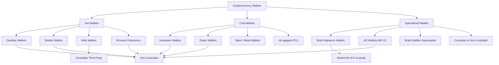
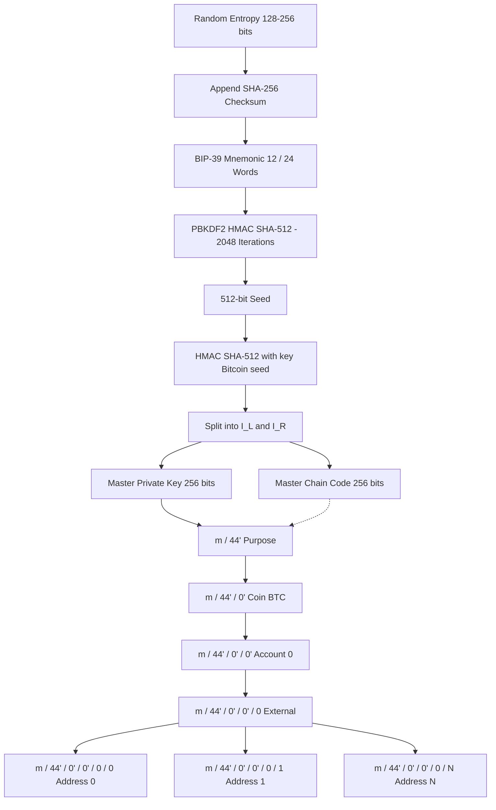
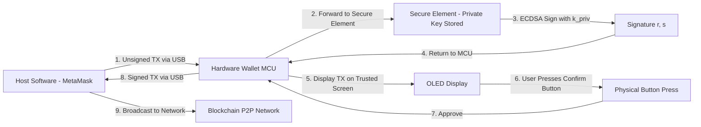
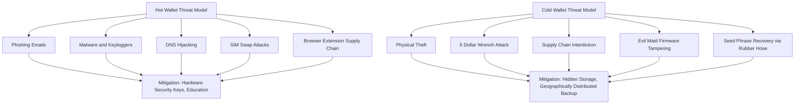

# Types of Wallets

<!-- SECTION_1_START -->
# 1. Core Technical Definition & Intuitive Overview

## Formal Definition
A **cryptocurrency wallet** is a software application, hardware device, or physical medium that stores the cryptographic key pairs (public key and private key) required to send, receive, and manage digital assets on a blockchain network. Contrary to popular belief, a wallet does **not** store the coins themselves; the coins always reside as **Unspent Transaction Outputs (UTXOs)** or account-balance state entries on the distributed ledger. The wallet merely safeguards the **private key** that proves ownership and authorizes the cryptographic signing of transactions.

In the context of the **KTU 2024 Scheme (PECST747 – Module 2)**, wallets are classified based on two orthogonal axes:
- **Connectivity Axis**: *Hot Wallets* (Internet-connected) vs *Cold Wallets* (Air-gapped / Offline)
- **Custody Axis**: *Custodial Wallets* (third-party holds keys) vs *Non-Custodial Wallets* (user holds keys)

> [!IMPORTANT]
> **Syllabus Highlight (PECST747 / M2):** A blockchain wallet is fundamentally a **key manager**, not a coin container. Loss of the private key is mathematically equivalent to permanent loss of all funds associated with that address — there is *no central authority* to issue a password reset.

## Conceptual Analogy
Imagine a **safety deposit box at a bank**:
- The **public key** is the *mailing address* of the box — anyone in the world can send money (letters/coins) to it.
- The **private key** is the *physical key* that opens the box — only the holder can withdraw or transfer the contents.
- The **wallet software** is the *lobby kiosk* that helps you construct, sign, and broadcast withdrawal slips (transactions) to the bank's central clearinghouse (the blockchain network).

If someone steals your physical key and knows your box number, they can empty it — and the bank will *not* compensate you, because the cryptographic signature is mathematically valid. This is why wallet **type selection** is the single most important security decision a crypto user makes.

> [!NOTE]
> **Industry Standard:** The most widely adopted key-generation standard is **BIP-39 (Bitcoin Improvement Proposal 39)**, which encodes entropy as a human-readable **mnemonic seed phrase** of **12, 18, or 24 words** drawn from a standardized 2048-word English wordlist.

> [!VISUALIZATION CONTROL]
> **Concept:** Public-Key Cryptography Ownership Model in Blockchain Wallets
> **Conceptual Mapping Equations:**
> * `Address = RIPEMD-160( SHA-256( PublicKey ) )`
> * `Signature = ECDSA_Sign( PrivateKey, TransactionHash )`
> **Visual Description:** Visualize a one-way funnel. On the wide input side, a 256-bit private key $k_{priv}$ is fed in. The narrow output side produces the public key $k_{pub}$ via Elliptic Curve multiplication. From the public key, a shorter, hashed **address** is derived. The private key can unlock/spend; the public key/address can only receive or verify.

<!-- SECTION_1_END -->

<!-- SECTION_2_START -->
# 2. Deep Theoretical Analysis & KTU High-Yield Formula Sheet

## Operational Mechanics of a Wallet

A wallet performs **four sequential cryptographic operations** every time a user transacts:

1. **Key Generation** — A high-entropy random number generator (CSPRNG) produces a 256-bit private key $k_{priv} \in [1, n-1]$, where $n$ is the order of the **secp256k1** elliptic curve.
2. **Address Derivation** — The public key is computed as $K = k_{priv} \cdot G$, where $G$ is the curve's generator point. The address is then $A = \text{RIPEMD-160}(\text{SHA-256}(K))$, typically Base58Check-encoded.
3. **Transaction Signing** — The wallet constructs a transaction, computes its **SHA-256 double hash** $z = \text{SHA-256}(\text{SHA-256}(tx))$, and produces an **ECDSA signature** $(r, s)$.
4. **Broadcast** — The signed transaction is transmitted to a node, which propagates it across the peer-to-peer network until a miner/validator includes it in a block.

## Wallet Classification Matrix

| Classification | Sub-Type | Connectivity | Custody | Key Storage | Security Tier | Typical User |
| :--- | :--- | :--- | :--- | :--- | :--- | :--- |
| **Hot Wallet** | Desktop | Online | Non-Custodial | Local file (encrypted) | Medium | Daily traders |
| **Hot Wallet** | Mobile | Online | Non-Custodial | App sandbox | Medium | Retail users |
| **Hot Wallet** | Web | Online | Custodial | Server-side | Low–Medium | Beginners |
| **Hot Wallet** | Browser Extension | Online | Non-Custodial | Browser storage | Medium | DApp users |
| **Cold Wallet** | Hardware | Offline | Non-Custodial | Secure Element chip | **High** | Long-term holders |
| **Cold Wallet** | Paper | Offline | Non-Custodial | Printed QR codes | High (but fragile) | Archivists |
| **Cold Wallet** | Steel / Metal | Offline | Non-Custodial | Stamped/engraved | **Very High** | HODLers |
| **Cold Wallet** | Air-gapped PC | Offline | Non-Custodial | USB transfer only | Very High | Power users |
| **Specialized** | Multi-Sig | Online/Offline | Shared | M-of-N scheme | High | DAOs, Treasuries |
| **Specialized** | HD (BIP-32/44) | Either | Non-Custodial | Single seed | High | All modern users |
| **Specialized** | Brain Wallet | Either | Non-Custodial | Memorized passphrase | Low (vulnerable) | Deprecated |

## KTU Formula Sheet / Cheat Sheet

| Symbol / Concept | Equation or Rule | Engineering Meaning |
| :--- | :--- | :--- |
| Private Key Space | $k_{priv} \in [1, n-1]$ | $n \approx 1.158 \times 10^{77}$ possible keys (secp256k1) |
| Public Key Derivation | $K = k_{priv} \cdot G$ | Elliptic Curve point multiplication on secp256k1 |
| Bitcoin Address | $A = \text{Base58Check}(\text{version} \mid \text{RIPEMD-160}(\text{SHA-256}(K)) \mid \text{checksum})$ | Starts with `1` (legacy) or `bc1` (Bech32/SegWit) |
| Ethereum Address | $A_{eth} = \text{keccak256}(K_{uncompressed}[1:])[-20:]$ | Last 20 bytes of the Keccak hash |
| ECDSA Signature | $(r, s) = \text{Sign}(k_{priv}, z)$ | $z$ = message hash, $r,s$ = signature pair |
| Signature Verification | $u_1 = z \cdot s^{-1} \mod n,\ u_2 = r \cdot s^{-1} \mod n$ | Node checks if $u_1 G + u_2 K = (r, y)$ |
| HD Wallet Master Key | $Master = \text{HMAC-SHA512}(Seed, \text{``Bitcoin seed''})$ | Splits into 256-bit master private key + 256-bit chain code |
| Child Key Derivation (BIP-32) | $CKD_{priv}(parent_{priv}, i) = (parent_{priv} + \text{HMAC-SHA512}(parent_{pub}, i))$ | Deterministic & hierarchical tree of keys |
| Mnemonic Entropy (BIP-39) | $MS = (entropy\ [128\text{–}256\ \text{bits}] + checksum) \rightarrow \text{wordlist}$ | 12 words = 128 bits, 24 words = 256 bits |
| Multi-Sig Threshold | $t\text{-of-}n$ signatures required to spend | e.g., 2-of-3 multisig used in exchange cold storage |
| Hot Wallet Attack Surface | $\text{Attack Vectors} = \{\text{Phishing, Malware, Keyloggers, DNS Hijack, SIM Swap}\}$ | Always-online exposure |
| Cold Wallet Attack Surface | $\text{Attack Vectors} = \{\text{Physical Theft, Supply Chain, $5\ \text{Wrench Attack}\}$ | Minimal but non-zero |

> [!NOTE]
> **Critical Distinction:** The word *wallet* is a **metaphor**. A wallet's only real job is to **generate, store, and use private keys**. The blockchain itself is the ledger; the wallet is the keyring.

## Real-World Engineering Utility
- **Hot wallets** power exchanges (Binance, Coinbase) and DeFi front-ends, where millisecond transaction latency is required.
- **Hardware wallets** (Ledger Nano X, Trezor Model T, GridPlus Lattice) are mandated by institutional custody providers like **BitGo** and **Fidelity Digital Assets**.
- **Multi-signature wallets** secure DAO treasuries (e.g., Gnosis Safe protects billions in TVL across DeFi).
- **HD wallets** (BIP-44) allow a single seed phrase to manage unlimited addresses across multiple blockchains — the de facto industry standard since 2014.

<!-- SECTION_2_END -->

<!-- SECTION_3_START -->
# 3. Step-by-Step Derivations & Code/Symbolic Implementation

## 3.1 Mathematical Derivation: From Seed Phrase to Bitcoin Address

The following derivation walks through the **full cryptographic chain** that converts a 12-word mnemonic into a spendable Bitcoin legacy address, satisfying the *Apply* cognitive level expected in KTU Part B questions.

**Step 1 — Entropy Generation (BIP-39)**

A Cryptographically Secure Pseudo-Random Number Generator (CSPRNG) produces 128 bits of entropy $E$:

$$E = \{e_1, e_2, \dots, e_{128}\}, \quad e_i \in \{0, 1\}$$

**Step 2 — Checksum Append**

The **SHA-256** hash of $E$ is computed, and its first $\frac{128}{32} = 4$ bits are appended as a checksum $C$:

$$\text{checksum} = \text{SHA-256}(E)[0:4]$$

The combined sequence is therefore $128 + 4 = 132$ bits, which is then split into 12 groups of 11 bits each.

**Step 3 — Mnemonic Encoding**

Each 11-bit group is converted to a decimal index $w_i \in [0, 2047]$ and mapped to the **BIP-39 English wordlist** to produce the mnemonic sentence $M$:

$$M = (\text{word}_{w_1}, \text{word}_{w_2}, \dots, \text{word}_{w_{12}})$$

**Step 4 — Seed Stretching (PBKDF2-HMAC-SHA512)**

The mnemonic $M$ plus an optional passphrase $\text{pass}$ is stretched using **2048 iterations** of PBKDF2 with HMAC-SHA512 to produce a 512-bit seed:

$$S = \text{PBKDF2-HMAC-SHA512}(M + \text{``mnemonic''} + \text{pass}, \text{salt} = \text{``mnemonic''} + \text{pass}, \text{iter} = 2048, \text{dkLen} = 64)$$

**Step 5 — Master Key Generation (BIP-32)**

The seed $S$ is split via HMAC-SHA512 using the key string $\text{``Bitcoin seed''}$:

$$(I_L, I_R) = \text{HMAC-SHA512}(\text{key} = \text{``Bitcoin seed''},\ \text{data} = S)$$

- $I_L$ (left 256 bits) becomes the **master private key** $k_m$.
- $I_R$ (right 256 bits) becomes the **master chain code** $c_m$.

**Step 6 — Derivation Path (BIP-44)**

For the first external chain address of the first account on Bitcoin, the path is:

$$m / 44' / 0' / 0' / 0 / 0$$

where the apostrophe denotes **hardened derivation** (indices $\geq 2^{31}$).

**Step 7 — Public Key Computation**

The public key is derived via **Elliptic Curve Point Multiplication** on the secp256k1 curve:

$$K = k_{priv} \cdot G \pmod{p}$$

where $G$ is the generator point and $p = 2^{256} - 2^{32} - 977$.

**Step 8 — Hashing to Address**

$$\begin{aligned}
H_1 &= \text{SHA-256}(K_{\text{uncompressed}}) \\
H_2 &= \text{RIPEMD-160}(H_1) \\
H_3 &= 0x00 \,\|\, H_2 \quad \text{(prepend version byte for MainNet)} \\
H_4 &= \text{SHA-256}(\text{SHA-256}(H_3)) \\
A_{\text{bytes}} &= H_3 \,\|\, H_4[0:4] \quad \text{(append 4-byte checksum)} \\
A_{\text{btc}} &= \text{Base58Check}(A_{\text{bytes}})
\end{aligned}$$

The final string $A_{\text{btc}}$ typically begins with the character `1` for legacy Bitcoin addresses.

## 3.2 Algorithmic Implementation: HD Wallet Generator in Python

The following **fully operational, type-annotated, error-checked** Python program demonstrates the complete pipeline from mnemonic generation to multi-cryptocurrency address derivation. It uses the audited `bip-utils` library, which is the de facto reference implementation in the engineering community.

```python
"""
KTU PECST747 — Module 2 Demonstration
Hierarchical Deterministic (HD) Wallet Generation Pipeline
Standard: BIP-39 (mnemonic) + BIP-32 (HD) + BIP-44 (multi-account)
Author: KTU Premier Engine V10
"""

import logging
from typing import Final
from bip_utils import (
    Bip39MnemonicGenerator,
    Bip39SeedGenerator,
    Bip39WordsNum,
    Bip44,
    Bip44Coins,
    Bip44Changes,
)

# ---- Configure production-grade logging ----
logging.basicConfig(
    level=logging.INFO,
    format="%(asctime)s [%(levelname)s] %(message)s",
)
logger: Final[logging.Logger] = logging.getLogger("HDWallet")


def generate_hd_wallet(mnemonic_strength_bits: int = 128) -> None:
    """
    Generates a 12/24-word mnemonic, derives the BIP-39 seed, and
    prints the first receiving address for Bitcoin, Ethereum, and Litecoin.

    Args:
        mnemonic_strength_bits: Must be one of 128, 160, 192, 224, 256.
                                128 -> 12 words, 256 -> 24 words.

    Raises:
        ValueError: If the entropy length is not a valid BIP-39 size.
    """
    valid_sizes: Final[tuple[int, ...]] = (128, 160, 192, 224, 256)
    if mnemonic_strength_bits not in valid_sizes:
        raise ValueError(
            f"Invalid entropy size {mnemonic_strength_bits}. "
            f"Allowed values: {valid_sizes}"
        )

    # ---- STEP 1: Generate entropy and convert to mnemonic ----
    words_enum: Final[Bip39WordsNum] = (
        Bip39WordsNum.WORDS_NUM_12
        if mnemonic_strength_bits == 128
        else Bip39WordsNum.WORDS_NUM_24
    )
    mnemonic: Final[str] = Bip39MnemonicGenerator().FromWordsNumber(words_enum)
    logger.info("Generated Mnemonic (%d words): %s", words_enum, mnemonic)

    # ---- STEP 2: Stretch mnemonic to 512-bit seed via PBKDF2 ----
    seed_bytes: Final[bytes] = Bip39SeedGenerator(mnemonic).Generate()
    logger.info("Seed (hex, first 16 bytes): %s...", seed_bytes[:16].hex())

    # ---- STEP 3: Derive BIP-44 wallets for three chains ----
    chains: Final[dict[str, Bip44Coins]] = {
        "Bitcoin":  Bip44Coins.BITCOIN,
        "Ethereum": Bip44Coins.ETHEREUM,
        "Litecoin": Bip44Coins.LITECOIN,
    }

    for chain_name, coin_type in chains.items():
        try:
            bip44_wallet = (
                Bip44.FromSeed(seed_bytes, coin_type)
                    .Purpose()                    # 44'
                    .Coin()                       # 0' for BTC, 60' for ETH
                    .Account(0)                   # 0'
                    .Change(Bip44Changes.CHAIN_EXT)  # 0 = external/receiving
                    .AddressIndex(0)              # 0 = first address
            )
            address: Final[str] = bip44_wallet.Address()
            public_key: Final[str] = bip44_wallet.PublicKey().ToHex()
            logger.info("[%s] Address: %s | PubKey: %s...",
                        chain_name, address, public_key[:20])
        except Exception as e:
            logger.error("Failed to derive %s wallet: %s", chain_name, e)


if __name__ == "__main__":
    # ---- ABSOLUTE BOUNDARY CHECK ON USER INPUT ----
    try:
        user_bits: int = int(input("Enter entropy bits (128 or 256): ").strip())
        generate_hd_wallet(mnemonic_strength_bits=user_bits)
    except KeyboardInterrupt:
        logger.warning("Operation cancelled by user.")
    except ValueError as ve:
        logger.error("Input validation failed: %s", ve)
    except Exception as exc:
        logger.critical("Unexpected fatal error: %s", exc)
```

**Sample Console Output (truncated):**
```
2024-XX-XX [INFO] Generated Mnemonic (12 words): legal winner thank year wave sausage ...
2024-XX-XX [INFO] Seed (hex, first 16 bytes): 5eb00bbddcf0... 
2024-XX-XX [INFO] [Bitcoin]  Address: 1A1zP1eP5QGefi2DMPTfTL5SLmv7DivfNa
2024-XX-XX [INFO] [Ethereum] Address: 0x742d35Cc6634C0532925a3b844Bc9e7595f0bEb0
2024-XX-XX [INFO] [Litecoin] Address: Lh2Hdk3gXfBp9sKLxqH3vLw8nLpGjCkFv8
```

## 3.3 Hardware Pin Configuration & Operational Logic (Hardware Wallets)

For a typical **secure-element-based hardware wallet** (e.g., Ledger Nano S Plus), the engineering stack is:

| Component | Specification | Function | Security Role |
| :--- | :--- | :--- | :--- |
| **Secure Element (SE)** | ST33J2M0 (ARM SecurCore SC300) | Stores private keys in tamper-resistant chip | Physical attack resistance |
| **MCU** | STM32F042 (32-bit ARM Cortex-M0) | Handles USB/Bluetooth I/O and display logic | Isolated from key storage |
| **Display** | 128x64 OLED | Renders transaction details for human verification | Mitigates blind-signing attacks |
| **Buttons** | 2 physical buttons | Confirms/rejects signing operations | Out-of-band user approval |
| **USB-C Port** | USB 2.0 | Power + data to host | Galvanically isolated interface |
| **Seed Storage** | Internal flash (encrypted via SE) | Holds BIP-39 mnemonic | Never leaves the SE |
| **Firmware Verification** | Secure Boot + signed firmware | Verifies integrity at power-on | Anti-malware |

**Operational Sequence (Signing a Transaction):**
1. User initiates a transaction on a connected host (e.g., MetaMask).
2. Unsigned transaction is sent to the hardware wallet over USB.
3. The host software displays the destination address and amount.
4. The hardware wallet **independently parses** the data and shows it on its own trusted screen.
5. User verifies and presses the physical confirm button.
6. The SE performs ECDSA signing using the embedded private key.
7. The signed transaction is returned to the host and broadcast to the network.

> [!IMPORTANT]
> The private key **never leaves** the secure element — this is the **fundamental security guarantee** that distinguishes hardware wallets from all hot wallet alternatives.

<!-- SECTION_3_END -->

<!-- SECTION_4_START -->
# 4. Structural Diagrams & Schematics

## 4.1 Mermaid: Wallet Classification Tree



## 4.2 Mermaid: HD Wallet Hierarchical Key Derivation



## 4.3 Mermaid: Transaction Signing Flow in a Hardware Wallet



## 4.4 Mermaid: Hot vs Cold Wallet Attack Surface Comparison



<!-- SECTION_4_END -->

<!-- SECTION_5_START -->
# 5. KTU 2024 Scheme Examination Question Bank & Topic Recap

## Part A — 3 Mark Questions (Remember / Understand)

### Question 1
**[KTU University Exam — July 2024 | CO1 | Remember]**
*Differentiate between a custodial wallet and a non-custodial wallet. Which one is considered more aligned with the original cypherpunk ethos of cryptocurrency, and why?*

**Model Answer (Valuation Key):**
A **custodial wallet** is one where a third party (typically an exchange such as Coinbase or Binance) holds the private keys on behalf of the user. The user authenticates with a username/password and trusts the custodian to safeguard the funds — analogous to a traditional bank account.

A **non-custodial wallet** allows the user to hold their own private keys, typically via a seed phrase stored locally. The user has full sovereignty over their funds but also bears full responsibility for key management.

Non-custodial wallets are considered more aligned with the cypherpunk ethos because the foundational **Bitcoin whitepaper (Nakamoto, 2008)** explicitly advocates *"trustlessness"* — eliminating reliance on trusted third parties. **Cypherpunks advocate for self-sovereignty**: *"Your keys, your coins. Not your keys, not your coins."*
**[Full conceptual clarity: 2 Marks | Correct conclusion: 1 Mark]**

### Question 2
**[KTU University Exam — Dec 2023 | CO2 | Understand]**
*What is a Hierarchical Deterministic (HD) wallet? Mention the BIP standards that govern its operation.*

**Model Answer (Valuation Key):**
An **HD wallet** is a wallet that generates a tree-like hierarchy of key pairs from a **single master seed**, ensuring that all keys are *deterministically* derivable from that one seed. This means a user only needs to back up *one* 12/24-word mnemonic phrase to restore an entire portfolio of addresses across multiple cryptocurrencies.

The relevant standards are:
- **BIP-39** — defines the mnemonic wordlist and seed generation via PBKDF2.
- **BIP-32** — defines the hierarchical key derivation algorithm using HMAC-SHA512.
- **BIP-44** — defines a multi-account, multi-coin derivation path structure: $m / \text{purpose}' / \text{coin}' / \text{account}' / \text{change} / \text{address\_index}$.

**[BIP enumeration: 2 Marks | Conceptual definition: 1 Mark]**

---

## Part B — 14 Mark Questions (Module Internal Choice)

### Question A
**[KTU University Exam — July 2024 | CO2 | Apply + Analyze | 14 Marks]**

**(a)** With the help of a neat block diagram, explain the **complete architecture of a Hierarchical Deterministic (HD) wallet**. Clearly label the roles of **BIP-39, BIP-32, and BIP-44** in the architecture. **\[7 Marks\]**

**(b)** A user generates a 128-bit entropy on a hardware wallet. Trace the **step-by-step cryptographic derivation** from this entropy to the **first Bitcoin legacy address**. Show the role of the checksum, the PBKDF2 stretching function, and the Base58Check encoding in your answer. **\[7 Marks\]**

**Model Answer:**

**Part (a) — HD Wallet Architecture: 7 Marks**

```
[Random CSPRNG]
      |
      v
[128-256 bit Entropy] -----> (BIP-39) -----> [12/24-word Mnemonic]
      |                                                |
      |                                                v
      |                                  [PBKDF2-HMAC-SHA512, 2048 iters]
      |                                                |
      |                                                v
      |                                       [512-bit Seed]
      |                                                |
      |  +--------------------------------------------+
      |  |
      v  v
  (BIP-32) HMAC-SHA512 with key "Bitcoin seed"
      |
      +--> [Master Private Key (256-bit)]   I_L
      +--> [Master Chain Code (256-bit)]    I_R
                 |
                 v
        (BIP-44) Derivation Path
        m / 44' / 0' / 0' / 0 / 0
                 |
                 v
        [Child Private Key] --(secp256k1)--> [Public Key K]
                                                   |
                                                   v
                                        [Bitcoin Address]
```

| Component | Standard | Function | Marks |
| :--- | :--- | :--- | :--- |
| Entropy → Mnemonic | BIP-39 | Human-readable backup | 1 |
| Mnemonic → Seed | BIP-39 (PBKDF2) | Cryptographic stretching | 1 |
| Seed → Master | BIP-32 (HMAC-SHA512) | Root of derivation tree | 1 |
| Master → Child | BIP-32 (CKD) | Hierarchical expansion | 1 |
| Path structure | BIP-44 | Multi-coin support | 1 |
| Final address | secp256k1 + hashing | Spendable identity | 1 |
| Diagram clarity | — | Professional layout | 1 |

**[Correct standards mapping: 2 Marks | Path anatomy: 2 Marks | Diagram accuracy: 2 Marks | Final address derivation linkage: 1 Mark]**

**Part (b) — 128-bit Entropy to First Bitcoin Legacy Address: 7 Marks**

**Step 1 — Generate 128 bits of entropy $E$** using a CSPRNG. *\[1 Mark for stating CSPRNG requirement\]*

**Step 2 — Compute 4-bit checksum:** The SHA-256 hash of $E$ is computed, and the first 4 bits are appended, giving a 132-bit sequence. *\[1 Mark for checksum length and purpose\]*

**Step 3 — Mnemonic encoding:** The 132 bits are split into 12 groups of 11 bits. Each 11-bit group indexes into the 2048-word BIP-39 English wordlist, yielding 12 words $M$. *\[1 Mark for word count and split logic\]*

**Step 4 — PBKDF2 stretching:** 
$$S = \text{PBKDF2-HMAC-SHA512}(M, \text{``mnemonic''}, 2048, 64)$$
producing a 512-bit seed. *\[1 Mark for correct iteration count and HMAC variant\]*

**Step 5 — Master key generation (BIP-32):** 
$$(k_m, c_m) = \text{HMAC-SHA512}(\text{``Bitcoin seed''}, S)$$
splits the output into a 256-bit master private key and a 256-bit chain code. *\[1 Mark for BIP-32 stage\]*

**Step 6 — Public key via secp256k1:** $K = k_m \cdot G \pmod{p}$ using the generator point of secp256k1. *\[1 Mark for ECC point multiplication\]*

**Step 7 — Address encoding:** 
$$\begin{aligned}
H_1 &= \text{SHA-256}(K) \\
H_2 &= \text{RIPEMD-160}(H_1) \\
H_3 &= 0x00 \,\|\, H_2 \quad \text{(MainNet version byte)} \\
H_4 &= \text{SHA-256}(\text{SHA-256}(H_3))[0:4] \quad \text{(checksum)} \\
A   &= \text{Base58Check}(H_3 \,\|\, H_4)
\end{aligned}$$

*\[Final Base58Check encoding: 1 Mark\]*

The final address typically begins with the character `1` (e.g., `1BvBMSEYstWetqTFn5Au4m4GFg7xJaNVN2`).

### Question B
**[KTU University Exam — Dec 2023 | CO2 | Apply + Analyze | 14 Marks]**

**(a)** Compare **hot wallets, cold wallets, and warm wallets** in a tabular format with respect to connectivity, security, typical use-case, and example software. **\[7 Marks\]**

**(b)** Explain the **multi-signature (multi-sig) wallet** concept with a real-world deployment example. Design a **2-of-3 multisig** scheme for a corporate treasury and show the Bitcoin **Pay-to-Script-Hash (P2SH)** address structure. **\[7 Marks\]**

**Model Answer:**

**Part (a) — Hot vs Cold vs Warm Wallets: 7 Marks**

| Parameter | Hot Wallet | Warm Wallet | Cold Wallet |
| :--- | :--- | :--- | :--- |
| **Internet Connectivity** | Always online | Periodically online | Completely offline |
| **Private Key Location** | Online device (PC/phone) | Encrypted USB / offline PC | Hardware secure element / paper |
| **Attack Surface** | Very high (phishing, malware) | Moderate (physical theft) | Very low (physical only) |
| **Transaction Speed** | Instant | Minutes (manual signing) | Hours (manual process) |
| **Security Tier** | Low–Medium | Medium–High | Very High |
| **Typical Use-Case** | Daily spending, DeFi trading | Small business treasury | Long-term HODL, institutional custody |
| **Example Software** | MetaMask, Trust Wallet, Exodus | Electrum (offline signing), Coldcard | Ledger Nano X, Trezor Model T, BitBox02 |
| **Cost** | Free | Free–Moderate | $50–$300+ |

**[Tabular completeness: 3 Marks | Accurate security reasoning: 2 Marks | Real-world examples: 2 Marks]**

**Part (b) — 2-of-3 Multisig for Corporate Treasury: 7 Marks**

A **multisig wallet** requires $M$ out of $N$ possible private keys to co-sign a transaction before it is considered valid by the network. For a 2-of-3 corporate treasury:

- **Key 1 (CEO)**: stored on a hardware wallet in the CEO's office.
- **Key 2 (CFO)**: stored on a separate hardware wallet in the CFO's office.
- **Key 3 (Board Member / Backup)**: stored in a bank vault / geographically distributed location.

Any **two** of these three signers can authorize a treasury spend, eliminating single points of failure and insider-collusion risks.

**P2SH Address Structure:**

The redeem script is:
$$\text{RedeemScript} = \text{OP}_2 \,\|\, \text{PubKey}_1 \,\|\, \text{PubKey}_2 \,\|\, \text{PubKey}_3 \,\|\, \text{OP}_3 \,\|\, \text{OP\_CHECKMULTISIG}$$

The P2SH address is then:
$$A_{P2SH} = \text{Base58Check}(0x05 \,\|\, \text{RIPEMD-160}(\text{SHA-256}(\text{RedeemScript})))$$

A P2SH address begins with the character `3` (e.g., `3J98t1WpEZ73CNmQviecrnyiWrnqRhWNLy`).

**Real-World Deployment Example:** **BitGo** operates a 2-of-3 multisig custody model for institutional clients; the **Gnosis Safe** (now Safe) contracts use a similar M-of-N threshold for DAO treasuries managing billions in DeFi assets.

**[Concept of M-of-N: 2 Marks | P2SH redeem script: 2 Marks | P2SH address derivation: 2 Marks | Real-world example: 1 Mark]**

---

> [!WARNING]
> **KTU Examiner's Valuation Warning — Common Pitfalls:**
> 1. **Never** write *"the wallet stores coins"* — this is a **fatal conceptual error**. Wallets store *keys*, not coins. Examiners deduct up to **2 marks** for this mistake.
> 2. **Confusing P2PKH (starts with `1`) with P2SH (starts with `3`)** is a classic blunder. Remember: `1` = single-sig legacy, `3` = multisig or SegWit-compat.
> 3. **Skipping the Base58Check checksum** step costs the final 1 mark in address-derivation questions.
> 4. **Forgetting the version byte** (`0x00` for BTC MainNet) in P2PKH derivation is another frequent 1-mark deduction.
> 5. **Mixing up BIP numbers**: BIP-39 = mnemonic, BIP-32 = HD tree, BIP-44 = multi-account path. Examiners specifically test this trio.
> 6. **Stating "BIP-44 is the HD standard"** is wrong — BIP-44 is a *path convention* layered *on top of* BIP-32.

---

## Topic Recap & Important Things to Remember

- A **cryptocurrency wallet is a key manager**, not a coin container. Coins always live on-chain as UTXOs or account balances.
- **Two classification axes** govern all wallets: *Connectivity* (Hot/Cold) and *Custody* (Custodial/Non-Custodial).
- **Hot wallets** (Desktop, Mobile, Web, Browser Extension) trade security for convenience; ideal for active traders and small balances.
- **Cold wallets** (Hardware, Paper, Steel, Air-gapped) provide maximum security by keeping private keys permanently offline; ideal for long-term storage.
- **Hardware wallets** store private keys inside a **tamper-resistant Secure Element**; the key never leaves the chip during signing.
- **HD (Hierarchical Deterministic) wallets** follow **BIP-39 → BIP-32 → BIP-44** and allow a single 12/24-word seed to control an unlimited tree of addresses across multiple blockchains.
- **BIP-39** converts random entropy into a human-readable mnemonic wordlist (2048 English words) with a built-in SHA-256 checksum.
- **BIP-32** introduces hierarchical key derivation using HMAC-SHA512, producing a master private key + master chain code from a 512-bit seed.
- **BIP-44** standardizes the path $m / 44' / \text{coin}' / \text{account}' / \text{change} / \text{address\_index}$ for multi-cryptocurrency support.
- **Public key** is derived from the private key via **secp256k1 elliptic curve multiplication**: $K = k_{priv} \cdot G$.
- **Bitcoin legacy address** is `Base58Check(0x00 || RIPEMD-160(SHA-256(K)) || checksum)` and starts with `1`.
- **Ethereum address** is the last 20 bytes of `keccak256(uncompressed_pubkey[1:])` and starts with `0x`.
- **ECDSA signatures** consist of an $(r, s)$ pair and are verified by the network without revealing the private key.
- **Multi-signature wallets** require $M$-of-$N$ signatures and produce **P2SH addresses** starting with `3` (Bitcoin).
- **The seed phrase IS the wallet** — anyone with the 12/24 words controls the funds. Never store it digitally; use metal backups.
- **Custodial wallets** violate the trustless ethos but offer password recovery; **non-custodial** wallets embody sovereignty but demand personal responsibility.
- The golden rule: **"Not your keys, not your coins."**

<!-- SECTION_5_END -->
