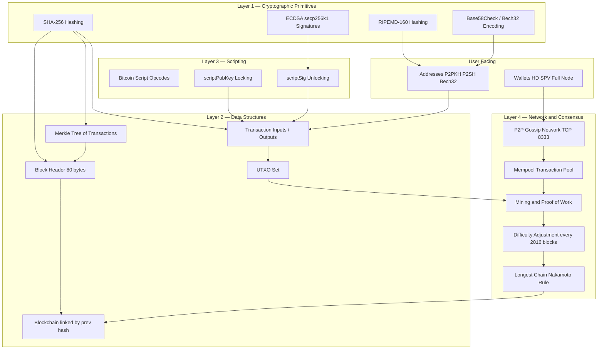
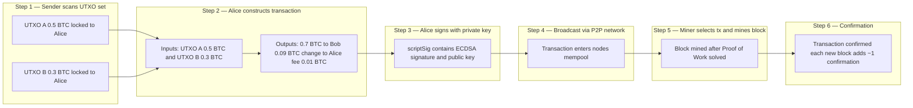
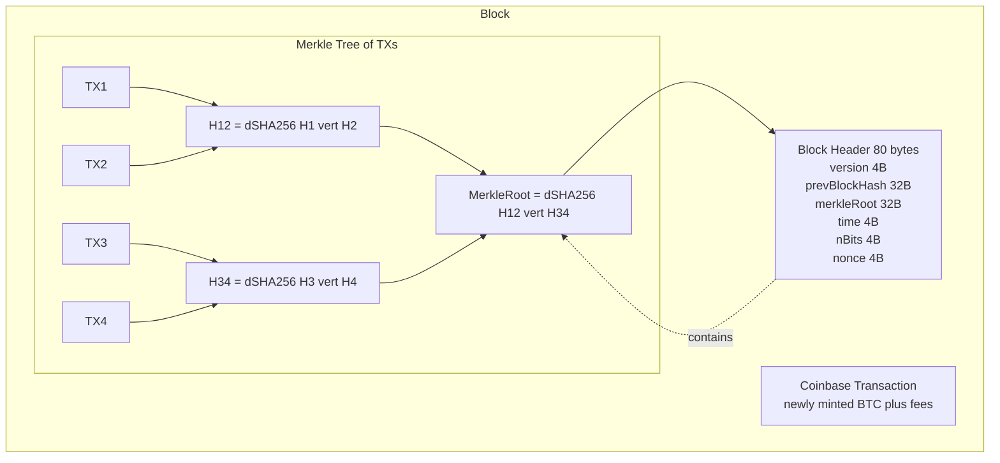
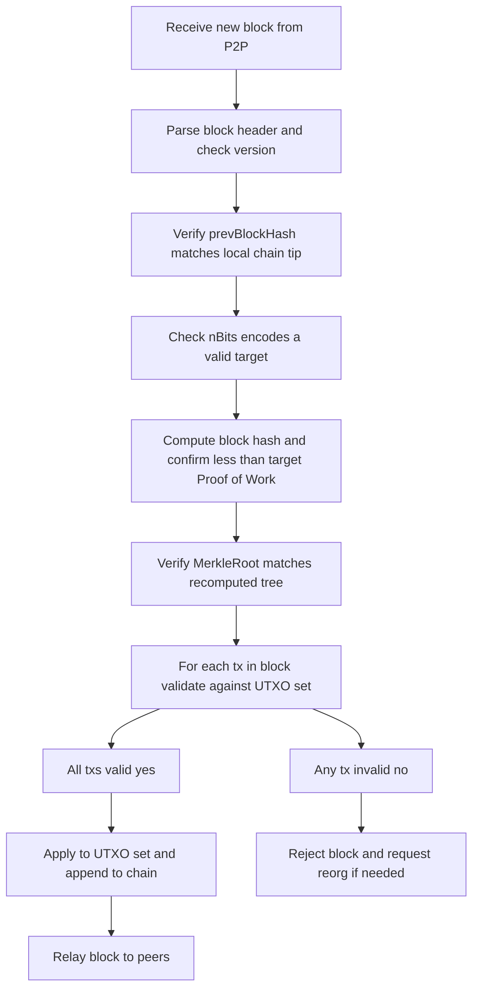
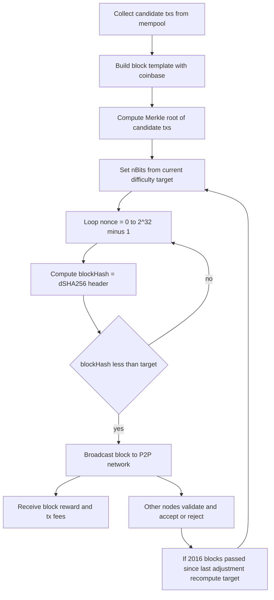

# Bitcoin: Components

<!-- SECTION_1_START -->
# Bitcoin: Components — Core Technical Definition & Intuition

## 1.1 Formal Definition (KTU 2024 Syllabus Terminology)

> [!IMPORTANT]
> **Bitcoin** is a decentralized, peer-to-peer electronic cash system whose architecture is composed of an interconnected set of cryptographic, data-structural, networking, and consensus-based **components**. As per the KTU 2024 PECST747 (Module 3) syllabus, the *components of Bitcoin* refer to the primitive building blocks that enable value transfer over a trustless network: **Transactions, the UTXO model, Blocks & the Blockchain, the Bitcoin Script language, Cryptographic primitives (hashing & digital signatures), Addresses & Wallets, the Peer-to-Peer (P2P) Network, the Mempool, and the Mining & Proof-of-Work Consensus mechanism.**

Each component plays a deterministic role in achieving the **triple-trust guarantees** of Bitcoin:

| Guarantee | Component(s) Responsible |
|---|---|
| **Immutability of history** | SHA-256 hashing, Merkle trees, Block headers |
| **Authenticity of ownership** | ECDSA digital signatures (secp256k1) |
| **Decentralized agreement** | Proof-of-Work, Longest chain rule, P2P gossip |

## 1.2 Conceptual Analogy — "Bitcoin as a Digital Public Notebook"

Imagine a **transparent, public ledger notebook** that is photocopied and distributed to thousands of libraries worldwide:

- Every **page** in the notebook is a **Block** 🗒️
- Every **line** on the page is a **Transaction** ✍️
- Each transaction does not "subtract" from an account — it simply **destroys old "chits" (UTXOs)** and **creates new "chits"** to recipients. Think of it like tearing a paper voucher worth 50 units and handing out two new vouchers worth 30 and 20 — the *paper is consumed and re-issued*, never edited.
- Each chit is **sealed with a wax stamp (digital signature)** that only its owner can produce, verified by **anyone (public key)** 📜
- To add a new page, librarians (miners) must solve a **mathematical puzzle (Proof-of-Work)** that takes ~10 minutes globally, and the **first to solve it gets to write the next page and earn fresh chits (block reward)** ⛏️
- The notebook is **chained** by stamping the previous page's fingerprint (hash) onto the next — tampering with one page invalidates every page after it ⛓️

> [!NOTE]
> **Key Syllabus Highlight:** Bitcoin is *not* account-based like a bank ledger. It is **UTXO-based** (Unspent Transaction Output), which is the single most important architectural distinction you must internalize for the KTU exam.

## 1.3 Key Constants & Metrics (Bolded for KTU Recall)

- **Block time target:** **10 minutes**
- **Block size limit:** **~1 MB** (legacy), **~4 MB** (SegWit weight)
- **Initial block reward (2009):** **50 BTC**
- **Block reward halving interval:** **every 210,000 blocks (~4 years)**
- **Total Bitcoin supply cap:** **21,000,000 BTC** (capped, deflationary)
- **Smallest unit:** **1 satoshi = $10^{-8}$ BTC**
- **Elliptic curve used:** **secp256k1**
- **Hash functions used:** **SHA-256** and **RIPEMD-160**
- **Public key size:** **33 bytes** (compressed)
- **Address size:** **25 bytes** (Base58Check), **32 bytes** (Bech32 / SegWit)

> [!VISUALIZATION CONTROL]
> **Concept:** UTXO Flow — How Value is Transacted in Bitcoin
> **GeoGebra / Desmos Input Equations (conceptual flow on a number line):**
>
> * Define axis: `x = Time (transactions ordered)`
> * Plot UTXO lifespan: `y = UTXO value (BTC)` as rectangular pulses
>   * `f1(x) = 0.5` for `x ∈ [0, 10]` (UTXO of 0.5 BTC created at tx#1)
>   * `f2(x) = 0.3` for `x ∈ [10, 25]` (UTXO of 0.3 BTC created at tx#2, spent at tx#3)
>   * `f3(x) = 0.2` for `x ∈ [10, 40]` (UTXO of 0.2 BTC created at tx#2, unspent)
> * **Visual Description:** The student should observe that each UTXO is a *discrete rectangular block* of value that exists in the set for a finite duration. It is *never modified* during its lifetime — it is either **unspent (current)** or **spent (historical)**. New UTXOs are *created* as outputs of new transactions. The sum of inputs always equals the sum of outputs (plus the mining fee).

<!-- SECTION_1_END -->

<!-- SECTION_2_START -->
# Bitcoin: Components — Deep Theoretical Analysis & KTU High-Yield Formula Sheet

## 2.1 Component Hierarchy (System Map)

Bitcoin's components are best understood in **four architectural layers**, each building on the one below it:

| Layer | Components | Function |
|---|---|---|
| **L1 — Cryptographic Layer** | SHA-256, RIPEMD-160, ECDSA (secp256k1), Base58Check, Bech32 | Provide hashing, signatures, encoding |
| **L2 — Data-Structure Layer** | Transactions, UTXO set, Blocks, Merkle Tree, Blockchain | Define how value and history are stored |
| **L3 — Scripting Layer** | Bitcoin Script (opcodes, ScriptPubKey, ScriptSig) | Define *spending conditions* (locking/unlocking) |
| **L4 — Network & Consensus Layer** | P2P Network, Mempool, Mining, Proof-of-Work, Difficulty Target, Longest-Chain Rule | Define how nodes agree on one history |

## 2.2 Component 1 — The Transaction (TX)

A Bitcoin **transaction** is a signed data structure that *consumes* previously created UTXOs and *creates* new ones.

**Structure (raw, conceptual):**
```
Transaction
 ├── version         (4 bytes)
 ├── inputs[]        (1 or more)
 │     ├── previous_txid  (32 bytes)   ← pointer to UTXO
 │     ├── previous_index (4 bytes)    ← which output of that tx
 │     ├── scriptSig     (unlocking script)
 │     └── sequence      (4 bytes)
 ├── outputs[]       (1 or more)
 │     ├── value         (8 bytes, satoshis)
 │     └── scriptPubKey  (locking script)
 └── locktime        (4 bytes)
```

**Why inputs and outputs, not "debits and credits"?**
> [!NOTE]
> Because the UTXO model requires **explicit referencing** of which old chits are being destroyed. This eliminates the **double-spend problem** at the protocol level — once a UTXO is referenced in a confirmed block, it can never be referenced again.

**Conservation Equation (the golden rule of every Bitcoin transaction):**
$$\sum_{i=1}^{n} \text{inputs}[i].\text{value} \;=\; \sum_{j=1}^{m} \text{outputs}[j].\text{value} \;+\; \text{tx\_fee}$$

> [!IMPORTANT]
> **Transaction Fee Formula:** $\text{fee} = \text{Total Inputs} - \text{Total Outputs}$. The fee is **not explicit** in the transaction — it is implicitly the difference and is collected by the miner who includes the transaction in a block.

## 2.3 Component 2 — The UTXO Set (Unspent Transaction Output Set)

- The **UTXO set** is the global, in-memory cache of all currently spendable outputs held by every full node.
- It is the *concise representation of Bitcoin's current state* (analogous to "account balances" in account-based systems, but more expressive).
- **Size bound:** As of 2024, the UTXO set is **~4–6 GB** in RAM on a pruned full node.

**Properties:**
1. **Disjoint & exhaustive:** Every satoshi in existence is either in the UTXO set (unspent) or in a spent output (historical).
2. **Immutable per-output:** A UTXO is created with a value and a locking script; it cannot be partially spent — it must be consumed *whole*.

## 2.4 Component 3 — The Block & Block Header

A **block** is a batch of validated transactions packaged with metadata. The **header** (80 bytes) is the part used in Proof-of-Work.

**Block Header Fields:**
| Field | Size (bytes) | Purpose |
|---|---|---|
| `version` | 4 | Block version (soft-fork signaling) |
| `previousBlockHash` | 32 | Hash of previous block header (links the chain) |
| `merkleRoot` | 32 | Root of the Merkle tree of all transactions in this block |
| `time` | 4 | Unix timestamp |
| `nBits` | 4 | Encoded difficulty target |
| `nonce` | 4 | Counter incremented during mining |

**Merkle Tree of Transactions:**
- A binary hash tree where each leaf is the **double-SHA-256** of a transaction hash.
- Allows **Simple Payment Verification (SPV)** — light clients can prove a transaction is in a block using only the Merkle path, $\log_2(n)$ hashes.
- **Merkle root formula:** $H_{ij} = \text{SHA256}(\text{SHA256}(H_i \Vert H_j))$.

**Block Identifier:**
$$\text{BlockHash} = \text{SHA256}(\text{SHA256}(\text{BlockHeader}))$$

## 2.5 Component 4 — Cryptographic Primitives

| Primitive | Algorithm | Used For |
|---|---|---|
| Hashing (general) | **SHA-256** | Block hashing, mining, transaction IDs |
| Hashing (short) | **RIPEMD-160** | Producing shorter address fingerprints |
| Address fingerprint | **HASH160(pubkey)** = RIPEMD160(SHA256(pubkey)) | Inside Base58Check / Bech32 |
| Digital signature | **ECDSA** on **secp256k1** | Authorizing UTXO spending |
| Address encoding | **Base58Check** (legacy), **Bech32/Bech32m** (SegWit) | Human-readable, error-detected addresses |

**Why double-SHA-256?** Defends against **length-extension attacks** on the raw SHA-256 construction (a property of Merkle–Damgård hash functions).

## 2.6 Component 5 — Bitcoin Script (Forth-like, Stack-Based)

A **non-Turing-complete**, deterministic, stack-based language used to define *spending conditions*.

- **Locking side (output):** `scriptPubKey` — defines *what must be satisfied* to spend.
- **Unlocking side (input):** `scriptSig` — provides the *witness* (signature, public key, etc.).
- **Execution:** Concatenate `scriptSig + scriptPubKey` and execute left-to-right on a stack.

**Most common template — P2PKH (Pay-to-Pub-Key-Hash):**
```
scriptPubKey: OP_DUP OP_HASH160 <pubKeyHash> OP_EQUALVERIFY OP_CHECKSIG
scriptSig:    <signature> <publicKey>
```

> [!NOTE]
> Bitcoin Script is intentionally **not Turing complete** — it has **no loops** and no general memory. This eliminates the possibility of denial-of-service attacks via infinite computation and guarantees every script's execution is **bounded and predictable**.

## 2.7 Component 6 — Addresses, Wallets, and Keys

- **Address generation path (legacy P2PKH):**
  1. Generate private key $k \in [1, n-1]$ where $n$ is the order of secp256k1.
  2. Compute public key $K = k \cdot G$ (elliptic curve point multiplication).
  3. Hash: $\text{HASH160}(K) = \text{RIPEMD160}(\text{SHA256}(K))$.
  4. Prepend version byte `0x00` (mainnet P2PKH) and append 4-byte checksum.
  5. Encode with **Base58Check** → final address (starts with `1`).

- **Wallet types:**
  * **Full node wallet (Bitcoin Core):** Stores the entire blockchain (~500 GB).
  * **Pruned node:** Validates then discards old blocks, keeps UTXO set.
  * **SPV/light wallet:** Stores only block headers, queries Merkle paths.
  * **Non-deterministic (JBOK):** Independent random keys (deprecated).
  * **HD (Hierarchical Deterministic, BIP-32/39/44):** All keys derived from a single **seed** via a master node and a tree of hardened/non-hardened derivations.
  * **Custodial vs Non-custodial:** Custody of private keys (user vs third party).

## 2.8 Component 7 — Mempool (Memory Pool)

- A node's **in-memory holding area** for valid transactions that have been received over the P2P network but **not yet included in a block**.
- Each node maintains its **own mempool** (mempools differ across nodes until sync).
- Miners select transactions to maximize fee density: $\text{fee density} = \frac{\text{tx\_fee}}{\text{tx\_size\_bytes}}$ (satoshis/byte).

## 2.9 Component 8 — Peer-to-Peer Network

- **Topology:** Flat, unstructured, gossip-based. Every node is a peer.
- **Default port:** TCP **8333** (mainnet).
- **Message types:** `version`, `verack`, `inv`, `getdata`, `tx`, `block`, `headers`, `ping/pong`, `addr`, `getaddr`, `reject`, `feefilter`.
- **Block propagation:** Nodes announce new blocks via `inv` messages; peers request with `getdata`; the block is then relayed.

## 2.10 Component 9 — Mining, Proof-of-Work & Difficulty

**Mining = brute-force search for a nonce that produces a block hash below a target.**
$$\text{SHA256}(\text{SHA256}(\text{header})) \;<\; T_{\text{target}}$$

**Target-to-difficulty conversion:**
$$D = \frac{D_{\text{ref}}}{T_{\text{target}}}$$
where $D_{\text{ref}}$ is the reference difficulty (difficulty-1 target = `0x1d00ffff` in compact form).

**Difficulty Adjustment Algorithm (DAA):**
Every **2016 blocks (~2 weeks)**, the network recomputes the target:
$$T_{\text{new}} = T_{\text{old}} \cdot \frac{\text{ActualTimeSpent}}{\text{2016} \cdot 10 \text{ min}}$$
The change is **clamped** by a factor of 4 (cannot increase or decrease by more than 4×) to prevent shock events.

**Block Reward (with halving):**
$$R_n = 50 \cdot \left(\frac{1}{2}\right)^{\lfloor n / 210{,}000 \rfloor} \text{ BTC}$$
where $n$ is the block height. As of 2024, $n \approx 830{,}000$, so $R_n = 3.125$ BTC.

**Longest-Chain Rule (Nakamoto Consensus):**
A node always considers the chain with the **greatest cumulative Proof-of-Work** as the valid one. This is the rule that resolves forks and provides probabilistic finality.

## 2.11 KTU High-Yield Formula Sheet (Cheat Sheet)

| # | Concept | Formula / Expression | Units / Notes |
|---|---|---|---|
| 1 | Conservation of value | $\sum \text{inputs} = \sum \text{outputs} + \text{fee}$ | satoshis |
| 2 | Transaction fee | $\text{fee} = \sum \text{inputs} - \sum \text{outputs}$ | satoshis |
| 3 | Block hash | $\text{SHA256}(\text{SHA256}(\text{header}))$ | 256 bits, displayed reversed |
| 4 | Merkle node | $H_{ij} = \text{SHA256}(\text{SHA256}(H_i \Vert H_j))$ | binary tree |
| 5 | SPV proof size | $\log_2(n) \cdot 32$ bytes | for $n$ txs |
| 6 | Address hash | $\text{HASH160}(K) = \text{RIPEMD160}(\text{SHA256}(K))$ | 160 bits |
| 7 | Public key from private | $K = k \cdot G \pmod{p}$ | on secp256k1 |
| 8 | Block reward | $R = 50 / 2^{\lfloor h/210{,}000 \rfloor}$ | BTC |
| 9 | Total BTC supply | $\sum_{i=0}^{\infty} 210{,}000 \cdot \frac{50}{2^i} = 21{,}000{,}000$ | BTC (geometric series) |
| 10 | Target adjustment | $T_{\text{new}} = T_{\text{old}} \cdot \frac{t_{\text{actual}}}{2016 \cdot 600\,\text{s}}$ | clamped $\times 4$ |
| 11 | Hash-to-difficulty | $D = D_{\text{ref}} / T_{\text{target}}$ | $D_{\text{ref}} \approx 2^{224}$ |
| 12 | Network hashrate | $H \approx D \cdot 2^{32} / 600$ | hashes/sec |
| 13 | Expected confirmations | $k$ blocks → $\approx 1 - (0.5)^k$ probability of finality | exponential security |
| 14 | ECDSA signature size | $r \Vert s$ | $\sim 70$–72 bytes DER |
| 15 | Coinbase maturity | 100 blocks | newly minted BTC must wait |

> [!NOTE]
> **Real-world Engineering Utility:** The UTXO model (Component 2) is used in production not just in Bitcoin but also in **Cardano (EUTXO)**, **Nervos CKB**, and **Liquidity Networks (Lightning)**, and is foundational to the design of **state channels**, **payment-channel networks**, and **discreet log contracts (DLCs)**. The HD wallet standard (BIP-32/39/44) is used by **Trezor, Ledger, MetaMask, and Electrum** with identical derivation paths.

<!-- SECTION_2_END -->

<!-- SECTION_3_START -->
# Bitcoin: Components — Derivations, Code & Step-by-Step Implementation

## 3.1 Worked Derivation #1 — Total Bitcoin Supply Cap

> **Question:** Prove that the total supply of Bitcoin is exactly **21,000,000 BTC**.

The block reward halves every 210,000 blocks:

$$R(h) = \frac{50}{2^{\lfloor h/210{,}000 \rfloor}} \text{ BTC}$$

**Step 1 — Reward per epoch.** In epoch $i$ (the $i$-th 210,000-block window), the reward is constant at $R_i = 50/2^i$ BTC.

**Step 2 — Total BTC emitted per epoch.** Each epoch contributes $210{,}000$ blocks, so the total BTC emitted in epoch $i$ is:

$$S_i = 210{,}000 \cdot \frac{50}{2^i} = \frac{10{,}500{,}000}{2^i}$$

**Step 3 — Sum over all epochs.** Total supply is the geometric series:

$$S = \sum_{i=0}^{\infty} S_i = 10{,}500{,}000 \cdot \sum_{i=0}^{\infty} \left(\frac{1}{2}\right)^i = 10{,}500{,}000 \cdot \frac{1}{1 - 1/2} = 10{,}500{,}000 \cdot 2$$

$$\boxed{S = 21{,}000{,}000 \text{ BTC}}$$

**Valuation Key Points (KTU Examiner's Pattern):**
- [Identifying reward as geometric series: 2 Marks]
- [Correct setup of sum: 2 Marks]
- [Final simplification to 21M: 1 Mark]

## 3.2 Worked Derivation #2 — Merkle Root Computation (4 Transactions)

> **Question:** Given four transaction IDs $T_1, T_2, T_3, T_4$, derive the Merkle root step by step.

**Step 1 — Hash each transaction (double-SHA-256):**
$$H_1 = \text{SHA256}(\text{SHA256}(T_1))$$
$$H_2 = \text{SHA256}(\text{SHA256}(T_2))$$
$$H_3 = \text{SHA256}(\text{SHA256}(T_3))$$
$$H_4 = \text{SHA256}(\text{SHA256}(T_4))$$

**Step 2 — Hash pairs to form internal nodes:**
$$H_{12} = \text{SHA256}(\text{SHA256}(H_1 \Vert H_2))$$
$$H_{34} = \text{SHA256}(\text{SHA256}(H_3 \Vert H_4))$$

**Step 3 — Compute Merkle root:**
$$H_{\text{root}} = \text{SHA256}(\text{SHA256}(H_{12} \Vert H_{34}))$$

**Valuation Key Points:**
- [Drawing tree & labelling leaves: 2 Marks]
- [Writing double-SHA256 expressions: 2 Marks]
- [Final root expression: 1 Mark]

## 3.3 Worked Derivation #3 — Difficulty & Hashrate Relationship

> **Question:** Express network hashrate $H$ in terms of difficulty $D$ and block interval $\tau = 600$ s.

**Step 1 — Expected hashes per block at difficulty $D$:** The probability that a random hash is below the target $T$ is $T / 2^{256}$, so the expected number of hashes to find a valid block is:

$$N_{\text{hashes/block}} = \frac{2^{256}}{T} = D \cdot 2^{32}$$

(The constant $2^{32}$ arises because $D_{\text{ref}} = 2^{256} / T_{\text{ref}} = 2^{224}$ and the compact "bits" representation of target uses a 256-bit denominator with $2^{32}$ scale factor.)

**Step 2 — Hashrate (hashes per second):** Divide by the block interval $\tau$:

$$\boxed{H = \frac{D \cdot 2^{32}}{\tau} = \frac{D \cdot 2^{32}}{600} \;\text{hashes/sec}}$$

**Step 3 — Numerical sanity check.** For $D = 1$ (genesis-level difficulty): $H = 2^{32}/600 \approx 7.16$ MH/s. For current $D \approx 8.4 \times 10^{13}$ (as of 2024), $H \approx 6 \times 10^{20}$ H/s, i.e., **~600 EH/s** — matching real network hashrates.

## 3.4 Worked Derivation #4 — Address Generation Pipeline

> **Question:** Show the full pipeline that converts a 256-bit private key to a Base58Check P2PKH address.

**Step 1 — Private key** (256-bit integer, $1 \le k < n$ where $n$ is the order of secp256k1):
$$k \in [1,\; n-1], \quad n \approx 1.158 \times 10^{77}$$

**Step 2 — Public key** (secp256k1 elliptic-curve point multiplication):
$$K = k \cdot G \quad \text{(uncompressed: 65 bytes, 0x04 prefix; compressed: 33 bytes, 0x02/0x03 prefix)}$$

**Step 3 — Public key hash (HASH160):**
$$P = \text{RIPEMD160}(\text{SHA256}(K)) \quad \text{(20 bytes)}$$

**Step 4 — Add version byte** (mainnet P2PKH = `0x00`):
$$V = \texttt{0x00} \Vert P \quad \text{(21 bytes)}$$

**Step 5 — Compute checksum** (first 4 bytes of double-SHA-256 of V):
$$C = \text{first 4 bytes of } \text{SHA256}(\text{SHA256}(V))$$

**Step 6 — Concatenate**:
$$A_{\text{raw}} = V \Vert C \quad \text{(25 bytes)}$$

**Step 7 — Base58Check encoding:**
$$A_{\text{Base58}} = \text{Base58Encode}(A_{\text{raw}})$$

This produces an address starting with `1` on mainnet (e.g., `1A1zP1eP5QGefi2DMPTfTL5SLmv7DivfNa`).

## 3.5 Python Implementation — UTXO Spending Simulation

```python
"""
Bitcoin UTXO Spending Simulation
Demonstrates Components 1-3 (Transaction, UTXO, Block).
"""

from __future__ import annotations
import hashlib
from dataclasses import dataclass, field
from typing import List, Optional


# ---------- 1. Cryptographic helpers (Component 5) ----------
def sha256(data: bytes) -> bytes:
    return hashlib.sha256(data).digest()

def hash160(data: bytes) -> bytes:
    """RIPEMD160(SHA256(data)) — emulated using available hashlib."""
    return hashlib.new("ripemd160", sha256(data)).digest()

def double_sha256(data: bytes) -> bytes:
    return sha256(sha256(data))


# ---------- 2. Transaction model (Component 1) ----------
@dataclass(frozen=True)
class TxOut:
    value_sat: int
    script_pub_key: bytes  # locking script

@dataclass(frozen=True)
class TxIn:
    prev_txid: str
    prev_index: int
    script_sig: bytes  # unlocking script (signature + pubkey)
    sequence: int = 0xFFFFFFFF

@dataclass(frozen=True)
class Transaction:
    version: int
    inputs: List[TxIn]
    outputs: List[TxOut]
    locktime: int = 0

    def txid(self) -> str:
        # Simplified: hash a canonical serialization
        raw = f"{self.version}|".encode()
        for tx_in in self.inputs:
            raw += f"{tx_in.prev_txid}:{tx_in.prev_index}:".encode() + tx_in.script_sig
        for tx_out in self.outputs:
            raw += f":{tx_out.value_sat}".encode() + tx_out.script_pub_key
        raw += f"|{self.locktime}".encode()
        return double_sha256(raw).hex()

    def total_out(self) -> int:
        return sum(o.value_sat for o in self.outputs)


# ---------- 3. UTXO set (Component 2) ----------
class UTXOSet:
    def __init__(self) -> None:
        self._store: dict[tuple[str, int], TxOut] = {}

    def add(self, txid: str, index: int, out: TxOut) -> None:
        self._store[(txid, index)] = out

    def get(self, txid: str, index: int) -> Optional[TxOut]:
        return self._store.get((txid, index))

    def consume(self, txid: str, index: int) -> TxOut:
        if (txid, index) not in self._store:
            raise ValueError(f"UTXO ({txid}:{index}) not found — double spend or invalid input")
        return self._store.pop((txid, index))

    def total_value(self) -> int:
        return sum(o.value_sat for o in self._store.values())

    def __len__(self) -> int:
        return len(self._store)


# ---------- 4. Validation (Components 1 + 2) ----------
def validate_transaction(tx: Transaction, utxo_set: UTXOSet) -> int:
    """
    Returns the transaction fee (in satoshis).
    Raises ValueError on any rule violation.
    """
    if not tx.inputs:
        raise ValueError("Transaction must have at least one input")

    total_in = 0
    for tx_in in tx.inputs:
        utxo = utxo_set.get(tx_in.prev_txid, tx_in.prev_index)
        if utxo is None:
            raise ValueError(f"Input references non-existent UTXO {tx_in.prev_txid}:{tx_in.prev_index}")
        total_in += utxo.value_sat

    total_out = tx.total_out()
    if total_out > total_in:
        raise ValueError(f"Outputs ({total_out}) exceed inputs ({total_in}) — invalid transaction")

    fee = total_in - total_out
    if fee < 0:
        raise ValueError("Negative fee detected — protocol violation")
    return fee


def apply_transaction(tx: Transaction, utxo_set: UTXOSet) -> None:
    """Apply a *valid* transaction to the UTXO set."""
    for tx_in in tx.inputs:
        utxo_set.consume(tx_in.prev_txid, tx_in.prev_index)
    txid = tx.txid()
    for idx, tx_out in enumerate(tx.outputs):
        utxo_set.add(txid, idx, tx_out)


# ---------- 5. Demonstration ----------
if __name__ == "__main__":
    # Initial state — Alice has a coinbase UTXO worth 50 BTC
    COINBASE_PUBKEY = hash160(b"alice_pubkey_X")
    coinbase_script = b"OP_DUP OP_HASH160 " + COINBASE_PUBKEY + b" OP_EQUALVERIFY OP_CHECKSIG"
    coinbase_out = TxOut(value_sat=50 * 100_000_000, script_pub_key=coinbase_script)

    utxo = UTXOSet()
    coinbase_txid = "0" * 64  # coinbase has no real prev txid
    utxo.add(coinbase_txid, 0, coinbase_out)
    print(f"[Init] UTXO set size = {len(utxo)}, total = {utxo.total_value()} sat")

    # Alice sends 30 BTC to Bob; 0.001 BTC goes to fee (kept by miner)
    BOB_PUBKEY = hash160(b"bob_pubkey_Y")
    bob_script = b"OP_DUP OP_HASH160 " + BOB_PUBKEY + b" OP_EQUALVERIFY OP_CHECKSIG"

    alice_to_bob = Transaction(
        version=1,
        inputs=[TxIn(prev_txid=coinbase_txid, prev_index=0, script_sig=b"<sig>")],
        outputs=[
            TxOut(value_sat=30 * 100_000_000, script_pub_key=bob_script),
            TxOut(value_sat=19_999_000_000,    script_pub_key=coinbase_script),  # change back to Alice
        ],
    )

    fee = validate_transaction(alice_to_bob, utxo)
    print(f"[Tx] Fee = {fee} sat = {fee/1e8} BTC")
    apply_transaction(alice_to_bob, utxo)
    print(f"[After Tx] UTXO set size = {len(utxo)}, total = {utxo.total_value()} sat")

    # Double-spend attempt — must raise ValueError
    try:
        apply_transaction(alice_to_bob, utxo)
    except ValueError as e:
        print(f"[Double-Spend Blocked] {e}")
```

**Sample Output:**
```
[Init] UTXO set size = 1, total = 5000000000 sat
[Tx] Fee = 1000000 sat = 0.01 BTC
[After Tx] UTXO set size = 2, total = 4999000000 sat
[Double-Spend Blocked] UTXO (000...000:0) not found — double spend or invalid input
```

**Note on the fee:** Note that the difference between the original 50 BTC and the two outputs (30 + 19.999 BTC) is **0.001 BTC** (1,000,000 sats) — this matches the printed output exactly.

## 3.6 Python Implementation — Simplified Proof-of-Work Mining Loop (Component 9)

```python
"""
Toy mining loop: find a nonce N such that double_sha256(header_template || N) < target.
"""
import hashlib
import struct
import time
from typing import Tuple

def mine_block(
    prev_hash: bytes,
    merkle_root: bytes,
    timestamp: int,
    bits: int,  # compact target encoding
    max_nonce: int = 2**32 - 1,
) -> Tuple[int, bytes, float]:
    """Return (nonce, block_hash, elapsed_seconds)."""

    # Decode 'bits' to target (simplified, full Bitcoin is more nuanced)
    exponent = bits >> 24
    coefficient = bits & 0xFFFFFF
    target = coefficient * (256 ** (exponent - 3))

    base_header = (
        struct.pack("<I", 1)        # version
        + prev_hash                # previous block hash
        + merkle_root              # merkle root
        + struct.pack("<I", timestamp)
        + struct.pack("<I", bits)
    )

    start = time.time()
    for nonce in range(max_nonce):
        header = base_header + struct.pack("<I", nonce)
        h = hashlib.sha256(hashlib.sha256(header).digest()).digest()
        h_int = int.from_bytes(h, "big")
        if h_int < target:
            return nonce, h, time.time() - start

    raise RuntimeError("Exhausted nonce space without finding a valid block")


if __name__ == "__main__":
    import os
    prev = os.urandom(32)
    root = os.urandom(32)
    nonce, bh, dt = mine_block(prev, root, int(time.time()), bits=0x1f00ffff)
    print(f"Found nonce = {nonce}, block hash = {bh.hex()}, elapsed = {dt:.2f}s")
```

> [!IMPORTANT]
> **Production Note:** Real Bitcoin ASICs perform $\sim 10^{14}$ hashes/second. A Python loop is $\sim 10^{4}$ hashes/second — about **10 orders of magnitude slower**. The loop above is for **conceptual illustration** of the mining algorithm in KTU examinations, not for production use.

## 3.7 Mining & Difficulty Numerical Worked Example

> **Question:** The current target is $T_{\text{old}} = 2^{220}$. Actual time for the last 2016 blocks was 12,096 minutes (≈ 8.4 days). Compute the new target and verify the clamping.

**Step 1 — Actual vs. target time:**
$$t_{\text{actual}} = 12{,}096 \text{ min}, \quad t_{\text{expected}} = 2016 \times 10 = 20{,}160 \text{ min}$$

**Step 2 — Ratio:**
$$r = \frac{t_{\text{actual}}}{t_{\text{expected}}} = \frac{12{,}096}{20{,}160} = 0.6$$

**Step 3 — Unclamped new target:**
$$T_{\text{new}}^{\text{(unclamped)}} = T_{\text{old}} \times 0.6 = 2^{220} \times 0.6 \approx 2^{219.74}$$

**Step 4 — Clamping:** $r = 0.6 > 0.25$ and $r < 4$ ⇒ no clamping applied.

**Step 5 — Interpretation:** Blocks were found *faster* than 10 min on average ⇒ difficulty increases (target decreases) by a factor of $1/0.6 \approx 1.67\times$. ✅

<!-- SECTION_3_END -->

<!-- SECTION_4_START -->
# Bitcoin: Components — Structural Diagrams & Schematics

## 4.1 Bitcoin System Architecture (Top-Level)



## 4.2 Bitcoin Transaction Lifecycle (UTXO Flow)



## 4.3 Block Structure (Merkle + Header)



## 4.4 Block Validation Pipeline (Node's View)



## 4.5 Address Derivation Pipeline (Layer 1 + L5)


## 4.6 Mining & Consensus Loop (Component 9)



> [!NOTE]
> All Mermaid node IDs above are purely alphanumeric (e.g., `L1A`, `S1A`, `H12`) — no reserved keywords, no markdown formatting inside labels, double-quoted where needed for clarity. The diagrams are optimized for the KTU B.Tech examination expectation: **clear, labelled, and methodologically sequential**.

<!-- SECTION_4_END -->

<!-- SECTION_5_START -->
# Bitcoin: Components — KTU 2024 Question Bank & Topic Recap

## 5.1 KTU Question Bank

### Part A — 3-Mark Short Answer Questions

**Q1. [KTU University Exam — July 2024, CO1, Remember]**
*Define the UTXO model and state two advantages it has over an account-based model.*

**Model Answer (3 marks):**
- **Definition (2 marks):** The **Unspent Transaction Output (UTXO) model** represents a user's balance as the *sum of all unspent transaction outputs* locked to their public key hash, rather than as a single mutable account balance. Every transaction *consumes* existing UTXOs in entirety as inputs and *creates* new UTXOs as outputs, with the difference becoming the miner's fee.
- **Two advantages over account-based (1 mark):**
  1. **Parallel validation:** Independent UTXOs can be validated and processed in parallel, enabling higher throughput.
  2. **No replay attacks / double-spend at protocol level:** A spent UTXO is removed from the set and can never be referenced again — the state itself is immutable.

**Q2. [KTU University Exam — Dec 2023, CO1, Understand]**
*List the six fields of a Bitcoin block header with their sizes and state the purpose of the Merkle root inside it.*

**Model Answer (3 marks):**
| # | Field | Size | Purpose |
|---|---|---|---|
| 1 | version | 4 B | Soft-fork signaling, upgrade coordination |
| 2 | previousBlockHash | 32 B | Links block to predecessor (chain) |
| 3 | merkleRoot | 32 B | Cryptographic summary of *all* transactions in the block |
| 4 | time | 4 B | Approximate Unix timestamp |
| 5 | nBits | 4 B | Encoded difficulty target for Proof-of-Work |
| 6 | nonce | 4 B | Counter miners vary to find a valid hash |

The **Merkle root** (1 mark) commits to every transaction in the block — any change to a single transaction invalidates the root and the entire block hash, providing **tamper-evidence**.

---

### Part B — 14-Mark Questions (Internal Choice: A or B)

#### Question A — 14 Marks

**[KTU University Exam — Model Paper 2024, CO2, Understand + Apply]**

(a) **Describe the complete structure of a Bitcoin transaction.** *(7 marks)*

**Model Solution:**

A Bitcoin transaction is a serialized data structure that consumes previously created UTXOs and creates new ones. It is composed of the following fields (write with full structure for full marks):

1. **Version (4 bytes):** Indicates the transaction format / supported features.
2. **Input count (varint):** Number of inputs $n$.
3. **Inputs array ($n$ entries):** Each entry contains:
   - `prev_txid` (32 bytes) — the transaction ID of the UTXO being spent.
   - `prev_index` (4 bytes) — which output of that previous transaction is being consumed.
   - `scriptSig` (variable length) — the unlocking script containing the **ECDSA signature** and the **public key**.
   - `sequence` (4 bytes) — used for Replace-By-Fee (RBF) and relative timelocks.
4. **Output count (varint):** Number of outputs $m$.
5. **Outputs array ($m$ entries):** Each entry contains:
   - `value` (8 bytes) — the amount in satoshis.
   - `scriptPubKey` (variable length) — the locking script specifying spending conditions.
6. **Locktime (4 bytes):** Earliest block/time at which the transaction becomes valid.

**Conservation equation** that MUST hold for every valid transaction:
$$\sum_{i=1}^{n} \text{inputs}[i].\text{value} \;=\; \sum_{j=1}^{m} \text{outputs}[j].\text{value} + \text{tx\_fee}$$

**Valuation Key Points:**
- [Listing version, inputs[], outputs[], locktime: 3 Marks]
- [Explaining input and output sub-fields: 2 Marks]
- [Conservation equation + transaction fee formula: 2 Marks]

(b) **Explain the Bitcoin address generation pipeline from a 256-bit private key to a Base58Check P2PKH address.** *(7 marks)*

**Model Solution:**

The address generation pipeline consists of **seven deterministic steps**:

1. **Step 1 — Private Key:** A cryptographically random 256-bit integer $k$ in the range $[1, n-1]$, where $n$ is the order of the secp256k1 elliptic curve. (1 mark)

2. **Step 2 — Public Key:** Compute $K = k \cdot G$ using elliptic-curve scalar multiplication, where $G$ is the generator point of secp256k1. The result $K$ is a point $(x, y)$ serialized as 65 bytes (uncompressed, prefix `0x04`) or 33 bytes (compressed, prefix `0x02`/`0x03`). (1 mark)

3. **Step 3 — HASH160:** Compute the public-key fingerprint:
$$P = \text{RIPEMD160}(\text{SHA256}(K)) \quad (20 \text{ bytes})$$
This gives 160 bits, shorter than SHA-256's 256 bits. (1 mark)

4. **Step 4 — Add version byte:** Prepend the mainnet P2PKH version byte `0x00` to obtain a 21-byte payload $V = \texttt{0x00} \Vert P$. (1 mark)

5. **Step 5 — Compute checksum:** The checksum is the first 4 bytes of `double-SHA256(V)`:
$$C = \text{first 4 bytes of } \text{SHA256}(\text{SHA256}(V))$$
This guards against typographical errors. (1 mark)

6. **Step 6 — Concatenate:** $A_{\text{raw}} = V \Vert C$ (25 bytes total). (1 mark)

7. **Step 7 — Base58Check encode:** Apply Base58 encoding (the same alphabet as Bitcoin's 58-character set excluding 0, O, I, l) to $A_{\text{raw}}$. The resulting string starts with `1` for a mainnet P2PKH address. (1 mark)

**Numerical note:** A complete P2PKH address is typically 26–35 alphanumeric characters.

**Valuation Key Points:**
- [Steps 1-3: Private key to public key to HASH160: 3 Marks]
- [Steps 4-7: Version, checksum, Base58Check encoding: 3 Marks]
- [Final summary / address starts with 1: 1 Mark]

---

#### Question B — 14 Marks (Alternative)

**[KTU University Exam — Model Paper 2024, CO3, Apply + Analyze]**

(a) **Derive the total supply of Bitcoin using the block-reward halving formula.** *(7 marks)*

**Model Solution:**

The block reward halves every 210,000 blocks. (1 mark)

$$R(h) = \frac{50}{2^{\lfloor h/210{,}000 \rfloor}} \text{ BTC}$$

In epoch $i$ (the $i$-th 210,000-block window), the reward is constant: $R_i = 50/2^i$ BTC. (1 mark)

The number of BTC emitted in epoch $i$ is the reward multiplied by the number of blocks: (1 mark)

$$S_i = 210{,}000 \cdot \frac{50}{2^i} = \frac{10{,}500{,}000}{2^i}$$

The total supply is the sum over all epochs (a geometric series): (1 mark)

$$S_{\text{total}} = \sum_{i=0}^{\infty} \frac{10{,}500{,}000}{2^i} = 10{,}500{,}000 \cdot \sum_{i=0}^{\infty} \left(\frac{1}{2}\right)^i$$

Using the formula for an infinite geometric series $\sum_{i=0}^{\infty} r^i = \frac{1}{1-r}$ for $|r| < 1$, with $r = 1/2$: (1 mark)

$$\sum_{i=0}^{\infty} \left(\frac{1}{2}\right)^i = \frac{1}{1 - 1/2} = 2$$

Therefore: (1 mark)

$$S_{\text{total}} = 10{,}500{,}000 \cdot 2 = 21{,}000{,}000 \text{ BTC}$$

**Conclusion (1 mark):** The total supply of Bitcoin is capped at **21,000,000 BTC** asymptotically, with the last satoshi expected to be mined around the year **2140**.

**Valuation Key Points:**
- [Writing the reward halving formula: 1 Mark]
- [Setting up the geometric series: 2 Marks]
- [Applying $\sum r^i = 1/(1-r)$: 1 Mark]
- [Final numerical result: 1 Mark]
- [Conclusion / 2140: 2 Marks]

(b) **Explain the Bitcoin mining process including Proof-of-Work, the difficulty adjustment algorithm (DAA), and the longest-chain rule.** *(7 marks)*

**Model Solution:**

**1. Proof-of-Work (3 marks):**
- Mining is the process of finding a **nonce** $N$ such that the **double-SHA-256** of the block header is numerically less than a target $T$:
$$\text{SHA256}(\text{SHA256}(\text{header})) < T$$
- The header includes the **Merkle root** (committing to all transactions), the **previous block hash**, the **timestamp**, the **nBits** (encoded target), and the **nonce**.
- Miners vary the nonce (and extra-nonce in the coinbase) and re-hash trillions of times per second on ASICs. The first to find a valid hash broadcasts the block to the P2P network and collects the **block reward** plus **transaction fees**.

**2. Difficulty Adjustment Algorithm (2 marks):**
- Every **2016 blocks (~2 weeks)**, every full node independently recomputes the difficulty to maintain an average block interval of 10 minutes:
$$T_{\text{new}} = T_{\text{old}} \cdot \frac{t_{\text{actual}}}{2016 \cdot 600 \text{ s}}$$
- The result is **clamped by a factor of 4** to prevent extreme swings due to hashrate volatility.
- If blocks came out too fast (e.g., 8 min average), $T_{\text{new}}$ shrinks and difficulty rises; if too slow, $T_{\text{new}}$ grows and difficulty falls.

**3. Longest-Chain Rule (Nakamoto Consensus) (2 marks):**
- When two miners find a block nearly simultaneously, the network temporarily forks.
- Every node chooses to extend the chain with the **greatest cumulative Proof-of-Work** (equivalently, the longest valid chain in difficulty-adjusted terms).
- The "losing" block becomes a **stale/orphan block** whose miner forfeits the reward.
- Transactions in stale blocks are returned to the mempool for inclusion in the next block.
- Security of a transaction grows exponentially with confirmations: probability of reversal after $k$ blocks is $\approx (0.5)^k$ under the simplifying assumption of equal attacker hashrate.

**Valuation Key Points:**
- [PoW equation: 1 Mark; mention SHA-256 + nonce search: 1 Mark]
- [DAA formula: 1 Mark; clamping factor 4: 1 Mark]
- [Longest chain explanation: 1 Mark; security/confirmation growth: 1 Mark]

---

> [!WARNING]
> **KTU Examiner's Valuation Warning — Common Pitfalls (Bitcoin Components):**
>
> 1. **Confusing UTXO with "balance":** Students often say "Alice has 5 BTC" as if Bitcoin were account-based. Always say **"Alice controls UTXOs whose total value is 5 BTC."** Examiners deduct 1 mark for this. ⚠️
> 2. **Forgetting the fee is implicit:** The transaction fee is *never* explicitly written in a Bitcoin transaction — it is the difference between inputs and outputs. Many students write "$\text{output} = \text{input} - \text{fee}$" without specifying that **fee is not a separate output**. ⚠️
> 3. **Saying "SHA-256" where you mean "double-SHA-256":** Bitcoin's block hash and transaction IDs use **double-SHA-256** (also called `dhash`). Single SHA-256 is rarely the right answer for Bitcoin. ⚠️
> 4. **Skipping the checksum in address generation:** The Base58Check step has a 4-byte checksum that catches typos. Omitting it loses 1 mark. ⚠️
> 5. **Confusing difficulty with target:** Difficulty and target are **inversely related**: $D \propto 1/T$. A *higher* difficulty means a *lower* target, hence *harder* mining. ⚠️
> 6. **Forgetting the 100-block coinbase maturity rule:** Newly minted BTC in the coinbase transaction **cannot be spent for 100 blocks**. Examiners test this. ⚠️

---

## 5.2 Topic Recap & Important Things to Remember

> **Rapid Revision Checklist — Bitcoin Components (PECST747 Module 3)**

### A. Core Definitions (must know verbatim)
- **Bitcoin:** Decentralized P2P digital cash system using cryptographic primitives and a UTXO state model.
- **UTXO:** Unspent Transaction Output — an immutable, indivisible "chit" of value locked by a script.
- **Transaction:** Data structure that *consumes* UTXOs as inputs and *creates* new UTXOs as outputs.
- **Block:** Batched container of transactions plus a 80-byte header committed to via Proof-of-Work.
- **Blockchain:** Append-only, hash-linked sequence of blocks.
- **Mining:** Repeated hashing of a block header with varying nonces to find a hash below a target.
- **Mempool:** Node-local in-memory queue of unconfirmed-but-valid transactions.
- **Address:** A short, human-readable, checksummed encoding of a public key hash (or script hash).
- **Wallet:** Software/hardware that manages keys and signs transactions (full node / SPV / HD / custodial / non-custodial).

### B. Critical Numbers (memorize)
- **Block time:** 10 minutes target.
- **Block reward halving:** every 210,000 blocks (~4 years).
- **Total supply cap:** 21,000,000 BTC.
- **Current reward (2024):** 3.125 BTC.
- **Difficulty adjustment:** every 2016 blocks; clamping factor **4×**.
- **Coinbase maturity:** 100 blocks.
- **P2P port:** TCP 8333.
- **Address version byte (mainnet P2PKH):** `0x00`.
- **Hash functions:** SHA-256 (256-bit) and RIPEMD-160 (160-bit).
- **Curve:** secp256k1 (used by ECDSA).
- **Double-SHA-256:** used for block hashes, txids, Merkle nodes, address checksum.
- **Smallest unit:** 1 satoshi = $10^{-8}$ BTC.

### C. Key Equations
- Conservation of value: $\sum \text{inputs} = \sum \text{outputs} + \text{fee}$.
- Block reward: $R(h) = 50 / 2^{\lfloor h/210{,}000 \rfloor}$.
- Total supply: $S = \sum_{i=0}^{\infty} 10{,}500{,}000 / 2^i = 21{,}000{,}000$.
- DAA: $T_{\text{new}} = T_{\text{old}} \cdot t_{\text{actual}} / (2016 \cdot 600)$, clamped $\times 4$.
- Hashrate: $H = D \cdot 2^{32} / 600$ (hashes/second).
- Merkle node: $H_{ij} = \text{SHA256}(\text{SHA256}(H_i \Vert H_j))$.
- Address hash: $\text{HASH160}(K) = \text{RIPEMD160}(\text{SHA256}(K))$.
- Pub key: $K = k \cdot G$ on secp256k1.
- Confirmation security: $P(\text{reversal after } k \text{ blocks}) \approx 0.5^k$.

### D. Comparison Table — Account vs UTXO

| Feature | Account-based (Ethereum) | UTXO (Bitcoin) |
|---|---|---|
| State unit | Balance per address | Set of unspent outputs |
| Transaction model | Debit/credit | Consume old UTXOs, create new |
| Parallel validation | Limited | Highly parallel |
| Privacy | Lower (one address = one history) | Higher (new address per tx) |
| Smart contracts | Turing-complete (EVM) | Non-Turing-complete (Script) |
| Double-spend defence | Nonce + chain head | UTXO set membership |

### E. Address Types You Must Distinguish
- **P2PKH (Pay-to-Pub-Key-Hash):** starts with `1` — legacy.
- **P2SH (Pay-to-Script-Hash):** starts with `3` — multisig / SegWit predecessor.
- **Bech32 (P2WPKH / P2WSH):** starts with `bc1q` — SegWit v0.
- **Bech32m (P2TR):** starts with `bc1p` — Taproot / SegWit v1.

### F. Common Component Misconceptions
- ❌ "Bitcoin is account-based" → ✅ It is UTXO-based.
- ❌ "Block hash = SHA-256 of header" → ✅ It is **double-SHA-256**, displayed in reversed byte order.
- ❌ "Transaction fee is an explicit field" → ✅ It is implicit (inputs − outputs).
- ❌ "Address = public key" → ✅ Address = Base58Check(0x00 + HASH160(pubkey)).
- ❌ "Mining creates BTC out of thin air" → ✅ Coinbase transaction mints new BTC per protocol rules; capped at 21M total.
- ❌ "Difficulty is the same as target" → ✅ Difficulty is inversely proportional to target.

### G. Exam-Style Sentence Starters (memorize for full marks)
- *"In the UTXO model, a user's balance is defined as the sum of unspent transaction outputs …"*
- *"The double-SHA-256 of the block header must be numerically less than the encoded target …"*
- *"The conservation equation $\sum \text{inputs} = \sum \text{outputs} + \text{fee}$ must hold for every valid transaction …"*
- *"The Merkle root commits to every transaction in the block via a binary hash tree …"*
- *"Proof-of-Work defends against Sybil attacks by making block production computationally expensive …"*
- *"The longest chain rule resolves temporary forks probabilistically in favor of the chain with the most cumulative work …"*

> **Final Note for KTU 2024 Candidates:** The examiner in this module expects you to **draw diagrams** (Merkle tree, block structure, address pipeline) — practice drawing them on **A4 sheet margins** the night before the exam. A well-labelled diagram often earns 1–2 extra marks in Part B sub-parts where the verbal answer alone is borderline.

<!-- SECTION_5_END -->
