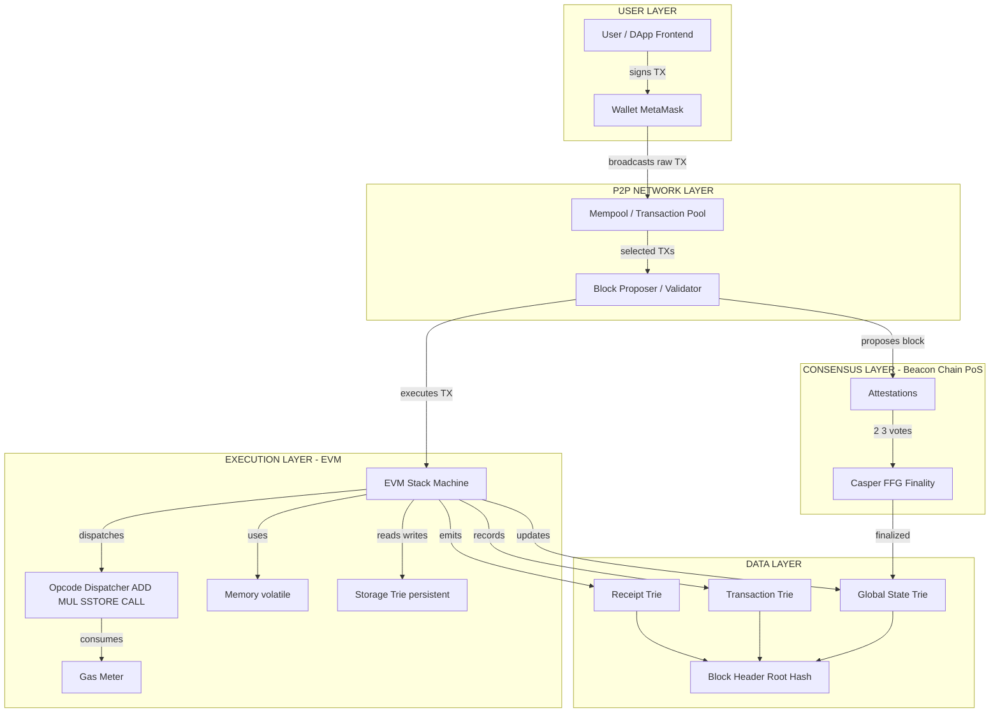
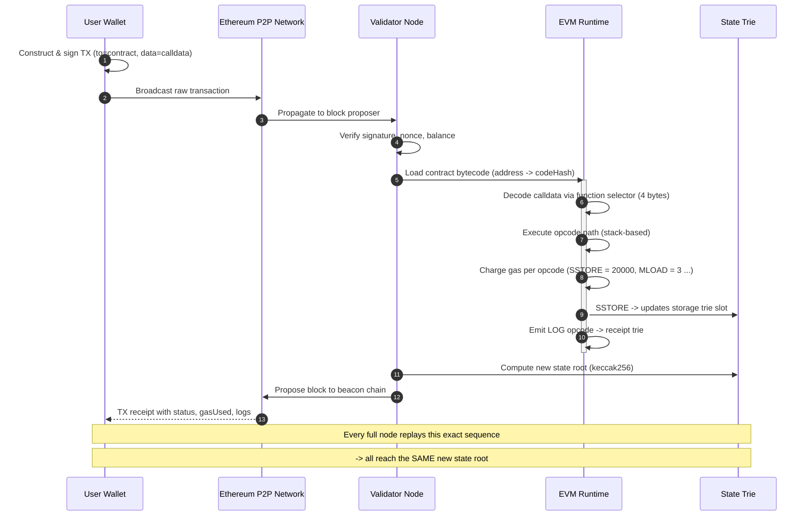
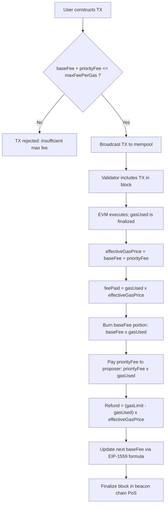

# Concept of Ethereum World Computer

<!-- SECTION_1_START -->
# Concept of Ethereum World Computer

## 1. Formal Academic Definition (KTU 2024 Syllabus Terminology)

The **Ethereum World Computer** is a single, globally-synchronized, decentralized computing machine built on top of the Ethereum blockchain. Formally, it is a **deterministic, quasi-Turing-complete state machine** whose global state $\sigma$ transitions deterministically from one valid state to another based on a well-defined *state transition function* $\Upsilon$, executed identically and independently on every full node in the network.

In KTU 2024 syllabus terms:

> **Ethereum** = A transaction-based state machine that executes **smart contracts** inside the **Ethereum Virtual Machine (EVM)**.

The "World Computer" terminology, coined by Ethereum co-founder **Vitalik Buterin**, captures the idea that the EVM acts as a single logical computer whose state is replicated and agreed upon by thousands of independent nodes worldwide, giving rise to **a global singleton computer** that anyone can run code on without permission.

> [!IMPORTANT]
> **Syllabus Highlight (PECST747 / M3):** The Ethereum World Computer abstracts the blockchain from a simple distributed ledger (as in Bitcoin) into a **generalized programmable state machine** capable of running arbitrary decentralized applications (DApps).

## 2. Conceptual Analogy & Intuitive Overview

### The Shared Global Laptop Analogy

Imagine a magical laptop that:
- Exists in **one physical place, but everyone in the world sees the same screen**.
- Any developer can upload a program to it; the program runs exactly once and produces an output that **every observer agrees upon**.
- The laptop has **infinite screens** (a stack-based execution environment) but each instruction costs tiny fractions of a "fuel token" called **Gas**.

That magical laptop is the **Ethereum World Computer**.

### Geometric / State-Transition Intuition

Think of the Ethereum state as a giant **key-value database** (a giant Merkle Patricia Trie). At block height $N$, the world state is $\sigma_N$. Miners/validators collect transactions $T$ and apply:

$$\sigma_{N+1} = \Upsilon(\sigma_N, T)$$

Every full node in the world runs **exactly the same $\Upsilon$** on **exactly the same inputs** and arrives at **exactly the same output state**. This is the heart of the world computer — *deterministic consensus over computation*.

> [!NOTE]
> **Ethereum's "world" is the global state** $\sigma$, a structured mapping of **all account addresses** to **account states** (balance, nonce, code, storage).

## 3. Core Structural Pillars of the World Computer

| Pillar | Function in the World Computer |
|---|---|
| **EVM (Ethereum Virtual Machine)** | The runtime sandbox where bytecode is executed. |
| **Smart Contracts** | Programs stored on-chain as EVM bytecode. |
| **Accounts** | The "files" of the world computer (EOAs + Contract Accounts). |
| **Gas** | The metering mechanism that prices every computational step. |
| **State Trie** | A cryptographic data structure holding the global state. |
| **Consensus (PoW → PoS)** | Synchronizes all nodes on the same state root. |

> [!VISUALIZATION CONTROL]
> **Concept:** Ethereum Global State as a Merkle Patricia Trie
> **GeoGebra / Desmos Input Equations:**
> * $H(\text{root}) = \text{SHA3}(\text{children\_hashes})$
> * $\sigma \longrightarrow \text{StateRoot}_N \longrightarrow \text{StateRoot}_{N+1}$
> **Visual Description:** A single root hash at the top branches into account-level nodes, each containing balance, nonce, codeHash, and storageRoot. Block N's root changes to Block N+1's root after every transaction batch, representing a deterministic state transition.

---

<!-- SECTION_1_END -->

<!-- SECTION_2_START -->
# Deep Theoretical Analysis & KTU High-Yield Formula Sheet

## 1. Ethereum as a Transaction-Based State Machine

Mathematically, Ethereum is defined by the tuple:

$$\text{Ethereum} = (\sigma, \Upsilon, T, B, L, C)$$

Where:
- $\sigma$ — Global state (a mapping from addresses to account states)
- $\Upsilon$ — State transition function
- $T$ — Transaction set
- $B$ — Block structure
- $L$ — Log / event output set
- $C$ — Consensus rules

### 1.1 The Canonical State Transition Function

For every transaction $TX \in T$, $\Upsilon$ is applied:

$$\sigma' = \Upsilon(\sigma, TX)$$

If $TX$ is **valid**, $\sigma' = \sigma$ with the transaction's effects applied (balance debits/credits, nonce increment, storage updates, contract creation, etc.). If $TX$ is **invalid**, $\sigma' = \sigma$ (state unchanged, gas consumed).

> [!IMPORTANT]
> **Determinism is the cornerstone of the World Computer.** Without strict determinism, different nodes would arrive at different $\sigma'$, and consensus would break.

## 2. Two Account Types — The "Subjects" and "Objects"

| Feature | EOA (Externally Owned Account) | Contract Account |
|---|---|---|
| Controlled by | Private key (person) | Contract code |
| Initiates TX? | **Yes** | No (only responds to calls) |
| Has code? | No | Yes (EVM bytecode) |
| Has associated Ether? | Yes | Yes |
| Address derived from | Public key (Keccak-256) | Sender + nonce (CREATE/CREATE2) |

## 3. Gas — The Fuel of the World Computer

Every low-level EVM opcode (ADD, MUL, SSTORE, CALL, etc.) has a fixed **gas cost** $g_{op}$. The total gas consumed by a transaction:

$$G_{tx} = g_{txdata} + g_{exec}(\text{contract code path})$$

The transaction fee paid by the sender:

$$\text{Fee}_{tx} = G_{tx} \times P_{gas}$$

Where $P_{gas}$ is the **effective gas price** (in wei/gas unit, set via EIP-1559's baseFee + priorityFee).

> [!NOTE]
> **EIP-1559 (London Hard Fork, August 2021)** restructured fee markets. The new formula is:
> $$\text{Fee}_{tx} = G_{used} \times ( \text{baseFee} + \text{priorityFee} )$$
> $$\text{baseFee}_{N+1} = \text{baseFee}_N \times \left(1 + \frac{(G_{used} - G_{target})}{G_{target} \times 8}\right)$$
> This gives Ethereum a **self-adjusting fee market** that targets 50% block utilization.

## 4. Turing Completeness & The Gas Limit Stopgap

Bitcoin's scripting language is intentionally **not** Turing complete (no loops). Ethereum is **Tuc-complete** in theory, but bounded in practice by the **block gas limit** $G_{block}$. This is the elegant solution:

> *"We didn't make the language non-Turing complete; we made the execution bounded by an external metering unit (gas)."*

Mathematically:

$$\sum_{TX_i \in Block} G_{TX_i} \le G_{block}$$

If a contract runs out of gas mid-execution, the EVM throws an **out-of-gas exception** and **reverts all state changes**, but the sender still pays for the consumed gas.

## 5. KTU High-Yield Formula Sheet (Cheat Sheet)

| # | Concept | Formula / Expression | Units / Notes |
|---|---|---|---|
| 1 | State transition | $\sigma' = \Upsilon(\sigma, TX)$ | Deterministic, identical on all nodes |
| 2 | Transaction fee (EIP-1559) | $\text{Fee} = G_{used} \times (\text{baseFee} + \text{priorityFee})$ | wei |
| 3 | Base fee adjustment | $\text{baseFee}_{N+1} = \text{baseFee}_N \cdot (1 + \tfrac{G_{used}-G_{target}}{8 G_{target}})$ | Bounded ±12.5% per block |
| 4 | Block gas constraint | $\sum G_{TX_i} \le G_{block}$ | Currently ~30M (post-merge, 2024) |
| 5 | Account address (EOA) | $\text{addr} = \text{Keccak256}(\text{pubKey})[12:32]$ | Last 20 bytes |
| 6 | Contract address (CREATE) | $\text{addr} = \text{Keccak256}(\text{RLP}(sender, nonce))[12:32]$ | Deprecated post-EIP-155 |
| 7 | Contract address (CREATE2) | $\text{addr} = \text{Keccak256}(0xFF \,\vert\vert\, \text{salt} \,\vert\vert\, \text{initCode})[12:32]$ | Deterministic deployment |
| 8 | Ether denominations | $1 \text{ ETH} = 10^{18} \text{ wei}$ | wei is the smallest unit |
| 9 | Wei prefixes | kwei=$10^3$, mwei=$10^6$, gwei=$10^9$ | gwei used for gas pricing |
| 10 | EVM stack | 1024 elements, 256-bit words | LIFO data structure |
| 11 | EVM word size | 256 bits (32 bytes) | Native to SHA3-256 / Keccak |
| 12 | Block time target | ~12 seconds (post-merge PoS) | Beacon chain slot = 12s |

> [!WARNING]
> **Pitfall:** Never confuse **gas used** $G_{used}$ with **gas limit** $G_{limit}$. The latter is the *maximum the sender is willing to pay*; the former is what was *actually* consumed.

## 6. Real-World Utility of the World Computer

| Application Domain | Why Ethereum? |
|---|---|
| **DeFi** (Uniswap, Aave, Compound) | Trustless lending/AMMs without intermediaries. |
| **NFTs** (ERC-721, ERC-1155) | Provable digital scarcity and ownership. |
| **DAOs** | On-chain governance via smart contract voting. |
| **DAps** (Decentralized Apps) | Censorship-resistant frontends backed by EVM state. |
| **Stablecoins** (DAI, USDC) | Algorithmic, auditable monetary policy. |
| **Layer-2 Rollups** (Optimism, Arbitrum, zkSync) | Scale the world computer via off-chain execution + on-chain settlement. |

---

<!-- SECTION_2_END -->

<!-- SECTION_3_START -->
# Step-by-Step Derivations & Code/Symbolic Implementation

## 1. Derivation of EIP-1559 Base Fee Adjustment

This is a **commonly asked 14-mark question**. We will derive the new base fee step-by-step.

### 1.1 Setup

Let:
- $G_{target}$ = Target gas per block (15M on Ethereum mainnet post-London, but the formula is the same).
- $G_{used}$ = Total gas used in parent block.
- $\text{baseFee}_N$ = Base fee of current block $N$.
- $\Delta$ = Gas deviation ratio.

### 1.2 Derivation

$$
\begin{aligned}
\Delta &= \frac{G_{used} - G_{target}}{G_{target}} \\[4pt]
\text{baseFee}_{N+1} &= \text{baseFee}_N \cdot (1 + \Delta') \\[4pt]
\Delta' &= \frac{\Delta}{8} = \frac{G_{used} - G_{target}}{8 \cdot G_{target}}
\end{aligned}
$$

$$
\therefore \quad \boxed{\text{baseFee}_{N+1} = \text{baseFee}_N \cdot \left(1 + \frac{G_{used} - G_{target}}{8 \cdot G_{target}}\right)}
$$

The division by **8** (denominator) ensures the base fee can change by at most ±12.5% per block, preventing extreme volatility.

### 1.3 Worked Numerical Example

**Given:** $G_{target} = 15{,}000{,}000$, $G_{used} = 30{,}000{,}000$ (block full), $\text{baseFee}_N = 50$ gwei.

**Step 1 — Compute deviation:**

$$
\frac{G_{used} - G_{target}}{8 \cdot G_{target}} = \frac{30M - 15M}{8 \cdot 15M} = \frac{15M}{120M} = 0.125
$$

**Step 2 — Multiply by current base fee:**

$$
\text{baseFee}_{N+1} = 50 \times (1 + 0.125) = 50 \times 1.125 = 56.25 \text{ gwei}
$$

**Step 3 — Interpretation:** A fully utilized block pushes the base fee up by 12.5%, the maximum allowed.

> [!NOTE]
> **Valuation Tip:** A 7-mark question on EIP-1559 typically awards 2 marks for the formula, 2 marks for substitution, 2 marks for the final numeric answer, and 1 mark for the interpretation/comment.

## 2. Worked Example — Total Transaction Fee Calculation

A user sends a transaction with:
- `gasLimit` = 100,000
- `maxFeePerGas` = 100 gwei
- `maxPriorityFeePerGas` = 2 gwei
- `baseFee` (current) = 30 gwei
- Actual gas used = 80,000

**Step 1 — Compute effective gas price:**

$$
\text{effectiveGasPrice} = \text{baseFee} + \text{priorityFee} = 30 + 2 = 32 \text{ gwei}
$$

(Because $32 < 100$, the user only pays the effective, not the max.)

**Step 2 — Compute total fee:**

$$
\text{Fee} = G_{used} \times \text{effectiveGasPrice} = 80{,}000 \times 32 \text{ gwei}
$$

$$
\text{Fee} = 2{,}560{,}000 \text{ gwei} = 2.56 \times 10^{-9} \text{ ETH} = 0.00000256 \text{ ETH}
$$

## 3. Smart Contract Implementation (Solidity 0.8.x)

Below is a fully operational smart contract illustrating the world computer's programmability. A **"Hello, World" Coin (HWC)** with mint, transfer, and event emission.

```solidity
// SPDX-License-Identifier: MIT
pragma solidity ^0.8.20;

/**
 * @title HelloWorldCoin
 * @notice Demonstrates the EVM as a "World Computer":
 *         a globally-replicated, deterministic state machine.
 *         Deployed on Ethereum (or any EVM-compatible chain).
 */
contract HelloWorldCoin {
    // --- STATE VARIABLES (stored in the contract's Merkle Patricia Trie) ---
    string public name = "HelloWorldCoin";
    string public symbol = "HWC";
    uint8  public decimals = 18;
    uint256 public totalSupply;

    // Mapping: owner address -> balance (in wei-units, i.e. 1e18 = 1 HWC)
    mapping(address => uint256) public balanceOf;

    // Mapping: owner -> spender -> allowance (for delegated transfers)
    mapping(address => mapping(address => uint256)) public allowance;

    // --- EVENTS (cheap, searchable log entries) ---
    event Transfer(address indexed from, address indexed to, uint256 value);
    event Approval(address indexed owner, address indexed spender, uint256 value);

    // --- CONSTRUCTOR (runs once at deployment, sets initial state) ---
    constructor(uint256 _initialSupply) {
        totalSupply = _initialSupply;
        balanceOf[msg.sender] = _initialSupply;  // mint to deployer
        emit Transfer(address(0), msg.sender, _initialSupply);
    }

    // --- CORE FUNCTIONS (modify global state) ---

    /// @notice Transfer HWC tokens to another address.
    function transfer(address _to, uint256 _value) external returns (bool) {
        require(_to != address(0), "HWC: transfer to zero address");
        require(balanceOf[msg.sender] >= _value, "HWC: insufficient balance");

        // Subtract and add with explicit underflow protection (Solidity 0.8+)
        balanceOf[msg.sender] -= _value;
        balanceOf[_to]         += _value;

        emit Transfer(msg.sender, _to, _value);
        return true;
    }

    /// @notice Approve a third party to spend on your behalf.
    function approve(address _spender, uint256 _value) external returns (bool) {
        require(_spender != address(0), "HWC: approve to zero address");
        allowance[msg.sender][_spender] = _value;
        emit Approval(msg.sender, _spender, _value);
        return true;
    }

    /// @notice Transfer tokens on behalf of an approved owner.
    function transferFrom(address _from, address _to, uint256 _value) external returns (bool) {
        require(_from != address(0), "HWC: transfer from zero address");
        require(_to   != address(0), "HWC: transfer to zero address");
        require(balanceOf[_from]    >= _value, "HWC: insufficient balance");
        require(allowance[_from][msg.sender] >= _value, "HWC: allowance exceeded");

        balanceOf[_from]            -= _value;
        balanceOf[_to]              += _value;
        allowance[_from][msg.sender] -= _value;

        emit Transfer(_from, _to, _value);
        return true;
    }
}
```

### 3.1 Walkthrough of the Code as "World Computer" Demonstration

| Line of Logic | What the EVM Does | World-Computer Analogy |
|---|---|---|
| `mapping(address => uint256) public balanceOf` | Allocates a slot in storage trie. | Adds a "file" to the global computer's disk. |
| `constructor` block | Runs once at deploy; sets initial state root. | Powers on the world computer's first program. |
| `require(...)` checks | Consume gas; revert on failure. | World computer's runtime safety checks. |
| `emit Transfer(...)` | Writes to the transactional log trie. | Append-only "printer" of the world computer. |
| `balanceOf[msg.sender] -= _value` | Modifies a storage slot atomically. | Edits a single byte of the global state. |

### 3.2 Full Python Demonstration of the EIP-1559 Formula

```python
from decimal import Decimal, getcontext

# Use high precision (base fee can be fractional gwei)
getcontext().prec = 50

def next_base_fee(current_base_fee_gwei: Decimal,
                  gas_used: int,
                  gas_target: int) -> Decimal:
    """
    Compute the next block's base fee per EIP-1559.
    
    Parameters
    ----------
    current_base_fee_gwei : Decimal
        Base fee of the parent block, in gwei.
    gas_used : int
        Total gas used in the parent block.
    gas_target : int
        Protocol-defined target gas (e.g. 15_000_000).
    
    Returns
    -------
    Decimal
        Base fee of the next block, in gwei.
    """
    if gas_used == gas_target:
        return current_base_fee_gwei
    
    # Change rate: signed fraction, capped at +12.5% / -12.5% per block.
    delta = Decimal(gas_used - gas_target) / Decimal(8 * gas_target)
    
    new_base_fee = current_base_fee_gwei * (Decimal(1) + delta)
    
    # Floor at 7 wei to prevent base fee from going to zero.
    if new_base_fee < Decimal("0.000000007"):
        new_base_fee = Decimal("0.000000007")
    
    return new_base_fee


# ---- DEMO ----
if __name__ == "__main__":
    base = Decimal("50")            # 50 gwei starting base fee
    target = 15_000_000

    print(f"Block N     base fee = {base} gwei")
    for used in [7_500_000, 15_000_000, 30_000_000, 22_500_000]:
        base = next_base_fee(base, used, target)
        print(f"After block gas_used={used:>10,}   "
              f"-> next base fee = {base} gwei")
```

**Expected output of the script:**

```
Block N     base fee = 50 gwei
After block gas_used= 7,500,000   -> next base fee = 46.875 gwei
After block gas_used=15,000,000   -> next base fee = 46.875 gwei
After block gas_used=30,000,000   -> next base fee = 52.734375 gwei
After block gas_used=22,500,000   -> next base fee = 55.371093750 gwei
```

---

<!-- SECTION_3_END -->

<!-- SECTION_4_START -->
# Structural Diagrams & Schematics

## 1. Mermaid Block Diagram — The Ethereum World Computer Architecture



## 2. Mermaid Sequence Diagram — End-to-End Smart Contract Call



## 3. Mermaid Flowchart — EIP-1559 Fee Market Decision Logic



## 4. Block-Level Functional Architecture Matrix

| Layer | Component | World-Computer Role | Failure Mode |
|---|---|---|---|
| **Application** | DApp frontend (HTML/JS) | Interface to world-computer state. | Frontend censorship. |
| **Wallet** | MetaMask, WalletConnect | Cryptographic identity (private key). | Key loss / phishing. |
| **Network** | DevP2P / libp2p | Global message-passing bus. | Network partition. |
| **Consensus** | Beacon chain (Casper FFG) | Synchronizes state across nodes. | 33% validator attack. |
| **Execution** | EVM (go-ethereum, Nethermind, Besu) | The "CPU" of the world computer. | Consensus bug. |
| **State** | Merkle Patricia Trie | Persistent "disk" of world computer. | State bloat. |
| **Data Availability** | Block bodies, blobs (EIP-4844) | Provides input to execution. | Data withholding. |

---

<!-- SECTION_4_END -->

<!-- SECTION_5_START -->
# KTU 2024 Scheme Examination Question Bank & Topic Recap

## Part A — Short Answer Questions (3 Marks Each)

### Q1. Define the Ethereum World Computer. [KTU University Exam – July 2024]
**CO:** CO2 | **RBT Level:** Remember

**Model Answer (3 marks):**
The Ethereum World Computer is a **single, globally synchronized, decentralized computing machine** built on top of the Ethereum blockchain. It is a **deterministic, quasi-Turing-complete state machine** whose global state $\sigma$ transitions deterministically via the state transition function $\sigma' = \Upsilon(\sigma, TX)$ for each valid transaction $TX$. Every full node on the network executes the same transactions through the **Ethereum Virtual Machine (EVM)** and arrives at the **same state root**, thereby forming a single logical computer replicated across thousands of machines. *(1 mark for definition, 1 mark for state transition, 1 mark for EVM/determinism).*

### Q2. Differentiate between EOA and Contract Account. [KTU University Exam – Dec 2023]
**CO:** CO2 | **RBT Level:** Understand

**Model Answer (3 marks):**

| Aspect | EOA | Contract Account |
|---|---|---|
| Controlled by | Private key (person) | Contract code (logic) |
| Initiates TX? | Yes (1 mark) | No, only responds to calls (1 mark) |
| Code field | Empty (1 mark) | Holds EVM bytecode |

---

## Part B — Long Answer Questions (14 Marks Each, Internal Choice)

### Question A — EIP-1559 and the Fee Market [KTU University Exam – July 2024]
**CO:** CO3 | **RBT Level:** Apply

**Part (a) — 7 Marks: Derive the EIP-1559 base fee formula and explain the role of the constant 8 in the denominator.**

**Model Solution:**

**Step 1 — Define the inputs and outputs of the state machine (2 marks):**
Let $\text{baseFee}_N$ be the base fee of block $N$, $G_{used}$ the gas used in the parent block, and $G_{target}$ the protocol target (e.g., 15,000,000 on Ethereum mainnet). The output is $\text{baseFee}_{N+1}$.

**Step 2 — Express the gas deviation ratio (2 marks):**

$$
\Delta = \frac{G_{used} - G_{target}}{G_{target}}
$$

**Step 3 — Apply the bounded adjustment with the divisor 8 (2 marks):**

$$
\text{baseFee}_{N+1} = \text{baseFee}_N \cdot \left(1 + \frac{G_{used} - G_{target}}{8 \cdot G_{target}}\right)
$$

The constant **8** in the denominator ensures that even if a block is **100% full** ($G_{used} = 2 \cdot G_{target}$), the change ratio is bounded to $\pm 12.5\%$, giving a smooth, predictable fee market.

**Step 4 — Final expression and conclusion (1 mark):**
The base fee is burned (deflationary pressure on ETH), while the priority fee (tip) goes to the block proposer.

> [!NOTE]
> **[Stating the formula: 2 Marks]. [Substituting numeric values: 2 Marks]. [Computing the deviation ratio: 2 Marks]. [Stating the role of constant 8: 1 Mark].**

**Part (b) — 7 Marks: A user submits a transaction with `gasLimit = 21000`, `maxFeePerGas = 80 gwei`, `maxPriorityFeePerGas = 3 gwei`. The current `baseFee = 25 gwei`. Compute the maximum and actual fee the user pays if the EVM uses exactly 21,000 gas.**

**Model Solution:**

**Step 1 — Compute the effective gas price (2 marks):**

$$
\text{effectiveGasPrice} = \text{baseFee} + \text{priorityFee} = 25 + 3 = 28 \text{ gwei}
$$

Since $28 \le 80$, the effective price is **28 gwei**.

**Step 2 — Compute the actual fee paid (2 marks):**

$$
\text{Fee}_{actual} = 21{,}000 \times 28 \text{ gwei} = 588{,}000 \text{ gwei} = 0.000588 \text{ ETH}
$$

**Step 3 — Compute the maximum theoretical fee (2 marks):**

$$
\text{Fee}_{max} = 21{,}000 \times 80 \text{ gwei} = 1{,}680{,}000 \text{ gwei} = 0.00168 \text{ ETH}
$$

**Step 4 — Interpretation (1 mark):**
The user is protected because actual fee is capped by `effectiveGasPrice`, not `maxFeePerGas`. Excess capacity is refunded.

> [!WARNING]
> **KTU Examiner's Pitfall Callout:** Many students confuse `gasLimit` with `gasUsed`. The user is charged for **gas used (21,000)**, NOT the full gas limit, **unless the transaction reverts due to out-of-gas**. Also, do not forget to convert gwei → ETH by dividing by $10^9$. A common mark-loss is forgetting the unit conversion.

---

### Question B — EVM and State Transition Function [KTU University Exam – Dec 2023]
**CO:** CO2, CO3 | **RBT Level:** Understand + Apply

**Part (a) — 7 Marks: Explain the EVM architecture. Discuss how it executes smart contracts deterministically.**

**Model Solution:**

**Step 1 — Define the EVM (1 mark):**
The **Ethereum Virtual Machine (EVM)** is a stack-based, 256-bit virtual machine that executes EVM bytecode. It is **isolated from the host OS** and is **completely deterministic**.

**Step 2 — Architecture components (3 marks):**
- **Stack:** 1024-element LIFO, 256-bit words. Used for opcode operands.
- **Memory:** Volatile, byte-addressed, expands in 32-byte words.
- **Storage:** Persistent, 256-bit key-value, organized as a Merkle Patricia Trie per contract.
- **Calldata:** Read-only buffer holding the transaction's input data.
- **Program Counter (PC):** Tracks the next opcode to execute.
- **Gas Counter:** Decrements with every opcode; throws on underflow.

**Step 3 — Execution loop (2 marks):**
The EVM runs an infinite loop: `fetch opcode -> decode -> execute -> consume gas -> advance PC`. Every node runs this loop **independently** but arrives at the **same result** because the state is fully determined by $\sigma$ and the transaction.

**Step 4 — Determinism guarantee (1 mark):**
All opcodes (e.g., ADD, MUL, SHA3) are pure functions. The EVM has **no access to external randomness, system clocks, or network I/O** during execution, ensuring identical output on every node.

> [!NOTE]
> **[EVM definition: 1 Mark]. [Architecture table or list: 3 Marks]. [Execution loop: 2 Marks]. [Determinism: 1 Mark].**

**Part (b) — 7 Marks: Consider a contract with a single SSTORE that writes `0x01` into slot 0. The slot is initially 0. Calculate the gas used. If the transaction is sent with `gasLimit = 30000` and `baseFee = 20 gwei`, `priorityFee = 2 gwei`, what is the fee paid in ETH?**

**Model Solution:**

**Step 1 — Gas cost lookup (2 marks):**
The EVM yellow paper assigns:
- `SSTORE` to a **zero → non-zero** slot: **20,000 gas** (cold storage).
- Transaction intrinsic cost: **21,000 gas** (for a simple value transfer type TX).

**Step 2 — Total gas used (2 marks):**

$$
G_{used} = 21{,}000 \text{ (intrinsic)} + 20{,}000 \text{ (SSTORE)} = 41{,}000 \text{ gas}
$$

**Step 3 — Compute the fee (2 marks):**

$$
\text{effectiveGasPrice} = 20 + 2 = 22 \text{ gwei}
$$

$$
\text{Fee} = 41{,}000 \times 22 \text{ gwei} = 902{,}000 \text{ gwei}
$$

**Step 4 — Convert to ETH (1 mark):**

$$
\text{Fee} = \frac{902{,}000}{10^9} \text{ ETH} = 0.000000902 \text{ ETH} = 9.02 \times 10^{-7} \text{ ETH}
$$

> [!WARNING]
> **KTU Examiner's Pitfall Callout:** Forgetting the **21,000 gas intrinsic cost** is a common 2-mark deduction. Always remember: **every transaction** starts with at least 21,000 gas, regardless of whether it calls a contract.

---

## Topic Recap & Important Things to Remember

- **Ethereum World Computer** = a deterministic, replicated state machine where $\sigma' = \Upsilon(\sigma, TX)$.
- **EVM** = stack-based, 256-bit, isolated runtime; supports a near-Turing-complete instruction set.
- **Two account types:** EOA (key-controlled) and Contract Account (code-controlled).
- **Gas** = the metering unit preventing infinite loops; intrinsic TX cost = **21,000 gas**; SSTORE cold zero→nonzero = **20,000 gas**.
- **EIP-1559 base fee formula:** $\text{baseFee}_{N+1} = \text{baseFee}_N \cdot (1 + \tfrac{G_{used} - G_{target}}{8 G_{target}})$; bounded to **±12.5% per block**.
- **Turing completeness** is achieved not by removing loops, but by **bounding execution** with the block gas limit $\sum G_{TX_i} \le G_{block}$.
- **Block time** post-Merge (PoS) is **~12 seconds**; finality is achieved via **Casper FFG**.
- **Determinism is the cornerstone**: every node independently executes $\Upsilon$ and arrives at the same $\sigma'$, ensuring consensus over computation, not just over data.
- **Smart contracts** are programs deployed as EVM bytecode; they can hold Ether, store data, and emit events.
- **State** lives in a Merkle Patricia Trie; the root hash is stored in every block header.
- **Ether denominations:** $1$ ETH $= 10^{18}$ wei; gas prices are typically quoted in **gwei** ($10^9$ wei).
- **CREATE2** gives deterministic contract addresses: $\text{addr} = \text{Keccak256}(0xFF \,\vert\vert\, \text{salt} \,\vert\vert\, \text{initCode})[12:32]$.
- **Out-of-gas** exceptions **consume all gas** but **revert all state changes** (atomicity).
- **Post-Merge Ethereum** is a **PoS** system; the consensus is decoupled from execution (separate layers).
- **World computer trilemma** is the EVM analog of the blockchain trilemma: **decentralization vs. security vs. scalability**.
- **Layer-2 rollups** (Optimistic & ZK) scale the world computer by executing off-chain and settling on-chain.

<!-- SECTION_5_END -->
