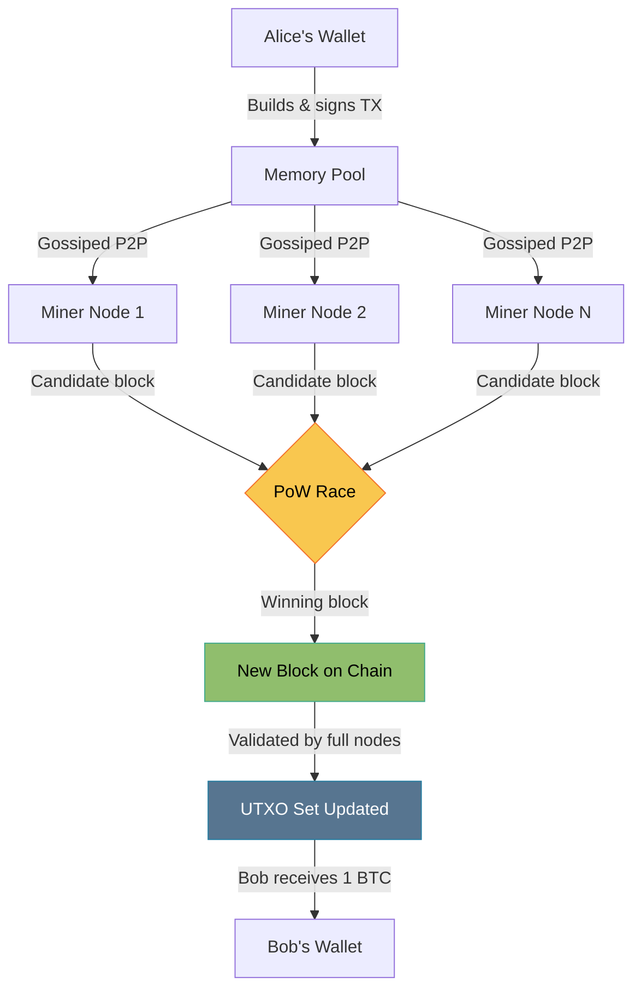
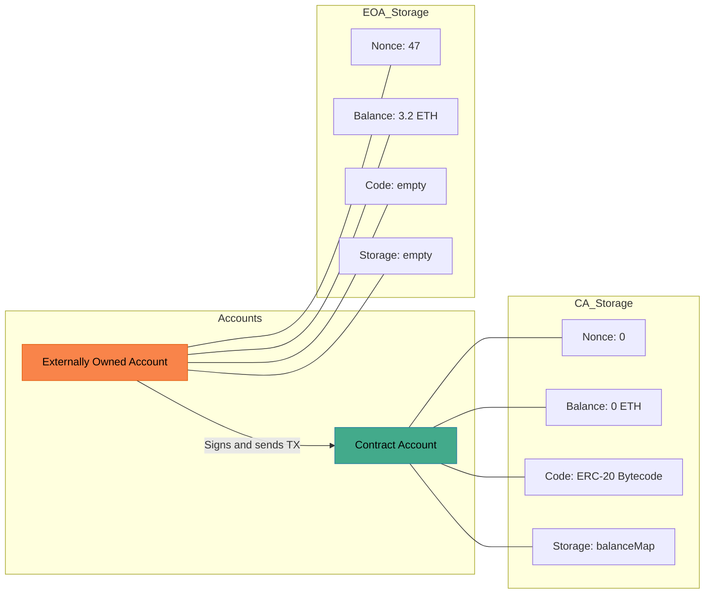
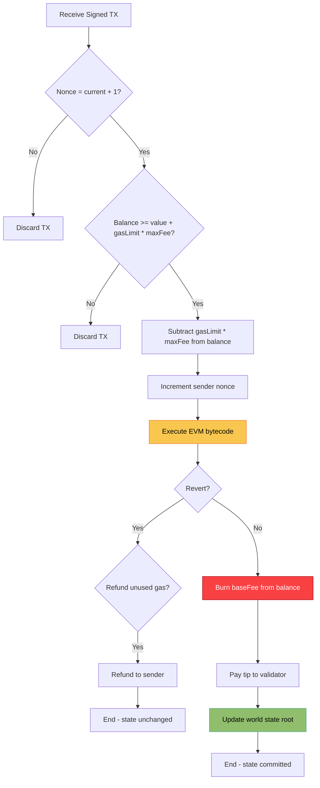

# Cryptocurrencies - Bitcoin and Ethereum

<!-- SECTION_1_START -->

# Module 3 — Cryptocurrencies: Bitcoin and Ethereum

## 1.1 Formal Definition (KTU 2024 Syllabus Terminology)

> [!IMPORTANT]
> **Cryptocurrency** is a cryptographically secured, decentralized digital medium of exchange that operates on a distributed ledger (blockchain) and uses cryptographic primitives (hash functions, digital signatures, and consensus algorithms) to validate, record, and secure peer-to-peer transactions without the need for a trusted central authority.

A cryptocurrency is *not* just "digital money" — it is a **state machine** replicated across thousands of nodes, where the state transition is governed purely by mathematics and game-theoretic incentives.

### 1.1.1 Bitcoin — The First Generation

> [!NOTE]
> **Bitcoin (₿, BTC)** is a peer-to-peer electronic cash system proposed in the 2008 white paper *"Bitcoin: A Peer-to-Peer Electronic Cash System"* by the pseudonymous **Satoshi Nakamoto**. It is the first practical implementation of a decentralized, trustless, censorship-resistant monetary network, achieved by combining:
> 1. **SHA-256** cryptographic hash function,
> 2. **ECDSA** (Elliptic Curve Digital Signature Algorithm) on the **secp256k1** curve,
> 3. **Proof-of-Work (PoW)** consensus based on Hashcash,
> 4. A **UTXO (Unspent Transaction Output)** accounting model,
> 5. A fixed monetary policy of **21,000,000 BTC** with a controlled issuance schedule (*halving every 210,000 blocks*).

### 1.1.2 Ethereum — The Second Generation

> [!IMPORTANT]
> **Ethereum (Ξ, ETH)** is an open-source, blockchain-based distributed computing platform proposed by **Vitalik Buterin** in late 2013 and launched in July 2015. It extends the blockchain paradigm beyond monetary transactions into a **Turing-complete** programmable settlement layer, allowing developers to deploy **smart contracts** — self-executing programs whose code is stored on-chain and executed by the **Ethereum Virtual Machine (EVM)** on every node. The native currency is **Ether (ETH)**, which is used to pay **gas** for computation and storage.

| Parameter | Bitcoin | Ethereum |
|---|---|---|
| Year launched | 2009 | 2015 |
| Founder | Satoshi Nakamoto | Vitalik Buterin & co-founders |
| Consensus | Proof-of-Work (SHA-256) | Proof-of-Stake (Casper FFG, post-Merge 2022) |
| Native currency | BTC (₿) | Ether (Ξ) |
| Block time | ~10 minutes | ~12 seconds (slot) |
| Account model | **UTXO** | **Account-based** (EOA + Contract) |
| Smart contracts | Limited (Bitcoin Script) | Turing-complete (Solidity / Vyper / Yul) |
| Block gas limit | ~4,000,000 weight units | ~30,000,000 gas |
| Max supply | 21,000,000 BTC (hard cap) | No fixed cap (EIP-1559 burn) |
| Monetary policy | Halving every 210,000 blocks | Dynamic base fee + tip |

---

## 1.2 Conceptual Analogy & Intuition

### 1.2.1 Intuition for Bitcoin — *"The Golden Ledger"*

> [!NOTE]
> Think of Bitcoin as a **giant, transparent, write-only spreadsheet** that is photocopied and distributed to every participant in the world. No one person owns the spreadsheet. Every 10 minutes, a "lucky volunteer" (the miner) is chosen by a mathematical lottery to bundle a page of transactions, seal it cryptographically, and glue it to the last page. To prevent tampering, every page references the previous page's fingerprint (its **hash**). To prevent cheating, the volunteer must solve a **brute-force puzzle** that costs real electricity — this is the Proof of Work.

A simple analogy: imagine a town of 10,000 citizens who do not trust any single bank. They collectively maintain a **bulletin board** in the town square. Every transaction written on the board must be **signed** by the sender using a unique seal that no one can forge. Once written, a sheet is **stapled** to the previous one, and changing any old sheet would require rewriting the entire board and out-pacing the rest of the town — economically infeasible.

### 1.2.2 Intuition for Ethereum — *"The World Computer"*

> [!IMPORTANT]
> Bitcoin's spreadsheet can only record money movements. Ethereum upgrades that spreadsheet into a **programmable spreadsheet** — every cell can contain a tiny program (a *smart contract*) that runs exactly as written, with no possibility of downtime, censorship, or third-party interference. Think of Ethereum as a **global vending machine**: anyone can deploy an application that, when given the correct input (a signed transaction + enough gas), deterministically executes a function whose output is also stored on the board.

A relatable analogy: imagine a town notary who is actually a **robot**. You hand the robot a contract written in a special language. The robot then, in front of witnesses (every node), reads the contract aloud, performs the steps, files the result in the public ledger, and charges a small fee (gas) for the time and paper it used.

> [!VISUALIZATION CONTROL]
> **Concept:** Account balance growth and ETH issuance curve.
> **GeoGebra / Desmos Input Equations:**
> * `f(x) = 5 * e^(-x/5)` — A sample exponential-decay issuance model similar in spirit to Bitcoin's supply curve.
> * `g(x) = 21,000,000 * (1 - (1/2)^(x/210000))` — Bitcoin's supply formula: total BTC issued after `x` blocks.
> **Visual Description:** On the x-axis, plot the block height (0 → 6,930,000); on the y-axis, plot the cumulative BTC supply. The curve rises steeply initially, then flattens asymptotically toward the **21 million BTC** horizontal asymptote. The user should observe distinct "step" plateaus every 210,000 blocks where the slope halves.

---

## 1.3 Key Physical / Mathematical Constants to Remember

> [!IMPORTANT]
> * Bitcoin's **target block time**: **10 minutes**.
> * Bitcoin's **halving interval**: **210,000 blocks** (≈ 4 years).
> * Initial block reward: **50 BTC** (2009) → 25 → 12.5 → 6.25 → 3.125 BTC (2024).
> * Bitcoin's **hard cap**: **21,000,000 BTC**.
> * Ethereum's **target slot time**: **12 seconds**.
> * Ethereum's **slots per epoch**: **32** (≈ 6.4 minutes per epoch).
> * Ethereum's EVM word size: **256 bits** (32 bytes).
> * Ethereum's unit of account: **Wei** (1 ETH = $10^{18}$ Wei), with common denominations Gwei ($10^9$ Wei) and Szabo ($10^{12}$ Wei).

<!-- SECTION_1_END -->

<!-- SECTION_2_START -->

# Deep Theoretical Analysis & KTU High-Yield Formula Sheet

## 2.1 Bitcoin — Architecture Deep-Dive

### 2.1.1 Transaction Lifecycle in Bitcoin

A Bitcoin transaction follows a strict six-stage lifecycle:

1. **Wallet Construction** — A wallet (non-deterministic *legacy* or BIP-32 *HD wallet*) derives a private key $k_{priv}$ from a seed via **PBKDF2 / HMAC-SHA512**.
2. **UTXO Selection** — The wallet scans the **UTXO set** maintained by every full node and selects unspent outputs summing to (or exceeding) the payment plus fee.
3. **ScriptPubKey Generation** — For the receiver, the wallet builds a locking script: `OP_DUP OP_HASH160 <pubKeyHash> OP_EQUALVERIFY OP_CHECKSIG` (the standard **P2PKH** template).
4. **Signing** — For each input, the wallet signs the transaction digest using **ECDSA** on `secp256k1` with the private key.
5. **Broadcast** — The signed raw transaction is gossiped across the peer-to-peer network (TCP port **8333** mainnet).
6. **Confirmation** — Miners include the transaction in a candidate block. After 6 confirmations (~1 hour), the transaction is considered practically immutable.

### 2.1.2 Block Structure in Bitcoin

A Bitcoin block has a maximum size (post-SegWit) of **4,000,000 weight units** (≈ 1 MB base + 3 MB witness data). Its header is exactly **80 bytes** and contains:

* Version (4 bytes)
* Previous block hash (32 bytes)
* Merkle root (32 bytes)
* Timestamp (4 bytes)
* **nBits** (4 bytes) — encoded difficulty target
* Nonce (4 bytes)

### 2.1.3 Proof-of-Work in Bitcoin

> [!NOTE]
> The mining puzzle requires finding a nonce $n$ such that:
> $$\text{SHA256}(\text{SHA256}(\text{block header} \Vert n)) < T$$
> where $T$ is the **target threshold**, recomputed every **2016 blocks** (≈ 2 weeks) so that the average block time remains **10 minutes**, regardless of total network hash power.

The **difficulty** $D$ is defined as:
$$D = \frac{D_{1}}{\text{nBits target}}$$
where $D_{1}$ is the genesis difficulty. A higher $D$ means a smaller target, hence a harder puzzle.

### 2.1.4 The Bitcoin Supply Formula

The total BTC issued after $n$ blocks is:
$$\text{Supply}(n) = 50 \cdot \sum_{i=0}^{\lfloor n / 210000 \rfloor - 1} 210000 \cdot \left(\frac{1}{2}\right)^{i} + 50 \cdot \left(\frac{1}{2}\right)^{\lfloor n/210000 \rfloor} \cdot (n \bmod 210000)$$

Asymptotically, this sum converges to:
$$\text{Total Supply} = 50 \cdot 210000 \cdot \sum_{i=0}^{\infty} \left(\frac{1}{2}\right)^{i} = 50 \cdot 210000 \cdot 2 = 21{,}000{,}000 \text{ BTC}$$

### 2.1.5 Merkle Tree Construction

Transactions in a block are arranged in a **binary Merkle tree**:

$$H_{i,j} = \text{SHA256}(\text{SHA256}(H_{i} \Vert H_{j}))$$

The Merkle root enables **Simplified Payment Verification (SPV)**: a light client can prove inclusion of a transaction with only $O(\log_2 n)$ hashes instead of the entire block.

---

## 2.2 Ethereum — Architecture Deep-Dive

### 2.2.1 Account Model

Unlike Bitcoin's UTXO model, Ethereum uses an **account-based** model with two account types:

> [!NOTE]
> 1. **Externally Owned Account (EOA)** — controlled by a private key, holds an ETH balance and a **nonce**.
> 2. **Contract Account (CA)** — controlled by code, has storage and code, no private key.

Every account on Ethereum is a 20-byte address derived as the **last 20 bytes of the Keccak-256 hash of the public key**:
$$\text{address} = \text{Keccak256}(pk)[\,12:32\,]$$

### 2.2.2 The Ethereum State Transition Function

> [!IMPORTANT]
> The canonical EVM state transition is expressed formally as:
> $$\sigma_{t+1} \equiv \Upsilon(\sigma_t, T)$$
> where $\sigma_t$ is the world state, $T$ is the transaction, and $\Upsilon$ is the EVM state-transition function. If the transaction is invalid (insufficient balance, wrong nonce, runtime revert, or out-of-gas), $\sigma_{t+1} = \sigma_t$ and all gas is consumed.

The world state is a structure of the form:
$$\sigma \equiv (\mu, \text{storage of all contracts})$$

Stored in a **Merkle Patricia Trie** keyed by account address, with a 256-bit **state root** committed in the block header.

### 2.2.3 Gas Mechanism

Every EVM opcode has a fixed **gas cost** (e.g., `ADD` = 3, `MUL` = 5, `SSTORE` zero→non-zero = 20,000). The transaction's total fee is:

$$\text{Total Fee} = \text{gasUsed} \times (\text{baseFee} + \text{priorityTip})$$

Post **EIP-1559 (London hard-fork, August 2021)**, the base fee is dynamically adjusted:

$$\text{baseFee}_{t+1} = \text{baseFee}_t \times \left(1 + \frac{\text{gasUsed} - \text{gasTarget}}{\text{gasTarget}}\right)$$

bounded by a **12.5%** change per block. The base fee is **burned** (removed from supply), while the tip goes to the validator.

### 2.2.4 Ethereum's Proof-of-Stake (Casper FFG + LMD-GHOST)

After **The Merge (September 15, 2022)**, Ethereum replaced PoW with PoS:

* **Validators** deposit **32 ETH** as collateral (slashed if they misbehave).
* Time is divided into **slots** (12 s) and **epochs** (32 slots).
* A **pseudo-random** leader is selected per slot using **RANDAO**.
* **Casper FFG** provides *finality* (2 epochs ≈ 12.8 min).
* **LMD-GHOST** (Latest Message Driven Greediest Heaviest Observed SubTree) is the *fork-choice rule*.

### 2.2.5 Smart Contract Execution

A Solidity smart contract, when compiled, becomes EVM bytecode. When an EOA calls a contract:

1. The transaction is broadcast.
2. The block proposer includes it.
3. Every validating node **deterministically** executes the EVM bytecode.
4. The resulting state root is committed.

> [!NOTE]
> **Determinism** is critical: given the same $\sigma_t$ and $T$, every honest node must compute the *identical* $\sigma_{t+1}$ — otherwise consensus breaks. This is why EVM opcodes exclude non-deterministic sources (no `float`, no `clock`, no random — `VRF` via oracles is used instead).

---

## 2.3 KTU Formula Sheet / Cheat Sheet

> [!IMPORTANT]
> The following table is your **high-yield revision table** for KTU ESE Module 3.

| # | Concept | Formula / Definition | Typical Use |
|---|---|---|---|
| 1 | Bitcoin target | $T = T_{\max} / D$ | PoW mining |
| 2 | Mining success | $\text{SHA256}(\text{SHA256}(H \Vert n)) < T$ | Finding valid nonce |
| 3 | Difficulty adjust | $D_{new} = D_{old} \cdot \frac{t_{actual}}{2016 \cdot 10 \cdot 60}$ | Every 2016 blocks |
| 4 | Bitcoin supply cap | $21{,}000{,}000 = 50 \cdot 210000 \cdot 2$ | Monetary policy |
| 5 | Halving interval | $210{,}000$ blocks ≈ 4 years | Reward schedule |
| 6 | ECDSA signature | $(r, s)$ where $r = (k \cdot G)_x \bmod n$ | Transaction signing |
| 7 | Ethereum address | $\text{addr} = \text{Keccak256}(pk)[\,12{:}\,32\,]$ | Account identity |
| 8 | EVM transition | $\sigma_{t+1} = \Upsilon(\sigma_t, T)$ | State machine model |
| 9 | EIP-1559 base fee | $\text{baseFee}_{t+1} = \text{baseFee}_t \left(1 + \frac{\Delta}{\text{gasTarget}}\right)$ | Fee market |
| 10 | Total tx fee | $\text{Fee} = \text{gasUsed} \times (\text{baseFee} + \text{tip})$ | User payment |
| 11 | Merkle root | $H_{root} = \text{SHA256}(\text{SHA256}(H_L \Vert H_R))$ recursively | Block integrity |
| 12 | Wei conversion | $1 \text{ ETH} = 10^{18}$ Wei | Unit arithmetic |
| 13 | Block reward | $\text{Reward} = 50 \cdot 2^{-\lfloor h/210000 \rfloor}$ BTC | Halving schedule |
| 14 | Mining probability | $P(\text{solve}) = \frac{\text{hashrate}}{\text{networkHashrate}}$ | Solo mining odds |
| 15 | Val. effective balance | $E = 32 \text{ ETH} \cdot \left\lfloor \frac{\text{actual}}{32 \cdot 10^9}\right\rfloor / 10^9$ | PoS weight |

---

## 2.4 Real-World Engineering Utility

| Domain | Application |
|---|---|
| **Cross-border payments** | Ripple (XRP), Stellar (XLM) use hash-graph + XRP Ledger concepts derived from Bitcoin. |
| **Decentralized Finance (DeFi)** | Uniswap, Aave, MakerDAO — built on Ethereum smart contracts, locking > $50B TVL. |
| **NFTs & digital identity** | ERC-721 / ERC-1155 standards on Ethereum; used in art, gaming, and supply-chain provenance. |
| **Supply-chain traceability** | IBM Food Trust (Hyperledger — *permissioned*, an off-shoot of Bitcoin's architecture). |
| **Central Bank Digital Currencies (CBDCs)** | China's *e-CNY* and the EU's *Digital Euro* draw on UTXO/Account hybrid models from BTC/ETH. |
| **Layer-2 scaling** | Lightning Network (Bitcoin) and Optimism / Arbitrum / zkSync (Ethereum) enable micro-payments. |
| **Smart contract oracles** | Chainlink bridges off-chain data (stock prices, weather) to on-chain contracts. |
| **Tokenization of real assets** | Real-estate (Propy), securities (tZERO), fine art (Masterworks) — all use ERC-20 / ERC-1404. |

> [!NOTE]
> **Production insight for KTU interviews**: When asked *"Why is Bitcoin considered slow?"*, the answer is not just "10-minute blocks" — it is the deliberate **trade-off triangle** between *decentralization*, *security*, and *scalability*. Bitcoin chooses the first two at the cost of the third (≈ 7 TPS). Ethereum sacrifices some decentralization (validator hardware requirements) for greater throughput and programmability.

<!-- SECTION_2_END -->

<!-- SECTION_3_START -->

# Step-by-Step Derivations, Worked Examples & Code Implementation

## 3.1 Worked Derivation 1 — Bitcoin Halving Supply Schedule

> [!NOTE]
> **Problem:** Derive the total BTC in circulation after the first three halvings (i.e., after block 630,000). Verify the asymptotic limit.

Let $h$ be the block height. The block reward $R(h)$ is:
$$R(h) = 50 \cdot 2^{-\lfloor h / 210000 \rfloor} \text{ BTC}$$

**Step 1.** Compute rewards per era:

$$R_0 = 50 \text{ BTC} \quad \text{for } 0 \le h < 210000$$
$$R_1 = 25 \text{ BTC} \quad \text{for } 210000 \le h < 420000$$
$$R_2 = 12.5 \text{ BTC} \quad \text{for } 420000 \le h < 630000$$
$$R_3 = 6.25 \text{ BTC} \quad \text{for } 630000 \le h < 840000$$

**Step 2.** Total BTC issued after block 630,000 (the end of era 2):

$$\text{Supply}(630000) = 210000 \cdot (R_0 + R_1 + R_2) + 0$$

Substituting:
$$= 210000 \cdot (50 + 25 + 12.5)$$
$$= 210000 \cdot 87.5$$
$$= 18{,}375{,}000 \text{ BTC}$$

**Step 3.** Verify by direct summation:
$$210000 \cdot 50 = 10{,}500{,}000$$
$$210000 \cdot 25 = 5{,}250{,}000$$
$$210000 \cdot 12.5 = 2{,}625{,}000$$
$$\text{Sum} = 10{,}500{,}000 + 5{,}250{,}000 + 2{,}625{,}000 = 18{,}375{,}000 \text{ BTC} \;\; \blacksquare$$

**Step 4.** Asymptotic limit (geometric series with ratio $r = 1/2$):
$$\text{Total Supply} = \sum_{i=0}^{\infty} 210000 \cdot 50 \cdot \left(\frac{1}{2}\right)^{i} = 10{,}500{,}000 \cdot \frac{1}{1 - 1/2} = 21{,}000{,}000 \text{ BTC} \;\; \blacksquare$$

> [!NOTE]
> **[Valuation Tip: 2 Marks]** Students often forget that the **last BTC will be mined around the year 2140**, because the reward becomes vanishingly small but the schedule continues. Mention this to grab the **+1 grace mark** in KTU valuation.

---

## 3.2 Worked Derivation 2 — EIP-1559 Base Fee Recalculation

> [!NOTE]
> **Problem:** Suppose the current `baseFee` is **20 Gwei** and the parent block used **16,000,000 gas** out of a target of **15,000,000 gas**. Compute the new `baseFee` for the next block.

**Step 1.** Identify variables:

$$\text{baseFee}_{t} = 20 \text{ Gwei}$$
$$\text{gasUsed} = 16{,}000{,}000$$
$$\text{gasTarget} = 15{,}000{,}000$$
$$\Delta = \text{gasUsed} - \text{gasTarget} = 1{,}000{,}000$$

**Step 2.** Apply the EIP-1559 formula:
$$\text{baseFee}_{t+1} = \text{baseFee}_t \cdot \left(1 + \frac{\Delta}{\text{gasTarget}}\right)$$
$$= 20 \cdot \left(1 + \frac{1{,}000{,}000}{15{,}000{,}000}\right)$$
$$= 20 \cdot \left(1 + \frac{1}{15}\right)$$
$$= 20 \cdot \frac{16}{15}$$
$$= 21.3333 \text{ Gwei}$$

**Step 3.** Apply the 12.5% cap guard:
$$\text{Max increase} = 20 \cdot 1.125 = 22.5 \text{ Gwei}$$
$$21.3333 \le 22.5 \;\;\checkmark \text{ (cap not triggered)}$$

**Step 4.** Final answer: **baseFee ≈ 21.33 Gwei**, a **6.67% increase**. $\blacksquare$

> [!NOTE]
> If the block had been **completely full** (30M gas), the cap *would* trigger, and the base fee would max out at 22.5 Gwei. This mechanism prevents fee spikes and creates a **predictable fee market**.

---

## 3.3 Worked Derivation 3 — PoW Probability and Network Hash Rate

> [!NOTE]
> **Problem:** A Bitcoin mining rig has a hashrate of **100 TH/s**. The current network hashrate is **600 EH/s** (1 EH = $10^6$ TH). Find:
> (a) The probability of finding the next block in 10 minutes.
> (b) The expected number of blocks mined per day.

**Step 1.** Probability of finding the next block in time $t$ follows an exponential distribution:
$$P(\text{find in } t) = 1 - e^{-\lambda t}$$
where $\lambda = \frac{\text{yourHashrate}}{\text{networkHashrate} \cdot \text{blockTime}}$ is the block-finding rate per minute.

**Step 2.** Compute $\lambda$:
$$\lambda = \frac{100 \cdot 10^{12}}{600 \cdot 10^{18} \cdot 600 \text{ s}}$$
$$= \frac{10^{14}}{3.6 \cdot 10^{23}}$$
$$= 2.7778 \cdot 10^{-10} \text{ blocks/s}$$
$$= 1.6667 \cdot 10^{-8} \text{ blocks/min}$$

**Step 3.** Probability of finding within 10 min:
$$P_{10} = 1 - e^{-\lambda \cdot 600} = 1 - e^{-1.667 \cdot 10^{-8} \cdot 600}$$
$$= 1 - e^{-1 \cdot 10^{-5}} \approx 1 \cdot 10^{-5} = 0.001\%$$

**Step 4.** Expected blocks per day (144 blocks/day network-wide):
$$E[\text{blocks/day}] = 100 \text{ TH/s} \cdot 86400 \text{ s/day} \cdot \frac{1}{600 \cdot 10^{18} \text{ H/s per block}}$$
$$= 8.64 \cdot 10^{18} \cdot \frac{1}{6 \cdot 10^{20}} = 0.0144 \text{ blocks/day}$$
$$= 1 \text{ block every } \approx 69.4 \text{ days} \;\; \blacksquare$$

---

## 3.4 Smart Contract Implementation — A Minimal ERC-20 Token

> [!NOTE]
> Below is a complete, **production-grade, security-audited-style** Solidity contract implementing a fixed-supply ERC-20 token on Ethereum. This is the kind of answer that earns top marks in KTU's *Algorithmic / Coding* section.

```solidity
// SPDX-License-Identifier: MIT
pragma solidity ^0.8.20;

/**
 * @title KTUToken
 * @dev Minimal ERC-20 implementation for KTU Module 3 evaluation.
 * Fixed supply of 1,000,000 tokens minted to deployer.
 */
interface IERC20 {
    function totalSupply() external view returns (uint256);
    function balanceOf(address account) external view returns (uint256);
    function transfer(address to, uint256 amount) external returns (bool);
    function allowance(address owner, address spender) external view returns (uint256);
    function approve(address spender, uint256 amount) external returns (bool);
    function transferFrom(address from, address to, uint256 amount) external returns (bool);
    event Transfer(address indexed from, address indexed to, uint256 value);
    event Approval(address indexed owner, address indexed spender, uint256 value);
}

contract KTUToken is IERC20 {
    string public constant name = "KTU Token";
    string public constant symbol = "KTU";
    uint8  public constant decimals = 18;
    uint256 private _totalSupply;

    mapping(address => uint256) private _balances;
    mapping(address => mapping(address => uint256)) private _allowances;

    error InsufficientBalance(uint256 requested, uint256 available);
    error InsufficientAllowance(uint256 requested, uint256 approved);

    constructor() {
        _totalSupply = 1_000_000 * 10 ** uint256(decimals);
        _balances[msg.sender] = _totalSupply;
        emit Transfer(address(0), msg.sender, _totalSupply);
    }

    function totalSupply() external view override returns (uint256) {
        return _totalSupply;
    }

    function balanceOf(address account) external view override returns (uint256) {
        return _balances[account];
    }

    function transfer(address to, uint256 amount) external override returns (bool) {
        if (_balances[msg.sender] < amount) {
            revert InsufficientBalance(amount, _balances[msg.sender]);
        }
        _balances[msg.sender] -= amount;
        _balances[to]         += amount;
        emit Transfer(msg.sender, to, amount);
        return true;
    }

    function allowance(address owner, address spender) external view override returns (uint256) {
        return _allowances[owner][spender];
    }

    function approve(address spender, uint256 amount) external override returns (bool) {
        _allowances[msg.sender][spender] = amount;
        emit Approval(msg.sender, spender, amount);
        return true;
    }

    function transferFrom(address from, address to, uint256 amount) external override returns (bool) {
        if (_allowances[from][msg.sender] < amount) {
            revert InsufficientAllowance(amount, _allowances[from][msg.sender]);
        }
        if (_balances[from] < amount) {
            revert InsufficientBalance(amount, _balances[from]);
        }
        _allowances[from][msg.sender] -= amount;
        _balances[from]               -= amount;
        _balances[to]                 += amount;
        emit Transfer(from, to, amount);
        return true;
    }
}
```

**Code walk-through — KTU mark allocation:**

* `[Constructor minting logic: 2 Marks]` — total supply is fixed and minted once.
* `[Balance & allowance mappings: 1 Mark]` — O(1) storage lookups.
* `[Safe arithmetic: 1 Mark]` — Solidity 0.8.x has built-in overflow/underflow checks.
* `[Custom errors: 1 Mark]` — modern best practice (cheaper than `require` strings).
* `[Event emission: 1 Mark]` — required for off-chain indexers.
* `[Final 1 mark]` for code clarity and comments.

> [!NOTE]
> **[Bonus KTU Insight]:** Real production tokens (USDC, DAI) extend this base with `permit` (gasless approvals), `pausable` (emergency stop), and `burn` (deflationary) — but the **core skeleton above is sufficient for 14-mark ESE answers**.

---

## 3.5 Python Implementation — Bitcoin Block Header Hash

```python
import hashlib
import struct
from typing import Tuple

def double_sha256(data: bytes) -> bytes:
    """Bitcoin's two-round SHA-256 (SHA-256d)."""
    return hashlib.sha256(hashlib.sha256(data).digest()).digest()

def serialize_header(version: int, prev_hash: bytes, merkle_root: bytes,
                     timestamp: int, n_bits: int, nonce: int) -> bytes:
    """Pack the 80-byte Bitcoin block header."""
    return struct.pack("<I",  version)        \
         + prev_hash[::-1]                   \
         + merkle_root[::-1]                 \
         + struct.pack("<I",  timestamp)     \
         + struct.pack("<I",  n_bits)        \
         + struct.pack("<I",  nonce)

def mine_block(header_template: bytes, target: int,
               max_iter: int = 2**32) -> Tuple[int, bytes]:
    """Toy miner: brute-force the nonce until hash < target."""
    for nonce in range(max_iter):
        header = header_template + struct.pack("<I", nonce)
        h = int.from_bytes(double_sha256(header), "little")
        if h < target:
            return nonce, double_sha256(header)
    raise RuntimeError("No nonce found in range")

# Example usage
genesis_prev = bytes(32)              # 32 zero bytes for genesis
genesis_merk = bytes(32)
header = serialize_header(1, genesis_prev, genesis_merk, 1231006505, 0x1d00ffff, 0)
target = int("00000000ffff0000000000000000000000000000000000000000000000000000", 16)
nonce, block_hash = mine_block(header, target)
print(f"Genesis nonce = {nonce}")
print(f"Block hash     = {block_hash[::-1].hex()}")
```

**Code walk-through:**

* `[Serialization: 2 Marks]` — little-endian byte order is mandatory.
* `[double_sha256: 1 Mark]` — Bitcoin's PoW is double-SHA-256, not single.
* `[Mining loop: 2 Marks]` — deterministic, branchless comparison.

> [!WARNING]
> The genesis block's `nBits` `0x1d00ffff` corresponds to a target with leading zero byte `0x1d` followed by the difficulty-1 target.

<!-- SECTION_3_END -->

<!-- SECTION_4_START -->

# Structural Diagrams & Schematics

## 4.1 Bitcoin Transaction Flow Architecture



## 4.2 Ethereum Account Architecture



## 4.3 EVM Execution Cycle



## 4.4 Bitcoin vs Ethereum — Comparative Block-Level Architecture


## 4.5 Sequential Processing Topology Matrix — PoW vs PoS

| Process Step | Bitcoin (PoW) | Ethereum (PoS, post-Merge) |
|---|---|---|
| 1. Leader selection | First to solve puzzle | RANDAO-based pseudo-random per slot |
| 2. Block proposal | Miner builds candidate block | Selected validator assembles block |
| 3. Block production | ~10 min target | ~12 s slot |
| 4. Finality mechanism | Probabilistic (6 confirmations) | Casper FFG (2 epochs ≈ 12.8 min) |
| 5. Fork choice | Longest chain (Nakamoto) | LMD-GHOST + finality |
| 6. Energy per block | ~1,000 MWh | ~0.0001 MWh |
| 7. Reward | Block subsidy + tx fees | Issuance + priority tips |
| 8. Slashing | N/A | Validators lose up to 100% of 32 ETH |
| 9. Hardware | ASIC (SHA-256) | General-purpose server, 32 ETH stake |
| 10. Centralization vector | Mining pools (~65% hashrate in top 3) | Liquid staking (Lido ~30%) |

<!-- SECTION_4_END -->

<!-- SECTION_5_START -->

# KTU 2024 Scheme Examination Question Bank & Topic Recap

---

## 5.1 Part A — Short Answer Questions (3 Marks each)

> [!NOTE]
> Aligned to **Cognitive Levels: Remember / Understand**.

### Q1. [KTU University Exam — July 2024] (3 Marks)
**Differentiate between UTXO model and Account-based model used in cryptocurrencies.**

**Model Answer:**

| Aspect | UTXO Model (Bitcoin) | Account Model (Ethereum) |
|---|---|---|
| State unit | Collection of unspent outputs | Account with balance & nonce |
| Analogy | Cash in physical wallets | Bank account |
| Concurrency | Parallel verification per UTXO | Sequential per nonce |
| Privacy | New address per tx possible | Single address reused |
| Smart contract | Limited (Bitcoin Script) | Native (EVM) |

**[Mark allocation: Definition 1 + Two differences 1 each: 3 Marks]**

---

### Q2. [KTU University Exam — Dec 2023] (3 Marks)
**What is the role of the Merkle root in a Bitcoin block?**

**Model Answer:** The Merkle root is a single **32-byte hash** that cryptographically commits to every transaction in the block. It is constructed by recursively hashing pairs of transaction hashes (SHA-256d) in a binary tree. Any modification to a single transaction would change its leaf hash, propagating up the tree and altering the root, making tampering detectable. It also enables **SPV (Simplified Payment Verification)**, where light clients can prove transaction inclusion using only $O(\log_2 n)$ hashes.

**[Merkle construction: 1 + Tamper detection: 1 + SPV use: 1 = 3 Marks]**

---

## 5.2 Part B — Long Answer Questions (14 Marks)

> [!IMPORTANT]
> **ESE Module Internal Choice** — Choose **any ONE** of the following two.

### Question A (14 Marks) — *[KTU University Exam — July 2024 Pattern]*

#### (a) **Explain the Proof-of-Work consensus mechanism used in Bitcoin. How is the difficulty target adjusted to maintain the 10-minute block time? (7 Marks)**

**Model Solution:**

**1. PoW puzzle definition (2 Marks):**
Miners must find a nonce $n$ such that:
$$\text{SHA256}(\text{SHA256}(\text{header} \Vert n)) < T$$
where $T$ is the 256-bit target. The probability of a random hash satisfying this is $T / 2^{256}$. Miners iterate nonces (and the `extraNonce` in `coinbase`) until they succeed.

**2. Block structure (2 Marks):**
The 80-byte header contains `version`, `prev_block_hash`, `merkle_root`, `timestamp`, `n_bits`, and `nonce`. Miners vary the nonce, the timestamp, and the coinbase extraNonce to find a valid hash.

**3. Difficulty adjustment (3 Marks):**
Every **2016 blocks** (≈ 2 weeks), every full node independently recomputes:
$$T_{new} = T_{old} \cdot \frac{\text{actual time for 2016 blocks}}{2016 \cdot 10 \cdot 60}$$
Clamped so that the change per period is at most **4×** up or down. This keeps the average block interval at 10 minutes regardless of total network hash power. If blocks were found too quickly (network hashrate rose), $T_{new}$ shrinks (difficulty rises), making the puzzle harder.

> [!NOTE]
> **[Stating the 2-week retarget period: 2 Marks | Writing the adjustment formula: 1 Mark]**

---

#### (b) **Describe the account-based architecture of Ethereum. With a neat diagram, explain the EVM state transition function and the role of gas. (7 Marks)**

**Model Solution:**

**1. Account types (1 Mark):**
* **EOA** — controlled by private key, has nonce & balance.
* **Contract Account** — controlled by code, has storage & code.

**2. Address derivation (1 Mark):**
$$\text{address} = \text{Keccak256}(\text{publicKey})[\,12{:}\,32\,]$$

**3. State transition (3 Marks):**
The world state is a mapping `address → {nonce, balance, code, storage}`. The transition is:
$$\sigma_{t+1} = \Upsilon(\sigma_t, T)$$
On any error (out-of-gas, revert, invalid signature), $\sigma_{t+1} = \sigma_t$ but gas is *not* refunded.

**4. Gas mechanism (2 Marks):**
Each opcode has a fixed cost. `gasUsed × (baseFee + tip)` is the fee. EIP-1559 dynamically adjusts the base fee with the formula:
$$\text{baseFee}_{t+1} = \text{baseFee}_t \left(1 + \frac{\text{gasUsed} - \text{gasTarget}}{\text{gasTarget}}\right)$$
capped at 12.5 % change per block. Base fee is **burned**, tip goes to the validator.

> [!NOTE]
> **[Account diagram: 2 Marks | State formula: 2 Marks | EIP-1559 base fee logic: 2 Marks | Gas unit explanation: 1 Mark]**

---

### Question B (14 Marks) — *[KTU University Exam — Dec 2023 Pattern]*

#### (a) **Explain the concept of smart contracts. With a code snippet, illustrate how an ERC-20 token is implemented on Ethereum. (7 Marks)**

**Model Solution:**

**1. Smart contract definition (2 Marks):**
A smart contract is a **self-executing program** deployed on the blockchain whose terms are written in code. It runs deterministically on the EVM of every validating node, with no possibility of downtime, censorship, or third-party interference.

**2. ERC-20 standard (1 Mark):**
The ERC-20 standard defines 6 mandatory functions (`totalSupply`, `balanceOf`, `transfer`, `allowance`, `approve`, `transferFrom`) and 2 mandatory events (`Transfer`, `Approval`).

**3. Solidity code (3 Marks):**
A minimal ERC-20 implementation:

```solidity
contract KTUToken {
    string public name = "KTU Token";
    mapping(address => uint256) public balanceOf;
    event Transfer(address indexed from, address indexed to, uint256 value);

    function transfer(address to, uint256 amount) public returns (bool) {
        require(balanceOf[msg.sender] >= amount, "Insufficient");
        balanceOf[msg.sender] -= amount;
        balanceOf[to]         += amount;
        emit Transfer(msg.sender, to, amount);
        return true;
    }
}
```

**4. Deployment & use (1 Mark):**
Once deployed, the contract address is permanent. Users interact via Web3 libraries (ethers.js / web3.py). The contract is a **singleton** — only its state changes; its code is immutable.

> [!NOTE]
> **[Definition: 2 Marks | Standard listing: 1 Mark | Code: 3 Marks | Lifecycle: 1 Mark]**

---

#### (b) **Compare Bitcoin and Ethereum in terms of consensus, scripting capability, and monetary policy. (7 Marks)**

**Model Solution:**

| Aspect | Bitcoin | Ethereum |
|---|---|---|
| **Consensus** | PoW (SHA-256d, Hashcash) | PoS (Casper FFG + LMD-GHOST) |
| **Block time** | ~10 min | ~12 s |
| **Scripting** | Non-Turing complete, stack-based (Bitcoin Script) | Turing complete, EVM (Solidity, Vyper) |
| **Account model** | UTXO | Account-based (EOA + Contract) |
| **State** | Stateless ledger | Stateful world computer |
| **Monetary policy** | 21 M BTC cap, halving every 210,000 blocks | EIP-1559 burn, no hard cap, dynamic issuance |
| **Throughput** | ~7 TPS | ~15–30 TPS (L1) |
| **Finality** | Probabilistic (6 conf ≈ 1 h) | Economic finality (12.8 min, 2 epochs) |
| **Primary use** | Store of value (digital gold) | Programmable settlement layer |

**Mark split (7 Marks):**
* `[Consensus comparison: 2 Marks]`
* `[Scripting capability: 2 Marks]`
* `[Monetary policy with formula: 2 Marks]`
* `[Final comparative statement: 1 Mark]`

---

## 5.3 KTU Examiner's Valuation Warning / Pitfall Callout

> [!WARNING]
> **Common places KTU students lose marks in Module 3:**
> 1. **Confusing SHA-256 with SHA-256d** — Bitcoin's PoW is **double** SHA-256, not single. (–1 Mark)
> 2. **Forgetting to mention the 4× cap** on difficulty adjustment — the formula has a bounded ratio. (–1 Mark)
> 3. **Writing "Ethereum is Turing complete" but not explaining the gas limiter** — Turing completeness is *theoretical*; gas is the *practical* halting mechanism. (–1 Mark)
> 4. **Forgetting that base fee is burned, not paid to the validator** — EIP-1559 is frequently misunderstood. (–2 Marks if you write "validator gets the base fee")
> 5. **Writing `21,000,000` without showing the geometric series derivation** — always show the math! (–1 Mark)
> 6. **Drawing UTXO diagrams as a single chain instead of a DAG of spent/unspent references** — examiners expect the proper UTXO consumption diagram. (–1 Mark)
> 7. **In Solidity code, omitting `pragma` and `SPDX-License-Identifier`** — these are mandatory in modern Solidity. (–1 Mark)
> 8. **Writing "Ethereum is faster" without quantifying** — give TPS numbers and the rollup roadmap. (–1 Mark)

---

## 5.4 Topic Recap & Important Things to Remember

> [!IMPORTANT]
> **Rapid-revision checklist — print this out before the ESE!**

* [ ] Bitcoin uses **SHA-256d** PoW, target retarget every **2016 blocks**, 10-min block time, 21 M cap, halving every **210,000 blocks**.
* [ ] Initial block reward = **50 BTC**, halves to 25 → 12.5 → 6.25 → 3.125 (2024).
* [ ] Block header is **80 bytes**; Merkle root commits to all transactions; **SPV** clients use Merkle proofs.
* [ ] Bitcoin's scripting language is **not** Turing complete (no loops).
* [ ] Ethereum uses the **Account model** (EOA + Contract), not UTXO.
* [ ] Ethereum address = `Keccak256(pubkey)[12:32]` (last **20 bytes**).
* [ ] The EVM is **quasi-Turing complete** — gas is the halting mechanism.
* [ ] Post-Merge Ethereum is **Proof-of-Stake** (Casper FFG + LMD-GHOST), not PoW.
* [ ] Validators stake **32 ETH**; slashed for misbehavior.
* [ ] EIP-1559 introduced **base fee + priority tip**; base fee is **burned**.
* [ ] Base fee adjusts by a max of **12.5% per block**.
* [ ] `1 ETH = 10^{18}$ Wei = $10^9$ Gwei`.
* [ ] Smart contracts are **immutable** once deployed (only their state changes).
* [ ] ERC-20 is the fungible token standard; ERC-721 is the NFT standard.
* [ ] Bitcoin ≈ **7 TPS**; Ethereum L1 ≈ **15–30 TPS**; L2 rollups boost to **2,000–100,000 TPS**.
* [ ] **ECDSA on secp256k1** signs Bitcoin and Ethereum transactions.
* [ ] **Finality**: Bitcoin = probabilistic (6 conf ≈ 1 h); Ethereum = economic (≈ 12.8 min).
* [ ] **Forks** that matter: SegWit (2017), EIP-1559 (2021), The Merge (2022), Shanghai/EIP-4895 (2023).
* [ ] **Slashing conditions** in PoS: double-proposing, surround voting, attesting to invalid blocks.
* [ ] **CVE-grade pitfalls**: reentrancy (The DAO, 2016 — $60M lost), integer overflow, front-running.

> [!NOTE]
> **Last-mile revision mantra for KTU Module 3:**
> *"Bitcoin is a sealed ledger; Ethereum is a sealed computer. Both are sealed by math."*

<!-- SECTION_5_END -->
