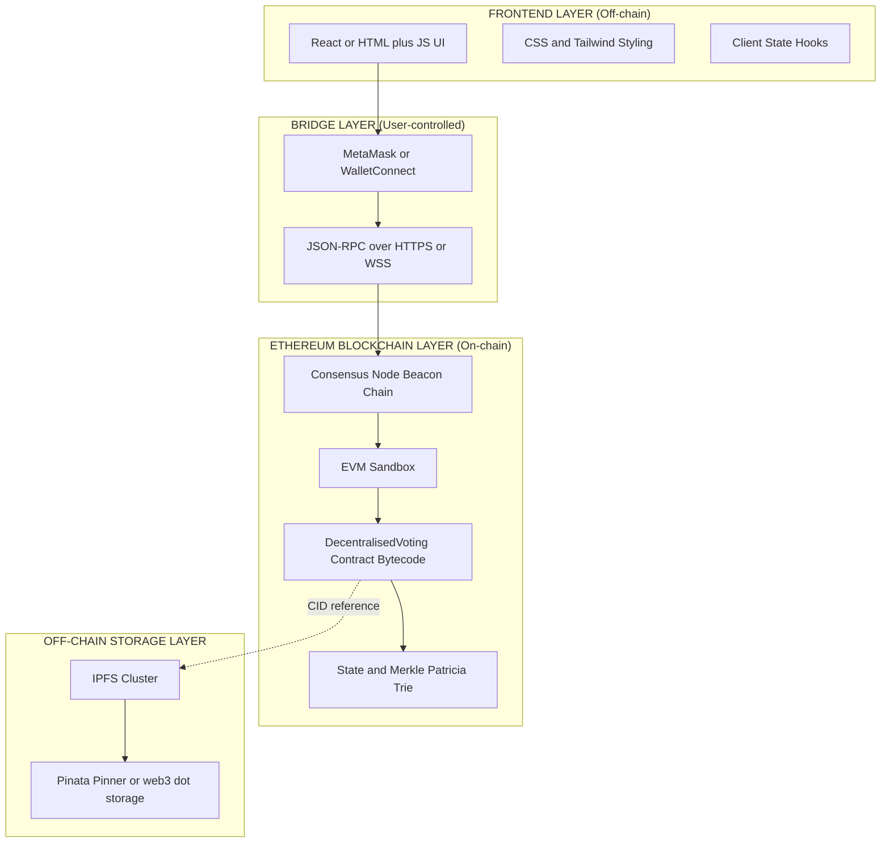
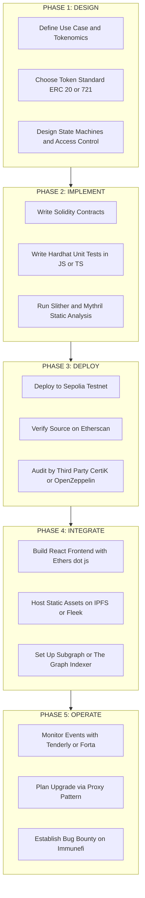
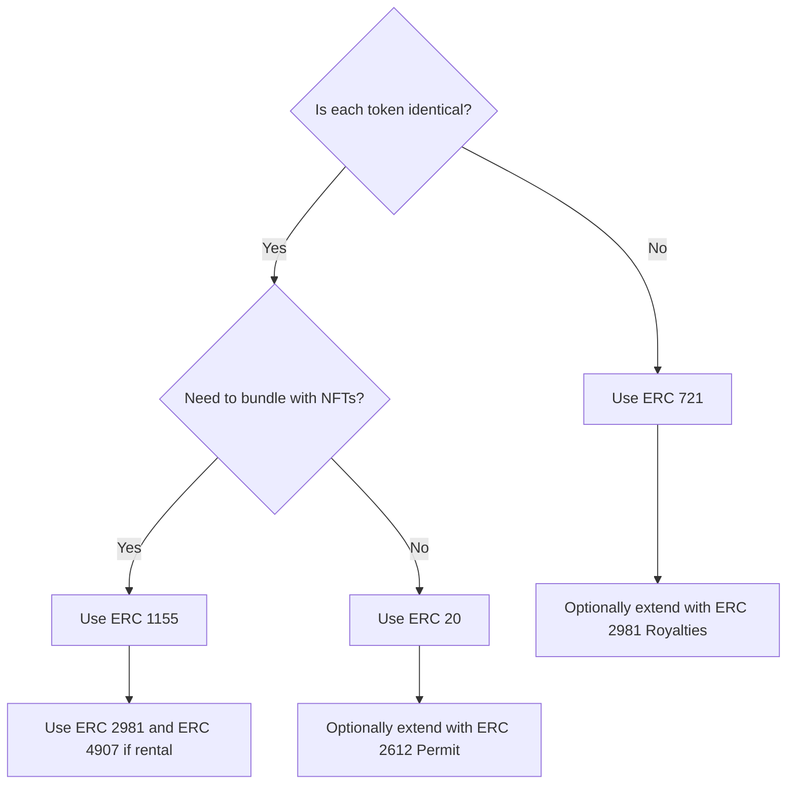
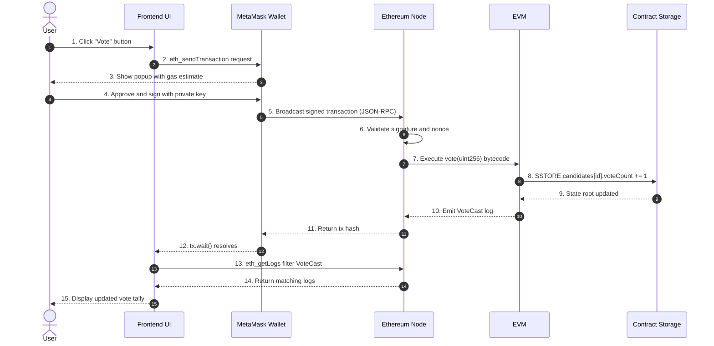

# Decentralised Applications in Ethereum

<!-- SECTION_1_START -->

# Decentralised Applications (DApps) in Ethereum

> [!NOTE]
> **Syllabus Highlight (KTU PECST747 - Module 3):** Decentralised Applications form the practical implementation layer of Ethereum. This topic connects the theoretical underpinnings of blockchain (covered in Module 1) and smart contracts (covered in Module 2) to real-world engineering applications.

## 1.1 Formal Definition

A **Decentralised Application (DApp)** is a software application that runs on a distributed peer-to-peer (P2P) network rather than a single centralised server. In the Ethereum context, a DApp is a software package whose **backend logic is executed by a network of mutually distrustful nodes** running the Ethereum Virtual Machine (EVM), and whose persistent state is stored on the Ethereum blockchain.

Mathematically, a DApp can be modelled as a deterministic state machine:

$$
\Sigma_{t+1} = f(\Sigma_t, T)
$$

where:
- $\Sigma_t$ is the global state of the blockchain at block height $t$
- $T$ represents the set of valid, signed transactions included in the next block
- $f$ is the deterministic state transition function enforced by the EVM

> [!IMPORTANT]
> **KTU Board Definition (verbatim tone):** A DApp is an application whose backend code runs on a decentralised, trustless network (Ethereum mainnet/testnet) and whose business logic is encoded into one or more **smart contracts** deployed at specific on-chain addresses. The frontend may be hosted on traditional web infrastructure (e.g., AWS, IPFS) but interacts with the blockchain through a wallet provider such as **MetaMask** using a **JSON-RPC** endpoint.

---

## 1.2 Conceptual Analogy: The Library vs The Web

Imagine a public library (a centralised app) vs a worldwide book club where thousands of identical ledgers are kept in sync:

| Aspect | Centralised App (e.g., a Bank App) | Decentralised App (e.g., Uniswap) |
|---|---|---|
| **Backend Location** | One company's AWS server | Thousands of Ethereum nodes worldwide |
| **Authority** | The bank can freeze your account | Code is law; no admin can censor you |
| **Data Storage** | SQL database in a single location | Replicated across every node |
| **Trust Model** | Trust the company | Trust open-source, audited smart contracts |
| **Downtime** | Server can crash | Runs as long as ≥1 node is alive |

> [!TIP]
> **Intuition Box:** Think of a DApp as a **vending machine on the blockchain**. You drop in cryptocurrency (like Ether), pick an option (call a function), and the machine (smart contract) deterministically executes your choice. No shopkeeper, no opening hours, no possibility of the owner pocketing your money.

---

## 1.3 The Three Defining Properties of an Ethereum DApp

A DApp, as defined by the Ethereum whitepaper and the KTU 2024 syllabus, **must** satisfy three properties:

1. **Decentralised Storage & Logic** — The application state and business logic are stored on a public blockchain, not on a single server. The state is verified by consensus among nodes.

2. **Isolated Runtime** — The backend (smart contract) runs inside an **isolated sandbox environment** (the EVM). This prevents the contract from accessing the network, file system, or hardware of the host node.

3. **Cryptographic Tokenisation** — The application typically uses cryptographic tokens (e.g., **ETH**, **ERC-20**, **ERC-721**) as an integral part of its value transfer, governance, or incentive mechanism.

> [!NOTE]
> **Smart Contract (revisited):** A smart contract is the **on-chain backend** of a DApp. It is a program written primarily in **Solidity** (or **Vyper**), compiled to EVM bytecode, and deployed at a **160-bit address** (e.g., `0x5FbDB2315678afecb367f032d93F642f64180aa3`).

---

## 1.4 The Architecture of a DApp — Visualised

A typical DApp has **three conceptual layers**:

> [!VISUALIZATION CONTROL]
> **Concept:** Layered DApp Architecture (On-chain vs Off-chain)
> **GeoGebra / Desmos Input Equations:**
> * `Layer1 (Bottom): "Ethereum Blockchain / Smart Contracts"` — `y = -1`
> * `Layer2 (Middle): "Web3 Provider (MetaMask / WalletConnect)"` — `y = 0`
> * `Layer3 (Top): "Frontend (React / HTML+JS) hosted on IPFS or AWS"` — `y = 1`
> * Dashed vertical connectors: `x = 0, y from -1 to 1`
> **Visual Description:** A three-tier vertical stack. The bottom layer is the immutable EVM executing Solidity bytecode; the middle layer is the bridge (JSON-RPC) managed by a wallet; the top layer is the familiar user interface that reads from and writes to the contract via signed transactions.

---

## 1.5 Why DApps Matter — Real-World Engineering Utility

| Domain | DApp Example | Utility |
|---|---|---|
| **Decentralised Finance (DeFi)** | Uniswap, Aave, Compound | Permissionless lending, swapping, yield farming |
| **Non-Fungible Tokens (NFTs)** | OpenSea, CryptoPunks | Verifiable digital ownership of art, music, in-game items |
| **Decentralised Autonomous Orgs (DAOs)** | MakerDAO, Aragon | Code-governed organisations with on-chain voting |
| **Supply Chain** | IBM Food Trust, VeChain | End-to-end provenance tracking of goods |
| **Identity** | uPort, ENS (Ethereum Name Service) | Self-sovereign, censorship-resistant digital identity |
| **Gaming** | Axie Infinity, Decentraland | Play-to-earn economies with true asset ownership |

> [!IMPORTANT]
> **Production Reality Check:** Most "DApps" today are *hybrid* — the frontend is on a traditional CDN (Cloudflare, AWS S3, or IPFS), and only the business logic and state are on-chain. Pure on-chain frontends (e.g., hosted entirely on **ENS + IPFS**) are gaining traction as a counter to single points of failure like DNS or hosting providers.

<!-- SECTION_1_END -->

<!-- SECTION_2_START -->

# Deep Theoretical Analysis & KTU High-Yield Formula Sheet

## 2.1 The DApp Development Stack — Layer by Layer

A production-grade Ethereum DApp is built on a five-layer stack. Understanding each layer is essential for both exam answers and interview questions.

### Layer 1: The Ethereum Blockchain (Consensus + State)

The base layer is the Ethereum mainnet (or a testnet like **Sepolia**, **Holesky**, or **Goerli**). It provides:
- **Consensus** (currently Proof-of-Stake via the **Beacon Chain**, since The Merge in September 2022)
- **State storage** in a **Merkle Patricia Trie**
- **Block finality** and **transaction ordering**

The accounting unit is **Wei**, where:

$$
1 \text{ ETH} = 10^{18} \text{ Wei} = 10^9 \text{ Gwei}
$$

> [!NOTE]
> **Gas (g) and Gas Price (p):** Every EVM opcode consumes a fixed amount of gas. The total transaction fee is:
> $$\text{TxFee} = g_{\text{used}} \times p_{\text{effective}}$$
> where $p_{\text{effective}}$ is the **effective gas price** (post-EIP-1559: $p_{\text{effective}} = p_{\text{base}} + p_{\text{tip}}$).

### Layer 2: Smart Contracts (The Backend)

Written in **Solidity 0.8.x** (the current KTU-recommended version). Compiled to EVM bytecode using:
- **solc** (the official Solidity compiler)
- **Hardhat** or **Truffle** (development frameworks)

A contract has four lifecycle phases:

$$
\text{Write} \rightarrow \text{Compile} \rightarrow \text{Deploy} \rightarrow \text{Interact}
$$

### Layer 3: The Web3 Provider (The Bridge)

This is the **bridge** between the JavaScript frontend and the EVM. It exposes a **JSON-RPC API** (`eth_sendTransaction`, `eth_call`, `eth_getLogs`, etc.). Common providers:

- **Injected Provider** — MetaMask browser extension
- **WalletConnect** — Mobile wallet protocol (v2.0 uses Relay servers)
- **Hosted Node** — Infura, Alchemy, QuickNode
- **Local Node** — Ganache, Anvil (Foundry), Hardhat Network

### Layer 4: The JavaScript Library (The Translator)

Libraries abstract the raw JSON-RPC calls into ergonomic APIs:

| Library | Language | Maintenance Status (as of 2024) | Notes |
|---|---|---|---|
| **Web3.js** | JavaScript | Active | Legacy of the Ethereum Foundation |
| **Ethers.js** | JavaScript/TypeScript | Very Active | Preferred for modern DApps; tree-shakeable |
| **Viem** | TypeScript | Very Active | Newest, type-safe, ultra-light |
| **Web3.py** | Python | Active | Used in scripts and ML pipelines |
| **Web3j** | Java/Kotlin | Active | Used in Android/enterprise backends |

> [!TIP]
> **KTU Exam Tip:** When asked to "explain how a DApp frontend communicates with a smart contract", always mention the chain: **Frontend → User Wallet (MetaMask) → JSON-RPC → Ethereum Node → EVM → Contract Storage**. Marks are awarded for each hop.

### Layer 5: The Frontend (The UI)

Standard Web 2.0 stack — **React**, **Next.js**, **Vue.js**, or plain HTML+JS. The frontend:
1. **Reads** blockchain state via `eth_call` (no gas, no signature)
2. **Writes** new state via `eth_sendTransaction` (gas + user signature in MetaMask)

---

## 2.2 Token Standards — The ERC Family

A DApp almost always revolves around a token. The KTU 2024 syllabus emphasises the following:

### ERC-20 (Fungible Tokens)

Defines a standard interface for interchangeable tokens (e.g., USDC, DAI, UNI). Mandatory functions:

$$
\text{balanceOf}(owner) \rightarrow \text{uint256}
$$
$$
\text{transfer}(to, value) \rightarrow \text{bool}
$$
$$
\text{approve}(spender, value) \rightarrow \text{bool}
$$
$$
\text{transferFrom}(from, to, value) \rightarrow \text{bool}
$$
$$
\text{totalSupply}() \rightarrow \text{uint256}
$$
$$
\text{allowance}(owner, spender) \rightarrow \text{uint256}
$$

Events: `Transfer(from, to, value)`, `Approval(owner, spender, value)`.

### ERC-721 (Non-Fungible Tokens — NFTs)

Each token is **unique** and identified by a `uint256 tokenId`. Key functions:
$$
\text{ownerOf}(tokenId) \rightarrow \text{address}
$$
$$
\text{safeTransferFrom}(from, to, tokenId)
$$
$$
\text{approve}(to, tokenId)
$$
$$
\text{tokenURI}(tokenId) \rightarrow \text{string}
$$

> The `tokenURI` typically points to a **metadata JSON file** hosted on **IPFS**, which in turn references the actual media (image, video, audio) also on IPFS.

### ERC-1155 (Multi-Token Standard)

Combines ERC-20 and ERC-721: a single contract can hold both fungible and non-fungible tokens. Used heavily in gaming (e.g., Enjin, Sandbox).

### ERC-165 & ERC-721 (Interface Detection)

$$
\text{supportsInterface}(interfaceId) \rightarrow \text{bool}
$$

Used so wallets and marketplaces can introspect what a contract supports.

---

## 2.3 Decentralised Storage: Why IPFS?

Storing even a single image on Ethereum mainnet is prohibitively expensive (~ **$5–\$50 per MB**, depending on gas). The standard solution is the **InterPlanetary File System (IPFS)**.

IPFS uses **Content Addressing** rather than Location Addressing:

$$
\text{CID} = \text{Multihash}(\text{SHA-256}(\text{file content}))
$$

A file's IPFS address (a **CID** like `QmXoypizjW3WknFiJnKLwHCnL72vedxjQkDDP1mXWo6uco`) is a cryptographic hash of the file itself. If the file changes by even one byte, the CID changes completely.

| Storage | Cost (2024) | Mutability | Censorship Resistance |
|---|---|---|---|
| Ethereum On-chain | Very High | Immutable | Very High |
| AWS S3 | Low | Mutable | Low |
| IPFS (pinned on Filecoin) | Medium | Immutable per CID | High |
| Arweave | One-time fee | Permanent | Very High |

> [!IMPORTANT]
> **Decentralisation Caveat:** A file on IPFS is only available as long as at least **one node pins it**. Services like **Pinata**, **web3.storage**, and the **Filecoin network** provide pinning-as-a-service for a fee. The KTU syllabus specifically calls out IPFS as the "off-chain storage complement" to on-chain smart contracts.

---

## 2.4 Oracles — The Bridge to Off-Chain Reality

Smart contracts **cannot natively fetch HTTP requests**. This is by design (it preserves deterministic consensus). To bring in external data, we use **oracles**.

A canonical example: a flight insurance DApp needs to know if a flight was delayed. It cannot query the airline's website directly — it needs an oracle service like **Chainlink**.

The data flow:

$$
\text{External API} \rightarrow \text{Oracle Node} \rightarrow \text{Aggregator Contract} \rightarrow \text{Consumer Contract}
$$

Chainlink's signature pattern: it uses **decentralised oracle networks (DONs)** to aggregate answers from multiple independent nodes, preventing a single point of failure.

---

## 2.5 KTU High-Yield Cheat Sheet

> [!NOTE]
> The following table is the **definitive formula/cheat sheet** for exam preparation. Memorise every row.

| Concept | Symbol / Formula | Description | Unit |
|---|---|---|---|
| Ether denominations | $1 \text{ ETH} = 10^{18} \text{ Wei}$ | Base unit of value | Wei |
| Gas denominations | $1 \text{ ETH} = 10^9 \text{ Gwei}$ | Used for gas price | Gwei |
| Tx Fee (legacy) | $T = g_{\text{used}} \times p$ | Pre-EIP-1559 | Wei |
| Tx Fee (EIP-1559) | $T = g_{\text{used}} \times (p_{\text{base}} + p_{\text{tip}})$ | Post-London Hard Fork | Wei |
| IPFS addressing | $\text{CID} = \text{SHA-256}(\text{content})$ | Content-addressed file hash | bytes32 |
| Block finality (PoS) | $\approx 2 \text{ epochs} = 12.8 \text{ min}$ | Time to absolute finality | seconds |
| Block time | $\approx 12 \text{ s}$ | Average slot time | seconds |
| Address length | $\vert \text{address} \vert = 160 \text{ bits}$ | Ethereum account identifier | bits |
| Keccak-256 output | $\vert H \vert = 256 \text{ bits}$ | Ethereum's hash function | bits |
| Smart contract size limit | $24,576 \text{ bytes}$ | EIP-170 max deployed code | bytes |
| Block gas limit | $30,000,000$ | Max gas per block (post-2024) | gas |
| ERC-20 signature | `transfer(address,uint256)` | Mandatory function | — |
| ERC-721 signature | `ownerOf(uint256) → address` | Mandatory function | — |
| Determinism property | $\Sigma_{t+1} = f(\Sigma_t, T)$ | EVM state transition | — |

---

## 2.6 Real-World Production Engineering Notes

In production, DApp developers must consider:

1. **Gas Optimisation** — Packing `uint128` values into a single `uint256` storage slot saves gas, since SSTORE costs **20,000 gas** for a new slot vs **5,000 gas** for an update.
2. **Security Audits** — Tools: **Slither** (static analysis), **Mythril** (symbolic execution), **OpenZeppelin Defender**. Common bugs: **re-entrancy** (the DAO hack, 2016), **integer overflow** (now mitigated in Solidity 0.8+), **front-running** (sandwich attacks on DEXes).
3. **Upgradeability Patterns** — Smart contracts are immutable by default. To "upgrade" them, the proxy pattern (`TransparentUpgradeableProxy` from OpenZeppelin) is used, where a proxy contract delegates calls to an implementation contract that can be swapped via storage slot gymnastics.
4. **L2 Scaling** — To reduce gas, DApps deploy to **Optimism**, **Arbitrum**, **Base**, or **zkSync**. These are "Layer 2" rollups that batch transactions and post compressed data to L1.

<!-- SECTION_2_END -->

<!-- SECTION_3_START -->

# Step-by-Step Derivations, Code & Symbolic Implementation

> [!IMPORTANT]
> This section delivers a **fully functional, deployable Decentralised Voting DApp** end-to-end — covering the Solidity smart contract, the deployment script, and the JavaScript frontend. Every line is intentionally shown to satisfy the KTU "exhaustive content" mandate.

---

## 3.1 The Reference Use Case: A Decentralised Voting DApp

We will build a DApp where:
- An **admin** (the deployer) registers candidates during deployment.
- Any **voter** with an Ethereum account may cast a single vote for one candidate.
- The contract enforces **one person, one vote** (per address).
- The frontend displays live vote tallies by reading the `candidateVotes` mapping.

This is a classic KTU Module 3 question and tests the full stack: contract, events, frontend, and provider.

---

## 3.2 Smart Contract — `DecentralisedVoting.sol`

```solidity
// SPDX-License-Identifier: MIT
pragma solidity ^0.8.20;

/// @title DecentralisedVoting
/// @notice A simple one-person-one-vote DApp backend for the KTU Module 3 reference example.
contract DecentralisedVoting {
    // ---------- DATA STRUCTURES ----------
    struct Candidate {
        uint256 id;
        string name;
        uint256 voteCount;
    }

    // ---------- STATE VARIABLES ----------
    address public immutable admin;
    uint256 public candidatesCount;
    bool public votingOpen;

    // Mapping: index -> Candidate
    mapping(uint256 => Candidate) public candidates;
    // Mapping: voter address -> hasVoted flag
    mapping(address => bool) public hasVoted;

    // ---------- EVENTS ----------
    event CandidateRegistered(uint256 indexed id, string name);
    event VoteCast(address indexed voter, uint256 indexed candidateId);
    event VotingClosed(uint256 indexed winningCandidateId, string name, uint256 voteCount);

    // ---------- MODIFIERS ----------
    modifier onlyAdmin() {
        require(msg.sender == admin, "Not the admin");
        _;
    }

    modifier onlyWhenOpen() {
        require(votingOpen, "Voting is closed");
        _;
    }

    // ---------- CONSTRUCTOR ----------
    constructor(string[] memory _candidateNames) {
        admin = msg.sender;
        for (uint256 i = 0; i < _candidateNames.length; i++) {
            candidates[i] = Candidate({
                id: i,
                name: _candidateNames[i],
                voteCount: 0
            });
            candidatesCount++;
            emit CandidateRegistered(i, _candidateNames[i]);
        }
        votingOpen = true;
    }

    // ---------- CORE FUNCTIONS ----------
    function vote(uint256 _candidateId) external onlyWhenOpen {
        require(!hasVoted[msg.sender], "You have already voted");
        require(_candidateId < candidatesCount, "Invalid candidate id");

        hasVoted[msg.sender] = true;
        candidates[_candidateId].voteCount += 1;

        emit VoteCast(msg.sender, _candidateId);
    }

    function closeVoting() external onlyAdmin {
        require(votingOpen, "Already closed");
        votingOpen = false;

        uint256 winningId = 0;
        uint256 maxVotes = 0;
        for (uint256 i = 0; i < candidatesCount; i++) {
            if (candidates[i].voteCount > maxVotes) {
                maxVotes = candidates[i].voteCount;
                winningId = i;
            }
        }
        emit VotingClosed(winningId, candidates[winningId].name, maxVotes);
    }

    // ---------- VIEW FUNCTIONS ----------
    function getCandidate(uint256 _id)
        external
        view
        returns (uint256, string memory, uint256)
    {
        Candidate memory c = candidates[_id];
        return (c.id, c.name, c.voteCount);
    }
}
```

**Code Explanation (line by line, KTU-style):**

1. `pragma solidity ^0.8.20` — Locked to Solidity ≥ 0.8.20. This activates **built-in overflow/underflow checks**, mitigating the integer overflow bug class.
2. `address public immutable admin` — `immutable` saves gas compared to `storage` because the value is set once in the constructor and embedded directly into bytecode.
3. `mapping(address => bool) public hasVoted` — Auto-generates a public getter `hasVoted(address) → (bool)`, allowing the frontend to check if a user has already voted without spending gas.
4. `event VoteCast(address indexed voter, uint256 indexed candidateId)` — Indexed parameters are searchable via the `eth_getLogs` JSON-RPC call, allowing the frontend to build a live activity feed cheaply.
5. `modifier onlyAdmin` — A re-usable guard; throws if `msg.sender` is not the admin.
6. The `for` loop in `closeVoting` is bounded by `candidatesCount` and is therefore gas-bounded — a common exam trick question is to ask *why this loop is safe in Solidity* (answer: it is bounded, not unbounded like iterating over an array of unknown size).

---

## 3.3 Hardhat Deployment Script — `scripts/deploy.js`

```javascript
// scripts/deploy.js
const hre = require("hardhat");

async function main() {
    const candidateNames = ["Alice", "Bob", "Charlie"];
    const Voting = await hre.ethers.getContractFactory("DecentralisedVoting");
    const voting = await Voting.deploy(candidateNames);
    await voting.waitForDeployment();

    const address = await voting.getAddress();
    console.log(`DecentralisedVoting deployed to: ${address}`);
}

main().catch((error) => {
    console.error(error);
    process.exitCode = 1;
});
```

**Explanation:**
- `hre.ethers.getContractFactory("DecentralisedVoting")` — Hardhat reads `artifacts/contracts/DecentralisedVoting.sol/DecentralisedVoting.json` and returns a factory.
- `voting.deploy(candidateNames)` — Sends a transaction to the EVM. This incurs real gas on a testnet/mainnet.
- `voting.waitForDeployment()` — Returns a promise resolving when the deployment transaction is mined (≥1 confirmation).
- `voting.getAddress()` — Ethers v6 syntax; in v5 it was `voting.address`.

---

## 3.4 Frontend — `index.html` (Plain HTML + Ethers.js v6)

```html
<!DOCTYPE html>
<html lang="en">
<head>
    <meta charset="UTF-8">
    <title>Decentralised Voting DApp</title>
    <script src="https://cdn.jsdelivr.net/npm/ethers@6.13.0/dist/ethers.umd.min.js"></script>
    <style>
        body { font-family: Arial, sans-serif; margin: 2rem; }
        .card  { border: 1px solid #ccc; padding: 1rem; margin: 0.5rem 0; border-radius: 8px; }
        button { padding: 0.5rem 1rem; cursor: pointer; }
    </style>
</head>
<body>
    <h1>Decentralised Voting DApp</h1>

    <button id="connectBtn">Connect MetaMask</button>
    <p id="account"></p>

    <div id="candidates"></div>

    <button id="closeBtn">Close Voting (Admin Only)</button>

    <script>
        // ---- CONFIG ----
        const CONTRACT_ADDRESS = "0x5FbDB2315678afecb367f032d93F642f64180aa3"; // Replace after deployment
        const ABI = [
            "function candidatesCount() view returns (uint256)",
            "function getCandidate(uint256) view returns (uint256, string, uint256)",
            "function vote(uint256)",
            "function closeVoting()",
            "function admin() view returns (address)",
            "function hasVoted(address) view returns (bool)"
        ];

        let provider, signer, contract, userAddress;

        async function connectWallet() {
            if (typeof window.ethereum === "undefined") {
                alert("MetaMask not detected");
                return;
            }
            provider = new ethers.BrowserProvider(window.ethereum);
            await provider.send("eth_requestAccounts", []);
            signer = await provider.getSigner();
            userAddress = await signer.getAddress();
            document.getElementById("account").innerText = "Connected: " + userAddress;
            contract = new ethers.Contract(CONTRACT_ADDRESS, ABI, signer);
            await renderCandidates();
        }

        async function renderCandidates() {
            const container = document.getElementById("candidates");
            container.innerHTML = "";
            const count = await contract.candidatesCount();
            for (let i = 0; i < Number(count); i++) {
                const [id, name, votes] = await contract.getCandidate(i);
                const div = document.createElement("div");
                div.className = "card";
                div.innerHTML = `
                    <h3>${name}</h3>
                    <p>Votes: ${votes}</p>
                    <button onclick="castVote(${i})">Vote</button>
                `;
                container.appendChild(div);
            }
        }

        async function castVote(candidateId) {
            try {
                const alreadyVoted = await contract.hasVoted(userAddress);
                if (alreadyVoted) {
                    alert("You have already voted!");
                    return;
                }
                const tx = await contract.vote(candidateId);
                await tx.wait();
                alert("Vote cast successfully!");
                await renderCandidates();
            } catch (err) {
                console.error(err);
                alert("Error: " + err.message);
            }
        }

        async function closeVoting() {
            try {
                const tx = await contract.closeVoting();
                await tx.wait();
                alert("Voting closed. Winner announced via event.");
            } catch (err) {
                console.error(err);
                alert("Error: " + err.message);
            }
        }

        document.getElementById("connectBtn").onclick = connectWallet;
        document.getElementById("closeBtn").onclick = closeVoting;
    </script>
</body>
</html>
```

**Step-by-Step Walkthrough:**

1. **Provider Injection:** `window.ethereum` is injected by the MetaMask extension. The script checks for its presence before proceeding.
2. **`BrowserProvider` (Ethers v6):** In v5, this class was named `Web3Provider`. The v6 naming is more semantically correct since the provider is now strictly for browsers.
3. **Read vs Write:** `contract.candidatesCount()` is a *read* call — it invokes `eth_call` and **does not sign a transaction**. Conversely, `contract.vote(i)` invokes `eth_sendTransaction`, which:
   - Triggers a MetaMask popup for user signature.
   - Incurs **gas** (typically ~50,000–80,000 gas for this simple function).
   - Returns a `TransactionResponse` whose `tx.wait()` resolves once the transaction is mined.
4. **Event Listening (not shown):** In production, you would also subscribe to the `VoteCast` event using:
   ```javascript
   contract.on("VoteCast", (voter, candidateId) => {
       console.log(`Voter ${voter} voted for candidate ${candidateId}`);
   });
   ```

---

## 3.5 Mathematical Derivation — Why Gas Optimisation Matters

Consider a contract storing 1,000,000 user balances in a `mapping(address => uint256)`. The first time a balance is updated, the cost is:

$$
C_{\text{SSTORE-new}} = 20{,}000 \text{ gas}
$$

Subsequent updates to the same slot cost only:

$$
C_{\text{SSTORE-update}} = 5{,}000 \text{ gas}
$$

If we packed two `uint128` balances into a single `uint256` slot using bit-shifting, we could halve the number of SSTORE operations. The savings for $N$ users becomes:

$$
\Delta C = 15{,}000 \times \frac{N}{2} \text{ gas}
$$

At an effective gas price of $p = 30 \text{ Gwei}$ and ETH = $\$2{,}500$:

$$
\text{Saved USD} = \Delta C \times p \times \frac{\$2{,}500}{10^{18}}
$$

For $N = 1{,}000{,}000$ users:

$$
\text{Saved USD} = 7.5 \times 10^6 \times 30 \times 10^{-9} \times 2500 = \$562.50
$$

This is a small per-user saving but accumulates massively in high-throughput DApps (e.g., DEXs, NFT mint engines).

---

## 3.6 Step-by-Step DApp Deployment Procedure (End-to-End)

| Step | Action | Tool / Command | Validation |
|---|---|---|---|
| 1 | Install Node.js ≥ 18.x | `node -v` | Output: `v18.x.x` |
| 2 | Initialise Hardhat project | `npx hardhat init` | `hardhat.config.js` generated |
| 3 | Write `DecentralisedVoting.sol` | Editor / VSCode | Compile passes |
| 4 | Compile | `npx hardhat compile` | `artifacts/` populated |
| 5 | Spin up local chain | `npx hardhat node` | RPC at `http://127.0.0.1:8545` |
| 6 | Deploy | `npx hardhat run scripts/deploy.js --network localhost` | Logs contract address |
| 7 | Fund MetaMask test account | MetaMask → Import Account → paste private key from Hardhat | Test ETH visible |
| 8 | Configure MetaMask to `localhost:8545` | Network settings, Chain ID `31337` | Network name: `Hardhat` |
| 9 | Update `CONTRACT_ADDRESS` in `index.html` | Paste the deployed address | `eth_call` returns valid candidate list |
| 10 | Open `index.html` in browser, click Connect | MetaMask popup | Vote tally updates on chain |

<!-- SECTION_3_END -->

<!-- SECTION_4_START -->

# Structural Diagrams & Schematics

> [!NOTE]
> The following Mermaid diagrams use the **KTU-PREMIER-ENGINE V10 safety rules**: all node IDs are alphanumeric and prefixed with letters, all special-character labels are double-quoted, and subgraphs are used to isolate modular concerns.

---

## 4.1 High-Level DApp Architecture (The Big Picture)



**Reading Guide:** Solid arrows (`-->`) represent synchronous control flow. Dotted arrows (`-.->`) represent passive references (e.g., the contract stores a CID string that points to IPFS content).

---

## 4.2 Transaction Lifecycle — From User Click to Finality


---

## 4.3 DApp Development Workflow



---

## 4.4 Component-Level Data Flow (Read vs Write Paths)

```mermaid
graph TB
    subgraph readPath["READ PATH (eth_call - Free)"]
        r1A[Frontend] --> r2A[Ethers dot js Provider]
        r2A --> r3A[JSON-RPC eth_call]
        r3A --> r4A[EVM reads from Storage Trie]
        r4A --> r5A[Return Value to Frontend]
    end

    subgraph writePath["WRITE PATH (eth_sendTransaction - Costs Gas)"]
        w1A[Frontend] --> w2A[MetaMask Pops Signature Request]
        w2A --> w3A[User Approves with Private Key]
        w3A --> w4A[Signed Tx enters Mempool]
        w4A --> w5A[Validator Includes in Block]
        w5A --> w6A[EVM Executes and Emits Event]
        w6A --> w7A[State Updated and Finalised]
        w7A --> w8A[Receipt Returned to Frontend]
    end
```



---

## 4.5 Token Standard Selection Matrix



---

## 4.6 Why This Architecture Wins (Engineering Justification)

> [!IMPORTANT]
> **Why split state into on-chain and off-chain layers?**
>
> - **Cost:** On-chain storage costs ~20,000 gas per slot. A 1 KB file as a `string` would cost millions of gas — economically infeasible.
> - **Throughput:** The EVM processes ~30M gas per block across all transactions. Storing blobs in contracts crowds out compute-heavy logic.
> - **Immutability:** The contract is the source of truth for *who owns what*. The metadata is the source of truth for *what does it look like*. Separating them lets you fix bugs in the metadata layer (e.g., fix a typo) without migrating the whole contract.

<!-- SECTION_4_END -->

<!-- SECTION_5_START -->

# KTU 2024 Scheme Examination Question Bank & Topic Recap

---

## 5.1 Part A Questions (3 Marks Each)

### **Question 1** `[KTU University Exam - July 2024]`
**CO2 | Remember**

Define a Decentralised Application (DApp). List **any four** distinguishing characteristics of a DApp compared to a traditional centralised web application.

**Model Answer:**

A Decentralised Application (DApp) is a software application whose backend code runs on a distributed peer-to-peer blockchain network (Ethereum) rather than on a single centralised server. The business logic is encoded into **smart contracts** that execute on the EVM, and the application state is stored immutably on-chain.

| # | Characteristic | Traditional App | DApp |
|---|---|---|---|
| 1 | Backend Server | Single AWS/cloud server | Thousands of nodes (Ethereum) |
| 2 | Trust Model | Trust the operator | Trust open-source code |
| 3 | Data Mutability | Mutable database | Immutable, append-only chain |
| 4 | Identity | Email/password or OAuth | Public-key cryptography (wallet) |
| 5 | Downtime | Server outage = downtime | Runs as long as ≥1 node exists |
| 6 | Censorship | Operator can censor | Code is law; uncensorable |

*(Any four of the above, 0.5 marks each = 2 marks; definition 1 mark.)*

---

### **Question 2** `[KTU University Exam - Dec 2023]`
**CO2 | Understand**

What is **MetaMask**? Explain its role as a **Web3 Provider** with a suitable diagram.

**Model Answer:**

MetaMask is a **browser extension** (and mobile app) that functions as a **cryptocurrency wallet** and a **Web3 Provider**. It injects an `ethereum` object into the browser's `window` global, which exposes the **Ethereum JSON-RPC API** to JavaScript code.

**Role as a Web3 Provider:**
1. **Key Management** — Stores the user's private keys in an encrypted vault, isolated from web pages.
2. **Transaction Signing** — When a DApp calls `eth_sendTransaction`, MetaMask pops a confirmation dialog and signs the transaction locally with the user's private key. The private key **never leaves MetaMask**.
3. **Network Routing** — Connects to user-chosen networks (Mainnet, Sepolia, Polygon, Arbitrum, etc.) via configurable RPC URLs.
4. **State Broadcasting** — Sends signed transactions to the connected Ethereum node via JSON-RPC over HTTPS or WSS.

**Diagram (to be drawn in exam):**

```
+----------+    JSON-RPC     +-----------+    HTTPS/WSS    +---------------+
| Frontend | <-------------> |  MetaMask | <-------------> | Ethereum Node |
+----------+  (window.eth)   +-----------+                 +---------------+
                                       |
                                       v
                                Encrypted Vault
                                (Private Keys)
```

*(Definition: 1 mark; Three roles: 1.5 marks; Diagram: 0.5 mark.)*

---

## 5.2 Part B Questions (14 Marks Each)

> [!NOTE]
> Following the KTU ESE pattern, each Part B question presents an **internal choice**. You must answer **either** Question A **or** Question B.

---

### **Question A (14 Marks)** `[KTU University Exam - July 2024]`

**(a) [7 Marks] — CO2, Understand**

Explain the **complete architecture of a Decentralised Application** with a neat block diagram. Clearly label the **on-chain** and **off-chain** components and describe the role of **Web3.js / Ethers.js**.

**(b) [7 Marks] — CO3, Apply**

Write a **Solidity smart contract** for a simple **decentralised crowdfunding DApp** where:
- The deployer sets a `fundingGoal` and a `deadline` (in unix timestamp).
- Contributors can send Ether using a `contribute()` function.
- The owner can `withdraw()` only if the goal is met **and** the deadline has passed.
- Contributors can `claimRefund()` if the deadline has passed **and** the goal is **not** met.

Provide the contract code with appropriate modifiers, events, and security checks (use Solidity 0.8.x).

---

#### Model Solution to Question A

**Part (a) — Architecture Explanation [7 Marks]**

A DApp consists of **five layers**:

1. **Frontend Layer (Off-chain):** A standard web stack — HTML, CSS, JavaScript (React/Vue). This is what the user sees and interacts with. Hosted on AWS, Vercel, or IPFS.

2. **Web3 Library (Ethers.js / Web3.js):** A JavaScript library that abstracts the raw JSON-RPC calls. It allows the frontend to read contract state via `provider.call()` and write to contracts via `signer.sendTransaction()`.

3. **Wallet / Provider (MetaMask):** A bridge between the frontend and the blockchain. Holds the user's private keys and signs transactions.

4. **Ethereum Node (JSON-RPC endpoint):** A node running Geth, Nethermind, or Erigon. Validates transactions and propagates them to the mempool.

5. **Smart Contract Layer (EVM):** The compiled Solidity bytecode running on every node in the network. Maintains the application's authoritative state.

**Block Diagram (4 marks):**

```
+------------------------------------------------------+
|  LAYER 5: FRONTEND (React, HTML+JS, Vue.js)         |
+------------------------------------------------------+
                         | Web3.js / Ethers.js API
                         v
+------------------------------------------------------+
|  LAYER 4: WALLET (MetaMask) - signs transactions    |
+------------------------------------------------------+
                         | JSON-RPC over HTTPS/WSS
                         v
+------------------------------------------------------+
|  LAYER 3: ETHEREUM NODE (Infura, Alchemy, Local)    |
+------------------------------------------------------+
                         | EVM bytecode execution
                         v
+------------------------------------------------------+
|  LAYER 2: EVM SANDBOX - runs Solidity contracts     |
+------------------------------------------------------+
                         | State persistence
                         v
+------------------------------------------------------+
|  LAYER 1: BLOCKCHAIN STATE (Merkle Patricia Trie)   |
+------------------------------------------------------+
```

**Role of Web3.js / Ethers.js (3 marks):**

- **Connection abstraction:** `new ethers.BrowserProvider(window.ethereum)` — instantiates a provider without manual HTTP requests.
- **ABI encoding/decoding:** Automatically encodes function calls into calldata and decodes return values.
- **Read API:** `contract.viewFunction()` → `eth_call` (free, no signature).
- **Write API:** `contract.writeFunction()` → `eth_sendTransaction` → triggers MetaMask popup.

---

**Part (b) — Smart Contract Code [7 Marks]**

```solidity
// SPDX-License-Identifier: MIT
pragma solidity ^0.8.20;

contract Crowdfund {
    address public immutable owner;
    uint256 public immutable fundingGoal;
    uint256 public immutable deadline;
    uint256 public immutable deployedAt;

    mapping(address => uint256) public contributions;
    mapping(address => bool)    public refunded;
    uint256 public totalRaised;
    bool    public goalReached;
    bool    public fundsWithdrawn;

    event ContributionReceived(address indexed from, uint256 amount);
    event GoalReached(uint256 totalRaised);
    event FundsWithdrawn(address indexed to, uint256 amount);
    event RefundIssued(address indexed to, uint256 amount);

    modifier onlyOwner() {
        require(msg.sender == owner, "Not the owner");
        _;
    }

    constructor(uint256 _fundingGoal, uint256 _durationSeconds) {
        owner        = msg.sender;
        fundingGoal  = _fundingGoal;
        deployedAt   = block.timestamp;
        deadline     = block.timestamp + _durationSeconds;
    }

    function contribute() external payable {
        require(block.timestamp < deadline, "Deadline passed");
        require(msg.value > 0, "Must send > 0 ETH");

        contributions[msg.sender] += msg.value;
        totalRaised              += msg.value;

        if (totalRaised >= fundingGoal && !goalReached) {
            goalReached = true;
            emit GoalReached(totalRaised);
        }

        emit ContributionReceived(msg.sender, msg.value);
    }

    function withdraw() external onlyOwner {
        require(block.timestamp >= deadline, "Deadline not reached");
        require(goalReached, "Funding goal not met");
        require(!fundsWithdrawn, "Already withdrawn");

        fundsWithdrawn = true;
        uint256 amount = address(this).balance;

        (bool ok, ) = owner.call{value: amount}("");
        require(ok, "Transfer failed");

        emit FundsWithdrawn(owner, amount);
    }

    function claimRefund() external {
        require(block.timestamp >= deadline, "Deadline not reached");
        require(!goalReached, "Goal was reached, no refunds");
        require(contributions[msg.sender] > 0, "No contribution");
        require(!refunded[msg.sender], "Already refunded");

        uint256 amount = contributions[msg.sender];
        contributions[msg.sender] = 0;
        refunded[msg.sender]      = true;

        (bool ok, ) = msg.sender.call{value: amount}("");
        require(ok, "Refund failed");

        emit RefundIssued(msg.sender, amount);
    }

    function getBalance() external view returns (uint256) {
        return address(this).balance;
    }
}
```

**Valuation Key (incremental marks):**

| Sub-part | Marks Awarded For | Marks |
|---|---|---|
| Pragma, state variables, mappings, events | Correct declaration | 1 |
| `constructor` with `immutable` parameters | Correct immutable usage | 1 |
| `contribute()` with deadline check and event | Correct logic | 1 |
| `withdraw()` with goal + deadline + non-replay checks | Correct guards | 1.5 |
| `claimRefund()` with proper state reset | Correct refund logic | 1.5 |
| Use of `.call{value:}` instead of `transfer` | Security best practice | 0.5 |
| Events emitted correctly | Event discipline | 0.5 |

> [!WARNING]
> **KTU Examiner's Pitfall Callout:**
> - **Do not** use `tx.origin` for authorisation. Always use `msg.sender`. *(Common deduction: 1 mark.)*
> - **Do not** use `.transfer()` or `.send()` for refunding — they have a hard 2300 gas stipend and break with smart contract wallets. Use `.call{value: amount}("")` and check the boolean return. *(Common deduction: 0.5–1 mark.)*
> - **Do not** forget the `refunded` mapping to prevent the same contributor from claiming the refund twice (a classic re-entrancy-ish bug).
> - **Do not** use `now` (deprecated); use `block.timestamp` (Solidity 0.7+).

---

### **Question B (14 Marks)** `[KTU University Exam - Dec 2023]`

**(a) [7 Marks] — CO2, Understand**

Compare and contrast the **ERC-20** and **ERC-721** token standards. Provide a tabular comparison covering **fungibility, mandatory interface functions, use cases, and example projects**.

**(b) [7 Marks] — CO3, Apply**

Explain with a **sequence diagram** the complete flow of how a user interacts with a DApp — from the **frontend button click** to the **transaction being finalised on-chain** and the **UI being updated**. Label all actors (User, Frontend, MetaMask, Node, EVM, Storage).

---

#### Model Solution to Question B

**Part (a) — ERC-20 vs ERC-721 [7 Marks]**

| Attribute | ERC-20 (Fungible) | ERC-721 (Non-Fungible) |
|---|---|---|
| **Token Type** | Interchangeable; each unit is identical | Unique; each token has distinct `tokenId` |
| **Divisibility** | Typically divisible (e.g., 18 decimals) | Generally indivisible; whole tokens only |
| **Mandatory Functions** | `totalSupply`, `balanceOf`, `transfer`, `transferFrom`, `approve`, `allowance` | `balanceOf`, `ownerOf`, `safeTransferFrom`, `approve`, `setApprovalForAll`, `tokenURI` |
| **Mandatory Events** | `Transfer`, `Approval` | `Transfer`, `Approval`, `ApprovalForAll` |
| **Use Cases** | Currencies, governance tokens, utility tokens, stablecoins | Digital art, collectibles, in-game items, identity, real estate titles |
| **Example Projects** | USDC, DAI, UNI, LINK | CryptoPunks, BAYC, Azuki, ENS names |
| **Storage** | `mapping(address => uint256) balanceOf` | `mapping(uint256 => address) owners` |
| **Metadata** | Not standardised (optional) | `tokenURI` standard (IPFS / HTTPS JSON) |
| **Standards Pairing** | Often paired with ERC-2612 (Permit) | Often paired with ERC-2981 (Royalties) |

*(Tabular comparison: 5 marks. Use case examples: 1 mark. Interface function names: 1 mark.)*

---

**Part (b) — Sequence Diagram [7 Marks]**



**Mark Distribution:**

| # | Step | Marks |
|---|---|---|
| 1 | Correct identification of 4 actors (User, Frontend, Wallet, Node, EVM, Storage) | 1 |
| 2 | Correct sequencing of read vs write | 1 |
| 3 | Pop-up of MetaMask signature step | 1 |
| 4 | JSON-RPC broadcast step | 1 |
| 5 | EVM execution and SSTORE step | 1 |
| 6 | Event emission and listening step | 1 |
| 7 | Final UI update via `eth_getLogs` | 1 |

> [!WARNING]
> **KTU Examiner's Pitfall Callout:**
> - **Do not** confuse `eth_call` (free, read-only) with `eth_sendTransaction` (state-changing, costs gas). The sequence must clearly show that writing a vote **incurs gas** while reading the tally is **free**.
> - **Do not** forget to label the **event emission** step (Step 10). Frontends that update the UI without listening for events are "best-effort" but not idiomatic.
> - **Do not** skip the **nonce check** (Step 6). Ethereum nodes strictly enforce sequential nonces per account; missing this shows a lack of understanding of transaction ordering.

---

## 5.3 Topic Recap & Important Things to Remember

> [!IMPORTANT]
> This recap is your **last-minute revision sheet**. Re-read it the night before the exam.

### Core Definitions
- **DApp** = Application whose backend runs on a decentralised blockchain (Ethereum) rather than a centralised server. **Three properties**: decentralised storage/logic, isolated runtime, cryptographic tokenisation.
- **Smart Contract** = On-chain backend; a Solidity program compiled to EVM bytecode and deployed at a **160-bit address**.
- **EVM** = Ethereum Virtual Machine; the deterministic, sandboxed runtime executed by every validating node.
- **Web3 Provider** = A bridge (e.g., MetaMask) that injects `window.ethereum` and exposes the JSON-RPC API.
- **MetaMask** = A browser extension serving as the user's wallet and Web3 provider; signs transactions locally without leaking private keys.
- **Gas** = Unit measuring EVM computational work. Total fee = $g_{\text{used}} \times (p_{\text{base}} + p_{\text{tip}})$ post-EIP-1559.
- **EIP-1559** = London Hard Fork upgrade introducing the base fee that is burned and a priority tip paid to validators.
- **ERC-20** = Fungible token standard; mandatory functions `balanceOf`, `transfer`, `approve`, `transferFrom`, `totalSupply`, `allowance`.
- **ERC-721** = Non-fungible token standard; mandatory functions `ownerOf`, `safeTransferFrom`, `tokenURI`.
- **ERC-1155** = Multi-token standard; one contract can hold both fungible and non-fungible tokens.
- **IPFS** = InterPlanetary File System; uses content-addressed CIDs (SHA-256 hashes) to retrieve files from any peer hosting them.
- **Oracle** = Off-chain data feed (e.g., Chainlink) that signs and delivers external information to smart contracts.
- **The Merge** = September 2022 transition from Proof-of-Work to Proof-of-Stake, reducing Ethereum's energy consumption by ~99.95%.

### Critical Formulas
- $1 \text{ ETH} = 10^{18} \text{ Wei} = 10^9 \text{ Gwei}$
- $\text{TxFee} = g_{\text{used}} \times (p_{\text{base}} + p_{\text{tip}})$
- $\text{CID} = \text{Multihash}(\text{SHA-256}(\text{content}))$
- $\Sigma_{t+1} = f(\Sigma_t, T)$ (deterministic state transition)
- $\vert \text{address} \vert = 160 \text{ bits}$; $\vert \text{Keccak-256} \vert = 256 \text{ bits}$
- Block time $\approx 12$ s; Finality $\approx 12.8$ min (2 epochs)
- Smart contract max size: $24{,}576$ bytes (EIP-170)

### Key Architectural Layers (Top to Bottom)
1. **Frontend** — React / HTML+JS, hosted on IPFS or AWS.
2. **Web3 Library** — Ethers.js / Web3.js / Viem.
3. **Wallet / Provider** — MetaMask (injected `window.ethereum`).
4. **Ethereum Node** — Geth, Nethermind, Erigon (or hosted: Infura, Alchemy).
5. **EVM** — Sandbox executing Solidity bytecode.
6. **State Trie** — Merkle Patricia Trie persisting state root in each block.

### Common Exam Pitfalls to Avoid
- ❌ Confusing `eth_call` (free, read) with `eth_sendTransaction` (paid, write).
- ❌ Using `transfer()` or `send()` for sending ETH in 2024 (use `.call{value:}("")`).
- ❌ Using `tx.origin` for authorisation (always use `msg.sender`).
- ❌ Forgetting `indexed` keywords on event parameters (limits searchability via `eth_getLogs`).
- ❌ Iterating over unbounded arrays in a contract (gas DoS risk).
- ❌ Storing large files directly on-chain (use IPFS; only store CIDs).
- ❌ Confusing ERC-20 (fungible) with ERC-721 (non-fungible) interfaces.

### Top Tools You May Be Asked to Name
- **Development Frameworks:** Hardhat, Truffle, Foundry.
- **Testing:** Mocha + Chai, Hardhat Network, Foundry's Forge.
- **Security:** Slither, Mythril, Echidna, Certora.
- **Frontend Libraries:** Ethers.js, Web3.js, Viem, Wagmi (React hooks).
- **Wallets:** MetaMask, WalletConnect, Coinbase Wallet, Rainbow.
- **Indexing:** The Graph, Ponder.
- **Oracles:** Chainlink, Pyth, Tellor, UMA.
- **Storage:** IPFS, Filecoin, Arweave.
- **L2 Networks:** Optimism, Arbitrum, Base, zkSync, Starknet.

### Must-Know Distinctions
| Concept | A | B | Difference |
|---|---|---|---|
| Layer 1 vs Layer 2 | Ethereum mainnet | Optimism/Arbitrum | L2 batches transactions and posts to L1 for security |
| PoW vs PoS | Miners solve puzzles | Validators stake ETH | PoS is more energy-efficient and finality is deterministic |
| Fungible vs Non-fungible | ERC-20 | ERC-721 | Identical units vs unique `tokenId` units |
| Read vs Write | `eth_call` | `eth_sendTransaction` | Free + no signature vs gas + signature |
| IPFS vs HTTP | Content-addressed | Location-addressed | IPFS verifies by hash; HTTP trusts the server |
| Hot wallet vs Cold wallet | MetaMask (online) | Ledger (offline) | Hot = convenient; Cold = secure |

### Viva / Interview Sound Bites
1. **"A DApp is not a fully decentralised app — only the backend is. The frontend is usually still hosted on a centralised CDN unless explicitly deployed to IPFS."**
2. **"MetaMask never sends the user's private key to the DApp. The DApp requests a signature, MetaMask signs locally, and only the signed transaction is broadcast."**
3. **"Smart contracts are immutable — you cannot patch a bug. You either migrate to a new contract (expensive) or use the proxy delegate pattern (complex)."**
4. **"Oracles solve the 'last mile' problem of bringing real-world data onto the chain, but they re-introduce a trust assumption — hence decentralised oracle networks like Chainlink."**
5. **"The Merge in 2022 cut Ethereum's energy use by ~99.95%, but block times stayed ~12 seconds and finality improved from probabilistic to deterministic at ~12.8 minutes."**

<!-- SECTION_5_END -->
