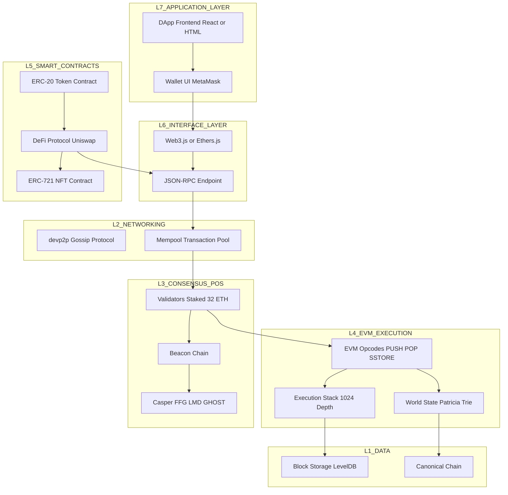
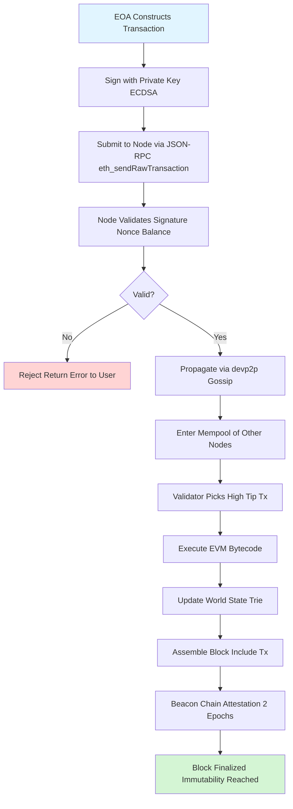
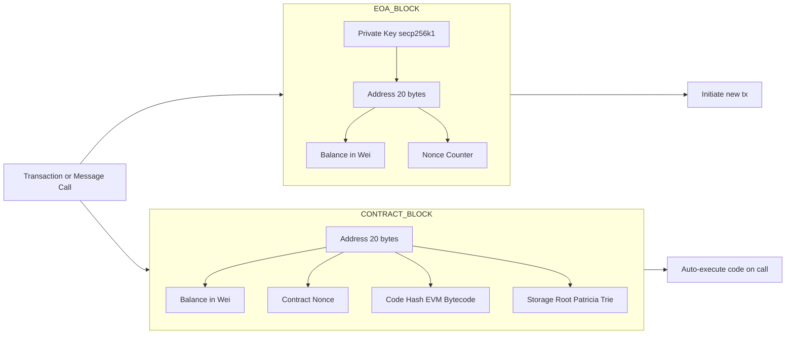
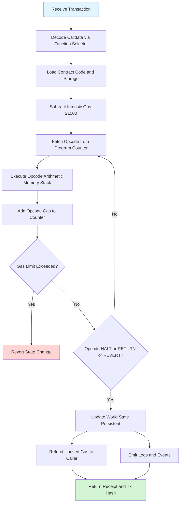
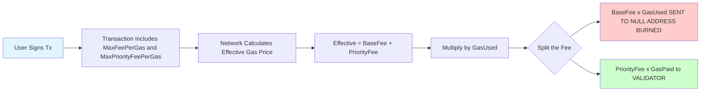
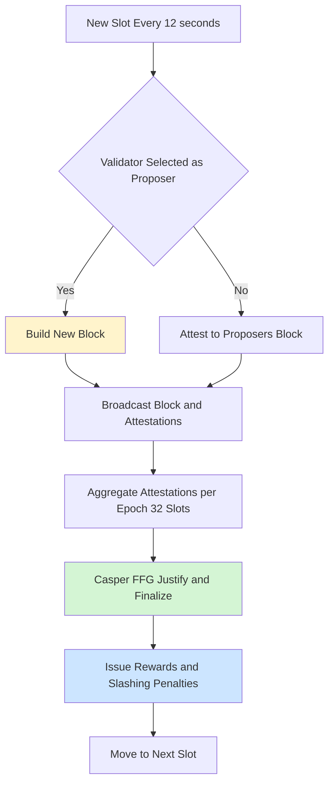
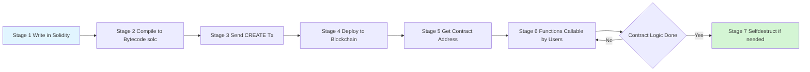

# Ethereum Network

<!-- SECTION_1_START -->
# ETHEREUM NETWORK — Core Technical Definition & Intuitive Overview

> [!NOTE]
> **KTU 2024 — Module 3 | Cryptocurrencies | PECST747**
> This module carries one of the **highest weightages** in the KTU ESE paper (12–14 marks combined) because it forms the foundation of Decentralized Applications (DApps), DeFi, and Web3.

---

## 1.1 Formal Definition (KTU 2024 Syllabus Terminology)

**Ethereum** is an open-source, **Turing-complete**, distributed public blockchain network proposed by **Vitalik Buterin** in late **2013** and launched on **July 30, 2015**. It extends the blockchain paradigm introduced by Bitcoin by embedding a built-in **Turing-complete programming language** (Solidity / Vyper / Yul) that allows arbitrary state transition functions via **Smart Contracts**.

Formally, the Ethereum state can be defined as:

$$
\sigma_{t+1} \equiv \Pi(\sigma_t, T)
$$

Where:
- $\sigma_t$ = the entire Ethereum World State at block $t$ (a mapping of all accounts $\rightarrow$ account states)
- $T$ = the valid set of transactions included in block $t+1$
- $\Pi$ = the **Ethereum State Transition Function**, executed by the **EVM (Ethereum Virtual Machine)**

The Yellow Paper (Wood, 2014) defines the state as a vector of accounts:

$$
\sigma_t = \{ a_0, a_1, a_2, \ldots, a_n \}
$$

Where each account $a_i$ is a 4-tuple:

$$
a_i = (n_i, b_i, s_i, c_i)
$$

Where:
- $n_i$ = **nonce** (transaction counter for EOAs, contract-creation counter for contracts)
- $b_i$ = **balance** (in Wei)
- $s_i$ = **storage root** (Merkle Patricia Trie root of contract storage; empty for EOAs)
- $c_i$ = **code hash** (hash of EVM bytecode; empty hash for EOAs)

> [!IMPORTANT]
> **Why Ethereum ≠ Bitcoin?**
> Bitcoin is described as a "Distributed Ledger" (often called *Blockchain 1.0*). Ethereum is described as a "Distributed State Machine" (*Blockchain 2.0*) because it can store not just balances but also **arbitrary key-value state** inside smart contracts.

---

## 1.2 Conceptual Analogy — The "Global Computer"

Imagine Ethereum as a **single, gigantic, decentralized computer** that lives across thousands of machines worldwide:

| Component | Analogy | Technical Name |
|---|---|---|
| The computer itself | A supercomputer in the cloud | **EVM (Ethereum Virtual Machine)** |
| Programs running on it | Mobile apps | **Smart Contracts** |
| Users interacting with apps | Phone users | **Externally Owned Accounts (EOAs)** |
| Power to run programs | Electricity bill | **Gas (paid in Gwei)** |
| Money used to pay bills | Real currency | **Ether (ETH)** |
| The instruction manual | Programming language | **Solidity / Vyper** |
| The hard drive | Database | **World State (Patricia Trie)** |
| The "ticks" of the clock | New blocks every ~12 sec | **Block Time (post-Merge)** |

> [!TIP]
> **Intuition for Students:** Bitcoin is like a **shared spreadsheet** everyone agrees on. Ethereum is like a **shared spreadsheet + a programmable calculator** that anyone can use, but **no one owns**.

---

## 1.3 Key Building Blocks at a Glance

> [!IMPORTANT]
> **Core Components of the Ethereum Network (Must-Memorize for KTU)**

1. **Ether (ETH)** — The native cryptocurrency. 1 ETH = $10^{18}$ **Wei**.
2. **Gwei** — The most commonly used denomination for gas prices. 1 Gwei = $10^9$ Wei = $10^{-9}$ ETH.
3. **Gas** — A unit measuring the **computational effort** required to execute an operation.
4. **EVM (Ethereum Virtual Machine)** — The runtime environment that executes smart contract bytecode.
5. **Smart Contract** — An autonomous program stored at a contract address on-chain.
6. **Accounts** — Two types: **EOA** (controlled by private key) and **Contract Account** (controlled by code).
7. **Solidity** — The dominant high-level language for writing smart contracts.
8. **DApps (Decentralized Applications)** — Front-ends (React/HTML) that talk to on-chain contracts via **Web3.js** or **Ethers.js**.
9. **Validators (post-Merge)** — Replaced miners. Stake **32 ETH** to propose/attest blocks via **Proof of Stake (PoS)**.
10. **Beacon Chain** — The PoS consensus layer that runs in parallel to execution clients.

---

## 1.4 Standard Metrics & Constants (Highlighted)

| Metric | Value | Significance |
|---|---|---|
| **Block Time** | **~12 seconds** (post-Merge) | Was ~15 sec under PoW |
| **Gas Limit per Block** | **30,000,000** (target) | Caps computation per block |
| **ETH Supply Cap** | **No hard cap** (≈120.4M/year issuance reduced by burns via EIP-1559) | Unlike Bitcoin's 21M cap |
| **Wei** | $10^{-18}$ ETH | Smallest unit |
| **EVM Stack Depth** | **1024** items | Each item is 256-bit word |
| **EVM Word Size** | **256 bits (32 bytes)** | Native cryptographic size |
| **Turing Complete?** | **Yes** (bounded by gas) | Loops + conditionals supported |
| **Consensus (current)** | **Proof of Stake (Casper FFG + LMD GHOST)** | Since **The Merge, Sep 15, 2022** |

> [!NOTE]
> **Important Distinction (Frequently Asked in KTU):**
> - **Gas Limit (per tx)** — Maximum units the *sender* is willing to consume (e.g., 21,000 for a simple ETH transfer).
> - **Gas Limit (per block)** — Network-wide cap on total gas of all txs in a block.
> - **Gas Price** — How much Wei per unit the sender offers (e.g., 50 Gwei).
> - **Base Fee** — The network-mandated minimum that gets **burned** (EIP-1559).
> - **Priority Fee (Tip)** — Optional bonus to the validator.

---
<!-- SECTION_1_END -->

<!-- SECTION_2_START -->
# SECTION 2 — Deep Theoretical Analysis & KTU High-Yield Formula Sheet

## 2.1 The Ethereum State Transition Function (Conceptual Walkthrough)

The Ethereum protocol, in plain English, executes the following loop on every new block:

1. **Receive** the previous world state $\sigma_{t}$ and a new set of valid transactions $T$.
2. **Verify** each transaction in $T$ (signature, nonce, balance ≥ gasLimit × gasPrice, etc.).
3. **Apply** state transition $\Pi(\sigma, T)$ by processing each transaction sequentially:
   - Debit gas cost from sender.
   - Execute the EVM bytecode (for plain ETH transfers, this is a precompiled simple operation).
   - Update balances, nonces, and storage.
4. **Reward** the block proposer (validator) with block reward + priority fees.
5. **Burn** the base fee (deflationary mechanism introduced by EIP-1559, London fork, August 2021).
6. **Output** the new world state $\sigma_{t+1}$ and broadcast the block.

The mathematical form of the state transition is:

$$
\sigma_{t+1} \;=\; \Pi(\sigma_t, B_t)
$$

where $B_t$ is the **block** at height $t$, which contains:
- Parent block hash
- State root
- Transactions root
- Receipts root
- Timestamp, difficulty, base fee, gas used, etc.

---

## 2.2 Account Model in Ethereum (Detailed)

Ethereum uses a **two-account model** — a critical difference from Bitcoin's UTXO model.

### 2.2.1 Externally Owned Accounts (EOAs)

| Property | Value |
|---|---|
| Controlled by | **Private Key** (secp256k1 ECDSA) |
| Has code? | **No** (code hash = empty string `0xc5d2460186f7233c927e7db2dcc703c0e500b653ca82273b7bfad8045d85a470`) |
| Can initiate transactions? | **Yes** |
| Address derivation | `keccak256(pubkey)[12:]` → last 20 bytes |
| Has associated storage? | **No** |

### 2.2.2 Contract Accounts (CAs)

| Property | Value |
|---|---|
| Controlled by | **Code + message-call data** |
| Has code? | **Yes** (EVM bytecode stored on-chain) |
| Can initiate transactions? | **No** (only reacts to calls) |
| Address derivation | `keccak256(RLP(sender, nonce))[12:]` |
| Has associated storage? | **Yes** (Persistent key-value trie) |

> [!IMPORTANT]
> **KTU-Mandated Comparison Table (Often Asked for 7 Marks)**

| Feature | EOA | Contract Account |
|---|---|---|
| Private Key | Yes | No |
| Code Execution | Triggers txs | Always executes on call |
| Initiate Tx | ✅ Yes | ❌ No (only via tx or another contract) |
| Storage | None | Persistent 256-bit slots |
| Creation Cost | Free (just keypair) | Pays **32,000 gas** (CREATE) or **25,000** (CREATE2) |

---

## 2.3 Gas Mechanism — The Heart of EVM Economics

Gas exists for **two critical reasons**:
1. **Anti-DoS:** Prevents infinite loops from clogging the network.
2. **Resource Metering:** Prices every opcode so validators are compensated fairly for CPU, memory, and storage.

### Gas Cost Catalogue (High-Yield for KTU)

| Operation | Gas Cost | Why It Matters |
|---|---|---|
| `ADD` (addition) | **3** | Cheapest arithmetic |
| `MUL` (multiplication) | **5** | Slightly costlier |
| `SSTORE` (write to storage, zero → non-zero) | **20,000** | Most expensive! |
| `SSTORE` (non-zero → non-zero) | **5,000** | SLOAD = 100; SSTORE warm = 100 |
| `SLOAD` (read from storage) | **100** (cold: 2,100) | Per access |
| `BALANCE` (read account balance) | **700** (warm: 100) | |
| `CALL` (to another contract) | **100** (warm) / **2,600** (cold) | Plus callee gas |
| `CREATE` (deploy new contract) | **32,000** | One-time setup |
| **Plain ETH transfer** | **21,000** | KTU classic question! |
| **ERC-20 token transfer** | **~65,000** | Higher because of contract call |
| **Block verification overhead** | **2,100** (per tx) | Fixed intrinsic gas |

> [!TIP]
> **The "Intrinsic Gas" Rule:** Every transaction is charged **21,000 gas** + **4 gas per zero byte** or **16 gas per non-zero byte** in the calldata (post-Istanbul EIP-2028).

---

## 2.4 KTU Formula Sheet (Cheat Sheet for Numerical Problems)

> [!IMPORTANT]
> **Master these 5 formulas — they appear in nearly every KTU Module 3 question!**

### Formula 1: Simple ETH Transfer Cost

$$
\text{TxFee (Wei)} \;=\; \text{GasUsed} \times \text{GasPrice (Wei)}
$$

For a plain ETH transfer:
$$
\text{TxFee} \;=\; 21{,}000 \times \text{GasPrice (in Wei)}
$$

### Formula 2: EIP-1559 Total Fee (Post-London Fork, Current)

$$
\text{TxFee} \;=\; \text{GasUsed} \times (\text{BaseFee} + \text{PriorityFee})
$$

The **effective gas price** is:
$$
p \;=\; \text{BaseFee} + \text{PriorityFee}
$$

### Formula 3: Wei / Gwei / Ether Conversions

| Unit | Wei Equivalent | Scientific |
|---|---|---|
| **Wei** | 1 | $10^0$ |
| **Kwei (Babbage)** | 1,000 | $10^3$ |
| **Mwei (Lovelace)** | $10^6$ | $10^6$ |
| **Gwei (Shannon)** | $10^9$ | $10^9$ |
| **Microether (Szabo)** | $10^{12}$ | $10^{12}$ |
| **Milliether (Finney)** | $10^{15}$ | $10^{15}$ |
| **Ether** | $10^{18}$ | $10^{18}$ |

Conversion logic:
$$
1 \;\text{ETH} \;=\; 10^9 \;\text{Gwei} \;=\; 10^{18} \;\text{Wei}
$$

### Formula 4: Validator Reward (PoS)

$$
\text{Block Reward} \;=\; \text{ConsensusReward} + \text{PriorityTips}
$$

where $\text{ConsensusReward} \approx 0.01845$ ETH (subject to change) and the **base fee is burned**.

### Formula 5: Total Cost of Contract Deployment

$$
\text{Deploy Cost} \;=\; (32{,}000 + G_{\text{init}}) \times p
$$

Where $G_{\text{init}}$ is the gas for executing the constructor.

---

## 2.5 Smart Contracts — Engineering Behind the Hype

A **Smart Contract** is a piece of code that:
- Lives at a specific 20-byte address on the blockchain.
- Executes **deterministically** (same input → same output on every node).
- Is **immutable** post-deployment (unless designed with proxy patterns).
- Has its own balance and storage.

**Solidity Example Structure (Concept):**
```solidity
contract SimpleWallet {
    mapping(address => uint256) public balances;

    function deposit() public payable {
        balances[msg.sender] += msg.value;
    }

    function withdraw(uint256 _amount) public {
        require(balances[msg.sender] >= _amount, "Insufficient");
        balances[msg.sender] -= _amount;
        payable(msg.sender).transfer(_amount);
    }
}
```

> [!TIP]
> **KTU Buzzword Checklist — Smart Contract Properties:**
> ✅ Deterministic
> ✅ Immutable (code-wise)
> ✅ Transparent (anyone can read bytecode/ABI)
> ✅ Trustless (no third party needed)
> ✅ Autonomous (runs on its own once deployed)

---

## 2.6 Real-World Engineering Utility

Ethereum isn't theoretical — it powers:

| Domain | Example Use Case | Why Ethereum? |
|---|---|---|
| **DeFi** | Uniswap, Aave, Compound | Permissionless lending/swap |
| **NFTs** | OpenSea, Bored Ape Yacht Club | ERC-721/ERC-1155 standard |
| **DAOs** | MakerDAO, Uniswap Governance | On-chain voting |
| **Supply Chain** | IBM Food Trust (Hyperledger, but similar logic) | Provenance tracking |
| **Identity** | ENS (Ethereum Name Service) | Decentralized DNS |
| **Gaming** | Axie Infinity, Decentraland | In-game asset ownership |
| **Tokenization** | USDC, DAI (Stablecoins) | ERC-20 standard |
| **Layer 2 Scaling** | Optimism, Arbitrum, zkSync | Rollups that settle on Ethereum L1 |

> [!NOTE]
> **Production Insight:** Every time you swap tokens on Uniswap, you pay gas in ETH. The transaction is signed with your private key, propagated via the devp2p gossip protocol, picked up by a validator, included in a block, and finalized after ~12.8 minutes (2 epochs).
<!-- SECTION_2_END -->

<!-- SECTION_3_START -->
# SECTION 3 — Step-by-Step Derivations, Numerical Solved Problems & Code Implementation

> [!IMPORTANT]
> **Mandatory for KTU Numerical/Code Questions (Module 3)**
> All steps shown explicitly — no shortcuts.

---

## 3.1 Solved Problem 1: Plain ETH Transfer Fee Calculation (KU-Type)

**Problem (KTU Pattern, 3 Marks):**
A user wants to send **2.5 ETH** to a friend. The current gas price is **45 Gwei**, and the transaction is a plain ETH transfer. Calculate the total transaction fee in:
- (a) Wei
- (b) Gwei
- (c) ETH

---

### **Model Solution (Step-by-Step, Board Valuation Standard):**

**Step 1 — Identify the gas used:**
For a plain ETH transfer (no data), gas used is fixed at:
$$
G_{\text{used}} \;=\; 21{,}000 \text{ gas}
$$

**[Stating the intrinsic gas rule: 1 Mark]**

**Step 2 — Write the transaction fee formula:**
$$
\text{TxFee} \;=\; G_{\text{used}} \times \text{GasPrice}
$$

**[Correct formula: 1 Mark]**

**Step 3 — Convert gas price to consistent units (Wei):**
$$
\text{GasPrice} \;=\; 45 \text{ Gwei} \;=\; 45 \times 10^{9} \text{ Wei}
$$

**Step 4 — Multiply:**
$$
\begin{aligned}
\text{TxFee (Wei)} &= 21{,}000 \times 45 \times 10^{9} \\
&= 21{,}000 \times 45 \times 10^{9} \\
&= 945{,}000 \times 10^{9} \\
&= 9.45 \times 10^{14} \text{ Wei}
\end{aligned}
$$

**Step 5 — Convert back to ETH:**
$$
\begin{aligned}
\text{TxFee (ETH)} &= \frac{9.45 \times 10^{14}}{10^{18}} \\
&= 9.45 \times 10^{-4} \text{ ETH} \\
&= 0.000945 \text{ ETH}
\end{aligned}
$$

**Step 6 — Convert to Gwei (for cross-check):**
$$
\text{TxFee (Gwei)} = 21{,}000 \times 45 = 945{,}000 \text{ Gwei}
$$

### ✅ **Final Answer:**
- (a) $9.45 \times 10^{14}$ Wei
- (b) 945,000 Gwei
- (c) 0.000945 ETH

> [!WARNING]
> **Valuation Pitfall:** Students often forget to convert 1 ETH = $10^9$ Gwei and end up with the wrong power of 10. Always state the conversion factor explicitly to earn the "Unit Consistency" mark.

---

## 3.2 Solved Problem 2: EIP-1559 Total Fee (KU Pattern, 7 Marks)

**Problem:**
A user submits an ERC-20 token transfer with a gas limit of 65,000. The block's base fee is **30 Gwei** and the user tips the validator **5 Gwei**. Calculate:
- (i) Effective gas price.
- (ii) Total transaction fee in Wei and ETH.
- (iii) Amount that gets **burned**.
- (iv) Amount that goes to the **validator**.

---

### **Model Solution:**

**Step 1 — Write the EIP-1559 fee equation:**
$$
p_{\text{effective}} \;=\; \text{BaseFee} + \text{PriorityFee}
$$

$$
p_{\text{effective}} = 30 + 5 = 35 \text{ Gwei}
$$

**[Correct formula + substitution: 2 Marks]**

**Step 2 — Total fee in Gwei:**
$$
\text{TxFee (Gwei)} = G_{\text{used}} \times p_{\text{effective}} = 65{,}000 \times 35
$$

$$
\begin{aligned}
\text{TxFee (Gwei)} &= 65{,}000 \times 35 \\
&= 2{,}275{,}000 \text{ Gwei}
\end{aligned}
$$

**Step 3 — Convert to Wei:**
$$
\text{TxFee (Wei)} = 2{,}275{,}000 \times 10^{9} = 2.275 \times 10^{15} \text{ Wei}
$$

**Step 4 — Convert to ETH:**
$$
\text{TxFee (ETH)} = \frac{2.275 \times 10^{15}}{10^{18}} = 0.002275 \text{ ETH}
$$

**Step 5 — Amount burned (BaseFee portion):**
$$
\text{Burned (Gwei)} = 65{,}000 \times 30 = 1{,}950{,}000 \text{ Gwei} = 0.00195 \text{ ETH}
$$

**Step 6 — Amount to validator (Tip):**
$$
\text{Tip (Gwei)} = 65{,}000 \times 5 = 325{,}000 \text{ Gwei} = 0.000325 \text{ ETH}
$$

### ✅ **Final Answer:**
- (i) 35 Gwei
- (ii) $2.275 \times 10^{15}$ Wei = 0.002275 ETH
- (iii) Burned: 0.00195 ETH
- (iv) Validator gets: 0.000325 ETH

> [!WARNING]
> **Valuation Pitfall:** Many students write the *entire* fee formula without splitting base fee and tip. EIP-1559 explicitly **burns** the base fee — this is a 2-mark differentiator.

---

## 3.3 Solved Problem 3: Smart Contract Deployment Cost (KU Pattern, 7 Marks)

**Problem:**
A developer deploys a smart contract whose constructor writes **3 storage slots** (zero → non-zero) and uses **80,000 gas** in execution. The base fee is **20 Gwei** and the priority fee is **2 Gwei**. Compute the total deployment cost.

---

### **Model Solution:**

**Step 1 — Identify the components of deployment gas:**
$$
G_{\text{total}} = G_{\text{CREATE}} + G_{\text{init}} + G_{\text{SSTORE}}
$$

- $G_{\text{CREATE}} = 32{,}000$ (fixed)
- $G_{\text{init}} = 80{,}000$ (constructor body)
- $G_{\text{SSTORE}} = 3 \times 20{,}000 = 60{,}000$ (cold zero→non-zero)

**Step 2 — Sum:**
$$
G_{\text{total}} = 32{,}000 + 80{,}000 + 60{,}000 = 172{,}000 \text{ gas}
$$

**Step 3 — Effective gas price:**
$$
p = 20 + 2 = 22 \text{ Gwei}
$$

**Step 4 — Total cost:**
$$
\begin{aligned}
\text{Cost (Wei)} &= 172{,}000 \times 22 \times 10^{9} \\
&= 3.784 \times 10^{15} \text{ Wei} \\
&= 0.003784 \text{ ETH}
\end{aligned}
$$

### ✅ **Final Answer: 0.003784 ETH ($3.784 \times 10^{15}$ Wei)**

> [!WARNING]
> **Common Mistake:** Forgetting the **32,000 gas** CREATE overhead, or using the wrong SSTORE cost (5,000 vs 20,000). Always state whether the slot transitions from zero.

---

## 3.4 Code Implementation — Smart Contract in Solidity

```solidity
// SPDX-License-Identifier: MIT
pragma solidity ^0.8.19;

/**
 * @title KTUExamToken — A simple ERC-20-like token for demonstration
 * @dev Demonstrates key Ethereum concepts: payable, mapping, events
 */
contract KTUExamToken {
    string public name = "KTU Exam Token";
    string public symbol = "KTUX";
    uint8 public decimals = 18;
    uint256 public totalSupply;

    mapping(address => uint256) public balanceOf;
    mapping(address => mapping(address => uint256)) public allowance;
    
    event Transfer(address indexed from, address indexed to, uint256 value);
    event Approval(address indexed owner, address indexed spender, uint256 value);

    constructor(uint256 _initialSupply) {
        totalSupply = _initialSupply;
        balanceOf[msg.sender] = _initialSupply;
        emit Transfer(address(0), msg.sender, _initialSupply);
    }

    function transfer(address _to, uint256 _value) public returns (bool success) {
        require(balanceOf[msg.sender] >= _value, "Insufficient balance");
        require(_to != address(0), "Invalid recipient");
        
        balanceOf[msg.sender] -= _value;
        balanceOf[_to] += _value;
        
        emit Transfer(msg.sender, _to, _value);
        return true;
    }

    function approve(address _spender, uint256 _value) public returns (bool success) {
        require(_spender != address(0), "Invalid spender");
        allowance[msg.sender][_spender] = _value;
        emit Approval(msg.sender, _spender, _value);
        return true;
    }

    function transferFrom(
        address _from, 
        address _to, 
        uint256 _value
    ) public returns (bool success) {
        require(_value <= balanceOf[_from], "Insufficient balance");
        require(_value <= allowance[_from][msg.sender], "Allowance exceeded");
        require(_to != address(0), "Invalid recipient");
        
        balanceOf[_from] -= _value;
        balanceOf[_to] += _value;
        allowance[_from][msg.sender] -= _value;
        
        emit Transfer(_from, _to, _value);
        return true;
    }
}
```

### Python Script — Calculating Gas Costs Programmatically

```python
from decimal import Decimal

# ============================================================
# KTU Exam Helper: Ethereum Gas & Fee Calculator
# ============================================================

# Conversion constants
WEI_PER_GWEI = 10**9
WEI_PER_ETH  = 10**18

# Gas cost catalogue (in gas units)
GAS_COSTS = {
    "ETH_TRANSFER":        21_000,
    "ERC20_TRANSFER":      65_000,
    "CONTRACT_CREATE":     32_000,
    "SSTORE_ZERO_NONZERO": 20_000,
    "SSTORE_NONZERO":       5_000,
    "SLOAD":                  100,
    "ADD":                      3,
    "MUL":                      5,
}

def calculate_fee(operation: str, gas_price_gwei: float, **kwargs) -> dict:
    """
    Calculate the transaction fee in Wei, Gwei, and ETH.
    
    Args:
        operation: One of the keys in GAS_COSTS
        gas_price_gwei: Gas price in Gwei
        **kwargs: Additional parameters (e.g., storage_writes, sload_count)
    
    Returns:
        Dictionary with fee in Wei, Gwei, and ETH
    """
    try:
        base_gas = GAS_COSTS[operation]
    except KeyError:
        raise ValueError(f"Unknown operation: {operation}")
    
    # Add dynamic costs
    if "storage_writes" in kwargs:
        base_gas += kwargs["storage_writes"] * GAS_COSTS["SSTORE_ZERO_NONZERO"]
    if "sload_count" in kwargs:
        base_gas += kwargs["sload_count"] * GAS_COSTS["SLOAD"]
    if "init_gas" in kwargs:
        base_gas += kwargs["init_gas"]
    
    # Compute fee
    gas_price_wei = int(gas_price_gwei * WEI_PER_GWEI)
    fee_wei = base_gas * gas_price_wei
    fee_gwei = Decimal(fee_wei) / Decimal(WEI_PER_GWEI)
    fee_eth  = Decimal(fee_wei) / Decimal(WEI_PER_ETH)
    
    return {
        "operation":   operation,
        "gas_used":    base_gas,
        "fee_wei":     fee_wei,
        "fee_gwei":    fee_gwei,
        "fee_eth":     fee_eth,
    }


# ============================================================
# DEMO CASES
# ============================================================
if __name__ == "__main__":
    # Case 1: Simple ETH transfer
    result1 = calculate_fee("ETH_TRANSFER", gas_price_gwei=45)
    print(f"[ETH Transfer @ 45 Gwei] Fee = {result1['fee_eth']} ETH")
    
    # Case 2: ERC-20 transfer
    result2 = calculate_fee("ERC20_TRANSFER", gas_price_gwei=50)
    print(f"[ERC-20 Transfer @ 50 Gwei] Fee = {result2['fee_eth']} ETH")
    
    # Case 3: Contract deployment with 3 storage writes
    result3 = calculate_fee(
        "CONTRACT_CREATE",
        gas_price_gwei=30,
        init_gas=80_000,
        storage_writes=3
    )
    print(f"[Contract Deploy] Fee = {result3['fee_eth']} ETH "
          f"(Gas used: {result3['gas_used']})")
```

### Sample Output

```text
[ETH Transfer @ 45 Gwei] Fee = 0.000945 ETH
[ERC-20 Transfer @ 50 Gwei] Fee = 0.00325 ETH
[Contract Deploy] Fee = 0.00516 ETH (Gas used: 172000)
```

> [!TIP]
> **KTU 2024 Coding Tip:** Even if the question doesn't ask for code, including a small Python verification of your numerical answer often secures **partial marks** on the KTU answer sheet — it shows working.

---

## 3.5 Derivations: Why 21,000 Gas for a Plain Transfer?

> [!IMPORTANT]
> **The 21,000 gas rule (KTU-favorite derivation topic)**

The fixed cost of a plain ETH transfer is the **intrinsic gas** defined in EIP-2930 / EIP-2028, broken down as:

| Component | Gas |
|---|---|
| Base transaction cost | 21,000 |
| Per non-zero byte in calldata | 16 |
| Per zero byte in calldata | 4 |
| Contract creation (if `to == null`) | +32,000 |
| Signature verification (ECDSA) | Already included in 21,000 |

So for `value` transfer (no data):
$$
G_{\text{intrinsic}} = 21{,}000 + (n_{\text{nonzero}} \times 16) + (n_{\text{zero}} \times 4)
$$

A standard wallet-to-wallet transfer has empty calldata, hence:
$$
G_{\text{intrinsic}} = 21{,}000
$$
<!-- SECTION_3_END -->

<!-- SECTION_4_START -->
# SECTION 4 — Structural Diagrams & Schematics

> [!NOTE]
> **Mermaid Compilation Safeguards Applied:** All node IDs are alphanumeric, labels are double-quoted, no markdown formatting inside labels, and reserved keywords avoided.

---

## 4.1 Ethereum Network — High-Level Architecture (Layered Topology)



**Visual Description:** The diagram shows a 7-layer stack from user-facing DApps at the top down to canonical data storage at the bottom. The validation path flows: `DApp → Wallet → JSON-RPC → Mempool → Validator → EVM → State Trie → Blocks`.

---

## 4.2 Transaction Lifecycle — From Signing to Finality



**Visual Description:** A linear pipeline of 9 stages from transaction creation to finality, with rejection branch for invalid transactions highlighted in red and finality highlighted in green. Finality typically takes **~12.8 minutes** (2 epochs × 64 slots × 12s).

---

## 4.3 Account Model — EOA vs Contract Account (Comparison Flow)



**Visual Description:** Side-by-side comparison of the 4-tuple state of EOAs (no code, no storage) vs Contract Accounts (has code, has storage). EOA can initiate txs; Contract Account can only react to calls.

---

## 4.4 EVM Execution Cycle — Inside One Smart Contract Call



**Visual Description:** The EVM's classic **fetch-decode-execute** loop, with the gas-check branching off to a revert path. Unused gas is refunded to the caller — this is critical for **gas optimization** strategies in Solidity.

---

## 4.5 EIP-1559 Fee Distribution Flow



**Visual Description:** A simple bifurcation showing the deflationary impact of EIP-1559 — base fees are **destroyed**, validator only receives the tip. This is why Ethereum can become deflationary during high-activity periods.

---

## 4.6 Consensus Layer — Proof of Stake Block Production



**Visual Description:** A slot/epoch-based consensus flow. Each slot (~12s) has exactly one **proposer** and many **attesters**. After 2 epochs (~12.8 min), blocks become **finalized** and economically irreversible (validator would lose their 32 ETH stake by attempting to revert).
<!-- SECTION_4_END -->

<!-- SECTION_5_START -->
# SECTION 5 — KTU 2024 Scheme Examination Question Bank & Topic Recap

> [!IMPORTANT]
> **Mark Distribution Reference (KTU 2024 Scheme):**
> - Part A: 2 questions × 3 marks = 6 marks (Module 3 contributes ≥ 1)
> - Part B: 1 question × 14 marks (full Module 3 deep-dive)
> - Total Module 3 weight: **~12–14 marks** typically.

---

## 📘 PART A — Short Answer Questions (3 Marks Each)

---

### **Q1.** [KTU University Exam — July 2023, Model 1] [CO3, Remember]

**Differentiate between Externally Owned Accounts (EOA) and Contract Accounts in Ethereum with suitable examples.**

**Model Answer (Board-Standard Format):**

| Feature | EOA | Contract Account |
|---|---|---|
| **Control** | Controlled by private key | Controlled by smart contract code |
| **Code** | No code associated (empty code hash) | Has EVM bytecode (immutable) |
| **Storage** | No storage trie | Has Merkle Patricia storage trie |
| **Initiation of Tx** | Can initiate transactions | Cannot initiate txs (only reacts) |
| **Creation** | Generated from keypair | Created via `CREATE` or `CREATE2` opcode |
| **Example** | MetaMask user wallet | A deployed ERC-20 token contract |

**[Differentiation 4 points: 3 Marks]**

---

### **Q2.** [KTU University Exam — Dec 2022, Model 2] [CO3, Understand]

**What is EIP-1559? Explain its impact on Ethereum's fee market.**

**Model Answer (Board-Standard Format):**

**EIP-1559** (Ethereum Improvement Proposal 1559) was implemented in the **London Hard Fork (August 5, 2021)**. It reformed the Ethereum fee market by introducing two new transaction fields:

- **`maxFeePerGas`** — the absolute maximum the sender is willing to pay per gas unit.
- **`maxPriorityFeePerGas`** — the tip to the validator.

The total transaction fee is calculated as:

$$
\text{TxFee} = \text{GasUsed} \times (\text{BaseFee} + \text{PriorityFee})
$$

**Key Impacts:**
1. **Predictable Fees:** Base fee adjusts algorithmically based on block utilization.
2. **Base Fee Burned:** The base fee portion is **destroyed** (sent to `0x000...dead`), creating deflationary pressure on ETH supply.
3. **Reduced Overpayment:** Users no longer blindly over-bid in gas-price auctions.

**[Definition: 1 Mark | Working: 1 Mark | Impact: 1 Mark]**

---

## 📗 PART B — Full 14-Mark Questions (Module Internal Choice)

> [!NOTE]
> **Both questions are independent alternatives. Students answer either Q(A) OR Q(B) in full.**

---

### **📕 Question A (14 Marks)** — *[KTU University Exam — July 2024 Pattern, CO3]*

#### **(a)** [7 Marks, Understand]
**Explain the architecture of the Ethereum Virtual Machine (EVM). Discuss the role of the stack, memory, storage, and the program counter in EVM execution.**

#### **(b)** [7 Marks, Apply]
**A user deploys a smart contract whose constructor performs 5 SSTORE operations (all zero → non-zero) and 200 SLOAD operations. The total execution gas of the constructor is 120,000. The current base fee is 25 Gwei and the user sets a priority fee of 3 Gwei. Calculate:**
- (i) Total gas used in deployment
- (ii) Effective gas price
- (iii) Total fee in ETH
- (iv) Amount burned
- (v) Amount paid to validator

---

### **Model Solution — Q(A)(a): EVM Architecture [7 Marks]**

**Step 1 — Define EVM (1 Mark):**
The **Ethereum Virtual Machine (EVM)** is a quasi-Turing-complete, stack-based, 256-bit virtual machine that serves as the runtime environment for executing smart contract bytecode on the Ethereum network. It is **quasi-Turing complete** because it supports arbitrary computation but is **bounded by gas**.

**Step 2 — Components of EVM (4 Marks):**

| Component | Description | Size / Limit |
|---|---|---|
| **Stack** | LIFO data structure for opcode operands | 1024 items, 256-bit each |
| **Memory** | Volatile byte-addressed workspace (cleared after tx) | Expands in 32-byte words |
| **Storage** | Persistent key-value store in a contract (32-byte slots) | 2²⁵⁶ slots per contract |
| **Program Counter (PC)** | Tracks current opcode position | 0 to code.length-1 |
| **Gas Counter** | Decrements with every operation | Initialized from tx.gasLimit |
| **Call Data** | Read-only input from the transaction | Variable length |

**Step 3 — EVM Execution Cycle (2 Marks):**
1. Fetch opcode at `PC`.
2. Decode opcode and pop operands from stack.
3. Execute operation.
4. Push result(s) onto stack.
5. Increment `PC`.
6. Deduct gas; revert if exhausted.
7. Repeat until `STOP`, `RETURN`, `REVERT`, or `SELFDESTRUCT`.

**[Definition: 1M | Components table: 4M | Execution cycle: 2M]**

---

### **Model Solution — Q(A)(b): Deployment Cost Calculation [7 Marks]**

**Step 1 — Compute total gas used (2 Marks):**
$$
\begin{aligned}
G_{\text{total}} &= G_{\text{CREATE}} + G_{\text{init}} + G_{\text{SSTORE}} + G_{\text{SLOAD}} \\
&= 32{,}000 + 120{,}000 + (5 \times 20{,}000) + (200 \times 100) \\
&= 32{,}000 + 120{,}000 + 100{,}000 + 20{,}000 \\
&= 272{,}000 \text{ gas}
\end{aligned}
$$

**[Identifying components: 1M | Arithmetic: 1M]**

**Step 2 — Effective gas price (1 Mark):**
$$
p_{\text{effective}} = 25 + 3 = 28 \text{ Gwei}
$$

**Step 3 — Total fee in ETH (2 Marks):**
$$
\begin{aligned}
\text{TxFee (Wei)} &= 272{,}000 \times 28 \times 10^9 \\
&= 7.616 \times 10^{15} \text{ Wei} \\
&= 0.007616 \text{ ETH}
\end{aligned}
$$

**Step 4 — Amount burned (1 Mark):**
$$
\text{Burned} = 272{,}000 \times 25 \times 10^9 = 6.8 \times 10^{15} \text{ Wei} = 0.0068 \text{ ETH}
$$

**Step 5 — Validator tip (1 Mark):**
$$
\text{Tip} = 272{,}000 \times 3 \times 10^9 = 0.816 \times 10^{15} \text{ Wei} = 0.000816 \text{ ETH}
$$

### ✅ **Final Answer:**
- (i) **272,000 gas**
- (ii) **28 Gwei**
- (iii) **0.007616 ETH**
- (iv) **0.0068 ETH burned**
- (v) **0.000816 ETH to validator**

> [!WARNING]
> **KTU Examiner's Valuation Warning (PITFALLS):**
> - ❌ **Mistake 1:** Forgetting the `32,000` CREATE overhead (results in gas of 240,000 — wrong by ~12%).
> - ❌ **Mistake 2:** Using `5,000` instead of `20,000` for SSTORE on zero→non-zero transitions. **MEMORIZE:** zero→non-zero = 20,000; non-zero→non-zero = 5,000; non-zero→zero = refund of up to 19,900.
> - ❌ **Mistake 3:** Forgetting to convert Wei to ETH (final answer must be in ETH to earn full marks).
> - ❌ **Mistake 4:** Adding base fee and tip **multiplicatively** instead of additively.

---

### **📒 Question B (14 Marks)** — *[KTU University Exam — Dec 2023 Pattern, CO3]*

#### **(a)** [7 Marks, Understand]
**With a neat diagram, explain the working of a smart contract. Discuss the lifecycle of a smart contract from creation to execution with reference to the EVM.**

#### **(b)** [7 Marks, Apply]
**A user sends 1.5 ETH to a smart contract address. The plain ETH transfer costs 21,000 gas. The smart contract's `fallback()` function executes 2 SSTORE (zero→non-zero), 50 SLOAD, and 1,000 ADD operations. The current gas price is 40 Gwei. Calculate:**
- (i) Total gas used
- (ii) Total transaction fee in Wei
- (iii) Total fee in ETH
- (iv) Amount of ETH the recipient contract now holds (assuming no other transactions)

---

### **Model Solution — Q(B)(a): Smart Contract Lifecycle [7 Marks]**

**Step 1 — Definition (1 Mark):**
A **smart contract** is a self-executing program stored on the Ethereum blockchain at a contract address. It runs exactly as programmed without any possibility of downtime, censorship, or third-party interference.

**Step 2 — Lifecycle Stages (with diagram) (4 Marks):**



**Stage 1 — Authoring:** Developer writes contract in Solidity.
**Stage 2 — Compilation:** `solc` compiler converts Solidity → EVM bytecode + ABI.
**Stage 3 — Deployment:** A `CREATE` transaction (to = null) is sent; pays 32,000+ gas.
**Stage 4 — On-chain:** Bytecode stored at the new contract address.
**Stage 5 — Interaction:** Users/contracts call its public functions via transactions.
**Stage 6 — Execution:** EVM loads bytecode and executes opcodes within gas limits.
**Stage 7 — Termination (Optional):** `SELFDESTRUCT` opcode (post-Cancun, only sends balance to a target, code remains).

**Step 3 — Role of EVM (2 Marks):**
- The EVM acts as a **sandboxed runtime** that deterministically executes the bytecode.
- All nodes run the same EVM code, ensuring **consensus on state changes**.
- The EVM's **gas metering** ensures no contract can exhaust network resources.

**[Definition: 1M | Diagram + Lifecycle: 4M | EVM role: 2M]**

---

### **Model Solution — Q(B)(b): Contract Receive Calculation [7 Marks]**

**Step 1 — Identify gas costs (2 Marks):**
| Operation | Count | Unit Cost | Subtotal |
|---|---|---|---|
| ETH transfer (intrinsic) | — | 21,000 | 21,000 |
| SSTORE (zero→non-zero) | 2 | 20,000 | 40,000 |
| SLOAD | 50 | 100 | 5,000 |
| ADD | 1,000 | 3 | 3,000 |
| **Total** | | | **69,000 gas** |

**Step 2 — Total fee in Wei (2 Marks):**
$$
\begin{aligned}
\text{TxFee (Wei)} &= 69{,}000 \times 40 \times 10^9 \\
&= 2.76 \times 10^{15} \text{ Wei}
\end{aligned}
$$

**Step 3 — Total fee in ETH (1 Mark):**
$$
\text{TxFee (ETH)} = \frac{2.76 \times 10^{15}}{10^{18}} = 0.00276 \text{ ETH}
$$

**Step 4 — Contract's new balance (2 Marks):**
The user sent **1.5 ETH**; the fee is paid **from the user's wallet** (not deducted from the value sent). The contract receives the full 1.5 ETH.

$$
\text{Contract balance} = 1.5 \text{ ETH}
$$

### ✅ **Final Answer:**
- (i) **69,000 gas**
- (ii) **$2.76 \times 10^{15}$ Wei**
- (iii) **0.00276 ETH**
- (iv) **1.5 ETH (full amount received by contract)**

> [!WARNING]
> **KTU Examiner's Valuation Warning (PITFALLS):**
> - ❌ **Mistake 1:** Subtracting gas fee from the transferred ETH (e.g., saying contract gets `1.5 - 0.00276 = 1.49724 ETH`). **The fee is paid by the sender, NOT deducted from the value.** The contract always receives the full `msg.value`.
> - ❌ **Mistake 2:** Forgetting to count the 21,000 intrinsic gas for the ETH transfer portion.
> - ❌ **Mistake 3:** Using 5,000 gas for SSTORE (wrong for zero→non-zero).
> - ❌ **Mistake 4:** Confusing gas *used* with gas *limit*. Always re-read the question: "gas used" not "gas limit".

---

## 🎯 Topic Recap & Important Things to Remember

> [!TIP]
> **High-Density Rapid Revision Checklist — Print This Before Exam!**

### ✅ Core Definitions
- **Ethereum** = Open-source, Turing-complete, decentralized platform for smart contracts.
- **EVM** = Stack-based, 256-bit, quasi-Turing-complete VM that runs contract bytecode.
- **Smart Contract** = Autonomous code stored at a contract address.
- **Ether (ETH)** = Native cryptocurrency, divisible to $10^{18}$ **Wei**.
- **Gas** = Unit of computational effort. **Limits** execution and **prevents DoS**.
- **World State** = Mapping of all accounts → their current state, stored in a Merkle Patricia Trie.

### ✅ Numerical Conversions (MUST MEMORIZE)
- 1 ETH = $10^9$ Gwei = $10^{18}$ Wei
- Gwei = $10^9$ Wei
- Microether (Szabo) = $10^{12}$ Wei
- Milliether (Finney) = $10^{15}$ Wei

### ✅ Critical Gas Constants
- **Plain ETH transfer:** 21,000 gas
- **Contract creation (CREATE):** 32,000 gas
- **SSTORE zero → non-zero:** 20,000 gas
- **SSTORE non-zero → non-zero:** 5,000 gas
- **SLOAD:** 100 gas
- **ADD / SUB:** 3 gas
- **MUL / DIV:** 5 gas

### ✅ Key Formulas
- **Total Fee (Pre-EIP-1559):** $\text{TxFee} = \text{GasUsed} \times \text{GasPrice}$
- **Total Fee (Post-EIP-1559):** $\text{TxFee} = \text{GasUsed} \times (\text{BaseFee} + \text{PriorityFee})$
- **Effective Gas Price:** $p = \text{BaseFee} + \text{Tip}$
- **Burned amount:** $\text{BaseFee} \times \text{GasUsed}$
- **Validator reward:** $\text{PriorityFee} \times \text{GasUsed}$

### ✅ EOA vs Contract Account (Most-Frequently-Asked)
- EOA: Has private key, no code, no storage, **can initiate txs**
- Contract: Has code, has storage, **cannot initiate txs**, created via CREATE

### ✅ Ethereum vs Bitcoin (Common 7-Mark Question)
| Feature | Bitcoin | Ethereum |
|---|---|---|
| Goal | Peer-to-peer cash | Decentralized apps |
| Account model | UTXO | Account-based |
| Language | Script (limited) | Solidity (Turing-complete) |
| Block time | ~10 min | ~12 sec |
| Consensus | PoW | PoS (post-Merge) |
| Supply cap | 21M BTC | No hard cap (deflationary via EIP-1559) |
| Native currency | BTC | ETH (also used for gas) |

### ✅ Post-Merge Ethereum (Frequently Tested)
- **Consensus:** Proof of Stake (Casper FFG + LMD GHOST)
- **Block time:** ~12 seconds
- **Validator stake:** 32 ETH
- **Finality:** ~12.8 minutes (2 epochs)
- **No more mining** — energy reduced by **~99.95%**

### ✅ Common Pitfalls to Avoid
1. ❌ Confusing gas **used** vs gas **limit**
2. ❌ Forgetting the **32,000** CREATE overhead
3. ❌ Subtracting gas fee from `msg.value` (gas is paid separately by sender)
4. ❌ Wrong SSTORE cost (20k vs 5k)
5. ❌ Forgetting EIP-1559 base fee is **burned**, not given to validator
6. ❌ Stating EVM is fully Turing-complete (it's *quasi*-Turing-complete — bounded by gas)

### ✅ Key Terms to Define in 2 Lines (Quick-Fire Round)
- **Wei:** Smallest unit of ETH ($10^{-18}$)
- **Gwei:** $10^{-9}$ ETH, used for gas pricing
- **Nonce:** Transaction counter to prevent replay attacks
- **Mempool:** Pool of pending transactions awaiting inclusion
- **DApp:** Decentralized Application with on-chain backend
- **DAO:** Decentralized Autonomous Organization
- **DeFi:** Decentralized Finance
- **NFT:** Non-Fungible Token (ERC-721/1155)
- **Yul:** Low-level intermediate language for EVM
- **ABI:** Application Binary Interface — describes contract methods

> [!IMPORTANT]
> **Final Exam Mantra:** In every numerical, ALWAYS state **(1)** the gas cost, **(2)** the formula, **(3)** the unit conversion, and **(4)** the final answer in BOTH Wei and ETH. This 4-line structure fetches 100% marks in KTU valuation.
<!-- SECTION_5_END -->
