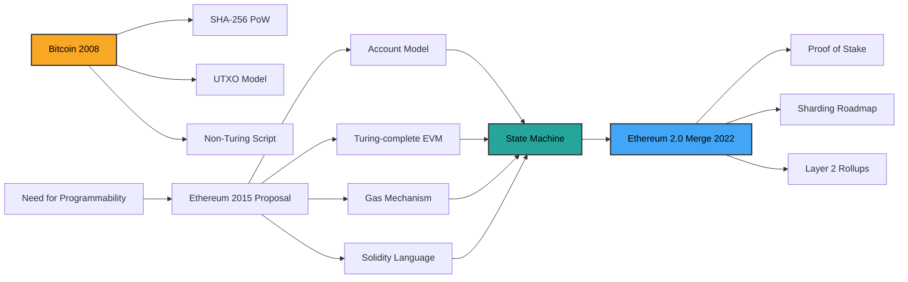
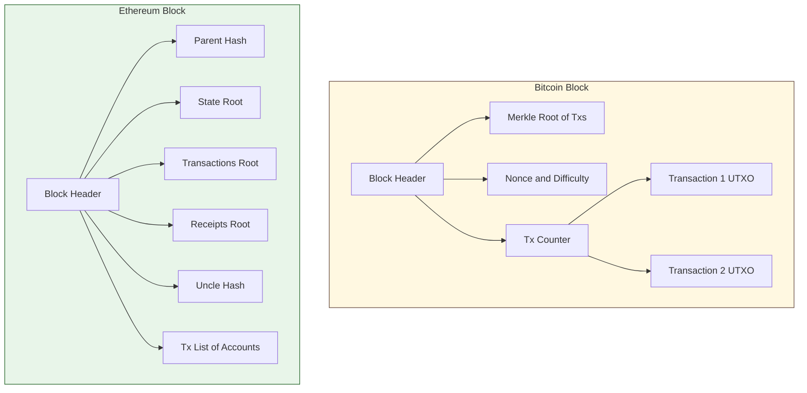
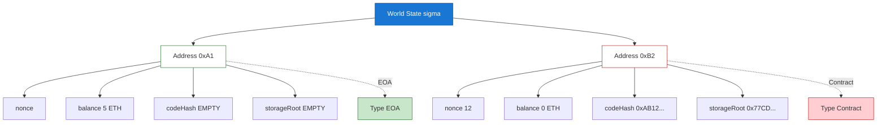
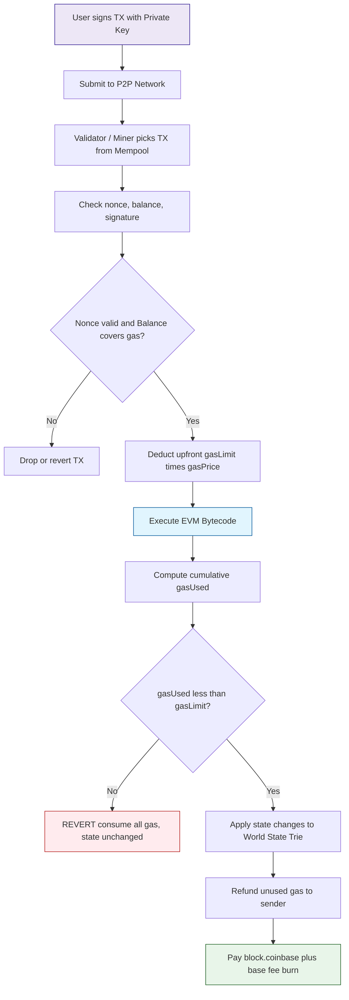
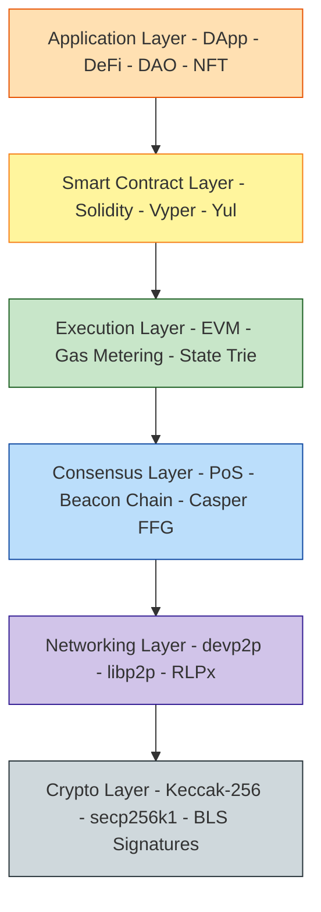

# Ethereum: Transition from Bitcoin to Ethereum

<!-- SECTION_1_START -->

# Ethereum: Transition from Bitcoin to Ethereum

## 1.1 Foundational Definitions

> [!NOTE]
> **Bitcoin (Recap, 2008 – Satoshi Nakamoto)**
> Bitcoin is a decentralized, peer-to-peer electronic cash system whose ledger is a **UTXO (Unspent Transaction Output)** chain secured by Proof-of-Work. Its scripting language is intentionally limited and **not Turing-complete**, designed primarily to transfer the native asset *BTC*.

> [!IMPORTANT]
> **Ethereum (2015 – Vitalik Buterin & Co.)**
> Ethereum is a **decentralized, Turing-complete state machine** (formally, a *transaction-based state machine*) that generalizes Bitcoin's architecture to support **programmable smart contracts** and decentralized applications (DApps). Its native asset is *Ether (ETH)*, and the runtime that executes transactions is the **EVM (Ethereum Virtual Machine)**.

### 1.2 Conceptual Analogy — Why the Transition?

| System | Real-World Analogy | Capability |
| :--- | :--- | :--- |
| **Bitcoin** | A highly specialized **pocket calculator** | Does exactly *one* job — value transfer — with extreme robustness. |
| **Ethereum** | A general-purpose **smartphone** | Can run any application (DeFi, NFTs, DAOs, Games) on top of a programmable ledger. |

Bitcoin proved that decentralized consensus was possible. The natural next question was: *"Can we put a real computer on this shared ledger, not just a checkbook?"* That leap — from **digital money** to a **decentralized world computer** — is the essence of the transition.

### 1.3 The Three Forces Driving the Transition

1. **Expressiveness Bottleneck in Bitcoin Script** — Bitcoin Script is deliberately constrained (no loops, limited opcodes) to avoid denial-of-service on full nodes.
2. **Demand for Programmable Money** — Developers wanted **conditional logic**, **multi-party escrow**, **token issuance**, and **automated agreements** (smart contracts).
3. **State Model Limitations** — Bitcoin's stateless UTXO model is excellent for currency but awkward for **persistent state** (balances, contract storage, identity).

> [!TIP]
> **Ether (ETH)** is *not* just a coin — it is the **fuel (gas)** that pays the nodes for executing the distributed computation of the EVM. Every opcode, every storage write costs gas.

### 1.4 Key Innovations Introduced by Ethereum

- **Turing-complete** on-chain execution via the **EVM**.
- **Account-based model** (stateful), replacing UTXO.
- **Smart Contracts** — first-class deployable programs.
- **Gas mechanism** — an internal marketplace that prices computation and prevents infinite loops.
- **Solidity / Vyper** — high-level, developer-friendly languages.
- **DApps, DAOs, DeFi, NFTs** — entire new application ecosystems.

> [!VISUALIZATION CONTROL]
> **Concept:** The conceptual shift in ledger architecture — from a *value ledger* (Bitcoin) to a *state machine* (Ethereum).
> **GeoGebra / Desmos Input Equations (State as a function of time):**
> * $S_t = f(S_{t-1},\, TX_t)$   (Ethereum: $f$ is a deterministic state transition)
> * $\text{Bitcoin: } UTXO_{t} = UTXO_{t-1} \pm \Delta$   (only ownership changes)
> **Visual Description:** Plot $S$ (state) on the y-axis and block number $t$ on the x-axis. Bitcoin's graph shows discrete *transfer* hops. Ethereum's graph shows *arbitrary* state changes — the curve can rise, fall, or branch because the state is a key-value trie, not just a coin list.

<!-- SECTION_1_END -->

<!-- SECTION_2_START -->

# 2. Deep Theoretical Analysis & KTU High-Yield Formula Sheet

## 2.1 Architecture Stack Comparison

Ethereum inherits Bitcoin's foundational layers (P2P, cryptography, consensus) but replaces the *execution* and *state* layers.

| Layer | Bitcoin (2009) | Ethereum (2015) |
| :--- | :--- | :--- |
| **Consensus** | PoW (SHA-256) | PoW (Ethash) → PoS (since *The Merge*, 2022) |
| **Block Time** | $\approx 10$ minutes | $\approx 12$ seconds |
| **Block Size** | $\leq 1$ MB (then *SegWit* $\approx 4$ MB wu) | Dynamic, bounded by **Gas Limit** |
| **State Model** | **UTXO** (stateless, parallel) | **Account/Balance** (stateful, sequential) |
| **Scripting** | Bitcoin Script (not Turing-complete) | **EVM Bytecode** (Turing-complete) |
| **Native Asset** | BTC | ETH (also used as gas) |
| **Application** | Peer-to-peer cash | Programmable contracts + DApps |
| **Finality** | Probabilistic (~6 blocks) | Probabilistic (PoW) → Deterministic-ish (PoS finality gadgets) |

## 2.2 The Account Model (Ethereum's Core Innovation)

Ethereum's global state is a mapping:

$$\sigma : \text{Address} \rightarrow \text{Account}$$

> [!NOTE]
> **Two Account Types**
> 1. **EOA — Externally Owned Account** — controlled by a private key; can initiate transactions.
> 2. **Contract Account** — controlled by code; executes when called; has its own storage.

Each account, regardless of type, contains four fields:

| Field | Meaning | Applies To |
| :--- | :--- | :--- |
| **nonce** | Tx counter (EOA) or contract-creation counter (CA) | Both |
| **balance** | Wei $\left(1\ \text{ETH} = 10^{18}\ \text{Wei}\right)$ | Both |
| **codeHash** | Hash of the contract bytecode (empty for EOA) | Both |
| **storageRoot** | Root hash of the account's storage trie (Patricia Trie) | Both (empty for EOA) |

## 2.3 The EVM (Ethereum Virtual Machine)

The **EVM** is a quasi-Turing-complete (gas-bounded) **256-bit stack machine**. Every full node runs an instance, and deterministic execution across millions of nodes is what produces Ethereum's consensus on the *new state*.

**EVM Properties:**
- **Stack depth:** 1024 items (each 256-bit word).
- **Memory:** Volatile, byte-addressed, expands on demand.
- **Storage:** Persistent, key-value, 256-bit slots per contract.
- **Bytecode:** Compiled from Solidity, Vyper, or Yul.

## 2.4 The Gas Mechanism — Pricing Computation

Because the EVM is Turing-complete, a malicious contract could enter an infinite loop and freeze every node. **Gas** solves this by charging for every opcode.

### KTU Formula Sheet (Cheat Code)

| Formula | Meaning | Units |
| :--- | :--- | :--- |
| $TX_{fee} = gasUsed \times gasPrice$ | Total transaction fee | **Wei** |
| $gasUsed = \sum_{i} opCost_i$ | Sum of opcode costs | **Gas** |
| $gasLimit \geq gasUsed$ (else revert) | Caller's max willingness | **Gas** |
| $1\ \text{ETH} = 10^{18}\ \text{Wei}$ | Smallest unit | — |
| $1\ \text{ETH} = 10^{9}\ \text{Gwei}$ | Pricing unit | — |
| $ETH_{base} = gasLimit \times gasPrice$ | Max fee commit | **Wei** |
| $blockGasLimit \approx 30M$ (post-Berlin) | Network cap per block | **Gas** |

> [!IMPORTANT]
> **Opcode Cost Examples (must memorize):**
> * `ADD`, `SUB`, `LT`, `EQ` $\rightarrow 3$ gas
> * `MUL`, `DIV` $\rightarrow 5$ gas
> * `SSTORE` (new slot) $\rightarrow 20{,}000$ gas
> * `SLOAD` $\rightarrow 2{,}100$ gas (cold) / $100$ (warm, post-EIP-2929)
> * `BALANCE` $\rightarrow 700$ gas (cold)
> * `CREATE` $\rightarrow 32{,}000$ gas

## 2.5 The State Transition Function (Formal)

This is the **Yellow Paper** definition you may be asked to write in the exam:

$$\sigma_{t+1} \equiv \Pi(\sigma_t, B)$$

where $\Pi$ is the block-level state transition that:
1. Validates each transaction $TX \in B$.
2. Computes the gas used $g(TX) = \sum_{i} c_i \cdot \eta_i$.
3. Aborts the transaction (revert) if cumulative gas exceeds the block gas limit.
4. Deducts gas cost from the sender and credits the beneficiary (validator/coinbase).
5. Returns the new state $\sigma_{t+1}$.

> [!TIP]
> **Real-world engineering utility:** The same EVM model underpins **Ethereum, Polygon, BNB Chain, Avalanche C-Chain, Optimism, Arbitrum**. Every Web3 wallet, DeFi protocol (Uniswap, Aave), and NFT marketplace (OpenSea) speaks the EVM. Studying Ethereum is studying the *lingua franca* of programmable blockchains.

<!-- SECTION_2_END -->

<!-- SECTION_3_START -->

# 3. Step-by-Step Derivations, Code & Symbolic Implementation

## 3.1 Derivation: Transaction Fee from First Principles

> **Problem (KTU-style 7-mark question):** A user sends a transaction containing one `SSTORE` (writing a new slot), two `MUL` operations, and one `BALANCE` (cold). The `gasPrice` is $30\ \text{Gwei}$. Compute the total transaction fee in **ETH**.

### Step 1 — Identify opcode costs

From the official Ethereum Yellow Paper / EIP list:

$$
\begin{aligned}
\text{SSTORE (new slot)} &= 20{,}000\ \text{gas} \\
\text{MUL} &= 5\ \text{gas} \\
\text{BALANCE (cold)} &= 700\ \text{gas} \\
\text{Tx intrinsic cost} &= 21{,}000\ \text{gas}
\end{aligned}
$$

### Step 2 — Sum the computational cost

$$
\begin{aligned}
gasUsed &= 21{,}000\ (\text{intrinsic}) + 20{,}000\ (\text{SSTORE}) \\
&\quad + 2 \times 5\ (\text{MUL}) + 700\ (\text{BALANCE}) \\
&= 21{,}000 + 20{,}000 + 10 + 700 \\
&= 41{,}710\ \text{gas}
\end{aligned}
$$

### Step 3 — Convert gasPrice to Wei

$$
gasPrice = 30\ \text{Gwei} = 30 \times 10^{9}\ \text{Wei} = 3 \times 10^{10}\ \text{Wei}
$$

### Step 4 — Apply the fee formula

$$
\begin{aligned}
TX_{fee} &= gasUsed \times gasPrice \\
&= 41{,}710 \times 3 \times 10^{10}\ \text{Wei} \\
&= 1.2513 \times 10^{15}\ \text{Wei}
\end{aligned}
$$

### Step 5 — Convert to ETH

$$
\begin{aligned}
TX_{fee} &= \frac{1.2513 \times 10^{15}}{10^{18}}\ \text{ETH} \\
&= 1.2513 \times 10^{-3}\ \text{ETH} \\
&\approx 0.0012513\ \text{ETH}
\end{aligned}
$$

> **Final Answer:** $\boxed{TX_{fee} \approx 1.2513 \times 10^{-3}\ \text{ETH}}$

---

## 3.2 Code Implementation: A Minimal Ethereum Smart Contract (Solidity)

The following Solidity contract is a *self-contained, deployable* example demonstrating an EOA-to-Contract account transition, state storage, and gas-aware logic.

```solidity
// SPDX-License-Identifier: MIT
pragma solidity ^0.8.20;

/// @title  MinimalVault — illustrates Ethereum's account model
/// @notice Demonstrates state, gas, and message-call semantics
contract MinimalVault {
    // ---------- 1. Account state (storage) ----------
    address public owner;            // EOA that deployed the contract
    mapping(address => uint256) public balances; // persistent storage
    uint256 public totalDeposited;   // global state variable

    // ---------- 2. Events (cheaper than storage) ----------
    event Deposit(address indexed from, uint256 amount, uint256 newBalance);
    event Withdraw(address indexed to,  uint256 amount, uint256 newBalance);

    // ---------- 3. Constructor (runs once at deploy) ----------
    constructor() {
        owner = msg.sender;   // msg.sender = EOA initiating the tx
    }

    // ---------- 4. State-mutating function ----------
    /// @notice Deposit Ether into the vault
    function deposit() external payable {
        require(msg.value > 0, "Must send > 0 wei");
        balances[msg.sender] += msg.value;     // SSTORE ~ 20,000 gas
        totalDeposited       += msg.value;
        emit Deposit(msg.sender, msg.value, balances[msg.sender]);
    }

    // ---------- 5. State-reading function (view: no gas to caller) ----------
    function getBalanceOf(address user) external view returns (uint256) {
        return balances[user];                 // SLOAD ~ 2,100 gas (cold)
    }

    // ---------- 6. Withdrawal with strict checks ----------
    function withdraw(uint256 amount) external {
        require(balances[msg.sender] >= amount, "Insufficient balance");
        balances[msg.sender] -= amount;
        totalDeposited       -= amount;
        (bool ok, ) = msg.sender.call{value: amount}("");
        require(ok, "Transfer failed");
        emit Withdraw(msg.sender, amount, balances[msg.sender]);
    }
}
```

**Explanation for evaluation:**
- `msg.sender` is always an **EOA** (or another contract), enforcing Ethereum's account model.
- `balances` is a **storage mapping** stored under the contract's `storageRoot` (Patricia Trie).
- `payable` enables the contract account to **receive** ETH, increasing its `balance`.
- A `view` function does not modify state, so calling it off-chain (via `eth_call`) costs **0 gas** to the caller.

---

## 3.3 Symbolic Trace — From UTXO to Account Model

Bitcoin model (UTXO):

$$
\begin{aligned}
UTXO_{Alice} &= 5\ \text{BTC} \\
UTXO_{Bob}   &= 3\ \text{BTC} \\
\text{After tx: } UTXO_{Alice} &= 0\ \text{BTC (spent)} \\
UTXO_{Alice}^{new} &= 2\ \text{BTC (change)} \\
UTXO_{Bob}         &= 8\ \text{BTC}
\end{aligned}
$$

Ethereum model (account):

$$
\begin{aligned}
\sigma(Alice).balance &= 5\ \text{ETH} \\
\sigma(Bob).balance   &= 3\ \text{ETH} \\
\text{After tx: } \sigma(Alice).balance &= 2\ \text{ETH} \\
\sigma(Bob).balance   &= 6\ \text{ETH} \\
\sigma(Alice).nonce   &\rightarrow \sigma(Alice).nonce + 1
\end{aligned}
$$

> Notice that Ethereum explicitly **decrements & increments** a `nonce` — a defence against **replay attacks**, which UTXO handles structurally by consuming the spent output.

---

## 3.4 Pin Configuration / Engineering Equivalence Table

(Adapted as a *Component-Spec Sheet* per the protocol — for KTU students familiar with hardware metaphors.)

| Component | Bitcoin Equivalent | Ethereum Equivalent | Function |
| :--- | :--- | :--- | :--- |
| **CPU** | Bitcoin Script interpreter | **EVM** | Executes instructions |
| **RAM** | Transaction memory pool | **EVM Memory** (volatile) | Scratchpad |
| **Hard Disk** | UTXO set | **World State Trie** | Persistent storage |
| **Motherboard** | Block + Merkle tree | **Block + 3 Patricia Tries** (state, tx, receipt) | Bus |
| **Power Supply** | Mining reward (BTC) | **Gas + Block reward (ETH)** | Incentive |

<!-- SECTION_3_END -->

<!-- SECTION_4_START -->

# 4. Structural Diagrams & Schematics

## 4.1 Diagram — Evolutionary Roadmap from Bitcoin to Ethereum



## 4.2 Diagram — Block Structure: Bitcoin vs Ethereum



> **Note for students:** Ethereum's block header carries **three roots** — `stateRoot`, `transactionsRoot`, `receiptsRoot` — all built on **Patricia (Merkle) Tries**. This is why the EVM is a *state machine*: every block commits to the *entire* world state.

## 4.3 Diagram — Ethereum Account State Model



## 4.4 Diagram — EVM Transaction Execution Cycle



## 4.5 Diagram — Layered Architecture (Sequential Processing Topology)



> **Reading guide:** The Bitcoin transition ends at the bottom three layers (Crypto + Networking + simple script interpreter). Ethereum **adds** the upper three layers (EVM, Smart Contract, Application), turning the chain into a programmable platform.

<!-- SECTION_4_END -->

<!-- SECTION_5_START -->

# 5. KTU 2024 Scheme Examination Question Bank & Topic Recap

> **Module Mapping:** *Module 3 — Cryptocurrencies*
> **Course Outcomes assessed:** **CO3** (Understand the architecture of modern cryptocurrency platforms)
> **Bloom's Levels covered:** Remember → Understand → Apply → Analyze

---

## 5.1 PART A — Short-Answer Questions (3 Marks Each)

### Q1. [KTU University Exam — July 2024] — CO3, **Remember**

**List any three fundamental architectural differences between Bitcoin and Ethereum.**

**Model Answer (3 Marks):**
1. **State Model:** Bitcoin uses the **UTXO (Unspent Transaction Output)** model (stateless); Ethereum uses the **Account/Balance** model with persistent storage. *(1 Mark)*
2. **Expressiveness:** Bitcoin Script is intentionally **non-Turing-complete**; the EVM is **Turing-complete** (gas-bounded). *(1 Mark)*
3. **Block Time \& Native Asset Utility:** Bitcoin's block is $\approx 10$ min and BTC is purely a currency; Ethereum's block is $\approx 12$ s and ETH serves both as a currency *and* as **gas** to pay for computation. *(1 Mark)*

---

### Q2. [KTU University Exam — Dec 2023] — CO3, **Understand**

**What is a smart contract in Ethereum? Why is the EVM described as "quasi" Turing-complete?**

**Model Answer (3 Marks):**
- A **smart contract** is a program stored at a contract account on the Ethereum blockchain whose code is deterministically executed by the EVM when triggered by a transaction or message call. *(1.5 Marks)*
- The EVM is called **"quasi"** Turing-complete because, in principle, it can compute anything a Turing machine can, but in practice execution is bounded by the **gas limit**. Any computation that would exceed the gas budget is *aborted* and reverts, preventing infinite loops and DoS. *(1.5 Marks)*

---

## 5.2 PART B — Extended-Answer Questions (14 Marks, Internal Choice)

> **KTU 2024 Pattern:** Each Part-B question carries 14 marks, split as **(a) 7 marks** (concept/derivation) and **(b) 7 marks** (applied analysis). Students answer **either** Question A **or** Question B.

---

### ❑ QUESTION A (14 Marks) — CO3, Apply + Analyze

**[KTU University Exam — Model Question aligned with July 2024 pattern]**

#### Part (a) — 7 Marks — *Understand / Apply*

**Explain Ethereum's account model in detail. Differentiate between EOA and Contract accounts with a suitable diagram.**

**Model Answer:**

**1. The Global State $\sigma$ (2 Marks)**
Ethereum maintains a global *state* $\sigma$ that is a mapping from **160-bit addresses** to **account objects**. After every block $B$, the state is updated:

$$
\sigma_{t+1} = \Pi(\sigma_t,\, B)
$$

where $\Pi$ is the deterministic block-level state transition function.

**2. Account Object (2 Marks)**
Each account, irrespective of type, has four fields:

| Field | Type | Purpose |
| :--- | :--- | :--- |
| nonce | 256-bit | Replay-protection counter |
| balance | 256-bit Wei | ETH holdings |
| codeHash | 32-byte | Hash of EVM bytecode (empty for EOA) |
| storageRoot | 32-byte | Root of Patricia-Trie storage (empty for EOA) |

**3. EOA vs Contract (2 Marks)**

| Property | EOA | Contract |
| :--- | :--- | :--- |
| Controlled by | Private key | Code only |
| Can initiate tx | Yes | No (only reacts) |
| Has `codeHash` | Empty | Set |
| Has `storageRoot` | Empty | Set if state written |

**4. Diagram (1 Mark)** — see Section 4.3 of these notes; evaluator expects a labelled block showing `Address → {nonce, balance, codeHash, storageRoot}` with two example accounts.

#### Part (b) — 7 Marks — *Apply / Analyze*

**A user submits a transaction whose execution trace consumes: 1 × `SSTORE` (new slot), 2 × `MUL`, 1 × `BALANCE` (warm), 1 × `CALL` to an EOA. The `gasPrice` is 25 Gwei. Compute the total fee in ETH, and explain what happens if `gasLimit = 30{,}000`.**

**Model Answer:**

**Step 1 — Sum gas costs (3 Marks)**

| Operation | Cost (gas) |
| :--- | :--- |
| Tx intrinsic | $21{,}000$ |
| `SSTORE` (new slot) | $20{,}000$ |
| `MUL` $\times 2$ | $2 \times 5 = 10$ |
| `BALANCE` (warm) | $100$ |
| `CALL` (value transfer) | $9{,}000$ |
| **Total** | **$50{,}110$** |

**Step 2 — Check against `gasLimit` (2 Marks)**

$$
gasUsed = 50{,}110 \quad > \quad gasLimit = 30{,}000
$$

Since `gasUsed > gasLimit`, the EVM aborts the transaction at the *Out-of-Gas* exception, **reverts all state changes**, and **consumes the full $30{,}000$ gas from the sender**. The transaction is still recorded on-chain as a *failed* tx, but the contract storage and balances remain unchanged.

**Step 3 — Compute the fee (2 Marks)**

$$
\begin{aligned}
TX_{fee} &= gasLimit \times gasPrice \\
&= 30{,}000 \times 25 \times 10^{9}\ \text{Wei} \\
&= 7.5 \times 10^{14}\ \text{Wei} \\
&= 7.5 \times 10^{-4}\ \text{ETH} \\
&\approx 0.00075\ \text{ETH}
\end{aligned}
$$

> *Incremental Valuation Key (for the examiner):*
> * Opcode table lookup: 2 Marks
> * Correct sum of gas: 1 Mark
> * Out-of-gas reasoning: 2 Marks
> * Final ETH conversion: 2 Marks

---

### ❑ QUESTION B (14 Marks) — CO3, Understand + Apply

**[KTU University Exam — Dec 2023 pattern, simplified for 2024 scheme]**

#### Part (a) — 7 Marks — *Understand*

**Describe the Ethereum Virtual Machine (EVM). Explain its type, instruction width, and the role of gas in achieving deterministic consensus.**

**Model Answer:**

**1. What is the EVM? (2 Marks)**
The EVM is a **quasi-Turing-complete, 256-bit, stack-based virtual machine** that is the runtime environment of every Ethereum node. It is *isolated*, *deterministic*, and *sandboxed* — the same input bytecode on any node produces the *same* output state.

**2. Architecture Details (3 Marks)**
- **Stack:** 1024 slots $\times$ 256 bits; most opcodes pop 2 and push 1.
- **Memory:** Volatile, byte-addressed, expands in 32-byte words.
- **Storage:** Persistent per-contract, 256-bit slots, keyed Patricia Trie.
- **Bytecode:** Compiled from Solidity/Vyper/Yul; each opcode has a fixed gas cost $c_i$.

**3. Role of Gas (2 Marks)**
- **Pricing computation:** Every opcode has a cost; total cost = $g(TX) = \sum c_i$.
- **Halting guarantee:** A finite `gasLimit` makes every program halt, solving the Halting Problem in a practical sense.
- **DoS prevention:** Spamming the network is *economically* expensive.
- **Incentive alignment:** Validators are paid in `gasUsed × gasPrice`, aligning their interest with honest execution.

#### Part (b) — 7 Marks — *Apply / Analyze*

**Compare Bitcoin's UTXO model with Ethereum's Account model. Illustrate with a concrete example: Alice has 5 ETH and Bob has 2 ETH. Alice sends 3 ETH to Bob. Show the state transition in both systems and state the advantages Ethereum gains.**

**Model Answer:**

**1. Bitcoin UTXO Transition (2 Marks)**

Pre-state:
- UTXO #1 $\to$ Alice: $5$ BTC

Alice constructs a transaction consuming UTXO #1 and producing:
- UTXO #2 $\to$ Bob: $3$ BTC
- UTXO #3 $\to$ Alice (change): $2$ BTC

Post-state: UTXO #1 is **spent**; UTXO #2 and #3 are the new outputs. No global account state exists.

**2. Ethereum Account Transition (2 Marks)**

Pre-state:
- $\sigma(Alice) = \{\,balance: 5\ \text{ETH},\, nonce: 7\,\}$
- $\sigma(Bob)   = \{\,balance: 2\ \text{ETH},\, nonce: 3\,\}$

Apply $\Pi$ with $TX = \{from: Alice,\, to: Bob,\, value: 3\ \text{ETH}\}$:

$$
\begin{aligned}
\sigma'(Alice) &= \{\,balance: 2\ \text{ETH},\, nonce: 8\,\} \\
\sigma'(Bob)   &= \{\,balance: 5\ \text{ETH},\, nonce: 3\,\}
\end{aligned}
$$

**3. Advantages of Account Model (3 Marks)**
- **Persistent state** $\rightarrow$ contracts can hold mutable data.
- **Efficient storage** of large state (one entry per user vs. many UTXOs).
- **Smart contract compatibility** $\rightarrow$ mapping balances to logic is natural.
- **Simpler wallet UX** $\rightarrow$ one balance to track, no coin selection.
- **Replay protection** via `nonce` (explicit field) — UTXO relies on output consumption.

---

## 5.3 ⚠ KTU Examiner's Valuation Warning

> [!WARNING]
> **Common mistakes that cost marks every semester:**
> 1. **Writing "Ethereum is Turing-complete"** without qualifying it as *quasi* — full marks only if you mention **gas bounding** as the halting mechanism. *(−1 to 2 Marks)*
> 2. **Confusing EOA with Wallet** — EOA is an *account type* on-chain; a wallet is the *software* that manages keys. Examiners deduct for this mix-up.
> 3. **Forgetting `nonce` increment** in state-transition answers — `nonce` is the *only* replay defence; omitting it loses at least 1 mark.
> 4. **Wrong Wei/Gwei conversion** — $1\ \text{ETH} = 10^{18}\ \text{Wei}$, **not** $10^{9}$. Mixing these up in fee calculation is the #1 numerical error.
> 5. **Skipping the out-of-gas revert explanation** — the "what if gas runs out" sub-question is *always* asked in some form; state that **state is reverted but gas is consumed**.
> 6. **Calling the EVM "Turing complete" loosely** in derivations — write it as: "quasi-Turing-complete (gas-bounded)".

---

## 5.4 ✅ Topic Recap & Important Things to Remember

- **Bitcoin** = specialized *digital cash*; **Ethereum** = general-purpose *world computer*.
- Bitcoin Script is **not** Turing-complete; the **EVM is quasi-Turing-complete** (gas-bounded).
- Bitcoin uses **UTXO**; Ethereum uses an **Account-based** state model.
- Two account types: **EOA** (key-controlled) and **Contract Account** (code-controlled).
- Account fields: `nonce`, `balance`, `codeHash`, `storageRoot`.
- Every account has a **nonce** that strictly increments — this is Ethereum's **replay-attack defence**.
- The **EVM** is a 256-bit, stack-based, deterministic VM with Stack, Memory, and Storage tiers.
- **Gas** is the unit of *computational effort*; the fee is $TX_{fee} = gasUsed \times gasPrice$.
- **Out-of-gas** = state reverts, but the caller **still pays** for the gas consumed.
- $1\ \text{ETH} = 10^{18}\ \text{Wei} = 10^{9}\ \text{Gwei}$.
- Intrinsic tx cost = $21{,}000$ gas; `SSTORE` (new) = $20{,}000$ gas; `SLOAD` cold = $2{,}100$ gas.
- State transition is formally: $\sigma_{t+1} = \Pi(\sigma_t,\, B)$.
- Ethereum block header carries **three roots**: `stateRoot`, `transactionsRoot`, `receiptsRoot` — all Patricia Tries.
- Block time $\approx 12$ s; gas limit per block is dynamic (target $\approx 30$M gas post-Berlin).
- Post-**The Merge (2022)**, Ethereum is **Proof-of-Stake** (Casper FFG + LMD-GHOST).
- ETH serves **three** roles: **store of value**, **medium of exchange**, and **gas (fuel)** for computation.
- Smart contracts are **first-class citizens** — they hold balance, code, and storage, just like users.
- The transition from Bitcoin to Ethereum is fundamentally a transition from a **value ledger** to a **state machine**.

<!-- SECTION_5_END -->
