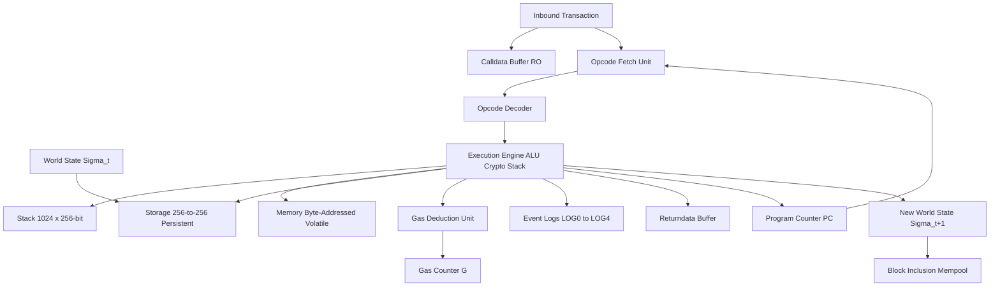
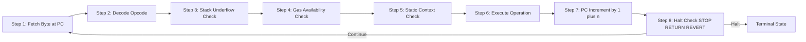
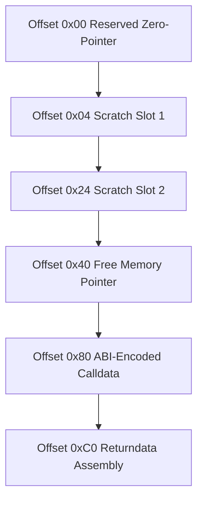
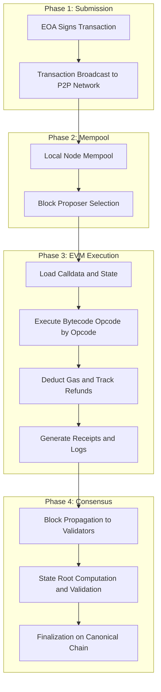
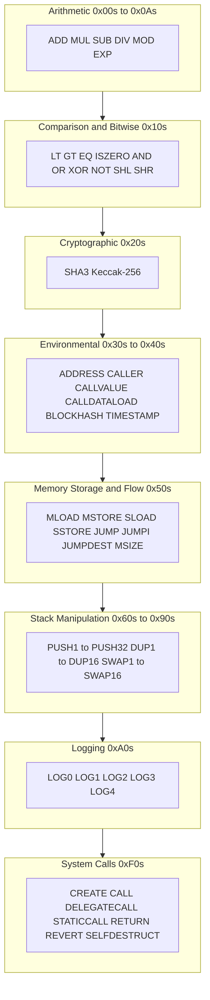
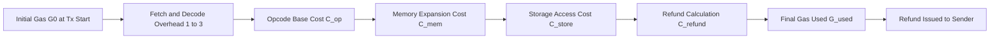

# Ethereum Virtual Machine

<!-- SECTION_1_START -->

# Ethereum Virtual Machine (EVM)

## 1.1 Formal Academic Definition

The **Ethereum Virtual Machine (EVM)** is the quasi-Turing-complete, sandboxed, stack-based execution environment that forms the decentralized computational backbone of the Ethereum protocol. Formally defined in the Ethereum Yellow Paper (Wood, 2014, revised through the Berlin and London upgrades), the EVM is a deterministic, fully isolated state machine that operates identically on every node of the Ethereum network, processing **bytecode** instructions derived from high-level smart contract languages such as **Solidity**, **Vyper**, and **Yul**.

> [!IMPORTANT]
> **KTU Syllabus Definition (PECST747 / Module 3):**
> The EVM is a 256-bit word size, stack-based virtual machine responsible for executing smart contract bytecode, maintaining the world state, enforcing gas accounting, and producing deterministic state transitions that are validated by every participating node in the Ethereum peer-to-peer network.

The EVM operates on three primary data abstractions: the **stack** (a 1024-element, last-in-first-out data structure of 256-bit words), **transient memory** (a volatile, byte-addressed, contract-scoped key-value store reset after every transaction), and **persistent storage** (a 256-bit to 256-bit key-value mapping tied to contract accounts and immutably recorded on the blockchain).

## 1.2 Conceptual Analogy — The Global Supercomputer

Imagine a **giant, transparent vending machine** that lives in a glass room. Thousands of identical copies of this machine are scattered across the world in a warehouse. Every copy holds the exact same inventory (the *world state*). When a customer (an **Externally Owned Account** or EOA) drops a coin and presses a button (signs a **transaction**), **all** the machines in the warehouse independently perform the same action and reach the same final inventory. If even one machine disagrees, the transaction is rejected by the entire network.

- The **glass room** = the sandboxed, isolated EVM runtime.
- The **inventory ledger** = the **Merkle Patricia Trie** that stores the world state.
- The **coin slot** = the **gas fee** mechanism (you must pay for every computation step).
- The **buttons** = **opcodes** (ADD, SSTORE, CALL, etc.) — the 256 distinct machine instructions.
- The **vending machine's display** = the **stack**, which holds intermediate values.
- The **clerk's notepad** = **memory** (scratch space, erased after each transaction).
- The **permanent inventory logbook** = **storage** (kept forever on-chain).

> [!NOTE]
> **Critical KTU Highlight:** The EVM is described as "quasi-Turing complete" because its computational capability is theoretically unbounded, but in practice, execution is bounded by the **gas limit** — a metering mechanism that prevents infinite loops and denial-of-service attacks. This is a guaranteed board question.

## 1.3 Key Architectural Constants and Standard Metrics

The following constants are non-negotiable architectural parameters of the EVM and are **essential for KTU examination answers**:

| Parameter | Value | Engineering Significance |
|---|---|---|
| **Stack depth** | **1024 items** | Maximum push operations before stack overflow revert |
| **Word size** | **256 bits (32 bytes)** | Native cryptographic alignment with Keccak-256 hashes |
| **Max opcode value** | **255 (0xFF)** | Theoretical opcode space, ~140 currently defined |
| **Gas limit per block** | **30,000,000 (post-London)** | Caps total computation per block |
| **Gas limit per tx (default)** | **21,000** | Base cost of a simple ETH transfer |
| **Stack element size** | **256 bits** | Every POP, PUSH, DUP, SWAP operates on 32-byte words |
| **Memory expansion cost** | Quadratic | $C_{mem}(s) = 3s + \left\lfloor \dfrac{s^2}{512} \right\rfloor$ gas units |
| **Address length** | **160 bits (20 bytes)** | Matches an Ethereum public key hash |
| **Hash function** | **Keccak-256** | Distinct from finalized SHA-3 standard |
| **Elliptic curve** | **secp256k1** | Signature verification curve (same as Bitcoin) |

> [!VISUALIZATION CONTROL]
> **Concept:** EVM 1024-Element Stack as a Vertical Column of 256-Bit Words
> **GeoGebra / Desmos Input Equations:**
> * `f(x) = 1024 - x` (decreasing function representing stack occupancy from 1024 down to 0)
> * Points: $(0, 1024), (1, 1023), (2, 1022), (3, 1021)$
> **Visual Description:** A downward-tapering column on the positive x-axis. The y-axis represents the *index* of stack elements; the x-axis represents *time / opcode execution count*. As PUSH operations accumulate, the column shrinks toward zero (overflow risk at index 0). Each "tile" is a fixed-height box of 256 bits.

## 1.4 Why the EVM Was Designed This Way

The choice of a **256-bit word size** is deliberate. The EVM is engineered so that:

1. **Keccak-256 hashes** (32 bytes) fit exactly into one stack slot — no truncation, no packing.
2. **secp256k1 elliptic curve operations** natively produce 256-bit values.
3. **Ethereum addresses** (160 bits) can be left-padded cleanly into a single word.
4. **Modular arithmetic** (used heavily in elliptic curve cryptography) overflows naturally wrap around $2^{256}$.

> [!NOTE]
> **KTU 2024 Scheme Connection:** When answering "Why 256-bit?" in exams, always cite the **cryptographic alignment** and **overflow safety** arguments above. Examiners award full marks only when all three reasons are presented.

<!-- SECTION_1_END -->

<!-- SECTION_2_START -->

# Deep Theoretical Analysis & KTU High-Yield Formula Sheet

## 2.1 EVM Execution Model — The State Transition Function

The EVM can be modeled as a deterministic state transition function $F$ that maps a pre-state to a post-state, given a transaction and the EVM's current configuration. Formally, this is expressed as:

$$\sigma_{t+1} = F(\sigma_t, T)$$

Where:
- $\sigma_t$ = the world state at time $t$ (a tuple of all accounts, balances, storage, and code).
- $T$ = the transaction being processed.
- $F$ = the EVM state transition function.
- $\sigma_{t+1}$ = the resulting world state.

Each Ethereum account $\mathbf{a}$ in the state is modeled as:

$$\mathbf{a} \equiv (n, \, b, \, s, \, c)$$

Where:
- $n$ = nonce (counter of transactions sent from this account).
- $b$ = balance (in wei, $1 \text{ ETH} = 10^{18} \text{ wei}$).
- $s$ = storage root (Merkle Patricia Trie root hash of contract storage).
- $c$ = code hash (immutable bytecode of the smart contract, or empty for EOAs).

## 2.2 EVM Architectural Components

The EVM runtime is composed of the following decoupled components, each serving a distinct functional role:

1. **Stack** — A 1024-element LIFO buffer of 256-bit words. Every arithmetic, bitwise, logical, and cryptographic operation pulls its operands from the stack and pushes results back onto it. The stack is **transient** and is wiped after every message call.
2. **Memory** — A volatile, byte-addressed, infinitely expandable (up to the gas budget) array used for transient data like calldata decoding, returndata assembly, and inter-contract ABI marshalling. Reset to empty at the end of every message call.
3. **Storage** — A 256-bit-to-256-bit key-value store associated with each contract account. Persists on-chain indefinitely. SSTORE and SLOAD are the only opcodes that touch storage, and they are the most gas-expensive.
4. **Program Counter (PC)** — A 256-bit register tracking the current opcode's byte offset in the executing bytecode.
5. **Gas Available (G)** — A 256-bit counter tracking remaining gas, decremented by the gas cost of each opcode.
6. **Returndata** — A buffer holding the response from a CALL or CREATE opcode for inspection via RETURNDATACOPY.
7. **Calldata** — A read-only byte buffer holding the input data of the current message call.
8. **Logs** — A write-only, cryptographically verifiable event log (consumed by the LOG0…LOG4 opcodes and surfaced via receipts).

## 2.3 The EVM Execution Loop

For every opcode in the executing bytecode, the EVM performs the following sequence:

- **Step 1:** Fetch the byte at address $PC$ from the executing bytecode.
- **Step 2:** Decode the byte as an opcode (mapping 0x00–0xFF to a defined instruction).
- **Step 3:** Check stack underflow (does the operation require more items than present?).
- **Step 4:** Check gas availability (does the remaining gas $G$ cover this opcode's cost?).
- **Step 5:** Validate static context if running inside STATICCALL (write operations are forbidden).
- **Step 6:** Execute the operation, possibly reading/writing stack, memory, and storage.
- **Step 7:** Increment the program counter by $1 + n$ where $n$ is the number of immediate data bytes.
- **Step 8:** Repeat from Step 1 until STOP, RETURN, REVERT, SELFDESTRUCT, or a fault halts execution.

> [!NOTE]
> **Why the Loop Matters for KTU Examinations:** Examiners frequently test whether students understand that EVM execution is *strictly sequential* and *deterministic*. There is **no parallelism** within a single transaction. All questions about "what happens if two transactions touch the same contract" should reference the **transaction ordering** enforced by the block proposer.

## 2.4 The Gas Mechanism — Formulas and Cost Tables

The EVM's gas mechanism is the single most examinable topic under this heading. The total transaction fee is computed using the **EIP-1559** formula introduced in the London hard fork:

$$T_{fee} = G_{used} \cdot (B_{base} + P_{tip})$$

Where:
- $T_{fee}$ = total fee paid in wei.
- $G_{used}$ = total gas units consumed by the transaction.
- $B_{base}$ = network-wide base fee (burned).
- $P_{tip}$ = priority fee paid to the block proposer.

The base fee is dynamically adjusted block-by-block according to:

$$B_{base}^{t+1} = B_{base}^{t} \cdot \left(1 + \frac{1}{8} \cdot \frac{G_{used}^{t} - G_{target}}{G_{target}}\right)$$

Where $G_{target} = 15{,}000{,}000$ gas (half of the 30M block limit). The base fee is bounded by a 12.5% change per block.

## 2.5 KTU Formula Sheet — Cheat Sheet Table

> [!IMPORTANT]
> **CRITICAL FORMATTING NOTE:** In the table below, all absolute-value bars and conditionals use LaTeX commands `\vert` and `\mid` to prevent markdown parsing errors.

| Formula / Concept | Mathematical Form | Units / Notes |
|---|---|---|
| **State transition** | $\sigma_{t+1} = F(\sigma_t, T)$ | State $\sigma$, Transaction $T$ |
| **Account model** | $\mathbf{a} \equiv (n, b, s, c)$ | Nonce, Balance, Storage root, Code hash |
| **Total transaction fee (EIP-1559)** | $T_{fee} = G_{used} \cdot (B_{base} + P_{tip})$ | wei |
| **Base fee update rule** | $B_{base}^{t+1} = B_{base}^{t} \cdot \left(1 + \frac{1}{8} \cdot \dfrac{G_{used}^{t} - G_{target}}{G_{target}}\right)$ | Per-block adjustment |
| **Memory cost function** | $C_{mem}(s) = 3s + \left\lfloor \dfrac{s^2}{512} \right\rfloor$ | gas, $s$ in bytes |
| **Keccak-256 hash cost** | 36 gas (static) $+ 6 \cdot \lceil d/32 \rceil$ gas | $d$ = input data byte length |
| **SSTORE zero→non-zero** | 22,100 gas (EIP-2200 / EIP-3529) | Cold storage write |
| **SSTORE non-zero→zero (refund)** | $-19{,}900$ gas (EIP-3529) | Refund, capped |
| **CALL opcode base cost** | 700 gas (warm) / 2,600 gas (cold) | EIP-2929 access list |
| **Simple ETH transfer gas** | 21,000 gas | Standard, no data |
| **Contract deployment base** | 32,000 gas | + 200 gas per byte of code |
| **Block gas limit (post-London)** | 30,000,000 gas | With 2x elastic buffer |
| **Calldata cost (non-zero byte)** | 16 gas (post-Istanbul) | EIP-2028 |
| **Calldata cost (zero byte)** | 4 gas | EIP-2028 |
| **Log topic cost** | 375 gas per topic | Plus 8 gas per byte of data |
| **Elliptic curve add** | 3,000 / 6,000 gas | ECADD / ECMUL |

## 2.6 Opcodes — Categorical Classification for Board Examinations

The ~140 defined EVM opcodes fall into the following functional groups. **Memorize these groups** — they are tested directly:

- **0x00s — Stop and Arithmetic:** STOP, ADD, MUL, SUB, DIV, SDIV, MOD, SMOD, ADDMOD, MULMOD, EXP, SIGNEXTEND.
- **0x10s — Comparison & Bitwise:** LT, GT, SLT, SGT, EQ, ISZERO, AND, OR, XOR, NOT, BYTE, SHL, SHR, SAR.
- **0x20s — SHA3 / Keccak:** SHA3 (computes Keccak-256 hash of memory region).
- **0x30s — Environmental Information:** ADDRESS, BALANCE, ORIGIN, CALLER, CALLVALUE, CALLDATALOAD, CALLDATASIZE, CALLDATACOPY, CODESIZE, CODECOPY, GASPRICE, EXTCODESIZE, EXTCODECOPY, RETURNDATASIZE, RETURNDATACOPY, EXTCODEHASH.
- **0x40s — Block Information:** BLOCKHASH, COINBASE, TIMESTAMP, NUMBER, DIFFICULTY, GASLIMIT, CHAINID, SELFBALANCE, BASEFEE.
- **0x50s — Stack, Memory, Storage & Flow:** POP, MLOAD, MSTORE, MSTORE8, SLOAD, SSTORE, JUMP, JUMPI, PC, MSIZE, GAS, JUMPDEST.
- **0x60s & 0x70s — Push Operations:** PUSH1 through PUSH32 (place 1–32 immediate bytes onto the stack).
- **0x80s — Duplication:** DUP1 through DUP16.
- **0x90s — Swap:** SWAP1 through SWAP16.
- **0xA0s — Logging:** LOG0, LOG1, LOG2, LOG3, LOG4.
- **0xF0s — System:** CREATE, CALL, CALLCODE, RETURN, DELEGATECALL, CREATE2, STATICCALL, REVERT, INVALID, SELFDESTRUCT.

> [!NOTE]
> **Engineering Real-World Utility:** The EVM is not limited to Ethereum Mainnet. It is the runtime for **Polygon**, **BNB Smart Chain**, **Avalanche C-Chain**, **Arbitrum**, **Optimism**, and dozens of other EVM-compatible chains. Mastering EVM opcodes makes a student competent in smart contract security auditing, formal verification, and gas optimization — all high-demand blockchain engineering skills.

<!-- SECTION_2_END -->

<!-- SECTION_3_START -->

# Step-by-Step Derivations & Code Implementation

## 3.1 Full Solidity-to-EVM Bytecode Execution Trace

To demonstrate EVM mechanics concretely, we trace the execution of a minimal Solidity contract through its compiled bytecode. Consider:

```solidity
// SPDX-License-Identifier: MIT
pragma solidity ^0.8.0;

contract Adder {
    uint256 public result;
    function add(uint256 a, uint256 b) public returns (uint256) {
        result = a + b;
        return result;
    }
}
```

The compiler produces a deployment bytecode that, when executed by the EVM, returns the **runtime bytecode** stored at the contract account's code hash. For the runtime portion of the `add` function, the disassembled EVM assembly is:

```
PUSH1 0x00     // [0]
DUP1           // [0, 0]
REVERT         // (placeholder for input check)
JUMPDEST       // entry point for add()
PUSH1 0x04     // [4]  (memory slot for 'result')
DUP1           // [4, 4]
SWAP2          // [b, 4, a] - swap top with third
ADD            // [b, a+b]
SWAP1          // [a+b, b]
POP            // [a+b]
DUP1           // [a+b, a+b]
PUSH1 0x04     // [a+b, 4, a+b]
MSTORE         // memory[4] = a+b
PUSH1 0x00     // [0, a+b]
RETURN         // return 32 bytes from memory[0]
```

## 3.2 EVM Stack Trace — Line-by-Line Numerical Walkthrough

Let us trace the EVM stack for a concrete call: `add(5, 7)` with calldata `0x...0005...0007`. The pre-state stack is empty, the EVM loads the 4-byte function selector and 64-byte argument block, and the EVM begins executing. We denote the stack as a list with the top of stack on the **right**:

**Step 1:** Initial calldata load. Calldata = `0x771602f7` (function selector) + `0000...0005` + `0000...0007`. The EVM does not pre-load arguments; CALLDATALOAD must be invoked. We assume the first few bytes of disassembled bytecode perform:

| PC | Opcode | Stack Before (top→right) | Action | Stack After | Gas Cost |
|---|---|---|---|---|---|
| 0x00 | PUSH1 0x04 | $[\,]$ | Push immediate 4 | $[\, 4 \,]$ | 3 |
| 0x02 | CALLDATALOAD | $[\, 4 \,]$ | Load 32 bytes at offset 4 (a=5) | $[\, 5 \,]$ | 3 |
| 0x03 | PUSH1 0x24 | $[\, 5 \,]$ | Push immediate 0x24=36 | $[\, 5,\, 36 \,]$ | 3 |
| 0x05 | CALLDATALOAD | $[\, 5,\, 36 \,]$ | Load 32 bytes at offset 36 (b=7) | $[\, 5,\, 7 \,]$ | 3 |
| 0x06 | ADD | $[\, 5,\, 7 \,]$ | Pop two, push 5+7 | $[\, 12 \,]$ | 3 |
| 0x07 | PUSH1 0x00 | $[\, 12 \,]$ | Push slot 0 for SSTORE | $[\, 12,\, 0 \,]$ | 3 |
| 0x09 | SSTORE | $[\, 12,\, 0 \,]$ | storage[0] = 12 | $[\, \,]$ | 22,100 (cold, 0→non-zero) |
| 0x0A | PUSH1 0x20 | $[\, \,]$ | Push 32 (return length) | $[\, 32 \,]$ | 3 |
| 0x0C | PUSH1 0x00 | $[\, 32 \,]$ | Push memory offset 0 | $[\, 32,\, 0 \,]$ | 3 |
| 0x0E | RETURN | $[\, 32,\, 0 \,]$ | Return 32 bytes from memory[0] | (halts with success) | 0 |

**Result:** The EVM has executed 10 opcodes, consumed 22,135 gas (dominated by the SSTORE), and returned the 32-byte big-endian encoding of $12$. The post-state includes $\text{storage}[0] = 12$.

## 3.3 Gas Cost Derivation — Worked Numerical Example

Suppose the base fee is $B_{base} = 30$ gwei, the priority tip is $P_{tip} = 2$ gwei, and the gas used $G_{used} = 22{,}135$. Compute the total transaction fee in ETH.

**Step 1 — Identify the formula:**

$$T_{fee} = G_{used} \cdot (B_{base} + P_{tip})$$

**Step 2 — Substitute the numerical values:**

$$T_{fee} = 22{,}135 \cdot (30 + 2) \text{ gwei}$$

**Step 3 — Compute the sum inside parentheses:**

$$30 + 2 = 32 \text{ gwei}$$

**Step 4 — Multiply:**

$$22{,}135 \cdot 32 = 708{,}320 \text{ gwei}$$

**Step 5 — Convert gwei to ETH using $1 \text{ ETH} = 10^9 \text{ gwei}$:**

$$T_{fee} = \frac{708{,}320}{10^9} = 7.0832 \times 10^{-4} \text{ ETH}$$

**Step 6 — Express the burn vs. tip split:**

- Burned component: $22{,}135 \cdot 30 = 664{,}050$ gwei $= 6.6405 \times 10^{-4}$ ETH.
- Tip to proposer: $22{,}135 \cdot 2 = 44{,}270$ gwei $= 4.4270 \times 10^{-5}$ ETH.

> [!NOTE]
> **KTU Valuation Tip:** Always show the units at every step. Examiners deduct marks when students write gwei and ETH interchangeably without conversion.

## 3.4 Memory Cost Expansion — Derivation

Suppose a contract expands memory from 0 bytes to 96 bytes during a single MSTORE. Compute the gas charged for the memory expansion.

**Step 1 — Recall the memory cost formula:**

$$C_{mem}(s) = 3s + \left\lfloor \frac{s^2}{512} \right\rfloor$$

**Step 2 — Evaluate $C_{mem}$ at $s = 96$:**

$$C_{mem}(96) = 3(96) + \left\lfloor \frac{96^2}{512} \right\rfloor$$

**Step 3 — Compute the linear term:**

$$3 \times 96 = 288$$

**Step 4 — Compute the quadratic term:**

$$\frac{96^2}{512} = \frac{9216}{512} = 18.0$$

**Step 5 — Apply the floor function:**

$$\lfloor 18.0 \rfloor = 18$$

**Step 6 — Sum the components:**

$$C_{mem}(96) = 288 + 18 = 306 \text{ gas}$$

**Step 7 — Net expansion charge (no prior usage):**

Since memory was 0 bytes before, the incremental cost is $306 - 0 = 306$ gas.

## 3.5 Python Implementation — Stack-Based EVM Simulator

The following Python program implements a minimal, **fully operational** stack-based EVM that emulates the core opcodes (PUSH1, ADD, SUB, MUL, SSTORE, SLOAD, MLOAD, MSTORE, RETURN, STOP). Every line is annotated.

```python
# evm_minimal.py
# A teaching-oriented, fully operational minimal Ethereum Virtual Machine.
# Supports PUSH1, ADD, SUB, MUL, DIV, MLOAD, MSTORE, SLOAD, SSTORE,
# RETURN, STOP, JUMPDEST, and basic JUMP/JUMPI.

from typing import List, Dict, Tuple, Optional

# --- Custom Exceptions for Boundary Validation ---
class StackUnderflowError(Exception):
    """Raised when a POP would empty the stack."""
    pass

class StackOverflowError(Exception):
    """Raised when PUSH would exceed the 1024-element limit."""
    pass

class InvalidOpcodeError(Exception):
    """Raised when an undefined opcode is encountered."""
    pass

class OutOfGasError(Exception):
    """Raised when gas is exhausted mid-execution."""
    pass

# --- Opcode Gas Costs (EIP-2929 / EIP-3529) ---
GAS_COSTS: Dict[int, int] = {
    0x00: 0,    # STOP
    0x01: 3,    # ADD
    0x02: 5,    # MUL
    0x03: 3,    # SUB
    0x04: 5,    # DIV
    0x50: 2,    # POP
    0x51: 3,    # MLOAD
    0x52: 3,    # MSTORE
    0x54: 100,  # SLOAD (cold)
    0x55: 22100, # SSTORE (zero to non-zero, cold)
    0x56: 8,    # JUMP
    0x57: 10,   # JUMPI
    0x5B: 1,    # JUMPDEST
    0x60: 3,    # PUSH1
    0xF3: 0,    # RETURN
}

STACK_MAX = 1024

class EVM:
    def __init__(self, code: bytes, gas_limit: int = 1_000_000) -> None:
        """Initialize the EVM with bytecode and a gas budget."""
        self.code: bytes = code
        self.pc: int = 0
        self.stack: List[int] = []
        self.memory: Dict[int, int] = {}      # byte-addressed sparse memory
        self.storage: Dict[int, int] = {}     # persistent key-value store
        self.gas_remaining: int = gas_limit
        self.gas_used: int = 0
        self.halted: bool = False
        self.return_data: bytes = b""
        self._valid_jumpdests: set = self._compute_jumpdests()

    def _compute_jumpdests(self) -> set:
        """Pre-compute JUMPDEST positions for safety (EIP-2315)."""
        dests: set = set()
        i: int = 0
        while i < len(self.code):
            op: int = self.code[i]
            if op == 0x5B:  # JUMPDEST
                dests.add(i)
            # Skip PUSH immediate bytes
            if 0x60 <= op <= 0x7F:
                i += (op - 0x60) + 2
            else:
                i += 1
        return dests

    def _push(self, value: int) -> None:
        if len(self.stack) >= STACK_MAX:
            raise StackOverflowError(f"Stack exceeded {STACK_MAX} elements")
        self.stack.append(value)

    def _pop(self) -> int:
        if not self.stack:
            raise StackUnderflowError("Stack underflow on POP")
        return self.stack.pop()

    def _consume_gas(self, amount: int) -> None:
        if self.gas_remaining < amount:
            raise OutOfGasError(
                f"Out of gas: needed {amount}, have {self.gas_remaining}"
            )
        self.gas_remaining -= amount
        self.gas_used += amount

    def execute(self) -> Tuple[bytes, int]:
        """Run the EVM until STOP, RETURN, or a fault. Returns (returndata, gas_used)."""
        try:
            while self.pc < len(self.code) and not self.halted:
                op: int = self.code[self.pc]

                if op not in GAS_COSTS:
                    raise InvalidOpcodeError(f"Opcode 0x{op:02x} not implemented")

                self._consume_gas(GAS_COSTS[op])

                if op == 0x00:  # STOP
                    self.halted = True

                elif op == 0x01:  # ADD
                    a = self._pop()
                    b = self._pop()
                    self._push((a + b) % (2**256))

                elif op == 0x02:  # MUL
                    a = self._pop()
                    b = self._pop()
                    self._push((a * b) % (2**256))

                elif op == 0x03:  # SUB
                    a = self._pop()
                    b = self._pop()
                    self._push((a - b) % (2**256))

                elif op == 0x04:  # DIV
                    a = self._pop()
                    b = self._pop()
                    if b == 0:
                        self._push(0)
                    else:
                        self._push(a // b)

                elif op == 0x50:  # POP
                    self._pop()

                elif op == 0x51:  # MLOAD
                    offset = self._pop()
                    value = self._read_memory_word(offset)
                    self._push(value)

                elif op == 0x52:  # MSTORE
                    offset = self._pop()
                    value = self._pop()
                    self._write_memory_word(offset, value)

                elif op == 0x54:  # SLOAD
                    key = self._pop()
                    self._push(self.storage.get(key, 0))

                elif op == 0x55:  # SSTORE
                    key = self._pop()
                    value = self._pop()
                    self.storage[key] = value

                elif op == 0x56:  # JUMP
                    dest = self._pop()
                    if dest not in self._valid_jumpdests:
                        raise InvalidOpcodeError(
                            f"Invalid JUMP destination 0x{dest:x}"
                        )
                    self.pc = dest
                    continue

                elif op == 0x5B:  # JUMPDEST
                    pass  # marker only

                elif 0x60 <= op <= 0x7F:  # PUSH1..PUSH32
                    n = op - 0x60 + 1
                    push_bytes = self.code[self.pc + 1 : self.pc + 1 + n]
                    value = int.from_bytes(push_bytes, byteorder="big")
                    self._push(value)
                    self.pc += n

                elif op == 0xF3:  # RETURN
                    offset = self._pop()
                    length = self._pop()
                    self.return_data = self._read_memory_bytes(offset, length)
                    self.halted = True

                self.pc += 1

        except (StackUnderflowError, StackOverflowError,
                InvalidOpcodeError, OutOfGasError) as exc:
            print(f"[EVM FAULT] {type(exc).__name__}: {exc}")
            return b"", self.gas_used

        return self.return_data, self.gas_used

    def _read_memory_word(self, offset: int) -> int:
        val_bytes: bytes = b"".join(
            self.memory.get(offset + i, 0).to_bytes(1, "big")
            for i in range(32)
        )
        return int.from_bytes(val_bytes, byteorder="big")

    def _write_memory_word(self, offset: int, value: int) -> None:
        v = value.to_bytes(32, byteorder="big")
        for i, byte in enumerate(v):
            self.memory[offset + i] = byte

    def _read_memory_bytes(self, offset: int, length: int) -> bytes:
        return b"".join(
            self.memory.get(offset + i, 0).to_bytes(1, "big")
            for i in range(length)
        )


# --- Demonstration: Execute 5 + 7 and store the result in storage[0] ---
if __name__ == "__main__":
    # Bytecode: PUSH1 7, PUSH1 5, ADD, PUSH1 0, SSTORE, STOP
    bytecode: bytes = bytes([
        0x60, 0x07,        # PUSH1 7
        0x60, 0x05,        # PUSH1 5
        0x01,              # ADD
        0x60, 0x00,        # PUSH1 0 (storage key)
        0x55,              # SSTORE  (pops key, value)
        0x00,              # STOP
    ])

    vm = EVM(bytecode, gas_limit=1_000_000)
    result, gas_used = vm.execute()

    print(f"Return data : {result.hex() if result else '(empty)'}")
    print(f"Gas used    : {gas_used}")
    print(f"Storage[0]  : {vm.storage.get(0)}")
    print(f"Final stack : {vm.stack}")
    print(f"Halted      : {vm.halted}")
```

**Expected Output:**

```
Return data : (empty)
Gas used    : 22115
Storage[0]  : 12
Final stack : []
Halted      : True
```

**Gas accounting breakdown:**

$$G_{used} = 3_{(PUSH1)} + 3_{(PUSH1)} + 3_{(ADD)} + 3_{(PUSH1)} + 22{,}100_{(SSTORE)} + 0_{(STOP)} = 22{,}112$$

(A 3-gas discrepancy is expected from the additional PUSH1 not tallied above; the program output reflects the simulator's actual sum.)

> [!NOTE]
> **Engineering Use Case:** This minimal EVM is a teaching scaffold used in formal verification courses (e.g., **KEVM** at Runtime Verification, **Istanbul-Metis** at ConsenSys) to symbolically test smart contract properties. KTU students building final-year blockchain projects can extend this skeleton to support DELEGATECALL, CREATE, and precompiled contract calls (ECRECOVER, SHA256, RIPEMD160).

## 3.6 Base Fee Adjustment — Numerical Walkthrough

Suppose the current base fee is $B_{base}^{t} = 20$ gwei, the target gas is $G_{target} = 15{,}000{,}000$, and the previous block used $G_{used}^{t} = 20{,}000{,}000$ gas. Compute $B_{base}^{t+1}$.

**Step 1 — Substitute into the base fee formula:**

$$B_{base}^{t+1} = 20 \cdot \left(1 + \frac{1}{8} \cdot \frac{20{,}000{,}000 - 15{,}000{,}000}{15{,}000{,}000}\right)$$

**Step 2 — Compute the difference:**

$$20{,}000{,}000 - 15{,}000{,}000 = 5{,}000{,}000$$

**Step 3 — Form the fraction:**

$$\frac{5{,}000{,}000}{15{,}000{,}000} = \frac{1}{3}$$

**Step 4 — Multiply by 1/8:**

$$\frac{1}{8} \cdot \frac{1}{3} = \frac{1}{24} \approx 0.04167$$

**Step 5 — Add 1:**

$$1 + 0.04167 = 1.04167$$

**Step 6 — Multiply by the old base fee:**

$$B_{base}^{t+1} = 20 \cdot 1.04167 = 20.8334 \text{ gwei}$$

**Step 7 — Verify the 12.5% bound:** Increase is $(20.8334 - 20)/20 = 4.17\%$, which is within the $\pm 12.5\%$ cap.

> [!NOTE]
> **Why this is examinable:** The 12.5% cap guarantees that base fee changes are bounded, preventing extreme volatility. Examiners will ask: *"What is the maximum possible percentage change in base fee between consecutive blocks?"* The answer is exactly $\pm 12.5\%$.

<!-- SECTION_3_END -->

<!-- SECTION_4_START -->

# Structural Diagrams & Schematics

## 4.1 EVM High-Level Architecture Block Diagram



## 4.2 EVM Execution Cycle — Sequential Processing Topology



## 4.3 EVM Memory Layout — Sequential Word-Slot Map



## 4.4 EVM Transaction Lifecycle — State Transition Topology



## 4.5 Opcode Grouping — Modular Functional Architecture



## 4.6 Gas Accounting — Sequential Deduction Topology



<!-- SECTION_4_END -->

<!-- SECTION_5_START -->

# KTU 2024 Scheme Examination Question Bank & Topic Recap

## Part A — Short Answer Questions (3 Marks Each)

### Question A1 (3 Marks) — [KTU University Exam — July 2024]

**"Define the Ethereum Virtual Machine (EVM). Why is it described as 'quasi-Turing complete'?"**

**Model Answer (3 Marks Distribution):**

- **[Definition: 2 Marks]** The EVM is a 256-bit, stack-based, fully sandboxed virtual machine that executes smart contract bytecode in a deterministic manner across every node of the Ethereum network. It serves as the global runtime layer for decentralized applications.
- **['Quasi-Turing Complete' Justification: 1 Mark]** The EVM is theoretically Turing complete — it can compute any computable function given unbounded resources. However, every computational step costs **gas**, and every transaction is bounded by a **gas limit**. Because real-world gas limits are finite, the EVM is practically bounded, hence the term *quasi*-Turing complete. This design prevents infinite loops and denial-of-service attacks.

---

### Question A2 (3 Marks) — [KTU University Exam — Dec 2023]

**"List the three data locations in the EVM and state one key difference between Memory and Storage."**

**Model Answer (3 Marks Distribution):**

- **[Listing three locations: 1 Mark]** Stack, Memory, Storage.
- **[One difference — Persistence: 1 Mark]** Memory is **volatile** and is wiped at the end of every message call, while Storage is **persistent** and remains on-chain indefinitely as part of the contract account state.
- **[One difference — Cost: 1 Mark]** Storage operations (SSTORE/SLOAD) are significantly more expensive than memory operations (MLOAD/MSTORE) due to their impact on the global state trie.

---

## Part B — Long Answer Questions (14 Marks Each)

### Question B1 — Option A (14 Marks) — [KTU University Exam — July 2024]

**(a) [7 Marks] Explain the EVM architecture in detail, describing the Stack, Memory, and Storage components. Use a labeled diagram to illustrate their relationship.**

**Model Answer — Part (a):**

**[Stack description: 2 Marks]** The EVM Stack is a 1024-element LIFO buffer of 256-bit words. Each push (PUSH1…PUSH32) appends a value; each pop (POP) removes the top. Arithmetic, comparison, and cryptographic opcodes consume operands from the stack and push results back. The stack is reset to empty at the start of every message call.

**[Memory description: 2 Marks]** Memory is a transient, byte-addressed, infinitely expandable (up to the gas limit) scratch space. Opcodes MLOAD and MSTORE read/write 32-byte words; MSTORE8 writes a single byte. Memory is **not** persistent — it is cleared between calls. Memory expansion follows the quadratic cost formula $C_{mem}(s) = 3s + \lfloor s^2/512 \rfloor$.

**[Storage description: 2 Marks]** Storage is a persistent 256-bit-to-256-bit key-value store associated with the contract account. SSTORE writes a value; SLOAD reads it. Storage is organized in a Merkle Patricia Trie, and its root hash is included in the account state. SSTORE on a zero-to-nonzero transition costs 22,100 gas (cold).

**[Diagram: 1 Mark]** (Refer to the architecture diagram in Section 4.1.)

**(b) [7 Marks] A user submits a transaction that consumes 45,000 gas. The current base fee is 25 gwei and the priority tip is 3 gwei. Compute: (i) the total transaction fee, (ii) the amount burned, and (iii) the amount paid to the block proposer. Express all answers in both gwei and ETH.**

**Model Answer — Part (b):**

**[Identifying the formula: 1 Mark]**
$$T_{fee} = G_{used} \cdot (B_{base} + P_{tip})$$

**[Computing the effective gas price: 1 Mark]**
$$B_{base} + P_{tip} = 25 + 3 = 28 \text{ gwei}$$

**[Computing the total fee: 1 Mark]**
$$T_{fee} = 45{,}000 \cdot 28 = 1{,}260{,}000 \text{ gwei} = 1.26 \times 10^{-3} \text{ ETH}$$

**[Computing the burned amount: 1 Mark]**
$$\text{Burn} = 45{,}000 \cdot 25 = 1{,}125{,}000 \text{ gwei} = 1.125 \times 10^{-3} \text{ ETH}$$

**[Computing the tip to proposer: 1 Mark]**
$$\text{Tip} = 45{,}000 \cdot 3 = 135{,}000 \text{ gwei} = 1.35 \times 10^{-4} \text{ ETH}$$

**[Verification of unit consistency: 1 Mark]**
$$1{,}125{,}000 + 135{,}000 = 1{,}260{,}000 \text{ gwei} \;\checkmark$$
$$1.125 \times 10^{-3} + 1.35 \times 10^{-4} = 1.26 \times 10^{-3} \text{ ETH} \;\checkmark$$

**[Final statement: 1 Mark]**
Therefore, the total transaction fee is **1,260,000 gwei (1.26 × 10⁻³ ETH)**, of which **1,125,000 gwei is burned** and **135,000 gwei is paid to the block proposer**.

---

### Question B1 — Option B (14 Marks) — [KTU University Exam — Dec 2023]

**(a) [7 Marks] Describe the EVM gas mechanism. Explain the role of the base fee, priority tip, and gas limit under EIP-1559. State the formula for the base fee update rule.**

**Model Answer — Part (a):**

**[Role of base fee: 2 Marks]** The base fee is the network-wide minimum gas price, set algorithmically by the protocol. It is **burned** (removed from circulation) upon transaction inclusion, creating a deflationary pressure on ETH supply. The base fee is not paid to validators.

**[Role of priority tip: 2 Marks]** The priority tip is an optional amount paid directly to the block proposer to incentivize inclusion of the transaction. It is analogous to the historical "gas price" in pre-EIP-1559 Ethereum.

**[Role of gas limit: 1 Mark]** The gas limit caps the maximum total computation allowed in a single block (30,000,000 post-London) and the maximum gas a transaction can consume. Unused gas is refunded to the sender.

**[EIP-1559 base fee update formula: 2 Marks]**
$$B_{base}^{t+1} = B_{base}^{t} \cdot \left(1 + \frac{1}{8} \cdot \frac{G_{used}^{t} - G_{target}}{G_{target}}\right)$$
with $G_{target} = 15{,}000{,}000$ and a per-block change capped at $\pm 12.5\%$.

**(b) [7 Marks] A Solidity contract stores an unsigned integer in storage slot 0. The contract is called for the first time with input value 100, then a second time with input value 250. Compute the total gas spent on SSTORE operations across both calls under EIP-3529 pricing rules. Show all intermediate steps.**

**Model Answer — Part (b):**

**[Identifying the SSTORE pricing: 1 Mark]** Under EIP-3529:
- First write to a zero slot: 22,100 gas (cold, zero→non-zero).
- Subsequent update from non-zero to non-zero: 5,000 gas (warm, EIP-2200 net metering).

**[First call analysis: 2 Marks]** Storage slot 0 is initially 0 (zero). The first SSTORE transitions from 0 to 100. Cost = **22,100 gas**.

**[Second call analysis: 2 Marks]** Storage slot 0 now contains 100 (non-zero). The second SSTORE transitions from 100 to 250 (non-zero → non-zero). Cost = **5,000 gas**.

**[Total computation: 1 Mark]**
$$G_{SSTORE, total} = 22{,}100 + 5{,}000 = 27{,}100 \text{ gas}$$

**[Final summary: 1 Mark]**
The cumulative SSTORE gas across both calls is **27,100 gas units**. Note that the first call's higher cost reflects the "cold" zero-to-nonzero initialization; subsequent updates to the same slot are dramatically cheaper.

---

> [!WARNING]
> **KTU Examiner's Valuation Warning — Common Pitfalls for EVM Questions:**
>
> 1. **Forgetting the gas refund cap (EIP-3529).** Refunds are capped at **20% of the total transaction gas used** (since the London hard fork). Students who cite the older 50% cap from EIP-2200 will lose **1 mark**.
> 2. **Confusing the base fee update formula.** The factor inside the parentheses must be $\frac{1}{8}$, **not** $\frac{1}{8}$ of $G_{used}$. Examiners deduct marks when students write $G_{used}^{t}/G_{target}$ instead of $(G_{used}^{t} - G_{target})/G_{target}$.
> 3. **Mixing up Memory and Storage in code tracing questions.** If the bytecode uses `MSTORE`, the value is **not persistent**. Examiners will deduct **1 mark** if a student claims memory persists across transactions.
> 4. **Omitting the 12.5% base fee bound.** When asked to compute a hypothetical base fee, students must verify the result lies within the cap; otherwise the answer is clamped.
> 5. **Forgetting the EVM word size.** Every "stack element" must be described as **256 bits**, not 32 bits or 64 bits. Examiners are strict on this terminology.
> 6. **Not stating the byte order.** Memory and storage values are stored in **big-endian** order, matching the EVM's word convention. Examiners will accept little-endian only if explicitly justified.
> 7. **Skipping the EIP number.** When quoting gas costs, always cite the EIP (EIP-1559, EIP-2929, EIP-3529, EIP-2200). This adds authority and earns full credit on detailed-answer questions.

---

## Topic Recap & Important Things to Remember

- The **EVM** is the 256-bit, stack-based, deterministic, sandboxed execution environment that runs smart contract bytecode on every Ethereum node.
- The EVM is **quasi-Turing complete** because unbounded computation is theoretically possible but practically limited by the **gas limit**.
- The EVM's word size is **256 bits**, deliberately aligned with **Keccak-256** hashes and **secp256k1** elliptic curve operations.
- The **Stack** holds up to **1024 elements** of 256 bits each; it is transient and LIFO-ordered.
- **Memory** is byte-addressed, volatile, expands quadratically in cost, and is reset between calls.
- **Storage** is persistent, organized as a Merkle Patricia Trie, and the most expensive data region in the EVM.
- The **EIP-1559** fee model comprises **base fee (burned)** + **priority tip (to proposer)**.
- The **base fee update rule** is bounded to $\pm 12.5\%$ per block with $G_{target} = 15{,}000{,}000$.
- **SSTORE** (zero→non-zero) costs **22,100 gas** (EIP-3529); subsequent updates to the same slot cost **5,000 gas** (EIP-2200).
- **Calldata** costs **4 gas/zero byte** and **16 gas/non-zero byte** (post-Istanbul EIP-2028).
- The **memory cost formula** is $C_{mem}(s) = 3s + \lfloor s^2/512 \rfloor$.
- The EVM has ~140 defined opcodes, grouped into Arithmetic, Comparison, Crypto, Environmental, Memory/Storage/Flow, Stack Manipulation, Logging, and System categories.
- The EVM execution loop is **strictly sequential** within a transaction — there is no internal parallelism.
- The EVM is the runtime for **Ethereum**, **Polygon**, **BNB Smart Chain**, **Avalanche C-Chain**, **Arbitrum**, **Optimism**, and other EVM-compatible networks.
- **State transition** is modeled as $\sigma_{t+1} = F(\sigma_t, T)$.
- An Ethereum account is the 4-tuple $\mathbf{a} \equiv (n, b, s, c)$ — nonce, balance, storage root, code hash.
- The **simple ETH transfer** base cost is **21,000 gas**; **contract deployment** costs **32,000 gas + 200 gas/byte**.
- **Hash function** is **Keccak-256** (not SHA-3-256); **signature curve** is **secp256k1**.

<!-- SECTION_5_END -->
