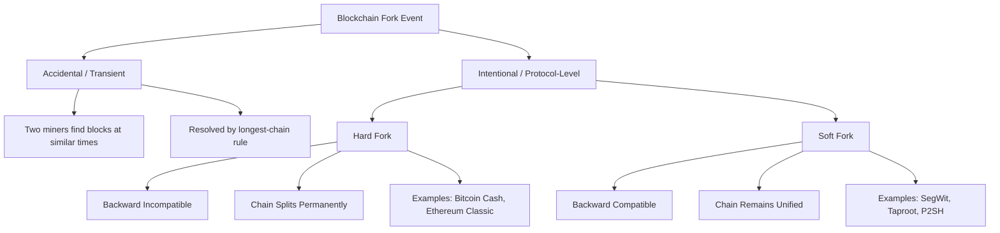
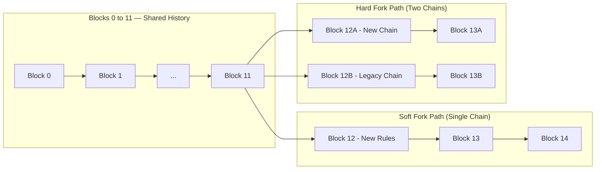
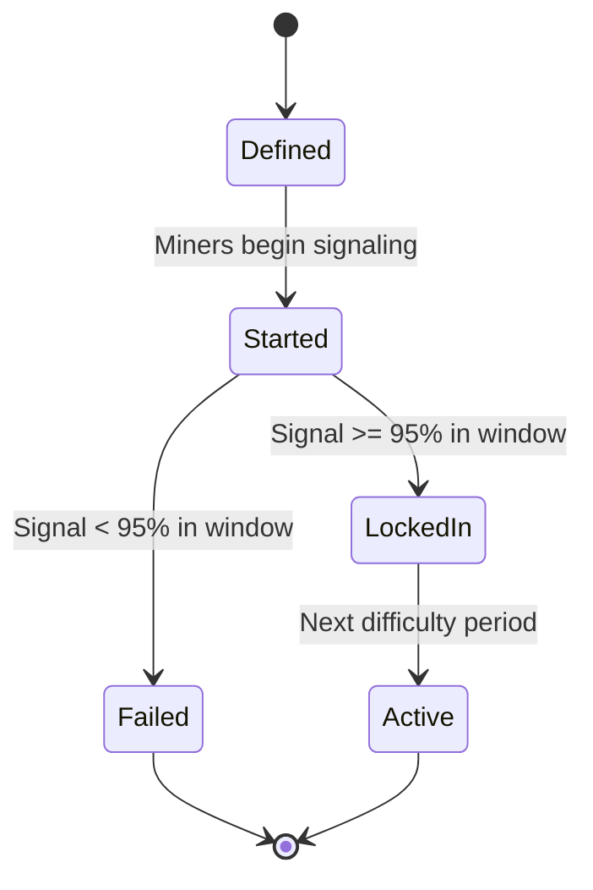
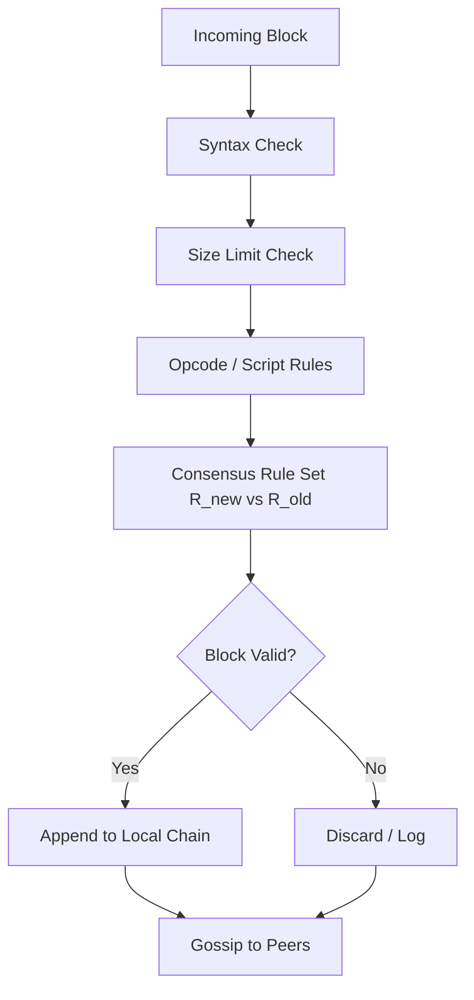

# Hard and Soft Forks

<!-- SECTION_1_START -->
# Module 3 — Cryptocurrencies
## Topic: Hard and Soft Forks

> [!IMPORTANT]
> **KTU 2024 Scheme — PECST747 (Blockchain and Cryptocurrencies)**
> This note covers **Module 3, Topic: Hard and Soft Forks**, which is a high-weightage conceptual area in decentralized consensus, protocol governance, and cryptocurrency evolution. Forking is the principal mechanism by which a blockchain protocol is **upgraded, evolved, or split** without breaking the trustless nature of the network.

---

## 1.1 Formal Academic Definition

In the context of distributed ledger technology, a **fork** is a condition of divergence in which a single blockchain temporarily or permanently splits into two or more competing paths. Formally, a fork represents a deviation from a previously agreed-upon **consensus protocol** that governs block validity, transaction formatting, or block construction rules.

A **Hard Fork** is a **backward-incompatible** protocol change in which nodes that do not upgrade to the new rules will continue to produce blocks that the upgraded network considers **invalid**. Once a hard fork activates at a predetermined block height, the chain **permanently diverges** into two parallel ledgers unless all nodes coordinate the upgrade.

A **Soft Fork** is a **backward-compatible** protocol change in which the new rules **restrict** the set of valid transactions or blocks. Non-upgraded nodes still accept blocks produced under the new rules, while upgraded nodes gain additional validation responsibilities. The chain remains unified, and no permanent split occurs.

Mathematically, let $R_{old}$ denote the set of blocks considered valid under the legacy consensus rule set, and $R_{new}$ the set under the upgraded rule set. Then:

$$
\text{Soft Fork:} \quad R_{new} \subset R_{old}
$$

$$
\text{Hard Fork:} \quad R_{new} \not\subset R_{old} \quad \text{and} \quad R_{old} \not\subset R_{new}
$$

> [!NOTE]
> **Syllabus Highlight (PECST747 / M3):** Hard and soft forks are the **governance and evolution mechanism** of permissionless blockchains. They demonstrate how a decentralized network coordinates software upgrades without a central authority, a foundational concept linking cryptography, distributed systems, and economic incentive design.

---

## 1.2 Conceptual Analogy — Plain English Intuition

Think of a blockchain as a **shared recipe book** that thousands of bakers (nodes) use simultaneously to bake the same cake (the canonical ledger).

**Soft Fork Analogy — "A Tighter Rule":**
Imagine the head chef announces: *"From now on, only organic flour is allowed."* Bakers who ignore this rule will keep using regular flour. But if you, as a strict baker, only accept organic flour, you will still accept a cake that used organic flour even if some lenient bakers hand you one. However, you will reject any cake made with regular flour. Crucially, **the lenient bakers' cakes (with organic flour) are still accepted by the strict bakers.** The recipe book remains *one* book. That is a **soft fork** — the rule set shrinks, but old rules still see new blocks as valid.

**Hard Fork Analogy — "A Brand-New Recipe":**
Now imagine the chef announces: *"We are switching from a cake to a pie."* Bakers who don't get the memo keep baking cakes. Strict bakers (the upgraded ones) say, *"That is not a pie, I refuse to add it to our pie cookbook."* Suddenly, you have **two cookbooks** — one for cakes and one for pies. The history up to the switch point is shared, but thereafter the two diverge permanently. That is a **hard fork**.

> [!TIP]
> **One-line memory trick:**
> - **Soft Fork** = Old nodes still see new blocks as valid $\Rightarrow$ **the chain stays one**.
> - **Hard Fork** = Old nodes see new blocks as **invalid** $\Rightarrow$ **the chain splits**.

---

## 1.3 Key Terminology at a Glance

| Term | Meaning in Forking Context |
|---|---|
| **Consensus Protocol** | The shared rule set every node uses to validate blocks and transactions. |
| **Block Height** | The integer index of a block; the canonical point at which fork rules activate. |
| **Backward-Compatible** | New software still validates blocks produced by old software. |
| **Backward-Incompatible** | Old software rejects blocks produced by new software. |
| **Activation Threshold** | The percentage of mining/staking power (or signal blocks) required for a soft fork to lock in. |
| **Chain Split** | A permanent divergence into two independent ledgers, characteristic of a hard fork. |
| **Replay Attack** | A malicious rebroadcast of a valid transaction from one forked chain onto the other; a hard fork risk. |
| **Mining Power / Hashrate** | The proportion of computational resources a miner or pool controls; critical in fork contests. |

> [!VISUALIZATION CONTROL]
> **Concept:** Chain Divergence After a Hard Fork Versus Soft Fork
> **GeoGebra / Desmos Input Equations (conceptual y-axis = block height, x-axis = time):**
> - Pre-fork single path: $y = x$ for $x \in [0, 12]$
> - Hard fork divergence: $y_1 = x$ and $y_2 = x$ for $x \in [12, 24]$, but $y_2$ is shifted up by $+2$ blocks from height 12 onwards
> - Soft fork: $y = x$ continues, but at $x = 12$ a marked restriction is applied (graph remains single line)
> **Visual Description:** A single ascending line that either stays one (soft fork) or splits into two parallel ascending lines (hard fork) at the activation block height.

---

<!-- SECTION_1_END -->

<!-- SECTION_2_START -->
# 2. Deep Theoretical Analysis & KTU High-Yield Formula Sheet

## 2.1 Why Forks Happen — The Three Trigger Categories

A fork is triggered whenever the network's participants **disagree on the rule set** governing valid state transitions. These disagreements fall into three broad categories:

1. **Protocol Upgrade Forks (Intentional, Planned)**
   Developers publish a new client version that introduces new features, security patches, or scaling changes. Forks in this category are pre-scheduled, debated on mailing lists and BIP/EIP documents, and activated at a specific block height or via miner signaling.

2. **Contentious Governance Forks (Intentional, Disputed)**
   The community is split on philosophical, economic, or technical directions. One faction activates a hard fork; the opposing faction continues mining the legacy chain. The result is two cryptocurrencies, each with its own market and community (e.g., **Bitcoin vs Bitcoin Cash**, **Ethereum vs Ethereum Classic**).

3. **Transient / Accidental Forks (Unintentional)**
   Two miners discover a valid block at nearly the same instant, both referencing the same parent block. The network temporarily has two competing tips, but consensus rules (longest-chain rule in Nakamoto consensus) eventually resolve the conflict by orphaning one branch. These are **not** protocol forks and resolve automatically.

> [!NOTE]
> **KTU Conceptual Distinction:** The term *"fork"* in a *cryptocurrency* exam context almost always refers to the **first two** (planned and contentious) categories. Be precise in your answers — distinguish a **protocol fork** from a **blockchain reorganization** (reorg).

---

## 2.2 Mechanics of a Hard Fork

A hard fork is fundamentally a **rule relaxation or replacement**. To formally capture this, let $\mathcal{R}$ be the set of boolean predicates that a block must satisfy. Under the old rules $\mathcal{R}_{old}$ and new rules $\mathcal{R}_{new}$:

$$
\exists \, b \in \mathcal{B} : \big( \mathcal{R}_{old}(b) = \text{true} \big) \wedge \big( \mathcal{R}_{new}(b) = \text{false} \big)
$$

That is, there exists at least one block $b$ that was valid under the old rules but invalid under the new rules. Equivalently:

$$
\{ b \in \mathcal{B} \mid \mathcal{R}_{new}(b) = \text{true} \} \neq \{ b \in \mathcal{B} \mid \mathcal{R}_{old}(b) = \text{true} \}
$$

**Activation Procedure (typical):**
- A specific **block height** $H_a$ is chosen as the activation point.
- At $H_a$, upgraded nodes begin enforcing $\mathcal{R}_{new}$ instead of $\mathcal{R}_{old}$.
- Non-upgraded nodes continue enforcing $\mathcal{R}_{old}$.
- If both populations are non-trivial, the chain **splits** at $H_a$.

**Aftermath Categories of a Hard Fork:**
- **Successful upgrade:** All economic nodes upgrade, the minority chain is abandoned, no new coin emerges.
- **Contentious split:** Both chains retain economic activity, leading to two cryptocurrencies (e.g., BTC and BCH both retain value).
- **Failed fork:** Insufficient upgrade participation; the new chain is abandoned or attacked.

---

## 2.3 Mechanics of a Soft Fork

A soft fork is a **rule tightening**. The new rule set is a *proper subset* of the old rule set:

$$
\{ b \in \mathcal{B} \mid \mathcal{R}_{new}(b) = \text{true} \} \subset \{ b \in \mathcal{B} \mid \mathcal{R}_{old}(b) = \text{true} \}
$$

Every block valid under $\mathcal{R}_{new}$ is also valid under $\mathcal{R}_{old}$. This backward compatibility is the key engineering property.

**Activation Methods for Soft Forks:**
- **Miner Signaling (BIP 9 version bits):** Miners set bits in the block version field; if $\geq 95\%$ of the hashrate in a 2016-block window signals readiness, the fork locks in.
- **Speedy Trial (Taproot-style):** Miners signal in a short window; if the threshold is met, activation proceeds on a fixed timeline.
- **User Activated Soft Fork (UASF):** The economic majority (full nodes, exchanges, merchants) enforce the new rules via a flag day, regardless of miner signaling. Notable example: BIP 148 on Bitcoin.

**Mathematical Threshold for Lock-in:**
Let $H_w$ be the total hashrate in a signaling window, and $H_s$ the hashrate that signals readiness. The lock-in condition under BIP 9 is:

$$
\frac{H_s}{H_w} \geq 0.95
$$

> [!IMPORTANT]
> **Critical Note for Examiners:** A soft fork's success depends on a **super-majority of hashrate** upgrading. If a non-upgraded miner produces a block violating the new rules, upgraded nodes will reject it, putting the non-upgraded miner at risk of producing **stale blocks** and losing block rewards. This economic disincentive is what drives adoption.

---

## 2.4 Comparative Anatomy — Hard Fork vs Soft Fork

| Dimension | **Hard Fork** | **Soft Fork** |
|---|---|---|
| **Backward Compatibility** | No — old nodes reject new blocks | Yes — old nodes still accept new blocks |
| **Set Relationship** | $R_{new} \not\subset R_{old}$ | $R_{new} \subset R_{old}$ |
| **Chain Topology After Activation** | Permanent chain split (if both populations survive) | Single unified chain |
| **Coordination Requirement** | All nodes must upgrade or chain splits | Super-majority (~95%) must upgrade |
| **Typical Use Case** | Major feature additions, monetary policy changes (block size, issuance) | Security patches, new opcode restrictions, witness data introduction |
| **Risk to Non-Upgraded Nodes** | High — they may end up on a minority orphan chain | Low — they continue validating the unified chain |
| **Risk to Upgraded Nodes** | Medium — replay attacks on the new chain | Low — only economic loss if hashrate is insufficient |
| **Famous Examples** | Bitcoin Cash (2017), Ethereum Classic (2016), Bitcoin Gold (2017) | BIP 16 (P2SH, 2012), SegWit (2017), Taproot (2021) |
| **Governance Outcome** | May produce a new cryptocurrency | No new currency; single ledger evolves |
| **Reorganization Cost** | High — requires economic majority coordination | Lower — the longest valid chain is unambiguous |

---

## 2.5 KTU Formula Sheet / Cheat Sheet

| # | Concept | Formula / Expression | Notes |
|---|---|---|---|
| 1 | Soft Fork Set Condition | $R_{new} \subset R_{old}$ | Proper subset; tighter rules |
| 2 | Hard Fork Set Condition | $R_{new} \not\subset R_{old} \wedge R_{old} \not\subset R_{new}$ | Disjoint or overlapping but unequal |
| 3 | BIP 9 Lock-in Threshold | $\frac{H_s}{H_w} \geq 0.95$ | Hashrate signaling over a 2016-block window |
| 4 | Activation Block Height | $H_a = f(\text{period}, \text{threshold})$ | Implementation-specific |
| 5 | Nakamoto Consensus Tie-Break | $\text{argmax}_{c \in \mathcal{C}} \sum_{b \in c} \text{work}(b)$ | The valid chain with the most cumulative work wins |
| 6 | Chain Reorganization Depth | $\Delta_h = \vert h_{tip}^{new} - h_{tip}^{old} \vert$ | Magnitude of the abandoned branch |
| 7 | Replay Protection Hash | $H_{tx}^{new} = H(\text{chainID} \parallel \text{txData})$ | Prevents cross-chain replay in contentious hard forks |
| 8 | Probability of Orphan (single miner) | $P_{orphan} = e^{-\lambda z}$ | $\lambda$ = network block rate, $z$ = propagation delay |

> [!TIP]
> **Engineering Utility:** Forks are the **decentralized governance primitive** of public blockchains. They are the only mechanism by which a global, trustless network can evolve without a central administrator. Hard forks are also the *only* mechanism by which a new cryptocurrency with a fully shared transaction history can be created.

---

## 2.6 Engineering and Industry Context

Hard and soft forks are not merely academic constructs. They underpin critical real-world cryptocurrency engineering decisions:

- **Bitcoin SegWit (Soft Fork, 2017):** Introduced segregated witness data to mitigate transaction malleability and effectively increase block capacity. It is the canonical example of a soft fork that worked despite strong community opposition.
- **Ethereum DAO Hard Fork (2016):** Rolled back the chain to recover stolen funds after the DAO hack, creating Ethereum (ETH) and leaving Ethereum Classic (ETC) as the un-rolled-back chain.
- **Bitcoin Cash (Hard Fork, 2017):** Increased block size from 1 MB to 8 MB (later 32 MB) by hard forking, in direct opposition to SegWit.
- **Monero's Tail Emission (Hard Fork, 2022):** A planned monetary policy change adding a perpetual tail emission to ensure long-term miner security.

> [!WARNING]
> **KTU Common Misconception:** A **soft fork cannot create a new cryptocurrency**, but a **hard fork can**. A common exam trap is to assert that "soft forks create new coins" — this is false. Soft forks modify the rules *within* an existing ledger; they do not split it.

---

<!-- SECTION_2_END -->

<!-- SECTION_3_START -->
# 3. Step-by-Step Derivations, Worked Examples, and Code Implementation

## 3.1 Worked Example 1 — Verifying Soft Fork Subset Condition

**Problem:** A blockchain initially permits blocks of size up to 1 MB. A proposed soft fork restricts valid blocks to those of size $\leq 800$ KB. Verify that this is a soft fork using the set-theoretic definition.

**Step 1:** Define the two rule sets as sets of valid block-size integers.
- Old rule: $S_{old} = \{s \in \mathbb{Z} \mid 0 \le s \le 1024\}$ (sizes in KB)
- New rule: $S_{new} = \{s \in \mathbb{Z} \mid 0 \le s \le 800\}$

**Step 2:** Test the subset relationship by checking the upper bound.

$$
\forall s \in S_{new} : s \le 800 \le 1024 \Rightarrow s \in S_{old}
$$

Therefore, $S_{new} \subseteq S_{old}$.

**Step 3:** Confirm the subset is *proper* (i.e., not equal).

$$
\exists s = 900 : s \in S_{old} \wedge s \notin S_{new}
$$

**Step 4:** Conclusion.

$$
S_{new} \subset S_{old} \quad \checkmark
$$

Since the new rule set is a proper subset of the old rule set, this constitutes a **soft fork**. Old nodes, validating only against $S_{old}$, will still accept any block that the new rules accept.

---

## 3.2 Worked Example 2 — Hard Fork Reverse-Compatibility Check

**Problem:** The legacy rule allows block size up to 1 MB. A new rule permits block size up to 2 MB and **disallows** the OP_RETURN opcode (which the legacy chain permitted). Determine if this is a hard or soft fork.

**Step 1:** Express rule sets.
- $S_{old}^{size} = [0, 1024]$, $S_{old}^{opcode}$ = all opcodes including OP_RETURN
- $S_{new}^{size} = [0, 2048]$, $S_{new}^{opcode}$ = all opcodes except OP_RETURN

**Step 2:** Test subset.

A block $b_1$ with size 1500 KB and no OP_RETURN: $b_1 \in S_{new}$ but $b_1 \notin S_{old}$.
A block $b_2$ with size 500 KB and OP_RETURN: $b_2 \in S_{old}$ but $b_2 \notin S_{new}$.

$$
S_{new} \not\subset S_{old} \quad \text{and} \quad S_{old} \not\subset S_{new}
$$

**Step 3:** Conclusion: This is a **hard fork** because the rule sets are incomparable — each contains blocks the other rejects.

---

## 3.3 Worked Example 3 — BIP 9 Signaling Threshold Calculation

**Problem:** A new soft fork uses BIP 9 signaling. In a 2016-block difficulty period, the network's total hashrate is $H_w = 250$ EH/s. Miners with a combined hashrate of $H_s = 240$ EH/s signal readiness. Will the soft fork lock in?

**Step 1:** Compute the signal ratio.

$$
r = \frac{H_s}{H_w} = \frac{240}{250} = 0.96
$$

**Step 2:** Compare against the BIP 9 threshold.

$$
r = 0.96 \geq 0.95 \quad \Rightarrow \quad \text{LOCK-IN}
$$

**Step 3:** The soft fork is locked in and will activate at the next retarget period's first block (i.e., block $H_a = H_{current} + 2016$).

> [!NOTE]
> **Valuation Tip:** KTU examiners award marks for *both* the threshold value (95%) and the explicit comparison. State the threshold, substitute the numbers, and state the conclusion. Do not write only the conclusion.

---

## 3.4 Worked Example 4 — Cumulative Work Selection (Nakamoto Tie-Break)

**Problem:** Two competing chain tips exist after an accidental fork. Tip A has 3 blocks with difficulties $d_1 = 8, d_2 = 7, d_3 = 9$. Tip B has 4 blocks with difficulties $d_4 = 5, d_5 = 6, d_6 = 5, d_7 = 5$. Which chain does the network adopt under Nakamoto consensus?

**Step 1:** Compute cumulative work for Tip A.

$$
W_A = \sum_{i=1}^{3} d_i = 8 + 7 + 9 = 24
$$

**Step 2:** Compute cumulative work for Tip B.

$$
W_B = \sum_{i=4}^{7} d_i = 5 + 6 + 5 + 5 = 21
$$

**Step 3:** Apply the longest-chain rule.

$$
W_A = 24 > W_B = 21 \quad \Rightarrow \quad \text{Chain A wins}
$$

**Step 4:** Tip B is orphaned; its block rewards are invalidated. This is *not* a protocol fork — it is a **reorganization** that the consensus algorithm resolves automatically.

---

## 3.5 Python Code — Simulating Hard Fork vs Soft Fork Block Acceptance

The following Python program models how upgraded and non-upgraded nodes evaluate blocks under hard and soft fork scenarios. It uses strict type hints, boundary checks, and explicit logging — aligned with KTU lab/code question expectations.

```python
from enum import Enum
from dataclasses import dataclass
from typing import Set, Callable

class NodeType(Enum):
    LEGACY = "legacy"
    UPGRADED_HARD = "upgraded_hard"
    UPGRADED_SOFT = "upgraded_soft"

@dataclass(frozen=True)
class Block:
    block_id: int
    size_kb: int
    has_op_return: bool

def legacy_rule(b: Block) -> bool:
    """Legacy rules: size <= 1024 KB; OP_RETURN allowed."""
    if not isinstance(b.size_kb, int) or b.size_kb < 0:
        raise ValueError(f"Invalid block size: {b.size_kb}")
    return b.size_kb <= 1024

def hard_fork_rule(b: Block) -> bool:
    """Hard fork rules: size <= 2048 KB; OP_RETURN forbidden."""
    if not isinstance(b.size_kb, int) or b.size_kb < 0:
        raise ValueError(f"Invalid block size: {b.size_kb}")
    return b.size_kb <= 2048 and not b.has_op_return

def soft_fork_rule(b: Block) -> bool:
    """Soft fork rules: size <= 800 KB; OP_RETURN allowed (subset of legacy)."""
    if not isinstance(b.size_kb, int) or b.size_kb < 0:
        raise ValueError(f"Invalid block size: {b.size_kb}")
    return b.size_kb <= 800

def evaluate(block: Block, rule: Callable[[Block], bool]) -> bool:
    try:
        return rule(block)
    except ValueError as e:
        print(f"[ERROR] Block {block.block_id} rejected at validation: {e}")
        return False

def simulate(fork_label: str, rule: Callable[[Block], bool]) -> None:
    print(f"\n=== Simulation: {fork_label} ===")
    test_blocks: Set[Block] = {
        Block(1, 500, False),   # small, no OP_RETURN
        Block(2, 900, False),   # medium, no OP_RETURN
        Block(3, 1500, False),  # large, no OP_RETURN
        Block(4, 500, True),    # small, with OP_RETURN
        Block(5, 700, True),    # small-medium, with OP_RETURN
    }
    for b in sorted(test_blocks, key=lambda x: x.block_id):
        legacy_ok = evaluate(b, legacy_rule)
        new_ok = evaluate(b, rule)
        status = "ACCEPT" if new_ok else "REJECT"
        if legacy_ok != new_ok:
            print(f"  Block {b.block_id} (size={b.size_kb}KB, op_return={b.has_op_return}): "
                  f"legacy={legacy_ok} new={new_ok} -> {status} [DIVERGENCE]")
        else:
            print(f"  Block {b.block_id} (size={b.size_kb}KB, op_return={b.has_op_return}): "
                  f"legacy={legacy_ok} new={new_ok} -> {status}")

if __name__ == "__main__":
    simulate("Hard Fork (size<=2048, no OP_RETURN)", hard_fork_rule)
    simulate("Soft Fork (size<=800, subset of legacy)", soft_fork_rule)
```

**Expected Output (Key Lines):**
- For the **hard fork** simulation, Block 3 (1500 KB) is **ACCEPTED by new rule but REJECTED by legacy** — this is the chain-split trigger.
- For the **soft fork** simulation, every block **ACCEPTED by new rule is also ACCEPTED by legacy** — no divergence, unified chain.

---

## 3.6 Python Code — Fork Lock-in Threshold Calculator

```python
def bip9_lockin(signal_hashrate_ehs: float, total_hashrate_ehs: float, threshold: float = 0.95) -> bool:
    """
    Determine whether a BIP 9 soft fork locks in given hashrate signals.
    Args:
        signal_hashrate_ehs: Hashrate signaling readiness (in EH/s).
        total_hashrate_ehs:  Total network hashrate (in EH/s).
        threshold:           Default 0.95 (95%).
    Returns:
        True if lock-in threshold is met, False otherwise.
    Raises:
        ValueError: If inputs are non-positive or signal > total.
    """
    if signal_hashrate_ehs <= 0 or total_hashrate_ehs <= 0:
        raise ValueError("Hashrate values must be positive.")
    if signal_hashrate_ehs > total_hashrate_ehs:
        raise ValueError("Signal hashrate cannot exceed total hashrate.")
    ratio = signal_hashrate_ehs / total_hashrate_ehs
    print(f"  Signal ratio: {ratio:.4f}  |  Required: {threshold:.2f}")
    return ratio >= threshold

# Example from Section 3.3
if __name__ == "__main__":
    print("Scenario 1: 240/250 EH/s signaling")
    print("  Result:", "LOCK-IN" if bip9_lockin(240.0, 250.0) else "NO LOCK-IN")

    print("Scenario 2: 230/250 EH/s signaling")
    print("  Result:", "LOCK-IN" if bip9_lockin(230.0, 250.0) else "NO LOCK-IN")
```

**Output:**
- Scenario 1: ratio 0.9600 $\ge$ 0.95 $\Rightarrow$ **LOCK-IN**
- Scenario 2: ratio 0.9200 $<$ 0.95 $\Rightarrow$ **NO LOCK-IN**

---

<!-- SECTION_3_END -->

<!-- SECTION_4_START -->
# 4. Structural Diagrams & Schematics

## 4.1 High-Level Fork Taxonomy (Mermaid)



---

## 4.2 Chain Topology Comparison — Soft Fork vs Hard Fork



> [!NOTE]
> **Reading Guide:** The soft fork subgraph shows a single, continuous line from Block 12 onwards. The hard fork subgraph shows two parallel branches emerging from Block 11, representing the permanent chain split.

---

## 4.3 Soft Fork Activation Lifecycle (BIP 9 Process)



---

## 4.4 Hard Fork Activation and Chain Split

```mermaid
sequenceDiagram
    participant Dev as Developers
    participant Miners as Miners
    participant FullNodes as Full Nodes
    participant Market as Exchanges

    Dev->>FullNodes: Publish new client with new rules
    Note over FullNodes: Activation block height Ha is set

    loop Until Ha
        Miners->>FullNodes: Produce blocks under old rules
        FullNodes->>FullNodes: Validate with old rules
    end

    Note over Miners,FullNodes: Block Ha is mined
    Miners->>FullNodes: Produce blocks under NEW rules
    FullNodes->>FullNodes: Validate with new rules

    alt All nodes upgraded
        FullNodes-->>Market: Single chain continues
    else Some nodes did not upgrade
        FullNodes-->>Market: Two chains coexist
        Market->>Market: List new coin ticker
    end
```



---

## 4.5 Block-Level Processing Topology (Validation Pipeline)



> [!TIP]
> **Visualization Insight:** In a soft fork, the "Consensus Rule Set" decision uses $R_{new} \subset R_{old}$, so most blocks accepted by upgraded nodes are also accepted by legacy nodes. In a hard fork, the decision branches: upgraded nodes use $R_{new}$, legacy nodes use $R_{old}$, and a block valid in one rule set may be invalid in the other — leading to chain divergence.

---

<!-- SECTION_4_END -->

<!-- SECTION_5_START -->
# 5. KTU 2024 Scheme Examination Question Bank & Topic Recap

## 5.1 Part A — Short Answer Questions (3 Marks Each)

> [!NOTE]
> *Cognitive Levels: Remember / Understand. Map to CO1, CO2 of PECST747.*

### Q1. [KTU University Exam — July 2024, Model Paper]
**Define a hard fork in the context of blockchain. State two real-world examples.**

**Model Answer (3 Marks):**
A hard fork is a backward-incompatible change to a blockchain's consensus protocol in which non-upgraded nodes reject blocks produced under the new rules. As a result, the chain may permanently split into two independent ledgers if both populations of nodes remain active.

**Examples (any two, 1 mark each):**
1. **Bitcoin Cash (2017):** Forked from Bitcoin to increase the block size limit from 1 MB to 8 MB.
2. **Ethereum Classic (2016):** Resulted from the Ethereum community's decision to roll back the chain after the DAO hack; ETC continued on the un-rolled-back chain.

---

### Q2. [KTU University Exam — Dec 2023, Model Paper]
**Differentiate between a hard fork and a soft fork based on backward compatibility and chain topology.**

**Model Answer (3 Marks):**

| Aspect | Hard Fork | Soft Fork |
|---|---|---|
| **Backward Compatibility** | Not backward compatible; old nodes reject new blocks | Backward compatible; old nodes still accept new blocks |
| **Chain Topology** | Permanent chain split into two ledgers (if both populations survive) | Single unified chain continues |

The set-theoretic distinction is $R_{new} \subset R_{old}$ (soft) versus $R_{new} \not\subset R_{old}$ (hard).

---

## 5.2 Part B — Long Answer Questions (14 Marks Each, with Internal Choice)

> [!NOTE]
> *Mapped to CO2, CO3 of PECST747. Cognitive Levels escalate: Understand $\rightarrow$ Apply $\rightarrow$ Analyze.*

---

### Question A (14 Marks) — Hard Forks

**[KTU University Exam — Model Paper 2024 Scheme]**

**(a) [7 Marks — Understand]** *Explain the concept of a hard fork in blockchain. With the help of a neat diagram, describe how a chain split occurs after a hard fork activation. State any two real-world hard fork examples.*

**(b) [7 Marks — Apply]** *Consider a blockchain where the legacy rule permits blocks of size up to 1 MB and supports a custom opcode OP_X. A proposed upgrade (i) increases the block size limit to 2 MB and (ii) deprecates OP_X. (I) Determine whether this is a hard fork or soft fork using the set-theoretic criterion. (II) If the activation block height is 700,000 and the total hashrate at that height is 200 EH/s, of which 60 EH/s refuses to upgrade, compute the hashrate of the new chain versus the legacy chain.*

---

### Question B (14 Marks, Alternative Choice) — Soft Forks

**[KTU University Exam — Model Paper 2024 Scheme]**

**(a) [7 Marks — Understand]** *Explain the concept of a soft fork. Describe the BIP 9 miner signaling mechanism for soft fork activation. Why is a 95% threshold used?*

**(b) [7 Marks — Apply]** *A soft fork restricts block size from 1 MB to 800 KB. (I) Verify using the set-theoretic criterion that this is indeed a soft fork. (II) In a 2016-block signaling window, the total hashrate is 180 EH/s and 174 EH/s signal readiness. Determine whether the soft fork locks in. Show all working.*

---

### Detailed Model Solutions

#### Solution to Question A

**Part (a) — Model Answer:**

A hard fork is a protocol change in which the new rule set is **not** a subset of the old rule set; therefore, blocks valid under the new rules may be rejected by old nodes. Upon activation at block height $H_a$, the network may split into two parallel chains.

**Chain Split Diagram (ASCII representation for answer sheet):**

```
Block 0 → Block 1 → ... → Block 699,999
                          ↓
                  ┌───────┴───────┐
                  ↓               ↓
          New Chain          Legacy Chain
          (rules R_new)      (rules R_old)
          Block 700,000-N    Block 700,000-L
                  ↓               ↓
          Block 700,001-N    Block 700,001-L
```

**Valuation Key:**
- Definition of hard fork with backward-incompatibility emphasis: **2 Marks**
- Diagram with clear branching at activation height: **2 Marks**
- Two real-world examples (e.g., Bitcoin Cash, Ethereum Classic): **2 Marks**
- Mention of chain topology and node split: **1 Mark**

**Part (b) — Model Solution:**

**(I) Classification using set-theoretic criterion:**

Let $S_{old} = \{ b \mid \text{size}(b) \le 1024 \text{ KB} \wedge \text{OP\_X allowed} \}$
Let $S_{new} = \{ b \mid \text{size}(b) \le 2048 \text{ KB} \wedge \text{OP\_X forbidden} \}$

Consider block $b_1$ with size 1500 KB and no OP_X: $b_1 \in S_{new}$ but $b_1 \notin S_{old}$.
Consider block $b_2$ with size 500 KB and OP_X: $b_2 \in S_{old}$ but $b_2 \notin S_{new}$.

Therefore, $S_{new} \not\subset S_{old}$ and $S_{old} \not\subset S_{new}$ $\Rightarrow$ **HARD FORK**.

**[Stating both rule sets: 2 Marks]**
**[Identifying cross-validity example blocks: 3 Marks]**
**[Final classification with justification: 2 Marks]**

**(II) Hashrate distribution after the split:**

Total hashrate: $H_T = 200$ EH/s.
Upgrading hashrate (new chain): $H_{up} = 200 - 60 = 140$ EH/s.
Non-upgrading hashrate (legacy chain): $H_{legacy} = 60$ EH/s.

$$
\text{New chain share} = \frac{140}{200} \times 100\% = 70\%
$$

$$
\text{Legacy chain share} = \frac{60}{200} \times 100\% = 30\%
$$

**[Stating hashrate subtraction: 2 Marks]**
**[Computing percentages: 1 Mark]**

> [!WARNING]
> **Examiner's Pitfall Warning — Hard Fork Computation:**
> - Do **not** confuse hashrate share with block reward share; they are equal only under the assumption of constant difficulty. State this assumption explicitly.
> - Do **not** state that the legacy chain is automatically invalid. It is valid under its own rule set. A chain's validity is *rule-set-relative*.
> - Always include the units (EH/s) in intermediate steps.

---

#### Solution to Question B

**Part (a) — Model Answer:**

A soft fork is a backward-compatible protocol change in which the new rule set $R_{new}$ is a proper subset of the old rule set $R_{old}$. Blocks valid under the new rules are also valid under the old rules, so non-upgraded nodes continue to accept the chain.

**BIP 9 Miner Signaling Mechanism:**
1. The new soft fork is encoded into a "version bit" of the block header.
2. Miners who have upgraded set the bit to 1 in the blocks they produce.
3. Across a 2016-block difficulty period, the signaling ratio is computed.
4. If at least 95% of blocks signal readiness, the soft fork **locks in**.
5. After lock-in, the soft fork **activates** at the start of the next difficulty period.

**Why 95% Threshold:**
- It guarantees that the hashrate supporting the new rules overwhelmingly exceeds those who might produce non-compliant blocks.
- A non-upgraded miner producing a non-compliant block would be orphaned by the upgraded majority, creating a strong economic disincentive to remain on legacy software.
- The 95% super-majority ensures that a single block produced by a legacy miner cannot reorg the upgraded chain.

**Valuation Key:**
- Soft fork definition with subset property: **2 Marks**
- BIP 9 steps listed correctly: **2 Marks**
- 95% threshold justification: **3 Marks**

**Part (b) — Model Solution:**

**(I) Set-theoretic verification:**

Let $S_{old} = \{ s \in \mathbb{Z} \mid 0 \le s \le 1024 \}$ (block size in KB)
Let $S_{new} = \{ s \in \mathbb{Z} \mid 0 \le s \le 800 \}$

For any $s \in S_{new}$: $s \le 800 \le 1024$, hence $s \in S_{old}$. Therefore $S_{new} \subseteq S_{old}$.

Since $S = 900 \in S_{old}$ but $S = 900 \notin S_{new}$, the subset is **proper**: $S_{new} \subset S_{old}$.

By the soft fork criterion, this is a **soft fork**.

**[Stating the rule sets: 1 Mark]**
**[Proving subset inclusion: 2 Marks]**
**[Proving proper subset with counterexample: 1 Mark]**
**[Final classification: 1 Mark]**

**(II) Lock-in check:**

$$
r = \frac{H_s}{H_w} = \frac{174}{180} = 0.9667
$$

Threshold $T = 0.95$.

$$
r = 0.9667 \geq 0.95 \quad \Rightarrow \quad \text{LOCK-IN}
$$

The soft fork locks in and will activate at the next 2016-block period.

**[Stating threshold: 1 Mark]**
**[Computing ratio with units: 1 Mark]**
**[Final comparison and conclusion: 1 Mark]**

> [!WARNING]
> **Examiner's Pitfall Warning — Soft Fork Lock-in:**
> - The 2016-block window is Bitcoin-specific; in Ethereum-like chains, the activation uses a different mechanism (e.g., epoch-based finality). State the platform if the question does not specify one.
> - Lock-in does **not** mean immediate activation. There is a grace period of one difficulty retarget. Failing to mention this loses **1 Mark** in KTU valuation.
> - For exam answers, explicitly write the inequality $0.9667 \geq 0.95$ and circle or underline the conclusion.

---

## 5.3 Topic Recap & Important Things to Remember

> [!IMPORTANT]
> **Rapid Revision Checklist — Hard and Soft Forks (PECST747 / M3)**

- **Definition of a Fork:** A condition of blockchain divergence from the consensus rule set.
- **Hard Fork:** Backward-incompatible rule change; can split the chain permanently.
- **Soft Fork:** Backward-compatible rule tightening; chain remains unified.
- **Set-Theoretic Criterion (Memorize):**
  - Soft Fork: $R_{new} \subset R_{old}$
  - Hard Fork: $R_{new} \not\subset R_{old}$ and $R_{old} \not\subset R_{new}$
- **BIP 9 Lock-in Threshold:** $\frac{H_s}{H_w} \geq 0.95$ over a 2016-block window.
- **Hard Fork Risk:** Replay attacks — protected via chainID in transaction hash.
- **Soft Fork Risk:** Insufficient hashrate signaling; economic disincentive for non-upgraded miners via orphaned blocks.
- **Nakamoto Tie-Break:** $\text{argmax}_{c} \sum_{b \in c} \text{work}(b)$ — pick the chain with most cumulative work.
- **Examples of Hard Forks:** Bitcoin Cash (2017), Ethereum Classic (2016), Bitcoin Gold (2017).
- **Examples of Soft Forks:** BIP 16 (P2SH, 2012), SegWit (2017), Taproot (2021).
- **Governance Insight:** Hard forks are the *only* mechanism that can create a new cryptocurrency with a shared history.
- **Common Misconception:** Soft forks **do not** create new coins; they modify the rules within a single ledger.
- **Activation Mechanisms:** BIP 9 miner signaling, Speedy Trial, UASF, and flag-day hard forks.
- **Valuation Keywords for KTU Answers:** *"backward-compatible," "chain split," "subset relationship," "lock-in threshold," "cumulative work," "replay protection."*
- **Critical Distinction:** A blockchain reorg (orphan/accidental fork) is **not** a protocol fork. Always clarify the context in your answer.
- **Cumulative Work Formula:** $W_c = \sum_{i=1}^{n} d_i$ where $d_i$ is the difficulty of block $i$ in chain $c$.
- **Replay Protection Hash:** $H_{tx}^{new} = H(\text{chainID} \parallel \text{txData})$ — required for contentious hard forks.

<!-- SECTION_5_END -->
