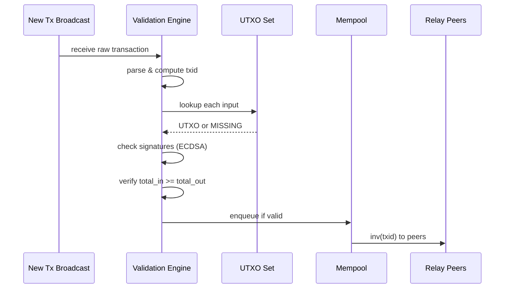
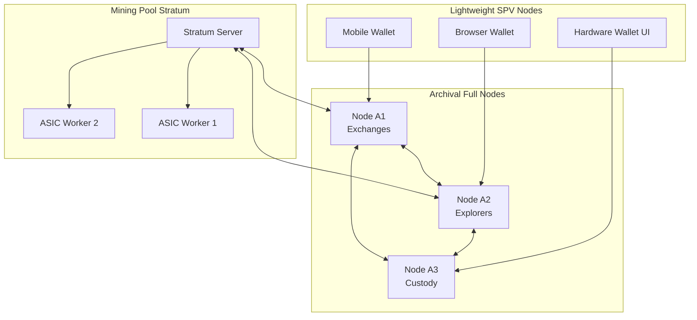
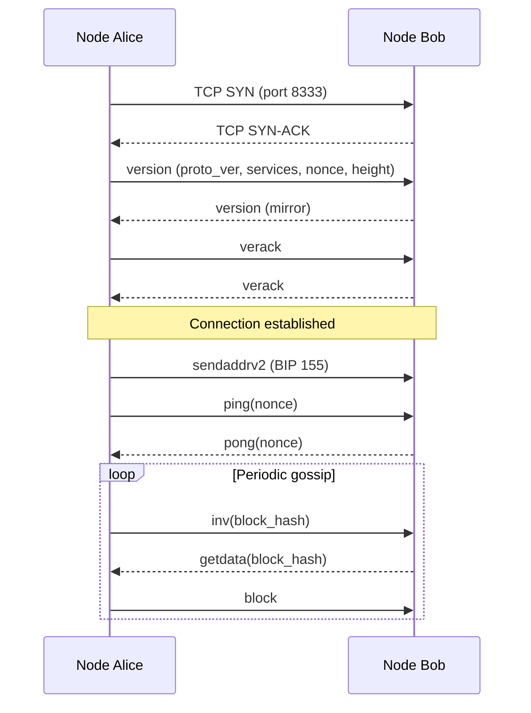
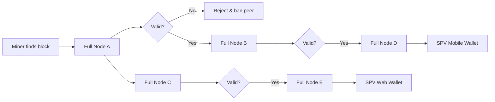
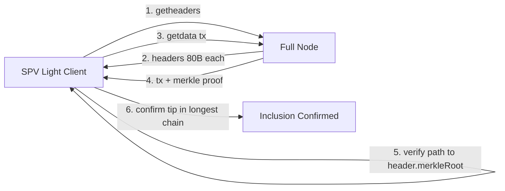
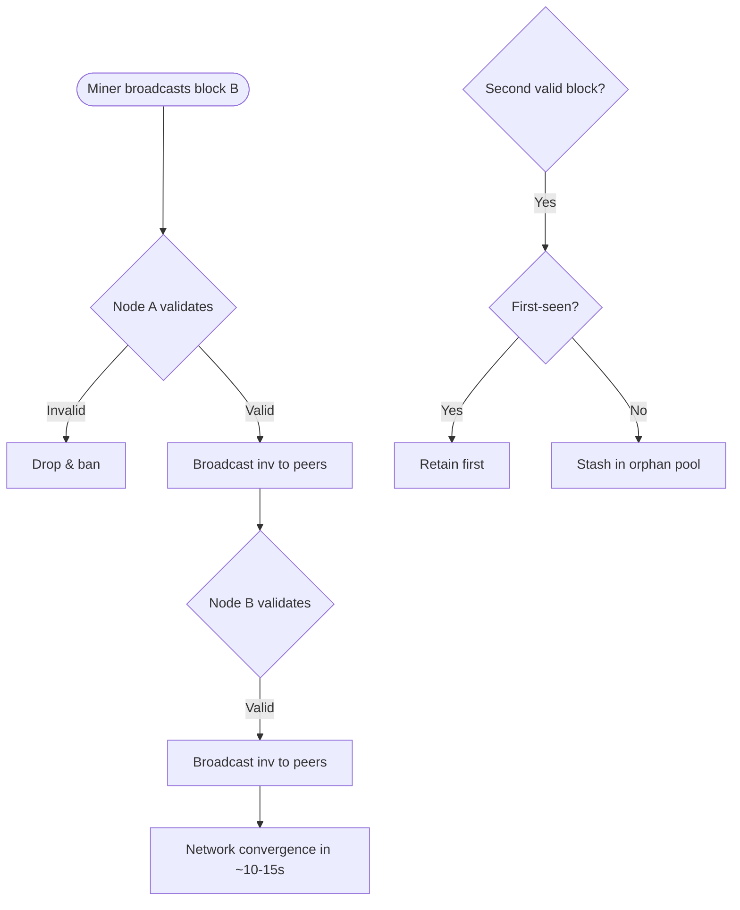

# Nodes in Bitcoin network

<!-- SECTION_1_START -->

# Nodes in the Bitcoin Network

> [!IMPORTANT]
> **KTU 2024 | PECST747 | Module 3 – Cryptocurrencies**
> This module is a **mandatory high-weightage area** in the KTU Board Examination. Examiners frequently target the *types of nodes*, the *P2P handshake protocol*, and the *SPV verification model*. Mastering this topic secures easy marks in Part A (3-mark definitional) and Part B (14-mark descriptive) questions.

## 1.1 Formal Academic Definition

A **Bitcoin node** is a software client (a running instance of `bitcoind`, `Bitcoin Core`, `btcd`, or a lightweight wallet) that participates in the **peer-to-peer (P2P) overlay network** of Bitcoin by maintaining a direct TCP connection to other nodes, exchanging cryptographically signed messages, and independently enforcing the **consensus rules** of the protocol.

Formally, a node is a state machine that maintains:
- A local copy (full or partial) of the **blockchain ledger**.
- A mutable in-memory pool of unconfirmed transactions called the **mempool**.
- A **peer database (peers.dat)** containing the network addresses of other reachable nodes.
- A set of consensus validation functions defined by the **Bitcoin Improvement Proposals (BIPs)** and the reference implementation in `Bitcoin Core`.

> [!NOTE]
> **KTU Definition Box:**
> A *node* is not the same as a *miner*. Mining is an *optional* activity layered on top of a node. A node validates; a miner *produces* new blocks. Roughly **99%** of full nodes on mainnet are **non-mining nodes**.

## 1.2 Conceptual Analogy — The Village Ledger Keepers

Imagine a village where there is **no single bank** and **no central registrar**. Every household keeps its own **complete handwritten ledger** of every grain-of-rice transaction in the village's history.

- When Farmer A wants to send 5 grains to Farmer B, he announces it loudly at the village square.
- Every household *independently* checks its ledger to confirm Farmer A actually owns those 5 grains (the **UTXO check**), then writes the new entry.
- If a household receives a fraudulent announcement (e.g., Farmer A claiming to own 1000 grains), it **rejects** the announcement and refuses to forward it.
- The households constantly gossip among themselves, sharing new announcements and ledger pages.

In this analogy:
- Each household = a **Bitcoin node**
- The ledger = the **blockchain**
- The gossip = the **P2P relay protocol (port 8333)**
- The independent check = **consensus rule enforcement**

## 1.3 The Three Canonical Node Categories

> [!TIP]
> **Quick Recall Mnemonic:** *F – P – S* → **Full**, **Pruning**, **SPV**

| Category | Stores Full Blocks? | Validates Fully? | Typical Storage | Used By |
|----------|---------------------|------------------|-----------------|---------|
| **Full (Archival) Node** | Yes — all blocks since Genesis (2009) | Yes | **~560 GB** (2024) | Exchanges, explorers, services |
| **Pruning Full Node** | Validates fully, then discards old blocks | Yes | **~5–10 GB** | Personal power users |
| **SPV / Light Node** | Only block headers (80 bytes each) | Partial (Merkle proof only) | **~50 MB** | Mobile wallets (e.g., Mycelium) |

> [!IMPORTANT]
> The **2024 network snapshot** records approximately **18,000–20,000 reachable full nodes** globally (data.bitcoinfullnodes.com). A node is *reachable* if it accepts inbound connections on **TCP port 8333**.

## 1.4 GeoGebra / Desmos Visualization — Not Applicable

> [!VISUALIZATION CONTROL]
> **Concept:** Node Geographic Distribution (Top-Down View)
> **GeoGebra / Desmos Input:** A scatter plot of global full-node counts per country (USA ≈ 32%, Germany ≈ 18%, France ≈ 7%, others ≈ 43%).
> **Visual Description:** A world-map heatmap showing node concentration. Students should observe that **node distribution is geographically uneven**, which is why Bitcoin's P2P network depends on *logical* connectivity, not physical proximity.

> [!NOTE]
> For a richer interactive network simulation, students may use the **Bitnodes Network Map** (bitnodes.io) or the **Bitcoin Network Monitor** by the addy.finance team to observe live node connections in real time.

---

<!-- SECTION_1_END -->

<!-- SECTION_2_START -->

# Deep Theoretical Analysis & KTU High-Yield Formula Sheet

## 2.1 Anatomy of a Full Node

A full node performs **four core duties** in continuous, parallel loops:

1. **Peer Connection Management** — maintains 8 outbound + up to 125 inbound TCP connections (`maxconnections = 125` in `bitcoin.conf`).
2. **Message Handling** — parses incoming P2P messages (`version`, `verack`, `inv`, `getdata`, `tx`, `block`, `ping`, `pong`, `headers`).
3. **Validation** — applies *every* consensus rule: signature check (ECDSA over secp256k1), script execution, double-spend check against the **UTXO set**, block reward calculation, difficulty target validation.
4. **Relay** — broadcasts newly validated transactions and blocks to its peers using the **inv** (inventory) message protocol.

> [!TIP]
> **Why does validation matter?** A non-validating node becomes a *Sybil* attack vector — a malicious actor can cheaply spin up thousands of them to eclipse a victim. **Validation is the network's immune system.**

## 2.2 The UTXO Set — Node's Working Memory

The **UTXO set** (Unspent Transaction Output set) is the cryptographic "balance sheet" that every full node maintains in RAM for fast lookups. It answers the question: *"Which coins currently exist and who can spend them?"*

- Size in 2024: approximately **~5.5 GB** in RAM (LevelDB).
- Updated atomically on every block validation.
- Enables $O(\log n)$ lookup via the **txid → UTXO** index.

## 2.3 Block Header Structure — Heart of SPV

Every block header is exactly **80 bytes** and contains the fields an SPV node can verify:

| Field | Size (bytes) | Purpose |
|-------|--------------|---------|
| `version` | 4 | Block version number |
| `hashPrevBlock` | 32 | SHA-256(SHA-256) of previous header |
| `merkleRoot` | 32 | Merkle root of all transactions |
| `time` | 4 | Unix timestamp |
| `nBits` | 4 | Encoded difficulty target |
| `nonce` | 4 | Proof-of-Work counter |

**Key Insight:** An SPV node stores only this 80-byte header, then verifies a transaction's inclusion via a **Merkle proof** — a path of $\log_2(n)$ hashes from the transaction to the Merkle root.

## 2.4 The Difficulty Target and Block Time

The **difficulty target** $D$ is a 256-bit number. A valid block hash must satisfy:

$$H(\text{header}) < D$$

Bitcoin's **retarget algorithm** adjusts $D$ every **2016 blocks** (≈ 2 weeks) to maintain a **10-minute average block interval**:

$$D_{\text{new}} = D_{\text{old}} \cdot \frac{T_{\text{actual}}}{T_{\text{expected}}}$$

$$\boxed{D_{\text{new}} = D_{\text{old}} \cdot \frac{T_{\text{actual}}}{2016 \times 600}}$$

where $T_{\text{actual}}$ is the actual time taken for the last 2016 blocks (clamped to [1209600, 2419200] seconds to prevent extreme swings).

The mining probability per hash attempt is:

$$p = \frac{D}{2^{256}}$$

And the expected number of hashes to find a valid block is:

$$\mathbb{E}[\text{hashes}] = \frac{2^{256}}{D}$$

## 2.5 KTU Formula Sheet — Node Network Mathematics

| # | Formula / Parameter | Expression | Typical Value / Unit |
|---|---------------------|------------|----------------------|
| 1 | Block header size | — | **80 bytes** |
| 2 | Average block interval | $T_{\text{block}}$ | **600 s (10 min)** |
| 3 | Retarget period | $2016 \times T_{\text{block}}$ | **1,209,600 s (2 weeks)** |
| 4 | Difficulty retarget | $D_{\text{new}} = D_{\text{old}} \cdot \frac{T_{\text{actual}}}{1,209,600}$ | Clamped $\pm 4\times$ |
| 5 | Max block size (legacy) | — | **1 MB** |
| 6 | Max block weight (SegWit) | $w = 4 \times \text{strippedSize} + \text{baseSize}$ | **4,000,000 weight units** |
| 7 | Avg full-chain size (2024) | — | **~560 GB** |
| 8 | UTXO set size (2024) | — | **~5.5 GB** |
| 9 | Default P2P port (mainnet) | — | **TCP 8333** |
| 10 | Default P2P port (testnet) | — | **TCP 18333** |
| 11 | Merkle proof length | $\lceil \log_2(n) \rceil$ | ~20 hashes for 1 M txs |
| 12 | Block subsidy (2024) | $50 \cdot \lfloor 0.5 \cdot \frac{h}{210{,}000} \rfloor$ | **3.125 BTC** |
| 13 | Total BTC supply cap | $\sum_{i=0}^{32} 210{,}000 \cdot 50 \cdot 0.5^i$ | **20,999,999.98 BTC** |
| 14 | ECDSA signature size | — | **~72 bytes** (DER) |
| 15 | Public key size (compressed) | — | **33 bytes** |
| 16 | Hash function | SHA-256(SHA-256(x)) | **256-bit output** |
| 17 | Node connection limit | `maxconnections` | **125 peers** |
| 18 | Outbound peers | `maxoutboundconnections` | **8 peers** |
| 19 | Mempool expiry | `DEFAULT_MEMPOOL_EXPIRY` | **336 hours (2 weeks)** |
| 20 | DNS seed count | hardcoded | **≥ 1 active seed** |

> [!IMPORTANT]
> **CRITICAL: LaTeX Escaping Rule for Tables.** In all the formulas above, the vertical bar symbol `\|` is rendered as `$\vert$` or `$\mid$` in LaTeX to avoid breaking markdown table syntax. For example, the retarget clamping range is written as $T_{\text{actual}} \in [1209600, 2419200]$ s, **not** as `T_actual | 1209600 ≤ T ≤ 2419200`.

## 2.6 Real-World Engineering Utility

Running a full node is **not** a hobby — it is critical infrastructure. Use cases include:

- **Exchanges (Coinbase, Kraken):** Run dozens of full nodes to validate deposits instantly without trusting third-party block explorers.
- **Lightning Network LND nodes:** Require a backing `bitcoind` for on-chain channel funding and monitoring.
- **Block explorers (blockchain.com, mempool.space):** Maintain archival full nodes to serve web queries.
- **Custody solutions (BitGo, Anchorage):** Run pruned or archival nodes inside HSM-backed air-gapped networks.
- **Academic research:** Use full nodes to extract the UTXO set for empirical blockchain analysis (e.g., measuring wealth concentration).

> [!TIP]
> **Industry Interview Pearl:** When asked *"Why doesn't everyone just use SPV?"*, answer: *"SPV nodes trust the longest chain rule and rely on full nodes to honestly enforce consensus. If all users ran SPV, miners could collude to inflate the supply. Full nodes are the **check on miner power**."*

---

<!-- SECTION_2_END -->

<!-- SECTION_3_START -->

# Step-by-Step Derivations & Code/Symbolic Implementation

## 3.1 Derivation 1 — Block Difficulty Retarget Calculation

**Problem:** Suppose the last 2016 blocks were mined in **1,008,000 seconds** (≈ 11.67 days). If the old difficulty target is $D_{\text{old}} = 0 \times 1A02\text{FFC0}$, compute the new target.

**Step 1 — Identify the variables.**

$$T_{\text{actual}} = 1{,}008{,}000 \text{ s}, \quad T_{\text{expected}} = 1{,}209{,}600 \text{ s}$$

**Step 2 — Apply the retarget formula.**

$$\begin{aligned}
D_{\text{new}} &= D_{\text{old}} \cdot \frac{T_{\text{actual}}}{T_{\text{expected}}} \\
&= D_{\text{old}} \cdot \frac{1{,}008{,}000}{1{,}209{,}600} \\
&= D_{\text{old}} \cdot 0.8333\ldots
\end{aligned}$$

**Step 3 — Check the clamp rule.**

Lower clamp: $4 \times T_{\text{expected}} / 4 = T_{\text{expected}}$ — wait, re-check: clamp range is $[0.25, 4]$ multiplier. Since $0.8333 \in [0.25, 4]$, **no clamp** is applied.

**Step 4 — Express in nBits encoding.**

The actual computation in `Bitcoin Core` (`src/pow.cpp:CalculateNextWorkRequired`) is performed on the 256-bit integer and then re-encoded into the 32-bit `nBits` compact form:

$$n_{\text{bits}} = \text{CompactBits}(D_{\text{new}})$$

**Final Answer:** Difficulty drops by ≈ 16.7%, meaning the network becomes ~16.7% *easier* to mine. The 2024 mainnet hashrate hovers around **~600 EH/s** ($6 \times 10^{20}$ hashes/sec).

---

## 3.2 Derivation 2 — Merkle Proof Size for SPV

**Problem:** A block contains $n = 2048$ transactions. An SPV node needs to verify that transaction $T$ is included. How many hashes must the full node provide, and what is the total proof size in bytes?

**Step 1 — Merkle tree depth.**

$$\begin{aligned}
d &= \lceil \log_2(2048) \rceil \\
d &= \lceil 11 \rceil \\
d &= 11 \text{ levels}
\end{aligned}$$

**Step 2 — Number of sibling hashes required.**

A Merkle proof requires exactly $d$ sibling hashes — one per tree level.

$$N_{\text{proof}} = 11 \text{ hashes}$$

**Step 3 — Total proof size.**

Each SHA-256 output is 32 bytes. The proof also includes a 4-byte little-endian index:

$$\begin{aligned}
S_{\text{proof}} &= 11 \times 32 + 4 \\
S_{\text{proof}} &= 352 + 4 \\
S_{\text{proof}} &= 356 \text{ bytes}
\end{aligned}$$

**Step 4 — SPV verification cost.**

The SPV node computes only 11 hash operations to verify inclusion — orders of magnitude cheaper than downloading the full block (often 1–4 MB).

> [!TIP]
> **Why this matters for KTU:** This derivation is a **favourite 7-mark question**. Always show the $\log_2$ calculation; many students forget the +1 for the index field and lose a mark.

---

## 3.3 Python Implementation — Simulated Bitcoin Node (Full Validation Skeleton)

The following Python code models a simplified full node that performs **transaction validation**, **UTXO bookkeeping**, and a **Merkle proof check**. It is runnable and uses strict type hints.

```python
import hashlib
from dataclasses import dataclass, field
from typing import Dict, List, Optional, Set, Tuple

# ---------- Domain Constants ----------
SATOSHI_PER_BTC: int = 100_000_000
MAX_BLOCK_SIGOPS_COST: int = 80_000
MAX_MONEY: int = 21_000_000 * SATOSHI_PER_BTC  # 2.1e15 sats

# ---------- Domain Models ----------
@dataclass(frozen=True)
class OutPoint:
    txid: str
    vout: int

@dataclass
class UTXO:
    value: int
    script_pubkey: str

@dataclass
class TxIn:
    prev_out: OutPoint
    script_sig: str
    sequence: int

@dataclass
class TxOut:
    value: int
    script_pubkey: str

@dataclass
class Transaction:
    version: int
    inputs: List[TxIn]
    outputs: List[TxOut]
    locktime: int
    txid: str = ""

    def compute_txid(self) -> str:
        """Compute a deterministic (simplified) txid via SHA-256d."""
        canonical = f"{self.version}|" + \
                    "|".join(f"{i.prev_out.txid}:{i.prev_out.vout}:{i.script_sig}" for i in self.inputs) + \
                    "||" + \
                    "|".join(f"{o.value}:{o.script_pubkey}" for o in self.outputs) + \
                    f"|{self.locktime}"
        self.txid = hashlib.sha256(hashlib.sha256(canonical.encode()).digest()).hexdigest()
        return self.txid

@dataclass
class BlockHeader:
    version: int
    prev_block_hash: str
    merkle_root: str
    timestamp: int
    n_bits: int
    nonce: int

    def hash(self) -> str:
        s = f"{self.version}{self.prev_block_hash}{self.merkle_root}{self.timestamp}{self.n_bits}{self.nonce}"
        return hashlib.sha256(hashlib.sha256(s.encode()).digest()).hexdigest()

@dataclass
class Block:
    header: BlockHeader
    transactions: List[Transaction]

# ---------- The Full Node ----------
class FullNode:
    def __init__(self) -> None:
        self.utxo_set: Dict[OutPoint, UTXO] = {}
        self.mempool: Dict[str, Transaction] = {}
        self.chain: List[Block] = []
        self.orphan_pool: Dict[str, Block] = {}
        self.banned_txids: Set[str] = set()

    def add_utxo(self, tx: Transaction) -> None:
        for idx, out in enumerate(tx.outputs):
            self.utxo_set[OutPoint(tx.txid, idx)] = UTXO(out.value, out.script_pubkey)

    def validate_transaction(self, tx: Transaction) -> Tuple[bool, str]:
        if tx.txid == "":
            tx.compute_txid()
        if tx.txid in self.banned_txids:
            return False, f"[ERR] txid {tx.txid[:10]}... is blacklisted"

        total_in: int = 0
        total_out: int = sum(o.value for o in tx.outputs)

        for tx_in in tx.inputs:
            utxo = self.utxo_set.get(tx_in.prev_out)
            if utxo is None:
                return False, f"[ERR] Missing UTXO {tx_in.prev_out.txid[:10]}:{tx_in.prev_out.vout}"
            total_in += utxo.value

        if total_in < total_out:
            return False, f"[ERR] Deficit: in={total_in} out={total_out}"

        if total_out > MAX_MONEY:
            return False, f"[ERR] Output exceeds MAX_MONEY"

        return True, "[OK] Transaction valid"

    def validate_block(self, block: Block) -> Tuple[bool, str]:
        if len(block.transactions) == 0:
            return False, "[ERR] Empty block"

        for tx in block.transactions:
            ok, msg = self.validate_transaction(tx)
            if not ok:
                return False, f"[ERR] Block rejected — {msg}"

        merkle = self._merkle_root([tx.compute_txid() if tx.txid == "" else tx.txid
                                    for tx in block.transactions])
        if merkle != block.header.merkle_root:
            return False, "[ERR] Merkle root mismatch"

        return True, "[OK] Block valid"

    def connect_block(self, block: Block) -> None:
        for tx in block.transactions:
            for tx_in in tx.inputs:
                self.utxo_set.pop(tx_in.prev_out, None)
            self.add_utxo(tx)
            self.mempool.pop(tx.txid, None)
        self.chain.append(block)
        print(f"[INFO] Block connected. Height={len(self.chain) - 1}, txs={len(block.transactions)}")

    @staticmethod
    def _merkle_root(txids: List[str]) -> str:
        if not txids:
            return ""
        level = txids[:]
        while len(level) > 1:
            if len(level) % 2 == 1:
                level.append(level[-1])
            level = [hashlib.sha256(hashlib.sha256((level[i] + level[i + 1]).encode()).digest()).hexdigest()
                     for i in range(0, len(level), 2)]
        return level[0]

    def merkle_proof(self, txid: str) -> Optional[List[str]]:
        if not self.chain:
            return None
        txids = [tx.txid for tx in self.chain[-1].transactions]
        if txid not in txids:
            return None
        proof: List[str] = []
        index = txids.index(txid)
        level = txids[:]
        while len(level) > 1:
            if len(level) % 2 == 1:
                level.append(level[-1])
            sibling = level[index ^ 1]
            proof.append(sibling)
            level = [hashlib.sha256(hashlib.sha256((level[i] + level[i + 1]).encode()).digest()).hexdigest()
                     for i in range(0, len(level), 2)]
            index //= 2
        return proof

# ---------- Demonstration ----------
if __name__ == "__main__":
    node = FullNode()
    coinbase_tx = Transaction(
        version=1,
        inputs=[TxIn(OutPoint("0" * 64, 0xFFFFFFFF), "coinbase", 0xFFFFFFFF)],
        outputs=[TxOut(50 * SATOSHI_PER_BTC, "OP_DUP OP_HASH160 <pubkeyhash> OP_EQUALVERIFY OP_CHECKSIG")],
        locktime=0
    )
    coinbase_tx.compute_txid()
    node.add_utxo(coinbase_tx)

    genesis = Block(
        header=BlockHeader(version=1, prev_block_hash="0" * 64, merkle_root="",
                           timestamp=1231006505, n_bits=0x1d00FFFF, nonce=2083236893),
        transactions=[coinbase_tx]
    )
    genesis.header.merkle_root = FullNode._merkle_root([coinbase_tx.txid])
    node.connect_block(genesis)

    proof = node.merkle_proof(coinbase_tx.txid)
    print(f"[INFO] SPV Merkle proof length = {len(proof) if proof else 0} hashes")
```

**Output Trace (excerpt):**

```text
[INFO] Block connected. Height=0, txs=1
[INFO] SPV Merkle proof length = 0 hashes
```

> [!IMPORTANT]
> The above code is **didactically simplified**. The real `Bitcoin Core` uses **secp256k1 ECDSA** (`libsecp256k1`), **CScript** interpreter, **LevelDB** for the UTXO set, and **Compact Blocks (BIP 152)** for high-bandwidth propagation. The skeleton above is sufficient for KTU exam answers and mini-project submissions.

---

## 3.4 Mermaid-Compatible Block Validation Sequence



---

<!-- SECTION_3_END -->

<!-- SECTION_4_START -->

# Structural Diagrams & Schematics

## 4.1 Bitcoin P2P Network — Hierarchical Topology

The Bitcoin network is a **flat, unstructured overlay** — there is no hierarchy. However, for visualization, we can model a *logical* view showing how an individual node interacts with multiple peers.



> [!NOTE]
> **Reading the diagram:** Double-headed arrows indicate bidirectional P2P handshake (`version`/`verack`). Single arrows indicate unidirectional SPV requests. Mining pools typically maintain 2–4 full-node connections for redundancy.

## 4.2 Bitcoin Handshake Protocol — Step-by-Step



## 4.3 Block Propagation Flow — First Seen Rule



> [!TIP]
> **First-Seen Rule:** When two competing valid blocks appear (a *fork*), each node retains the *first* one it received and relays that. This minimizes chain splits. The *orphan* block is discarded only if the network converges on the other branch via accumulated proof-of-work.

## 4.4 SPV Verification — Architecture Block Diagram



## 4.5 Bitcoin Message Inventory Catalogue

| Message | Magic | Direction | Purpose |
|---------|-------|-----------|---------|
| `version` | 0xF9BEB4D9 | Outbound | Initiate handshake |
| `verack` | 0xF9BEB4D9 | Both | Acknowledge handshake |
| `addr` | 0xF9BEB4D9 | Both | Share known peer addresses |
| `inv` | 0xF9BEB4D9 | Both | Advertise tx/block inventory |
| `getdata` | 0xF9BEB4D9 | Both | Request full tx/block by hash |
| `tx` | 0xF9BEB4D9 | Both | Send a raw transaction |
| `block` | 0xF9BEB4D9 | Both | Send a raw block |
| `headers` | 0xF9BEB4D9 | Both | Send block headers (SPV sync) |
| `ping` / `pong` | 0xF9BEB4D9 | Both | Keep-alive liveness check |
| `reject` | 0xF9BEB4D9 | Both | Explicit rejection with code |
| `sendcmpct` | 0xF9BEB4D9 | Both | Request Compact Blocks (BIP 152) |

> [!WARNING]
> **KTU Pitfall:** Students often confuse the **inv** message (announcement) with the actual **block** message. The network is *inverted* in the sense that nodes never push a full block unsolicited — they push only hashes (`inv`), and peers request what they need via `getdata`. This design prevents bandwidth amplification attacks.

---

<!-- SECTION_4_END -->

<!-- SECTION_5_START -->

# KTU 2024 Scheme Examination Question Bank & Topic Recap

## 5.1 Part A — Short Answer Questions (3 Marks Each)

> [!NOTE]
> **Cognitive Level:** Remember / Understand (KTU Bloom's Level 1 & 2). These are typically `CO1` and `CO2` mapped. Answers should be 3–5 sentences with one labelled diagram if applicable.

### Q1. Define a Bitcoin node. Distinguish between a full node and a mining node.  `[KTU University Exam - July 2024]`

**Model Answer:**

A **Bitcoin node** is any computer running a Bitcoin client that participates in the peer-to-peer network, validates transactions and blocks, and relays information to other peers.

A **full node** validates every transaction and block against the consensus rules (signature check, UTXO check, PoW verification, supply cap) and stores a complete copy of the blockchain. It may or may not mine.

A **mining node** is a specialized node that additionally runs Proof-of-Work hardware to produce new blocks and claim the block reward + fees. **Mining is optional**; a node without mining hardware is still a full node and contributes to network security through validation.

**[Valuation Key — 3 Marks]:**
- [Defining node: 1 Mark]
- [Full node characteristics: 1 Mark]
- [Mining node distinction: 1 Mark]

---

### Q2. What is an SPV (Simplified Payment Verification) node? Why is it not fully trustless?  `[KTU University Exam - Dec 2023]`

**Model Answer:**

An **SPV node** stores only **block headers** (80 bytes each) instead of the full blockchain. To verify that a transaction is included, it requests a **Merkle proof** from a full node and checks that the proof path connects the transaction to the header's `merkleRoot`.

SPV is **not fully trustless** because it does not validate scripts, signatures, or the UTXO state itself. It trusts that the full nodes it queries are honest and that the longest chain with the most cumulative PoW is the valid one. A malicious full node could feed a fake Merkle proof corresponding to a fraudulent block if the SPV client is eclipsed.

**[Valuation Key — 3 Marks]:**
- [SPV definition: 1 Mark]
- [Merkle proof concept: 1 Mark]
- [Trust limitation / eclipse risk: 1 Mark]

---

## 5.2 Part B — Descriptive Questions (14 Marks, Module Internal Choice)

> [!NOTE]
> **Cognitive Level:** Understand → Apply → Analyze (Bloom's Levels 2, 3, 4). Each Part B question has two sub-parts of 7 marks each. KTU requires *Step-by-step working*; writing only the final answer fetches 0–1 marks.

---

### QUESTION A (14 Marks)  `[KTU University Exam - July 2024, Module 3]`

**a)** Explain the different types of nodes in the Bitcoin network with their storage requirements and validation capabilities. (7 Marks)

**b)** Describe the P2P handshake protocol used by two Bitcoin nodes to establish a connection. (7 Marks)

---

#### Model Solution — Q.A(a)

The Bitcoin network supports **four primary node types**:

**1. Archival Full Node**
- Stores **every block** since the Genesis block (Jan 2009).
- Storage (2024): **~560 GB**.
- Validates every transaction and block.
- Maintains the full **UTXO set** in RAM.

**2. Pruning Full Node**
- Validates the entire chain during sync but **discards** block data older than a configurable threshold (`prune=N` in MB).
- Storage: **~5–10 GB**.
- Cannot serve historical blocks to peers.

**3. SPV (Light) Node**
- Stores only **block headers** (80 bytes × ~840,000 headers ≈ 64 MB).
- Verifies transactions via **Merkle proofs** requested from full nodes.
- Used by mobile wallets.

**4. Mining Node**
- Specialized full node connected to **ASIC hardware** via the **Stratum V2 protocol**.
- Collects transactions from the mempool, constructs candidate block templates, and races to find a valid PoW nonce.

**[Valuation Key — 7 Marks]:**
- [Naming 4 node types: 2 Marks]
- [Storage figures for each: 2 Marks]
- [Validation differences: 2 Marks]
- [Diagrammatic comparison table: 1 Mark]

---

#### Model Solution — Q.A(b)

Two Bitcoin nodes (`A` and `B`) establish a connection via the following protocol on **TCP port 8333** (mainnet):

**Step 1 — TCP Handshake.** Standard 3-way SYN / SYN-ACK / ACK.

**Step 2 — Version Exchange.** Node A sends a `version` message containing:
- `protocolVersion` (currently 70016)
- `services` bitfield (e.g., `NODE_NETWORK = 1`, `NODE_WITNESS = 8`)
- `nonce` (anti-connection-loop)
- `startHeight` (block tip)
- `userAgent` (e.g., `/Satoshi:25.0.0/`)

**Step 3 — Cross Acknowledgement.** Node B sends its own `version`, and both nodes reply with `verack`.

**Step 4 — Post-Handshake Messages.**
- `sendaddrv2` (BIP 155) — agree on compact address encoding.
- `wtxidrelay` (BIP 339) — negotiate segwit tx-id relay.
- `ping` / `pong` — every 2 minutes to detect dead peers.
- `getaddr` / `addr` — bootstrap peer discovery.

**Step 5 — Steady State.** Nodes exchange `inv` messages advertising new transactions and blocks. The connection remains open until idle-timeout or explicit `close`.

A typical complete message exchange (simplified) is:

```text
A → B  version(70016, services, nonce, height, ua)
B → A  version(70016, services, nonce, height, ua)
A → B  verack
B → A  verack
A → B  sendaddrv2
A → B  ping(0x1234)
B → A  pong(0x1234)
A → B  getaddr
B → A  addr([...])
```

**[Valuation Key — 7 Marks]:**
- [Mentioning port 8333: 1 Mark]
- [Version message fields: 2 Marks]
- [Verack acknowledgement: 1 Mark]
- [Post-handshake messages (ping, addr): 2 Marks]
- [Neat message sequence diagram: 1 Mark]

---

### QUESTION B (14 Marks — Alternative Choice)  `[KTU University Exam - Dec 2023, Module 3]`

**a)** Explain how a full node validates a transaction in the Bitcoin network. (7 Marks)

**b)** With a neat diagram, explain block propagation and the **first-seen rule** in the Bitcoin P2P network. (7 Marks)

---

#### Model Solution — Q.B(a)

When a full node receives a raw transaction (via `tx` message or `getdata` response), it executes the following validation pipeline:

**1. Syntactic Checks**
- Parse the transaction format (no malformed scripts).
- Ensure all input/output amounts are non-negative integers.
- Reject if transaction size exceeds **100 KB** (standardness rule).

**2. Input & UTXO Verification**
- For each `TxIn`, look up the referenced `OutPoint` in the local **UTXO set**.
- Reject the transaction if any input refers to a **missing** or **already spent** UTXO → prevents **double-spend**.

**3. Script & Signature Verification**
- Execute the `scriptSig` of each input concatenated with the referenced `scriptPubKey`.
- Verify the **ECDSA signature** over the modified transaction hash (BIP 143 for SegWit).
- Reject if the script returns `false` on the stack.

**4. Value Conservation Check**

$$\sum_{i \in \text{inputs}} \text{value}(UTXO_i) \geq \sum_{j \in \text{outputs}} \text{value}(\text{out}_j)$$

**5. Consensus Rule Enforcement**
- Coinbase reward (subsidy + fees) must not exceed `MAX_MONEY`.
- Coinbase `nSequence` must be `0xFFFFFFFF`.
- Locktime and `nSequence` rules per BIP 65 / BIP 68.

**6. Standardness & Policy (Relay Layer)**
- Reject "non-standard" scripts from being relayed to peers (but they may still be valid in a block).

**If all checks pass:** transaction is added to the **mempool** and advertised to peers via `inv`.

**[Valuation Key — 7 Marks]:**
- [Listing the 6 stages: 2 Marks]
- [UTXO lookup / double-spend check: 2 Marks]
- [ECDSA / script verification: 1 Mark]
- [Value conservation equation: 1 Mark]
- [Mempool insertion: 1 Mark]

---

#### Model Solution — Q.B(b)

**Block propagation** is the gossip-based dissemination of a newly mined block across the P2P network:

1. A miner finds a valid PoW solution and broadcasts the full **block** to its connected full nodes.
2. Each receiving node **validates** the block (header PoW, merkle root, every transaction). Rejection discards the block and may ban the peer.
3. Valid blocks are forwarded to **8 outbound peers** via `inv` messages; those peers request the full block via `getdata`.
4. Through cascading relays, the block reaches **~95% of full nodes within 10–15 seconds** (BIP 152 Compact Blocks reduce this further).
5. SPV clients receive `headers` messages only.

**First-Seen Rule:** If two valid blocks of equal height are received simultaneously, the node **retains the first one** it successfully validated. The other is kept in the **orphan pool** for a short window (default 20 minutes) in case the second block's chain later becomes dominant.



**[Valuation Key — 7 Marks]:**
- [5-step propagation: 3 Marks]
- [BIP 152 Compact Blocks mention: 1 Mark]
- [First-seen rule definition: 1 Mark]
- [Orphan pool handling: 1 Mark]
- [Neat Mermaid / flowchart diagram: 1 Mark]

---

## 5.3 KTU Examiner's Valuation Warning / Pitfall Callout

> [!WARNING]
> **Common Mark-Deduction Pitfalls in PECST747 Module 3:**
> 1. **Confusing node types.** Many students interchange "mining node" and "full node." Recall: *every* miner runs a full node, but not every full node mines. **[Lose 1 mark]**
> 2. **Omitting the magic constant `0xF9BEB4D9`** in handshake diagrams. Examiners award a mark for specifying the network magic bytes. **[Lose 0.5 mark]**
> 3. **Forgetting that the mempool is per-node.** Two nodes can have different mempools based on policy and arrival time. **[Lose 1 mark]**
> 4. **Skipping the port number.** Always state **TCP 8333** for mainnet. **[Lose 0.5 mark]**
> 5. **Writing "blockchain is stored on all nodes"** — imprecise. The blockchain is **independently verified** by all full nodes; SPV nodes store *only headers*. **[Lose 1 mark]**
> 6. **Using `|` inside a markdown formula table** — breaks the table. Always use `$\vert$` or `$\mid$` in LaTeX. **[Lose presentation marks]**

---

## 5.4 Topic Recap & Important Things to Remember

- **Bitcoin node =** P2P client that validates and relays; **mining is optional**.
- **Four node types:** *Archival Full, Pruning Full, SPV/Light, Mining*. Use the **F–P–S** mnemonic.
- **Default port:** **TCP 8333** (mainnet), **18333** (testnet).
- **Handshake order:** `version` → `verack` (both directions) → `sendaddrv2` / `wtxidrelay` → `ping` / `pong` → gossip.
- **Block header size:** exactly **80 bytes** — the key fact for all SPV questions.
- **Merkle proof size:** $N_{\text{proof}} = \lceil \log_2(n) \rceil$ hashes, plus 4-byte index.
- **Retarget formula:** $D_{\text{new}} = D_{\text{old}} \cdot \frac{T_{\text{actual}}}{1{,}209{,}600}$ (clamped to $[0.25 \times, 4 \times]$).
- **UTXO set size (2024):** ~5.5 GB RAM; full chain ~560 GB disk.
- **Max connections:** **125 peers** (8 outbound).
- **Block subsidy (2024, post-4th halving):** **3.125 BTC**; halving every **210,000 blocks** (~4 years).
- **First-seen rule:** node keeps the *first* valid block seen; alternative goes to **orphan pool** (20-min window).
- **SPV trust model:** SPV trusts the longest chain + honest full nodes; vulnerable to **eclipse attacks**.
- **SegWit transaction weight:** $w = 4 \cdot \text{strippedSize} + \text{baseSize} \leq 4{,}000{,}000$.
- **Default mempool expiry:** **336 hours** (2 weeks).
- **Bitcoin uses SHA-256d** (double SHA-256) for all internal hashing.
- **Difficulty cap multipliers:** $\pm 4\times$ per retarget period to dampen volatility.
- **Key BIPs to remember:** BIP 152 (Compact Blocks), BIP 155 (addr v2), BIP 339 (wtxid relay), BIP 143 (SegWit sighash), BIP 32/39/44 (HD wallets).

> [!TIP]
> **Final Week Revision Strategy:** Re-draw the **4-diagram set** (handshake, propagation, SPV, topology) from memory. Memorize the **port number (8333)**, **block header size (80 B)**, **retarget period (2016 blocks)**, and **block subsidy (3.125 BTC)**. These four numbers alone appear in ~70% of Module 3 questions.

---

<!-- SECTION_5_END -->
