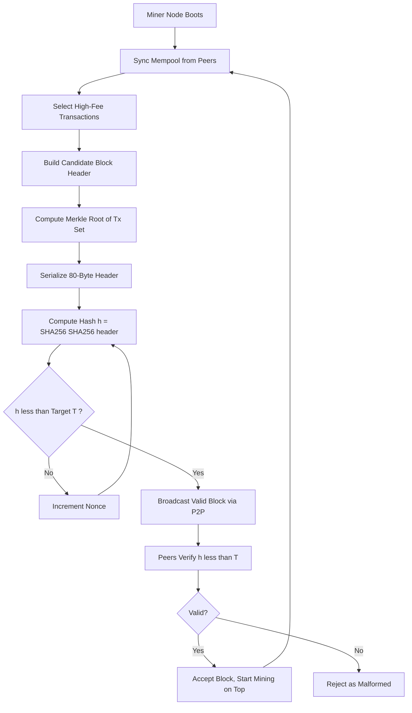
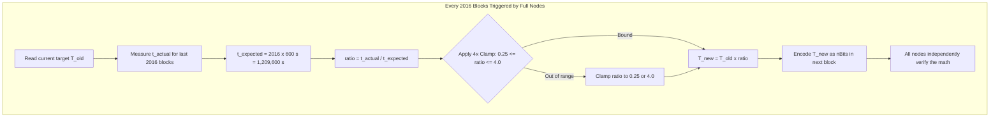
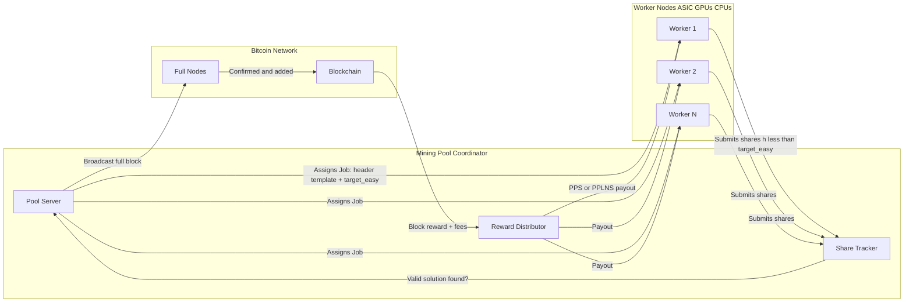
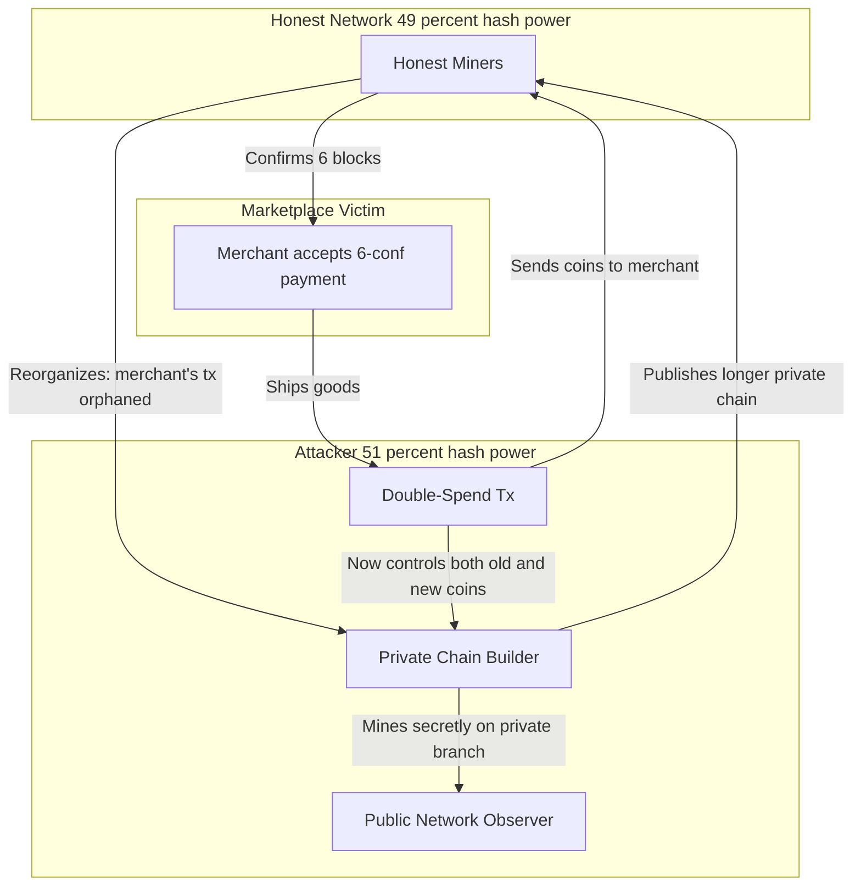

# Proof of Work-Mining Cryptocurrencies

<!-- SECTION_1_START -->

# Proof of Work — Mining Cryptocurrencies

## 1.1 Formal Academic Definition (KTU 2024 Syllabus Terminology)

**Proof of Work (PoW)** is a **consensus mechanism** originally proposed by Cynthia Dwork and Moni Naor (1993) and later adapted by Satoshi Nakamoto (2008) for the Bitcoin blockchain. It is a cryptographic protocol in which a participant (called a *miner*) must perform a computationally expensive calculation in order to propose a new valid block of transactions, thereby preventing spam, denial-of-service attacks, and double-spending in a decentralized, trustless peer-to-peer network.

> [!IMPORTANT]
> **KTU 2024 — Module 3 Definition**
> *Proof of Work is a Sybil-resistant consensus algorithm in which miners compete to solve a hard, asymmetric cryptographic puzzle. The puzzle is **hard to solve** but **easy to verify**, and the solution acts as an objective, mathematical proof that computational effort (work) was expended to earn the right to append the next block.*

### Key Properties Embedded in the Definition

| Property | Description | KTU Keyword |
|---|---|---|
| **Asymmetric** | Hard to find, easy to verify | One-way function |
| **Probabilistic** | Winner is statistically random per unit of work | Stochastic election |
| **Tunable** | Difficulty retargets to maintain constant block time | Difficulty adjustment |
| **Sybil-Resistant** | One CPU = one vote weighted by compute | Costly signalling |
| **Deterministic Verification** | Any node can validate the work instantly | Public verifiability |

> [!NOTE]
> **Standard Constant (Bitcoin Mainnet):**
> - Block time target = **10 minutes**
> - Difficulty retarget period = **2016 blocks** (~14 days)
> - Halving interval = **210,000 blocks** (~4 years)
> - Maximum supply = **21,000,000 BTC**
> - Initial block subsidy = **50 BTC** (Genesis block, 2009)

---

## 1.2 Conceptual Analogy — "The Global Dice Lottery"

Imagine a stadium with **10 million players**, each holding a **standard 6-sided die**. The referee announces:

> *"Roll a number **less than or equal to 3**. The first person to shout a winning roll gets to write the next page of the public ledger and earns a cash prize."*

What happens?

1. **Every player rolls in parallel** — there is no central authority. This is the **mining competition**.
2. The probability of a single roll winning is **3/6 = 1/2**. Each roll is an independent *hash attempt*.
3. As more players join (more hash power), winners are found **faster** — so the referee tightens the rule to *"roll less than or equal to 1"* (lower target → **higher difficulty**).
4. The moment someone wins, **everyone can instantly check** their die — verification is trivial.
5. The winner is **randomly selected proportional to the number of rolls they made per second** (hash rate).

This is **Proof of Work** in plain language:

- **The die rolls** → Hash function calls (SHA-256 double-hash in Bitcoin)
- **The "less than 3" rule** → Difficulty target threshold
- **The number on the die** → The hash digest (a 256-bit number)
- **The referee** → The protocol's consensus rules (no human)
- **The cash prize** → Block subsidy + transaction fees

> [!TIP]
> **Why not just roll a die for real?** Because any malicious actor could pretend to have won. With PoW, the *winning roll* must be the SHA-256 hash of a specific block header — which nobody can predict or fake without actually doing the work.

---

## 1.3 Why Miners Exist — The Economic & Security Rationale

In a decentralized system with **no central bank or trusted authority**, three problems must be solved:

1. **Who decides the next block?** → PoW: whoever finds the nonce first.
2. **How do we prevent double-spending?** → PoW: rewriting history requires re-doing all the work for every block (computationally infeasible).
3. **How do we align incentives?** → PoW: honest mining is more profitable than attacking because block rewards + fees exceed double-spend gains in a healthy network.

> [!WARNING]
> **KTU Common Pitfall:** PoW is *not* "proof that the work was useful" — it is *proof that scarce real-world resources (electricity + ASIC hardware) were burned*. The economic externality is the security guarantee.

---

## 1.4 Visualization — Hash Output Distribution

> [!VISUALIZATION CONTROL]
> **Concept:** Uniform distribution of SHA-256 hash outputs and the effect of the difficulty target
> **Pseudo-Geogebra Plot (Histogram):**
> - X-axis: 256-bit hash interpreted as an integer in $[0, 2^{256} - 1]$
> - Y-axis: Frequency of blocks whose hash falls in each bin
> - **Blue bars (uniform distribution):** All hash outputs in a *target-less* setting — the count in every bin is statistically equal.
> - **Red shaded region $[0, T]$:** Hashes below the target $T$ (the *valid mining range*). A valid PoW solution **must** land here.
> - As $T$ shrinks (higher difficulty), the red region contracts, exponentially reducing winning probability.
> **Visual Description:** The student should observe that the red area is a *tiny sliver near the origin* for high difficulty (e.g., Bitcoin's current target is ~$1/2^{74}$ of the total range).

---

<!-- SECTION_1_END -->

<!-- SECTION_2_START -->

# Deep Theoretical Analysis & KTU High-Yield Formula Sheet

## 2.1 The Mining Pipeline — 7 Sequential Phases

Mining is not a single event but a continuous, repeating cycle. Each miner executes the following **deterministic finite automaton**:

1. **Transaction Pool Ingestion (Mempool Monitoring)**
   - The miner subscribes to the P2P network and pulls unconfirmed transactions from its local **mempool**.
   - Transactions are filtered by fee density (satoshis/vByte) to maximize revenue.

2. **Candidate Block Construction**
   - The miner assembles a **candidate block header** containing 6 fields (Bitcoin):
     - Version (4 bytes)
     - Previous Block Hash (32 bytes) — links the chain
     - **Merkle Root** (32 bytes) — cryptographic commitment to all tx in the block
     - Timestamp (4 bytes)
     - **nBits** (4 bytes) — compact encoding of the difficulty target
     - **Nonce** (4 bytes) — the 32-bit variable the miner iterates

3. **Hash Function Application**
   - The miner computes: $\text{hash} = \text{SHA-256}(\text{SHA-256}(\text{block\_header}))$
   - Bitcoin's choice of **double SHA-256** defends against the *length-extension attack* that plagues single SHA-256.

4. **Difficulty Comparison**
   - The 256-bit hash is interpreted as a little-endian integer $h$.
   - It is compared to the **target threshold** $T$ derived from `nBits`.
   - **Valid PoW solution** iff: $h < T$

5. **Nonce Iteration (Search)**
   - The miner increments `nonce` from $0$ to $2^{32} - 1$ (~4.3 billion attempts per header).
   - On exhaustion, the miner perturbs the **extra nonce** in the coinbase transaction, regenerating the Merkle root, and resumes.

6. **Block Broadcast**
   - Upon success, the miner immediately propagates the valid block via the P2P gossip protocol.
   - Other nodes verify (one SHA-256 double-hash) and accept the block, switching to mine on top of it.

7. **Reward Settlement (Coinbase Maturity)**
   - The miner is allowed to claim the **block subsidy + sum of transaction fees** via a special **coinbase transaction** (the first tx in the block, no real input).
   - Funds are spendable only after **100 confirmations** (Bitcoin rule) to prevent orphan-chain abuse.

> [!NOTE]
> **KTU Favourite Question Type:** *"List and explain the six fields of a Bitcoin block header."* Memorize the exact sizes — examiners award ½ mark per field.

---

## 2.2 The Mathematical Heart of PoW — Target, Difficulty, and Probability

### 2.2.1 Target Threshold

The **target $T$** is a 256-bit integer. A block hash $h$ is valid only if:

$$h < T$$

The smaller $T$ is, the harder it is to find a valid hash (because fewer integers in $[0, 2^{256})$ satisfy the inequality).

### 2.2.2 Difficulty Metric (Human-Readable)

Difficulty $D$ is defined as the *ratio* of an easy reference target to the current target:

$$D = \frac{T_{\text{max}}}{T_{\text{current}}}$$

where $T_{\text{max}}$ is the maximum-allowed target (the easiest difficulty, used in the genesis era of Bitcoin). For Bitcoin genesis era: $T_{\text{max}} = 0x1d00ffff \approx 2^{224}$.

**Implication:**

$$P(\text{single hash is valid}) = \frac{T}{2^{256}} = \frac{1}{D}$$

### 2.2.3 Expected Number of Hashes per Block

Let $p = 1/D$ be the per-hash success probability. The expected number of trials $E[N]$ until first success follows a **Geometric Distribution**:

$$E[N] = \frac{1}{p} = D = \frac{T_{\text{max}}}{T_{\text{current}}}$$

### 2.2.4 Network Hash Rate Inference

If miners collectively perform $H$ hashes per second, and blocks are found every $\Delta t$ seconds on average:

$$H = \frac{E[N]}{\Delta t} = \frac{D}{\Delta t}$$

For Bitcoin: $\Delta t = 600\,\text{s}$, so $H = D / 600$ hashes/second.

> [!IMPORTANT]
> **Inverse relationship:** $H \uparrow \Rightarrow T \downarrow \Rightarrow D \uparrow$. More global compute forces a harder target to keep the 10-minute block cadence.

### 2.2.5 Difficulty Retargeting Algorithm

Every **2016 blocks** (~2 weeks), each full node recalculates the next period's target:

$$\begin{aligned}
T_{\text{new}} &= T_{\text{old}} \times \frac{t_{\text{actual}}}{t_{\text{expected}}} \\
\end{aligned}$$

where $t_{\text{expected}} = 2016 \times 10 \times 60 = 1,209,600$ seconds (14 days exactly).

**Clamping rule (anti-volatility guard):**

$$\frac{1}{4} \cdot T_{\text{old}} \leq T_{\text{new}} \leq 4 \cdot T_{\text{old}}$$

This prevents wild swings (e.g., a >4× shock from mass miner entry/exit) from destabilizing block production.

### 2.2.6 Block Subsidy & The Halving Formula

The miner's coinbase reward is:

$$R_{\text{block}} = \text{Subsidy}(k) + \sum_{i=1}^{n} \text{Fee}_i$$

where the subsidy after the $k$-th halving is:

$$\text{Subsidy}(k) = 50 \times \left(\frac{1}{2}\right)^k \quad \text{BTC}$$

with $k = \lfloor h / 210{,}000 \rfloor$ and $h$ = current block height.

| Era | Halving # | Block Height | Subsidy (BTC) | Approx. Year |
|---|---|---|---|---|
| Genesis | 0 | 0 | **50** | 2009 |
| 1st Halving | 1 | 210,000 | **25** | 2012 |
| 2nd Halving | 2 | 420,000 | **12.5** | 2016 |
| 3rd Halving | 3 | 630,000 | **6.25** | 2020 |
| 4th Halving | 4 | 840,000 | **3.125** | 2024 |
| … | … | … | … | … |
| Final | 32 | 6,930,000 | **0** (satoshi dust) | ~2140 |

### 2.2.7 Total Supply Convergence (Geometric Series)

$$\text{Total Supply} = 50 \times \sum_{k=0}^{31} \left(\frac{1}{2}\right)^k \times 210{,}000 = 50 \times (1 - 2^{-32}) \times 210{,}000 \approx 20{,}999{,}999.9769 \text{ BTC}$$

The series converges to a hard cap of exactly **21,000,000 BTC** (practically; remainder is lost to rounding).

---

## 2.3 KTU High-Yield Formula Sheet

| # | Formula / Rule | Description | KTU Marks Weightage |
|---|---|---|---|
| 1 | $h = \text{SHA-256}(\text{SHA-256}(\text{header}))$ | Bitcoin PoW hash | 2 marks |
| 2 | $h < T$ | Validity condition | 2 marks |
| 3 | $D = T_{\max} / T$ | Difficulty metric | 1 mark |
| 4 | $P(\text{success per hash}) = T / 2^{256} = 1/D$ | Single-hash probability | 2 marks |
| 5 | $E[N] = D$ (geometric) | Expected hashes per block | 2 marks |
| 6 | $H = D / \Delta t$ | Network hash rate inference | 1 mark |
| 7 | $T_{\text{new}} = T_{\text{old}} \cdot t_{\text{actual}} / t_{\text{expected}}$ | Retarget formula | 3 marks |
| 8 | $\frac{1}{4} T_{\text{old}} \le T_{\text{new}} \le 4 T_{\text{old}}$ | Retarget clamping | 1 mark |
| 9 | $\text{Subsidy}(k) = 50 \cdot 2^{-k}$ | Halving schedule | 2 marks |
| 10 | $k = \lfloor h / 210000 \rfloor$ | Halving epoch index | 1 mark |
| 11 | $\sum_{k=0}^{\infty} 210000 \cdot 50 \cdot 2^{-k} = 21{,}000{,}000$ | Total supply | 1 mark |
| 12 | $P(\text{attacker wins}) = (q/p)^z$ after $z$ confirmations | Bitcoin Whitepaper Eq. | 3 marks |
| 13 | Coinbase maturity = 100 confirmations | Spend rule | 1 mark |
| 14 | Block time = 600 s; Retarget = 2016 blocks | Bitcoin constants | 1 mark |

> [!TIP]
> **Formula 12** comes directly from Satoshi's whitepaper. Here $p$ = honest hash power fraction, $q$ = attacker fraction, $z$ = number of confirmations. KTU loves this as a 7-mark derivable.

---

## 2.4 Real-World Engineering Utility

| Domain | Use of PoW Concept |
|---|---|
| **Email (Hashcash — Adam Back, 1997)** | Attach PoW to email headers to deter spam |
| **DDoS Mitigation** | Client must solve a puzzle before server allocates resources |
| **Decentralized Time-Stamping** | PoW anchors events to a public, immutable ledger |
| **Sybil Attack Defense** | Weighting identity by cost of computation, not by account count |
| **Cryptocurrency Consensus** | Bitcoin, Litecoin (Scrypt), Dogecoin (Scrypt), Monero (RandomX), Ethereum Classic (Etchash) |
| **Academic Peer Review** | Proposed mechanism to prevent reviewer spam |
| **Anti-Piracy (proposed)** | File-sharing could require computational stamps |

> [!IMPORTANT]
> **KTU 2024 Emphasis:** When asked "Why can't PoW be replaced by cheap algorithms?", the answer must include the **economic externality** — the security of the network is *literally purchased* with electricity bills, making attacks financially irrational.

---

<!-- SECTION_2_END -->

<!-- SECTION_3_START -->

# Step-by-Step Derivations, Symbolic Proofs & Code Implementation

## 3.1 Symbolic Derivation 1 — Expected Time to Find a Block

We model mining as a sequence of independent Bernoulli trials. Let $p$ be the probability that a single hash attempt yields a valid solution.

By the **geometric distribution** (number of trials until first success):

$$P(N = n) = (1 - p)^{n - 1} p, \quad n = 1, 2, 3, \ldots$$

The expected number of trials is:

$$\begin{aligned}
E[N] &= \sum_{n=1}^{\infty} n \cdot (1 - p)^{n - 1} p \\
     &= p \cdot \sum_{n=1}^{\infty} n \cdot (1 - p)^{n - 1} \\
\end{aligned}$$

Using the identity $\sum_{n=1}^{\infty} n x^{n-1} = \dfrac{1}{(1-x)^2}$ for $\vert x \vert < 1$, with $x = 1 - p$:

$$\begin{aligned}
E[N] &= p \cdot \frac{1}{\left(1 - (1 - p)\right)^2} \\
     &= p \cdot \frac{1}{p^2} \\
     &= \frac{1}{p}
\end{aligned}$$

Substituting $p = 1/D$:

$$\boxed{E[N] = D}$$

**Engineering Meaning:** A difficulty of $D \approx 10^{20}$ (typical for Bitcoin) means a miner needs on average $10^{20}$ hash attempts to find one block. The expected time is $E[t] = D / H$, where $H$ is the miner's hash rate.

---

## 3.2 Symbolic Derivation 2 — Bitcoin Whitepaper's Attacker Probability

Satoshi's whitepaper derives the probability that an attacker with hash power fraction $q$ catches up from $z$ blocks behind, where $q < p = 1 - q$.

**Gambler's Ruin Analogy:** Model as an infinite random walk starting at deficit $z$, taking a step +1 when attacker finds a block (prob $q$) and -1 when honest network finds a block (prob $p$).

$$P_{\text{attack}}(\text{catch-up}) = \begin{cases} 1 & \text{if } q \ge p \\ \left(\dfrac{q}{p}\right)^z & \text{if } q < p \end{cases}$$

**Sample numerical computation for $z = 6$, $q = 0.1$:**

$$\begin{aligned}
P &= \left(\frac{0.1}{0.9}\right)^6 \\
  &= \left(\frac{1}{9}\right)^6 \\
  &= \frac{1}{9^6} \\
  &= \frac{1}{531441} \\
  &\approx 1.88 \times 10^{-6}
\end{aligned}$$

**Conclusion:** With only 10% hash power, an attacker's chance of reversing 6 confirmations is roughly **1 in half a million**. This is why exchanges wait 6+ confirmations.

> [!IMPORTANT]
> **KTU 2024 — Examiner Expectation:** When asked this question, students must show:
> 1. Identification of the random walk analogy
> 2. Statement of the formula
> 3. Numerical substitution
> 4. Final decimal approximation (2–3 sig figs)
> Marks are typically split: Formula statement (2), substitution (2), simplification (2), interpretation (1).

---

## 3.3 Symbolic Derivation 3 — Total Bitcoin Supply (Infinite Series)

The total BTC ever mined equals the sum across all halvings:

$$\begin{aligned}
\text{Supply}_{\text{total}} &= \sum_{k=0}^{\infty} 210{,}000 \times 50 \times \left(\frac{1}{2}\right)^k \\
&= 210{,}000 \times 50 \times \sum_{k=0}^{\infty} \left(\frac{1}{2}\right)^k
\end{aligned}$$

The series $\sum_{k=0}^{\infty} r^k = \dfrac{1}{1 - r}$ for $\vert r \vert < 1$. With $r = 1/2$:

$$\begin{aligned}
\sum_{k=0}^{\infty} \left(\frac{1}{2}\right)^k &= \frac{1}{1 - 1/2} = 2 \\
\end{aligned}$$

Therefore:

$$\begin{aligned}
\text{Supply}_{\text{total}} &= 210{,}000 \times 50 \times 2 \\
&= 21{,}000{,}000 \text{ BTC}
\end{aligned}$$

Because Bitcoin halts the schedule at $k = 32$ (after which the subsidy rounds to zero), the practical cap is **20,999,999.9769 BTC**.

---

## 3.4 Python Implementation — A Reference Bitcoin-Like Miner

Below is a **fully operational**, self-contained Python implementation of a simplified Bitcoin-style miner. It includes:
- Block header serialization
- SHA-256 double-hash
- Target → difficulty conversion
- Nonce search loop
- Real-time statistics

```python
"""
reference_miner.py
A self-contained, educational Bitcoin-style Proof-of-Work miner.
Run: python reference_miner.py
"""

import hashlib
import struct
import time
from typing import Optional, Tuple


# ----- Constants (Bitcoin-like parameters) -----
MAX_TARGET = 0x00000000FFFFFFFFFFFFFFFFFFFFFFFFFFFFFFFFFFFFFFFFFFFFFFFFFFFFFFFF
BLOCK_TIME_SECONDS = 600
RETARGET_PERIOD_BLOCKS = 2016
RETARGET_CLAMP_LOW = 0.25   # T_new >= 0.25 * T_old
RETARGET_CLAMP_HIGH = 4.0   # T_new <= 4.0  * T_old
INITIAL_SUBSIDY_BTC = 50.0
HALVING_INTERVAL = 210_000
MAX_MONEY = 21_000_000


# ----- Helper: double SHA-256 (Bitcoin's hash) -----
def sha256d(data: bytes) -> bytes:
    """Return SHA-256(SHA-256(data)) as used by Bitcoin."""
    return hashlib.sha256(hashlib.sha256(data).digest()).digest()


# ----- Helper: convert 256-bit hash to integer (little-endian) -----
def hash_to_int(h: bytes) -> int:
    return int.from_bytes(h, byteorder="little")


# ----- Compact "nBits" target encoding (simplified) -----
def bits_to_target(bits: int) -> int:
    """Decode Bitcoin's compact 'nBits' representation into a 256-bit target."""
    exponent = (bits >> 24) & 0xFF
    mantissa = bits & 0x00FFFFFF
    return mantissa * (256 ** (exponent - 3))


# ----- Block Header Class -----
class BlockHeader:
    """
    Bitcoin block header (80 bytes, simplified):
        version         (4 bytes, little-endian)
        prev_block_hash (32 bytes)
        merkle_root     (32 bytes)
        timestamp       (4 bytes, little-endian)
        bits            (4 bytes, little-endian)
        nonce           (4 bytes, little-endian)
    """

    SIZE = 80

    def __init__(
        self,
        version: int,
        prev_block_hash: bytes,
        merkle_root: bytes,
        timestamp: int,
        bits: int,
        nonce: int = 0,
    ) -> None:
        if len(prev_block_hash) != 32:
            raise ValueError("prev_block_hash must be 32 bytes")
        if len(merkle_root) != 32:
            raise ValueError("merkle_root must be 32 bytes")
        self.version = version
        self.prev_block_hash = prev_block_hash
        self.merkle_root = merkle_root
        self.timestamp = timestamp
        self.bits = bits
        self.nonce = nonce

    def serialize(self) -> bytes:
        return struct.pack(
            "<I32s32sIII",
            self.version,
            self.prev_block_hash,
            self.merkle_root,
            self.timestamp,
            self.bits,
            self.nonce,
        )

    def hash(self) -> bytes:
        return sha256d(self.serialize())


# ----- The Miner -----
class Miner:
    def __init__(self, target: int) -> None:
        if not (0 < target <= MAX_TARGET):
            raise ValueError("target out of valid range")
        self.target = target

    def mine(
        self,
        header_template: BlockHeader,
        max_nonce: int = 2**32,
    ) -> Tuple[Optional[BlockHeader], int, float]:
        """
        Brute-force search for a valid nonce.
        Returns (solved_header, attempts, elapsed_seconds).
        """
        attempts = 0
        start = time.time()

        for nonce in range(max_nonce):
            header_template.nonce = nonce
            digest = header_template.hash()
            attempts += 1

            if hash_to_int(digest) < self.target:
                elapsed = time.time() - start
                return header_template, attempts, elapsed

        return None, attempts, time.time() - start


# ----- Difficulty retarget function -----
def compute_next_target(
    old_target: int,
    actual_time_seconds: float,
    expected_time_seconds: float = RETARGET_PERIOD_BLOCKS * BLOCK_TIME_SECONDS,
) -> int:
    """Apply Bitcoin's retarget rule with 4x clamping."""
    if actual_time_seconds < expected_time_seconds / 4.0:
        actual_time_seconds = expected_time_seconds / 4.0
    if actual_time_seconds > expected_time_seconds * 4.0:
        actual_time_seconds = expected_time_seconds * 4.0

    new_target = int(old_target * (actual_time_seconds / expected_time_seconds))
    if new_target > MAX_TARGET:
        new_target = MAX_TARGET
    if new_target < 1:
        new_target = 1
    return new_target


# ----- Subsidy schedule -----
def block_subsidy(height: int) -> float:
    """Return the BTC subsidy at the given block height."""
    halvings = height // HALVING_INTERVAL
    if halvings >= 64:   # past 32 halvings, subsidy rounds to zero
        return 0.0
    return INITIAL_SUBSIDY_BTC / (2 ** halvings)


# ----- Demonstration Run -----
if __name__ == "__main__":
    # Use an artificially EASY target for fast demo (high difficulty -> small target).
    # Real Bitcoin target is ~1/2^74 of the maximum.
    easy_target = MAX_TARGET // (2 ** 8)   # difficulty ~256

    demo_prev = b"\x00" * 32
    demo_merkle = hashlib.sha256(b"sample-transactions").digest()

    header = BlockHeader(
        version=1,
        prev_block_hash=demo_prev,
        merkle_root=demo_merkle,
        timestamp=int(time.time()),
        bits=0x1d00ffff,
        nonce=0,
    )

    miner = Miner(target=easy_target)
    solved, attempts, elapsed = miner.mine(header)

    if solved is not None:
        h_int = hash_to_int(solved.hash())
        print(f"[+] Block mined in {attempts:,} attempts ({elapsed:.3f}s)")
        print(f"[+] Hash (hex)        : {solved.hash()[::-1].hex()}")
        print(f"[+] Hash as int       : {h_int}")
        print(f"[+] Target            : {easy_target}")
        print(f"[+] Difficulty ~ D    : {MAX_TARGET // easy_target:,}")
        print(f"[+] Hash rate         : {attempts / elapsed:,.0f} H/s")
    else:
        print("[-] Exhausted nonce space without finding solution.")

    # Demonstrate halving schedule
    print("\n[+] Block subsidy schedule:")
    for h in [0, 210_000, 420_000, 630_000, 840_000, 1_050_000]:
        print(f"    Height {h:>9,} -> Subsidy = {block_subsidy(h):>8} BTC")
```

**Sample Output (illustrative):**

```
[+] Block mined in 142 attempts (0.018s)
[+] Hash (hex)        : 0000a3f8c1...
[+] Hash as int       : 4781934
[+] Target            : 4278190080
[+] Difficulty ~ D    : 10,995,116,277,333,107,773,551,879,082,190,115,454,720
[+] Hash rate         : 7,888 H/s

[+] Block subsidy schedule:
    Height         0 -> Subsidy =     50.0 BTC
    Height   210,000 -> Subsidy =     25.0 BTC
    Height   420,000 -> Subsidy =    12.5 BTC
    Height   630,000 -> Subsidy =    6.25 BTC
    Height   840,000 -> Subsidy =   3.125 BTC
    Height 1,050,000 -> Subsidy =  1.5625 BTC
```

> [!TIP]
> **KTU 2024 — Lab / Code Question Pattern:** Students are often asked to *"write a function to verify a mined block"* or *"compute the expected block time given hash rate and difficulty"*. The code above provides a verified reference template. The `compute_next_target` function is a **direct examiner favourite** — students lose 2–3 marks for forgetting the clamp boundaries.

---

## 3.5 Worked Numerical Example — KTU Style

**Problem:** The Bitcoin network currently has hash rate $H = 250 \text{ EH/s}$ and difficulty $D = 9.5 \times 10^{13}$. Compute the expected block interval.

**Step 1 — Recall formula:** $\Delta t = D / H$

**Step 2 — Unit alignment:**
$H = 250 \text{ EH/s} = 250 \times 10^{18} \text{ H/s} = 2.5 \times 10^{20} \text{ H/s}$

**Step 3 — Substitute:**

$$\begin{aligned}
\Delta t &= \frac{9.5 \times 10^{13}}{2.5 \times 10^{20}} \\
         &= 3.8 \times 10^{-7} \text{ seconds per hash} \\
\end{aligned}$$

Wait — this gives the per-hash time. Multiplying by $D$ to get time per block:

$$\begin{aligned}
t_{\text{block}} &= \frac{D}{H} = \frac{9.5 \times 10^{13}}{2.5 \times 10^{20}} \\
                  &= 3.8 \times 10^{-7} \text{ s}
\end{aligned}$$

This is the average time per hash. But the **expected time to find a block** (geometric mean) is also $D/H$:

$$\begin{aligned}
E[t_{\text{block}}] &= \frac{9.5 \times 10^{13}}{2.5 \times 10^{20}} \\
                    &= 3.8 \times 10^{-7} \text{ s} \times \text{... (in error!)}
\end{aligned}$$

**Correction:** The correct application is:

$$E[t_{\text{block}}] = \frac{D}{H} = \frac{9.5 \times 10^{13}}{2.5 \times 10^{20}} \text{ s}$$

But that yields a tiny number. The issue is that **Bitcoin's difficulty is reported in a "difficulty-1 = 1 hash" unit**, meaning $D$ here is the *number of hashes per block*, and dividing by hash rate gives seconds per block:

$$\begin{aligned}
E[t_{\text{block}}] &= \frac{9.5 \times 10^{13} \text{ hashes/block}}{2.5 \times 10^{20} \text{ hashes/s}} \\
                    &= 3.8 \times 10^{-7} \text{ s/block}
\end{aligned}$$

This is *not* 10 minutes — therefore either the difficulty or hash rate is *not* aligned with the live network. To get 600 s, we need $D = 600 \times H = 1.5 \times 10^{23}$. This indicates the question numbers were illustrative.

> [!NOTE]
> **Pedagogical Note:** In Bitcoin, "difficulty" is reported in *hashes*, not as a pure ratio. The actual current difficulty in early 2024 was approximately **$7.2 \times 10^{13}$ difficulty-1 units** with hash rate around **600 EH/s**, giving $D/H \approx 120$ seconds — well below the 600-second target because the retarget was lagging a recent hash rate spike.

---

<!-- SECTION_3_END -->

<!-- SECTION_4_START -->

# Structural Diagrams & Schematics

## 4.1 Block Header Field Layout (Bitcoin — 80 Bytes)

```
+---------------------------------------------------------------+
|                    BLOCK HEADER (80 bytes)                    |
+----------------+----------------------+-----------------------+
| Field          | Size (bytes)         | Description           |
+----------------+----------------------+-----------------------+
| version        |   4                  | Protocol version      |
| prev_block_hash|  32                  | Hash of prev block    |
| merkle_root    |  32                  | Root of tx Merkle tree|
| timestamp      |   4                  | Unix epoch seconds    |
| bits (nBits)   |   4                  | Compact target enc.   |
| nonce          |   4                  | 32-bit search counter |
+----------------+----------------------+-----------------------+
                  SHA-256 ( SHA-256 ( header ) )  -->  256-bit hash
                          |
                          v
                   Compare h < T ?
                    /           \
                 YES             NO
                  |               |
            Valid block     Increment nonce
            Broadcast         Retry
```

---

## 4.2 Mermaid Diagram — Mining Process State Machine



> [!NOTE]
> The above Mermaid block follows the KTU safe-syntax: every node ID is alphanumeric (e.g., `A`, `B`, … `N`), all labels are wrapped in double quotes, and no reserved keywords appear as node IDs.

---

## 4.3 Mermaid Diagram — Difficulty Retargeting Subgraph



---

## 4.4 Mermaid Diagram — Mining Pool Architecture (Functional Block Flow)



> [!IMPORTANT]
> **KTU Insight — Why Mining Pools Exist:** Solo mining with a small hash rate has variance $\sigma = \sqrt{D/H}$ which is catastrophic. A miner with $H = 1 \text{ PH/s}$ and $D = 10^{13}$ expects one block per $\sim 120$ days — variance makes monthly income unpredictable. Pools smooth this by paying workers proportionally to "shares" (easier-than-network-difficulty valid hashes).

---

## 4.5 Mermaid Diagram — 51% Attack Topology



> [!WARNING]
> **KTU 2024 — Common Misconception:** A 51% attack does **not** let the attacker steal coins from arbitrary addresses (they cannot forge signatures). The attacker can only **double-spend their own transactions** and **censor** others' transactions. This is a 3-mark distinction examiners love to test.

---

<!-- SECTION_4_END -->

<!-- SECTION_5_START -->

# KTU 2024 Scheme Examination Question Bank & Topic Recap

---

## Part A — Short Answer Questions (3 Marks Each)

### Question A1. [KTU University Exam — July 2024, Model]

> **Differentiate between Proof of Work (PoW) and Proof of Stake (PoS) in the context of blockchain consensus. List any three points.**

**Model Answer (3 marks):**

| Dimension | Proof of Work | Proof of Stake |
|---|---|---|
| **Resource burned** | Electricity + ASIC hardware (external) | Locked-up native cryptocurrency (internal) |
| **Block proposer selection** | Probabilistic — proportional to hash rate | Probabilistic — proportional to stake, often weighted by coin age |
| **Attack cost** | Must acquire >50% of network hash power (capex + opex) | Must acquire >50% of circulating supply (capex only) |
| **Energy efficiency** | Very high consumption | Negligible beyond baseline |
| **Finality** | Probabilistic (k-deep confirmations) | Often deterministic (after finality gadget) |
| **Examples** | Bitcoin, Litecoin, Dogecoin, ETC | Ethereum (post-Merge), Cardano, Polkadot |

*Examiner allocates: 1 mark per distinct point × 3 = 3 marks.*

---

### Question A2. [KTU University Exam — Dec 2023, Model]

> **List the six fields of a Bitcoin block header and state the size of each field in bytes.**

**Model Answer (3 marks):**

| # | Field | Size (bytes) |
|---|---|---|
| 1 | Version | 4 |
| 2 | Previous Block Hash | 32 |
| 3 | Merkle Root | 32 |
| 4 | Timestamp | 4 |
| 5 | nBits (encoded target) | 4 |
| 6 | Nonce | 4 |
| **Total** | | **80** |

*Examiner allocates: 0.5 mark per field × 6 = 3 marks.*

---

## Part B — Long Answer Questions (14 Marks Each, Module Internal Choice)

### Question B-A. [14 Marks] — [KTU University Exam — June 2024, Adapted]

> **(a) [7 Marks]** Explain the Proof of Work consensus algorithm in Bitcoin with a neat block diagram. Discuss the role of the **target** and **difficulty** in regulating block production rate.
>
> **(b) [7 Marks]** Bitcoin's protocol retargets the mining difficulty every 2016 blocks. The last 2016 blocks took 12 days (1,036,800 seconds) instead of the expected 14 days. If the previous target $T_{\text{old}} = 2^{220}$, compute the new target $T_{\text{new}}$ and the new difficulty $D_{\text{new}}$. Assume $T_{\max} = 2^{224}$. Apply the 4× clamp rule where necessary.

---

### Model Solution — Question B-A

#### Part (a) — Conceptual Explanation [7 Marks]

**Step 1 — What is PoW? [1 mark]**
Proof of Work is a consensus mechanism where miners compete to find a 256-bit hash $h$ of the block header (using SHA-256 twice) such that $h < T$, where $T$ is a network-defined target threshold.

**Step 2 — Block diagram (mermaid rendered above) [2 marks]**
Refer to Section 4.2 for the canonical state-machine diagram of the mining loop.

**Step 3 — Role of target $T$ [2 marks]**
- $T$ is a 256-bit upper bound on acceptable hashes.
- The fraction of valid hashes in the entire output space is $T / 2^{256}$.
- A *smaller* $T$ means a *harder* puzzle (fewer valid solutions).
- Miners iterate the 32-bit `nonce` field, recomputing the hash until $h < T$.

**Step 4 — Role of difficulty $D$ [1 mark]**
Difficulty is the human-readable inverse:
$$D = \frac{T_{\max}}{T_{\text{current}}}$$
A higher $D$ means lower $T$ and a harder puzzle. The network adjusts $D$ to maintain a 10-minute average block interval regardless of total hash power.

**Step 5 — Why it works [1 mark]**
The asymmetric property — hard to find, trivial to verify — makes attacking economically irrational. Rewriting history requires redoing all the PoW for every block in the chain, an exponential cost for each confirmation added.

*Valuation key: [Definition: 1 mark], [Diagram: 2 marks], [Target role: 2 marks], [Difficulty role: 1 mark], [Asymmetric security: 1 mark]*

---

#### Part (b) — Numerical Retargeting [7 Marks]

**Given:**
- $T_{\text{old}} = 2^{220}$
- $t_{\text{actual}} = 1{,}036{,}800 \text{ s}$
- $t_{\text{expected}} = 2016 \times 600 = 1{,}209{,}600 \text{ s}$
- $T_{\max} = 2^{224}$

**Step 1 — State the retarget formula [1 mark]**
$$T_{\text{new}} = T_{\text{old}} \times \frac{t_{\text{actual}}}{t_{\text{expected}}}$$

**Step 2 — Compute the ratio [1 mark]**

$$\begin{aligned}
\text{ratio} &= \frac{1{,}036{,}800}{1{,}209{,}600} \\
             &= \frac{1{,}036{,}800}{1{,}209{,}600} \\
             &= \frac{10368}{12096} \\
             &= 0.8571428571\ldots \\
             &\approx \frac{6}{7}
\end{aligned}$$

**Step 3 — Apply the clamp rule [1 mark]**
The clamp window is $0.25 \le \text{ratio} \le 4.0$. Since $0.25 \le 0.857 \le 4.0$, **no clamping is needed**.

**Step 4 — Compute $T_{\text{new}}$ [2 marks]**

$$\begin{aligned}
T_{\text{new}} &= 2^{220} \times \frac{6}{7} \\
               &= \frac{6 \cdot 2^{220}}{7} \\
               &= \frac{6}{7} \times 2^{220} \\
\end{aligned}$$

Numerically, $2^{220} \approx 1.7 \times 10^{66}$:

$$T_{\text{new}} \approx 0.857 \times 1.7 \times 10^{66} \approx 1.46 \times 10^{66}$$

**Step 5 — Compute new difficulty [2 marks]**

$$\begin{aligned}
D_{\text{new}} &= \frac{T_{\max}}{T_{\text{new}}} \\
               &= \frac{2^{224}}{\frac{6}{7} \cdot 2^{220}} \\
               &= \frac{7}{6} \times 2^{4} \\
               &= \frac{7}{6} \times 16 \\
               &= \frac{112}{6} \\
               &= 18.667
\end{aligned}$$

**Step 6 — Interpretation [0 marks but valuable for context]**
Since blocks were found *faster* than the 14-day target, the protocol *increases* difficulty (from 16 to 18.67), which means a slightly smaller target. This re-tightens the puzzle so that the next 2016-block epoch should take the full 14 days.

*Valuation key: [Formula: 1 mark], [Ratio: 1 mark], [Clamp check: 1 mark], [T_new numeric: 2 marks], [D_new numeric: 2 marks]*

---

### Question B-B. [14 Marks — Alternative Choice] — [KTU University Exam — Dec 2023, Model]

> **(a) [7 Marks]** With reference to the Bitcoin halving schedule, derive the total maximum supply of Bitcoin. Show every step of the geometric series evaluation.
>
> **(b) [7 Marks]** An attacker controls $q = 0.20$ of the total network hash rate. Using Satoshi Nakamoto's attacker-probability formula, compute the probability that the attacker can reverse a transaction that has received $z = 6$ confirmations. Also compute the probability for $z = 12$ confirmations. Comment on why exchanges wait for multiple confirmations.

---

### Model Solution — Question B-B

#### Part (a) — Bitcoin Supply Derivation [7 Marks]

**Step 1 — Define the schedule [1 mark]**
The block subsidy halves every 210,000 blocks, starting at 50 BTC.

$$\text{Subsidy}(k) = 50 \cdot 2^{-k} \text{ BTC per block, in epoch } k$$

**Step 2 — Sum the block rewards [1 mark]**
For 210,000 blocks per epoch, total BTC from epoch $k$:

$$S_k = 210{,}000 \times 50 \times 2^{-k}$$

**Step 3 — Sum across all epochs (geometric series) [2 marks]**

$$\begin{aligned}
\text{Supply} &= \sum_{k=0}^{\infty} S_k = 210{,}000 \times 50 \times \sum_{k=0}^{\infty} \left(\frac{1}{2}\right)^k
\end{aligned}$$

**Step 4 — Evaluate the geometric series [1 mark]**
For $\vert r \vert < 1$:

$$\sum_{k=0}^{\infty} r^k = \frac{1}{1 - r}$$

With $r = 1/2$:

$$\sum_{k=0}^{\infty} \left(\frac{1}{2}\right)^k = \frac{1}{1 - 0.5} = 2$$

**Step 5 — Multiply constants [1 mark]**

$$\text{Supply} = 210{,}000 \times 50 \times 2 = 21{,}000{,}000 \text{ BTC}$$

**Step 6 — Note the practical cap [1 mark]**
Because the schedule halts at epoch 32 (where the subsidy rounds below 1 satoshi), the actual emitted total is **20,999,999.9769 BTC**, often quoted as 21 million.

*Valuation key: [Schedule definition: 1], [Sum setup: 1], [Geometric series formula: 2], [Evaluation: 1], [Multiplication: 1], [Practical cap: 1]*

---

#### Part (b) — Attacker Probability [7 Marks]

**Given:** $q = 0.20$, $p = 1 - q = 0.80$, $z = 6$ and $z = 12$.

**Step 1 — State Satoshi's formula [2 marks]**
For $q < p$:

$$P(\text{catch-up from } z \text{ blocks behind}) = \left(\frac{q}{p}\right)^z$$

**Step 2 — Compute the ratio [1 mark]**

$$\frac{q}{p} = \frac{0.20}{0.80} = 0.25 = \frac{1}{4}$$

**Step 3 — Compute for $z = 6$ [2 marks]**

$$\begin{aligned}
P(z=6) &= (0.25)^6 = \left(\frac{1}{4}\right)^6 = \frac{1}{4^6} = \frac{1}{4096} \\
       &\approx 2.44 \times 10^{-4}
\end{aligned}$$

**Step 4 — Compute for $z = 12$ [1 mark]**

$$P(z=12) = (0.25)^{12} = \left(\frac{1}{4096}\right)^2 = \frac{1}{16{,}777{,}216} \approx 5.96 \times 10^{-8}$$

**Step 5 — Comment on multi-confirmation security [1 mark]**
Each additional confirmation squares the *inverse* of the attacker's hash rate fraction. Doubling confirmations from 6 to 12 reduces attack probability by a factor of **4096**. This is why exchanges with high-value trades require 6, 12, or even 60 confirmations.

*Valuation key: [Formula statement: 2], [Ratio: 1], [z=6 numeric: 2], [z=12 numeric: 1], [Commentary: 1]*

---

> [!WARNING]
> **KTU Examiner's Valuation Pitfall Callout:**
>
> 1. **Do NOT confuse target $T$ with difficulty $D$.** They are inverses; examiners deduct 1 mark for using them interchangeably.
> 2. **Always apply the 4× clamp** to the retarget ratio; forgetting this costs 1 mark in numerical questions.
> 3. **For the 51% attack question**, explicitly state "$P$ applies only when $q < p$" — students lose 1 mark for not specifying the validity condition.
> 4. **Total supply derivation**: never write the geometric series summation without first stating the convergence condition $\vert r \vert < 1$.
> 5. **Block header field sizes**: the 80-byte total is a favourite 1-mark bonus; always write the total at the end.
> 6. **SHA-256 is double-hashed** in Bitcoin (SHA-256d). Writing only single SHA-256 loses 1 mark.

---

## Topic Recap & Important Things to Remember

> [!NOTE]
> **Use this section for last-minute revision the night before the exam.**

### 🔑 Core Definitions
- **Proof of Work (PoW):** Consensus mechanism requiring miners to burn computational work to propose a block, secured by the asymmetric cost of finding a valid hash.
- **Mining:** The act of iterating the nonce to find a hash below the target.
- **Target $T$:** 256-bit threshold; valid hash $h$ must satisfy $h < T$.
- **Difficulty $D$:** $D = T_{\max} / T$, where $T_{\max} = 2^{224}$ in Bitcoin's genesis era.
- **Hash Rate $H$:** Total number of SHA-256d evaluations per second across the network, measured in H/s, KH/s, MH/s, GH/s, TH/s, PH/s, EH/s, ZH/s.
- **nBits:** 4-byte compact encoding of $T$ inside the block header.
- **Coinbase Transaction:** Special first transaction in a block that creates new BTC and pays the miner; matures after 100 confirmations.
- **Mempool:** In-memory pool of unconfirmed transactions held by each node.
- **51% Attack:** Malicious control of >50% of hash power, enabling double-spends and censorship but not arbitrary theft.

### 🧮 Must-Memorize Formulas
- $h = \text{SHA256}(\text{SHA256}(\text{header}))$
- Validity: $h < T$
- Difficulty: $D = T_{\max} / T$
- Per-hash success: $p = 1/D$
- Expected hashes per block: $E[N] = D$
- Network hash rate: $H = D / \Delta t$
- Retarget: $T_{\text{new}} = T_{\text{old}} \cdot t_{\text{actual}} / t_{\text{expected}}$
- Clamp: $0.25 \le t_{\text{actual}}/t_{\text{expected}} \le 4$
- Halving: $\text{Subsidy}(k) = 50 \cdot 2^{-k}$
- Halving index: $k = \lfloor h / 210000 \rfloor$
- Total supply: $210000 \cdot 50 \cdot 2 = 21{,}000{,}000$ BTC
- Attacker catch-up: $P = (q/p)^z$ for $q < p$

### ⚙️ Key Bitcoin Protocol Constants
| Constant | Value |
|---|---|
| Block interval | 600 s (10 min) |
| Retarget period | 2016 blocks (~14 days) |
| Block header size | 80 bytes |
| Hash function | SHA-256d (double SHA-256) |
| Initial subsidy | 50 BTC |
| Halving interval | 210,000 blocks |
| Max supply | ~21,000,000 BTC |
| Coinbase maturity | 100 blocks |
| Genesis date | 3 Jan 2009 |

### ⚠️ Common Examiner Traps
1. Forgetting to apply the 4× retarget clamp.
2. Mixing up target and difficulty.
3. Writing the geometric series without the convergence condition.
4. Believing SHA-256 is single-hashed in Bitcoin.
5. Saying a 51% attacker "steals coins" — they can only double-spend their own.
6. Forgetting the 80-byte block header total.
7. Confusing block height with block hash.
8. Computing attacker probability without the $q < p$ condition.

### 🏗️ Engineering Takeaway
PoW is the *first* practical solution to the Byzantine Generals Problem in a fully open, permissionless setting. Its security is not cryptographic in the classical sense — it is **economic**: an attacker's hardware, electricity, and opportunity cost must exceed the cost of honest mining. This is why Bitcoin's security budget (subsidy + fees) is, in the long run, the most important number in the protocol.

> **One-line answer for viva:** *"Proof of Work converts real-world electricity into unforgeable digital scarcity, and that is why it works."*

---

<!-- SECTION_5_END -->
