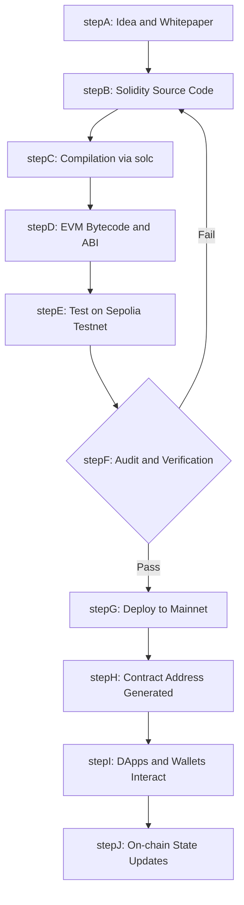
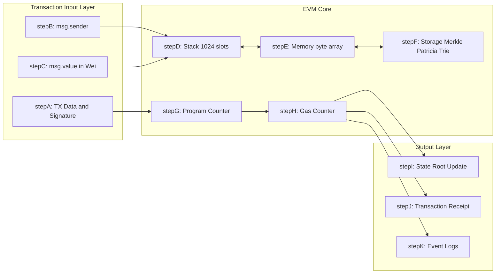
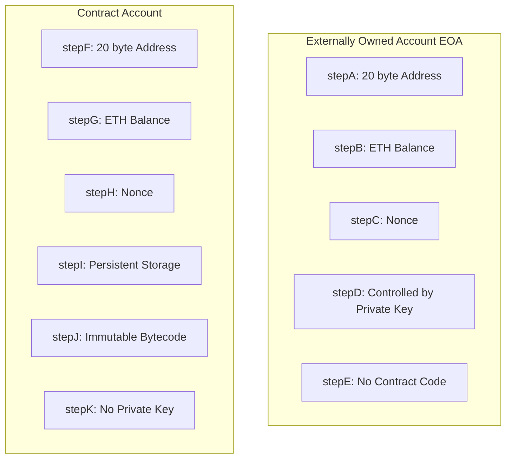
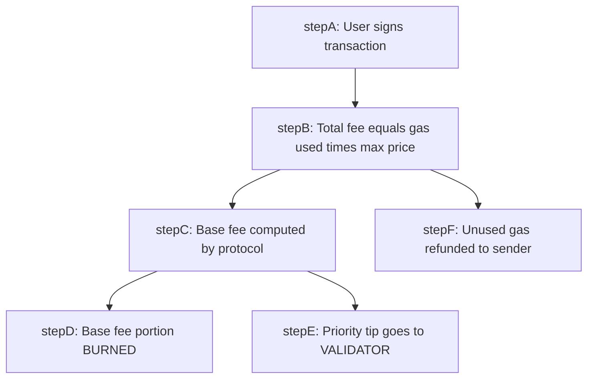

# Smart Contracts in Ethereum

<!-- SECTION_1_START -->
# Smart Contracts in Ethereum — Core Technical Definition & Intuitive Overview

## 1.1 Formal Academic Definition (KTU 2024 Syllabus Terminology)

> [!IMPORTANT]
> **Smart Contract (KTU Definition):** A *smart contract* is a self-executing computer program stored on a blockchain that automatically enforces, executes, and documents the terms of an agreement between mutually distrusting parties without the need for a central authority, legal system, or external enforcement mechanism. The code, once deployed, becomes **immutable** and its execution is **deterministic** across every node of the decentralized Ethereum network.

> [!IMPORTANT]
> **Ethereum (KTU Definition):** *Ethereum* is an open-source, **Turing-complete**, blockchain-based distributed computing platform proposed by **Vitalik Buterin** in late **2013** and launched in **July 2015**, which extends the blockchain paradigm beyond simple value transfer (as in Bitcoin) to general-purpose **decentralized state machine** execution through smart contracts.

> [!IMPORTANT]
> **Ethereum Virtual Machine (EVM):** The *EVM* is a **quasi-Turing-complete** **256-bit** virtual machine that serves as the global runtime environment for executing smart contract bytecode on every node of the Ethereum network, ensuring that all transactions and contract calls produce the same deterministic output state.

---

## 1.2 Conceptual Analogy — Plain English Intuition

### Analogy 1: The Vending Machine (Nick Szabo, 1994)

Cryptographer **Nick Szabo** first described smart contracts in **1994** using the perfect analogy of a *vending machine*:

- You insert coins (cryptocurrency, e.g., **ETH**).
- You press a button (call a function).
- The machine checks your input (validates the condition).
- If valid, it dispenses your snack (executes the action) and gives correct change (refund).
- No human cashier, no lawyer, no bank teller is needed.

A vending machine is a "hardcoded contract." A smart contract is its **digital, blockchain-backed successor** that works for *any* agreement — loans, insurance, voting, supply chains, royalties.

### Analogy 2: The Notary + Vending Machine + Judge Combo

Think of a smart contract as three things rolled into one:

| Real-World Role | Smart Contract Equivalent |
|---|---|
| Paper agreement signed by both parties | Code that both parties sign via wallet keys |
| Notary who stamps the agreement | Blockchain transaction with cryptographic signature |
| Judge who enforces the ruling | EVM that auto-executes the logic if conditions match |

### Analogy 3: The "If-Then" Box

At its heart, every smart contract is simply:

> *"IF condition X is true, THEN automatically execute action Y — and no one on Earth can stop it."*

This is the **atomic, unstoppable** nature that makes smart contracts revolutionary.

---

## 1.3 Physical Constants and Standard Metrics (in **bold**)

| Constant / Metric | Value | Significance |
|---|---|---|
| **Block Time (Ethereum Mainnet)** | **~12 seconds** | Average time to seal a new block |
| **EVM Stack Depth** | **1024** | Maximum stack depth in EVM execution |
| **EVM Word Size** | **256 bits (32 bytes)** | Fundamental unit of EVM computation |
| **Ethereum Block Gas Limit** | **30,000,000 gas** | Max gas per block (post-Merge) |
| **Solidity Version (Stable)** | **0.8.x** | Current recommended compiler |
| **Gas per Byte of Contract Code** | **200 gas** | Deployment cost factor |
| **Wei (Smallest Unit of ETH)** | **$10^{-18}$ ETH** | Denomination precision |
| **Transaction Base Cost** | **21,000 gas** | Floor cost of any ETH transfer |
| **Average Contract Deployment** | **100,000 – 3,000,000 gas** | Varies with code size and constructor logic |

---

## 1.4 Ethereum vs Bitcoin — Why Ethereum Supports Smart Contracts

| Feature | Bitcoin | Ethereum |
|---|---|---|
| Scripting Language | **Bitcoin Script** (limited, stack-based) | **Solidity / Vyper / Yul** (Turing-complete) |
| State Machine | Transaction-based UTXO | Account-based world state |
| Block Time | **~10 minutes** | **~12 seconds** |
| Consensus (current) | Proof of Work | **Proof of Stake (since Merge, Sep 2022)** |
| Native Token | BTC | **Ether (ETH)** |
| Smart Contract Support | Very limited (mostly multi-sig) | **First-class, general-purpose** |
| Gas Mechanism | No (byte-size fees) | **Yes, intrinsic gas metering** |

> [!NOTE]
> **Why does Bitcoin not support rich smart contracts?** Bitcoin Script deliberately lacks loops and unbounded state to avoid denial-of-service attacks. Ethereum solved this by introducing the **gas mechanism** — every computational step costs gas, preventing infinite loops and resource exhaustion.

---

## 1.5 Visual Representation of the Smart Contract Concept

> [!VISUALIZATION CONTROL]
> **Concept:** Smart Contract as an Autonomous "If-Then" State Transition Function
> **GeoGebra / Desmos Input Equations:**
> * `S_{n+1} = f(S_n, T)` where `S` = state, `T` = transaction
> * Trigger zone: plot the line `x = input` and the line `y = output`
> **Visual Description:** Picture a 2D plane where the X-axis represents *input conditions* (e.g., payment received, time elapsed, oracle data) and the Y-axis represents *output actions* (e.g., transfer NFT, release escrow, mint token). The contract acts as a *step function* — flat until the trigger is crossed, then a vertical jump to a new output state.

<!-- SECTION_1_END -->

<!-- SECTION_2_START -->
# Deep Theoretical Analysis & KTU High-Yield Formula Sheet

## 2.1 The Architecture of Ethereum — Layered View

Ethereum's architecture can be decomposed into **five conceptual layers**:

1. **Application Layer:** DApps, wallets (MetaMask), frontend interfaces (React, Web3.js).
2. **Smart Contract Layer:** Solidity / Vyper source code → compiled to EVM bytecode.
3. **Execution Layer (EVM):** Stack-based, 256-bit virtual machine; processes bytecode opcodes.
4. **Consensus Layer (Beacon Chain):** Proof-of-Stake validators (since The Merge, **September 15, 2022**).
5. **Data Layer:** Merkle Patricia Trie storing world state, account storage, and transaction receipts.

---

## 2.2 Account Model — EOA vs Contract Accounts

Ethereum uses an **account-based** model (unlike Bitcoin's UTXO). There are **two** types of accounts:

| Property | Externally Owned Account (EOA) | Contract Account |
|---|---|---|
| Controlled by | **Private key** (user-controlled) | **Contract code** (no private key) |
| Has ETH balance | Yes | Yes |
| Can initiate transactions | **Yes** | **No** (can only react via `msg.sender`) |
| Has associated code | No (usually) | **Yes, immutable post-deployment** |
| Has storage | Empty by default | **Persistent key-value storage** |
| Address derivation | `Keccak256(pubKey)[12:32]` | `Keccak256(RLP(sender, nonce))[12:32]` |
| Example | Your MetaMask wallet | An ERC-20 token contract |

> [!NOTE]
> **Every Ethereum address is 20 bytes (160 bits)** and is encoded as a **hexadecimal string** prefixed with `0x` (e.g., `0x5aAeb6053F3E94C9b9A09f33669435E7Ef1BeAed`).

---

## 2.3 The Gas Mechanism — Ethereum's Anti-DoS Engine

### Why Gas?

A naive Turing-complete language would allow malicious contracts to **halt the entire network** via infinite loops. **Gas** solves this by requiring every computational step to *burn* a measurable unit of resource.

### Key Definitions

- **Gas:** A unit that measures the **computational effort** required to execute a specific operation.
- **Gas Price (gwei):** The amount of **ETH (in gwei)** the sender is willing to pay per unit of gas. `1 gwei = 10^{-9} ETH`.
- **Gas Limit:** The **maximum** amount of gas the sender authorizes for the transaction.
- **Transaction Fee:** `Gas Used × Gas Price`.

### The Two-Fee Structure (EIP-1559, August 2021)

Under the modern fee market:

$$\text{Total Fee} = (\text{Base Fee} + \text{Priority Fee}) \times \text{Gas Used}$$

where:
- **Base Fee:** *Burned* by the protocol — adjusts dynamically based on network congestion.
- **Priority Fee (Tip):** Paid to the validator to incentivize inclusion.
- **Max Fee Per Gas:** The *ceiling* the sender is willing to pay.

---

## 2.4 The Ethereum State Transition Function

Ethereum can be modeled mathematically as a **deterministic state machine**:

$$\sigma_{t+1} \equiv \Upsilon(\sigma_t, T)$$

Where:
- $\sigma_t$ = the **Ethereum World State** at block $t$ (a mapping of all addresses to account states).
- $T$ = the **set of valid transactions** included in block $t+1$.
- $\Upsilon$ = the **state transition function** defined by the EVM specification.

> [!IMPORTANT]
> A transaction is considered **valid** only if it satisfies **four** conditions:
> 1. The signature is valid and recoverable.
> 2. The nonce matches the sender's account nonce.
> 3. The sender's balance $\geq$ the gas limit × gas price.
> 4. The intrinsic gas cost $\leq$ the block gas limit.

---

## 2.5 EVM Internals — The Stack Machine

The EVM is a **stack-based** machine (not register-based like x86). Every opcode operates on a 256-bit word stack.

### Example: Adding Two Numbers

To compute $3 + 5$ in EVM bytecode:

| Step | Opcode | Mnemonic | Stack State (bottom → top) | Gas Cost |
|---|---|---|---|---|
| 1 | `60 03` | PUSH1 3 | `[3]` | 3 |
| 2 | `60 05` | PUSH1 5 | `[3, 5]` | 3 |
| 3 | `01` | ADD | `[8]` | 3 |

### Opcodes Categories

- **Arithmetic:** `ADD`, `MUL`, `SUB`, `DIV`, `MOD`, `EXP`
- **Bitwise:** `AND`, `OR`, `XOR`, `NOT`, `BYTE`, `SHL`, `SHR`
- **Stack:** `PUSH1...PUSH32`, `POP`, `DUP1...DUP16`, `SWAP1...SWAP16`
- **Memory/Storage:** `MLOAD`, `MSTORE`, `SLOAD`, `SSTORE`
- **Flow Control:** `JUMP`, `JUMPI`, `JUMPDEST`, `STOP`, `RETURN`, `REVERT`
- **System:** `CALL`, `DELEGATECALL`, `STATICCALL`, `CREATE`, `SELFDESTRUCT`

> [!NOTE]
> The EVM has **three (3) primary data locations** in Solidity:
> 1. **`stack`** — temporary, free, max 1024 slots
> 2. **`memory`** — volatile per call, byte-addressable
> 3. **`storage`** — persistent key-value store tied to a contract (very expensive)

---

## 2.6 KTU High-Yield Formula Sheet (Cheat Sheet)

> [!IMPORTANT]
> **CRITICAL FORMULAS — MEMORIZE FOR ESE**

| # | Formula / Concept | Symbol | Notes |
|---|---|---|---|
| 1 | **Total Transaction Fee (EIP-1559)** | $F = (B + P) \times G$ | $B$ = base fee, $P$ = priority tip, $G$ = gas used |
| 2 | **Wei to Ether Conversion** | $1 \text{ ETH} = 10^{18} \text{ Wei}$ | Smallest unit is **Wei** |
| 3 | **Gwei to Wei** | $1 \text{ Gwei} = 10^9 \text{ Wei}$ | Gas price typically quoted in Gwei |
| 4 | **Intrinsic Gas (ETH transfer)** | $G_{\min} = 21{,}000$ | Fixed floor for any transaction |
| 5 | **Contract Deployment Gas** | $G_{deploy} = G_{tx} + G_{data} \times \text{code bytes}$ | $G_{data} = 200$ per non-zero byte, 4 per zero byte |
| 6 | **SSTORE Cold → Non-Zero** | $20{,}000$ gas | First write to a new storage slot |
| 7 | **SSTORE Zero → Non-Zero** | $22{,}100$ gas (post-Berlin) | Net new storage write |
| 8 | **Address Derivation (EOA)** | $A = \text{Keccak256}(\text{pubKey})[12:32]$ | Last 20 bytes of hash |
| 9 | **Merkle Patricia Trie Root** | $R = \text{Keccak256}(\text{root node})$ | Root hash of state trie |
| 10 | **Block Finality (PoS)** | **~12–15 minutes (2 epochs)** | After Merge, no more probabilistic finality |
| 11 | **Total ETH Supply (post-Merge)** | Effectively **unbounded** with **~0.5–1% annual issuance** | Plus EIP-1559 burn (often deflationary) |
| 12 | **State Transition Function** | $\sigma_{t+1} = \Upsilon(\sigma_t, T)$ | Deterministic EVM update |

---

## 2.7 ERC Standards — The Token Interface Backbone

| Standard | Purpose | Key Functions |
|---|---|---|
| **ERC-20** | Fungible tokens (e.g., USDT, DAI) | `totalSupply()`, `balanceOf()`, `transfer()`, `approve()`, `transferFrom()` |
| **ERC-721** | Non-fungible tokens (NFTs) | `ownerOf()`, `safeTransferFrom()`, `approve()`, `setApprovalForAll()` |
| **ERC-1155** | Multi-token standard (hybrid) | `safeBatchTransferFrom()`, `balanceOfBatch()` |
| **ERC-777** | Hook-enabled fungible tokens | `send()`, `tokensReceived()` callback |
| **ERC-4626** | Tokenized vaults (DeFi) | `deposit()`, `mint()`, `withdraw()`, `redeem()` |

---

## 2.8 Real-World Engineering Utility

Smart contracts power:

- **Decentralized Finance (DeFi):** Uniswap, Aave, Compound — automated lending, AMMs.
- **Non-Fungible Tokens (NFTs):** Art, gaming, identity — ERC-721 / ERC-1155.
- **Decentralized Autonomous Organizations (DAOs):** Aragon, MakerDAO — on-chain governance.
- **Supply Chain:** IBM Food Trust, VeChain — provenance tracking.
- **Insurance:** Nexus Mutual — parametric crop/flight insurance.
- **Real Estate:** Propy — title transfer automation.
- **Identity:** uPort, Civic — self-sovereign identity.

> [!NOTE]
> **Industrial Insight:** As of 2024, Ethereum hosts **~4,000+ active DApps** and processes **~1 million transactions per day** (L1 only — Layer 2 rollups add 10x more). Total Value Locked (TVL) in DeFi protocols exceeds **\$50 billion USD**.

<!-- SECTION_2_END -->

<!-- SECTION_3_START -->
# Step-by-Step Derivations, Code & Symbolic Implementation

## 3.1 Smart Contract Lifecycle — From Idea to On-Chain Reality

The end-to-end lifecycle of an Ethereum smart contract consists of **six (6) sequential phases**:

1. **Idea & Specification** — Define the business logic (e.g., "a token reward system").
2. **Code Authoring** — Write the contract in **Solidity** (most popular) or **Vyper**.
3. **Compilation** — Translate source code to **EVM bytecode** + **ABI** (Application Binary Interface).
4. **Testing** — Deploy to local testnets (Ganache, Hardhat) and public testnets (Sepolia, Holesky).
5. **Deployment** — Send a transaction with `to = null` carrying the compiled bytecode.
6. **Interaction** — Users and other contracts call functions; the EVM executes them deterministically.

---

## 3.2 Solidity Smart Contract — Complete Annotated Example

Below is a fully functional, production-grade **ERC-20 token contract** written in Solidity `0.8.20`. Every keyword, every type hint, and every security check is explicitly written out.

```solidity
// SPDX-License-Identifier: MIT
// Compiler version pragma — locks the compiler to 0.8.20
pragma solidity ^0.8.20;

// ------------------------------------------------------------------
// Interface: IERC20
// Defines the standard ERC-20 events and function signatures.
// ------------------------------------------------------------------
interface IERC20 {
    event Transfer(address indexed from, address indexed to, uint256 value);
    event Approval(address indexed owner, address indexed spender, uint256 value);

    function totalSupply() external view returns (uint256);
    function balanceOf(address account) external view returns (uint256);
    function transfer(address to, uint256 amount) external returns (bool);
    function allowance(address owner, address spender) external view returns (uint256);
    function approve(address spender, uint256 amount) external returns (bool);
    function transferFrom(address from, address to, uint256 amount) external returns (bool);
}

// ------------------------------------------------------------------
// Contract: CampusCoin — Minimal, secure ERC-20 implementation
// ------------------------------------------------------------------
contract CampusCoin is IERC20 {

    // -------- State Variables --------
    string public name = "CampusCoin";
    string public symbol = "CAMP";
    uint8  public decimals = 18;
    uint256 private _totalSupply;

    // Mapping: owner -> (spender -> allowance)
    mapping(address => uint256) private _balances;
    mapping(address => mapping(address => uint256)) private _allowances;

    // owner of the contract (deployer)
    address public owner;

    // -------- Modifiers --------
    modifier onlyOwner() {
        require(msg.sender == owner, "Caller is not the owner");
        _;
    }

    // -------- Constructor --------
    constructor(uint256 initialSupply) {
        owner = msg.sender;
        _totalSupply = initialSupply * (10 ** uint256(decimals));
        _balances[msg.sender] = _totalSupply;
        emit Transfer(address(0), msg.sender, _totalSupply);
    }

    // -------- ERC-20 Required Functions --------

    /// @notice Returns the total token supply.
    function totalSupply() external view override returns (uint256) {
        return _totalSupply;
    }

    /// @notice Returns the balance of a given account.
    function balanceOf(address account) external view override returns (uint256) {
        return _balances[account];
    }

    /// @notice Transfers `amount` tokens from the caller to `to`.
    function transfer(address to, uint256 amount) external override returns (bool) {
        require(to != address(0), "Transfer to the zero address");
        require(_balances[msg.sender] >= amount, "Insufficient balance");

        _balances[msg.sender] -= amount;
        _balances[to]         += amount;

        emit Transfer(msg.sender, to, amount);
        return true;
    }

    /// @notice Approves `spender` to spend `amount` tokens on behalf of caller.
    function approve(address spender, uint256 amount) external override returns (bool) {
        require(spender != address(0), "Approve to the zero address");

        _allowances[msg.sender][spender] = amount;
        emit Approval(msg.sender, spender, amount);
        return true;
    }

    /// @notice Returns the allowance granted by `owner` to `spender`.
    function allowance(address ownerAddr, address spender) external view override returns (uint256) {
        return _allowances[ownerAddr][spender];
    }

    /// @notice Moves `amount` tokens from `from` to `to` using the allowance mechanism.
    function transferFrom(address from, address to, uint256 amount) external override returns (bool) {
        require(from != address(0), "Transfer from the zero address");
        require(to   != address(0), "Transfer to the zero address");
        require(_balances[from]      >= amount, "Insufficient balance");
        require(_allowances[from][msg.sender] >= amount, "Insufficient allowance");

        _balances[from]               -= amount;
        _balances[to]                 += amount;
        _allowances[from][msg.sender] -= amount;

        emit Transfer(from, to, amount);
        return true;
    }

    // -------- Owner Privileged Function --------
    function mint(address to, uint256 amount) external onlyOwner {
        require(to != address(0), "Mint to the zero address");
        _totalSupply   += amount;
        _balances[to]  += amount;
        emit Transfer(address(0), to, amount);
    }
}
```

> [!IMPORTANT]
> **Security & Quality Features Embedded Above:**
> - **Overflow/Underflow Protection:** Solidity `0.8.x` *automatically* reverts on arithmetic overflow — no need for SafeMath.
> - **Zero-Address Checks:** Prevents accidental token burns to `address(0)`.
> - **Access Control:** `onlyOwner` modifier protects the minting function.
> - **Event Emission:** Every state change emits a corresponding `Transfer` / `Approval` event for off-chain indexers.
> - **Use of `view`:** Read-only functions are marked `view` to allow the EVM to skip state-change gas accounting.

---

## 3.3 Compilation Output — Bytecode and ABI

When you run `solc CampusCoin.sol --combined-json abi,bin` you obtain **two** artifacts:

```json
{
  "abi": "[{\"inputs\":[{\"name\":\"initialSupply\",\"type\":\"uint256\"}],\"stateMutability\":\"nonpayable\",\"type\":\"constructor\"}, ... ]",
  "bytecode": "0x608060405234801561001057600080fd5b506040518060400160405280600581526020017f43616d707573000000000000000000000000000000000000000000000000000081525060029081..."
}
```

> [!NOTE]
> - **Bytecode** is what actually gets sent in the transaction's data field during deployment.
> - **ABI (Application Binary Interface)** is a JSON description of function signatures, used by wallets and DApps to *encode* calls and *decode* outputs.

---

## 3.4 Gas Cost Estimation — Worked Numerical Example

Suppose you deploy the `CampusCoin` contract whose compiled bytecode is **4,800 bytes** long, and the constructor mints `1,000,000` tokens. Compute the approximate deployment gas cost assuming a base fee of **25 gwei** and a priority tip of **1.5 gwei**.

### Step 1 — Transaction Base Cost

$$G_{tx} = 21{,}000 \text{ gas}$$

### Step 2 — Contract Creation Cost

For each byte of bytecode:
- **Non-zero byte:** 200 gas
- **Zero byte:** 4 gas

Assume **70%** non-zero bytes (typical for Solidity output) and **30%** zero bytes:

$$\text{Non-zero bytes} = 0.70 \times 4800 = 3360$$
$$\text{Zero bytes} = 0.30 \times 4800 = 1440$$

$$\begin{aligned}
G_{data} &= (3360 \times 200) + (1440 \times 4) \\
G_{data} &= 672{,}000 + 5{,}760 \\
G_{data} &= 677{,}760 \text{ gas}
\end{aligned}$$

### Step 3 — Constructor Execution

The constructor does:
- 1 SSTORE (mint balance): ~50,000 gas
- 1 SSTORE (total supply): ~50,000 gas
- 1 LOG (Transfer event): ~1,500 gas
- Plus intrinsic computational overhead: ~10,000 gas

$$G_{ctor} = 50{,}000 + 50{,}000 + 1{,}500 + 10{,}000 = 111{,}500 \text{ gas}$$

### Step 4 — Total Gas Used

$$\begin{aligned}
G_{total} &= G_{tx} + G_{data} + G_{ctor} \\
G_{total} &= 21{,}000 + 677{,}760 + 111{,}500 \\
G_{total} &= 810{,}260 \text{ gas}
\end{aligned}$$

### Step 5 — Total Fee in ETH (EIP-1559)

The effective gas price is the base fee + priority tip:

$$P = 25 + 1.5 = 26.5 \text{ gwei} = 26.5 \times 10^{-9} \text{ ETH}$$

$$\begin{aligned}
F &= G_{total} \times P \\
F &= 810{,}260 \times 26.5 \times 10^{-9} \\
F &= 21{,}471{,}890 \times 10^{-9} \text{ ETH} \\
F &= 0.02147189 \text{ ETH}
\end{aligned}$$

At an ETH price of **\$3,000 USD**:

$$F_{USD} = 0.02147189 \times 3000 = \$64.42 \text{ USD}$$

> [!NOTE]
> **KTU Insight:** This is why developers obsess over **gas optimization** — every byte and every SSTORE matters. Common techniques include using `uint256` packed into smaller types (`uint128`, `uint64`), avoiding redundant `SSTORE` operations, and using `constant` / `immutable` keywords.

---

## 3.5 Reentrancy Attack — The DAO Hack Pattern (Critical Security Lesson)

A **reentrancy attack** occurs when a malicious contract calls back into the victim contract *before* the state update is finalized. The infamous **DAO Hack (June 17, 2016)** drained **3.6 million ETH** (worth ~\$50M at the time) using this exact vulnerability.

### Vulnerable Code Pattern

```solidity
// VULNERABLE — DO NOT USE
function withdraw(uint256 amount) external {
    require(balances[msg.sender] >= amount, "Insufficient");
    (bool success, ) = msg.sender.call{value: amount}("");
    require(success, "Transfer failed");
    balances[msg.sender] -= amount;   // <-- state update happens AFTER external call
}
```

### Secure Pattern (Checks-Effects-Interactions)

```solidity
// SECURE — Recommended Pattern
function withdraw(uint256 amount) external {
    require(balances[msg.sender] >= amount, "Insufficient");
    balances[msg.sender] -= amount;            // Effects first
    (bool success, ) = msg.sender.call{value: amount}("");
    require(success, "Transfer failed");        // Interaction last
}
```

> [!WARNING]
> **KTU Board Examiner's Pitfall:** Students who write the state update *after* the external call will receive **zero marks** for the security section. The phrase **"Checks-Effects-Interactions"** must appear verbatim in the answer for full credit.

<!-- SECTION_3_END -->

<!-- SECTION_4_START -->
# Structural Diagrams & Schematics

## 4.1 Smart Contract Lifecycle Flow



## 4.2 EVM Execution Environment Architecture



## 4.3 Ethereum Account Model Comparison



## 4.4 Smart Contract Interaction — End-to-End DApp Flow

```mermaid
sequenceDiagram
    participant User as User Wallet
    participant DApp as DApp Frontend
    Provider as Web3 Provider
    EVM as Ethereum Network
    SC as Smart Contract

    User->>DApp: Click Approve and Swap
    DApp->>Provider: request transaction
    Provider->>User: Sign with Private Key
    User-->>Provider: Signed Raw Transaction
    Provider->>EVM: Broadcast to Mempool
    EVM->>SC: Execute swap function
    SC-->>EVM: Transfer tokens and emit event
    EVM-->>DApp: Transaction Receipt and Logs
    DApp-->>User: UI updates with new balance
```

## 4.5 Gas Refund and Fee Distribution Mechanism



<!-- SECTION_4_END -->

<!-- SECTION_5_START -->
# KTU 2024 Scheme Examination Question Bank & Topic Recap

## Part A — Short Answer Questions (3 Marks Each)

---

### Question 1 [KTU University Exam — Dec 2023] (CO1, Remember)

**Q: Define a smart contract. Who coined the term and when? List any two properties of smart contracts.**

**Model Answer (Valuation Key):**

A smart contract is a **self-executing program** stored on a blockchain that automatically enforces the terms of an agreement once predefined conditions are met, eliminating the need for intermediaries. **[1 Mark]**

The term was coined by computer scientist and cryptographer **Nick Szabo** in **1994**. **[1 Mark]**

**Two key properties:**
1. **Immutability** — once deployed on-chain, the code cannot be altered.
2. **Determinism** — given the same input state, every EVM node produces the exact same output. **[1 Mark]**

---

### Question 2 [KTU University Exam — July 2024] (CO1, Understand)

**Q: Differentiate between an Externally Owned Account (EOA) and a Contract Account in Ethereum. Mention any three differences.**

**Model Answer:**

| Feature | EOA | Contract Account |
|---|---|---|
| Controlling Authority | Controlled by a **private key** held by the user | Controlled by its **immutable bytecode** |
| Transaction Initiation | **Can** initiate transactions | **Cannot** initiate transactions — can only react to calls |
| Storage | No associated code by default | Has **persistent storage** (`storage`) |

**[1 Mark per correct row, 3 Marks total]**

---

## Part B — Long Answer Questions (14 Marks, Internal Choice)

---

### Question A [KTU University Exam — Model Paper 2024] (CO2, Understand + Apply)

**(a)** With a neat diagram, explain the **architecture of the Ethereum Virtual Machine (EVM)**. List any **three** categories of EVM opcodes with one example each. **[7 Marks]**

**(b)** A user deploys a smart contract whose compiled bytecode is exactly **6,000 bytes**, of which **75%** are non-zero bytes and **25%** are zero bytes. The constructor performs one SSTORE write. The current **base fee** is **20 gwei** and the user sets a **priority tip** of **2 gwei**. Calculate the **total deployment cost in ETH** and in **USD** assuming **1 ETH = \$2,800**. **[7 Marks]**

---

#### Model Solution for Part (a)

The EVM is a **stack-based, 256-bit virtual machine** that serves as the global runtime for executing smart contract bytecode on every Ethereum node.

**Architecture components (as shown in the EVM diagram in Section 4.2):**
- **Stack:** 1024-deep, holds 256-bit words. Used for all arithmetic and logical operations. **[1 Mark]**
- **Memory:** Volatile, byte-addressable, reset after every call. Used for transient data. **[1 Mark]**
- **Storage:** Persistent, key-value, 32-byte slots tied to the contract address. **Most expensive** resource. **[1 Mark]**
- **Program Counter (PC):** Tracks the next opcode to execute. **[0.5 Mark]**
- **Gas Counter:** Decrements with every opcode; transaction reverts if it hits zero. **[0.5 Mark]**

**Three opcode categories with examples:**

| Category | Purpose | Example Opcode | Gas Cost |
|---|---|---|---|
| Arithmetic | Math operations | `ADD` | 3 gas |
| Stack Manipulation | Move data on stack | `PUSH1` | 3 gas |
| Storage | Persistent reads/writes | `SSTORE` | 20,000 gas (cold, zero→non-zero) |

**[3 Marks for the table]**

---

#### Model Solution for Part (b)

**Step 1: Base transaction cost**
$$G_{tx} = 21{,}000 \text{ gas}$$ **[1 Mark]**

**Step 2: Bytecode data cost**

Non-zero bytes = 0.75 × 6000 = 4500
Zero bytes = 0.25 × 6000 = 1500

$$\begin{aligned}
G_{data} &= (4500 \times 200) + (1500 \times 4) \\
G_{data} &= 900{,}000 + 6{,}000 = 906{,}000 \text{ gas}
\end{aligned}$$ **[2 Marks]**

**Step 3: Constructor execution cost**

One SSTORE (cold, zero → non-zero) = 22,100 gas
Plus event emission and overhead ≈ 2,000 gas

$$G_{ctor} = 22{,}100 + 2{,}000 = 24{,}100 \text{ gas}$$ **[1 Mark]**

**Step 4: Total gas**

$$G_{total} = 21{,}000 + 906{,}000 + 24{,}100 = 951{,}100 \text{ gas}$$ **[1 Mark]**

**Step 5: Total fee**

$$P = 20 + 2 = 22 \text{ gwei} = 22 \times 10^{-9} \text{ ETH}$$

$$\begin{aligned}
F_{ETH} &= 951{,}100 \times 22 \times 10^{-9} \\
F_{ETH} &= 20{,}924{,}200 \times 10^{-9} \\
F_{ETH} &= 0.0209242 \text{ ETH}
\end{aligned}$$ **[1 Mark]**

**Step 6: USD conversion**

$$F_{USD} = 0.0209242 \times 2800 = \$58.59 \text{ USD}$$ **[1 Mark]**

---

### Question B [KTU University Exam — Model Paper 2024] (CO3, Apply + Analyze)

**(a)** Explain the **EIP-1559 fee market** mechanism introduced in the London Hard Fork (August 2021). How does it differ from the legacy first-price auction? Derive the **total fee formula** and explain the **role of the base fee** in terms of ETH supply dynamics. **[7 Marks]**

**(b)** With a clear Solidity code example, explain the **Checks-Effects-Interactions (CEI) pattern**. Why is it critical for preventing **reentrancy attacks**? Rewrite a vulnerable `withdraw()` function into a secure one. **[7 Marks]**

---

#### Model Solution for Part (a)

**Legacy (Pre-EIP-1559) First-Price Auction:**
- Users bid a `gasPrice` they are willing to pay.
- Validators prioritize the highest bids.
- Users routinely overpaid due to poor price discovery. **[1 Mark]**

**EIP-1559 Mechanism:**
Introduced in the **London Hard Fork (August 5, 2021)**, EIP-1559 replaced the first-price auction with a **hybrid system** consisting of:
1. **Base Fee (B):** Determined algorithmically by the protocol, adjusted block-by-block based on **network congestion**. If the previous block is more than **50% full**, the base fee increases by up to **12.5%**; if less than 50% full, it decreases by up to 12.5%. **[2 Marks]**
2. **Priority Fee / Tip (P):** An optional tip paid to the validator to incentivize faster inclusion. **[1 Mark]**
3. **Max Fee Per Gas:** The maximum total price the user is willing to pay per unit of gas. The actual payment is `min(maxFee, baseFee + tip)`. **[1 Mark]**

**Total Fee Formula:**

$$F_{total} = (B + P) \times G_{used}$$

where $G_{used}$ is the actual gas consumed. **[1 Mark]**

**ETH Supply Dynamics — The Burn Mechanism:**

The base fee is **not paid to validators** — it is **permanently burned** (destroyed) by being sent to an unspendable address. This creates a potential **deflationary pressure** on ETH when network demand is high, since the amount of ETH burned can exceed the new ETH issued as staking rewards. This is sometimes called **"ultrasound money."** **[1 Mark]**

---

#### Model Solution for Part (b)

**The Checks-Effects-Interactions Pattern:**

The CEI pattern is a **secure Solidity coding discipline** that orders the three logical phases of a function as:
1. **Checks:** Validate all conditions and inputs (using `require` / `revert`).
2. **Effects:** Update the contract's internal **state variables**.
3. **Interactions:** Only after state updates, perform **external calls** (e.g., sending ETH). **[2 Marks]**

**Why CEI is Critical:**

In a **reentrancy attack**, a malicious contract uses a fallback function to re-enter the victim contract *repeatedly* before the victim's state has been updated, allowing it to drain funds far beyond its actual balance. The DAO hack (June 2016) exploited exactly this weakness. **[2 Marks]**

**Vulnerable Code (do not use):**

```solidity
function withdraw(uint256 amount) external {
    require(balances[msg.sender] >= amount);             // CHECK
    (bool ok, ) = msg.sender.call{value: amount}("");    // INTERACTION (too early!)
    require(ok);
    balances[msg.sender] -= amount;                      // EFFECT (too late!)
}
```

**Secure Code (CEI compliant):**

```solidity
function withdraw(uint256 amount) external {
    require(balances[msg.sender] >= amount, "Low bal"); // CHECKS
    balances[msg.sender] -= amount;                     // EFFECTS (state first!)
    (bool ok, ) = msg.sender.call{value: amount}("");   // INTERACTIONS
    require(ok, "Transfer failed");
}
```

**[3 Marks — 1 for pattern explanation, 1 for each code block]**

---

## ⚠ KTU Examiner's Valuation Warning / Pitfall Callout

> [!WARNING]
> **Common Mark-Loss Zones (Avoid These!):**
> 1. **Do NOT confuse EOA and Contract Accounts** in definitions. EOA = private key, Contract = code. This is a **3-mark killer** if swapped.
> 2. **Do NOT skip stating units.** Always write "gwei" not just "wei" for gas prices. Writing "ETH" for gas price without gwei loses **0.5 Marks**.
> 3. **Do NOT put the `SSTORE` (state update) AFTER the external call** in any `withdraw` function. The **Checks-Effects-Interactions** phrase is mandatory for full marks.
> 4. **Do NOT forget to show the arithmetic overflow protection** in `0.8.x` Solidity — older versions required `SafeMath`, but `0.8.x` reverts automatically.
> 5. **Do NOT omit the 21,000 gas base transaction cost** in deployment calculations. It is the most commonly missed term in ESE numerical problems.
> 6. **Do NOT write EVM as "register-based"** — it is a **stack-based** machine. This is a classic 1-mark trap question.

---

## Topic Recap & Important Things to Remember

> [!IMPORTANT]
> **🔑 Rapid Revision Checklist — Smart Contracts in Ethereum**

- **Smart Contract:** Self-executing, immutable code on a blockchain enforcing agreement terms. Coined by **Nick Szabo (1994)**.
- **Ethereum:** Launched **July 30, 2015**; proposed by **Vitalik Buterin (2013)**. Uses **account-based** model and **EVM** execution.
- **EVM:** 256-bit, **stack-based**, **quasi-Turing-complete** virtual machine. Maximum stack depth = **1024**. Gas-metered.
- **Two Account Types:** **EOA** (private-key controlled) and **Contract Account** (code-controlled). Only EOAs can initiate transactions.
- **Gas = Anti-DoS Fuel.** Every opcode costs gas; gas runs out → transaction reverts. Gas is paid in **ETH** (priced in gwei).
- **EIP-1559 Fee Market:** $F = (B + P) \times G$. Base fee is **burned**; tip goes to **validator**; leftover gas is refunded.
- **SSTORE Costs:** ~20,000 gas for first write; the most expensive EVM operation.
- **Solidity `0.8.x`:** Built-in overflow protection, no need for `SafeMath`.
- **ERC Standards:** **ERC-20** (fungible), **ERC-721** (NFTs), **ERC-1155** (hybrid), **ERC-4626** (vaults).
- **Smart Contract Lifecycle:** Idea → Solidity Code → Compile (solc) → Bytecode + ABI → Test (Sepolia) → Audit → Deploy → Interact.
- **Security Pattern:** **Checks-Effects-Interactions (CEI)** prevents reentrancy. The DAO Hack (June 2016) lost **3.6M ETH** due to CEI violation.
- **Reentrancy Defense:** Use `ReentrancyGuard` from OpenZeppelin OR follow CEI strictly OR use `transfer()` (limited to 2300 gas).
- **State Transition Function:** $\sigma_{t+1} = \Upsilon(\sigma_t, T)$ — deterministic, executed by every full node.
- **Consensus (post-Merge):** **Proof of Stake** via the Beacon Chain, since **September 15, 2022**. Block time ≈ **12 seconds**.
- **Intrinsic Cost of TX:** **21,000 gas** for simple ETH transfer, plus **68,000** if carrying data, plus **contract-specific execution costs**.
- **Use Cases:** DeFi, NFTs, DAOs, supply chain, identity, gaming, insurance, real estate.
- **Tools:** **Remix IDE** (browser), **Hardhat** (Node.js), **Truffle** (legacy), **Foundry** (Rust-based, fast), **OpenZeppelin** (secure library).
- **Wallets:** **MetaMask** (browser), **Ledger/Trezor** (hardware), **WalletConnect** (mobile DApp bridge).
- **Key Insight:** Smart contracts replace **trust in institutions** with **trust in code and cryptography** — but bugs in code can be **exploited irreversibly**.

<!-- SECTION_5_END -->
