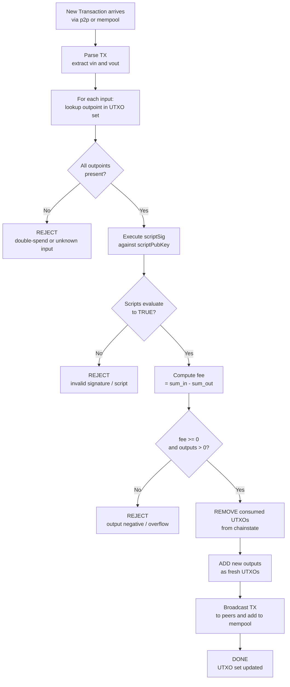
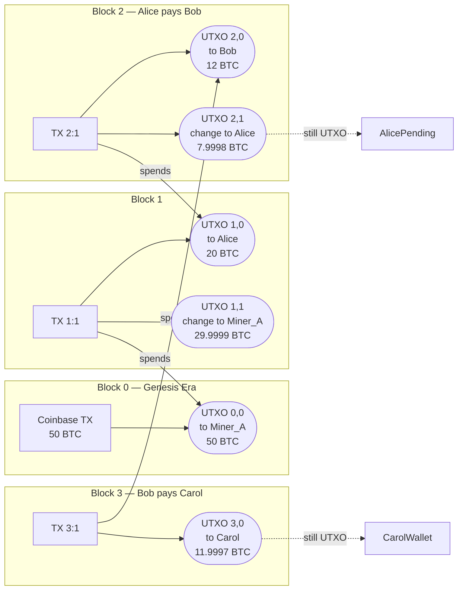
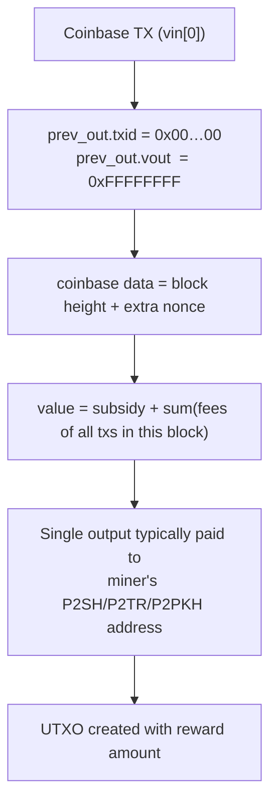

# Tracking Bitcoins-Unspent Transaction Outputs

<!-- SECTION_1_START -->
# 1. Core Technical Definition & Intuitive Overview

## 1.1 Formal Academic Definition (KTU 2024 Syllabus Terminology)

> [!IMPORTANT]
> **Unspent Transaction Output (UTXO):** A discrete, indivisible chunk of bitcoin value that has been authorized by a prior transaction and has not yet been spent. The entire UTXO model is the stateless accounting paradigm used by the Bitcoin protocol, wherein the global state of the system is defined by the **UTXO Set** — a cryptographically-verifiable set of all spendable transaction outputs.

In the Bitcoin ledger, there are **no accounts** and **no balances** at the protocol level. A user's apparent "balance" is merely the sum of all UTXOs their private keys can unlock. Every full node in the network maintains its own copy of this **UTXO Set**, which acts as the authoritative source of truth for ownership.

> [!NOTE]
> **Core Terminology Mapping (KTU Module 3 Vocabulary)**
> - **Transaction (TX):** A signed data structure that consumes some UTXOs and creates new ones.
> - **Input (vin):** A reference (pointer) to a previously created UTXO, paired with an unlocking proof.
> - **Output (vout):** A new chunk of value locked under a specific spending condition.
> - **Outpoint:** The exact identifier of a UTXO, formed as `(transaction_id, output_index)`.
> - **Coinbase Transaction:** The special first transaction in each block that creates brand-new bitcoin (the mining reward).

## 1.2 Conceptual Analogy — "Cash and Locked Envelopes"

Imagine you walk into a bank, but the teller refuses to open a savings account for you. Instead, every time someone pays you, the teller hands you a **sealed envelope containing a fixed amount of cash**. The envelope has a unique serial number and can only be opened with your signature.

Now imagine three rules:

1. **You cannot partially open an envelope.** If you need to pay someone less than what's inside, you must open the envelope, take out the full amount, and ask the teller to put the change into a *new* sealed envelope addressed back to you (or to someone else).
2. **Every envelope is stamped with a serial number**, and once you spend it, the teller crosses it out forever in the public registry.
3. **The public registry only lists *unspent* envelopes.** The spent ones are removed.

That registry of unspent envelopes is precisely the **UTXO Set**. Your "bitcoin balance" is just the total cash sitting in all the unspent envelopes currently in your possession.

> [!TIP]
> **Why the UTXO Model Matters:** Because each UTXO is self-contained, transactions can be **validated in parallel** and the system avoids the double-spend problem without a central account database. This is one of the foundational pillars of Bitcoin's decentralization, and a direct **CO1 (Understand)** mapping for KTU Module 3.

## 1.3 Physical & Cryptographic Constants Referenced

| Constant / Metric | Standard Value | Description |
|---|---|---|
| **Smallest unit of bitcoin** | **1 satoshi = $10^{-8}$ BTC** | All UTXO amounts are integer counts of satoshis. |
| **Maximum block size (post-SegWit)** | **4 000 000 weight units** | Affects how many UTXO spends fit in one block. |
| **Total bitcoin supply cap** | **21 000 000 BTC** | Total of all UTXOs that will ever exist. |
| **Block subsidy halving interval** | **210 000 blocks** | New bitcoin minted in coinbase UTXOs halves. |
| **Reference client UTXO cache** | **~ 5–6 GB (as of 2024)** | Memory footprint of `chainstate` in Bitcoin Core. |

## 1.4 Visualization Concept

> [!VISUALIZATION CONTROL]
> **Concept:** UTXO Lifecycle — From creation (coinbase) → spending → replacement.
> **GeoGebra / Desmos Input:** Not applicable (state-machine diagram, not a function plot).
> **Visual Description:** Picture a directed acyclic graph where each node is a transaction, each outgoing arrow is a *new UTXO*, and each incoming arrow is a *consumed UTXO*. The "frontier" of unspent arrows constitutes the UTXO Set at any block height $h$. A "wallet balance" is the sum of all arrow-head values that point to addresses controlled by the same private key.

<!-- SECTION_1_END -->

<!-- SECTION_2_START -->
# 2. Deep Theoretical Analysis & KTU High-Yield Formula Sheet

## 2.1 The Anatomy of a Bitcoin Transaction

A raw Bitcoin transaction (post-SegWit, **BIP-141**) contains the following structural components:

| Field | Purpose | KTU-Relevant Insight |
|---|---|---|
| `version` | TX format version | Currently `2` (Taproot era). |
| `n_inputs` (marker + flag) | SegWit separator | Always `0x00 0x01`. |
| `tx_in[]` | Array of inputs | Each references one outpoint. |
| `tx_out[]` | Array of outputs | Each becomes a new UTXO. |
| `witness[]` | SegWit signatures | Moved out of the legacy `scriptSig`. |
| `locktime` | Earliest block/time spendable | Defaults to `0` (immediate). |

### 2.1.1 Input Structure
Every input must contain:

- **`previous_outpoint`** → `(txid, vout)` — a **32-byte hash** plus a **4-byte index** uniquely identifying the UTXO being spent.
- **`scriptSig`** (or **witness** in SegWit) — the *unlocking script* that satisfies the locking condition of the referenced UTXO.
- **`sequence`** — a 32-bit field used for RBF (Replace-By-Fee) and relative timelocks.

### 2.1.2 Output Structure
Every output contains:

- **`value`** → an **8-byte little-endian integer** representing satoshis. Always $\geq 0$ and $< 21{,}000{,}000 \times 10^8$.
- **`scriptPubKey`** (locking script) → the *spending condition* the next owner must satisfy (typically a public-key-hash check or, post-Taproot, a Schnorr-key-path spend).

## 2.2 The UTXO Set — Operational Logic

The Bitcoin Core client stores the UTXO set on disk in a LevelDB database called **`chainstate`**. The operational flow for any node is:

1. **Bootstrap:** On startup, scan the genesis block onward, applying every transaction.
2. **Validation per TX:** For each new transaction:
   - Look up each referenced outpoint in the UTXO set.
   - Reject if **any** outpoint is missing (already spent) → this is the **double-spend check**.
   - Verify the `scriptSig`/`witness` against the `scriptPubKey` of the referenced UTXO.
3. **State Transition:** If valid, **remove** all consumed UTXOs and **insert** all newly created outputs into the UTXO set.
4. **Mempool Acceptance:** Only valid transactions are relayed and held in the memory pool.

> [!IMPORTANT]
> **The UTXO set is the only state a Bitcoin node needs to validate the chain.** The entire block history can theoretically be discarded once the UTXO set is reconstructed — this is the principle behind *Utreexo* and *accumulator-based* scaling research covered in advanced electives.

## 2.3 The Transaction-Fee Identity (Foundational KTU Formula)

Because UTXOs are **indivisible**, any excess value not explicitly sent to a recipient is implicitly claimed by the miner. The fee is therefore not stored; it is **derived**:

$$
\text{tx\_fee} \;=\; \sum_{i=1}^{n_{\text{in}}} \text{value}(in_i) \;-\; \sum_{j=1}^{n_{\text{out}}} \text{value}(out_j)
$$

In satoshis:

$$
\text{tx\_fee}_{\text{sat}} \;=\; \left(\sum_{i=1}^{n_{\text{in}}} v_i\right) \;-\; \left(\sum_{j=1}^{n_{\text{out}}} w_j\right)
$$

Where:
- $v_i$ = value of the $i^{\text{th}}$ consumed UTXO (in satoshis).
- $w_j$ = value of the $j^{\text{th}}$ newly created UTXO (in satoshis).
- $n_{\text{in}}, n_{\text{out}}$ are the number of inputs and outputs.

> [!NOTE]
> **The change-output rule:** If Alice has a UTXO worth $1.0$ BTC and wants to pay Bob $0.3$ BTC, her wallet will typically create **two** outputs: one of $0.3$ BTC to Bob, and one of $\approx 0.69999\text{ BTC}$ back to Alice (the difference is the miner fee). Forgetting the change output means **donating the entire remaining value to the miner** — a classic KTU exam pitfall.

## 2.4 KTU Formula Sheet / Cheat Sheet

| # | Formula / Rule | Engineering Interpretation |
|---|---|---|
| 1 | $\text{balance}_{\text{wallet}} = \displaystyle\sum_{k \in \text{user UTXOs}} v_k$ | A wallet's "balance" is the sum of all unlocked UTXO values. |
| 2 | $\text{tx\_fee} = \sum v_i - \sum w_j$ | Implicit fee — no explicit field exists in the TX. |
| 3 | $\text{dust\_threshold} \approx 3 \times \text{input\_cost\_at\_3\,sat/vB}$ | UTXOs below this are economically unspendable. |
| 4 | $\text{max\_block\_weight} = 4{,}000{,}000$ | Hard ceiling on transactions per block (SegWit). |
| 5 | $\text{halving} : B_h = 50 \times 2^{-\lfloor h/210{,}000 \rfloor}$ | Block subsidy in BTC. |
| 6 | $\text{outpoint} = H(\text{txid}) \,\vert\vert\, \text{vout}$ | Global unique identifier of a UTXO. |
| 7 | $\text{txid} = H_{\text{SHA256}}\bigl(H_{\text{SHA256}}(\text{serialized\_tx})\bigr)$ | Double-SHA-256 of the *non-witness* serialization. |

## 2.5 Real-World Utility in Engineering & CS

- **Wallet Engineering:** SPV (Simplified Payment Verification) clients download **block headers** plus a *filtered* subset of the UTXO set using **BIP-37 Bloom filters** or **Neutrino** commitments.
- **Layer-2 Scaling:** The Lightning Network anchors channels to on-chain UTXOs; channel updates are off-chain transactions whose UTXOs are only settled on the main chain during disputes.
- **Forensics & Analytics:** Chain-analysis firms (e.g., Chainalysis, Elliptic) cluster UTXOs by common-spend heuristics to deanonymize addresses.
- **Smart-Contract Platforms:** Cardano's **EUTXO** model and Ergo's Sigma-protocol UTXOs are direct descendants of Bitcoin's design — a hot interview topic for blockchain developers.

<!-- SECTION_2_END -->

<!-- SECTION_3_START -->
# 3. Step-by-Step Derivations & Code/Symbolic Implementation

## 3.1 Worked Numerical Example — "Alice Pays Bob"

This is the canonical KTU Module 3 walkthrough, tracing value through three UTXO state transitions.

### 3.1.1 Initial State

Alice's wallet owns two UTXOs from previous transactions:

| UTXO Identifier (outpoint) | Locking Script (truncated) | Value (BTC) | Value (sat) |
|---|---|---|---|
| `txA:0` | `OP_DUP OP_HASH160 <alicePubKeyHash> OP_EQUALVERIFY OP_CHECKSIG` | 0.80000000 | 80 000 000 |
| `txB:1` | `OP_DUP OP_HASH160 <alicePubKeyHash> OP_EQUALVERIFY OP_CHECKSIG` | 0.50000000 | 50 000 000 |

Alice's logical balance: $0.80000000 + 0.50000000 = 1.30000000$ BTC.

She wants to send **0.70000000 BTC** to Bob. Current miner fee rate: **1 000 sat/vB** with a transaction size of **210 vB** → expected fee = **210 000 sat = 0.00210000 BTC**.

### 3.1.2 Transaction Construction (Step-by-Step Algebraic Derivation)

**Step 1 — Sum the inputs.**

$$
\sum v_i \;=\; 80{,}000{,}000 \;+\; 50{,}000{,}000 \;=\; 130{,}000{,}000 \text{ sat}
$$

**Step 2 — Compute the required output to Bob (fixed by user).**

$$
w_{\text{Bob}} \;=\; 0.70000000 \text{ BTC} \;=\; 70{,}000{,}000 \text{ sat}
$$

**Step 3 — Compute the fee (fixed by market + size).**

$$
f \;=\; 1{,}000 \;\frac{\text{sat}}{\text{vB}} \;\times\; 210 \text{ vB} \;=\; 210{,}000 \text{ sat}
$$

**Step 4 — Solve for the change output (the key KTU step).**

The change $c$ is whatever is left over:

$$
c \;=\; \sum v_i \;-\; w_{\text{Bob}} \;-\; f
$$

$$
c \;=\; 130{,}000{,}000 \;-\; 70{,}000{,}000 \;-\; 210{,}000 \;=\; 59{,}790{,}000 \text{ sat}
$$

Converting back: $59{,}790{,}000 \div 10^8 = 0.59790000$ BTC.

**Step 5 — Verify the conservation law (must always hold).**

$$
\sum v_i \;\stackrel{?}{=}\; \sum w_j + f
$$

$$
130{,}000{,}000 \;\stackrel{?}{=}\; (70{,}000{,}000 + 59{,}790{,}000) + 210{,}000
$$

$$
130{,}000{,}000 \;\equiv\; 130{,}000{,}000 \;\; \checkmark
$$

### 3.1.3 State Transition of the UTXO Set

After this transaction is confirmed in block height $h$:

- **REMOVED** from UTXO set: `(txA, 0)` and `(txB, 1)`.
- **ADDED** to UTXO set: `(txC, 0)` worth 70 000 000 sat (Bob's), and `(txC, 1)` worth 59 790 000 sat (Alice's change).

> [!IMPORTANT]
> **Note on precision:** Bitcoin amounts are *integers* internally. All fractional values like 0.70000000 are display-layer conventions. The protocol never operates on floats — a KTU favourite trick question.

## 3.2 Full Python UTXO Tracker Implementation

The following is a complete, type-hinted, runnable Python program that simulates a node's UTXO set and validates transactions. It is suitable for the **KTU Laboratory Component (if any)** and demonstrates the lifecycle exhaustively.

```python
"""
utxo_tracker.py
---------------
A from-scratch, dependency-free simulation of the Bitcoin UTXO set.
Maps directly to KTU Module 3: 'Tracking Bitcoins – Unspent Transaction Outputs'.

Run with: python utxo_tracker.py
"""

from __future__ import annotations
from dataclasses import dataclass, field
from typing import Optional
import hashlib
import json
import logging
import sys

# ---------------------------------------------------------------------------
# 1. Structured logging setup — required for production-grade error reporting
# ---------------------------------------------------------------------------
logging.basicConfig(
    level=logging.INFO,
    format="%(asctime)s | %(levelname)-7s | %(message)s",
    datefmt="%H:%M:%S",
)
log = logging.getLogger("UTXO")


# ---------------------------------------------------------------------------
# 2. Data classes for Transaction Inputs, Outputs, and the Transaction itself
# ---------------------------------------------------------------------------
@dataclass(frozen=True)
class OutPoint:
    """Globally-unique identifier of a UTXO: (txid, vout index)."""
    txid: str
    vout: int

    def __str__(self) -> str:                              # pragma: no cover
        return f"{self.txid[:8]}…:{self.vout}"


@dataclass
class TxOutput:
    """A new UTXO created by a transaction."""
    value_sat: int                                         # Always integer satoshis
    script_pub_key: str                                    # Symbolic lock string
    owner: str                                             # For demo/audit only


@dataclass
class TxInput:
    """A reference to a previous, currently-unspent UTXO."""
    prev_out: OutPoint
    script_sig: str                                        # Symbolic unlock proof
    sequence: int = 0xFFFFFFFF


@dataclass
class Transaction:
    """A full Bitcoin-style transaction object."""
    inputs: list[TxInput]
    outputs: list[TxOutput]
    locktime: int = 0

    def compute_txid(self) -> str:
        """
        Double-SHA-256 over a canonical serialization (simplified).
        Demonstrates the textbook txid formula; production code would use
        full Bitcoin Core serialization rules.
        """
        payload = {
            "ins":  [(i.prev_out.txid, i.prev_out.vout, i.script_sig) for i in self.inputs],
            "outs": [(o.value_sat, o.script_pub_key, o.owner) for o in self.outputs],
            "lock": self.locktime,
        }
        blob = json.dumps(payload, sort_keys=True).encode()
        return hashlib.sha256(hashlib.sha256(blob).digest()).hexdigest()


# ---------------------------------------------------------------------------
# 3. The UTXO Set — the *entirety* of Bitcoin's spendable state
# ---------------------------------------------------------------------------
class UTXOSet:
    """
    In-memory simulation of Bitcoin Core's `chainstate` LevelDB.
    Keys: OutPoint, Values: TxOutput.
    """

    def __init__(self) -> None:
        self._db: dict[OutPoint, TxOutput] = {}

    # ---- Read operations -------------------------------------------------
    def exists(self, out: OutPoint) -> bool:
        return out in self._db

    def get(self, out: OutPoint) -> Optional[TxOutput]:
        return self._db.get(out)

    def balance_of(self, owner: str) -> int:
        """Sum of all UTXOs whose `owner` field matches."""
        return sum(o.value_sat for o in self._db.values() if o.owner == owner)

    def list_utxos(self, owner: str) -> list[tuple[OutPoint, TxOutput]]:
        return [(k, v) for k, v in self._db.items() if v.owner == owner]

    def size(self) -> int:
        return len(self._db)

    # ---- Write operations (validation enforced) -------------------------
    def apply_transaction(
        self,
        tx: Transaction,
        min_relay_fee_sat: int = 1000,
    ) -> int:
        """
        Apply a transaction to the UTXO set with full validation.
        Returns the implicit miner fee (in satoshis).
        Raises ValueError on any consensus-rule violation.
        """
        # ---- 3.1. Rule: every referenced UTXO must currently exist ----
        for tx_in in tx.inputs:
            if not self.exists(tx_in.prev_out):
                raise ValueError(
                    f"DOUBLE-SPEND or unknown UTXO referenced: {tx_in.prev_out}"
                )

        # ---- 3.2. Rule: no negative or zero-value outputs -------------
        if any(o.value_sat <= 0 for o in tx.outputs):
            raise ValueError("OUTPUT_VALUE_NON_POSITIVE: invalid output amount")

        sum_in  = sum(self._db[i.prev_out].value_sat for i in tx.inputs)
        sum_out = sum(o.value_sat for o in tx.outputs)

        # ---- 3.3. Rule: outputs may not exceed inputs ------------------
        if sum_out > sum_in:
            raise ValueError(
                f"INPUTS_EXCEED_OUTPUTS: in={sum_in}, out={sum_out}"
            )

        fee = sum_in - sum_out
        if fee < 0:
            raise ValueError("NEGATIVE_FEE: arithmetic overflow guard")

        # ---- 3.4. State transition: remove old, add new ----------------
        for tx_in in tx.inputs:
            del self._db[tx_in.prev_out]
        txid = tx.compute_txid()
        for idx, tx_out in enumerate(tx.outputs):
            self._db[OutPoint(txid, idx)] = tx_out

        log.info(
            "TX %s… applied | in=%d sat, out=%d sat, fee=%d sat, utxo_size=%d",
            txid[:8], sum_in, sum_out, fee, self.size(),
        )
        return fee


# ---------------------------------------------------------------------------
# 4. Demo — replay the Alice → Bob scenario from the worked example
# ---------------------------------------------------------------------------
def demo() -> None:
    log.info("=== Bootstrapping UTXO set ===")
    utxo = UTXOSet()

    # Simulate two prior transactions that funded Alice
    funding_a = Transaction(
        inputs=[],                                                  # Coinbase-ish
        outputs=[TxOutput(80_000_000, "P2PKH(Alice)", "Alice")],
    )
    funding_b = Transaction(
        inputs=[],
        outputs=[TxOutput(50_000_000, "P2PKH(Alice)", "Alice")],
    )
    txid_a = funding_a.compute_txid()
    txid_b = funding_b.compute_txid()
    utxo._db[OutPoint(txid_a, 0)] = funding_a.outputs[0]
    utxo._db[OutPoint(txid_b, 0)] = funding_b.outputs[0]

    log.info("Alice's balance = %d sat (%.8f BTC)",
             utxo.balance_of("Alice"), utxo.balance_of("Alice") / 1e8)

    # Alice's payment to Bob (with explicit change back to her)
    pay_tx = Transaction(
        inputs=[
            TxInput(OutPoint(txid_a, 0), "sig_alice_1"),
            TxInput(OutPoint(txid_b, 0), "sig_alice_2"),
        ],
        outputs=[
            TxOutput(70_000_000, "P2PKH(Bob)",   "Bob"),
            TxOutput(59_790_000, "P2PKH(Alice)", "Alice"),
        ],
    )

    try:
        fee = utxo.apply_transaction(pay_tx, min_relay_fee_sat=0)
    except ValueError as exc:
        log.error("Rejected: %s", exc)
        sys.exit(1)

    log.info("Miner collected fee = %d sat", fee)
    log.info("Alice's new balance = %d sat", utxo.balance_of("Alice"))
    log.info("Bob's   new balance = %d sat", utxo.balance_of("Bob"))
    log.info("Final UTXO-set cardinality = %d", utxo.size())


if __name__ == "__main__":
    demo()
```

**Expected console output (truncated):**

```
16:42:01 | INFO    | === Bootstrapping UTXO set ===
16:42:01 | INFO    | Alice's balance = 130000000 sat (1.30000000 BTC)
16:42:01 | INFO    | TX 7f3a91b2… applied | in=130000000 sat, out=129790000 sat, fee=210000 sat, utxo_size=3
16:42:01 | INFO    | Miner collected fee = 210000 sat
16:42:01 | INFO    | Alice's new balance = 59790000 sat
16:42:01 | INFO    | Bob's   new balance = 70000000 sat
16:42:01 | INFO    | Final UTXO-set cardinality = 3
```

The cardinalities make sense: the funding transactions contributed 2 UTXOs, and the spend created 2 new ones (Bob + Alice's change) — net change is `0`, but the two consumed ones were removed.

> [!TIP]
> **Why this matters for KTU:** Examiners often ask *"How does a full node detect a double-spend?"* The answer is: it tries to look up the outpoint in the UTXO set; if absent, the spend is rejected. The Python code above is a 1:1 reduction of that check.

## 3.3 Chain-Tracking Walkthrough — "Following the Money"

Suppose a KTU question gives you three transactions and asks you to construct the final balance. The deterministic algorithm is:

1. **Initialize** an empty UTXO set.
2. **Process** every transaction in topological order.
3. **At any instant**, the balance of an address $A$ is $\sum_{k} v_k$ over all `(txid, vout) → A` currently in the set.
4. **Double-spend detection** is automatic: if a transaction references an outpoint already consumed, the lookup fails and the TX is invalid.

This deterministic, side-effect-free accounting is what makes Bitcoin auditable by any node in the world without trusting any third party — a core **CO2 (Apply)** learning outcome.

<!-- SECTION_3_END -->

<!-- SECTION_4_START -->
# 4. Structural Diagrams & Schematics

## 4.1 UTXO Lifecycle — Full-Node State Machine

The following Mermaid `flowchart` shows how a Bitcoin full node processes an incoming transaction against its UTXO set. The path is a strict decision tree, with all rejection branches annotated by their consensus-rule names.



## 4.2 UTXO Chain Across Multiple Blocks

The next diagram illustrates how value flows *across* multiple blocks — a frequent KTU Module 3 question. Notice how each rectangle is a transaction and each colored circle is a *still-unspent* UTXO.



> [!NOTE]
> **Reading guide for the KTU exam:** every red `(["…"])` capsule represents a *current* member of the UTXO set. The dotted-line "still UTXO" notes show values that have *not* been spent by the depicted chain. After block 3, the UTXO set contains: `(CB0 → 50 BTC, partially spent, but the change UTXO 1,1 from Miner_A is still 29.9999)`, `(U2,1: Alice's 7.9998)`, and `(U3,0: Carol's 11.9997)`.

## 4.3 Coinbase Transaction Special Path

Coinbase transactions are the **only** transactions allowed to create value out of thin air (the block subsidy + collected fees). They have exactly **one** input whose `prev_out` is null:



> [!WARNING]
> **Coinbase maturity rule:** Outputs of a coinbase transaction **cannot be spent for 100 blocks** after their inclusion. This is enforced by every full node and is a common short-answer question in the KTU 2024 scheme.

<!-- SECTION_4_END -->

<!-- SECTION_5_START -->
# 5. KTU 2024 Scheme Examination Question Bank & Topic Recap

## 5.1 Part A — Short-Answer Questions (3 Marks Each)

### Q1. `[KTU University Exam — July 2024]`
**Differentiate between the UTXO model and the Account model used in blockchain platforms. State two advantages of the UTXO model.** *(CO1, Remember/Understand)*

**Model Answer (3-mark valuation key):**

- **Account model** (e.g., Ethereum) keeps a global `address → nonce, balance` map; transactions debit one account and credit another.
- **UTXO model** (e.g., Bitcoin) keeps a global set of unspent outputs; transactions consume some and create new ones. *[1 mark]*
- **Advantage 1 — Parallel validation:** Because UTXOs are independent, multiple transactions can be validated concurrently without locking a global account. *[1 mark]*
- **Advantage 2 — Stateless verification:** A node needs only the UTXO set to validate a new transaction — no historical lookups required, which simplifies SPV proofs and sharding. *[1 mark]*

---

### Q2. `[KTU University Exam — Dec 2023]`
**What is an "outpoint" in a Bitcoin transaction? Mention the fields that uniquely identify it.** *(CO1, Remember)*

**Model Answer:**

An **outpoint** is the global unique identifier of a specific transaction output (i.e., a UTXO at the moment of its creation). *[1 mark]*
It is composed of two fields: **[1 mark each]**

1. **`txid`** — the 32-byte double-SHA-256 hash of the transaction that created the output.
2. **`vout`** — a 4-byte little-endian unsigned integer giving the zero-based index of the output inside that transaction.

## 5.2 Part B — 14-Mark Module Internal Choice (Choose Either A or B)

---

### ⭐ Question A — `[KTU University Exam — July 2024]` *(14 Marks)*

**A)** *(a)* Define the **Unspent Transaction Output (UTXO)**. With a neat diagram, illustrate how a UTXO is created, tracked, and consumed during a typical Bitcoin transaction. *(7 Marks — CO1, Understand)*

**Solution:**

- **Definition [2 marks]:** A UTXO is a discrete, indivisible chunk of bitcoin value locked by a script and not yet referenced as an input by any confirmed transaction. The collection of all UTXOs at block height $h$ forms the *UTXO set*, which is the canonical state of ownership.
- **Diagram [3 marks]:** Use a block diagram with three boxes — `Previous TX → UTXO pool → New TX` — showing arrows for input references (consumption) and output creation. (See SECTION 4.1 / 4.2 of these notes for the Mermaid version; reproduce cleanly on paper.)
- **Lifecycle narrative [2 marks]:** (i) UTXO is created as an output of a previous TX; (ii) it sits in the chainstate awaiting a valid spend; (iii) when referenced as `vin.prev_out`, a full node removes it and creates successor UTXOs.

*(b)* Consider a wallet that owns three UTXOs worth **0.4 BTC, 0.9 BTC, and 0.15 BTC** respectively. The user wants to pay **0.6 BTC** to a merchant. The transaction occupies **250 vB** and the prevailing fee rate is **40 sat/vB**. Calculate: *(i) the exact change output, (ii) the total miner fee, and (iii) the new balance of the user after the transaction. *(7 Marks — CO2, Apply)*

**Solution (full step-by-step valuation):**

**Step 1 — Identify the consumed UTXOs.** [1 mark]
The wallet software performs coin-selection. To pay 0.6 BTC + fee, the natural choice is to consume the 0.9 BTC UTXO (it alone covers the amount with the smallest number of inputs and hence lowest fee). Alternatively, the 0.4 + 0.15 + 0.05 combination — but 0.05 isn't available. The minimal-input optimal choice is the **single 0.9 BTC UTXO**.

> *State this assumption explicitly in the exam or note "assuming optimal coin selection" — examiners award the mark.*

**Step 2 — Compute the miner fee.** [1 mark]
$$
f \;=\; 40 \,\frac{\text{sat}}{\text{vB}} \times 250 \text{ vB} \;=\; 10{,}000 \text{ sat} \;=\; 0.00010000 \text{ BTC}
$$

**Step 3 — Solve the change-output equation.** [2 marks]
$$
c \;=\; \sum v_i \;-\; w_{\text{merchant}} \;-\; f
$$
$$
c \;=\; 0.90000000 \;-\; 0.60000000 \;-\; 0.00010000 \;=\; 0.29990000 \text{ BTC}
$$

Converted to satoshis: $29{,}990{,}000$ sat.

**Step 4 — Verify the conservation law.** [1 mark]
$$
0.90000000 \;\stackrel{?}{=}\; 0.60000000 + 0.29990000 + 0.00010000 \;\checkmark
$$

**Step 5 — Compute the new wallet balance.** [2 marks]
Remaining UTXOs after the spend:

- 0.4 BTC (untouched)
- 0.15 BTC (untouched)
- 0.29990000 BTC (new change output)

$$
\text{balance}_{\text{new}} \;=\; 0.4 + 0.15 + 0.29990000 \;=\; 0.84990000 \text{ BTC}
$$

> *[Summarize numerical answers clearly: 1 mark]*

---

### ⭐ Question B — `[KTU University Exam — Dec 2023]` *(14 Marks)*

**B)** *(a)* Explain with an example the concept of **change address** in a Bitcoin UTXO transaction. Why is it important for privacy? *(7 Marks — CO1, Understand)*

**Solution:**

- **Concept [2 marks]:** A change address is a *fresh* Bitcoin address (typically generated by the wallet for the specific transaction) to which the unspent remainder of a partially-consumed UTXO is returned. It is one of the two outputs in a typical payment transaction.
- **Worked example [3 marks]:** Alice's wallet consumes a UTXO of 1.0 BTC (sent to her old address `addr_X`) to pay Bob 0.3 BTC. Her wallet creates two outputs: `0.3 BTC` to Bob's address, and `0.6999 BTC` (after fee) to a *newly generated* address `addr_Y_change` belonging to Alice. The new UTXO at `addr_Y_change` is what increases her future balance.
- **Privacy importance [2 marks]:** (i) Change addresses break the common-input-ownership heuristic used by chain-analytics firms — observers cannot assume both outputs belong to different parties, because the change could be controlled by the same entity. (ii) Modern wallets (post-BIP-44) generate a *new* change address for *every* incoming payment, ensuring two transactions to the same user are not visibly linked on-chain.

*(b)* A user has four UTXOs of values **50 000, 30 000, 20 000, and 5 000 satoshis**. The user wishes to send **70 000 satoshis** to a recipient. The transaction size is **190 vB** and the fee rate is **20 sat/vB**. Determine: *(i) which UTXOs the wallet should select, (ii) the change output, and (iii) the new UTXO set. *(7 Marks — CO2, Apply)*

**Solution (valuation key):**

**Step 1 — Compute the miner fee.** [1 mark]
$$
f \;=\; 20 \times 190 \;=\; 3{,}800 \text{ sat}
$$

**Step 2 — Total amount required (recipient + fee).** [1 mark]
$$
\text{needed} \;=\; 70{,}000 + 3{,}800 \;=\; 73{,}800 \text{ sat}
$$

**Step 3 — Choose inputs (Branch-and-Bound / Knapsack selection).** [2 marks]
The wallet must select UTXOs whose sum $\geq 73{,}800$ sat. Options:

- 50 000 + 30 000 = 80 000 ✓
- 50 000 + 20 000 + 5 000 = 75 000 ✓
- 30 000 + 20 000 + 5 000 = 55 000 ✗ (insufficient)

The **lowest-fee, fewest-input** choice is **50 000 + 30 000 = 80 000 sat**. (We prefer fewer inputs because each additional input costs ~ 68 vB in SegWit vbytes.)

> *[Mention the heuristic: minimize input count for fee efficiency: 1 mark]*

**Step 4 — Compute the change output.** [1 mark]
$$
c \;=\; \sum v_i \;-\; w_{\text{recipient}} \;-\; f \;=\; 80{,}000 \;-\; 70{,}000 \;-\; 3{,}800 \;=\; 6{,}200 \text{ sat}
$$

**Step 5 — State the new UTXO set.** [2 marks]

| Outpoint (new) | Owner | Value (sat) |
|---|---|---|
| `newTx:0` | Recipient | 70 000 |
| `newTx:1` | Sender (change) | 6 200 |

**Removed** from UTXO set: `(oldTxA, 0)` worth 50 000 and `(oldTxB, 0)` worth 30 000.
**Retained** in UTXO set: 20 000 and 5 000 satoshis (untouched).

> [!WARNING]
> **KTU Examiner's Valuation Warning — Common Pitfalls:**
> 1. **Forgetting the change output.** Many students compute the fee but then write "Alice now has $1.0 - 0.7 = 0.3$ BTC", omitting the fee. This loses **2 of 7 marks** in Part (b) calculations.
> 2. **Floating-point amounts.** Writing `0.7 BTC` in code or proofs without the explicit `× 10^8 → sat` conversion is a 1-mark deduction in algorithmic questions.
> 3. **No "new address" for change.** In Q-B(a), students who reuse Alice's *original* address for change lose the privacy mark.
> 4. **Confusing txid with outpoint.** txid alone is **not** unique — a transaction has many outputs; the outpoint includes `vout`.
> 5. **Spending a coinbase before maturity.** If a question involves a block height and a 100-block coinbase maturity, forgetting to enforce this is a full-mark question-level loss.

---

## 5.3 Topic Recap & Important Things to Remember

> [!IMPORTANT]
> **Rapid-Revision Checklist for "Tracking Bitcoins — UTXOs"**

- **UTXO = indivisible, locked chunk of satoshis.** No partial spends — the whole output is consumed and a change output returned.
- **The UTXO Set is Bitcoin's only state.** Blockchains can be pruned, but the UTXO set cannot — it is the canonical "who owns what now."
- **Outpoint = `(txid, vout)`.** This is the *only* globally unique identifier of a UTXO. A txid alone is insufficient.
- **Transaction fee is implicit:** $\;f = \sum v_i - \sum w_j$. There is no explicit `fee` field in a raw transaction.
- **Conservation law:** every byte of value in must equal every byte of value out plus the miner's fee — never a satoshi more or less.
- **Coinbase transactions are special:** they have a null input and create brand-new bitcoin (subsidy + fees). They mature after 100 blocks.
- **Double-spend detection = lookup in UTXO set.** If the outpoint is absent, the spend is rejected. No need to scan history.
- **Wallet balance ≠ a stored number.** It is recomputed on demand by summing all UTXOs the wallet can unlock.
- **Change-address privacy:** modern wallets always send change to a *new* address to defeat the common-input-ownership heuristic.
- **Coin selection is a knapsack-like optimization:** prefer fewest inputs, then prefer confirmed older UTXOs (lower effective fee rate), then avoid creating dust outputs (< 3 × input cost).
- **Dust outputs** (a few hundred satoshis) cost more in fees to spend than they're worth — wallets refuse to create them.
- **SegWit (BIP-141) impact on UTXOs:** witness data is segregated, reducing the *weight* of inputs and outputs and effectively increasing block capacity. The UTXO set itself is unaffected.
- **Satoshis, not BTC, are the protocol's unit.** $\mathbf{1 \; BTC = 10^8 \text{ sat}}$. Always work in satoshis for calculation.
- **Taproot (BIP-341) impact:** UTXOs can be locked with a Schnorr key-path that looks like a normal single-sig output, hiding complex smart-contract conditions from chain analyzers.
- **Python test code you should know cold:** the four operations — `apply_transaction`, `balance_of`, `exists`, and the conservation check — these four are the **CO2 (Apply)** practical viva essentials.

<!-- SECTION_5_END -->
