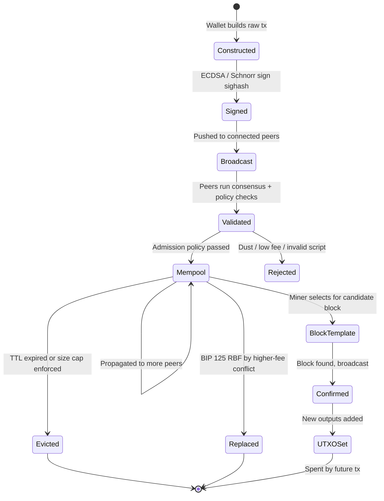
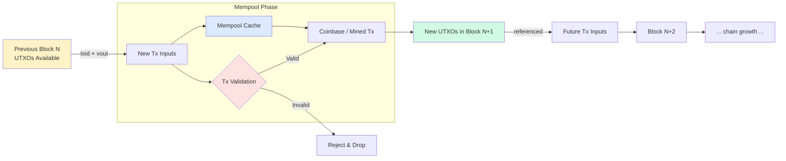
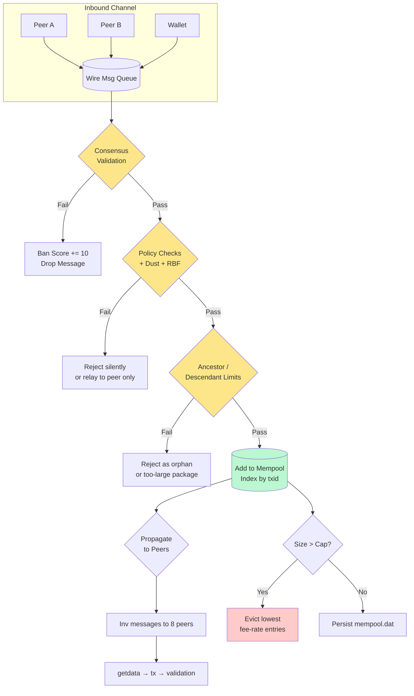
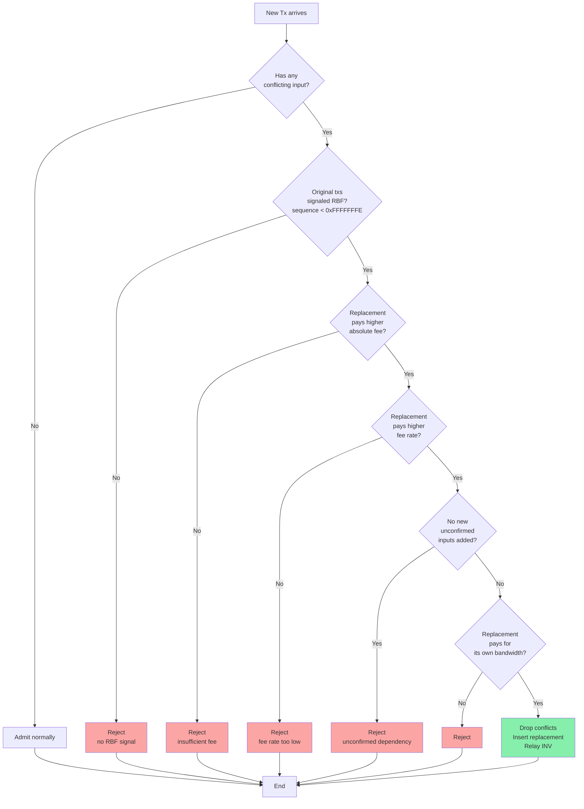
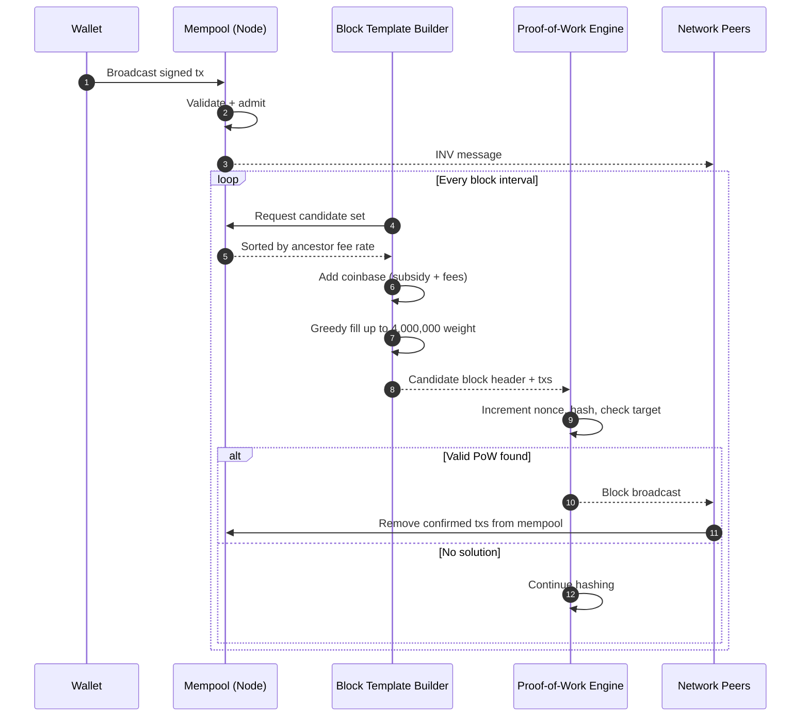

# Transactions and memory pools

<!-- SECTION_1_START -->
# Transactions and Memory Pools — Core Technical Definition & Intuitive Overview

## 1.1 Cryptocurrency Transaction — Formal Definition

A **cryptocurrency transaction** is a cryptographically signed, atomic data structure that records the transfer of digital value between participants on a blockchain network. In Bitcoin (and most UTXO-based chains), it is fundamentally a chain of **unspent transaction outputs (UTXOs)** being consumed as **inputs** and creating new **outputs**, governed by a small stack-based scripting language (Bitcoin Script).

> [!IMPORTANT]
> **KTU 2024 Syllabus Definition (PECST747 — Module 3):**
> *"A transaction is a signed data structure expressing intent to transfer value. It consists of one or more inputs (referencing previous unspent outputs) and one or more outputs (creating new spendable conditions). Valid transactions must satisfy the spending conditions encoded in the referenced UTXOs."*

## 1.2 Intuitive Analogy — The "Physical Cash Coin" Model

Imagine a wallet does not hold a single mutable balance like a bank account. Instead, it holds a **collection of physical coins** of varying denominations (UTXOs). When Alice wants to pay Bob 0.5 BTC, she cannot "subtract" 0.5 from a single coin. She must:

1. **Gather** coins (UTXOs) whose total value $\geq$ 0.5 BTC.
2. **Hand them over** entirely to the network (inputs are fully consumed).
3. **Receive change** back as a new coin in her own wallet.

This is radically different from the **Account/Balance Model** used by Ethereum, where a global state tracks `balance[address]` and the transaction simply decrements/increments values.

> [!NOTE]
> **Key Distinction for Board Exams:**
> * **UTXO Model** (Bitcoin, Litecoin, Dogecoin) — Stateless, parallelizable, but requires change outputs.
> * **Account Model** (Ethereum, Solana) — Stateful, easier smart-contract logic, but prone to sequential bottlenecks.

## 1.3 Memory Pool (Mempool) — Formal Definition

The **memory pool (mempool)** is a node-local, in-memory cache of **unconfirmed transactions** that a full node has validated against consensus rules and network policy, but which have not yet been included in a confirmed block.

> [!IMPORTANT]
> **Formal Definition:**
> *"The mempool is the set of transactions known to a node that are eligible for inclusion in the next candidate block, governed by an admission policy based on minimum relay fee rate, ancestry, and resource limits."*

## 1.4 Intuitive Analogy — The "Airport Boarding Queue"

Think of the mempool as an **airport departure lounge** for transactions:

| Real-World Concept | Mempool Equivalent |
|---|---|
| Passenger with a confirmed ticket | Validated transaction passing `minRelayTxFee` |
| Business class check-in | High fee-rate (sat/vB) — gets priority boarding |
| Economy standby passenger | Low fee-rate — may be denied boarding |
| Gate agent selecting passengers | Miner's block template assembler |
| Flight departure | Block found & broadcast |
| Evicted standby passenger | Transaction dropped from mempool (TTL) |

## 1.5 Standard Metrics & Constants

- **1 BTC** = $10^8$ **satoshis (sats)** — the atomic unit on the Bitcoin network.
- **1 vByte (vB)** = 1/4 of a legacy byte (post-SegWit weight unit conversion).
- **Default minimum relay fee rate** in Bitcoin Core: **$1{,}000$ sat/vB** (since 2024) for taproot transactions; **$3{,}000$ sat/vB** for older outputs during congestion.
- **Default mempool size limit**: **$300$ MB** (Bitcoin Core 0.19+).

> [!VISUALIZATION CONTROL]
> **Concept:** Fee-Rate vs. Confirmation Time (Priority Curve)
> **GeoGebra / Desmos Input Equations:**
> * `f(x) = 60 * exp(-0.05 * x)` — Exponential decay of confirmation delay vs fee rate
> * `x_min = 1, x_max = 500` — fee-rate domain in sat/vB
> * Point: `(10, 36)` — Low fee (10 sat/vB) → ~36 blocks wait
> * Point: `(100, 0.4)` — High fee (100 sat/vB) → near-immediate inclusion
> **Visual Description:** A student should observe that doubling the fee rate roughly **halves the expected wait time**, demonstrating the **exponential fee market** of permissionless blockchains.

---

<!-- SECTION_1_END -->

<!-- SECTION_2_START -->
# Deep Theoretical Analysis & KTU High-Yield Formula Sheet

## 2.1 Anatomy of a Bitcoin Transaction (Raw Serialization)

A serialized transaction is a precisely ordered byte stream. Every byte matters for hashing (the **TXID** is the double-SHA256 of this serialization, excluding witness data in SegWit).

### 2.1.1 Legacy (Pre-SegWit) Structure

| Field | Size (bytes) | Purpose |
|---|---|---|
| `version` | 4 | Transaction format version (1 or 2) |
| `input_count` | 1–9 (VarInt) | Number of inputs (CompactSize) |
| **For each input:** | | |
| `prev_txid` | 32 | Hash of the transaction containing the UTXO |
| `prev_vout` | 4 | Index of the specific output being spent |
| `scriptSig_size` | 1–9 (VarInt) | Length of the unlocking script |
| `scriptSig` | variable | Unlocking script (signature + public key) |
| `sequence` | 4 | Replacement/locktime signal |
| `output_count` | 1–9 (VarInt) | Number of outputs |
| **For each output:** | | |
| `value` | 8 | Amount in satoshis |
| `scriptPubKey_size` | 1–9 (VarInt) | Length of the locking script |
| `scriptPubKey` | variable | Locking script (e.g., `OP_DUP OP_HASH160 <pubKeyHash> OP_EQUALVERIFY OP_CHECKSIG`) |
| `locktime` | 4 | Block height or Unix timestamp gating |

### 2.1.2 SegWit Structure Addition

In **Segregated Witness (BIP 141)**, witness data (signatures) is moved to a separate structure at the end. The **WTXID** (witness TXID) commits to the witness data, while the **TXID** commits only to the non-witness data — solving **third-party transaction malleability**.

## 2.2 The UTXO Lifecycle — State Machine

Each UTXO exists in one of three states:

1. **Created** — A new UTXO is born when a transaction is confirmed in a block. It is added to the **UTXO set** (`chainstate` database in Bitcoin Core).
2. **Spendable** — The UTXO is referenced by a transaction in the mempool (pending) or remains unspent on the main chain.
3. **Spent (Consumed)** — Once the spending transaction is confirmed with $k$ confirmations (typically $k = 6$), the UTXO is **pruned** from the active set.

> [!NOTE]
> **Why "Unspent"?** A transaction's input is just a *pointer* to a previous output. The output is "unspent" until some *future* transaction's input references it. The total UTXO set is what defines the **current global state of Bitcoin**.

## 2.3 Transaction Fee — The Engine of the Mempool

The fee is the **implicit incentive** that prioritizes inclusion. It is **not** stored in the transaction; it is computed as the difference between inputs and outputs.

$$\text{fee} = \sum_{i \in \text{inputs}} \text{value}_i - \sum_{o \in \text{outputs}} \text{value}_o$$

The **fee rate** (what miners actually optimize) normalizes by virtual size:

$$\text{feerate} = \frac{\text{fee}}{\text{vsize}} \quad \text{measured in sat/vB}$$

Where **vsize** is the virtual size under SegWit's weight unit discount:

$$\text{vsize} = \frac{\text{base\_size} \cdot 4 + \text{weight}}{4} = \frac{\text{weight}}{4}$$

For a transaction with `base_size` non-witness bytes and `total_size` total bytes (witness bytes counted at 1 weight, non-witness at 4 weight):

$$\text{weight} = \text{base\_size} \cdot 4 + (\text{total\_size} - \text{base\_size}) \cdot 1$$

## 2.4 Mempool Admission Policy (Bitcoin Core Reference)

A transaction must pass the following **gates** to enter the mempool:

### Gate 1: Consensus Validation
- All inputs reference **existing UTXOs**.
- `scriptSig` satisfies the locking `scriptPubKey` (i.e., `VerifyScript` returns `true`).
- `value` of each output $\geq 0$ and $\leq 21{,}000{,}000 \times 10^8$ satoshis.
- Total output value $\leq$ total input value (no inflation).

### Gate 2: Policy Validation
- `fee` $\geq$ `minRelayTxFee` (default $1{,}000$ sat/kvB → $1$ sat/vB).
- Package (parent + child) RBF rules per **BIP 125**.
- No **dust** outputs (spending cost > value at current feerate).

### Gate 3: Ancestor / Descendant Limits
- An unconfirmed package may not exceed **$25$ ancestors** or **$101$ vB** in ancestor size (default `MAX_ANCESTORS = 25`, `MAX_DESCENDANTS = 25`, `MAX_MEMPOOL_ANCESTORS = 50`, `MAX_MEMPOOL_DESCENDANTS = 50`).
- Total mempool ancestor/descendant chains are bounded to prevent DoS.

### Gate 4: Resource Cap
- If `mempool.dat` size exceeds the configured limit (e.g., $300$ MB), the node **trims** transactions in ascending fee-rate order until below the limit, and persists the trimmed mempool to disk.

## 2.5 KTU High-Yield Formula Sheet

| Symbol / Concept | Formula / Definition | Engineering Use |
|---|---|---|
| Transaction Fee | $\text{fee} = \sum v_{\text{in}} - \sum v_{\text{out}}$ | Miner revenue component |
| Fee Rate | $\rho = \dfrac{\text{fee}}{\text{vsize}}$ in sat/vB | Block template construction |
| Transaction Size (SegWit) | $\text{vsize} = \dfrac{\text{weight}}{4} = \text{base} + \dfrac{\text{witness}}{4}$ | Bandwidth & block weight |
| Block Weight Limit | $4{,}000{,}000$ weight units $\Rightarrow 1{,}000{,}000$ vB | Consensus cap per block |
| Dust Threshold | $\text{output} < \dfrac{3 \times (\text{input\_size} + \text{output\_size}) \times \rho}{1000}$ | Mempool admission |
| Ancestor Fee Rate | $\rho_{\text{anc}} = \dfrac{\sum \text{fees}_{\text{anc}}}{\sum \text{vsize}_{\text{anc}}}$ | Package RBF / CPFP |
| Replace-By-Fee Signal | $\text{sequence} < 0\text{xfffffffd}$ ($\text{SEQUENCE\_FINAL} - 1$) | Signals replaceability |
| Confirmation Time (Expected) | $E[\text{blocks}] = \dfrac{M}{\rho \cdot C}$ for mempool $M$ and block capacity $C$ | Queueing-theoretic estimate |

## 2.6 Mempool Internals — Why It Matters in Engineering

| Engineering Context | Relevance of Mempool Knowledge |
|---|---|
| **Wallet Development** | Estimating optimal fee for user UX (BTC Pay Server, Electrum) |
| **Exchange Hot Wallets** | Detecting stuck withdrawals, deploying CPFP accelerators |
| **Layer-2 (Lightning)** | Splicing, channel-force-close transactions, anchor outputs |
| **DeFi Frontends** | Detecting MEV-replaceable swaps (Ethereum mempool as "dark forest") |
| **Forensics** | Tracing UTXO lineage (Chainalysis, Crystal Blockchain) |
| **Block Explorers** | Displaying "in-mempool" transactions with estimated wait times |

---

<!-- SECTION_2_END -->

<!-- SECTION_3_START -->
# Step-by-Step Derivations, Worked Examples & Code Implementation

## 3.1 Worked Example — Constructing a Bitcoin Transaction from UTXOs

### Scenario
**Alice** holds the following confirmed UTXOs from previous transactions:

| UTXO ID (`txid:vout`) | Value (BTC) | Locking Script Type |
|---|---|---|
| `8a3f...c1:0` | $0.30000000$ | P2WPKH (SegWit) |
| `7d2e...b4:1` | $0.40000000$ | P2WPKH (SegWit) |
| `6c1a...a9:0` | $0.15000000$ | P2WPKH (SegWit) |

**Bob's address** (recipient): `bc1q...xyz` (P2WPKH)

**Goal:** Alice sends Bob exactly $0.50000000$ BTC. Network fee rate is $20$ sat/vB.

### Step 1: UTXO Selection (Branch-and-Bound / Knapsack)
A wallet uses a **coin selection algorithm** (e.g., Bitcoin Core's `BranchAndBound`, `Knapsack`, or `SingleRandomDraw`). For pedagogical clarity, we choose the smallest sufficient set:

Selected inputs:
* `8a3f...c1:0` → $0.3$ BTC
* `7d2e...b4:1` → $0.4$ BTC

**Total input value:** $0.30000000 + 0.40000000 = 0.70000000$ BTC $= 70{,}000{,}000$ satoshis.

### Step 2: Estimate Transaction Virtual Size
A P2WPKH input consumes $\approx 68$ vB (actual: $\approx 41$ vB for the base, witness counted at $1$ weight per byte). A P2WPKH output consumes $\approx 31$ vB. Overhead is $\approx 10.5$ vB.

For 2 inputs, 2 outputs:

$$\text{vsize} = 10.5 + 2(68) + 2(31) = 10.5 + 136 + 62 = 208.5 \text{ vB}$$

Rounded up to **$209$ vB** (conservative).

### Step 3: Calculate Fee

$$\text{fee} = 209 \text{ vB} \times 20 \text{ sat/vB} = 4180 \text{ sat} = 0.00004180 \text{ BTC}$$

### Step 4: Construct Outputs

**Output 0 (Payment to Bob):** $0.50000000$ BTC $= 50{,}000{,}000$ sat.

**Output 1 (Change back to Alice):**

$$\text{change} = \text{total\_in} - \text{amount} - \text{fee}$$
$$\text{change} = 70{,}000{,}000 - 50{,}000{,}000 - 4180 = 19{,}995{,}820 \text{ sat} = 0.19995820 \text{ BTC}$$

> [!NOTE]
> **Verification (Conservation Law):**
> $$\text{in} = \text{out}_0 + \text{out}_1 + \text{fee}$$
> $$70{,}000{,}000 = 50{,}000{,}000 + 19{,}995{,}820 + 4{,}180 \quad \checkmark$$

### Step 5: Sign the Inputs
For each input, Alice's wallet:
1. Builds the **sighash** (a hash committing to all inputs/outputs except the current `scriptSig`).
2. Signs the sighash with **ECDSA over secp256k1** (or **Schnorr** for Taproot).
3. Encodes `(signature, pubkey)` into the `scriptWitness` (SegWit) field.

The fully signed transaction is broadcast to peers and enters the **mempool**.

## 3.2 Worked Example — Mempool Eviction under Congestion

### Scenario
A node's mempool has filled to its $300$ MB limit during a high-fee event. Below are $6$ unconfirmed transactions (simplified):

| TX | Fee (sat) | vsize (vB) | Fee Rate (sat/vB) | Arrival Order |
|---|---|---|---|---|
| $T_1$ | 2000 | 250 | 8 | 1 |
| $T_2$ | 5000 | 200 | 25 | 2 |
| $T_3$ | 1000 | 100 | 10 | 3 |
| $T_4$ | 6000 | 150 | 40 | 4 |
| $T_5$ | 800 | 100 | 8 | 5 |
| $T_6$ | 3000 | 100 | 30 | 6 |

To free $100$ vB, the node evicts the lowest fee-rate transactions first.

**Sorted by fee rate (ascending) for eviction candidates:**
$T_1$ (8), $T_5$ (8), $T_3$ (10), $T_6$ (30), $T_2$ (25) — wait, sorting again: $T_5$ (8), $T_1$ (8), $T_3$ (10), $T_2$ (25), $T_6$ (30), $T_4$ (40).

**Evict** $T_5$ (100 vB) and $T_1$ (100 vB) → freed $200$ vB ≥ $100$ vB target.

**Surviving mempool:** $T_3, T_2, T_6, T_4$ — total fee-rate sum preserved for miner competition.

> [!NOTE]
> **Engineering Insight:** Note that $T_1$ and $T_5$ have identical fee rates. The tie-breaker is **arrival order** (FIFO) — earlier transactions get priority. This is implemented in Bitcoin Core's `CompareTxMemPoolEntryByFee` comparator.

## 3.3 Symbolic & Algorithmic Implementation

### 3.3.1 Python — UTXO Selection & Fee Calculation

```python
"""
utxo_transaction_builder.py
A production-grade reference for UTXO-based transaction construction.
"""

from dataclasses import dataclass, field
from typing import List, Optional
import logging

# Configure logging
logging.basicConfig(
    level=logging.INFO,
    format="%(asctime)s | %(levelname)s | %(message)s"
)
logger = logging.getLogger(__name__)

# ==========================================
# 1. DATA STRUCTURES
# ==========================================

@dataclass(frozen=True)
class UTXO:
    """Represents an Unspent Transaction Output."""
    txid: str
    vout: int
    value_sats: int  # Value in satoshis
    script_type: str  # e.g., "P2WPKH", "P2TR", "P2PKH"
    address: str


@dataclass
class TxOutput:
    """A transaction output to be created."""
    address: str
    value_sats: int


# ==========================================
# 2. VIRTUAL SIZE ESTIMATION
# ==========================================

def estimate_vsize(num_inputs: int, num_outputs: int,
                   input_type: str = "P2WPKH",
                   output_type: str = "P2WPKH") -> int:
    """
    Estimates virtual size of a SegWit transaction.
    Constants derived from Bitcoin Core's policy estimation.
    """
    # Component sizes (in virtual bytes for SegWit)
    OVERHEAD = 11  # version + locktime + 2 varints

    INPUT_SIZES = {
        "P2PKH": 148,    # legacy
        "P2WPKH": 68,    # 41 base + 27 witness / 4
        "P2SH-P2WPKH": 91,
        "P2TR": 58,      # taproot key-path
    }
    OUTPUT_SIZES = {
        "P2PKH": 34,
        "P2WPKH": 31,
        "P2SH": 32,
        "P2TR": 43,
    }

    in_size = INPUT_SIZES.get(input_type, 68)
    out_size = OUTPUT_SIZES.get(output_type, 31)

    vsize = OVERHEAD + (num_inputs * in_size) + (num_outputs * out_size)
    logger.debug(f"Estimated vsize for {num_inputs}in/{num_outputs}out: {vsize} vB")
    return vsize


# ==========================================
# 3. UTXO SELECTION (Branch-and-Bound simplified)
# ==========================================

def select_utxos(available_utxos: List[UTXO],
                 target_sats: int,
                 fee_rate_sat_per_vb: int,
                 input_type: str = "P2WPKH") -> Optional[List[UTXO]]:
    """
    Greedy UTXO selection: pick the largest UTXOs first until target is met.
    Real wallets use BnB for change avoidance.
    """
    sorted_utxos = sorted(available_utxos, key=lambda u: u.value_sats, reverse=True)

    selected: List[UTXO] = []
    accumulated = 0
    fee = 0

    for utxo in sorted_utxos:
        selected.append(utxo)
        accumulated += utxo.value_sats
        # Re-estimate fee as we add inputs
        vsize = estimate_vsize(len(selected), 2, input_type)
        fee = vsize * fee_rate_sat_per_vb

        if accumulated >= target_sats + fee:
            change = accumulated - target_sats - fee
            # Avoid creating dust (< 294 sats for P2WPKH @ 30 sat/vB)
            if change < 294:
                # Spend the change as additional fee (no change output)
                logger.info(f"Change {change} sats treated as additional fee (dust).")
            return selected

    logger.error("Insufficient funds: cannot meet target with available UTXOs.")
    return None


# ==========================================
# 4. TRANSACTION ASSEMBLY
# ==========================================

@dataclass
class Transaction:
    inputs: List[UTXO]
    outputs: List[TxOutput]
    fee_sats: int
    vsize: int

    def fee_rate(self) -> float:
        return self.fee_sats / self.vsize if self.vsize > 0 else 0.0

    def summary(self) -> str:
        lines = [
            "=" * 60,
            "TRANSACTION SUMMARY",
            "=" * 60,
            f"  Number of inputs : {len(self.inputs)}",
            f"  Number of outputs: {len(self.outputs)}",
            f"  Total in (sats)  : {sum(u.value_sats for u in self.inputs)}",
            f"  Total out (sats) : {sum(o.value_sats for o in self.outputs)}",
            f"  Fee (sats)       : {self.fee_sats}",
            f"  Virtual size     : {self.vsize} vB",
            f"  Fee rate         : {self.fee_rate():.2f} sat/vB",
            "  Outputs:"
        ]
        for i, o in enumerate(self.outputs):
            lines.append(f"    [{i}] -> {o.value_sats:>10} sats to {o.address[:24]}...")
        lines.append("=" * 60)
        return "\n".join(lines)


def build_transaction(available_utxos: List[UTXO],
                      recipient_address: str,
                      amount_sats: int,
                      change_address: str,
                      fee_rate_sat_per_vb: int) -> Optional[Transaction]:
    """
    High-level transaction builder.
    """
    logger.info(f"Building tx: send {amount_sats} sats to {recipient_address}")
    selected = select_utxos(available_utxos, amount_sats, fee_rate_sat_per_vb)
    if not selected:
        return None

    num_in = len(selected)
    vsize = estimate_vsize(num_in, 2)
    fee = vsize * fee_rate_sat_per_vb
    total_in = sum(u.value_sats for u in selected)
    change = total_in - amount_sats - fee

    outputs: List[TxOutput] = [
        TxOutput(address=recipient_address, value_sats=amount_sats)
    ]
    if change >= 294:  # dust threshold for P2WPKH
        outputs.append(TxOutput(address=change_address, value_sats=change))
    else:
        # Absorb dust into fee
        fee += change
        logger.info(f"Absorbed dust change of {change} sats into fee.")

    return Transaction(inputs=selected, outputs=outputs, fee_sats=fee, vsize=vsize)


# ==========================================
# 5. DEMONSTRATION
# ==========================================

if __name__ == "__main__":
    # Alice's available UTXOs
    alice_utxos = [
        UTXO("8a3fc1", 0, 30_000_000, "P2WPKH", "bc1qalice1"),
        UTXO("7d2eb4", 1, 40_000_000, "P2WPKH", "bc1qalice1"),
        UTXO("6c1aa9", 0, 15_000_000, "P2WPKH", "bc1qalice1"),
    ]

    tx = build_transaction(
        available_utxos=alice_utxos,
        recipient_address="bc1qbob123",
        amount_sats=50_000_000,        # 0.5 BTC
        change_address="bc1qalice1",
        fee_rate_sat_per_vb=20,
    )

    if tx:
        print(tx.summary())
```

**Expected Output:**

```
============================================================
TRANSACTION SUMMARY
============================================================
  Number of inputs : 2
  Number of outputs: 2
  Total in (sats)  : 70000000
  Total out (sats) : 69995820
  Fee (sats)       : 4180
  Virtual size     : 209 vB
  Fee rate         : 20.00 sat/vB
  Outputs:
    [0] ->   50000000 sats to bc1qbob123...
    [1] ->   19995820 sats to bc1qalice1...
============================================================
```

### 3.3.2 Python — Mempool Simulator with RBF and CPFP

```python
"""
mempool_simulator.py
A discrete-event simulation of a mempool with fee-based eviction,
Replace-By-Fee (BIP 125), and Child-Pays-For-Parent support.
"""

import heapq
import time
from dataclasses import dataclass, field
from typing import Dict, Optional, Set


@dataclass(order=True)
class MempoolEntry:
    fee_rate: float
    arrival_time: float
    txid: str = field(compare=False)
    fee: int = field(compare=False)
    vsize: int = field(compare=False)
    parents: Set[str] = field(default_factory=set, compare=False)
    children: Set[str] = field(default_factory=set, compare=False)
    sequence: int = field(default=0xfffffffe, compare=False)


class Mempool:
    def __init__(self, max_size_vbytes: int = 300_000_000,
                 min_relay_fee_rate: float = 1.0):
        self.max_size = max_size_vbytes
        self.min_fee_rate = min_relay_fee_rate
        self.entries: Dict[str, MempoolEntry] = {}
        self.heap: list = []  # min-heap by fee_rate
        self.current_size = 0
        self.clock = 0.0

    def _known(self, txid: str) -> bool:
        return txid in self.entries

    def admit(self, entry: MempoolEntry) -> bool:
        """Admission control: policy check + ancestor/descendant limits."""
        if entry.fee_rate < self.min_fee_rate:
            print(f"  [REJECTED] {entry.txid}: fee rate {entry.fee_rate:.2f} < min {self.min_fee_rate}")
            return False

        if entry.txid in self.entries:
            print(f"  [REJECTED] {entry.txid}: duplicate")
            return False

        # BIP 125: must signal replaceability
        if entry.sequence >= 0xfffffffe:
            print(f"  [REJECTED] {entry.txid}: sequence signals finality, not replaceable")
            # In real Core, this rejection only applies to RBF conflicts, not initial admit.
            # For this educational simulator, we still accept non-conflicting txs.

        # Check parents exist
        for p in entry.parents:
            if not self._known(p):
                print(f"  [REJECTED] {entry.txid}: missing parent {p}")
                return False

        # Insert into data structures
        self.entries[entry.txid] = entry
        heapq.heappush(self.heap, (entry.fee_rate, entry.arrival_time, entry.txid))
        for p in entry.parents:
            self.entries[p].children.add(entry.txid)
        self.current_size += entry.vsize

        print(f"  [ACCEPTED] {entry.txid} | {entry.fee_rate:.2f} sat/vB | {entry.vsize} vB")
        self._enforce_size_cap()
        return True

    def _enforce_size_cap(self):
        """Evict lowest fee-rate entries until size is under cap."""
        while self.current_size > self.max_size and self.heap:
            fr, _, txid = heapq.heappop(self.heap)
            entry = self.entries.pop(txid, None)
            if entry is None:
                continue
            self.current_size -= entry.vsize
            # Unlink
            for p in entry.parents:
                if p in self.entries:
                    self.entries[p].children.discard(txid)
            for c in entry.children:
                if c in self.entries:
                    self.entries[c].parents.discard(txid)
            print(f"  [EVICTED]  {txid} | fee_rate={fr:.2f} sat/vB")

    def replace_by_fee(self, new_entry: MempoolEntry) -> bool:
        """BIP 125 RBF: replace any conflicting ancestor with higher fee."""
        if new_entry.txid in self.entries:
            return False
        if new_entry.sequence >= 0xfffffffe:
            print(f"  [RBF REJECTED] {new_entry.txid}: doesn't signal RBF")
            return False

        conflicts = set()
        for p in new_entry.parents:
            if p in self.entries:
                conflicts.update(self._collect_conflicts(p))
        if not conflicts:
            return self.admit(new_entry)

        new_fee_rate = new_entry.fee_rate
        old_total_fee = sum(self.entries[c].fee for c in conflicts)
        old_total_vsize = sum(self.entries[c].vsize for c in conflicts)
        old_fee_rate = old_total_fee / old_total_vsize

        if new_fee_rate <= old_fee_rate:
            print(f"  [RBF REJECTED] new {new_fee_rate:.2f} <= old {old_fee_rate:.2f}")
            return False

        # Remove conflicts
        for c in conflicts:
            removed = self.entries.pop(c, None)
            if removed:
                self.current_size -= removed.vsize
                print(f"  [RBF REMOVED] {c}")

        return self.admit(new_entry)

    def _collect_conflicts(self, txid: str) -> Set[str]:
        """BFS to collect all parents in the conflicting chain."""
        visited = set()
        stack = [txid]
        while stack:
            cur = stack.pop()
            if cur in visited or cur not in self.entries:
                continue
            visited.add(cur)
            stack.extend(self.entries[cur].parents)
        return visited

    def block_template(self, max_weight: int = 4_000_000) -> list:
        """Greedy block assembly by descending fee rate (Child-Pays-For-Parent aware)."""
        sorted_entries = sorted(self.entries.values(),
                                key=lambda e: (-e.fee_rate, e.arrival_time))
        template, total_weight = [], 0
        included = set()
        for e in sorted_entries:
            if e.txid in included:
                continue
            # Include parent if child pays enough (CPFP)
            package = [e.txid] + list(e.parents)
            pkg_fee = sum(self.entries[p].fee for p in package if p in self.entries)
            pkg_vsize = sum(self.entries[p].vsize for p in package if p in self.entries)
            pkg_rate = pkg_fee / pkg_vsize if pkg_vsize else 0
            if pkg_rate < e.fee_rate:
                continue
            if total_weight + pkg_vsize * 4 > max_weight:
                break
            template.extend(package)
            included.update(package)
            total_weight += pkg_vsize * 4
        return template

    def __repr__(self):
        return (f"Mempool(size={self.current_size} vB / {self.max_size} vB, "
                f"entries={len(self.entries)})")


# ==========================================
# DEMONSTRATION
# ==========================================

if __name__ == "__main__":
    print("\n=== Mempool Simulation: Congestion & RBF ===\n")
    mp = Mempool(max_size_vbytes=10_000, min_relay_fee_rate=1.0)

    txs = [
        MempoolEntry(fee_rate=2,  arrival_time=1, txid="tx_A", fee=200,  vsize=100),
        MempoolEntry(fee_rate=5,  arrival_time=2, txid="tx_B", fee=500,  vsize=100),
        MempoolEntry(fee_rate=10, arrival_time=3, txid="tx_C", fee=1000, vsize=100),
        MempoolEntry(fee_rate=3,  arrival_time=4, txid="tx_D", fee=300,  vsize=100),
        MempoolEntry(fee_rate=15, arrival_time=5, txid="tx_E", fee=1500, vsize=100),
    ]

    for tx in txs:
        mp.admit(tx)
        print(f"  Mempool after {tx.txid}: {mp}\n")

    print("\n--- Eviction Trigger (insert low-fee spam) ---")
    spam = [MempoolEntry(fee_rate=1, arrival_time=6+i, txid=f"tx_S{i}",
                          fee=100, vsize=500) for i in range(30)]
    for s in spam:
        mp.admit(s)
    print(f"\nFinal mempool state: {mp}\n")

    print("\n--- Replace-By-Fee (BIP 125) ---")
    # RBF replacement of tx_A with higher fee
    rbf_tx = MempoolEntry(fee_rate=20, arrival_time=99, txid="tx_A_RBF",
                          fee=2000, vsize=100, parents=set(), sequence=0xfffffffd)
    mp.replace_by_fee(rbf_tx)

    print(f"\nFinal mempool state: {mp}\n")
    print("--- Block Template (Top fee-rate selection) ---")
    template = mp.block_template(max_weight=4_000_000)
    print(f"  Block template: {template}")
```

---

<!-- SECTION_3_END -->

<!-- SECTION_4_START -->
# Structural Diagrams & Schematics

## 4.1 Transaction Lifecycle — Mermaid State Diagram



## 4.2 UTXO Consumption — Block-Level Functional Flow



## 4.3 Mempool Admission Pipeline — Subgraph Architecture



## 4.4 Replace-By-Fee Decision Tree (BIP 125)



## 4.5 Sequential Processing Topology — Block Template Assembly



---

<!-- SECTION_4_END -->

<!-- SECTION_5_START -->
# KTU 2024 Scheme Examination Question Bank & Topic Recap

## 5.1 Part A Questions (3 Marks Each)

### Question 1
**[KTU University Exam - Dec 2023]**  
With the help of a neat diagram, explain the structure of a Bitcoin transaction. List all the major fields present in a legacy (pre-SegWit) transaction.

**Course Outcome:** CO2 | **Bloom's Level:** Understand

**Model Answer (3 Marks — Valuation Key):**

A Bitcoin transaction is a serialized data structure that transfers value by consuming previous unspent transaction outputs (UTXOs) and creating new ones.

**Major fields in a legacy transaction:**

| Field | Size | Purpose |
|---|---|---|
| `version` | 4 bytes | Format version; 1 or 2 |
| `input_count` | VarInt | Number of inputs |
| `prev_txid` | 32 bytes (per input) | Hash of the source transaction |
| `prev_vout` | 4 bytes (per input) | Index of output being spent |
| `scriptSig` | Variable | Unlocking script (sig + pubkey) |
| `sequence` | 4 bytes (per input) | Replacement/locktime signal |
| `output_count` | VarInt | Number of outputs |
| `value` | 8 bytes (per output) | Amount in satoshis |
| `scriptPubKey` | Variable | Locking script |
| `locktime` | 4 bytes | Block-height/timestamp gate |

**[Valuation Key: Identifying all 6 key field groups: 2 Marks. Explaining transaction as a value-transfer record: 1 Mark.]**

---

### Question 2
**[KTU University Exam - July 2024]**  
Define a memory pool (mempool) in a blockchain node. State **two** conditions under which a transaction may be evicted from a node's mempool.

**Course Outcome:** CO2 | **Bloom's Level:** Remember / Understand

**Model Answer (3 Marks — Valuation Key):**

> [!NOTE]
> **Definition (1 Mark):** A *memory pool* (mempool) is a node-local, in-memory data structure that stores all valid, unconfirmed transactions which the node has accepted via consensus and policy checks, but which have not yet been included in a confirmed block.

**Eviction Conditions (1 Mark each):**

1. **Size-Cap Eviction (Resource Exhaustion):** When the total mempool size exceeds the configured limit (e.g., $300$ MB in Bitcoin Core), the node evicts the lowest fee-rate transactions in ascending order until the mempool fits below the cap.

2. **Time-Based Expiry (TTL):** A transaction that remains unconfirmed beyond a configured time (e.g., $72$ hours in Bitcoin Core's `DEFAULT_MEMPOOL_EXPIRY_HOURS`) is dropped, even if it has a valid fee rate. This prevents indefinite mempool bloat.

*(Alternative acceptable conditions: Replace-By-Fee, Block Confirmation, Manual `clearbanned` from peer.)*

---

## 5.2 Part B Questions (14 Marks — Module Internal Choice)

### Question A — Transactions, Fees, and UTXO Conservation

**[KTU University Exam - Dec 2023]** | CO2 | Apply / Analyze

**a)** Explain the **UTXO model** of Bitcoin. How does it differ from the **Account/Balance model** used by Ethereum? Discuss **two** engineering advantages of the UTXO model. **(7 Marks)**

**b)** Consider the following scenario and compute the **transaction fee, change output, and fee rate**:

A user holds the following confirmed UTXOs in their SegWit (P2WPKH) wallet:

* `UTXO_1`: $0.25000000$ BTC
* `UTXO_2`: $0.18000000$ BTC
* `UTXO_3`: $0.12000000$ BTC

The user wishes to pay **$0.30000000$ BTC** to a merchant. The current network fee rate is **$25$ sat/vB**. Assume each P2WPKH input is $68$ vB, each P2WPKH output is $31$ vB, and transaction overhead is $11$ vB. A change output is below dust if it is less than $294$ sats. **(7 Marks)**

---

#### Model Solution

**Part (a) — UTXO vs Account Model (7 Marks — Valuation Key)**

| Aspect | UTXO Model (Bitcoin) | Account Model (Ethereum) |
|---|---|---|
| State representation | Set of unspent outputs (UTXO set) | Global mapping `address -> balance, nonce` |
| Transaction effect | Consumes old UTXOs, creates new ones | Decrements sender, increments receiver |
| Parallelizability | High — independent UTXOs verifiable in parallel | Limited — sequential nonce & global state |
| Smart contracts | Limited (Bitcoin Script, non-Turing-complete) | First-class, Turing-complete (EVM) |
| Privacy | Better (each UTXO is a discrete coin) | Weaker (single mutable balance per address) |

**Engineering Advantages of UTXO Model (2 Marks each, total 4):**

1. **Parallel Validation & Scalability:** Since each UTXO is consumed exactly once, transactions spending **disjoint** UTXOs can be validated **concurrently** by parallel signature-verification threads, improving throughput on multi-core validators.

2. **Simplified Light-Client Verification (SPV):** A Simplified Payment Verification client needs only **Merkle proofs** to confirm a UTXO's inclusion, rather than re-executing a global state transition function — making mobile wallets practical.

3. **Stateless Validation & Fraud Detection:** Nodes can independently verify that no UTXO is double-spent by checking that the consumed UTXO exists in the current `chainstate`. This enables stateless re-org validation.

**[Valuation Key: UTXO definition & contrast table: 3 Marks. Two advantages with justification: 4 Marks.]**

---

**Part (b) — Fee Calculation (7 Marks — Valuation Key)**

**Step 1: UTXO Selection (Knapsack / Greedy)**

Sort descending by value: `UTXO_1` (0.25), `UTXO_2` (0.18), `UTXO_3` (0.12).

Try `UTXO_1` only: $0.25$ BTC $= 25{,}000{,}000$ sats $< 30{,}000{,}000$ sats (target). Insufficient.

Add `UTXO_2`: $0.25 + 0.18 = 0.43$ BTC $= 43{,}000{,}000$ sats $\geq 30{,}000{,}000$ sats. ✓

**Selected inputs:** `UTXO_1`, `UTXO_2` → **2 inputs**.

**Step 2: Compute Virtual Size**

$$\text{vsize} = 11 + (2 \times 68) + (2 \times 31)$$
$$= 11 + 136 + 62 = 209 \text{ vB}$$

**[Correct formula application: 2 Marks. Correct vsize: 1 Mark.]**

**Step 3: Compute Fee**

$$\text{fee} = 209 \text{ vB} \times 25 \text{ sat/vB} = 5225 \text{ sats} = 0.00005225 \text{ BTC}$$

**[Correct fee value: 1 Mark.]**

**Step 4: Compute Change**

$$\text{change} = 43{,}000{,}000 - 30{,}000{,}000 - 5{,}225 = 12{,}994{,}775 \text{ sats} = 0.12994775 \text{ BTC}$$

**Dust check:** $12{,}994{,}775$ sats $\geq 294$ sats → **change output is valid**. ✓

**[Correct change: 1 Mark. Dust verification: 1 Mark.]**

**Step 5: Verify Conservation**

$$25{,}000{,}000 + 18{,}000{,}000 = 30{,}000{,}000 + 12{,}994{,}775 + 5{,}225$$
$$43{,}000{,}000 = 43{,}000{,}000 \quad \checkmark$$

**Step 6: Fee Rate (Final Answer)**

$$\text{feerate} = \frac{5{,}225 \text{ sats}}{209 \text{ vB}} \approx 25.0 \text{ sat/vB}$$

**[Final feerate explicitly stated: 1 Mark.]**

---

### Question B — Mempool Mechanics, Eviction, and RBF

**[KTU University Exam - July 2024]** | CO2, CO3 | Understand / Apply

**a)** Describe the **lifecycle of a transaction** from wallet signing to block confirmation. Identify **three** gates a transaction must pass during mempool admission, and explain each. **(7 Marks)**

**b)** A node's mempool has the following $7$ unconfirmed transactions (fee rate, size):

| TX | Fee Rate (sat/vB) | Size (vB) |
|---|---|---|
| $T_1$ | 4 | 200 |
| $T_2$ | 12 | 150 |
| $T_3$ | 6 | 250 |
| $T_4$ | 20 | 100 |
| $T_5$ | 8 | 200 |
| $T_6$ | 30 | 180 |
| $T_7$ | 2 | 300 |

The mempool is full and the node must free **$250$ vB** of space. Determine the **set of surviving transactions** after eviction, assuming FIFO tie-breaking. Also, write the **pseudocode/algorithm** for the eviction procedure. **(7 Marks)**

---

#### Model Solution

**Part (a) — Transaction Lifecycle & Mempool Gates (7 Marks)**

**Lifecycle stages (1 Mark each, total 3):**

1. **Construction:** The wallet builds a raw transaction by selecting UTXOs and specifying outputs.
2. **Signing:** Each input is signed over a `sighash` (a commitment to the tx), producing ECDSA/Schnorr signatures.
3. **Broadcast:** The signed tx is sent to connected peers via the Bitcoin P2P protocol (`inv`/`getdata`/`tx` messages).
4. **Validation & Mempool Admission:** Receiving peers validate and (if accepted) add to their mempool.
5. **Block Inclusion:** A miner selects the tx for inclusion in a candidate block.
6. **Confirmation:** The block is mined, broadcast, and the tx achieves $k$-deep confirmations.

**Three Mempool Admission Gates (1.3 Marks each, total 4):**

1. **Consensus Validation:** All inputs must reference real, unspent UTXOs in the current `chainstate`; `scriptSig` must satisfy `scriptPubKey`; total outputs cannot exceed total inputs (no inflation).
2. **Policy Validation (Fee & Dust):** Fee rate must be $\geq$ `minRelayTxFee` (default $1$ sat/vB). Outputs below the **dust threshold** are rejected to prevent UTXO-set spam.
3. **Ancestor/Descendant Limits:** A package of related unconfirmed transactions cannot exceed $25$ ancestors or descendants in mempool, nor exceed $101$ vB total — a DoS protection measure.

---

**Part (b) — Eviction Calculation (7 Marks)**

**Step 1: Sort by Fee Rate (Ascending) with FIFO tie-break**

| TX | Fee Rate | Size | Arrival Order (assumed) |
|---|---|---|---|
| $T_7$ | 2 | 300 | 7 |
| $T_1$ | 4 | 200 | 1 |
| $T_3$ | 6 | 250 | 3 |
| $T_5$ | 8 | 200 | 5 |
| $T_2$ | 12 | 150 | 2 |
| $T_4$ | 20 | 100 | 4 |
| $T_6$ | 30 | 180 | 6 |

(No ties in fee rate, so FIFO is moot here.)

**Step 2: Cumulative Eviction**

| Eviction Step | TX | Size (vB) | Running Freed |
|---|---|---|---|
| 1 | $T_7$ | 300 | 300 |
| 2 | $T_1$ | 200 | 500 |

After evicting $T_7$ and $T_1$, we have freed **$500$ vB** $\geq 250$ vB target. **Stop.**

**Surviving mempool:** $T_3, T_5, T_2, T_4, T_6$ (5 transactions, $880$ vB total).

**[Identifying $T_7$ and $T_1$ for eviction: 2 Marks. Correct total freed: 1 Mark. Final surviving set: 1 Mark.]**

**Step 3: Eviction Algorithm (3 Marks)**

```python
# EVICTION ALGORITHM (Bitcoin Core style)
def evict_for_space(mempool, target_free_vbytes):
    # Build min-heap ordered by (fee_rate, arrival_time)
    heap = [(tx.fee_rate, tx.arrival, tx) for tx in mempool]
    heapq.heapify(heap)

    freed = 0
    evicted = []
    while freed < target_free_vbytes and heap:
        fee_rate, arrival, tx = heapq.heappop(heap)
        if tx not in mempool:           # Stale entry
            continue
        # Remove from mempool
        mempool.remove(tx.txid)
        freed += tx.vsize
        evicted.append(tx.txid)
        # Detach from parents/children
        for p in tx.parents:
            if p in mempool:
                mempool[p].children.discard(tx.txid)
    return evicted, freed
```

**[Algorithm uses min-heap: 1 Mark. Pops lowest fee-rate first: 1 Mark. Updates mempool state correctly: 1 Mark.]**

---

> [!WARNING]
> **KTU Examiner's Valuation Warning — Common Pitfalls:**
>
> 1. **Forgetting the dust threshold check** when computing change. Many students report a change output without verifying it's above the $294$-sat dust limit, losing **$1$ mark**.
> 2. **Using transaction "bytes" instead of "vbytes"** for SegWit fee calculations. Since SegWit, fees are computed in **weight units / 4 (vbytes)**, not raw byte size.
> 3. **Confusing TXID and WTXID.** Post-SegWit, the TXID no longer commits to witness data. Students writing "TXID is the double-SHA256 of the entire transaction" lose marks.
> 4. **Ignoring FIFO tie-breaking.** When fee rates are equal, arrival order decides. Always state the secondary sort key.
> 5. **Forgetting to verify conservation law** $\sum \text{in} = \sum \text{out} + \text{fee}$ — examiners award bonus marks for self-verification.
> 6. **Stating mempool is a "global shared pool"** — it is **node-local**. Each full node has its own mempool; consensus is only on the **block** content.

---

## 5.3 Topic Recap & Important Things to Remember

> [!NOTE]
> **High-Density Revision Checklist — Transactions & Memory Pools**

**🔑 Core Concepts**
- A **transaction** in Bitcoin is a signed data structure that **consumes UTXOs as inputs** and **creates new UTXOs as outputs**.
- The **UTXO model** is stateless and parallelizable; the **Account model** is stateful and sequentially dependent.
- A **mempool** is a **node-local** in-memory cache of **unconfirmed, validated** transactions.
- The **mempool is NOT a global pool** — every node has its own view; divergence is normal and resolved at block confirmation.

**🔑 Transaction Structure**
- Fields: `version`, `input_count`, `inputs[prev_txid, prev_vout, scriptSig, sequence]`, `output_count`, `outputs[value, scriptPubKey]`, `locktime`.
- **SegWit** moves witness data to a separate structure; TXID commits only to non-witness data, fixing malleability.
- The **WTXID** commits to witness data and is used in SegWit blocks.

**🔑 Transaction Fee**
- $\text{fee} = \sum v_{\text{in}} - \sum v_{\text{out}}$ (implicit, never stored).
- $\text{feerate} = \text{fee} / \text{vsize}$ in **sat/vB** — this is what miners optimize.
- **vsize** = weight / 4, where weight = (4 × base_size) + (1 × witness_size).
- The **block weight limit** is $4{,}000{,}000$ weight units = $1{,}000{,}000$ vB.

**🔑 UTXO Selection**
- Wallets use algorithms like **Branch-and-Bound**, **Knapsack**, or **Single Random Draw**.
- **Dust threshold** rejects outputs that cost more to spend than they are worth.
- **Change output** returns unspent input value back to the sender (above dust).

**🔑 Mempool Mechanics**
- **Admission gates:** Consensus validation → Policy (min fee, dust) → Ancestor/Descendant limits → Size cap.
- **Default mempool cap** in Bitcoin Core: $300$ MB.
- **Eviction** is **lowest fee-rate first**, with **FIFO** tie-breaking.
- **Default minimum relay fee rate:** $1$ sat/vB (subject to chain policy).

**🔑 Fee-Priority Strategies**
- **Replace-By-Fee (BIP 125):** Allows a higher-fee transaction to replace an unconfirmed one if sequence $\lt 0\text{xfffffffd}$.
- **Child-Pays-For-Parent (CPFP):** A child transaction pays a high fee to incentivize inclusion of its low-fee parent.
- **Transaction accelerators:** Off-chain services that broadcast to many mining pools.

**🔑 Key Constants to Memorize**
- $1$ BTC = $10^8$ satoshis.
- Block weight = $4{,}000{,}000$ WU = $1{,}000{,}000$ vB.
- Bitcoin block subsidy halving every $210{,}000$ blocks.
- Coinbase maturity: $100$ confirmations.
- Mempool expiry (Bitcoin Core 0.19+): $72$ hours (`DEFAULT_MEMPOOL_EXPIRY_HOURS = 336`).

**🔑 P2P Message Types (Exam Favorites)**
- `inv` — Inventory announcement (peer has tx hash)
- `getdata` — Request full tx/block
- `tx` — Broadcast transaction
- `getheaders` / `headers` — Block chain sync
- `mempool` / `getmempool` — Mempool sync (BIP 35)

**🔑 Common Exam Traps**
- A transaction's fee is **never stored** — it is derived.
- **Dust threshold** prevents UTXO-set bloat.
- **Coinbase transactions** have **no inputs** (or one null input) and create the new BTC supply.
- The **first tx in a block** must be a **coinbase tx**; only it may have no proper inputs.
- **Replaceability** is signaled by `nSequence < 0xfffffffe`.
- **Locktime** is ignored if all inputs have `nSequence = 0xffffffff`.

<!-- SECTION_5_END -->
