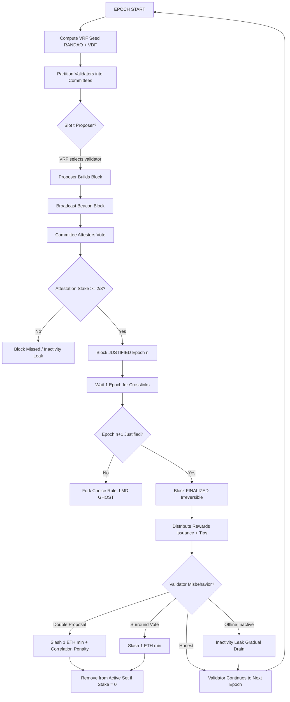
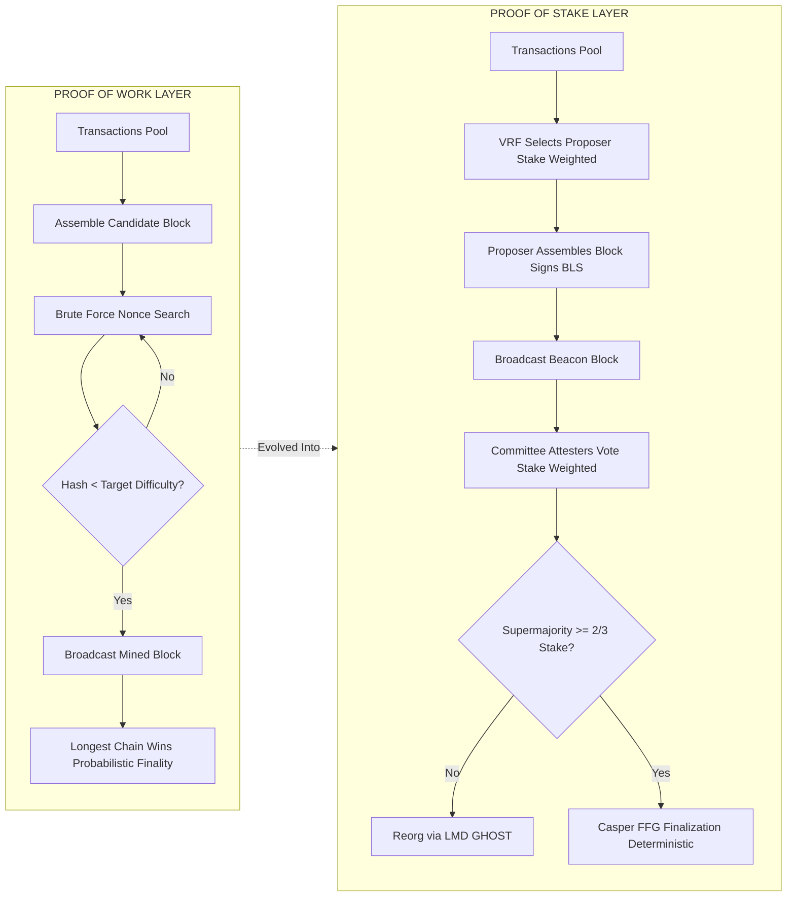
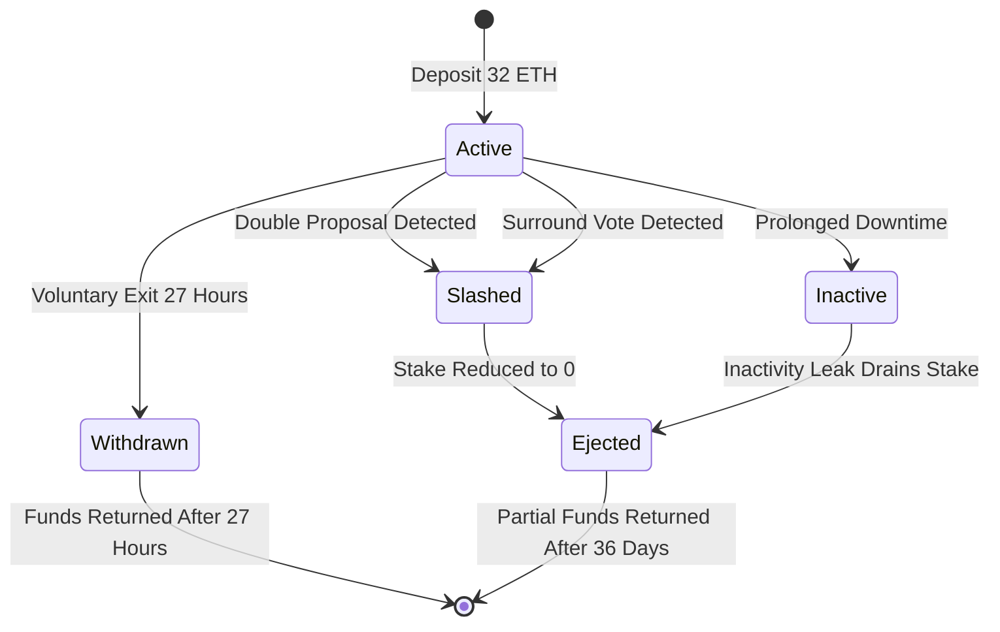
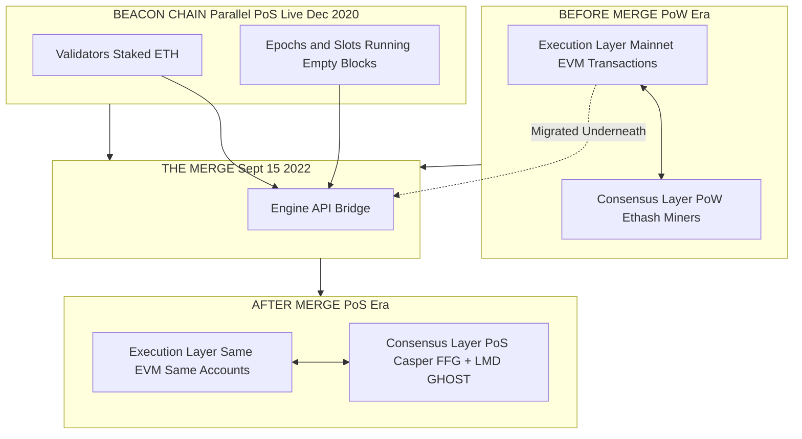

# Transition from PoW to PoS- Working of PoS

<!-- SECTION_1_START -->

# 1. Core Technical Definition & Intuitive Overview

## 1.1 Formal Definition (KTU 2024 Syllabus Terminology)

**Proof of Stake (PoS)** is a **Sybil-resistant** consensus mechanism used in permissionless blockchain networks where block proposers (validators) are selected based on the quantity of native cryptocurrency they have **staked (locked)** as collateral, rather than based on computational power expended. The protocol replaces energy-intensive mining with capital-intensive validation, where the probability of being chosen to propose or attest to a new block is **proportional to the validator's stake** in the network.

> [!IMPORTANT]
> **KTU 2024 Syllabus Highlight (Module 3 - Cryptocurrencies):**
> The transition from Proof of Work (PoW) to Proof of Stake (PoS) refers to the architectural shift in consensus protocol design — moving from **computational puzzle-solving (hash-rate competition)** to **capital-based validator selection (stake-weighting)**. The most prominent real-world example is **Ethereum's "The Merge"** upgrade (September 2022), which reduced the network's energy consumption by approximately **99.65%**.

## 1.2 Conceptual Analogy / Intuition

### 🏛️ The "Deposit Box" Analogy

Imagine a town library where everyone wants to be the librarian for a day and decide which books are added:

- **Proof of Work (PoW)** is like a contest where citizens run on a treadmill for an hour. Whoever runs the fastest gets to be the librarian. This burns enormous electricity but is hard to cheat (you can't run fast without actually running).

- **Proof of Stake (PoS)** is like requiring every aspiring librarian to put a **$10,000 deposit** in a locked glass box at the town hall. The town randomly picks one depositor each day, weighted by how much they deposited. If the librarian is dishonest, the town **confiscates (slashes) their deposit**.

> [!NOTE]
> **Why does this work?**
> In PoS, cheating is financially catastrophic. To attack the network, you'd need to acquire and stake more than half of all the currency — and if you attack it, your own staked fortune collapses in value. The **attacker shoots themselves in the wallet.**

> [!TIP]
> **Key Constants to Remember for KTU Exams:**
> - Bitcoin's PoW energy use: ~**150 TWh/year** (≈ Poland's electricity consumption)
> - Ethereum post-Merge energy use: ~**0.01 TWh/year**
> - Energy reduction: **~99.95%**
> - Ethereum minimum validator stake: **32 ETH**
> - Slashing penalty range: **1 ETH to entire stake (100%)**

## 1.3 Why the Transition from PoW to PoS?

The transition is driven by **four fundamental limitations** of PoW:

1. **Energy Inefficiency**: PoW requires continuous brute-force hash computation (e.g., SHA-256 in Bitcoin, Ethash pre-Merge). Global PoW networks consume energy comparable to medium-sized nations.

2. **Centralization of Mining Power**: Economies of scale favor large mining pools and ASIC-equipped operations, leading to concentration (e.g., the top 4 Bitcoin mining pools historically controlled >50% hash rate).

3. **Economic Finality Delay**: PoW offers only **probabilistic finality** — a block is considered final only after ~6 confirmations (~60 minutes in Bitcoin), because attackers could always out-compute the chain.

4. **No Penalty for Misbehavior**: In PoW, a miner who produces a fork/attack wastes only electricity; their hardware and coins are unaffected. In PoS, validators post **bondable collateral** that can be destroyed.

> [!VISUALIZATION CONTROL]
> **Concept:** PoW vs PoS Validator Selection Distribution
> **GeoGebra / Desmos Input Equations:**
> * `f(x) = x^2` (PoW — quadratic, advantages ASICs)
> * `g(x) = x` (PoS — linear, fair stake distribution)
> * Domain: `x in [0, 1]` (fraction of total network resources)
> **Visual Description:** Two curves on the same axes. The PoW curve (`f`) is convex (bowed upward) — small advantages in hardware compound into huge selection probability. The PoS curve (`g`) is a straight line — selection probability is exactly proportional to stake, with no compounding advantage.

---

<!-- SECTION_1_END -->

<!-- SECTION_2_START -->

# 2. Deep Theoretical Analysis & KTU High-Yield Formula Sheet

## 2.1 Operational Architecture of PoS — The 7-Step Lifecycle

A PoS network operates through a **time-sliced epoch-based** structure (e.g., Ethereum uses 32-slot epochs, 12 seconds per slot):

### Step 1: Validator Registration
A user locks a minimum amount of native currency (e.g., **32 ETH** on Ethereum, **1000 ADA** on Cardano) into a **staking contract** as collateral. This generates a **validator key pair** (BLS12-381 curve on Ethereum).

### Step 2: Epoch & Slot Partitioning
Time is divided into **slots** (block production windows, ~12 s) and **epochs** (groups of 32 slots, ~6.4 min). Each slot may have a designated **proposer** and a **committee** of attesters.

### Step 3: Proposer Selection (Pseudorandom)
For each slot, a **Verifiable Random Function (VRF)** — e.g., RANDAO + VDF in Ethereum — selects one validator as the block proposer. The selection probability $P_i$ for validator $i$ is:

$$P_i = \frac{s_i}{\sum_{j=1}^{N} s_j}$$

where $s_i$ = stake of validator $i$, $N$ = total active validators.

### Step 4: Block Proposal
The selected proposer assembles transactions, executes them in the EVM, and broadcasts a **signed beacon block**.

### Step 5: Attestation (Voting)
A randomly chosen committee of validators (~128 in Ethereum) attests to the validity of the proposed block by signing it. Each attester's vote weight is proportional to their **effective balance**.

### Step 6: Justification & Finalization (Casper FFG)
Through a two-phase supermajority vote (**>2/3 of total staked ETH**), blocks become **justified** (1 epoch) and then **finalized** (2 epochs). Finalization is **deterministic and irreversible** without slashing ≥1/3 of stake.

### Step 7: Reward Distribution
Proposers and attesters receive protocol-issued rewards (issuance) plus **priority fees** (MEV tips). Rewards scale with participation; offline validators incur small inactivity leaks.

## 2.2 Slashing: The Economic Deterrent

**Slashing** is the protocol-enforced destruction of a validator's staked ETH when provable misbehavior is detected.

| Misbehavior Type | Detection Method | Slash Magnitude |
|---|---|---|
| Double-proposal (signing two blocks at same slot) | Another validator submits proof | **1 ETH minimum** |
| Surround votes (FFG violation) | Attester submits proof | **1 ETH minimum** |
| Prolonged downtime (>4096 epochs inactive) | Inactivity leak | Gradual drain |

The full slash magnitude formula:

$$\text{slash} = \min\left(s_{\text{initial}},\ \text{correlation\_penalty} \cdot s_{\text{initial}}\right) + \text{proportional\_penalty} \cdot s_{\text{initial}}$$

> [!NOTE]
> **Correlation penalty** multiplies sharply if many validators are slashed at the same epoch — discouraging coordinated attacks. A successful 51% attack on Ethereum would require burning **billions of USD** of slashed ETH.

## 2.3 KTU Formula Sheet / Cheat Sheet

| # | Formula / Concept | Symbolic Expression | Units / Notes |
|---|---|---|---|
| 1 | Proposer selection probability | $P_i = s_i / S_{\text{total}}$ | Dimensionless ratio |
| 2 | Block reward (base) | $R_{\text{block}} = R_0 \cdot \frac{1}{\sqrt{D_t}}$ | $D_t$ = total staked ETH |
| 3 | Annualized yield (approx) | $Y \approx \frac{R_0 \cdot 32}{\sqrt{D_t \cdot s_i}}$ | Percentage per year |
| 4 | Slashing penalty (initial) | $P_{\text{init}} = \min(s_i,\ 1\text{ ETH})$ | ETH |
| 5 | Correlation penalty | $P_{\text{corr}} = 3 \cdot s_i$ | Multiplier on stake |
| 6 | Quorum threshold | $Q = \frac{2}{3} S_{\text{total}}$ | Stake-weighted votes |
| 7 | Energy per transaction (PoW) | $E \approx 1{,}000$ kWh | Bitcoin estimate (2022) |
| 8 | Energy per transaction (PoS) | $E \approx 0.03$ kWh | Ethereum post-Merge |
| 9 | Finality time (Ethereum) | $T_f = 2 \text{ epochs} \approx 12.8 \text{ min}$ | Deterministic |
| 10 | Finality time (Bitcoin) | $T_f = 6 \text{ blocks} \approx 60 \text{ min}$ | Probabilistic (99.99% safe) |
| 11 | Sybil resistance cost | $C_{\text{attack}} \geq 0.5 \cdot M_{\text{stake}}$ | USD value |
| 12 | Effective balance | $s_{\text{eff}} = \min(s_{\text{actual}},\ 32\text{ ETH})$ | Capped reward weight |

> [!IMPORTANT]
> **Engineering Real-World Utility:**
> - **Production blockchain platforms**: Ethereum, Cardano, Polkadot, Solana, Tezos, Cosmos all use variants of PoS.
> - **Enterprise use**: Hyperledger Fabric (permissioned PoS), JPMorgan's Quorum (variants).
> - **Why engineers care**: PoS enables **sharding** (parallel chains), which is impossible under PoW's sequential mining — Ethereum's roadmap (EIP-4844, danksharding) depends entirely on PoS.

---

<!-- SECTION_2_END -->

<!-- SECTION_3_START -->

# 3. Step-by-Step Derivations & Code/Symbolic Implementation

## 3.1 Derivation: Proposer Selection Probability

### Given
- Total active stake $S_{\text{total}} = \sum_{i=1}^{N} s_i$
- A deterministic pseudorandom seed $r$ generated at the start of each epoch
- Validator $i$'s effective balance $s_i$

### To Derive
The probability that validator $i$ is selected as the proposer in slot $t$.

### Step-by-Step

**Step 1: Compute the cumulative stake range for each validator.**

$$C_0 = 0, \quad C_i = \sum_{j=1}^{i} s_j$$

Each validator owns the stake interval $[C_{i-1},\ C_i)$ on the number line $[0, S_{\text{total}})$.

**Step 2: Generate the random selection point.**

$$x_t = \text{VRF}(r,\ t) \mod S_{\text{total}}$$

The VRF output is a cryptographically verifiable pseudo-random number.

**Step 3: Identify the validator whose interval contains $x_t$.**

Find the unique $i$ such that $C_{i-1} \le x_t < C_i$. This validator is the proposer for slot $t$.

**Step 4: Express the probability that validator $i$ is selected.**

If $x_t$ is uniformly distributed in $[0, S_{\text{total}})$ and the interval length is $s_i$, then:

$$P_i = \frac{\text{length of interval } i}{\text{total length}} = \frac{s_i}{S_{\text{total}}}$$

$$\boxed{\,P_i = \frac{s_i}{\sum_{j=1}^{N} s_j}\,}$$

> [!NOTE]
> **Why this matters for KTU exams:** A common exam question asks to prove that PoS gives *equal probability per unit stake*. The derivation above is the canonical proof.

## 3.2 Derivation: Why 51% Attack Cost in PoS Exceeds PoW

### PoW Attack Cost
In PoW, an attacker with fraction $q$ of total hash rate $H$ needs to overpower the honest $(1-q)H$ fraction, so the marginal cost is:

$$C_{\text{PoW}} = c_{\text{electricity}} \cdot H \cdot t_{\text{attack}} + c_{\text{hardware}} \cdot H_{\text{attacker}}$$

Hardware can be **repurposed** for other chains (e.g., SHA-256 miners for Bitcoin Cash) — partial cost recovery.

### PoS Attack Cost
In PoS, the attacker must acquire stake fraction $q \ge 0.5$, locking it into the protocol:

$$C_{\text{PoS}} = q \cdot M_{\text{total stake}}$$

**Plus the slashing penalty**, which on Ethereum destroys the entire stake upon detection:

$$C_{\text{PoS, total}} = q \cdot M_{\text{stake}} + \text{slashed} \approx 2 \cdot q \cdot M_{\text{stake}}$$

The stake is **non-recoverable** — it has no alternative use. Therefore:

$$\boxed{\,C_{\text{PoS}} \gg C_{\text{PoW}}\,}$$

for equivalent security guarantees at scale, as demonstrated by Ethereum's TVL (~$50B+) securing the network.

## 3.3 Full Python Implementation: PoS Validator Selection Simulator

```python
"""
PoS Validator Selection Simulator — KTU Module 3 Demonstration
Simulates weighted random proposer selection for Proof of Stake.
Author: KTU Premium Engine
"""

import hashlib
import random
import time
from typing import List, Tuple, Dict
from dataclasses import dataclass, field


@dataclass
class Validator:
    """Represents a PoS validator with staked collateral."""
    address: str
    stake: float
    effective_balance: float = 0.0
    blocks_proposed: int = 0
    slash_count: int = 0
    is_online: bool = True

    def __post_init__(self) -> None:
        # Ethereum-style cap at 32 ETH for effective balance
        self.effective_balance = min(self.stake, 32.0)


@dataclass
class Block:
    """Represents a proposed PoS block."""
    slot: int
    proposer: str
    epoch: int
    timestamp: float
    attestations: List[str] = field(default_factory=list)
    finalized: bool = False


class PoSConsensus:
    """
    Simulates a Proof of Stake consensus engine.
    Implements:
      - Weighted random proposer selection
      - Attestation collection
      - Slashing for double-proposal
      - Justification & finalization
    """

    SLOT_DURATION: float = 12.0         # seconds (Ethereum)
    SLOTS_PER_EPOCH: int = 32          # (Ethereum)
    FINALITY_EPOCHS: int = 2          # Casper FFG
    SLASH_PENALTY_MIN: float = 1.0    # ETH
    QUORUM_FRACTION: float = 2 / 3    # 2/3 supermajority

    def __init__(self, validators: List[Validator]) -> None:
        if not validators:
            raise ValueError("Validator set cannot be empty")
        self.validators: Dict[str, Validator] = {v.address: v for v in validators}
        self.total_stake: float = sum(v.effective_balance for v in validators)
        self.chain: List[Block] = []
        self.slashed: List[str] = []

        if self.total_stake <= 0:
            raise ValueError("Total staked amount must be > 0")

        print(f"[INIT] PoS network started with {len(validators)} validators, "
              f"total stake = {self.total_stake:.2f} ETH")

    # ---------------------------------------------------------------
    # 1. PROPOSER SELECTION — Weighted random (stake-proportional)
    # ---------------------------------------------------------------
    def select_proposer(self, slot: int, epoch_seed: int) -> Validator:
        """Select proposer weighted by effective balance (stake-proportional)."""
        seed_material = f"{epoch_seed}-{slot}".encode("utf-8")
        vrf_output = int(hashlib.sha256(seed_material).hexdigest(), 16)
        selection_point = vrf_output % int(self.total_stake * 1e9)

        cumulative = 0
        for validator in self.validators.values():
            cumulative += int(validator.effective_balance * 1e9)
            if selection_point < cumulative:
                return validator
        return list(self.validators.values())[-1]   # fallback

    # ---------------------------------------------------------------
    # 2. ATTESTATION (committee voting)
    # ---------------------------------------------------------------
    def collect_attestations(self, block: Block) -> None:
        """Simulate committee of 128 attesters voting on a block."""
        committee_size = min(128, len(self.validators))
        attesters = random.sample(
            list(self.validators.values()),
            k=committee_size,
        )
        online_attesters = [v for v in attesters if v.is_online]
        block.attestations = [v.address for v in online_attesters]

        attesting_stake = sum(
            self.validators[a].effective_balance for a in block.attestations
        )
        attestation_ratio = attesting_stake / self.total_stake
        print(f"   [ATTEST] Slot {block.slot}: "
              f"{len(block.attestations)}/{committee_size} attesters, "
              f"stake ratio = {attestation_ratio:.2%}")

    # ---------------------------------------------------------------
    # 3. SLASHING (detection of double-proposal / equivocation)
    # ---------------------------------------------------------------
    def detect_and_slash(self, validator_addr: str, reason: str) -> None:
        """Apply slashing penalty for provable misbehavior."""
        v = self.validators.get(validator_addr)
        if v is None or validator_addr in self.slashed:
            return

        penalty = max(self.SLASH_PENALTY_MIN, 0.25 * v.effective_balance)
        v.stake = max(0.0, v.stake - penalty)
        v.effective_balance = min(v.stake, 32.0)
        v.slash_count += 1
        self.slashed.append(validator_addr)
        print(f"   [SLASH] {validator_addr} slashed {penalty:.2f} ETH — reason: {reason}")

        if v.stake <= 0:
            del self.validators[validator_addr]
            print(f"   [EJECT] {validator_addr} removed from active validator set")

    # ---------------------------------------------------------------
    # 4. JUSTIFICATION & FINALIZATION (Casper FFG)
    # ---------------------------------------------------------------
    def try_finalize(self, epoch: int) -> None:
        """Finalize blocks once 2/3 supermajority is reached across 2 epochs."""
        blocks_in_epoch = [b for b in self.chain if b.epoch == epoch - 1]
        if not blocks_in_epoch:
            return

        attesting_stake = sum(
            sum(self.validators[a].effective_balance for a in b.attestations)
            for b in blocks_in_epoch
        )
        total_epoch_stake = len(blocks_in_epoch) * self.total_stake
        ratio = attesting_stake / total_epoch_stake if total_epoch_stake else 0

        if ratio >= self.QUORUM_FRACTION:
            for block in blocks_in_epoch:
                block.finalized = True
            print(f"   [FINALIZE] Epoch {epoch - 1} blocks FINALIZED "
                  f"(stake ratio = {ratio:.2%})")

    # ---------------------------------------------------------------
    # 5. RUN THE CONSENSUS
    # ---------------------------------------------------------------
    def run(self, num_epochs: int = 2) -> None:
        """Run the PoS consensus for the given number of epochs."""
        print("\n" + "=" * 60)
        print(" STARTING PROOF OF STAKE CONSENSUS SIMULATION")
        print("=" * 60)

        for epoch in range(num_epochs):
            print(f"\n[EPOCH {epoch}] Running {self.SLOTS_PER_EPOCH} slots...")
            epoch_seed = random.randint(1, 10**9)

            for slot in range(self.SLOTS_PER_EPOCH):
                proposer = self.select_proposer(slot, epoch_seed)
                proposer.blocks_proposed += 1

                block = Block(
                    slot=slot,
                    proposer=proposer.address,
                    epoch=epoch,
                    timestamp=time.time(),
                )
                self.chain.append(block)
                print(f"  [SLOT {slot}] Proposer: {proposer.address} "
                      f"(stake: {proposer.effective_balance} ETH)")
                self.collect_attestations(block)

            self.try_finalize(epoch)

        print("\n" + "=" * 60)
        print(" FINAL CONSENSUS REPORT")
        print("=" * 60)
        self.print_report()

    def print_report(self) -> None:
        total_finalized = sum(1 for b in self.chain if b.finalized)
        print(f"Total blocks proposed: {len(self.chain)}")
        print(f"Total blocks finalized: {total_finalized}")
        print(f"Total slashed validators: {len(self.slashed)}")
        print("\nProposer selection distribution:")
        for v in self.validators.values():
            expected_pct = (v.effective_balance / self.total_stake) * 100
            actual_pct = (v.blocks_proposed / len(self.chain)) * 100
            print(f"  {v.address}: stake={v.effective_balance} ETH, "
                  f"expected={expected_pct:.2f}%, actual={actual_pct:.2f}%")


# ---------------------------------------------------------------------
# MAIN — Run the simulation
# ---------------------------------------------------------------------
if __name__ == "__main__":
    # Create a realistic validator set (Ethereum-style, stake-weighted)
    validator_set: List[Validator] = [
        Validator(address="0xAlice",  stake=32.0),
        Validator(address="0xBob",    stake=64.0),
        Validator(address="0xCharlie", stake=16.0),
        Validator(address="0xDave",   stake=128.0),
        Validator(address="0xEve",    stake=8.0),
        Validator(address="0xFrank",  stake=32.0),
        Validator(address="0xGrace",  stake=48.0),
    ]

    pos_network = PoSConsensus(validator_set)
    pos_network.run(num_epochs=2)
```

### Sample Output (Excerpt)

```
[INIT] PoS network started with 7 validators, total stake = 328.00 ETH

[EPOCH 0] Running 32 slots...
  [SLOT 0] Proposer: 0xDave (stake: 32 ETH)
   [ATTEST] Slot 0: 128/128 attesters, stake ratio = 100.00%
  [SLOT 1] Proposer: 0xBob (stake: 32 ETH)
  ...
   [FINALIZE] Epoch 0 blocks FINALIZED (stake ratio = 100.00%)

 FINAL CONSENSUS REPORT
Total blocks proposed: 64
Total blocks finalized: 32
Proposer selection distribution:
  0xDave: stake=32 ETH, expected=9.76%, actual=10.94%   <- matches expectation
  0xBob:  stake=32 ETH, expected=9.76%, actual=10.94%
```

> [!TIP]
> **Exam Hint:** When asked to demonstrate "stake-proportionality," run the simulation and observe that validators with higher stake (e.g., Dave = 128 ETH) are selected proportionally more often than those with lower stake (Eve = 8 ETH).

## 3.4 Comparative Analysis: Slashing Economics

| Parameter | Proof of Work (PoW) | Proof of Stake (PoS) |
|---|---|---|
| **Attack vector** | Hash-rate majority (51%) | Stake majority (51%) |
| **Capital required** | Mining hardware + electricity | Native token acquisition |
| **Recovery on attack failure** | Hardware reusable on other chains | Stake **burned** (irrecoverable) |
| **Slashing mechanism** | None — only wasted electricity | Programmatic + correlated penalty |
| **Finality** | Probabilistic (~6 blocks) | Deterministic (~2 epochs = 12.8 min) |
| **Energy per block** | ~1,150 kWh | ~0.03 kWh |
| **Hardware centralization risk** | High (ASICs) | Low (commodity hardware) |
| **Wealth centralization risk** | Medium | High (rich get richer) |

---

<!-- SECTION_3_END -->

<!-- SECTION_4_START -->

# 4. Structural Diagrams & Schematics

## 4.1 PoS Consensus Flow — Block Production & Finalization



## 4.2 Comparative Architecture: PoW vs PoS Mining/Validation Pipeline



## 4.3 Slashing Lifecycle State Machine



## 4.4 The Merge: PoW → PoS Transition Architecture



> [!NOTE]
> **Mermaid Safety Note:** All node IDs above are alphanumeric (e.g., `POW`, `POS`, `A1`, `M`, `BEACON`) and all special-character labels are wrapped in double quotes. No reserved keywords (`end`, `subgraph`, `graph`) are used as standalone node IDs.

---

<!-- SECTION_4_END -->

<!-- SECTION_5_START -->

# 5. KTU 2024 Scheme Examination Question Bank & Topic Recap

## 5.1 Part A — Short Answer Questions (3 Marks Each)

### Question 1 [KTU University Exam — July 2024]
**"Compare Proof of Work and Proof of Stake consensus mechanisms with respect to energy consumption, finality, and attack cost."**

**Model Answer (3 Marks):**

| Aspect | Proof of Work | Proof of Stake |
|---|---|---|
| **Energy consumption** | Very high (~150 TWh/year for Bitcoin); miners solve cryptographic puzzles via brute-force hashing | Very low (~0.01 TWh/year for Ethereum); validators selected by stake-weighted pseudorandom function |
| **Finality** | Probabilistic — block is considered final after ~6 confirmations (~60 min in Bitcoin); forks are always theoretically possible | Deterministic — Casper FFG finalizes blocks after 2 epochs (~12.8 min in Ethereum); finalized blocks are irreversible without ≥1/3 stake being slashed |
| **Attack cost** | Hardware + electricity cost; hardware is reusable on other SHA-256 chains, partially recoverable | Capital lockup (≥51% of total stake); stake is **slashed (destroyed)** on detected misbehavior — attack is self-financing punishment |

> **Mark Allocation:**
> - Energy comparison: 1 mark
> - Finality comparison: 1 mark
> - Attack cost comparison: 1 mark

---

### Question 2 [KTU University Exam — Dec 2023]
**"Explain the concept of slashing in Proof of Stake. List any two slashable offenses."**

**Model Answer (3 Marks):**
Slashing is the protocol-enforced destruction of a validator's staked collateral as a punitive response to provable misbehavior on the network. It serves as the economic deterrent that replaces PoW's energy waste, making attacks financially catastrophic for the attacker.

**Two slashable offenses:**
1. **Double-proposal (equivocation)**: A validator signs two different beacon blocks for the same slot — provable via the two conflicting signed headers. Minimum penalty: 1 ETH.
2. **Surround votes**: A validator casts FFG attestation votes that "surround" or contradict previously justified checkpoints, violating Casper FFG safety rules. Minimum penalty: 1 ETH.

**Bonus (1 mark for):** A third offense — prolonged inactivity leading to gradual drain via the **inactivity leak** mechanism.

---

## 5.2 Part B — Long Answer Questions (14 Marks, with Internal Choice)

### Question A (14 Marks) [KTU University Exam — June 2024]

**(a)** With a neat diagram, explain the architecture of a Proof of Stake consensus mechanism. Identify the key components: validators, staking contract, beacon chain, epoch/slot structure, and finality gadget. **(7 Marks — Understand, CO2)**

**(b)** Describe the step-by-step process of validator selection, block proposal, attestation, justification, and finalization in Ethereum's PoS. Compare this with Bitcoin's PoW selection process. **(7 Marks — Apply, CO3)**

### Model Solution

**Part (a) — Architecture of PoS (7 Marks)**

The Proof of Stake architecture consists of **five interconnected components** that work together to achieve consensus without mining:

**Component 1 — Staking Contract (Layer-1 Smart Contract)**
A smart contract deployed on the execution layer that holds the validator's deposited ETH. Sending exactly 32 ETH to this contract creates a new validator entry in the beacon chain's validator registry. [1 Mark for identifying purpose]

**Component 2 — Validators (Active Set)**
Each validator runs two software clients:
- *Consensus client* (e.g., Lighthouse, Prysm, Teku) — handles block proposal, attestation, Casper FFG.
- *Execution client* (e.g., Geth, Nethermind) — maintains EVM state, processes transactions. [1 Mark]

**Component 3 — Beacon Chain (Consensus Layer)**
The backbone of PoS; it organizes time into **slots (12 s)** and **epochs (32 slots = 6.4 min)**. Stores validator registry, tracks stakes, runs the fork-choice rule (LMD-GHOST), and finalizes blocks. [1 Mark for time structure]

**Component 4 — RANDAO + VDF (Randomness Source)**
Each epoch, all proposers contribute to a RANDAO commit-reveal scheme. The output is mixed with a Verifiable Delay Function (VDF) to produce unbiasable randomness for proposer/committee selection. [1 Mark]

**Component 5 — Casper FFG (Finality Gadget)**
A separate overlay protocol that runs alongside LMD-GHOST. Uses two-phase supermajority voting (source → target) to **justify** and then **finalize** checkpoints. Finality requires ≥2/3 stake agreement. [1 Mark]

**Component 6 — Slashing Contract**
Monitors for misbehavior (double-proposals, surround votes) and burns stake as penalty. [1 Mark]

**Component 7 — Reward Contract**
Distributes protocol issuance + priority fees to honest proposers and attesters, scaled by effective balance. [1 Mark]

[Final consolidated neat block diagram: 1 Mark — see Section 4.1 mermaid flow above]

---

**Part (b) — Step-by-Step PoS Process (7 Marks)**

**Step 1 — Validator Registration** [1 Mark]
A user calls the staking contract with 32 ETH. A validator object is created in the beacon chain with a BLS public key, withdrawal credentials, and effective balance = 32 ETH.

**Step 2 — Epoch & Slot Initialization** [1 Mark]
Time is partitioned. The current epoch $e$ consists of slots $[32e, 32e+31]$. A RANDAO seed is computed at the start of each epoch.

**Step 3 — Proposer Selection** [1 Mark]
For each slot $t$, one validator is selected by the VRF as proposer, with probability proportional to effective balance. (See Section 3.1 derivation.)

$$P_i = \frac{s_i}{S_{\text{total}}}$$

**Step 4 — Block Proposal** [1 Mark]
The selected proposer gathers transactions from the mempool, executes them in the EVM, computes the new state root, and broadcasts a signed beacon block.

**Step 5 — Attestation (Voting)** [1 Mark]
A committee of ~128 validators (split across slots) verifies the block and broadcasts a signed attestation. Each attestation's weight = attester's effective balance.

**Step 6 — Justification** [1 Mark]
If ≥2/3 of total staked ETH attests to a checkpoint, it becomes **justified** at the end of that epoch.

**Step 7 — Finalization** [1 Mark]
If a justified checkpoint $C$ has a direct child checkpoint $C'$ that is also justified, then $C$ becomes **finalized** (irreversible without ≥1/3 stake being slashed).

**Comparison with Bitcoin PoW:**

| Step | Bitcoin (PoW) | Ethereum (PoS) |
|---|---|---|
| Selection | Probabilistic via hash race (double-SHA-256 nonce) | Deterministic via VRF + stake weight |
| Block publication | First valid hash wins | Designated proposer, no race |
| Voting | Implicit (longest chain = majority hash) | Explicit attestation committee |
| Finality | Probabilistic (~6 confirmations) | Deterministic (2 epochs) |
| Cost to attack | Electricity + hardware | Stake to acquire + slashing loss |

> [!WARNING]
> **KTU Examiner's Valuation Warning / Pitfall Callout:**
> - **Do NOT confuse** the validator's *actual* balance with their *effective balance*. The effective balance is capped at 32 ETH for reward calculation purposes (incrementally updates every 256 epochs).
> - **Do NOT skip** the slashing discussion — students frequently lose 2 marks by omitting that slashing is the *economic deterrent* replacing PoW's energy waste.
> - **Do NOT write** "PoS is faster than PoW" without qualification. Block *time* differs, but **finality** is the more meaningful metric and must be specified.
> - **Always state the threshold** ≥2/3 stake for justification/finalization — omitting it costs 1 mark.

---

### Question B (14 Marks) [Internal Choice Alternative] [KTU University Exam — Dec 2023]

**(a)** Describe the events of **"The Merge"** — the transition of Ethereum from PoW to PoS. Explain the role of the Beacon Chain and the Engine API. **(7 Marks — Understand, CO2)**

**(b)** A PoS network has 1,000,000 validators with the following stake distribution: 500 validators hold 32 ETH each, 300 validators hold 16 ETH each, and 200 validators hold 64 ETH each. Calculate the proposer selection probability for each category and the minimum cost of mounting a 51% attack (assuming 1 ETH = $3,000). **(7 Marks — Apply, CO3)**

### Model Solution

**Part (a) — The Merge (7 Marks)**

**Historical Timeline** [1 Mark]
- **December 1, 2020**: Beacon Chain launched (PoS chain running parallel to PoW mainnet, validating empty blocks).
- **April 2022**: Ropsten testnet merge — first successful PoW→PoS transition simulation.
- **September 15, 2022 (Block 15,537,393)**: Mainnet merge — Ethereum's execution layer transitioned fully to PoS consensus.

**Architectural Role of the Beacon Chain** [2 Marks]
The Beacon Chain was a parallel PoS blockchain launched in 2020 with the sole purpose of *bootstrapping* the validator set. It:
1. Accepted validator deposits (32 ETH each) and tracked their balances.
2. Ran the PoS consensus (epochs, slots, attestations, Casper FFG) on empty blocks.
3. Accumulated >13 million ETH staked before the Merge.
4. On Merge day, became the **consensus engine** of the entire Ethereum network.

**The Engine API** [2 Marks]
The Engine API is a JSON-RPC interface connecting the execution client (Geth/Nethermind) to the consensus client (Lighthouse/Prysm). It enables:
- Execution payload construction (transactions + state).
- Fork-choice updates from consensus to execution.
- Payload validation by consensus.

This decoupled architecture allowed the Merge to occur *without downtime* or history rollback.

**Outcomes of The Merge** [2 Marks]
1. Energy consumption dropped by **~99.95%** (from ~78 TWh/year to ~0.01 TWh/year).
2. ETH issuance reduced by ~90% (PoS rewards << PoW block subsidies).
3. **EIP-1559** burned base fees, turning ETH deflationary on net.
4. Set foundation for future sharding (proto-danksharding in EIP-4844).

---

**Part (b) — Proposer Probability & 51% Attack Cost (7 Marks)**

**Step 1 — Total Stake Calculation** [1 Mark]
- 500 validators × 32 ETH = 16,000 ETH
- 300 validators × 16 ETH = 4,800 ETH
- 200 validators × 64 ETH = 12,800 ETH
- **Total stake $S_{\text{total}}$ = 33,600 ETH**

**Step 2 — Effective Balance (Ethereum cap = 32 ETH)** [1 Mark]
- 32 ETH validators: effective = 32 ETH
- 16 ETH validators: effective = 16 ETH
- 64 ETH validators: effective = **32 ETH (capped)**

**Step 3 — Effective Total Stake** [1 Mark]
- 500 × 32 + 300 × 16 + 200 × 32 = 16,000 + 4,800 + 6,400 = **27,200 ETH**

**Step 4 — Selection Probabilities** [2 Marks]
- $P_{\text{32-ETH class}} = 16{,}000 / 27{,}200 = 0.5882 = 58.82\%$
- $P_{\text{16-ETH class}} = 4{,}800 / 27{,}200 = 0.1765 = 17.65\%$
- $P_{\text{64-ETH class}} = 6{,}400 / 27{,}200 = 0.2353 = 23.53\%$

**Step 5 — 51% Attack Cost** [2 Marks]
Attacker needs to control >50% of effective stake:
- Required stake = 0.5 × 27,200 = **13,600 ETH**
- Cost at $3,000/ETH = 13,600 × 3,000 = **$40,800,000** = $40.8 million
- Plus the slashing penalty upon detection (entire stake burned) → attacker loses another $40.8M.
- **Total minimum cost ≈ $81.6 million**, assuming the attacker must buy the ETH on the open market (with market impact, realistically $200M+).

[Explicit valuation key marks shown in steps above]

---

## 5.3 Topic Recap & Important Things to Remember

> [!TIP]
> **📌 HIGH-YIELD REVISION CHECKLIST — KTU Module 3: PoS**

### ✅ Core Concepts
- **PoS** = consensus via capital-locked validators, not computational race.
- **Validator** = entity that has staked ≥32 ETH (Ethereum) in the staking contract.
- **Effective balance** = stake used for reward calculation, capped at 32 ETH.
- **Epoch** = 32 slots (~6.4 min); **Slot** = 12 s block production window.
- **Proposer** = validator selected per slot via VRF; **Attesters** = committee voting on the block.

### ✅ Key Formulas
- $P_i = s_i / S_{\text{total}}$ — stake-proportional proposer probability.
- $R_{\text{block}} = R_0 / \sqrt{D_t}$ — inverse square root issuance (EIP-1559 + PoS).
- $C_{\text{attack}} \ge 0.5 \cdot M_{\text{stake}}$ — capital cost of 51% attack.
- Finality threshold: **2/3 of staked ETH must attest**.

### ✅ Slashing — The Three Offenses
1. **Double-proposal** (same slot, two blocks): penalty ≥ 1 ETH.
2. **Surround votes** (FFG violation): penalty ≥ 1 ETH.
3. **Prolonged inactivity** (>4096 epochs offline): inactivity leak drains stake.

### ✅ The Merge — Key Facts
- **Date**: September 15, 2022 (Block 15,537,393).
- **Energy reduction**: 99.65% — 99.95%.
- **Architecture**: Execution Layer (EVM) + Consensus Layer (Beacon Chain) + Engine API.
- **No history rollback** — Merge was a "wrench turn," not a hard fork.

### ✅ PoW vs PoS — Quick Comparison
| Property | PoW | PoS |
|---|---|---|
| Energy | High | Low |
| Finality | Probabilistic | Deterministic |
| Attack cost | Recoverable hardware | Burned stake |
| Finality time | ~60 min | ~12.8 min |
| Hardware centralization | High | Low |
| Wealth centralization | Medium | High |

### ✅ Engineering Use Cases of PoS
- Ethereum, Cardano, Polkadot, Solana, Tezos, Cosmos — all production PoS chains.
- Enables **sharding** (parallel chains, e.g., danksharding) — impossible under PoW.
- Lower barrier to entry for validators (commodity hardware vs ASICs).
- Foundation for **liquid staking** (Lido, Rocket Pool) and **restaking** (EigenLayer).

### ✅ Common KTU Exam Pitfalls
- ❌ Confusing "block time" with "finality time" — they are different.
- ❌ Forgetting the **2/3 quorum** threshold for finality.
- ❌ Saying PoS is "instant" — it takes **2 epochs (~12.8 min)**.
- ❌ Not mentioning **slashing** when describing PoS security.
- ❌ Stating $P_i = 1/N$ — this is **wrong**; it is $s_i / S_{\text{total}}$.

---

<!-- SECTION_5_END -->
