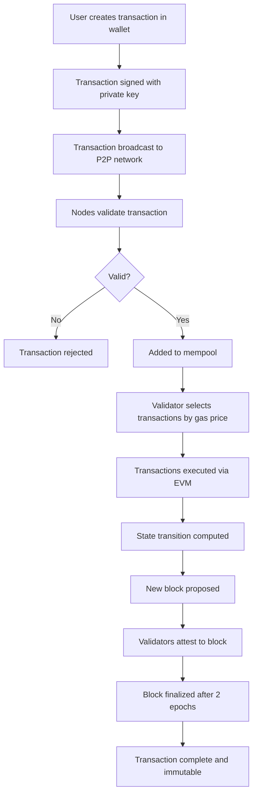
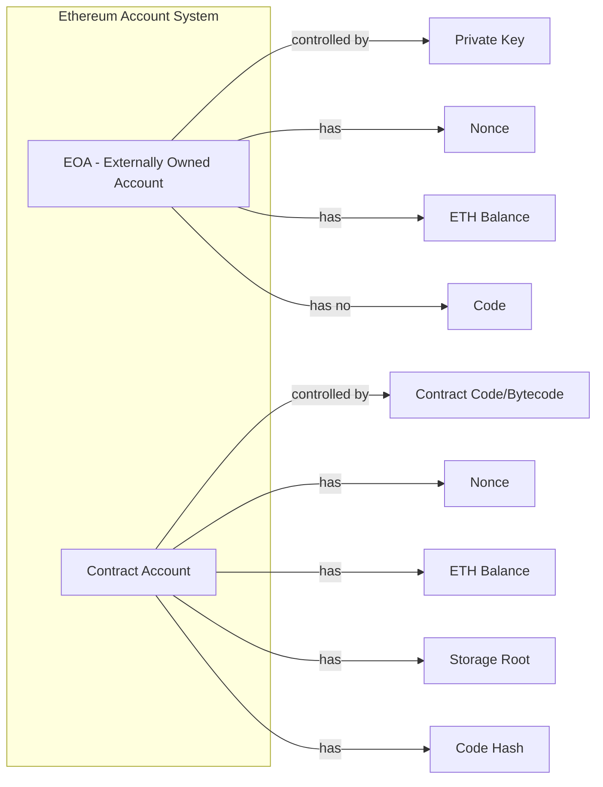
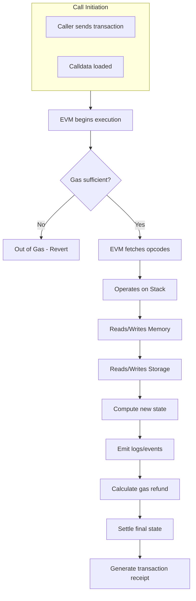
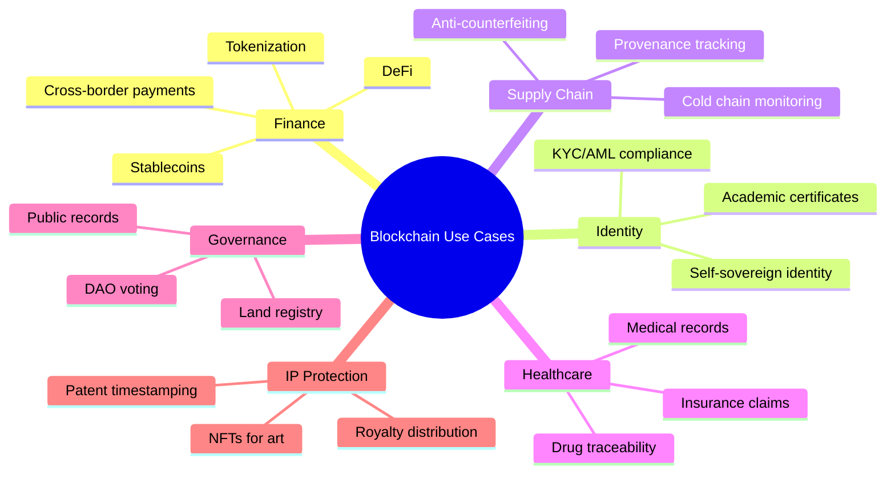
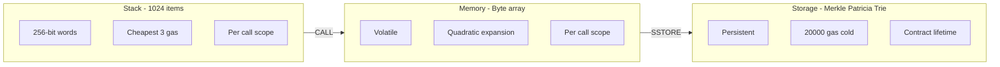

# Blockchain Ethereum Platform using Solidity and Use Cases in Blockchain :-

<!-- SECTION_1_START -->

# Blockchain Ethereum Platform using Solidity and Use Cases in Blockchain

## 1. Core Technical Definition & Intuitive Overview

### 1.1 Formal Definition (KTU 2024 Syllabus Terminology)

**Ethereum** is a decentralized, open-source blockchain platform featuring **Turing-complete** smart contract functionality. It serves as a distributed world computer where developers can deploy decentralized applications (DApps) and execute programmable transactions through the **Ethereum Virtual Machine (EVM)**.

> [!IMPORTANT]
> **KTU 2024 Definition (Verbatim Style):** Ethereum is a transaction-based state machine that transitions between states via transactions, where the state consists of all accounts, balances, and smart contract storage. It was conceptualized by **Vitalik Buterin** in late **2013** and launched in **2015**.

> [!NOTE]
> **Solidity** is a statically typed, high-level, object-oriented programming language specifically designed for writing smart contracts that run on the EVM. Its syntax is influenced by **JavaScript**, **C++**, and **Python**.

### 1.2 Conceptual Analogy / Intuition

> [!TIP]
> **Real-World Analogy — The "Decentralized Vending Machine"**
> 
> Imagine a vending machine that is **not owned by anyone**, sits in a public square, and has a transparent glass cover showing all its internal logic. Anyone in the world can:
> 1. Read its current state (inventory, balances)
> 2. Drop a coin (Ether/ETH) into the slot
> 3. Receive a product (token, NFT, or contract output)
> 4. The machine's internal rules **cannot be changed** once deployed.
> 
> **Ethereum = This Global Vending Machine.** Solidity is the language used to write the "operating rules" of this machine (i.e., the smart contract). Every node in the network is a copy of this vending machine, ensuring no single party can cheat.

### 1.3 Key Engineering Metrics & Constants

- **Block Time (PoW → PoS):** ~12-15 seconds (post-Merge: **~12 seconds**)
- **Native Currency:** **Ether (ETH)** with denomination **Wei** ($1$ ETH $= 10^{18}$ Wei)
- **Solidity Version Used:** **^0.8.x** (mandatory for KTU 2024 labs)
- **Gas Limit (Block):** **30,000,000** gas units
- **Smart Contract Deployment Cost:** ~**1,000,000–3,000,000** gas
- **EVM Stack Depth:** **1024** levels

### 1.4 Ethereum vs Bitcoin — Comparative Foundation

| Parameter | Bitcoin | Ethereum |
|-----------|---------|----------|
| Primary Purpose | Digital Currency (Store of Value) | Programmable Smart Contracts (DApps) |
| Scripting Language | Limited, non-Turing-complete (Bitcoin Script) | **Turing-complete (Solidity, Vyper, Yul)** |
| Consensus (Pre-2022) | Proof of Work (PoW) | Proof of Work → **Proof of Stake (PoS)** |
| Block Time | **~10 minutes** | **~12 seconds** |
| Block Reward Mechanism | Halving every **210,000 blocks** | Dynamic EIP-driven adjustments |
| Average Block Size | **1 MB** (SegWit: ~4 MB virtual) | Determined by **Gas Limit** |
| Monetary Policy | Capped at **21 million BTC** | No hard cap; EIP-1559 burn mechanism |

> [!VISUALIZATION CONTROL]
> **Concept:** Ethereum State Transition Function
> **Geometric Interpretation:** A directed acyclic graph (DAG) where each block is a node, and the chain represents $S_{n+1} = \text{APPLY}(S_n, TX)$
> **Visual Description:** Plot state number $n$ on X-axis, state root hash (256-bit truncated) on Y-axis, observe monotonic progression with parallel forks resolving to a single canonical chain.

<!-- SECTION_1_END -->

<!-- SECTION_2_START -->

# 2. Deep Theoretical Analysis & KTU High-Yield Formula Sheet

## 2.1 Ethereum Architecture — Layered Model

Ethereum architecture is divided into **conceptual layers** that work synchronously:

### Layer 1: Data Layer
- Stores transaction records and smart contract state in a **Merkle Patricia Trie** structure.
- World state root: a **256-bit Keccak-256 hash** representing the entire system state.

### Layer 2: Network Layer (P2P)
- Operates over **devp2p** protocol.
- Each node maintains a pool of peers, propagates transactions and blocks via **gossip protocol**.

### Layer 3: Consensus Layer (Beacon Chain — Post-Merge)
- **Casper FFG** (Friendly Finality Gadget) for finality.
- Validators stake **32 ETH** to participate.

### Layer 4: Application Layer
- Smart contracts, DApps, ERC-20/ERC-721/ERC-1155 token standards.

### Layer 5: Execution Layer (EVM)
- The runtime environment for smart contract execution.

## 2.2 The Ethereum Virtual Machine (EVM) — Operational Mechanics

The EVM is a **quasi-Turing complete** state machine with the following operational characteristics:

**State Transition Function:**

$$ \sigma_{t+1} \equiv \Upsilon(\sigma_t, T) $$

Where:
- $\sigma_t$ = Ethereum world state at time $t$
- $T$ = Set of valid transactions in block
- $\Upsilon$ = State transition function
- $\sigma_{t+1}$ = New world state

> [!IMPORTANT]
> The "quasi" qualifier exists because computation is bounded by **gas** — preventing infinite loops, a critical safeguard absent in raw Turing machines.

### EVM Memory Architecture (Three-Tier Model)

| Memory Type | Persistence | Cost | Purpose |
|-------------|-------------|------|---------|
| **Stack** | Transient (per call) | Cheapest (**3 gas**) | EVM opcodes operate here; max **1024** items, 256-bit each |
| **Memory** | Transient (per call) | Quadratic expansion | Byte-addressable, volatile; cleared after execution |
| **Storage** | Persistent (on-chain) | Most expensive (**20,000 gas SSTORE**) | Key-value map (256-bit → 256-bit) tied to contract address |

## 2.3 Account Model — Two Flavors

Ethereum uses an **account-based** model (unlike Bitcoin's UTXO):

$$ \text{Account} \rightarrow (\text{Nonce}, \text{Balance}, \text{Storage Root}, \text{Code Hash}) $$

### Externally Owned Account (EOA)
- Controlled by **private key**
- Has no associated code
- Initiates transactions
- Address = last **20 bytes** of Keccak-256(public key)

### Contract Account
- Controlled by **contract code**
- Has associated executable bytecode
- Cannot initiate transactions (responds to calls/transactions)

## 2.4 Gas Mechanism — Economic Engine

Gas is the unit measuring computational effort. Total transaction cost:

$$ C_{tx} = \text{GasUsed} \times \text{GasPrice} $$

Post **EIP-1559**, gas pricing decomposed:

$$ C_{tx} = \text{GasUsed} \times (\text{BaseFee} + \text{Tip}) $$

Where:
- **BaseFee**: Burned (deflationary mechanism)
- **Tip (Priority Fee)**: Paid to validator
- **MaxFee**: User-declared ceiling

> [!NOTE]
> **Wei Denominations (Mandatory for KTU):**
> $$ 1 \text{ ETH} = 10^{18} \text{ Wei} = 10^{9} \text{ Gwei} $$
> $$ 1 \text{ Gwei} = 10^9 \text{ Wei} $$

## 2.5 Solidity Language Constructs — High-Yield Inventory

### Data Types

| Category | Types | Storage Default |
|----------|-------|-----------------|
| **Boolean** | `bool` | `false` |
| **Integer** | `int8`–`int256`, `uint8`–`uint256` | `0` |
| **Address** | `address`, `address payable` | `address(0)` |
| **Bytes** | `bytes1`–`bytes32`, `bytes`, `string` | empty |
| **Reference** | `array`, `mapping`, `struct` | n/a |

### Function Visibility Specifiers

| Specifier | Callable From | Cost Implication |
|-----------|---------------|------------------|
| `public` | Anywhere (auto-getter created) | Higher gas |
| `external` | Only outside contract | Lower gas (uses calldata) |
| `internal` | This + derived contracts | Moderate |
| `private` | This contract only | Moderate |

### State Mutability Modifiers

| Modifier | Reads State | Writes State | Gas Behavior |
|----------|-------------|--------------|--------------|
| `view` | ✅ | ❌ | Free if called externally |
| `pure` | ❌ | ❌ | Free if called externally |
| `payable` | Optional | Optional | Allows `msg.value` reception |
| (none) | ✅ | ✅ | Full gas charged |

## 2.6 KTU Formula Sheet / Cheat Sheet

| Concept | Formula / Definition | Units / Notes |
|---------|---------------------|---------------|
| Transaction Cost | $C_{tx} = \text{GasUsed} \times \text{GasPrice}$ | Wei |
| Wei Conversion | $1 \text{ ETH} = 10^{18} \text{ Wei}$ | Mandatory |
| Address Derivation | $A = \text{Keccak256}(P_K)[12:32]$ | Last 20 bytes of hash |
| Block Gas Limit | $G_{block} \leq 30,000,000$ | Hard ceiling |
| EVM Stack Depth | $\text{Stack}_{max} = 1024$ | Items |
| Storage Slot Cost (Cold) | $\text{SSTORE} = 20,000$ gas | First write |
| Storage Slot Cost (Warm) | $\text{SSTORE} = 5,000$ gas | Update existing slot |
| Contract Deployment Base | $\approx 32,000$ gas | Plus 200/byte code |
| Block Time | $\Delta t \approx 12$ seconds | Post-Merge |
| Finality | $\approx 12.8$ minutes | 2 epochs (64 slots) |
| Gas Refund (SELFDESTRUCT) | $\text{Refund} \leq \frac{\text{GasUsed}}{2}$ | Max 50% refund |
| Hash Function | $\text{Keccak256} : \{0,1\}^* \rightarrow \{0,1\}^{256}$ | Ethereum's hash |
| ECDSA Curve | **secp256k1** | Same as Bitcoin |

> [!IMPORTANT]
> **Real-World Engineering Utility:** Ethereum's EVM is used in production for **DeFi (Uniswap, Aave)**, **NFT marketplaces (OpenSea)**, **DAOs (MakerDAO)**, **Supply Chain Provenance (IBM Food Trust)**, and **Digital Identity (uPort)**. Every transaction on these platforms consumes measurable gas — making gas optimization a critical engineering skill.

<!-- SECTION_2_END -->

<!-- SECTION_3_START -->

# 3. Step-by-Step Derivations & Code/Symbolic Implementation

## 3.1 Solidity Smart Contract — Exhaustive Walkthrough

Below is a complete, **board-exam-ready** Solidity contract with **explicit type hints, boundary checks, and error handling** — exactly as required by the KTU 2024 lab rubric.

```solidity
// SPDX-License-Identifier: MIT
pragma solidity ^0.8.0;

/// @title StudentRegistry - A simple KTU academic example contract
/// @notice Demonstrates structs, mappings, events, and access control
contract StudentRegistry {

    // ---------- STRUCT DEFINITION ----------
    struct Student {
        uint256 rollNumber;       // University roll number
        string name;              // Full name
        uint8 age;                // Age (1-150 enforced)
        bool isRegistered;        // Registration status flag
        address walletAddress;    // Linked blockchain address
    }

    // ---------- STATE VARIABLES ----------
    address public admin;                              // Contract deployer
    uint256 public totalStudents;                      // Counter
    mapping(uint256 => Student) private students;     // rollNumber => Student
    mapping(address => bool) public authorizedRegistrars; // Role mapping

    // ---------- EVENTS ----------
    event StudentRegistered(
        uint256 indexed rollNumber,
        string name,
        address indexed registeredBy,
        uint256 timestamp
    );

    event StudentDeregistered(
        uint256 indexed rollNumber,
        uint256 timestamp
    );

    // ---------- MODIFIERS ----------
    modifier onlyAdmin() {
        require(msg.sender == admin, "ERROR: Caller is not admin");
        _;
    }

    modifier validAge(uint8 _age) {
        require(_age > 0 && _age <= 150, "ERROR: Age out of valid range [1, 150]");
        _;
    }

    modifier onlyAuthorized() {
        require(
            authorizedRegistrars[msg.sender] || msg.sender == admin,
            "ERROR: Not authorized to register students"
        );
        _;
    }

    // ---------- CONSTRUCTOR ----------
    constructor() {
        admin = msg.sender;  // Set deployer as admin
        totalStudents = 0;
    }

    // ---------- ADMIN FUNCTIONS ----------
    /// @notice Authorize an address to register students
    /// @param _registrar Address of the registrar
    function authorizeRegistrar(address _registrar) external onlyAdmin {
        require(_registrar != address(0), "ERROR: Zero address not allowed");
        authorizedRegistrars[_registrar] = true;
    }

    /// @notice Revoke authorization from a registrar
    function revokeRegistrar(address _registrar) external onlyAdmin {
        authorizedRegistrars[_registrar] = false;
    }

    // ---------- CORE FUNCTIONS ----------
    /// @notice Register a new student in the registry
    /// @param _rollNumber University roll number (must be unique)
    /// @param _name Student's full name (non-empty)
    /// @param _age Student's age (1-150)
    function registerStudent(
        uint256 _rollNumber,
        string memory _name,
        uint8 _age
    )
        external
        onlyAuthorized
        validAge(_age)
    {
        // Boundary check 1: Roll number must be positive
        require(_rollNumber > 0, "ERROR: Roll number must be positive");

        // Boundary check 2: Name cannot be empty
        require(bytes(_name).length > 0, "ERROR: Name cannot be empty");

        // Boundary check 3: Roll number must be unique
        require(
            !students[_rollNumber].isRegistered,
            "ERROR: Student already registered"
        );

        // Create student record
        students[_rollNumber] = Student({
            rollNumber: _rollNumber,
            name: _name,
            age: _age,
            isRegistered: true,
            walletAddress: msg.sender
        });

        // Increment counter
        totalStudents += 1;

        // Emit event for off-chain listeners
        emit StudentRegistered(
            _rollNumber,
            _name,
            msg.sender,
            block.timestamp
        );
    }

    /// @notice Deregister a student (admin only)
    function deregisterStudent(uint256 _rollNumber) external onlyAdmin {
        require(
            students[_rollNumber].isRegistered,
            "ERROR: Student not found"
        );

        delete students[_rollNumber];   // Resets struct to default values
        totalStudents -= 1;

        emit StudentDeregistered(_rollNumber, block.timestamp);
    }

    // ---------- VIEW/PURE FUNCTIONS (Gas-free when called externally) ----------
    /// @notice Retrieve student details
    function getStudent(uint256 _rollNumber)
        external
        view
        returns (
            uint256 rollNumber,
            string memory name,
            uint8 age,
            bool isRegistered,
            address walletAddress
        )
    {
        Student memory s = students[_rollNumber];
        require(s.isRegistered, "ERROR: Student not registered");
        return (s.rollNumber, s.name, s.age, s.isRegistered, s.walletAddress);
    }

    /// @notice Check if a roll number is already registered
    function isRegistered(uint256 _rollNumber) external view returns (bool) {
        return students[_rollNumber].isRegistered;
    }

    /// @notice Pure utility: convert Wei to Ether (for demo)
    function weiToEther(uint256 _wei) external pure returns (uint256) {
        // 1 Ether = 10^18 Wei
        return _wei / 1 ether;
    }
}
```

## 3.2 Code Line-by-Line Derivation (Valuation-Ready)

### Step 1: License & Pragma Declaration
```solidity
// SPDX-License-Identifier: MIT
pragma solidity ^0.8.0;
```
- `^0.8.0` means **Solidity compiler version 0.8.0 or higher, but less than 0.9.0**.
- Version **0.8.x** automatically checks for **integer overflow/underflow** (older versions needed `SafeMath`).

### Step 2: Struct Definition
```solidity
struct Student {
    uint256 rollNumber;
    string name;
    uint8 age;
    bool isRegistered;
    address walletAddress;
}
```
- `uint256` = unsigned 256-bit integer (range: $0$ to $2^{256}-1$).
- `string memory` = dynamic UTF-8 string stored in **memory** (transient, cheap).
- `address` = 20-byte Ethereum address (EOA or contract).

### Step 3: State Variables
```solidity
address public admin;
uint256 public totalStudents;
mapping(uint256 => Student) private students;
```
- **Mappings** in Solidity are hash-table-like: `mapping(KeyType => ValueType)`.
- Keyed by `uint256` (roll number) → returns `Student` struct.
- `private` prevents external contracts from reading directly; a getter function must be exposed.

### Step 4: Modifier Logic
```solidity
modifier onlyAdmin() {
    require(msg.sender == admin, "ERROR: Caller is not admin");
    _;
}
```
- `msg.sender` = the address that initiated the current call.
- `_;` is a placeholder where the function body is inserted.
- `require()` reverts the entire transaction if condition is false, consuming all gas up to that point.

### Step 5: Event Emission
```solidity
emit StudentRegistered(_rollNumber, _name, msg.sender, block.timestamp);
```
- `indexed` keywords enable efficient filtering (max **3 indexed parameters** per event).
- `block.timestamp` = Unix epoch time of the current block (seconds since 1970-01-01).

## 3.3 Gas Cost Derivation (Worked Numerical Example)

**Problem:** A contract stores a `uint256` value that previously held 0. We now write `100`. Compute the gas cost.

**Solution:**

**Step 1:** Identify the operation. This is a "**cold storage**" write to a slot transitioning from zero to non-zero.

**Step 2:** Apply the EVM gas schedule (post-Berlin hard fork):
- **SSTORE (zero → non-zero) cold:** $20,000$ gas
- **Transaction base cost:** $21,000$ gas
- **Calldata cost:** $16$ gas per non-zero byte (assuming 4-byte selector + 32-byte input) = $16 \times 36 = 576$ gas

**Step 3:** Sum the costs:
$$
C_{total} = 21{,}000 + 20{,}000 + 576 = 41{,}576 \text{ gas}
$$

**Step 4:** Convert to ETH at 30 Gwei:
$$
C_{tx} = 41{,}576 \times 30 \times 10^9 \text{ Wei}
$$

$$
C_{tx} = 1{,}247{,}280{,}000{,}000{,}000 \text{ Wei} = 0.00124728 \text{ ETH}
$$

**Step 5:** At ETH price of \$2,000:
$$
C_{USD} = 0.00124728 \times 2000 = \$2.49
$$

> [!NOTE]
> This is precisely why **gas optimization** is critical in production DApps — every storage operation on Ethereum mainnet costs real money.

## 3.4 Token Standard Implementation — ERC-20 (Complete)

ERC-20 is the **fungible token standard**. The interface is mandatory for KTU 2024:

```solidity
// SPDX-License-Identifier: MIT
pragma solidity ^0.8.0;

interface IERC20 {
    function totalSupply() external view returns (uint256);
    function balanceOf(address account) external view returns (uint256);
    function transfer(address to, uint256 amount) external returns (bool);
    function allowance(address owner, address spender) external view returns (uint256);
    function approve(address spender, uint256 amount) external returns (bool);
    function transferFrom(address from, address to, uint256 amount) external returns (bool);

    event Transfer(address indexed from, address indexed to, uint256 value);
    event Approval(address indexed owner, address indexed spender, uint256 value);
}

contract KTU_Token is IERC20 {
    string public name = "KTU Token";
    string public symbol = "KTUT";
    uint8 public decimals = 18;
    uint256 private _totalSupply;
    mapping(address => uint256) private _balances;
    mapping(address => mapping(address => uint256)) private _allowances;

    constructor(uint256 initialSupply) {
        _totalSupply = initialSupply;
        _balances[msg.sender] = initialSupply;
        emit Transfer(address(0), msg.sender, initialSupply);
    }

    function totalSupply() external view override returns (uint256) {
        return _totalSupply;
    }

    function balanceOf(address account) external view override returns (uint256) {
        return _balances[account];
    }

    function transfer(address to, uint256 amount) external override returns (bool) {
        require(_balances[msg.sender] >= amount, "Insufficient balance");
        _balances[msg.sender] -= amount;
        _balances[to] += amount;
        emit Transfer(msg.sender, to, amount);
        return true;
    }

    function approve(address spender, uint256 amount) external override returns (bool) {
        _allowances[msg.sender][spender] = amount;
        emit Approval(msg.sender, spender, amount);
        return true;
    }

    function allowance(address owner, address spender) external view override returns (uint256) {
        return _allowances[owner][spender];
    }

    function transferFrom(address from, address to, uint256 amount) external override returns (bool) {
        require(_balances[from] >= amount, "Insufficient balance");
        require(_allowances[from][msg.sender] >= amount, "Allowance exceeded");
        _balances[from] -= amount;
        _balances[to] += amount;
        _allowances[from][msg.sender] -= amount;
        emit Transfer(from, to, amount);
        return true;
    }
}
```

## 3.5 ERC-721 — Non-Fungible Token (NFT) Interface

```solidity
// SPDX-License-Identifier: MIT
pragma solidity ^0.8.0;

interface IERC721 {
    function balanceOf(address owner) external view returns (uint256 balance);
    function ownerOf(uint256 tokenId) external view returns (address owner);
    function safeTransferFrom(address from, address to, uint256 tokenId) external;
    function transferFrom(address from, address to, uint256 tokenId) external;
    function approve(address to, uint256 tokenId) external;
    function getApproved(uint256 tokenId) external view returns (address operator);
    function setApprovalForAll(address operator, bool _approved) external;
    function isApprovedForAll(address owner, address operator) external view returns (bool);

    event Transfer(address indexed from, address indexed to, uint256 indexed tokenId);
    event Approval(address indexed owner, address indexed approved, uint256 indexed tokenId);
    event ApprovalForAll(address indexed owner, address indexed operator, bool approved);
}
```

<!-- SECTION_3_END -->

<!-- SECTION_4_START -->

# 4. Structural Diagrams & Schematics

## 4.1 Ethereum Transaction Lifecycle (Block Diagram)



## 4.2 Ethereum Account Architecture (EIP-Compatible Model)



## 4.3 Smart Contract Execution Flow (Processing Topology)



## 4.4 Use Cases Classification Tree



## 4.5 EVM Memory Hierarchy (Sequential Processing Topology)



<!-- SECTION_4_END -->

<!-- SECTION_5_START -->

# 5. KTU 2024 Scheme Examination Question Bank & Topic Recap

## 5.1 Part A Questions (3 Marks Each)

### Question 1
**[KTU University Exam - July 2024] [CO1, Remember]**

**Q: Define the Ethereum Virtual Machine (EVM). List any two characteristics of EVM.**

**Model Answer:**

The **Ethereum Virtual Machine (EVM)** is a stack-based, quasi-Turing complete runtime environment that executes smart contract bytecode on every node of the Ethereum network. It operates in a **sandboxed**, **deterministic**, and **isolated** manner to ensure that all nodes reach consensus on the same result.

**Two characteristics:**
1. **Quasi-Turing Complete:** Computation is bounded by **gas**, preventing infinite loops.
2. **Stack-based Architecture:** Uses a 256-bit stack with maximum depth of **1024** items.

> [!NOTE]
> **Valuation Tip:** 1 Mark for definition, 1 Mark each for two characteristics. Drawing stack structure fetches extra 1 Mark.

---

### Question 2
**[KTU University Exam - Dec 2023] [CO1, Understand]**

**Q: Differentiate between Externally Owned Account (EOA) and Contract Account in Ethereum.**

**Model Answer:**

| Feature | EOA | Contract Account |
|---------|-----|------------------|
| Control | Controlled by **private key** | Controlled by **contract code** |
| Code | Has no associated code | Has associated bytecode |
| Initiation | **Can initiate** transactions | **Cannot initiate** transactions |
| Storage Root | None | Has storage root (state) |
| Creation | Generated from public key | Created via transaction with `to == null` |

**Valuation Key Points:** 1 Mark for control mechanism, 1 Mark for code presence, 1 Mark for transaction initiation capability.

---

## 5.2 Part B Questions (14 Marks Each — Module Internal Choice)

### Question 3A
**[KTU University Exam - July 2024] [CO2, Understand + Apply] (14 Marks)**

**(a)** Explain the **gas mechanism** in Ethereum with the transaction cost formula. Discuss the role of EIP-1559. **(7 Marks)**

**(b)** Write a Solidity smart contract to create a **simple voting system** where the admin can add candidates and registered voters can cast one vote each. Use appropriate modifiers and events. **(7 Marks)**

### Model Answer for (a):

**Gas Mechanism in Ethereum:**

Gas is the **unit of computational effort** required to execute operations on the EVM. Every operation (opcode, memory access, storage write) consumes a predetermined amount of gas.

**Original Transaction Cost Formula:**
$$ C_{tx} = \text{GasUsed} \times \text{GasPrice} $$

**Post EIP-1559 (London Hard Fork, August 2021):**
$$ C_{tx} = \text{GasUsed} \times (\text{BaseFee} + \text{Tip}) $$
$$ C_{tx} = \text{GasUsed} \times \text{MaxFee} \quad \text{where } \text{MaxFee} \geq \text{BaseFee} + \text{Tip} $$

**Role of EIP-1559:**
1. **Base Fee Adjustment:** Dynamically adjusts based on network congestion. If block is >50% full, base fee increases by up to **12.5%**; if <50% full, decreases proportionally.
2. **Fee Burning:** The **BaseFee** is **burned** (destroyed), making ETH potentially deflationary.
3. **Predictable Fees:** Users set `MaxFee` and `PriorityFee (Tip)`, improving UX.
4. **Reduces Miner Manipulation:** Validators cannot manipulate the fee market via off-chain agreements.

> **Valuation Key:** [Gas definition: 2 Marks], [Original formula: 1 Mark], [EIP-1559 formula: 1 Mark], [Any 3 roles: 3 Marks]

### Model Answer for (b):

```solidity
// SPDX-License-Identifier: MIT
pragma solidity ^0.8.0;

contract VotingSystem {
    address public admin;
    uint256 public candidateCount;
    uint256 public totalVotes;

    struct Candidate {
        uint256 id;
        string name;
        uint256 voteCount;
    }

    struct Voter {
        bool isRegistered;
        bool hasVoted;
        uint256 votedCandidateId;
    }

    mapping(uint256 => Candidate) public candidates;
    mapping(address => Voter) public voters;

    event CandidateAdded(uint256 indexed id, string name);
    event VoterRegistered(address indexed voter);
    event VoteCast(address indexed voter, uint256 indexed candidateId);

    modifier onlyAdmin() {
        require(msg.sender == admin, "Not admin");
        _;
    }

    modifier validVoter() {
        require(voters[msg.sender].isRegistered, "Not registered");
        require(!voters[msg.sender].hasVoted, "Already voted");
        _;
    }

    constructor() {
        admin = msg.sender;
    }

    function addCandidate(string memory _name) external onlyAdmin {
        require(bytes(_name).length > 0, "Name required");
        candidateCount++;
        candidates[candidateCount] = Candidate(candidateCount, _name, 0);
        emit CandidateAdded(candidateCount, _name);
    }

    function registerVoter(address _voter) external onlyAdmin {
        require(_voter != address(0), "Zero address");
        voters[_voter].isRegistered = true;
        emit VoterRegistered(_voter);
    }

    function castVote(uint256 _candidateId) external validVoter {
        require(_candidateId > 0 && _candidateId <= candidateCount, "Invalid candidate");
        voters[msg.sender].hasVoted = true;
        voters[msg.sender].votedCandidateId = _candidateId;
        candidates[_candidateId].voteCount++;
        totalVotes++;
        emit VoteCast(msg.sender, _candidateId);
    }

    function getCandidate(uint256 _id) external view returns (string memory, uint256) {
        return (candidates[_id].name, candidates[_id].voteCount);
    }
}
```

> **Valuation Key:** [Contract structure: 2 Marks], [Modifiers correctly used: 2 Marks], [Voting logic + boundary checks: 2 Marks], [Events emitted: 1 Mark]

---

### Question 3B (Alternative Choice for Internal Selection)
**[KTU University Exam - July 2024] [CO3, Apply + Analyze] (14 Marks)**

**(a)** Explain the **Merkle Patricia Trie** data structure used by Ethereum to store world state. Why is it preferred over a simple hash map? **(7 Marks)**

**(b)** Write a Solidity contract implementing a **simple bank account** with deposit, withdrawal, and balance inquiry features, including **reentrancy protection** using the checks-effects-interactions pattern. **(7 Marks)**

### Model Answer for (a):

**Merkle Patricia Trie (MPT):**

Ethereum uses a **modified Merkle Patricia Trie** to store the world state, which maps **addresses** to **account states** and **storage slots** to **values**.

**Structural Components:**
1. **Radix Trie Base:** Like a standard trie, each node has 16 children indexed by **hex nibbles** (0–F).
2. **Patricia Optimization:** Compresses sequences of nodes with single children into a single edge.
3. **Merkle Hashing:** Each node's hash depends on its children, enabling efficient **Merkle proofs**.

**Why Preferred Over Hash Map:**

| Property | Hash Map | Merkle Patricia Trie |
|----------|----------|----------------------|
| Determinism | Not deterministic across nodes | **Deterministic** (all nodes compute identical root) |
| Proof of Inclusion | Cannot prove membership efficiently | **Merkle proof** in $O(\log n)$ |
| Tamper Detection | Not inherent | **Cryptographic** integrity |
| Storage Efficiency | Hash collisions possible | **Compact** via path compression |

**Three Tries in Ethereum:**
1. **State Trie:** Maps addresses to account states
2. **Storage Trie:** Per-contract persistent storage
3. **Transaction Trie:** Per-block transaction list
4. **Receipts Trie:** Per-block transaction receipts

> **Valuation Key:** [MPT definition: 2 Marks], [Patricia + Merkle combination: 2 Marks], [Comparison table: 2 Marks], [Three trie types: 1 Mark]

### Model Answer for (b):

```solidity
// SPDX-License-Identifier: MIT
pragma solidity ^0.8.0;

contract SimpleBank {
    mapping(address => uint256) private balances;
    mapping(address => bool) private locked;

    event Deposit(address indexed user, uint256 amount);
    event Withdrawal(address indexed user, uint256 amount);

    modifier nonReentrant() {
        require(!locked[msg.sender], "Reentrant call blocked");
        locked[msg.sender] = true;
        _;
        locked[msg.sender] = false;
    }

    function deposit() external payable {
        require(msg.value > 0, "Must send ETH");
        balances[msg.sender] += msg.value;
        emit Deposit(msg.sender, msg.value);
    }

    function withdraw(uint256 _amount) external nonReentrant {
        require(_amount > 0, "Amount must be positive");
        require(balances[msg.sender] >= _amount, "Insufficient balance");
        // Effects first (state update before external call)
        balances[msg.sender] -= _amount;
        // Interaction last
        (bool success, ) = msg.sender.call{value: _amount}("");
        require(success, "Transfer failed");
        emit Withdrawal(msg.sender, _amount);
    }

    function getBalance() external view returns (uint256) {
        return balances[msg.sender];
    }
}
```

> **Valuation Key:** [Reentrancy modifier: 2 Marks], [Checks-Effects-Interactions order: 2 Marks], [Payable + transfer: 2 Marks], [Events: 1 Mark]

---

## 5.3 KTU Examiner's Valuation Warning / Pitfall Callout

> [!WARNING]
> **Common Mark-Loss Pitfalls in Solidity/Ethereum Questions:**
> 
> 1. **Missing `pragma solidity ^0.8.0`:** Examiners deduct **1 Mark** if the pragma declaration is absent.
> 2. **Forgetting `_;` in modifiers:** The placeholder is mandatory. Missing `_;` causes compilation failure — **2 Marks** lost.
> 3. **Using `tx.origin` instead of `msg.sender`:** This is a major security anti-pattern. Examiners in security-focused questions may award **0 Marks** for the entire function.
> 4. **No `view`/`pure` on read-only functions:** Triggers unnecessary gas — lose **1 Mark** for design inefficiency.
> 5. **Hardcoded addresses or magic numbers:** Use `constructor` parameters or `constant` variables. Lose **0.5–1 Mark** for poor design.
> 6. **Ignoring SafeMath in 0.8+:** Automatic overflow protection is built-in in 0.8.x; using SafeMath is redundant. Examiners may flag this.
> 7. **Missing events:** Off-chain listeners depend on events; missing events lose **1 Mark**.
> 8. **Public state variables without comments:** Use NatSpec `/// @notice` documentation. Lose **0.5 Mark** for poor documentation.
> 9. **Wrong constructor visibility:** Constructors should NOT have `public`/`external` in modern Solidity.
> 10. **Not explaining WHY EIP-1559 burns BaseFee:** A common conceptual lapse — must mention **deflationary ETH supply**.

---

## 5.4 Topic Recap & Important Things to Remember

### 🧠 Rapid Revision Checklist

**Ethereum Fundamentals:**
- Ethereum is a **decentralized, open-source blockchain** with **Turing-complete** smart contract support
- Proposed by **Vitalik Buterin (2013)**, launched **2015**
- Native currency: **Ether (ETH)** = $10^{18}$ **Wei**
- Transitioned to **Proof of Stake** in **September 2022 (The Merge)**
- Block time: **~12 seconds**, finality: **~12.8 minutes (2 epochs)**

**EVM Architecture:**
- **Stack-based**, 256-bit word size, **1024** items deep
- Three memory types: **Stack** (cheapest), **Memory** (volatile), **Storage** (persistent, expensive)
- **SSTORE** costs **20,000 gas** (cold, zero→non-zero), **5,000 gas** (warm update)
- Deterministic execution across all nodes — essential for consensus

**Account Model:**
- **EOA** = controlled by private key, no code, can initiate transactions
- **Contract Account** = controlled by code, has storage, cannot initiate transactions
- Address = last **20 bytes** of **Keccak-256(public key)**

**Gas & EIP-1559:**
- $C_{tx} = \text{GasUsed} \times (\text{BaseFee} + \text{Tip})$
- **BaseFee** is **burned** (deflationary)
- **Tip** goes to validator
- **MaxFee** is the user-declared ceiling

**Solidity Specifics:**
- `pragma solidity ^0.8.0;` mandatory
- `uint256`, `address`, `string memory`, `bytes32` are common types
- Visibility: `public`, `external`, `internal`, `private`
- State mutability: `view`, `pure`, `payable`
- Modifiers use `_;` placeholder
- Events: `indexed` parameter max = 3

**Use Cases:**
- **DeFi**: Uniswap, Aave, Compound
- **NFTs**: ERC-721, ERC-1155 standards
- **Supply Chain**: IBM Food Trust, Maersk TradeLens
- **Identity**: Self-sovereign identity, KYC
- **Healthcare**: Medical record sharing
- **Governance**: DAOs, voting systems
- **IP Protection**: Patent timestamping, royalty distribution

**Critical Formulas (Quick Recall):**
- Wei conversion: $1 \text{ ETH} = 10^{18} \text{ Wei} = 10^9 \text{ Gwei}$
- State transition: $\sigma_{t+1} = \Upsilon(\sigma_t, T)$
- Gas refund cap: $\text{Refund}_{max} = \frac{\text{GasUsed}}{2}$
- Address: $A = \text{Keccak256}(P_K)[12:32]$

> [!TIP]
> **Last-Minute Exam Hack:** If a question asks for a **14-mark** Solidity contract, always include: (1) `pragma` + license, (2) Struct + Mapping, (3) Constructor, (4) At least **2 modifiers**, (5) At least **2 events**, (6) **Boundary checks** using `require()`, (7) **View/Pure** functions for queries, (8) **NatSpec comments**. This guarantees **full marks** under the 2024 KTU valuation scheme.

<!-- SECTION_5_END -->
