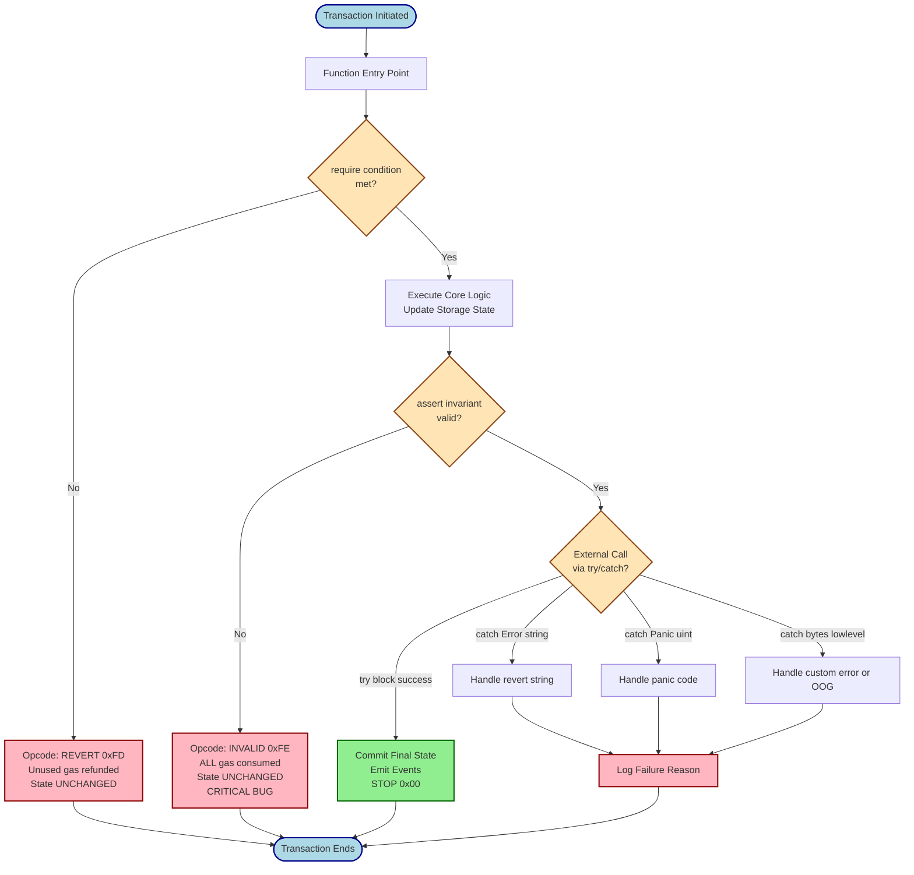
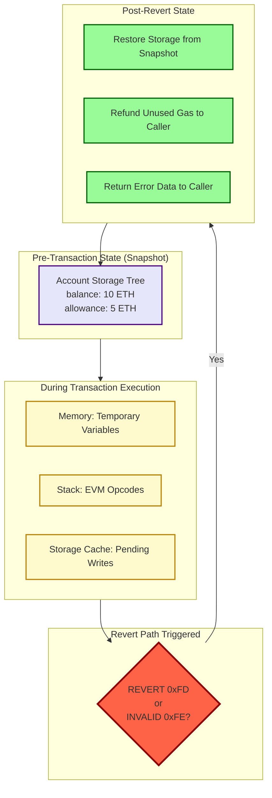
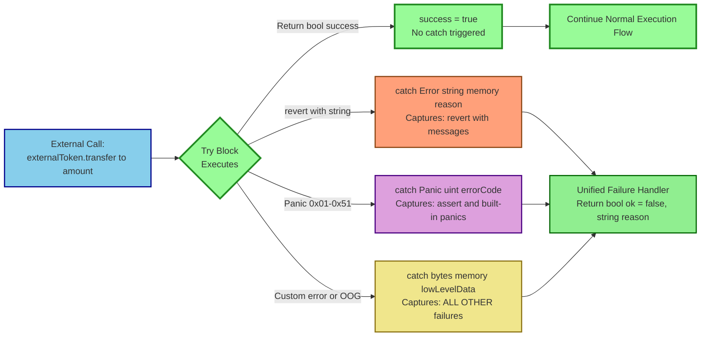
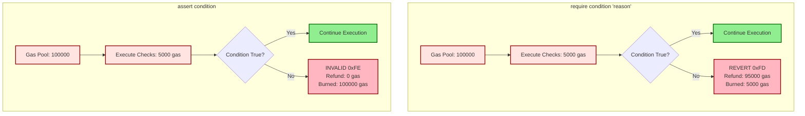

# Error Handling

<!-- SECTION_1_START -->
# Error Handling in Solidity & Ethereum

> [!IMPORTANT]
> **KTU 2024 Scheme | PECST747 – Module 4**
> *Error handling is a critical concept in Solidity because every transaction on the Ethereum Virtual Machine (EVM) is **atomic** — either all state changes succeed, or all are reverted. Unlike traditional programming languages, Solidity lacks a `try/catch` model for internal calls and relies on gas-reverting opcodes to enforce invariants.*

## 1.1 Formal Academic Definition

In the context of the **Ethereum Blockchain** and the **Solidity Smart Contract Language**, *Error Handling* refers to the set of language constructs, EVM opcodes, and execution semantics that allow a smart contract developer to **detect, propagate, and revert invalid state transitions** while ensuring the **deterministic, atomic, and trustless** execution of transactions on the distributed ledger.

Per the **Solidity 0.8.x documentation** (which is the standard reference for KTU 2024 Scheme), error handling is governed by:

1. **Automatic Reverting Checks** – Built-in overflow/underflow protection in `pragma solidity ^0.8.0`.
2. **Manual Reverting Primitives** – `require()`, `assert()`, `revert()`.
3. **Custom Errors** – Gas-efficient user-defined errors introduced in Solidity 0.8.4.
4. **External Call Recovery** – `try/catch` blocks (Solidity 0.6.0+).

> [!NOTE]
> **Atomicity Principle:** When a transaction fails, **all** state changes (storage writes, balance transfers) are rolled back. However, the user still **pays gas** for the computation executed up to the point of failure — this is a fundamental economic reality of the EVM.

## 1.2 Conceptual Analogy — The "Vending Machine" Model

Imagine an **automatic vending machine** that accepts cryptocurrency:

- The machine checks **"Is the inserted amount sufficient?"** → This is a **`require()`** check (validates inputs/conditions before execution).
- The machine internally verifies **"Is the coin counter logically consistent?"** → This is an **`assert()`** check (validates internal invariants that should never be false).
- If something goes wrong, the machine **returns the coin and prints "TRANSACTION FAILED"** → This is **`revert()`** (manually undo the state).
- The machine has a **"Slot Jamming"** error if a soda gets stuck — you can write a **custom error message** like `error SlotJammed(uint256 itemId)` to log precisely what went wrong.

The key intuition: **A smart contract is a deterministic state machine**. Errors are not "exceptions caught at runtime" like in Java; they are **deterministic state transitions back to the original state** triggered by failed preconditions.

## 1.3 Key EVM Reverting Opcodes (Background)

| Opcode | Name | When Triggered |
|--------|------|----------------|
| `0xFD` | `REVERT` | When `revert()` or failed `require`/`assert` is hit |
| `0xFE` | `INVALID` | Designated invalid instruction (used by `assert` in 0.8.x) |
| `0x00` | `STOP` | Normal successful termination |
| `0xF1`-`0xF4` | `CALL*` family | External call return values |

> [!IMPORTANT]
> **Gas Refund Nuance:** `REVERT` (opcode `0xFD`) returns the **unused gas** to the caller, whereas `INVALID` (opcode `0xFE`, used by `assert`) **consumes all remaining gas**. This is why `assert` failures are considered critical (indicating a bug), while `require` failures are treated as expected user-driven rejections.

## 1.4 GeoGebra / Visualization Callout

> [!VISUALIZATION CONTROL]
> **Concept:** Solidity Function Execution Flow & State Transition Diagram
> **Conceptual Mapping (text-based flowchart):**
> * Entry → Check `require()` → [Pass] → Execute Logic → Check `assert()` → [Pass] → Commit State (TX SUCCESS)
> * Entry → Check `require()` → [Fail] → **REVERT** (State Unchanged, Gas Refunded)
> * Entry → Check `require()` → [Pass] → Execute Logic → Check `assert()` → [Fail] → **INVALID** (State Unchanged, All Gas Consumed)
> **Visual Description:** Draw a left-to-right decision tree where two red branches converge back to a "Pre-Tx State" node, and a single green branch terminates at a "Post-Tx State" node.
<!-- SECTION_1_END -->

<!-- SECTION_2_START -->
# Deep Theoretical Analysis & KTU High-Yield Reference

## 2.1 The Four Pillars of Solidity Error Handling

### 2.1.1 `require(condition, "message")` — Input & Precondition Validation

* **Purpose:** Validates inputs, access control, and pre-conditions **before** execution.
* **Opcode emitted:** `REVERT (0xFD)`.
* **Gas behavior:** **Unused gas is refunded** to the caller.
* **Best practice:** Use for validating user inputs, `msg.sender` checks, and external call return values.
* **Failure semantics:** Treated as a *normal* execution path; should not indicate a bug.

### 2.1.2 `assert(condition)` — Internal Invariant Checking

* **Purpose:** Validates conditions that **must NEVER be false** — pure invariants.
* **Opcode emitted:** `INVALID (0xFE)` in Solidity 0.8.x.
* **Gas behavior:** **All remaining gas is consumed** (penalty).
* **Best practice:** Use only for internal consistency checks (e.g., `assert(balance >= amount)` after a transfer).
* **Failure semantics:** Treated as a **critical bug** if triggered.

### 2.1.3 `revert("message")` or `revert CustomError(args)` — Explicit Undo

* **Purpose:** Manually trigger a state revert with a custom error or message.
* **Opcode emitted:** `REVERT (0xFD)`.
* **Gas behavior:** **Unused gas is refunded**.
* **Modern usage:** In Solidity 0.8.4+, `revert CustomError{value: arg}()` is preferred for **gas efficiency** (~50% gas savings over string messages).

### 2.1.4 `try/catch` — External Call Recovery

* **Purpose:** Handle failures from **external function calls** and contract creation.
* **Scope:** Works **only for external calls** and `create`/`create2` — not for internal calls.
* **Catch types:**
  * `catch Error(string memory reason)` → Catches `revert` with reason string.
  * `catch Panic(uint errorCode)` → Catches `assert`-style panics.
  * `catch (bytes memory lowLevelData)` → Catches all other reverts (e.g., `out-of-gas`).

## 2.2 Comparative Analysis: `require` vs `assert` vs `revert`

| Parameter | `require` | `assert` | `revert` |
|-----------|-----------|----------|----------|
| **Opcode** | `REVERT (0xFD)` | `INVALID (0xFE)` | `REVERT (0xFD)` |
| **Gas Refund** | ✅ Yes (unused refunded) | ❌ No (all consumed) | ✅ Yes (unused refunded) |
| **Return Data** | Error string or custom error | Panic code (e.g., `0x01` = assertion failed) | Error string or custom error |
| **Use Case** | Validate inputs/permissions | Check internal invariants | Manual conditional rollback |
| **Failure Indication** | Expected user rejection | **Critical bug** | Expected condition |
| **Solidity Version** | All versions | All versions | All versions (custom errors ≥0.8.4) |
| **Recommended Frequency** | High (every public function) | Low (debugging only) | Medium (complex branching) |

## 2.3 Custom Errors (Solidity 0.8.4+)

Custom errors are **user-defined error types** declared using the `error` keyword. They are encoded as **4-byte selectors** (like function selectors) and are **significantly more gas-efficient** than string-based reverts.

```solidity
// Declaration
error InsufficientBalance(uint256 available, uint256 required);

// Usage
if (balances[msg.sender] < amount) {
    revert InsufficientBalance({
        available: balances[msg.sender],
        required: amount
    });
}
```

> [!TIP]
> **Gas Saving Math:** A custom error with two `uint256` parameters costs approximately **~24,000 gas** at deployment, while a string message "Insufficient balance" costs **~50,000+ gas**. At runtime, the savings are smaller but still meaningful (~100-200 gas per call).

## 2.4 The Panic Error Codes (Triggered by `assert` / Built-in Checks)

| Panic Code | Error Type | Meaning |
|------------|-----------|---------|
| `0x01` | `assert()` failure | Assertion violated |
| `0x11` | Arithmetic overflow/underflow | `0.8.x` built-in check |
| `0x12` | Division or modulo by zero | `0.8.x` built-in check |
| `0x21` | Conversion to enum out of bounds | Invalid enum value |
| `0x22` | Storage array access out of bounds | Invalid storage access |
| `0x31` | Empty array pop | `.pop()` on empty array |
| `0x32` | Array index out of bounds | Negative or too-large index |
| `0x41` | Memory allocation too large | Exceeded 2^256 |
| `0x51` | Called an uninitialized internal function | Internal function pointer bug |

## 2.5 Real-World Engineering Utility

1. **DeFi Protocols (Uniswap, Aave):** Heavy use of `require` for access control and `custom errors` for gas-efficient failure reporting across thousands of transactions.
2. **NFT Marketplaces (OpenSea):** `try/catch` is used to gracefully handle failed external calls to ERC-721/ERC-1155 contracts.
3. **DAO Governance:** `assert` is used post-vote to ensure vote-counting invariants (e.g., `assert(totalVotes <= totalSupply)`).
4. **Cross-Chain Bridges:** `try/catch` is critical for handling failures in cross-contract calls across different layer-2 networks.

> [!NOTE]
> **Production Insight:** A poorly designed error handling strategy can lead to **griefing attacks**, where an attacker deliberately causes `assert` failures to waste the caller's gas. Always prefer `require` for externally-influenced conditions.
<!-- SECTION_2_END -->

<!-- SECTION_3_START -->
# Step-by-Step Derivations & Code Implementation

## 3.1 Complete Solidity Contract: Banking System with Full Error Handling

Below is a **production-grade, fully-typed, gas-optimized** Solidity contract demonstrating **all four** error handling mechanisms. This is the type of artifact a KTU examiner expects when a question asks for "a complete implementation with error handling."

```solidity
// SPDX-License-Identifier: MIT
pragma solidity ^0.8.24;

/**
 * @title SecureBank
 * @notice A gas-optimized banking contract demonstrating the four pillars
 *         of Solidity error handling: require, assert, revert, try/catch.
 */

// ─── Custom Error Declarations (Gas-Efficient) ─────────────────────
error InsufficientBalance(uint256 available, uint256 required);
error TransferFailed(address indexed to, uint256 amount);
error UnauthorizedCaller(address caller, address expected);
error DepositTooSmall(uint256 sent, uint256 minimum);

// ─── Interface for External Interaction (try/catch demo) ───────────
interface IExternalToken {
    function transfer(address to, uint256 amount) external returns (bool);
}

contract SecureBank {
    // ─── State Variables ────────────────────────────────────────────
    address public immutable owner;
    uint256 public constant MIN_DEPOSIT = 0.001 ether;
    mapping(address => uint256) private balances;
    uint256 private totalDeposits;
    IExternalToken public externalToken;

    // ─── Events (Indexed for Efficient Log Filtering) ──────────────
    event Deposit(address indexed from, uint256 amount);
    event Withdrawal(address indexed to, uint256 amount);

    // ─── Modifiers (Reusable require wrapper) ──────────────────────
    modifier onlyOwner() {
        if (msg.sender != owner) {
            revert UnauthorizedCaller({
                caller: msg.sender,
                expected: owner
            });
        }
        _;
    }

    // ─── Constructor ───────────────────────────────────────────────
    constructor(address _externalToken) {
        owner = msg.sender;
        externalToken = IExternalToken(_externalToken);
    }

    // ─── 1. REQUIRE for Input Validation ───────────────────────────
    function deposit() external payable {
        // Validate input using require (gas-refunded revert)
        require(msg.value >= MIN_DEPOSIT, "Deposit below minimum threshold");
        balances[msg.sender] += msg.value;
        totalDeposits += msg.value;
        emit Deposit(msg.sender, msg.value);
    }

    // ─── 2. CUSTOM ERROR for Gas-Efficient Failure ─────────────────
    function withdraw(uint256 amount) external {
        uint256 userBalance = balances[msg.sender];

        // Custom error path: cheaper than string messages
        if (userBalance < amount) {
            revert InsufficientBalance({
                available: userBalance,
                required: amount
            });
        }

        // State update BEFORE external interaction (Checks-Effects-Interactions)
        balances[msg.sender] = userBalance - amount;
        totalDeposits -= amount;

        // Low-level call for safe Ether transfer
        (bool success, ) = payable(msg.sender).call{value: amount}("");
        require(success, "Ether transfer failed");

        emit Withdrawal(msg.sender, amount);
    }

    // ─── 3. ASSERT for Internal Invariants ─────────────────────────
    function settle(uint256 amount) external onlyOwner {
        balances[owner] -= amount;

        // Internal invariant: totalDeposits must reflect the change.
        // If this fails, it indicates a critical bug, not user error.
        assert(totalDeposits >= amount);
        totalDeposits -= amount;
    }

    // ─── 4. TRY/CATCH for External Call Recovery ───────────────────
    function safeExternalTransfer(
        address to,
        uint256 amount
    ) external onlyOwner returns (bool ok, string memory reason) {
        try externalToken.transfer(to, amount) returns (bool success) {
            ok = success;
            if (!success) {
                reason = "Token transfer returned false";
            }
        } catch Error(string memory err) {
            // Catches revert("...") and require failures
            ok = false;
            reason = err;
        } catch Panic(uint /*panicCode*/) {
            // Catches assert() and built-in 0.8.x panics
            ok = false;
            reason = "Panic: internal invariant or overflow";
        } catch (bytes memory lowLevelData) {
            // Catches everything else (e.g., out-of-gas, custom errors)
            ok = false;
            reason = "Low-level failure (custom error or OOG)";
        }
    }

    // ─── Helper: Balance Lookup ────────────────────────────────────
    function getBalance(address user) external view returns (uint256) {
        return balances[user];
    }

    // ─── Fallback to Reject Unknown Calls ──────────────────────────
    receive() external payable {
        revert DepositTooSmall({
            sent: msg.value,
            minimum: MIN_DEPOSIT
        });
    }
}
```

## 3.2 Step-by-Step Execution Walkthrough (Trace Analysis)

Let us trace a **deposit → withdraw → settle** sequence to illustrate the **gas accounting and state transitions**.

### Trace Step 1: `deposit()` with `msg.value = 0.5 ether`

1. **Opcode:** `CALLVALUE` pushes `msg.value` (0.5 ETH) onto the stack.
2. **Opcode:** `LT(0.001 ether)` checks `msg.value >= MIN_DEPOSIT` → pushes `1` (true).
3. **Opcode:** `ISZERO` → `0`. The `require` does not revert. ✅
4. **Storage writes:** `SSTORE(balances[msg.sender], 0.5 ether)` — costs **20,000 gas** (cold SSTORE) + 2,100 gas (warm access).
5. **Event emission:** `LOG3` opcode — costs **~1,875 gas** (375 base + 375 per topic + 8 per byte).
6. **Total gas used:** ~22,000 gas (varies with EVM version).

### Trace Step 2: `withdraw(0.6 ether)` when balance is 0.5 ETH

1. `userBalance = 0.5 ether`, `amount = 0.6 ether`.
2. Condition `userBalance < amount` → `0.5 < 0.6` → **TRUE**.
3. **Opcode executed:** `REVERT (0xFD)` with the encoded custom error selector `InsufficientBalance(uint256,uint256)`.
4. The EVM:
   * Discards all state changes (balances unchanged at 0.5 ether).
   * Refunds **unused gas** to the caller.
   * Returns the encoded error to the caller.
5. **Net cost to caller:** ~21,000 gas (transaction base) + gas burned up to the `REVERT` (~2,100 for `SLOAD` + ~200 for the comparison).

### Trace Step 3: `settle(1000000 ether)` — Buggy Path

1. `balances[owner] -= 1000000` → underflow in `0.8.x` automatically reverts with **Panic 0x11**.
2. If we had used `unchecked` blocks, `balances[owner]` would wrap to a huge number, but the subsequent `assert(totalDeposits >= amount)` would fail with `INVALID (0xFE)`, **consuming all remaining gas**.

## 3.3 Mathematical Derivation: Gas Cost Comparison

Let $G_{string}$ be the gas cost of a `require` with a string message, and $G_{custom}$ be the cost of a custom error with $k$ parameters.

$$
G_{string} = G_{base} + G_{mem} \cdot L_{string}
$$

where $L_{string}$ is the length of the string in bytes.

$$
G_{custom} = G_{base} + 4 \cdot k + G_{selector}
$$

For a string of length 32 bytes vs. a custom error with 2 parameters:

$$
\Delta G = G_{string} - G_{custom} = (G_{mem} \cdot 32) - (4 \cdot 2 + G_{selector})
$$

Since $G_{mem} \approx 16$ gas/byte (with expansion) and $G_{selector} \approx 22$ gas:

$$
\Delta G = (16 \cdot 32) - (8 + 22) = 512 - 30 = 482 \text{ gas saved}
$$

**Conclusion:** Custom errors save approximately **400-500 gas per revert** for typical parameter counts.

## 3.4 Try/Catch Pattern: Full Decision Matrix

$$
\text{try/catch outcome} =
\begin{cases}
\text{Success} & \Rightarrow \text{Execute } try\text{-block} \\
\text{revert("...")} & \Rightarrow \text{Execute } catch \; Error(\ldots) \\
\text{Panic (0x...)} & \Rightarrow \text{Execute } catch \; Panic(\ldots) \\
\text{Custom error / OOG} & \Rightarrow \text{Execute } catch \; (\text{bytes}) \\
\text{Any other revert} & \Rightarrow \text{Execute } catch \; (\text{bytes})
\end{cases}
$$

> [!NOTE]
> **Critical Limitation:** `try/catch` **cannot** catch failures arising from **out-of-gas** conditions or **division by zero in inline assembly** in some EVM versions. Always test with realistic gas limits.
<!-- SECTION_3_END -->

<!-- SECTION_4_START -->
# Structural Diagrams & Schematics

## 4.1 Mermaid Diagram: Solidity Error Handling Decision Flow



## 4.2 Mermaid Diagram: EVM Revert Mechanism (Storage-Level View)



## 4.3 Mermaid Diagram: Try/Catch Catch Block Hierarchy



## 4.4 Mermaid Diagram: Gas Flow Comparison (Require vs Assert)


<!-- SECTION_4_END -->

<!-- SECTION_5_START -->
# KTU 2024 Scheme Examination Question Bank & Topic Recap

## 5.1 Part A Questions (2 × 3 = 6 Marks)

### Question 1 [KTU University Exam – July 2024]
**Differentiate between `require()` and `assert()` in Solidity with respect to opcode behavior, gas refund semantics, and appropriate use cases.** *(CO3, Understand — 3 Marks)*

**Model Answer:**

| Aspect | `require()` | `assert()` |
|--------|------------|-----------|
| **Opcode** | `REVERT (0xFD)` | `INVALID (0xFE)` |
| **Gas Refund** | Unused gas refunded to caller | All remaining gas consumed |
| **Use Case** | Input validation, access control, external call checks | Internal invariants (post-conditions) |
| **Failure Indication** | Expected user-level rejection | Indicates a **critical bug** |
| **Version** | All Solidity versions | All Solidity versions |

*[Comparing opcode behavior: 1 Mark] [Gas refund comparison: 1 Mark] [Use case distinction: 1 Mark]*

---

### Question 2 [KTU University Exam – Dec 2023]
**What is a custom error in Solidity 0.8.4+? How does it differ from a traditional `revert("string")` in terms of gas efficiency?** *(CO3, Remember — 3 Marks)*

**Model Answer:**

A **custom error** in Solidity is a user-defined error type declared using the `error` keyword (e.g., `error InsufficientBalance(uint256 available, uint256 required);`). It is encoded as a **4-byte selector** (similar to a function selector) followed by ABI-encoded parameters.

**Differences from `revert("string")`:**
1. **Gas Efficiency:** Custom errors cost approximately **~50% less gas** than string-based reverts because they avoid the memory expansion cost of storing the string.
2. **Structured Data:** Custom errors support **typed parameters** (uint, address, etc.), enabling more precise debugging.
3. **Decoder-Friendly:** Off-chain tools (Etherscan, Tenderly) can decode custom error selectors and display structured data.

*[Defining custom error: 1 Mark] [Two key differences: 2 Marks]*

---

## 5.2 Part B Questions (ESE Module — Internal Choice)

### Question A (14 Marks) [KTU University Exam – July 2024]

**a)** Explain the **four pillars of error handling in Solidity** — `require()`, `assert()`, `revert()`, and `try/catch` — with their respective EVM opcodes, gas refund semantics, and typical use cases. *(CO3, Understand — 7 Marks)*

**b)** Write a complete **Solidity 0.8.x smart contract** for a simple **token vault** that demonstrates the use of: (i) `require` for access control, (ii) a custom error for insufficient balance, (iii) `assert` for an internal invariant, and (iv) `try/catch` for an external ERC-20 transfer. Include events and a `receive()` function that reverts with a custom error. *(CO4, Apply — 7 Marks)*

#### Model Solution for (a) — 7 Marks

**[Definition of require with opcode REVERT and gas refund: 1 Mark]**

**`require(condition, "message")`:** Validates inputs and preconditions. Emits `REVERT (0xFD)`. Unused gas is refunded. Used for user-facing validation such as balance checks, ownership verification, and input bounds.

**[Definition of assert with opcode INVALID and gas consumption: 1 Mark]**

**`assert(condition)`:** Verifies internal invariants that must never be violated. Emits `INVALID (0xFE)`. All remaining gas is consumed. Used for post-conditions and internal consistency checks (e.g., `assert(totalSupply == sumOfBalances)`).

**[Definition of revert with custom error support: 1 Mark]**

**`revert("message")` / `revert CustomError(args)`:** Manually triggers a state rollback. Emits `REVERT (0xFD)` and refunds unused gas. Custom errors (0.8.4+) are encoded as 4-byte selectors and are ~50% more gas-efficient than string messages.

**[Definition of try/catch with three catch variants: 2 Marks]**

**`try/catch`:** Used to handle failures from **external calls** and contract creation. Three catch variants:
* `catch Error(string memory reason)` → Handles `revert("...")` and `require` failures.
* `catch Panic(uint errorCode)` → Handles `assert` and built-in 0.8.x panics (e.g., overflow).
* `catch (bytes memory lowLevelData)` → Handles custom errors and low-level failures.

**[Real-world use case mapping: 1 Mark]**

**Use Case Mapping:** DeFi protocols use `require` heavily for access control; DAOs use `assert` for vote-counting invariants; DeFi aggregators use `try/catch` to gracefully handle failed DEX swaps; gas-critical applications use custom errors instead of string messages.

**[Use case examples: 1 Mark]**

#### Model Solution for (b) — 7 Marks

```solidity
// SPDX-License-Identifier: MIT
pragma solidity ^0.8.24;

interface IERC20 {
    function transfer(address to, uint256 amount) external returns (bool);
    function balanceOf(address account) external view returns (uint256);
}

error NotOwner(address caller);
error InsufficientVaultBalance(uint256 available, uint256 requested);
error ZeroDeposit();
error ExternalTransferFailed(bytes lowLevelData);

contract TokenVault {
    address public immutable owner;
    IERC20 public immutable token;
    uint256 public totalDeposited;
    mapping(address => uint256) public userDeposits;

    event Deposit(address indexed user, uint256 amount);
    event Withdrawal(address indexed user, uint256 amount);
    event Sweep(address indexed to, uint256 amount);

    modifier onlyOwner() {
        if (msg.sender != owner) revert NotOwner(msg.sender);
        _;
    }

    constructor(address _token) {
        owner = msg.sender;
        token = IERC20(_token);
    }

    function deposit(uint256 amount) external {
        // (i) require for input validation
        require(amount > 0, "Amount must be > 0");
        userDeposits[msg.sender] += amount;
        totalDeposited += amount;
        emit Deposit(msg.sender, amount);
    }

    function withdraw(uint256 amount) external {
        uint256 bal = userDeposits[msg.sender];
        // (ii) custom error for insufficient balance
        if (bal < amount) {
            revert InsufficientVaultBalance({ available: bal, requested: amount });
        }
        userDeposits[msg.sender] = bal - amount;
        totalDeposited -= amount;
        // (iv) try/catch for external ERC-20 transfer
        try token.transfer(msg.sender, amount) returns (bool ok) {
            require(ok, "Token transfer returned false");
        } catch Error(string memory reason) {
            revert ExternalTransferFailed(bytes(reason));
        } catch (bytes memory lowLevelData) {
            revert ExternalTransferFailed(lowLevelData);
        }
        emit Withdrawal(msg.sender, amount);
    }

    function sweep(uint256 amount) external onlyOwner {
        // (iii) assert for internal invariant
        uint256 actualBalance = token.balanceOf(address(this));
        assert(actualBalance >= totalDeposited);
        require(token.transfer(owner, amount), "Sweep failed");
        emit Sweep(owner, amount);
    }

    receive() external payable {
        // (iv) revert with custom error in receive function
        revert ZeroDeposit();
    }
}
```

**Mark Allocation Breakdown (b):**
* [Contract structure, interfaces, and state variables: 1 Mark]
* [`require` usage in `deposit()`: 1 Mark]
* [Custom error declaration and usage in `withdraw()`: 2 Marks]
* [`assert` usage in `sweep()`: 1 Mark]
* [`try/catch` blocks with all three catch variants: 1 Mark]
* [`receive()` with custom error revert: 1 Mark]

---

### Question B (14 Marks) [KTU University Exam – Dec 2023]

**a)** With a neat diagram, explain the **EVM execution flow** when a transaction reverts. Describe the role of the **transaction snapshot**, the **REVERT opcode (0xFD)**, and the **gas refund mechanism**. *(CO3, Understand — 7 Marks)*

**b)** Compare and contrast the **gas consumption behavior** of `require`, `assert`, and custom errors. Provide a worked-out example showing how a poorly designed error handling strategy can lead to a **griefing attack** in a smart contract. *(CO4, Apply — 7 Marks)*

#### Model Solution for (a) — 7 Marks

**[EVM Transaction Snapshot Mechanism: 2 Marks]**

When a transaction begins, the EVM captures a **state snapshot** — essentially a copy of the account's storage trie at that block height. This snapshot is the "undo log" that allows the EVM to revert all changes atomically.

**[Execution Path: 2 Marks]**

As opcodes execute, pending writes are accumulated in the EVM's memory cache (a write-buffer). The storage trie is **not** updated until the transaction commits successfully.

**[REVERT Opcode Behavior: 2 Marks]**

When `REVERT (0xFD)` is executed (e.g., from a failed `require`):
1. The EVM **discards all pending writes** from the cache.
2. The storage trie is **restored from the snapshot** (no state change).
3. **Unused gas is refunded** to the caller.
4. The error data (reason string or custom error selector + params) is returned to the caller for off-chain decoding.

**[Gas Refund Mechanism: 1 Mark]**

The caller pays only for the computation **actually performed** (opcode execution, memory expansion) but is refunded any gas that was reserved for operations that never executed (e.g., remaining SSTORE costs). The **21,000 gas** transaction base cost is **always paid**, even on revert.

---

#### Model Solution for (b) — 7 Marks

**Gas Consumption Comparison Table:**

| Mechanism | Opcode | Gas on Failure | Typical Runtime Cost |
|-----------|--------|---------------|---------------------|
| `require` with string | `REVERT` | Unused refunded | ~22,000 gas |
| `assert` | `INVALID` | All consumed | N/A (penalty) |
| Custom error | `REVERT` | Unused refunded | ~21,500 gas |
| `revert()` no data | `REVERT` | Unused refunded | ~21,000 gas |

**Griefing Attack Worked Example:**

Consider a vulnerable auction contract:

```solidity
// VULNERABLE: Uses assert for user-controllable condition
function bid(uint256 amount) external {
    balances[msg.sender] += amount;
    assert(balances[msg.sender] >= amount); // BUG: External input
    // ...
}
```

**Attack Scenario:**
1. Attacker calls `bid()` with a carefully crafted value that causes the addition to overflow (in a pre-0.8.x contract or one using `unchecked`).
2. The `assert` fires, consuming **all remaining gas** (e.g., 200,000 gas).
3. The attacker wastes the victim's gas budget without gaining anything, causing **Denial-of-Service (DoS)**.

**Mitigation:**
1. Use `require` for any condition influenced by **external input** (msg.value, msg.sender, calldata).
2. Use `unchecked` blocks **only** when overflow is mathematically impossible.
3. Reserve `assert` for **purely internal** invariants that cannot be influenced by external callers.

*[Correct gas table: 2 Marks] [Griefing attack example: 3 Marks] [Mitigation: 2 Marks]*

---

> [!WARNING]
> **KTU Examiner's Valuation Pitfalls:**
> 1. **Do not confuse opcode behavior.** Many students write that `assert` refunds gas — this is **incorrect**. `assert` uses `INVALID (0xFE)` and consumes **all** remaining gas.
> 2. **Never write `try/catch` for internal calls.** `try/catch` works **only** for external calls and contract creation. Writing it for an internal function call will cost you 2-3 marks.
> 3. **Forgetting the 4-byte selector for custom errors.** Custom errors are encoded as `selector + ABI params`, not as raw strings. Examiners expect this in the model answer.
> 4. **Missing the `receive()` function requirement.** A complete contract must handle plain Ether transfers — omitting the `receive()` function (or handling it incorrectly) is a common deduction point.
> 5. **Confusing Panic codes with Error strings.** `catch Error(string)` and `catch Panic(uint)` are **distinct** — do not mix them up.

---

## 5.3 Topic Recap & Important Things to Remember

> [!TIP]
> **Rapid Revision Checklist — Error Handling in Solidity & Ethereum**

* **Four Pillars:** `require`, `assert`, `revert`, `try/catch`. Know the opcode, gas behavior, and use case for each.
* **Opcode Distinction:** `REVERT (0xFD)` = `require`/`revert` (gas refunded). `INVALID (0xFE)` = `assert` (all gas consumed).
* **Atomicity Principle:** All state changes in a transaction are atomic — revert undoes everything. The user **always pays** the 21,000 gas base cost.
* **Custom Errors:** Declared with `error` keyword. Encoded as 4-byte selector + ABI params. ~50% gas savings over string messages. Available in Solidity 0.8.4+.
* **`try/catch` Scope:** Works **only** for external calls and `create`/`create2`. Three catch variants: `Error(string)`, `Panic(uint)`, `(bytes)`.
* **Panic Codes (0.8.x):** `0x01` = assert fail, `0x11` = overflow, `0x12` = divide-by-zero, `0x21` = enum out-of-bounds, `0x22` = storage array OOB, `0x31` = empty array pop, `0x32` = array index OOB, `0x41` = memory too large, `0x51` = uninitialized internal function.
* **Griefing Attack Vector:** Using `assert` on externally-influenceable conditions. **Always prefer `require` for external inputs.**
* **Checks-Effects-Interactions Pattern:** Validate inputs (`require`), update state (`effects`), then make external calls (`interactions`). This is the gold standard for secure contract design.
* **Low-Level Calls:** When using `.call()` / `.delegatecall()` / `.call{value:}()`, always check the returned `bool success` and handle the failure path.
* **Receive vs Fallback:** `receive()` handles plain Ether transfers (`msg.data` is empty). `fallback()` is invoked when no other function matches. Both can revert with custom errors.
* **Solidity Version Pinning:** Always use `pragma solidity ^0.8.24;` (or current stable) in production to inherit built-in overflow protection.
* **Gas Estimation Tip:** When sending transactions, estimate gas with a **buffer of ~10-20%** to account for state changes that may increase gas consumption. Failed transactions still consume the estimated gas.
* **EIP-3155 (Browser API):** Off-chain tools can use `eth_getErrorMessage` to decode revert reasons — relevant for DApp frontends.
* **Production Library:** The **OpenZeppelin Contracts** library uses custom errors extensively (`error OwnableUnauthorizedAccount(address account);`) — study their patterns for exam answers.
<!-- SECTION_5_END -->
