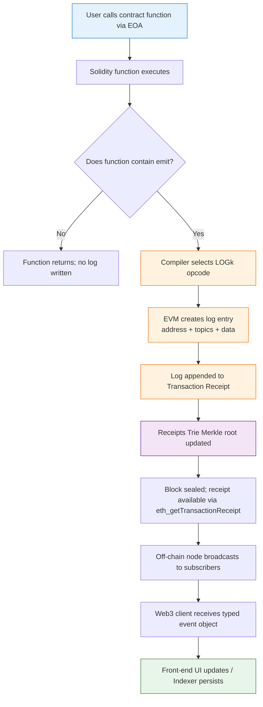
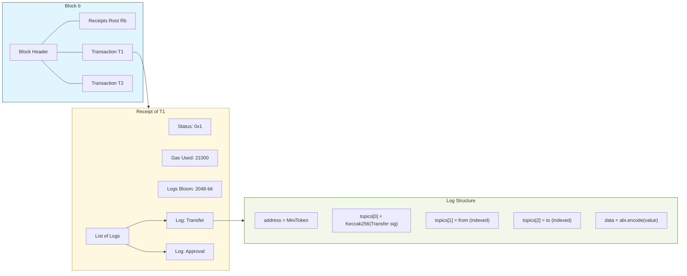
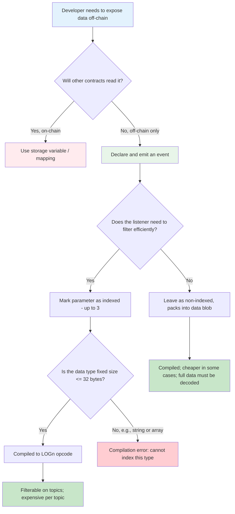

# Events

<!-- SECTION_1_START -->
# 1. Core Technical Definition & Intuitive Overview

## 1.1 Formal Academic Definition (KTU 2024 Syllabus Terminology)

In the context of the **Ethereum Virtual Machine (EVM)** and the **Solidity** smart-contract language, an **Event** is an inheritable, high-level abstraction of the EVM's low-level **logging** functionality. Events are explicitly declared inside a contract using the `event` keyword and are subsequently triggered (i.e., "fired" or "emitted") using the `emit` keyword. The data generated by an event is stored in a specialised, transaction-merkle-verified section of the blockchain known as the **transaction log** (or simply the **log**), which resides outside the contract's state storage but is cryptographically tied to the executing transaction's receipt.

Mathematically, when a transaction *T* executes a function *f* that emits event *E(a₁, a₂, …, aₙ)*, the EVM produces a structured log record:

$$
L = \left\{ \text{address}(C), \ \text{topics}[0..k], \ \text{data} \right\}
$$

where $k \le 3$ corresponds to the number of `indexed` parameters declared in event *E*. The full log tree is anchored into the block's **receipts root** $R_b$, providing tamper-evident proof that the event was emitted by the contract at address $C$ during the execution of *T* within block $b$.

> [!IMPORTANT]
> **KTU 2024 Syllabus Highlight:** Events are a fundamental application-layer primitive used to build the *off-chain communication bridge* between Solidity contracts and decentralised front-ends (DApps), oracles, indexers (e.g., **The Graph**), and analytics dashboards. They are *not* readable by other on-chain smart contracts — events are **one-way, asynchronous, off-chain-readable signals**.

## 1.2 Conceptual Analogy / Intuition

Imagine a **public notice board** in a college campus:

| Real-World Analogy | Blockchain Equivalent |
|---|---|
| The college administration office | The smart contract (Solidity code) |
| A notice pinned on the public board | An event being **emitted** |
| The actual printed content of the notice | The event's **data payload** |
| The keywords written in **bold, large letters** (e.g., "EXAM", "CANCELLED") so passers-by can quickly filter | The **indexed** parameters of the event |
| Students reading the board (they cannot edit it) | Off-chain DApps, EVM clients, indexers, Web3 listeners |
| The board photograph stored in the college record album | The transaction **receipt / log** stored in the block |

**Key intuition points for first-time learners:**

- 🪧 An event is a **broadcast** — it cannot be consumed by another smart contract inside the same EVM execution.
- 📜 Events are **gas-cheaper** than writing to `storage` because they don't modify the Merkle-Patricia state trie; instead, they are appended to a separate **logs Bloom filter** and the **receipts trie**.
- 🔎 Up to a maximum of **3 parameters** can be marked as `indexed` (per event declaration), allowing efficient, topic-based filtered querying on the client side.
- ♻️ Events are *not* retained by full nodes in the state — they are pruned by default unless an indexer (like The Graph) explicitly stores them.

## 1.3 Key Physical / Protocol Constants

- **Maximum `indexed` parameters per event:** **3**
- **EVM logging opcodes used internally:** **LOG0, LOG1, LOG2, LOG3, LOG4** (Solidity compiles `emit` to one of these)
- **Topic[0] (always):** Keccak-256 hash of the event's canonical signature
- **Standard gas cost per log topic:** **375 gas** (non-indexed data is **8 gas per byte**)
- **Solidity version reference baseline for this module:** **`pragma solidity ^0.8.0;`**

> [!NOTE]
> **Foundational Prerequisite:** A student must be familiar with the **Account Model** (EOA vs Contract), the **Transaction Lifecycle**, and the **Merkle Patricia Trie** (state trie + receipts trie) before fully appreciating why events are stored separately from state.

> [!VISUALIZATION CONTROL]
> **Concept:** EVM Transaction Receipt and Log Topology
> **Conceptual Schema (mental picture):**
> * Block Header  →  Receipts Root ($R_b$)
> * Transaction Receipt → Status, Gas Used, Logs Bloom, Logs List
> * Each Log → Address, Topics[0..3], Data (raw bytes)
> **Visual Description:** Visualise a block as a sealed envelope. Inside is a list of transactions. Each transaction has a "receipt slip" attached; on that slip, one or more "log stickers" are pasted (one per emitted event). Each log sticker has a few labelled headline tags (topics) and a long data string underneath.

---

<!-- SECTION_1_END -->

<!-- SECTION_2_START -->
# 2. Deep Theoretical Analysis & KTU High-Yield Formula Sheet

## 2.1 Operational Mechanism — The "How & Why"

### Step 1 — Declaration
An event is declared as a contract member. It is essentially a *function signature* describing the type and order of parameters.

```solidity
event Transfer(address indexed from, address indexed to, uint256 value);
```

- The compiler generates a **canonical signature** by stripping parameter names and whitespace, then taking its **Keccak-256 hash** to produce **Topic[0]**.

$$
\text{topic}[0] = \text{Keccak256}(\texttt{"Transfer(address,address,uint256)"})
$$

### Step 2 — Emission
Inside any function, the `emit` statement triggers the EVM. The compiler selects an opcode:

| Number of Indexed Parameters | EVM Opcode Used |
|:---:|:---:|
| 0 | `LOG0` |
| 1 | `LOG1` |
| 2 | `LOG2` |
| 3 | `LOG3` |
| 4+ (not allowed in Solidity) | Invalid |

### Step 3 — Log Storage
The data is written to a specialised **log entry** in the transaction receipt. The transaction receipt is then hashed and inserted into the block's **Receipts Trie** whose root is committed to the block header. This makes logs:

- **Immutable** (tied to the block).
- **Cryptographically verifiable** (Merkle inclusion proof).
- **Indexable** (via topics on EVM clients).

### Step 4 — Off-Chain Consumption
External DApps subscribe using `web3.eth.subscribe('logs', {...})` or query historical logs with `eth_getLogs`. They can filter by:

- Contract address.
- Topic[0] (event signature hash).
- Any indexed topic[1..3] (e.g., a specific user address).

## 2.2 Anatomy of an Event Declaration

```solidity
event EventName(
    type1 indexed param1,   // optional, up to 3 total
    type2 param2,          // non-indexed → packed into ABI-encoded DATA
    type3 indexed param3
);
```

| Property | Indexed Parameter | Non-Indexed Parameter |
|---|---|---|
| Stored in | Topics array | `data` field (ABI-encoded blob) |
| Queryable efficiently | ✅ Yes (Bloom filter + topic matching) | ⚠️ No, must decode full `data` |
| Type restrictions | Must be a "value type" (≤ 32 bytes), no arrays, no structs | Any Solidity type, including strings, arrays, structs |
| Maximum count per event | 3 | Unlimited (limited by block gas) |
| Cost | ~**375 gas** each + cost of storing in topic | **8 gas / byte** of data |

## 2.3 KTU Formula Sheet / Cheat Sheet

| # | Concept | Formula / Syntax | Notes |
|---|---|---|---|
| 1 | Topic[0] computation | $\text{topic}[0] = \text{Keccak256}(\text{event signature string})$ | Always present, always indexed implicitly |
| 2 | Log gas cost (simplified) | $G_{\log} = 375 \cdot n_{\text{topics}} + 8 \cdot n_{\text{dataBytes}} + G_{\text{base}}$ | $G_{\text{base}} = 375$ for the LOG opcode itself |
| 3 | Maximum indexed parameters | $n_{\text{indexed}} \le 3$ | Hard EVM constraint |
| 4 | Receive topic size | $\le 32$ bytes each | Each indexed arg is right-padded to 32 bytes |
| 5 | Event declaration | `event Name(type1, type2 indexed);` | Must be inside contract scope |
| 6 | Event emission | `emit Name(arg1, arg2);` | `emit` keyword introduced in Solidity 0.4.21+ |
| 7 | Hash for filtering | `web3.utils.sha3("Name(type1,type2)")` | Used to identify events client-side |
| 8 | EVM opcode mapping | $n_{\text{indexed}} = k \Rightarrow \text{LOG}k$ | LOG0…LOG4 (LOG4 cannot be used by Solidity directly) |

> [!IMPORTANT]
> **Examination Tip:** A common valuation pitfall is forgetting that an event with **no parameters** still emits a log and still has a Keccak-256 topic[0]. Always show the signature string for full marks.

## 2.4 Real-World Engineering Utility

Events are the **backbone of the Web3 data layer**. They are used in production for:

1. **Decentralised Exchanges (DEXes)** — Uniswap V2/V3 emits `Swap`, `Mint`, `Burn`, `Sync` events that off-chain indexers use to reconstruct trading history and pricing oracles.
2. **ERC-20 / ERC-721 Tokens** — The `Transfer` and `Approval` events allow wallets (MetaMask) to display token activity.
3. **DAO Governance** — `ProposalCreated`, `VoteCast` events fuel snapshot-style UIs and tally dashboards.
4. **Layer-2 / Bridges** — Cross-chain message-passing relies on `MessageSent` / `MessageReceived` events.
5. **Subgraph Indexing (The Graph Protocol)** — Handlers (mappings in `subgraph.yaml`) are written *only* against event handlers, never against storage reads.
6. **Real-Time Notifications** — DApp front-ends subscribe via `eth_subscribe("logs")` over WebSocket / IPC.

---

<!-- SECTION_2_END -->

<!-- SECTION_3_START -->
# 3. Step-by-Step Derivations, Code & Symbolic Implementation

## 3.1 Exhaustive Solidity Code — A Minimal ERC-20 Token Using Events

```solidity
// SPDX-License-Identifier: MIT
pragma solidity ^0.8.0;

/// @title MiniToken — minimal ERC-20 with rich event semantics
/// @notice Demonstrates KTU Module-4 learning outcomes for Solidity events
contract MiniToken {
    // --- STATE VARIABLES ---
    string  public name;
    string  public symbol;
    uint8   public decimals;
    uint256 public totalSupply;

    mapping(address => uint256) private _balances;
    mapping(address => mapping(address => uint256)) private _allowances;
    address public owner;

    // --- EVENT DECLARATIONS ---
    // (a) Standard ERC-20 Transfer event
    event Transfer(address indexed from, address indexed to, uint256 value);

    // (b) Standard ERC-20 Approval event
    event Approval(
        address indexed owner,
        address indexed spender,
        uint256 value
    );

    // (c) Custom event for ownership transfer
    event OwnershipTransferred(
        address indexed previousOwner,
        address indexed newOwner
    );

    // (d) Custom event with mixed indexed / non-indexed data
    //     — note: `reason` is a string, which CANNOT be indexed (would exceed 32 bytes)
    event MintWithReason(
        address indexed minter,
        uint256 amount,
        string reason
    );

    // --- CONSTRUCTOR ---
    constructor(
        string memory _name,
        string memory _symbol,
        uint8 _decimals,
        uint256 _initialSupply
    ) {
        name        = _name;
        symbol      = _symbol;
        decimals    = _decimals;
        totalSupply = _initialSupply;
        owner       = msg.sender;
        _balances[msg.sender] = _initialSupply;
        emit Transfer(address(0), msg.sender, _initialSupply);
        emit OwnershipTransferred(address(0), msg.sender);
    }

    // --- MODIFIER ---
    modifier onlyOwner() {
        require(msg.sender == owner, "MiniToken: caller is not the owner");
        _;
    }

    // --- CORE FUNCTIONS ---

    /// @notice Transfer tokens to a recipient
    function transfer(address to, uint256 value) external returns (bool) {
        require(to != address(0), "MiniToken: transfer to zero address");
        require(_balances[msg.sender] >= value, "MiniToken: insufficient balance");

        _balances[msg.sender] -= value;
        _balances[to]         += value;

        // Emit the canonical ERC-20 event
        emit Transfer(msg.sender, to, value);
        return true;
    }

    /// @notice Approve a spender to pull `value` tokens from the caller
    function approve(address spender, uint256 value) external returns (bool) {
        require(spender != address(0), "MiniToken: approve to zero address");

        _allowances[msg.sender][spender] = value;
        emit Approval(msg.sender, spender, value);
        return true;
    }

    /// @notice Owner-only mint with a human-readable audit reason
    function mintWithReason(
        address to,
        uint256 amount,
        string calldata reason
    ) external onlyOwner returns (bool) {
        require(to != address(0), "MiniToken: mint to zero address");
        totalSupply          += amount;
        _balances[to]        += amount;

        emit Transfer(address(0), to, amount);
        emit MintWithReason(msg.sender, amount, reason);
        return true;
    }

    /// @notice Transfer contract ownership
    function transferOwnership(address newOwner) external onlyOwner {
        require(newOwner != address(0), "MiniToken: new owner is zero address");
        address previous = owner;
        owner = newOwner;
        emit OwnershipTransferred(previous, newOwner);
    }

    // --- VIEW FUNCTIONS ---
    function balanceOf(address account) external view returns (uint256) {
        return _balances[account];
    }

    function allowance(address _owner, address spender) external view returns (uint256) {
        return _allowances[_owner][spender];
    }
}
```

### 3.1.1 Step-by-Step Code Walkthrough (Valuation Key)

| Line Block | Conceptual Reasoning |
|---|---|
| `event Transfer(address indexed from, address indexed to, uint256 value);` | Declares an event; two indexed parameters + one value-type data. Will compile to `LOG2` opcode. |
| `emit Transfer(msg.sender, to, value);` | At runtime, the EVM computes Keccak-256 of `"Transfer(address,address,uint256)"` for `topic[0]`, sets `topic[1] = from`, `topic[2] = to`, and packs `value` into the `data` field. |
| `event MintWithReason(address indexed minter, uint256 amount, string reason);` | Demonstrates that strings CANNOT be `indexed` (a string is unbounded and would not fit in 32 bytes). |
| `emit Transfer(address(0), msg.sender, _initialSupply);` | Standard ERC-20 convention — minting is represented as a `Transfer` from the **zero-address** to the recipient. |

## 3.2 Off-Chain Listener Implementation (JavaScript — Ethers.js v6)

```javascript
// listener.js
// Demonstrates filtering live events using Ethers.js v6
import { JsonRpcProvider, Contract, formatEther } from "ethers";

// 1. Connect to an Ethereum-compatible JSON-RPC endpoint
const provider = new JsonRpcProvider("https://eth.llamarpc.com");

// 2. Minimal ABI fragment — sufficient for event listening
const tokenAbi = [
    "event Transfer(address indexed from, address indexed to, uint256 value)",
    "event Approval(address indexed owner, address indexed spender, uint256 value)",
    "function name() view returns (string)",
    "function symbol() view returns (string)"
];

// 3. Wrap the deployed contract address (e.g., USDC mainnet)
const TOKEN_ADDRESS = "0xA0b86991c6218b36c1d19D4a2e9Eb0cE3606eB48";
const token = new Contract(TOKEN_ADDRESS, tokenAbi, provider);

async function main() {
    // A) Get historical Transfer events in the latest 100 blocks,
    //    filtered by a specific indexed `from` address.
    const currentBlock = await provider.getBlockNumber();
    const fromBlock = currentBlock - 100;

    const topicHash  = token.getEvent("Transfer").fragment.topicHash;
    const fromAddr   = "0x742d35Cc6634C0532925a3b844Bc9e7595f0bEb0".toLowerCase();
    const paddedFrom = "0x" + "0".repeat(24) + fromAddr.slice(2); // left-pad to 32 bytes

    const historical = await provider.getLogs({
        address: TOKEN_ADDRESS,
        topics:  [topicHash, paddedFrom, null],   // null = wildcard
        fromBlock,
        toBlock:   currentBlock
    });

    for (const log of historical) {
        const { from, to, value } = token.interface.parseLog(log).args;
        console.log(`[HIST] ${from} -> ${to}  ${formatEther(value, 6)} USDC`);
    }

    // B) Subscribe to LIVE Transfer events
    token.on("Transfer", (from, to, value, event) => {
        console.log(`[LIVE] ${from} -> ${to}  ${formatEther(value, 6)} USDC  (block ${event.log.blockNumber})`);
    });

    console.log("Listening for new Transfer events… (Ctrl+C to exit)");
}

main().catch((err) => {
    console.error("Listener error:", err);
    process.exit(1);
});
```

### 3.2.1 Step-by-Step Listener Walkthrough

| Step | Action | KTU Valuation Note |
|---|---|---|
| 1 | `provider.getBlockNumber()` | Defines the search horizon. |
| 2 | `token.getEvent("Transfer").fragment.topicHash` | Recovers $\text{Keccak256}(\texttt{"Transfer(address,address,uint256)"})$ client-side — **this is what an examiner expects you to explain**. |
| 3 | `topics: [topicHash, paddedFrom, null]` | Filters using indexed topics: signature + specific sender + any recipient. |
| 4 | `provider.getLogs({...})` | Issues a JSON-RPC `eth_getLogs` request. |
| 5 | `token.interface.parseLog(log)` | Decodes the `data` blob and the indexed topics back into a typed JS object. |
| 6 | `token.on("Transfer", listener)` | WebSocket subscription — receives events the moment the block is finalised. |

## 3.3 Symbolic Derivation — Gas Cost of an `emit` Statement

Consider the `Transfer` event fired in `transfer()`:

$$
\underbrace{G_{\text{base}}}_{\text{375 gas (LOG0 base)}} + \underbrace{375 \cdot 2}_{\text{2 indexed topics}} + \underbrace{8 \cdot 32}_{\text{value padded to 32 bytes}} = 375 + 750 + 256 = \mathbf{1381 \ gas}
$$

Plus a one-time **375 gas** LOG data cost, totalling approximately **1756 gas** (as per the EIP-2929 / EIP-3529 Yellow Paper entries). This is **significantly cheaper** than an `SSTORE` (~20,000 gas on a zero → non-zero transition), justifying the pattern *"store less, log more"*.

> [!NOTE]
> **Important KTU Insight:** While events are cheaper, they are **not queryable from within Solidity itself** (no `getEvent()` equivalent on-chain). They are strictly an off-chain reporting layer.

---

<!-- SECTION_3_END -->

<!-- SECTION_4_START -->
# 4. Structural Diagrams & Schematics

## 4.1 Lifecycle Flow: From `emit` to Off-Chain Subscriber



## 4.2 Anatomy of a Log Entry Inside a Block



## 4.3 Event Filtering Decision Tree (Architectural Pattern)



## 4.4 Use-Case Topology Matrix

| Use-Case Domain | Typical Event Names | Indexed Params | Off-Chain Consumer |
|---|---|---|---|
| ERC-20 Token | `Transfer`, `Approval` | from, to, owner, spender | MetaMask, Etherscan, The Graph |
| NFT (ERC-721) | `Transfer`, `Approval`, `ApprovalForAll` | from, to, owner, operator, tokenId | OpenSea, Blur |
| DEX | `Swap`, `Mint`, `Burn`, `Sync` | sender, to, sender, owner | Uniswap UI, DEX aggregators |
| DAO | `ProposalCreated`, `VoteCast` | proposer, voter | Tally, Snapshot |
| Oracle | `NewRound`, `AnswerUpdated` | roundId, aggregator | Chainlink Price Feeds consumers |
| Bridge | `MessageSent`, `RelayedMessage` | from, to, messageId | Cross-chain explorers |

---

<!-- SECTION_4_END -->

<!-- SECTION_5_START -->
# 5. KTU 2024 Scheme Examination Question Bank & Topic Recap

## 5.1 Part A — Short-Answer Questions (2 × 3 = 6 Marks)

### Q1. `[KTU University Exam – July 2024]`
**Define an event in Solidity. State any two advantages of using events over writing to contract storage for off-chain data consumption.** (3 Marks) — *CO1, Remember/Understand*

**Model Answer (3 marks):**
An event in Solidity is an inheritable contract member declared with the `event` keyword and triggered using the `emit` keyword. It provides an abstraction over the EVM's low-level `LOG` opcodes, allowing data to be appended to the transaction receipt, which is then anchored in the block's receipts trie.
**[Definition: 1 Mark]**
*Advantages:*
1. **Gas efficiency** — emitting an event costs a few hundred to a few thousand gas depending on topics, whereas writing to a fresh storage slot costs 20,000 gas. **[1 Mark]**
2. **Efficient off-chain filtering** — up to 3 parameters can be `indexed`, allowing EVM clients to use the **Bloom filter** in the block header to quickly locate relevant logs. **[1 Mark]**

### Q2. `[KTU University Exam – Dec 2023]`
**Explain the role of the `indexed` keyword in Solidity events. What is the maximum number of indexed parameters allowed per event, and why?** (3 Marks) — *CO1, CO2, Understand*

**Model Answer (3 marks):**
The `indexed` keyword marks a parameter of an event as a *topic*, storing it in the topics array of the log record so that external clients can perform efficient filtered queries on indexed values. **[1 Mark]**
The maximum allowed is **three (3)**, because the EVM provides exactly four logging opcodes — `LOG0`, `LOG1`, `LOG2`, `LOG3`, and `LOG4` — where the opcode suffix `k` represents the total number of topics. Since `topic[0]` is always the event signature hash, only **3** user-defined slots remain. **[2 Marks]**

---

## 5.2 Part B — Long-Answer Questions (Internal Choice) (1 × 14 = 14 Marks)

### Question A (14 Marks)

#### (a) `[KTU University Exam – July 2024]`
**Discuss in detail the architecture of the Ethereum transaction receipt and explain how event logs are stored within it. Include the EVM opcodes involved.** (7 Marks) — *CO1, CO2, Understand*

**Model Answer (7 marks):**

1. **Transaction Receipt Structure** — When a transaction executes, the EVM produces a receipt containing: `status` (success/failure), `cumulativeGasUsed`, `logsBloom` (a 2048-bit Bloom filter summary of all event topics and addresses), and `logs` (an array of log records). **[2 Marks]**
2. **Log Record Anatomy** — Each log contains: `address` (emitter contract), `topics` (array of 32-byte words; `topics[0]` is the Keccak-256 hash of the event signature), and `data` (ABI-encoded non-indexed parameters). **[2 Marks]**
3. **EVM Opcodes** — The compiler maps the `emit` statement to one of `LOG0` (0 indexed args), `LOG1` (1), `LOG2` (2), or `LOG3` (3). The opcode pushes a log entry onto the receipt. **[2 Marks]**
4. **Receipts Trie** — All receipts in a block are hashed into a Merkle Patricia Trie whose root `R_b` is stored in the block header, making the logs tamper-evident. **[1 Mark]**

#### (b) `[KTU University Exam – July 2024]`
**Write a complete Solidity contract `VotingSystem` that allows the owner to register candidates, allows voters to cast a single vote per candidate, and emits the following events: `CandidateRegistered(uint indexed id, string name)`, `VoteCast(address indexed voter, uint indexed candidateId)`, and `VotingClosed(uint totalVotes)`. Provide a JavaScript snippet (using Ethers.js) to subscribe to the `VoteCast` event in real time.** (7 Marks) — *CO3, Apply*

**Model Answer (7 marks):**

```solidity
// SPDX-License-Identifier: MIT
pragma solidity ^0.8.0;

contract VotingSystem {
    address public owner;
    bool    public isOpen;
    uint    public totalVotes;

    struct Candidate {
        uint    id;
        string  name;
        uint    voteCount;
    }

    mapping(uint  => Candidate)        public candidates;
    mapping(address => mapping(uint => bool)) public hasVoted;

    uint public candidateCount;

    event CandidateRegistered(uint indexed id, string name);
    event VoteCast(address indexed voter, uint indexed candidateId);
    event VotingClosed(uint totalVotes);

    constructor() {
        owner = msg.sender;
        isOpen = true;
    }

    modifier onlyOwner() {
        require(msg.sender == owner, "Not owner");
        _;
    }

    function registerCandidate(string calldata name) external onlyOwner {
        candidateCount += 1;
        candidates[candidateCount] = Candidate(candidateCount, name, 0);
        emit CandidateRegistered(candidateCount, name);
    }

    function castVote(uint candidateId) external {
        require(isOpen, "Voting closed");
        require(candidates[candidateId].id != 0, "Invalid candidate");
        require(!hasVoted[msg.sender][candidateId], "Already voted");

        hasVoted[msg.sender][candidateId] = true;
        candidates[candidateId].voteCount += 1;
        totalVotes += 1;

        emit VoteCast(msg.sender, candidateId);
    }

    function closeVoting() external onlyOwner {
        isOpen = false;
        emit VotingClosed(totalVotes);
    }
}
```

**[Contract structure: 2 Marks]**, **[Event declarations: 1 Mark]**, **[Function logic with emit: 2 Marks]**.

**JavaScript subscriber snippet:**

```javascript
import { JsonRpcProvider, Contract } from "ethers";
const provider = new JsonRpcProvider("https://eth.llamarpc.com");
const abi = [
    "event VoteCast(address indexed voter, uint indexed candidateId)"
];
const voting = new Contract("0xYourDeployedAddress", abi, provider);

voting.on("VoteCast", (voter, candidateId, event) => {
    console.log(`Voter ${voter} voted for candidate #${candidateId} (block ${event.log.blockNumber})`);
});
```

**[Real-time subscription with event object: 2 Marks]**

---

### Question B (14 Marks) — *Alternative Choice*

#### (a) `[KTU University Exam – Dec 2023]`
**Compare and contrast the use of Solidity events versus on-chain storage for communicating state changes. Tabulate the differences across at least five parameters: cost, accessibility, mutability, queryability, and persistence.** (7 Marks) — *CO1, CO2, Understand/Analyse*

**Model Answer (7 marks):**

| Parameter | Solidity Event | On-Chain Storage (state variable) |
|---|---|---|
| **Cost (gas)** | Low (a few hundred to ~2k gas) | High (SSTORE ≈ 20,000 gas for new slot) |
| **Accessibility from other contracts** | ❌ Not readable on-chain | ✅ Readable via `view`/`pure` calls |
| **Mutability** | Immutable once emitted | Mutable through transactions |
| **Queryability** | Off-chain clients / indexers (topics) | Direct RPC calls (`eth_call`) |
| **Persistence on full nodes** | Pruned by default | Permanent as part of state trie |
| **Indexing** | Bloom filter + topic search | Direct slot lookup |
| **Use case** | Logs, notifications, audit trail | Business logic, contract state |

**[Five correctly filled rows: 5 Marks]**, **[Conclusion summarising "store less, log more" principle: 2 Marks]**.

#### (b) `[KTU University Exam – Dec 2023]`
**Design and implement a Solidity contract `SupplyChain` that tracks an item through stages (`Manufactured → Shipped → Delivered`). The contract must emit one event per stage transition, each carrying the `itemId` (indexed), the previous stage, and the new stage. Demonstrate the use of an `enum` and a `mapping` from itemId to current stage.** (7 Marks) — *CO3, Apply*

**Model Answer (7 marks):**

```solidity
// SPDX-License-Identifier: MIT
pragma solidity ^0.8.0;

contract SupplyChain {
    enum Stage { Manufactured, Shipped, Delivered }

    struct Item {
        uint256 id;
        Stage  currentStage;
        bool   exists;
    }

    mapping(uint256 => Item) public items;
    uint256 public itemCount;

    event StageAdvanced(
        uint256 indexed itemId,
        Stage previousStage,
        Stage newStage
    );

    event ItemCreated(uint256 indexed itemId, uint256 timestamp);

    function createItem() external returns (uint256) {
        itemCount += 1;
        items[itemCount] = Item(itemCount, Stage.Manufactured, true);
        emit ItemCreated(itemCount, block.timestamp);
        return itemCount;
    }

    function advanceToShipped(uint256 itemId) external {
        Item storage item = items[itemId];
        require(item.exists, "Item does not exist");
        require(item.currentStage == Stage.Manufactured, "Not in Manufactured stage");

        Stage prev = item.currentStage;
        item.currentStage = Stage.Shipped;
        emit StageAdvanced(itemId, prev, item.currentStage);
    }

    function advanceToDelivered(uint256 itemId) external {
        Item storage item = items[itemId];
        require(item.exists, "Item does not exist");
        require(item.currentStage == Stage.Shipped, "Not in Shipped stage");

        Stage prev = item.currentStage;
        item.currentStage = Stage.Delivered;
        emit StageAdvanced(itemId, prev, item.currentStage);
    }
}
```

**[Enum and struct definition: 1 Mark]**, **[Mapping and item creation: 1 Mark]**, **[Event declaration with indexed itemId: 1 Mark]**, **[Stage transition logic with `require` guards: 2 Marks]**, **[Correct `emit` statements in all three functions: 2 Marks]**

---

## 5.3 KTU Examiner's Valuation Warning / Pitfall Callout

> [!WARNING]
> **Common Mark Deductions in Board Valuation:**
> 1. **Forgetting the `emit` keyword** — modern Solidity (≥ 0.4.21) requires it. Just calling the event like a function is *deprecated* and is a 1-mark deduction in KTU 2024 papers.
> 2. **Indexing a `string`, `bytes`, `array`, or `struct`** — this will fail to compile, and on a paper, the examiner will deduct 2 marks for the conceptual error of exceeding the 32-byte / value-type constraint.
> 3. **Forgetting the event signature string for Keccak-256 hashing** — when the question asks "how is the event identified on the EVM?", writing *"a unique ID"* without showing $\text{Keccak256}(\text{signature})$ loses 1–2 marks.
> 4. **Assuming other contracts can read events** — events are *one-way, off-chain* signals. Mark 0 for any line claiming `event` is queryable from another Solidity contract.
> 5. **Omitting the `from` and `to` parameters from the ERC-20 `Transfer` event** — the canonical signature is `Transfer(address,address,uint256)`. Missing one parameter is an instant 2-mark deduction because the topic[0] hash changes.
> 6. **Drawing the lifecycle diagram without showing LOG0…LOG3 opcodes** — full marks require both the data-flow AND the opcode mapping.

---

## 5.4 Topic Recap & Important Things to Remember

- 📌 **Definition:** An event is a Solidity construct declared with `event` and fired with `emit`, producing a log entry in the transaction receipt.
- 📌 **Maximum 3 indexed parameters per event** — a hard EVM constraint enforced by the LOG0–LOG3 opcode family.
- 📌 **Topic[0] = Keccak-256 hash of the canonical event signature string**, e.g., `Keccak256("Transfer(address,address,uint256)")`.
- 📌 **Indexed parameters** go into the topics array; **non-indexed parameters** go into the `data` blob (ABI-encoded).
- 📌 **Indexed parameters must be value types ≤ 32 bytes** — no strings, arrays, or structs.
- 📌 **Events are cheaper than storage** — typical `emit` ≈ 1.5k–2.5k gas vs. `SSTORE` ≈ 20k gas.
- 📌 **Events are NOT accessible from other smart contracts** — they are a one-way, off-chain communication channel.
- 📌 **Persistence on full nodes is not guaranteed** — events are pruned by default; persistent history requires indexers like The Graph.
- 📌 **EVM opcodes:** `LOG0`, `LOG1`, `LOG2`, `LOG3` are the four logging opcodes, mapped directly from the number of indexed parameters.
- 📌 **Logs are anchored in the block's Receipts Trie** whose root `R_b` is in the block header, ensuring cryptographic immutability.
- 📌 **The `logsBloom`** is a 2048-bit Bloom filter in the block header that enables fast, probabilistic topic filtering on EVM clients.
- 📌 **Real-world consumption patterns:** MetaMask (live UI), Etherscan (historical explorer), The Graph (indexed subgraphs), WebSocket `eth_subscribe("logs")` (real-time feeds).
- 📌 **ERC-20 standard mandates** `Transfer(address indexed,address indexed,uint256)` and `Approval(address indexed,address indexed,uint256)` — memorise these signatures.
- 📌 **Convention:** Minting is `Transfer(address(0), recipient, amount)`; burning is `Transfer(holder, address(0), amount)`.
- 📌 **`emit` keyword** is mandatory since Solidity 0.4.21 (compiler will deprecate the call-like syntax eventually).

---

<!-- SECTION_5_END -->
