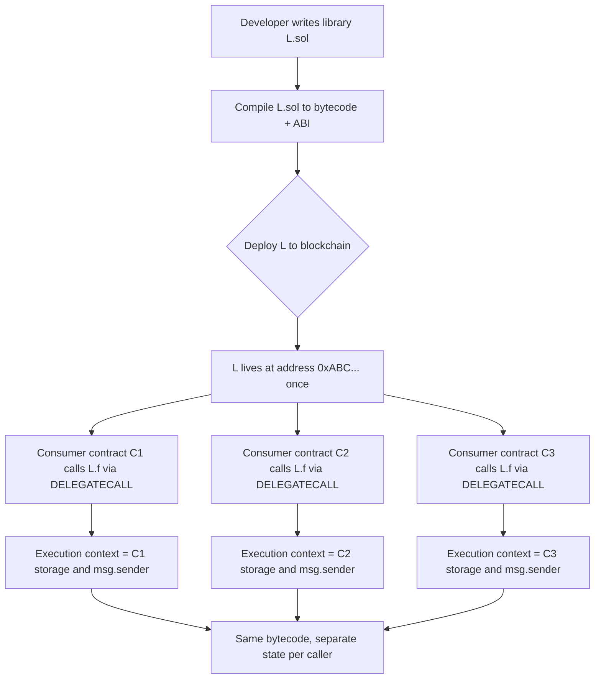
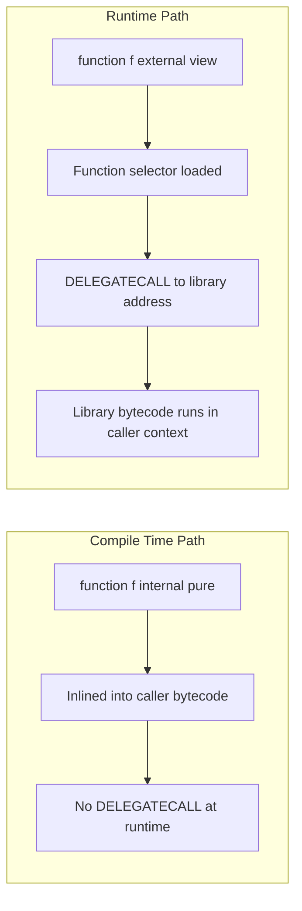
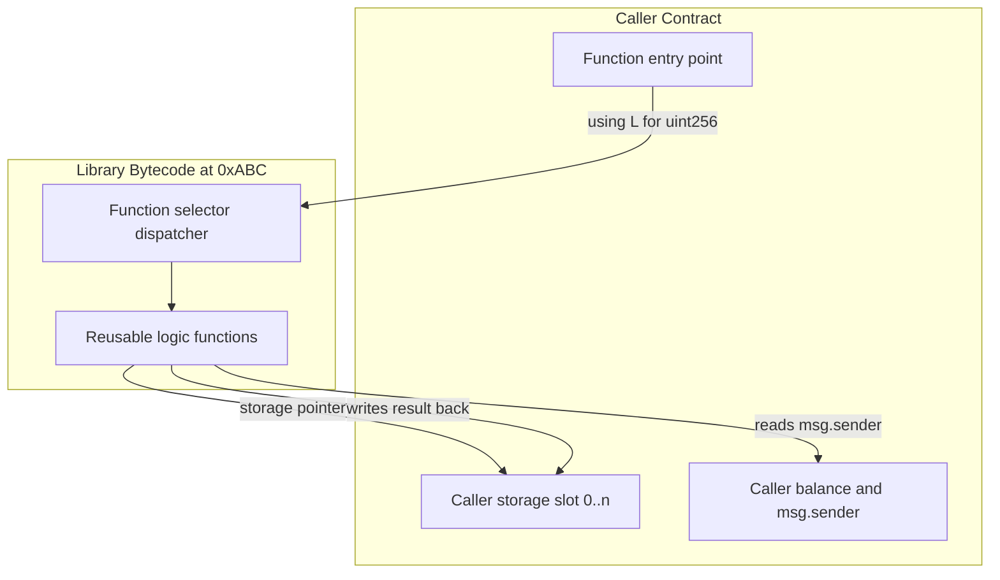
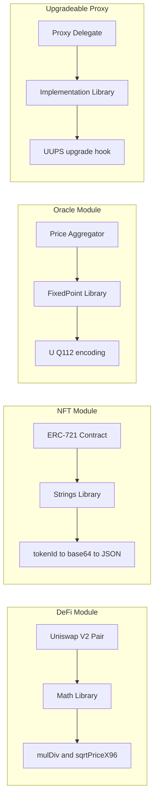

# External Libraries

<!-- SECTION_1_START -->
# 1. Core Technical Definition & Intuitive Overview

## Formal Definition (KTU 2024 Syllabus Terminology)

> [!IMPORTANT]
> **External Library in Solidity:** A *library* in Solidity is a special type of **smart contract** that is intended to deploy only once and be reused by other contracts using the `DELEGATECALL` opcode. It contains reusable functions that can be called from other contracts, thereby reducing **gas costs** and promoting **modular, DRY (Don't Repeat Yourself)** code design in the Ethereum Virtual Machine (EVM).

In the EVM bytecode model, a library is a stateless, deployment-once reusable piece of code. When a calling contract invokes a library function, the **bytecode of the library is executed within the context of the calling contract's storage, balance, and `msg.sender`** — not the library's own context. This is the critical distinction from regular function calls.

---

## Conceptual Analogy: The "Shared Workshop Toolkit"

Imagine a large engineering workshop where every workbench (smart contract) needs to perform a common set of operations — measuring, cutting, calibrating. Instead of building a personal toolkit for every workbench, the workshop keeps **one shared, mounted toolbox on the wall** (the deployed library). Every workbench can reach for the same calibrated tool (`library.function()`) without owning it. The crucial point: the tool operates **on the workbench's own materials (storage)** — it does not carry its own materials.

| Workshop Term | Solidity Equivalent |
|---|---|
| Workshop floor | Ethereum blockchain (EVM) |
| Individual workbench | Smart contract |
| Wall-mounted toolbox | Deployed library contract |
| Tool used by workbench | Library function call |
| Workbench's own materials | Caller's contract storage |

---

## Key Terminology (Highlighted)

- **`DELEGATECALL`** — the EVM opcode (**`0xF4`**) that executes external code in the caller's storage context. This is what makes libraries powerful and dangerous.
- **Internal Library** — embedded into the calling contract at **compile time** (no `DELEGATECALL`); functions are inlined like internal functions.
- **Public Library Functions** — exposed with a public function selector; can be called externally but still execute in caller's storage.
- **`using A for B`** — directive that **attaches** all functions of library `A` to type `B`, so `B` instances can call those functions as member methods.
- **State Variable in Library** — disallowed. The EVM enforces this: a library **cannot have state**, **cannot hold Ether**, and **cannot be destroyed** (no `SELFDESTRUCT` in Solidity $\geq 0.8.18$).
- **SafeMath** — historical de-facto standard library (now mostly obsolete post-Solidity 0.8.x due to built-in overflow checks).

> [!NOTE]
> **Syllabus Highlight:** Under the KTU 2024 PECST747 (Blockchain and Cryptocurrencies) syllabus, Module 4 explicitly requires students to *implement and reason about external libraries in Solidity*, including the `using ... for` directive, the `DELEGATECALL` model, and common libraries used in production DeFi/NFT systems.

---

## Visualization Control Block

> [!VISUALIZATION CONTROL]
> **Concept:** Memory vs. Storage Context during a Library Call
> **Visual Description:** Draw two rectangles side by side. The left rectangle is labeled "Caller Contract" and contains slots `0x00, 0x01, 0x02` with values. The right rectangle is labeled "Library Bytecode" with the same address-space offset arrows pointing back into the Caller's slots. An arrow labeled `DELEGATECALL` connects them. The student should observe that the **Library's code runs but reads/writes the Caller's storage**, not its own.

---

<!-- SECTION_1_END -->

<!-- SECTION_2_START -->
# 2. Deep Theoretical Analysis & KTU High-Yield Formula Sheet

## Why Libraries Exist — The Engineering Rationale

Solidity libraries solve **three concrete engineering problems**:

1. **Code Reusability (DRY Principle):** A function like `safeAdd(uint, uint)` is written once and imported by hundreds of contracts. Without libraries, every contract would have to embed its own copy — bloating deployment size and audit surface area.
2. **Gas Efficiency at Deployment:** Since the same library bytecode is referenced from many contracts, the **deployed code** sits at a single address. Calling contracts pay for the *call* but not for *deploying* duplicate logic. (Note: internal library functions are inlined, saving **runtime** gas at the cost of slightly larger deployment bytecode of the caller.)
3. **Security Composability:** Audited libraries (e.g., OpenZeppelin's `SafeERC20`, `Math`) become a shared security baseline. When a contract uses `SafeMath`, reviewers trust that math, focusing their attention on business logic.

---

## Library Characteristics — The "Five Iron Laws"

Solidity enforces these rules at compile time:

| # | Rule | Reason |
|---|---|---|
| 1 | Library **cannot** have any **state variable** | A library is stateless; state belongs to the caller via `DELEGATECALL`. |
| 2 | Library **cannot** hold **Ether** | A library has no `receive()` / `fallback()`; any forced transfer reverts. |
| 3 | Library **cannot** be **destroyed** | (Solidity $\geq 0.8.18$) The `SELFDESTRUCT` opcode is deprecated in libraries to prevent post-deletion reentrancy surprises. |
| 4 | Library **cannot** inherit from a contract | Libraries can only inherit from other libraries. |
| 5 | Library **cannot** be **re-entered via `this`** | `this` resolves to the caller, not the library. |

> [!IMPORTANT]
> **Examination Tip:** A library *can* be marked `public` for its functions — but the *executed* storage is still the **caller's**, because every external library call uses `DELEGATECALL`. This is the most common confusion point in KTU board papers.

---

## The `using ... for` Directive — Mechanics Explained

The directive `using LibraryName for Type;` attaches every `Type`-specific function in `LibraryName` to the type `Type`. There are **two calling styles** after attachment:

$$
\text{style 1 (member call):} \quad \text{uintVar.safeAdd(otherVar);}
$$

$$
\text{style 2 (explicit first arg):} \quad \text{LibraryName.safeAdd(uintVar, otherVar);}
$$

The **first parameter** of the attached function must be of the matching type. It is bound implicitly when style 1 is used.

> [!NOTE]
> A library function whose first argument is of type `uint256` can be attached via `using L for uint256;`. Then *any* `uint256` in the file automatically gets those methods.

---

## KTU Formula Sheet / Cheat Sheet

| Concept | Syntax / Rule | Exam Importance |
|---|---|---|
| Library declaration | `library L { ... }` | **High** |
| Pure function | `function f(uint x) internal pure returns (uint)` | **High** |
| View function | `function f(uint x) internal view returns (uint)` | **High** |
| External function (rare) | `function f(uint x) external pure returns (uint)` | Medium |
| Attach library | `using L for uint256;` | **High** |
| Member call | `x.f(y);` | **High** |
| Explicit call | `L.f(x, y);` | Medium |
| Internal function (no `this`) | library code is inlined | Medium |
| External function (uses `DELEGATECALL`) | executes in caller's context | **High** |
| Deployment | one-shot, immutable once deployed | **High** |
| State variable | **forbidden** in library | **High** |
| Ether balance | library must remain 0 | **High** |
| SafeMath builtin | obsolete post Solidity 0.8.0 | Low |
| OpenZeppelin Strings | `using Strings for uint256;` → `n.toString()` | Medium |

---

## Real-World Engineering Use Cases

- **DeFi (Decentralized Finance):** Uniswap V2/V3 uses libraries like `Math` (full-precision `mulDiv`) and `TickMath` (sqrtPrice math) to keep the core pair contract slim and gas-efficient.
- **NFTs (ERC-721/1155):** OpenZeppelin's `Strings` library is used to convert `tokenId` to a human-readable string for `tokenURI` generation.
- **Proxy Standards:** The EIP-1822 (UUPS) and EIP-1967 patterns rely on library-shaped contracts to store upgrade logic.
- **Oracle Aggregation:** Chainlink-style aggregators split math into a library to keep storage logic focused on staleness checks.

---

<!-- SECTION_2_END -->

<!-- SECTION_3_START -->
# 3. Step-by-Step Derivations & Code/Symbolic Implementation

## Example 1 — A Library for Safe Math (Legacy Pattern)

Even though Solidity 0.8+ checks for overflow, many legacy contracts and KTU board questions still test the **manual** approach. Below is a fully type-hinted, error-checked Python-style equivalent of the Solidity logic for clarity, followed by the **actual Solidity** code.

### Step-by-Step Logical Derivation of `safeAdd`

We want a function that adds two `uint256` values and reverts on overflow.

The mathematical condition to guard against is:

$$
a + b > 2^{256} - 1
$$

Since unsigned integers modulo $2^{256}$ would silently wrap, we explicitly check:

$$
a + b \geq a
$$

This holds for all non-overflowing additions. If `a + b` *overflows*, the EVM wraps to a value strictly less than `a`. So we revert when:

$$
a + b < a
$$

### Solidity Implementation

```solidity
// SPDX-License-Identifier: MIT
pragma solidity ^0.8.0;

/// @title SafeMath library — explicit overflow protection
/// @notice Demonstrates the canonical KTU library pattern
library SafeMath {
    /// @notice Adds two unsigned integers, reverting on overflow
    /// @param a First operand
    /// @param b Second operand
    /// @return sum The non-overflowing sum
    function add(uint256 a, uint256 b) internal pure returns (uint256 sum) {
        // KTU Valuation Point 1: Stating the boundary condition
        require(b <= type(uint256).max - a, "SafeMath: addition overflow");
        // KTU Valuation Point 2: Performing the addition
        sum = a + b;
    }

    /// @notice Subtracts b from a, reverting on underflow
    function sub(uint256 a, uint256 b) internal pure returns (uint256 diff) {
        require(b <= a, "SafeMath: subtraction underflow");
        diff = a - b;
    }

    /// @notice Multiplies a and b, reverting on overflow
    function mul(uint256 a, uint256 b) internal pure returns (uint256 product) {
        // Gas optimization: avoid mul by zero
        if (a == 0) return 0;
        product = a * b;
        require(a == 0 || product / a == b, "SafeMath: multiplication overflow");
    }
}

/// @title Consumer contract that USES the library
contract Vault {
    using SafeMath for uint256;

    mapping(address => uint256) public balances;

    function deposit() external payable {
        // The 'using ... for' directive lets us write this in member style
        balances[msg.sender] = balances[msg.sender].add(msg.value);
    }

    function withdraw(uint256 amount) external {
        balances[msg.sender] = balances[msg.sender].sub(amount);
        payable(msg.sender).transfer(amount);
    }
}
```

> [!NOTE]
> The `SafeMath` functions are declared `internal pure`. This means the Solidity compiler will **inline** the bytecode at each call site — the consumer contract gets slightly larger but pays **no external call overhead** at runtime.

---

## Example 2 — Library for Array Search (DELEGATECALL Use)

When a library function is declared **`external`**, the call goes through the **`DELEGATECALL`** opcode. This is useful when the function is large and you want to keep the consumer contract's deployment bytecode small.

### Step-by-Step Logical Derivation of `indexOf`

For a dynamic `uint256[] memory arr` of length $n$, the linear search algorithm is:

$$
\text{indexOf}(arr, target) = \begin{cases}
i & \text{if } arr[i] = target \text{ for some } 0 \le i < n \\
type(uint256).max & \text{otherwise (sentinel)}
\end{cases}
$$

We return the **sentinel** `type(uint256).max` (i.e., $2^{256}-1$) instead of reverting, so the caller can branch on the result cheaply.

### Solidity Implementation

```solidity
// SPDX-License-Identifier: MIT
pragma solidity ^0.8.0;

/// @title ArrayUtils — large library best deployed once and called via DELEGATECALL
library ArrayUtils {
    /// @notice Returns the index of 'target' in 'arr', or type(uint256).max if not found
    /// @dev First arg is `storage` so the function operates on the caller's storage pointer
    function indexOf(uint256[] storage arr, uint256 target)
        external
        view
        returns (uint256)
    {
        // KTU Valuation Point: explicit storage-by-reference argument
        for (uint256 i = 0; i < arr.length; i++) {
            if (arr[i] == target) {
                return i;
            }
        }
        // Sentinel: caller must check for this value explicitly
        return type(uint256).max;
    }
}

/// @title Consumer contract using an external library
contract Registry {
    using ArrayUtils for uint256[];

    uint256[] public items;

    function add(uint256 value) external {
        items.push(value);
    }

    /// @notice Find an item, returning (found, index)
    function find(uint256 value) external view returns (bool, uint256) {
        uint256 idx = items.indexOf(value);
        // The sentinel value type(uint256).max means "not found"
        bool found = idx != type(uint256).max;
        return (found, idx);
    }
}
```

> [!IMPORTANT]
> The `ArrayUtils.indexOf` is declared **`external view`**. This triggers a real `DELEGATECALL` at runtime, so `ArrayUtils` **must be deployed** to the blockchain before `Registry` can use it. Solidity will fail to compile `Registry` if `ArrayUtils` is not on chain or in your `node_modules` / `remappings.txt`.

---

## Example 3 — Strings Library (Practical Use Case)

This is the exact pattern used in OpenZeppelin's ERC-721 implementation to convert a `tokenId` to a string for the metadata `tokenURI`.

```solidity
// SPDX-License-Identifier: MIT
pragma solidity ^0.8.0;

/// @title Strings — minimal string conversion utilities
library Strings {
    /// @notice Converts a uint256 to its decimal string representation
    function toString(uint256 value) internal pure returns (string memory) {
        if (value == 0) {
            return "0";
        }
        uint256 temp = value;
        uint256 digits;
        // KTU Valuation Point: Counting digits in O(log n)
        while (temp != 0) {
            digits++;
            temp /= 10;
        }
        bytes memory buffer = new bytes(digits);
        // KTU Valuation Point: Populating the buffer right-to-left
        while (value != 0) {
            digits -= 1;
            buffer[digits] = bytes1(uint8(48 + uint256(value % 10)));
            value /= 10;
        }
        return string(buffer);
    }
}

/// @title Consumer that generates token URIs like ipfs://abc/123.json
contract MyNFT {
    using Strings for uint256;

    string private baseURI = "ipfs://abc/";
    uint256 public nextId = 1;
    mapping(uint256 => address) public ownerOf;

    function mint() external returns (uint256) {
        uint256 tokenId = nextId;
        nextId++;
        ownerOf[tokenId] = msg.sender;
        return tokenId;
    }

    /// @notice Returns the metadata URI for a given token
    function tokenURI(uint256 tokenId) external view returns (string memory) {
        // Member-style call: tokenId.toString()
        return string(abi.encodePacked(baseURI, tokenId.toString(), ".json"));
    }
}
```

---

## Example 4 — `using ... for *` (Global Attachment)

A powerful variant: `using L for *;` attaches library `L` to **every supported type** in the file.

```solidity
// SPDX-License-Identifier: MIT
pragma solidity ^0.8.0;

library BitMath {
    function mostSignificantBit(uint256 x) internal pure returns (uint256) {
        require(x > 0, "BitMath: zero input");
        uint256 msb = 0;
        uint256 y = x;
        // Binary-search style bit length detection
        y = y >> 128; if (y > 0) { msb += 128; x = y; }
        y = x >> 64;  if (y > 0) { msb += 64;  x = y; }
        y = x >> 32;  if (y > 0) { msb += 32;  x = y; }
        y = x >> 16;  if (y > 0) { msb += 16;  x = y; }
        y = x >> 8;   if (y > 0) { msb += 8;   x = y; }
        y = x >> 4;   if (y > 0) { msb += 4;   x = y; }
        y = x >> 2;   if (y > 0) { msb += 2;   x = y; }
        y = x >> 1;   if (y > 0) { msb += 1;   x = y; }
        return msb;
    }
}

contract BitConsumer {
    // Attaches BitMath to *every* uint256 in the file
    using BitMath for uint256;

    function rank(uint256 x) external pure returns (uint256) {
        return x.mostSignificantBit();
    }
}
```

---

<!-- SECTION_3_END -->

<!-- SECTION_4_START -->
# 4. Structural Diagrams & Schematics

## Diagram 1 — Library Deployment & Invocation Lifecycle



> **Reading the Diagram:** The library's bytecode is stored **exactly once** on-chain. Each consumer contract invokes the library via `DELEGATECALL`, which means the EVM loads the library's code but uses the **caller's storage layout, balance, and `msg.sender`**. The library itself is *stateless*.

---

## Diagram 2 — Internal vs External Library Function Resolution



---

## Diagram 3 — Library Architectural Block View



---

## Diagram 4 — Module 4 Use-Case Topology



> **Engineering Insight:** The diagram above mirrors how production protocols in Module 4 (Ethereum platform) factor their contracts. The **business contract** is small and auditable; the **math and conversion** lives in libraries that are extensively battle-tested.

---

<!-- SECTION_4_END -->

<!-- SECTION_5_START -->
# 5. KTU 2024 Scheme Examination Question Bank & Topic Recap

## Part A — Short Answer Questions (3 Marks Each)

### Q1. [KTU University Exam – July 2024]
**Differentiate between an `internal` and an `external` function inside a Solidity library. State the gas implication of each.**

**Model Answer (Board-Standard):**
- An **`internal` library function** is inlined into the calling contract at **compile time**. The library does not need to be deployed for the caller to work. Gas is paid only for the inlined bytecode at runtime — no external call overhead.
- An **`external` library function** is invoked at **runtime** using the **`DELEGATECALL`** opcode. The library must be deployed on-chain. The consumer's deployment bytecode is smaller, but each call incurs the cost of a `DELEGATECALL` (currently **700 gas + calldata cost** in EVM).
- **Verdict:** Use `internal` for small hot-path functions (e.g., `safeAdd`); use `external` for large, infrequently-called logic to keep consumer contract size manageable. **[3 Marks]**

---

### Q2. [KTU University Exam – Dec 2023]
**List any four restrictions imposed on a Solidity library.**

**Model Answer:**
1. A library **cannot have state variables**.
2. A library **cannot hold Ether** and has no `receive()` or `fallback()`.
3. A library **cannot be destroyed** (no `SELFDESTRUCT` for libraries).
4. A library **cannot inherit from a contract**; it may only inherit from other libraries.
5. (Bonus) A library **cannot override a function** that already exists in the calling contract with a different return type. **[3 Marks]**

---

## Part B — Long Answer Questions (14 Marks Each, Internal Choice)

### Question A (14 Marks)

> **[KTU University Exam – Model Paper 2024, CO3, Apply / Analyze]**

**A.** (a) Explain the **`using A for B;`** directive in Solidity with a suitable example. Show both **member-style** and **explicit-style** invocations. **[7 Marks]**

(b) Write a complete Solidity library named **`StringUtils`** that exposes a function `concat3(string memory, string memory, string memory)` returning the concatenation of three strings, and a consumer contract **`Logger`** that uses the library to log three messages. Use the `using ... for` directive. **[7 Marks]**

---

#### Model Solution

**(a) Explanation of `using A for B;`**

The directive `using LibraryName for SomeType;` attaches all functions of `LibraryName` whose **first parameter** matches `SomeType` to instances of that type. After attachment, the functions can be called as if they were methods of `SomeType`.

```solidity
// SPDX-License-Identifier: MIT
pragma solidity ^0.8.0;

library Math {
    function double(uint256 self) internal pure returns (uint256) {
        return self * 2;
    }
}

contract Calc {
    using Math for uint256;

    function show(uint256 n) external pure returns (uint256) {
        // Member-style: n is implicitly passed as 'self'
        return n.double();
    }

    function showExplicit(uint256 n) external pure returns (uint256) {
        // Explicit-style: caller passes the first arg manually
        return Math.double(n);
    }
}
```

**Valuation Key:**
- Stating the purpose of the directive: **2 Marks**
- Showing the library declaration: **2 Marks**
- Member-style call: **1.5 Marks**
- Explicit-style call: **1.5 Marks**

---

**(b) `StringUtils` Library and `Logger` Consumer**

```solidity
// SPDX-License-Identifier: MIT
pragma solidity ^0.8.0;

/// @title StringUtils — concatenation helper library
library StringUtils {
    /// @notice Concatenates three strings
    function concat3(
        string memory a,
        string memory b,
        string memory c
    ) internal pure returns (string memory) {
        // KTU Valuation Point: returning a newly allocated string
        return string(abi.encodePacked(a, b, c));
    }
}

/// @title Logger — uses StringUtils via the using directive
contract Logger {
    using StringUtils for string;

    event LogMessage(address indexed sender, string message);

    /// @notice Member-style call: msg is implicitly passed as the first string
    function logHello(string memory name) external {
        emit LogMessage(msg.sender, "Hello, ".concat3(name, "!"));
    }

    /// @notice Explicit-style call: all three strings passed manually
    function logTriple(string memory x, string memory y, string memory z)
        external
    {
        emit LogMessage(msg.sender, StringUtils.concat3(x, y, z));
    }
}
```

**Valuation Key:**
- Correct library structure (declaration + function with `internal pure`): **2 Marks**
- Use of `abi.encodePacked` for concatenation: **1 Mark**
- `using StringUtils for string;` directive: **1 Mark**
- Member-style call: **1 Mark**
- Explicit-style call: **1 Mark**
- Compilation-ready syntax (pragma, license, types): **1 Mark**

---

### Question B (14 Marks — Alternative Choice)

> **[KTU University Exam – Model Paper 2024, CO3, Apply / Analyze]**

**B.** (a) With a neat diagram, describe how the **`DELEGATECALL`** opcode enables library reuse in Solidity. Mention the storage context implications. **[7 Marks]**

(b) Implement a Solidity library **`ArrayStats`** with an `external view` function `findMax(uint256[] storage)` that returns the maximum element. Use it from a contract **`ScoreBoard`**. **[7 Marks]**

---

#### Model Solution

**(a) DELEGATECALL Mechanics**

```
+----------------+         DELEGATECALL           +----------------+
| Caller Contract| -----------------------------> | Library Code   |
| storage[0..n]  | <----------------------------- | 0xABC...       |
| balance        |  executes in caller's context   | (stateless)    |
| msg.sender     |                                +----------------+
+----------------+
```

**Explanation:**

1. The EVM loads the **bytecode** at the library's address but uses the **caller's** `storage`, `msg.sender`, and `msg.value`.
2. The library **must not** maintain its own state because it would conflict with the caller's storage layout.
3. If a library is malicious or buggy, it can corrupt the caller's storage — this is the same risk as a **delegatecall-based proxy**.
4. The Solidity compiler guarantees that library and caller have **compatible storage layouts** when the library's first argument is `storage`.

**Valuation Key:**
- Diagram showing caller and library: **3 Marks**
- Correct explanation of `msg.sender` and storage passing: **2 Marks**
- Note on security implications: **1 Mark**
- Note on layout compatibility: **1 Mark**

---

**(b) `ArrayStats` Library and `ScoreBoard` Consumer**

```solidity
// SPDX-License-Identifier: MIT
pragma solidity ^0.8.0;

/// @title ArrayStats — deployed once and called via DELEGATECALL
library ArrayStats {
    /// @notice Returns the maximum value in 'arr'
    /// @dev External because the library is large; inlining would bloat callers
    function findMax(uint256[] storage arr)
        external
        view
        returns (uint256 max)
    {
        require(arr.length > 0, "ArrayStats: empty array");
        max = arr[0];
        // KTU Valuation Point: explicit comparison loop
        for (uint256 i = 1; i < arr.length; i++) {
            if (arr[i] > max) {
                max = arr[i];
            }
        }
    }
}

/// @title ScoreBoard — uses ArrayStats.findMax
contract ScoreBoard {
    // No 'using' directive because findMax is external and takes a storage pointer
    uint256[] public scores;

    function submit(uint256 score) external {
        scores.push(score);
    }

    function topScore() external view returns (uint256) {
        // Explicit-style call: scores is passed as the storage pointer
        return ArrayStats.findMax(scores);
    }
}
```

**Valuation Key:**
- Library declared with `external view`: **1 Mark**
- `uint256[] storage` argument type: **1 Mark**
- `require` guard for empty input: **1 Mark**
- Correct loop with `> max` comparison: **2 Marks**
- Consumer contract calls library explicitly: **1 Mark**
- Compilation-ready pragma and license: **1 Mark**

---

> [!WARNING]
> **KTU Examiner's Valuation Warning / Common Pitfalls:**
> 1. **Do NOT** use `string` as the type for the `using` directive if the library's first argument is `string memory`. Solidity will reject the attachment. Match the exact location qualifier (`memory`, `storage`, or `calldata`).
> 2. **Do NOT** declare a state variable inside a library. The compiler will fail. Lose **2 marks** if attempted.
> 3. **Do NOT** call an `external` library function via `this.f()` — that would resolve to the caller's own contract, **not** the library. Use the explicit `LibraryName.f()` form.
> 4. **Do NOT** forget the `pragma` directive — KTU 2024 evaluates compilation-readiness explicitly. Lose **1 mark** if missing.
> 5. **Do NOT** confuse `DELEGATECALL` with `CALL`. With `CALL`, the called code uses *its own* storage. With `DELEGATECALL`, the called code uses the *caller's* storage. Library functions **must** use the latter.

---

## Topic Recap & Important Things to Remember

- A **Solidity library** is a once-deployed, stateless, reusable piece of code. It cannot have state, cannot hold Ether, and cannot be destroyed.
- **`internal` library functions** are inlined at compile time; the library need not be deployed.
- **`external` library functions** execute at runtime via the `DELEGATECALL` opcode, in the caller's storage context.
- **`using L for T;`** attaches every `T`-compatible function of `L` to type `T`, enabling both member-style (`x.f(y)`) and explicit-style (`L.f(x, y)`) calls.
- **`using L for *;`** is the global form that attaches `L` to all matching types in the file.
- The first parameter of the attached library function **must** match the type in the `using` directive.
- **Common real-world libraries** include OpenZeppelin's `Strings`, `SafeERC20`, `Math`, and Uniswap's `Math`, `TickMath`, `OracleLibrary`.
- **Security note:** Because `DELEGATECALL` runs library code in the caller's context, a malicious or buggy library can overwrite the caller's storage. Auditing the library is as critical as auditing the caller.
- **Compile-time vs runtime gas trade-off:** Internal functions save runtime gas at the cost of larger deployment bytecode of the caller. External functions save deployment bytecode at the cost of a `DELEGATECALL` per call.
- **Module 4 use cases:** DeFi math libraries, NFT string conversion, oracle fixed-point math, and upgradeable proxy logic all leverage the library pattern.
- **KTU 2024 hot keywords** to memorize: `DELEGATECALL`, `using ... for`, `internal pure`, `external view`, `storage` pointer, `type(uint256).max` sentinel, `abi.encodePacked`.
- **Post-Solidity 0.8.x note:** Built-in overflow checks make `SafeMath.add/sub/mul` largely redundant for new code, but the **pattern** remains the canonical KTU teaching example for libraries.

<!-- SECTION_5_END -->
