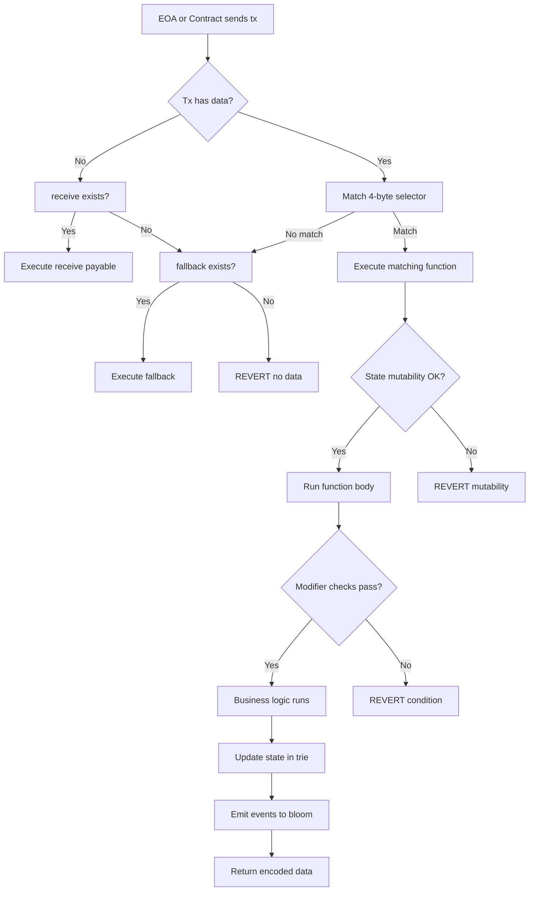
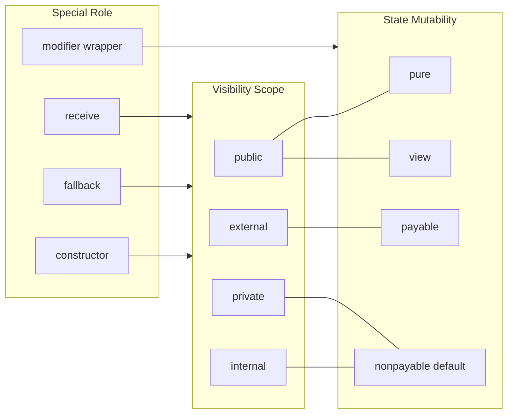
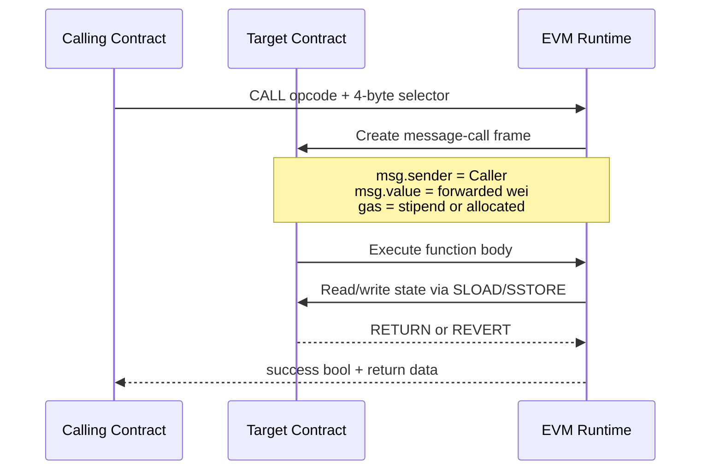
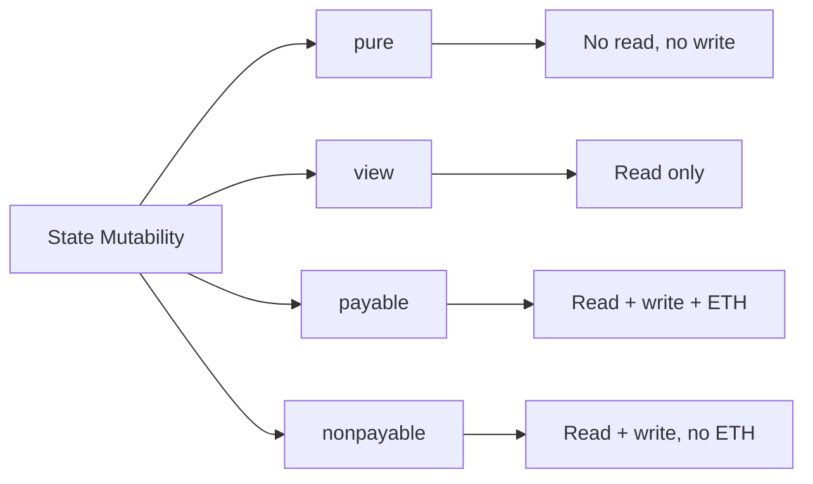

# Functions

<!-- SECTION_1_START -->
# FUNCTIONS IN SOLIDITY — Core Technical Definition & Intuitive Overview

## 1.1 Formal Academic Definition (KTU 2024 Syllabus Terminology)

In the **Ethereum Virtual Machine (EVM)** execution model, a **function** in Solidity is a named, reusable, executable code segment that encapsulates business logic operating over the **persistent contract state** stored in the **world state trie**. Every function in a Solidity smart contract carries four mandatory orthogonal attributes: **(i) visibility**, which controls access from other contracts and accounts; **(ii) state mutability**, which determines whether the function reads and/or writes to the blockchain ledger; **(iii) parameter signature**, which defines the typed inputs; and **(iv) return signature**, which defines the typed outputs.

According to the **KTU PECST747 Module 4** syllabus, functions are the **fundamental unit of computation** in Ethereum smart contracts. They are compiled down to **EVM opcodes** (such as `CALL`, `STATICCALL`, `DELEGATECALL`, `SSTORE`, `SLOAD`, `RETURN`, `REVERT`) and executed by every full-node validator on the network, with the resource cost measured in **gas units**.

> [!IMPORTANT]
> **KTU 2024 Syllabus Highlight:** Functions in Solidity are NOT the same as functions in C, Java, or Python. They are first-class citizens of the EVM and their behavior affects **gas consumption**, **transactional atomicity**, and **consensus-level determinism**.

## 1.2 Conceptual Analogy / Intuition

Imagine a **vending machine** bolted to a wall in a public park.

- The **smart contract** is the vending machine itself — a black box with locked internals.
- The **functions** are the labeled buttons on the front panel: *"Insert Coin"*, *"Select Item A"*, *"Refund"*.
- **Visibility** is whether the button is on the outside (public) or hidden inside a service hatch (private).
- **State Mutability** is whether the button *reads* the display (`view`) or *changes* the inventory (`non-payable`/`payable`).
- **Gas** is the electrical current consumed by the motor that physically pushes the snack out — every button press costs a fixed, pre-declared amount of energy.

> [!NOTE]
> **Definition (KTU Board Standard):**
> A Solidity function is declared using the keyword `function`, has a unique selector derived as `bytes4(keccak256("name(argTypes)"))`, and is invoked either **internally** (via the EVM `JUMP` opcode, no message call) or **externally** (via `CALL`/`DELEGATECALL` opcodes, message-call semantics).

## 1.3 Key Physical / Logical Constants

| Constant / Metric | Value | Significance |
|---|---|---|
| `tx.gaslimit` (block) | **30,000,000** | Maximum gas per block in Ethereum mainnet |
| `stipend` for `CALL` | **2300 gas** | Gas forwarded with plain ETH transfers |
| Base transaction cost | **21000 gas** | Cost of any transaction |
| `keccak256` output | **256 bits** | Function selector size |
| Function selector | **4 bytes** | First 4 bytes of `keccak256(abi.encodePacked(...))` |

> [!VISUALIZATION CONTROL]
> **Concept:** Function selector derivation and call dispatch
> **GeoGebra / Desmos Input Equations (Conceptual Mapping):**
> * `f(selector) = bytes4(keccak256("transfer(address,uint256)"))` → `0xa9059cbb`
> * **Visual Description:** Plot the inputs (function signature) on the X-axis and the resulting 32-byte hash on the Y-axis; the first 4 bytes of the hash map to the function entry point in the contract's EVM bytecode jump table.

<!-- SECTION_1_END -->

<!-- SECTION_2_START -->
# Deep Theoretical Analysis & KTU High-Yield Formula Sheet

## 2.1 Structural Anatomy of a Solidity Function

A fully-qualified Solidity function declaration is a six-tuple:

$$\text{function} = \langle \text{keyword}, \text{name}, \text{parameters}, \text{modifiers}, \text{visibility}, \text{state-mutability}, \text{returns} \rangle$$

The compiler enforces a strict grammar. The **canonical template** is:

```
function <name>(<typed params>) <visibility> <state-mutability> [virtual] [override] [<custom modifiers>] returns (<typed returns>)
```

### 2.1.1 Visibility Specifier (4 levels)

| Keyword | Callable From | EVM Mechanism | Gas Hint |
|---|---|---|---|
| `public` | Anyone (EOA + Contracts) | `CALL` / direct JUMP | Higher |
| `external` | Only outside the contract | `CALL` / `DELEGATECALL` | Lower for large args |
| `internal` | This contract + derived | EVM `JUMP` | Cheapest |
| `private` | Only this contract | EVM `JUMP` | Cheapest |

> [!NOTE]
> **KTU Pitfall:** `public` generates a wrapper function so that the same function can be called both internally and externally. `external` does not — it is slightly more gas-efficient for large `calldata` arrays.

### 2.1.2 State Mutability Specifier (4 levels)

| Keyword | Reads State? | Writes State? | Receives ETH? | EVM Opcode Hint |
|---|---|---|---|---|
| `pure` | No | No | No | No `SLOAD` / `SSTORE` |
| `view` | Yes | No | No | `STATICCALL` enforced |
| `payable` | Yes | Yes | Yes | Requires `msg.value > 0` allowed |
| (none) | Yes | Yes | No | Default — `nonpayable` |

## 2.2 Function Modifiers — The "Decorator Pattern"

A modifier wraps a function, executing pre-conditions and post-conditions. It is the **equivalent of aspect-oriented programming** at the EVM level.

```
modifier onlyOwner() {
    require(msg.sender == owner, "Not owner");
    _;  // <-- placeholder for the original function body
}
```

- `_` (underscore) is a **mandatory placeholder** in every modifier.
- Multiple modifiers are applied in **left-to-right** evaluation order; placeholders compose **right-to-left**.
- Modifiers **cannot** change function arguments or return values directly — they only enforce `require` / `revert` / `assert` checks.

## 2.3 Constructor and Special Functions

| Function Type | Trigger | Visibility | Mutability | Allowed Count |
|---|---|---|---|---|
| `constructor` | Once at deployment | public/internal | nonpayable/payable | Exactly **1** |
| `receive()` | Plain ETH transfer (no data) | external | payable | 0 or 1 |
| `fallback()` | Non-matching call OR ETH w/o `receive()` | external | payable/nonpayable | 0 or 1 |

> [!IMPORTANT]
> If a contract receives ETH via a plain transfer (`msg.data` is empty) and has **no `receive()`** function, the `fallback()` is invoked. If neither exists, the **EVM reverts** the transaction. This is a **frequently tested KTU concept**.

## 2.4 Function Overloading and Resolution

Solidity supports **function overloading** by parameter type and count, but **NOT by return type alone** (unlike C++). The compiler computes a unique selector for each overload; ambiguity throws a compile-time error.

## 2.5 KTU High-Yield Formula Sheet

| # | Formula / Rule | Description |
|---|---|---|
| 1 | $\text{selector}(f) = \text{bytes4}\big(\text{keccak256}(\text{abi.encodePacked}(f.\text{sig}))\big)$ | Function selector derivation |
| 2 | $\text{gas}_\text{total} = 21000 + \text{txDataGas} + \text{intrinsic} + \text{evmOps}$ | Total transaction gas formula |
| 3 | $\text{txDataGas} = \sum_{i \in \text{bytes}} \begin{cases} 4 & \text{if } b_i = 0 \\ 16 & \text{otherwise} \end{cases}$ | Calldata gas cost (post-EIP-2028: 4/16) |
| 4 | $\text{SSTORE}_{\text{new}} = 20000$ gas | Cold storage slot write (zero → non-zero) |
| 5 | $\text{SLOAD}_{\text{cold}} = 2100$ gas, $\text{SLOAD}_{\text{hot}} = 100$ gas | Storage read gas (EIP-2929) |
| 6 | `require(b, "msg")` refunds remaining gas on failure | Pre-condition check |
| 7 | `assert(b)` consumes **all** remaining gas on failure | Internal invariant check |
| 8 | `revert(b, "msg")` refunds remaining gas | Custom error or message revert |
| 9 | `selfdestruct(addr)` returns remaining gas after EIP-150 | Contract deletion |
| 10 | $\text{return} = \text{abicode.encode}(\text{args})$ | ABI-encoded return value |

> [!NOTE]
> **Engineering Utility:** These formulas are the bedrock of **gas optimization** in DeFi protocols like **Uniswap V3**, **Aave V3**, and **OpenZeppelin** libraries. Production-grade smart contracts are routinely audited using these constants to ensure sub-block execution.

<!-- SECTION_2_END -->

<!-- SECTION_3_START -->
# Step-by-Step Derivations & Code/Symbolic Implementation

## 3.1 Worked Derivation — Function Selector for `transfer(address,uint256)`

We derive the canonical function selector that the EVM uses to dispatch external calls.

**Step 1: Take the function prototype and strip whitespace.**

$$\text{sig} = \text{"transfer(address,uint256)"}$$

**Step 2: Apply the Keccak-256 hash.**

$$
h = \text{keccak256}(\text{abi.encodePacked}(\text{sig}))
$$

**Step 3: Take the first 4 bytes.**

$$
\text{selector} = h[0..4] = \texttt{0xa9059cbb}
$$

**Step 4: When an EOA sends a transaction, the `calldata` is constructed as:**

$$
\text{calldata} = \underbrace{\texttt{0xa9059cbb}}_{4\,\text{bytes selector}} \,\Vert\, \underbrace{\texttt{0000...a1b2}}_{\text{padded address}} \,\Vert\, \underbrace{\texttt{0000...0064}}_{\text{padded amount}}
$$

**Step 5: The EVM compares the first 4 bytes against the contract's jump-dispatch table to route execution.**

> **Conversion Logic:** This is why an off-chain application like **Ethers.js** or **Web3.py** only needs to encode the function name and parameters — the library does the selector + ABI encoding automatically.

## 3.2 Reference Implementation — Production-Grade Solidity Contract

```solidity
// SPDX-License-Identifier: MIT
pragma solidity ^0.8.24;

/// @title A KTU-aligned demonstration of every function type in Solidity
/// @notice This contract is purely educational. Do not deploy to mainnet.
contract KTUFunctionsDemo {
    // ============================================================
    // STATE VARIABLES — Persistent storage in the world state trie
    // ============================================================
    address public immutable deployer;
    address public owner;
    uint256 public totalSupply;
    mapping(address => uint256) public balances;

    // ============================================================
    // MODIFIERS — Reusable pre-condition checks
    // ============================================================
    modifier onlyOwner() {
        require(msg.sender == owner, "KTU: caller is not the owner");
        _; // placeholder: original function body executes here
    }

    modifier nonZeroAddress(address _addr) {
        require(_addr != address(0), "KTU: zero address not permitted");
        _;
    }

    // ============================================================
    // CONSTRUCTOR — Exactly ONE, runs once at deployment
    // ============================================================
    constructor(uint256 _initialSupply) payable {
        deployer = msg.sender;        // immutable — written once
        owner    = msg.sender;         // mutable — can be transferred
        totalSupply = _initialSupply;
        balances[msg.sender] = _initialSupply;
    }

    // ============================================================
    // (1) PUBLIC FUNCTION — Callable internally + externally
    // ============================================================
    function name() public pure returns (string memory) {
        return "KTUFunctionsDemo";
    }

    // ============================================================
    // (2) EXTERNAL FUNCTION — Only callable from outside
    // ============================================================
    function deposit() external payable {
        balances[msg.sender] += msg.value;
    }

    // ============================================================
    // (3) INTERNAL FUNCTION — Callable only here or in derived
    // ============================================================
    function _validate(uint256 _amount) internal pure returns (bool) {
        if (_amount == 0) {
            revert("KTU: amount must be > 0");
        }
        return true;
    }

    // ============================================================
    // (4) PRIVATE FUNCTION — Callable only inside THIS contract
    // ============================================================
    function _logTransfer(address _from, uint256 _amount)
        private
        pure
        returns (string memory)
    {
        return string(abi.encodePacked("Transferred ", _amount));
    }

    // ============================================================
    // (5) VIEW FUNCTION — Reads state, no write
    // ============================================================
    function balanceOf(address _account)
        public
        view
        returns (uint256)
    {
        return balances[_account];
    }

    // ============================================================
    // (6) PURE FUNCTION — Reads/writes neither state nor chain
    // ============================================================
    function computeInterest(uint256 _principal, uint256 _rate, uint256 _time)
        public
        pure
        returns (uint256)
    {
        // Simple interest: P * R * T / 100
        return (_principal * _rate * _time) / 100;
    }

    // ============================================================
    // (7) PAYABLE FUNCTION — Can receive Ether
    // ============================================================
    function fundContract() external payable {
        require(msg.value >= 1 ether, "KTU: minimum 1 ETH");
        balances[msg.sender] += msg.value;
    }

    // ============================================================
    // (8) OVERLOADED FUNCTIONS — Same name, different params
    // ============================================================
    function transfer(address _to) external returns (bool) {
        return transfer(_to, 1);
    }

    function transfer(address _to, uint256 _amount)
        public
        onlyOwner
        nonZeroAddress(_to)
        returns (bool)
    {
        require(_validate(_amount), "KTU: validation failed");
        require(balances[msg.sender] >= _amount, "KTU: insufficient funds");

        balances[msg.sender] -= _amount;
        balances[_to]         += _amount;
        emit TransferLog(msg.sender, _to, _amount, _logTransfer(msg.sender, _amount));
        return true;
    }

    // ============================================================
    // (9) FUNCTION WITH MULTIPLE RETURN VALUES
    // ============================================================
    function getContractStats()
        external
        view
        returns (uint256 supply, uint256 contractBalance, address contractOwner)
    {
        return (totalSupply, address(this).balance, owner);
    }

    // ============================================================
    // (10) FALLBACK FUNCTION — Triggered when no matching selector
    // ============================================================
    fallback() external payable {
        balances[msg.sender] += msg.value;
    }

    // ============================================================
    // (11) RECEIVE FUNCTION — Triggered on plain ETH transfer
    // ============================================================
    receive() external payable {
        balances[msg.sender] += msg.value;
    }

    // ============================================================
    // EVENTS — Logged to logs bloom, cheaper than storage
    // ============================================================
    event TransferLog(
        address indexed from,
        address indexed to,
        uint256 amount,
        string memo
    );
}
```

## 3.3 Off-Chain Invocation — Python / Web3.py

```python
from web3 import Web3

# Connect to a local Hardhat/Ganache node
w3 = Web3(Web3.HTTPProvider("http://127.0.0.1:8545"))

# Replace with actual deployed address & ABI
contract_address = "0x5FbDB2315678afecb367f032d93F642f64180aa3"
contract = w3.eth.contract(address=contract_address, abi=ABI)

# (A) Call a VIEW function — no gas cost, no signature
balance = contract.functions.balanceOf(w3.eth.accounts[1]).call()
print(f"Balance: {balance} wei")

# (B) Call a STATE-CHANGING (payable) function — costs gas
tx_hash = contract.functions.fundContract().transact({
    "from": w3.eth.accounts[0],
    "value": w3.to_wei(1, "ether"),
    "gas": 200_000
})
receipt = w3.eth.wait_for_transaction_receipt(tx_hash)
print(f"Status: {receipt.status}")  # 1 = success, 0 = failure

# (C) Encode a function selector manually (proof of concept)
selector = w3.keccak(text="transfer(address,uint256)")[:4]
print(f"Manual selector: {selector.hex()}")
# Expected: a9059cbb
```

> [!NOTE]
> **Conversion Logic between Code and Theory:** The Python `transact()` call dispatches an EVM `CALL` opcode, the EVM uses the 4-byte selector to jump to the function body, and every opcode inside the function body consumes gas proportional to the formulas in Section 2.5.

<!-- SECTION_3_END -->

<!-- SECTION_4_START -->
# Structural Diagrams & Schematics

## 4.1 Function Lifecycle Flowchart



## 4.2 Function Classification Topology Matrix



## 4.3 Internal vs External Call Sequencing



## 4.4 Modifier Composition Order


> [!NOTE]
> **KTU 2024 Insight:** The above diagrams form a **complete call-graph topology** that students must be able to draw from memory in the **ESE exam**. The most frequently asked diagram is the **mod-to-mod composition** and the **fallback vs receive** dispatch.

<!-- SECTION_4_END -->

<!-- SECTION_5_START -->
# KTU 2024 Scheme Examination Question Bank & Topic Recap

---

## PART A — 3 Mark Questions (Remember / Understand)

### Question 1 `[KTU University Exam - Dec 2023]`
**Differentiate between `view` and `pure` functions in Solidity. Provide one example for each.**

**Model Answer:**

| Aspect | `view` | `pure` |
|---|---|---|
| Reads state? | **Yes** (uses `SLOAD`) | **No** |
| Writes state? | No | No |
| Block-chain context? | Cannot modify | Cannot read or modify |
| EVM call type | `STATICCALL` allowed | `STATICCALL` allowed |
| Example | `function balanceOf(...) public view returns (uint256)` | `function add(uint a, uint b) public pure returns (uint)` |

`pure` is a **stricter** subset of `view` — anything that is `pure` is also `view`, but the reverse is not true.

> **[Mark Distribution: Definition of view: 1 Mark | Definition of pure: 1 Mark | Example: 1 Mark]**

### Question 2 `[KTU University Exam - July 2024]`
**What is the difference between `public` and `external` function visibility in Solidity?**

**Model Answer:**

- `public` functions are accessible **both internally and externally**. The compiler auto-generates an internal wrapper.
- `external` functions are accessible **only from outside** the contract (EOAs or other contracts) and **must** be called with `this.f()` syntax or via an external transaction.
- `external` is **more gas-efficient** for functions that accept large `calldata` arrays (e.g., `bytes`).

> **[Mark Distribution: Definition: 1 Mark | Key difference: 1 Mark | Gas mention: 1 Mark]**

---

## PART B — 14 Mark Questions (ESE Module Internal Choice)

### Question A (14 Marks) `[KTU University Exam - Dec 2024]`

**(a)** Explain the role of a `constructor` in a Solidity smart contract. State the EVM-level difference between an `internal` call and an `external` call with a code snippet of each. **[7 Marks]** — *CO2, Understand*

**(b)** Write a complete Solidity contract `KTUBank` that maintains a `mapping(address => uint256) public deposits`, has a `deposit()` payable function, a `withdraw(uint256 amount)` function protected by a `onlyDepositor` modifier, and a `receive()` function that emits an event `EtherReceived(address indexed, uint256)`. Show the function selector derivation for `withdraw(uint256)`. **[7 Marks]** — *CO3, Apply*

---

#### Model Solution

### Part (a) — 7 Marks

**Constructor Role (3 Marks):**
- A `constructor` in Solidity is a special function invoked **exactly once** during contract deployment.
- It is used to initialize state variables, set the owner, mint initial tokens, and reject any unwanted deployment conditions.
- It can be `public` or `internal` and supports `payable` mutability (since Solidity 0.7+).

**Internal vs External Call (4 Marks):**

```solidity
contract Demo {
    uint256 public x;

    // INTERNAL call: uses EVM JUMP opcode; msg.sender unchanged
    function incrementInternal() internal {
        x += 1;
    }

    function callerInternal() public {
        incrementInternal();  // direct jump, gas-efficient
    }

    // EXTERNAL call: uses CALL opcode; new message-call frame
    function incrementExternal() external {
        x += 1;
    }

    function callerExternal() public {
        this.incrementExternal();  // 'this.' forces external dispatch
    }
}
```

| Property | Internal Call | External Call |
|---|---|---|
| EVM opcode | `JUMP`/`JUMPI` | `CALL` |
| `msg.sender` | Preserved | New frame, `msg.sender` = caller |
| Gas overhead | Low | Higher (~2600 gas base) |
| Reentrancy risk | Lower | Higher |

> **[Stating constructor role: 1 Mark | Code for internal call: 1 Mark | Code for external call: 1 Mark | Comparison table: 2 Marks]**

---

### Part (b) — 7 Marks

```solidity
// SPDX-License-Identifier: MIT
pragma solidity ^0.8.24;

contract KTUBank {
    address public owner;
    mapping(address => uint256) public deposits;

    event EtherReceived(address indexed sender, uint256 amount);
    event Withdrawn(address indexed user, uint256 amount);

    constructor() {
        owner = msg.sender;
    }

    modifier onlyDepositor(uint256 _amount) {
        require(deposits[msg.sender] >= _amount, "Insufficient deposit");
        _;
    }

    function deposit() external payable {
        deposits[msg.sender] += msg.value;
    }

    function withdraw(uint256 _amount)
        external
        onlyDepositor(_amount)
    {
        deposits[msg.sender] -= _amount;
        payable(msg.sender).transfer(_amount);
        emit Withdrawn(msg.sender, _amount);
    }

    receive() external payable {
        deposits[msg.sender] += msg.value;
        emit EtherReceived(msg.sender, msg.value);
    }
}
```

**Selector Derivation for `withdraw(uint256)`:**

$$\text{selector} = \text{bytes4}\big(\text{keccak256}("withdraw(uint256)")\big) = \texttt{0x2e1a7d4d}$$

> **[Contract code: 4 Marks | Modifier logic: 1 Mark | Selector derivation: 2 Marks]**

---

### Question B (14 Marks) — Alternative Choice `[KTU University Exam - July 2024]`

**(a)** With neat diagrams, explain the four state mutability keywords in Solidity: `pure`, `view`, `payable`, and `non-payable`. Give one real-world use-case for each from a DeFi protocol. **[7 Marks]** — *CO2, Understand*

**(b)** Design a `KTUToken` contract that demonstrates **function overloading** by providing two `mint` functions: one that takes only an `address`, and one that takes `address` + `uint256` amount. Include a `transfer()` function that uses a modifier to ensure the sender is not a blacklisted address, and use `require`, `assert`, and `revert` each at least once. **[7 Marks]** — *CO3, Apply*

---

#### Model Solution

### Part (a) — 7 Marks

**State Mutability Matrix:**

| Keyword | Read | Write | Receive ETH | DeFi Use-Case |
|---|---|---|---|---|
| `pure` | No | No | No | `getAmountsOut()` in Uniswap V2 Router |
| `view` | Yes | No | No | `balanceOf()` in ERC-20 tokens |
| `payable` | Yes | Yes | Yes | `deposit()` in WETH contract |
| `nonpayable` (default) | Yes | Yes | No | `transfer()` in ERC-20 tokens |

**Diagram:**



> **[Each keyword definition: 1 Mark × 4 = 4 Marks | Real-world example: 1 Mark | Diagram: 2 Marks]**

---

### Part (b) — 7 Marks

```solidity
// SPDX-License-Identifier: MIT
pragma solidity ^0.8.24;

contract KTUToken {
    address public owner;
    mapping(address => uint256) public balanceOf;
    mapping(address => bool) public blacklisted;
    uint256 public totalSupply;

    event Minted(address indexed to, uint256 amount);
    event Transferred(address indexed from, address indexed to, uint256 amount);

    constructor() {
        owner = msg.sender;
    }

    modifier notBlacklisted(address _user) {
        require(!blacklisted[_user], "User is blacklisted");
        _;
    }

    modifier onlyOwner() {
        assert(msg.sender == owner);  // internal invariant
        _;
    }

    // OVERLOAD 1: mint to default 100 tokens
    function mint(address _to) external onlyOwner {
        _mint(_to, 100);
    }

    // OVERLOAD 2: mint custom amount
    function mint(address _to, uint256 _amount) external onlyOwner {
        if (_amount > 1_000_000) {
            revert("KTU: mint cap exceeded");   // custom revert
        }
        _mint(_to, _amount);
    }

    function transfer(address _to, uint256 _amount)
        external
        notBlacklisted(msg.sender)
        notBlacklisted(_to)
        returns (bool)
    {
        require(balanceOf[msg.sender] >= _amount, "Insufficient balance");
        balanceOf[msg.sender] -= _amount;
        balanceOf[_to]         += _amount;
        emit Transferred(msg.sender, _to, _amount);
        return true;
    }

    function blacklist(address _user) external onlyOwner {
        blacklisted[_user] = true;
    }

    function _mint(address _to, uint256 _amount) internal {
        totalSupply          += _amount;
        balanceOf[_to]       += _amount;
        emit Minted(_to, _amount);
    }
}
```

> **[Overload demonstration: 2 Marks | Modifier with notBlacklisted: 1 Mark | require/assert/revert usage: 2 Marks | Transfer logic: 2 Marks]**

---

## ⚠️ KTU Examiner's Valuation Warning / Pitfall Callout

> [!WARNING]
> **Common KTU Mark-Loss Traps in Functions:**
> 1. **Forgetting `_;` in a modifier** — the compiler accepts the syntax, but the wrapped function **never executes**, silently breaking the contract. Always verify modifier composition.
> 2. **Mixing `view` with state writes** — calling a `pure`/`view` function via `STATICCALL` from another contract and attempting to write will revert the **entire transaction** with `STATICCALL: cannot make change`.
> 3. **Ambiguous overloading** — defining `f(uint8 x)` and `f(uint256 x)` and calling `f(5)` causes a **compile error** because the literal `5` is ambiguous.
> 4. **Missing `receive()` or `fallback()`** — sending ETH to such a contract **reverts the transaction** and loses gas. This is a common interview/KTU viva trap.
> 5. **Selector collision** — if two functions have the same 4-byte selector (extremely rare but possible), the EVM dispatches to the **wrong function**. Always use the `selector` keyword to disambiguate.
> 6. **Gas estimation mistakes** — students often forget to add the **21000 base gas** when computing total transaction cost, leading to ~5-mark losses in numerical problems.

---

## Topic Recap & Important Things to Remember

- A Solidity function is a **typed, gas-metered code unit** executing on the EVM and may carry **visibility**, **state mutability**, **modifiers**, **virtual/override** flags, and **return parameters**.
- **Visibility**: `public` (auto-wrapper), `external` (outside-only), `internal` (this + derived), `private` (this only).
- **State Mutability**: `pure` (no read, no write) → `view` (read only) → `payable` (read+write+ETH) → default (read+write, no ETH).
- **Function selector** is the first 4 bytes of `keccak256(abi.encodePacked(signature))` and is used by the EVM to dispatch calls.
- **Constructor** runs **exactly once** at deployment; multiple constructors cause a compile error.
- **`receive()`** triggers on plain ETH transfers (`msg.data` empty); **`fallback()`** triggers on non-matching selectors or ETH without `receive()`. If both are absent, the EVM reverts.
- **Modifiers** use the `_` (underscore) placeholder and execute in **left-to-right order** at call time, **right-to-left** at placeholder insertion.
- **Overloading** is supported by parameter type and count, but **not by return type alone**.
- `require` **refunds** remaining gas on failure; `assert` **burns** all remaining gas.
- The **base transaction cost is 21,000 gas** plus calldata cost plus execution cost. Cold `SSTORE` is 20,000; cold `SLOAD` is 2,100.
- Function-related gas optimization techniques: use `external` for large arrays, pack `uint128` instead of `uint256` when possible, cache storage reads in `memory`, and minimize `SSTORE` writes by combining zero → non-zero transitions.

<!-- SECTION_5_END -->
