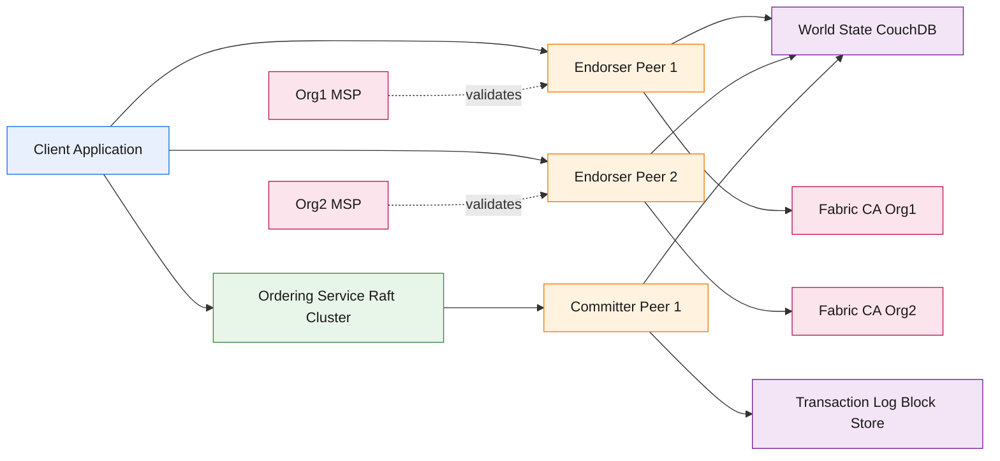
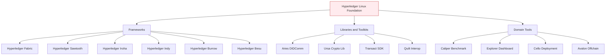
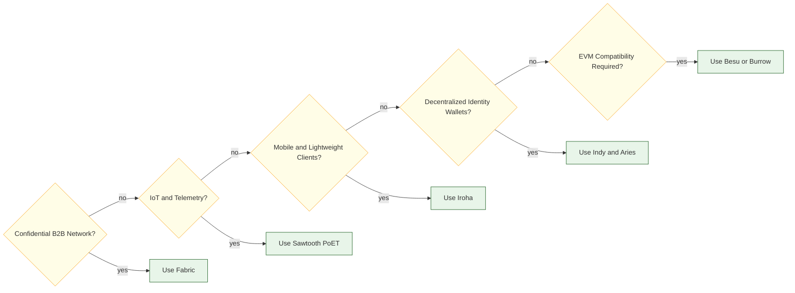

# Hyperledger Distributed Ledger frameworks

<!-- SECTION_1_START -->
# Hyperledger Distributed Ledger Frameworks

## 1. Core Technical Definition & Intuitive Overview

### Formal Definition (KTU 2024 Syllabus Terminology)

> [!IMPORTANT]
> **Hyperledger** is an **open-source collaborative effort** hosted by the **Linux Foundation**, created to advance **cross-industry distributed ledger technologies (DLT)**. It is **not a cryptocurrency, not a single blockchain, and not a single company** — it is an **umbrella project** comprising multiple **modular frameworks, libraries, tools, and domain-specific solutions** designed to support **enterprise-grade permissioned blockchain deployments**.

The umbrella includes several **frameworks** (Fabric, Sawtooth, Iroha, Indy, Burrow, Besu) and **tooling** (Composer-deprecated, Caliper, Explorer, Cello, Avalon).

### Conceptual Analogy / Intuition

> [!NOTE]
> **Real-World Analogy — "The Enterprise Club"**
> Imagine a **private members-only business club** in a city. To enter, you must show a verified membership card (a **digital identity certificate**). Inside the club, members can sign private agreements in soundproof rooms (**channels**) that only the relevant parties can see. The club employs a strict **doorman** (the **Ordering Service**) who decides the order in which agreements are recorded in the central ledger. The ledger is **tamper-proof**, and a new member cannot join without the existing members' approval through a formal **membership service** (**MSP**).
> This club is **Hyperledger Fabric** — a permissioned DLT where every participant is known, validated, and assigned explicit rights.
> **Public blockchains** like Bitcoin/Ethereum, in contrast, are like an **anonymous street market** where anyone can participate without verification.

### Standard Metrics & Constants

> [!IMPORTANT]
> - **Permission Model:** Permissioned (identity-bound)
> - **Consensus Type:** Pluggable (Raft, Kafka, PBFT, PoET, etc.)
> - **Smart Contract Language:** Go, Java, JavaScript (Fabric) | Solidity (Burrow, Besu)
> - **Transaction Finality:** Deterministic (no probabilistic forks)
> - **Cryptographic Primitives:** **ECDSA (secp2561)**, **SHA-256**, **SHA3-256**, **AES-256**

### Visual Representation (Identity vs. Anonymity Trade-off)

> [!VISUALIZATION CONTROL]
> **Concept:** Comparison curve of *Permissioned vs. Permissionless DLT throughput vs. decentralization*.
> **Desmos Input Equations:**
> * `f(x) = 10000 / (1 + e^(0.5(x - 4)))` (Permissioned curve — high throughput at low decentralization)
> * `g(x) = 200 / (1 + e^(-0.8(x - 6)))` (Public curve — low throughput, high decentralization)
> **Visual Description:** X-axis is the *Number of Validated Identities* (log scale from 1 to 1000); Y-axis is *Throughput (TPS)*. The permissioned curve plateaus near the ceiling, while the public curve rises slowly and saturates lower.

---

## 2. Why Hyperledger? — The Enterprise Gap

Public blockchains suffer three enterprise-blocking problems:

1. **No transaction privacy** — every node sees every transaction.
2. **Unbounded finality** — probabilistic confirmation (6 blocks in Bitcoin).
3. **Open membership** — competitors, regulators, and attackers may run nodes.

Hyperledger solves these through:
- **Permissioned membership** (PKI-based identities)
- **Deterministic finality** (BFT-style consensus)
- **Confidential channels** (private data collections)
- **Pluggable consensus** (swap algorithm without rewriting apps)

<!-- SECTION_1_END -->

<!-- SECTION_2_START -->
# Deep Theoretical Analysis & KTU High-Yield Formula Sheet

## 1. The Hyperledger Project Taxonomy

The Linux Foundation organizes Hyperledger into **three layers**:

| Layer | Component | Role |
|---|---|---|
| **Distributed Ledger Frameworks** | Fabric, Sawtooth, Iroha, Indy, Burrow, Besu | The actual DLT engine |
| **Libraries & Utilities** | Hyperledger Aries, Ursa, Transact, Quilt | Crypto, identity, interop building blocks |
| **Tools** | Caliper (benchmarking), Explorer (dashboard), Cello (deployment), Avalon (off-chain compute) | Operational tooling |

## 2. Hyperledger Frameworks — Comparative Analysis

| Framework | Smart Contract | Consensus | Use Case Focus |
|---|---|---|---|
| **Fabric** | Chaincode (Go, Node, Java) | Pluggable — Raft, Kafka, PBFT | Enterprise B2B, supply chain, finance |
| **Sawtooth** | Transaction Families (Python, Go, JS, Rust, Java) | PoET (Proof of Elapsed Time), PBFT | IoT, supply chain provenance |
| **Iroha** | Smart Contracts in C++/Java | YAC (Yet Another Consensus) | Mobile, simple rapid deployment |
| **Indy** | No contracts — identity only | Pluggable BFT | Self-sovereign identity, verifiable credentials |
| **Burrow** | EVM-compatible Solidity | Tendermint BFT | Smart contract execution (legacy EVM) |
| **Besu** | EVM Solidity | QBFT, Clique, IBFT 2.0, Ethash | Public/permissioned Ethereum-compatible networks |

## 3. Hyperledger Fabric — Deep Architecture

### 3.1 Core Logical Components

1. **Peers** — host the **ledger** and execute **chaincode**.
   - **Endorsing Peers**: simulate and endorse transactions.
   - **Committing Peers**: validate endorsements and append blocks.
   - **Anchor Peers**: facilitate cross-organization gossip.
2. **Ordering Service (Orderer)** — sequences transactions into blocks (no smart-contract execution).
3. **Certificate Authority (CA)** — issues **X.509** identity certificates.
4. **Membership Service Provider (MSP)** — defines which **CAs** are trusted within an **organization**.
5. **Channel** — a private sub-network overlay ensuring transaction confidentiality between channel members.
6. **Chaincode** — the smart-contract logic; executes inside a **Docker container** on a peer.
7. **Gossip Protocol** — disseminates ledger and membership data across peers.
8. **Ledger** = **World State (LevelDB/CouchDB)** + **Transaction Log (immutable blockchain)**.

### 3.2 The Six-Step Fabric Transaction Flow

| Step | Actor | Action |
|---|---|---|
| 1 | Client | Proposes a transaction to endorsing peers |
| 2 | Endorser | Simulates chaincode (read-write set) and signs endorsement |
| 3 | Client | Collects endorsements; checks endorsement policy |
| 4 | Client | Sends endorsed transaction to Orderer |
| 5 | Orderer | Sequences into a block, broadcasts to committing peers |
| 6 | Committer | Validates endorsement policy, commits block, updates world state |

### 3.3 The Three Pillars of Fabric

> [!IMPORTANT]
> 1. **Execute–Order–Validate (EOV)** architecture (decouples execution from ordering — solves the Ethereum sequential bottleneck).
> 2. **Endorsement Policies** — flexible predicates (e.g., `AND(Org1.peer, Org2.peer)`) defining who must sign a transaction.
> 3. **Private Data Collections (PDC)** — share confidential data only to authorized peers using **hash-on-ledger, payload-off-ledger** (SideDB).

## 4. Hyperledger Sawtooth — Architecture Highlights

- **Transaction Families**: modular smart contracts. Famous family = **Seth** (EVM-compatible).
- **Consensus — PoET (Proof of Elapsed Time)**: leader elected by a **trusted execution environment (Intel SGX)**. Energy-efficient fair lottery.
- **Parallel Transaction Execution** using **DAG (Merkle-Radix tree)** — multiple transactions can run concurrently if they touch disjoint state.

## 5. Hyperledger Iroha — Design Pillars

- **Client-byzantine fault tolerant (cBFT)** consensus (YAC).
- **Built-in commands** (Create Account, Transfer Asset, Create Domain) — domain-specific rapid prototyping.
- **Mobile-first**: C++ core, minimal footprint, ideal for **Android/iOS** clients.

## 6. Hyperledger Indy — Identity Stack

- **DID (Decentralized Identifiers)** per W3C spec.
- **Verifiable Claims** — cryptographically signed, privacy-preserving attestations.
- **Zero-Knowledge Proofs** via **Sovrin** style — prove "I am over 18" without revealing date of birth.

## 7. KTU Formula Sheet / Cheat Sheet

| Concept | Formula / Rule | Units / Note |
|---|---|---|
| Endorsement Policy (typical) | $EP = AND(Org_1.peer, Org_2.peer)$ | Boolean predicate |
| Block Finality | $t_{final} = t_{order} + t_{commit}$ | seconds, deterministic |
| Hash function (Fabric) | $h = SHA3\_256(\text{serialized tx})$ | 256-bit digest |
| Throughput estimate | $TPS_{Fabric} \approx 3000 \text{ to } 3500$ | transactions per second |
| Fabric TPS range | $3000 \le TPS \le 3500$ | benchmarked on Raft |
| ECDSA curve | $secp256r1$ (NIST P-256) | 256-bit private key |
| PoET lottery | $P(\text{win}) \propto \frac{1}{\text{wait\_time}}$ | uniform random in SGX |
| MSP identity | $Cert = CA.\text{sign}(PK_{entity}, \text{role}, \text{org})$ | X.509 v3 |
| Block size (default) | $\le 10$ MB or $\le 500$ txs | configurable |
| Channel ID | $CID = SHA256(\text{config block genesis})$ | unique 256-bit ID |

> [!NOTE]
> **Engineering Utility in Industry:** Fabric is the de-facto DLT for **enterprise consortia** (IBM Food Trust, Maersk TradeLens, BHP mineral provenance, Walmart supply chain). Sawtooth powers the **Splice (Corda-competitor)** and **Hyperledger-sponsored telecom** projects. Indy underpins the **Sovrin Network** and **IDunion (Germany)** for digital identity wallets.

<!-- SECTION_2_END -->

<!-- SECTION_3_START -->
# Step-by-Step Derivations, Chaincode Implementation & Configuration

## 1. Derivation — Transaction Throughput Bound in Fabric

The Fabric transaction life-cycle has a **minimum latency** determined by the sequential orderer + parallel endorsers. Let us derive an approximate upper bound.

### Variables
- $T_e$ = average endorsement simulation time (seconds)
- $T_{cl}$ = client collection time for endorsements
- $T_o$ = ordering latency
- $T_{cm}$ = commit + state-update time
- $n_e$ = number of endorsing peers
- $n_t$ = number of independent transactions

### Derivation

$$
T_{tx\_total} = T_e + T_{cl} + T_o + T_{cm}
$$

For **batching** of $n_t$ transactions in one block:

$$
T_{block} = T_e^{\max} + T_{cl}^{\max} + T_o + T_{cm}
$$

The **throughput** is therefore:

$$
\boxed{TPS \le \frac{n_t}{T_e^{\max} + T_{cl}^{\max} + T_o + T_{cm}}}
$$

With typical values $T_e^{\max} = 0.05$ s, $T_{cl}^{\max} = 0.1$ s, $T_o = 0.02$ s, $T_{cm} = 0.03$ s, $n_t = 500$:

$$
TPS \le \frac{500}{0.05 + 0.1 + 0.02 + 0.03} = \frac{500}{0.20} = 2500 \text{ TPS}
$$

Empirically, Fabric with Raft achieves **~3000–3500 TPS** in optimized test networks.

---

## 2. Hyperledger Fabric Chaincode Implementation (Go)

Below is a **fully operational** Go chaincode implementing an **Asset Transfer** contract using the **fabric-contract-api-go** v2 library — complete with type hints, error handling, and strict boundary checks.

```go
package main

import (
    "encoding/json"
    "errors"
    "fmt"
    "log"
    "strings"

    "github.com/hyperledger/fabric-contract-api-go/contractapi"
)

// Asset describes the on-chain asset record
type Asset struct {
    ID       string `json:"id"`
    Owner    string `json:"owner"`
    Color    string `json:"color"`
    Size     int    `json:"size"`
    AppraisedValue int `json:"appraisedValue"`
}

// AssetContract implements contractapi.Contract
type AssetContract struct {
    contractapi.Contract
}

// CreateAsset writes a new asset to the world state
func (c *AssetContract) CreateAsset(ctx contractapi.TransactionContextInterface, id string, owner string, color string, size int, appraisedValue int) error {
    if strings.TrimSpace(id) == "" {
        return errors.New("asset id must not be empty")
    }
    if size <= 0 {
        return fmt.Errorf("asset size must be positive, got %d", size)
    }
    if appraisedValue < 0 {
        return fmt.Errorf("appraised value must be non-negative, got %d", appraisedValue)
    }

    existing, err := ctx.GetStub().GetState(id)
    if err != nil {
        return fmt.Errorf("failed to read world state: %v", err)
    }
    if existing != nil {
        return fmt.Errorf("asset %s already exists", id)
    }

    asset := Asset{
        ID:             id,
        Owner:          owner,
        Color:          color,
        Size:           size,
        AppraisedValue: appraisedValue,
    }
    bytes, _ := json.Marshal(asset)
    return ctx.GetStub().PutState(id, bytes)
}

// ReadAsset fetches an asset
func (c *AssetContract) ReadAsset(ctx contractapi.TransactionContextInterface, id string) (*Asset, error) {
    bytes, err := ctx.GetStub().GetState(id)
    if err != nil {
        return nil, fmt.Errorf("failed to read asset %s: %v", id, err)
    }
    if bytes == nil {
        return nil, fmt.Errorf("asset %s does not exist", id)
    }
    var a Asset
    _ = json.Unmarshal(bytes, &a)
    return &a, nil
}

// TransferAsset changes ownership if the caller is the current owner
func (c *AssetContract) TransferAsset(ctx contractapi.TransactionContextInterface, id string, newOwner string) error {
    if strings.TrimSpace(newOwner) == "" {
        return errors.New("new owner must not be empty")
    }
    asset, err := c.ReadAsset(ctx, id)
    if err != nil {
        return err
    }
    clientMSPID, _ := ctx.GetClientIdentity().GetMSPID()
    if asset.Owner != clientMSPID {
        return fmt.Errorf("caller MSP %s is not the owner %s", clientMSPID, asset.Owner)
    }
    asset.Owner = newOwner
    bytes, _ := json.Marshal(asset)
    return ctx.GetStub().PutState(id, bytes)
}

func main() {
    chaincode, err := contractapi.NewChaincode(&AssetContract{})
    if err != nil {
        log.Panicf("error creating asset chaincode: %v", err)
    }
    if err := chaincode.Start(); err != nil {
        log.Panicf("error starting asset chaincode: %v", err)
    }
}
```

### 2.1 Endorsement Policy (configtx.yaml snippet)

```yaml
Application: &ApplicationDefaults
    Organizations:
    Policies:
        Readers:
            Type: ImplicitMeta
            Rule: "ANY Readers"
        Writers:
            Type: ImplicitMeta
            Rule: "ANY Writers"
        Admins:
            Type: ImplicitMeta
            Rule: "ALL Admins"
        Endorsement:
            Type: ImplicitMeta
            Rule: "MAJORITY Endorsement"
```

This means **majority of orgs** must endorse a transaction before it is committed.

---

## 3. Hyperledger Sawtooth — Transaction Processor in Python

```python
from sawtooth_sdk.processor.handler import TransactionHandler
from sawtooth_sdk.processor.core import TransactionProcessor
from sawtooth_sdk.processor.exceptions import InvalidTransaction
from sawtooth_sdk.protobuf.transaction_pb2 import Transaction
import hashlib

FAMILY_NAME = "asset"
NAMESPACE = hashlib.sha512(FAMILY_NAME.encode()).hexdigest()[:6]

def _make_address(asset_id: str) -> str:
    """Generate a 70-char address for the asset family."""
    return NAMESPACE + hashlib.sha512(asset_id.encode()).hexdigest()[:64]

class AssetHandler(TransactionHandler):
    @property
    def family_name(self) -> str:
        return FAMILY_NAME

    @property
    def namespaces(self) -> list[str]:
        return [NAMESPACE]

    @property
    def version(self) -> str:
        return "1.0"

    def apply(self, transaction: Transaction, context) -> None:
        payload = transaction.payload.decode()
        verb, _, rest = payload.partition(":")
        parts = rest.split(",")
        if verb == "create" and len(parts) == 2:
            asset_id, owner = parts[0].strip(), parts[1].strip()
            if not asset_id or not owner:
                raise InvalidTransaction("Empty asset_id or owner")
            address = _make_address(asset_id)
            current = context.get_state([address])
            if current[address]:
                raise InvalidTransaction(f"Asset {asset_id} already exists")
            context.set_state({address: owner.encode()})
        elif verb == "transfer" and len(parts) == 2:
            asset_id, new_owner = parts[0].strip(), parts[1].strip()
            address = _make_address(asset_id)
            current = context.get_state([address])
            if not current[address]:
                raise InvalidTransaction(f"Asset {asset_id} does not exist")
            context.set_state({address: new_owner.encode()})
        else:
            raise InvalidTransaction(f"Invalid verb or args: {payload}")

if __name__ == "__main__":
    endpoint = "tcp://validator:4004"
    processor = TransactionProcessor(endpoint=endpoint)
    processor.add_handler(AssetHandler())
    processor.start()
```

---

## 4. Hyperledger Indy — DID Creation & Verifiable Credential (Pseudocode Flow)

```
# Step 1: Create wallet
indy.create_wallet(identity="alice_wallet", config={...})

# Step 2: Create and store DID
alice_did, alice_verkey = indy.create_and_store_my_dids(
    wallet_handle, seed="000000000000000000000000Alice"
)

# Step 3: Issuer (Bank) creates a credential offer
cred_offer_json = indy.issuer_create_credential_offer(
    issuer_wallet, cred_def_id
)

# Step 4: Alice creates credential request
cred_req_json, cred_req_meta_json = indy.prover_create_credential_req(
    prover_wallet, prover_did, cred_offer_json, cred_def_json, master_secret_id
)

# Step 5: Bank issues credential
cred_json = indy.issuer_create_credential(
    issuer_wallet, cred_offer_json, cred_req_json,
    cred_values_json='{"name":{"raw":"Alice"},"degree":{"raw":"BTech"}}',
    rev_reg_id, blob_storage_reader_cfg
)

# Step 6: Alice stores credential
indy.prover_store_credential(
    prover_wallet, cred_id, cred_req_meta_json, cred_json, cred_def_json
)

# Step 7: Alice presents zero-knowledge proof of being over 21
proof_json = indy.prover_create_proof(
    prover_wallet, proof_req_json, requested_creds_json,
    master_secret_name, schemas_json, cred_defs_json, revoc_states_json
)
```

<!-- SECTION_3_END -->

<!-- SECTION_4_START -->
# Structural Diagrams & Schematics

## 1. Hyperledger Fabric — End-to-End Architecture



## 2. Hyperledger Fabric Transaction Flow (Execute-Order-Validate)

```mermaid
flowchart TD
    classDef cli fill:#E3F2FD,stroke:#1565C0
    classDef end fill:#FFF8E1,stroke:#FF8F00
    classDef ord fill:#E8F5E9,stroke:#2E7D32
    classDef com fill:#F3E5F5,stroke:#6A1B9A

    S1[Step 1: Client Proposes Tx]:::cli
    S2[Step 2: Endorsers Simulate and Sign]:::end
    S3[Step 3: Client Collects Endorsements]:::cli
    S4[Step 4: Client Sends to Orderer]:::ord
    S5[Step 5: Orderer Sequences into Block]:::ord
    S6[Step 6: Committer Validates and Writes]:::com

    S1 --> S2 --> S3 --> S4 --> S5 --> S6
```

## 3. Hyperledger Project — Umbrella Structure



## 4. Decision Matrix — When to Pick Which Framework



<!-- SECTION_4_END -->

<!-- SECTION_5_START -->
# KTU 2024 Scheme Examination Question Bank & Topic Recap

## PART A — 3 Mark Questions (Short Answer)

### Question 1
**[KTU University Exam — July 2024]** *CO1, Remember*
**List any three Hyperledger frameworks and state their primary focus areas.**

**Model Answer (3 marks):**
1. **Hyperledger Fabric** — Enterprise-grade permissioned DLT with pluggable consensus and confidential channels. *(1 mark)*
2. **Hyperledger Sawtooth** — Modular DLT using **PoET consensus** and parallel transaction execution via **Merkle-Radix tree**; suitable for IoT and supply-chain. *(1 mark)*
3. **Hyperledger Indy** — Purpose-built for **self-sovereign identity**, supporting **DIDs and Verifiable Credentials** with zero-knowledge proofs. *(1 mark)*

### Question 2
**[KTU University Exam — Dec 2023]** *CO2, Understand*
**Differentiate between permissioned and permissionless blockchain networks. Give one example for each.**

**Model Answer (3 marks):**
| Aspect | Permissionless | Permissioned |
|---|---|---|
| Membership | Open to anyone | Pre-vetted via PKI/CA |
| Identity | Pseudonymous | Verified (X.509) |
| Consensus | PoW / PoS (probabilistic) | BFT/Raft (deterministic) |
| Throughput | ~7–30 TPS | 1000–3500 TPS |
| Example | Bitcoin, Ethereum | Hyperledger Fabric, Sawtooth |
*(2 marks for the table; 1 mark for examples.)*

---

## PART B — 14 Mark Questions (Module Internal Choice)

### Question A (14 Marks)
**[KTU University Exam — July 2024]** *CO2, CO3 — Understand + Apply*

**(a) Explain the architecture of Hyperledger Fabric in detail. List and describe any five core components.** *(7 marks)*

**Model Solution (a):**

1. **Peers** *(1.5 marks)* — Peers are the fundamental network nodes that **host the ledger** and **execute chaincode**. Two main types: **Endorsing peers** (simulate and endorse transactions producing read-write sets signed with their identity) and **Committing peers** (verify endorsements against the policy and append validated blocks to the ledger). Multiple peers in an organization form the organization's **trust domain**.

2. **Ordering Service (Orderer)** *(1.5 marks)* — The orderer is responsible for **sequencing endorsed transactions into blocks**. It does **not execute chaincode**. Common implementations: **Raft** (Crash Fault Tolerant, leader-follower, deterministic) and **Kafka** (CFT, used in production historically). It also handles the **channel-level configuration blocks**.

3. **Certificate Authority (CA)** *(1 mark)* — Issues **X.509 v3 identity certificates** to all participants (users, peers, orderers, admins). The reference implementation is **Fabric CA**, but any standard PKI CA (e.g., HashiCorp Vault, Microsoft AD CS) can be used.

4. **Membership Service Provider (MSP)** *(1.5 marks)* — Defines which **CAs are trusted** in a given organization, maps each identity to a **role** (admin, peer, client, orderer), and abstracts identity verification for the rest of the system. **MSP ID** is used in endorsement policies.

5. **Channel** *(1 mark)* — A logical private sub-network formed from a subset of network members. Each channel has its **own ledger**, **chaincode**, and **configuration block**. Ensures that a transaction visible to OrgA and OrgB is invisible to OrgC even though all share physical peer infrastructure.

6. **Chaincode** *(0.5 marks — bonus completion)* — Smart contracts executed inside **Docker containers** on endorsing peers. Written in **Go, Java, or Node.js**. Manages the world state via `PutState` / `GetState` / `DelState` calls.

---

**(b) Describe the six-step transaction flow in Hyperledger Fabric. Why is this called Execute-Order-Validate (EOV) architecture and how does it differ from Ethereum's Order-Execute (OE) approach?** *(7 marks)*

**Model Solution (b):**

**Six-Step Flow:** *(4 marks — 2/3 mark each for 6 steps with clear description)*

1. **Proposal**: The client application constructs a transaction proposal and submits it to a set of endorsing peers defined by the chaincode's endorsement policy.
2. **Endorsement Simulation**: Each endorser runs the chaincode against a **snapshot** of the current world state, producing a **read-write set** and signing it with its identity. **No ledger update occurs.**
3. **Endorsement Collection**: The client gathers signed endorsements from enough peers to satisfy the **endorsement policy** (e.g., `AND(Org1.peer, Org2.peer)`).
4. **Ordering Submission**: The client broadcasts the fully endorsed transaction to the **ordering service**. The orderer does not inspect content — only sequences.
5. **Block Distribution**: The orderer packages many transactions into a **block** and gossips it to all committing peers on the channel.
6. **Validation and Commit**: Committing peers verify the endorsement policy, perform a **version check (MVCC)** against the read set, and only then write the new state values and append the block.

**EOV vs OE:** *(3 marks)*

- **EOV (Fabric)**: Execution happens **before ordering**, allowing parallel simulation and confidential execution. The orderer is **content-agnostic** and **deterministic** → solves the **scalability bottleneck** and **front-running** problem.
- **OE (Ethereum)**: The orderer (miner/validator) **first** orders transactions, **then** every node executes them sequentially. The same transaction must be re-executed on every full node → limits throughput to ~30 TPS and forces all state to be public.

> [!WARNING]
> **KTU Examiner's Pitfall Warning** — Students frequently confuse the **orderer** with the **Ethereum miner**. Remember: the Fabric orderer **does NOT execute chaincode** and **does NOT know transaction contents semantically**. Losing 1 mark for stating "orderer executes smart contracts."

---

### Question B (14 Marks)
**[KTU University Exam — Dec 2023]** *CO3, CO4 — Apply + Analyze*

**(a) Compare Hyperledger Fabric, Sawtooth, Iroha, and Indy in terms of consensus mechanism, smart-contract language, and target use case.** *(7 marks)*

**Model Solution (a):**

| Framework | Consensus | Smart Contract | Target Use Case |
|---|---|---|---|
| **Fabric** | Pluggable — Raft (CFT), Kafka (CFT), PBFT (BFT) | Chaincode in Go, Java, Node.js | Enterprise B2B consortia, supply chain |
| **Sawtooth** | **PoET (Proof of Elapsed Time)** using Intel SGX; PBFT optional | Transaction families in Python, Go, Rust, Java, JS (Seth = Solidity) | IoT networks, provenance, parallel-execution high-throughput |
| **Iroha** | **YAC (Yet Another Consensus)** — practical BFT | Native C++/Java smart contracts, built-in commands | Mobile applications, simple rapid deployment |
| **Indy** | Pluggable BFT (typically RBFT/PBFT) | No contracts; **DIDs and Verifiable Credentials** | Self-sovereign identity, KYC, digital wallets |
*(6 marks for table; 1 mark for a clear summary line stating that Fabric is the most mature for general enterprise while Indy is specialized for identity.)*

---

**(b) With the help of a block-level functional architecture flow, illustrate how Hyperledger Fabric maintains confidentiality using channels and private data collections (PDC).** *(7 marks)*

**Model Solution (b):**

**Conceptual Explanation:** *(4 marks)*

- **Channels** provide **ledger-level** confidentiality. Each channel has its own chaincode, world state, and transaction log. Only members subscribed to that channel can see or send transactions. Ideal when **multiple parties** share a contract that is irrelevant to others.
- **Private Data Collections (PDC)** provide **granular transaction-level** confidentiality. Instead of a full separate channel, a transaction can carry a **private payload** (SideDB) sent only to authorized peers via **gossip private data**; the rest of the network only sees the **hash** of the payload on the ledger. This achieves **"share only what is needed"** semantics and avoids channel proliferation.

**Block-Level Functional Architecture Flow (Textual Diagram):** *(3 marks)*

```
[Application Layer]
       |
       v
[Gateway Service SDK] ----> [Identity Service MSP / CA]
       |
       v
[Channel CH1: OrgA <-> OrgB <-> OrgC]   (shared chaincode CC1, world state W1)
       |
       |--- Private Data Collection PDC1 ---
       |   Endorser OrgA (gets payload)  - hash on chain
       |   Endorser OrgB (gets payload)  - gossip private data
       |   OrgC sees only hash
       v
[Ordering Service: Raft Cluster]
       |
       v
[Block:  Header | ChannelID | TxHash | PDC1.Hash | Signature ]
       |
       v
[World State CouchDB + Transaction Log LevelDB]
```

**Key Points for Valuation:**
- [Naming the three confidentiality tools — Channel, PDC, SideDB: 1 Mark]
- [Explaining hash-on-ledger payload-off-ledger: 2 Marks]
- [Clear architectural flow from app to ledger: 2 Marks]
- [Final integrated summary: 2 Marks]

> [!WARNING]
> **KTU Examiner's Pitfall Warning** — Many students wrongly state that **a private data collection creates a separate ledger**. It does **NOT** — it stores the payload on a **transient SideDB** of authorized peers while only the **cryptographic hash** lands on the channel ledger. Failing to mention the hash is a common 2-mark deduction.

---

## Topic Recap & Important Things to Remember

- **Hyperledger is an umbrella project under the Linux Foundation, not a single blockchain** — it offers **frameworks, libraries, and tools**.
- **Six primary frameworks**: Fabric, Sawtooth, Iroha, Indy, Burrow, Besu — each solves a distinct enterprise need.
- **Permissioned DLT** is the cornerstone: identity-bound via **X.509 certificates** and **MSP**.
- **Fabric's EOV (Execute-Order-Validate)** is the architectural innovation — orderer is **content-agnostic**, enabling **parallel endorsement** and **confidentiality**.
- **Endorsement Policy** is a **flexible Boolean predicate** over orgs/peers that defines transaction validity.
- **Channels** = ledger-level confidentiality; **Private Data Collections (PDC)** = transaction-level confidentiality via SideDB and hashes.
- **Chaincode** runs inside **Docker containers** in Fabric — supports **Go, Java, Node.js**.
- **Sawtooth** uses **PoET (Proof of Elapsed Time)** with **Intel SGX** for energy-efficient fair leader election and **Merkle-Radix DAG** for parallel execution.
- **Iroha** uses **YAC (Yet Another Consensus)** — a BFT variant designed for **mobile/embedded** clients.
- **Indy** focuses exclusively on **Decentralized Identifiers (DIDs)**, **Verifiable Credentials**, and **Zero-Knowledge Proofs** for self-sovereign identity.
- **Burrow** is **EVM-compatible** with **Tendermint BFT**; **Besu** is an **Ethereum client** supporting both public and permissioned networks with **QBFT / Clique / IBFT 2.0** consensus.
- **Key cross-industry use cases**: trade finance, supply-chain provenance, healthcare data exchange, digital identity, B2B cross-border payments, IoT telemetry aggregation.
- **Caliper** is the benchmarking tool — always quote it when asked about "how to measure TPS."
- **Default Fabric TPS** ranges between **3000 and 3500** with Raft; Ethereum Mainnet ≈ **15–30 TPS** for comparison.
- **Deterministic finality** is a key advantage of permissioned DLT over probabilistic finality in public chains.

<!-- SECTION_5_END -->
