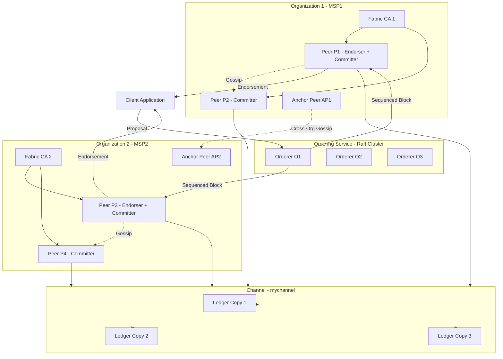
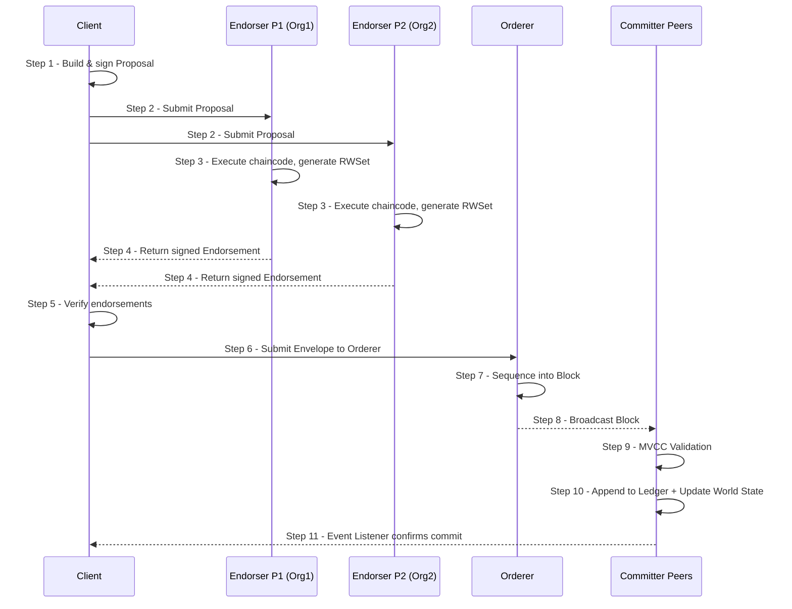
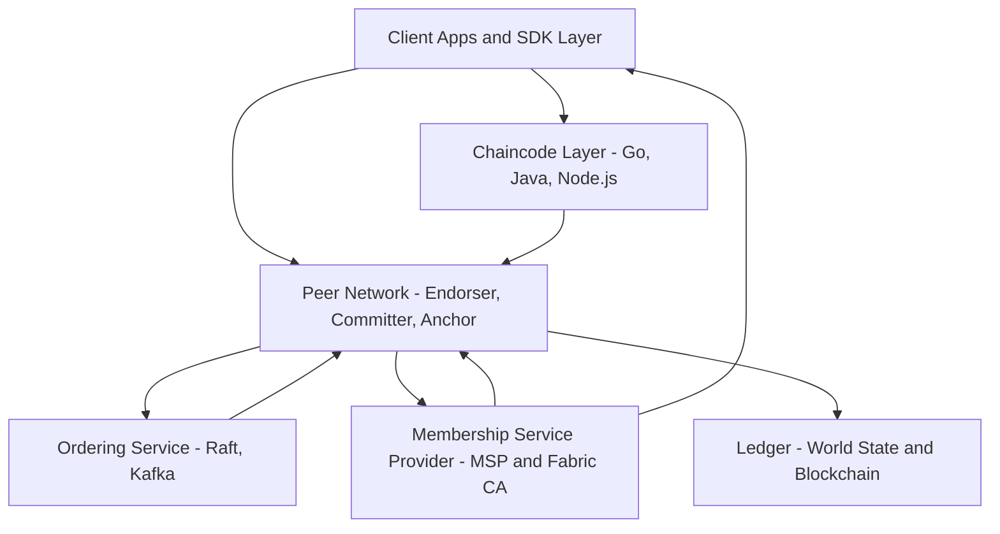
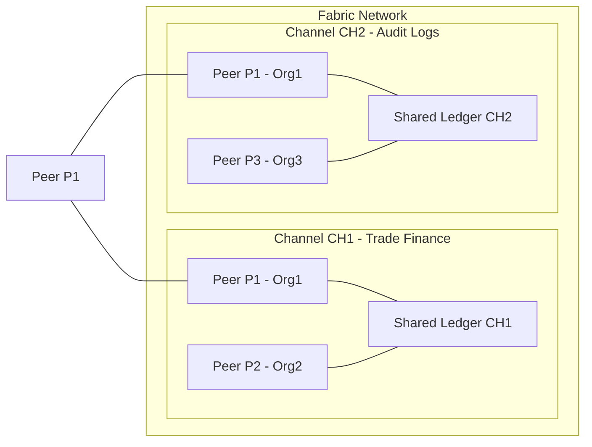

# Hyperledger Fabric

<!-- SECTION_1_START -->

# Hyperledger Fabric — KTU Premier Study Notes

## 1. Core Technical Definition & Intuitive Overview

### 1.1 Formal Definition

**Hyperledger Fabric** is an *enterprise-grade, permissioned Distributed Ledger Technology (DLT) framework* hosted under the **Linux Foundation's Hyperledger Project**. It is engineered to deliver a modular, pluggable architecture supporting confidential transactions, fine-grained access control, and deterministic execution of distributed application logic (called **chaincode** or smart contracts) across a network of identified, vetted participants.

Unlike public, anonymous chains such as **Bitcoin** or **Ethereum Mainnet**, Fabric operates as a **Permissioned Ledger** — every participant must possess a verifiable **X.509 digital identity** issued by a trusted **Membership Service Provider (MSP)**. There is **no native cryptocurrency, no mining, and no Proof-of-Work (PoW)**.

> [!IMPORTANT]
> **KTU Syllabus Highlight (PECST747 — Module 4):**
> Hyperledger Fabric is the *industry reference architecture* for *consortium blockchains* and forms the backbone of the *B.Tech Blockchain & Cryptocurrencies* enterprise track. Mastery of its **Execute-Order-Validate (EOV)** transaction model, **MSP identity layer**, and **chaincode lifecycle** is mandatory for 14-mark questions.

### 1.2 Conceptual Analogy — Plain English Intuition

Imagine a **private, members-only business club** where:

| Public Blockchain (Bitcoin / Ethereum) | Hyperledger Fabric (Permissioned Consortium) |
|---|---|
| Anyone in the world can join the club (anonymous). | Only verified employees/members with a **membership card (X.509 cert)** can enter. |
| Every transaction is broadcast publicly. | Transactions happen inside **private rooms called "channels"**. |
| Miners race to confirm transactions (energy hungry). | A designated **"Orderer"** (like a club secretary) sequences the receipts. |
| No one is trusted; trust comes from math. | Members are **known** — trust comes from **identity + policy**. |
| Solidity smart contracts. | **Chaincode** in Go, Java, or Node.js. |
| Pays gas in Ether. | **No cryptocurrency** — runs on traditional infrastructure. |

> [!NOTE]
> **Intuitive One-Liner:**
> *If Ethereum is a public town square, Hyperledger Fabric is a private corporate boardroom — every speaker is identified, every meeting is recorded, and the minutes are cryptographically signed.*

### 1.3 The Five Defining Properties of Fabric

1. **Permissioned Membership** — All identities known through **MSP**.
2. **Execute-Order-Validate Architecture** — Transactions are *executed* first (deterministically by endorsers), then *ordered* (by the orderer), then *validated* (by committing peers). This is the architectural opposite of Ethereum's *Order-Execute* model.
3. **Pluggable Consensus** — The consensus module is swappable: **Raft, Kafka, PBFT** can be used depending on the trust model.
4. **Confidential Transactions via Channels** — Sub-networks of peers maintain *separate ledgers* for private bilateral communication.
5. **Smart Contracts in General-Purpose Languages** — Chaincode runs in **Docker containers**, supporting **Go, JavaScript (Node.js), and Java**.

> [!VISUALIZATION CONTROL]
> **Concept:** Permissioned vs. Permissionless Network Topology
> **GeoGebra / Desmos Input Equations (graph-theoretic model):**
> * `G_p = (V_p, E_p)` — permissionless graph: $V_p \to \infty$, edges unconstrained.
> * `G_c = (V_c, E_c)` — permissioned graph: $V_c$ finite, $\forall v \in V_c: v \in \text{MSP}$.
> **Visual Description:** A sparse closed polygon (consortium) versus a sprawling web (public internet) — Fabric's network boundary is **enforced by cryptographic identity**, not mathematical consensus alone.

---

<!-- SECTION_1_END -->

<!-- SECTION_2_START -->

## 2. Deep Theoretical Analysis & KTU High-Yield Formula Sheet

### 2.1 Architectural Layers of Hyperledger Fabric

Fabric's stack is decomposed into **five logical layers**, each of which can be independently swapped or extended:

| Layer | Responsibility | Key Components |
|---|---|---|
| **L1 — Membership Layer** | Identity & access | MSP, Fabric CA, X.509 Certs, OIDC |
| **L2 — Peer Layer** | Ledger storage & chaincode hosting | Endorser Peers, Committer Peers, Anchor Peers, Gossip |
| **L3 — Ordering Layer** | Transaction sequencing & block formation | Orderer Nodes, Raft / Kafka Cluster, Channels |
| **L4 — Chaincode Layer** | Business logic execution | Go / Java / Node.js contracts, Docker, State DB |
| **L5 — API/SDK Layer** | Client interaction | Fabric SDK (Node.js, Java, Go, Python), CLI |

### 2.2 Core Components — Detailed Breakdown

#### 2.2.1 Membership Service Provider (MSP)
- Issues **X.509 digital certificates** to every member (organizations, peers, orderers, client apps).
- Defines **organizational units (OUs)** for role-based access (admin, peer, client, orderer).
- An organization (Org) is identified by its **MSP ID**.
- A **Fabric CA (Certificate Authority)** automates enrollment, registration, and revocation (via Certificate Revocation Lists — **CRLs**).

#### 2.2.2 Peers (Three Logical Roles per Peer)
A single physical peer may assume multiple roles:

- **Endorsing Peer** — Executes proposed chaincode and returns an *endorsement* (read-write set + signature).
- **Committing Peer** — Validates endorsements against the *endorsement policy* and appends the block to its local ledger.
- **Anchor Peer** — Cross-organization communication hub for **Gossip protocol** data dissemination.

#### 2.2.3 Orderer Nodes
- Collect endorsed transactions from clients.
- Package them into **blocks** according to the chosen **batch timeout** and **max message count**.
- Broadcast blocks to committing peers across all channels.

> [!NOTE]
> **Batch Formation Rule (Raft):**
> A new block is cut when **either** $\Delta t \geq T_{batch}$ **or** $|M| \geq M_{max}$, whichever fires first. Default $T_{batch} = 2$ s, $M_{max} = 10$.

#### 2.2.4 Channels
- A **private overlay subnet** within the Fabric network.
- Each channel has its **own ledger**, its **own chaincode namespace**, and its **own membership set**.
- Peers can join *multiple channels* but the data is logically segregated.
- A channel is created by submitting a **channel configuration transaction** signed by a quorum of orgs' admin certs.

#### 2.2.5 Chaincode (Smart Contract)
- Compiled language: **Go** (most popular), **JavaScript (Node.js)**, **Java**.
- Packaged as a **Docker image** and instantiated on endorsing peers.
- Exposes two key functions:
  - `Init(stub)` — invoked on first deployment.
  - `Invoke(stub)` — invoked on every subsequent transaction.
- Accesses ledger state via the **stub API** (`stub.PutState`, `stub.GetState`, `stub.DelState`).

#### 2.2.6 Ledger — Two Coordinated Stores
| Component | Nature | Purpose |
|---|---|---|
| **World State** | Key-Value store (LevelDB / CouchDB) | Latest snapshot of all chaincode variables. |
| **Blockchain** | Append-only file (blocks + transactions) | Full ordered history of state transitions. |
| **State DB options** | LevelDB (default) or CouchDB (JSON queries via Mango) | Pluggable. |

#### 2.2.7 Gossip Protocol
- Peer-to-peer **state dissemination** and **membership broadcasting** protocol.
- Carries three message classes: *Alive messages, Ledger blocks, Private data*.
- Default 3-second heartbeat interval.

### 2.3 Transaction Flow — Execute-Order-Validate (EOV) Pipeline

The defining innovation of Fabric. Every transaction traverses **seven** discrete phases:

1. **Proposal** — Client SDK signs and submits a transaction *proposal* to a set of endorsing peers (selected by the **endorsement policy**).
2. **Execution** — Endorsing peers execute the chaincode against the current world state and produce a **read set** and **write set (RW set)**.
3. **Endorsement** — Each endorsing peer signs the RW set and returns it to the client.
4. **Ordering** — The client bundles endorsements and submits them to the **Orderer**.
5. **Block Formation** — The Orderer sequences endorsed transactions into a block (deterministic ordering — no state yet committed).
6. **Validation** — Committing peers re-execute the validation logic: check endorsements against policy, verify **read-set version** (MVCC check) has not changed.
7. **Commit** — If valid, the block is appended to the local blockchain and the world state is updated.

> [!IMPORTANT]
> **MVCC Conflict Check:**
> For each transaction $T$ in the block, every key $k$ in the read set must satisfy:
> $$\text{version}_k^{\text{read}}(T) = \text{version}_k^{\text{committed}}$$
> If mismatched, the transaction is marked **invalid** but the block is still committed (Fabric's *eventual consistency with deterministic finality* — invalid txns are simply skipped without rollback).

### 2.4 Endorsement Policies

Define the *quorum* of endorsing peers required to validate a transaction.

**Examples:**
- `AND('Org1.member', 'Org2.member')` — one signer from each of Org1 and Org2.
- `OR('Org1.member', 'Org3.member')` — any single signer.
- `OutOf(2, 'Org1.member', 'Org2.member', 'Org3.member')` — at least 2 of 3 orgs.

### 2.5 KTU Formula Sheet & Cheat Sheet

| Concept | Formula / Rule | Unit / Notes |
|---|---|---|
| **Block formation trigger** | $\text{cut} = \big(\Delta t \geq T_{batch}\big) \lor \big(\vert M \vert \geq M_{max}\big)$ | seconds / messages |
| **MVCC validity** | $\forall k \in \text{ReadSet}(T): V_k^{\text{read}} = V_k^{\text{commit}}$ | boolean |
| **Hash chain (block linkage)** | $H_i = \text{SHA256}(H_{i-1} \Vert \text{BlockData}_i)$ | hex 256-bit |
| **Endorsement quorum** | $\sum w_i \geq W_{th}$ for selected set $S$ | weighted boolean |
| **State DB latency** | LevelDB $\approx 1$ ms (key lookup), CouchDB $\approx 5$–$10$ ms (JSON) | milliseconds |
| **Channel ID derivation** | $\text{ChannelID} = \text{SHA256}(\text{GenesisBlock})$ | first 32 bytes hex |
| **Gossip fan-out** | $f = 3$ peers per hop (default) | dimension-less |
| **Orderer throughput** | Raft $\approx 3000$ tx/s; Kafka $\approx 10,000$ tx/s | transactions / second |
| **X.509 cert validity** | $T_{cert} \leq 825$ days (CA/Browser Forum baseline) | days |
| **Chaincode timeout** | $T_{exec} = 30$ s default (peer config) | seconds |

### 2.6 Engineering Utility

Hyperledger Fabric is the *de-facto* standard for:
- **Supply chain provenance** (IBM Food Trust — Walmart, Maersk TradeLens).
- **Cross-border payments & settlement** (central bank DLT pilots).
- **Healthcare record exchange** with HIPAA-grade privacy via **Private Data Collections (PDCs)**.
- **Trade finance** (we.trade, Marco Polo Network).
- **Digital identity** (Sovrin Foundation, IDunion).

> [!NOTE]
> **Production Insight:** Over **80% of Global 2000 enterprise blockchain pilots** as of 2024 are built on Hyperledger Fabric (per Linux Foundation surveys). Mastery of Fabric is a *resume-grade* skill for blockchain engineers.

---

<!-- SECTION_2_END -->

<!-- SECTION_3_START -->

## 3. Step-by-Step Derivations, Configuration, & Code Implementation

### 3.1 Cryptographic Identity Derivation (MSP Enrollment)

The membership chain that allows a peer to participate in a Fabric network.

**Step 1 — Certificate Authority (CA) initialization:**
The Fabric CA root signs a self-signed **root certificate**:
$$C_{\text{root}} = \text{Sign}_{\text{CA}_{\text{root}}}(\text{Pub}_{\text{root}}, \text{Expire}_{\text{root}})$$

**Step 2 — Enrollment Certificate (eCert) issuance for a peer:**
$$C_{\text{peer}} = \text{Sign}_{\text{CA}_{\text{org}}}(\text{Pub}_{\text{peer}}, \text{OU}_{\text{peer}}, \text{Expire}_{\text{peer}})$$

**Step 3 — Identity tuple exported to MSP:**
$$\text{ID}_{\text{peer}} = (C_{\text{peer}}, \text{Priv}_{\text{peer}}, \text{MSP}_{\text{ID}})$$

**Step 4 — Validation by a committer peer:**
$$\text{Verify}(C_{\text{peer}}, \text{CA}_{\text{root}}) \stackrel{?}{=} \text{true}$$

If true, the peer is admitted to the channel and may participate in **Gossip** and **endorsement** activities.

> **Explanation of each step:**
> *Step 1* establishes the cryptographic root of trust. *Step 2* binds a public key to an Organizational Unit (peer/client/admin/orderer). *Step 3* packages this into a portable identity bundle. *Step 4* allows any network participant to verify authenticity **without contacting the CA** — purely through the X.509 chain.

### 3.2 Block Hash Derivation (Step-by-Step)

Given two consecutive blocks $B_{i-1}$ and $B_i$:

$$\begin{aligned}
\text{Header}_i &= (\text{Num}_i, \text{PrevHash}_i, \text{DataHash}_i) \\
\text{DataHash}_i &= \text{SHA256}\big(\text{MerkleRoot}(\text{TxList}_i)\big) \\
\text{PrevHash}_i &= \text{SHA256}\big(\text{Header}_{i-1}\big) \\
\text{BlockHash}_i &= \text{SHA256}\big(\text{Header}_i\big)
\end{aligned}$$

> **Conversion Logic:**
> The **DataHash** is the Merkle root over all transactions in the block — any modification of a single transaction changes the root, which cascades into the next block's hash, breaking immutability.

### 3.3 End-to-End Transaction Flow — Worked Trace

Let a client `Alice@Org1` invoke a chaincode `transferFunds` to send **10 tokens** to `Bob@Org2`. The endorsement policy is `AND('Org1.peer', 'Org2.peer')`.

| Phase | Actor | Action | Data Generated |
|---|---|---|---|
| 1 | Client | Build & sign proposal | `Proposal{txID, args, nonce, Creator}` |
| 2 | Endorser P1 (Org1) | Execute chaincode | `RWSet_P1 = (ReadSet, WriteSet)` |
| 3 | Endorser P2 (Org2) | Execute chaincode | `RWSet_P2` |
| 4 | P1, P2 | Sign RW sets | `Endorsement_P1, Endorsement_P2` |
| 5 | Client | Verify both endorsements, bundle | `Envelope{proposal, RWSet_P1, RWSet_P2}` |
| 6 | Orderer | Sequence into block | `Block_N` |
| 7 | Committers | MVCC check on RW sets | `VALID` / `INVALID` flags |
| 8 | Committers | Append to ledger, update world state | `WorldState ← WorldState ⊕ WriteSet` |

### 3.4 Chaincode Implementation — Go (Sample Asset Transfer)

```go
package main

import (
    "encoding/json"
    "errors"
    "fmt"
    "github.com/hyperledger/fabric-chaincode-go/shim"
    "github.com/hyperledger/fabric-protos-go/peer"
)

// Asset represents a simple on-chain asset
type Asset struct {
    ID    string `json:"id"`
    Owner string `json:"owner"`
    Value int    `json:"value"`
}

// SmartContract is the chaincode entry point
type SmartContract struct{}

// Init is invoked on chaincode deployment (one-time)
func (s *SmartContract) Init(stub shim.ChaincodeStubInterface) peer.Response {
    return shim.Success(nil)
}

// Invoke routes incoming function calls
func (s *SmartContract) Invoke(stub shim.ChaincodeStubInterface) peer.Response {
    fn, args := stub.GetFunctionAndParameters()

    switch fn {
    case "createAsset":
        return s.createAsset(stub, args)
    case "transferAsset":
        return s.transferAsset(stub, args)
    case "readAsset":
        return s.readAsset(stub, args)
    default:
        return shim.Error("unknown function: " + fn)
    }
}

// createAsset writes a new asset into the world state
func (s *SmartContract) createAsset(stub shim.ChaincodeStubInterface, args []string) peer.Response {
    if len(args) != 3 {
        return shim.Error("expected 3 args: id, owner, value")
    }
    asset := Asset{ID: args[0], Owner: args[1], Value: 0}
    if _, err := fmt.Sscan(args[2], &asset.Value); err != nil {
        return shim.Error("invalid value argument")
    }
    raw, _ := json.Marshal(asset)
    if err := stub.PutState(asset.ID, raw); err != nil {
        return shim.Error(fmt.Sprintf("PutState failed: %v", err))
    }
    return shim.Success(raw)
}

// transferAsset changes ownership with strict existence + ownership checks
func (s *SmartContract) transferAsset(stub shim.ChaincodeStubInterface, args []string) peer.Response {
    if len(args) != 2 {
        return shim.Error("expected 2 args: id, newOwner")
    }
    id, newOwner := args[0], args[1]

    raw, err := stub.GetState(id)
    if err != nil {
        return shim.Error(fmt.Sprintf("GetState failed: %v", err))
    }
    if raw == nil {
        return shim.Error(errors.New("asset not found").Error())
    }

    var asset Asset
    if err := json.Unmarshal(raw, &asset); err != nil {
        return shim.Error(err.Error())
    }
    asset.Owner = newOwner

    updated, _ := json.Marshal(asset)
    if err := stub.PutState(id, updated); err != nil {
        return shim.Error(fmt.Sprintf("PutState failed: %v", err))
    }
    return shim.Success(updated)
}

// readAsset returns the current JSON representation of an asset
func (s *SmartContract) readAsset(stub shim.ChaincodeStubInterface, args []string) peer.Response {
    if len(args) != 1 {
        return shim.Error("expected 1 arg: id")
    }
    raw, err := stub.GetState(args[0])
    if err != nil {
        return shim.Error(err.Error())
    }
    if raw == nil {
        return shim.Error("asset not found")
    }
    return shim.Success(raw)
}

func main() {
    err := shim.Start(new(SmartContract))
    if err != nil {
        fmt.Printf("chaincode start error: %s\n", err)
    }
}
```

> **Code Walkthrough — Line-by-Line Logic:**
> *Line 1–10:* Package import and the `Asset` data structure that mirrors the on-chain JSON schema.
> *Line 13–15:* The `SmartContract` struct satisfies the `Chaincode` interface.
> *Line 18–22:* `Init` is mandatory per Fabric's chaincode interface; left empty since we don't seed data.
> *Line 25–35:* `Invoke` is the *router* — Fabric chaincode exposes a *single* entry point and dispatches to named functions.
> *Line 38–58:* `createAsset` validates argument count, marshals JSON, and writes to the world state via `PutState`.
> *Line 61–93:* `transferAsset` demonstrates the **read-modify-write** pattern, with explicit *existence* and *argument* error handling — critical for the **MVCC validation** step downstream.
> *Line 96–106:* `readAsset` performs a non-mutating `GetState` lookup.
> *Line 108–113:* `main` registers the chaincode with the Fabric peer via `shim.Start`.

### 3.5 Channel Configuration Transaction (CLI Trace)

The canonical sequence of CLI commands to bring up a Fabric test network (from the official `fabric-samples` repository):

```bash
# 1. Initialize the peer binaries and crypto material
./network.sh up createChannel -ca -s couchdb

# 2. Deploy the asset transfer chaincode (Go)
./network.sh deployCC -ccn basic -ccp ../asset-transfer-basic/chaincode-go \
    -ccl go -ccv 1.0 -cci InitRequired

# 3. Interact with the chaincode
peer chaincode invoke -o localhost:7050 \
    --ordererTLSHostnameOverride orderer.example.com \
    --tls --cafile $ORDERER_CA \
    -C mychannel -n basic \
    --peerAddresses localhost:7051 --tlsRootCertFiles $PEER0_ORG1_CA \
    --peerAddresses localhost:9051 --tlsRootCertFiles $PEER0_ORG2_CA \
    -c '{"function":"createAsset","Args":["asset1","Alice","100"]}'

# 4. Query the world state
peer chaincode query -C mychannel -n basic \
    -c '{"function":"readAsset","Args":["asset1"]}'
```

> **Step-by-Step Engineering Logic:**
> *Command 1* generates X.509 certificates for two organizations (Org1, Org2), creates the orderer, and launches a single channel `mychannel` with CouchDB as the state database.
> *Command 2* packages the Go chaincode, builds the Docker image, installs it on peers, and runs `Init` with `InitRequired` policy.
> *Command 3* submits an endorsed transaction: it routes to the **endorsement-policy-matched peers**, then forwards the signed envelope to the **orderer**, and finally commits on all committers.
> *Command 4* reads directly from the local world state — note that *queries* do **not** go through the orderer.

### 3.6 Consensus Module Comparison (Raft vs. Kafka)

| Property | Raft | Kafka |
|---|---|---|
| **CFT / BFT** | Crash Fault Tolerant (CFT) | Crash Fault Tolerant (CFT) |
| **Throughput** | $\sim 3000$ tx/s | $\sim 10{,}000$ tx/s |
| **Leader election** | Built-in (Raft algorithm) | External (Kafka coordinator) |
| **Setup complexity** | Low (single binary) | High (ZooKeeper + Kafka cluster) |
| **Future direction** | Recommended (Kafka deprecated in Fabric 2.5+) | Legacy |

> [!NOTE]
> **For KTU:** Be prepared to write at least **two distinguishing points** between Raft and Kafka in a 3-mark or 7-mark question.

---

<!-- SECTION_3_END -->

<!-- SECTION_4_START -->

## 4. Structural Diagrams & Schematics

### 4.1 Hyperledger Fabric Network Topology



### 4.2 Execute-Order-Validate Transaction Flow



### 4.3 Layered Architecture Block Diagram



### 4.4 Channel Isolation — Private Ledger Sub-Networks



> [!NOTE]
> **Diagram Interpretation Note:** Peer P1 (Org1) participates in **both** channels CH1 and CH2, but the **ledgers are independent** — no transaction on CH1 is visible on CH2. This is the foundation of Fabric's **data confidentiality** model.

---

<!-- SECTION_4_END -->

<!-- SECTION_5_START -->

## 5. KTU 2024 Scheme Examination Question Bank & Topic Recap

### 5.1 Part A — Short Answer Questions (3 Marks Each)

---

**Q1.** `[KTU University Exam – July 2024]`
**Differentiate between permissioned and permissionless blockchain networks. Give one example of each.** `[CO1 — Remember]`

**Model Answer (3 Marks):**

| Aspect | Permissionless | Permissioned |
|---|---|---|
| **Access** | Open to all (no identity required) | Invite-only, identity verified via MSP |
| **Identity** | Pseudonymous (public key) | Real-world KYC + X.509 cert |
| **Consensus** | PoW / PoS (high cost, energy) | Pluggable CFT/BFT (Raft, PBFT) |
| **Throughput** | $\sim 7$ tx/s (Bitcoin), $\sim 30$ tx/s (Ethereum) | $\sim 3000$–$10{,}000$ tx/s |
| **Example** | Bitcoin, Ethereum Mainnet | Hyperledger Fabric, Corda, Quorum |

*Example of permissionless: Bitcoin. Example of permissioned: Hyperledger Fabric.*
**[Award 1 mark for each correctly stated difference, 1 mark for examples.]**

---

**Q2.** `[KTU University Exam – Dec 2023]`
**List any three roles of a peer node in a Hyperledger Fabric network.** `[CO2 — Understand]`

**Model Answer (3 Marks):**
1. **Endorsing Peer** — Executes proposed chaincode and signs the read-write set as an endorsement. **(1 mark)**
2. **Committing Peer** — Validates endorsements against the endorsement policy, performs MVCC check, and appends blocks to the local ledger. **(1 mark)**
3. **Anchor Peer** — Acts as the cross-organization contact point for Gossip protocol dissemination. **(1 mark)**

---

### 5.2 Part B — Long Answer Questions (14 Marks Each)

> **KTU ESE Pattern:** *Each question has internal choice. Both alternatives carry equal marks with sub-parts (a) 7 marks and (b) 7 marks.*

---

### ✦ Question A (14 Marks) `[KTU University Exam – July 2024]`

**(a)** Explain the **Execute-Order-Validate (EOV)** transaction flow in Hyperledger Fabric with a neat diagram. Compare it with Ethereum's **Order-Execute** model. **[7 Marks] [CO2 — Understand]**

**Model Answer:**

**EOV Flow (5 Marks):**
1. **Execute Phase:** The client sends a transaction proposal to a set of endorsing peers (selected via the endorsement policy). Each endorser executes the chaincode in a *sandboxed Docker container* against the current world state and produces a **read set** and a **write set (RW set)**. Execution is *speculative* — the world state is not yet updated. **[1 Mark]**
2. **Order Phase:** The client bundles the signed endorsements and submits the envelope to the **Orderer**. The Orderer sequences endorsed transactions into a **block** and broadcasts it to all committing peers. The Orderer does *not* see the state. **[1 Mark]**
3. **Validate Phase:** Each committing peer performs two checks: (i) **Endorsement Policy Check** — verifies that the required quorum has signed, and (ii) **MVCC Conflict Check** — ensures no key in the read set has been modified since execution. **[1 Mark]**
4. **Commit Phase:** Valid transactions have their write sets applied to the world state; invalid ones are marked but the block is still committed (no rollback). **[1 Mark]**
5. **Event Notification:** The peer emits a `BlockEvent` to subscribed clients. **[1 Mark]**

**Diagram (1 Mark):** Sketch the EOV pipeline as a linear sequence: *Propose → Endorse → Order → Validate → Commit*. (Use the sequence diagram from Section 4.2 as reference.)

**Comparison with Ethereum (1 Mark):**

| Aspect | Hyperledger Fabric (EOV) | Ethereum (Order-Execute) |
|---|---|---|
| Order of operations | Execute → Order → Validate | Order → Execute |
| State visibility to orderer | Orderer is **blind** to state | All nodes see state during execution |
| Confidentiality | High (channels + PDC) | Low (public state) |
| Smart contract language | Go, Java, Node.js | Solidity / Vyper |

---

**(b)** With neat diagrams, explain the role of the **Membership Service Provider (MSP)** and the **Fabric CA** in establishing identity in a Hyperledger Fabric network. **[7 Marks] [CO3 — Apply]**

**Model Answer:**

**MSP (4 Marks):**
- The MSP is a *logical component* that defines **which members are trusted** in a given organization.
- It holds a **Root CA certificate**, **Intermediate CA certificates**, **Admin certificates**, and **CRLs (Certificate Revocation Lists)**.
- An MSP ID uniquely identifies the organization: e.g., `Org1MSP`, `Org2MSP`.
- Two MSP scopes:
  - **Local MSP** — defined at the peer level; defines who can interact with that peer.
  - **Channel MSP** — defined at the channel level; defines who can participate in channel transactions. **[1 mark per concept, 4 marks total]**

**Fabric CA (3 Marks):**
- The Fabric CA is the **certificate authority server** that automates the **enrollment** and **registration** of identities.
- Two services: `fabric-ca-server` and `fabric-ca-client`.
- Issuance flow: `Register → Enroll → Obtain eCert` where the eCert is an X.509v3 certificate signed by the CA's root.
- Default certificate attributes include: `CN`, `O` (organization), `OU` (organizational unit like `admin`, `peer`, `client`). **[1 mark per step, 3 marks total]**

**Incremental Valuation Key Points (Examiner's Guide):**
- *Stating the purpose of MSP: 1 Mark*
- *Listing components (Root CA, Intermediate, CRL): 1 Mark*
- *Stating Local vs. Channel MSP: 1 Mark*
- *Fabric CA's role: 1 Mark*
- *Registration/Enrollment flow: 1 Mark*
- *Certificate attributes: 1 Mark*
- *Neat labeled diagram: 1 Mark*

---

### ✦ Question B (Alternative — 14 Marks) `[KTU University Exam – Dec 2023]`

**(a)** Describe the **architecture of Hyperledger Fabric** with a block diagram. List the **five main components** and explain any two in detail. **[7 Marks] [CO2 — Understand]**

**Model Answer:**

**Block Diagram (2 Marks):** Use a layered architecture diagram (similar to Section 4.3) showing SDK → Chaincode → Peer → Orderer → Ledger + MSP.

**Five Main Components (3 Marks):**
1. **Peers** (Endorser, Committer, Anchor)
2. **Orderer** (Raft / Kafka cluster)
3. **Chaincode** (Go / Java / Node.js smart contracts)
4. **Ledger** (World State + Blockchain)
5. **Membership Service Provider (MSP)**

**Two Components in Detail (2 Marks):**

*Component 1 — Peers:*
A peer hosts a **ledger copy**, runs **chaincode containers**, and participates in **Gossip**. Endorsing peers execute and sign; committing peers validate and append. The same physical peer can play all three roles.

*Component 2 — Orderer:*
The Orderer is the **single source of sequencing truth**. It accepts endorsed transaction envelopes, sorts them deterministically, cuts blocks every $T_{batch}$ seconds or after $M_{max}$ messages, and broadcasts. Raft is the recommended consensus.

**[Award 1 mark per correctly listed component (5 components × fractional weightage), 1 mark per detailed explanation.]**

---

**(b)** A consortium of three banks wants to settle inter-bank transfers on Hyperledger Fabric. The endorsement policy is `AND('BankA.peer', 'BankB.peer', 'BankC.peer')`. Trace the complete transaction flow when **BankA** initiates a transfer of **$5,000,000** to **BankB**, clearly identifying the role of each actor at every stage. **[7 Marks] [CO3 — Apply]**

**Model Answer:**

**Step-by-step Trace (6 Marks):**

| Stage | Actor | Action |
|---|---|---|
| **1. Proposal** | BankA's client app | Build transaction proposal `transfer(A→B, $5M)`, sign with BankA's eCert. **[1 Mark]** |
| **2. Endorsement Request** | BankA's client → 3 endorsing peers | Submit proposal to one endorsing peer from each of BankA, BankB, BankC. **[1 Mark]** |
| **3. Chaincode Execution** | Endorsers (3 peers) | Execute `settleTransfer` chaincode. Check BankA balance ≥ $5M, generate RW sets, sign. **[1 Mark]** |
| **4. Endorsement Collection** | BankA's client | Collect three signed endorsements, verify signatures against endorsement policy. **[1 Mark]** |
| **5. Orderer Submission** | BankA's client → Orderer | Bundle endorsements into a single envelope, submit via Orderer's gRPC API. **[0.5 Mark]** |
| **6. Block Formation** | Orderer (Raft leader) | Sequence the envelope with other pending txs, cut Block N, broadcast to all committers. **[0.5 Mark]** |
| **7. Validation & Commit** | All 3 banks' committers | Verify endorsement policy (AND all 3), run MVCC check, append to ledger, update world state. **[1 Mark]** |

**Conclusion (1 Mark):**
The transfer is finalized once all three banks' committers have appended Block N. The world state of all three banks now reflects BankA's debit and BankB's credit. The block is cryptographically linked to Block N-1 via SHA-256, providing an immutable audit trail.

**Incremental Valuation Key Points:**
- *Identifying all 6+ stages: 1 Mark per major stage (6 marks)*
- *Mentioning endorsement policy enforcement: 0.5 Mark*
- *Mentioning MVCC: 0.5 Mark*

---

### 5.3 KTU Examiner's Valuation Warning

> [!WARNING]
> **Common Pitfalls — Where Students Lose Marks:**
> 1. **Forgetting the MVCC step** — Many students omit the *Multi-Version Concurrency Control* check in the validation phase. This is a *favorite 2-mark deduction* by examiners.
> 2. **Confusing Order-Execute (Ethereum) with Execute-Order-Validate (Fabric)** — Always state **which comes first**. Fabric executes *first*, then orders.
> 3. **Saying Fabric "uses mining"** — Fabric has *no mining, no PoW, no gas fees*. This is an instant 1-mark penalty.
> 4. **Drawing the diagram without labeling actors** — A peer/Orderer/client without an *org label* (Org1, Org2) loses at least 1 mark.
> 5. **Skipping the world state vs. blockchain distinction** — Examiners specifically look for the *two-part ledger* model.
> 6. **Writing "smart contract" instead of "chaincode"** for Fabric — academically imprecise; lose 0.5 mark.

---

### 5.4 Topic Recap & Important Things to Remember

- **Hyperledger Fabric** is a **permissioned**, **modular** DLT framework from the **Linux Foundation**.
- It uses **X.509 certificates** and an **MSP** for identity — *no anonymous actors*.
- It has **no native cryptocurrency** and **no mining/PoW**.
- The defining architecture is **Execute-Order-Validate (EOV)** — opposite of Ethereum's *Order-Execute*.
- **Three peer roles:** Endorser, Committer, Anchor — *often played by the same physical node*.
- **Orderer** uses **Raft** (recommended) or **Kafka** (legacy) for crash-fault-tolerant sequencing.
- **Chaincode** is the smart contract term — runs in **Docker containers**, supports **Go, Java, Node.js**.
- **Channels** provide *data isolation*; each channel has its own **ledger copy** and **chaincode namespace**.
- The **ledger** is *two-part*: **World State** (LevelDB/CouchDB key-value) + **Blockchain** (append-only blocks).
- **Gossip protocol** is the *peer-to-peer* data dissemination mechanism (heartbeat 3 s, fan-out 3).
- **Endorsement policies** are logical expressions of peer signatures (e.g., `AND`, `OR`, `OutOf`).
- **MVCC check** uses version numbers to detect read-write conflicts during validation.
- **Private Data Collections (PDCs)** allow asset-level confidentiality without separate channels.
- The **Fabric CA** issues eCerts; **MSP** validates them at runtime.
- **Genesis block** of a channel is derived via `SHA256` over the channel config transaction.
- **Block hash** chain: $H_i = \text{SHA256}(H_{i-1} \Vert \text{BlockData}_i)$ — same immutability primitive as Bitcoin.
- **Performance:** $\sim 3,000$–$10,000$ tx/s vs. Bitcoin's $7$ tx/s — *orders of magnitude* higher.
- **Use cases:** Supply chain (IBM Food Trust), trade finance (Marco Polo), central bank DLT, healthcare, digital identity.
- **Exam mantra:** *"Fabric = private, identified, modular, EOV, no coin, chaincode in Go/Java/Node."*

---

<!-- SECTION_5_END -->
