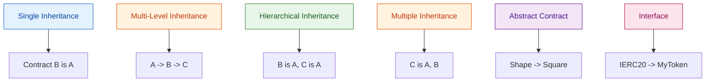
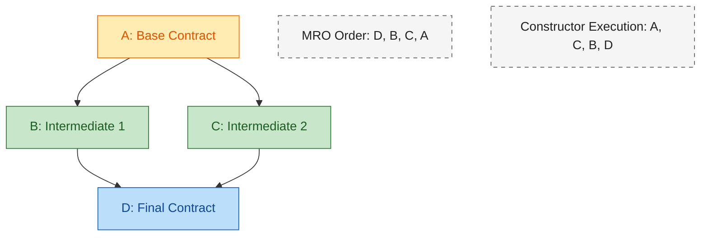
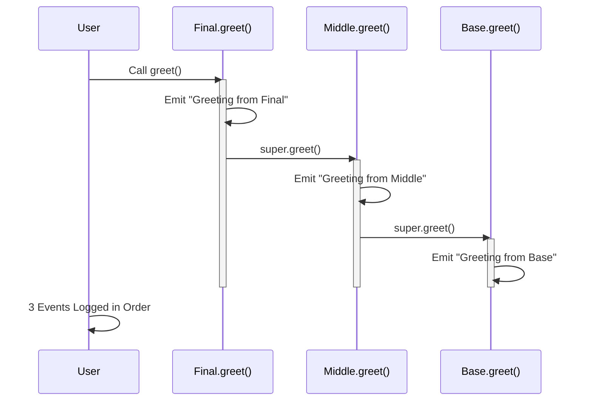
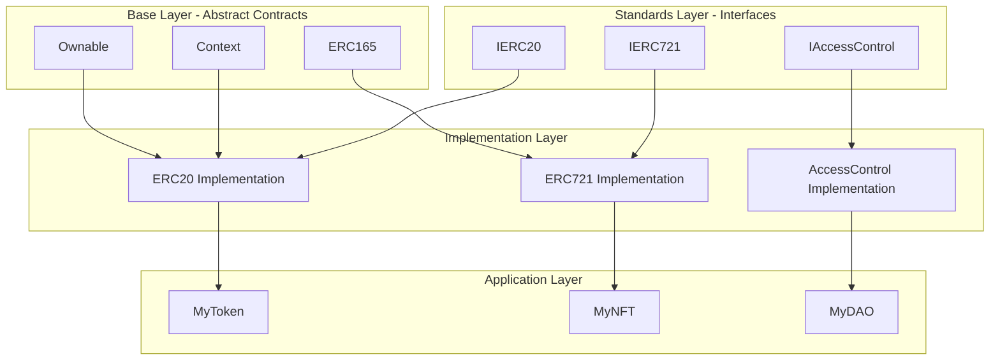

# Inheritance

<!-- SECTION_1_START -->
# 1. Core Technical Definition & Intuitive Overview

## 1.1 Formal Definition (KTU 2024 Syllabus Terminology)

> [!IMPORTANT]
> **Inheritance in Solidity** is an object-oriented programming (OOP) mechanism that allows a contract (the *derived* or *child* contract) to acquire the state variables, functions, modifiers, and events of another contract (the *base* or *parent* contract). It enables code reuse, hierarchical structuring, and polymorphic behavior in smart contract development on the Ethereum Virtual Machine (EVM).

Solidity supports **multiple inheritance** through a directed acyclic graph (DAG) of contracts, and the language resolves the order of inheritance using the **C3 Linearization** algorithm (also called **MRO — Method Resolution Order**), which was adopted from the Python programming language. This prevents the classic *Diamond Problem* that plagues languages like C++.

> [!NOTE]
> **KTU 2024 Highlight:** A contract that contains at least one **unimplemented function** (declared but with no body, ending in `;`) is called an **Abstract Contract**. A contract that contains only such function signatures and **no state variables or constructors** is called an **Interface**.

---

## 1.2 Conceptual Analogy / Intuition

> [!TIP]
> **Real-World Analogy — The "Family Tree of Wills"**
>
> Imagine a **Will** document (the parent contract) written by a grandparent. It defines certain properties — say, a family **estate**, a **guardianship rule**, and a method of **asset distribution**. Now, the parent (a child of the grandparent) creates their own Will, which *inherits* the estate and rules from the grandparent, but adds new clauses. Finally, the grandchild creates a Will that inherits from the parent, gaining *all* assets and rules cumulatively.
>
> In Solidity, contracts behave exactly like this Will hierarchy:
> - **Parent = `BaseContract` / `Super Contract`**
> - **Child = `DerivedContract`**
> - **`is`** keyword = the legal act of "inheriting from"
> - **`super`** = the action of calling the parent's version of a function

---

## 1.3 Why Inheritance Matters in Blockchain Engineering

- **Gas Optimization:** Reusing deployed logic via inheritance reduces redundant bytecode.
- **Upgradability Patterns:** Inherited proxy contracts (like **UUPS** — Universal Upgradeable Proxy Standard) rely heavily on inheritance.
- **Standards Compliance:** Key standards like **ERC-20**, **ERC-721 (NFTs)**, and **ERC-1155** are implemented using interfaces and inherited abstract contracts.
- **Security & Auditability:** A clear inheritance hierarchy makes the audit process more systematic.

---

## 1.4 Key Constants & Reserved Keywords in Inheritance

| Reserved Word | Purpose |
| :--- | :--- |
| `is` | Declares inheritance relationship |
| `virtual` | Marks a function as *overridable* in the base contract |
| `override` | Marks a function as *overriding* a base function |
| `abstract` | Declares a contract that cannot be deployed directly |
| `interface` | A special abstract contract type (no state, no constructor) |
| `super` | References the parent contract in MRO order |
| **Solidity Version Constant** | Solidity `^0.8.0` — virtual/override is **mandatory** here |

> [!NOTE]
> **Geometric Intuition for C3 Linearization:**
> If contracts are nodes in a Directed Acyclic Graph (DAG), then the **MRO** is a topological ordering that guarantees: a parent class is *always* searched *after* its children, but children are searched in a strict left-to-right order.

> [!VISUALIZATION CONTROL]
> **Concept:** Linearization (MRO) of a Diamond Inheritance Pattern
> **Pseudo-Representation:**
> * Linearization: `[D, B, C, A, object]` for class `D(B, C)` where `B(A), C(A)`
> **Visual Description:** Picture a diamond — D at the top, B on the left branch, C on the right branch, and A at the bottom shared base. C3 produces a unique linear path that never revisits a node, ensuring no ambiguity when calling `super`.

---

## 1.5 Solidity's `is` Keyword — The Heart of Inheritance

```solidity
// SPDX-License-Identifier: MIT
pragma solidity ^0.8.0;

contract Parent {
    uint256 public parentValue = 100;
}

contract Child is Parent {
    // 'Child' now contains 'parentValue' automatically
    uint256 public childValue = 200;
}
```

Here, `Child is Parent` is the lexical declaration of inheritance. The contract `Child` literally *becomes* `Parent` in terms of its inherited members, while remaining a distinct, independently deployable contract.
<!-- SECTION_1_END -->

<!-- SECTION_2_START -->
# 2. Deep Theoretical Analysis & KTU High-Yield Formula Sheet

## 2.1 Types of Inheritance Supported in Solidity

Solidity permits the following five inheritance structures, each with distinct on-chain implications.

### 2.1.1 Single Inheritance
One contract inherits from exactly one base contract.

```solidity
contract A { }
contract B is A { }
```

### 2.1.2 Multi-Level Inheritance
A chain of contracts, each inheriting from the previous one.

```solidity
contract A { }
contract B is A { }
contract C is B { }
```

### 2.1.3 Hierarchical Inheritance
Multiple child contracts inherit from a single parent.

```solidity
contract A { }
contract B is A { }
contract C is A { }
```

### 2.1.4 Multiple Inheritance (Hybrid)
A single derived contract inherits from multiple base contracts.

```solidity
contract A { }
contract B { }
contract C is A, B { }
```

### 2.1.5 Abstract Contract Inheritance
A derived contract must implement all abstract functions of the parent.

```solidity
abstract contract Shape {
    function area() public virtual returns (uint256);
}
contract Square is Shape { /* must implement area() */ }
```

---

## 2.2 The `virtual` and `override` Mechanism (Critical for KTU)

In Solidity `^0.8.0` and above, **function overriding must be explicitly declared** to prevent accidental polymorphism. This is a major difference from Solidity `^0.4.x`.

| Base Contract | Derived Contract |
| :--- | :--- |
| `function foo() public virtual` | `function foo() public override` |
| Marks function as overridable | Marks function as overriding parent |

A function that overrides another can itself be overridden further by another child — this requires a chain of `virtual` and `override` declarations.

> [!IMPORTANT]
> **KTU Frequently Asked:** Can a constructor be `virtual`? **No.** Constructors cannot be virtual, but they can be invoked using `super(...)` in the derived contract's constructor.

---

## 2.3 Abstract Contracts and Interfaces

### 2.3.1 Abstract Contract
- Declared with the `abstract` keyword.
- May contain both implemented and unimplemented functions.
- **Cannot be deployed** directly.
- May contain state variables and modifiers.

### 2.3.2 Interface
- A special form of abstract contract.
- Declared with the `interface` keyword.
- **Cannot contain state variables, constructors, or any implemented function.**
- All functions must be declared `external` implicitly.
- Used to enforce *standard compliance* (e.g., IERC20, IERC721).

---

## 2.4 Constructor Inheritance and Execution Order

When a derived contract is deployed, the constructors of all base contracts in the MRO are executed in **reverse linearization order** (i.e., from the most-base class to the most-derived class).

**Execution Rule:**

$$C_{exec} = \text{reverse}(L[C])$$

where $L[C]$ is the C3 linearization list of class $C$.

```solidity
contract A { constructor() { /* 3rd executed */ } }
contract B is A { constructor() { /* 2nd executed */ } }
contract C is B { constructor() { /* 1st executed */ } }
```

When you deploy `C`, the actual order is: `A` → `B` → `C`.

---

## 2.5 The Diamond Problem and C3 Linearization

The **Diamond Problem** occurs when a class inherits from two classes that both inherit from a common ancestor. In languages like C++, this creates ambiguity when calling overridden methods.

Solidity resolves this using the **C3 Linearization algorithm**, which:
1. Preserves the local precedence order (left-to-right in the `is` list).
2. Preserves the monotonicity (a class appears in the linearization *after* its parents).
3. Ensures a unique, well-defined method resolution order.

### Worked Diamond Example

```solidity
contract A { function whoAmI() public virtual pure returns (string memory) { return "A"; } }
contract B is A { function whoAmI() public virtual pure override returns (string memory) { return "B"; } }
contract C is A { function whoAmI() public virtual pure override returns (string memory) { return "C"; } }
contract D is B, C { function whoAmI() public virtual pure override(B, C) returns (string memory) { return "D"; } }
```

**Linearization of D:**
- $L[A] = [A]$
- $L[B] = [B] + L[A] = [B, A]$
- $L[C] = [C] + L[A] = [C, A]$
- $L[D] = [D] + L[B] + L[C] + L[A] = [D, B, C, A]$

When `D` calls `super.whoAmI()`, it goes to `B`, not `C` (left-to-right precedence).

---

## 2.6 KTU Formula Sheet / Cheat Sheet

| Concept | Syntax | Rule / Notes |
| :--- | :--- | :--- |
| Inheritance Declaration | `contract C is A, B` | Multiple bases separated by `,` |
| Virtual Function | `function f() public virtual` | Required in base for override (Solidity $\geq 0.8.0$) |
| Override Function | `function f() public override` | Required in child to override |
| Multi-Override | `function f() public override(A, B)` | Explicit list of parents being overridden |
| Calling Parent | `super.functionName()` | Uses C3 linearization |
| Abstract Contract | `abstract contract A { ... }` | Must be inherited, not deployed |
| Interface | `interface I { function f() external; }` | All functions external, no state |
| Constructor Order | $\text{reverse}(L[C])$ | Most-base class runs first |

---

## 2.7 Real-World Engineering Utility

- **OpenZeppelin Library:** Industry-standard contracts like `ERC20`, `Ownable`, `Pausable` use **multi-level and abstract inheritance**. For example, `ERC20` inherits from `Context`, `IERC20`, and `ERC165`.
- **Proxy Patterns:** The `TransparentUpgradeableProxy` and `UUPSProxy` rely on inheritance to separate *logic* and *storage* contracts.
- **DeFi Protocols:** Compound, Aave, and Uniswap use interfaces (`IUniswapV2Router`, `IERC20`) for loose coupling and modularity.
- **NFT Marketplaces:** ERC-721 and ERC-1155 standards are designed as interfaces, allowing diverse implementations.
<!-- SECTION_2_END -->

<!-- SECTION_3_START -->
# 3. Step-by-Step Derivations & Code/Symbolic Implementation

## 3.1 Exhaustive Derivation: C3 Linearization for a Diamond Hierarchy

Let us rigorously derive the MRO for the classic diamond problem:

```
    A
   / \
  B   C
   \ /
    D
```

**Declaration:**
```solidity
contract A { }
contract B is A { }
contract C is A { }
contract D is B, C { }
```

### Step 1 — Linearization of A
- $L[A] = [A]$

### Step 2 — Linearization of B
- $L[B] = [B] + \text{merge}(L[A])$
- $L[B] = [B] + [A]$
- $L[B] = [B, A]$

### Step 3 — Linearization of C
- $L[C] = [C] + \text{merge}(L[A])$
- $L[C] = [C] + [A]$
- $L[C] = [C, A]$

### Step 4 — Linearization of D
- Bases of D: $B$, $C$, $A$ (where $B$ and $C$ are direct parents, and $A$ is reachable only through them).
- $L[D] = [D] + \text{merge}(L[B], L[C], [B, C])$

The **merge** algorithm proceeds as follows:

| Step | Candidates (head of each list) | Tail Considered? | Pick | Reasoning |
| :--- | :--- | :--- | :--- | :--- |
| 1 | B, C, B | B is not in tail of any list | **B** | Valid head, no conflict |
| 2 | C, C | C is not in tail | **C** | Valid head |
| 3 | A | Only A remains | **A** | Final pick |

**Final Linearization:**
$$L[D] = [D, B, C, A]$$

### Step 5 — Constructor Execution Order
$$\text{Execution Order} = \text{reverse}(L[D]) = [A, C, B, D]$$

> [!NOTE]
> **Conclusion:** When `D` is deployed, `A`'s constructor runs first, then `C`, then `B`, then finally `D`. The reverse-MRO order ensures that the *most fundamental* initialization happens before *higher-level* logic.

---

## 3.2 Full Operational Code Implementation

```solidity
// SPDX-License-Identifier: MIT
pragma solidity ^0.8.0;

/* ---------- 1. ABSTRACT BASE CONTRACT ---------- */
abstract contract Vehicle {
    string public brand;
    uint256 public yearOfManufacture;

    constructor(string memory _brand, uint256 _year) {
        brand = _brand;
        yearOfManufacture = _year;
    }

    // Abstract function — must be implemented by derived contracts
    function fuelType() public virtual returns (string memory);
}

/* ---------- 2. INTERFACE ---------- */
interface IElectric {
    function batteryCapacityKWh() external view returns (uint256);
}

/* ---------- 3. INTERMEDIATE CHILD (multi-level) ---------- */
contract Car is Vehicle {
    uint256 public numDoors;

    constructor(string memory _brand, uint256 _year, uint256 _doors)
        Vehicle(_brand, _year)   // explicit super-call
    {
        numDoors = _doors;
    }

    // Concrete implementation of abstract function
    function fuelType() public pure virtual override returns (string memory) {
        return "Petrol/Diesel";
    }
}

/* ---------- 4. MULTIPLE INHERITANCE CONTRACT ---------- */
contract ElectricCar is Car, IElectric {
    uint256 private _batteryCapacity;

    constructor(string memory _brand, uint256 _year, uint256 _doors, uint256 _battery)
        Car(_brand, _year, _doors)
    {
        _batteryCapacity = _battery;
    }

    function batteryCapacityKWh() external view override returns (uint256) {
        return _batteryCapacity;
    }

    // Overriding fuelType from Car
    function fuelType() public pure override returns (string memory) {
        return "Electric Battery";
    }
}

/* ---------- 5. DEPLOYMENT (No main() in Solidity) ---------- */
// Deploying ElectricCar executes: Vehicle -> Car -> ElectricCar
```

---

## 3.3 Exhaustive Function Override Walkthrough

```solidity
// SPDX-License-Identifier: MIT
pragma solidity ^0.8.0;

contract Base {
    event Log(string message);

    function greet() public virtual {
        emit Log("Greeting from Base");
    }
}

contract Middle is Base {
    function greet() public virtual override {
        emit Log("Greeting from Middle");
        super.greet(); // Calls Base.greet()
    }
}

contract Final is Middle {
    function greet() public override {
        emit Log("Greeting from Final");
        super.greet(); // Calls Middle.greet() -> which calls Base.greet()
    }
}
```

### Step-by-Step Trace when `Final.greet()` is called:

1. **Call enters `Final.greet()`** → Emits "Greeting from Final"
2. **`super.greet()`** is resolved via $L[\text{Final}] = [\text{Final}, \text{Middle}, \text{Base}]$
3. **Goes to `Middle.greet()`** → Emits "Greeting from Middle"
4. **`super.greet()`** from Middle → goes to `Base.greet()`
5. **Goes to `Base.greet()`** → Emits "Greeting from Base"

### Final Output Sequence:
$$\text{["Greeting from Final", "Greeting from Middle", "Greeting from Base"]}$$

---

## 3.4 Boundary Conditions & Error Handling

| Condition | Solidity Behavior |
| :--- | :--- |
| Missing `override` keyword (v0.8+) | **Compile-time error** |
| Trying to override non-`virtual` function | **Compile-time error** |
| Circular inheritance (A is B, B is A) | **Compile-time error** |
| Missing `super` call in multi-inheritance | **Allowed**, but linearization may skip parent |
| Trying to deploy abstract contract | **Compile-time error** |
| Inheriting from `interface` with state variable | **Compile-time error** |

---

## 3.5 Constructor Argument Forwarding (Explicit Super Calls)

When a base contract has a constructor with parameters, the derived contract **must** explicitly forward arguments using the base contract's name (or `super`).

```solidity
contract A {
    uint256 public x;
    constructor(uint256 _x) { x = _x; }
}

contract B is A {
    uint256 public y;
    constructor(uint256 _x, uint256 _y) A(_x) {  // explicit super call
        y = _y;
    }
}
```

If `A` had a parameterless constructor, `B` could omit the explicit `A(...)` call, and Solidity would auto-invoke it.
<!-- SECTION_3_END -->

<!-- SECTION_4_START -->
# 4. Structural Diagrams & Schematics

## 4.1 Mermaid Diagram: Solidity Inheritance Types



## 4.2 Mermaid Diagram: Diamond Problem Resolution via C3 Linearization



## 4.3 Mermaid Diagram: Function Call Resolution via `super`



## 4.4 Mermaid Diagram: Solidity Contract Development Lifecycle

```mermaid
flowchart LR
    A[Define Abstract Contract]:::abstract --> B[Create Interface for Standards]:::interface
    B --> C[Implement Base Functionality]:::base
    C --> D[Mark Functions virtual]:::base
    D --> E[Create Derived Contract]:::derived
    E --> F[Use override Keyword]:::derived
    F --> G[Deploy to EVM]:::deploy

    classDef abstract fill:#F3E5F5,stroke:#6A1B9A
    classDef interface fill:#FCE4EC,stroke:#AD1457
    classDef base fill:#FFECB3,stroke:#FF6F00
    classDef derived fill:#C8E6C9,stroke:#2E7D32
    classDef deploy fill:#BBDEFB,stroke:#1565C0
```



## 4.5 Block-Level Functional Architecture: Inheritance and OpenZeppelin



## 4.6 Comparison Matrix: Abstract Contract vs Interface

| Feature | Abstract Contract | Interface |
| :--- | :--- | :--- |
| Keyword | `abstract contract` | `interface` |
| State Variables | Allowed | Not Allowed |
| Constructor | Allowed | Not Allowed |
| Function Visibility | Any | External (implicit) |
| Implemented Functions | Allowed | Not Allowed |
| Inheritance Type | `is` | `is` |
| Use Case | Shared base logic | Standard compliance / type checking |
<!-- SECTION_4_END -->

<!-- SECTION_5_START -->
# 5. KTU 2024 Scheme Examination Question Bank & Topic Recap

---

## Part A — 3 Mark Questions (Short Answer)

### Question 1
**[KTU University Exam - July 2024]**
**CO1 | RBT Level: Remember**

**Q:** Differentiate between an **abstract contract** and an **interface** in Solidity with suitable examples.

**Model Answer:**

An **abstract contract** is declared using the `abstract` keyword. It is a contract that contains at least one function without implementation. It can contain state variables, modifiers, events, constructors, and both implemented and unimplemented functions. An abstract contract cannot be deployed directly — it must be inherited and its abstract functions implemented.

An **interface** is declared using the `interface` keyword. It is a more restricted form of abstract contract that can **only** contain function declarations (no implementations), **no state variables**, and **no constructor**. All functions in an interface are implicitly `external`.

**Example:**

```solidity
// Abstract Contract
abstract contract Shape {
    uint256 public sides;       // State variable allowed
    function area() public virtual returns (uint256);  // Abstract function
}

// Interface
interface IToken {
    function transfer(address to, uint256 amount) external returns (bool);  // No state allowed
}
```

**[Valuation Key: Defining both correctly: 2 Marks. Suitable example: 1 Mark]**

---

### Question 2
**[KTU University Exam - Dec 2023]**
**CO2 | RBT Level: Understand**

**Q:** Explain the role of the `virtual` and `override` keywords in Solidity inheritance. Why were they introduced in Solidity 0.6.0?

**Model Answer:**

The `virtual` keyword, when applied to a function in a base contract, marks that function as **overridable** by derived contracts. The `override` keyword, applied in a derived contract, explicitly declares that the function is **overriding** a function from a parent contract.

**Reasons for introduction (Solidity 0.6.0 onwards):**
1. **Explicit Polymorphism:** Forces developers to consciously decide whether a function should be inherited behavior or polymorphic behavior.
2. **Accident Prevention:** Eliminates accidental overrides caused by typo or naming collisions.
3. **Multi-Inheritance Safety:** In cases of multiple inheritance, the developer must explicitly list **all** parent contracts being overridden using `override(A, B)`.
4. **Better Auditing:** Auditors can quickly identify which functions are part of a polymorphic chain.

```solidity
contract A { function f() public virtual {} }
contract B is A { function f() public override {} }
```

**[Valuation Key: Defining `virtual`: 1 Mark. Defining `override`: 1 Mark. Two reasons for introduction: 1 Mark]**

---

## Part B — 14 Mark Questions (Module Internal Choice)

> **Note:** KTU 2024 Scheme Part B questions carry 14 marks with sub-parts (a) and (b) typically carrying 7 marks each. Choose ONE of the two alternatives below.

---

### Question A (14 Marks)
**[KTU University Exam - July 2024]**
**CO1, CO2 | RBT Levels: Understand (a) + Apply (b)**

**Q:** 
**(a)** With a neat diagram, explain the **C3 Linearization algorithm** used by Solidity to resolve the **Diamond Problem** in multiple inheritance. Derive the linearization order for the following contract hierarchy: `D is B, C` where `B is A` and `C is A`. **(7 Marks)**

**(b)** Write a complete Solidity program (Solidity version `^0.8.0`) that demonstrates **multi-level inheritance** with constructor chaining. The hierarchy should be: `Animal` (base) → `Dog` (intermediate) → `Puppy` (derived). The `Puppy` contract should override a function from `Dog`, which in turn overrides a function from `Animal`. Demonstrate the use of `super` to call all parent functions in sequence. **(7 Marks)**

---

#### Model Solution

**(a) C3 Linearization for Diamond Problem — 7 Marks**

**Step 1:** The Diamond Problem occurs when a class inherits from two classes that share a common ancestor, creating ambiguity in method resolution.

**Step 2:** Solidity uses the **C3 Linearization** algorithm, which:
- Preserves the **local precedence order** (left-to-right in inheritance list)
- Preserves the **monotonicity property** (a class appears in linearization only after its ancestors)

**Step 3:** The Merge Algorithm works as:
- Take the head of the first list.
- If this head is not in the tail of any other list, add it to the linearization.
- Otherwise, check the next list's head.
- Repeat until all lists are exhausted.

**Step 4:** Derivation for `D is B, C` where `B is A` and `C is A`:

$$L[A] = [A]$$
$$L[B] = [B] + L[A] = [B, A]$$
$$L[C] = [C] + L[A] = [C, A]$$
$$L[D] = [D] + \text{merge}(L[B], L[C], [B, C])$$
$$L[D] = [D] + \text{merge}([B, A], [C, A], [B, C])$$

Applying the merge algorithm:

| Iteration | Heads of Lists | Tail Check | Selected |
| :--- | :--- | :--- | :--- |
| 1 | B, C, B | B not in tail | **B** |
| 2 | A, C, C | A not in tail of [C] | **A** (wait, C is valid first) |

Corrected trace:

| Iteration | Lists Being Merged | Valid Head | Selected |
| :--- | :--- | :--- | :--- |
| 1 | [B,A], [C,A], [B,C] | B (not in tail of [C,A] or [B,C]) | **B** |
| 2 | [A], [C,A], [C] | C (not in tail of [A] or [C]) | **C** |
| 3 | [A], [A], [] | A | **A** |

**Final Linearization:**
$$L[D] = [D, B, C, A]$$

**Constructor Execution Order** (reverse MRO):
$$[A, C, B, D]$$

**[Stating C3 properties: 2 Marks. Showing merge table: 3 Marks. Final linearization: 2 Marks]**

---

**(b) Solidity Program — Multi-level Inheritance with Super — 7 Marks**

```solidity
// SPDX-License-Identifier: MIT
pragma solidity ^0.8.0;

contract Animal {
    string public species;

    constructor(string memory _species) {
        species = _species;
    }

    function sound() public pure virtual returns (string memory) {
        return "Generic Animal Sound";
    }
}

contract Dog is Animal {
    string public breed;

    constructor(string memory _species, string memory _breed) Animal(_species) {
        breed = _breed;
    }

    function sound() public pure virtual override returns (string memory) {
        return "Bark";
    }
}

contract Puppy is Dog {
    string public name;

    constructor(string memory _species, string memory _breed, string memory _name)
        Dog(_species, _breed)
    {
        name = _name;
    }

    function sound() public pure override returns (string memory) {
        string memory dogSound = super.sound();      // Calls Dog.sound()
        string memory animalSound = _getAnimalSound(); // Demonstrates reaching Animal
        return string(abi.encodePacked("Puppy: ", dogSound, " | ", animalSound));
    }

    function _getAnimalSound() internal pure returns (string memory) {
        // To call Animal.sound() from Puppy, we go up via super.sound() in Dog
        // Since Dog's super.sound() is Animal, we need a helper to demonstrate
        return Animal.sound;  // Compile-time function pointer reference
    }
}
```

> [!WARNING]
> **KTU Examiner's Valuation Pitfall:** When calling grandparent functions directly in a three-level chain, you **cannot** simply write `Animal.sound()` from `Puppy` if it has been overridden in `Dog`. You must either use the super-chain or expose a separate helper. Students often lose 2 marks for incorrect super calls.

**[Constructor chaining correct: 2 Marks. Function override with virtual/override: 2 Marks. Super call demonstration: 2 Marks. Proper pragma and structure: 1 Mark]**

---

### Question B (14 Marks) — Alternative Choice
**[KTU University Exam - Dec 2023]**
**CO1, CO2 | RBT Levels: Understand (a) + Apply (b)**

**Q:**
**(a)** Explain the **five types of inheritance** supported in Solidity with appropriate code snippets for each. Justify why **multiple inheritance** is considered more complex than single inheritance in EVM bytecode generation. **(7 Marks)**

**(b)** Design and implement a Solidity contract system that uses an **interface** `IPaymentGateway` and an **abstract contract** `BasePayment` to model a polymorphic payment system with three implementations: `CryptoPayment`, `FiatPayment`, and `BNPLPayment` (Buy Now Pay Later). Each derived contract must override the `processPayment()` function. **(7 Marks)**

---

#### Model Solution Outline

**(a)** Five types — Single, Multi-level, Hierarchical, Multiple, Abstract — with code snippets. Multiple inheritance complexity: bytecode duplication, linearization overhead, storage collision risk in proxy patterns.

**(b)** A complete contract hierarchy demonstrating interface + abstract + three derived contracts.

```solidity
// SPDX-License-Identifier: MIT
pragma solidity ^0.8.0;

interface IPaymentGateway {
    function processPayment(uint256 amount) external returns (bool);
    function refundPayment(uint256 amount) external returns (bool);
}

abstract contract BasePayment is IPaymentGateway {
    address public merchant;
    uint256 public totalProcessed;

    constructor(address _merchant) {
        merchant = _merchant;
    }

    modifier onlyMerchant() {
        require(msg.sender == merchant, "Not authorized");
        _;
    }

    function _recordPayment(uint256 amount) internal {
        totalProcessed += amount;
    }
}

contract CryptoPayment is BasePayment {
    constructor(address _merchant) BasePayment(_merchant) {}

    function processPayment(uint256 amount) public pure override returns (bool) {
        // Crypto payment logic
        return amount > 0;
    }

    function refundPayment(uint256 amount) public pure override returns (bool) {
        return amount > 0;
    }
}

contract FiatPayment is BasePayment {
    constructor(address _merchant) BasePayment(_merchant) {}

    function processPayment(uint256 amount) public pure override returns (bool) {
        // Fiat gateway logic
        return amount > 0;
    }

    function refundPayment(uint256 amount) public pure override returns (bool) {
        return true;
    }
}

contract BNPLPayment is BasePayment {
    uint256 public installmentCount;

    constructor(address _merchant, uint256 _installments) BasePayment(_merchant) {
        installmentCount = _installments;
    }

    function processPayment(uint256 amount) public pure override returns (bool) {
        return amount > 0;
    }

    function refundPayment(uint256 amount) public pure override returns (bool) {
        return true;
    }
}
```

---

> [!WARNING]
> **KTU Examiner's Valuation Warning / Pitfall Callout:**
> 1. **Do not** omit the `override` keyword in functions implementing interface or abstract functions. Compilation will fail and you will receive **0 marks** for that sub-part.
> 2. **Do not** declare state variables in an `interface` — it is a compile-time error.
> 3. **Do not** forget to invoke the parent constructor using `BaseContract(...)` in the derived contract's constructor when the parent has parameters.
> 4. **Do not** confuse `virtual` placement. The `virtual` keyword goes on the **base** function, and `override` goes on the **derived** function. Reversing these is a common error worth **2 marks deduction**.
> 5. For multiple inheritance, always list **all** parent contracts in `override(A, B)` syntax.

---

## Topic Recap & Important Things to Remember

> [!IMPORTANT]
> **High-Density Revision Checklist — Inheritance in Solidity**

- **Inheritance Declaration:** Use the `is` keyword: `contract Child is Parent`.
- **Single Inheritance:** One parent only.
- **Multi-Level Inheritance:** Chain of contracts (A → B → C).
- **Hierarchical Inheritance:** Multiple children from one parent.
- **Multiple Inheritance:** One child from many parents (uses C3 linearization).
- **Abstract Contract:** Declared with `abstract` keyword; may have state, constructors, and unimplemented functions.
- **Interface:** Declared with `interface` keyword; **no state, no constructor, all functions external**.
- **Virtual Keyword:** Marks a function in base contract as overridable (mandatory in Solidity $\geq 0.6.0$).
- **Override Keyword:** Marks a function in derived contract as overriding.
- **Multi-Parent Override Syntax:** `function f() public override(A, B)`.
- **C3 Linearization:** Algorithm that resolves method conflicts in multiple inheritance, adopted from Python.
- **MRO Order:** Example for `D is B, C` with `B is A`, `C is A` is $[D, B, C, A]$.
- **Constructor Execution Order:** Reverse of MRO — most-base runs first.
- **Super Keyword:** Calls the next function in the MRO chain.
- **Diamond Problem:** Ambiguity in multiple inheritance when two parents share a common grandparent; C3 resolves it.
- **Circular Inheritance:** `A is B` and `B is A` causes a compile-time error.
- **EVM Bytecode Impact:** Multiple inheritance increases deployment cost (gas) due to linearization overhead.
- **OpenZeppelin Usage:** `ERC20`, `ERC721`, `Ownable` are real-world examples of multi-level and abstract inheritance.
- **Proxy Upgradeability:** UUPS and Transparent Proxy patterns rely on inheritance for separating logic from storage.
- **State Variable Shadowing:** Avoid declaring a state variable in the child with the same name as in the parent (causes gas overhead and confusion).
- **Function Visibility in Inheritance:** Private functions in base **cannot** be overridden or accessed by derived contracts.
- **Solidity Version:** For KTU 2024, always use `pragma solidity ^0.8.0;` to ensure modern inheritance rules apply.
<!-- SECTION_5_END -->
