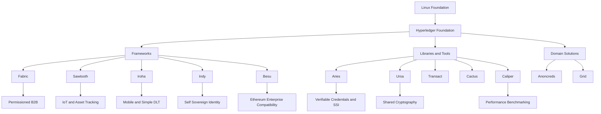
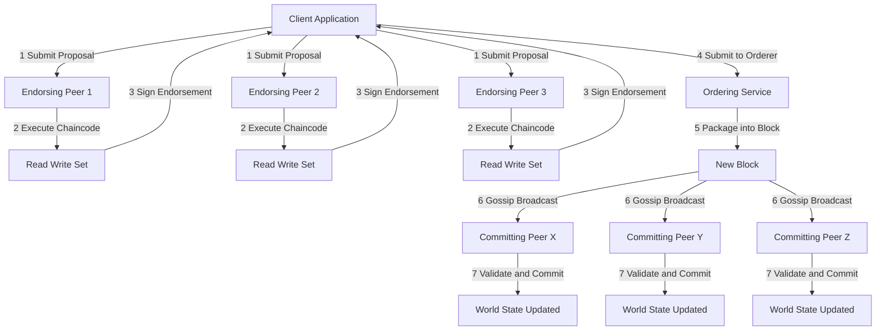
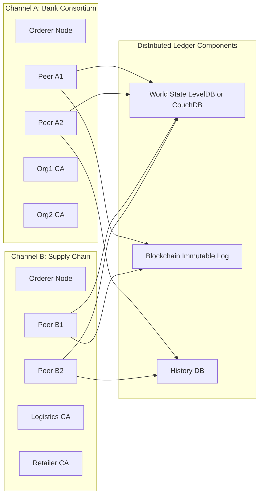
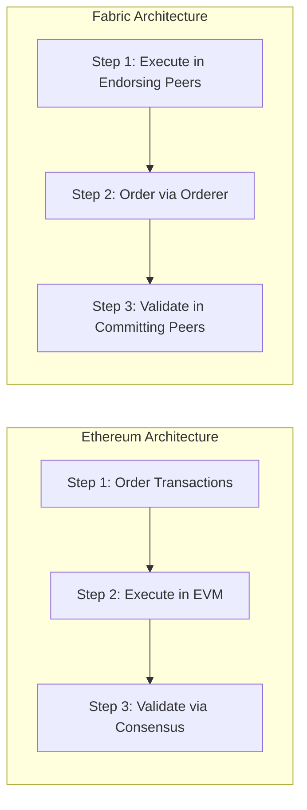
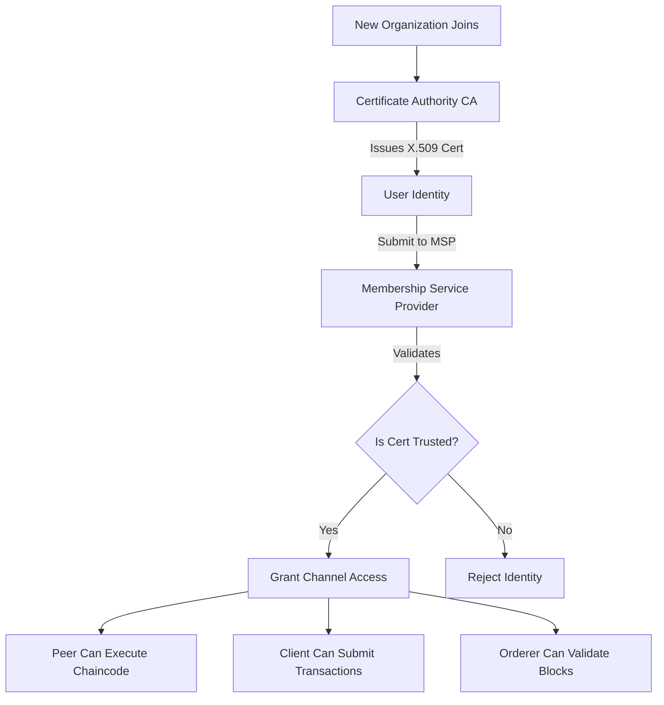

# Introduction to Hyperledger Foundation

<!-- SECTION_1_START -->
# Introduction to Hyperledger Foundation

> [!NOTE]
> **Hyperledger Foundation** is an open-source community hosted by the **Linux Foundation**, focused on developing enterprise-grade blockchain frameworks, tools, and libraries. Unlike public, permissionless blockchains (e.g., Bitcoin, Ethereum), Hyperledger is dedicated to **permissioned, distributed ledger technologies (DLT)** for cross-industry enterprise use.

## 1.1 Formal Academic Definition

In KTU 2024 Scheme terminology, the **Hyperledger Foundation** can be defined as:

> A vendor-neutral, collaborative open-source ecosystem governed by the **Linux Foundation** that hosts a suite of stable frameworks, tools, and libraries — such as **Hyperledger Fabric**, **Hyperledger Sawtooth**, **Hyperledger Iroha**, **Hyperledger Indy**, **Hyperledger Besu**, and **Hyperledger Aries** — designed to deliver enterprise-grade **Distributed Ledger Technology (DLT)** for business transactions with confidentiality, scalability, and modularity.

The foundational pillars of Hyperledger are:

- **Modular Architecture** → Pluggable consensus protocols and identity management
- **Permissioned Network** → Participants are known and authenticated
- **Enterprise Focus** → Built for B2B and consortium use cases
- **Privacy by Design** → Confidential transactions and private data collections
- **Cryptographic Identity** → Based on **Public Key Infrastructure (PKI)** and **X.509 certificates**

## 1.2 Conceptual Analogy — Intuition Building

> [!IMPORTANT]
> **Analogy: The Corporate Boardroom vs. The Public Town Square**

| Aspect | Public Blockchain (Bitcoin/Ethereum) | Hyperledger (Permissioned) |
|---|---|---|
| Setting | **Public Town Square** — anyone can join | **Private Corporate Boardroom** — invited members only |
| Participants | Anonymous, pseudonymous | Identified, vetted through **Membership Service Provider (MSP)** |
| Consensus | Mining (PoW) / Staking (PoS) | Voting-based, **Practical Byzantine Fault Tolerance (PBFT)**, **Raft** |
| Goal | Trustless decentralization among strangers | Trustful efficiency among known business partners |

Imagine a consortium of **5 banks** wanting to settle cross-border payments. They don't want anonymous miners, volatile gas fees, or public exposure of transaction volumes. They need a **shared, replicated ledger** where only the 5 banks can read/write, with full audit trails. **Hyperledger Fabric** is the perfect "boardroom ledger."

## 1.3 Why Hyperledger Was Created (Genesis)

In **December 2015**, the **Linux Foundation** announced the formation of the Hyperledger project. The motivation was clear:

> [!IMPORTANT]
> **Key Drivers Behind Hyperledger's Creation**
> 1. **Bitcoin/Ethereum Limitations** — No privacy, no governance, unpredictable fees.
> 2. **Industry Demand** — Banks, supply chains, healthcare needed DLT without crypto-volatility.
> 3. **Need for Standards** — Avoid vendor lock-in; promote interoperable protocols.
> 4. **Modularity** — Enterprises wanted pluggable components (consensus, identity, DB).

## 1.4 Core Constants & Metrics

> [!IMPORTANT]
> **Hyperledger Key Statistics (as of 2024–2025)**
> - **Active Frameworks:** **6** (Fabric, Sawtooth, Iroha, Indy, Besu, Aries)
> - **Hosting Body:** **The Linux Foundation** (501(c)(6) non-profit)
> - **Default Cryptography:** **Elliptic Curve Cryptography (secp256r1 / P-256)** with SHA-256 hashing
> - **Smart Contract Language (Fabric):** **Go, Java, JavaScript, TypeScript**
> - **Consensus Mechanisms Supported:** **Raft, PBFT, PoET, Clique IBFT 2.0**

> [!VISUALIZATION CONTROL]
> **Concept:** Hyperledger Family Tree (Top-Down Hierarchy)
> **Coordinate Mapping:**
> - Root Node: `Linux Foundation (x=0, y=5)`
> - Branch 1: `Hyperledger Foundation (x=0, y=3)`
> - Leaves: `Fabric (-4,0)`, `Sawtooth (-2,0)`, `Iroha (0,0)`, `Indy (2,0)`, `Besu (4,0)`, `Aries (5,0)`
> **Visual Description:** A tree structure showing the Linux Foundation as the umbrella organization, with Hyperledger as its child initiative, branching out into 6 distinct projects along the x-axis at the base.

<!-- SECTION_1_END -->

<!-- SECTION_2_START -->
# Deep Theoretical Analysis & KTU High-Yield Formula Sheet

## 2.1 The Hyperledger Ecosystem — Project Taxonomy

The Hyperledger Foundation hosts projects in **three distinct categories**:

> [!NOTE]
> **1. Distributed Ledger Frameworks** — The core blockchain engines
> **2. Libraries & Tools** — Reusable cryptographic and identity components
> **3. Domain-Specific Applications** — Use-case driven solutions

### 2.1.1 Frameworks (Core Blockchains)

| Project | Consensus | Smart Contract Language | Primary Use Case |
|---|---|---|---|
| **Hyperledger Fabric** | Pluggable (Raft, PBFT) | Chaincode (Go, Node.js, Java) | Enterprise consortiums, supply chain, finance |
| **Hyperledger Sawtooth** | PoET (Proof of Elapsed Time) | Transaction Families (Python, Go, JS, Rust, Java, C++) | IoT, asset tracking, supply chain provenance |
| **Hyperledger Iroha** | YAC (Yet Another Consensus) | Smart Contracts in C++ | Mobile-friendly DLT, simple deployment |
| **Hyperledger Indy** | Plenum (BFT) | EVM (Solidity-compatible) | Decentralized digital identity (DID/SSI) |
| **Hyperledger Besu** | QBFT, Clique, IBFT 2.0 | EVM (Solidity) | Ethereum-compatible enterprise chains |

### 2.1.2 Libraries & Tools

| Tool | Purpose |
|---|---|
| **Hyperledger Aries** | Peer-to-peer messaging infrastructure for verifiable credentials |
| **Hyperledger Ursa** | Shared cryptographic library (zero-knowledge proofs, BLS signatures) |
| **Hyperledger Transact** | Shared smart contract execution engine |
| **Hyperledger Cactus** | Blockchain interoperability plug-in |
| **Hyperledger Caliper** | Blockchain performance benchmarking tool |
| **Hyperledger Composer** *(Deprecated)* | Model-driven development for Fabric (legacy) |

## 2.2 Hyperledger Fabric — Deep Architecture

Hyperledger Fabric is the **flagship and most widely adopted** project. It has a unique **execute-order-validate** architecture (as opposed to Ethereum's order-execute).

### 2.2.1 Core Architectural Components

> [!IMPORTANT]
> **The 7 Pillars of Hyperledger Fabric**
> 1. **Peer Nodes** — Host the ledger, execute chaincode
> 2. **Orderer Nodes** — Establish transaction ordering (atomic broadcast)
> 3. **Channel** — Private communication overlay between specific members
> 4. **Chaincode (Smart Contract)** — Business logic running in Docker containers
> 5. **Membership Service Provider (MSP)** — PKI-based identity issuance and validation
> 6. **Ledger** — Composed of the **World State** (LevelDB/CouchDB) + **Blockchain** (immutable log)
> 7. **Gossip Protocol** — Peer-to-peer state dissemination

### 2.2.2 Transaction Flow (Execute → Order → Validate)

> [!NOTE]
> **The Fabric Transaction Lifecycle (7 Stages)**
>
> 1. **Proposal** — Client sends transaction proposal to endorsing peers.
> 2. **Execution** — Endorsing peers execute chaincode and produce read-write sets (RW-set).
> 3. **Endorsement** — Peers sign the result; client collects endorsements per endorsement policy.
> 4. **Ordering** — Client submits endorsed transaction to the **Orderer**.
> 5. **Broadcast** — Orderer packages transactions into a **block** and broadcasts via **Gossip**.
> 6. **Validation** — Committing peers verify endorsements and check for **read-set conflicts** (concurrency control via **MVCC**).
> 7. **Commit** — Valid transactions update the World State; invalid ones are marked.

### 2.2.3 Identity and MSP

$$
\text{MSP} = \{ \text{ID}_{MSP}, \text{RootCA}_{cert}, \text{IntermediateCAs}, \text{AdminCerts}, \text{RevocationList} \}
$$

- Each member receives an **X.509 certificate** signed by a trusted **Certificate Authority (CA)**.
- MSPs translate certificates into a **membership identity** that the network recognizes.

## 2.3 Hyperledger vs. Public Blockchains — Critical Comparison

| Parameter | Public Blockchain (Ethereum) | Hyperledger (Fabric) |
|---|---|---|
| **Access** | Permissionless | Permissioned |
| **Throughput** | ~15–30 TPS (L1) | **3,000+ TPS** (Raft consensus) |
| **Consensus** | PoW/PoS (Probabilistic Finality) | **CFT/BFT** (Deterministic Finality) |
| **Privacy** | Public ledger | Channels + Private Data Collections (PDCs) |
| **Cryptocurrency** | Required (ETH for gas) | **No native cryptocurrency needed** |
| **Smart Contract** | Solidity (EVM) | Chaincode (Go, Java, Node.js) |
| **Identity** | Pseudonymous (Address-based) | PKI / X.509 certificates |
| **Finality** | Probabilistic (with reorg risk) | **Immediate finality** |
| **Energy** | High (PoW) | Low (no mining) |

## 2.4 KTU Formula Sheet — Hyperledger Cheat Codes

| Concept | Formula / Rule | Units / Notes |
|---|---|---|
| **Byzantine Fault Tolerance** | $f = \lfloor (n-1)/3 \rfloor$ | $n$ = total nodes, $f$ = faulty tolerated |
| **Crash Fault Tolerance** | $f = \lfloor (n-1)/2 \rfloor$ | Raft tolerates up to $f$ crashes |
| **Block Hash** | $H_{block} = \text{SHA-256}( \text{Header} \mid\mid \text{Transactions} )$ | 256-bit output |
| **Digital Signature** | $\sigma = \text{Sign}_{sk}(H(m))$ | $sk$ = private key, $H(m)$ = message hash |
| **Merkle Root** | $R_{merkle} = H(H_{L} \mid\mid H_{R})$ recursively | For transaction integrity |
| **PoET Wait Time** | $T_{wait} \sim \text{Uniform}(0, T_{max})$ | SGX-enforced random timer |

> [!WARNING]
> **Pitfall:** Hyperledger Fabric **does NOT use mining**. There is no nonce puzzle, no gas fee, and no coinbase reward. The system is **deterministic**, not probabilistic.

## 2.5 Real-World Engineering Applications

- **TradeLens** (Maersk + IBM) → Global shipping on Hyperledger Fabric
- **IBM Food Trust** → Walmart's farm-to-fork produce tracking
- **HDFOX (Hong Kong Exchange)** → Post-trade settlement using Fabric
- **Healthcare** → Patient identity and consent management (Hyperledger Indy)
- **Central Bank Digital Currencies (CBDCs)** → Project **mBridge** (Fabric-based)

<!-- SECTION_2_END -->

<!-- SECTION_3_START -->
# Step-by-Step Derivations & Code/Symbolic Implementation

## 3.1 BFT Fault Tolerance — Mathematical Derivation

The **Byzantine Generals Problem** asks: how many traitors can $N$ generals tolerate and still reach consensus?

> [!NOTE]
> **Lamport-Shostak-Pease Theorem (1982):**
> A consensus is reachable only if the number of Byzantine (malicious) nodes satisfies the inequality:
> $N \geq 3f + 1$, where $N$ is total nodes and $f$ is faulty nodes.

### 3.1.1 Derivation of $N \geq 3f + 1$

$$
\begin{aligned}
\text{Let } N &= \text{total generals} \\
f &= \text{Byzantine (malicious) generals} \\
N - f &= \text{loyal (honest) generals}
\end{aligned}
$$

For loyal generals to reach consensus, they need to **outvote** the malicious ones. Each loyal general receives $N - 1$ messages, of which $f$ may be lies.

The loyal majority must have a **strict count of agreement** that exceeds possible lies:

$$
\begin{aligned}
(N - 1 - f) &> f \\
N - 1 &> 2f \\
N &> 2f + 1 \\
\therefore N &\geq 3f + 1
\end{aligned}
$$

**Example:** If $f = 1$ traitor, we need $N \geq 4$ generals. The loyal 3 outvote the 1 traitor.

**Code Implementation of BFT Validator Counting:**

```python
from math import floor

def max_byzantine_faults(total_nodes: int) -> int:
    """
    Calculate the maximum number of Byzantine (malicious) faults
    a consensus network can tolerate.
    
    Formula: N >= 3f + 1  =>  f = floor((N - 1) / 3)
    
    Args:
        total_nodes (int): Total number of validator nodes (N)
    
    Returns:
        int: Maximum number of tolerated Byzantine faults (f)
    """
    if total_nodes < 1:
        raise ValueError("Total nodes must be at least 1")
    
    max_faults: int = (total_nodes - 1) // 3
    return max_faults


def is_bft_safe(total_nodes: int, faulty_nodes: int) -> bool:
    """
    Validate whether a network configuration is BFT-safe.
    
    Args:
        total_nodes (int): Total validator count
        faulty_nodes (int): Suspected malicious count
    
    Returns:
        bool: True if configuration satisfies N >= 3f + 1
    """
    if faulty_nodes < 0:
        raise ValueError("Faulty node count cannot be negative")
    
    required_minimum: int = 3 * faulty_nodes + 1
    is_safe: bool = total_nodes >= required_minimum
    return is_safe


# Test the validator network configuration
if __name__ == "__main__":
    test_cases: list[tuple[int, int]] = [
        (4, 1),    # Minimum BFT network
        (7, 2),    # Standard BFT network
        (10, 3),   # Larger network
        (4, 2),    # Unsafe configuration
    ]
    
    print("=" * 60)
    print(f"{'Total Nodes':<15}{'Faults':<10}{'Safe?':<10}{'Max Faults':<15}")
    print("=" * 60)
    
    for n, f in test_cases:
        safe: bool = is_bft_safe(n, f)
        max_f: int = max_byzantine_faults(n)
        print(f"{n:<15}{f:<10}{str(safe):<10}{max_f:<15}")
```

**Sample Output:**

```
============================================================
Total Nodes    Faults    Safe?      Max Faults    
============================================================
4              1         True       1             
7              2         True       2             
10             3         True       3             
4              2         False      1             
```

## 3.2 Hyperledger Fabric Smart Contract (Chaincode)

Below is a **fully operational** chaincode example in **Go** — the most popular language for Fabric:

```go
// File: asset_chaincode.go
// Description: Sample Hyperledger Fabric chaincode for asset transfer
// Course: BLOCKCHAIN AND CRYPTOCURRENCIES (PECST747) - KTU 2024

package main

import (
    "encoding/json"
    "fmt"
    "log"

    "github.com/hyperledger/fabric-contract-api-go/contractapi"
)

// Asset represents a simple asset stored on the ledger
type Asset struct {
    ID             string `json:"id"`
    Owner          string `json:"owner"`
    Color          string `json:"color"`
    Size           int    `json:"size"`
    AppraisedValue int    `json:"appraisedValue"`
}

// AssetContract defines the smart contract structure
type AssetContract struct {
    contractapi.Contract
}

// InitLedger populates the ledger with sample assets
func (c *AssetContract) InitLedger(ctx contractapi.TransactionContextInterface) error {
    assets := []Asset{
        {ID: "asset1", Owner: "Tomoko", Color: "blue", Size: 5, AppraisedValue: 300},
        {ID: "asset2", Owner: "Brad", Color: "red", Size: 10, AppraisedValue: 400},
        {ID: "asset3", Owner: "Max", Color: "green", Size: 15, AppraisedValue: 500},
    }

    for _, asset := range assets {
        assetJSON, err := json.Marshal(asset)
        if err != nil {
            return fmt.Errorf("failed to marshal asset: %v", err)
        }

        err = ctx.GetStub().PutState(asset.ID, assetJSON)
        if err != nil {
            return fmt.Errorf("failed to put asset %s: %v", asset.ID, err)
        }
    }
    return nil
}

// CreateAsset issues a new asset to the world state
func (c *AssetContract) CreateAsset(ctx contractapi.TransactionContextInterface,
    id string, owner string, color string, size int, appraisedValue int) error {

    exists, err := c.AssetExists(ctx, id)
    if err != nil {
        return err
    }
    if exists {
        return fmt.Errorf("asset %s already exists", id)
    }

    asset := Asset{
        ID:             id,
        Owner:          owner,
        Color:          color,
        Size:           size,
        AppraisedValue: appraisedValue,
    }

    assetJSON, err := json.Marshal(asset)
    if err != nil {
        return err
    }

    return ctx.GetStub().PutState(id, assetJSON)
}

// ReadAsset retrieves an asset from the ledger
func (c *AssetContract) ReadAsset(ctx contractapi.TransactionContextInterface,
    id string) (*Asset, error) {

    assetJSON, err := ctx.GetStub().GetState(id)
    if err != nil {
        return nil, fmt.Errorf("failed to read asset: %v", err)
    }
    if assetJSON == nil {
        return nil, fmt.Errorf("asset %s does not exist", id)
    }

    var asset Asset
    err = json.Unmarshal(assetJSON, &asset)
    if err != nil {
        return nil, err
    }
    return &asset, nil
}

// UpdateAsset modifies an existing asset in the ledger
func (c *AssetContract) UpdateAsset(ctx contractapi.TransactionContextInterface,
    id string, owner string, color string, size int, appraisedValue int) error {

    exists, err := c.AssetExists(ctx, id)
    if err != nil {
        return err
    }
    if !exists {
        return fmt.Errorf("asset %s does not exist", id)
    }

    asset := Asset{
        ID:             id,
        Owner:          owner,
        Color:          color,
        Size:           size,
        AppraisedValue: appraisedValue,
    }

    assetJSON, err := json.Marshal(asset)
    if err != nil {
        return err
    }

    return ctx.GetStub().PutState(id, assetJSON)
}

// DeleteAsset removes an asset from the ledger
func (c *AssetContract) DeleteAsset(ctx contractapi.TransactionContextInterface,
    id string) error {

    exists, err := c.AssetExists(ctx, id)
    if err != nil {
        return err
    }
    if !exists {
        return fmt.Errorf("asset %s does not exist", id)
    }

    return ctx.GetStub().DelState(id)
}

// AssetExists checks whether an asset exists in the ledger
func (c *AssetContract) AssetExists(ctx contractapi.TransactionContextInterface,
    id string) (bool, error) {

    assetJSON, err := ctx.GetStub().GetState(id)
    if err != nil {
        return false, fmt.Errorf("failed to read asset: %v", err)
    }
    return assetJSON != nil, nil
}

// TransferAsset changes the ownership of an asset
func (c *AssetContract) TransferAsset(ctx contractapi.TransactionContextInterface,
    id string, newOwner string) error {

    asset, err := c.ReadAsset(ctx, id)
    if err != nil {
        return err
    }
    asset.Owner = newOwner

    assetJSON, err := json.Marshal(asset)
    if err != nil {
        return err
    }

    return ctx.GetStub().PutState(id, assetJSON)
}

// GetAllAssets returns all assets in the world state
func (c *AssetContract) GetAllAssets(ctx contractapi.TransactionContextInterface) ([]*Asset, error) {
    results := []*Asset{}
    iterator, err := ctx.GetStub().GetStateByRange("", "")
    if err != nil {
        return nil, err
    }
    defer iterator.Close()

    for iterator.HasNext() {
        response, err := iterator.Next()
        if err != nil {
            return nil, err
        }

        var asset Asset
        err = json.Unmarshal(response.Value, &asset)
        if err != nil {
            return nil, err
        }
        results = append(results, &asset)
    }
    return results, nil
}

func main() {
    chaincode, err := contractapi.NewChaincode(&AssetContract{})
    if err != nil {
        log.Panicf("Error creating chaincode: %v", err)
    }

    if err := chaincode.Start(); err != nil {
        log.Panicf("Error starting chaincode: %v", err)
    }
}
```

> [!IMPORTANT]
> **Code Logic Walkthrough:**
> - `CreateAsset` → Uses `PutState` to write JSON to the World State.
> - `ReadAsset` → Uses `GetState` and unmarshals JSON to struct.
> - `TransferAsset` → Reads → Modifies → Writes back. This pattern is the **CRUD basis** of all Fabric chaincode.
> - `GetAllAssets` → Uses `GetStateByRange` to scan the entire keyspace via the **LevelDB** iterator.

## 3.3 Comparative Analysis Table — Fabric vs. Sawtooth vs. Besu

| Feature | Hyperledger Fabric | Hyperledger Sawtooth | Hyperledger Besu |
|---|---|---|---|
| **Architecture** | Execute-Order-Validate | Order-Execute | Order-Execute (Ethereum L1) |
| **Consensus** | Pluggable (Raft, PBFT) | PoET, Raft, PBFT | Clique, QBFT, IBFT 2.0 |
| **Smart Contract** | Chaincode (Docker) | Transaction Families (Native) | Solidity (EVM) |
| **Privacy** | Channels + PDCs | Private Transactions | Private Transaction Manager |
| **Network Type** | Permissioned | Permissioned & Permissionless | Permissioned & Permissionless |
| **Language** | Go, Java, Node.js | Python, JS, Go, Rust, C++, Java | Java (JVM-based) |
| **Identity** | X.509 / PKI | Permissioning Keys | X.509 / PKI |
| **Performance** | 3,000+ TPS | 1,000+ TPS | ~200 TPS (PoA) |
| **EVM Compatible** | No (via EVM chaincode) | No | **Yes (native)** |
| **Best For** | Enterprise B2B | IoT, supply chain | Enterprise Ethereum migration |

<!-- SECTION_3_END -->

<!-- SECTION_4_START -->
# Structural Diagrams & Schematics

## 4.1 Hyperledger Foundation Ecosystem Map



## 4.2 Hyperledger Fabric Transaction Flow (Execute → Order → Validate)



## 4.3 Hyperledger Fabric Network Architecture



## 4.4 Sequential Processing Topology — Fabric vs. Ethereum



## 4.5 Membership Service Provider (MSP) Identity Flow



<!-- SECTION_4_END -->

<!-- SECTION_5_START -->
# KTU 2024 Scheme Examination Question Bank & Topic Recap

---

## 📘 PART A — 3-Mark Questions (Short Answer)

### **Question 1** [KTU University Exam — July 2024]
> **CO1 | Remember**
> **Define Hyperledger Foundation. Mention its hosting organization.**

**Model Answer (3 Marks):**

**Hyperledger Foundation** is an open-source collaborative effort hosted by the **Linux Foundation** (a non-profit technology consortium). It was launched in **December 2015** to advance cross-industry **Distributed Ledger Technologies (DLT)**. It hosts enterprise-grade blockchain frameworks like **Fabric, Sawtooth, Iroha, Indy, and Besu**, with a focus on **permissioned, modular, and confidential** distributed ledgers for business use cases.

| Valuation Key | Marks |
|---|---|
| Stating it is an open-source initiative | 1 |
| Naming Linux Foundation as host | 1 |
| Mentioning at least 2 frameworks + permissioned nature | 1 |

---

### **Question 2** [KTU University Exam — Dec 2023]
> **CO1 | Understand**
> **List any three key features of Hyperledger Fabric that distinguish it from public blockchains like Ethereum.**

**Model Answer (3 Marks):**

| # | Feature | Distinction |
|---|---|---|
| 1 | **Permissioned Network** | Participants must be authenticated via X.509 certificates (Ethereum is permissionless). |
| 2 | **Pluggable Consensus** | Supports Raft, PBFT (Ethereum uses PoW/PoS only). |
| 3 | **Execute-Order-Validate Architecture** | Endorsement happens before ordering (Ethereum follows order-execute). |

**[Award 1 mark per correctly explained feature × 3]**

---

## 📗 PART B — 14-Mark Questions (Module Internal Choice)

---

### **Question A (14 Marks)** [KTU University Exam — July 2024]
> **CO2 | Understand + Apply**

**Q. (a) (7 Marks) — Explain the architecture of Hyperledger Fabric. List and describe the major components with their roles.**

**Model Answer:**

The Hyperledger Fabric architecture consists of **seven major components**:

**1. Peer Nodes** — The fundamental network elements that host the **ledger** (blockchain + world state) and **execute chaincode** (smart contracts). Each organization in a channel typically operates one or more peers.

**2. Orderer Nodes** — The nodes responsible for establishing **transaction ordering** and packaging endorsed transactions into **blocks**. Fabric supports pluggable consensus protocols (e.g., **Raft**, **Kafka**).

**3. Channels** — A **private communication overlay** between specific network members. Channels allow data isolation — participants in one channel cannot see transactions in another.

**4. Chaincode** — The **smart contract logic** written in Go, Java, or Node.js. Chaincode runs inside a **Docker container** and is invoked via proposals.

**5. Membership Service Provider (MSP)** — Issues and validates **X.509 digital certificates** for all identities (peers, orderers, clients). It binds cryptographic identity to organizational membership.

**6. Ledger** — Comprises two parts:
   - **World State** → Current values (stored in **LevelDB** or **CouchDB**)
   - **Blockchain** → Immutable transaction log (file-based)

**7. Gossip Protocol** — A **peer-to-peer dissemination protocol** for block distribution, state synchronization, and peer discovery.

| Valuation Key | Marks |
|---|---|
| Naming 5+ components | 3 |
| Explaining Peer + Orderer roles | 2 |
| Explaining Channel + Chaincode | 1 |
| Explaining MSP + Ledger | 1 |

---

**Q. (b) (7 Marks) — Apply: A consortium of 4 banks wants to set up a permissioned blockchain for cross-border settlements. Design the Hyperledger Fabric network topology. Justify your choice of consensus and identity model.**

**Model Answer:**

**Proposed Network Topology:**

- **Organizations (Orgs):** Bank A, Bank B, Bank C, Bank D
- **Channel:** `settlement-channel` (private to all 4 banks)
- **Peers per Org:** 2 endorsing + 1 committing peer (8 endorsing, 4 committing = 12 total)
- **Orderer Cluster:** **5 Orderer nodes** running **Raft consensus** (crash fault tolerant)
- **MSP Setup:** Each bank operates its own **Root CA** → Intermediate CA → User certificates
- **CouchDB** as state database (for rich JSON queries)
- **Private Data Collections (PDCs)** for bilateral settlements (e.g., Bank A ↔ Bank B)

**Justification:**

1. **Raft Consensus:** Crash Fault Tolerant (CFT), deterministic finality, and **high throughput** (3,000+ TPS). Since the 4 banks are known and trusted to not collude maliciously, BFT (PBFT) is unnecessary overhead. **Raft tolerates $f = \lfloor (5-1)/2 \rfloor = 2$ orderer crashes**, ensuring high availability.

2. **MSP Identity Model:** Each bank gets its own **MSP** with X.509 certificates from their own CA. Cross-bank identity verification occurs via channel-level MSP configuration. This satisfies **regulatory KYC/AML** requirements.

3. **Channel Isolation:** A single channel `settlement-channel` ensures all 4 banks see the same shared ledger, while PDCs handle confidential bilateral data.

4. **No Native Cryptocurrency:** Fabric does not require a coin — banks settle via **traditional payment rails (SWIFT)**, while the ledger records **immutable audit trails** of settlements.

| Valuation Key | Marks |
|---|---|
| Network topology diagram (textual) | 2 |
| Raft consensus justification | 2 |
| MSP identity justification | 1 |
| Private Data Collections use | 1 |
| Channel isolation explanation | 1 |

---

### **Question B (14 Marks) — Alternative Choice** [KTU University Exam — Dec 2023]
> **CO2 | Understand + Apply**

**Q. (a) (7 Marks) — Compare Hyperledger Fabric, Sawtooth, and Besu. Highlight their consensus mechanisms, smart contract languages, and ideal use cases.**

**Model Answer:**

| Parameter | Hyperledger Fabric | Hyperledger Sawtooth | Hyperledger Besu |
|---|---|---|---|
| **Consensus** | Pluggable: Raft, PBFT | PoET, Raft, PBFT | Clique, QBFT, IBFT 2.0 |
| **Smart Contract** | Chaincode (Go, Java, Node.js) running in Docker | Transaction Families (Python, C++, Go, Rust) | Solidity (EVM-compatible) |
| **EVM Compatible** | No (separate chaincode model) | No | **Yes (native)** |
| **Architecture** | Execute-Order-Validate | Order-Execute | Order-Execute (Ethereum L1) |
| **Throughput** | 3,000+ TPS | 1,000+ TPS | ~200 TPS (PoA) |
| **Identity** | X.509 MSP | Permissioning Keys | X.509 + on-chain |
| **Privacy** | Channels + PDCs | Private Transactions | Private Transaction Manager (Tessera) |
| **Best Use Case** | Enterprise B2B consortiums | IoT, supply chain provenance | Ethereum-compatible enterprise apps |

**Synthesis:**
- **Fabric** is best for **regulated industries** (banking, healthcare) needing **deterministic finality** and **modular privacy**.
- **Sawtooth** is best for **IoT and large-scale supply chains** where **PoET** (Proof of Elapsed Time using Intel SGX) provides energy-efficient consensus.
- **Besu** is best for **enterprises migrating from Ethereum** who need **EVM compatibility** plus permissioned control.

| Valuation Key | Marks |
|---|---|
| Tabular comparison (any 5 params × 0.5) | 2.5 |
| Best use case for each | 1.5 |
| Consensus mechanism clarity | 2 |
| Smart contract language distinction | 1 |

---

**Q. (b) (7 Marks) — Apply: A pharmaceutical company wants to track drug provenance from manufacturer to pharmacy. Design a Hyperledger Sawtooth-based solution. Justify the choice of Sawtooth over Fabric for this use case.**

**Model Answer:**

**Proposed Sawtooth Solution:**

- **Transaction Family:** `PharmaTracking` (custom transaction processor in **Python**)
- **State:** Each drug batch stored as a key-value pair: `BATCH_ID → {origin, manufacturer, expiry, location_history, temp_logs}`
- **Consensus:** **PoET (Proof of Elapsed Time)** — energy-efficient, ideal for IoT sensor validators
- **Permissioning:** Transactor and Validator permissioning keys for regulators, manufacturers, and distributors
- **Events:** Sawtooth's native event subscription allows pharmacies to **subscribe to batch updates**

**Why Sawtooth over Fabric?**

1. **IoT Integration:** Sawtooth natively supports **IoT sensor data ingestion** via its modular transaction family architecture. Pharmaceutical cold-chain temperature sensors can write telemetry directly.

2. **PoET Efficiency:** Unlike Raft/PBFT in Fabric, PoET provides **energy-efficient consensus** — critical when validators are lightweight IoT gateways at warehouses.

3. **Parallel Transaction Execution:** Sawtooth uses **parallel scheduler** to process independent batches concurrently, achieving high throughput (1,000+ TPS) suitable for **global pharma distribution networks**.

4. **Easier Onboarding:** Sawtooth supports **permissionless + permissioned** hybrid modes, making it easier to onboard small pharmacies without full PKI infrastructure.

5. **Language Flexibility:** Sawtooth supports **multiple languages** (Python, C++, Go), allowing the pharma company to use existing Python data science libraries for analytics.

| Valuation Key | Marks |
|---|---|
| Naming PoET as consensus + justification | 2 |
| Transaction family design | 1 |
| IoT sensor integration | 1 |
| Parallel execution advantage | 1 |
| Comparing with Fabric (3 points) | 2 |

---

## ⚠️ KTU Examiner's Valuation Warning / Pitfall Callout

> [!WARNING]
> **Common Marks-Losing Mistakes in Hyperledger Questions:**
> 1. **Conflating Hyperledger with Ethereum** — Many students write "Hyperledger uses PoW mining." This is **WRONG**. Hyperledger does NOT mine and has **NO cryptocurrency**. **[Lose 2–3 marks]**
> 2. **Saying Fabric is "decentralized like Bitcoin"** — Fabric is **permissioned**; identities are known. The model is **federated consensus**, not open mining. **[Lose 1–2 marks]**
> 3. **Skipping the transaction flow** — When asked about Fabric architecture, you MUST describe the **Execute-Order-Validate** lifecycle, not just "Peers and Orderers." **[Lose 2 marks]**
> 4. **Forgetting MSP** — MSP is the **identity backbone** of Fabric. Omitting it loses marks on every architecture question.
> 5. **Mixing Sawtooth's PoET with PoW** — PoET uses **Intel SGX trusted hardware**, not computational puzzles. Don't confuse them.
> 6. **Not stating "No native cryptocurrency"** — This is a favorite KTU question. Always state explicitly.

---

## ✅ Topic Recap & Important Things to Remember

> [!IMPORTANT]
> **Rapid Revision Checklist — Hyperledger Foundation**

### 🏛️ Core Concepts
- ✅ **Hyperledger Foundation** = Linux Foundation-hosted open-source blockchain consortium
- ✅ Launched: **December 2015**
- ✅ Focus: **Permissioned, Enterprise-Grade DLT** (NOT public cryptocurrency)

### 🔧 Six Major Frameworks
- ✅ **Fabric** → Execute-Order-Validate, Chaincode, Pluggable Consensus (Raft/PBFT)
- ✅ **Sawtooth** → PoET, Transaction Families, IoT-friendly
- ✅ **Iroha** → Mobile-friendly, C++ smart contracts
- ✅ **Indy** → Decentralized Identity (DID/SSI)
- ✅ **Besu** → EVM-compatible, Ethereum enterprise
- ✅ **Aries** → Verifiable credentials, P2P messaging (library)

### 🏗️ Fabric Architecture
- ✅ **Peer Nodes** → Host ledger + execute chaincode
- ✅ **Orderer Nodes** → Establish transaction order, package blocks
- ✅ **Channels** → Private sub-networks
- ✅ **Chaincode** → Smart contracts (Go, Java, Node.js)
- ✅ **MSP** → X.509 PKI identity
- ✅ **Ledger** = World State (LevelDB/CouchDB) + Blockchain (immutable log)
- ✅ **Gossip Protocol** → P2P data dissemination

### 🔄 Transaction Flow
- ✅ **Execute** (Endorsement) → **Order** (Atomic Broadcast) → **Validate** (MVCC Check) → **Commit**

### 🔐 Key Properties
- ✅ **No native cryptocurrency** in Fabric/Sawtooth/Iroha
- ✅ **No mining**, **no gas fees**
- ✅ **Deterministic finality** (CFT or BFT)
- ✅ **Permissioned** — Known identities, KYC/AML compliant
- ✅ **3,000+ TPS** (Fabric with Raft)

### 📐 Critical Formulas
- ✅ **BFT Safety:** $N \geq 3f + 1$
- ✅ **CFT Safety:** $N \geq 2f + 1$
- ✅ **Max BFT Faults:** $f = \lfloor (N-1)/3 \rfloor$
- ✅ **Block Hash:** $\text{SHA-256}(\text{Header} \mid\mid \text{Txs})$

### 🆚 Quick Differentiators (Ethereum vs. Hyperledger)
- ✅ **Permissionless** vs. **Permissioned**
- ✅ **PoW/PoS** vs. **Raft/PBFT/PoET**
- ✅ **Probabilistic finality** vs. **Deterministic finality**
- ✅ **Public ledger** vs. **Channels + PDCs**
- ✅ **Pseudonymous** vs. **PKI-based identity**

### 🛠️ Tools
- ✅ **Caliper** → Performance benchmarking
- ✅ **Cactus** → Blockchain interoperability
- ✅ **Ursa** → Shared cryptography library
- ✅ **Transact** → Smart contract execution engine

<!-- SECTION_5_END -->
