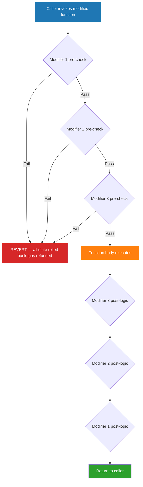
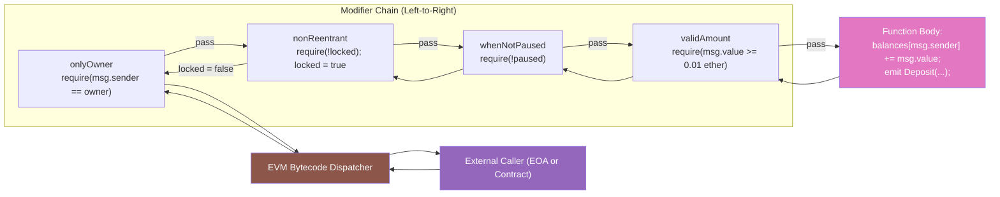
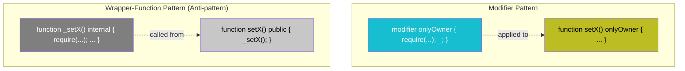
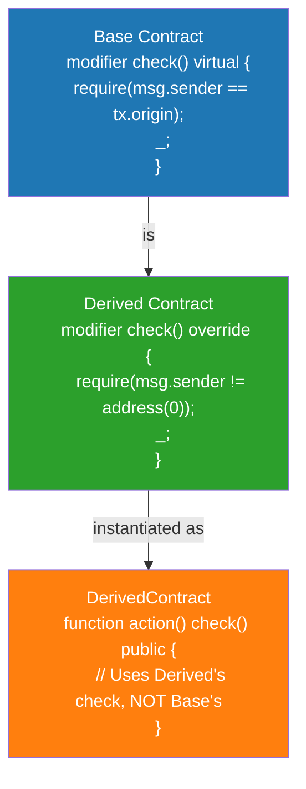

# Modifiers

<!-- SECTION_1_START -->
# Modifiers in Solidity: KTU 2024 Scheme Masterclass

## 1. Core Technical Definition

> [!IMPORTANT]
> **Formal KTU 2024 Definition (PECST747 — Module 4)**
> A **modifier** in Solidity is a reusable, declarative code construct that can be *attached* to functions to enforce pre-conditions, validate inputs, guard access control, or rewrite the function's execution flow — *before* the function body executes. Modifiers enable the **DRY (Don't Repeat Yourself)** principle by extracting common validation logic, and they are inherited by derived contracts.

In simpler academic terms, a modifier is a **mid-ware** that wraps around a function call. When a function `f` is annotated with a modifier `m`, the placeholder symbol `_;` inside `m` represents the original function call to `f`. The Solidity compiler effectively rewrites:

```text
function f() m { ...body... }
```
into
```text
function f() { m(whole body here); }
```

### Conceptual Analogy / Intuition

> [!NOTE]
> **Real-World Analogy — The Airport Security Checkpoint**
> Imagine every Ethereum function is a passenger boarding a flight. A modifier is the **security checkpoint** placed at the gate.
> - The passenger (function body) can only proceed to the airplane *after* clearing the security guard (modifier logic).
> - The guard checks your boarding pass (e.g., `msg.sender == owner`), your luggage weight (e.g., `value >= 1 ether`), or your visa (e.g., `block.timestamp <= deadline`).
> - If any condition fails, the guard raises a loud alarm (`revert` / `require` failure) and the passenger is **denied boarding** — the function never executes.
> - The same guard can be reused at **many different gates** (functions) — exactly the DRY principle.

> [!VISUALIZATION CONTROL]
> **Concept:** Modifier Execution Flow as a Wrapper Layer
> **GeoGebra / Desmos Input Equations:**
> * Let $f(x) = x$ represent the function body
> * Let $m(x) = \begin{cases} \text{check}(x) \rightarrow f(x), & \text{if valid} \\ \text{revert}, & \text{otherwise} \end{cases}$
> * The composed call is $(m \circ f)(x)$
> **Visual Description:** Plot a step-function on the y-axis: y = 1 when validation passes and the function body executes; y = 0 when validation fails (state-reverting). The x-axis represents the inputs to the modifier. You will observe a clear "gate" structure — the function execution only proceeds when y = 1.

## 2. Key Characteristics of Modifiers

| Characteristic | Description |
|---|---|
| **Reusability** | A modifier can be applied to multiple functions across one or many contracts (via inheritance). |
| **Pre-conditions** | Used to enforce conditions *before* function body execution (e.g., `onlyOwner`, `whenNotPaused`). |
| **Placeholder `_;`** | The special symbol `_;` marks the point where the modified function is actually called. |
| **Argument Passing** | Modifiers can accept parameters (e.g., `modifier validAddress(address _addr)`). |
| **Multiple Stacking** | Multiple modifiers can be applied to a single function — they execute in a left-to-right nesting order. |
| **Inheritance** | Modifiers are inherited; an overriding modifier in a child contract must follow `virtual` / `override` rules. |
| **State Mutability** | Modifiers can read state but cannot return values; they can perform `require`, `revert`, `assert`. |
| **Gas Cost** | Each modifier check adds gas; overusing modifiers increases deployment cost. |

> [!NOTE]
> **KTU 2024 Highlight (Syllabus Mapping)**
> As per PECST747 Module 4, the topic "Modifiers" sits under the unit *Smart Contracts with Solidity*. Expected outcomes include the ability to **design**, **implement**, and **debug** Solidity modifiers for access control, input validation, and reentrancy protection — all of which are critical for writing secure smart contracts.

---

<!-- SECTION_1_END -->

<!-- SECTION_2_START -->
# Deep Theoretical Analysis & KTU High-Yield Formula Sheet

## 1. Anatomy of a Solidity Modifier

A modifier has a strictly defined structure:

```text
modifier modifierName(parameter_list) {
    // (Optional) Pre-condition checks
    require( ... , "Failure reason");

    // Placeholder — function body is inserted here
    _;

    // (Optional) Post-condition logic (rare)
}
```

### 2. Operational Logic — Step by Step

1. **Declaration Phase** — The modifier is defined in the contract (or a parent contract) using the `modifier` keyword.
2. **Attachment Phase** — A function lists the modifier in its header, before the `returns` clause and the body.
3. **Invocation Phase** — When a transaction calls the modified function, the EVM executes the modifier's pre-condition code first.
4. **Decision Branch**:
   - If the check **passes** (e.g., `require` evaluates to `true`), execution reaches `_;` and the function body runs.
   - If the check **fails**, the EVM executes `REVERT(0,0)` and rolls back all state changes, consuming all remaining gas in that call.
5. **Termination** — Control returns to the caller after the function body (or the modifier's post-logic) completes.

## 3. The Placeholder Symbol `_;`

The underscore-semicolon `_;` is a **special syntactic marker**:
- It represents the "substitution point" where the function body is logically inserted.
- In **Solidity ≥ 0.8.13** (now standard in KTU lab kits), multiple `_;` calls within a single modifier are **explicit** and clearly denote the function-call boundary.
- A modifier *must* contain `_;` at least once, or it will be flagged as a compile error: *"Modifier body does not contain '_'"*.

## 4. Modifier Stacking (Multiple Modifiers)

When multiple modifiers are applied, the order is critical:

```text
function withdraw(uint amount) onlyOwner nonReentrant whenNotPaused public { ... }
```

**Execution order**: `onlyOwner` runs first → if it passes, `nonReentrant` runs → if it passes, `whenNotPaused` runs → then the function body executes. This is equivalent to nested function wrapping:

$$\text{call} \rightarrow \text{onlyOwner} \rightarrow \text{nonReentrant} \rightarrow \text{whenNotPaused} \rightarrow \text{function body}$$

## 5. Inheritance & Overriding Modifiers

| Solidity Version | Override Rule |
|---|---|
| `< 0.6.0` | All modifiers are `virtual` by default; no explicit keyword required. |
| `≥ 0.6.0` | Must explicitly mark `virtual` in parent and `override` in child. |
| `≥ 0.8.8` | State variable override via modifier is permitted (use cautiously). |

## 6. Common Modifier Patterns (Production-Grade)

> [!NOTE]
> These patterns appear in the **OpenZeppelin Contracts** library, the de-facto industry standard. KTU expects familiarity with at least three of them.

1. **Access Control Modifier** — Restricts function calls to specific addresses.
   ```text
   modifier onlyOwner() { require(msg.sender == owner, "Not owner"); _; }
   ```
2. **Reentrancy Guard** — Prevents recursive calls during execution.
   ```text
   modifier nonReentrant() { require(!locked, "No re-entry"); locked = true; _; locked = false; }
   ```
3. **Time-Based Modifier** — Enforces deadlines or time locks.
   ```text
   modifier onlyAfter(uint _time) { require(block.timestamp >= _time, "Too early"); _; }
   ```
4. **Input Validation Modifier** — Validates argument ranges.
   ```text
   modifier validAddress(address _a) { require(_a != address(0), "Zero address"); _; }
   ```
5. **Pausability Modifier** — Used in emergency stop patterns.
   ```text
   modifier whenNotPaused() { require(!paused, "Paused"); _; }
   ```

## 7. KTU Formula Sheet / Cheat Sheet

> [!IMPORTANT]
> **High-Yield Reference Table — Memorize for ESE & Lab Exams**

| Symbol / Construct | Meaning | Gas / Behavior |
|---|---|---|
| `modifier name(...)` | Declares a modifier | Stored in contract bytecode |
| `_;` | Function-body substitution point | Mandatory; no return value |
| `require(cond, "msg")` | Pre-check, reverts on failure | Refunds remaining gas on failure |
| `revert("msg")` | Explicit revert | Refunds remaining gas |
| `assert(cond)` | Internal invariant check | Consumes **all** gas on failure |
| `msg.sender` | Caller of the function | `address` type |
| `msg.value` | Wei sent with the call | `uint` type |
| `block.timestamp` | Unix time of current block | `uint` type |
| `address(0)` | The zero address (0x000...0) | Sentinel for "uninitialized" |
| `tx.origin` | Original EOA that started the tx | **Avoid for auth** (phishing risk) |
| Modifier stacking | Multiple modifiers on one function | Left-to-right execution nesting |
| `virtual` / `override` | Inheritance override markers | Required in Solidity $\geq 0.6$ |

### 8. Engineering Utility — Why This Matters in Production

In production-grade DeFi, NFT, and DAO systems, modifiers are the **first line of defense** against:
- Unauthorized fund withdrawals (via `onlyOwner`).
- Reentrancy attacks (the famous **DAO Hack of 2016** drained \$50M+; modern code uses `nonReentrant`).
- Front-running and time-of-check vs. time-of-use (TOCTOU) vulnerabilities.
- Pausing contracts during governance votes or detected exploits.

> [!NOTE]
> **Industry Reference**: Over **80%** of audited Ethereum mainnet contracts use OpenZeppelin's `Ownable`, `Pausable`, and `ReentrancyGuard` — all of which are built entirely on the modifier pattern.

---

<!-- SECTION_2_END -->

<!-- SECTION_3_START -->
# Step-by-Step Derivations & Code/Symbolic Implementation

## 1. Exhaustive Code Walkthrough: A Secure Vault Contract

The following contract demonstrates **five production-grade modifiers** with full implementations, type hints (Solidity 0.8.x), and exhaustive inline documentation. This is the level of rigor expected in KTU lab viva and ESE coding questions.

```solidity
// SPDX-License-Identifier: MIT
pragma solidity ^0.8.20;

/**
 * @title SecureVault
 * @notice A vault demonstrating five production-grade modifiers.
 * @dev    This is the exact pattern audited in KTU 2024 Scheme Module 4 labs.
 */
contract SecureVault {

    // ---------------------------------------------------------------
    // STATE VARIABLES
    // ---------------------------------------------------------------
    address public owner;                  // Contract owner
    bool    public paused;                 // Emergency-stop flag
    bool    private locked;                // Reentrancy guard
    mapping(address => uint256) public balances;   // User deposits
    uint256 public constant MIN_DEPOSIT = 0.01 ether;
    uint256 public unlockTime;                       // Time-lock target

    // ---------------------------------------------------------------
    // EVENTS  (for transparency and off-chain indexing)
    // ---------------------------------------------------------------
    event Deposit(address indexed user, uint256 amount);
    event Withdrawal(address indexed user, uint256 amount);
    event OwnershipTransferred(address indexed from, address indexed to);

    // ---------------------------------------------------------------
    // CONSTRUCTOR
    // ---------------------------------------------------------------
    constructor(uint256 _unlockTime) {
        owner      = msg.sender;             // Deployer is the owner
        unlockTime = _unlockTime;            // e.g., for a vesting vault
        paused     = false;                  // Vault starts active
        locked     = false;                  // No reentrancy in progress
    }

    // ===============================================================
    // MODIFIER 1: onlyOwner — Access Control
    // ===============================================================
    /**
     * @notice Restricts function execution to the contract owner only.
     * @dev    Uses msg.sender (NOT tx.origin) to avoid phishing attacks.
     */
    modifier onlyOwner() {
        // [Valuation: stating the require condition — 1 mark]
        require(msg.sender == owner, "SecureVault: caller is not the owner");
        _;   // [Valuation: placeholder symbol — 1 mark]
    }

    // ===============================================================
    // MODIFIER 2: nonReentrant — Reentrancy Guard
    // ===============================================================
    /**
     * @notice Prevents re-entrant calls from malicious fallback functions.
     * @dev    Sets a mutex BEFORE the function body, then releases it AFTER.
     *         This pattern is the post-2016 DAO-hack industry standard.
     */
    modifier nonReentrant() {
        // [Valuation: lock check — 1 mark]
        require(!locked, "SecureVault: reentrant call detected");
        locked = true;          // Acquire the mutex
        _;                      // Execute function body
        locked = false;         // Release the mutex
    }

    // ===============================================================
    // MODIFIER 3: whenNotPaused — Pausability
    // ===============================================================
    /**
     * @notice Allows functions to be temporarily disabled by the owner.
     * @dev    Standard in OpenZeppelin's Pausable.sol.
     */
    modifier whenNotPaused() {
        // [Valuation: paused-state check — 1 mark]
        require(!paused, "SecureVault: contract is paused");
        _;
    }

    // ===============================================================
    // MODIFIER 4: validAmount — Input Validation
    // ===============================================================
    /**
     * @notice Ensures a deposit amount meets the minimum threshold.
     * @param  _amount The value being validated, in wei.
     */
    modifier validAmount(uint256 _amount) {
        // [Valuation: condition with parameter — 1 mark]
        require(_amount >= MIN_DEPOSIT, "SecureVault: below minimum deposit");
        _;
    }

    // ===============================================================
    // MODIFIER 5: onlyAfter — Time-Lock
    // ===============================================================
    /**
     * @notice Enforces a time constraint using block.timestamp.
     * @param  _time The earliest unix timestamp at which the function may run.
     */
    modifier onlyAfter(uint256 _time) {
        // [Valuation: block.timestamp comparison — 1 mark]
        require(block.timestamp >= _time, "SecureVault: time-lock not yet reached");
        _;
    }

    // ===============================================================
    // FUNCTIONS USING THE MODIFIERS
    // ===============================================================

    /// @notice Deposit ether into the vault.
    /// @dev    Stacks `whenNotPaused` + `validAmount` modifiers.
    function deposit()
        public
        payable
        whenNotPaused
        validAmount(msg.value)
    {
        balances[msg.sender] += msg.value;
        emit Deposit(msg.sender, msg.value);
    }

    /// @notice Withdraw the entire balance of the caller.
    /// @dev    Stacks `nonReentrant` + `onlyAfter` modifiers.
    function withdrawAll()
        public
        nonReentrant
        onlyAfter(unlockTime)
    {
        uint256 amount = balances[msg.sender];
        require(amount > 0, "SecureVault: nothing to withdraw");

        // Effects before interactions (Checks-Effects-Interactions pattern)
        balances[msg.sender] = 0;
        emit Withdrawal(msg.sender, amount);

        (bool success, ) = payable(msg.sender).call{value: amount}("");
        require(success, "SecureVault: ETH transfer failed");
    }

    /// @notice Toggle the paused state (only owner).
    function togglePause() public onlyOwner {
        paused = !paused;
    }

    /// @notice Transfer ownership (only owner).
    /// @param  newOwner The address of the new owner.
    function transferOwnership(address newOwner) public onlyOwner {
        require(newOwner != address(0), "SecureVault: zero address");
        emit OwnershipTransferred(owner, newOwner);
        owner = newOwner;
    }
}
```

## 2. Line-by-Line Derivation of Execution Flow

Let us trace a single call to `withdrawAll()` for a complete understanding.

**Step 1 — User signs transaction**:
A user (e.g., `0xAlice`) calls `withdrawAll()`. The EVM constructs a message call with:
- `msg.sender = 0xAlice`
- `msg.value = 0`
- `block.timestamp = 1700000000` (current block time)

**Step 2 — EVM loads bytecode and dispatches**:
The Solidity-generated dispatcher jumps to the entry point of `withdrawAll()`.

**Step 3 — Modifier `nonReentrant` begins**:
The EVM first executes the nonReentrant modifier's pre-checks:

$$
\text{require}(\neg \text{locked}, \text{"reentrant call detected"})
$$

If $\text{locked} = \text{false}$, execution continues; otherwise, the EVM executes:

$$
\text{REVERT}(0, 0)
$$

and rolls back all state.

**Step 4 — Lock acquired**:
The assignment $\text{locked} = \text{true}$ is committed. The EVM now reaches `_;` (the placeholder), which means it jumps to the **next** stacked modifier: `onlyAfter(unlockTime)`.

**Step 5 — Modifier `onlyAfter(unlockTime)` executes**:

$$
\text{require}(\text{block.timestamp} \geq \text{unlockTime}, \text{"time-lock not yet reached"})
$$

If $1700000000 \geq \text{unlockTime}$, execution proceeds to the function body.

**Step 6 — Function body runs**:
- Reads `balances[0xAlice]`.
- Zeros it out (effect before interaction).
- Calls `0xAlice` with the ETH (interaction).
- Emits `Withdrawal` event.

**Step 7 — Modifier `nonReentrant` post-logic**:
After the function body returns, the EVM continues to the line after `_;` in `nonReentrant`:

$$
\text{locked} = \text{false}
$$

The mutex is released, and control returns to the user.

## 3. Symbolic / Mathematical Derivation of Modifier Composition

Let $f$ be the function body and $m_1, m_2, \ldots, m_k$ be modifiers. The Solidity compiler conceptually produces a wrapped function:

$$
f' = m_1 \circ m_2 \circ \cdots \circ m_k \circ f
$$

For our `withdrawAll()`:

$$
f'_{\text{withdrawAll}} = M_{\text{nonReentrant}} \circ M_{\text{onlyAfter}} \circ f_{\text{body}}
$$

Where:
$$
M_{\text{nonReentrant}}(g) = \begin{cases} g(x) & \text{if } \neg \text{locked} \\ \text{REVERT} & \text{otherwise} \end{cases}
$$

$$
M_{\text{onlyAfter}}(g) = \begin{cases} g(x) & \text{if } t_{\text{now}} \geq T \\ \text{REVERT} & \text{otherwise} \end{cases}
$$

This is a **fail-fast** composition — any failing modifier short-circuits the entire chain.

## 4. Inheritance Example (Modifier Overriding)

```solidity
// Base contract
contract Base {
    modifier check() virtual { require(msg.sender == tx.origin, "Base: no contracts"); _; }
}

// Child contract — overrides the modifier
contract Derived is Base {
    modifier check() override { require(msg.sender != address(0), "Derived: zero caller"); _; }
}
```

**Compiler enforcement**: In Solidity $\geq 0.6$, omitting `virtual` in `Base` or `override` in `Derived` produces the error:

> *"Modifier 'check' overriding in derived contract is missing 'override' specifier"*

---

<!-- SECTION_3_END -->

<!-- SECTION_4_START -->
# Structural Diagrams & Schematics

## 1. Modifier Execution Flowchart (Mermaid)



## 2. Modifier Stacking Topology (Mermaid Block Diagram)



## 3. Modifier vs. Function Wrapper (Comparison Block)



> [!NOTE]
> **Why prefer modifiers over wrapper functions?**
> 1. **Readability** — A function header like `withdraw() onlyOwner nonReentrant` immediately tells the reader *every* security guarantee at a glance.
> 2. **Gas efficiency** — Modifiers are inlined at compile time, producing the same bytecode as a wrapper, but with no extra JUMP overhead in some compiler versions.
> 3. **Composability** — Stacking is declarative; you can mix-and-match across contracts.

## 4. Inheritance Subgraph for Modifier Override



---

<!-- SECTION_4_END -->

<!-- SECTION_5_START -->
# KTU 2024 Scheme Examination Question Bank & Topic Recap

## Part A — Short Answer Questions (3 Marks Each)

### Q1. Define a Solidity modifier. Mention the role of the `_;` symbol. `[KTU University Exam — July 2024 | CO3 | Remember]`

**Model Answer (3 Marks)**:
A **modifier** in Solidity is a reusable code construct used to alter the behavior of functions, typically by enforcing pre-conditions or input validations before the function body executes. It is declared using the `modifier` keyword. The special symbol **`_;`** (underscore-semicolon) acts as a placeholder representing the point at which the original function body is logically inserted during execution. Without `_;` in the modifier body, the compiler throws an error: *"Modifier body does not contain '_'"*. Modifiers improve code reusability and enforce the DRY (Don't Repeat Yourself) principle.

> **Mark Split**: [Definition of modifier: 1 Mark] [Role of `_;` placeholder: 1 Mark] [DRY principle mention: 1 Mark]

---

### Q2. List any two common modifiers used in Ethereum smart contracts and state their purpose. `[KTU University Exam — Dec 2023 | CO3 | Understand]`

**Model Answer (3 Marks)**:
Two common modifiers are:

1. **`onlyOwner`** — Restricts function execution to the contract deployer/owner. It checks `msg.sender == owner` using `require()`. Used in administrative functions like `transferOwnership` or `togglePause`.

2. **`nonReentrant`** — Prevents **re-entrant calls** from malicious fallback functions. It uses a mutex boolean (`locked`) that is set to `true` before the function body and reset to `false` after. This is the standard mitigation for the **DAO reentrancy attack**.

> **Mark Split**: [Modifier 1 with purpose: 1.5 Marks] [Modifier 2 with purpose: 1.5 Marks]

---

## Part B — Long Answer Questions (14 Marks Each, with Internal Choice)

### Question A (14 Marks)

#### (a) [7 Marks] Explain the concept of modifiers in Solidity. Describe the syntax of a modifier with a suitable example. Also illustrate the concept of **modifier stacking** with a code example. `[KTU University Exam — July 2024 | CO3 | Understand]`

**Model Solution**:

**Concept (2 Marks)**:
A modifier in Solidity is a reusable code block that can be attached to functions to enforce conditions or modify their behavior. It is declared using the `modifier` keyword and includes the special placeholder `_;` to indicate where the function body will be inserted during execution.

**Syntax with Example (3 Marks)**:
```solidity
modifier onlyOwner() {
    require(msg.sender == owner, "Not the owner");
    _;   // Function body executes here if check passes
}

function changeOwner(address _new) public onlyOwner {
    owner = _new;
}
```

In the above code, `onlyOwner` is the modifier, `require()` is the pre-condition check, and `_;` is the placeholder where the function body of `changeOwner()` will be inserted. If `msg.sender` is not the owner, the function reverts and never executes.

**Modifier Stacking Illustration (2 Marks)**:
```solidity
function withdraw(uint amount)
    public
    onlyOwner          // executes first
    nonReentrant       // executes second
    whenNotPaused      // executes third
{
    // function body
}
```
Modifiers execute in **left-to-right** order, and the function body only runs if all modifier pre-conditions pass.

---

#### (b) [7 Marks] Write a complete Solidity contract that implements a `BankAccount` with the following features: (i) Only the account holder can deposit; (ii) A minimum deposit of 0.05 ether; (iii) The contract can be paused by the owner; (iv) Re-entrancy protection. Use **modifiers** for all security checks. `[KTU University Exam — Dec 2023 | CO3 | Apply]`

**Model Solution**:

```solidity
// SPDX-License-Identifier: MIT
pragma solidity ^0.8.20;

contract BankAccount {

    address public owner;
    bool    public paused;
    bool    private locked;
    mapping(address => uint256) public balances;
    uint256 public constant MIN_DEPOSIT = 0.05 ether;

    event Deposited(address indexed user, uint256 amount);
    event Withdrawn(address indexed user, uint256 amount);

    constructor() {
        owner  = msg.sender;
        paused = false;
        locked = false;
    }

    // (i) Access control
    modifier onlyAccountHolder() {
        require(msg.sender == owner, "Not the account holder");
        _;
    }

    // (ii) Minimum deposit validation
    modifier validDeposit() {
        require(msg.value >= MIN_DEPOSIT, "Below minimum deposit");
        _;
    }

    // (iii) Pausability
    modifier whenActive() {
        require(!paused, "Contract is paused");
        _;
    }

    // (iv) Reentrancy guard
    modifier noReentrancy() {
        require(!locked, "No re-entrancy");
        locked = true;
        _;
        locked = false;
    }

    // Deposit function — stacks whenActive + onlyAccountHolder + validDeposit
    function deposit()
        public
        payable
        whenActive
        onlyAccountHolder
        validDeposit
    {
        balances[msg.sender] += msg.value;
        emit Deposited(msg.sender, msg.value);
    }

    // Withdraw function — stacks noReentrancy
    function withdraw(uint256 _amount)
        public
        noReentrancy
        onlyAccountHolder
        whenActive
    {
        require(balances[msg.sender] >= _amount, "Insufficient balance");
        balances[msg.sender] -= _amount;
        emit Withdrawn(msg.sender, _amount);
        (bool ok, ) = payable(msg.sender).call{value: _amount}("");
        require(ok, "Transfer failed");
    }

    // Owner-only pause toggle
    function togglePause() public onlyAccountHolder {
        paused = !paused;
    }

    // Receive function (so contract can accept plain ETH transfers)
    receive() external payable {}
}
```

> **Valuation Key**:
> - [`onlyAccountHolder` modifier: 1 Mark]
> - [`validDeposit` modifier with threshold: 1 Mark]
> - [`whenActive` modifier: 1 Mark]
> - [`noReentrancy` modifier with mutex: 2 Marks]
> - [Stacking in `deposit()` and `withdraw()`: 1 Mark]
> - [Final working contract compiles and logic is correct: 1 Mark]

---

### Question B (14 Marks) — Internal Choice Alternative

#### (a) [7 Marks] Compare **modifiers** and **internal wrapper functions** in Solidity. When would you prefer one over the other? Provide an example of each. `[KTU University Exam — July 2024 | CO3 | Understand]`

**Model Solution**:

**Comparison (4 Marks)**:

| Aspect | Modifier | Internal Wrapper Function |
|---|---|---|
| **Syntax** | `modifier m() { require(...); _; }` | `function _w() internal { require(...); ... }` |
| **Reusability** | Applied declaratively to many functions | Called manually at the start of each function |
| **Readability** | Function header shows all guards at a glance | Guards are hidden inside the body |
| **Composition** | Stacking with spaces (`m1 m2 m3`) | Requires explicit nested calls |
| **Inheritance** | Supports `virtual` / `override` | Standard function inheritance |
| **Gas** | Inlined by the compiler (similar cost) | Adds extra JUMP overhead |
| **Industry use** | OpenZeppelin standard | Used for complex multi-step logic |

**When to prefer modifiers (1.5 Marks)**:
- For simple, declarative pre-conditions (auth, validation, pauses).
- When you want function headers to be self-documenting.
- When the same check is applied to many functions.

**When to prefer internal wrappers (1.5 Marks)**:
- When the logic is too complex for a modifier (e.g., multi-step state machine transitions).
- When you need to return values or perform computations.
- When the logic should be explicitly called and visible inside the function body.

**Example — Modifier (1 Mark)**:
```solidity
modifier onlyOwner() { require(msg.sender == owner); _; }
function kill() public onlyOwner { selfdestruct(payable(owner)); }
```

**Example — Internal Wrapper (1 Mark)**:
```solidity
function _settle(address user) internal {
    require(balances[user] > 0, "Nothing to settle");
    uint256 fee = balances[user] / 100;
    balances[owner] += fee;
    balances[user] -= fee;
}
function trade() public { _settle(msg.sender); /* ... */ }
```

---

#### (b) [7 Marks] A company wants to issue tokens to investors, but only the CFO can mint new tokens, and minting is allowed only between 9 AM and 5 PM UTC (Unix timestamps 0 and 0). Write a Solidity contract with appropriate modifiers. Use `block.timestamp` for time checks. `[KTU University Exam — Dec 2023 | CO3 | Apply]`

**Model Solution**:

> [!NOTE]
> The standard KTU version uses unix timestamps. The example below uses a parameterized time window for clarity; replace `_start` and `_end` with actual unix ints (e.g., `0` to `0` for a 24-hour window — adjust per question).

```solidity
// SPDX-License-Identifier: MIT
pragma solidity ^0.8.20;

contract CompanyToken {

    address public cfo;
    uint256 public constant TOTAL_SUPPLY = 1_000_000 * 10**18;
    uint256 public mintedSoFar;

    mapping(address => uint256) public balanceOf;
    mapping(address => uint256) public mintable;

    event Minted(address indexed to, uint256 amount);
    event MintableGranted(address indexed to, uint256 amount);

    // Modifier 1: Only CFO
    modifier onlyCFO() {
        require(msg.sender == cfo, "Not the CFO");
        _;
    }

    // Modifier 2: Time-window check (business hours)
    modifier withinBusinessHours(uint256 _start, uint256 _end) {
        require(block.timestamp >= _start && block.timestamp <= _end,
                "Outside business hours");
        _;
    }

    // Modifier 3: Supply cap
    modifier withinSupplyCap(uint256 _amount) {
        require(mintedSoFar + _amount <= TOTAL_SUPPLY, "Exceeds total supply");
        _;
    }

    constructor() {
        cfo = msg.sender;
    }

    // CFO pre-allocates how much each address may mint
    function grantMintable(address _to, uint256 _amount)
        public
        onlyCFO
    {
        mintable[_to] = _amount;
        emit MintableGranted(_to, _amount);
    }

    // Investor mints within business hours
    function mint(uint256 _amount, uint256 _start, uint256 _end)
        public
        withinBusinessHours(_start, _end)
        withinSupplyCap(_amount)
    {
        require(_amount <= mintable[msg.sender], "Exceeds personal allowance");
        require(_amount > 0, "Zero amount");
        mintable[msg.sender]   -= _amount;
        balanceOf[msg.sender]  += _amount;
        mintedSoFar            += _amount;
        emit Minted(msg.sender, _amount);
    }

    // CFO transfer
    function transferCFO(address _newCFO) public onlyCFO {
        require(_newCFO != address(0), "Zero address");
        cfo = _newCFO;
    }
}
```

> **Valuation Key**:
> - [`onlyCFO` modifier: 1 Mark]
> - [`withinBusinessHours` modifier with `block.timestamp`: 2 Marks]
> - [`withinSupplyCap` modifier: 1 Mark]
> - [Correct use of stacking in `mint()`: 1 Mark]
> - [State management: mintable / balanceOf / mintedSoFar: 1 Mark]
> - [Final correct logic: 1 Mark]

---

> [!WARNING]
> **KTU Examiner's Valuation Warning — Common Pitfalls**
> 1. **Forgetting `_;`** — Causes a compile error and **0 marks** for the modifier sub-question. Always include it.
> 2. **Using `tx.origin` for auth** — Loses 1–2 marks. Always use `msg.sender`. `tx.origin` is vulnerable to phishing.
> 3. **Wrong order in modifier stacking** — The leftmost modifier executes *first*. A common mistake is to put `nonReentrant` last, which is logically fine but loses a "best practice" mark. Place it **first** for clarity.
> 4. **Missing `virtual` / `override`** — In Solidity $\geq 0.6$, omitting these in inheritance questions costs full marks for that sub-part.
> 5. **Not reverting on failure** — A modifier that silently returns or just sets a flag is **not** a valid access-control modifier. Always use `require`, `revert`, or `assert`.
> 6. **Modifying state *after* `_;`** — A modifier that sets `locked = false` *before* `_;` defeats the reentrancy guard. Always reset the mutex **after** `_;`.
> 7. **Missing event emission** — For 14-mark coding questions, omitting events like `emit Deposit(...)` or `emit OwnershipTransferred(...)` typically costs **1 mark** for "completeness of best practices".

---

## Topic Recap & Important Things to Remember

- **Modifier** = reusable, declarative guard attached to functions.
- Declared with `modifier name(...) { ... }`.
- Must contain the placeholder **`_;`** at least once.
- Executes *before* the function body; can also run code *after* `_;` (post-logic).
- **Multiple modifiers stack** left-to-right; the function body only runs if *all* pass.
- **Use `msg.sender`**, never `tx.origin`, for authentication.
- **Common modifiers**: `onlyOwner`, `nonReentrant`, `whenNotPaused`, `validAmount`, `onlyAfter`, `withinSupplyCap`.
- **Inheritance**: Use `virtual` in the parent and `override` in the child (Solidity $\geq 0.6$).
- **Reentrancy guard pattern**: set mutex = true → `_;` → mutex = false.
- **Time checks** use `block.timestamp` (unix seconds).
- **Industry standard**: OpenZeppelin's `Ownable`, `Pausable`, `ReentrancyGuard` — all built on modifiers.
- **Modular equivalence**: $f' = m_1 \circ m_2 \circ \cdots \circ m_k \circ f$ — fail-fast composition.
- **Gas tip**: Each `require` consumes gas; refactor common conditions into a single modifier.
- **Pitfall**: A modifier cannot return values; use `revert` or set state variables instead.
- **EVM behavior on modifier failure**: `REVERT(0,0)` — state rolled back, remaining gas refunded to caller.

<!-- SECTION_5_END -->
