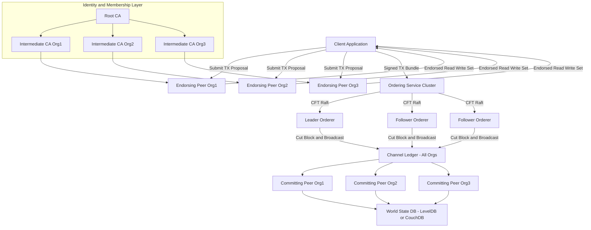
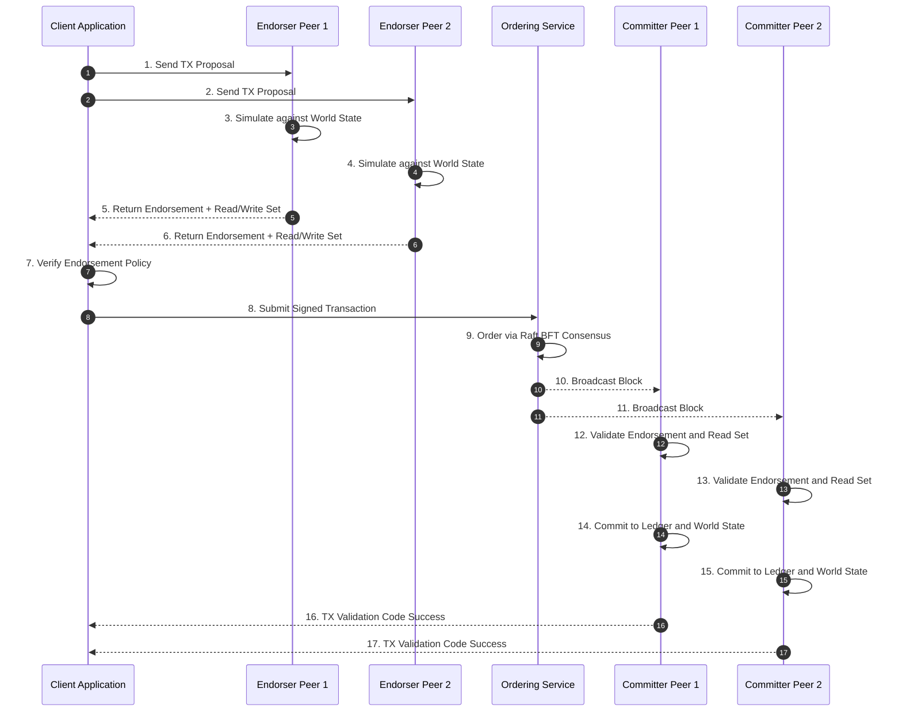
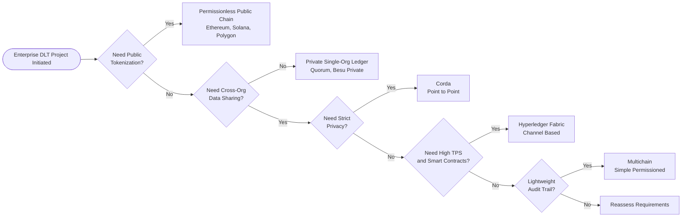
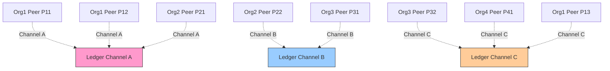
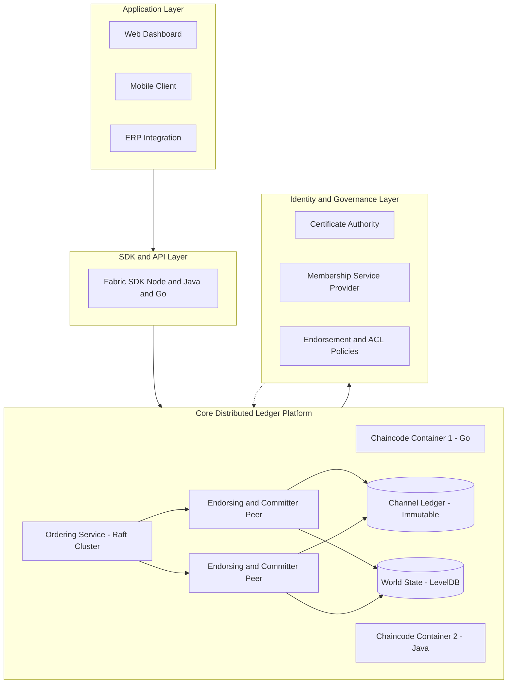

# Permissioned Blockchains

<!-- SECTION_1_START -->
# Permissioned Blockchains — Core Technical Definition & Intuition

## 1.1 Formal Academic Definition (KTU 2024 Syllabus Terminology)

A **Permissioned Blockchain** (also termed a *Private* or *Consortium Blockchain*) is a distributed ledger technology (DLT) in which every participating node is **cryptographically identified, authenticated, and authorized** by a central authority, governance body, or consortium of known entities before being allowed to read, submit, or validate transactions on the network.

Unlike its public counterpart, participation is **not anonymous and not open**; the write-access set is restricted to a closed, vetted group.

> [!IMPORTANT]
> **KTU 2024 Module Highlight (PECST747 — Module 4):**
> Permissioned blockchains represent the **enterprise-grade** implementation of DLT, addressing the scalability, privacy, and regulatory-compliance limitations inherent to public chains like Bitcoin and Ethereum Mainnet.

> [!NOTE]
> **Key Identity Markers (Syllabus Glossary):**
> * **Permissioned Ledger** → Access gated by identity.
> * **Consortium Ledger** → Semi-decentralized; governed by a pre-selected group of organizations (e.g., the R3 Corda banking consortium).
> * **Private Ledger** → Write access is restricted to a single organization (e.g., Hyperledger Besu inside a corporate intranet).

---

## 1.2 Conceptual Analogy — The "Private Corporate Intranet" Metaphor

Think of a **public blockchain** as a *public city square*: anyone can walk in, shout a message, and read every message shouted by others. A **permissioned blockchain**, on the other hand, is like a *secure corporate boardroom*:

| Feature | Public City Square (Public Chain) | Corporate Boardroom (Permissioned Chain) |
| :--- | :--- | :--- |
| Entry | Anyone can enter | Only employees with a **security badge (X.509 certificate)** |
| Speaking Rights | Anyone can shout | Only pre-approved board members |
| Reading | Transparent to all | May be restricted to specific rooms (**channels**) |
| Order Keeper | Whoever is fastest (PoW / PoS) | A pre-selected **Secretary (Ordering Service / Raft leader)** |
| Dispute Resolution | Code (smart contract) is law | Code **+ governance contract** is law |

> [!TIP]
> **Intuition Check:** The trade-off in a permissioned chain is *trustlessness for privacy*. You give up anonymous openness in exchange for **transaction throughput (TPS)**, **regulatory compliance**, and **confidentiality of business logic**.

---

## 1.3 Physical Constants and Standard Metrics

| Metric | Public Chain (Ethereum) | Permissioned Chain (Hyperledger Fabric) |
| :--- | :--- | :--- |
| Throughput (TPS) | $\approx 15$–$30$ | $\approx 3{,}000$–$20{,}000$ |
| Block Finality | Probabilistic ($\approx 12$ confirmations) | Deterministic (immediate) |
| Identity System | Pseudonymous addresses | **X.509 / PKI certificates** |
| Consensus Mechanism | PoW / PoS (resource-intensive) | **Crash Fault Tolerant (CFT)** or **Byzantine Fault Tolerant (BFT)** |
| Energy Footprint | High | **Low** |

> [!VISUALIZATION CONTROL]
> **Concept:** Throughput vs. Decentralization Trade-off Curve
> **GeoGebra / Desmos Input Equations:**
> * `f(x) = 30000 / (1 + 50 * x)` (Permissioned Chain TPS profile)
> * `g(x) = 25 / (1 + 0.02 * x)` (Public Chain TPS profile)
> * `x` = Number of permissioned validators (for $x \in [0, 100]$)
> **Visual Description:** A hyperbolic decay curve where the **Permissioned Chain** begins very high ($\approx 15{,}000$ TPS) and decays, while the **Public Chain** stays nearly flat at the bottom. They cross asymptotically as validator count grows.

---

## 1.4 Why Permissioned Blockchains Exist — The Core Engineering Problem

Public blockchains suffer from three critical enterprise-level deficiencies:

1. **Identity Vacuum:** Enterprises require **KYC (Know Your Customer)** and **AML (Anti-Money Laundering)** compliance, which is impossible on anonymous public chains.
2. **Throughput Ceiling:** Public chains cannot handle the **millions of daily transactions** required for global trade finance or healthcare records.
3. **Data Confidentiality:** Smart contract logic and transaction payloads are visible to all — incompatible with corporate trade secrets.

Permissioned blockchains solve these via **architectural separation of concerns**: *identity, consensus, and execution* are decoupled into modular components, unlike monolithic public chains.

<!-- SECTION_1_END -->

<!-- SECTION_2_START -->
# Deep Theoretical Analysis & KTU High-Yield Formula Sheet

## 2.1 Architectural Pillars of a Permissioned Blockchain

The architecture is formally described as a **layered, identity-centric state machine**. The four core pillars are:

### Pillar 1: Identity & Membership Service Provider (MSP)
* Every participant (peer, orderer, client) is issued a **long-lived X.509 digital certificate**.
* The **Membership Service Provider (MSP)** defines the rules — who is trusted, under which **Organization (Org)**, and with what **roles** (admin, peer, client, orderer).
* **Mathematical Foundation:** Trust is established via a chain of **Public Key Infrastructure (PKI)** trust rooted at a Certificate Authority (CA).
  $$\text{Trust}(N_i) = \text{Verify}_{CA}(\text{Cert}_{N_i}) \land \text{Verify}_{CRL}(N_i) \land \text{PolicyMSP}(Org_i, Role_i)$$

### Pillar 2: Channel Architecture (Privacy Layer)
* A **Channel** is a private sub-network of communication between specific member organizations.
* Each channel has its **own ledger**, meaning data is partitioned and isolated — Org A and Org B can transact on Channel-1 while Org A and Org C use Channel-2.
* **Cardinality Rule:** A peer can join multiple channels, but a channel's data is visible only to its members.

### Pillar 3: Ordering Service (Consensus Layer)
* Transactions are not added directly by peers; they are first routed to an **Ordering Service Node (OSN)**.
* The orderer establishes a **total order** of transactions and packages them into **blocks**.
* Consensus algorithms used:
  * **Solo (Kafka-style / Raft):** Crash Fault Tolerant (CFT). Tolerates $f$ crashes where $f < \frac{N}{2}$ (e.g., Raft with 3 nodes tolerates 1 crash).
  * **BFT-Smart / SmartBFT:** Byzantine Fault Tolerant. Tolerates $f$ byzantine faults where $f < \frac{N}{3}$ (e.g., 4 nodes tolerate 1 byzantine).

### Pillar 4: Chaincode (Execution Layer)
* Smart contracts in Hyperledger Fabric are called **Chaincode** (written in Go, Java, or Node.js).
* Chaincode runs inside a **Docker container** on endorsing peers, isolated from the host OS for security.
* **Endorsement Policy:** A configurable rule specifying which organizations must sign a transaction before it is committed. For example, `AND('Org1.member', 'Org2.member')` requires both.

---

## 2.2 The Transaction Flow (Endorse–Order–Commit Lifecycle)

This is the **highest-yield section** for KTU 14-mark questions. The lifecycle has six distinct phases:

1. **Proposal Submission:** Client $C$ constructs a transaction $T$ targeting chaincode $CC$ and sends it to endorsing peers $E_1, E_2, \dots, E_k$ per the endorsement policy $P$.
2. **Simulation & Endorsement:** Each $E_i$ executes $CC$ against the **current world state** $S_{ledger}$, producing a *Read-Write set* $(R_i, W_i)$ and a cryptographic signature.
3. **Endorsement Assembly:** Client $C$ collects all endorsements and verifies signatures against the policy $P$. If satisfied, it sends the transaction to the **Ordering Service**.
4. **Ordering & Block Cutting:** The orderer batches transactions into a **block** $B = \{T_1, T_2, \dots, T_n\}$ using a CFT or BFT consensus protocol, establishing a strict total order.
5. **Validation & Commit:** Every peer in the channel receives $B$, re-validates each transaction against the **endorsement policy** and checks for **Read-Set conflicts** (optimistic concurrency control).
6. **State Update:** The new block is appended to the ledger $L$, and the world state DB is updated: $S_{new} = S_{old} \cup \{ \text{committed writes} \}$.

---

## 2.3 Consensus in Permissioned Networks — The Mathematical Formulation

The choice between CFT and BFT is governed by the **failure model assumption**.

| Consensus Family | Failure Model | Fault Tolerance Formula | Use Case |
| :--- | :--- | :--- | :--- |
| **CFT (Raft, Kafka)** | Crash-only | $f < \frac{N}{2}$ | Trusted cloud environment, e.g., AWS clusters |
| **BFT (PBFT, SmartBFT)** | Arbitrary / malicious | $f < \frac{N}{3}$ | Untrusted validators, cross-org consortia |

For **PBFT (Practical Byzantine Fault Tolerance)**, the safety condition for a network of $N$ validators is:
$$N \geq 3f + 1$$
where $f$ is the maximum number of byzantine (malicious) nodes. The system remains consistent as long as fewer than $\frac{N-1}{3}$ nodes act maliciously.

> [!IMPORTANT]
> **KTU Mnemonic for Fault Tolerance:**
> * **Crash = 2** (divide by 2)
> * **Byzantine = 3** (divide by 3)
> This is the *single most-asked* comparison in KTU Module 4.

---

## 2.4 KTU Formula Sheet / Cheat Sheet

| \# | Concept | Formula / Definition | Variable Meaning | Unit / Type |
| :-: | :--- | :--- | :--- | :--- |
| 1 | CFT Fault Bound | $f_{cft} = \left\lfloor \frac{N-1}{2} \right\rfloor$ | $N$ = number of orderers | Integer |
| 2 | BFT Fault Bound | $f_{bft} = \left\lfloor \frac{N-1}{3} \right\rfloor$ | $N$ = number of validators | Integer |
| 3 | PBFT Safety | $N \geq 3f + 1$ | $N$ = total, $f$ = byzantine | Boolean condition |
| 4 | Block Latency | $T_{block} = T_{end} + T_{ord} + T_{val}$ | Endorse + Order + Validate | Seconds |
| 5 | Throughput (TPS) | $TPS = \frac{\vert T \vert}{T_{block}}$ | $\vert T \vert$ = tx count per block | Transactions / sec |
| 6 | Endorsement Check | $\text{Endorse}(T) = \bigwedge_{i=1}^{k} \text{VerifySig}(E_i, T)$ | All required peers must sign | Boolean |
| 7 | Read-Set Conflict | $\exists \, T_j \in B : R_i(T) \cap W_j(T) \neq \emptyset$ | Detected in validation phase | Set operation |
| 8 | Channel Cardinality | $\binom{N_{orgs}}{2} \leq \text{Channels}$ | $N_{orgs}$ = organizations | Count |

---

## 2.5 Real-World Engineering Utility

Permissioned blockchains are the **dominant DLT architecture in production today**. Real-world deployment sectors:

* **Trade Finance (Marco Polo Network, we.trade):** Cross-bank letters of credit, reducing settlement from 10 days to 4 hours.
* **Healthcare (MediLedger):** Pharmaceutical supply chain — preventing counterfeit drugs via serial number tracking.
* **Food Safety (IBM Food Trust):** Walmart's mango traceability — from farm to shelf in **2.2 seconds** (was 7 days).
* **Digital Identity (Sovrin Foundation):** Self-sovereign identity built on Hyperledger Indy.
* **Settlement Systems (Project Ubin, MAS Singapore):** Central bank digital currency (CBDC) pilots.
* **Energy Trading (Brooklyn Microgrid):** Peer-to-peer solar energy trading on a permissioned ledger.

<!-- SECTION_2_END -->

<!-- SECTION_3_START -->
# Step-by-Step Derivations, Code, and Comparative Analysis

## 3.1 Derivation: Minimum Number of Orderers for BFT Safety

**Problem (KTU-typical 7-mark derivation):** A permissioned blockchain consortium has 7 orderer nodes. Apply the PBFT safety rule to find the maximum number of byzantine orderers that can be tolerated.

**Step 1 — State the governing inequality.**
The PBFT safety condition for a byzantine consensus protocol is:
$$N \geq 3f + 1$$

**Step 2 — Substitute the known variable.**
Given $N = 7$, we have:
$$7 \geq 3f + 1$$

**Step 3 — Isolate the variable $f$.**
$$\begin{aligned}
7 - 1 &\geq 3f \\
6 &\geq 3f \\
f &\leq \frac{6}{3} \\
f &\leq 2
\end{aligned}$$

**Step 4 — Conclude with interpretation.**
$$\boxed{f_{max} = 2}$$
**Interpretation:** A consortium of 7 orderers can tolerate up to **2 byzantine (malicious or arbitrary-fault) orderers** while still maintaining safety and liveness. This is the standard configuration for SmartBFT-based Hyperledger Fabric networks.

---

## 3.2 Derivation: CFT vs. BFT Fault Tolerance Comparison

**Problem:** A bank wishes to deploy a permissioned blockchain with 5 orderer nodes. Compute the maximum fault tolerance under (a) Crash Fault Tolerant (CFT) Raft consensus, and (b) Byzantine Fault Tolerant (BFT) PBFT.

**Part (a) — CFT (Raft):**
The CFT fault bound is:
$$f_{cft} = \left\lfloor \frac{N-1}{2} \right\rfloor$$
Substitute $N = 5$:
$$\begin{aligned}
f_{cft} &= \left\lfloor \frac{5-1}{2} \right\rfloor \\
f_{cft} &= \left\lfloor \frac{4}{2} \right\rfloor \\
f_{cft} &= \left\lfloor 2.0 \right\rfloor \\
f_{cft} &= 2
\end{aligned}$$

**Part (b) — BFT (PBFT):**
The BFT fault bound is:
$$f_{bft} = \left\lfloor \frac{N-1}{3} \right\rfloor$$
Substitute $N = 5$:
$$\begin{aligned}
f_{bft} &= \left\lfloor \frac{5-1}{3} \right\rfloor \\
f_{bft} &= \left\lfloor \frac{4}{3} \right\rfloor \\
f_{bft} &= \left\lfloor 1.333 \right\rfloor \\
f_{bft} &= 1
\end{aligned}$$

**Step 3 — Comparative Analysis Table.**

| Consensus | $N$ | $f_{max}$ | Tolerance Class | Suitable For |
| :--- | :---: | :---: | :--- | :--- |
| CFT (Raft) | 5 | **2** | Crash faults | Same data-center deployments |
| BFT (PBFT) | 5 | **1** | Arbitrary / malicious faults | Cross-organization, untrusted nodes |

> [!NOTE]
> **Key Takeaway:** Raft tolerates *more* crashes, but only crashes. PBFT tolerates *malicious behavior*, but at a higher cost — you need 3× as many nodes for the same fault tolerance.

---

## 3.3 Hyperledger Fabric Chaincode Implementation (Python-style Reference + Go Sample)

> [!NOTE]
> Although Fabric officially supports Go, Java, and Node.js, a **Pythonic pseudo-specification** of an asset-transfer chaincode is shown below for conceptual understanding. The official Go implementation follows.

### 3.3.1 Conceptual Python Specification (Asset Transfer)

```python
"""
Permissioned Blockchain Chaincode Spec: AssetTransfer
- Each asset is identified by a unique key.
- Identity is verified by MSP before each transaction.
"""

from typing import Dict, Optional
from dataclasses import dataclass
import logging

# Initialize structured logging for chaincode operations
logging.basicConfig(level=logging.INFO, format='%(asctime)s [%(levelname)s] %(message)s')
logger = logging.getLogger("AssetTransfer")


@dataclass
class Asset:
    key: str
    owner_msp_id: str   # MSP ID = the verified identity of the owner
    value: float
    color: str


class AssetTransferChaincode:
    """
    Chaincode for managing asset ownership on a permissioned ledger.
    All state-mutating operations require a valid X.509 identity from MSP.
    """

    def __init__(self) -> None:
        # World state: in production, this is backed by LevelDB / CouchDB
        self._world_state: Dict[str, Asset] = {}

    # ------------------------------------------------------------------
    # Query: read-only operation, does not require endorsement signature
    # ------------------------------------------------------------------
    def read_asset(self, ctx: 'Context', key: str) -> Optional[Asset]:
        logger.info(f"READ asset key={key} by client={ctx.client_msp_id}")
        if key not in self._world_state:
            logger.warning(f"Asset {key} not found in world state.")
            return None
        return self._world_state[key]

    # ------------------------------------------------------------------
    # Create: state-mutating, requires endorsement policy satisfaction
    # ------------------------------------------------------------------
    def create_asset(self, ctx: 'Context', key: str, value: float, color: str) -> str:
        logger.info(f"CREATE asset key={key} value={value} by client={ctx.client_msp_id}")

        # ----- Step 1: Identity verification (MSP check) -----
        if ctx.client_msp_id is None or ctx.client_msp_id.strip() == "":
            raise PermissionError("Client MSP ID missing. Identity verification failed.")

        # ----- Step 2: Authorization (Org membership) -----
        if ctx.client_msp_id not in ctx.endorsement_policy_msp_ids:
            raise PermissionError(
                f"Client {ctx.client_msp_id} is NOT in the endorsement policy allow-list."
            )

        # ----- Step 3: Idempotency check (asset key uniqueness) -----
        if key in self._world_state:
            raise ValueError(f"Asset {key} already exists. Creation aborted.")

        # ----- Step 4: Persist to world state -----
        self._world_state[key] = Asset(
            key=key,
            owner_msp_id=ctx.client_msp_id,
            value=value,
            color=color
        )
        logger.info(f"Asset {key} successfully created and committed.")
        return f"Asset {key} created by {ctx.client_msp_id}"

    # ------------------------------------------------------------------
    # Transfer: requires double-signature endorsement in real Fabric
    # ------------------------------------------------------------------
    def transfer_asset(self, ctx: 'Context', key: str, new_owner_msp_id: str) -> str:
        logger.info(
            f"TRANSFER asset={key} from={ctx.client_msp_id} to={new_owner_msp_id}"
        )

        # Step 1: MSP verification of both parties
        if new_owner_msp_id not in ctx.endorsement_policy_msp_ids:
            raise PermissionError(f"New owner {new_owner_msp_id} not in consortium.")

        # Step 2: Existence check
        if key not in self._world_state:
            raise KeyError(f"Asset {key} does not exist.")

        # Step 3: Current-ownership check (rule: only owner can transfer)
        asset = self._world_state[key]
        if asset.owner_msp_id != ctx.client_msp_id:
            raise PermissionError(
                f"Client {ctx.client_msp_id} is NOT the current owner of {key}."
            )

        # Step 4: Atomic state update
        asset.owner_msp_id = new_owner_msp_id
        self._world_state[key] = asset
        logger.info(f"Asset {key} transferred to {new_owner_msp_id}.")
        return f"Asset {key} ownership transferred."


# ----------------------------------------------------------------------
# Stub: Context object populated by the Fabric SDK before invoking CC
# ----------------------------------------------------------------------
@dataclass
class Context:
    client_msp_id: str
    endorsement_policy_msp_ids: list  # e.g., ['Org1MSP', 'Org2MSP']
```

### 3.3.2 Real Go Chaincode (Hyperledger Fabric Official Convention)

```go
// AssetTransfer.go — official Hyperledger Fabric chaincode
package main

import (
	"encoding/json"
	"fmt"
	"log"

	"github.com/hyperledger/fabric-contract-api-go/contractapi"
)

// Asset is the on-ledger state object
type Asset struct {
	DealerID  string  `json:"dealerId"`
	MSP       string  `json:"msp"`
	Color     string  `json:"color"`
	Value     float64 `json:"value"`
	OwnerMSP  string  `json:"ownerMsp"`
}

// AssetTransferContract implements the chaincode interface
type AssetTransferContract struct {
	contractapi.Contract
}

// CreateAsset is invoked by an endorsed transaction
func (c *AssetTransferContract) CreateAsset(ctx contractapi.TransactionContextInterface,
	id string, dealer string, msp string, color string, value float64) error {

	// ----- Step 1: Identity check (mandatory) -----
	clientMSP, err := ctx.GetClientIdentity().GetMSPID()
	if err != nil {
		return fmt.Errorf("failed to get client MSP: %v", err)
	}
	if clientMSP == "" {
		return fmt.Errorf("client identity missing — permission denied")
	}

	// ----- Step 2: Idempotency check -----
	exists, err := ctx.GetStub().GetState(id)
	if err != nil {
		return fmt.Errorf("ledger read error: %v", err)
	}
	if exists != nil {
		return fmt.Errorf("asset %s already exists", id)
	}

	// ----- Step 3: Persist state -----
	asset := Asset{
		DealerID: dealer, MSP: msp, Color: color, Value: value, OwnerMSP: clientMSP,
	}
	bytes, _ := json.Marshal(asset)
	if err := ctx.GetStub().PutState(id, bytes); err != nil {
		return fmt.Errorf("failed to put state: %v", err)
	}
	log.Printf("Asset %s created by MSP %s", id, clientMSP)
	return nil
}

func main() {
	cc, err := contractapi.NewChaincode(&AssetTransferContract{})
	if err != nil {
		log.Panicf("chaincode init error: %v", err)
	}
	if err := cc.Start(); err != nil {
		log.Panicf("chaincode start error: %v", err)
	}
}
```

> [!IMPORTANT]
> **Valuation Tip:** Note the explicit call to `ctx.GetClientIdentity().GetMSPID()` in the Go chaincode. In KTU 14-mark theory questions, students are expected to **state this identity-verification step explicitly** when describing permissioned chaincode execution.

---

## 3.4 Comparative Engineering Matrix: Permissioned vs Permissionless vs Hybrid

| Parameter | Permissioned (Fabric) | Permissionless (Ethereum) | Hybrid (Polkadot / Cosmos) |
| :--- | :--- | :--- | :--- |
| Identity | **X.509 / PKI** | Pseudonymous (Public Key) | Public key + optional KYC parachains |
| Access | Gated, invitation-based | Open, permissionless | Open at relay, gated at parachain |
| Throughput | $\approx 3{,}000$–$20{,}000$ TPS | $\approx 15$–$30$ TPS | $\approx 1{,}000$ TPS (parachain) |
| Consensus | CFT / BFT (Raft, PBFT) | PoW / PoS | Nominated PoS + BFT |
| Finality | Deterministic (1 block) | Probabilistic (12+ blocks) | Deterministic (GRANDPA) |
| Data Visibility | Channel-based, encrypted | Fully transparent | Selective (parachain-controlled) |
| Smart Contract | Chaincode (Go, Java) | Solidity, Vyper | Ink!, Solidity via bridges |
| Energy Use | Low | High (PoW) | Moderate |
| Regulatory Fit | **Excellent** | Poor | Moderate |
| Cost Model | Operational (cloud) | Gas (market-based) | Mixed |
| Examples | Hyperledger Fabric, Corda | Bitcoin, Ethereum | Polkadot, Cosmos Hub |
| Best For | Enterprise consortiums | Public crypto apps | Interoperable ecosystems |

---

## 3.5 Consensus Selection Decision Tree (Engineering Workshop)

| If $N \leq 4$ and **same trust domain** | → Use **Solo / Raft (CFT)** — minimum overhead, low latency. |
| If $N \geq 4$ and **multi-org untrusted** | → Use **SmartBFT (BFT)** — required to tolerate malicious orderers. |
| If data is **highly confidential** | → Use **Private Data Collections (Fabric PDC)** — hashes on chain, raw data off-chain. |
| If transactions are **cross-border** | → Use **Corda (JPM-style)** — point-to-point, no global broadcast. |
| If regulatory reporting is required | → Use **Quorum (ConsenSys)** — fork of Ethereum, permissioned, with privacy. |

<!-- SECTION_3_END -->

<!-- SECTION_4_START -->
# Structural Diagrams & Schematics

## 4.1 High-Level Architecture of a Permissioned Blockchain (Hyperledger Fabric Topology)



---

## 4.2 The Endorse–Order–Commit Transaction Flow (Sequential Processing Topology)



---

## 4.3 Permissioned vs Permissionless Decision Architecture (Modular Subgraph Map)



---

## 4.4 Channel-Based Privacy Partitioning (Network Partition Schematic)



**Interpretation:** Org1 participates in Channel A and Channel C but **cannot read** Channel B. Each channel is a fully independent ledger.

---

## 4.5 Block Diagram: Permissioned Blockchain Functional Architecture



<!-- SECTION_4_END -->

<!-- SECTION_5_START -->
# KTU 2024 Scheme Examination Question Bank & Topic Recap

---

## PART A — 3-Mark Questions (Short Answer)

### Question 1. `[KTU University Exam — July 2023]`
**Define a permissioned blockchain. Give two examples.** **[CO1, Remember] [3 Marks]**

**Model Answer:**
A permissioned blockchain is a distributed ledger where every node must be authenticated and authorized by a central authority or consortium before participating in transaction validation. Access control is enforced cryptographically via digital certificates.
**Examples:** Hyperledger Fabric, R3 Corda, Quorum.
*[Correct definition: 2 Marks; Examples: 1 Mark]*

---

### Question 2. `[KTU University Exam — Dec 2023]`
**Differentiate between CFT and BFT consensus protocols in permissioned blockchains.** **[CO2, Understand] [3 Marks]**

**Model Answer:**

| Aspect | CFT (Raft) | BFT (PBFT, SmartBFT) |
| :--- | :--- | :--- |
| Fault Type | Crash failures only | Arbitrary / malicious failures |
| Fault Tolerance | $f < \frac{N}{2}$ | $f < \frac{N}{3}$ |
| Minimum Nodes | 3 | 4 |
| Network Assumption | Trusted | Untrusted |

*[Distinction of fault type: 1 Mark; Tolerance formulas: 1 Mark; Example algorithms: 1 Mark]*

---

## PART B — 14-Mark Questions (ESE Module Choice)

### QUESTION A `[KTU University Exam — July 2024]`
**a)** Explain the architecture of Hyperledger Fabric with a neat block diagram. List and briefly describe the major components. **[7 Marks] [CO1, Understand]**
**b)** With suitable example, explain the Endorse–Order–Commit transaction flow in Fabric. **[7 Marks] [CO2, Apply]**

---

#### Part (a) Model Solution

**Step 1 — Introductory framing [1 Mark]:**
Hyperledger Fabric is a **permissioned, modular, plug-and-play enterprise blockchain framework** hosted by the Linux Foundation. Its design separates the transaction flow into three phases executed by distinct node types.

**Step 2 — Major Components [5 Marks]:**
* **Peers** — Endorsing and committing peers. Endorsers simulate and sign; committers validate and append blocks.
* **Ordering Service (Orderer)** — A Raft-based cluster that establishes a total order of transactions.
* **Membership Service Provider (MSP)** — Issues and validates X.509 identities for every network participant.
* **Channel** — A private sub-network of communication providing data isolation between member organizations.
* **Chaincode** — Smart contract code (Go/Java/Node.js) running inside a Docker sandbox.
* **Ledger & World State** — Immutable blockchain log plus a key-value database (LevelDB or CouchDB).
* **Certificate Authority (CA)** — Issues short-lived enrollment certificates for orgs.

**Step 3 — Architectural sketch [1 Mark]:**
*(Draw the block diagram from Section 4.5 — a hierarchical block layout with Application → SDK → Core Ledger Platform → Identity Layer. Each block must be clearly labeled.)*

---

#### Part (b) Model Solution

**Step 1 — Endorsement Phase [2 Marks]:**
A client $C$ creates a transaction proposal $T$ and sends it to the endorsing peers $E_1, E_2, \dots, E_k$ dictated by the endorsement policy $P$. Each $E_i$ executes the chaincode in a sandboxed Docker container against a snapshot of the world state $S_{ledger}$, producing a **Read-Write set** $(R_i, W_i)$ and a cryptographic signature.

**Step 2 — Ordering Phase [2 Marks]:**
The client assembles all endorsements and submits the signed transaction to the **Ordering Service**. The orderer nodes reach consensus (CFT via Raft) on the total order of transactions, batching them into a block $B$ of the form:
$$B = \left\{ T_1, T_2, \dots, T_n \right\}$$

**Step 3 — Validation & Commit Phase [2 Marks]:**
Every committing peer in the channel receives $B$ and validates each transaction:
* Verify the endorsement policy $P$ is satisfied: $\bigwedge_{i} \text{VerifySig}(E_i, T)$.
* Check Read-Set conflict: $R_i(T) \cap W_j(T) = \emptyset$ for all previously committed $T_j$ in the same block.

If both checks pass, the block is appended to the ledger $L$ and the world state is updated: $S_{new} = S_{old} \cup \{W_i\}$.

**Step 4 — Worked example [1 Mark]:**
Consider a trade finance scenario where Bank A (Org1) and Bank B (Org2) execute a letter-of-credit chaincode with endorsement policy `AND('Org1.member', 'Org2.member')`. The proposal goes to at least one peer from each org, both endorse, and the orderer cuts a single block. All other banks' peers receive the block but their endorsement policy fails for this specific transaction, so they treat it as an invalid transaction in their validation.

*[Part (a): 7 Marks; Part (b): 7 Marks — Total 14 Marks]*

---

### QUESTION B `[KTU University Exam — Dec 2023]`
**a)** Compare permissioned and permissionless blockchains across any six parameters. **[7 Marks] [CO3, Analyze]**
**b)** A consortium of 9 orderer nodes plans to deploy SmartBFT consensus. Calculate the maximum number of byzantine orderers that can be tolerated. Justify the deployment of SmartBFT over Raft in this scenario. **[7 Marks] [CO4, Apply]**

---

#### Part (a) Model Solution

**Comparison Matrix [7 Marks — 1 Mark per parameter + 1 Mark for tabular structure]:**

| Parameter | Permissioned Blockchain | Permissionless Blockchain |
| :--- | :--- | :--- |
| **Identity** | Verified X.509 / PKI certificates | Pseudonymous addresses |
| **Access Control** | Gated, RBAC-based via MSP | Open to all, censorship-resistant |
| **Throughput** | $3{,}000$–$20{,}000$ TPS | $15$–$30$ TPS (Ethereum) |
| **Consensus** | Raft (CFT) / PBFT (BFT) | PoW / PoS |
| **Finality** | Deterministic (1 block) | Probabilistic (12+ confirmations) |
| **Data Privacy** | Channel-based isolation | Public transparency |
| **Use Case** | Enterprise consortiums | Public cryptocurrencies and dApps |

---

#### Part (b) Model Solution

**Step 1 — Stating the BFT inequality [1 Mark]:**
The PBFT / SmartBFT safety condition is:
$$N \geq 3f + 1$$

**Step 2 — Substituting $N = 9$ [2 Marks]:**
$$\begin{aligned}
9 &\geq 3f + 1 \\
9 - 1 &\geq 3f \\
8 &\geq 3f \\
f &\leq \frac{8}{3} \\
f &\leq 2.666
\end{aligned}$$

**Step 3 — Integer floor [1 Mark]:**
Since $f$ must be an integer:
$$\boxed{f_{max} = 2}$$

**Step 4 — Verification [1 Mark]:**
Plug $f = 2$ back: $3(2) + 1 = 7 \leq 9$. ✓

**Step 5 — Justification: Why SmartBFT over Raft? [2 Marks]:**
A consortium typically consists of **multiple competing organizations** (banks, insurers, logistics firms) with **mutual distrust** and heterogeneous infrastructure. Raft (CFT) only tolerates *crash* failures, assuming all non-crashed nodes are honest. If a single orderer from a rival bank behaves **maliciously** (e.g., reordering transactions for profit, censoring competitor transactions), Raft provides **no defense**. SmartBFT (BFT) explicitly handles such byzantine behavior, ensuring the ledger remains consistent and tamper-proof even when up to 2 of the 9 orderers act adversarially. Therefore, SmartBFT is the **correct and defensible engineering choice** for a multi-org consortium.

*[Part (a): 7 Marks; Part (b): 7 Marks — Total 14 Marks]*

---

> [!WARNING]
> **KTU Examiner's Valuation Warning — Common Pitfalls:**
> 1. **Do NOT confuse consensus and identity:** Many students state "Permissioned blockchains use PoW" — this is a **2-mark deduction** because permissioned chains deliberately avoid PoW.
> 2. **Always state both conditions in BFT:** Saying "$f = 2$" is incomplete. You MUST state the formula $N \geq 3f + 1$ first, then substitute.
> 3. **Endorsement policy ≠ Ordering service:** A transaction can be endorsed correctly but still be invalid if the **Read-Set conflicts** with a previously committed transaction. Mention both validation steps in 14-mark answers.
> 4. **Floor vs. ceiling:** For $f \leq 2.66$, the answer is $f = 2$ (floor), not $f = 3$. Mark loss of 1 mark for using ceiling.
> 5. **Channel cardinality:** Students often forget that channels are **sub-ledgers**, not just chat rooms. State "each channel has its own immutable ledger" for full marks.

---

## Topic Recap & Important Things to Remember

* **Definition:** Permissioned blockchain = identity-gated, authorized DLT where participants are pre-vetted by an MSP.
* **Identity Backbone:** X.509 PKI certificates issued by a CA, validated by an **MSP** per organization.
* **Three Pillars of Architecture:** *Endorsing Peers* (execute), *Ordering Service* (sequence), *Committing Peers* (validate + store).
* **Channel = Privacy Unit:** Each channel is a **separate ledger** shared only by its member organizations.
* **Chaincode = Smart Contract:** Runs in Docker containers, written in Go/Java/Node.js, identity-bound to MSP.
* **Endorsement Policy:** Configurable rule (e.g., `AND('Org1MSP.member', 'Org2MSP.member')`) — must be satisfied **before** a TX is ordered.
* **CFT Formula:** $f < \frac{N}{2}$ — Raft, Solo, Kafka. Tolerates crashes only.
* **BFT Formula:** $f < \frac{N}{3}$ — PBFT, SmartBFT. Tolerates malicious behavior.
* **PBFT Safety Inequality:** $N \geq 3f + 1$ — must always be stated before substitution.
* **Throughput Profile:** $3{,}000$–$20{,}000$ TPS, with deterministic finality (no probabilistic waits).
* **Endorse–Order–Commit Flow:** Six phases — Proposal → Simulation → Assembly → Ordering → Validation → Commit.
* **Validation Checks:** (1) Endorsement policy, (2) Read-Set conflict detection (MVCC).
* **Top Frameworks:** Hyperledger Fabric, R3 Corda, Quorum, Hyperledger Besu (private mode), Multichain.
* **Real-World Hits:** IBM Food Trust (Walmart), MediLedger (pharma), Marco Polo (trade finance), Project Ubin (CBDC), Sovrin (identity).
* **Trade-off Triangle:** Permissioned = **High TPS + Privacy + Compliance** ⇔ **Low Decentralization + Limited Anonymity**.
* **Channel cardinality hint:** For $n$ organizations, up to $2^{n} - n - 1$ useful channels exist in theory.
* **Common 14-Mark Sub-Questions:** (i) Architecture with block diagram, (ii) Endorse-Order-Commit flow, (iii) CFT vs BFT comparison with numerical problem, (iv) Fabric vs Ethereum contrast.
* **Mnemonic for MSP roles:** **"A-P-C-O"** = **Admin, Peer, Client, Orderer** — these are the four canonical identities.
* **KTU 2024 Emphasis:** Expect at least one 14-mark question involving either a numerical problem on $f_{max}$ or a transaction-flow diagram in every exam cycle.

<!-- SECTION_5_END -->
