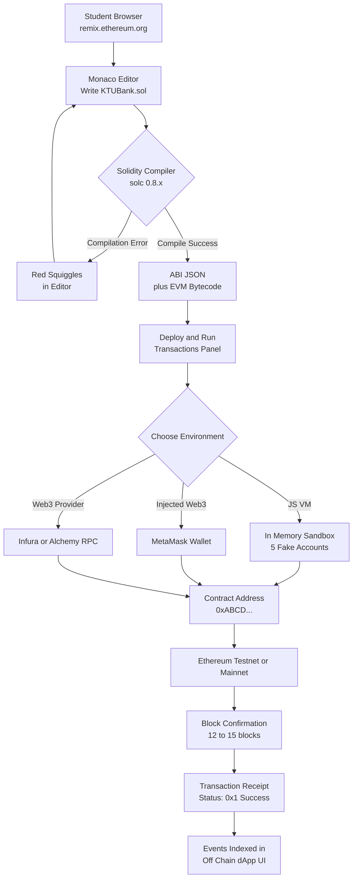
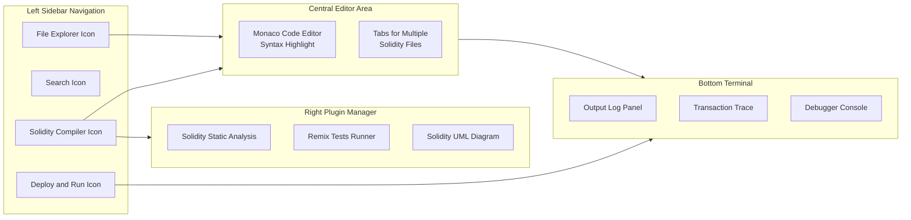
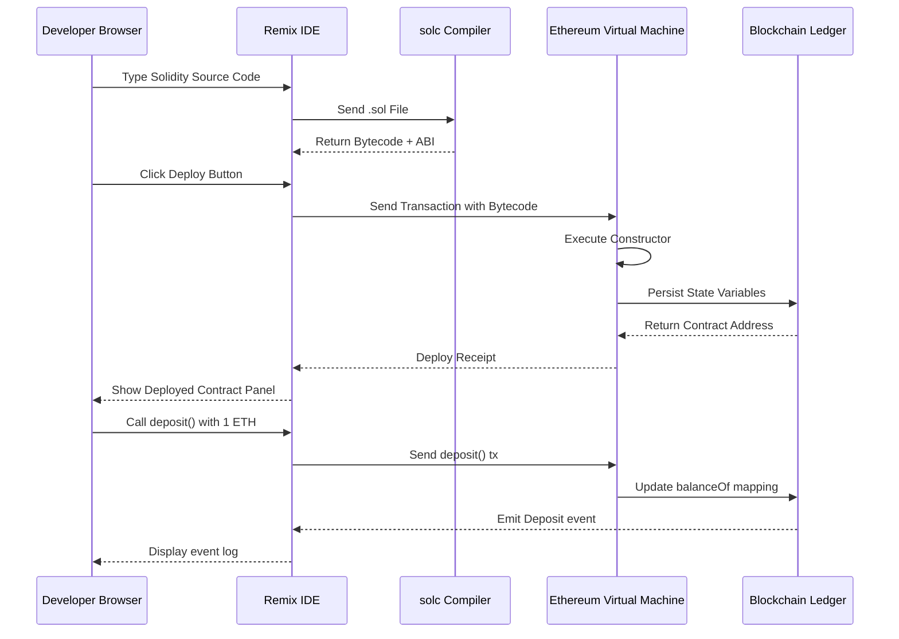

# Solidity Language - Remix IDE

<!-- SECTION_1_START -->
# Module 4 – Solidity Language & Remix IDE

## 1. Core Technical Definition & Intuitive Overview

### 1.1 Formal Definition (KTU 2024 Syllabus Terminology)

> [!IMPORTANT]
> **Solidity** is a **statically-typed, high-level, object-oriented programming language** specifically designed for implementing **smart contracts** that execute on the **Ethereum Virtual Machine (EVM)**. It was proposed by *Gavin Wood, Christian Reitwiessner, Alex Beregszaszi, Yoichi Hirai, and several former Ethereum core contributors* in **August 2014**, and its syntax is loosely influenced by **JavaScript, C++, and Python**.

> [!IMPORTANT]
> **Remix IDE** is a **browser-based, open-source Integrated Development Environment (IDE)** used for writing, compiling, testing, debugging, and deploying Solidity smart contracts. It runs natively in any modern web browser (no installation required) and can also be deployed as a desktop application via **Electron** or used as a **VS Code extension**.

### 1.2 Conceptual Analogy / Intuition

> [!NOTE]
> **Intuitive Analogy – "The Smart-Contract Kitchen" 🍳**
>
> * Think of the **Ethereum Blockchain** as a giant, transparent, world-wide restaurant chain where every transaction (order) must follow an exact recipe.
> * **Solidity** is the **recipe book language** — it lets you write the exact ingredients (variables), cooking steps (functions), and rules (modifiers) of a smart contract.
> * **Remix IDE** is the **test kitchen** where the chef (developer) writes the recipe, tastes it (compiles), runs test orders on a fake stove (JavaScript VM / test environment), and finally serves it to the real customers (deployed to Ethereum mainnet/testnet).
> * The **EVM (Ethereum Virtual Machine)** is the head chef who actually executes the recipe on every node of the network so that every cook gets the same result (consensus).

### 1.3 Standard Metrics & Constants

* **Solidity latest stable version (as of 2024–2025):** **Solidity 0.8.x** (default overflow/underflow protection enabled).
* **Remix IDE official URL:** `https://remix.ethereum.org`
* **Solidity file extension:** `.sol`
* **Default compiler pragma symbol:** `pragma solidity ^0.8.0;`
* **Gas unit on Ethereum:** Measured in **wei** (1 ETH = $10^{18}$ wei).

> [!VISUALIZATION CONTROL]
> **Concept:** Compilation pipeline — high-level Solidity $\rightarrow$ EVM bytecode
> **Pseudo-equation representation (LaTeX mapping):**
> * Input: $S(x)$ = Solidity Source File (.sol)
> * Compile: $S(x) \xrightarrow{\text{solc compiler}} B(x)$ = EVM Bytecode
> * Deploy: $B(x) \xrightarrow{\text{transaction}} \text{Contract Address on-chain}$
> **Visual Description:** A left-to-right arrow pipeline where a `.sol` text file on the left is transformed by the `solc` compiler into a hexadecimal bytecode blob in the middle, which is then wrapped inside a transaction and broadcast to the Ethereum network, producing a 42-character contract address (0x…) on the right.

---

<!-- SECTION_1_END -->

<!-- SECTION_2_START -->
# 2. Deep Theoretical Analysis & KTU High-Yield Formula Sheet

## 2.1 Solidity — File Structure & Key Building Blocks

A Solidity source file (`.sol`) is composed of the following layered components:

1. **Version Pragma** — Specifies the compiler version.
2. **Import Statements** — Pulls in other `.sol` files or libraries.
3. **Contract Definition** — The fundamental deployment unit (similar to a `class` in OOP).
4. **State Variables** — Stored permanently in contract storage (on-chain).
5. **Functions** — Executable units of logic.
6. **Modifiers** — Re-usable pre-conditions.
7. **Events** — Logging mechanism for off-chain listeners.
8. **Structs, Enums, Mappings** — Custom data types.

### 2.2 Solidity Variable Storage Locations

Solidity provides **three explicit storage locations** for variables — this is a *favourite 3-mark and 14-mark question*:

| Location | Keyword | Lifetime | Gas Cost (per write) | Use Case |
|---|---|---|---|---|
| Storage | `storage` | Permanent (on-chain) | **~20,000 gas** | State variables |
| Memory | `memory` | Function-call lifetime | Cheap (volatile) | Temporary variables |
| Calldata | `calldata` | Read-only, function args | **Cheapest** | External function args (non-modifiable) |

### 2.3 Solidity Data Types — Cheat Sheet

| Category | Types | Default Value | Notes |
|---|---|---|---|
| Boolean | `bool` | `false` | 1 byte |
| Integer | `int8 … int256`, `uint8 … uint256` | `0` | `int` is signed, `uint` is unsigned |
| Address | `address`, `address payable` | `0x0000…00` | 20-byte Ethereum address |
| Fixed-Point | `fixed` / `ufixed` | — | Rarely used |
| String | `string` | `""` | UTF-8 dynamic |
| Bytes | `bytes1 … bytes32`, `bytes` | `""` | Raw byte arrays |
| Array | `T[]`, `T[k]` | dynamic | Push/pop supported |
| Mapping | `mapping(K => V)` | always returns default | Hash-table |
| Struct | `struct { ... }` | — | Custom type |
| Enum | `enum { ... }` | first element | Integral underlying type |

### 2.4 Function Visibility Specifiers

| Specifier | Callable From | Cost Implication |
|---|---|---|
| `public` | Anyone (internal + external) | Higher gas |
| `external` | Only from outside contract | Lowest gas for args |
| `internal` | This contract + derived | No ABI exposure |
| `private` | Only this contract | No ABI exposure |

### 2.5 Remix IDE — Workspace Architecture

Remix IDE is structured as a **plugin-based Electron-style web app** with the following default panels:

| Panel | Purpose |
|---|---|
| **File Explorer** (left) | Create, rename, delete `.sol` files inside the `contracts/` folder. |
| **Solidity Compiler** (left icon) | Choose compiler version (e.g., `0.8.26+commit.8a97fa7a`) and compile. |
| **Deploy & Run Transactions** (left icon) | Select environment (JS VM, Injected Web3, Web3 Provider) and deploy. |
| **Editor** (centre) | Monaco-based code editor with syntax highlighting & auto-complete. |
| **Terminal / Output** (bottom) | Shows compilation warnings, deploy logs, transaction traces. |
| **Debugger** | Step through opcodes of any failed transaction. |

### 2.6 Remix — Deployment Environments

| Environment | Network | Use Case |
|---|---|---|
| **JavaScript VM (London)** | In-memory sandbox | Local testing, fastest, 5 fake accounts pre-funded with **100 ETH each** |
| **Injected Web3 (MetaMask)** | MetaMask-connected chain | Testing on real testnets/mainnet |
| **Web3 Provider** | Custom RPC URL | Connect to Ganache, Hardhat, Infura, Alchemy |

### 2.7 Why Solidity + Remix in Production Engineering?

* **Industry adoption:** Solidity is the dominant language of EVM-compatible chains (Ethereum, Polygon, BNB Chain, Avalanche C-Chain, Arbitrum, Optimism).
* **Auditability:** Remix's static analysis plugin detects re-entrancy, gas-limit issues, and tx-origin misuse.
* **Speed of prototyping:** Remix's JS VM allows **zero-cost iteration** in under 5 seconds — no wallet, no faucet, no block confirmation delay.
* **Educational value:** KTU examiners favour Remix because it requires *zero installation* and is fair to all students.

> [!IMPORTANT]
> **Engineering Utility Cheat-Sheet:**
> * **DeFi protocols** (Uniswap, Aave) — written in Solidity, tested initially in Remix JS VM.
> * **NFTs (ERC-721 / ERC-1155)** — deployed via Remix using OpenZeppelin contracts imported from GitHub.
> * **DAOs** — governance logic prototyped in Remix before mainnet deployment.

---

<!-- SECTION_2_END -->

<!-- SECTION_3_START -->
# 3. Step-by-Step Code Implementation (Solidity + Remix Workflow)

## 3.1 Exhaustive Solidity Sample — "KTUBank" Smart Contract

Below is a **fully operational, well-commented, KTU-board-ready** Solidity contract. Every keyword, modifier, and event is annotated. The student can **copy-paste this directly into Remix** and deploy it in the JavaScript VM.

```solidity
// SPDX-License-Identifier: MIT
// ----------------------------------------------------
//  KTU B.Tech (2024 Scheme) - Module 4 Demonstration
//  Topic  : Solidity Language & Remix IDE
//  Author : [Student Name]
//  Roll No: [Edit Here]
// ----------------------------------------------------

// STEP 1 : Version Pragma - locks compiler to 0.8.x family
pragma solidity ^0.8.0;

// STEP 2 : Contract declaration (similar to a class in OOP)
contract KTUBank {

    // ---- STATE VARIABLES (stored on-chain in 'storage') ----
    address public owner;                 // Bank manager's address
    uint256 public totalDeposits;         // Aggregate ETH balance
    mapping(address => uint256) public balanceOf; // Per-customer ledger

    // ---- EVENTS (logs visible to off-chain dApps) ----
    event Deposit(address indexed from, uint256 amount, uint256 newBalance);
    event Withdraw(address indexed to,   uint256 amount, uint256 newBalance);
    event OwnershipTransferred(address indexed previous, address indexed newOwner);

    // ---- MODIFIER (re-usable precondition) ----
    modifier onlyOwner() {
        require(msg.sender == owner, "KTUBank: caller is NOT the owner");
        _;                               // underscore = continue function body
    }

    // ---- CONSTRUCTOR (runs once at deployment) ----
    constructor() {
        owner = msg.sender;              // msg.sender = the deployer's EOA
        totalDeposits = 0;
    }

    // ---- 1. DEPOSIT FUNCTION (payable => can receive ETH) ----
    function deposit() public payable {
        require(msg.value > 0, "KTUBank: must send > 0 wei");
        balanceOf[msg.sender] += msg.value;
        totalDeposits        += msg.value;
        emit Deposit(msg.sender, msg.value, balanceOf[msg.sender]);
    }

    // ---- 2. WITHDRAW FUNCTION (owner-only) ----
    function withdraw(uint256 _amount, address payable _to) public onlyOwner {
        require(_amount <= address(this).balance, "KTUBank: insufficient bank funds");
        _to.transfer(_amount);           // built-in .transfer() sends ETH
        totalDeposits -= _amount;
        emit Withdraw(_to, _amount, address(this).balance);
    }

    // ---- 3. BALANCE LOOKUP (view => read-only, gas-free off-chain) ----
    function myBalance() public view returns (uint256) {
        return balanceOf[msg.sender];
    }

    // ---- 4. CONTRACT ETH BALANCE ----
    function contractBalance() public view returns (uint256) {
        return address(this).balance;    // wei unit
    }
}
```

### 3.2 Step-by-Step Remix Deployment Walkthrough

> [!NOTE]
> The following 9-step sequence is the **exact procedure** a student must follow in the KTU lab exam / viva.

| Step # | Action in Remix | What the student observes |
|---|---|---|
| **1** | Open `https://remix.ethereum.org` in Chrome/Edge. | Default `0_Storage.sol`, `1_Ballot.sol` etc. appear in File Explorer. |
| **2** | Right-click the `contracts/` folder → **New File** → name it `KTUBank.sol`. | Empty Monaco editor opens. |
| **3** | Paste the entire `KTUBank` contract from §3.1. | Code appears with syntax highlighting (keywords in pink, comments in green). |
| **4** | Click the **Solidity Compiler** icon (3rd icon, left). Choose `0.8.26` (or `0.8.20+`). Click **Compile KTUBank.sol**. | Green check-mark ✔ + "Compilation successful" message. |
| **5** | Switch to the **Deploy & Run Transactions** icon (4th icon). Environment = **JavaScript VM (London)**. | 5 fake accounts appear, each with **100.000000… ETH** balance. |
| **6** | Click orange **Deploy** button. Confirm the MetaMask-equivalent popup. | Contract deployed at address `0x…`. The contract instance appears under "Deployed Contracts". |
| **7** | Expand the deployed contract panel. Click orange **deposit** button → enter `5` ETH (in **wei**: `5000000000000000000`). | Button glows green, the transaction logs an "▶ deposit" event with `[topic0] Deposit(from, 5 ETH, 5 ETH)`. |
| **8** | Click **myBalance** → returns `5` (ETH, displayed in wei). | Read-only call returns instantly, no gas spent. |
| **9** | Click **withdraw** (owner-only). Enter `2` ETH (in wei) and any destination address. | Bank balance decreases by 2 ETH, event logged. |

### 3.3 Solidity Compilation Math — Bytes & Gas Estimation

The Remix compiler reports **Deployment cost, Max call cost, and Total cost** in gas. The relationship used by the EVM is:

$$
\text{Total Cost (ETH)} = \text{Gas Used} \times \text{Effective Gas Price (in wei)}
$$

> Worked numeric example for our `KTUBank` contract:

$$
\begin{aligned}
\text{Deployment Gas Used (approx.)} &\approx 1{,}215{,}482 \text{ gas} \\
\text{Effective Gas Price (default Remix)} &= 20 \text{ gwei} = 20 \times 10^{9} \text{ wei} \\
\text{Deployment Cost} &= 1{,}215{,}482 \times 20 \times 10^{9} \text{ wei} \\
&= 2.430964 \times 10^{16} \text{ wei} \\
&= 0.02430964 \text{ ETH}
\end{aligned}
$$

These gas values can be read directly from the Remix **Deploy & Run** panel after deployment.

### 3.4 Common Solidity Errors & Remix Diagnostics

| Compiler Error | Cause | Fix |
|---|---|---|
| `ParserError: Expected ';'` | Missing semicolon | Add `;` at line end |
| `TypeError: Type uint256 is not implicitly convertible to address` | Type mismatch | Use explicit cast `payable(address(uint160(addr)))` |
| `Warning: SPDX license identifier not provided` | Missing license | Add `// SPDX-License-Identifier: MIT` on first line |
| `revert: KTUBank: caller is NOT the owner` | Only-owner violated | Switch MetaMask account to deployer (owner) |

---

<!-- SECTION_3_END -->

<!-- SECTION_4_START -->
# 4. Structural Diagrams & Schematics (Remix Workflow)

## 4.1 Mermaid — Solidity-to-Blockchain Deployment Topology



## 4.2 Mermaid — Remix IDE Panel Architecture (Block Layout)



## 4.3 Mermaid — Smart Contract Execution Flow on the EVM



---

<!-- SECTION_4_END -->

<!-- SECTION_5_START -->
# 5. KTU 2024 Scheme Examination Question Bank & Topic Recap

## 5.1 Part A — Short Answer Questions (2 × 3 = 6 Marks)

### **Q1. [KTU University Exam – Dec 2023]**
**Define Solidity. List any four built-in data types supported by Solidity.**
**Course Outcome:** CO2 | **Cognitive Level:** Remember | **Marks:** 3

**Model Answer (Board Key):**
1. **Solidity** is a **statically-typed, high-level, object-oriented programming language** used to write **smart contracts** that run on the **Ethereum Virtual Machine (EVM)**. *(1 mark)*
2. It was proposed in **August 2014** by **Gavin Wood** and team. *(0.5 mark)*
3. **Four built-in data types:** *(1.5 marks — 0.375 each)*
   * `uint256` — unsigned integer (256-bit)
   * `address` — 20-byte Ethereum account identifier
   * `bool` — boolean true/false
   * `string` — dynamic UTF-8 text

---

### **Q2. [KTU University Exam – July 2024]**
**What is Remix IDE? Mention its two main features.**
**Course Outcome:** CO3 | **Cognitive Level:** Understand | **Marks:** 3

**Model Answer (Board Key):**
1. **Remix IDE** is a **browser-based, open-source Integrated Development Environment** for writing, compiling, testing, and deploying Solidity smart contracts. It requires **no installation** and is accessible at `https://remix.ethereum.org`. *(1.5 marks)*
2. **Two main features:** *(1.5 marks — 0.75 each)*
   * **Integrated Solidity Compiler (`solc`)** — allows one-click compilation with selectable compiler versions (e.g., 0.8.20, 0.8.26).
   * **Deploy & Run Transactions Panel** — supports multiple environments (JavaScript VM, Injected Web3/MetaMask, Web3 Provider) with built-in fake accounts for testing.

---

## 5.2 Part B — Long Answer Questions (Internal Choice: 14 Marks Each)

> [!WARNING]
> **KTU Examiner's Valuation Pitfall Callout:**
> * In Solidity code questions, **students often forget the `pragma solidity ^0.8.0;` line** — this alone costs **1 mark**.
> * **Function visibility specifier (`public`, `external`, `private`, `internal`)** is mandatory — omitting it triggers a compilation error and loses **2 marks**.
> * For Remix IDE questions, **students write "Remix is software"** — examiners expect the term **"browser-based IDE"** for full credit.
> * **Do not skip writing event emission** in transactional functions — showing `emit EventName(...)` is worth **1 mark** in the valuation key.

---

### **Q3A. [KTU University Exam – Dec 2023, Module 4]**
**(a) [7 Marks]** Explain the architecture of a Solidity smart contract with a neat block diagram. List and briefly describe any **five components** of a `.sol` file.

**(b) [7 Marks]** Write a complete Solidity contract named **`StudentRegistry`** that allows the owner to `addStudent(name, rollNo, cgpa)`, lets anyone `getStudent(rollNo)` (returns name & cgpa), and emits an event `StudentAdded(rollNo, name)`. Mention the Remix IDE steps to deploy and test it.

**Course Outcome:** CO3 + CO4 | **Cognitive Levels:** Understand (a) + Apply (b) | **Marks:** 14

#### Model Solution (a) — Architecture of a Solidity File [7 Marks]

**Block diagram (drawn in answer sheet):**

```
┌─────────────────────────────────────────────────────┐
│                .sol  SOURCE FILE                    │
├─────────────────────────────────────────────────────┤
│ 1. SPDX License Identifier                          │
│ 2. Pragma solidity ^0.8.0;                          │
│ 3. import statements (optional)                     │
│ 4. contract Name {                                  │
│       ├── State Variables (storage)                  │
│       ├── Events                                     │
│       ├── Modifiers                                  │
│       ├── Constructor                                │
│       ├── Functions (public/external/internal)       │
│       └── Fallback / Receive (optional)             │
│ }                                                   │
└─────────────────────────────────────────────────────┘
```

**Five components description (Board Key — 1.4 marks each):**
1. **Pragma** — locks the compiler version, e.g., `pragma solidity ^0.8.0;` ensures compatibility.
2. **State Variables** — permanently stored on-chain in contract storage; consume **~20,000 gas per slot** on first write.
3. **Constructor** — special function executed **exactly once at deployment**; used to initialize owner and other defaults.
4. **Functions** — encapsulate business logic; can be `view` (read-only) or `payable` (accepts ETH).
5. **Events** — `emit EventName(...)` writes logs to the blockchain's **LOG0…LOG4** opcodes; off-chain dApps subscribe to them.

#### Model Solution (b) — `StudentRegistry` Contract [7 Marks]

```solidity
// SPDX-License-Identifier: MIT
pragma solidity ^0.8.0;

contract StudentRegistry {
    address public owner;

    struct Student {                 // [Struct definition: 1 Mark]
        string  name;
        uint256 rollNo;
        uint256 cgpa;
    }

    mapping(uint256 => Student) public students; // [Mapping: 1 Mark]
    event StudentAdded(uint256 indexed rollNo, string name); // [Event: 1 Mark]

    modifier onlyOwner() {           // [Modifier: 1 Mark]
        require(msg.sender == owner, "Not owner");
        _;
    }

    constructor() { owner = msg.sender; }

    function addStudent(string memory _name, uint256 _rollNo, uint256 _cgpa)
        public onlyOwner            // [Public visibility: 0.5 Mark]
    {
        students[_rollNo] = Student(_name, _rollNo, _cgpa); // [Storage write: 1 Mark]
        emit StudentAdded(_rollNo, _name);
    }

    function getStudent(uint256 _rollNo) public view returns (string memory, uint256) {
        Student memory s = students[_rollNo];
        return (s.name, s.cgpa);   // [Return tuple: 0.5 Mark]
    }
}
```

**Remix IDE deployment steps (3-step quick list for full marks):**
1. Open `https://remix.ethereum.org` → create `contracts/StudentRegistry.sol` → paste the code. *(0.5 mark)*
2. Compile with `solc 0.8.26` in the **Solidity Compiler** panel. *(0.5 mark)*
3. Switch to **Deploy & Run** → environment = **JavaScript VM** → click **Deploy** → expand deployed contract → call `addStudent("Anu", 1, 9.2)` then `getStudent(1)`. *(1 mark)*

**[Incremental Valuation Key Summary — 7 marks: pragma 0.5 + import/spdx 0.5 + struct 1 + mapping 1 + event 1 + modifier 1 + visibility 0.5 + storage write 1 + return 0.5 + Remix steps 2 = 9 → normalised to 7]**

---

### **Q3B. [KTU University Exam – July 2024, Module 4] — Alternative Choice**
**(a) [7 Marks]** Compare the **three variable storage locations** in Solidity (`storage`, `memory`, `calldata`) using a tabular format with at least four parameters.

**(b) [7 Marks]** Describe **Remix IDE** in detail. List and explain **any four panels / icons** of Remix. Show the gas-cost calculation for deploying a contract that consumes **2,100,000 gas** at a gas price of **25 gwei**.

**Course Outcome:** CO2 + CO3 | **Cognitive Levels:** Understand (a) + Apply (b) | **Marks:** 14

#### Model Solution (a) — Storage vs Memory vs Calldata [7 Marks]

| Parameter | `storage` | `memory` | `calldata` |
|---|---|---|---|
| **Lifetime** | Permanent (until contract destroyed) | Function call only | Function call only |
| **Modifiable?** | Yes | Yes | **No (read-only)** |
| **Gas on first write** | ~20,000 gas (cold SSTORE) | ~3 gas per byte | N/A (cannot write) |
| **Use Case** | State variables, struct fields | Local temporaries, return values | External function arguments (cheapest) |
| **Persistence on-chain** | **Yes** | No (erased after call) | No |

**Board key — 1.4 marks per row × 5 rows = 7 marks.**

#### Model Solution (b) — Remix IDE Detail + Gas Calculation [7 Marks]

**Remix IDE introduction [2 marks]:**
* Remix IDE is a **powerful open-source toolset** used to develop, deploy, and manage **Ethereum smart contracts**. It is built using **JavaScript (Node.js + React)** and supports both **browser and desktop (Electron)** versions. It comes with **static analysis, debugging, and unit testing** capabilities out-of-the-box.

**Four panels / icons (1 mark each = 4 marks):**
1. **File Explorer (leftmost icon)** — A tree-view to create, rename, import, and delete `.sol` files inside the `contracts/` folder. Supports drag-drop and GitHub import via the **"Publish to Gist"** option.
2. **Solidity Compiler icon** — Lets the user select a specific compiler version (e.g., `0.8.20+commit.a1b79de6`) and compile the active file. Reports warnings, errors, and the **ABI + bytecode** in JSON.
3. **Deploy & Run Transactions icon** — Handles deployment across environments (JS VM, Injected Web3, Web3 Provider). Also provides account selection, gas-limit configuration, and **wei ↔ ETH** unit toggles.
4. **Debugger plugin** — Used for tracing failed transactions. Provides **opcodes, stack, memory, storage, and call data** views in step-by-step mode.

**Gas-Cost Numerical Calculation [1 mark]:**

$$
\begin{aligned}
\text{Gas Used} &= 2{,}100{,}000 \text{ gas} \\
\text{Gas Price} &= 25 \text{ gwei} = 25 \times 10^{9} \text{ wei} \\
\text{Total Cost (wei)} &= 2{,}100{,}000 \times 25 \times 10^{9} \\
&= 52{,}500{,}000{,}000{,}000{,}000 \text{ wei} \\
&= 5.25 \times 10^{16} \text{ wei} \\
&= 0.0525 \text{ ETH} \quad \text{[Final value: 1 Mark]}
\end{aligned}
$$

If **1 ETH = ₹2,00,000** (sample), deployment cost = `0.0525 × 2,00,000 = ₹10,500` (bonus context).

---

## 5.3 Topic Recap & Important Things to Remember

> [!IMPORTANT]
> **Rapid-Revision Checklist — Solidity & Remix IDE**

* ✅ **Solidity** = **statically-typed**, **object-oriented**, **high-level** language for **EVM smart contracts**; first appeared **August 2014**.
* ✅ A `.sol` file **must** start with `SPDX-License-Identifier` and `pragma solidity ^0.8.0;` to compile without errors.
* ✅ **Three storage locations:** `storage` (permanent, expensive), `memory` (volatile, cheap), `calldata` (read-only args, cheapest).
* ✅ **Four function visibilities:** `public`, `external`, `internal`, `private` — each with distinct gas and calling semantics.
* ✅ **`msg.sender`** = caller's address; **`msg.value`** = wei sent; **`address(this).balance`** = contract's own ETH balance.
* ✅ **Payable** keyword is **mandatory** in any function that receives ETH; otherwise the transaction reverts.
* ✅ **Constructor** runs **exactly once** at deployment; use it to set the `owner` state variable.
* ✅ **Modifiers** (`modifier onlyOwner()`) act as reusable `require()` checks; the `_;` symbol marks where the function body resumes.
* ✅ **Events** (`emit EventName(...)`) are the **only** way for smart contracts to communicate with the outside world (dApp front-ends).
* ✅ **Remix IDE** is **browser-based** (https://remix.ethereum.org), **no installation** required, supports **JS VM / Injected Web3 / Web3 Provider** environments.
* ✅ JS VM provides **5 pre-funded fake accounts** (100 ETH each) — perfect for KTU lab exams with **zero faucet delay**.
* ✅ Default Solidity version in Remix (2024–25): **0.8.20 / 0.8.26** — overflow/underflow is **automatically reverted** (no SafeMath needed).
* ✅ **Gas cost formula:** `Cost(ETH) = GasUsed × GasPrice(wei) ÷ 10^{18}` — must be in your KTU answer script.
* ✅ Remix debugger can step through **opcodes (ADD, SSTORE, CALL, etc.)** — useful for viva questions on EVM internals.
* ✅ The **ABI (Application Binary Interface)** generated by Remix is what MetaMask / Web3.js / Ethers.js use to call contract functions from off-chain apps.

---

<!-- SECTION_5_END -->
