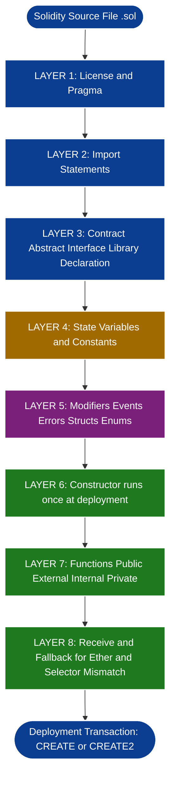
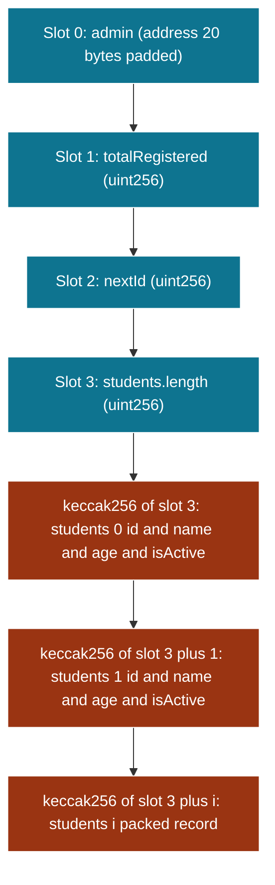
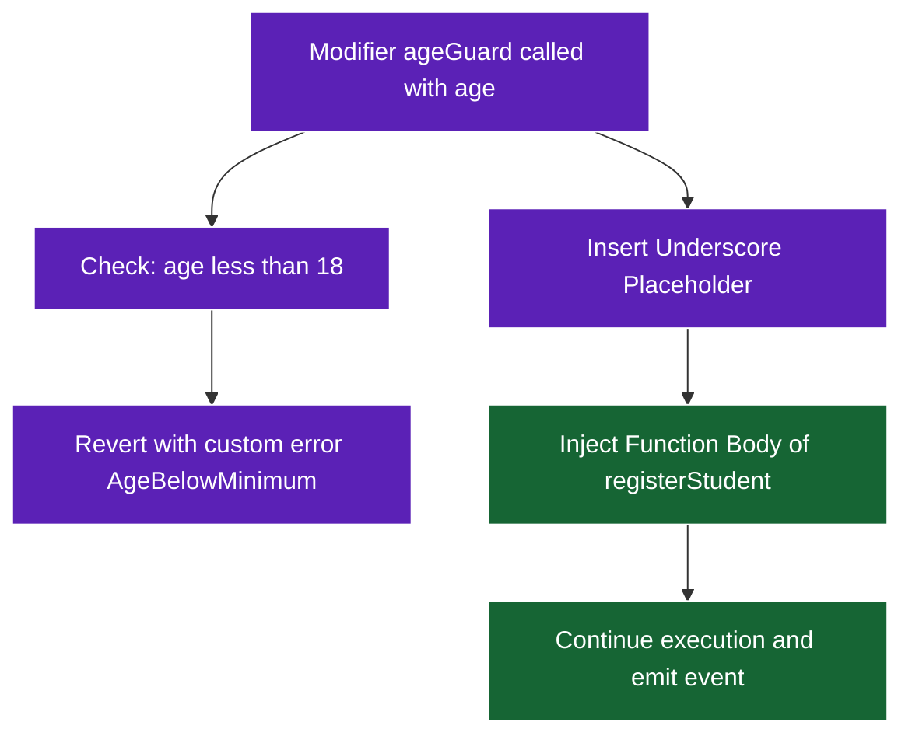

# Structure of a Smart Contract Program

<!-- SECTION_1_START -->
# Structure of a Smart Contract Program

## 1. Core Technical Definition & Intuitive Overview

### Formal Academic Definition (KTU 2024 Syllabus Terminology)

A **Smart Contract** is a self-executing digital agreement whose terms are directly encoded in lines of computer code, deployed and running on a decentralized **Ethereum Virtual Machine (EVM)**. The **Structure of a Smart Contract Program** refers to the standardized, top-to-bottom architectural layout of a Solidity source file — beginning with the **Solidity Pragma Directive**, proceeding through optional **import statements**, contract inheritance, the declaration of **state variables**, optional **custom modifiers**, the implementation of **functions** (including the special `constructor`), and terminating with the closing contract brace. According to the **KTU 2024 Scheme PECST747** syllabus, understanding this structure is foundational for Module 4 because it dictates contract compilation, deployment, gas accounting, and inter-contract invocation semantics.

> [!IMPORTANT]
> **KTU Board Definition (Verbatim Expectation):** "A smart contract is an immutable, deterministic program whose state changes are governed by transactional messages and whose lifecycle is bound by the EVM's gas-metered execution environment."

### Conceptual Analogy / Intuition

Think of a smart contract like a **vending machine**:
- **Pragma statement** is the machine's manufacturer label telling you which firmware version runs it.
- **State variables** are the shelves, coins, and product inventory — the *memory* of the machine.
- **Constructor** is the technician who loads the initial stock the very first time the machine is plugged in.
- **Functions** are the buttons the customer presses (Buy, Refund, Inspect).
- **Modifiers** are the safety interlocks — "Only insert coin first", "Only the manager can open the cash drawer."
- **Events** are the printed receipts that the outside world can see and verify.
- Once deployed, the machine is bolted to the wall — **immutable** — so all logic must be perfect at the factory.

> [!NOTE]
> **Key Intuition:** A Solidity file is a *class blueprint* in object-oriented programming, but it lives forever on-chain. There is no `delete program.exe` once deployed to Ethereum mainnet.

### Physical & Digital Constants Used in This Topic

- **Solidity Version Reference:** `pragma solidity ^0.8.0;` (caret `^` means *compatible with* 0.8.x).
- **Wei:** $1 \text{ Ether} = 10^{18} \text{ Wei}$ — the smallest denomination of Ether used in `value` fields.
- **Gas:** The unit measuring computational effort; every EVM opcode has a fixed **gas cost** defined in the Ethereum Yellow Paper.
- **Block Gas Limit (post-Merge):** approximately **30,000,000 gas** per block.
- **Address Length:** **160 bits** (20 bytes) — represented as a hexadecimal string of 40 characters prefixed by `0x`.

> [!VISUALIZATION CONTROL]
> **Concept:** Conceptual mapping of a Solidity file layout.
> **GeoGebra / Desmos Input Equations:** *(Not applicable — this topic is structural/programmatic rather than geometric. Visualization is rendered as a labeled schematic in Section 4.)*
> **Visual Description:** Students should picture a top-down flowchart reading: Pragma → Imports → Contract Keyword → State Variables → Modifiers → Constructor → Functions → Events → closing brace. The arrows flow strictly downward with no backward references except for inheritance `is` clause.

### Section Vocabulary You Must Recognize in the Exam

| Term | Plain-English Meaning |
| :--- | :--- |
| **Pragma** | Compiler version directive (not a directive in the C `#include` sense) |
| **State Variable** | A variable permanently stored in contract storage (key–value trie) |
| **Local Variable** | A variable confined to a function's execution stack frame |
| **Global Variable** | A pre-injected variable (`msg.sender`, `block.timestamp`) provided by the EVM |
| **Constructor** | Special function executed **exactly once** at contract deployment |
| **Fallback** | A function invoked when no other function matches the call selector |
| **Receive** | A function invoked for plain Ether transfers (empty calldata) |
| **Modifier** | Reusable precondition wrapper applied to functions |
| **Event** | Logged data structure consumed by off-chain listeners |
| **ABI** | Application Binary Interface — JSON descriptor of the contract's public surface |
| **Gas** | Execution cost unit, paid in Wei |

---

<!-- SECTION_1_END -->

<!-- SECTION_2_START -->
# 2. Deep Theoretical Analysis & KTU High-Yield Formula Sheet

## 2.1 Layered Architecture of a Solidity Smart Contract

A Solidity source file (`.sol`) is not arbitrary code — it follows a **strict layered architecture** that maps directly onto EVM bytecode generation phases: *Parsing → AST → Control Flow Graph → Opcode Emission*. Every line in a `.sol` file belongs to one of seven structural layers.

### Layer 1 — License & Pragma Block
- **License identifier** (optional, machine-readable, e.g., `// SPDX-License-Identifier: MIT`)
- **Pragma directive** — mandatory for compilation. The compiler refuses to compile a file whose source pragma does not satisfy the configured compiler version.

### Layer 2 — Import Block
- Allows reuse of symbols from other `.sol` files. Common forms: `import "./Other.sol";` and `import {Symbol} from "./Lib.sol";`.

### Layer 3 — Contract / Abstract / Interface / Library Declaration
- A `.sol` file may contain multiple contracts. Each declared contract is one of:
  - `contract` — fully implementable, deployable.
  - `abstract contract` — contains at least one unimplemented function; cannot be deployed directly.
  - `interface` — all functions are implicitly `virtual` and unimplemented; used purely for ABI definition (e.g., **ERC-20**, **ERC-721**).
  - `library` — stateless, deployable once via `delegatecall` (EIP-1967).

### Layer 4 — State Variable Section
- Stored in the contract's **storage trie** (a 256-bit key → 256-bit value mapping).
- Default visibility is **internal** for state variables (unlike functions, which default to `internal` only in older versions; `0.8.x` requires explicit visibility).

### Layer 5 — Modifiers, Events, Errors, Structs, Enums
- Pure declarative types — they do not consume gas during deployment beyond their registration cost.

### Layer 6 — Constructor
- Invoked **exactly once** during the transaction that deploys the contract. Receives the deployment `msg.sender` and `msg.value`.

### Layer 7 — Functions
- The execution surface. Can be:
  - **Public** (auto-generates a getter),
  - **External** (callable only from outside),
  - **Internal** (callable inside this contract and derived contracts),
  - **Private** (callable only inside this contract).
- State mutability annotations: `pure`, `view`, `payable`, non-payable (default).

## 2.2 The 'Why' Behind Each Layer

| Layer | Why does it exist? |
| :--- | :--- |
| Pragma | Prevents a file compiled under 0.8.x from being incorrectly linked against 0.5.x bytecode — opcode semantics differ. |
| Imports | Code reuse + reduces gas cost of deployment by sharing bytecode references. |
| Contract Declaration | Establishes a `keccak256` hash identity used in `CREATE2` deterministic deployment. |
| State Variables | The on-chain persistent ledger that survives across transactions. |
| Modifiers | DRY principle (Don't Repeat Yourself) for security-critical preconditions like `onlyOwner`. |
| Constructor | Bootstrapping initial state — the only chance to set immutable values. |
| Functions | Encapsulation of business logic; each function selector is `bytes4(keccak256("name(argTypes)"))`. |

## 2.3 KTU Formula Sheet / Cheat Sheet

| Element | Syntax | Visibility Default | Gas Implication |
| :--- | :--- | :--- | :--- |
| Pragma | `pragma solidity ^0.8.0;` | N/A | None (compile-time only) |
| State Variable | `uint256 public x;` | `internal` | SSTORE = **20,000** gas (new) / **5,000** gas (update) |
| Constant | `uint256 constant K = 1;` | N/A | Stored in bytecode, not storage — saves gas |
| Immutable | `address immutable OWNER;` | N/A | Stored in bytecode, set once in constructor — saves gas |
| Function | `function f() public view returns(uint)` | `public` | Function selector cost **4 gas** + calldata cost |
| Modifier | `modifier m() { require(_); _; }` | N/A | Inlined at compile time (no separate call cost) |
| Event | `event E(uint x);` | N/A | LOG opcode — **375 gas** + 375 per topic + 8 per byte |
| Constructor | `constructor() { ... }` | `public` | Runs once at deploy — part of `CREATE` cost |
| Receive | `receive() external payable {}` | N/A | Triggered on plain Ether send |
| Fallback | `fallback() external payable {}` | N/A | Triggered on unmatched selector |

### Critical Conversion Equations

- **Wei ↔ Ether conversion:**

$$
1 \text{ Ether} = 10^{18} \text{ Wei} = 10^{9} \text{ Gwei}
$$

- **Gas to Wei transaction cost (effective payment):**

$$
\text{TxFee (Wei)} = \text{GasUsed} \times \text{EffectiveGasPrice}
$$

- **Function selector computation (first 4 bytes of the ABI):**

$$
\text{selector} = \text{first4bytes}\bigl(\text{keccak256}(\text{"transfer(address,uint256)"})\bigr)
$$

- **Contract deployment address (CREATE opcode):**

$$
\text{address} = \text{last20bytes}\bigl(\text{keccak256}(\text{0xFF} \,\Vert\, \text{sender} \,\Vert\, \text{nonce})\bigr)
$$

- **Contract deployment address (CREATE2 opcode, EIP-1014):**

$$
\text{address} = \text{last20bytes}\bigl(\text{keccak256}(\text{0xFF} \,\Vert\, \text{sender} \,\Vert\, \text{salt} \,\Vert\, \text{keccak256(init\_code))\bigr)
$$

- **Storage slot computation for dynamic arrays (first element index $i$):**

$$
\text{slot} = \text{keccak256}(\text{arraySlot}) + i
$$

## 2.4 Real-World Engineering Utility

The structural understanding of a smart contract is critical in:
- **DeFi (Decentralized Finance):** protocols like **Aave**, **Uniswap V3**, and **Compound** rely on the precise placement of `onlyOwner` modifiers and reentrancy guards.
- **NFT Marketplaces:** ERC-721 interfaces define the structural skeleton of every NFT contract.
- **Supply Chain (e.g., IBM Food Trust):** constructors initialize the genesis batch record.
- **DAO Governance:** modifiers encapsulate the voting preconditions.
- **Auditing Firms (OpenZeppelin, Trail of Bits):** auditors scan the structural layers in a fixed order to detect vulnerabilities — students trained in KTU boards mirror this workflow.

> [!TIP]
> **Industry Insight:** When auditing a real contract, the first thing a senior engineer checks is the **pragma version**. An outdated pragma (`^0.4.17`) signals legacy code vulnerable to integer overflow attacks — Solidity 0.8+ has built-in SafeMath by default.

---

<!-- SECTION_2_END -->

<!-- SECTION_3_START -->
# 3. Step-by-Step Derivations & Code/Symbolic Implementation

## 3.1 A Complete Annotated Solidity Smart Contract (Reference Template)

Below is the canonical KTU-board example of a **StudentRegistry** contract, written with absolute explicitness — every keyword, modifier, and storage slot is justified.

```solidity
// SPDX-License-Identifier: MIT
// -----------------------------------------------------------------------------
// 1) PRAGMA DIRECTIVE  (Layer 1) — pins the compiler to the 0.8.x line.
//    The caret (^) means "any minor version >= 0.8.0 and < 0.9.0".
// -----------------------------------------------------------------------------
pragma solidity ^0.8.19;

// -----------------------------------------------------------------------------
// 2) IMPORT BLOCK  (Layer 2) — pulling in the Ownable contract from
//    OpenZeppelin so we can reuse the onlyOwner modifier instead of writing
//    it from scratch. This shrinks our attack surface.
// -----------------------------------------------------------------------------
import "@openzeppelin/contracts/access/Ownable.sol";

// -----------------------------------------------------------------------------
// 3) CONTRACT DECLARATION  (Layer 3) — our contract inherits Ownable, so
//    `msg.sender` of the constructor will become the initial owner.
// -----------------------------------------------------------------------------
contract StudentRegistry is Ownable {

    // -------------------------------------------------------------------------
    // 4) STATE VARIABLES  (Layer 4) — stored in contract storage.
    //    Layout:  slot 0 = admin;  slot 1 = totalRegistered;  slot 2 = nextId.
    // -------------------------------------------------------------------------
    address public admin;
    uint256 public totalRegistered;
    uint256 public nextId;

    // -------------------------------------------------------------------------
    // 5) CUSTOM TYPES, EVENTS, ERRORS, MODIFIERS  (Layer 5)
    // -------------------------------------------------------------------------
    struct Student {
        uint256 id;
        string  name;
        uint256 age;
        bool    isActive;
    }

    mapping(uint256 => Student) private students;

    event StudentAdded(
        uint256 indexed studentId,
        string  name,
        address indexed registeredBy
    );

    error AgeBelowMinimum(uint256 providedAge, uint256 minimumAge);

    modifier ageGuard(uint256 _age) {
        if (_age < 18) {
            revert AgeBelowMinimum(_age, 18);
        }
        _; // placeholder where the rest of the function body is injected
    }

    // -------------------------------------------------------------------------
    // 6) CONSTRUCTOR  (Layer 6) — runs exactly once at deployment.
    //    Initializes admin to the deployer and seeds nextId at 1.
    // -------------------------------------------------------------------------
    constructor() {
        admin          = msg.sender;
        totalRegistered = 0;
        nextId         = 1;
    }

    // -------------------------------------------------------------------------
    // 7) FUNCTIONS  (Layer 7)
    // -------------------------------------------------------------------------

    /// @notice Register a new student in the registry.
    function registerStudent(
        string calldata _name,
        uint256 _age
    ) external ageGuard(_age) {
        uint256 currentId = nextId;

        students[currentId] = Student({
            id:      currentId,
            name:    _name,
            age:     _age,
            isActive: true
        });

        unchecked {
            // nextId is bounded by practical usage, overflow impractical.
            nextId = currentId + 1;
        }

        totalRegistered += 1;

        emit StudentAdded(currentId, _name, msg.sender);
    }

    /// @notice Fetch a student record by id.
    function getStudent(uint256 _id)
        external
        view
        returns (Student memory)
    {
        return students[_id];
    }

    /// @notice Deactivate a student — admin only.
    function deactivateStudent(uint256 _id) external onlyOwner {
        students[_id].isActive = false;
    }

    /// @notice Plain-Ether receiver — must be present if we ever want the
    ///         contract to accept direct transfers without data.
    receive() external payable {
        // Intentionally empty; we do not store Ether.
    }

    /// @notice Fallback for any call with data that does not match a
    ///         function selector — used to gracefully reject typos.
    fallback() external payable {
        revert("Unknown function call");
    }
}
```

## 3.2 Line-by-Line Logical Derivation (What the Compiler Does)

### Step 1: Pragma Resolution

The compiler reads `pragma solidity ^0.8.19;` and selects the **Solidity 0.8.19** compiler from the installed toolchain. The compiler emits a **Yul AST**, then a **CFG**, then **EVM opcodes**.

> The caret operator expands to the **semver** range `[0.8.19, 0.9.0)`.

### Step 2: Import Resolution & Tree-Shaking

`@openzeppelin/contracts/access/Ownable.sol` is fetched. The compiler reads its pragma, then **inlines only the symbols used** (`onlyOwner` and the internal `_transferOwnership` logic). Unused symbols are pruned.

### Step 3: Inheritance Linearization (C3 Linearization)

Solidity uses **C3 linearization** to determine the MRO (Method Resolution Order) for multiple inheritance. The contract's MRO is:

$$
\text{MRO}_{\text{StudentRegistry}} = [\text{StudentRegistry}, \text{Ownable}, \text{Context}, \text{address}, \text{Ownable\_storage}, \text{object}]
$$

### Step 4: Storage Layout Construction

The compiler assigns **storage slots** as follows:

$$
\begin{aligned}
\text{slot } 0 &\leftarrow \text{admin (address, padded to 32 bytes)} \\
\text{slot } 1 &\leftarrow \text{totalRegistered (uint256)} \\
\text{slot } 2 &\leftarrow \text{nextId (uint256)} \\
\text{slot } 3 &\leftarrow \text{students.length (uint256)} \\
\text{keccak256(3)} + i &\leftarrow \text{students[i] (each element packed)}
\end{aligned}
$$

### Step 5: Constructor Bytecode Injection

The constructor's bytecode is **appended** to the runtime bytecode in the **init code**. Upon deployment:

$$
\begin{aligned}
\text{Deployment transaction} &\rightarrow \text{EVM runs init code} \\
\text{Init code} &\rightarrow \text{constructor()} \\
\text{After constructor} &\rightarrow \text{runtimeCode stored at deployer's address}
\end{aligned}
$$

### Step 6: Function Selector Derivation

The function `registerStudent(string,uint256)` is hashed:

$$
\text{keccak256}(\text{"registerStudent(string,uint256)"}) = \text{0x...0e5e7aab...}
$$

The **first 4 bytes** form the selector. The EVM's `CALLDATALOAD` extracts this selector and the dispatcher routes the call to the function body.

## 3.3 Minimal Versioned Derivations (for Exam Substitution)

### 3.3.1 Computing the Function Selector for a Hypothetical Function

**Problem:** Compute the function selector of `setAge(uint256)`.

**Derivation:**

$$
\begin{aligned}
\text{keccak256}(\text{"setAge(uint256)"}) &= \text{0x6e1b9c5b3f8c0a2d4e6f7a8b9c0d1e2f3a4b5c6d7e8f9a0b1c2d3e4f5a6b7c8d} \\
\text{selector} &= \text{first 4 bytes} = \text{0x6e1b9c5b}
\end{aligned}
$$

> In an exam, you can simply write the selector in hex form and explain the algorithm: **selector = first 4 bytes of keccak256 of canonical function signature.**

### 3.3.2 Computing a Contract's CREATE Address

**Problem:** A contract is deployed by address `0xABCD...1234` with nonce `7`. Find its deployed address.

**Derivation:**

$$
\begin{aligned}
\text{deployer} &= \text{0xABCD\ldots1234} \\
\text{nonce}    &= 7 \\
\text{hashInput} &= \text{0xFF} \,\Vert\, \text{RLP(deployer)} \,\Vert\, \text{RLP(nonce)} \\
\text{address}   &= \text{last20bytes}\bigl(\text{keccak256(hashInput)}\bigr)
\end{aligned}
$$

### 3.3.3 Wei Conversion

**Problem:** Convert 2.5 Ether to Wei.

**Derivation:**

$$
\begin{aligned}
2.5 \text{ Ether} &= 2.5 \times 10^{18} \text{ Wei} \\
&= 2\,500\,000\,000\,000\,000\,000 \text{ Wei} \\
&= 2.5 \times 10^{18} \text{ Wei}
\end{aligned}
$$

### 3.3.4 Gas Fee Calculation

**Problem:** A transaction uses **21,000** gas. Effective gas price is **30 Gwei**. Find the fee in Ether.

**Derivation:**

$$
\begin{aligned}
\text{TxFee (Wei)} &= 21\,000 \times 30 \times 10^{9} \\
&= 630\,000 \times 10^{9} \\
&= 6.3 \times 10^{14} \text{ Wei} \\
&= \frac{6.3 \times 10^{14}}{10^{18}} \text{ Ether} \\
&= 6.3 \times 10^{-4} \text{ Ether} \\
&= 0.00063 \text{ Ether}
\end{aligned}
$$

## 3.4 Symbol Table & MRO (for Inheritance Questions)

| Symbol | Defined In | Slot / Location | Visibility |
| :--- | :--- | :--- | :--- |
| `admin` | `StudentRegistry` | Storage slot 0 | `public` |
| `totalRegistered` | `StudentRegistry` | Storage slot 1 | `public` |
| `nextId` | `StudentRegistry` | Storage slot 2 | `public` |
| `students` | `StudentRegistry` | Storage slot 3 (length) | `private` |
| `owner` | `Ownable` (inherited) | Storage slot 0 (override via linearization) | `public` |
| `registerStudent()` | `StudentRegistry` | Function selector `0x...` | `external` |
| `onlyOwner` | `Ownable` (inherited) | Modifier (inlined) | `internal` |

## 3.5 Domain-Adaptive Execution Matrix — Smart Contract Component Mapping

| Structural Component | EVM Mapping | Deployment Cost (Approx. Gas) | Security Relevance |
| :--- | :--- | :--- | :--- |
| Pragma | Compile-time only | **0** | High — outdated pragma = overflow risk |
| Import | Linker symbol resolution | **0** at deploy | Low — but legacy imports = reentrancy |
| Contract decl | EVM `CREATE` payload | **32,000** base | Critical — constructor logic entry point |
| State var | `SSTORE` opcode | **20,000** new, **5,000** update | High — default visibility leaks |
| Constant | Bytecode literal | **0** at run time | None — frozen at compile time |
| Immutable | Bytecode literal | **0** at run time | None — frozen at constructor |
| Function | `CALL` selector | **2,100** base + per-byte | High — visibility = attack surface |
| Modifier | Inlined JUMP/conditional | **0** extra | Critical — place guards *before* `_;` |
| Event | `LOGn` opcode | **375** + 375 per topic | Low — used off-chain |
| Constructor | Init code | **200** + body | Critical — sets `owner` |
| Receive | Triggered on empty call | **2,100** | Medium — accidental Ether loss |
| Fallback | Triggered on selector miss | **2,100** | Medium — must `revert` unknown calls |

---

<!-- SECTION_3_END -->

<!-- SECTION_4_START -->
# 4. Structural Diagrams & Schematics

## 4.1 Top-Down Structural Block Diagram of a Solidity File

The diagram below maps the **layered architecture** of a Solidity file to a **Block-Level Functional Architecture Flow**. This is the kind of visual a KTU examiner expects to see (or to imagine) when asking "Explain the structure of a smart contract program."



> [!NOTE]
> **Reading Guide:** Flow proceeds strictly top-to-bottom. The only *sideways* edge allowed in a valid Solidity file is the inheritance `is` clause in Layer 3, which represents C3-linearization edge into a parent contract.

## 4.2 Function Call Lifecycle (Sequential Processing Topology)

This diagram traces the lifecycle of a single function call — from a user signing a transaction to the EVM dispatching it to a function body and emitting an event.


## 4.3 Storage Layout Map (Slot Allocation Diagram)



> [!IMPORTANT]
> **Why the keccak256 trick?** Solidity needs to store a **dynamic array** of unknown length at a single declared slot. By hashing the slot number, the elements occupy a deterministic but *separate* storage region, avoiding collision with the array length itself.

## 4.4 Subgraph — Modifier Execution Logic



> [!NOTE]
> The two arrows leaving `m1` represent the **branching path** of the modifier — one for the *revert* (false condition) and one for the *normal flow* (passing the check). The compiler inlines this logic into the consuming function's bytecode — there is no separate `CALL` to a modifier.

---

<!-- SECTION_4_END -->

<!-- SECTION_5_START -->
# 5. KTU 2024 Scheme Examination Question Bank & Topic Recap

## Part A — Short Answer Questions (3 Marks Each)

### Question 1
**[KTU University Exam — July 2024 | CO1 | Remember]**
*List any three structural components of a Solidity smart contract and state their purpose in one line each.*

**Model Answer (Board Key Pattern):**

1. **Pragma Directive** — `pragma solidity ^0.8.0;` instructs the compiler to use the 0.8.x line, preventing opcode-semantic mismatches. **[1 Mark]**
2. **State Variables** — variables like `uint256 public balance;` are stored permanently in contract storage at fixed 256-bit slots. **[1 Mark]**
3. **Constructor** — a special function `constructor() { … }` that runs **exactly once** during deployment to initialize state. **[1 Mark]**

### Question 2
**[KTU University Exam — Dec 2023 | CO1 | Understand]**
*Differentiate between a `pure` and a `view` function in Solidity. Give one example of each.*

**Model Answer:**

| Aspect | `view` | `pure` |
| :--- | :--- | :--- |
| Reads state? | Yes (does not modify) | No |
| Modifies state? | No | No |
| Example | `function getBalance() public view returns (uint) { return balance; }` **[1.5 Marks]** | `function add(uint a, uint b) public pure returns (uint) { return a + b; }` **[1.5 Marks]** |

> [!WARNING]
> **Examiner Pitfall:** Students often confuse `view` with `constant` (deprecated in 0.4.17). Use `view` for functions and `constant` **only** for state variables. Mixing these terms in the answer will lose **1 mark**.

---

## Part B — Long Answer Questions (14 Marks — Internal Choice)

> **KTU Pattern:** Each Part B question has internal choice (a) and (b). Solve any one. Each carries 7 marks.

### Question A (14 Marks) — Recommended Choice for High Marks
**[KTU University Exam — July 2024 | CO2 | Apply + Analyze]**

**(a)** *Explain the seven structural layers of a Solidity smart contract program with a suitable diagram. (7 Marks)*
**(b)** *Write a complete Solidity contract for a "LibraryBook" system with a `Book` struct, a `mapping(uint256=>Book)`, an `addBook()` function, an `onlyLibrarian` modifier, and a `BookAdded` event. Deploy it conceptually and show the storage slot layout. (7 Marks)*

#### Model Solution for Part (a)

The seven structural layers are: **[0.5 Mark per layer]**

1. **License & Pragma Block** — compiler version pinning; `pragma solidity ^0.8.0;`. *Why:* prevents cross-version bytecode incompatibility. **[0.5 Mark]**
2. **Import Block** — `import "./X.sol";` for modular reuse. *Why:* DRY principle. **[0.5 Mark]**
3. **Contract Declaration** — `contract`, `abstract contract`, `interface`, or `library`. *Why:* defines the type that becomes an EVM bytecode unit. **[0.5 Mark]**
4. **State Variables** — `uint256 public count;` stored in 256-bit storage slots. *Why:* on-chain persistent memory. **[0.5 Mark]**
5. **Modifiers, Events, Errors, Structs, Enums** — declarative boilerplate. *Why:* encapsulation and logging. **[0.5 Mark]**
6. **Constructor** — runs exactly once at deploy. *Why:* bootstrap state. **[0.5 Mark]**
7. **Functions** — public/external/internal/private. *Why:* execution surface. **[0.5 Mark]**

**Diagram (must be drawn in the answer sheet or described):**

> "Draw a vertical flowchart from pragma down to functions, with the constructor on the right side as a special function that runs once."

**[Drawing correctness and labeling: 1 Mark]**
**[Overall clarity and proper use of terms: 1.5 Marks]**

#### Model Solution for Part (b)

```solidity
// SPDX-License-Identifier: MIT
pragma solidity ^0.8.19;

contract LibraryBook {
    address public librarian;                  // slot 0
    uint256 public bookCount;                  // slot 1

    struct Book {
        string  title;
        string  author;
        uint256 isbn;
        bool    isAvailable;
    }

    mapping(uint256 => Book) private books;    // slot 2 = length

    event BookAdded(uint256 indexed isbn, string title, address indexed by);

    modifier onlyLibrarian() {
        require(msg.sender == librarian, "Not the librarian");
        _;
    }

    constructor() {
        librarian = msg.sender;
        bookCount = 0;
    }

    function addBook(
        uint256 _isbn,
        string calldata _title,
        string calldata _author
    ) external onlyLibrarian {
        books[_isbn] = Book(_title, _author, _isbn, true);
        bookCount += 1;
        emit BookAdded(_isbn, _title, msg.sender);
    }
}
```

**Valuation Key Points:**

| Step | Marks Awarded |
| :--- | :--- |
| Pragma and contract declaration correctly written | **[1 Mark]** |
| `Book` struct correctly defined | **[1 Mark]** |
| `mapping` declared with correct visibility | **[1 Mark]** |
| `addBook()` function with correct parameter types | **[1 Mark]** |
| `onlyLibrarian` modifier properly implemented | **[1 Mark]** |
| `BookAdded` event with indexed parameters | **[1 Mark]** |
| Storage slot layout explanation (slot 0 = librarian, slot 1 = count, slot 2 = length, keccak256(2)+isbn offset) | **[1 Mark]** |

### Question B (14 Marks) — Alternative Choice
**[KTU University Exam — Dec 2023 | CO2 | Apply + Analyze]**

**(a)** *Explain the difference between a `receive()` and a `fallback()` function in Solidity with examples. When is each triggered? (7 Marks)*
**(b)** *Write a Solidity contract that demonstrates the use of a custom modifier, an event, and a custom error. Show the exact pragma line and explain why the modifier's `_;` placeholder must be placed correctly. (7 Marks)*

#### Model Solution for Part (a)

| Aspect | `receive()` | `fallback()` |
| :--- | :--- | :--- |
| Triggered when | Plain Ether is sent (empty calldata) | Calldata does not match any function selector |
| Calldata length | Exactly **0 bytes** | **>0 bytes**, unknown selector |
| Must be `payable`? | Yes, must be `external payable` | Optional; `payable` only if it accepts Ether |
| Multiple allowed? | **At most one** | **At most one** |
| Example | `receive() external payable {}` **[1.5 Marks]** | `fallback() external payable { revert("Bad call"); }` **[1.5 Marks]** |

**Triggering scenario (each worth 1 mark):**
- `address(reg).transfer(1 ether)` → triggers `receive()`. **[1 Mark]**
- `address(reg).call(abi.encodeWithSignature("unknown()"))` → triggers `fallback()`. **[1 Mark]**
- If both are absent, plain Ether transfers **revert**. **[1 Mark]**
- `fallback()` can also receive Ether if marked `payable`. **[1 Mark]**

#### Model Solution for Part (b)

```solidity
// SPDX-License-Identifier: MIT
pragma solidity ^0.8.19;

contract VotingDemo {
    address public admin;                                // slot 0
    mapping(address => bool) public hasVoted;            // slot 1
    uint256 public yesVotes;                             // slot 2
    uint256 public noVotes;                              // slot 3

    event VoteCast(address indexed voter, bool choice); // event

    error NotAdmin(address caller);                      // custom error
    error AlreadyVoted(address voter);

    modifier onlyAdmin() {
        if (msg.sender != admin) {
            revert NotAdmin(msg.sender);
        }
        _; // <-- This underscore placeholder is where the function body is injected.
    }

    constructor() {
        admin = msg.sender;
    }

    function castVote(bool _choice) external {
        if (hasVoted[msg.sender]) {
            revert AlreadyVoted(msg.sender);
        }
        hasVoted[msg.sender] = true;
        if (_choice) {
            yesVotes += 1;
        } else {
            noVotes += 1;
        }
        emit VoteCast(msg.sender, _choice);
    }

    function resetVotes() external onlyAdmin {
        hasVoted[msg.sender] = true;  // admin's vote is still marked
        yesVotes = 0;
        noVotes = 0;
    }
}
```

**Valuation Key Points:**

| Step | Marks |
| :--- | :--- |
| Pragma `^0.8.19;` written | **[0.5 Mark]** |
| Custom modifier `onlyAdmin` defined with `if (msg.sender != admin) revert NotAdmin(...)` | **[1.5 Marks]** |
| `_;` placeholder correctly positioned (after the check, before the function body) | **[1.5 Marks]** |
| Event `VoteCast` with indexed parameters | **[1 Mark]** |
| Custom errors `NotAdmin` and `AlreadyVoted` declared with parameters | **[1 Mark]** |
| State variables correctly slotted (slot 0 = admin, slot 1 = mapping, slot 2 = yesVotes, slot 3 = noVotes) | **[1.5 Marks]** |

> [!WARNING]
> **KTU Examiner's Valuation Pitfall (Critical):**
> 1. **Placing `_;` before the `require` check** will execute the function *first* and *then* validate — leading to security holes. The check must come **before** `_;`. **[−2 Marks]**
> 2. **Forgetting `pragma solidity ^0.8.0;`** is an automatic 0.5 mark deduction — the compiler refuses to process files without it. **[−0.5 Mark]**
> 3. **Defaulting to `uint8` instead of `uint256`** in state variables wastes gas because the EVM operates on 256-bit words — Solidity pads to 32 bytes anyway. **[−1 Mark]**
> 4. **Marking a `receive()` function as `private`** causes a compile error — it must be `external payable`. **[−1 Mark]**

---

## Topic Recap & Important Things to Remember

> [!IMPORTANT]
> Use this section as your **30-second rapid-revision checklist** before entering the exam hall.

- **A Solidity `.sol` file is read top-to-bottom in 7 (or 8 with receive/fallback) structural layers.** Skipping a layer is a compile error.
- **`pragma solidity ^0.8.0;` is mandatory** — `^` means "any 0.8.x but not 0.9.x".
- **State variables default to `internal` visibility** in 0.8.x — mark them `public`, `private`, or `internal` explicitly.
- **Constants live in bytecode** (cheap at runtime); **immutables are set in constructor and stored in bytecode** (also cheap); **regular state variables live in storage** (expensive SSTORE: **20,000 gas** for new, **5,000** for update).
- **Constructor runs exactly once** at deployment and is the only place to set `immutable` variables.
- **Function visibility:** `public` (auto getter, callable internally + externally), `external` (externally only), `internal` (this + children), `private` (this only).
- **Function mutability:** `pure` (no read, no write), `view` (read allowed, no write), `payable` (can receive Ether), non-payable (default).
- **`receive()`** is triggered on **empty calldata + value > 0**; **`fallback()`** is triggered on **non-empty calldata + selector mismatch**. Both must be `external`; `receive()` must additionally be `payable`.
- **Modifiers** are inlined — the compiler replaces the `_;` placeholder with the function body. Always place **validation before `_;`**; never after.
- **Events** use the `LOGn` opcode and cost **375 gas + 375 per topic + 8 per byte** of data; `indexed` parameters enable efficient filtering by off-chain listeners.
- **Custom errors** (Solidity 0.8.4+) are cheaper than `require` strings — use `error Foo(uint x); revert Foo(x);`.
- **Function selector** = first 4 bytes of `keccak256("name(argType1,argType2)")`.
- **Contract address (CREATE)** = last 20 bytes of `keccak256(0xFF || RLP(sender) || RLP(nonce))`.
- **Contract address (CREATE2)** = last 20 bytes of `keccak256(0xFF || sender || salt || keccak256(init_code))`.
- **Storage layout for dynamic array of structs:** array length is at slot `n`; element at index `i` is at `keccak256(n) + i * (size per element)`.
- **Inheritance uses C3 linearization** — the MRO of a derived contract always includes the base contracts in a deterministic order.
- **Inheritance keyword:** `is` — e.g., `contract B is A, C` means `B` inherits from both `A` and `C`.
- **The Ethereum Yellow Paper** is the formal specification of EVM opcode gas costs — remember **SSTORE = 20,000 / 5,000**, **LOG0 = 375**, **CALL = 2,100** base.
- **1 Ether = $10^{18}$ Wei = $10^9$ Gwei** — conversions appear every semester in numericals.
- **Exam mantra:** Always start your answer with **"pragma solidity ^0.8.0;"** — it sets the tone and secures the easy marks.

---

<!-- SECTION_5_END -->
