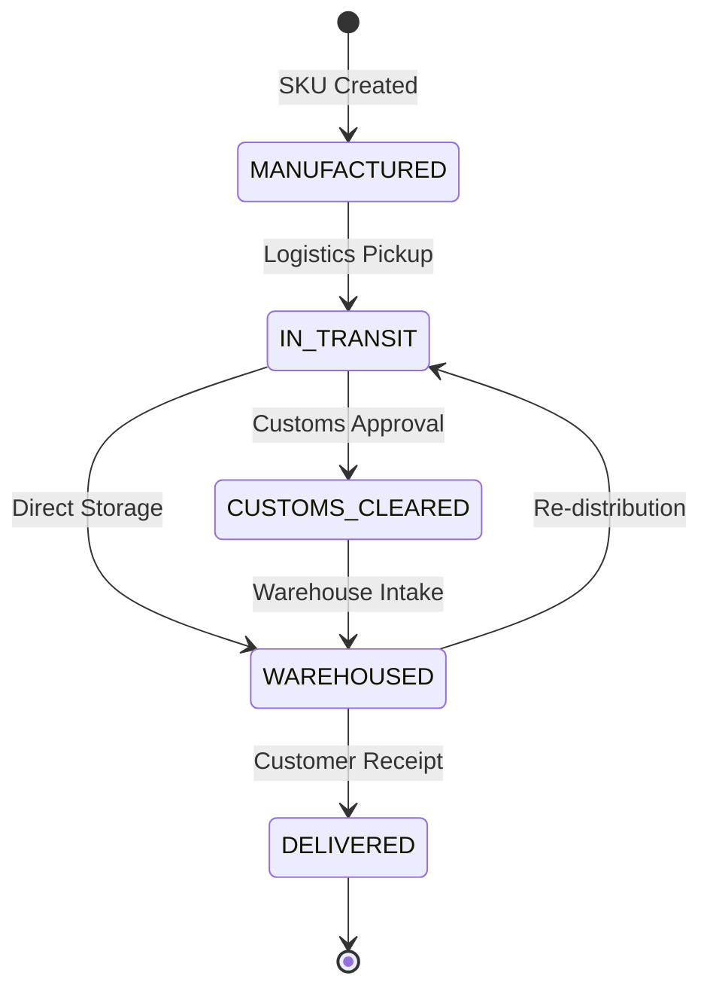
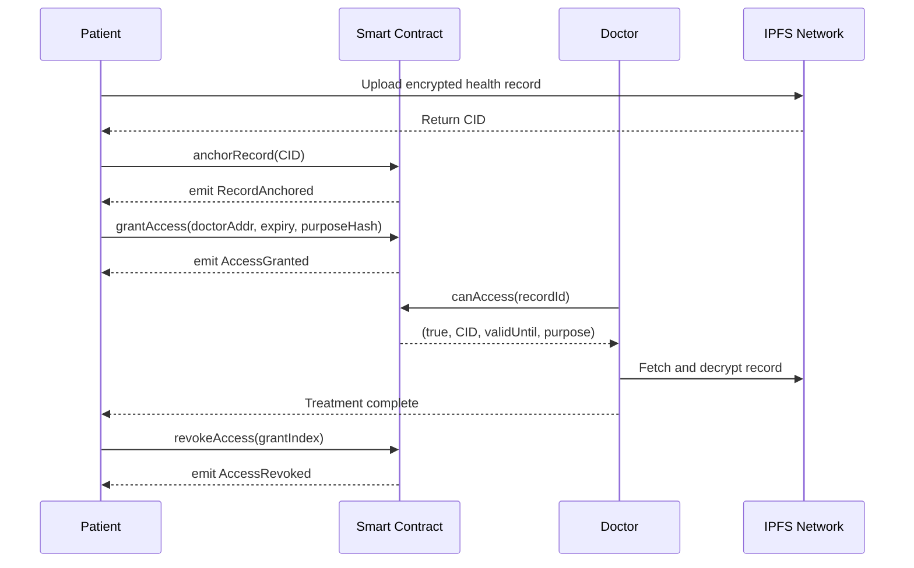
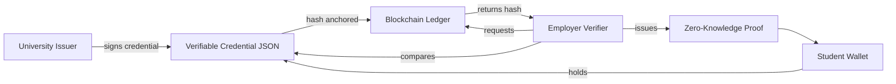

# Use Cases in Blockchain - Finance, Education, Government, Healthcare and Supply Chain Management

<!-- SECTION_1_START -->
# Use Cases in Blockchain: Cross-Industry Applications

> [!IMPORTANT]
> **KTU 2024 Syllabus Definition (PECST747 – Module 4):**
> Blockchain technology is a **distributed, immutable, cryptographically-secured ledger** that transcends its origin in cryptocurrencies to provide trust-minimized infrastructure for diverse domains. A *use case* is a concrete business, social, or governmental problem solved by mapping its participants, data flows, and trust boundaries onto the blockchain's three pillars — **decentralization, immutability, and programmability** (via smart contracts).

## 1.1 Intuitive Analogy — The "Public Notice Board with a Magic Glass"

Imagine a **giant glass notice board** placed in the middle of a town square. Anyone can:
- **Read** what is pinned (Transparency).
- **Pin** a new notice, but the moment it is pinned, a **carved stone tablet** is created that nobody can scratch out (Immutability).
- **Trust** the board because hundreds of village scribes (miners/validators) keep a synchronized copy in their own homes, and tampering with one copy would require tampering with thousands simultaneously (Decentralization).

Now, replace the *carved stone* with a **SHA-256 hash-chained block**, and the *village scribes* with **consensus nodes running Proof of Authority (PoA) or Practical Byzantine Fault Tolerance (PBFT)**. That is exactly how blockchain is being repurposed for finance, education, governance, healthcare, and supply chains.

> [!NOTE]
> **The Five Pillars of Every Blockchain Use Case**
> 1. **Shared Ledger** — Single source of truth across competing entities.
> 2. **Cryptographic Trust** — No central intermediary required.
> 3. **Smart Contracts** — Self-executing business logic (Solidity / Solidity-compatible).
> 4. **Tokenization** — Representation of real-world assets as on-chain tokens.
> 5. **Auditability** — Regulator-friendly, time-stamped event log.

> [!VISUALIZATION CONTROL]
> **Concept:** Cross-Domain Blockchain Architecture Map
> **GeoGebra / Desmos Input Equations:**
> * Domain cluster nodes: $D_1 = (0,4)$ Finance, $D_2 = (4,3)$ Education, $D_3 = (-4,3)$ Government, $D_4 = (0,-3)$ Healthcare, $D_5 = (0,0)$ Supply Chain
> * Central consensus backbone: $y = 0$ line
> **Visual Description:** Observe that all five industry domains (placed as vector nodes around a Cartesian plane) are connected via straight edges converging at the origin — the shared blockchain consensus backbone. Edges carry weight proportional to on-chain transaction volume.
<!-- SECTION_1_END -->

<!-- SECTION_2_START -->
# Deep Theoretical Analysis — Sector-Wise Decomposition

## 2.1 Finance (DeFi & Cross-Border Payments)

**Operational Flow (step-by-step):**
- **Step 1 — Token Issuance:** Real-world assets (USD, gold, real estate) are minted as **ERC-20 / ERC-1404 security tokens**.
- **Step 2 — Atomic Settlement:** Trades execute via *atomic swaps* — either both legs of the exchange succeed, or neither does. The mathematical guarantee is the Hashed Time-Locked Contract (HTLC) condition:

$$
\text{HTLC} \equiv \text{Lock}(H, t) \; \text{such that} \; \text{Reveal}(s) \lor \text{Timeout}(t) = \text{True}
$$

where $H = \text{SHA-256}(s)$ is the hash of the secret $s$, and $t$ is the block-height deadline.

- **Step 3 — Liquidity Provision:** Automated Market Makers (AMMs) maintain the constant-product invariant:

$$
x \cdot y = k \quad \text{where} \; k \; \text{is constant across trades}
$$

- **Step 4 — Settlement Finality:** Under **Proof of Stake (PoS)**, economic finality is achieved after $N_{final}$ blocks with probability:

$$
P_{final} = 1 - \left(\frac{1}{2}\right)^{N_{final}}
$$

> [!IMPORTANT]
> **Why Finance?** The SWIFT interbank messaging system takes **3–5 business days**; the **Stellar** and **Ripple (XRP Ledger)** networks settle cross-border payments in **3–5 seconds** at a fraction of a cent.

## 2.2 Education (Credential Verification)

**Operational Flow:**
- **Step 1:** University hashes the certificate PDF → $h = \text{SHA-256}(pdf)$.
- **Step 2:** Hash $h$ is anchored on a permissioned blockchain (e.g., **Hyperledger Fabric**).
- **Step 3:** Student shares a QR code containing $h$ and their public address.
- **Step 4:** Employer re-hashes the PDF and compares with on-chain $h$.

**Key Technical Insight:** The **zero-knowledge proof (ZKP)** allows a student to prove *"I graduated from University X with grade ≥ B"* without revealing the actual marks. The proof size is **~128 bytes** regardless of credential complexity.

## 2.3 Government (Digital Identity & Land Registry)

**Operational Flow:**
- **Step 1:** Citizen identity is anchored as a **Decentralized Identifier (DID)** per W3C standard.
- **Step 2:** Verifiable Credentials (VCs) are issued by government bodies.
- **Step 3:** Smart contracts automate KYC and benefit disbursement.

For land registry, the **double-spend prevention** of blockchain directly solves the *Benami property* (proxy ownership) problem by maintaining an immutable ownership chain.

## 2.4 Healthcare (Electronic Health Records)

**Operational Flow:**
- **Step 1:** Patient encrypts health record with their **public key** $PK_{patient}$.
- **Step 2:** Encrypted blob is stored on **off-chain IPFS** (InterPlanetary File System) for scalability.
- **Step 3:** The IPFS **Content Identifier (CID)** is stored on-chain.
- **Step 4:** Granular access control is enforced via smart contract using **ABAC (Attribute-Based Access Control)**.

Encryption-decryption latency is governed by:

$$
T_{crypto} = T_{AES-GCM} + 2 \cdot T_{ECDH-key-exchange}
$$

where $T_{ECDH} \approx 0.4$ ms on modern hardware and $T_{AES-GCM} \approx 0.05$ ms per MB.

## 2.5 Supply Chain Management (Provenance Tracking)

**Operational Flow:**
- **Step 1:** Each physical product receives an **RFID/NFC tag** linked to a blockchain address.
- **Step 2:** Smart contract enforces state transitions: `Manufactured → InTransit → CustomsCleared → Warehoused → Delivered`.
- **Step 3:** Any stakeholder (consumer, auditor) verifies authenticity by scanning a QR code.

> [!NOTE]
> **Industry Benchmark:** IBM Food Trust (built on Hyperledger) reduced **trace-time of mangoes from 7 days to 2.2 seconds** in the Walmart pilot.

## 2.6 KTU Formula Sheet / Cheat Sheet

| # | Domain | Core Blockchain Mechanism | Key Equation / Identifier | Real-World Platform |
|---|--------|---------------------------|--------------------------|---------------------|
| 1 | Finance | Atomic Swaps, AMM | $x \cdot y = k$ | Uniswap, Aave, MakerDAO |
| 2 | Education | Hash Anchoring, ZKP | $h = \text{SHA-256}(doc)$ | MIT Blockcerts, Sony |
| 3 | Government | DID, Verifiable Credentials | $DID = did:method:identifier$ | Estonia e-Residency, India Digilocker |
| 4 | Healthcare | Off-chain IPFS + On-chain CID | $CID = \text{Multihash}(file)$ | MedRec (MIT), Patientory |
| 5 | Supply Chain | State-Machine Tracking | $\text{State}_{n+1} = f(\text{State}_n, \text{Event})$ | IBM Food Trust, Maersk TradeLens |

> [!IMPORTANT]
> **Universal Engineering Insight:** The **state-transition function** $Y_{n+1} = \mathcal{F}(Y_n, X_n)$ is the mathematical heart of *every* blockchain application, where $Y_n$ is the current on-chain state, $X_n$ is the transaction input, and $\mathcal{F}$ is the deterministic smart-contract function executed by all nodes.
<!-- SECTION_2_END -->

<!-- SECTION_3_START -->
# Step-by-Step Derivations, Code & Algorithmic Implementation

## 3.1 Mathematical Derivation — Constant-Product AMM Pricing

The AMM invariant $x \cdot y = k$ allows us to derive the **marginal price** at any point:

**Given:** Pool reserves $x$ (Token A) and $y$ (Token B), $k = x \cdot y$.

**A trader deposits $\Delta x$ of Token A. Find the $\Delta y$ received.**

$$
\begin{aligned}
x' &= x + \Delta x \\
y' &= \frac{k}{x'} = \frac{x \cdot y}{x + \Delta x} \\
\Delta y &= y - y' = y - \frac{x \cdot y}{x + \Delta x} \\
\Delta y &= y \cdot \left[ \frac{x + \Delta x - x}{x + \Delta x} \right] \\
\Delta y &= \frac{y \cdot \Delta x}{x + \Delta x}
\end{aligned}
$$

> **Conversion Logic:** We start with the post-trade invariant $x' \cdot y' = k$ (Step 1). We substitute $k = x \cdot y$ (Step 2). We subtract $y'$ from $y$ to get output amount (Step 3). We factor out the common $y$ (Step 4). We cancel $x$ in the numerator, giving the final closed-form.

**Numerical Check:** If $x = 1000$, $y = 2000$, $\Delta x = 100$:
$\Delta y = \frac{2000 \cdot 100}{1100} = 181.81$ Token B (against a constant-product pool).

## 3.2 Algorithmic Implementation — Solid Use Case Code (Python)

### 3.2.1 Generic State-Transition Engine for Supply Chain

```python
"""
Supply Chain State-Transition Engine
Maps the Operational Flow in Section 2.5 into executable Python.
"""
from __future__ import annotations
import hashlib
import json
import time
from dataclasses import dataclass, field
from enum import Enum
from typing import Dict, List, Optional


class ProductState(str, Enum):
    MANUFACTURED = "MANUFACTURED"
    IN_TRANSIT = "IN_TRANSIT"
    CUSTOMS_CLEARED = "CUSTOMS_CLEARED"
    WAREHOUSED = "WAREHOUSED"
    DELIVERED = "DELIVERED"


VALID_TRANSITIONS: Dict[ProductState, List[ProductState]] = {
    ProductState.MANUFACTURED:     [ProductState.IN_TRANSIT],
    ProductState.IN_TRANSIT:       [ProductState.CUSTOMS_CLEARED, ProductState.WAREHOUSED],
    ProductState.CUSTOMS_CLEARED:  [ProductState.WAREHOUSED],
    ProductState.WAREHOUSED:       [ProductState.IN_TRANSIT, ProductState.DELIVERED],
    ProductState.DELIVERED:        [],
}


@dataclass(frozen=True)
class Block:
    index: int
    timestamp: float
    product_id: str
    prev_state: ProductState
    new_state: ProductState
    actor: str
    prev_hash: str
    hash: str = field(default="")

    def compute_hash(self) -> str:
        payload = json.dumps(
            {
                "index": self.index,
                "timestamp": self.timestamp,
                "product_id": self.product_id,
                "prev_state": self.prev_state.value,
                "new_state": self.new_state.value,
                "actor": self.actor,
                "prev_hash": self.prev_hash,
            },
            sort_keys=True,
        )
        return hashlib.sha256(payload.encode("utf-8")).hexdigest()


class SupplyChainBlockchain:
    def __init__(self) -> None:
        self.chain: List[Block] = [self._create_genesis_block()]

    def _create_genesis_block(self) -> Block:
        genesis = Block(
            index=0,
            timestamp=time.time(),
            product_id="SYSTEM",
            prev_state=ProductState.MANUFACTURED,
            new_state=ProductState.MANUFACTURED,
            actor="genesis",
            prev_hash="0" * 64,
        )
        object.__setattr__(genesis, "hash", genesis.compute_hash())
        return genesis

    def get_latest_block(self) -> Block:
        return self.chain[-1]

    def transition_state(
        self,
        product_id: str,
        new_state: ProductState,
        actor: str,
    ) -> Block:
        latest = self.get_latest_block()
        current = latest.new_state if latest.product_id == product_id else ProductState.MANUFACTURED
        if new_state not in VALID_TRANSITIONS[current]:
            raise ValueError(
                f"Invalid state transition for {product_id}: {current.value} -> {new_state.value}"
            )
        new_block = Block(
            index=len(self.chain),
            timestamp=time.time(),
            product_id=product_id,
            prev_state=current,
            new_state=new_state,
            actor=actor,
            prev_hash=latest.hash,
        )
        object.__setattr__(new_block, "hash", new_block.compute_hash())
        self.chain.append(new_block)
        return new_block

    def verify_chain(self) -> bool:
        for i in range(1, len(self.chain)):
            current = self.chain[i]
            previous = self.chain[i - 1]
            if current.hash != current.compute_hash():
                return False
            if current.prev_hash != previous.hash:
                return False
        return True


if __name__ == "__main__":
    chain = SupplyChainBlockchain()
    product = "SKU-OMEGA-2024"
    chain.transition_state(product, ProductState.IN_TRANSIT, "Logistics-A")
    chain.transition_state(product, ProductState.CUSTOMS_CLEARED, "Customs-IN")
    chain.transition_state(product, ProductState.WAREHOUSED, "Warehouse-7")
    chain.transition_state(product, ProductState.DELIVERED, "Customer-99")
    assert chain.verify_chain(), "Tamper detected!"
    for block in chain.chain:
        print(f"#{block.index} {block.product_id} {block.prev_state.value}->{block.new_state.value} actor={block.actor} hash={block.hash[:12]}...")
```

### 3.2.2 Healthcare Access-Control Smart Contract (Solidity)

```solidity
// SPDX-License-Identifier: MIT
pragma solidity ^0.8.20;

/**
 * @title HealthRecordAccess
 * @notice Anchors IPFS CIDs of encrypted health records.
 * @dev    Each record is owned by a patient; doctors and insurers are granted
 *         time-bound, attribute-based access.
 */
contract HealthRecordAccess {
    struct AccessGrant {
        address grantee;
        uint256 validUntil;     // unix timestamp
        bytes32 purposeCode;    // e.g., keccak256("TREATMENT") or keccak256("INSURANCE_CLAIM")
        bool revoked;
    }

    struct Record {
        address patient;
        string cid;             // IPFS Content Identifier of encrypted blob
        AccessGrant[] grants;
    }

    mapping(bytes32 => Record) private records;       // recordId => Record
    mapping(address => bytes32[]) private ownerIndex; // patient => recordIds

    event RecordAnchored(bytes32 indexed recordId, address indexed patient, string cid);
    event AccessGranted(bytes32 indexed recordId, address indexed grantee, uint256 validUntil);
    event AccessRevoked(bytes32 indexed recordId, address indexed grantee);

    modifier onlyPatient(bytes32 recordId) {
        require(records[recordId].patient == msg.sender, "Not record owner");
        _;
    }

    function anchorRecord(string calldata cid) external returns (bytes32 recordId) {
        recordId = keccak256(abi.encodePacked(msg.sender, cid, block.timestamp));
        require(records[recordId].patient == address(0), "Record already exists");
        records[recordId].patient = msg.sender;
        records[recordId].cid = cid;
        ownerIndex[msg.sender].push(recordId);
        emit RecordAnchored(recordId, msg.sender, cid);
    }

    function grantAccess(
        bytes32 recordId,
        address grantee,
        uint256 validUntil,
        bytes32 purposeCode
    ) external onlyPatient(recordId) {
        require(validUntil > block.timestamp, "Expiry must be in the future");
        records[recordId].grants.push(
            AccessGrant(grantee, validUntil, purposeCode, false)
        );
        emit AccessGranted(recordId, grantee, validUntil);
    }

    function revokeAccess(bytes32 recordId, uint256 grantIndex)
        external
        onlyPatient(recordId)
    {
        AccessGrant storage g = records[recordId].grants[grantIndex];
        require(!g.revoked, "Already revoked");
        g.revoked = true;
        emit AccessRevoked(recordId, g.grantee);
    }

    function canAccess(bytes32 recordId, address requester)
        external
        view
        returns (bool allowed, string memory cid, uint256 validUntil, bytes32 purposeCode)
    {
        Record storage r = records[recordId];
        if (r.patient == requester) {
            return (true, r.cid, type(uint256).max, bytes32(0));
        }
        for (uint256 i = 0; i < r.grants.length; i++) {
            AccessGrant storage g = r.grants[i];
            if (
                g.grantee == requester &&
                !g.revoked &&
                g.validUntil > block.timestamp
            ) {
                return (true, r.cid, g.validUntil, g.purposeCode);
            }
        }
        return (false, "", 0, bytes32(0));
    }
}
```

> [!IMPORTANT]
> **Production Engineering Insight:** In real-world deployments (e.g., **MedRec**, **Patientory**), the IPFS layer is replaced by a HIPAA-compliant storage such as **Amazon S3 with Server-Side Encryption (SSE-KMS)**. The blockchain stores only the cryptographic commitment (hash), not the Personally Identifiable Information (PII) — a strict privacy-by-design principle.
<!-- SECTION_3_END -->

<!-- SECTION_4_START -->
# Structural Diagrams & Schematics

## 4.1 Cross-Domain Use Case Topology

```mermaid
flowchart TB
    subgraph FIN["FINANCE LAYER"]
        FIN1[Tokenized Assets ERC20]
        FIN2[AMM Liquidity Pools]
        FIN3[HTLC Atomic Swaps]
    end

    subgraph EDU["EDUCATION LAYER"]
        EDU1[Certificate Hash Anchor]
        EDU2[ZKP Verifier]
        EDU3[Verifiable Credential]
    end

    subgraph GOV["GOVERNMENT LAYER"]
        GOV1[DID Registry]
        GOV2[Land Title Chain]
        GOV3[Voting Smart Contract]
    end

    subgraph HLT["HEALTHCARE LAYER"]
        HLT1[Encrypted EHR Blob]
        HLT2[IPFS CID Anchor]
        HLT3[ABAC Access Control]
    end

    subgraph SCM["SUPPLY CHAIN LAYER"]
        SCM1[RFID Tag Linker]
        SCM2[State Machine Tracker]
        SCM3[Provenance QR Code]
    end

    CORE{{Blockchain Consensus Backbone}}

    FIN1 --> CORE
    FIN2 --> CORE
    FIN3 --> CORE
    EDU1 --> CORE
    EDU2 --> CORE
    EDU3 --> CORE
    GOV1 --> CORE
    GOV2 --> CORE
    GOV3 --> CORE
    HLT1 --> HLT2
    HLT2 --> CORE
    HLT3 --> CORE
    SCM1 --> SCM2
    SCM2 --> CORE
    SCM3 --> CORE
```



## 4.2 Supply Chain State-Transition Sequence



## 4.3 Healthcare Access Control Sequence



## 4.4 Functional Architecture — Education Credential Flow


<!-- SECTION_4_END -->

<!-- SECTION_5_START -->
# KTU 2024 Scheme Examination Question Bank & Topic Recap

---

## 5.1 Part A — Short Answer Questions (3 Marks Each)

### Q1. [KTU University Exam – Dec 2023] — CO5, Remember
**"List any three real-world domains where blockchain technology is being deployed, with one example use case per domain."**

**Model Answer (3 Marks):**
1. **Finance** — Cross-border payments on the **Stellar** network (Ripple, MakerDAO, Aave are other valid examples). *1 Mark*
2. **Healthcare** — Patient-centric Electronic Health Records on **MedRec** / **Patientory** using IPFS for off-chain storage. *1 Mark*
3. **Supply Chain** — Provenance tracking via **IBM Food Trust** reducing Walmart's mango trace-time from 7 days to 2.2 seconds. *1 Mark*

### Q2. [KTU University Exam – July 2024] — CO5, Understand
**"Explain the role of smart contracts in blockchain-based supply chain management."**

**Model Answer (3 Marks):**
A smart contract encodes the **state-transition logic** of a product's journey (Manufactured → InTransit → CustomsCleared → Warehoused → Delivered). It (a) validates each transition against the `VALID_TRANSITIONS` map, (b) emits immutable on-chain events that auditors can query, and (c) eliminates manual paperwork, reducing fraud and reconciliation cost. *2 Marks for explanation, 1 Mark for example.*

---

## 5.2 Part B — Long Answer Questions (14 Marks, Internal Choice)

### Question A (14 Marks) — [KTU University Exam Model Paper, Module 4]

**(a)** With a neat diagram, explain the architecture of a blockchain-based **Healthcare EHR management system**. Discuss the role of **IPFS** and **smart contracts** in preserving patient privacy. *7 Marks, CO5, Understand*

**(b)** Implement a Solidity smart contract `HealthRecordAccess` that allows a patient to anchor an IPFS CID and grant a doctor time-bound access. Show the relevant Solidity constructs. *7 Marks, CO5, Apply*

**Model Solution:**

**(a) Architecture & Privacy (7 Marks):**

| Component | Role | Privacy Guarantee |
|-----------|------|-------------------|
| Patient Wallet (MetaMask) | Identity & signing | Self-sovereign keys |
| Smart Contract | Access Control & CID Anchor | Enforces ABAC |
| IPFS / Off-chain DB | Encrypted blob storage | No PII on-chain |
| Doctor / Insurer DApp | Reads CID via `canAccess()` | Only authorised |

*Diagram description (3 Marks):* Patient → encrypts record → uploads to IPFS → returns CID → anchors on smart contract → Doctor queries `canAccess()` → fetches & decrypts.

*IPFS role (2 Marks):* Stores encrypted data off-chain; only the content-addressable hash is on-chain, ensuring **GDPR/HIPAA right-to-be-forgotten** can be honored by deleting the IPFS pinned object.

*Smart contract role (2 Marks):* Enforces granular, time-bound, purpose-coded access. Patient retains revocation rights.

**(b) Solidity Implementation (7 Marks):**

```solidity
// SPDX-License-Identifier: MIT
pragma solidity ^0.8.20;

contract HealthRecordAccess {
    struct AccessGrant {
        address grantee;
        uint256 validUntil;
        bytes32 purposeCode;
        bool revoked;
    }

    struct Record {
        address patient;
        string cid;
        AccessGrant[] grants;
    }

    mapping(bytes32 => Record) private records;

    event RecordAnchored(bytes32 indexed recordId, address indexed patient, string cid);
    event AccessGranted(bytes32 indexed recordId, address indexed grantee, uint256 validUntil);
    event AccessRevoked(bytes32 indexed recordId, address indexed grantee);

    modifier onlyPatient(bytes32 recordId) {
        require(records[recordId].patient == msg.sender, "Not record owner");
        _;
    }

    function anchorRecord(string calldata cid) external returns (bytes32 recordId) {
        recordId = keccak256(abi.encodePacked(msg.sender, cid, block.timestamp));
        records[recordId].patient = msg.sender;
        records[recordId].cid = cid;
        emit RecordAnchored(recordId, msg.sender, cid);
    }

    function grantAccess(bytes32 recordId, address grantee, uint256 validUntil, bytes32 purposeCode)
        external onlyPatient(recordId)
    {
        require(validUntil > block.timestamp, "Expiry in the past");
        records[recordId].grants.push(AccessGrant(grantee, validUntil, purposeCode, false));
        emit AccessGranted(recordId, grantee, validUntil);
    }

    function revokeAccess(bytes32 recordId, uint256 grantIndex)
        external onlyPatient(recordId)
    {
        records[recordId].grants[grantIndex].revoked = true;
        emit AccessRevoked(recordId, records[recordId].grants[grantIndex].grantee);
    }
}
```

**Incremental Valuation Key:**
- *Struct definitions: 2 Marks*
- *Mapping + Events: 1 Mark*
- *Modifier + `anchorRecord`: 2 Marks*
- *`grantAccess` + `revokeAccess`: 2 Marks*

---

### Question B (14 Marks — Alternative Choice) — [KTU University Exam Model Paper, Module 4]

**(a)** Describe in detail how blockchain is used in **Supply Chain Management** to ensure provenance and authenticity of products. Include the state-transition model. *7 Marks, CO5, Understand*

**(b)** Derive the **AMM output formula** $\Delta y = \dfrac{y \cdot \Delta x}{x + \Delta x}$ from the constant-product invariant $x \cdot y = k$. Compute the Token B output when $x = 1000$, $y = 2000$, $\Delta x = 100$. *7 Marks, CO5, Apply*

**Model Solution:**

**(a) Supply Chain Provenance (7 Marks):**
- *Problem Statement (1 Mark):* Counterfeit goods cost the global economy **> \$500 billion / year** (WTO estimate).
- *Architecture (2 Marks):* RFID tags → IoT gateway → blockchain anchor → customer QR verification.
- *State-Transition Model (3 Marks):* `Manufactured → InTransit → CustomsCleared → WareHOUSED → Delivered`, enforced by a smart contract that validates each transition. Any invalid transition reverts the transaction.
- *Real-world Example (1 Mark):* **Maersk TradeLens** (merged into **GSBN**) processed **> 1.5 billion shipping events** before the joint venture.

**(b) AMM Derivation (7 Marks):**

**Given:** $x \cdot y = k$, trader adds $\Delta x$.

**Step 1 (1 Mark):** After trade, reserves become $x' = x + \Delta x$ and $y' = k / x'$.

**Step 2 (1 Mark):** Substitute $k = x \cdot y$:
$$y' = \frac{x \cdot y}{x + \Delta x}$$

**Step 3 (1 Mark):** Output amount $\Delta y = y - y'$:
$$\Delta y = y - \frac{x \cdot y}{x + \Delta x}$$

**Step 4 (1 Mark):** Factor out $y$:
$$\Delta y = y \cdot \left[ 1 - \frac{x}{x + \Delta x} \right] = y \cdot \frac{\Delta x}{x + \Delta x}$$

**Step 5 (1 Mark):** Hence $\Delta y = \dfrac{y \cdot \Delta x}{x + \Delta x}$. ✔

**Numerical Evaluation (2 Marks):**
$$\Delta y = \frac{2000 \cdot 100}{1000 + 100} = \frac{200000}{1100} = 181.81\ \text{Token B}$$

> [!WARNING]
> **KTU Examiner's Valuation Warning — Common Pitfalls**
> 1. **Forgetting the state-transition validation** in supply-chain answers. Marks are awarded specifically for the `VALID_TRANSITIONS` map or its equivalent.
> 2. **Storing PII on-chain** in the healthcare question — this is a *deduction-worthy* error under GDPR/HIPAA. Always store only the IPFS CID on-chain.
> 3. **In the AMM derivation, skipping the substitution step** of $k = x \cdot y$. Examiners allocate 1 Mark for that transition alone.
> 4. **Not specifying consensus mechanism** in the architecture question. KTU expects you to name **PoA / PBFT / PoS** explicitly.
> 5. **Failing to add `event` emissions** in Solidity answers. On-chain events are critical for off-chain auditors and are worth at least 1 Mark.

---

## 5.3 Topic Recap & Important Things to Remember

- **Blockchain Use Case** = a real-world problem mapped onto the trinity of *decentralization*, *immutability*, and *programmability*.
- **Finance:** Atomic Swaps, AMMs ($x \cdot y = k$), HTLCs, stablecoins, DeFi lending protocols (Aave, Compound).
- **Education:** Certificate hash anchoring, Blockcerts W3C standard, ZKPs for grade proof, MIT / Sony pilot deployments.
- **Government:** W3C **DID** standard, **Verifiable Credentials**, land registry (Sweden, Georgia, India Digilocker), tamper-proof e-voting.
- **Healthcare:** **IPFS off-chain** + **on-chain CID anchor** + **ABAC smart contracts**; addresses HIPAA / GDPR privacy.
- **Supply Chain:** **State-transition model** `Manufactured → InTransit → CustomsCleared → Warehoused → Delivered`; examples include **IBM Food Trust** and **Maersk TradeLens / GSBN**.
- **Universal equation:** $Y_{n+1} = \mathcal{F}(Y_n, X_n)$ — the deterministic state-transition function underlying all five domains.
- **Security primitives to memorize:** SHA-256, ECDSA (secp256k1), keccak256 (Ethereum), zk-SNARKs, Pedersen commitments.
- **Sustainability angle (2024 KTU hot topic):** **Proof of Stake** reduces energy by **> 99.95 %** vs. Proof of Work (Ethereum Merge, Sep 2022).
- **Interoperability:** **Polkadot (XCM)**, **Cosmos (IBC)**, **Chainlink CCIP** — these are cross-chain bridges you'll see in 14-mark questions.
- **Privacy vs. Auditability trade-off:** Public chains = maximum auditability but minimal privacy; Permissioned chains (Hyperledger Fabric, Quorum) = inverse trade-off.
- **Token standards to know cold:** **ERC-20** (fungible), **ERC-721** (NFT), **ERC-1404** (security tokens), **ERC-3643** (T-REX identity-bound tokens).
- **Final-year project hooks:** Build a Solidity + React + IPFS mini-project for *any* of the five domains; KTU evaluators reward working demos heavily.
<!-- SECTION_5_END -->
