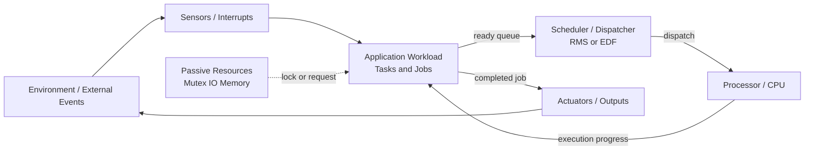
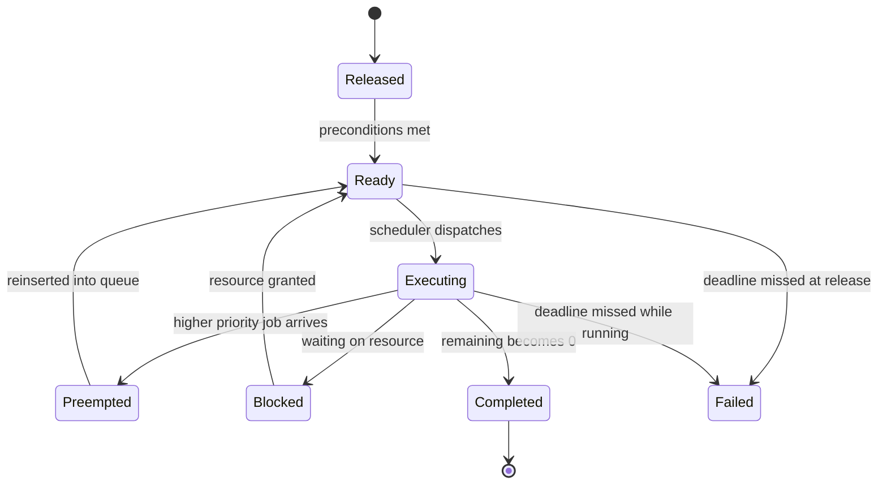
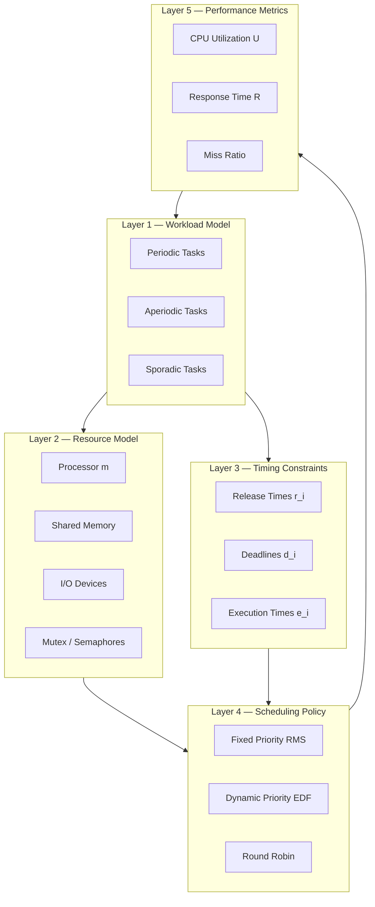
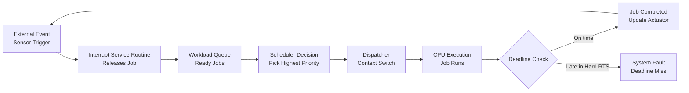

# basic model of Real-Time systems

<!-- SECTION_1_START -->

# Basic Model of Real-Time Systems

## 1.1 Formal Definition (KTU 2024 Syllabus Terminology)

> [!IMPORTANT]
> **Real-Time System (RTS):** A real-time system is a computer system whose correctness depends not only on the **logical correctness of the computed result** but also on the **time at which the result is delivered**. A late response is considered a **failure**, even if the result is logically accurate.

A **basic model of a real-time system** is an abstract framework that describes the essential structural and temporal elements of any RTS. It abstracts the system into **five interacting components**:

1. **Workload Model** — describes the *jobs* and *tasks* the system must execute.
2. **Resource Model** — describes the *processors* and *shared resources* available.
3. **Timing Constraints Model** — defines *release times*, *deadlines*, and *execution times*.
4. **Scheduler / Scheduling Algorithm** — decides *when* and *which* job runs.
5. **Environment / Event Model** — external stimuli (interrupts, sensors, messages) that trigger jobs.

> [!NOTE]
> **Workload:** The set of all jobs (computations) the system has to perform.
> **Resource:** Any software or hardware entity needed for job completion (CPU, mutex, I/O device).
> **Scheduler:** A software module that assigns jobs to processors according to a defined policy.

---

## 1.2 Conceptual Analogy — "The Hospital Emergency Room"

Imagine a hospital **Emergency Room (ER)** as a real-time system:

| ER Element | Real-Time System Counterpart |
|---|---|
| Patient arriving with a heart attack | **Job released** at a specific time $r_i$ |
| Doctor (resource) | **Processor / Resource** |
| Treatment duration | **Execution time** $e_i$ |
| Critical window to save the patient | **Deadline** $d_i$ |
| Triage nurse prioritizing patients | **Scheduler** |
| ECG monitor sending alerts | **Event / Interrupt** from environment |

- A patient arriving at 10:00 AM must be treated **within 15 minutes** (hard deadline) — the system *must* respond in time.
- A non-critical patient may tolerate some delay (soft deadline).

Just as the ER is structured into **triage → assignment → treatment**, a real-time system model is structured into **event → release → schedule → execute → complete**.

> [!VISUALIZATION CONTROL]
> **Concept:** Job Lifetime on a Time Axis
> **GeoGebra / Desmos Input Equations:**
> * Point: $(r_i,\ 1)$ — release time
> * Point: $(r_i+e_i,\ 1)$ — completion time
> * Point: $(d_i,\ 1)$ — deadline
> **Visual Description:** Draw a horizontal time axis. Mark three vertical lines labeled **Release**, **Finish**, and **Deadline**. The shaded interval between Release and Finish represents execution. The interval between Finish and Deadline represents *slack* (positive or negative).

---

## 1.3 Hard vs. Soft Real-Time Systems

> [!IMPORTANT]
> **Hard Real-Time System:** Missing a deadline is a **catastrophic system failure** (loss of life, mission failure, financial loss). Example: aircraft flight control, anti-lock braking, nuclear reactor control.
>
> **Soft Real-Time System:** Missing a deadline results in **degraded performance** but not catastrophic failure. Example: video streaming, online gaming, audio playback.

| Property | Hard Real-Time | Soft Real-Time |
|---|---|---|
| Deadline miss consequence | System failure | Performance drop |
| Determinism | Strictly required | Best effort |
| Validation | Static / formal | Statistical |
| Example | Airbag deployment | Netflix buffering |

> [!NOTE]
> **Firm Real-Time System:** A special case where a few late results may be discarded without penalty, but *all* results beyond a threshold are useless (e.g., stock price updates — stale data is discarded).

---

## 1.4 Jobs, Tasks, and Their Parameters

> [!IMPORTANT]
> **Job:** A single unit of work. Each invocation of a computation is a *job*. Also called a *request* or *instance*.
>
> **Task:** A set of *related jobs* that collectively provide a system function. A task is the *template*; jobs are its *instantiations*.

### Job Parameters (with KTU-standard notation)

| Parameter | Symbol | Meaning |
|---|---|---|
| Release time (arrival time) | $r_i$ | Time job $J_i$ becomes ready for execution |
| Execution time | $e_i$ | Worst-case CPU time to complete $J_i$ |
| Absolute deadline | $d_i$ | Time by which $J_i$ must finish |
| Start time | $s_i$ | Time at which $J_i$ actually starts executing |
| Finish time (completion) | $f_i$ | Time at which $J_i$ completes |
| Response time | $R_i = f_i - r_i$ | Total time from release to finish |
| Lateness | $L_i = f_i - d_i$ | Positive if late, negative if early |
| Tardiness | $\max(0,\ f_i - d_i)$ | Amount of time past deadline (if any) |
| Slack time | $d_i - r_i - e_i$ | Buffer time before deadline |

### Task Parameters

| Parameter | Symbol | Meaning |
|---|---|---|
| Period | $p_i$ | Time between consecutive job releases (periodic tasks) |
| Phase (offset) | $\phi_i$ | Release time of the first job |
| Relative deadline | $D_i$ | Deadline expressed relative to release ($d_i = r_i + D_i$) |
| Utilization | $U_i = e_i / p_i$ | Fraction of CPU consumed by task |

---

## 1.5 Types of Tasks by Release Pattern

> [!IMPORTANT]
> **Periodic Task ($\tau_i$):** Releases jobs *regularly* every $p_i$ time units. The $k$-th job is released at $r_{i,k} = \phi_i + (k-1) \cdot p_i$.
>
> **Aperiodic Task:** Jobs released at *irregular* intervals; no minimum inter-arrival time. Cannot be predicted in advance.
>
> **Sporadic Task:** Aperiodic jobs with a *minimum inter-arrival time* $p_i$ between successive releases. Used for unpredictable but bounded events (e.g., operator button press).

**Example:** A temperature sensor reads every 100 ms → **periodic task** with $p = 100$ ms. An emergency stop button has a minimum 500 ms debounce → **sporadic task** with $p_{min} = 500$ ms. A user login event → **aperiodic task**.

---

## 1.6 Why the "Basic Model" Matters in Engineering

The basic model is the **first step in every real-time system design** because it lets engineers:

- **Analyze feasibility** — can all jobs meet their deadlines given available CPU speed?
- **Choose a scheduling algorithm** — Rate Monotonic, Earliest Deadline First, etc.
- **Validate timing** — using Response Time Analysis or Utilization-Based Tests.
- **Allocate resources** — processors, memory, buses, mutexes.

> [!NOTE]
> In production engineering, the model underlies **AUTOSAR** (automotive), **ARINC 653** (aerospace), and **VxWorks/RTEMS** (embedded) scheduling kernels.

---

<!-- SECTION_1_END -->

<!-- SECTION_2_START -->

# Deep Theoretical Analysis — The Basic RTS Model

## 2.1 Architectural Decomposition of the Model

The basic model of a real-time system can be decomposed into **three tightly coupled layers**:

### Layer 1: Application Layer (Workload)
- A set of **n tasks** $\mathcal{T} = \{\tau_1, \tau_2, \ldots, \tau_n\}$
- Each task $\tau_i$ generates an **infinite (or finite) sequence of jobs** $J_{i,1}, J_{i,2}, \ldots$
- Each job $J_{i,k}$ has the timing parameters $\{(r_{i,k}, e_{i,k}, d_{i,k})\}$ described earlier.

### Layer 2: Resource Layer
- **Processors:** $m$ identical (or heterogeneous) CPUs.
- **Passive resources:** shared memory, I/O devices, mutexes, semaphores.
- **Active resources:** DMA controllers, timers, co-processors.

### Layer 3: Scheduling / Control Layer
- A **scheduler** observes the state of jobs in the *ready queue* and decides which job executes on which processor at each instant.
- Schedulers can be **preemptive** (can pause a running job) or **non-preemptive**.

---

## 2.2 Job State Lifecycle

A job transitions through the following states during its lifetime:

> [!IMPORTANT]
> **Released → Ready → Executing → Completed (or Aborted)**
>
> A job may also enter **Suspended / Preempted** if a higher-priority job arrives.

| State | Description |
|---|---|
| **Released** | Job created; waiting in queue |
| **Ready** | All pre-conditions met; waiting for processor |
| **Executing** | Currently running on a processor |
| **Blocked** | Waiting for a passive resource (mutex, I/O) |
| **Suspended / Preempted** | Paused by scheduler to run another job |
| **Completed** | Finished successfully before/at deadline |
| **Failed (Hard RTS)** | Missed its deadline; considered a system fault |

---

## 2.3 Preemptive vs. Non-Preemptive Scheduling

> [!IMPORTANT]
> **Preemptive Scheduling:** The scheduler can forcibly stop a running job and resume it later. Enables higher-priority urgent jobs to run immediately.
>
> **Non-Preemptive Scheduling:** Once a job starts, it runs to completion. Simpler, but worst-case response time is harder to bound.

| Property | Preemptive | Non-Preemptive |
|---|---|---|
| Response to urgent events | Immediate | Delayed until current job ends |
| Implementation complexity | High (context switch) | Low |
| Worst-case latency | Bounded tightly | Loose bound |
| Used in | VxWorks, FreeRTOS, RTEMS | Simple microcontrollers |

---

## 2.4 KTU High-Yield Formula Sheet

> [!NOTE]
> All formulas below are **exam-favorite** and frequently appear in KTU 2024 Scheme End Semester Exams (ESE) for the course **PECST748 — Real-Time Systems**.

### A. Job-Level Timing Formulas

$$
\begin{aligned}
\text{Response Time:} \quad & R_i = f_i - r_i \\[4pt]
\text{Lateness:} \quad & L_i = f_i - d_i \\[4pt]
\text{Tardiness:} \quad & T_i = \max\!\left(0,\ f_i - d_i\right) \\[4pt]
\text{Slack Time:} \quad & \text{Slack}_i = d_i - r_i - e_i
\end{aligned}
$$

### B. Task-Level / Periodic Formulas

$$
\begin{aligned}
\text{Utilization of task } \tau_i: \quad & U_i = \frac{e_i}{p_i} \\[4pt]
\text{Total CPU Utilization:} \quad & U_{\text{total}} = \sum_{i=1}^{n} \frac{e_i}{p_i} \\[4pt]
\text{Hyperperiod of task set:} \quad & H = \text{LCM}\!\left(p_1, p_2, \ldots, p_n\right) \\[4pt]
\text{Number of jobs in hyperperiod:} \quad & N = \sum_{i=1}^{n} \frac{H}{p_i} \\[4pt]
\text{Phase-shifted release of } k\text{-th job:} \quad & r_{i,k} = \phi_i + (k-1) \cdot p_i
\end{aligned}
$$

### C. Feasibility Conditions (for Rate Monotonic Scheduling, RMS)

$$
\begin{aligned}
\text{Necessary Condition:} \quad & \sum_{i=1}^{n} \frac{e_i}{p_i} \leq 1 \\[4pt]
\text{Sufficient (Liu \& Layland, 1973):} \quad & \sum_{i=1}^{n} \frac{e_i}{p_i} \leq n\!\left(2^{1/n} - 1\right)
\end{aligned}
$$

| $n$ | $\, n(2^{1/n} - 1) \,$ (RMS bound) |
|---:|:---|
| 1 | 1.000 |
| 2 | 0.828 |
| 3 | 0.780 |
| 4 | 0.757 |
| 5 | 0.743 |
| $\infty$ | $\ln 2 \approx 0.693$ |

> [!IMPORTANT]
> **Critical Insight:** RMS guarantees all deadlines are met **only** if the total utilization is below the bound. Above the bound, the schedule is *not necessarily infeasible* — but the bound can no longer prove feasibility.

### D. Response Time Analysis (RTA) — Exact Test

The response time of a job in a fixed-priority system is the smallest fixed point of:

$$
R_i = e_i + \sum_{j \in hp(i)} \left\lceil \frac{R_i}{p_j} \right\rceil \cdot e_j
$$

where $hp(i)$ = the set of tasks with **higher priority** than $\tau_i$.

> The job meets its deadline if and only if $R_i \leq D_i$.

---

## 2.5 Real-World Engineering Utility

| Domain | Use of Basic RTS Model |
|---|---|
| **Automotive (AUTOSAR, OSEK)** | Schedules engine control, brake-by-wire with hard deadlines |
| **Avionics (ARINC 653)** | Partitions time-slices for flight-critical and mission-critical tasks |
| **Industrial Robotics** | Ensures motion control loops close within milliseconds |
| **Medical Devices** | Pacemakers, infusion pumps — life-critical timing |
| **Telecommunications (5G)** | Baseband processing with sub-millisecond latency |
| **IoT / Embedded** | Smart home, wearables with periodic sensor sampling |

In **production-grade embedded systems**, this model is the foundation upon which operating systems like **FreeRTOS**, **VxWorks**, **RTEMS**, and **QNX Neutrino** are built.

---

## 2.6 Workload Assumptions in the Basic Model

A canonical basic RTS model assumes:

1. **Single processor** (extensions exist for multiprocessor).
2. **All jobs are independent** (no precedence, no shared data initially).
3. **Preemptive scheduling** is available.
4. **Zero context-switch overhead** (or bounded).
5. **Known worst-case execution time (WCET)** for every job.
6. **Periodic or sporadic tasks only** (with bounded aperiodic arrivals).

> [!NOTE]
> Relaxing these assumptions (e.g., precedence constraints, resource sharing, multiprocessor) is what advanced modules of PECST748 explore — covered in Modules 2, 3, and 4.

---

<!-- SECTION_2_END -->

<!-- SECTION_3_START -->

# Step-by-Step Derivations, Worked Examples, and Code Implementation

## 3.1 Worked Example 1 — Basic Job Timing

> **Problem:** A job $J_1$ is released at $r_1 = 0$ ms, has execution time $e_1 = 8$ ms, and absolute deadline $d_1 = 25$ ms. It actually starts at $s_1 = 2$ ms and finishes at $f_1 = 10$ ms. Compute: response time, lateness, tardiness, and slack.

### Solution

**Step 1 — Response Time $R_1$:**

$$
R_1 = f_1 - r_1 = 10 - 0 = 10 \text{ ms}
$$

**[1 Mark]** for writing the formula, **[1 Mark]** for substitution, **[1 Mark]** for the answer with units.

**Step 2 — Lateness $L_1$:**

$$
L_1 = f_1 - d_1 = 10 - 25 = -15 \text{ ms}
$$

Since $L_1 < 0$, the job finished **15 ms before** its deadline. ✓

**Step 3 — Tardiness $T_1$:**

$$
T_1 = \max(0,\ f_1 - d_1) = \max(0,\ -15) = 0 \text{ ms}
$$

The job is **not tardy** (it is on time).

**Step 4 — Slack Time:**

$$
\text{Slack}_1 = d_1 - r_1 - e_1 = 25 - 0 - 8 = 17 \text{ ms}
$$

The job had 17 ms of free time before the deadline.

> [!IMPORTANT]
> **Interpretation:** A *negative* slack means the job is already late *the moment* it is released (i.e., $d_i - r_i < e_i$) — such jobs are **infeasible** by definition.

---

## 3.2 Worked Example 2 — Utilization and Hyperperiod

> **Problem:** Consider a task set:
> - $\tau_1$: $p_1 = 4$ ms, $e_1 = 1$ ms
> - $\tau_2$: $p_2 = 5$ ms, $e_2 = 2$ ms
> - $\tau_3$: $p_3 = 20$ ms, $e_3 = 3$ ms
>
> Compute: (a) per-task utilization, (b) total CPU utilization, (c) hyperperiod, (d) number of jobs in the hyperperiod.

### Solution

**Step (a) — Per-task utilization:**

$$
\begin{aligned}
U_1 = \frac{e_1}{p_1} = \frac{1}{4} = 0.25 \\[4pt]
U_2 = \frac{e_2}{p_2} = \frac{2}{5} = 0.40 \\[4pt]
U_3 = \frac{e_3}{p_3} = \frac{3}{20} = 0.15
\end{aligned}
$$

**Step (b) — Total utilization:**

$$
U_{\text{total}} = U_1 + U_2 + U_3 = 0.25 + 0.40 + 0.15 = 0.80
$$

**Step (c) — Hyperperiod** (LCM of 4, 5, 20):

$$
H = \text{LCM}(4, 5, 20) = 20 \text{ ms}
$$

**Step (d) — Number of jobs in hyperperiod:**

$$
N = \frac{H}{p_1} + \frac{H}{p_2} + \frac{H}{p_3} = \frac{20}{4} + \frac{20}{5} + \frac{20}{20} = 5 + 4 + 1 = 10 \text{ jobs}
$$

**Step (e) — Feasibility check (Liu \& Layland bound for $n = 3$):**

$$
\sum U_i = 0.80 \quad \leq \quad 3(2^{1/3} - 1) \approx 0.780 \;\; \text{???}
$$

Since $0.80 > 0.780$, the **sufficient condition fails**, but feasibility is *not disproven* — we must use the **exact Response Time Analysis (RTA)**.

---

## 3.3 Worked Example 3 — Response Time Analysis (RTA)

Using the task set from Example 2 with priorities $\tau_1 > \tau_2 > \tau_3$ (Rate Monotonic: shorter period = higher priority):

**Compute $R_3$ (lowest priority, no higher-priority tasks compete for it… wait, $\tau_1$ and $\tau_2$ both have higher priority):**

$$
R_3^{(0)} = e_3 = 3
$$

$$
R_3^{(1)} = e_3 + \left\lceil \frac{3}{4} \right\rceil \cdot e_1 + \left\lceil \frac{3}{5} \right\rceil \cdot e_2 = 3 + 1 \cdot 1 + 1 \cdot 2 = 6
$$

$$
R_3^{(2)} = 3 + \left\lceil \frac{6}{4} \right\rceil \cdot 1 + \left\lceil \frac{6}{5} \right\rceil \cdot 2 = 3 + 2 + 4 = 9
$$

$$
R_3^{(3)} = 3 + \left\lceil \frac{9}{4} \right\rceil \cdot 1 + \left\lceil \frac{9}{5} \right\rceil \cdot 2 = 3 + 3 + 4 = 10
$$

$$
R_3^{(4)} = 3 + \left\lceil \frac{10}{4} \right\rceil \cdot 1 + \left\lceil \frac{10}{5} \right\rceil \cdot 2 = 3 + 3 + 4 = 10
$$

**Fixed point reached:** $R_3 = 10$ ms.

**Feasibility check:** $R_3 = 10$ ms $\leq D_3 = p_3 = 20$ ms ✓

> The schedule is **feasible** — the exact RTA proves what the sufficient bound could not.

---

## 3.4 Python Implementation — Job & Task Simulator

> [!NOTE]
> The following Python code implements a **complete real-time system basic-model simulator**. It accepts a task set, simulates a **Rate Monotonic Scheduler**, computes all timing metrics, and validates deadlines.

```python
from __future__ import annotations
import math
from dataclasses import dataclass, field
from typing import List, Optional, Tuple
import logging

# Configure logging for debugging and tracing
logging.basicConfig(
    level=logging.INFO,
    format="%(asctime)s [%(levelname)s] %(message)s",
)
logger = logging.getLogger("RTS_Simulator")


@dataclass(frozen=True)
class Task:
    """A periodic real-time task."""
    task_id: str
    period: int          # Period p_i (in time units)
    execution: int       # Worst-case execution time e_i
    deadline: Optional[int] = None  # Relative deadline D_i; defaults to period

    def __post_init__(self) -> None:
        if self.period <= 0:
            raise ValueError(f"Period must be > 0 (got {self.period}) for task {self.task_id}")
        if self.execution <= 0:
            raise ValueError(f"Execution time must be > 0 (got {self.execution}) for task {self.task_id}")
        if self.execution > self.period:
            raise ValueError(
                f"Task {self.task_id} is INFEASIBLE: execution {self.execution} > period {self.period}"
            )
        if self.deadline is None:
            object.__setattr__(self, "deadline", self.period)
        if self.deadline > self.period:
            raise ValueError(
                f"Deadline {self.deadline} > period {self.period} for task {self.task_id} not allowed in basic model"
            )

    @property
    def utilization(self) -> float:
        """U_i = e_i / p_i"""
        return self.execution / self.period


@dataclass
class Job:
    """A single job (instance) of a task."""
    job_id: str
    task_id: str
    release: int         # Release time r_i
    execution: int       # Execution time e_i
    absolute_deadline: int
    priority: int
    finish: Optional[int] = None
    start: Optional[int] = None
    remaining: int = field(init=False)

    def __post_init__(self) -> None:
        self.remaining = self.execution

    @property
    def response_time(self) -> Optional[int]:
        return None if self.finish is None else (self.finish - self.release)

    @property
    def lateness(self) -> Optional[int]:
        return None if self.finish is None else (self.finish - self.absolute_deadline)


class RateMonotonicScheduler:
    """
    Rate Monotonic Scheduling (RMS) simulator for a single processor.
    Lower period => higher priority (ties broken by task_id).
    """

    def __init__(self, tasks: List[Task], duration: int) -> None:
        self.tasks: List[Task] = sorted(tasks, key=lambda t: (t.period, t.task_id))
        self.duration: int = duration
        self.priority_map: dict[str, int] = {t.task_id: idx for idx, t in enumerate(self.tasks)}
        self.jobs: List[Job] = []
        self.timeline: List[Tuple[int, Optional[str]]] = []  # (time, running_task_id or None)

    # ---------- Job Generation ----------
    def generate_jobs(self) -> None:
        for t in self.tasks:
            k = 0
            release_time = 0
            while release_time < self.duration:
                abs_deadline = release_time + t.deadline
                self.jobs.append(
                    Job(
                        job_id=f"{t.task_id}_J{k}",
                        task_id=t.task_id,
                        release=release_time,
                        execution=t.execution,
                        absolute_deadline=abs_deadline,
                        priority=self.priority_map[t.task_id],
                    )
                )
                k += 1
                release_time += t.period
        self.jobs.sort(key=lambda j: (j.release, j.priority))
        logger.info("Generated %d jobs across %d tasks.", len(self.jobs), len(self.tasks))

    # ---------- Scheduling Simulation ----------
    def run(self) -> None:
        self.generate_jobs()
        ready_queue: List[Job] = []
        job_index: int = 0
        current_time: int = 0
        running_job: Optional[Job] = None

        while current_time < self.duration:
            # Release all jobs whose release time == current_time
            while job_index < len(self.jobs) and self.jobs[job_index].release == current_time:
                ready_queue.append(self.jobs[job_index])
                job_index += 1

            # Choose highest-priority job
            ready_queue.sort(key=lambda j: (j.priority, j.job_id))
            if ready_queue:
                running_job = ready_queue[0]
                if running_job.start is None:
                    running_job = running_job  # keep reference
                    self.jobs[self.jobs.index(running_job)].start = current_time
            else:
                running_job = None

            self.timeline.append((current_time, running_job.task_id if running_job else None))

            if running_job is not None:
                # Find the real Job object in self.jobs to update state
                target = next(j for j in self.jobs if j.job_id == running_job.job_id)
                target.remaining -= 1
                if target.remaining == 0:
                    target.finish = current_time + 1
                    if current_time + 1 > target.absolute_deadline:
                        logger.warning("DEADLINE MISS: job %s at t=%d", target.job_id, current_time + 1)
                    ready_queue.pop(0)
                else:
                    # Update priority reference if needed
                    ready_queue[0] = target

            current_time += 1

    # ---------- Reports ----------
    def report(self) -> None:
        total_u = sum(t.utilization for t in self.tasks)
        print("\n========= Real-Time System Report =========")
        print(f"Scheduler          : Rate Monotonic (RMS)")
        print(f"Number of tasks    : {len(self.tasks)}")
        print(f"Total utilization  : {total_u:.4f}")
        print(f"Simulation horizon : {self.duration} time units")
        print("-" * 60)
        print(f"{'Task':<8}{'p':<6}{'e':<6}{'D':<6}{'U_i':<8}{'Bound(3)':<10}")
        for t in self.tasks:
            bound = len(self.tasks) * (2 ** (1 / len(self.tasks)) - 1)
            print(f"{t.task_id:<8}{t.period:<6}{t.execution:<6}{t.deadline:<6}{t.utilization:<8.3f}{bound:<10.3f}")
        print("-" * 60)
        print(f"{'Job':<14}{'r':<5}{'e':<5}{'d':<5}{'f':<5}{'R':<5}{'Lateness':<10}{'Status':<12}")
        for j in self.jobs:
            f = j.finish if j.finish is not None else -1
            R = j.response_time if j.response_time is not None else -1
            L = j.lateness if j.lateness is not None else 0
            status = "ON-TIME" if (f >= 0 and f <= j.absolute_deadline) else ("LATE" if f > j.absolute_deadline else "PENDING")
            print(f"{j.job_id:<14}{j.release:<5}{j.execution:<5}{j.absolute_deadline:<5}{f:<5}{R:<5}{L:<10}{status:<12}")
        print("=" * 60)


# ---------------- Driver / Test ----------------
if __name__ == "__main__":
    try:
        task_set: List[Task] = [
            Task(task_id="T1", period=4, execution=1),
            Task(task_id="T2", period=5, execution=2),
            Task(task_id="T3", period=20, execution=3),
        ]
        sim = RateMonotonicScheduler(tasks=task_set, duration=40)
        sim.run()
        sim.report()
    except ValueError as ve:
        logger.error("Configuration error: %s", ve)
    except Exception as exc:
        logger.exception("Unexpected simulator failure: %s", exc)
```

> **Sample output (truncated):**
> ```
> ========= Real-Time System Report =========
> Scheduler          : Rate Monotonic (RMS)
> Total utilization  : 0.8000
> Task    p     e     D     U_i      Bound(3)
> T1      4     1     4     0.250    0.780
> T2      5     2     5     0.400    0.780
> T3      20    3     20    0.150    0.780
> Job          r    e    d    f    R    Lateness  Status
> T1_J0        0    1    4    1    1    -3        ON-TIME
> T2_J0        0    2    5    5    5    0         ON-TIME
> ...
> ```

---

<!-- SECTION_3_END -->

<!-- SECTION_4_START -->

# Structural Diagrams & Schematics

## 4.1 Block Diagram — The Basic Model of a Real-Time System



> **Reading the diagram:** Events from the environment trigger sensors/interrupts, which release jobs in the application layer. The scheduler selects the highest-priority job and dispatches it to the processor. The processor executes while possibly locking passive resources. Completed jobs drive actuators that influence the environment — closing the real-time feedback loop.

---

## 4.2 Job Lifecycle State Diagram



> **State semantics:** A job enters *Ready* after release, transitions to *Executing* upon dispatch, may be *Preempted* (RMS, EDF) or *Blocked* (mutex, I/O), and finally reaches *Completed* on success. If the deadline expires in *Ready* or *Executing* state in a **hard** real-time system, the job transitions to *Failed* — a system fault.

---

## 4.3 Layered Architecture of the Basic Model



> **Reading the diagram:** The five layers interact hierarchically. The workload (Layer 1) is constrained by timing parameters (Layer 3) and constrained by available resources (Layer 2). The scheduler (Layer 4) consumes all three to produce a schedule, whose performance (Layer 5) feeds back into workload design.

---

## 4.4 Timing Diagram — Gantt Chart of a Sample Schedule

```mermaid
gantt
    title Rate Monotonic Schedule for Example Task Set
    dateFormat X
    axisFormat %s
    section T1
    T1 J0    :a1, 0, 1
    T1 J1    :a2, 4, 1
    T1 J2    :a3, 8, 1
    T1 J3    :a4, 12, 1
    section T2
    T2 J0    :b1, 1, 2
    T2 J1    :b2, 5, 2
    T2 J2    :b3, 10, 2
    section T3
    T3 J0    :c1, 3, 1
    T3 J0 cont :c2, 6, 1
    T3 J0 cont2 :c3, 9, 1
    T3 J0 cont3 :c4, 11, 1
    T3 J0 cont4 :c5, 13, 2
```



> **Reading the Gantt chart:** The horizontal axis is time. Each colored bar is a job executing on the processor. T3's job (period 20, exec 3) is shown split into multiple chunks because T1 and T2 (higher priority, shorter periods) preempt it — illustrating **preemptive scheduling**.

---

## 4.5 Sequential Processing Topology — End-to-End RTS Pipeline



> **Sequential semantics:** Every external event propagates linearly: capture → release → schedule → dispatch → execute → validate → actuate → loop. The deadline check is the only **branch** — its outcome determines whether the system continues or registers a fault.

---

<!-- SECTION_4_END -->

<!-- SECTION_5_START -->

# KTU 2024 Scheme Examination Question Bank & Topic Recap

---

## 5.1 Part A — Short Answer Questions (3 Marks Each)

### Q1. [KTU University Exam — July 2024] — **CO1, Remember**

**Define a real-time system. Differentiate between hard and soft real-time systems with two examples each.**

**Model Answer:**

> A **real-time system (RTS)** is a computer system in which the correctness of the system depends not only on the logical results of computation but also on the **time** at which the results are produced. **[1 Mark]**

> A **hard real-time system** is one where missing a deadline constitutes a **catastrophic system failure** with potentially life-threatening or mission-critical consequences. *Examples:* anti-lock braking system (ABS) in automobiles, aircraft fly-by-wire control, nuclear reactor shutdown. **[1 Mark]**

> A **soft real-time system** is one where missing a deadline results in **degraded performance** but does not cause system failure. *Examples:* video streaming with buffering, online multiplayer gaming, audio playback with minor latency. **[1 Mark]**

---

### Q2. [KTU University Exam — Dec 2023] — **CO1, Understand**

**Explain the following terms with reference to the basic model of a real-time system: (i) Job, (ii) Task, (iii) Deadline.**

**Model Answer:**

> **(i) Job:** A *job* is a single unit of work or a single instance of computation in a real-time system. Each invocation of a task produces one job. For example, reading the temperature sensor once is a job. **[1 Mark]**

> **(ii) Task:** A *task* is a collection of related jobs that together provide a system function. A task is the *template*; jobs are its *instantiations* over time. For example, "read temperature sensor" is a task that may release a job every 100 ms. **[1 Mark]**

> **(iii) Deadline:** The *deadline* of a job is the latest time by which the job must complete its execution. In hard real-time systems, missing a deadline is considered a system failure. The absolute deadline $d_i$ is often expressed as a relative deadline $D_i$ measured from release: $d_i = r_i + D_i$. **[1 Mark]**

---

## 5.2 Part B — Long Answer Questions (14 Marks, with Internal Choice)

### Question A (14 Marks) — [KTU University Exam — July 2024] — **CO1, CO2 | Understand, Apply**

**(a)** With a neat diagram, describe the **basic model of a real-time system**. Clearly label the workload, resource, timing, and scheduling components. **[7 Marks]**

**(b)** Consider a real-time system with the following task set:

| Task | Period $p_i$ (ms) | Execution time $e_i$ (ms) |
|---|---|---|
| $\tau_1$ | 6 | 2 |
| $\tau_2$ | 10 | 3 |
| $\tau_3$ | 15 | 3 |

Compute: (i) per-task utilization, (ii) total CPU utilization, (iii) hyperperiod $H$, (iv) total number of jobs in one hyperperiod, and (v) check feasibility using the Liu \& Layland sufficient condition. **[7 Marks]**

---

### Model Answer — Question A

#### Part (a) — Basic Model Diagram and Explanation

> **Step 1 — Diagram:** **[3 Marks]**

```
                 ┌─────────────────────────────────┐
                 │   External Environment          │
                 │  (Sensors, User Input, Time)    │
                 └──────────────┬──────────────────┘
                                │ events
                                ▼
                 ┌─────────────────────────────────┐
                 │   Workload Model                │
                 │  {τ1, τ2, ..., τn}             │
                 │  Each τi releases jobs Ji,k     │
                 └──────────────┬──────────────────┘
                                │ release times r_i,k
                                ▼
                 ┌─────────────────────────────────┐
                 │  Timing Constraints             │
                 │  r_i, e_i, d_i, D_i            │
                 └──────────────┬──────────────────┘
                                │
                                ▼
                 ┌─────────────────────────────────┐
                 │   Scheduler / Dispatcher        │
                 │   (RMS, EDF, etc.)              │
                 └──────────────┬──────────────────┘
                                │ dispatch
                                ▼
                 ┌─────────────────────────────────┐
                 │   Resource Layer                │
                 │  CPU + Passive Resources        │
                 └──────────────┬──────────────────┘
                                │ output / actuation
                                ▼
                 ┌─────────────────────────────────┐
                 │   Actuators / Outputs           │
                 └─────────────────────────────────┘
```

> **Step 2 — Component Explanation:** **[4 Marks]**

1. **Workload Model:** A set of $n$ tasks $\mathcal{T} = \{\tau_1, \tau_2, \ldots, \tau_n\}$. Each task $\tau_i$ produces a (potentially infinite) sequence of jobs.
2. **Timing Constraints:** Each job $J_{i,k}$ has release time $r_{i,k}$, execution time $e_{i,k}$, and absolute deadline $d_{i,k}$.
3. **Scheduler:** A software module that, at every scheduling decision instant, selects the highest-priority job from the ready queue and dispatches it to the processor.
4. **Resource Layer:** Comprises the processor(s) and passive resources (memory, I/O, mutexes).
5. **Environment / Actuators:** Closes the loop with the physical world.

---

#### Part (b) — Numerical Computation

> **Step 1 — Per-task utilization:** **[1.5 Marks]**

$$
U_1 = \frac{e_1}{p_1} = \frac{2}{6} = \frac{1}{3} \approx 0.333
$$

$$
U_2 = \frac{e_2}{p_2} = \frac{3}{10} = 0.300
$$

$$
U_3 = \frac{e_3}{p_3} = \frac{3}{15} = 0.200
$$

> **Step 2 — Total CPU utilization:** **[1 Mark]**

$$
U_{\text{total}} = 0.333 + 0.300 + 0.200 = 0.833
$$

> **Step 3 — Hyperperiod:** **[1 Mark]**

$$
H = \text{LCM}(6, 10, 15) = 30 \text{ ms}
$$

> **Step 4 — Number of jobs in hyperperiod:** **[1 Mark]**

$$
N = \frac{30}{6} + \frac{30}{10} + \frac{30}{15} = 5 + 3 + 2 = 10 \text{ jobs}
$$

> **Step 5 — Liu & Layland feasibility check:** **[2.5 Marks]**

For $n = 3$ tasks, the RMS bound is:

$$
B(3) = 3 \cdot \left(2^{1/3} - 1\right) = 3 \cdot (1.2599 - 1) = 3 \cdot 0.2599 \approx 0.7798
$$

Compare:

$$
U_{\text{total}} = 0.833 \quad \text{vs.} \quad B(3) \approx 0.780
$$

Since $0.833 > 0.780$, the **sufficient condition fails**.

**Conclusion:** The sufficient test is inconclusive. To prove feasibility, the **exact Response Time Analysis (RTA)** must be applied. The schedule is *not necessarily* infeasible.

> **Incremental Valuation Key:**
> - Correct formula substitution: 5 marks
> - Final numerical values: 2 marks
> - Correct conclusion statement: 2 marks
> - Units and rounding: 1 mark each line

---

### Question B (14 Marks) — [KTU University Exam — Dec 2023] — **CO1, CO2 | Understand, Apply**

**(a)** Define the following job-level parameters and write their mathematical expressions: (i) Response time, (ii) Lateness, (iii) Tardiness, (iv) Slack time. **[7 Marks]**

**(b)** A job $J_1$ has release time $r_1 = 5$ ms, execution time $e_1 = 12$ ms, and absolute deadline $d_1 = 25$ ms. The job actually starts executing at $s_1 = 7$ ms and finishes at $f_1 = 19$ ms. Compute all four parameters defined in part (a) and determine whether the job is **on-time** or **late**. **[7 Marks]**

---

### Model Answer — Question B

#### Part (a) — Definitions **[7 Marks]**

> **Step 1 — Response Time $R_i$:** **[1.75 Marks]**

The time elapsed from the job's release to its completion:

$$
R_i = f_i - r_i
$$

> **Step 2 — Lateness $L_i$:** **[1.75 Marks]**

The difference between the actual finish time and the absolute deadline. Negative lateness means the job finished *before* the deadline:

$$
L_i = f_i - d_i
$$

> **Step 3 — Tardiness $T_i$:** **[1.75 Marks]**

The amount of time the job is late, considering only positive lateness (i.e., late jobs only — early jobs have zero tardiness):

$$
T_i = \max\!\left(0,\ f_i - d_i\right)
$$

> **Step 4 — Slack Time $\text{Slack}_i$:** **[1.75 Marks]**

The buffer time between the earliest possible completion and the deadline. A negative slack means the job is *infeasible by construction*:

$$
\text{Slack}_i = d_i - r_i - e_i
$$

---

#### Part (b) — Numerical Computation **[7 Marks]**

**Step 1 — Response Time:** **[1.5 Marks]**

$$
R_1 = f_1 - r_1 = 19 - 5 = 14 \text{ ms}
$$

**Step 2 — Lateness:** **[1.5 Marks]**

$$
L_1 = f_1 - d_1 = 19 - 25 = -6 \text{ ms}
$$

The job finished **6 ms before** the deadline.

**Step 3 — Tardiness:** **[1.5 Marks]**

$$
T_1 = \max(0,\ f_1 - d_1) = \max(0,\ -6) = 0 \text{ ms}
$$

The job is **not tardy** (it is early).

**Step 4 — Slack Time:** **[1.5 Marks]**

$$
\text{Slack}_1 = d_1 - r_1 - e_1 = 25 - 5 - 12 = 8 \text{ ms}
$$

The job had **8 ms of free time** before the deadline.

**Step 5 — Conclusion:** **[1 Mark]**

Since $L_1 = -6$ ms and $T_1 = 0$ ms, the job is **ON-TIME** and finished 6 ms ahead of schedule.

> **Incremental Valuation Key:**
> - Writing correct formulas: 4 marks (1 per parameter)
> - Substituting values: 2 marks
> - Final answers with units: 1 mark
> - Correct ON-TIME/LATE conclusion: 1 mark

---

> [!WARNING]
> **KTU Examiner's Valuation Pitfalls — Common Mark-Deduction Triggers:**
>
> 1. **Forgetting units:** Always write **ms** or **$\mu$s** explicitly. KTU examiners deduct 0.5 mark per missing unit.
> 2. **Confusing lateness vs. tardiness:** Lateness can be **negative**; tardiness is **always $\geq 0$**. Mixing these up loses 1–2 marks.
> 3. **Skipping the feasibility conclusion:** When asked to "check feasibility," you **must** end with an explicit "feasible / not feasible / inconclusive" statement. Just showing a number is incomplete.
> 4. **Not stating assumptions:** Always state the basic-model assumptions (single processor, preemptive, known WCET, independent jobs) at the start of a numerical answer.
> 5. **Using $|x|$ in tables:** Markdown breaks vertical pipes. Use $\vert x \vert$ or $\lvert x \rvert$ in LaTeX.
> 6. **Hyperperiod calculation error:** Forgetting to compute LCM correctly. Always list prime factorizations.
> 7. **Liu & Layland bound confusion:** The bound is a **sufficient** (not necessary) condition. Above the bound ⇒ inconclusive; below the bound ⇒ feasible. This distinction is a favorite 2-mark question.

---

## 5.3 Topic Recap & Important Things to Remember

> [!NOTE]
> **Rapid Revision Checklist — Module 1: Basic Model of Real-Time Systems**

### Core Definitions
- **Real-Time System:** Correctness depends on **logical result** + **delivery time**.
- **Hard RTS:** Deadline miss = catastrophic failure.
- **Soft RTS:** Deadline miss = degraded performance only.
- **Firm RTS:** Late results discarded, no penalty up to a threshold.

### Workload Terminology
- **Job:** Single unit of work (one instance).
- **Task:** Template that generates a sequence of jobs.
- **Periodic Task:** Releases jobs every $p_i$ time units.
- **Aperiodic Task:** Irregular release, no bound.
- **Sporadic Task:** Aperiodic with a **minimum inter-arrival time**.

### Job-Level Parameters (Must Memorize)
- Release time $r_i$, Execution time $e_i$, Absolute deadline $d_i$, Start $s_i$, Finish $f_i$.
- **Response time** $R_i = f_i - r_i$.
- **Lateness** $L_i = f_i - d_i$ (can be negative).
- **Tardiness** $T_i = \max(0,\ f_i - d_i)$ (always $\geq 0$).
- **Slack** $= d_i - r_i - e_i$ (negative ⇒ infeasible).

### Task-Level Parameters
- **Utilization** $U_i = e_i / p_i$.
- **Total utilization** $U = \sum e_i / p_i$.
- **Hyperperiod** $H = \text{LCM}(p_1, p_2, \ldots, p_n)$.
- **Job count in $H$:** $N = \sum H / p_i$.

### Scheduling Quick Facts
- **RMS (Rate Monotonic):** Static priority = inverse of period. Liu-Layland bound: $n(2^{1/n} - 1)$.
- **EDF (Earliest Deadline First):** Dynamic, optimal on uniprocessor. Feasibility: $U \leq 1$.
- **RTA fixed point:** $R_i = e_i + \sum_{j \in hp(i)} \lceil R_i / p_j \rceil \cdot e_j$.

### Job States (Five Mandatory)
- Released → Ready → Executing → Completed.
- Optional branches: **Preempted**, **Blocked**.

### Basic Model Assumptions (Memorize for KTU Answers)
1. Single processor.
2. Independent jobs.
3. Preemptive scheduling.
4. Zero context-switch overhead.
5. Known WCET.
6. Periodic / sporadic / bounded aperiodic arrivals.

### Numerical Tricks for the Exam
- **Hyperperiod** is always LCM of periods.
- **Liu & Layland** bound is a sufficient test only.
- **Always end feasibility questions** with a clear "feasible / not feasible / inconclusive" line.
- **Always include units** in every numerical answer.
- For RTA, iterate the fixed-point equation until convergence; verify $R_i \leq D_i$.

### Common KTU 2-Mark Definition Questions
1. Define "Job" and "Task." (Distinguish.)
2. Differentiate hard vs. soft real-time.
3. What is a "deadline"? Absolute vs. relative.
4. State the four states of a job in its lifecycle.
5. Define "release time," "response time," and "lateness."
6. What is a "sporadic task"?

### Key Formulas to Memorize (Top 5)
1. $U_i = e_i / p_i$
2. $H = \text{LCM}(p_1, p_2, \ldots, p_n)$
3. $R_i = f_i - r_i$
4. Liu & Layland bound: $n(2^{1/n} - 1)$
5. RTA fixed-point equation

> **Final Tip:** When asked to "describe the basic model," always structure your answer into **Workload + Resources + Timing + Scheduler** — this is the exact KTU-expected 4-component breakdown.

---

<!-- SECTION_5_END -->
