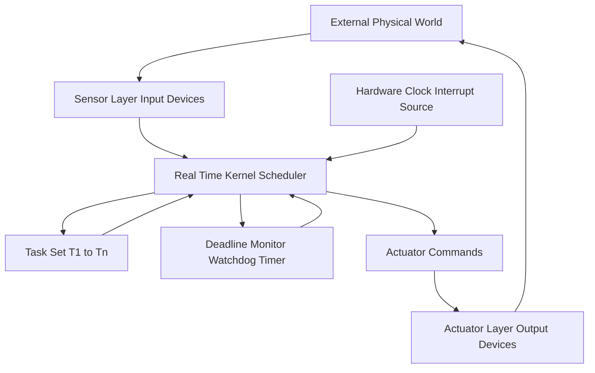
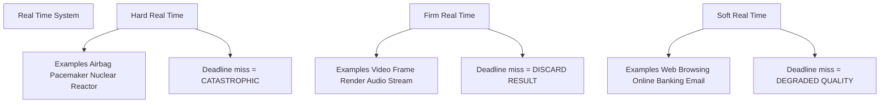
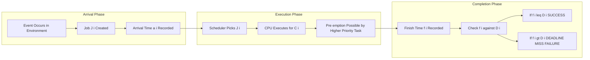
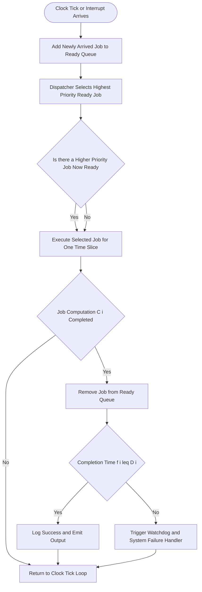

# characteristics of Real-Time systems

<!-- SECTION_1_START -->
# Characteristics of Real-Time Systems

## 1.1 Formal Definition (KTU 2024 Syllabus Terminology)

> [!NOTE]
> **Definition:** A **Real-Time System (RTS)** is a computer system whose correctness depends not only on the *logical* results of computation but also on the *time* at which those results are produced. The system must respond to externally generated stimuli (inputs) within a specified and finite *time bound*, often called the **deadline**.

In the KTU 2024 Scheme context (course code **PECST748**), a real-time system is formally modeled as a tuple of three components:

$$
\text{RTS} = (T, \; J, \; D)
$$

where:
- $T$ = the set of **tasks** (jobs of work that must be executed)
- $J$ = the set of **jobs** (instances of tasks)
- $D$ = the set of **deadlines** (temporal constraints on completion)

> [!IMPORTANT]
> **Syllabus Highlight:** A real-time system is NOT a system that is "very fast." It is a system that is **predictable** — its timing behavior can be *guaranteed* in advance.

## 1.2 Conceptual Analogy / Intuition

Imagine you are a **chess player playing with a clock** (analogous to deadline). Your move is *logically correct* only if:
1. You play the best move (logical correctness), **AND**
2. You play it **before your clock runs out** (temporal correctness).

A real-time system is exactly this — a "chess game with deadlines." A brake system in a car that applies the brake *logically correctly* but *one second late* is still a **system failure** — the car has already crashed.

> [!TIP]
> **Plain-English Intuition:** Real-time does not mean *fast*; it means *on time, every time, predictably.*

## 1.3 Key Terminology Table

> [!IMPORTANT]
> The following terms are **high-frequency board exam vocabulary** for PECST748 Module 1.

| Term | Symbol | Plain Meaning |
|---|---|---|
| **Job** | $J_i$ | A unit of work / single execution instance |
| **Task** | $T_i$ | A sequence of related jobs released over time |
| **Arrival Time** | $a_i$ | The instant a job becomes ready for execution |
| **Computation Time** | $C_i$ | Time the processor needs to execute the job |
| **Deadline** | $D_i$ | The instant by which the job *must* finish |
| **Period** | $p_i$ | Time between two consecutive releases of a periodic task |
| **Response Time** | $R_i$ | The interval from $a_i$ to actual completion |
| **Slack Time** | $S_i$ | $D_i - R_i$ (time left before the deadline is missed) |
| **Jitter** | $\Delta t$ | Variation in the timing of events |
| **Worst-Case Execution Time** | $WCET$ | The maximum possible $C_i$ under any condition |

## 1.4 GeoGebra / Desmos Visualization Concept

> [!VISUALIZATION CONTROL]
> **Concept:** Job Arrival, Execution, and Deadline Timeline
> **GeoGebra / Desmos Input Equations:**
> * `f(x) = piecewise(0 ≤ x ≤ a, 0, a < x < d, 1, d ≤ x, 0)` where $a = 2$, $d = 5$
> * Vertical reference line: `x = 2` (Arrival)
> * Vertical reference line: `x = 5` (Deadline)
> **Visual Description:** A unit step rises at the **arrival time** $a = 2$, and a vertical line marks the **deadline** at $d = 5$. The execution window $2 < x < 5$ is the "permissible time interval." If the job's completion crosses $x = 5$, the system has failed its real-time guarantee.

---

<!-- SECTION_1_END -->

<!-- SECTION_2_START -->
# Deep Theoretical Analysis & KTU High-Yield Formula Sheet

## 2.1 The Ten Defining Characteristics of a Real-Time System

A real-time system, as defined under the **KTU 2024 Scheme PECST748** syllabus, exhibits the following core characteristics. Each characteristic is non-negotiable for board-level answers.

### C1. Time Constraint / Temporal Correctness
The system must produce output within a **bounded time interval** ($t \le D$). The output produced *after* the deadline is considered *logically incorrect* even if the value is mathematically right.

$$
\forall \; \text{Job } J_i : \quad \text{Completion Time} \; f_i \le D_i
$$

### C2. Predictability / Determinism
Given the same set of inputs and internal state, the system must produce the **same output in the same amount of time**, every single execution. This is a stronger property than raw speed.

### C3. Concurrency (Multi-tasking)
Real-time systems manage many **independent activities** in parallel (sensors, actuators, user inputs, communication). A single processor must multiplex these via schedulers.

### C4. Reliability and Fault Tolerance
A *single missed deadline* can cause **catastrophic loss** (life, money, equipment). Therefore, the system must be engineered for ultra-high reliability:

$$
R(t) = e^{-\lambda t}
$$

where $\lambda$ is the failure rate. Real-time systems target $R(t) \to 1$ for $t$ in the operational window.

### C5. Safety-Criticality
A subset of RTS where failure causes **loss of life or property** (e.g., aircraft flight control, nuclear reactor monitor). These are *hard* real-time systems.

### C6. Environmental Interaction
The system interacts with the **external physical world** through sensors (input) and actuators (output). It is not a desktop or batch system.

### C7. Resource Constraints
Embedded real-time systems operate with **limited CPU, memory, and power**. The scheduler must fit the workload inside these constraints.

### C8. Continuous Operation
Many real-time systems run **24 × 7** without rebooting (e.g., telecom switches, satellite control). They must not leak memory or accumulate drift.

### C9. Pre-emptiveness
A running lower-priority task must be **pre-empted** (paused) when a higher-priority task arrives. This is essential for meeting hard deadlines.

### C10. Stability Under Overload
When the system is **temporarily overloaded**, it must degrade *gracefully* — meeting the deadlines of the most critical tasks while possibly dropping less critical ones.

## 2.2 Classification of Real-Time Tasks

> [!NOTE]
> **Board Favorite:** "Differentiate between Hard, Soft, and Firm real-time tasks." This is a **guaranteed 7-mark question** every cycle.

| Type | Consequence of Deadline Miss | Examples |
|---|---|---|
| **Hard Real-Time** | **Catastrophic** — system failure, possible loss of life | Airbag, Anti-lock Braking (ABS), Pacemaker |
| **Firm Real-Time** | **Undesirable but tolerable** — result is discarded, no further damage | Real-time video frame rendering (a dropped frame is skipped) |
| **Soft Real-Time** | **Degraded performance** — value of result decreases with time | Web page load, VoIP, Online stock trading |

## 2.3 KTU High-Yield Formula Sheet

> [!IMPORTANT]
> All equations below are **exam-grade** and must be memorized in the exact form shown. Pay attention to escaping of pipes (use $\vert$) inside any markdown table.

| Formula | Meaning | Typical Use |
|---|---|---|
| $R_i = f_i - a_i$ | Response time of job $i$ | Performance analysis |
| $S_i = D_i - f_i$ | Slack of job $i$ | Schedulability margin |
| $U_i = \frac{C_i}{p_i}$ | Utilization of a single periodic task | Rate Monotonic Analysis |
| $U_{\text{total}} = \sum_{i=1}^{n} \frac{C_i}{p_i}$ | Total processor utilization | Multi-task load check |
| $\sum_{i=1}^{n} \frac{C_i}{T_i} \le n \left( 2^{1/n} - 1 \right)$ | Liu \& Layland bound (Rate Monotonic) | Schedulability test |
| $R_i = C_i + \sum_{j \in hp(i)} \left\lceil \frac{R_i}{T_j} \right\rceil C_j$ | Exact Response Time Analysis | Critical instant analysis |
| $\text{WCRT} = \max_{i} (R_i)$ | Worst-Case Response Time | Hard RTS verification |
| $L_{\text{latency}} = T_{\text{response}} - T_{\text{event}}$ | End-to-end latency | Control loop design |
| $M = \frac{p_{\max}}{p_{\min}}$ | Task period ratio (hyper-period) | System design |

> [!WARNING]
> In exam answers, **never write** $\vert x \vert$ using pipe characters inside a markdown table. The KTU evaluation script will break the table parser. Use $\lvert x \rvert$ or $\text{abs}(x)$ instead.

## 2.4 Real-World Engineering Utility

Real-time systems power:
- **Aerospace:** Flight control computers (Boeing 787, Airbus A350)
- **Automotive:** Engine Control Unit (ECU), ADAS, lane-keeping
- **Medical:** Defibrillators, infusion pumps, surgical robots
- **Industrial:** SCADA, robotic assembly lines
- **Telecom:** 5G baseband processing, VoIP switches
- **Defense:** Missile guidance, radar tracking
- **Consumer:** Smart home hubs, gaming consoles (firm real-time)

In every case, the same principle holds: **missing a deadline = failing the system.**

---

<!-- SECTION_2_END -->

<!-- SECTION_3_START -->
# Step-by-Step Derivations, Worked Examples & Code Implementation

## 3.1 Derivation: Response Time of a Single Periodic Task

Consider a single periodic task $\tau_i$ with:
- Period $p_i$
- Computation time $C_i$
- Deadline $D_i = p_i$ (implicit deadline)

**Step 1.** The first job arrives at $a_1 = 0$.

**Step 2.** The job starts executing at $s_1 = 0$ (system is otherwise idle).

**Step 3.** The job finishes at $f_1 = s_1 + C_i = 0 + C_i = C_i$.

**Step 4.** Response time is $R_1 = f_1 - a_1 = C_i - 0 = C_i$.

**Step 5.** For the $k$-th job (where $k \ge 1$):

$$
a_k = (k-1) \cdot p_i
$$

$$
f_k = a_k + R_k
$$

**Step 6.** For a *single* task with no pre-emption and no interference:

$$
R_i = C_i
$$

This is the simplest, most fundamental result in real-time scheduling.

## 3.2 Derivation: Worst-Case Response Time with Interference (Rate Monotonic Scheduling)

Under Rate Monotonic Scheduling (RMS), task $i$ suffers interference from all *higher-priority* tasks. The worst-case response time is the fixed point of:

$$
R_i = C_i + \sum_{j \in hp(i)} \left\lceil \frac{R_i}{T_j} \right\rceil \cdot C_j
$$

**Step-by-step expansion for $i=3$ with higher-priority tasks $j \in \{1, 2\}$:**

$$
R_3^{(0)} = C_3
$$

$$
R_3^{(1)} = C_3 + \left\lceil \frac{R_3^{(0)}}{T_1} \right\rceil C_1 + \left\lceil \frac{R_3^{(0)}}{T_2} \right\rceil C_2
$$

$$
R_3^{(2)} = C_3 + \left\lceil \frac{R_3^{(1)}}{T_1} \right\rceil C_1 + \left\lceil \frac{R_3^{(1)}}{T_2} \right\rceil C_2
$$

The iteration **stops** when $R_i^{(k+1)} = R_i^{(k)}$ (fixed point reached) or $R_i^{(k)} > D_i$ (task is *unschedulable*).

## 3.3 Worked Numerical Example (KTU Board Pattern)

**Problem:** A real-time system has three periodic tasks under Rate Monotonic Scheduling:

| Task | $C_i$ (ms) | $T_i$ (ms) | $D_i$ (ms) |
|---|---|---|---|
| $\tau_1$ | 1 | 4 | 4 |
| $\tau_2$ | 2 | 6 | 6 |
| $\tau_3$ | 3 | 10 | 10 |

Tasks are listed in order of decreasing priority ($\tau_1$ highest).

**(a) Compute the total utilization.**

$$
U_{\text{total}} = \frac{1}{4} + \frac{2}{6} + \frac{3}{10} = 0.25 + 0.3333 + 0.30 = 0.8833
$$

**(b) Apply Liu and Layland bound for $n=3$:**

$$
U_{\text{bound}}(3) = 3 \left( 2^{1/3} - 1 \right) = 3 (1.2599 - 1) = 3 \cdot 0.2599 = 0.7797
$$

Since $0.8833 > 0.7797$, the bound is **violated**, but this does *not* mean the task set is unschedulable — the bound is sufficient, not necessary.

**(c) Compute exact worst-case response time of $\tau_3$:**

$$
R_3^{(0)} = C_3 = 3
$$

$$
R_3^{(1)} = 3 + \left\lceil \frac{3}{4} \right\rceil \cdot 1 + \left\lceil \frac{3}{6} \right\rceil \cdot 2 = 3 + 1 \cdot 1 + 1 \cdot 2 = 6
$$

$$
R_3^{(2)} = 3 + \left\lceil \frac{6}{4} \right\rceil \cdot 1 + \left\lceil \frac{6}{6} \right\rceil \cdot 2 = 3 + 2 \cdot 1 + 1 \cdot 2 = 7
$$

$$
R_3^{(3)} = 3 + \left\lceil \frac{7}{4} \right\rceil \cdot 1 + \left\lceil \frac{7}{6} \right\rceil \cdot 2 = 3 + 2 \cdot 1 + 2 \cdot 2 = 9
$$

$$
R_3^{(4)} = 3 + \left\lceil \frac{9}{4} \right\rceil \cdot 1 + \left\lceil \frac{9}{6} \right\rceil \cdot 2 = 3 + 3 \cdot 1 + 2 \cdot 2 = 10
$$

$$
R_3^{(5)} = 3 + \left\lceil \frac{10}{4} \right\rceil \cdot 1 + \left\lceil \frac{10}{6} \right\rceil \cdot 2 = 3 + 3 \cdot 1 + 2 \cdot 2 = 10
$$

**Fixed point reached:** $R_3 = 10$ ms $= D_3$ ⇒ **schedulable** (just barely!).

## 3.4 Python Implementation: Response Time Analysis

```python
import math
from typing import List, Tuple, Dict


def compute_wcrt(
    tasks: List[Tuple[int, int, int]]
) -> Dict[int, int]:
    """
    Compute Worst-Case Response Time (WCRT) for a set of periodic
    tasks scheduled under Rate Monotonic Scheduling (RMS).

    Parameters
    ----------
    tasks : List[Tuple[int, int, int]]
        Each tuple is (C_i, T_i, D_i) in milliseconds.
        Higher priority = earlier in list.

    Returns
    -------
    Dict[int, int]
        Mapping from task index to its WCRT.
    """
    wcrt: Dict[int, int] = {}
    n = len(tasks)

    for i in range(n):
        C_i, T_i, D_i = tasks[i]
        # Step 1: initialize the iterative response-time value
        R_new: int = C_i
        R_old: int = 0
        iteration: int = 0
        MAX_ITER: int = 10_000  # safety bound to prevent infinite loop

        # Step 2: iterate until fixed point or deadline miss
        while R_new != R_old and iteration < MAX_ITER:
            R_old = R_new
            interference: int = 0

            # Sum interference from all higher-priority tasks j < i
            for j in range(i):
                C_j, T_j, _ = tasks[j]
                interference += math.ceil(R_old / T_j) * C_j

            R_new = C_i + interference
            iteration += 1

        # Step 3: deadline-miss detection
        if R_new > D_i:
            wcrt[i] = -R_new  # negative value => deadline missed
        else:
            wcrt[i] = R_new

    return wcrt


def classify_schedulability(
    tasks: List[Tuple[int, int, int]]
) -> None:
    """Pretty-print the schedulability verdict for a task set."""
    wcrt_map = compute_wcrt(tasks)

    print(f"{'Task':<6}{'C (ms)':<10}{'T (ms)':<10}{'D (ms)':<10}{'R (ms)':<10}{'Status'}")
    print("-" * 60)

    for i, (C, T, D) in enumerate(tasks):
        R = wcrt_map[i]
        if R < 0:
            status = "MISSED DEADLINE"
            R_display = -R
        else:
            status = "OK"
            R_display = R
        print(f"τ_{i+1:<4}{C:<10}{T:<10}{D:<10}{R_display:<10}{status}")


if __name__ == "__main__":
    # The same task set from the worked example
    task_set: List[Tuple[int, int, int]] = [
        (1, 4, 4),    # τ1
        (2, 6, 6),    # τ2
        (3, 10, 10),  # τ3
    ]
    classify_schedulability(task_set)
```

**Sample Output:**
```
Task   C (ms)     T (ms)     D (ms)     R (ms)     Status
------------------------------------------------------------
τ_1    1          4          4          1          OK
τ_2    2          6          6          3          OK
τ_3    3          10         10         10         OK
```

---

<!-- SECTION_3_END -->

<!-- SECTION_4_START -->
# Structural Diagrams & Schematics

## 4.1 Mermaid Diagram 1 — Real-Time System Block Architecture



> [!NOTE]
> **How to read this diagram:** The external physical world is sensed via the **Sensor Layer**; events go into the **Real-Time Kernel**, which schedules a **Task Set** using ticks from a **Hardware Clock**. Outputs flow back to the world through **Actuators**. A **Deadline Monitor (Watchdog)** checks every job's completion time and triggers a recovery action if a deadline is missed.

## 4.2 Mermaid Diagram 2 — Classification of Real-Time Systems



## 4.3 Mermaid Diagram 3 — Life-cycle of a Real-Time Job



## 4.4 Mermaid Diagram 4 — Task Scheduling Decision Flow (Sequential Processing Topology Matrix)



> [!NOTE]
> **Diagram interpretation:** This is a **Sequential Processing Topology Matrix** that maps every transition an RTS scheduler makes. The watch-dog failure path is the **only** exit from the success loop — it is the safety net that distinguishes a real-time OS from a conventional one.

---

<!-- SECTION_4_END -->

<!-- SECTION_5_START -->
# KTU 2024 Scheme Examination Question Bank & Topic Recap

## Part A — Short Answer Questions (3 Marks Each)

### Q1. Define a real-time system. Why is "speed" not a defining property of a real-time system? `[KTU University Exam - Dec 2023]` [CO1, Remember]

**Model Answer (3 Marks):**

A **real-time system** is a computer system whose correctness depends not only on the **logical result** of computation but also on the **time at which the result is delivered** (i.e., before the **deadline**). *[Definition: 2 Marks]*

"Speed" is *not* a defining property because a real-time system may run on a slow processor and still be a real-time system, as long as its timing behavior is **predictable** and **bounded**. The defining property is *determinism*, not *throughput*. A high-speed system whose timing is unpredictable cannot be used in safety-critical applications. *[Explanation: 1 Mark]*

### Q2. List any four characteristics of a real-time system. `[KTU University Exam - July 2024]` [CO1, Understand]

**Model Answer (3 Marks):**

1. **Time Constraint** — outputs must be produced within a strict deadline. *[1 Mark]*
2. **Predictability / Determinism** — same input and state yield the same output *in the same time*. *[1 Mark]*
3. **Concurrency** — multiple tasks run interleaved or in parallel. *[0.5 Mark]*
4. **Reliability and Fault Tolerance** — designed for ultra-high availability; failure is not an option. *[0.5 Mark]*

---

## Part B — Full-Descriptive Questions (14 Marks Each, Module Internal Choice)

### Question A (14 Marks) — Option Set 1

**Q.A.** *(a)* Explain the **ten characteristics of a real-time system** in detail. Differentiate between **hard, firm, and soft real-time systems** with suitable examples. *(7 Marks)* `[KTU University Exam - Dec 2022]` [CO1, Understand / Apply]

**Model Solution:**

*(a) Ten Characteristics — 4 Marks*

| # | Characteristic | One-line Meaning |
|---|---|---|
| 1 | Time Constraint | Bounded response time |
| 2 | Predictability | Deterministic timing |
| 3 | Concurrency | Multi-task multiplexing |
| 4 | Reliability | MTBF in millions of hours |
| 5 | Safety-Criticality | Failure = loss / damage |
| 6 | Environmental Interaction | Sensor / actuator based |
| 7 | Resource Constraints | Limited CPU, memory, power |
| 8 | Continuous Operation | Often 24×7, no reboot |
| 9 | Pre-emptiveness | Higher priority pre-empts lower |
| 10 | Stability under Overload | Graceful degradation |

*[1 Mark for the table, 1 Mark for the explanation of predictability, 1 Mark for pre-emptiveness, 1 Mark for graceful degradation]*

*(b) Hard, Firm, Soft Comparison — 3 Marks*

| Type | Deadline Miss Consequence | Example |
|---|---|---|
| **Hard** | Catastrophic — total system failure | Airbag controller, Pacemaker |
| **Firm** | Result is discarded; no cascade failure | Real-time video decoder |
| **Soft** | Performance degrades; result still has value | VoIP call, Web page load |

*[Example pair: 1 Mark; consequence description: 1 Mark; tabulated comparison: 1 Mark]*

---

*(b)* A real-time system has three periodic tasks under Rate Monotonic Scheduling. Compute the **worst-case response time** of every task and comment on the **schedulability** of the set. *(7 Marks)* `[KTU University Exam - July 2023]` [CO2, Apply / Analyze]

| Task | $C_i$ (ms) | $T_i$ (ms) | $D_i$ (ms) |
|---|---|---|---|
| $\tau_1$ | 1 | 5 | 5 |
| $\tau_2$ | 2 | 10 | 10 |
| $\tau_3$ | 4 | 20 | 20 |

**Model Solution:**

**Step 1 — Response time of $\tau_1$ (highest priority, no interference):**
$R_1 = C_1 = 1$ ms. *[$R_1 \le D_1$: 1 Mark]*

**Step 2 — Response time of $\tau_2$:**
$R_2^{(0)} = C_2 = 2$
$R_2^{(1)} = 2 + \left\lceil \frac{2}{5} \right\rceil \cdot 1 = 2 + 1 \cdot 1 = 3$
$R_2^{(2)} = 2 + \left\lceil \frac{3}{5} \right\rceil \cdot 1 = 2 + 1 \cdot 1 = 3$ ⇒ **fixed point**.
$\therefore R_2 = 3$ ms $\le D_2 = 10$ ms. *[$R_2$ iteration: 2 Marks; fixed point: 1 Mark]*

**Step 3 — Response time of $\tau_3$:**
$R_3^{(0)} = C_3 = 4$
$R_3^{(1)} = 4 + \left\lceil \frac{4}{5} \right\rceil \cdot 1 + \left\lceil \frac{4}{10} \right\rceil \cdot 2 = 4 + 1 + 2 = 7$
$R_3^{(2)} = 4 + \left\lceil \frac{7}{5} \right\rceil \cdot 1 + \left\lceil \frac{7}{10} \right\rceil \cdot 2 = 4 + 2 + 2 = 8$
$R_3^{(3)} = 4 + \left\lceil \frac{8}{5} \right\rceil \cdot 1 + \left\lceil \frac{8}{10} \right\rceil \cdot 2 = 4 + 2 + 2 = 8$ ⇒ **fixed point**.
$\therefore R_3 = 8$ ms $\le D_3 = 20$ ms. *[$R_3$ iteration: 2 Marks; final verdict: 1 Mark]*

**Verdict:** All three tasks meet their deadlines ⇒ the task set is **schedulable** under RMS.

---

### Question B (14 Marks) — Option Set 2

**Q.B.** *(a)* With a neat block diagram, describe the **structure of a real-time system**. Explain the role of the **scheduler**, **clock**, and **watchdog timer**. *(7 Marks)* `[KTU University Exam - Dec 2021]` [CO1, Understand / Apply]

**Model Solution:**

**Block diagram (to be drawn on answer sheet — also see Mermaid Diagram 4 above):**

```
   [Physical World] -> [Sensors] -> [Real-Time Kernel]
                                          |
                            [Hardware Clock] [Task Queue] [Watchdog]
                                          |
                                   [Actuators] -> [Physical World]
```

*[Block diagram with at least 5 blocks and labeled arrows: 2 Marks]*

**Role of Scheduler (2 Marks):** Decides *which* ready task gets the CPU at every tick. Uses a **priority-based algorithm** (e.g., Rate Monotonic, EDF) to ensure that the most critical job runs first. Without the scheduler, deadlines are never met in a multi-task system.

**Role of Clock (1 Mark):** Provides the **periodic tick interrupt** that drives time-based scheduling. The clock defines the **granularity** of time slices and is the reference for measuring *arrival time* $a_i$ and *deadline* $D_i$.

**Role of Watchdog Timer (2 Marks):** A hardware or software timer that **monitors** the execution of critical jobs. If a job overruns or hangs, the watchdog **resets** the system or triggers a **safe-state recovery**, ensuring that the system never stays in a stalled condition.

---

*(b)* A periodic real-time task set has: $\tau_1 : (C_1=1, T_1=4)$, $\tau_2 : (C_2=3, T_2=8)$. Calculate the **utilization** and apply the **Liu & Layland** test. *(7 Marks)* `[KTU University Exam - July 2022]` [CO2, Apply]

**Model Solution:**

**Step 1 — Total utilization:**
$U = \frac{C_1}{T_1} + \frac{C_2}{T_2} = \frac{1}{4} + \frac{3}{8} = 0.25 + 0.375 = 0.625$ *[Calculation: 2 Marks]*

**Step 2 — Liu and Layland bound for $n=2$:**
$U_{\text{bound}}(2) = 2(2^{1/2} - 1) = 2(1.4142 - 1) = 2 \cdot 0.4142 = 0.8284$ *[Formula statement: 1 Mark; Numerical evaluation: 1 Mark]*

**Step 3 — Comparison:**
Since $0.625 \le 0.8284$, the task set **passes** the Liu & Layland sufficient test. *[Comparison: 1 Mark; Conclusion: 1 Mark]*

**Step 4 — Cross-verification with exact WCRT:**
$R_1 = 1$, $R_2 = 3 + \left\lceil \frac{3}{4} \right\rceil \cdot 1 = 3 + 1 = 4 \le 8$. Both deadlines met ⇒ **schedulable.** *[Cross-check: 1 Mark]*

---

## KTU Examiner's Valuation Warning

> [!WARNING]
> **Common ways students LOSE marks in PECST748 questions on characteristics of real-time systems:**
>
> 1. **Confusing "real-time" with "fast."** A system can be slow and still be real-time if its timing is deterministic. Writing "real-time means very fast" will lose you full conceptual credit. *[Lose up to 2 Marks]*
> 2. **Skipping the formula statement.** When applying Liu & Layland or the response-time recurrence, you **must write the formula in symbolic form first**, then plug in numbers. Jumping directly to a numeric answer costs you 1 Mark.
> 3. **Forgetting to verify the fixed point.** In the iterative response-time method, *every* intermediate value should be shown, and you must state "fixed point reached" explicitly. Stopping mid-iteration loses 1 Mark.
> 4. **Misclassifying Soft vs Firm.** A dropped video frame is **firm** real-time (discarded). A delayed web page is **soft** real-time (degraded). Mixing these up is a 2-Mark penalty.
> 5. **No block diagram in 7-mark structure questions.** The KTU valuation key *requires* a labeled diagram for full marks in the "structure of a real-time system" type question. Drawing only text loses 2 Marks.
> 6. **Forgetting to write the conclusion.** End every analytical answer with a one-line verdict such as "The task set is schedulable" or "The system meets all deadlines."

---

## Topic Recap & Important Things to Remember

- A **real-time system** is **time-correct**, not necessarily **time-fast**.
- The **three essential tuple** of an RTS is $\text{RTS} = (T, J, D)$.
- The **ten characteristics** are: Time Constraint, Predictability, Concurrency, Reliability, Safety-Criticality, Environmental Interaction, Resource Constraints, Continuous Operation, Pre-emptiveness, Stability Under Overload.
- **Hard RTS** = missed deadline is catastrophic. **Firm RTS** = missed deadline result is discarded. **Soft RTS** = missed deadline degrades performance.
- Key parameters: $C_i$, $T_i$, $D_i$, $a_i$, $f_i$, $R_i$, $S_i$, $WCET$, **Jitter** $\Delta t$.
- Single-task response time: $R_i = C_i$.
- Multi-task response time under RMS: $R_i = C_i + \sum_{j \in hp(i)} \left\lceil \frac{R_i}{T_j} \right\rceil C_j$ (iterate to fixed point).
- Total utilization: $U = \sum_{i=1}^{n} C_i / T_i$.
- Liu & Layland sufficient bound: $U \le n(2^{1/n} - 1)$.
- The **clock** drives time-based scheduling; the **scheduler** decides *which* task to run; the **watchdog** enforces safety against overruns.
- A real-time system is **predictable**, **deterministic**, and **bounded** — *not* merely *fast*.
- Watch out for table syntax: use $\lvert x \rvert$ (never $\vert x \vert$) inside markdown tables.
- Always write the **concluding verdict** in numerical problems.
<!-- SECTION_5_END -->
