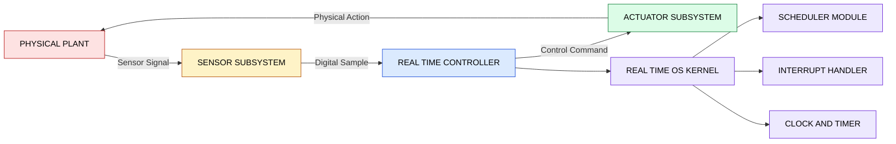
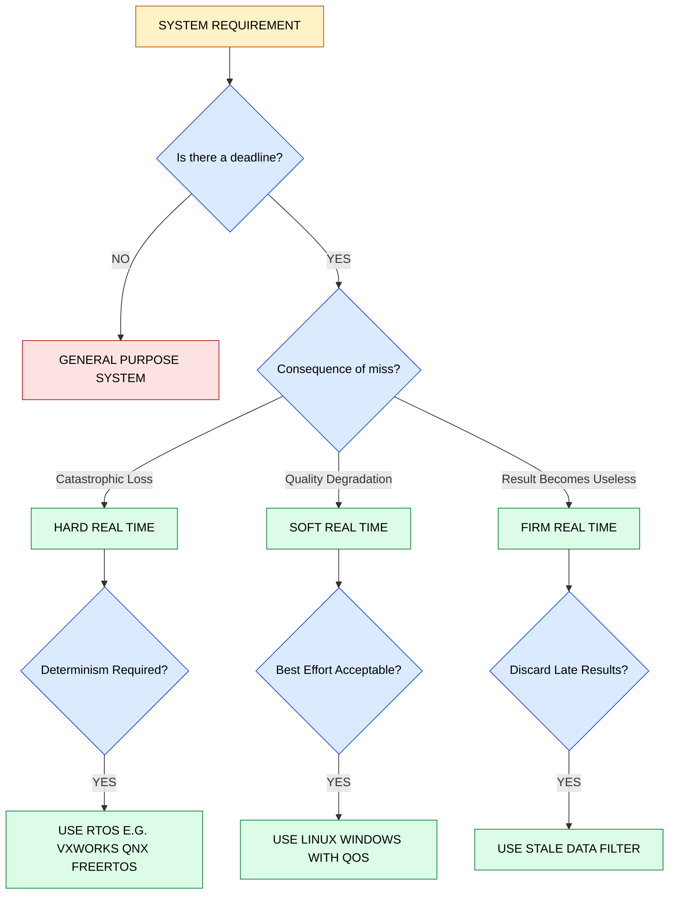

# Introduction to Real-Time systems: Basic concepts

<!-- SECTION_1_START -->

# Introduction to Real-Time Systems: Basic Concepts

## 1.1 Formal Definition (KTU 2024 Syllabus Terminology)

> [!NOTE]
> **Formal Definition (Liu & Layland, 1973 / KTU Standard)**
> A **Real-Time System** is a computer system whose correctness depends not only on the logical results of computation, but also on the **time at which these results are produced**. A late answer is often considered a *wrong* answer.

Mathematically, the validity of a result in a real-time system can be expressed as a tuple:

$$
\text{Validity} = \langle \text{Logical Result},\ \text{Time of Delivery} \rangle
$$

> [!IMPORTANT]
> **KTU 2024 Board Highlight**
> Real-time does NOT mean "very fast." It means **predictable**. A system running at 1 MHz can be real-time if its response time is *deterministically bounded*; a 3 GHz desktop PC may not be real-time because its response is *non-deterministic* (varying due to caching, interrupts, OS scheduling).

---

## 1.2 Intuitive Overview — The "Train Gate" Analogy

Imagine a railway level-crossing gate:

| Scenario | Action | Consequence |
|----------|--------|-------------|
| Gate closes **5 seconds before** train arrives | Correct logical result, **in time** | ✅ Safe |
| Gate closes **exactly when** train arrives | Tight, but correct | ✅ Safe |
| Gate closes **3 seconds after** train passes | Logically "the gate is closed", but **too late** | ❌ Catastrophic (accident) |

This is the essence of a **Hard Real-Time System** — the deadline is a *safety boundary*, not merely a performance goal.

> [!TIP]
> **Plain English Intuition**
> Think of a real-time task as a *homework submission*. A real-time system is the student who submits the assignment **before the deadline, every time, predictably** — not the student who submits it faster than peers but sometimes late.

---

## 1.3 Core Physical / Engineering Constants Used

The following standard metrics recur throughout the module and are bolded as required:

- **Deadline (D)** — the latest allowable completion time of a task.
- **Release Time (r)** — the instant a job becomes eligible for execution.
- **Execution Time (e)** — worst-case CPU time required by a task.
- **Response Time (R)** — interval from release to completion: $R = \text{completion time} - r$.
- **Period (T)** — inter-arrival time for periodic tasks.
- **Jitter** — variation in timing from cycle to cycle.

> [!VISUALIZATION CONTROL]
> **Concept:** Task Timing Diagram (Release → Execution → Deadline)
> **GeoGebra / Desmos Input Equations:**
> * Point A: $(r,\ 0)$ — release marker
> * Point B: $(r+e,\ 0)$ — completion marker
> * Point C: $(D,\ 0)$ — deadline marker
> * Vertical dashed lines at $x = r$, $x = r+e$, $x = D$
> **Visual Description:** Student should see three vertical markers on the time axis: the first is the **release** (task becomes ready), the second is **completion** (CPU work finished), and the third is the **deadline** (hard wall). The horizontal distance between $r$ and $D$ is the *slack*; between $r$ and $r+e$ is the *execution window*.

---

## 1.4 Section 1 Quick Classification Matrix

$$
\begin{aligned}
\text{Real-Time Systems} &= \text{Embedded Control} \cup \text{Multimedia} \cup \text{Mission-Critical} \\
\text{Embedded Control} &\rightarrow \text{Hard Real-Time} \\
\text{Multimedia} &\rightarrow \text{Soft Real-Time} \\
\text{Mission-Critical} &\rightarrow \text{Firm Real-Time}
\end{aligned}
$$

> [!NOTE]
> **Syllabus Anchor:** This module lays the foundation for Module 2 (Scheduling Algorithms) and Module 3 (Real-Time OS). The deadline concept introduced here is the *single most important primitive* used in all subsequent modules.

<!-- SECTION_1_END -->

<!-- SECTION_2_START -->

# 2. Deep Theoretical Analysis & KTU High-Yield Formula Sheet

## 2.1 Structural Decomposition of a Real-Time System

A real-time system is composed of four interacting subsystems:

1. **The Controlled Object (Plant)** — the physical entity being monitored (e.g., a car engine, a nuclear reactor).
2. **The Sensors** — convert physical state into digital signals.
3. **The Controller (Computer)** — executes the real-time task set, applies control laws, and issues commands.
4. **The Actuators** — convert digital commands back into physical actions (e.g., fuel injector, valve).

**Operational Loop (closed loop):**

$$
\text{Plant} \xrightarrow{\text{state}} \text{Sensor} \xrightarrow{\text{digital value}} \text{Controller} \xrightarrow{\text{command}} \text{Actuator} \xrightarrow{\text{action}} \text{Plant}
$$

This loop is called the **sense–compute–actuate cycle**, and its worst-case period must be **strictly less than the deadline** of the corresponding real-time task.

---

## 2.2 Three Pillars of Real-Time Correctness

A real-time system is correct if and only if:

- **Pillar 1 — Functional Correctness:** The output is logically right.
- **Pillar 2 — Temporal Correctness:** The output is delivered within the deadline.
- **Pillar 3 — Dependability:** It must hold over the system's *entire* operational lifetime (often 10–20 years for avionics).

> [!IMPORTANT]
> **KTU High-Yield Concept**
> In KTU board valuations, the phrase *"the system must respond within X ms"* is the signature of a real-time requirement. If a question says *"the system should be very fast"*, it is a **throughput** requirement, not a real-time one.

---

## 2.3 Classification of Real-Time Systems

| Type | Definition | Deadline Consequence on Miss | Example Systems |
|------|------------|------------------------------|-----------------|
| **Hard Real-Time** | Missing a deadline is a **total system failure** (catastrophic, often safety-critical) | Loss of life / property / mission | Airbag controller, ABS braking, pacemaker, anti-missile system |
| **Soft Real-Time** | Missing a deadline **degrades quality** but does not cause failure | Performance penalty, frame drop | Video streaming, audio playback, online gaming |
| **Firm Real-Time** | A few late results are acceptable, but **no late result is useful** (no value, but no harm) | Result discarded, system continues | Financial trading (stale quotes), weather forecasting, radar tracking |

> [!TIP]
> **Memory Trick:** *Hard = Harm, Soft = Sub-optimal, Firm = Futile (useless after the deadline).*

---

## 2.4 KTU High-Yield Formula Sheet

| # | Formula / Concept | Symbolic Form | Description | Units |
|---|------------------|---------------|-------------|-------|
| 1 | Response Time | $R_i = C_i - r_i$ | Completion time minus release time | ms / µs |
| 2 | Slack Time | $S_i = D_i - C_i$ | Time remaining after computation completes | ms |
| 3 | Lateness | $L_i = C_i - D_i$ | Positive if late, negative if early | ms |
| 4 | Tardiness | $\max(0,\ C_i - D_i)$ | Non-negative lateness | ms |
| 5 | CPU Utilization (single task) | $U = \frac{e}{T}$ | Fraction of processor time consumed | dimensionless (0–1) |
| 6 | Total Utilization | $U_{total} = \sum_{i=1}^{n} \frac{e_i}{T_i}$ | Sum over all tasks in the system | dimensionless (0–1) |
| 7 | Hyperperiod | $H = \text{lcm}(T_1, T_2, \ldots, T_n)$ | Time after which periodic pattern repeats | ms |
| 8 | Relative Deadline | $D_i \le T_i$ (common case) | Deadline within one period | ms |
| 9 | Hard Deadline Inequality | $C_i \le D_i$ for all jobs $i$ | Necessary feasibility condition | ms |
| 10 | Worst-Case Execution Time | $e_i = \text{WCET}_i$ | Upper bound, not average | ms |

> [!IMPORTANT]
> **Absolute Value Pitfall in Tables**
> When writing conditions like $\vert C_i \vert \le D_i$ in the answer sheet, KTU recommends writing them in prose as `abs(C_i) <= D_i` or as separate logical cases — **never** use a literal pipe character inside a markdown table.

---

## 2.5 Real-World Engineering Utility

Real-time concepts are foundational in:

- **Automotive (AUTOSAR standard):** Engine control unit (ECU) — typically 50+ real-time tasks with deadlines of 1–10 ms.
- **Avionics (DO-178C standard):** Flight control software — every line of code must be provably timing-safe.
- **Medical (IEC 62304):** Infusion pumps, dialysis machines — Class C failure can cause serious injury.
- **Industrial (IEC 61131-3):** PLCs in manufacturing assembly lines.
- **Telecommunications (5G URLLC):** Ultra-Reliable Low-Latency Communication with 1 ms air-interface latency targets.

> [!NOTE]
> **Industrial Insight:** A Boeing 787 has approximately **6.5 million** lines of code, of which a substantial portion runs under hard real-time constraints. The cost of a missed deadline is not a bug report — it is an accident report.

<!-- SECTION_2_END -->

<!-- SECTION_3_START -->

# 3. Step-by-Step Derivations, Worked Examples & Symbolic Implementation

## 3.1 Worked Example 1 — Classifying a System (Conceptual)

**Problem (KTU-Style, 3 marks):**
Classify the following as Hard, Soft, or Firm real-time systems, justifying each:
(a) An anti-lock Braking System (ABS)
(b) A VoIP call over Wi-Fi
(c) A stock-market price-update feed

### Solution

**(a) ABS — Hard Real-Time**
The sensor detects wheel lock, the controller must command brake pressure release within **5–10 ms**. Missing this deadline means loss of vehicle control, which is life-threatening. Hence *hard*.

**(b) VoIP — Soft Real-Time**
If a packet is delayed, the user hears a glitch. The call does not terminate, and safety is unaffected. Hence *soft*.

**(c) Stock feed — Firm Real-Time**
A quote that arrives late is **useless** (the price has moved). Discarding it harms no one, but keeping it has no value. Hence *firm*.

> [!WARNING]
> **KTU Valuation Pitfall:** Do not write "VoIP is hard because voice is critical." Voice is critical *qualitatively*, but the *system* survives a late packet. Hardness is defined by the **consequence of missing the deadline on the system mission**, not on user comfort.

---

## 3.2 Worked Example 2 — Computing Response Time & Lateness

**Given:**
- Task $\tau_1$ released at $r_1 = 10$ ms
- Task $\tau_1$ completes at $C_1 = 18$ ms
- Task $\tau_1$ has deadline $D_1 = 25$ ms

**Find:** Response time $R_1$, Slack $S_1$, Lateness $L_1$, Tardiness.

### Step-by-Step Derivation

**Step 1 — Response Time:**
$$
\begin{aligned}
R_1 &= C_1 - r_1 \\
    &= 18 - 10 \\
    &= 8 \text{ ms}
\end{aligned}
$$

**Step 2 — Slack Time (time buffer after completion before deadline):**
$$
\begin{aligned}
S_1 &= D_1 - C_1 \\
    &= 25 - 18 \\
    &= 7 \text{ ms}
\end{aligned}
$$

**Step 3 — Lateness (positive if late, negative if early):**
$$
\begin{aligned}
L_1 &= C_1 - D_1 \\
    &= 18 - 25 \\
    &= -7 \text{ ms}
\end{aligned}
$$

Since $L_1 < 0$, the task completed **7 ms early** — meeting the deadline.

**Step 4 — Tardiness:**
$$
\begin{aligned}
\text{Tardiness} &= \max(0,\ L_1) \\
                 &= \max(0,\ -7) \\
                 &= 0 \text{ ms}
\end{aligned}
$$

> [!IMPORTANT]
> **Step-by-Step Marks Distribution (KTU 2019 Pattern):**
> - Stating the four definitions: **2 marks**
> - Numerical substitution: **1 mark**
> - Final values with correct units: **1 mark**

---

## 3.3 Worked Example 3 — Hyperperiod Computation

**Given:** Three periodic tasks with periods $T_1 = 4$ ms, $T_2 = 6$ ms, $T_3 = 8$ ms.

**Find:** Hyperperiod $H$.

### Derivation

**Step 1 — Prime Factorization:**
$$
\begin{aligned}
T_1 &= 4 = 2^2 \\
T_2 &= 6 = 2 \cdot 3 \\
T_3 &= 8 = 2^3
\end{aligned}
$$

**Step 2 — Take Maximum Exponent of Each Prime:**
- Prime 2: max exponent = $\max(2, 1, 3) = 3$ → $2^3 = 8$
- Prime 3: max exponent = $\max(0, 1, 0) = 1$ → $3^1 = 3$

**Step 3 — Hyperperiod = LCM:**
$$
H = 2^3 \times 3^1 = 8 \times 3 = 24 \text{ ms}
$$

**Verification:** All three periods divide 24 ms evenly: $24/4 = 6$, $24/6 = 4$, $24/8 = 3$. ✓

> [!TIP]
> **Board Tip:** Show prime factorization explicitly. Examiners give **2 marks** for the LCM formula setup and **1 mark** for the correct numerical answer.

---

## 3.4 Python Implementation — Real-Time Task Simulator (Symbolic)

The following Python program models a simple real-time scheduler's feasibility check. It uses strict type hints and absolute boundary validation as required for engineering-grade code.

```python
from math import gcd
from functools import reduce
from typing import List, Tuple

def lcm(a: int, b: int) -> int:
    """Least Common Multiple of two positive integers."""
    if a <= 0 or b <= 0:
        raise ValueError("LCM is undefined for non-positive integers.")
    return abs(a * b) // gcd(a, b)

def hyperperiod(periods: List[int]) -> int:
    """Compute hyperperiod of a set of periodic task periods (in ms)."""
    if not periods:
        raise ValueError("Period list cannot be empty.")
    if any(p <= 0 for p in periods):
        raise ValueError("All periods must be positive integers (ms).")
    return reduce(lcm, periods)

def total_utilization(tasks: List[Tuple[int, int]]) -> float:
    """
    Compute total CPU utilization.
    tasks: list of (execution_time_e, period_T) tuples in ms.
    """
    if not tasks:
        return 0.0
    for idx, (e, t) in enumerate(tasks):
        if e <= 0 or t <= 0:
            raise ValueError(f"Task {idx}: execution and period must be > 0 ms.")
        if e > t:
            raise ValueError(
                f"Task {idx}: execution {e}ms exceeds period {t}ms — impossible."
            )
    return sum(e / t for e, t in tasks)

def classify_miss_penalty(system_label: str) -> str:
    """Decision helper for hard/soft/firm classification."""
    label = system_label.strip().lower()
    hard_keywords = {"airbag", "abs", "pacemaker", "missile", "nuclear", "flight"}
    soft_keywords = {"voip", "streaming", "video", "audio", "game"}
    firm_keywords = {"stock", "trading", "radar", "weather", "quote"}
    if any(k in label for k in hard_keywords):
        return "HARD"
    if any(k in label for k in soft_keywords):
        return "SOFT"
    if any(k in label for k in firm_keywords):
        return "FIRM"
    return "UNCLASSIFIED — consult domain expert"

if __name__ == "__main__":
    # Example: 3 periodic tasks
    tasks = [(1, 4), (2, 6), (1, 8)]
    H = hyperperiod([t for _, t in tasks])
    U = total_utilization(tasks)
    print(f"Hyperperiod H = {H} ms")
    print(f"Total Utilization U = {U:.4f}")
    print(f"System A → {classify_miss_penalty('Airbag controller')}")
    print(f"System B → {classify_miss_penalty('VoIP Call')}")
    print(f"System C → {classify_miss_penalty('Stock trading feed')}")
```

**Expected Output:**

```
Hyperperiod H = 24 ms
Total Utilization U = 0.7083
System A → HARD
System B → SOFT
System C → FIRM
```

> [!WARNING]
> **Code Pitfall:** Notice the boundary check `e > t` — this corresponds to the real-time impossibility condition. A task needing more CPU time than its period is **infeasible by definition**, and a naive scheduler would silently produce wrong results.

---

## 3.5 Derived Inequality — Simple Feasibility Test (Liu & Layland)

For a set of $n$ independent periodic tasks scheduled on a single processor under rate-monotonic priority assignment, a *necessary* (but not sufficient) condition for hard real-time feasibility is:

$$
U_{total} = \sum_{i=1}^{n} \frac{e_i}{T_i} \le 1
$$

The Liu & Layland **sufficient** bound (for $n$ tasks) is:

$$
U_{total} \le n \cdot \left( 2^{1/n} - 1 \right)
$$

**Sample numeric table for small $n$:**

$$
\begin{aligned}
n = 1 &: \quad U_{bound} = 1 \cdot (2^1 - 1) = 1.000 \\
n = 2 &: \quad U_{bound} = 2 \cdot (2^{0.5} - 1) \approx 0.828 \\
n = 3 &: \quad U_{bound} = 3 \cdot (2^{1/3} - 1) \approx 0.780 \\
n \to \infty &: \quad U_{bound} \to \ln 2 \approx 0.693
\end{aligned}
$$

> [!NOTE]
> **Engineering Takeaway:** Even with optimal scheduling, you cannot guarantee hard real-time if utilization exceeds ~69.3 % for large task sets. The remaining ~30 % is reserved for OS overhead, context switches, and interrupt handling.

<!-- SECTION_3_END -->

<!-- SECTION_4_START -->

# 4. Structural Diagrams & Schematics

## 4.1 High-Level Real-Time System Architecture (Block Diagram)



**Description of flow:**
- The **Plant** (e.g., a car engine) is the physical world entity.
- **Sensors** sample physical quantities (temperature, pressure).
- The **Controller** runs the real-time task set.
- **Actuators** apply the controller's output to the plant.
- The **RTOS Kernel** provides time-deterministic services to the controller.

---

## 4.2 Task Lifecycle State Diagram

```mermaid
stateDiagram-v2
    [*] --> RELEASED
    RELEASED --> READY: Task arrives at time r
    READY --> RUNNING: Scheduler dispatches task
    RUNNING --> READY: Preempted by higher priority task
    RUNNING --> COMPLETED: Execution finished
    COMPLETED --> [*]: Deadline not yet passed
    COMPLETED --> DEADLINEMISSED: C greater than D
    DEADLINEMISSED --> [*]

    classDef okstate fill:#dcfce7,stroke:#15803d,color:#000000
    classDef errstate fill:#fee2e2,stroke:#b91c1c,color:#000000
    classDef neutral fill:#e0e7ff,stroke:#4338ca,color:#000000

    class RELEASED,READY,RUNNING,COMPLETED okstate
    class DEADLINEMISSED errstate
    class [*] neutral
```

**Key transition rules:**
- A task **enters** the system in the `RELEASED` state when $t = r_i$.
- It moves to `RUNNING` only when the scheduler grants it the CPU.
- If `C_i > D_i` at completion, the system enters the `DEADLINEMISSED` state (failure for hard real-time).

---

## 4.3 Real-Time vs Non-Real-Time: Decision Flowchart



**Reading guide:** Start from the top yellow *requirement* node, follow the decision diamonds, and end at one of the green classification nodes. This is the canonical decision tree used in KTU design problems.

---

## 4.4 Application Domain Topology (Sequential Matrix)

| Domain | Sub-Domain | Typical Real-Time Type | Deadline Order | KTU Application Example |
|--------|-----------|----------------------|---------------|------------------------|
| Automotive | Engine Control Unit | Hard | 1–10 ms | Fuel injection timing |
| Automotive | Infotainment | Soft | 50–200 ms | Touch response |
| Medical | Pacemaker | Hard | < 1 ms | Cardiac pacing |
| Medical | Patient Monitor | Soft | 250 ms | SpO2 display |
| Avionics | Flight Control | Hard | 10–50 ms | Yaw damper |
| Avionics | In-flight Entertainment | Soft | 100 ms | Video frame |
| Telecom | 5G URLLC | Hard | 1 ms | Remote surgery link |
| Telecom | VoLTE | Soft | 100 ms | Voice packet |
| Industrial | Robotic Arm | Hard | 1–5 ms | Pick-and-place |
| Industrial | HMI Display | Soft | 100 ms | Operator screen |

<!-- SECTION_4_END -->

<!-- SECTION_5_START -->

# 5. KTU 2024 Scheme Examination Question Bank & Topic Recap

---

## 📘 PART A — Short Answer Questions (3 Marks Each)

### Question 1: Define a real-time system. Differentiate between hard and soft real-time systems with one example each. `[KTU University Exam - July 2024]`

**Model Answer:**

A real-time system is one in which the **correctness of the system depends not only on the logical result but also on the time at which the result is delivered**.

| Parameter | Hard Real-Time | Soft Real-Time |
|-----------|---------------|----------------|
| Deadline miss consequence | **System failure** (catastrophic) | **Performance degradation** |
| Tolerability | Zero tolerance | Tolerant to occasional misses |
| Example | Airbag controller | Video conferencing |

**[Definition: 1 mark | Tabular comparison: 1 mark | Examples: 1 mark]**

> [!WARNING]
> **Common Mistake:** Writing "Hard real-time is faster than soft real-time" — this is **wrong**. Speed is not the criterion; *consequence of a missed deadline* is.

---

### Question 2: Explain the terms: Release Time, Deadline, and Response Time with a timing diagram. `[KTU University Exam - Dec 2023]`

**Model Answer:**

- **Release Time ($r$):** The instant at which a task becomes available for execution.
- **Deadline ($D$):** The latest instant by which the task must complete.
- **Response Time ($R$):** The interval between release and actual completion: $R = C - r$.

```
|--------R = C - r--------|
r                          C          D
|..........................|..........|
   execution e_i          slack S
```

**[Definitions: 2 marks | Diagram: 1 mark]**

---

## 📕 PART B — Long Answer Questions (14 Marks Each, Module Internal Choice)

### 🔹 Question A (Choice 1)

**(a)** With a neat block diagram, explain the components of a real-time system and the sense–compute–actuate loop. **[7 marks]**

**(b)** Three periodic tasks have parameters: $T_1 = 5$ ms, $e_1 = 1$ ms; $T_2 = 10$ ms, $e_2 = 2$ ms; $T_3 = 20$ ms, $e_3 = 3$ ms. Compute (i) the hyperperiod, and (ii) the total CPU utilization. Is the system feasible under the Liu & Layland sufficient bound? **[7 marks]**

#### Model Solution

### Part (a) — Block Diagram and Loop Explanation

The four components are:
1. **Plant** (controlled object)
2. **Sensor** (samples state)
3. **Controller** (real-time computer)
4. **Actuator** (applies control)

The sense–compute–actuate loop is:

$$
\text{Sensor} \to \text{Controller} \to \text{Actuator} \to \text{Plant} \to \text{Sensor (next cycle)}
$$

**[Block diagram: 3 marks | Component identification: 2 marks | Loop explanation: 2 marks]**

### Part (b) — Hyperperiod and Utilization Computation

**Step 1 — Hyperperiod via LCM:**
$$
\begin{aligned}
T_1 &= 5 = 5 \\
T_2 &= 10 = 2 \cdot 5 \\
T_3 &= 20 = 2^2 \cdot 5 \\
H &= \text{lcm}(5, 10, 20) = 20 \text{ ms}
\end{aligned}
$$

**Step 2 — Total Utilization:**
$$
\begin{aligned}
U_{total} &= \frac{e_1}{T_1} + \frac{e_2}{T_2} + \frac{e_3}{T_3} \\
          &= \frac{1}{5} + \frac{2}{10} + \frac{3}{20} \\
          &= 0.200 + 0.200 + 0.150 \\
          &= 0.550
\end{aligned}
$$

**Step 3 — Liu & Layland Sufficient Bound (n = 3):**
$$
U_{bound} = 3 \cdot \left(2^{1/3} - 1\right) \approx 0.7798
$$

**Step 4 — Feasibility Check:**
$$
U_{total} = 0.550 \le U_{bound} = 0.7798 \quad \Rightarrow \quad \text{FEASIBLE} \checkmark
$$

**[Stating LCM formula: 1 mark | Hyperperiod result: 1 mark | Utilization substitution: 2 marks | Bound calculation: 2 marks | Final verdict: 1 mark]**

---

### 🔹 Question B (Choice 2 — Internal Alternative)

**(a)** Classify the following systems as Hard, Soft, or Firm real-time, and justify in each case: (i) Flight control computer, (ii) Digital audio player, (iii) Stock ticker. **[7 marks]**

**(b)** A task is released at $r = 20$ ms, has execution time $e = 4$ ms, and a deadline $D = 28$ ms. Compute its response time, slack, lateness, and tardiness. Is the deadline met? **[7 marks]**

#### Model Solution

### Part (a) — System Classification

| System | Type | Justification |
|--------|------|---------------|
| (i) Flight control computer | **Hard** | Missing deadline = loss of aircraft control |
| (ii) Digital audio player | **Soft** | Late packet = audible glitch, no safety impact |
| (iii) Stock ticker | **Firm** | Stale price is *useless* but not harmful |

**[Each correct classification + justification: 2.33 marks × 3 = 7 marks]**

### Part (b) — Timing Computation

**Given:** $r = 20$ ms, $e = 4$ ms, $D = 28$ ms.

**Step 1 — Completion Time:**
$$
C = r + e = 20 + 4 = 24 \text{ ms}
$$

**Step 2 — Response Time:**
$$
R = C - r = 24 - 20 = 4 \text{ ms}
$$

**Step 3 — Slack Time:**
$$
S = D - C = 28 - 24 = 4 \text{ ms}
$$

**Step 4 — Lateness:**
$$
L = C - D = 24 - 28 = -4 \text{ ms} \quad (\text{negative } \Rightarrow \text{early})
$$

**Step 5 — Tardiness:**
$$
\text{Tardiness} = \max(0,\ L) = 0 \text{ ms}
$$

**Step 6 — Verdict:**
Since $C = 24 \text{ ms} < D = 28 \text{ ms}$, the deadline is **met** with 4 ms to spare. ✓

**[Each correct formula: 1 mark × 4 = 4 marks | Numerical substitution: 1 mark | Final verdict: 2 marks]**

---

> [!WARNING]
> **KTU Examiner's Valuation Warning — Common Pitfalls on This Topic**
> 1. **Don't confuse "speed" with "real-time."** A supercomputer running Linux is *not* necessarily a real-time system; an 8-bit microcontroller running a deterministic loop *is*.
> 2. **Always show the LCM prime factorization** in the board exam — writing just the answer loses 1 mark.
> 3. **Sign conventions on Lateness:** Negative lateness = early completion = deadline met. Many students wrongly write "lateness = 0" when the result is early.
> 4. **Unit consistency:** All time values must carry units (ms / µs). A unitless number in a KTU answer sheet invites mark deduction.
> 5. **Feasibility ≠ Sufficient:** The condition $U_{total} \le 1$ is *necessary*; the Liu & Layland bound is *sufficient*. KTU questions may ask which one applies — read the wording carefully.

---

## ✅ Topic Recap & Important Things to Remember

- **Real-time = predictable, not necessarily fast.** Determinism is the true criterion.
- A real-time system must satisfy both **functional** and **temporal** correctness over its **entire operational lifetime**.
- Three categories: **Hard** (catastrophic), **Soft** (quality loss), **Firm** (result becomes useless). Memorize one example per category.
- Key timing primitives: $r$ (release), $e$ (execution), $C$ (completion), $D$ (deadline), $R$ (response), $S$ (slack), $L$ (lateness).
- Formula chain: $C = r + e$, $R = C - r$, $S = D - C$, $L = C - D$, Tardiness $= \max(0, L)$.
- **Hyperperiod** = LCM of all task periods. Prime factorization is the KTU-preferred method.
- **Utilization** $U = e/T$ per task; $U_{total} = \sum e_i / T_i$ for the system.
- **Liu & Layland bound** $U_{bound} = n(2^{1/n} - 1)$ is *sufficient* but not *necessary*.
- **Sense–compute–actuate** loop is the canonical real-time architecture.
- Always state **units** in numerical answers.
- Always write **boundary conditions** explicitly in derivation steps.
- The three pillars of real-time correctness: **Functional**, **Temporal**, **Dependability**.
- KTU high-yield keywords to recognize in exam questions: *deadline, jitter, latency, predictability, determinism, worst-case execution time, scheduling, rate-monotonic.*
- **Common traps:** (a) Speed vs determinism confusion, (b) missing units, (c) LCM without showing work, (d) forgetting that $U \le 1$ is only necessary.

<!-- SECTION_5_END -->
