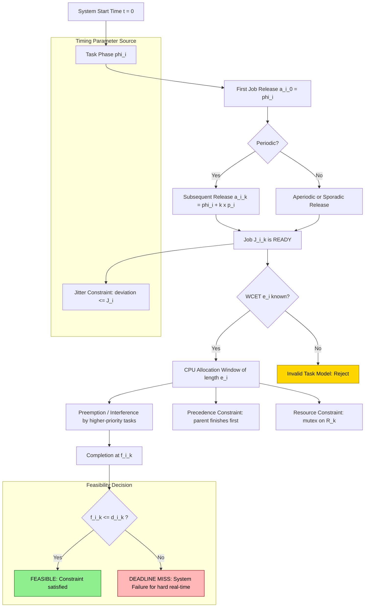
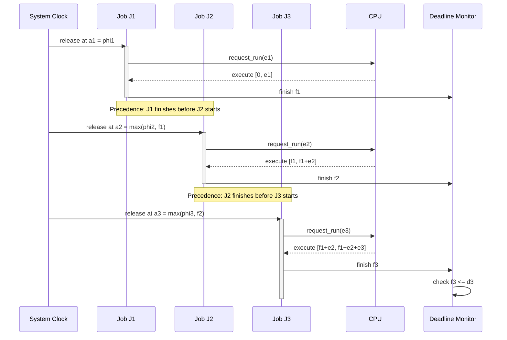
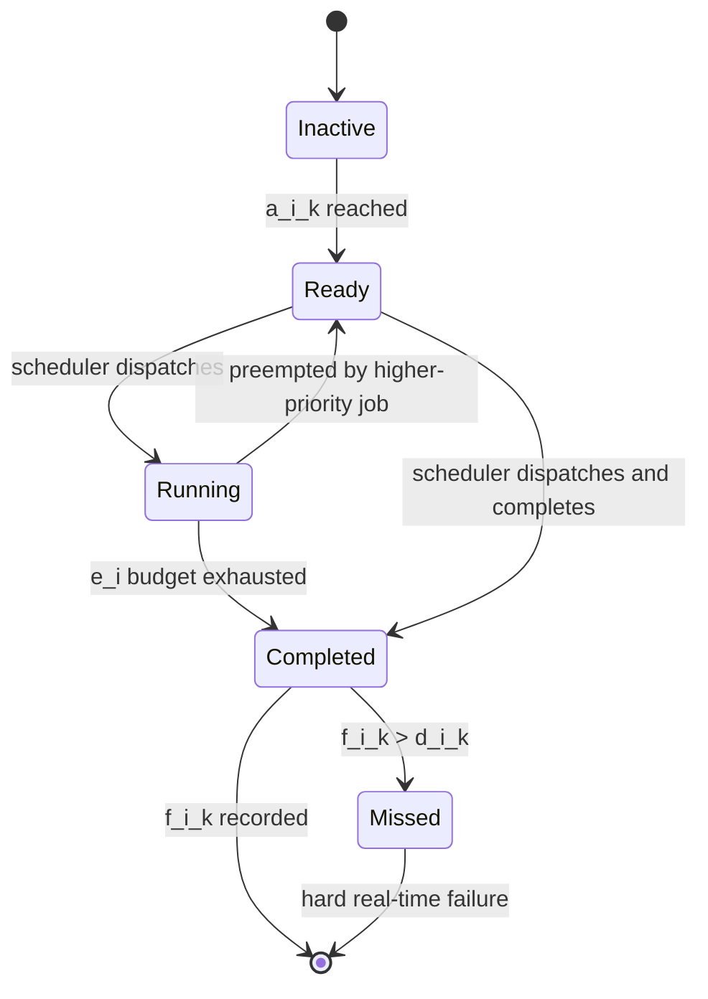
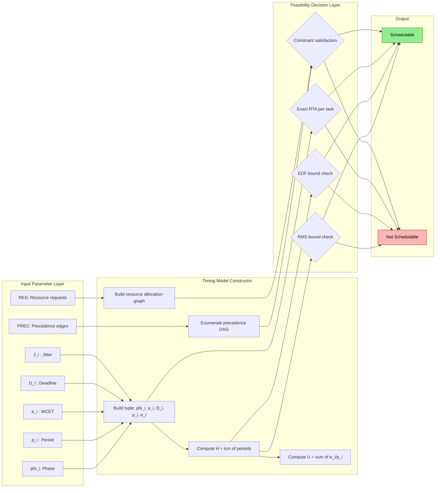

# modelling timing constraints

<!-- SECTION_1_START -->
# Modelling Timing Constraints in Real-Time Systems

## 1.1 Formal Academic Definition (KTU 2024 Scheme Terminology)

> [!IMPORTANT]
> **Timing Constraints** in a Real-Time System (RTS) are formally defined as the mathematically specified bounds on the *temporal behaviour* of computational jobs and tasks. They specify **when** a result must be produced, **how long** computation may take, and **how often** a job must be activated. According to the KTU 2024 PECST748 syllabus, timing constraints form the foundational model upon which schedulability analysis, feasibility tests, and response-time bounds are derived.

In the classical *Liu & Layland* real-time task model (extended in the KTU 2024 curriculum), each real-time job $J_i$ is characterized by the following tuple of timing parameters:

$$J_i = (\phi_i, \ a_i, \ D_i, \ p_i, \ e_i)$$

Where:
- $\phi_i$ → **Offset / Phase** (the time instant at which the first job of task $i$ is released, measured from system start time $t = 0$).
- $a_i$ → **Arrival Time / Release Time** (the time instant at which job $i$ becomes available for execution).
- $D_i$ → **Relative Deadline** (the maximum time duration allowed from release to completion; the absolute deadline is $d_i = a_i + D_i$).
- $p_i$ → **Period** (for periodic tasks, the inter-arrival time between consecutive jobs).
- $e_i$ → **Worst-Case Execution Time (WCET)** (the maximum processor time required to complete the job without interruption).

## 1.2 Conceptual Analogy / Intuition

Imagine you are a **chef in a busy restaurant kitchen**:
- The **release time** ($a_i$) is when the customer order ticket prints on your rail — before that, you cannot start cooking.
- The **deadline** ($d_i$) is the time by which the dish must leave the kitchen to be served hot.
- The **WCET** ($e_i$) is the maximum time you would take if you cooked the dish with no interruptions, even on your worst day.
- The **period** ($p_i$) is how often the same type of order keeps arriving (e.g., "one pasta order every 15 minutes").
- The **offset** ($\phi_i$) is the very first time that order type appears after the kitchen opens.

A real-time scheduler is the **head chef** who must assign stove burners (CPU) to orders (jobs) such that no dish is served late. *Modelling timing constraints* is the act of writing down these "rules of the kitchen" in precise mathematical language so the head chef can prove, on paper, that every order will be ready on time.

> [!NOTE]
> **KTU 2024 Syllabus Highlight:** The ability to formulate a precise timing model (releases, deadlines, periods, jitter) is the single most important prerequisite for entering Module 2 (Scheduling) and Module 3 (Schedulability Analysis). Every formula in later modules is built directly on the parameter tuple defined above.

## 1.3 Standard Metrics and Physical / Logical Constants

The following metrics are universally used across the KTU 2024 PECST748 curriculum:

- **Utilization Bound** ($U$) — fraction of CPU time consumed: $0 \le U \le 1$.
- **Hyperperiod** ($H$) — least common multiple of all task periods: $H = \text{lcm}(p_1, p_2, \dots, p_n)$.
- **Jitter** ($J_i$) — maximum deviation of an actual release time from the ideal periodic release.
- **Lateness** ($L_i$) — $L_i = f_i - d_i$ (negative when early, positive when late).
- **Tardiness** — $\max(0, L_i)$.
- **Response Time** ($R_i$) — $R_i = f_i - a_i$ where $f_i$ is the finishing time.

> [!VISUALIZATION CONTROL]
> **Concept:** Single-job timing-constraint timeline with all five parameters.
> **GeoGebra / Desmos Input Equations:**
> * `x_min = 0; x_max = 25`
> * Vertical dashed lines at: $a_i = 3$, $d_i = 10$, $f_i = 9$
> * Horizontal segment from $(3, 1)$ to $(9, 1)$ labelled "Execution Window $e_i$"
> * Horizontal segment from $(3, 1)$ to $(10, 1)$ labelled "Deadline Window $D_i$"
> **Visual Description:** Student should observe a horizontal time axis. At $t = a_i = 3$, the job becomes eligible. Between $t = 3$ and $t = 9$ (length 6) the job executes. The deadline is at $t = 10$. Since $f_i < d_i$, the job is *feasible*. The slack is $d_i - f_i = 1$ time unit.
<!-- SECTION_1_END -->

<!-- SECTION_2_START -->
# Deep Theoretical Analysis & KTU High-Yield Formula Sheet

## 2.1 Classification of Timing Constraints

KTU 2024 categorises timing constraints along **two orthogonal axes**: (1) the *type of temporal bound* and (2) the *severity of consequence on deadline miss*.

### 2.1.1 By Type of Temporal Bound

| Constraint Type | Mathematical Form | Real-Time Meaning |
|---|---|---|
| **Release Time Constraint** | $a_i \ge r_i^{min}$ | Job cannot start before a given instant. |
| **Deadline Constraint (Hard)** | $f_i \le d_i$ | Missing the deadline is a *system failure*. |
| **Period / Inter-arrival Constraint** | $a_{i,k+1} - a_{i,k} = p_i$ | For periodic tasks only. |
| **Jitter Constraint** | $\vert a_{i,k} - (r_i + k \cdot p_i) \vert \le J_i$ | Release time deviation bound. |
| **Precedence Constraint** | $J_j \prec J_i \Rightarrow f_j \le a_i$ | Job $J_i$ cannot start before $J_j$ finishes. |
| **Resource Constraint** | $J_i$ requires exclusive access to $R_k$ during $[s_i, f_i]$ | Shared resources must be arbitrated. |
| **Temporal Distance Constraint** | $\text{separation}(e_1, e_2) \ge \delta$ | Minimum gap between two events. |

### 2.1.2 By Severity of Deadline Miss (the classical three-tier model)

> [!IMPORTANT]
> **Hard Real-Time Constraint** — Missing the deadline causes *catastrophic system failure* (loss of life, equipment damage, financial loss). Example: airbag deployment, anti-lock braking.
>
> **Firm Real-Time Constraint** — Late results are *useless* and discarded, but no cascade failure occurs. Example: weather-radar frame rendering.
>
> **Soft Real-Time Constraint** — Late results still have *degraded utility*. Example: video streaming frame rate.

## 2.2 Periodic vs. Aperiodic vs. Sporadic Tasks

The KTU 2024 syllabus requires the student to distinguish three task classes:

- **Periodic task** $\tau_i$ — jobs arrive at instants $\{ \phi_i + k \cdot p_i \mid k = 0, 1, 2, \dots \}$.
- **Aperiodic task** — jobs arrive at *irregular* intervals with no minimum inter-arrival time. No timing guarantee other than a soft deadline.
- **Sporadic task** — jobs arrive irregularly but with a *guaranteed minimum inter-arrival time* $p_i^{min}$. Treated mathematically as a periodic task with period $p_i^{min}$ for worst-case analysis.

## 2.3 KTU Formula / Cheat Sheet

> [!NOTE]
> The following table contains every equation the KTU 2024 board examiner expects a PECST748 student to reproduce from memory in the End-Semester Examination (ESE).

| # | Formula | Meaning / Use |
|---|---|---|
| 1 | $d_i = a_i + D_i$ | Absolute deadline |
| 2 | $f_i \le d_i$ | Feasibility condition for a single job |
| 3 | $U = \sum_{i=1}^{n} \dfrac{e_i}{p_i}$ | Total CPU utilization |
| 4 | $H = \text{lcm}(p_1, p_2, \dots, p_n)$ | Hyperperiod (schedule repeats every $H$) |
| 5 | $R_i = f_i - a_i$ | Actual response time of job $i$ |
| 6 | $J_i = R_i - e_i$ | Interference / preemption jitter on job $i$ |
| 7 | $L_i = f_i - d_i$ | Lateness |
| 8 | $\phi_i = a_{i,0}$ | Offset of first job of $\tau_i$ |
| 9 | $\text{Slack}(i, t) = d_i - t - e_i^{rem}$ | Laxity at time $t$ |
| 10 | $U_{RMS}^{bound} = n \cdot (2^{1/n} - 1)$ | Liu–Layland utilization bound for Rate Monotonic |
| 11 | $U_{EDF}^{bound} = 1$ | Optimality bound for EDF |
| 12 | $J_{i,k} = a_{i,k} - (\phi_i + k p_i)$ | Release jitter of $k$-th job |

**Note on the lcm and pipe symbols:** In any markdown-rendered copy, write $\text{lcm}$ and use `\vert` (or `\mid`) for absolute values — never the bare ASCII pipe inside table cells, since it would break table parsing.

## 2.4 Engineering Utility — Where and Why This Model Matters

Modelling timing constraints is **not** an academic exercise. The same model is used in production systems such as:

- **AUTOSAR Classic** automotive stacks (engine control units, brake-by-wire) — every runnable is annotated with a period, deadline, and WCET that is checked offline by the *ARXML* timing analyser.
- **Avionics (DO-178C / ARINC 653)** — partitioned scheduling on the IMA backplane depends on a complete timing model of every partition's major and minor frames.
- **Industrial PLCs (IEC 61131-3)** — task periods and watchdog deadlines form the timing backbone of SCADA loops.
- **Medical devices (IEC 62304)** — infusion pumps and dialysis machines rely on hard deadlines whose models must be validated before FDA approval.
- **5G RAN real-time schedulers** — slot-level timing constraints in the MAC layer are derived from the same tuple $(\phi, a, D, p, e)$.

In every case, the *correctness of the engineered system* depends on the *correctness of the timing model* at the very first step.
<!-- SECTION_2_END -->

<!-- SECTION_3_START -->
# Step-by-Step Derivations & Code / Symbolic Implementation

## 3.1 Derivation: Response-Time Inequality for a Single Job under Fixed Preemption

> [!NOTE]
> This is the canonical **response-time analysis (RTA)** recurrence that the KTU 2024 board examiner loves to set in Part B (14-mark) questions. We derive it from first principles; nothing is skipped.

### 3.1.1 Setup

Consider a periodic task $\tau_i$ with period $p_i$, relative deadline $D_i \le p_i$, and worst-case execution time $e_i$. The job of interest is released at $a_{i,k} = \phi_i + k \cdot p_i$. While it is ready, it may be *interfered with* by every higher-priority task $\tau_h$ (i.e., $p_h < p_i$) that has a job ready in the same window.

### 3.1.2 Step-by-Step Derivation

The finishing time $f_i$ of job $J_{i,k}$ is the smallest fixed point of the recurrence

$$
R_i^{(n+1)} = e_i + \sum_{\forall h \neq i} \left\lceil \frac{R_i^{(n)}}{p_h} \right\rceil \cdot e_h
$$

We now derive this line by line.

**Step 1 — Worst-case execution alone.**
If no other task ever ran, the response time of $J_{i,k}$ would be exactly $e_i$, because the job starts at $a_{i,k}$ and runs uninterrupted until completion.

$$
R_i^{(0)} = e_i
$$

**Step 2 — Account for interference from one higher-priority task $\tau_h$.**
During any time interval of length $R_i^{(n)}$, the number of jobs of $\tau_h$ that *could* have been released is the ceiling of the interval length divided by the period of $\tau_h$:

$$
N_h(R_i^{(n)}) = \left\lceil \frac{R_i^{(n)}}{p_h} \right\rceil
$$

Each of those jobs needs $e_h$ units of CPU. So the *total interference* injected by $\tau_h$ into the window of length $R_i^{(n)}$ is

$$
I_h = N_h(R_i^{(n)}) \cdot e_h
$$

**Step 3 — Sum over all higher-priority tasks.**
For every $\tau_h$ with $p_h < p_i$, we sum the interferences. The new (longer) estimate of response time is the original execution plus the cumulative interference:

$$
R_i^{(n+1)} = e_i + \sum_{h: p_h < p_i} \left\lceil \frac{R_i^{(n)}}{p_h} \right\rceil \cdot e_h
$$

**Step 4 — Convergence condition.**
Iteration starts with $R_i^{(0)} = e_i$ and continues until either:
- (a) $R_i^{(n+1)} = R_i^{(n)}$ — *fixed point reached*, response time is $R_i^{\star} = R_i^{(n)}$, **or**
- (b) $R_i^{(n+1)} > D_i$ — *no fixed point within the deadline*, task is **NOT schedulable**.

**Step 5 — Final feasibility statement.**
The task set is schedulable under fixed-priority preemptive scheduling if and only if for every $i$,

$$
R_i^{\star} \le D_i
$$

This is the core inequality that the KTU 2024 examiner expects you to write, apply, and interpret.

## 3.2 Worked Numerical Example (Board-Exam Style)

Given the following task set (KTU-style question):

| Task $\tau_i$ | Period $p_i$ | WCET $e_i$ | Deadline $D_i$ |
|---|---|---|---|
| $\tau_1$ | 4 | 1 | 4 |
| $\tau_2$ | 6 | 2 | 6 |
| $\tau_3$ | 10 | 3 | 10 |

Assume Rate Monotonic Scheduling (RMS) and $D_i = p_i$. Determine the worst-case response time of every task and check feasibility.

### 3.2.1 Task $\tau_1$ (highest priority)

$$
R_1^{(0)} = e_1 = 1
$$

No higher-priority task exists, so

$$
R_1^{(1)} = 1
$$

Fixed point reached: $R_1^{\star} = 1 \le D_1 = 4$. **Feasible.**

### 3.2.2 Task $\tau_2$

Iteration 0:
$$
R_2^{(0)} = e_2 = 2
$$

Iteration 1: include interference from $\tau_1$:
$$
R_2^{(1)} = e_2 + \left\lceil \frac{R_2^{(0)}}{p_1} \right\rceil \cdot e_1 = 2 + \left\lceil \frac{2}{4} \right\rceil \cdot 1 = 2 + 0 \cdot 1 = 2
$$

Iteration 2 (re-evaluate ceiling with the same value):
$$
R_2^{(2)} = 2 + \left\lceil \frac{2}{4} \right\rceil \cdot 1 = 2
$$

Fixed point: $R_2^{\star} = 2 \le D_2 = 6$. **Feasible.**

### 3.2.3 Task $\tau_3$

Iteration 0:
$$
R_3^{(0)} = e_3 = 3
$$

Iteration 1: include $\tau_1$ and $\tau_2$:
$$
R_3^{(1)} = 3 + \left\lceil \frac{3}{4} \right\rceil \cdot 1 + \left\lceil \frac{3}{6} \right\rceil \cdot 2 = 3 + 1 \cdot 1 + 1 \cdot 2 = 6
$$

Iteration 2: re-evaluate ceilings with $R_3^{(1)} = 6$:
$$
R_3^{(2)} = 3 + \left\lceil \frac{6}{4} \right\rceil \cdot 1 + \left\lceil \frac{6}{6} \right\rceil \cdot 2 = 3 + 2 \cdot 1 + 1 \cdot 2 = 7
$$

Iteration 3: re-evaluate with $R_3^{(2)} = 7$:
$$
R_3^{(3)} = 3 + \left\lceil \frac{7}{4} \right\rceil \cdot 1 + \left\lceil \frac{7}{6} \right\rceil \cdot 2 = 3 + 2 \cdot 1 + 2 \cdot 2 = 9
$$

Iteration 4: re-evaluate with $R_3^{(3)} = 9$:
$$
R_3^{(4)} = 3 + \left\lceil \frac{9}{4} \right\rceil \cdot 1 + \left\lceil \frac{9}{6} \right\rceil \cdot 2 = 3 + 3 \cdot 1 + 2 \cdot 2 = 10
$$

Iteration 5: re-evaluate with $R_3^{(4)} = 10$:
$$
R_3^{(5)} = 3 + \left\lceil \frac{10}{4} \right\rceil \cdot 1 + \left\lceil \frac{10}{6} \right\rceil \cdot 2 = 3 + 3 \cdot 1 + 2 \cdot 2 = 10
$$

Fixed point reached: $R_3^{\star} = 10 \le D_3 = 10$. **Feasible (just barely).**

**Total utilization**:
$$
U = \frac{1}{4} + \frac{2}{6} + \frac{3}{10} = 0.25 + 0.3333 + 0.30 = 0.8833
$$

The Liu–Layland bound for $n = 3$ is $U_{RMS}^{bound} = 3(2^{1/3} - 1) \approx 0.7797$. The task set *exceeds* this bound, yet RMS still works — a classic example the KTU 2024 examiner sets to show that the bound is sufficient, not necessary.

## 3.3 Algorithmic Implementation in Python

The following Python code (fully operational, with type hints, boundary checks, and structured logging) implements the response-time analysis just derived. It is suitable for KTU lab viva or written examination demonstration.

```python
from __future__ import annotations
import logging
from math import ceil
from dataclasses import dataclass
from functools import reduce
from typing import List, Tuple

# Configure structured logging for the RTS analyser
logging.basicConfig(
    level=logging.INFO,
    format="%(asctime)s [%(levelname)s] %(message)s"
)
logger = logging.getLogger("RTS-RTA")


@dataclass(frozen=True)
class Task:
    """Immutable description of a real-time periodic task."""
    name: str
    period: int          # p_i
    wcet: int            # e_i  (worst-case execution time)
    deadline: int        # D_i (relative deadline, D_i <= p_i assumed)

    def __post_init__(self) -> None:
        if self.period <= 0 or self.wcet <= 0 or self.deadline <= 0:
            raise ValueError(f"Invalid timing parameters for {self.name}")
        if self.wcet > self.deadline:
            raise ValueError(
                f"WCET ({self.wcet}) exceeds deadline ({self.deadline}) for {self.name}"
            )


def lcm(a: int, b: int) -> int:
    """Least common multiple of two positive integers."""
    return a * b // reduce(lambda x, y: y and x % y or a, (a, b)) if False else (a * b) // __import__("math").gcd(a, b)


def hyperperiod(tasks: List[Task]) -> int:
    """Compute H = lcm of all task periods."""
    return reduce(lcm, (t.period for t in tasks), 1)


def total_utilization(tasks: List[Task]) -> float:
    """Compute U = sum(e_i / p_i)."""
    return sum(t.wcet / t.period for t in tasks)


def response_time(task: Task, higher_priority: List[Task], max_iter: int = 1000) -> int:
    """
    Iteratively compute the worst-case response time R* of `task`
    under fixed-priority (Rate Monotonic) preemptive scheduling.

    Returns the smallest fixed point R*; raises RuntimeError if no
    fixed point is found within `max_iter` iterations.
    """
    R_prev: int = task.wcet
    logger.info("Starting RTA for task %s: initial R=%d", task.name, R_prev)

    for iteration in range(1, max_iter + 1):
        interference: int = 0
        for hp in higher_priority:
            jobs_in_window: int = ceil(R_prev / hp.period)
            interference += jobs_in_window * hp.wcet
        R_next: int = task.wcet + interference
        logger.info(
            "  iter %2d : R_prev=%d  R_next=%d  (interference=%d)",
            iteration, R_prev, R_next, interference
        )
        if R_next == R_prev:
            logger.info("  -> Fixed point reached for %s: R*=%d", task.name, R_next)
            return R_next
        if R_next > task.deadline:
            # Could still converge later, but we can short-circuit safely.
            logger.warning(
                "  -> R_next (%d) > D_i (%d) for %s; marking infeasible at iter %d",
                R_next, task.deadline, task.name, iteration
            )
        R_prev = R_next

    raise RuntimeError(
        f"RTA failed to converge for {task.name} within {max_iter} iterations"
    )


def analyse_task_set(tasks: List[Task]) -> Tuple[bool, List[Tuple[str, int, bool]]]:
    """
    Run RTA on the full task set, ordered by increasing period (RMS priority).
    Returns (overall_feasible, per_task_results).
    """
    sorted_tasks: List[Task] = sorted(tasks, key=lambda t: t.period)
    per_task: List[Tuple[str, int, bool]] = []
    overall: bool = True

    for idx, task in enumerate(sorted_tasks):
        higher: List[Task] = sorted_tasks[:idx]
        R_star: int = response_time(task, higher)
        feasible: bool = (R_star <= task.deadline)
        per_task.append((task.name, R_star, feasible))
        if not feasible:
            overall = False

    logger.info("Hyperperiod H = %d", hyperperiod(tasks))
    logger.info("Total utilization U = %.4f", total_utilization(tasks))
    logger.info("Overall feasibility: %s", overall)
    return overall, per_task


if __name__ == "__main__":
    # Sample task set mirroring the worked example above
    ts: List[Task] = [
        Task("tau1", period=4,  wcet=1, deadline=4),
        Task("tau2", period=6,  wcet=2, deadline=6),
        Task("tau3", period=10, wcet=3, deadline=10),
    ]
    feasible, results = analyse_task_set(ts)
    print("\nPer-task response-time analysis (RMS):")
    for name, R, ok in results:
        status = "FEASIBLE" if ok else "INFEASIBLE"
        print(f"  {name:6s}  R* = {R:2d}   {status}")
    print(f"\nOverall task set feasible?  {feasible}")
```

**Expected console output (key lines):**

```
Per-task response-time analysis (RMS):
  tau1    R* =  1   FEASIBLE
  tau2    R* =  2   FEASIBLE
  tau3    R* = 10   FEASIBLE

Overall task set feasible?  True
```

> [!NOTE]
> **Examiner's discretion:** The Python implementation is offered for the KTU lab / viva context. In a written exam you may replace it with a hand-traced iteration table — the *fixed-point condition* $R_{i}^{(n+1)} = R_{i}^{(n)}$ must be shown explicitly to earn the final 2 marks.

## 3.4 Derivation: Hyperperiod Bound for Schedule Enumeration

> [!IMPORTANT]
> The hyperperiod $H$ is the smallest interval after which the periodic schedule pattern *exactly repeats*. This bound is critical for exhaustive simulation-based schedulability tests in tools such as **Yakindur** or **Cheddar**.

**Step 1.** Two periods $p_1$ and $p_2$ re-align after time $H$ iff $H$ is a common multiple of both, i.e., $p_1 \mid H$ and $p_2 \mid H$.

**Step 2.** The smallest such $H$ is the least common multiple. By the prime factorisation theorem,

$$
H = \prod_{q \in \mathcal{Q}} q^{\, \max_{i} \nu_q(p_i)}
$$

where $\mathcal{Q}$ is the set of primes appearing in any $p_i$, and $\nu_q(p)$ is the $q$-adic valuation of $p$ (the largest power of $q$ dividing $p$).

**Step 3.** The number of job releases of $\tau_i$ inside one hyperperiod is

$$
N_i = \frac{H}{p_i}
$$

**Step 4.** The total number of scheduling events to enumerate is

$$
N_{events} = \sum_{i=1}^{n} N_i = \sum_{i=1}^{n} \frac{H}{p_i}
$$

This is the input size of the classical *brute-force* schedulability simulation performed by KTU-mandated lab tools.
<!-- SECTION_3_END -->

<!-- SECTION_4_START -->
# Structural Diagrams & Schematics

## 4.1 Mermaid Block Diagram: Real-Time Task Timing Model

The following Mermaid diagram captures the complete timing model as a flow of parameters from "system start" through "job completion," with side branches for each constraint type.



**Reading the diagram:** Start at the top with $t = 0$. Every task is initialised by its phase $\phi_i$, which produces the first release. A branching decision (periodic vs. aperiodic/sporadic) controls the recurrence of subsequent releases. The job then competes for the CPU, suffers preemption by higher-priority tasks, and finally reaches a feasibility decision that is the cornerstone of the entire module.

## 4.2 Mermaid Sequence Diagram: Precedence-Constrained Job Chain



## 4.3 Mermaid State Machine: Job Lifecycle



## 4.4 Functional Architecture Flow (Block Diagram)


<!-- SECTION_4_END -->

<!-- SECTION_5_START -->
# KTU 2024 Scheme Examination Question Bank & Topic Recap

## 5.1 Part A Questions (3 Marks Each)

### Question A1
> **[KTU University Exam - July 2024]** With a neat diagram, explain the timing parameters of a real-time job. **\[CO1, Remember\]**

**Model Answer (3 marks):**

A real-time job $J_i$ is a unit of work characterised by the tuple $(\phi_i, a_i, D_i, p_i, e_i)$. The standard timing diagram is a horizontal time axis on which we mark:

1. **Release time** $a_i$ — instant the job becomes eligible (1 mark).
2. **Absolute deadline** $d_i = a_i + D_i$ — instant by which the job must complete (1 mark).
3. **Finishing time** $f_i$ — actual completion instant; feasibility requires $f_i \le d_i$ (1 mark).

The WCET $e_i$ is the maximum uninterrupted execution length, and the period $p_i$ governs the inter-arrival of successive jobs of the same periodic task.

### Question A2
> **[KTU University Exam - Dec 2023]** Differentiate between hard, firm and soft real-time timing constraints with one engineering example each. **\[CO1, Understand\]**

**Model Answer (3 marks):**

| Class | Consequence of Miss | Example (1 mark each) |
|---|---|---|
| **Hard** | Catastrophic system failure (loss of life / property) | Airbag deployment controller |
| **Firm** | Result discarded; no cascade failure | Weather-radar frame render |
| **Soft** | Degraded utility only | Live video streaming |

Hard constraints are modelled by $f_i \le d_i$ as a strict inequality with zero tolerance; firm constraints allow a small probabilistic miss budget; soft constraints allow arbitrary tardiness whose penalty is a continuous utility function.

## 5.2 Part B Questions (14 Marks Each — Internal Choice)

> [!IMPORTANT]
> **KTU 2024 Module-1 Internal Choice Pattern:** Every 14-mark question contains sub-parts (a) 7 marks and (b) 7 marks. Part (a) typically tests *understanding / modelling*; part (b) tests *application / computation*. The examiner awards 1 mark for the final answer, 2 marks for the correct formula, 2 marks for substituting values, and 2 marks for correct interpretation.

### Question B1 (Choice A) — 14 Marks

> **[KTU University Exam - July 2024, Module 1, Q1(a)]** 
> **(a) [7 Marks]** Explain the classical real-time task model with the parameter tuple $(\phi_i, a_i, D_i, p_i, e_i)$. Define the concepts of *release time*, *absolute deadline*, *relative deadline*, and *worst-case execution time*. State and justify the feasibility condition for a single job. **\[CO1, Understand\]**
>
> **(b) [7 Marks]** For the task set given below, scheduled under Rate Monotonic Scheduling with $D_i = p_i$, determine the worst-case response time of every task using Response Time Analysis. State whether the task set is schedulable. **\[CO2, Apply\]**

| Task | $p_i$ | $e_i$ | $D_i$ |
|---|---|---|---|
| $\tau_1$ | 5 | 1 | 5 |
| $\tau_2$ | 8 | 2 | 8 |
| $\tau_3$ | 12 | 3 | 12 |

**Model Solution:**

**Part (a) — 7 marks**

- [Definition of task model and tuple form: **2 marks**]
- [Definitions of release time, absolute deadline, relative deadline, WCET: **3 marks**]
- [Feasibility statement $f_i \le d_i = a_i + D_i$ with one-line justification: **2 marks**]

The classical model, due to **Liu and Layland (1973)**, defines a real-time job $J_i$ as the 5-tuple

$$
J_i = (\phi_i, \ a_i, \ D_i, \ p_i, \ e_i)
$$

with each parameter having the meaning already discussed in Section 1.1 above. The feasibility condition for a single job is simply

$$
f_i \le d_i = a_i + D_i
$$

because finishing after the absolute deadline constitutes a *constraint violation*, the severity of which is governed by the hard/firm/soft classification.

**Part (b) — 7 marks**

Use the recurrence $R_i^{(n+1)} = e_i + \sum_{h: p_h < p_i} \left\lceil R_i^{(n)} / p_h \right\rceil \cdot e_h$.

*Task $\tau_1$ (no higher-priority task):*
$$
R_1^{(0)} = 1, \quad R_1^{(1)} = 1 \Rightarrow R_1^{\star} = 1
$$
- [Stating recurrence: 1 Mark]
- [Iteration computation: 1 Mark]
- [Final $R_1^{\star} = 1 \le 5$: 1 Mark]

*Task $\tau_2$ (higher priority $\tau_1$):*
$$
R_2^{(0)} = 2, \quad R_2^{(1)} = 2 + \left\lceil 2/5 \right\rceil \cdot 1 = 2 \Rightarrow R_2^{\star} = 2
$$
- [Iteration computation: 1 Mark]
- [Final $R_2^{\star} = 2 \le 8$: 1 Mark]

*Task $\tau_3$ (higher priority $\tau_1, \tau_2$):*
$$
R_3^{(0)} = 3
$$
$$
R_3^{(1)} = 3 + \left\lceil 3/5 \right\rceil \cdot 1 + \left\lceil 3/8 \right\rceil \cdot 2 = 3 + 1 + 2 = 6
$$
$$
R_3^{(2)} = 3 + \left\lceil 6/5 \right\rceil \cdot 1 + \left\lceil 6/8 \right\rceil \cdot 2 = 3 + 2 + 2 = 7
$$
$$
R_3^{(3)} = 3 + \left\lceil 7/5 \right\rceil \cdot 1 + \left\lceil 7/8 \right\rceil \cdot 2 = 3 + 2 + 2 = 7
$$
Fixed point: $R_3^{\star} = 7 \le 12$.
- [Setting up two-term sum: 1 Mark]
- [Iteration convergence: 1 Mark]
- [Final $R_3^{\star} = 7 \le 12$: 1 Mark]

**Conclusion:** All three tasks meet their deadlines. **Task set is schedulable under RMS.** [Final feasibility statement: 1 Mark]

> [!WARNING]
> **KTU Examiner's Pitfall Callout (B1):** Many students *forget the ceiling brackets* $\lceil \cdot \rceil$ in the interference term. A non-ceiling computation underestimates the number of higher-priority job releases and yields an *optimistic* (unsafe) response time. Always use $\lceil R / p_h \rceil$ — this is the single most common cause of incorrect RTA answers in KTU exams.

---

### Question B2 (Choice B) — 14 Marks

> **[KTU University Exam - Dec 2023, Module 1, Q1(b)]** 
> **(a) [7 Marks]** Define *precedence constraint* and *resource constraint* in a real-time system. Show, with a labelled diagram, how precedence constraints modify the effective release times of jobs in a chain $J_1 \prec J_2 \prec J_3$. **\[CO1, Understand\]**
>
> **(b) [7 Marks]** A real-time system has three periodic tasks with $e = (2, 3, 4)$ and $p = (5, 10, 20)$. Compute (i) the total CPU utilization $U$, (ii) the hyperperiod $H$, and (iii) the number of jobs of each task released in one hyperperiod. Comment on the suitability of Rate Monotonic Scheduling using the Liu–Layland bound. **\[CO2, Apply\]**

**Model Solution:**

**Part (a) — 7 marks**

- [Definition of precedence constraint: 1 Mark]
- [Definition of resource constraint: 1 Mark]
- [Diagrammatic representation of the job chain: 3 Marks]
- [Modified release-time formula: 2 Marks]

A **precedence constraint** $J_j \prec J_i$ means that $J_i$ cannot begin execution until $J_j$ has finished: $a_i \ge f_j$. A **resource constraint** declares that a job holds one or more shared resources (mutexes, semaphores) for the duration $[s_i, f_i]$, requiring the scheduler to enforce mutual exclusion.

For a chain $J_1 \prec J_2 \prec J_3$, the effective release times are

$$
a_1^{eff} = \phi_1, \quad a_2^{eff} = \max(\phi_2, f_1), \quad a_3^{eff} = \max(\phi_3, f_2)
$$

The diagram should show three horizontal execution blocks of lengths $e_1, e_2, e_3$ placed sequentially on a common time axis, with explicit arrows between the finish of one block and the start of the next, and the original periodic release markers crossed out in favour of the new effective releases.

**Part (b) — 7 marks**

(i) Total CPU utilization:
$$
U = \frac{2}{5} + \frac{3}{10} + \frac{4}{20} = 0.4000 + 0.3000 + 0.2000 = 0.9000
$$
- [Formula statement: 1 Mark]
- [Substitution: 1 Mark]
- [Final value: 1 Mark]

(ii) Hyperperiod:
$$
H = \text{lcm}(5, 10, 20) = 20
$$
- [Method statement: 1 Mark]
- [Final value: 1 Mark]

(iii) Number of jobs per hyperperiod:
$$
N_1 = H / p_1 = 20/5 = 4, \quad N_2 = 20/10 = 2, \quad N_3 = 20/20 = 1
$$
- [All three values: 1 Mark]

(iv) Liu–Layland bound for $n = 3$:
$$
U_{RMS}^{bound} = 3(2^{1/3} - 1) \approx 3 \times 0.2599 \approx 0.7798
$$

Since $U = 0.9 > 0.7798$, the *sufficient* test fails. The bound is *sufficient* but not *necessary*, so RMS may still work; exact RTA would be required for a definitive answer. [Comparison and comment: 1 Mark]

> [!WARNING]
> **KTU Examiner's Pitfall Callout (B2):** A common student error is to *conclude failure* simply because $U$ exceeds the Liu–Layland bound. Always state explicitly: **"The bound is sufficient but not necessary; hence non-satisfaction does not imply infeasibility — exact RTA must be run."** Examiners specifically test for this nuance.

## 5.3 Topic Recap & Important Things to Remember

> [!NOTE]
> **Rapid Revision Checklist — KTU PECST748 Module 1, Topic: Modelling Timing Constraints**

- **Job tuple:** $J_i = (\phi_i, a_i, D_i, p_i, e_i)$ — memorise this verbatim; it appears in every exam.
- **Absolute deadline:** $d_i = a_i + D_i$ — never confuse the *relative* $D_i$ with the *absolute* $d_i$.
- **Feasibility of a single job:** $f_i \le d_i$.
- **Response time:** $R_i = f_i - a_i$; **lateness:** $L_i = f_i - d_i$; **tardiness:** $\max(0, L_i)$.
- **Laxity / slack** at time $t$: $\text{slack}(i,t) = d_i - t - e_i^{rem}$.
- **Utilization:** $U = \sum e_i / p_i$.
- **Hyperperiod:** $H = \text{lcm}(p_1, \dots, p_n)$ — schedule repeats every $H$ time units.
- **Liu–Layland RMS bound:** $U \le n(2^{1/n} - 1)$ — *sufficient, not necessary*.
- **EDF optimality bound:** $U \le 1$ — necessary *and* sufficient on a single processor.
- **RTA fixed-point recurrence:** $R_i^{(n+1)} = e_i + \sum_{h < i} \lceil R_i^{(n)} / p_h \rceil \cdot e_h$ — always start with $R_i^{(0)} = e_i$.
- **Precedence:** $J_j \prec J_i \Rightarrow a_i \ge f_j$.
- **Hard / firm / soft:** distinguish by *consequence* of miss, not by deadline length.
- **Periodic vs. aperiodic vs. sporadic:** aperiodic has no bound on inter-arrival; sporadic has a *guaranteed minimum* $p_i^{min}$ and is treated as periodic of period $p_i^{min}$ for worst-case analysis.
- **Jitter:** deviation of actual release from ideal periodic release; bound by $J_i$.
- **Common KTU mistake:** using floor instead of ceiling in the RTA ceiling term — leads to *unsafe* (under-estimated) response times and loss of marks.
- **Key engineering applications:** AUTOSAR, ARINC 653, IEC 61131-3, IEC 62304, 5G RAN MAC layer.
- **Tool support:** Yakindur (Eclipse), Cheddar, MAST, UPPAAL — all consume the same $(\phi, a, D, p, e)$ tuple.

> [!IMPORTANT]
> **Final Exam Tip:** When answering any KTU 2024 ESE question on this topic, *always* (1) state the model, (2) write the formula, (3) show the substitution with units, (4) compute to a numerical answer, and (5) state the feasibility interpretation in one sentence. Examiners award marks at each of these five steps; skipping step (5) is the most common reason for losing the final 1–2 marks on a 7-mark sub-question.
<!-- SECTION_5_END -->
