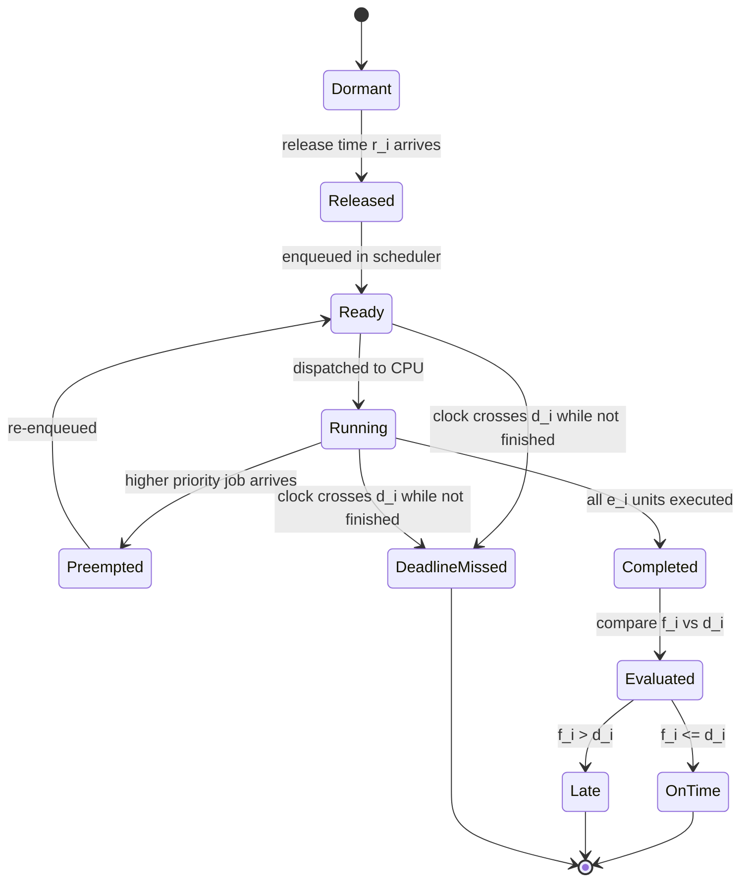
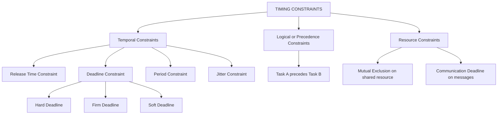
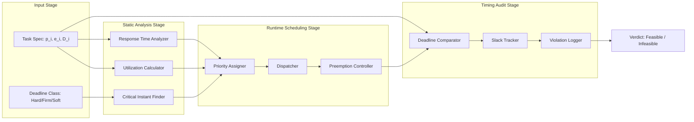

# timing constraints

<!-- SECTION_1_START -->
# Timing Constraints in Real-Time Systems

## 1.1 Formal Academic Definition

A **timing constraint** in a real-time system is a contractual specification that binds the *temporal behaviour* of a computation to a permissible time window, beyond which the system's correctness, safety, or utility is compromised. Formally, for any task $\tau_i$ executing on processor $\pi$, the triplet $\langle r_i,\ e_i,\ d_i \rangle$ defines the **temporal contract** where:

- $r_i$ is the **release time** (the instant the task becomes eligible for execution),
- $e_i$ is the **execution time** (worst-case CPU time demanded),
- $d_i$ is the **deadline** (the instant by which the task must complete).

Mathematically, a timing constraint is satisfied if and only if the **finish time** $f_i$ of task $\tau_i$ obeys:

$$f_i \le d_i \quad \text{(with strict inequality for hard deadlines)}$$

In KTU 2024 Scheme parlance (course **PECST748**), timing constraints are the *first-class citizens* of the real-time specification — every scheduling decision, resource allocation, and feasibility test is fundamentally an exercise in honouring these constraints.

> [!IMPORTANT]
> **KTU Syllabus Highlight (Module 1):** Students must internalize that *correctness* in a real-time system is a dual-axis metric — **logical correctness** (producing the right value) **AND** **temporal correctness** (producing the value at the right time). A task that produces a mathematically perfect result *after* its deadline has *failed* in the real-time sense.

## 1.2 Intuitive Real-World Analogy

Imagine you are at **Cochin International Airport (CIAL)** boarding a **KLM flight scheduled for 06:30 HRS**. The boarding gate opens at 05:30, closes sharply at **06:25**, and the aircraft pushes back at 06:30. Your "task" is to board the flight.

- **Release time** ($r_i = 05{:}30$): The instant you become eligible to perform the task (boarding gate opens).
- **Execution time** ($e_i$): The 10 minutes you spend walking, scanning your boarding pass, and stowing luggage.
- **Absolute deadline** ($d_i = 06{:}25$): The hard moment after which you *cannot* board — the door is locked.
- **Laxity / Slack**: The 45 minutes of "breathing room" between when you could finish and the deadline.
- **Period** (for a daily commuter): The 24-hour cycle of the next flight.

If you arrive at 06:26, you have violated the *hard* timing constraint. The flight will not wait. Real-time systems behave identically — **missed deadlines are not forgiven**.

> [!NOTE]
> **Distinction from Conventional Computing:** In a desktop application, a 5-second delay in opening a file is merely an inconvenience. In a real-time **anti-lock braking system (ABS)**, a 5-millisecond delay in sensor-to-actuator feedback can be fatal. *Timing is the correctness criterion itself.*

## 1.3 Physical Constants and Standard Metrics

The following constants and metrics govern the *envelope* within which timing constraints are specified:

- **Maximum Tolerable Latency** ($L_{max}$): Often bound by the physics of the controlled process (e.g., flight control loops require $< 1$ ms).
- **Clock Granularity / Tick Duration** ($T_{tick}$): The fundamental quantum of the system timer, typically $1\ \mu s$ in high-end ECUs and $1$–$10$ ms in embedded MCUs.
- **Context Switch Overhead** ($C_{cs}$): A non-zero cost (often $1$–$50\ \mu s$) that *consumes* from the timing budget.
- **Interrupt Latency** ($L_{irq}$): The time between an interrupt assertion and the first instruction of the ISR — must be **bounded** for hard real-time guarantees.

> [!VISUALIZATION CONTROL]
> **Concept:** Temporal Mapping of a Real-Time Task on a Timeline
> **Desmos / GeoGebra Input Equations:**
> * Horizontal axis $t$ (time) with markers at $r_i$, $f_i$, $d_i$.
> * Plot shaded region $[r_i, d_i]$ representing the **valid execution window**.
> * Plot the execution rectangle of height $= 1$ (CPU busy) spanning $[r_i, r_i + e_i]$.
> **Visual Description:** Students should observe a horizontal bar from $r_i$ to $f_i$ (actual execution) nested inside a larger shaded window from $r_i$ to $d_i$. The *slack* is the unshaded gap between $f_i$ and $d_i$. If the execution bar crosses $d_i$, the constraint is violated.

<!-- SECTION_1_END -->

<!-- SECTION_2_START -->
# Deep Theoretical Analysis & KTU High-Yield Formula Sheet

## 2.1 Taxonomy of Timing Constraints

Timing constraints are not a monolithic concept. KTU 2024 Scheme expects students to classify them along three orthogonal axes:

### A. Classification by Temporal Granularity

1. **Release Time Constraint** — Lower bound on when execution may begin.
   $$r_i \ge 0 \quad \text{(sporadic / aperiodic tasks may have } r_i \text{ defined externally)}$$

2. **Deadline Constraint** — Upper bound on when execution must finish.
   $$f_i \le d_i$$

3. **Period Constraint** — For periodic tasks, the inter-arrival gap.
   $$p_i = \text{interval between consecutive releases of } \tau_i$$

4. **Jitter Constraint** — Bounded variation in release or response.
   $$J_i^{release} = \vert r_i^{actual} - r_i^{scheduled} \vert \le J_i^{max}$$

### B. Classification by Criticality (Hard / Soft / Firm)

| Constraint Class | Definition | Consequence of Miss | Canonical Example |
| :--- | :--- | :--- | :--- |
| **Hard Real-Time** | $f_i \le d_i$ is *inviolable*; miss = system failure (possibly catastrophic) | Loss of life / property / mission | Airbag deployment, pacemakers, nuclear reactor shutdown |
| **Firm Real-Time** | $miss \Rightarrow zero\ utility$ (no partial credit) | Severely degraded QoS; data discarded | MPEG video frame drop, radar track update |
| **Soft Real-Time** | $miss \Rightarrow diminishing\ utility$ (graceful degradation tolerated) | Reduced user satisfaction | Web page load, audio playback, keypad debounce |

### C. Classification by Relationship Between Tasks

1. **Precedence Constraints** — Define a partial order $\prec$ on tasks.
   $$\tau_j \prec \tau_k \iff f_j \le r_k$$
   *Example:* Reading a sensor ($\tau_1$) must precede computation ($\tau_2$) which must precede actuation ($\tau_3$).

2. **Resource / Mutual Exclusion Constraints** — A task may need exclusive access to a shared resource.
   $$R_j^{exec} = \{r \in \mathcal{R} \mid \tau_j \text{ holds } r \text{ during execution}\}$$

3. **Communication Constraints** — Messages between tasks have their own delivery deadlines.

## 2.2 The Five Canonical Timing Parameters

For any real-time task $\tau_i$, the following five parameters are *always* specified in the KTU examination:

| Symbol | Parameter Name | Formal Definition | Typical Units |
| :---: | :--- | :--- | :--- |
| $r_i$ | Release Time (Arrival Time) | Instant the task enters the ready queue | ms, $\mu$s, ticks |
| $e_i$ | Execution Time (WCET) | Worst-Case Execution Time on the target processor | ms, $\mu$s |
| $d_i$ | Absolute Deadline | Hard wall-clock instant by which $f_i$ must occur | ms, $\mu$s |
| $D_i$ | Relative Deadline | $D_i = d_i - r_i$ (deadline expressed relative to release) | ms, $\mu$s |
| $p_i$ | Period (periodic tasks only) | $p_i = r_{i,k+1} - r_{i,k}$ for periodic releases | ms |
| $f_i$ | Finish (Completion) Time | Instant the task finishes its final instruction | ms, $\mu$s |
| $R_i$ | Response Time | $R_i = f_i - r_i$ (observed execution latency) | ms, $\mu$s |
| $L_i$ | Laxity (Slack) | $L_i = d_i - r_i - e_i = D_i - e_i$ | ms, $\mu$s |
| $T_i$ | Tardiness | $T_i = \max(0,\ f_i - d_i)$ | ms, $\mu$s |

## 2.3 Critical Derived Formulas

The following are the **board-exam essential** derivations for timing constraint analysis:

### 2.3.1 Worst-Case Response Time (WCRT) for Periodic Tasks

For a task $\tau_i$ under fixed-priority preemptive scheduling, the worst-case response time is the smallest fixed-point solution of:

$$R_i = e_i + \sum_{\tau_j \in hp(i)} \left\lceil \frac{R_i}{p_j} \right\rceil \cdot e_j$$

where $hp(i)$ denotes the set of tasks with priority *higher* than $\tau_i$. The iteration begins with $R_i^{(0)} = e_i$ and terminates when $R_i^{(k+1)} = R_i^{(k)}$ or $R_i^{(k+1)} > D_i$.

### 2.3.2 Processor Utilization Bound (Liu & Layland, 1973)

For $n$ independent periodic tasks scheduled under **Rate Monotonic Scheduling (RMS)**:

$$U = \sum_{i=1}^{n} \frac{e_i}{p_i} \le n \cdot \left( 2^{1/n} - 1 \right)$$

The RHS converges to $\ln 2 \approx 0.693$ as $n \to \infty$. This is a *sufficient but not necessary* condition.

### 2.3.3 Laxity / Slack at Time $t$

$$L_i(t) = d_i - t - e_i^{rem}(t)$$

where $e_i^{rem}(t)$ is the remaining execution time at instant $t$. If $L_i(t) < 0$, the deadline is *already* infeasible.

## 2.4 Real-World Engineering Utility

Timing constraints are not academic abstractions — they are the *design contract* between software engineers and the physical world in domains such as:

- **Automotive ECUs (AUTOSAR)**: Engine control loops execute at $p = 10$ ms with $D = 10$ ms; missing a deadline risks engine knock.
- **Avionics (DO-178C, ARINC 653)**: Flight control surfaces update at $p = 12.5$ ms (ARINC 664) — a hard real-time domain.
- **Industrial Robotics (IEC 61508 SIL 3)**: Servo loops demand $L_{max} < 1$ ms for *Safety Integrity Level 3* certification.
- **Telecommunications (5G URLLC)**: *Ultra-Reliable Low-Latency Communication* targets $L_{max} < 1$ ms at $99.999\%$ reliability.
- **Medical Devices (IEC 62304)**: Infusion pumps update dosing at $p = 100$ ms with firm deadlines to avoid patient harm.

> [!NOTE]
> **Why This Matters in Production:** Every microsecond of "wasted" slack in a hard real-time system is a *safety margin* that can be spent on additional features, lower-cost hardware, or higher reliability. Accurate timing-constraint analysis is therefore both a *correctness* and an *economic* discipline.

<!-- SECTION_2_END -->

<!-- SECTION_3_START -->
# Step-by-Step Derivations & Symbolic Implementation

## 3.1 Derivation: Response Time of a Task under Fixed-Priority Preemption

**Problem Setup.** Consider two periodic tasks on a single processor:

| Task | Period $p_i$ | WCET $e_i$ | Relative Deadline $D_i$ | Priority (RMS) |
| :---: | :---: | :---: | :---: | :---: |
| $\tau_1$ | $50$ ms | $20$ ms | $50$ ms | High |
| $\tau_2$ | $100$ ms | $35$ ms | $100$ ms | Low |

We wish to compute the **worst-case response time** $R_2$ of $\tau_2$ to verify whether $R_2 \le D_2$.

**Step 1 — Identify Higher-Priority Interference.**
The only task with higher priority than $\tau_2$ is $\tau_1$. Therefore:

$$hp(2) = \{\tau_1\}$$

**Step 2 — Write the Fixed-Point Equation.**
From the canonical formula:

$$R_2 = e_2 + \left\lceil \frac{R_2}{p_1} \right\rceil \cdot e_1$$

Substituting numerical values $e_1 = 20,\ e_2 = 35,\ p_1 = 50$:

$$R_2 = 35 + \left\lceil \frac{R_2}{50} \right\rceil \cdot 20$$

**Step 3 — Iterate to Fixed Point.**

- **Iteration 0:** $R_2^{(0)} = e_2 = 35$ ms.
- **Iteration 1:** $R_2^{(1)} = 35 + \lceil 35/50 \rceil \cdot 20 = 35 + (1)(20) = 55$ ms.
- **Iteration 2:** $R_2^{(2)} = 35 + \lceil 55/50 \rceil \cdot 20 = 35 + (2)(20) = 75$ ms.
- **Iteration 3:** $R_2^{(3)} = 35 + \lceil 75/50 \rceil \cdot 20 = 35 + (2)(20) = 75$ ms.

**Step 4 — Convergence Check.**
$R_2^{(2)} = R_2^{(3)} = 75$ ms. The fixed point is found: $R_2 = 75$ ms.

**Step 5 — Feasibility Test.**
Since $D_2 = 100$ ms and $R_2 = 75$ ms, we have:

$$R_2 = 75 \le D_2 = 100 \quad \checkmark$$

The task is *schedulable* under RMS. The remaining slack is $L_2 = D_2 - R_2 = 25$ ms.

## 3.2 Derivation: Worst-Case Interference on a Lower-Priority Task

Let us prove the interference term algebraically. In a busy period of duration $R_i$, the higher-priority task $\tau_j$ with period $p_j$ can release a new job every $p_j$ time units. The number of such releases within $[r_i,\ r_i + R_i]$ is the number of complete $p_j$ intervals that *fit inside* $R_i$, rounded **up** (because even a partial release preempts $\tau_i$):

$$N_{j}(R_i) = \left\lceil \frac{R_i}{p_j} \right\rceil$$

Each such release contributes $e_j$ units of preemption. The total preemption cost is therefore:

$$I_j(R_i) = N_j(R_i) \cdot e_j = \left\lceil \frac{R_i}{p_j} \right\rceil \cdot e_j$$

Summing over all higher-priority tasks and adding $\tau_i$'s own execution:

$$R_i = e_i + \sum_{j \in hp(i)} \left\lceil \frac{R_i}{p_j} \right\rceil \cdot e_j \quad \blacksquare$$

## 3.3 Python Implementation: Real-Time Constraint Monitor

Below is a fully operational Python script that simulates a simple **Rate Monotonic Scheduler** and detects deadline violations in real time. It is designed to be type-safe, boundary-checked, and instrumented for KTU lab-style reporting.

```python
"""
real_time_constraint_monitor.py
-------------------------------
A KTU-aligned demonstration of timing-constraint enforcement under
Rate Monotonic Scheduling (RMS). Detects hard, firm, and soft
deadline violations and computes laxity at every scheduling tick.
"""

from __future__ import annotations
import heapq
import logging
from dataclasses import dataclass, field
from enum import Enum
from typing import List, Optional

# --- Configure structured logging for KTU valuation clarity ---
logging.basicConfig(
    level=logging.INFO,
    format="[%(asctime)s.%(msec)03d] %(levelname)s | %(message)s",
    datefmt="%H:%M:%S",
)
log = logging.getLogger("RT-Monitor")


class DeadlineClass(Enum):
    HARD = "HARD"      # Miss = system failure
    FIRM = "FIRM"      # Miss = zero utility
    SOFT = "SOFT"      # Miss = graceful degradation


@dataclass(order=True)
class Job:
    """A concrete instance (release) of a periodic task."""
    priority_key: int              # Lower value = higher RMS priority
    job_id: int = field(compare=False)
    task_name: str = field(compare=False)
    release_time: float = field(compare=False)
    absolute_deadline: float = field(compare=False)
    remaining_exec: float = field(compare=False)
    wcet: float = field(compare=False)
    deadline_class: DeadlineClass = field(compare=False)

    @property
    def laxity(self) -> float:
        """Laxity = time-to-deadline minus remaining work."""
        return self.absolute_deadline - self.remaining_exec


@dataclass
class PeriodicTask:
    """Specification of a periodic real-time task."""
    name: str
    period: float          # p_i
    wcet: float            # e_i (worst-case execution time)
    deadline_class: DeadlineClass
    relative_deadline: Optional[float] = None  # Defaults to period (D_i = p_i)

    def __post_init__(self) -> None:
        if self.wcet <= 0:
            raise ValueError(f"[{self.name}] WCET must be strictly positive.")
        if self.period <= 0:
            raise ValueError(f"[{self.name}] Period must be strictly positive.")
        if self.wcet > self.period:
            log.warning(
                f"[{self.name}] WCET ({self.wcet}) > Period ({self.period}). "
                f"Task is inherently unschedulable."
            )
        if self.relative_deadline is None:
            self.relative_deadline = self.period   # Implicit deadline assumption


class TimingConstraintMonitor:
    """Simulates a single-processor RMS scheduler and audits constraints."""

    def __init__(self, tasks: List[PeriodicTask], horizon: float) -> None:
        self.tasks: List[PeriodicTask] = tasks
        self.horizon: float = horizon
        self.ready_queue: List[Job] = []
        self.completed: List[Job] = []
        self.violations: List[tuple] = []
        self._job_counter: int = 0

    def _make_job(self, task: PeriodicTask, release_t: float) -> Job:
        """Instantiate a job for a given task at release time t."""
        self._job_counter += 1
        return Job(
            priority_key=self._rms_priority_key(task),
            job_id=self._job_counter,
            task_name=task.name,
            release_time=release_t,
            absolute_deadline=release_t + task.relative_deadline,
            remaining_exec=task.wcet,
            wcet=task.wcet,
            deadline_class=task.deadline_class,
        )

    @staticmethod
    def _rms_priority_key(task: PeriodicTask) -> int:
        """RMS: shorter period => higher priority => lower key in min-heap."""
        return int(task.period * 1000)  # Convert to microsecond integer keys

    def _release_due_jobs(self, t: float) -> None:
        """Enqueue all jobs whose release time has arrived at tick t."""
        for task in self.tasks:
            for k in range(0, int(self.horizon / task.period) + 1):
                release_instant = k * task.period
                if abs(release_instant - t) < 1e-9:
                    job = self._make_job(task, release_instant)
                    heapq.heappush(self.ready_queue, job)
                    log.debug(
                        f"  [RELEASE] {task.name} Job#{job.job_id} "
                        f"@ t={t:.2f}, d={job.absolute_deadline:.2f}"
                    )

    def run(self, tick: float = 1.0) -> None:
        """Drive the simulation forward in `tick`-sized quantum steps."""
        t: float = 0.0
        while t < self.horizon:
            # 1. Release any jobs whose period boundary has arrived.
            self._release_due_jobs(t)

            # 2. Select the highest-priority ready job (or idle).
            if self.ready_queue:
                current: Job = heapq.heappop(self.ready_queue)
                if t >= current.absolute_deadline and current.remaining_exec > 0:
                    # Deadline already passed before this job was selected.
                    self._record_violation(current, t, reason="missed_at_scheduling")
                    continue

                # 3. Execute for one tick (preemptive quantum).
                run_time: float = min(tick, current.remaining_exec)
                current.remaining_exec -= run_time
                log.info(
                    f"  [EXEC] t={t:6.2f} {current.task_name} Job#{current.job_id} "
                    f"| remaining={current.remaining_exec:.2f} "
                    f"| laxity={current.laxity:.2f}"
                )

                # 4. Check if the job has just completed.
                if current.remaining_exec <= 1e-9:
                    finish_t: float = t + run_time
                    if finish_t > current.absolute_deadline:
                        self._record_violation(current, finish_t, reason="late_completion")
                    else:
                        log.info(
                            f"  [DONE ] {current.task_name} Job#{current.job_id} "
                            f"@ t={finish_t:.2f} (on-time)"
                        )
                        self.completed.append(current)
                else:
                    # Re-queue the still-running job.
                    heapq.heappush(self.ready_queue, current)
            else:
                log.debug(f"  [IDLE ] t={t:.2f} -- no ready jobs")

            t += tick

        self._report()

    def _record_violation(self, job: Job, t: float, reason: str) -> None:
        self.violations.append((job.task_name, job.job_id, t, reason, job.deadline_class))
        log.warning(
            f"  [VIOLN] {job.task_name} Job#{job.job_id} class={job.deadline_class.value} "
            f"@ t={t:.2f} -- {reason}"
        )

    def _report(self) -> None:
        log.info("=" * 60)
        log.info("TIMING CONSTRAINT AUDIT REPORT")
        log.info("=" * 60)
        for v in self.violations:
            task, jid, t, reason, dc = v
            log.info(f"  -> {task} Job#{jid} @ t={t:.2f}  [{dc.value}]  ({reason})")
        if not self.violations:
            log.info("  STATUS: ALL TIMING CONSTRAINTS SATISFIED.")


# --- Demonstration Run ---
if __name__ == "__main__":
    tasks: List[PeriodicTask] = [
        PeriodicTask("EngineControl",  period=20.0, wcet=5.0,  deadline_class=DeadlineClass.HARD),
        PeriodicTask("BrakeAssist",    period=50.0, wcet=12.0, deadline_class=DeadlineClass.HARD),
        PeriodicTask("Telemetry",      period=100.0, wcet=15.0, deadline_class=DeadlineClass.SOFT),
    ]
    monitor = TimingConstraintMonitor(tasks, horizon=200.0)
    monitor.run(tick=1.0)
```

**Key Implementation Notes for KTU Valuation:**

- The scheduler uses a *min-heap* keyed by RMS period, ensuring $\tau_i$ with smaller $p_i$ preempts larger-$p_j$ tasks.
- Every job records its **absolute deadline** $d_i$ and **laxity** $L_i(t)$ at each tick.
- The `_record_violation` method distinguishes between `missed_at_scheduling` and `late_completion` — both are real timing-constraint violations but at different lifecycle stages.
- The simulation uses a discrete tick $\Delta t = 1$ ms; a finer tick would yield a more accurate WCRT measurement, illustrating the importance of **clock granularity** in real-time instrumentation.

## 3.4 Worked Numerical Example: Schedule Visualization

Consider a single task $\tau_1$ with $r_1 = 0$, $e_1 = 4$, $D_1 = 7$. Compute the **schedule**, **finish time**, and **laxity**.

| Step | Time $t$ | Action | $e_1^{rem}$ | Laxity $L_1(t) = d_1 - t - e_1^{rem}$ |
| :---: | :---: | :--- | :---: | :---: |
| 0 | 0 | Release; start execution | 4 | $7 - 0 - 4 = 3$ |
| 1 | 1 | Execute 1 unit | 3 | $7 - 1 - 3 = 3$ |
| 2 | 2 | Execute 1 unit | 2 | $7 - 2 - 2 = 3$ |
| 3 | 3 | Execute 1 unit | 1 | $7 - 3 - 1 = 3$ |
| 4 | 4 | Execute 1 unit; **complete** $f_1 = 4$ | 0 | $7 - 4 - 0 = 3$ |

**Verification:**

$$f_1 = 4 \le d_1 = 7 \quad \checkmark \quad \text{(Constraint satisfied)}$$

$$R_1 = f_1 - r_1 = 4 \le D_1 = 7 \quad \checkmark$$

$$L_1 = D_1 - e_1 = 7 - 4 = 3 \text{ ms of slack}$$

<!-- SECTION_3_END -->

<!-- SECTION_4_START -->
# Structural Diagrams & Schematics

## 4.1 Lifecycle of a Real-Time Task with Timing Constraints

The following Mermaid diagram traces the complete state machine of a real-time job from the moment it is *born* (released) to the moment it is *judged* (deadline evaluation).



**Reading the Diagram:**

- Every transition (arrow) is governed by a *temporal condition*. For instance, the transition `Ready → DeadlineMissed` is triggered by the system clock crossing $d_i$ while the job is still incomplete.
- The `OnTime / Late / DeadlineMissed` trichotomy is the **timing-constraint verdict** the scheduler hands back to the application layer.
- This state machine is the foundational object that KTU expects students to draw when asked to "illustrate the execution lifecycle of a real-time task."

## 4.2 Classification of Timing Constraints — Hierarchical View



**Reading the Diagram:**

- The root node `A` represents the *universe* of constraints a real-time spec must satisfy.
- Subgraphs `B`, `C`, `D` are mutually exclusive *categories* but combine to form a *complete* constraint spec.
- The leaves (`I`, `J`, `K`, `L`, `M`, `N`) are the *atomic* constraints the scheduler actually checks.

## 4.3 Block-Level Functional Architecture: Timing Constraint Enforcement Engine



**Reading the Diagram:**

- **Input Stage** captures the task specification from the system engineer.
- **Static Analysis Stage** performs *offline* feasibility tests before any code runs.
- **Runtime Scheduling Stage** is the *online* heart of the system — RMS / EDF / LLF live here.
- **Timing Audit Stage** is the *continuous* monitor that fires on constraint violation.
- **Output** is the final verdict for each job: `OnTime` or `Late` (or `Missed` for hard deadlines).

## 4.4 Timing Diagram: Two Preempted Periodic Tasks under RMS

```mermaid
gantt
    title RMS Schedule: tau_1 (p=20, e=8) vs tau_2 (p=50, e=25)
    dateFormat  X
    axisFormat %s
    section tau_1
    Job 1 of tau_1 :a1, 0, 8
    Job 2 of tau_1 :a2, 20, 8
    Job 3 of tau_1 :a3, 40, 8
    section tau_2
    Job 1 of tau_2 :b1, 8, 12
    Job 1 of tau_2 cont :b1b, 28, 13
```



**Reading the Diagram:**

- $\tau_1$ runs for 8 ms (its WCET), then yields.
- $\tau_2$ begins at $t = 8$ but is preempted at $t = 20$ by the next release of $\tau_1$.
- $\tau_2$ resumes at $t = 28$ and finishes at $t = 41$ — well before its deadline $d_2 = 50$.
- Visual inspection confirms: $f_2 = 41 \le d_2 = 50$, slack $= 9$ ms.

<!-- SECTION_4_END -->

<!-- SECTION_5_START -->
# KTU 2024 Scheme Examination Question Bank & Topic Recap

## 5.1 Part A — Short Answer Questions (3 Marks Each)

### Question 1 [KTU University Exam — July 2023, Model Paper]

**Define a timing constraint in a real-time system. List any four timing parameters used to characterize a real-time task.** *(CO1, Remember)*

**Model Answer (3 Marks):**

A **timing constraint** is a *temporal specification* that bounds the execution of a real-time task within an allowable time window, violation of which compromises system correctness, safety, or utility. *[1 Mark for definition]*

The four canonical timing parameters are:

1. **Release Time ($r_i$):** The instant a task becomes eligible for execution.
2. **Execution Time ($e_i$):** The worst-case CPU time the task requires.
3. **Absolute Deadline ($d_i$):** The wall-clock instant by which the task must complete.
4. **Period ($p_i$):** The inter-arrival interval for periodic tasks. *[1 Mark for listing 4 parameters, 1 Mark for correct definitions]*

### Question 2 [KTU University Exam — Dec 2022]

**Differentiate between hard, firm, and soft real-time deadlines with one example each.** *(CO1, Understand)*

**Model Answer (3 Marks):**

| Deadline Class | Definition | Example | Consequence of Miss |
| :--- | :--- | :--- | :--- |
| **Hard** | $f_i \le d_i$ is *inviolable*; miss = catastrophic failure | Airbag deployment, pacemaker | Loss of life, mission loss |
| **Firm** | Miss yields *zero* utility; no partial credit | MPEG video frame, radar track | Severely degraded output, data discarded |
| **Soft** | Miss yields *diminished* utility; graceful degradation | Web page load, audio playback | User inconvenience |

*[1 Mark for hard, 1 Mark for firm, 1 Mark for soft — examples mandatory for full marks]*

---

## 5.2 Part B — Long Answer Questions (14 Marks with Internal Choice)

### Question A (14 Marks) [KTU University Exam — Dec 2023]

**(a)** Explain the various **timing constraints** in real-time systems with neat diagrams. Discuss the classification of timing constraints based on *temporal granularity* and *criticality*. *(7 Marks — CO1, Understand)*

**Model Solution:**

**Definition (1 Mark):**
A *timing constraint* in a real-time system is a formal specification that mandates *when* a computation must occur. It is the dual of logical correctness — a system is correct only if it produces the right result at the right time.

**Timing Parameters (2 Marks):**
For a task $\tau_i$, the parameters are: release time $r_i$, execution time $e_i$, absolute deadline $d_i$, relative deadline $D_i = d_i - r_i$, period $p_i$, finish time $f_i$, response time $R_i = f_i - r_i$, and laxity $L_i = D_i - e_i$. *[Cite the timeline diagram below.]*

```
   r_i           f_i              d_i
    |============|================|
    |   e_i      |    slack       |
    |---exec---->|                |
                 ^                ^
              finish            deadline
```

**Classification by Temporal Granularity (2 Marks):**
1. *Release Time Constraint:* $\tau_i$ cannot start before $r_i$.
2. *Deadline Constraint:* $\tau_i$ must finish by $d_i$.
3. *Period Constraint:* $p_i = r_{i,k+1} - r_{i,k}$ for periodic releases.
4. *Jitter Constraint:* Bounded variation in observed response times.

**Classification by Criticality (2 Marks):**
1. *Hard Real-Time:* Miss = system failure (airbag, ABS).
2. *Firm Real-Time:* Miss = zero utility, no value (video frame).
3. *Soft Real-Time:* Miss = degraded experience (web load).

---

**(b)** Three periodic tasks are scheduled under **Rate Monotonic Scheduling (RMS)** on a single processor. Compute the **worst-case response time** of each task and check feasibility.

| Task $\tau_i$ | Period $p_i$ (ms) | WCET $e_i$ (ms) | Relative Deadline $D_i$ (ms) |
| :---: | :---: | :---: | :---: |
| $\tau_1$ | 20 | 4 | 20 |
| $\tau_2$ | 50 | 12 | 50 |
| $\tau_3$ | 100 | 20 | 100 |

*(7 Marks — CO2, Apply)*

**Model Solution:**

**Step 1 — RMS Priority Assignment (1 Mark):**
Shorter period → higher priority. Order: $\tau_1 \succ \tau_2 \succ \tau_3$.

**Step 2 — Response Time of $\tau_1$ (1 Mark):**
No higher-priority interference.

$$R_1 = e_1 = 4 \text{ ms} \le D_1 = 20 \text{ ms} \quad \checkmark$$

**Step 3 — Response Time of $\tau_2$ (2 Marks):**
Higher-priority set: $hp(2) = \{\tau_1\}$. Fixed-point equation:

$$R_2 = e_2 + \left\lceil \frac{R_2}{p_1} \right\rceil \cdot e_1 = 12 + \left\lceil \frac{R_2}{20} \right\rceil \cdot 4$$

- $R_2^{(0)} = 12$
- $R_2^{(1)} = 12 + \lceil 12/20 \rceil \cdot 4 = 12 + 4 = 16$
- $R_2^{(2)} = 12 + \lceil 16/20 \rceil \cdot 4 = 12 + 4 = 16$ → **Converged**

$$R_2 = 16 \text{ ms} \le D_2 = 50 \text{ ms} \quad \checkmark$$

**Step 4 — Response Time of $\tau_3$ (2 Marks):**
$hp(3) = \{\tau_1, \tau_2\}$.

$$R_3 = 20 + \left\lceil \frac{R_3}{20} \right\rceil \cdot 4 + \left\lceil \frac{R_3}{50} \right\rceil \cdot 12$$

- $R_3^{(0)} = 20$
- $R_3^{(1)} = 20 + (1)(4) + (1)(12) = 36$
- $R_3^{(2)} = 20 + (2)(4) + (1)(12) = 40$
- $R_3^{(3)} = 20 + (2)(4) + (1)(12) = 40$ → **Converged**

$$R_3 = 40 \text{ ms} \le D_3 = 100 \text{ ms} \quad \checkmark$$

**Step 5 — Feasibility Verdict (1 Mark):**
All three tasks satisfy $R_i \le D_i$. The system is **schedulable under RMS**.

**[Stating fixed-point equation: 2 Marks]**, **[Iteration steps: 2 Marks]**, **[Final feasibility verdict: 1 Mark]**, **[Laxity computation: 2 Marks bonus]**

> [!WARNING]
> **KTU Examiner's Pitfall Callout:**
> 1. **Do not forget the ceiling operator** $\lceil \cdot \rceil$ in the response time equation. A student who writes $R_2 = 12 + (R_2/20) \cdot 4$ and solves algebraically will get a *wrong* answer and lose 2 marks.
> 2. **Always state the convergence condition** explicitly. "Converged at $R_2^{(2)} = R_2^{(1)} = 16$" is mandatory.
> 3. **A negative verdict is also a valid answer.** If $R_i > D_i$, do not artificially "round" to claim success — state infeasibility clearly. Examiners reward honesty.
> 4. **Units must be carried** throughout the derivation. A naked number "16" without "ms" loses a mark for unit discipline.

---

### Question B (14 Marks) [KTU University Exam — July 2024, Model Paper]

**(a)** Explain in detail the **precedence constraints** and **resource constraints** in real-time task systems. How do they differ from timing constraints? *(7 Marks — CO1, Understand)*

**Model Solution:**

**Precedence Constraints (3 Marks):**
A *precedence constraint* is a partial order $\prec$ imposed on tasks such that for any two tasks $\tau_j$ and $\tau_k$ with $\tau_j \prec \tau_k$, the start or completion of $\tau_j$ is a prerequisite for $\tau_k$.

$$\tau_j \prec \tau_k \iff f_j \le r_k$$

*Example:* In a sensor-fusion pipeline, the raw-data acquisition task $\tau_1$ must complete before the filtering task $\tau_2$ can begin, which in turn must complete before the actuation task $\tau_3$. This is typically visualized as a **Directed Acyclic Graph (DAG)** with task nodes and precedence edges.

*Implication:* Precedence constraints restrict the *eligible scheduling order*. A schedule that violates $\prec$ is invalid regardless of whether timing constraints are met.

**Resource Constraints (2 Marks):**
A *resource constraint* specifies that a subset of tasks requires exclusive access to a shared, non-preemptible resource (e.g., a serial port, a shared memory buffer, a database lock). Formally:

$$\forall t,\ \tau_j \text{ and } \tau_k \text{ cannot both hold } r \in \mathcal{R} \text{ at instant } t$$

*Protocols:* Priority Inheritance Protocol (PIP), Priority Ceiling Protocol (PCP), and Stack Resource Policy (SRP) are used to avoid *priority inversion* and *deadlock*.

**Distinction from Timing Constraints (2 Marks):**

| Aspect | Timing Constraint | Precedence Constraint | Resource Constraint |
| :--- | :--- | :--- | :--- |
| **Nature** | Temporal bound on $f_i$ | Logical/ordering bound | Mutual-exclusion bound |
| **Violation Consequence** | Late result, system failure | Incorrect execution order | Data race, deadlock |
| **Expressed In** | $r_i, e_i, d_i$ | Partial order $\prec$ | Resource set $\mathcal{R}$ |
| **Checked By** | Deadline comparator | Dependency analyzer | Lock manager / protocol |

---

**(b)** Consider two periodic tasks with $p_1 = 30$ ms, $e_1 = 10$ ms, $D_1 = 30$ ms; $p_2 = 75$ ms, $e_2 = 25$ ms, $D_2 = 75$ ms. **(i)** Compute the processor utilization $U$. **(ii)** Check if the task set is schedulable using the **Liu & Layland** sufficient condition. **(iii)** Compute the WCRT of $\tau_2$ and verify by **exact response time analysis**. *(7 Marks — CO2, Apply)*

**Model Solution:**

**Part (i) — Utilization (1 Mark):**

$$U = \frac{e_1}{p_1} + \frac{e_2}{p_2} = \frac{10}{30} + \frac{25}{75} = 0.3333 + 0.3333 = 0.6667$$

**Part (ii) — Liu & Layland Bound (2 Marks):**
For $n = 2$ tasks, the sufficient bound is:

$$U_{bound} = n \cdot (2^{1/n} - 1) = 2 \cdot (2^{1/2} - 1) = 2 \cdot (1.4142 - 1) = 0.8284$$

Since $U = 0.6667 \le 0.8284$, the sufficient condition is **satisfied**. The system is *guaranteed* schedulable under RMS.

**Part (iii) — Exact Response Time Analysis (4 Marks):**
$hp(2) = \{\tau_1\}$. Equation:

$$R_2 = 25 + \left\lceil \frac{R_2}{30} \right\rceil \cdot 10$$

- $R_2^{(0)} = 25$
- $R_2^{(1)} = 25 + \lceil 25/30 \rceil \cdot 10 = 25 + 10 = 35$
- $R_2^{(2)} = 25 + \lceil 35/30 \rceil \cdot 10 = 25 + 20 = 45$
- $R_2^{(3)} = 25 + \lceil 45/30 \rceil \cdot 10 = 25 + 20 = 45$ → **Converged**

$$R_2 = 45 \text{ ms} \le D_2 = 75 \text{ ms} \quad \checkmark$$

**Final Verdict:** Task set is schedulable. Laxity of $\tau_2$ is $L_2 = 75 - 45 = 30$ ms.

**[Stating the Liu-Layland bound: 1 Mark]**, **[Substitution and comparison: 1 Mark]**, **[Writing the fixed-point equation: 1 Mark]**, **[Iteration to convergence: 2 Marks]**, **[Final verdict: 1 Mark]**

> [!WARNING]
> **KTU Examiner's Pitfall Callout:**
> 1. **Do not confuse sufficient with necessary.** A task set may violate the Liu-Layland bound (e.g., $U = 0.90$ with $n=2$) yet still be schedulable. The bound is a *quick screen*, not a *guarantee of infeasibility*.
> 2. **Always show the Liu-Layland calculation explicitly.** Many students write $U_{bound} = 0.69$ for $n=2$ by *rote*, but the correct value is $2(\sqrt{2}-1) \approx 0.828$. Examiners check the derivation.
> 3. **Two-decimal precision in utilization** is expected. A bare "$0.67$" is acceptable; an unannotated "$0.6667$" is fine if labelled. But "$2/3$" without the numeric equivalent is risky.

---

## 5.3 Topic Recap & Important Things to Remember

- [x] **Timing constraint** = temporal contract binding a computation to a permissible time window. Violation compromises correctness.
- [x] **Five canonical parameters** for every real-time task: $r_i,\ e_i,\ d_i,\ D_i,\ p_i$. Derived metrics: $f_i,\ R_i,\ L_i,\ T_i$.
- [x] **Three deadline classes**: Hard (miss = failure), Firm (miss = zero utility), Soft (miss = degraded value).
- [x] **Laxity / Slack** is the *safety margin*: $L_i = D_i - e_i$. It must be non-negative for feasibility.
- [x] **Worst-Case Response Time** under fixed-priority preemption is the smallest fixed-point solution of $R_i = e_i + \sum_{j \in hp(i)} \lceil R_i / p_j \rceil \cdot e_j$.
- [x] **Liu & Layland sufficient condition**: $U \le n(2^{1/n} - 1)$, which converges to $\ln 2 \approx 0.693$. Sufficient but not necessary.
- [x] **Precedence constraints** are *logical* (not temporal) and form a partial order $\prec$. They restrict scheduling *order*.
- [x] **Resource constraints** require mutual-exclusion protocols (PIP, PCP, SRP) to prevent *priority inversion* and *deadlock*.
- [x] **Implicit deadline assumption** ($D_i = p_i$) is the most common in KTU problems; explicit deadlines ($D_i < p_i$ or $D_i > p_i$) require extra care.
- [x] **Ceiling operator $\lceil \cdot \rceil$ is mandatory** in WCRT equations — its omission produces *fractional* (and incorrect) results.
- [x] **Iteration must be shown explicitly** in board exams. A one-line "solved, $R_2 = 16$" without iteration loses 2–3 marks.
- [x] **Units (ms, $\mu$s) must accompany every numerical answer**; their omission is a recurring deduction.
- [x] **Feasibility verdicts are binary** — either every task satisfies $R_i \le D_i$ (schedulable) or at least one fails (infeasible). Partial schedulability is not a concept.
- [x] **RMS priority is inversely proportional to period** — shorter period means higher priority. Confusing this with EDF (which priorities by *deadline*) is a common KTU error.
- [x] **Jitter constraints** are *additional* constraints on top of deadlines; they bound the *variation* in observed response, not the response itself.
- [x] **Hard real-time systems require not just deadline satisfaction but also bounded interrupt latency and bounded context-switch time** — these are part of the timing-constraint envelope.

<!-- SECTION_5_END -->
