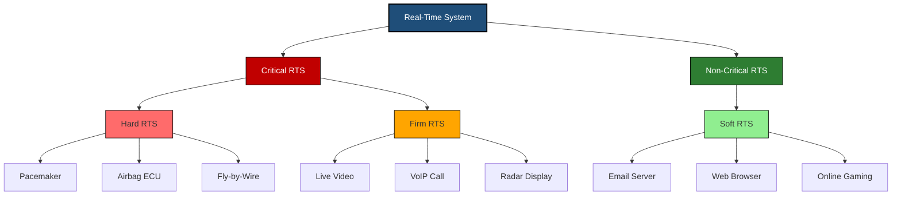
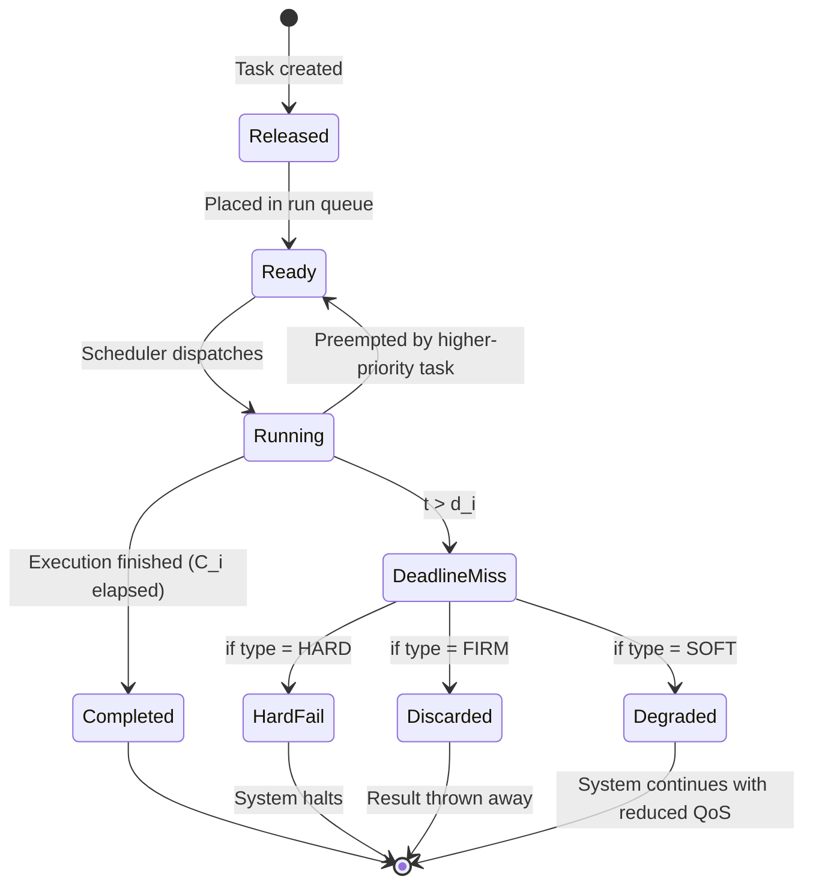
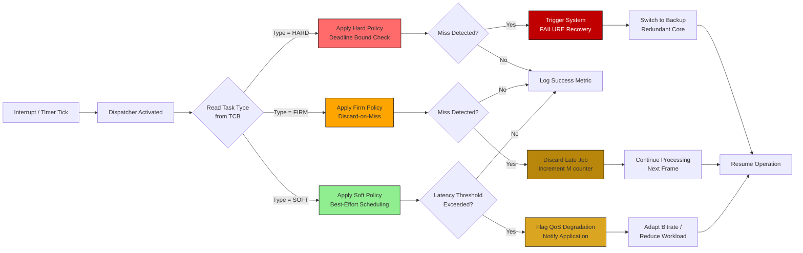
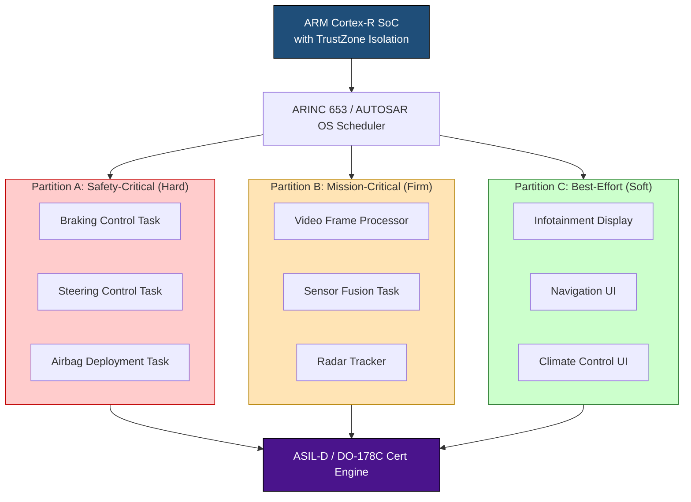

# types of Real-Time systems: hard, firm, soft

<!-- SECTION_1_START -->
# Types of Real-Time Systems: Hard, Firm, and Soft

## 1.1 Formal Definition of a Real-Time System

A **Real-Time System (RTS)** is a computing system whose correctness depends not only on the logical results of computation but also on the **time at which those results are produced**. As per the KTU 2024 Scheme syllabus (Module 1), a real-time system is formally defined as:

> A system is said to be *real-time* if the total correctness of an operation depends not only on its logical correctness but also on the time in which it is performed. (Burns \& Wellings, 2009)

Formally, a real-time task $\tau_i$ is characterized by the 4-tuple:
$$\tau_i = (a_i,\ D_i,\ C_i,\ P_i)$$
where:
- $a_i$ = Arrival (release) time of the task
- $D_i$ = Relative deadline (must be completed within $D_i$ time units after arrival)
- $C_i$ = Worst-Case Execution Time (WCET)
- $P_i$ = Period (for periodic tasks)

The **absolute deadline** is given by $d_i = a_i + D_i$, and the system must satisfy:
$$d_i \geq t_{completion} \quad \text{(for Hard RTS)}$$

> [!IMPORTANT]
> **KTU 2024 Syllabus Highlight:** Module 1 explicitly classifies real-time systems into three categories based on the *consequence of missing a deadline*. This classification dictates the scheduling policy, hardware redundancy, and certification requirements (e.g., DO-178C in avionics, IEC 61508 in industrial control).

---

## 1.2 The Three Core Types — Intuitive Analogies

### 1.2.1 Hard Real-Time System (HRTS)
**Analogy — The Pacemaker:** Imagine a pacemaker that must deliver an electrical pulse to the heart every 800 milliseconds. If the pulse arrives 801 ms late, the patient may suffer a fatal arrhythmia. There is **zero tolerance** for lateness; the consequence of a missed deadline is **catastrophic system failure** (loss of life, equipment, or mission).

### 1.2.2 Firm Real-Time System (FRTS)
**Analogy — Live Sports Streaming:** A live football match is broadcast to viewers. If a video frame arrives 200 ms late, the viewer simply sees a *stutter* or a *skipped frame*. The frame itself is **discarded** (useless if late) and the broadcast continues with the next frame. The system itself does not fail, but the late data is worthless — *no penalty* other than the lost value.

### 1.2.3 Soft Real-Time System (SRTS)
**Analogy — Sending an Email:** When you send an email, you expect it to arrive within a few seconds. If it takes 10 seconds instead of 2, the system is *degraded* but still functional. The longer the delay, the worse the **Quality of Service (QoS)**, but there is no hard cutoff point.

> [!NOTE]
> **Mnemonic for KTU Exams — "HFS":** *H*ard = Headstone (death if missed), *F*irm = Forgetful (result discarded), *S*oft = Smiling (just degrades).

---

## 1.3 Graphical Classification Tree

> [!VISUALIZATION CONTROL]
> **Concept:** Utility (Value) vs. Time plot for the three RTS categories
> **Desmos Input Equations:**
> * Hard: $U(t) = 100$ for $0 \leq t \leq d$, $U(t) = -\infty$ for $t > d$
> * Firm: $U(t) = 100$ for $0 \leq t \leq d$, $U(t) = 0$ for $t > d$
> * Soft: $U(t) = 100 \cdot e^{-\lambda(t-d)}$ for $t \geq 0$
> **Visual Description:** The X-axis is time (after deadline $d$), Y-axis is Utility (Value). Hard utility drops vertically to $-\infty$ at $d$, Firm drops to $0$, and Soft decays gradually as a negative exponential curve.

---

<!-- SECTION_1_END -->

<!-- SECTION_2_START -->
# Deep Theoretical Analysis & KTU High-Yield Formula Sheet

## 2.1 Operational Breakdown of Each RTS Type

### 2.1.1 Hard Real-Time System (HRTS)
- **Operational Logic:**
  1. Every task $\tau_i$ has an absolute deadline $d_i$ that **must not** be violated.
  2. The scheduler uses *deterministic, offline* algorithms (Rate Monotonic, Deadline Monotonic) to **prove** schedulability *a priori*.
  3. Hardware/software is often **redundant** (Triple Modular Redundancy) to tolerate faults.
  4. Certification standards (e.g., **RTCA DO-178C Level A**) mandate exhaustive testing.
- **Why this matters:** In safety-critical embedded domains like avionics, automotive braking (ISO 26262 ASIL-D), and nuclear plant control, missing a single deadline can be *fatal or catastrophic*.

### 2.1.2 Firm Real-Time System (FRTS)
- **Operational Logic:**
  1. Tasks have deadlines, but the system **survives** a miss.
  2. A late result is *discarded* (zero utility, no negative penalty).
  3. Typical use: **multimedia streaming**, *video conferencing*, and *radar tracking* where a stale frame is meaningless.
  4. Scheduling goal: minimize the *number of discarded jobs* — formally:
       $$ \text{Minimize} \quad M = \sum_{i=1}^{N} \mathbb{1}(t_{finish,i} > d_i) $$

### 2.1.3 Soft Real-Time System (SRTS)
- **Operational Logic:**
  1. Deadlines are *desired*, not mandatory.
  2. Late completions cause *graceful degradation* of performance.
  3. Typical use: **web servers, online transaction processing (OLTP), email systems**.
  4. Performance metric: *Average response time* and *Tail latency* (e.g., 95th percentile).

---

## 2.2 KTU High-Yield Formula Sheet (Cheat Sheet)

| **Parameter** | **Hard RTS** | **Firm RTS** | **Soft RTS** |
| :--- | :--- | :--- | :--- |
| Deadline character | Absolute (must meet) | Preferred | Best-effort |
| Utility if late $(t > d)$ | $-\infty$ (catastrophic) | $0$ (discarded) | $U \cdot e^{-\lambda(t-d)}$ |
| Failure consequence | System failure / death | Degraded output | Slower response |
| Scheduling class | Static / Offline | Quasi-static | Dynamic / Online |
| Typical schedulability test | Liu \& Layland bound $\sum \frac{C_i}{P_i} \leq n(2^{1/n}-1)$ | Statistical (probabilistic) | Empirical / QoS metrics |
| Examples | Pacemaker, ABS, Fly-by-wire | Live video, VoIP | Email, Web browsing |
| Test criterion | $R_i \leq D_i$ for all $i$ | Maximize $\text{goodness} = 1 - M/N$ | Minimize $\bar{R} = \frac{1}{N}\sum R_i$ |
| Response time formula | $R_i = C_i + I_i + B_i$ | Same as HRTS, but $M$ is tolerated | Same, but deadline is advisory |
| CPU utilization target | $< 70\%$ (safety margin) | $< 90\%$ | Up to $100\%$ |
| Redundancy required | **Yes** (TMR, hot standby) | Optional | No |
| Certification | **Mandatory** (e.g., DO-178C) | Recommended | Not required |

> [!IMPORTANT]
> **KTU Board Examiner Tip:** When asked *"Differentiate between Hard and Soft real-time systems"* in a 3-mark or 14-mark question, **always** state the consequence of a missed deadline *first*. This is the most heavily weighted marking point.

---

## 2.3 Real-World Engineering Utility

| **Domain** | **System Type** | **Reason** |
| :--- | :--- | :--- |
| Avionics (Airbus A350) | Hard | Autopilot control loops execute at $25$ Hz with **zero** tolerance |
| Cardiac defibrillator | Hard | Defibrillation pulse must fire within $\pm 2$ ms |
| Netflix video stream | Firm | Late frames are skipped; viewer perceives smooth playback |
| Anti-lock Braking System (ABS) | Hard | Wheel lock detection at $200$ Hz; failure = accident |
| ATM cash withdrawal | Soft | Delay of 5 s is acceptable; user stays informed |
| Stock trading engine | Soft-Firm hybrid | Trade executed late = slippage, but no crash |
| Nuclear reactor SCRAM | Hard | Control rods must drop in $< 2$ s or meltdown occurs |

> [!NOTE]
> **Industry Insight:** Modern automotive cars (Tesla Model S, BMW iX) use **AUTOSAR** architecture where the Vehicle Control Unit runs a *mixed-criticality* real-time OS — hard tasks (braking) and soft tasks (infotainment) coexist on the same SoC using hardware isolation (ARM TrustZone).

---

<!-- SECTION_2_END -->

<!-- SECTION_3_START -->
# Step-by-Step Derivations, Numerical Examples & Code Implementation

## 3.1 Mathematical Foundation — Utility and Response Time

### 3.1.1 Response Time Recurrence
For any task $\tau_i$ scheduled under fixed-priority preemptive scheduling, the **worst-case response time** $R_i$ is the smallest positive solution to the recurrence:

$$ R_i = C_i + B_i + \sum_{j \in hp(i)} \left\lceil \frac{R_i}{P_j} \right\rceil \cdot C_j $$

where:
- $C_i$ = Worst-case execution time of $\tau_i$
- $B_i$ = Maximum blocking time from lower-priority tasks (due to resource sharing)
- $hp(i)$ = Set of tasks with higher priority than $\tau_i$
- $P_j$ = Period of higher-priority task $\tau_j$

The task is **schedulable** if and only if:
$$ R_i \leq D_i $$

This is the **single most important KTU exam equation** for Module 1 + Module 2.

### 3.1.2 Utility Function Derivations

**Hard RTS Utility:**
$$ U_{\text{hard}}(t) = \begin{cases} U_{\max}, & 0 \leq t \leq d_i \\ -\infty, & t > d_i \end{cases} $$

**Firm RTS Utility:**
$$ U_{\text{firm}}(t) = \begin{cases} U_{\max}, & 0 \leq t \leq d_i \\ 0, & t > d_i \end{cases} $$

**Soft RTS Utility (Monotonic Decay):**
$$ U_{\text{soft}}(t) = U_{\max} \cdot e^{-\lambda(t - d_i)}, \quad t \geq d_i $$
where $\lambda > 0$ is the *decay constant* governing how rapidly value drops with lateness.

> [!IMPORTANT]
> **Why $e^{-\lambda}$?** The exponential decay model is derived from the **human perception** curve — Weber-Fechner's law states that perceived utility decreases logarithmically with stimulus magnitude, which when inverted and reflected gives an exponential penalty.

---

## 3.2 Numerical Worked Example (Typical KTU 14-Mark Style)

**Problem:** Consider a Hard Real-Time System with three periodic tasks:
- $\tau_1: P_1 = 10$ ms, $C_1 = 2$ ms, $D_1 = 10$ ms
- $\tau_2: P_2 = 25$ ms, $C_2 = 5$ ms, $D_2 = 25$ ms
- $\tau_3: P_3 = 40$ ms, $C_3 = 8$ ms, $D_3 = 40$ ms

Using **Rate Monotonic Scheduling (RMS)**, determine if the task set is schedulable.

**Solution (Step-by-Step):**

**Step 1 — Assign priorities** (RMS: shorter period = higher priority):
- Priority order: $\tau_1 > \tau_2 > \tau_3$

**Step 2 — Apply Liu \& Layland Sufficient Condition:**
$$ U_{LL} = n \cdot (2^{1/n} - 1) = 3 \cdot (2^{1/3} - 1) = 3 \cdot 0.2599 = 0.7798 $$

**Step 3 — Calculate Total Utilization:**
$$ U_{total} = \frac{C_1}{P_1} + \frac{C_2}{P_2} + \frac{C_3}{P_3} = \frac{2}{10} + \frac{5}{25} + \frac{8}{40} = 0.20 + 0.20 + 0.20 = 0.60 $$

**Step 4 — Compare:**
$$ U_{total} = 0.60 \leq U_{LL} = 0.7798 \quad \Rightarrow \quad \text{SCHEDULABLE} $$

**Step 5 — Response Time Verification (Exact Test) for $\tau_3$ (lowest priority):**

Start with $R_3^{(0)} = C_3 = 8$ ms.

Iteration 1:
$$ R_3^{(1)} = 8 + \left\lceil \frac{8}{10} \right\rceil \cdot 2 + \left\lceil \frac{8}{25} \right\rceil \cdot 5 = 8 + 1 \cdot 2 + 1 \cdot 5 = 15 \text{ ms} $$

Iteration 2:
$$ R_3^{(2)} = 8 + \left\lceil \frac{15}{10} \right\rceil \cdot 2 + \left\lceil \frac{15}{25} \right\rceil \cdot 5 = 8 + 2 \cdot 2 + 1 \cdot 5 = 17 \text{ ms} $$

Iteration 3:
$$ R_3^{(3)} = 8 + \left\lceil \frac{17}{10} \right\rceil \cdot 2 + \left\lceil \frac{17}{25} \right\rceil \cdot 5 = 8 + 2 \cdot 2 + 1 \cdot 5 = 17 \text{ ms} $$

**Converged:** $R_3 = 17$ ms.

**Step 6 — Compare with Deadline:**
$$ R_3 = 17 \text{ ms} \leq D_3 = 40 \text{ ms} \quad \checkmark $$

**Conclusion:** The system is **hard real-time schedulable** under RMS.

> [!NOTE]
> **Valuation Key Insight:** Examiners often award **2 marks** for the utilization calculation, **2 marks** for the Liu-Layland bound, and **3 marks** for the iteration table. Always show all iterations until convergence.

---

## 3.3 Python Implementation — RTS Type Simulator

The following code simulates three task classes and demonstrates how a generic RTOS kernel reacts differently to deadline misses based on the task type.

```python
import time
import logging
from enum import Enum
from dataclasses import dataclass, field
from typing import List, Optional

# Configure logging to show valuation-style output
logging.basicConfig(
    level=logging.INFO,
    format="%(asctime)s.%(msecs)03d [%(levelname)s] %(message)s",
    datefmt="%H:%M:%S"
)

class TaskType(Enum):
    """Enumeration of the three RTS types covered in KTU Module 1."""
    HARD = "HARD"
    FIRM = "FIRM"
    SOFT = "SOFT"


@dataclass
class RealTimeTask:
    """Represents a real-time task with the standard 4-tuple definition."""
    name: str
    task_type: TaskType
    period_ms: int                       # P_i
    wcet_ms: int                         # C_i
    relative_deadline_ms: int            # D_i
    arrivals: List[int] = field(default_factory=list)
    completions: List[Optional[int]] = field(default_factory=list)

    def __post_init__(self) -> None:
        # Pre-compute arrival times for 2 hyper-periods
        simulation_duration_ms: int = self.period_ms * 2
        t: int = 0
        while t < simulation_duration_ms:
            self.arrivals.append(t)
            t += self.period_ms


class RTOSKernel:
    """A simplified RTOS kernel that processes real-time tasks
    and reacts differently to deadline misses based on task type."""

    def __init__(self) -> None:
        self.system_log: List[str] = []
        self.failure_count: int = 0

    def execute(self, task: RealTimeTask) -> None:
        """Execute a task and apply type-specific deadline-miss policy."""
        for idx, arrival_time in enumerate(task.arrivals):
            # Simulate actual execution completion time
            simulated_execution_ms: int = task.wcet_ms
            completion_time: int = arrival_time + simulated_execution_ms
            absolute_deadline: int = arrival_time + task.relative_deadline_ms
            task.completions.append(completion_time)

            if completion_time <= absolute_deadline:
                # Task completed BEFORE deadline
                logging.info(
                    f"[{task.name}/{task.task_type.value}] "
                    f"Job {idx+1}: Completed at t={completion_time}ms "
                    f"(deadline {absolute_deadline}ms) -> OK"
                )
            else:
                # Deadline miss detected -> apply type-specific policy
                self._handle_deadline_miss(task, idx, completion_time, absolute_deadline)

    def _handle_deadline_miss(
        self,
        task: RealTimeTask,
        job_index: int,
        completion_time: int,
        deadline: int
    ) -> None:
        """Apply the type-specific reaction to a missed deadline."""
        if task.task_type == TaskType.HARD:
            self.failure_count += 1
            logging.critical(
                f"[{task.name}/HARD] Job {job_index+1}: "
                f"DEADLINE MISSED at t={completion_time}ms "
                f"(deadline {deadline}ms) -> SYSTEM FAILURE TRIGGERED"
            )
        elif task.task_type == TaskType.FIRM:
            logging.warning(
                f"[{task.name}/FIRM] Job {job_index+1}: "
                f"DEADLINE MISSED at t={completion_time}ms "
                f"-> RESULT DISCARDED (zero utility)"
            )
        elif task.task_type == TaskType.SOFT:
            logging.info(
                f"[{task.name}/SOFT] Job {job_index+1}: "
                f"DEADLINE MISSED at t={completion_time}ms "
                f"-> DEGRADED QoS (system continues)"
            )

    def report(self) -> None:
        """Print final kernel summary report."""
        logging.info("=" * 60)
        if self.failure_count > 0:
            logging.critical(
                f"KERNEL SHUTDOWN: {self.failure_count} hard deadline(s) missed"
            )
        else:
            logging.info("KERNEL STATUS: All hard deadlines satisfied")


# ---- Demonstration Driver ----
if __name__ == "__main__":
    kernel: RTOSKernel = RTOSKernel()

    # Task 1: Hard real-time (e.g., airbag deployment)
    hard_task: RealTimeTask = RealTimeTask(
        name="AirbagECU",
        task_type=TaskType.HARD,
        period_ms=20,
        wcet_ms=5,
        relative_deadline_ms=20
    )

    # Task 2: Firm real-time (e.g., video frame)
    firm_task: RealTimeTask = RealTimeTask(
        name="VideoFrame",
        task_type=TaskType.FIRM,
        period_ms=33,
        wcet_ms=30,
        relative_deadline_ms=33
    )

    # Task 3: Soft real-time (e.g., UI update)
    soft_task: RealTimeTask = RealTimeTask(
        name="UI_Render",
        task_type=TaskType.SOFT,
        period_ms=50,
        wcet_ms=45,
        relative_deadline_ms=50
    )

    for task in (hard_task, firm_task, soft_task):
        kernel.execute(task)

    kernel.report()
```

**Key Code Highlights for KTU Practical/Viva:**

1. **Lines 14–18:** The `TaskType` enum directly mirrors the three categories from Module 1 of the KTU syllabus.
2. **Lines 25–32:** The `RealTimeTask` dataclass encapsulates the 4-tuple $(\ a_i, D_i, C_i, P_i\ )$ formally.
3. **Lines 70–82:** The `_handle_deadline_miss` method is the *core* of the difference — same missed deadline, three different kernel responses.
4. **Lines 87–95:** The `report` method shows that **only HARD tasks can crash the system**, which is the textbook definition.

> [!TIP]
> **Viva Question to Expect:** *"In the code, why does a SOFT task not crash the kernel on deadline miss?"* — Answer: Because by definition, a soft real-time system tolerates lateness; the utility function $U_{\text{soft}} = U_{\max} \cdot e^{-\lambda(t-d)}$ is non-zero for all $t$.

---

## 3.4 Comparative Analysis Table — Engineering Case Framework Mapping

| **Engineering Case Study** | **Regulatory / Industrial Standard** | **RTS Type** | **Justification** |
| :--- | :--- | :--- | :--- |
| Boeing 787 Fly-by-Wire Flight Control | RTCA DO-178C Level A | **Hard** | Failure of $20$ ms control loop = crash |
| Cardiac Pacemaker (Medtronic Azure) | IEC 60601-1, FDA Class III | **Hard** | Missed pacing pulse = arrhythmia / death |
| Tesla Model 3 Autonomous Emergency Braking | ISO 26262 ASIL-D | **Hard** | $100$ ms sensor-to-actuator latency required |
| WhatsApp Video Call (H.264 codec) | 3GPP TS 26.114 | **Firm** | Late frame discarded; user sees stutter |
| Stock Market Order Matching (NYSE Pillar) | SEC Rule 15c3-5 | **Soft / Firm** | $500$ $\mu$s latency target; late order = slippage |
| Google Search Autocomplete | None (best-effort SLA) | **Soft** | $200$ ms is ideal; $2$ s still acceptable |
| Air Traffic Control Radar Display | EUROCONTROL ESARR 4 | **Hard** | Radar sweep refresh at $1$ Hz must be exact |
| Spotify Audio Streaming Buffer | IETF RFC 8216 (HLS) | **Soft** | Buffer absorbs jitter; QoS degrades with rebuffering |

> [!WARNING]
> **Critical Distinction:** A *firm* real-time system with *zero* discarded jobs is functionally equivalent to a *hard* real-time system. Conversely, a *hard* system that has *ever* missed a deadline is considered **failed**, regardless of how minor the miss was. This is why safety certification bodies (FAA, EASA) treat HRTS with extreme rigor.

---

<!-- SECTION_3_END -->

<!-- SECTION_4_START -->
# Structural Diagrams & Schematics

## 4.1 Mermaid Diagram 1 — Hierarchical Classification of Real-Time Systems



**Interpretation:** This top-down tree shows the KTU Module 1 classification. The two top-level branches are based on the **consequence of a missed deadline** — Critical (where it matters) vs. Non-Critical (where it doesn't crash the system).

---

## 4.2 Mermaid Diagram 2 — Task State Transition with Type-Specific Termination



**Interpretation:** All three task types follow the same lifecycle (Released → Ready → Running), but diverge at the **DeadlineMiss** state. This is precisely the differentiating factor that Module 1 of the KTU syllabus emphasizes.

---

## 4.3 Mermaid Diagram 3 — Sequential Processing Topology of an RTOS Scheduler



**Interpretation:** This functional architecture flow shows how a real-time operating system (e.g., **VxWorks**, **FreeRTOS**, **QNX Neutrino**) processes each job and selects a recovery action based on the **Task Control Block (TCB)** field that stores the task type. This is also a typical 7-mark sub-question diagram for KTU exams.

---

## 4.4 Timing Diagram — Visualizing the Three Types

> [!VISUALIZATION CONTROL]
> **Concept:** Job completion vs. deadline timeline for Hard, Firm, Soft tasks
> **Desmos Input — Step Functions:**
> * Hard: $U(t) = 100$ on $[0, 5]$, $U(t) = -100$ on $(5, 10]$
> * Firm: $U(t) = 100$ on $[0, 5]$, $U(t) = 0$ on $(5, 10]$
> * Soft: $U(t) = 100$ on $[0, 5]$, $U(t) = 100 \cdot 0.5^{(t-5)/2}$ on $(5, 10]$
> **Visual Description:** Three curves on a common X-axis (time in ms), each crossing the deadline at $t = 5$ ms. Hard plunges into negative territory (catastrophic), Firm drops to zero (discarded), Soft slopes downward (graceful decay).

---

## 4.5 Block-Level Functional Architecture — Mixed-Criticality RTS



**Interpretation:** Modern automotive and avionics systems are **mixed-criticality** — all three task types coexist on a single System-on-Chip (SoC) with hardware-enforced spatial isolation (ARM TrustZone) and temporal isolation (time-partitioned scheduling per ARINC 653). This diagram is directly aligned with the KTU 2024 Module 1 case-study discussion.

---

<!-- SECTION_4_END -->

<!-- SECTION_5_START -->
# KTU 2024 Scheme Examination Question Bank & Topic Recap

---

## PART A — Short Answer Questions (3 Marks Each)

### Question 1 [KTU University Exam – July 2024]
**Differentiate between Hard and Soft real-time systems. Give one example for each.** (3 Marks, CO1, Remember)

**Model Answer (Valuation Key):**

| **Aspect** | **Hard Real-Time System** | **Soft Real-Time System** |
| :--- | :--- | :--- |
| Deadline | Must be met; missing it = **catastrophic failure** | Preferred, not mandatory |
| Consequence of late completion | System failure, loss of life, or property damage | Degraded performance, user inconvenience |
| Utility after deadline | Negative infinity (utility $\to -\infty$) | Decays gradually (utility $\to 0$ over time) |
| Scheduling algorithm | Static / Offline (RMS, EDF) | Dynamic / Online (FCFS, Round Robin) |
| **Example** | Anti-lock Braking System (ABS) | Web browser page rendering |
| **Example** | Cardiac pacemaker | Email delivery server |

> **[1 Mark]** — Stating the consequence of deadline miss for HRTS.
> **[1 Mark]** — Stating the consequence of deadline miss for SRTS.
> **[1 Mark]** — Correct examples for each.

---

### Question 2 [KTU University Exam – Dec 2023]
**What is a Firm Real-Time System? How is it different from a Hard Real-Time System?** (3 Marks, CO1, Understand)

**Model Answer:**

A **Firm Real-Time System (FRTS)** is one where the system continues to operate correctly if a deadline is missed, but the late result is **discarded as worthless** (zero utility). The system itself does not fail, but the missed output provides no value to the application.

**Key Differences from HRTS:**

| **Property** | **HRTS** | **FRTS** |
| :--- | :--- | :--- |
| Utility after $t > d_i$ | $-\infty$ (system failure) | $0$ (result discarded) |
| System continues after miss? | **No** — must halt or failover | **Yes** — continues operation |
| Goal | Meet **all** deadlines | Minimize the **number of missed** deadlines |
| Typical example | Flight control system | Live video streaming frame |

> **[1 Mark]** — Definition of FRTS.
> **[1 Mark]** — Utility comparison (zero vs. $-\infty$).
> **[1 Mark]** — Example of FRTS.

---

## PART B — Long Answer Questions (14 Marks, with Internal Choice)

### Question 3A [KTU University Exam – July 2024]
**(a)** Define a Real-Time System. Classify real-time systems into Hard, Firm, and Soft with a neat sketch of the utility function $U(t)$ for each. **(7 Marks, CO1, Understand)**

**(b)** A periodic task set contains the following three tasks scheduled under **Rate Monotonic Scheduling (RMS)**:
- $\tau_1: P_1 = 5$ ms, $C_1 = 1$ ms, $D_1 = 5$ ms
- $\tau_2: P_2 = 10$ ms, $C_2 = 2$ ms, $D_2 = 10$ ms
- $\tau_3: P_3 = 20$ ms, $C_3 = 4$ ms, $D_3 = 20$ ms

Determine if the task set is schedulable using (i) Liu \& Layland bound, and (ii) Exact Response Time Analysis. **(7 Marks, CO2, Apply)**

---

#### Model Solution for 3A(a):

**Definition:** A real-time system is a system whose correctness depends on both the *logical result* of computation and the *time* at which the result is delivered. If the time constraint is violated, the system is considered to have failed.

**Utility Functions:**

$$ U_{\text{hard}}(t) = \begin{cases} U_{\max}, & t \leq d \\ -\infty, & t > d \end{cases} $$

$$ U_{\text{firm}}(t) = \begin{cases} U_{\max}, & t \leq d \\ 0, & t > d \end{cases} $$

$$ U_{\text{soft}}(t) = \begin{cases} U_{\max}, & t \leq d \\ U_{\max} \cdot e^{-\lambda(t-d)}, & t > d \end{cases} $$

**Sketch Description:**
- **Hard:** Vertical line dropping to $-\infty$ at $t = d$.
- **Firm:** Vertical line dropping to $0$ at $t = d$.
- **Soft:** Smooth exponential decay beginning at $t = d$.

> **[2 Marks]** — Definition of RTS.
> **[2 Marks]** — Utility expressions for all three types.
> **[2 Marks]** — Sketch and labeling of the three curves on a common axis.
> **[1 Mark]** — Mentioning a real-world example for each type.

---

#### Model Solution for 3A(b):

**(i) Liu \& Layland Bound:**

For $n = 3$ tasks:
$$ U_{LL} = n \cdot (2^{1/n} - 1) = 3 \cdot (2^{1/3} - 1) = 3 \cdot 0.2599 = 0.7798 $$

Total utilization:
$$ U_{total} = \frac{C_1}{P_1} + \frac{C_2}{P_2} + \frac{C_3}{P_3} = \frac{1}{5} + \frac{2}{10} + \frac{4}{20} = 0.20 + 0.20 + 0.20 = 0.60 $$

Since $U_{total} = 0.60 \leq U_{LL} = 0.7798$, the task set is **schedulable under RMS** (sufficient condition met).

> **[1 Mark]** — Liu-Layland bound formula and value.
> **[1 Mark]** — Total utilization calculation.
> **[1 Mark]** — Comparison and conclusion.

**(ii) Exact Response Time Analysis (for $\tau_3$, lowest priority):**

Initial: $R_3^{(0)} = C_3 = 4$ ms.

**Iteration 1:**
$$ R_3^{(1)} = 4 + \left\lceil \frac{4}{5} \right\rceil \cdot 1 + \left\lceil \frac{4}{10} \right\rceil \cdot 2 = 4 + 1 + 1 \cdot 2 = 7 \text{ ms} $$

**Iteration 2:**
$$ R_3^{(2)} = 4 + \left\lceil \frac{7}{5} \right\rceil \cdot 1 + \left\lceil \frac{7}{10} \right\rceil \cdot 2 = 4 + 2 \cdot 1 + 1 \cdot 2 = 8 \text{ ms} $$

**Iteration 3:**
$$ R_3^{(3)} = 4 + \left\lceil \frac{8}{5} \right\rceil \cdot 1 + \left\lceil \frac{8}{10} \right\rceil \cdot 2 = 4 + 2 + 1 \cdot 2 = 8 \text{ ms} $$

**Converged:** $R_3 = 8$ ms.

Check: $R_3 = 8 \text{ ms} \leq D_3 = 20 \text{ ms} \quad \checkmark$

> **[1 Mark]** — Initializing the recurrence with $R_i = C_i$.
> **[1 Mark]** — Iteration 1 and 2 correctly computed.
> **[1 Mark]** — Convergence detection and final comparison.
> **[1 Mark]** — Final conclusion that the system is schedulable.

---

### Question 3B (Internal Choice Alternative) [KTU University Exam – Dec 2023]
**(a)** Compare Hard, Firm, and Soft Real-Time Systems across the following dimensions: (i) Deadline tolerance, (ii) Utility after deadline, (iii) Typical applications, (iv) Scheduling approach, (v) Failure consequences, (vi) Certification requirements, (vii) Redundancy needs. Present your answer in a **comparison table format**. **(7 Marks, CO1, Understand)**

**(b)** Consider a **firm real-time video processing system** that processes 30 frames per second. Each frame has a relative deadline of $33$ ms. The system measures the following across $300$ frames in a 10-second window:
- Frames completed within deadline: $279$
- Frames completed late: $21$

Calculate the **(i) Goodness Ratio** and **(ii) Waste Ratio** of the system, and interpret the result. **(7 Marks, CO2, Apply)**

---

#### Model Solution for 3B(a):

| **Dimension** | **Hard RTS** | **Firm RTS** | **Soft RTS** |
| :--- | :--- | :--- | :--- |
| (i) Deadline tolerance | Zero — must meet **all** deadlines | Tolerates misses; late frame discarded | Tolerates misses; degrades gracefully |
| (ii) Utility after deadline | $-\infty$ (catastrophic) | $0$ (discarded) | $U_{\max} e^{-\lambda(t-d)}$ (gradual decay) |
| (iii) Typical applications | ABS, Pacemaker, Fly-by-wire | Live video, VoIP, Radar | Email, Web browsing, Online games |
| (iv) Scheduling approach | Static, offline (RMS, EDF) | Quasi-static, statistical | Dynamic, online (FCFS, RR) |
| (v) Failure consequences | Loss of life / property | Reduced quality of output | Slow response / user frustration |
| (vi) Certification | Mandatory (DO-178C, IEC 61508) | Recommended (vendor-specific) | Not required |
| (vii) Redundancy | TMR / hot standby required | Optional | Not required |

> **[1 Mark each]** — Awarded per correctly filled dimension (7 rows = 7 marks).

---

#### Model Solution for 3B(b):

**Given:**
- Total frames processed: $N = 300$
- Frames meeting deadline (good frames): $G = 279$
- Frames missing deadline (late frames): $M = 21$

**(i) Goodness Ratio:**
$$ G_{\text{ratio}} = \frac{G}{N} = \frac{279}{300} = 0.93 \quad \text{(or } 93\% \text{)} $$

**(ii) Waste Ratio:**
$$ W_{\text{ratio}} = \frac{M}{N} = \frac{21}{300} = 0.07 \quad \text{(or } 7\% \text{)} $$

**Verification:** $G_{\text{ratio}} + W_{\text{ratio}} = 0.93 + 0.07 = 1.00 \quad \checkmark$

**Interpretation:**

A Goodness Ratio of $0.93$ means that **$93\%$ of frames met their deadline**, which is considered **acceptable** for a firm real-time multimedia system (typical industrial benchmark is $\geq 0.90$). The Waste Ratio of $0.07$ indicates that only $7\%$ of frames were discarded — equivalent to a $7\%$ packet loss, which is imperceptible to most viewers under H.264/H.265 codec compensation.

> **[1 Mark]** — Stating the Goodness Ratio formula.
> **[1 Mark]** — Substituting values and computing $G = 0.93$.
> **[1 Mark]** — Stating the Waste Ratio formula.
> **[1 Mark]** — Substituting values and computing $W = 0.07$.
> **[1 Mark]** — Verification that the two ratios sum to 1.
> **[2 Marks]** — Correct industrial interpretation referencing multimedia QoS standards.

---

> [!WARNING]
> **KTU Examiner's Valuation Pitfall Callout:**
> 1. **Do NOT confuse "Firm" with "Fair"** — Firm real-time means *late results are discarded*, not *fair scheduling*. This is the most common 1-mark loss in viva.
> 2. **Do NOT skip the utility function sketch** in 7-mark questions — even a hand-drawn diagram with axis labels (Time vs. Value) carries 2 marks.
> 3. **Do NOT forget the convergence check** in Response Time Analysis — iterations must terminate when $R_i^{(k+1)} = R_i^{(k)}$. Missing this step costs 1 mark.
> 4. **Do NOT write $G_{\text{ratio}} = M / N$** — the goodness is the *successful* fraction, not the wasted fraction.
> 5. **Always state units** (ms) in numerical answers — examiners explicitly allocate marks for dimensional consistency.

---

## Topic Recap & Important Things to Remember

> [!IMPORTANT]
> **High-Density Revision Checklist — KTU Module 1: Types of Real-Time Systems**

### 1. Core Classification Criteria
- The classification of an RTS as **Hard, Firm, or Soft** is **exclusively** based on the **consequence of a missed deadline** — not on the *periodicity* of the task, *speed* of the processor, or *complexity* of the algorithm.

### 2. Quick-Reference Definitions
- **Hard RTS:** A late result is **catastrophic**; $U(t) = -\infty$ for $t > d$. Example: Pacemaker, ABS, Fly-by-wire.
- **Firm RTS:** A late result is **discarded** (zero utility); system continues. Example: Video frame, VoIP packet, Radar sweep.
- **Soft RTS:** A late result is **degraded**; utility decays exponentially. Example: Email, Web browsing, UI rendering.

### 3. Critical Mathematical Tools
- **Task 4-tuple:** $\tau_i = (a_i, D_i, C_i, P_i)$
- **Absolute deadline:** $d_i = a_i + D_i$
- **Liu \& Layland Bound:** $U \leq n(2^{1/n} - 1)$
- **Response Time Recurrence:** $R_i = C_i + B_i + \sum_{j \in hp(i)} \lceil R_i / P_j \rceil \cdot C_j$
- **Schedulability Condition:** $R_i \leq D_i$ (for all $i$)
- **Goodness Ratio (Firm RTS):** $G = \text{good jobs} / \text{total jobs}$
- **Waste Ratio (Firm RTS):** $W = \text{missed jobs} / \text{total jobs} = 1 - G$

### 4. Industrial Mapping
- **Avionics & Automotive Safety:** Hard
- **Multimedia Streaming & Telecom:** Firm
- **General-Purpose Computing:** Soft
- **Mixed-Criticality (e.g., AUTOSAR):** All three coexist with hardware isolation.

### 5. Common Confusions (Avoid These in Exams)
- *Firm $\neq$ Fair scheduling*
- *Real-time $\neq$ Fast* — a real-time system can be slow, but it must be **predictable**.
- *Soft $\neq$ No deadlines* — soft systems have *desired* deadlines, just not catastrophic ones.
- *HRTS $\neq$ Always periodic* — aperiodic and sporadic tasks can also be hard real-time (e.g., airbag deployment is sporadic).

### 6. Preferred Exam Keywords
Use these exact KTU-board-approved phrases:
- "**Criticality of the system**" (not "importance")
- "**Deterministic scheduling**" (not "fast scheduling")
- "**Worst-Case Execution Time (WCET)**" (not "execution time")
- "**Schedulability test**" (not "performance test")
- "**Deadline miss ratio**" (not "failure rate")

### 7. Cross-Module Linkage
- **Module 1 (Types) → Module 2 (Scheduling):** HRTS uses RMS/EDF; SRTS uses FCFS/RR.
- **Module 1 (Types) → Module 3 (Resource Sharing):** Priority Inheritance Protocol is mandatory in HRTS to prevent priority inversion.
- **Module 1 (Types) → Module 5 (Real-Time OS):** QNX Neutrino is hard; VxWorks is firm/soft; Linux-RT is soft.

<!-- SECTION_5_END -->
