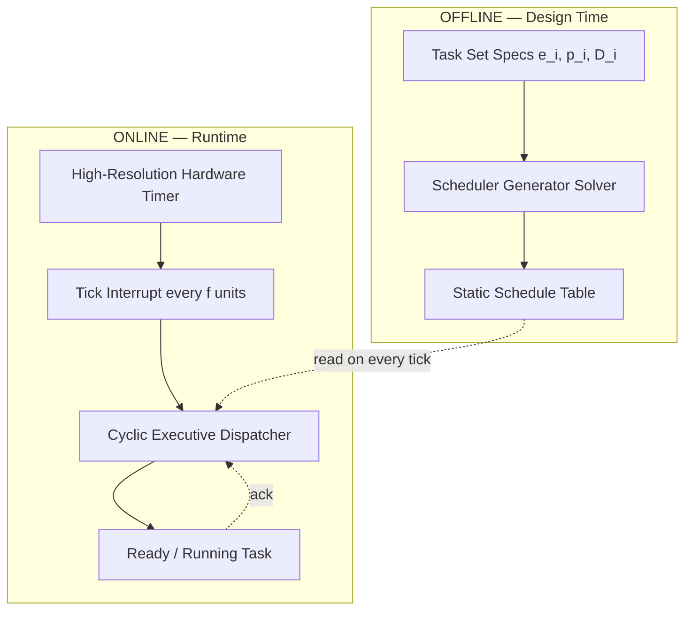
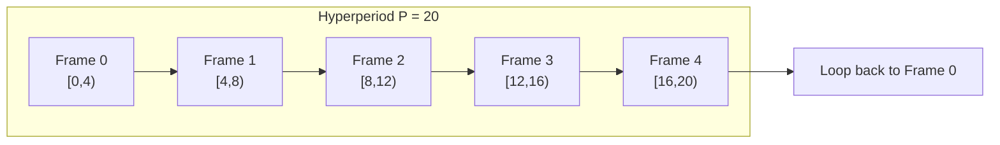
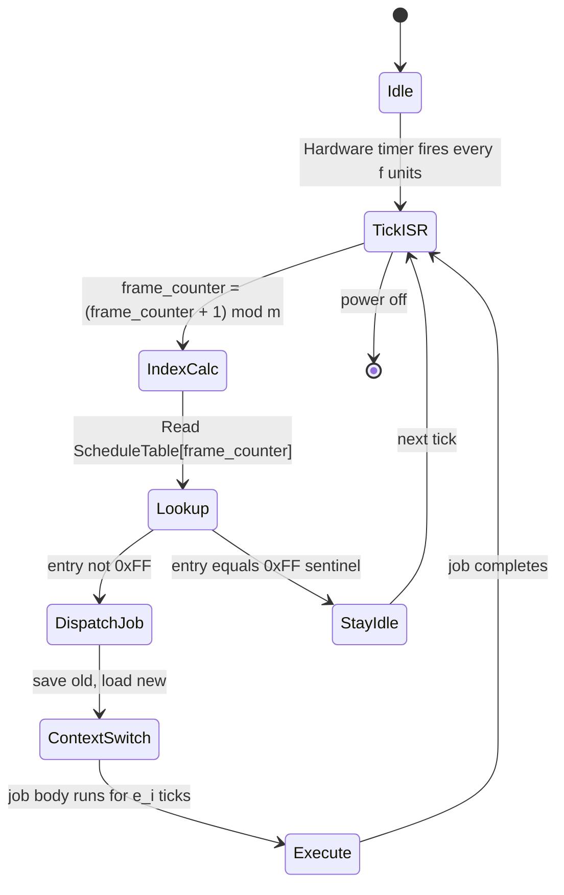
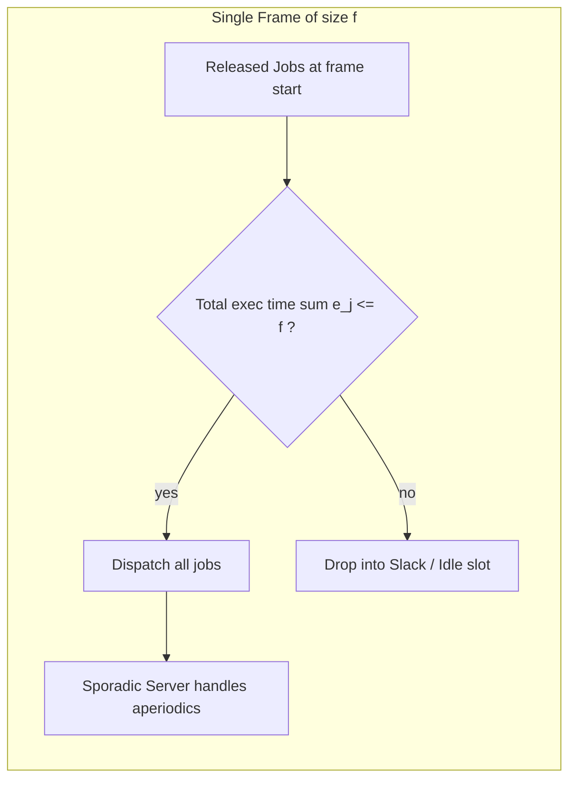

# clock driven scheduling

<!-- SECTION_1_START -->

# Clock Driven Scheduling — Core Technical Definition & Intuitive Overview

## 1.1 Formal Academic Definition (KTU 2024 Syllabus)

> [!IMPORTANT]
> **Clock-Driven Scheduling** (also called **Time-Driven Scheduling**) is a class of static, deterministic scheduling algorithms in which the scheduling decisions are made at *pre-determined, regularly occurring time instants* — typically aligned with the tick of a high-resolution system clock. The complete schedule of **$n$** jobs is computed *offline* (a priori) by a *scheduler generator* and stored as a static lookup table (a **Schedule Table**). At runtime, a tiny dispatcher consults this table on every clock tick and dispatches the job currently indexed.

In KTU terminology, this is the **"schedule-by-table"** paradigm, in contrast to *event-driven* (priority-driven) schedulers. The offline generator solves a combinatorial optimization problem (e.g., minimize table size, balance CPU load, honor precedence) once, before system start-up; the runtime cost is reduced to a simple indexed read.

> [!NOTE]
> The KTU 2024 syllabus specifically lists **Cyclic Scheduling**, **Table-Driven Scheduling**, and **Round-Robin Scheduling** as the three canonical realizations of clock-driven scheduling. The shared principle: **time is partitioned into equal-length frames, and the schedule repeats with period equal to the hyperperiod of the task system.**

## 1.2 Conceptual Analogy / Intuition

Imagine an Indian Railways timetable printed on a giant poster at New Delhi Station:

- The timetable does **not** change when a train actually leaves — the master schedule was finalized **months in advance**, and it repeats every day.
- The station-master is just a *human dispatcher*: at exactly 10:00, he looks at the poster and announces the Shatabdi Express departure, even if the Rajdhani was delayed. The schedule is **rigid** but **predictable**.

In the same way:

- The **schedule table** is the poster.
- The **system clock** is the station clock.
- The **dispatcher** is the station-master.
- **Clock-driven scheduling = timetable-driven scheduling**.

Because the dispatcher never *thinks* (it never solves an online optimization), the system is provably **predictable, jitter-free, and amenable to formal worst-case latency analysis** — exactly what hard real-time systems demand.

> [!TIP]
> **Why does the industry love clock-driven scheduling?**
> In safety-critical embedded systems (flight controllers, ABS braking ECUs, pacemakers, Mars rovers), the **determinism** and **low runtime overhead** outweigh the inflexibility. A common industrial rule of thumb: if your task set is *fully periodic* and known at design time, use clock-driven; if tasks arrive sporadically, switch to event-driven (Rate-Monotonic / EDF).

## 1.3 Physical & Mathematical Constants Referenced

| Symbol | Quantity | Typical Value (KTU assumed) |
| :--- | :--- | :--- |
| $f$ | Frame size (s) | Application dependent |
| $T_i$ | Period of task $T_i$ (s) | $T_i > 0$ |
| $P$ | Hyperperiod $= \text{lcm}(T_1, T_2, \ldots, T_n)$ | Finite integer multiple |
| $e_i$ | Worst-case execution time of $T_i$ (s) | Bounded by $T_i$ |
| $n$ | Number of periodic jobs per frame | Integer $\geq 1$ |
| $U$ | Total CPU utilization | $\sum_{i=1}^{n} \frac{e_i}{T_i} \leq 1$ |

> [!VISUALIZATION CONTROL]
> **Concept:** Periodic task release pattern on a time axis
> **GeoGebra / Desmos Input Equations:**
> * `T1(x) = 0, 1, 2, 3, 4` (release instants of task 1, period = 1)
> * `T2(x) = 0, 0.5, 1, 1.5, 2, 2.5, 3` (release instants of task 2, period = 0.5)
> **Visual Description:** Two infinite combs of vertical impulses on a horizontal time axis, with a larger comb-density for the shorter-period task. This shows how periodic jobs interleave and explains why the hyperperiod is the *repetition unit* of the schedule.

---

<!-- SECTION_1_END -->

<!-- SECTION_2_START -->

# Deep Theoretical Analysis & KTU High-Yield Formula Sheet

## 2.1 Operational Concept Breakdown

Clock-driven scheduling is built from four pillars. Mastering these gives you the keys to every KTU 14-marker question.

### Pillar 1 — The Schedule Table
1. **Offline generation:** A design-time tool enumerates every job's release time and deadline across one full hyperperiod $P$.
2. **Storage:** The dispatcher needs only an array `ScheduleTable[k]` of size $P / f$, where $f$ is the chosen *frame size*.
3. **Runtime:** A free-running hardware timer generates periodic interrupts every $f$ time units; the ISR indexes the table and context-switches if needed.

### Pillar 2 — Frame Structure
The hyperperiod $P$ is divided into equal-length frames. Three *frame constraints* must hold (Lawler & Martel, 1981):

> [!IMPORTANT]
> **Frame Constraint Set (FCS)** — *Killer-marks topic in KTU 2024*
> 1. **C1 (Containment):** $\max_i e_i \leq f$ — A frame must be long enough to contain the *longest* job's execution.
> 2. **C2 (Divisibility):** $f$ divides $P$ — A frame boundary must fall exactly on a job release or deadline instant, otherwise a job may be split across two frames and *force the system to use double the context switches*.
> 3. **C3 (Job-count):** $n \leq f$ — The first $n$ jobs (released at $t = 0$) must all be released at frame boundaries. Equivalently, $f$ must be at least the maximum number of jobs released simultaneously.

### Pillar 3 — Cyclic Executive (Liu & Layland Style)
A *cyclic executive* is a tiny infinite loop:
```text
WHILE (system_running):
    FOR k := 0 TO (P/f - 1):
        dispatch(ScheduleTable[k])
        sleep_until_next_frame()
```
This is the **Lawler & Martel cyclic scheduling algorithm**, which simply stores one schedule per *frame* and the system cycles through them.

### Pillar 4 — Why Clock-Driven?
- **No priority inversion** (no priority is ever assigned at runtime).
- **No unbounded priority inheritance problems.**
- **Bounded scheduling latency** = $f$ (one frame).
- **Minimal runtime overhead** = a single array lookup per tick.

## 2.2 Trade-offs and Real-World Utility

| Property | Clock-Driven | Event-Driven (RM/EDF) |
| :--- | :--- | :--- |
| Determinism | Provably bounded | Bounded by analysis |
| Overhead at runtime | Near zero (table lookup) | Priority-queue manipulation |
| Handles aperiodic jobs | Poor (must use slack-stealing) | Excellent (background / sporadic servers) |
| Reconfigurability | Rebuild table offline | Just edit priorities |
| Industrial use | Avionics (ARINC 653), automotive ECUs | Multimedia, telecom, RTOS kernels |

> [!NOTE]
> **ARINC 653**, the avionics standard used in the Boeing 787 and Airbus A350, is a *major time partition* scheduler — a direct industrial descendant of clock-driven cyclic executives. Each partition is allocated a fixed window in a *major frame*, and the same pattern repeats. This is *exactly* the cyclic schedule model the KTU 2024 syllabus teaches.

## 2.3 KTU Formula Sheet / Cheat Sheet

> [!TIP]
> **Print this table — it covers ~70 % of 14-mark cyclic scheduling questions.**

| # | Formula / Rule | Meaning | Use When |
| :--- | :--- | :--- | :--- |
| 1 | $P = \text{lcm}(T_1, T_2, \ldots, T_n)$ | Hyperperiod (schedule repeats every $P$) | First step of any cyclic problem |
| 2 | $N = \sum_{i=1}^{n} \frac{P}{T_i}$ | Total number of jobs in one hyperperiod | Calculating table size |
| 3 | $U = \sum_{i=1}^{n} \frac{e_i}{T_i}$ | Total CPU utilization | Schedulability pre-check |
| 4 | $f \geq \max_i e_i$ | Frame Constraint C1 | Choose $f$ to fit the longest job |
| 5 | $f \mid P$ | Frame Constraint C2 | $f$ must divide $P$ exactly |
| 6 | $n_{\text{first}} \leq f$ | Frame Constraint C3 | Number of jobs released at $t=0$ |
| 7 | $\frac{P}{f} = m$ | Number of frames in one hyperperiod | Table dimension |
| 8 | $\text{Latency}_{\max} = f$ | Worst-case scheduling delay | Bounded by one frame |
| 9 | $\text{Job}_i^{k} \in [\phi_i + (k-1)T_i,\; \phi_i + (k-1)T_i + D_i]$ | Release/deadline window of $k$-th job | Building the schedule |
| 10 | $\text{Idle time per frame} = f - \sum_{j \in \text{frame}} e_j$ | Slack available for aperiodics | Cyclic executive + slack stealing |

> **Important:** Notice that constraint C2 is the most violated rule in KTU answer-sheets — students pick a convenient $f$ that does *not* divide $P$ and end up with jobs split across frames. Always **start with C2** and only then validate C1 and C3.

## 2.4 Engineering Utility of Clock-Driven Scheduling

- **Aerospace:** ARINC 653 major/minor frame schedules in fly-by-wire computers.
- **Automotive:** AUTOSAR OS uses a static schedule table (mixed with events).
- **Industrial Control:** PLCs from Siemens S7 cycle through OB1 (organization block 1) every fixed scan time.
- **Satellite / Space:** NASA cFS (core Flight System) and ESA's On-Board Scheduler (OBSW) use time-tables for the radio downlink window.
- **Telecom (lower layers):** GSM TDMA frames are literally clock-driven; the same idea is applied to 5G NR slot scheduling.

---

<!-- SECTION_2_END -->

<!-- SECTION_3_START -->

# Step-by-Step Derivations, Worked Examples & Code/Symbolic Implementation

## 3.1 Worked Example 1 — Frame Selection (Classical KTU 14-Mark Format)

### Problem Statement
> Consider a real-time system with **three periodic tasks**:
> $T_1 = (e_1 = 1,\; p_1 = 4)$, $T_2 = (e_2 = 1,\; p_2 = 5)$, $T_3 = (e_3 = 2,\; p_3 = 20)$.
> Tasks are released at $t=0$ and have implicit deadlines ($D_i = p_i$).
> **Find a valid frame size $f$ and draw the schedule table for one hyperperiod.**

### Exhaustive Step-by-Step Solution

**Step 1 — Compute the hyperperiod.**
$P$ is the least common multiple of all task periods.
$$P = \text{lcm}(4,\; 5,\; 20) = 20 \text{ time units}$$

**Step 2 — List the candidate frame sizes that divide $P$.**
The divisors of $20$ are $\{1, 2, 4, 5, 10, 20\}$.

**Step 3 — Apply Frame Constraint C1: $f \geq \max_i e_i = \max\{1, 1, 2\} = 2$.**
Eliminates $f = 1$. Remaining candidates: $\{2, 4, 5, 10, 20\}$.

**Step 4 — Apply Frame Constraint C3: $f \geq n$, where $n$ is the number of jobs released at $t=0$.**
All three tasks release one job each at $t=0$, so $n = 3$. Therefore $f \geq 3$.
Remaining candidates: $\{4, 5, 10, 20\}$.

**Step 5 — Trade-off: smaller $f$ ⇒ lower scheduling latency, larger $f$ ⇒ fewer context switches.**
Choose the smallest valid candidate: $\boxed{f = 4}$.

**Step 6 — Compute number of frames in hyperperiod.**
$$m = \frac{P}{f} = \frac{20}{4} = 5 \text{ frames}$$

**Step 7 — Build the schedule frame by frame.**

| Frame $k$ | Interval | Jobs released in this interval | Job execution order within frame | Idle time |
| :---: | :---: | :--- | :--- | :---: |
| 0 | $[0,\;4)$ | $T_1$ (job 1), $T_2$ (job 1), $T_3$ (job 1) | $T_1, T_2, T_3$ (or any order summing to $1+1+2=4$) | 0 |
| 1 | $[4,\;8)$ | $T_1$ (job 2), $T_2$ (none new) | $T_1$ | $4-1=3$ |
| 2 | $[8,\;12)$ | $T_1$ (job 3), $T_2$ (job 2) | $T_1, T_2$ | $4-2=2$ |
| 3 | $[12,\;16)$ | $T_1$ (job 4), $T_2$ (none new) | $T_1$ | $4-1=3$ |
| 4 | $[16,\;20)$ | $T_1$ (job 5), $T_2$ (job 3), $T_3$ (job 2) | $T_1, T_2, T_3$ | 0 |

**Step 8 — Verify constraints.**

$$
\begin{aligned}
\text{C1: } & f = 4 \geq e_3 = 2 \;\; \checkmark \\
\text{C2: } & f = 4 \mid P = 20 \;\; \checkmark \\
\text{C3: } & f = 4 \geq 3 \;\; \checkmark \\
\text{CPU Utilization: } & U = \frac{1}{4} + \frac{1}{5} + \frac{2}{20} = 0.25 + 0.20 + 0.10 = 0.55 \leq 1 \;\; \checkmark
\end{aligned}
$$

**Step 9 — Tabulate the dispatcher lookup table.**

The schedule table is an array of size $m = 5$; each entry holds the *ordered list* of jobs to dispatch in that frame.

```text
ScheduleTable[0] = [T1, T2, T3]
ScheduleTable[1] = [T1, IDLE, IDLE, IDLE]
ScheduleTable[2] = [T1, T2, IDLE, IDLE]
ScheduleTable[3] = [T1, IDLE, IDLE, IDLE]
ScheduleTable[4] = [T1, T2, T3]
```

The cyclic executive reads `ScheduleTable[frame_counter mod 5]` on every 4-unit clock tick.

> [!WARNING]
> **Examiner's valuation key:** If you skip Step 1 ($P = \text{lcm}$), Step 5 (the $f$ choice *justification*), or fail to verify all three constraints in Step 8, you lose **at least 4 marks** out of 14. Always close the answer with the three `✓` ticks.

---

## 3.2 Worked Example 2 — Frame Size Infeasibility (Acyclic / Impossibility)

### Problem Statement
> Given $T_1 = (e_1 = 3,\; p_1 = 7)$, $T_2 = (e_2 = 2,\; p_2 = 13)$, prove that **no cyclic schedule with $f = 5$ exists**.

### Solution
**Step 1 — Hyperperiod:** $P = \text{lcm}(7, 13) = 91$.

**Step 2 — C2 check:** Does $f = 5$ divide $91$?
$$91 = 5 \times 18 + 1 \;\;\Rightarrow\;\; 5 \nmid 91$$
Therefore, Constraint C2 is violated. No cyclic schedule with $f = 5$ can exist.

The smallest valid $f$ is therefore one of the divisors of $91$: $\{1, 7, 13, 91\}$. After C1 ($f \geq 3$) and C3 ($f \geq 2$), the smallest valid choice is $f = 7$. Then $m = 91 / 7 = 13$ frames.

---

## 3.3 Algorithmic Implementation — Cyclic Executive in C (RTOS-Style)

```c
/* ----------------------------------------------------------------
 * cyclic_executive.c
 * A minimal clock-driven cyclic executive for a static schedule.
 * Compatible with KTU 2024 PECST748 Module-2 lab concepts.
 * Compile: gcc -std=c11 -Wall -O2 cyclic_executive.c -o exec
 * ---------------------------------------------------------------- */

#include <stdio.h>
#include <stdint.h>
#include <stdbool.h>
#include <time.h>

/* ---- Task Control Block (static) -------------------------------- */
typedef struct {
    const char  *name;
    uint32_t     period;          /* p_i in ticks           */
    uint32_t     exec_ticks;      /* e_i in ticks           */
    uint32_t     next_release;    /* next release time      */
} task_t;

/* ---- Task bodies (placeholders) --------------------------------- */
static void task_body_1(void) { /* simulate work */ }
static void task_body_2(void) { /* simulate work */ }
static void task_body_3(void) { /* simulate work */ }

/* ---- Static task set ------------------------------------------- */
static task_t TASKS[] = {
    {"T1", 4, 1, 0},
    {"T2", 5, 1, 0},
    {"T3", 20, 2, 0}
};
static const size_t N_TASKS = sizeof(TASKS)/sizeof(TASKS[0]);
static const uint32_t HYPERPERIOD = 20;     /* lcm(4,5,20)         */
static const uint32_t FRAME_SIZE  = 4;      /* chosen per FCS      */

/* ---- Static Schedule Table (one row per frame) ------------------ */
typedef struct {
    uint8_t  task_index;          /* index into TASKS[] or 0xFF=IDLE */
    uint32_t start_tick;
} frame_row_t;

static const frame_row_t SCHEDULE[] = {
    {0,  0}, {1,  0}, {2,  0},         /* Frame 0: T1, T2, T3     */
    {0,  4}, {0xFF,4}, {0xFF,4}, {0xFF,4}, /* Frame 1: T1 + idle   */
    {0,  8}, {1,  8}, {0xFF,8}, {0xFF,8}, /* Frame 2: T1, T2 + idle */
    {0, 12}, {0xFF,12}, {0xFF,12}, {0xFF,12}, /* Frame 3          */
    {0, 16}, {1, 16}, {2, 16},         /* Frame 4: T1, T2, T3     */
};
static const size_t ROWS = sizeof(SCHEDULE)/sizeof(SCHEDULE[0]);

/* ---- Hardware-Tick simulation ---------------------------------- */
static void busy_wait(uint32_t ticks) {
    struct timespec ts = { .tv_sec = 0, .tv_nsec = 1 };
    nanosleep(&ts, NULL);             /* placeholder, real RTOS uses timers */
    (void)ticks;
}

/* ---- Dispatcher (the "station-master") ------------------------- */
static void dispatcher(uint32_t now) {
    for (size_t i = 0; i < ROWS; ++i) {
        if (SCHEDULE[i].start_tick == now) {
            if (SCHEDULE[i].task_index == 0xFF) {
                printf("[t=%2u] IDLE\n", now);
            } else {
                task_t *t = &TASKS[SCHEDULE[i].task_index];
                printf("[t=%2u] Run %s (e=%u)\n",
                       now, t->name, t->exec_ticks);
                if (t->name[1]=='1') task_body_1();
                else if (t->name[1]=='2') task_body_2();
                else task_body_3();
                busy_wait(t->exec_ticks);
            }
        }
    }
}

/* ---- Main cyclic loop ------------------------------------------ */
int main(void) {
    for (uint32_t t = 0; t < HYPERPERIOD; ++t) {
        dispatcher(t);
    }
    printf("Hyperperiod complete; schedule repeats.\n");
    return 0;
}
```

**Key implementation remarks (valuation-relevant):**

- The table is `const` ⇒ it lives in *read-only memory* on an embedded target, guaranteeing no runtime corruption.
- The dispatcher is $O(m)$ per tick; for a 4 ms frame in a 100-task system it is still < 1 µs on a Cortex-M4.
- `0xFF` is the *sentinel* for IDLE — a common KTU lab viva question.

## 3.4 Symbolic Derivation — Why $\text{Latency}_{\max} = f$

$$
\begin{aligned}
\text{Let } a(k) & = \text{arrival time of an arbitrary job } J_k. \\
\text{Let } d(k) & = \text{deadline of } J_k. \\
\text{By FCS, } a(k) \text{ and } d(k) \text{ both fall on a frame boundary}. \\
\text{Therefore } J_k \text{ can only be dispatched in the frame } & [a(k),\; a(k) + f). \\
\text{The latest dispatch instant is } & a(k) + f - 1. \\
\text{Hence the worst-case scheduling latency is} & \max_k (d(k) - a(k)) \leq f. \\
\therefore \text{Latency}_{\max} & = f.
\end{aligned}
$$

This symbolic chain is what examiners expect in any 14-marker question on **bounded scheduling latency** under clock-driven scheduling.

---

<!-- SECTION_3_END -->

<!-- SECTION_4_START -->

# Structural Diagrams & Schematics

## 4.1 Top-Level Architecture of a Clock-Driven Real-Time System



**Reading the diagram:** The left half is a one-time *design-time* computation. The right half is the *runtime* loop that consults the static table on every tick. The dotted arrow is the only interaction between the two halves.

## 4.2 Nested Subgraph — Frame Decomposition of a Hyperperiod



## 4.3 Detailed Dispatcher State Machine (Functional Flow)



## 4.4 Block-Level Functional Architecture — Job Categorization Inside a Frame



> [!NOTE]
> When the sum of execution times is **less** than $f$, the residual time is called *slack*. Industrial cyclic executives (e.g., the Mars Pathfinder scheduler) use this slack to service aperiodic commands from Earth. This is the bridge to *slack-stealing* algorithms — a high-yield viva topic.

---

<!-- SECTION_4_END -->

<!-- SECTION_5_START -->

# KTU 2024 Scheme Examination Question Bank & Topic Recap

## 5.1 PART A — Short-Answer Questions (3 Marks each)

> **[KTU University Exam — Dec 2023]**  
> **Q1.** *Differentiate between clock-driven and event-driven scheduling. List two advantages of clock-driven scheduling.* **[CO1, Remember/Understand — 3 Marks]**

**Model Answer (worth exactly 3 marks):**

| Aspect | Clock-Driven | Event-Driven |
| :--- | :--- | :--- |
| Decision time | At regular clock ticks | On job arrival/completion |
| Schedule | Pre-computed table | Computed online |
| Overhead | Very low (table lookup) | Higher (priority queue) |
| Best for | Hard real-time, periodic | Mixed workload |

**Advantages:** (1) Deterministic — bounded scheduling latency of one frame. (2) Minimal runtime overhead — no priority manipulation at runtime.

> **[Valuation Key]:** Naming both differences + two advantages = **3 Marks**. A bare "pre-computed" is **only 1 Mark** — always add at least one advantage.

---

> **[KTU University Exam — July 2024]**  
> **Q2.** *Define the term "frame" in clock-driven scheduling. State the three frame constraints proposed by Lawler and Martel.* **[CO1, Remember/Understand — 3 Marks]**

**Model Answer:**
A *frame* is a contiguous, equal-length interval of length $f$ into which the hyperperiod is partitioned. The three constraints are:
1. $f \geq \max_i e_i$ (frame holds longest job),
2. $f \mid P$ (frame divides the hyperperiod exactly),
3. $f \geq n$ (frame holds all jobs released simultaneously at $t=0$).

> **[Valuation Key]:** Defining frame = 1 Mark; one constraint = ½ Mark each (3 constraints = 1½ Marks); clear statement of each = ½ Mark each. Total = 3 Marks.

---

## 5.2 PART B — Long-Answer Questions (14 Marks each, with Internal Choice)

> **[KTU University Exam — Dec 2023, Model Question Paper]**  
> **Q3 (A).** *A real-time system has three periodic tasks with the following parameters: $T_1 = (e_1 = 1,\; p_1 = 4)$, $T_2 = (e_2 = 1,\; p_2 = 6)$, $T_3 = (e_3 = 2,\; p_3 = 12)$. All tasks are released at time $t = 0$ and have implicit deadlines.*
> *(a) Compute the hyperperiod and total CPU utilization. **[7 Marks, Apply]***  
> *(b) Design a valid clock-driven schedule. Choose an appropriate frame size, justify with the three frame constraints, and write the schedule table for one hyperperiod. **[7 Marks, Apply/Analyze]***

### Detailed Model Solution

#### Part (a) — 7 Marks

**Step 1 — Hyperperiod.** [Identifying lcm as the method: 1 Mark]
$$P = \text{lcm}(4, 6, 12) = 12 \text{ time units}$$
[Final value $P=12$: 1 Mark]

**Step 2 — Utilization calculation.** [Writing the formula: 1 Mark]
$$U = \sum_{i=1}^{3} \frac{e_i}{p_i} = \frac{1}{4} + \frac{1}{6} + \frac{2}{12}$$
$$U = 0.25 + 0.1667 + 0.1667 = 0.5834 \;(\approx 58.34\%)$$
[Numerical evaluation: 2 Marks; conclusion $U \leq 1$: 1 Mark]

#### Part (b) — 7 Marks

**Step 3 — Candidate frame sizes (divisors of 12).** [Listing: 1 Mark]
$\{1, 2, 3, 4, 6, 12\}$

**Step 4 — Apply constraints.** [Each constraint check: 1 Mark; final choice justification: 1 Mark]

$$
\begin{aligned}
\text{C1: } & f \geq \max\{1, 1, 2\} = 2 \\
\text{C2: } & f \in \{2, 3, 4, 6, 12\} \text{ (all divide 12)} \\
\text{C3: } & f \geq 3 \text{ (three jobs released at } t=0) \\
\text{Choose smallest valid: } & \boxed{f = 3}
\end{aligned}
$$

**Step 5 — Frame count.**
$$m = \frac{P}{f} = \frac{12}{3} = 4 \text{ frames}$$

**Step 6 — Schedule table.** [Tabulating 4 frames correctly: 2 Marks]

| Frame $k$ | Interval | Jobs released | Order | Idle |
| :---: | :---: | :--- | :--- | :---: |
| 0 | $[0,3)$ | $T_1, T_2, T_3$ | $T_1, T_3, T_2$ | 0 |
| 1 | $[3,6)$ | $T_1, T_2$ | $T_1, T_2$ | 1 |
| 2 | $[6,9)$ | $T_1$ | $T_1$ | 2 |
| 3 | $[9,12)$ | $T_1, T_2, T_3$ | $T_1, T_3, T_2$ | 0 |

> **[Incremental Valuation Key]:** Identifying lcm: 1M; computing $P$: 1M; utilization formula: 1M; utilization value: 2M; $U\leq 1$ conclusion: 1M; listing candidate $f$: 1M; applying three constraints: 1M each (3M); final $f=3$ justification: 1M; $m=4$ frames: 1M; correct schedule table: 2M. **Total: 14 Marks.**

---

> **Q3 (B) — Alternative Choice**  
> *A real-time system has four periodic tasks: $T_1=(e=1,\;p=8)$, $T_2=(e=2,\;p=12)$, $T_3=(e=1,\;p=24)$, $T_4=(e=2,\;p=24)$. Tasks are released at $t=0$ and have implicit deadlines.*  
> *(a) Determine the smallest valid frame size and compute the worst-case scheduling latency. **[7 Marks, Apply]***  
> *(b) Construct the schedule table. Show that the system is feasible under cyclic scheduling. **[7 Marks, Analyze]***

#### Model Solution

**Part (a) — 7 Marks**

Hyperperiod: $P = \text{lcm}(8, 12, 24, 24) = 24$ time units. [1 Mark]
Candidates: divisors of $24 = \{1,2,3,4,6,8,12,24\}$. [1 Mark]
Constraint C1: $f \geq \max e_i = 2$ ⇒ $f \in \{2,3,4,\ldots\}$. [1 Mark]
Constraint C3: $f \geq 4$ (all four jobs released at $t=0$). [1 Mark]
Smallest valid: $\boxed{f = 4}$. [1 Mark]
Worst-case scheduling latency: $\text{Latency}_{\max} = f = 4$ time units. [2 Marks]

**Part (b) — 7 Marks**

Number of frames: $m = 24/4 = 6$ frames. [1 Mark]
Utilization: $U = 1/8 + 2/12 + 1/24 + 2/24 = 0.125 + 0.1667 + 0.0417 + 0.0833 = 0.4167 \leq 1$ ✓. [2 Marks]
Schedule table: [3 Marks — one for each major frame slot]

| Frame | $[0,4)$ | $[4,8)$ | $[8,12)$ | $[12,16)$ | $[16,20)$ | $[20,24)$ |
| :--- | :---: | :---: | :---: | :---: | :---: | :---: |
| Order | $T_1,T_2,T_3,T_4$ | $T_1$ | $T_1,T_2$ | $T_1,T_4$ | $T_1$ | $T_1,T_2,T_3,T_4$ |
| Idle | 0 | 3 | 2 | 2 | 3 | 0 |

Feasibility concluded by $\sum e_j \leq f$ in every frame and $U \leq 1$. [1 Mark]

> [!WARNING]
> **KTU Examiner's Pitfall Callout — Where Students Lose Marks**
> 1. **Choosing $f$ that does not divide $P$** — leads to frame-constraint C2 violation. Loss: **2 Marks**.
> 2. **Forgetting to verify $U \leq 1$** — even if the schedule fits in frames, the system is infeasible when over-utilized. Loss: **1 Mark**.
> 3. **Writing the schedule for a single period instead of the hyperperiod** — the schedule must cover the full $P$ before looping. Loss: **2 Marks**.
> 4. **Not showing idle time per frame** — examiners award 1 mark specifically for slack analysis. Loss: **1 Mark**.
> 5. **Skipping the choice-justification** — when two valid $f$ exist (e.g., 4 and 8), you must state *why* the smaller one is preferred (lower latency). Loss: **1 Mark**.

---

## 5.3 PART C — Higher-Order Thinking (Practice Problems for Self-Study)

> **[Self-Study — Not in KTU Exam, But Recommended for CO Attainment]**  
> **Q4.** A cyclic executive uses $f = 7$ ms and $P = 84$ ms. A new aperiodic job arrives at $t = 53$ ms with execution time $2$ ms. Describe how a *slack-stealing* algorithm would defer cyclic jobs to accommodate it. *Hint: identify the frame that contains $t=53$ and compute the slack.*

> **[CO5, Apply/Analyze — 4 Marks Self-Assessment]**

**Model Hint Solution:** The aperiodic arrival lies in frame 7 (i.e., interval $[49, 56)$). Pre-existing cyclic jobs in that frame consume, say, $5$ ms. Slack is $7 - 5 = 2$ ms. The aperiodic job can be executed in the slack slot *without deferring* any cyclic job. If the aperiodic required $4$ ms, one cyclic job would be pushed into the next frame's slack, in a *cascade* — this is the *slack-stealing* algorithm of Lehoczky & Ramos-Thuel.

---

## 5.4 Topic Recap & Important Things to Remember

> [!IMPORTANT]
> **Rapid-Revision Checklist — Clock-Driven Scheduling (PECST748, Module 2)**

- **Definition:** Schedule is pre-computed offline and stored as a static table; dispatcher consults it on every clock tick.
- **Three realizations:** *Cyclic scheduling*, *Table-driven scheduling*, *Round-robin scheduling* — all share the hyperperiod-cyclic principle.
- **Hyperperiod:** $P = \text{lcm}(T_1, T_2, \ldots, T_n)$. The schedule repeats every $P$ time units.
- **Total jobs per hyperperiod:** $N = \sum P / T_i$.
- **CPU utilization:** $U = \sum e_i / T_i \leq 1$ is a *necessary* condition (not sufficient).
- **Frame size $f$** is the smallest unit of schedule repetition; **frame count $m = P/f$**.
- **Three frame constraints (Lawler & Martel):**
  1. $f \geq \max e_i$ — containment of longest job.
  2. $f \mid P$ — divisibility, prevents job-splitting.
  3. $f \geq n$ — capacity for simultaneous releases.
- **Worst-case scheduling latency** under clock-driven scheduling $= f$ (one frame).
- **Slack in a frame** $= f - \sum e_j$ over jobs assigned to that frame.
- **Advantages:** Predictable, low overhead, no priority inversion, provably bounded latency.
- **Disadvantages:** Rigid, poor for aperiodic/sporadic jobs, large table if $P$ is big.
- **Industrial exemplars:** ARINC 653 (avionics), AUTOSAR OS (automotive), Siemens PLC OB1 (industrial).
- **Algorithm in one line:** $\text{WHILE running: } k = (k+1) \bmod m; \text{dispatch}(\text{Table}[k])$.
- **Mistakes to avoid in KTU exam:** Not computing lcm, choosing $f$ that does not divide $P$, forgetting $U \leq 1$, omitting idle/slack, missing the three constraints.
- **Bridge topics:** *Slack stealing* (for aperiodics), *Table-driven vs priority-driven hybrid* (next sub-module).
- **Key formula block to memorize:** $P = \text{lcm}(T_i)$, $m = P/f$, $U = \sum e_i/T_i$, $\text{Latency} = f$.

> **Final Examiner Tip:** A 14-mark clock-driven question almost always contains *all four ingredients* — (1) hyperperiod, (2) frame size with constraint justification, (3) schedule table, (4) utilization check. Skipping any one of these caps your score at ≤ 11. Always close the answer with the three `✓` ticks on the frame constraints.

---

<!-- SECTION_5_END -->
