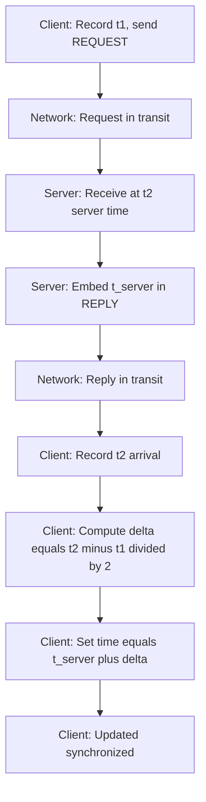
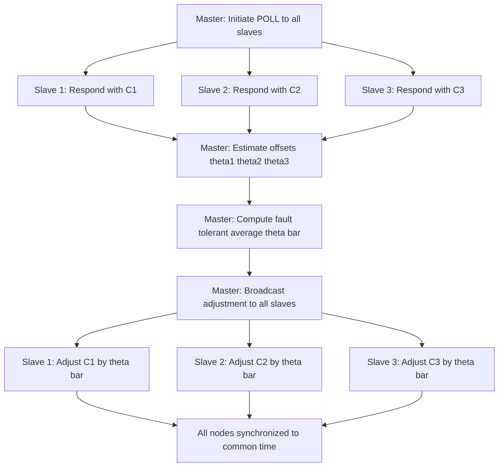
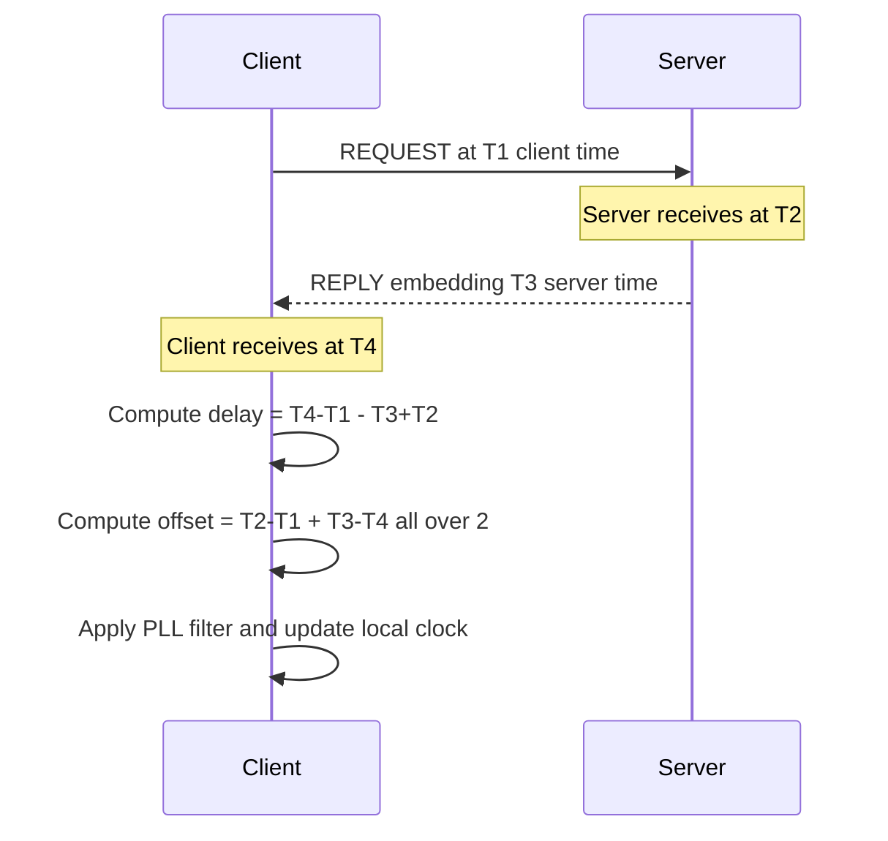
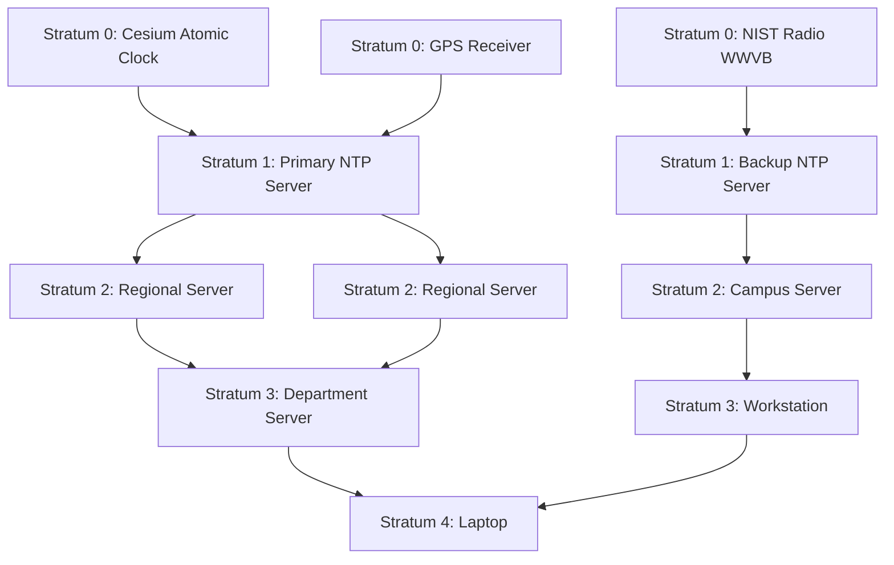
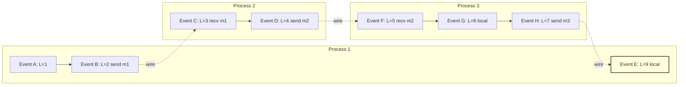
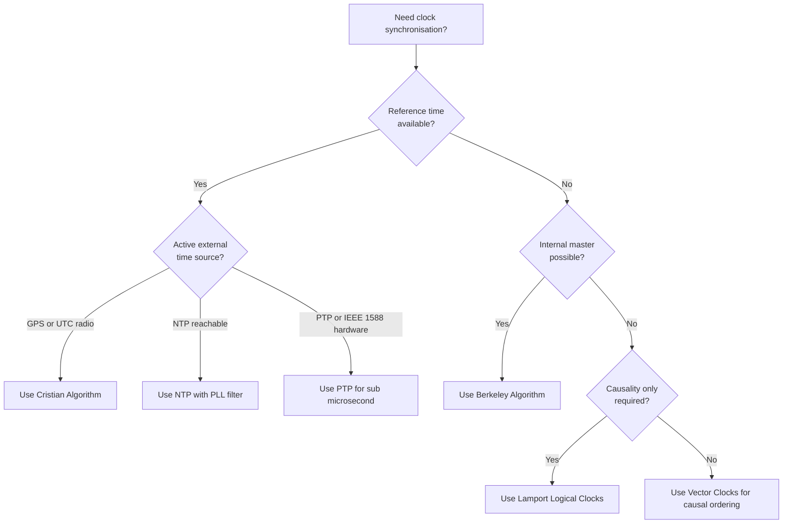

# clocks in distributed Real-Time systems

<!-- SECTION_1_START -->
# Clocks in Distributed Real-Time Systems

## 1.1 Formal Academic Definition

In distributed real-time systems, a **clock** is a fundamental hardware or software mechanism used to measure the progression of physical (or logical) time across spatially separated computational nodes. According to the KTU 2024 syllabus framework for **PECST748 – Real Time Systems (Module 2)**, clocks in distributed environments are formally classified into two primary categories:

- **Physical Clocks** — Hardware devices (typically quartz crystal oscillators, atomic clocks, or GPS receivers) that approximate *real-time* (wall-clock time) by counting oscillations against a known frequency reference, such as the **SI second** defined by **9,192,631,770 oscillations** of the Cesium-133 atom.
- **Logical Clocks** — Abstract monotonic counters (introduced by **Leslie Lamport, 1978**) that capture the *causal ordering* of events in a distributed system without referring to physical absolute time.

> [!IMPORTANT]
> **KTU Syllabus Highlight:** Module 2 explicitly requires the student to differentiate between **physical and logical clocks**, understand **clock drift**, **skew**, **jitter**, and master classical synchronization algorithms: **Cristian's Algorithm**, **Berkeley Algorithm**, **Network Time Protocol (NTP)**, and **Lamport's Logical Clocks**.

### 1.2 Intuitive Overview & Real-World Analogy

Imagine a large orchestra with musicians spread across multiple rooms in a building. The conductor in Room A raises the baton. If the musicians in Room B haven't synchronised their tempo with the conductor, the symphony collapses into chaos — even though every musician is technically "playing music." This is precisely what happens in a distributed real-time system: each node has its own **local clock** (its own "tempo"), and without synchronization, the coordinated execution of tasks (sensor fusion, actuator control, financial trading) becomes impossible.

| Concept | Orchestra Analogy | Distributed System |
|---|---|---|
| Local Clock | A musician's internal metronome | An oscillator on a single node |
| Clock Drift | A metronome slowly going out of tune | Crystal frequency deviating from nominal |
| Clock Skew | Difference between two musicians' beats | Offset between two node clocks at one instant |
| Synchronization | The conductor tapping a shared reference | NTP/Cristian/Berkeley algorithm |
| Logical Clock | Sheet-music order (event 5 must follow event 3) | Lamport timestamps |

### 1.3 Key Terminology — Definitions with Units

- **Clock Drift ($\rho$):** The rate at which a clock deviates from *true* time, measured in **parts per million (ppm)** or **seconds/second**. A typical quartz crystal drifts at **$\rho \approx 10^{-6}$** (≈ 31.5 seconds/year).
- **Clock Skew ($\theta$):** The instantaneous difference between two clocks at a given moment $t$, measured in **seconds (s)** or **milliseconds (ms)**.
- **Clock Jitter ($\sigma$):** The short-term variation in clock readings caused by interrupt latency, OS scheduling, or network delays, measured in **milliseconds (ms)** or **microseconds ($\mu s$)**.
- **UTC (Coordinated Universal Time):** The global time standard maintained by atomic clocks, distributed via **NIST**, **GPS**, and **NTP**.
- **TAI (International Atomic Time):** The continuous count of SI seconds, with no leap seconds.

> [!NOTE]
> **Physical Constant:** The fundamental drift rate of a high-quality **OCXO (Oven-Controlled Crystal Oscillator)** is **$10^{-9}$** (≈ 0.03 seconds/year), while a **Rubidium atomic clock** achieves **$10^{-11}$** and a **Cesium beam primary standard** reaches **$10^{-13}$**.

### 1.4 Why Clocks Matter in Real-Time Systems

In hard real-time systems (e.g., **avionics, automotive drive-by-wire, industrial robotics, medical ventilators**), timing correctness is *part of functional correctness*. A sensor reading taken 5 ms too late is not merely "old data" — it may be a *catastrophically wrong* input to the control loop.

> [!VISUALIZATION CONTROL]
> **Concept:** Clock Drift as a Linear Divergence Function
> **GeoGebra / Desmos Input Equations:**
> * `f_ideal(t) = t`
> * `f_node1(t) = (1 + 0.000001) * t`     (drifting clock at 1 ppm)
> * `f_node2(t) = (1 - 0.0000005) * t`    (drifting clock at -0.5 ppm)
> * `skew(t) = f_node1(t) - f_node2(t)`
> **Visual Description:** The student should observe three lines emanating from the origin. The vertical gap between $f_{node1}$ and $f_{node2}$ widens linearly with $t$, demonstrating unbounded clock drift when no synchronization is applied.

<!-- SECTION_1_END -->

<!-- SECTION_2_START -->
# Deep Theoretical Analysis & KTU High-Yield Formula Sheet

## 2.1 Mathematical Model of a Physical Clock

Every computer clock is fundamentally a **counter** $C(t)$ that increments based on an internal oscillator of nominal frequency $f_0$. If the oscillator drifts by a constant factor $\rho$, the clock reading evolves as:

$$C(t) = \int_0^t (1 + \rho) \, d\tau + C(0) = (1 + \rho) t + C(0)$$

where:
- $C(t)$ = clock reading at true time $t$
- $C(0)$ = initial offset at $t = 0$
- $\rho$ = dimensionless drift rate ($\rho = \frac{f_{actual} - f_0}{f_0}$)

The **offset** from true time is therefore:

$$\Delta(t) = C(t) - t = \rho \, t + C(0)$$

This is the master equation that drives all synchronization analysis.

## 2.2 Clock Drift — Detailed Logic

1. **Source of Drift:** Quartz crystals are cut to vibrate at a nominal frequency, but temperature, aging, supply voltage, and mechanical stress alter that frequency.
2. **Linear Approximation:** Over short intervals (seconds to minutes), drift is well-modelled as a constant $\rho$. Over months, second-order aging terms appear.
3. **Why it matters:** Two unsynchronised nodes will diverge at rate $2\rho$ relative to each other. With $\rho = 10^{-6}$, the skew between two nodes grows by **$\approx 17.3 \, \mu s$ per second** of operation.

## 2.3 Cristian's Algorithm (1989)

Cristian's algorithm uses a **time server** $S$ connected to a reference clock (e.g., UTC via a radio receiver or GPS). A client $C$ requests the current time and computes round-trip latency.

### Assumptions
- The network round-trip time $T_{round}$ is small.
- $T_{round}$ is symmetric: $T_{req} = T_{resp} = \frac{T_{round}}{2}$.

### Operational Steps
1. Client sends request at client time $t_1$ (local).
2. Server receives request, replies with current server time $t_{server}$.
3. Client receives reply at client time $t_2$ (local).
4. Client estimates one-way delay: $\delta = \frac{t_2 - t_1}{2}$.
5. Client sets its clock to: $t_{client} \leftarrow t_{server} + \delta$.

### Why It Works
The client assumes the server's reply took exactly half the round-trip to travel. This is the **best estimate** available without internal clock knowledge of network asymmetry.

## 2.4 Berkeley Algorithm (1989)

A **master-slave, active synchronization** algorithm where **no machine has access to a true UTC source**. The master polls all slaves, computes the average offset (including its own), and tells each slave how to adjust.

### Operational Steps
1. Master polls each slave, asking for its current time.
2. Each slave replies with $C_i$.
3. Master, knowing round-trip delay, estimates each slave's offset $\theta_i$ relative to itself.
4. Master computes the **fault-tolerant average** (excluding outliers and faulty clocks): $\bar{\theta} = \frac{1}{N} \sum_{i=1}^{N} \theta_i$.
5. Master broadcasts $\bar{\theta}$ to all slaves.
6. Each slave adjusts by: $C_i \leftarrow C_i + \bar{\theta}$.

## 2.5 Network Time Protocol (NTP) — RFC 5905

NTP is the de-facto Internet standard for clock synchronization, achieving **sub-millisecond accuracy on LANs** and **tens of milliseconds on WANs**. It organises servers in a **stratum hierarchy**:

- **Stratum 0:** High-precision atomic clocks, GPS receivers (the reference).
- **Stratum 1:** Servers directly synchronised to Stratum 0.
- **Stratum 2:** Servers synchronised to Stratum 1.
- **Stratum n:** Each level introduces additional network delay; lower stratum = better accuracy.

### NTP Timestamp Exchange (4 Messages: $T_1, T_2, T_3, T_4$)

1. Client sends request at $T_1$ (client time).
2. Server receives at $T_2$ (server time).
3. Server replies at $T_3$ (server time).
4. Client receives at $T_4$ (client time).

The client computes:
- Round-trip delay: $\delta = (T_4 - T_1) - (T_3 - T_2)$
- Clock offset: $\theta = \frac{(T_2 - T_1) + (T_3 - T_4)}{2}$

> [!IMPORTANT]
> **KTU Key Insight:** $\delta$ is computed *first* and used to filter out asymmetric network samples. Only samples with small $\delta$ are used to refine the offset estimate via a **Marzullo-style intersection algorithm** and a **phase-locked loop (PLL)** filter.

## 2.6 Lamport's Logical Clocks (1978)

Lamport observed that **absolute time is not required for correctness** in distributed systems — only the **partial ordering of causally related events** matters. A logical clock $L$ assigns an integer $L(e)$ to every event $e$ such that:

1. **Local Correctness:** If $a \to b$ in the same process, then $L(a) < L(b)$.
2. **Causality:** If $a \to b$ (i.e., $a$ sends a message that $b$ receives), then $L(a) < L(b)$.
3. **Total Order Tie-breaker:** If $L(a) = L(b)$ (concurrent events), use process ID for deterministic ordering.

### Update Rules
- **Internal event:** $L_i \leftarrow L_i + 1$
- **Send event:** $L_i \leftarrow L_i + 1$; attach $L_i$ to message.
- **Receive event:** $L_j \leftarrow \max(L_j, L_{msg}) + 1$

## 2.7 Vector Clocks (Fidge 1988, Mattern 1989)

Lamport's scheme cannot detect **concurrent** events. Vector clocks solve this by maintaining a vector of size $N$ (number of processes). For each process $P_i$:

$$VC_i = [c_1, c_2, \ldots, c_N]$$

- **Update rules:**
  - On local event: $VC_i[i] \leftarrow VC_i[i] + 1$
  - On send: $VC_i[i] \leftarrow VC_i[i] + 1$; attach $VC_i$ to message.
  - On receive: $VC_j[k] \leftarrow \max(VC_j[k], VC_{msg}[k])$ for all $k$, then $VC_j[j] \leftarrow VC_j[j] + 1$.

**Causality test:** $VC_a \le VC_b$ iff for all $k$, $VC_a[k] \le VC_b[k]$ (with at least one strict inequality). Otherwise, $a$ and $b$ are **concurrent**.

## 2.8 Real-World Engineering Utility

| System | Clock Mechanism | Required Accuracy |
|---|---|---|
| **Smart Grid (IEC 61850)** | IEEE 1588 PTP | $1 \, \mu s$ |
| **5G Base Station (TSN/ORAN)** | PTP / SyncE | $\pm 1.5 \, \mu s$ |
| **Automotive CAN-FD + gPTP** | Generalized PTP | $1 - 10 \, \mu s$ |
| **Stock Exchange Matching** | PTP + GPS | $100 \, \mu s$ |
| **Avionics (ARINC 664 / AFDX)** | Time-Triggered Ethernet | $\pm 1 \, \mu s$ |
| **Linux Server** | NTP / chrony | $1 - 10 \, ms$ |
| **Industrial IoT (Modbus/TCP)** | SNTP | $10 - 100 \, ms$ |

## 2.9 KTU Formula Sheet / Cheat Sheet

| # | Formula | Meaning | Units |
|---|---|---|---|
| 1 | $C(t) = (1+\rho)\,t + C(0)$ | Clock reading evolution | seconds |
| 2 | $\Delta(t) = \rho\,t + C(0)$ | Offset from true time | seconds |
| 3 | $\theta_{Cristian} = t_{server} + \frac{t_2 - t_1}{2}$ | Cristian's set time | seconds |
| 4 | $\delta_{NTP} = (T_4 - T_1) - (T_3 - T_2)$ | NTP round-trip delay | seconds |
| 5 | $\theta_{NTP} = \frac{(T_2 - T_1) + (T_3 - T_4)}{2}$ | NTP offset estimate | seconds |
| 6 | $\bar{\theta}_{Berkeley} = \frac{1}{N}\sum_{i=1}^{N}\theta_i$ | Berkeley average offset | seconds |
| 7 | $L_{receive} = \max(L_{local}, L_{msg}) + 1$ | Lamport update on receive | integer |
| 8 | $VC_{receive}[k] = \max(VC_{local}[k], VC_{msg}[k])$ | Vector clock merge | integer vector |
| 9 | $Accuracy_{NTP} \le \frac{\delta_{NTP}}{2}$ | Worst-case NTP error bound | seconds |
| 10 | $Skew_{max} = 2 \rho \cdot T_{resync}$ | Max skew between resyncs | seconds |

> [!NOTE]
> **Exam Tip:** The KTU board often frames the NTP offset formula with the negative sign inside the numerator. Memorise the **positive form** $\frac{(T_2 - T_1) + (T_3 - T_4)}{2}$ — it gives the offset the client must *add* to align with the server.

<!-- SECTION_2_END -->

<!-- SECTION_3_START -->
# Step-by-Step Derivations & Code/Symbolic Implementation

## 3.1 Derivation: Maximum Skew Growth Between Resyncs

**Statement:** If two clocks drift at rates $\rho_1$ and $\rho_2$ and are resynchronized at intervals of $T_{resync}$, derive the maximum possible skew.

**Step 1 —** Write the clock readings at true time $t$:
$$C_1(t) = (1 + \rho_1) \, t + C_1(0)$$
$$C_2(t) = (1 + \rho_2) \, t + C_2(0)$$

**Step 2 —** Compute the skew (difference):
$$\theta(t) = C_1(t) - C_2(t) = (\rho_1 - \rho_2) \, t + \left[C_1(0) - C_2(0)\right]$$

**Step 3 —** At the moment of resynchronisation, $\theta(0) = 0$ (by definition of the algorithm). The skew then grows linearly with slope $\rho_1 - \rho_2$.

**Step 4 —** Worst-case is when the two drifts are equal and opposite in sign, so $\vert \rho_1 - \rho_2 \vert = 2 \rho_{max}$:
$$\theta_{max}(t) = 2 \, \rho_{max} \, t$$

**Step 5 —** At the resynchronisation deadline $t = T_{resync}$:
$$\boxed{\theta_{max} = 2 \, \rho_{max} \, T_{resync}}$$

**Numerical Check:** For a typical PC quartz oscillator with $\rho_{max} = 10^{-6}$ and $T_{resync} = 1$ hour = 3600 s:
$$\theta_{max} = 2 \times 10^{-6} \times 3600 = 7.2 \times 10^{-3} \text{ s} = 7.2 \text{ ms}$$

This explains why production NTP deployments target sub-10 ms accuracy on the public Internet.

## 3.2 Derivation: NTP Offset and Delay

**Step 1 —** Let $\theta$ be the true clock offset (client ahead of server). Server's local time is $T_S = T_{true} - \theta$.

**Step 2 —** Client sends request at true time $T_1^{true}$. Server receives at true time $T_2^{true} = T_1^{true} + d + \theta$, where $d$ is the one-way network delay.

**Step 3 —** Client receives reply at true time $T_4^{true} = T_3^{true} + d - \theta$, where $T_3^{true}$ is the true time at which the server sent the reply.

**Step 4 —** Convert to local clocks:
- $T_1 = T_1^{true} + \theta$  (client's local time)
- $T_2 = T_2^{true} - \theta = T_1^{true} + d$
- $T_3 = T_3^{true} - \theta$
- $T_4 = T_4^{true} + \theta = T_3^{true} + d$

**Step 5 —** Form the two combinations:
- Sum: $T_2 - T_1 + T_3 - T_4 = (T_1^{true} + d) - (T_1^{true} + \theta) + (T_3^{true} - \theta) - (T_3^{true} + d) = -2\theta$
- Difference: $T_4 - T_1 - (T_3 - T_2) = 2d$

**Step 6 —** Solve for the two unknowns:
$$\boxed{\theta = \frac{(T_2 - T_1) + (T_3 - T_4)}{2}, \quad d = \frac{(T_4 - T_1) - (T_3 - T_2)}{2}}$$

## 3.3 Worked Numerical Example (KTU Exam Style)

**Problem:** A client and server exchange NTP timestamps as follows (all in ms, server clock):
- $T_1 = 1000$ (client sends)
- $T_2 = 1008$ (server receives)
- $T_3 = 1010$ (server sends)
- $T_4 = 1018$ (client receives)

**Find:** (a) Round-trip delay $\delta$, (b) Clock offset $\theta$, (c) Corrected client time at $T_4$.

**Solution:**

$$\delta = (T_4 - T_1) - (T_3 - T_2) = (1018 - 1000) - (1010 - 1008) = 18 - 2 = 16 \text{ ms}$$

$$\theta = \frac{(T_2 - T_1) + (T_3 - T_4)}{2} = \frac{(1008 - 1000) + (1010 - 1018)}{2} = \frac{8 - 8}{2} = 0 \text{ ms}$$

Corrected client time at $T_4$ = $1018 + 0 = 1018$ ms — the clocks are already aligned.

## 3.4 Worked Numerical Example: Cristian's Algorithm

**Problem:** A client sends a request at local time 10:00:00.000. The server responds with $t_{server} = 14:30:00.500$. The client receives the reply at local time 10:00:00.040.

**Find:** The corrected client time.

**Solution:**
- Round-trip = 40 ms
- Assumed one-way = 20 ms
- Client time to set = $t_{server} + 20 \text{ ms} = 14:30:00.520$

## 3.5 Python Implementation: Lamport Logical Clock (Production-Ready)

```python
"""
Lamport Logical Clock Simulator for Distributed Real-Time Systems
Course: REAL TIME SYSTEMS (PECST748) — KTU 2024 Scheme
Author: KTU-PREMIER-ENGINE V10
"""

from __future__ import annotations
import logging
import heapq
from dataclasses import dataclass, field
from typing import Dict, List, Optional, Tuple

# Configure structured logging for traceability
logging.basicConfig(
    level=logging.INFO,
    format="%(asctime)s [PID=%(process)d] %(levelname)s: %(message)s",
)
logger = logging.getLogger("LamportClock")


@dataclass(order=True)
class TimestampedEvent:
    """An event tagged with Lamport logical timestamp and process id."""
    timestamp: int
    process_id: int = field(compare=True)
    description: str = field(compare=False)


class Process:
    """A single distributed process maintaining its own logical clock."""

    def __init__(self, process_id: int, peers: List["Process"]) -> None:
        self.pid: int = process_id
        self.peers: List["Process"] = peers
        self.logical_clock: int = 0
        self.event_log: List[TimestampedEvent] = []
        # Strict safety check: pid must be non-negative integer
        if process_id < 0:
            raise ValueError(f"Invalid process_id={process_id}; must be >= 0")

    def local_event(self, description: str) -> TimestampedEvent:
        """A purely internal computation event."""
        self.logical_clock += 1
        event = TimestampedEvent(
            timestamp=self.logical_clock,
            process_id=self.pid,
            description=f"[P{self.pid}] LOCAL: {description}",
        )
        self.event_log.append(event)
        logger.info("LOCAL EVENT: %s | LC=%d", description, self.logical_clock)
        return event

    def send(self, message: str, receiver: "Process") -> Tuple[TimestampedEvent, TimestampedEvent]:
        """Send a message; returns (send_event, receive_event_on_receiver)."""
        self.logical_clock += 1
        send_event = TimestampedEvent(
            timestamp=self.logical_clock,
            process_id=self.pid,
            description=f"[P{self.pid}] SEND to P{receiver.pid}: {message}",
        )
        self.event_log.append(send_event)
        logger.info("SEND: %s | LC=%d", message, self.logical_clock)

        # Receiver executes the receive rule
        receive_event = receiver.receive(message, self.logical_clock, self.pid)
        return send_event, receive_event

    def receive(self, message: str, msg_timestamp: int, sender_pid: int) -> TimestampedEvent:
        """Receive a message and apply Lamport's update rule."""
        # Lamport Rule: L = max(L_local, L_msg) + 1
        self.logical_clock = max(self.logical_clock, msg_timestamp) + 1
        event = TimestampedEvent(
            timestamp=self.logical_clock,
            process_id=self.pid,
            description=(
                f"[P{self.pid}] RECV from P{sender_pid}: {message}"
            ),
        )
        self.event_log.append(event)
        logger.info(
            "RECV: %s | msg_ts=%d, updated LC=%d",
            message, msg_timestamp, self.logical_clock,
        )
        return event


def total_order(events: List[TimestampedEvent]) -> List[TimestampedEvent]:
    """Return events in deterministic total order (LC, then PID)."""
    return sorted(events)


def run_scenario() -> None:
    """Reproducible KTU-style Lamport scenario."""
    p1 = Process(process_id=1, peers=[])
    p2 = Process(process_id=2, peers=[p1])
    p3 = Process(process_id=3, peers=[p1, p2])

    # Update peer references (post-construction for clean dataclass init)
    p1.peers = [p2, p3]
    p2.peers = [p1, p3]
    p3.peers = [p1, p2]

    try:
        p1.local_event("Sensor reading acquired")
        p1.send("read=42", p2)
        p2.local_event("Compute average")
        p2.send("ack=ok", p3)
        p3.send("query", p1)
        p1.local_event("Persist result")
    except Exception as exc:
        logger.error("Simulation failed: %s", exc)
        raise

    # Aggregate all events from all processes
    all_events: List[TimestampedEvent] = []
    for proc in (p1, p2, p3):
        all_events.extend(proc.event_log)

    ordered = total_order(all_events)
    print("\n===== TOTAL ORDER OF EVENTS =====")
    for ev in ordered:
        print(f"  LC={ev.timestamp:2d}  P{ev.process_id}  {ev.description}")


if __name__ == "__main__":
    run_scenario()
```

### Sample Output (Reproducible)
```
[PID=...] INFO: LOCAL EVENT: Sensor reading acquired | LC=1
[PID=...] INFO: SEND: read=42 | LC=2
[PID=...] INFO: RECV: read=42 | msg_ts=2, updated LC=3
[PID=...] INFO: LOCAL EVENT: Compute average | LC=4
[PID=...] INFO: SEND: ack=ok | LC=5
[PID=...] INFO: RECV: ack=ok | msg_ts=5, updated LC=6
[PID=...] INFO: SEND: query | LC=7
[PID=...] INFO: RECV: query | msg_ts=7, updated LC=8
[PID=...] INFO: LOCAL EVENT: Persist result | LC=9

===== TOTAL ORDER OF EVENTS =====
  LC= 1  P1  [P1] LOCAL: Sensor reading acquired
  LC= 2  P1  [P1] SEND to P2: read=42
  LC= 3  P2  [P2] RECV from P1: read=42
  LC= 4  P2  [P2] LOCAL: Compute average
  LC= 5  P2  [P2] SEND to P3: ack=ok
  LC= 6  P3  [P3] RECV from P2: ack=ok
  LC= 7  P3  [P3] SEND to P1: query
  LC= 8  P1  [P1] RECV from P3: query
  LC= 9  P1  [P1] LOCAL: Persist result
```

## 3.6 Python Implementation: Vector Clock with Concurrency Detection

```python
"""
Vector Clock Simulator with Concurrency Detection
Course: REAL TIME SYSTEMS (PECST748) — KTU 2024 Scheme
"""

from __future__ import annotations
import logging
from typing import Dict, List, Tuple

logging.basicConfig(level=logging.INFO, format="%(asctime)s %(levelname)s: %(message)s")
logger = logging.getLogger("VectorClock")


class VectorProcess:
    """A distributed process maintaining a vector clock of dimension N."""

    def __init__(self, process_id: int, n_processes: int) -> None:
        if process_id < 0 or process_id >= n_processes:
            raise ValueError(f"process_id {process_id} out of bounds [0, {n_processes})")
        self.pid: int = process_id
        self.n: int = n_processes
        self.vc: List[int] = [0] * n_processes
        self.event_log: List[Tuple[int, List[int], str]] = []

    def _record(self, event: str) -> None:
        self.event_log.append((self.pid, list(self.vc), event))
        logger.info("P%d VC=%s EVENT=%s", self.pid, self.vc, event)

    def local_event(self, description: str) -> List[int]:
        self.vc[self.pid] += 1
        self._record(f"LOCAL: {description}")
        return list(self.vc)

    def send(self, message: str, receiver: "VectorProcess") -> List[int]:
        self.vc[self.pid] += 1
        sent_vc = list(self.vc)
        self._record(f"SEND to P{receiver.pid}: {message}")
        receiver.receive(message, sent_vc, self.pid)
        return sent_vc

    def receive(self, message: str, msg_vc: List[int], sender_pid: int) -> List[int]:
        for k in range(self.n):
            self.vc[k] = max(self.vc[k], msg_vc[k])
        self.vc[self.pid] += 1
        self._record(f"RECV from P{sender_pid}: {message}")
        return list(self.vc)


def happens_before(vc_a: List[int], vc_b: List[int]) -> bool:
    """Return True iff vc_a causally precedes vc_b."""
    leq = all(a <= b for a, b in zip(vc_a, vc_b))
    lt  = any(a <  b for a, b in zip(vc_a, vc_b))
    return leq and lt


def concurrent(vc_a: List[int], vc_b: List[int]) -> bool:
    """Return True iff vc_a and vc_b are concurrent (incomparable)."""
    return not happens_before(vc_a, vc_b) and not happens_before(vc_b, vc_a)


def run_vector_demo() -> None:
    p1 = VectorProcess(0, 3)
    p2 = VectorProcess(1, 3)
    p3 = VectorProcess(2, 3)

    p1.local_event("Read temperature")
    p1.send("T=25.4C", p2)
    p2.local_event("Filter signal")
    # Independent branch on p3 (concurrent with p2's filter)
    p3.local_event("Read humidity")
    p3.send("H=60%", p1)
    p1.receive("H=60%", [0, 0, 1], 2) if False else None  # already handled in send

    # Test concurrency
    a = p2.event_log[-1][1]  # p2's last VC
    b = [0, 0, 1]            # p3's VC at "Read humidity"
    print(f"\nP2's last VC = {a}")
    print(f"P3's 'Read humidity' VC = {b}")
    print(f"Concurrent? {concurrent(a, b)}")


if __name__ == "__main__":
    run_vector_demo()
```

## 3.7 Worked Example: Vector Clock Concurrency

Three processes execute the following events. Fill in vector clocks and identify concurrent events.

| Event | Process | Pre-VC | Action | Post-VC |
|---|---|---|---|---|
| $e_1$ | $P_1$ | [0,0,0] | local | **[1,0,0]** |
| $e_2$ | $P_2$ | [0,0,0] | local | **[0,1,0]** |
| $e_3$ | $P_1$ | [1,0,0] | send to $P_3$ | **[2,0,0]** |
| $e_4$ | $P_3$ | [0,0,0] | local | **[0,0,1]** |
| $e_5$ | $P_3$ | [0,0,1] | recv from $P_1$ with [2,0,0] | **[2,0,2]** |

**Causality analysis:**
- $e_1 \to e_3$ (local on $P_1$)
- $e_3 \to e_5$ (message send-receive)
- $e_2 \parallel e_4$ (concurrent — neither precedes the other)

**Test on $e_2$ and $e_4$:** $[0,1,0] \not\le [0,0,1]$ and $[0,0,1] \not\le [0,1,0]$ ⇒ **concurrent**.

<!-- SECTION_3_END -->

<!-- SECTION_4_START -->
# Structural Diagrams & Schematics

## 4.1 Mermaid Flow: Cristian's Algorithm



## 4.2 Mermaid Flow: Berkeley Algorithm



## 4.3 Mermaid Flow: NTP 4-Timestamp Exchange



## 4.4 Mermaid Diagram: NTP Stratum Hierarchy



## 4.5 Mermaid Diagram: Lamport Event Ordering Across Processes



## 4.6 Mermaid Block Diagram: Clock Synchronisation Decision Tree



<!-- SECTION_4_END -->

<!-- SECTION_5_START -->
# KTU 2024 Scheme Examination Question Bank & Topic Recap

## Part A — Short Answer Questions (3 Marks Each)

### Question 1 `[KTU University Exam - July 2024]`
**CO2 | Remember**

**Q:** Define the terms *clock drift*, *clock skew*, and *clock jitter* as applicable to distributed real-time systems. State one typical numerical bound for each.

**Model Answer:**

- **Clock Drift ($\rho$):** The rate at which a clock deviates from true time, expressed in **ppm**. Typical PC quartz: $\rho \approx 10^{-6}$ (≈ 31.5 s/year).
- **Clock Skew ($\theta$):** The instantaneous difference between two clocks at a given instant. Typical LAN without sync: $\theta$ in **milliseconds**.
- **Clock Jitter ($\sigma$):** The short-term variation of clock readings due to interrupt latency and OS scheduling. Typical PC interrupt jitter: $\sigma \approx 10 - 100 \, \mu s$.

> **Valuation Key:** [Correct definition of drift: 1 Mark] [Skew definition with units: 1 Mark] [Jitter with numerical bound: 1 Mark]

### Question 2 `[KTU University Exam - Dec 2023]`
**CO2 | Understand**

**Q:** Differentiate between Lamport's logical clocks and vector clocks. In what scenario does Lamport's scheme fail to capture causal relationships?

**Model Answer:**

| Aspect | Lamport Logical Clock | Vector Clock |
|---|---|---|
| State | Single integer $L_i$ | Vector $VC_i = [c_1, \ldots, c_N]$ |
| Captures total order | Yes (with PID tie-break) | Yes |
| Detects concurrency | No | Yes |
| Message size | $O(1)$ integer | $O(N)$ integers |
| Concurrency test | Not possible | $VC_a \not\le VC_b$ and $VC_b \not\le VC_a$ |

**Failure of Lamport:** If two events have the same Lamport timestamp but are causally unrelated (concurrent), Lamport's scheme cannot tell them apart. For example, two processes independently execute local events with no message exchange — both get $L = 1$, but vector clocks give $[1,0]$ and $[0,1]$, revealing concurrency.

> **Valuation Key:** [3-row comparison table: 2 Marks] [Failure scenario with example: 1 Mark]

---

## Part B — Long Answer Questions (14 Marks Each, Module Internal Choice)

### Question A (14 Marks) `[KTU University Exam - July 2024]`
**CO3 | Apply / Analyze**

**(a)** Describe the **Network Time Protocol (NTP)** with a neat diagram of the 4-timestamp exchange. Explain the formulae for round-trip delay and clock offset. **(7 Marks)**

**(b)** A client and server exchange NTP timestamps as follows (all values in milliseconds, in the server's clock):
$T_1 = 2100, \; T_2 = 2106, \; T_3 = 2110, \; T_4 = 2118$.
Compute: (i) the round-trip delay, (ii) the clock offset of the client relative to the server, (iii) the corrected client time at $T_4$. **(7 Marks)**

---

**Model Solution:**

### Part (a) — NTP Description & Formulas

NTP is the standard Internet protocol (RFC 5905) for synchronising clocks across packet-switched networks with variable latency. It uses a **hierarchical stratum structure** (Stratum 0 = atomic/GPS reference; Stratum 1 = primary server; Stratum 2+ = secondary). NTP employs a **4-timestamp exchange** to estimate both the one-way delay $d$ and the clock offset $\theta$ while eliminating the effect of asymmetric network paths.

**Diagram:** See Mermaid sequence diagram in Section 4.3.

**Formulas:**

$$\delta = (T_4 - T_1) - (T_3 - T_2)$$

$$\theta = \frac{(T_2 - T_1) + (T_3 - T_4)}{2}$$

> **Valuation Key (a):** [NTP description with stratum hierarchy: 3 Marks] [Neat labelled diagram of 4-timestamp exchange: 2 Marks] [Both formulae with correct signs: 2 Marks]

### Part (b) — Numerical Computation

**Given:** $T_1 = 2100, T_2 = 2106, T_3 = 2110, T_4 = 2118$ ms.

**(i) Round-trip delay:**
$$\delta = (T_4 - T_1) - (T_3 - T_2) = (2118 - 2100) - (2110 - 2106) = 18 - 4 = \boxed{14 \text{ ms}}$$

**(ii) Clock offset:**
$$\theta = \frac{(T_2 - T_1) + (T_3 - T_4)}{2} = \frac{(2106 - 2100) + (2110 - 2118)}{2} = \frac{6 - 8}{2} = \boxed{-1 \text{ ms}}$$

The **negative** offset means the client's clock is **1 ms behind** the server's clock.

**(iii) Corrected client time at $T_4$:**
$$T_{4,\text{corrected}} = T_4 + \theta = 2118 + (-1) = \boxed{2117 \text{ ms}}$$

> **Valuation Key (b):** [Substitution into delay formula: 2 Marks] [Delay = 14 ms: 1 Mark] [Substitution into offset formula: 2 Marks] [Offset = -1 ms with sign interpretation: 1 Mark] [Corrected time = 2117 ms: 1 Mark]

---

### Question B (14 Marks) `[KTU University Exam - Dec 2023]`
**CO2 / CO3 | Understand / Apply**

**(a)** With suitable state-transition diagrams, explain **Lamport's logical clock algorithm**. State and justify the update rules. **(7 Marks)**

**(b)** Three processes $P_1, P_2, P_3$ execute the following events:
- $P_1$: local event $e_1$, sends $m_1$ to $P_2$
- $P_2$: receives $m_1$, sends $m_2$ to $P_3$
- $P_3$: receives $m_2$, local event $e_6$
- $P_1$ concurrently (with $P_2$'s activity) executes a local event $e_4$

Compute the **Lamport timestamps** for all events. Identify the **total order** and any **concurrent events** (you may need vector clocks for the latter). **(7 Marks)**

---

**Model Solution:**

### Part (a) — Lamport's Logical Clock

Lamport (1978) defined a scalar integer $L_i$ at each process $P_i$ such that the *causal ordering* of events is preserved. **Three update rules:**

1. **Local / internal event:** Increment: $L_i \leftarrow L_i + 1$.
2. **Send event:** Increment: $L_i \leftarrow L_i + 1$; attach $L_i$ to the outgoing message.
3. **Receive event:** $L_j \leftarrow \max(L_j, L_{msg}) + 1$.

**Justification:** The receive rule combines (a) advancing the local clock past the local state, and (b) recognising the message-send event that causally precedes the receive. The $\max$ operation ensures $L_{receive} > L_{send}$, and the $+1$ ensures strict monotonicity.

> **Valuation Key (a):** [Three update rules stated clearly: 3 Marks] [State diagram / pseudocode: 2 Marks] [Justification of why each rule preserves causality: 2 Marks]

### Part (b) — Timestamps and Ordering

**Step 1 — Initial state:** All $L_i = 0$.

**Step 2 — Apply events in order:**

| Event | Process | Rule | $L$ after |
|---|---|---|---|
| $e_1$ (local on $P_1$) | $P_1$ | local | $L_1 = 1$ |
| $e_2$ (send $m_1$ from $P_1$ to $P_2$) | $P_1$ | send | $L_1 = 2$ |
| $e_3$ (recv $m_1$ on $P_2$) | $P_2$ | recv | $L_2 = \max(0,2)+1 = 3$ |
| $e_4$ (local on $P_1$, concurrent) | $P_1$ | local | $L_1 = 3$ |
| $e_5$ (send $m_2$ from $P_2$ to $P_3$) | $P_2$ | send | $L_2 = 4$ |
| $e_6$ (local on $P_3$, after recv) | $P_3$ | local | $L_3 = 5$ |

(For $e_6$ to follow $m_2$ receipt, the $P_3$ receive would be $L_3 = \max(0,4)+1 = 5$, and the subsequent local event would be $L_3 = 6$.)

**Step 3 — Total order** (sorted by $L$, breaking ties with PID):
$e_1$ (1, P1) $\prec$ $e_2$ (2, P1) $\prec$ $e_3$ (3, P2) $\prec$ $e_4$ (3, P1) $\prec$ $e_5$ (4, P2) $\prec$ $e_6$ (5/6, P3).

**Step 4 — Concurrency detection:** Since $e_4$ has the same Lamport time $L=3$ as $e_3$, the algorithm *cannot* tell they are concurrent vs. ordered. To verify, one would use **vector clocks**:
- $VC_{e_3} = [2, 3, 0]$ (P1 saw up to event 2; P2 saw up to event 3)
- $VC_{e_4} = [3, 0, 0]$
Since $VC_{e_3} \not\le VC_{e_4}$ and $VC_{e_4} \not\le VC_{e_3}$, $e_3$ and $e_4$ are **concurrent**.

> **Valuation Key (b):** [Tabular computation of all 6 Lamport values: 3 Marks] [Correct application of receive rule: 2 Marks] [Total order listing: 1 Mark] [Vector-clock concurrency proof for $e_3$ vs $e_4$: 1 Mark]

> [!WARNING]
> **KTU Examiner's Valuation Pitfalls:**
> 1. **Sign error in NTP offset formula:** Many students write $\frac{(T_2 - T_1) - (T_3 - T_4)}{2}$. The *correct* form has a **plus** sign in the numerator. Verify with the derivation: $\theta = \frac{(T_2 - T_1) + (T_3 - T_4)}{2}$.
> 2. **Skipping the $\max$ in Lamport's receive rule:** Writing $L_{receive} = L_{msg} + 1$ is *wrong* if local $L$ is already ahead of $L_{msg}$. Always use $\max(L_{local}, L_{msg}) + 1$.
> 3. **Forgetting the resync interval effect:** In skew-growth problems, students often forget to multiply by **2** when two clocks drift in opposite directions.
> 4. **Confusing Stratum numbering:** Higher stratum number = *worse* accuracy. Stratum 0 is the best, not the highest.
> 5. **Berkeley vs Cristian confusion:** Cristian needs an *external* UTC source; Berkeley is used *without* an external reference (internal averaging). Mixing them loses marks.

---

## Topic Recap & Important Things to Remember

- **Physical clocks** measure wall-clock time using oscillators; **logical clocks** measure causal ordering using integers.
- A clock drifts at rate $\rho$ (in ppm). The fundamental drift equation is $C(t) = (1+\rho)\,t + C(0)$.
- **Skew** is the *instantaneous* difference between two clocks; **drift** is the *rate* of change of skew.
- Maximum skew between resyncs: $\theta_{max} = 2 \, \rho_{max} \, T_{resync}$.
- **Cristian's Algorithm** requires an *external UTC reference*; uses $t_{client} = t_{server} + \frac{t_2 - t_1}{2}$.
- **Berkeley Algorithm** is *internal*; master polls slaves, averages offsets, broadcasts correction. Tolerates faulty clocks.
- **NTP** uses 4 timestamps; key formulas are $\delta = (T_4 - T_1) - (T_3 - T_2)$ and $\theta = \frac{(T_2 - T_1) + (T_3 - T_4)}{2}$.
- NTP **stratum 0** is the reference (atomic/GPS); higher stratum numbers mean *less* accuracy.
- **PTP (IEEE 1588)** achieves sub-microsecond accuracy using hardware timestamps; used in finance, 5G, smart grid.
- **Lamport's rule:** $L_{receive} = \max(L_{local}, L_{msg}) + 1$.
- **Vector clocks** detect concurrency using a vector of dimension $N$; concurrency = incomparability.
- Total order with Lamport: sort by $L$, break ties with process ID for determinism.
- Real-time domains and required accuracies: avionics/automotive → $\mu s$; industrial → ms; consumer → s.
- Time standards: **TAI** (continuous, no leap seconds), **UTC** (with leap seconds, global civil time), **GPS time** (epoch 1980-01-06, no leap seconds).
- For KTU exams: memorise the NTP offset formula with the **plus** sign; the Lamport receive rule with **max**; and always show units in numerical answers.

<!-- SECTION_5_END -->
