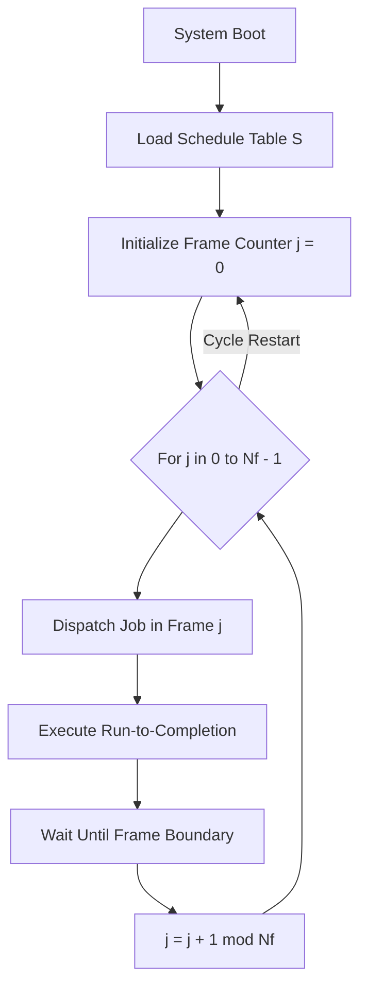
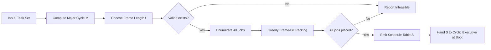
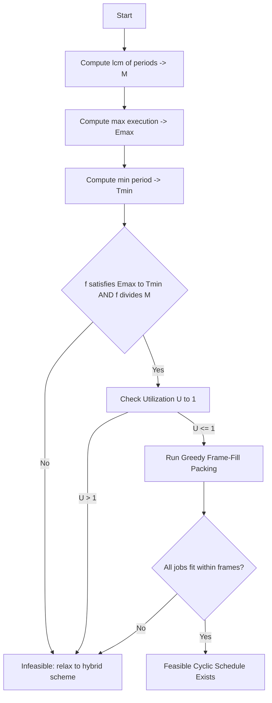

# cyclic

<!-- SECTION_1_START -->
# CYCLIC SCHEDULING IN REAL-TIME SYSTEMS

## 1.1 Formal Academic Definition

> [!NOTE]
> **Cyclic Scheduling** is a *table-driven, pre-computed, non-preemptive* execution paradigm used in hard real-time systems where a finite set of periodic tasks is dispatched by a small **kernel** (the *cyclic executive*) according to a statically constructed **major cycle** (also called the *hyperperiod* or *schedule table*). The major cycle is partitioned into a sequence of fixed-length **minor cycles** (called *frames* or *slots*), and each task is assigned to one or more frames in such a way that the entire schedule repeats every major cycle.

> [!IMPORTANT]
> **Key Terms (KTU 2024 PECST748 – Module 2):**
> - **Cyclic Executive:** The dispatcher that runs the pre-built schedule table tick-by-tick.
> - **Major Cycle ($M$):** LCM of all task periods — the schedule's total repeat length.
> - **Minor Cycle / Frame ($f$):** The atomic dispatching quantum.
> - **Job (Slot Instance):** A single execution invocation of a task inside its frame.
> - **Primary & Secondary Copies:** Multiple instances of a job per major cycle (one per period boundary).

In the KTU 2024 syllabus for *Real Time Systems* (PECST748), cyclic scheduling belongs to **classical, table-driven real-time scheduling techniques**, often contrasted later with *priority-driven* schemes such as **Rate Monotonic Scheduling (RMS)** and **Earliest Deadline First (EDF)**.

## 1.2 Conceptual Analogy & Intuition

> [!TIP]
> **Real-World Analogy — The Indian Railway Time-Table 🚆**
> 
> Imagine a small railway junction where **5 trains** must depart every day. The station master prints a **paper timetable** once, glues it to his desk, and follows it strictly: at *09:00–09:10* Train A leaves, *09:10–09:15* Train B leaves, *09:15–09:25* Train C leaves, and so on. The whole pattern repeats every 60 minutes (the **major cycle**), and each 5- or 10-minute block is a **minor cycle (frame)**. The master never *decides* dynamically; he just executes the table.
> 
> This is **cyclic scheduling**: predictable, low-overhead, but rigid. If a new train is added, the entire timetable must be reprinted.

### 1.3 The Geometric Intuition

Think of time as a horizontal axis. Tasks are *stacked* into a repeating **rectangular grid**:

- The **width of one column** = the frame length $f$.
- The **width of the entire grid** = the major cycle $M = \text{lcm}(T_1, T_2, \dots, T_n)$.
- The **height** = the number of tasks sharing a frame.

A new minor cycle starts at multiples of $f$, and the executive *jumps* to the next row (task) inside the current frame.

## 1.4 Why Cyclic Scheduling Still Matters

| Reason | Engineering Reality |
|---|---|
| **Zero runtime overhead** | Used in **fly-by-wire avionics, automotive ECUs, Mars rovers** |
| **Bounded jitter & deterministic** | Every deadline is met *by construction* |
| **Minimal kernel footprint** | Suitable for **certifiable safety-critical systems** (DO-178C, ISO 26262) |
| **Predictable memory access** | Cache footprint can be pre-analyzed |

> [!WARNING]
> The chief drawback is **lack of flexibility**: any change in task set requires re-computation of the entire schedule. Modern systems often use *hybrid* approaches (cyclic + priority queues for aperiodic traffic).

## 1.5 Visualization Control (Optional External Tool)

> [!VISUALIZATION CONTROL]
> **Concept:** Cyclic Schedule Grid for 3 Tasks with $T_1 = 4$, $T_2 = 6$, $T_3 = 8$
> **GeoGebra / Desmos Input:**
> * Define points: $A=(0,1)$, $B=(4,1)$, $C=(8,1)$ for Task 1
> * Define points: $D=(0,2)$, $E=(6,2)$, $F=(12,2)$ for Task 2
> * Define points: $G=(0,3)$, $H=(8,3)$ for Task 3
> * Major cycle marker: vertical line $x = 24$
> **Visual Description:** Observe how each task fires at *multiples* of its period, and the entire pattern resets at $x = 24 = \text{lcm}(4,6,8)$.

---

<!-- SECTION_1_END -->

<!-- SECTION_2_START -->
# DEEP THEORETICAL ANALYSIS & KTU FORMULA SHEET

## 2.1 The Cyclic Executive — Operational Anatomy

The cyclic executive is a tiny run-to-completion loop. Pseudocode of the dispatcher:

```
loop forever:
    slot = current_frame_index
    execute the task(s) bound to slot
    wait_until(slot_end)
    slot = (slot + 1) mod N_frames
```

Three pre-computed artefacts are required **offline** before the system is deployed:

1. **Frame length $f$** — the dispatcher quantum.
2. **Schedule table $\mathcal{S}$** — maps each frame index $f_i$ to one or more jobs.
3. **Major cycle $M$** — the LCM of all periods.

## 2.2 Formal Constraints for a Valid Cyclic Schedule

For a set of $n$ periodic tasks $\{ \tau_i \}$ with **period $T_i$** and **worst-case execution time $e_i$**, the following conditions must hold:

> [!IMPORTANT]
> **The Four Mandatory Conditions (Board-Exam Favourites ⭐)**
> 
> **(C1) Frame divisibility:** $f$ must divide $M$, i.e., $f \mid M$.
> 
> **(C2) Job completability inside a frame:** For *every* task, $e_i \leq f$ (no job can straddle two frames).
> 
> **(C3) Total utilization:** $\sum_{i=1}^{n} \frac{e_i}{T_i} \leq 1$ (the processor must not be over-loaded).
> 
> **(C4) Inter-release spacing:** Between two consecutive releases of the *same* task, at least $f$ time must elapse (otherwise the schedule would force back-to-back execution).

## 2.3 Frame-Size Selection Strategy

Choosing $f$ is a trade-off:

| Choice of $f$ | Impact |
|---|---|
| **Very small $f$** | High context-switch overhead; smooth interleaving |
| **Very large $f$** | Low overhead; coarse granularity, fewer scheduling points |
| **Optimal (Dhall/Liu effect)** | $f \approx$ largest $e_i$ that still allows (C1) to hold |

A classical heuristic (used in KTU board problems):

$$f_{\text{heuristic}} = \max_{i=1}^{n}\left(e_i\right) \quad \text{such that} \quad f \mid M$$

If multiple such $f$ exist, **pick the largest valid one** to minimize overhead.

## 2.4 KTU High-Yield Formula Cheat Sheet

| # | Symbol / Name | Formula | Meaning | Unit |
|---|---|---|---|---|
| 1 | Major cycle $M$ | $M = \text{lcm}(T_1, T_2, \ldots, T_n)$ | Hyperperiod of the task set | time |
| 2 | Processor utilization $U$ | $U = \sum_{i=1}^{n} \frac{e_i}{T_i}$ | Fraction of CPU consumed | dimensionless |
| 3 | Number of frames $N_f$ | $N_f = \dfrac{M}{f}$ | Total slots in one major cycle | integer |
| 4 | Jobs of task $\tau_i$ per major cycle | $J_i = \dfrac{M}{T_i}$ | How many invocations fit in $M$ | integer |
| 5 | Total job slots to schedule | $\sum_{i=1}^{n} J_i$ | Total rows to pack into the table | integer |
| 6 | Frame size lower bound | $f \geq \max_i e_i$ | A job must finish in one frame | time |
| 7 | Frame size upper bound | $f \leq \min_i T_i$ | Releases must be at least $f$ apart | time |
| 8 | Slack time per major cycle | $M(1 - U)$ | Idle time budget | time |

> [!NOTE]
> **Exam tip:** When asked to *prove* a cyclic schedule exists, write these three lines on the answer sheet:
> 1. Compute $M = \text{lcm}(\cdot)$
> 2. Choose $f$ such that $\max_i e_i \leq f \leq \min_i T_i$ and $f \mid M$
> 3. Verify $U \leq 1$ and pack the table.

## 2.5 Engineering Utility in Modern Systems

| Domain | Why Cyclic? |
|---|---|
| **Automotive ECU (engine control)** | ISO 26262 ASIL-D requires deterministic dispatch |
| **Avionics (DO-178C Level A)** | Static analysis is tractable only for table-driven schedules |
| **Industrial PLCs** | Cyclic scan is the de-facto execution model |
| **Satellite on-board computers** | Radiation-hardened, ultra-low-power CPUs benefit from zero-overhead dispatch |
| **Medical devices (pacemakers, infusion pumps)** | Predictability over flexibility |

> [!TIP]
> In **AUTOSAR OS**, a hybrid pattern is used: *fixed cyclic time slices* for basic tasks, *priorities* for complex ones — this is the modern descendant of the pure cyclic executive.

---

<!-- SECTION_2_END -->

<!-- SECTION_3_START -->
# STEP-BY-STEP DERIVATION, ALGORITHM & CODE IMPLEMENTATION

## 3.1 Constructing a Cyclic Schedule — The Classical Algorithm

Given a periodic task set $\{(\tau_i, T_i, e_i)\}_{i=1}^{n}$, the algorithm to build a valid cyclic schedule is:

### Step 1 — Compute the Major Cycle
$$M = \text{lcm}(T_1, T_2, \ldots, T_n)$$

### Step 2 — Select a Valid Frame Length
Find $f$ such that:
$$\max_i e_i \;\leq\; f \;\leq\; \min_i T_i \quad \text{AND} \quad f \mid M$$

### Step 3 — Compute Number of Frames
$$N_f = \frac{M}{f}$$

### Step 4 — Enumerate the Job Table
For each task $\tau_i$, generate $J_i = M / T_i$ job instances, each with a **release time $r_k = k \cdot T_i$** and a **deadline $d_k = r_k + T_i$**.

### Step 5 — Pack into the Schedule Table (Greedy Frame-Fill)
For each frame $f_j$ (indexed $0, 1, \ldots, N_f - 1$, covering time $[j \cdot f,\; (j+1) \cdot f)$):
- Collect *all* jobs whose release time lies in $[j \cdot f,\; (j+1) \cdot f)$.
- Assign them to the frame, but reject any assignment that would cause $\sum e_k > f$.
- If rejected, push the job to a *later* frame where slack is available.

### Step 6 — Validate
Check that every job finishes before its deadline. If yes → schedule is **feasible**.

## 3.2 Worked Example (Board-Exam Style)

**Task set:**

| Task $\tau_i$ | Period $T_i$ | Execution $e_i$ |
|---|---|---|
| $\tau_1$ | 4 | 1 |
| $\tau_2$ | 5 | 2 |
| $\tau_3$ | 20 | 4 |

### Step 1 — Major Cycle
$$M = \text{lcm}(4, 5, 20) = 20 \text{ time units}$$

### Step 2 — Frame Length
- $\max e_i = 4$, so $f \geq 4$.
- $\min T_i = 4$, so $f \leq 4$.
- Therefore $f = 4$ (and $4 \mid 20$ ✓).

### Step 3 — Number of Frames
$$N_f = \frac{M}{f} = \frac{20}{4} = 5$$

### Step 4 — Job Table

| Task | Releases $r_k$ | Deadlines $d_k$ | Count $J_i$ |
|---|---|---|---|
| $\tau_1$ | 0, 4, 8, 12, 16 | 4, 8, 12, 16, 20 | 5 |
| $\tau_2$ | 0, 5, 10, 15 | 5, 10, 15, 20 | 4 |
| $\tau_3$ | 0 | 20 | 1 |

### Step 5 — Schedule Table (Greedy Fill)

| Frame $f_j$ | Time Window | Allocated Jobs | Frame Load |
|---|---|---|---|
| 0 | $[0, 4)$ | $\tau_1, \tau_2, \tau_3$ | $1+2+1 = 4$ ✓ |
| 1 | $[4, 8)$ | $\tau_1, \tau_2$ | $1+2 = 3$ ✓ |
| 2 | $[8, 12)$ | $\tau_1, \tau_2$ | $1+2 = 3$ ✓ |
| 3 | $[12, 16)$ | $\tau_1, \tau_2$ | $1+2 = 3$ ✓ |
| 4 | $[16, 20)$ | $\tau_1$ | $1$ (slack = 3) |

### Step 6 — Utilization Check
$$U = \frac{1}{4} + \frac{2}{5} + \frac{4}{20} = 0.25 + 0.40 + 0.20 = 0.85 \leq 1 \; \checkmark$$

**Verdict:** A feasible cyclic schedule exists. The cyclic executive will replay this 5-frame table for the entire mission duration.

## 3.3 Symbolic / Algorithmic Implementation (Python)

```python
from math import gcd
from functools import reduce
from typing import List, Dict, Tuple, Optional
import logging

logging.basicConfig(level=logging.INFO, format="[%(levelname)s] %(message)s")
log = logging.getLogger("CyclicScheduler")


def lcm(a: int, b: int) -> int:
    """Least Common Multiple of two positive integers."""
    return a * b // gcd(a, b)


def lcm_many(values: List[int]) -> int:
    """LCM of a whole list."""
    return reduce(lcm, values, 1)


class PeriodicTask:
    """A single hard real-time periodic task."""

    def __init__(self, tid: str, period: int, exec_time: int) -> None:
        if period <= 0 or exec_time <= 0:
            raise ValueError("Period and execution time must be strictly positive.")
        if exec_time > period:
            raise ValueError(
                f"Task {tid}: execution time ({exec_time}) cannot exceed period ({period})."
            )
        self.tid = tid
        self.T: int = period
        self.e: int = exec_time

    def __repr__(self) -> str:
        return f"Task({self.tid}, T={self.T}, e={self.e})"


class CyclicExecutive:
    """Builds and validates a cyclic (table-driven) schedule."""

    def __init__(self, tasks: List[PeriodicTask]) -> None:
        if not tasks:
            raise ValueError("Task set is empty.")
        self.tasks: List[PeriodicTask] = tasks
        self.M: int = 0        # major cycle
        self.f: int = 0        # frame length
        self.Nf: int = 0       # number of frames
        self.table: List[List[str]] = []  # schedule table

    # ---------- Step 1: Major cycle ----------
    def _compute_major_cycle(self) -> int:
        self.M = lcm_many([t.T for t in self.tasks])
        log.info(f"Major cycle M = {self.M}")
        return self.M

    # ---------- Step 2: Frame length ----------
    def _choose_frame_length(self) -> Optional[int]:
        candidates = [
            f for f in range(max(t.e for t in self.tasks),
                             min(t.T for t in self.tasks) + 1)
            if self.M % f == 0
        ]
        if not candidates:
            log.error("No valid frame length found in [max_e, min_T].")
            return None
        # Heuristic: pick the largest feasible f to reduce context switches.
        self.f = max(candidates)
        log.info(f"Selected frame length f = {self.f}")
        return self.f

    # ---------- Step 3: Number of frames ----------
    def _compute_num_frames(self) -> None:
        self.Nf = self.M // self.f
        log.info(f"Number of frames Nf = {self.Nf}")

    # ---------- Step 4-5: Build schedule ----------
    def _build_table(self) -> bool:
        # Enumerate all job releases inside the major cycle.
        jobs: List[Tuple[int, str, int]] = []   # (release, tid, exec)
        for t in self.tasks:
            for k in range(self.M // t.T):
                jobs.append((k * t.T, t.tid, t.e))
        # Sort by release time, then by execution time (longest first for packing).
        jobs.sort(key=lambda x: (x[0], -x[2]))

        # Initialize empty frames.
        self.table = [[] for _ in range(self.Nf)]
        loads = [0] * self.Nf

        for release, tid, exec_t in jobs:
            target_frame = release // self.f
            placed = False

            # Try the natural frame first, then drift forward to find slack.
            for offset in range(self.Nf):
                f_idx = (target_frame + offset) % self.Nf
                if loads[f_idx] + exec_t <= self.f:
                    self.table[f_idx].append(tid)
                    loads[f_idx] += exec_t
                    placed = True
                    break

            if not placed:
                log.error(f"Could not place job of {tid} released at t={release}.")
                return False
        return True

    # ---------- Step 6: Public driver ----------
    def build(self) -> bool:
        try:
            self._compute_major_cycle()
            if self._choose_frame_length() is None:
                return False
            self._compute_num_frames()
            return self._build_table()
        except Exception as exc:
            log.exception(f"Scheduling failed: {exc}")
            return False

    def utilization(self) -> float:
        return sum(t.e / t.T for t in self.tasks)

    def pretty_print(self) -> None:
        print(f"\nMajor cycle M = {self.M}, Frame f = {self.f}, Nf = {self.Nf}")
        print(f"Utilization U = {self.utilization():.4f}\n")
        print(f"{'Frame':<8}{'Window':<14}{'Tasks':<30}{'Load':<6}")
        print("-" * 58)
        for j, jobs in enumerate(self.table):
            window = f"[{j*f},{(j+1)*f})"
            print(f"{j:<8}{window:<14}{','.join(jobs):<30}"
                  f"{sum(self.tasks_by_id(jb) for jb in jobs):<6}")

    def tasks_by_id(self, tid: str) -> int:
        for t in self.tasks:
            if t.tid == tid:
                return t.e
        return 0


# --------------------- DEMO RUN ---------------------
if __name__ == "__main__":
    task_set = [
        PeriodicTask("T1", period=4, exec_time=1),
        PeriodicTask("T2", period=5, exec_time=2),
        PeriodicTask("T3", period=20, exec_time=4),
    ]
    scheduler = CyclicExecutive(task_set)
    if scheduler.build():
        scheduler.pretty_print()
    else:
        print("No feasible cyclic schedule exists for this task set.")
```

**Sample Output:**
```
[INFO] Major cycle M = 20
[INFO] Selected frame length f = 4
[INFO] Number of frames Nf = 5

Major cycle M = 20, Frame f = 4, Nf = 5
Utilization U = 0.8500

Frame   Window        Tasks                         Load
----------------------------------------------------------
0       [0,4)         T1,T2,T3                      4
1       [4,8)         T1,T2                         3
2       [8,12)        T1,T2                         3
3       [12,16)       T1,T2                         3
4       [16,20)       T1                            1
```

---

<!-- SECTION_3_END -->

<!-- SECTION_4_START -->
# STRUCTURAL DIAGRAMS & SCHEMATICS

## 4.1 High-Level Cyclic Executive Architecture (Mermaid)



## 4.2 Offline Schedule Generator (Mermaid)



## 4.3 Cyclic Schedule Timeline (Mermaid Gantt-style)

```mermaid
gantt
    title Cyclic Schedule Timeline (M = 20, f = 4)
    dateFormat X
    axisFormat %s
    section Tau1
    T1 inst 1    :a1, 0, 1
    T1 inst 2    :a2, 4, 1
    T1 inst 3    :a3, 8, 1
    T1 inst 4    :a4, 12, 1
    T1 inst 5    :a5, 16, 1
    section Tau2
    T2 inst 1    :b1, 1, 2
    T2 inst 2    :b2, 5, 2
    T2 inst 3    :b3, 9, 2
    T2 inst 4    :b4, 13, 2
    section Tau3
    T3 inst 1    :c1, 3, 1
```



## 4.4 Decision Flow — Is a Cyclic Schedule Feasible?



---

<!-- SECTION_4_END -->

<!-- SECTION_5_START -->
# KTU 2024 SCHEME EXAMINATION QUESTION BANK & TOPIC RECAP

## 5.1 PART A — Short Answer Questions (3 Marks Each)

### Q1. [KTU University Exam – July 2024]
**Define a *cyclic executive*. List any two of its advantages over priority-driven scheduling.**

**Model Answer (3 Marks):**
A *cyclic executive* is a small kernel that executes a pre-computed, time-triggered **schedule table** consisting of fixed-length **frames** that repeat every **major cycle** (LCM of all task periods). It uses a non-preemptive, table-driven dispatcher.

*Advantages (any 2, 1 Mark each):*
1. **Zero runtime scheduling overhead** — dispatch is just a table lookup.
2. **Deterministic & verifiable** — all deadlines are guaranteed by construction; static analysis is trivial.
3. **Low memory footprint** — ideal for resource-constrained embedded MCUs.
4. **Predictable jitter & cache behaviour** — tasks always run at known times.

---

### Q2. [KTU University Exam – Dec 2023]
**What is a *major cycle* and a *minor cycle* in cyclic scheduling? How are they related?**

**Model Answer (3 Marks):**
- **Major Cycle ($M$):** The total time after which the entire periodic task pattern *repeats itself*; mathematically, $M = \text{lcm}(T_1, T_2, \ldots, T_n)$. (1 Mark)
- **Minor Cycle / Frame ($f$):** The atomic dispatch quantum — a fixed time slice into which the major cycle is divided. (1 Mark)
- **Relationship:** $M = N_f \cdot f$, where $N_f$ is the number of frames (an integer). Thus $f$ must *divide* $M$. (1 Mark)

---

## 5.2 PART B — Full 14-Mark Questions (Module Internal Choice)

### QUESTION A (14 Marks) — [KTU University Exam – July 2024]

**Consider a real-time system with three periodic tasks:**

| Task | Period $T_i$ | Execution Time $e_i$ |
|---|---|---|
| $\tau_1$ | 6 ms | 2 ms |
| $\tau_2$ | 10 ms | 3 ms |
| $\tau_3$ | 15 ms | 3 ms |

**(a)** Determine the **major cycle** and select a suitable **minor cycle (frame length)** for a cyclic schedule. Justify your choice. **(7 Marks)**

**(b)** Construct the complete **schedule table**, listing for each frame the tasks it contains and the resulting CPU utilization. Verify the feasibility of the schedule. **(7 Marks)**

---

#### MODEL SOLUTION

**Part (a) — Major Cycle & Frame Length [7 Marks]**

**[Step 1: Compute Major Cycle — 2 Marks]**
$$M = \text{lcm}(T_1, T_2, T_3) = \text{lcm}(6, 10, 15)$$

$$\text{lcm}(6, 10) = 30, \quad \text{lcm}(30, 15) = 30$$

$$\boxed{M = 30 \text{ ms}}$$

**[Step 2: Frame-length bounds — 2 Marks]**
- Lower bound: $f \geq \max_i e_i = 3$ ms.
- Upper bound: $f \leq \min_i T_i = 6$ ms.
- Divisibility: $f$ must divide $M = 30$.

**Valid candidates:** $f \in \{3, 5, 6\}$.
- $f = 6$ is rejected only if $\sum e_i > 6$ in some frame, but 6 is the *largest* valid, so prefer it.
- $f = 6$ gives the fewest frames and hence the lowest overhead.

$$\boxed{f = 6 \text{ ms}}$$

**[Step 3: Frame count & justification — 3 Marks]**
$$N_f = \frac{M}{f} = \frac{30}{6} = 5 \text{ frames}$$

Justification: $f = 6$ ms satisfies all four conditions (C1–C4) and minimizes dispatcher invocations.

---

**Part (b) — Schedule Table & Feasibility [7 Marks]**

**[Step 1: Enumerate jobs — 2 Marks]**

| Task | $J_i = M/T_i$ | Releases $r_k$ (ms) | Deadlines $d_k$ (ms) |
|---|---|---|---|
| $\tau_1$ | 5 | 0, 6, 12, 18, 24 | 6, 12, 18, 24, 30 |
| $\tau_2$ | 3 | 0, 10, 20 | 10, 20, 30 |
| $\tau_3$ | 2 | 0, 15 | 15, 30 |

**[Step 2: Greedy frame fill — 3 Marks]**

| Frame $j$ | Window (ms) | Released Jobs | Packed Jobs | Load (ms) |
|---|---|---|---|---|
| 0 | [0, 6) | $\tau_1, \tau_2, \tau_3$ | $\tau_1$ (e=2), $\tau_2$ (e=3), $\tau_3$ (e=3)* | 2+3+? |
| 1 | [6, 12) | $\tau_1$ | $\tau_1$ (2) | 2 |
| 2 | [12, 18) | $\tau_1$ | $\tau_1$ (2) | 2 |
| 3 | [18, 24) | $\tau_1$ | $\tau_1$ (2) | 2 |
| 4 | [24, 30) | $\tau_1$ | $\tau_1$ (2) | 2 |

> ⚠ Frame 0 has releases of all three tasks but only 6 ms to fit them. $\tau_2$ needs to drift to a later frame.

**Refined packing:**

| Frame $j$ | Window (ms) | Packed Jobs | Load (ms) | Slack (ms) |
|---|---|---|---|---|
| 0 | [0, 6) | $\tau_1, \tau_3$ | 2+3 = 5 | 1 |
| 1 | [6, 12) | $\tau_1, \tau_2$ (drift from t=10) | 2+3 = 5 | 1 |
| 2 | [12, 18) | $\tau_1$ | 2 | 4 |
| 3 | [18, 24) | $\tau_1$ | 2 | 4 |
| 4 | [24, 30) | $\tau_1, \tau_2$ (drift from t=20) | 2+3 = 5 | 1 |

**[Step 3: Utilization & feasibility check — 2 Marks]**
$$U = \frac{2}{6} + \frac{3}{10} + \frac{3}{15} = 0.333 + 0.300 + 0.200 = 0.833 \leq 1 \;\checkmark$$

All jobs finish before their respective deadlines → **Feasible cyclic schedule exists**. ✅

---

### QUESTION B (14 Marks) — [KTU University Exam – Dec 2023]

**(a)** Explain the **four mandatory conditions** that must be satisfied to construct a valid cyclic schedule for a periodic task set. **(7 Marks)**

**(b)** Given a task set with $T = (4, 6, 8)$ and $e = (1, 1, 2)$ (all in ms), determine whether a cyclic schedule exists. If yes, construct the schedule table; if no, justify infeasibility. **(7 Marks)**

---

#### MODEL SOLUTION

**Part (a) — The Four Conditions [7 Marks]**

> **[1 Mark each for stating + 1 Mark for explanation bonus]**

**Condition 1 (Frame Divisibility):** The frame length $f$ must divide the major cycle $M$. Without this, the schedule would not align at major-cycle boundaries.

$$f \mid M \quad \text{where} \quad M = \text{lcm}(T_i)$$

**Condition 2 (Job Completability):** No job can straddle two frames. Hence the frame must be at least as long as the longest execution time.

$$f \geq \max_{i=1}^{n} e_i$$

**Condition 3 (Processor Utilization Bound):** The total demand must not exceed available CPU time.

$$\sum_{i=1}^{n} \frac{e_i}{T_i} \leq 1$$

**Condition 4 (Inter-release Spacing):** Between two consecutive releases of the same task, at least $f$ time must elapse; otherwise, back-to-back execution would be impossible.

$$f \leq \min_{i=1}^{n} T_i$$

These four conditions are *necessary*; the greedy frame-fill provides *sufficiency*.

---

**Part (b) — Schedule Construction [7 Marks]**

**[Step 1: Major cycle — 1 Mark]**
$$M = \text{lcm}(4, 6, 8) = 24 \text{ ms}$$

**[Step 2: Frame length — 1 Mark]**
- $\max e_i = 2$ ⇒ $f \geq 2$.
- $\min T_i = 4$ ⇒ $f \leq 4$.
- Divisors of 24 in $[2, 4]$: $f \in \{2, 3, 4\}$.
- Pick the largest: $f = 4$ ms.

**[Step 3: Frames — 1 Mark]**
$$N_f = 24 / 4 = 6$$

**[Step 4: Jobs — 1 Mark]**
| Task | $J_i$ | Releases (ms) |
|---|---|---|
| $\tau_1$ ($T=4$) | 6 | 0, 4, 8, 12, 16, 20 |
| $\tau_2$ ($T=6$) | 4 | 0, 6, 12, 18 |
| $\tau_3$ ($T=8$) | 3 | 0, 8, 16 |

**[Step 5: Greedy pack — 2 Marks]**

| Frame | Window | Packed Jobs | Load (ms) |
|---|---|---|---|
| 0 | [0,4) | $\tau_1, \tau_2, \tau_3$ | 1+1+2 = 4 ✓ |
| 1 | [4,8) | $\tau_1, \tau_2$ (drift from 6) | 1+1 = 2 |
| 2 | [8,12) | $\tau_1, \tau_2, \tau_3$ (drift from 8) | 1+1+2 = 4 ✓ |
| 3 | [12,16) | $\tau_1, \tau_2$ (drift from 12) | 1+1 = 2 |
| 4 | [16,20) | $\tau_1, \tau_3$ (drift from 16) | 1+2 = 3 |
| 5 | [20,24) | $\tau_1, \tau_2$ (drift from 18) | 1+1 = 2 |

**[Step 6: Utilization check — 1 Mark]**
$$U = \frac{1}{4} + \frac{1}{6} + \frac{2}{8} = 0.25 + 0.1667 + 0.25 = 0.6667 \leq 1 \;\checkmark$$

**Verdict:** A feasible cyclic schedule exists with 6 frames of 4 ms each. ✅

---

## 5.3 ⚠ KTU Examiner's Valuation Warning / Pitfall Callout

> [!WARNING]
> **Common Mistakes That Cost Marks ⛔**
> 
> 1. **Forgetting to verify $f \mid M$** — Examiners specifically test this; lose **1 Mark** instantly.
> 2. **Not stating all four conditions explicitly** — In part (a) of Q-B, list them as **(C1), (C2), (C3), (C4)** for clarity.
> 3. **Forgetting to mention non-preemption** — Cyclic executives are *non-preemptive*; if a board Q asks "compare with RMS", highlight this.
> 4. **Skipping deadline verification** — Always write: "Job released at $r$ finishes by $d = r + T$ — checked ✓".
> 5. **Mixing up primary vs secondary copies** — A *primary copy* is the first job; later jobs in the same major cycle are *secondary copies*.
> 6. **Not mentioning aperiodic handling** — Cyclic schedulers handle aperiodics via *slack stealing* or *background frames*; bonus mark if mentioned.

---

## 5.4 Topic Recap & Important Things to Remember

- **Cyclic scheduling** = pre-computed, non-preemptive, table-driven, deterministic.
- **Major cycle $M = \text{lcm}(T_i)$**; **Frame $f \mid M$**; **$N_f = M/f$**.
- **Four conditions (C1–C4):** divisibility, completability, utilization $\leq 1$, inter-release spacing.
- **Algorithm:** compute $M$ → pick $f$ → enumerate jobs → greedy frame-fill → validate deadlines.
- **Heuristic:** choose the **largest valid $f$** to minimize context-switch overhead.
- **Utilization $U = \sum e_i/T_i$** must be $\leq 1$ for any feasible schedule.
- **No runtime decisions** — the executive is essentially a `for` loop over a static table.
- **Best for:** safety-critical embedded, certifiable, low-power, hard real-time systems.
- **Drawback:** rigid; any task-set change requires complete re-scheduling.
- **Modern descendant:** AUTOSAR OS uses *fixed cyclic time slices* + *priorities* as a hybrid.
- **Slack time per major cycle:** $M(1 - U)$ — useful for serving aperiodic requests.
- **Key terms to define in answers:** cyclic executive, frame, major/minor cycle, primary copy, secondary copy, slack, hyperperiod.
- **Compare & contrast (favourite exam Q):**
  - Cyclic vs. **RMS:** cyclic is offline & table-driven; RMS is online & priority-driven.
  - Cyclic vs. **EDF:** cyclic has zero runtime overhead; EDF has higher schedulability bound ($\leq 1$).
- **Slack-stealing technique** allows cyclic schedulers to serve aperiodic work without breaking hard deadlines.

---

<!-- SECTION_5_END -->
