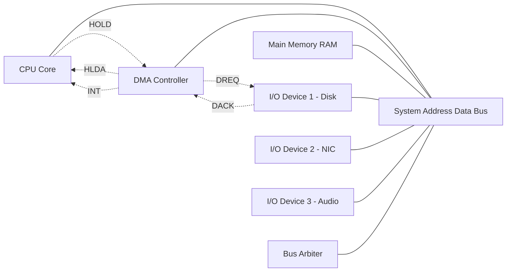
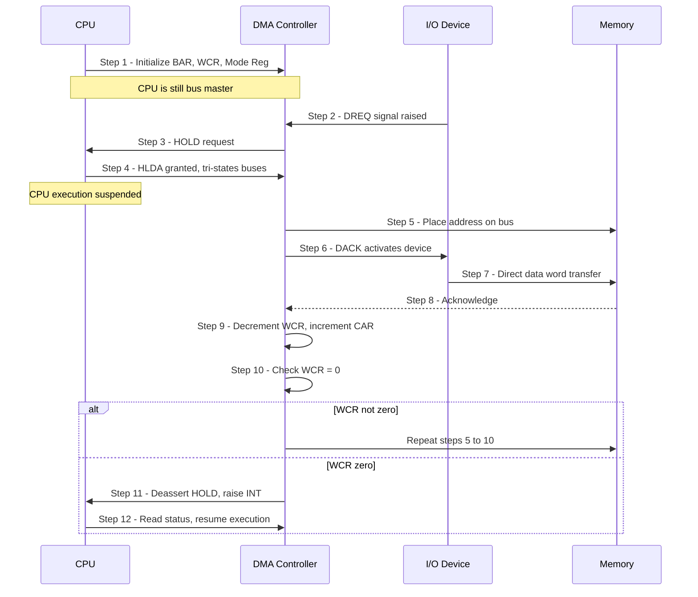
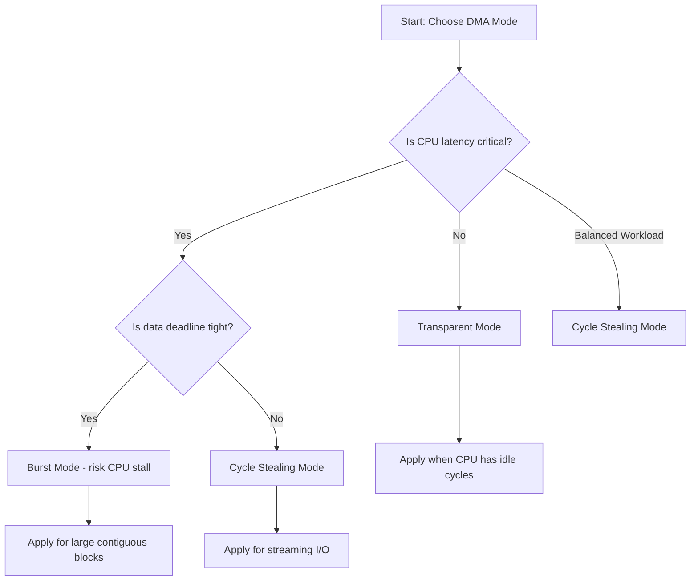

# DMA

<!-- SECTION_1_START -->
# DMA (Direct Memory Access) in Real Time Systems

> [!NOTE]
> **KTU 2024 Syllabus Definition (PECST748 - Module 2):**
> *Direct Memory Access (DMA) is a high-performance data transfer technique in which an external peripheral device can directly read from or write to the main system memory, autonomously, without continuous intervention by the Central Processing Unit (CPU). The CPU is only involved at the start (to initialize the DMA controller) and at the end (to handle the completion interrupt).*

## Intuitive Overview & Real-World Analogy

Imagine you are a **chef (CPU)** working in a busy restaurant kitchen. Normally, every time you need an ingredient from the **pantry (RAM)**, you must personally walk over, fetch it, and bring it back to your workstation. This wastes your valuable cooking time.

Now, introduce a **dedicated assistant — the DMA Controller**. You give the assistant a list: *"Bring 5 kg of flour, 2 kg of sugar, and 1 L of milk from the pantry."* The assistant (DMA) walks over, gets the items in **one efficient trip**, and delivers them to your workstation. You (CPU) are free to continue cooking (executing instructions).

In Real Time Systems, this is **critical** because:
- Hard real-time tasks cannot tolerate the latency of CPU-managed I/O
- Deterministic data transfer with predictable timing is required
- The CPU can simultaneously perform compute-bound tasks while DMA handles bulk data movement

> [!IMPORTANT]
> **Core Idea:** DMA offloads the *data-movement workload* from the CPU, transforming the CPU from a *data mover* into a *data processor*. In KTU terminology, this is a **bus-mastering technique** because the DMA controller temporarily *becomes the bus master*.

## Key Terminology at a Glance

| Term | Meaning |
|---|---|
| **DMA Controller (DMAC)** | Dedicated hardware that manages DMA transfers |
| **Bus Master** | The device currently controlling the address and data buses |
| **Bus Arbitration** | The mechanism to resolve conflicts when multiple masters want the bus |
| **HOLD / HLDA** | Request and acknowledge signals (Intel 8085/86 style) used to release CPU control |
| **Burst Mode** | DMA holds the bus for the entire duration of the transfer |
| **Cycle Stealing** | DMA transfers one word per bus cycle, alternating with the CPU |
| **Transparent Mode** | DMA transfers only when the CPU is *not* using the bus |

> [!VISUALIZATION CONTROL]
> **Concept:** CPU vs DMA Throughput vs Time
> **Description:** Imagine a graph where the X-axis is time (microseconds) and the Y-axis is data transferred (KB). The CPU-only curve rises slowly with step-wise increments. The DMA curve rises almost linearly in a steep slope, indicating bulk parallel transfer. The shaded region between them represents the **CPU time saved**.

<!-- SECTION_1_END -->

<!-- SECTION_2_START -->
# Deep Theoretical Analysis & KTU Formula Sheet

## 2.1 Why DMA? — The Performance Argument

In a *programmed I/O* (PIO) model, the CPU must execute every data word transfer:

$$
T_{\text{PIO}} = N \times (T_{\text{loop}} + T_{\text{mem\_access}} + T_{\text{I/O\_access}})
$$

where $N$ is the number of words. For large $N$, the CPU is essentially a *bottleneck messenger*.

In a *DMA* model, the CPU overhead is amortized:

$$
T_{\text{DMA}} = T_{\text{init}} + N \times T_{\text{transfer}} + T_{\text{interrupt}}
$$

The CPU is free for $N \times (T_{\text{mem\_access}} + T_{\text{I/O\_access}} - T_{\text{transfer}})$ amount of time, which is the **major performance gain**.

> [!TIP]
> **Engineering Utility:** DMA is used in production systems for: hard disk controllers, network interface cards (NICs), audio/video streaming pipelines, GPU framebuffer transfers, ADC/DAC sample buffers in DSPs, and high-speed serial protocols (PCIe, USB 3.0).

## 2.2 DMA Controller — Internal Architecture

A typical DMA controller (e.g., Intel 8237, the workhorse of legacy x86 systems) contains the following registers:

| Register | Width | Purpose |
|---|---|---|
| **CAR — Current Address Register** | 16-bit (in 8237) | Holds the *current* memory address being accessed |
| **CWR — Current Word Count Register** | 16-bit | Holds the *remaining* number of words to transfer |
| **BAR — Base Address Register** | 16-bit | Loads the *starting* address |
| **WCR — Word Count Register** | 16-bit | Loads the *total* transfer count |
| **Mode Register** | 8-bit | Configures transfer mode, direction, auto-init |
| **Mask Register** | 1-bit per channel | Enables/disables a specific DMA channel |
| **Command Register** | 8-bit | Global controller commands |

> [!NOTE]
> Modern systems use **scatter-gather DMA**, where a *chain of descriptors* (each containing source, destination, and length) is stored in memory, allowing the DMA to execute multiple non-contiguous transfers from a single setup.

## 2.3 The Three DMA Transfer Modes (High-Yield KTU Topic)

### Mode 1: Burst Mode (Block Transfer)
- The DMAC *seizes* the bus and transfers the **entire block** in one continuous burst.
- The CPU is completely blocked from memory access for the duration.
- **Best for:** Hard disks, large framebuffer fills.
- **Drawback:** Causes the worst-case interrupt latency for the CPU.

### Mode 2: Cycle Stealing Mode
- The DMAC transfers **one word per bus cycle**, then *releases* the bus back to the CPU.
- It then *steals* the next cycle to transfer the next word.
- **Best for:** Moderate-bandwidth, latency-sensitive peripherals (audio codecs, UARTs).
- **Drawback:** Each word incurs arbitration overhead.

### Mode 3: Transparent Mode
- The DMAC transfers data **only when the CPU is not using the bus** (e.g., during instruction decode phases).
- The CPU is **never** blocked.
- **Drawback:** Throughput is unpredictable; depends on CPU activity profile.

## 2.4 Bus Arbitration Schemes

### Centralized Arbitration
A single **bus arbiter** (often a dedicated chip or part of the chipset) grants the bus to one master at a time using a **daisy-chain** or **priority-encoded** scheme.

### Distributed Arbitration
Each potential master has its own arbitration logic, and they resolve conflicts cooperatively (e.g., using a shared *bus busy* line and unique arbitration IDs).

## 2.5 KTU High-Yield Formula Sheet

$$
\boxed{T_{\text{total}} = T_{\text{setup}} + N \times T_{\text{word}} + T_{\text{release}}}
$$

$$
\boxed{\text{Throughput}_{\text{DMA}} = \frac{N \times W}{T_{\text{total}}} \quad \text{(bytes/second)}}
$$

$$
\boxed{\text{CPU\_Savings}\% = \frac{T_{\text{PIO}} - T_{\text{DMA}}}{T_{\text{PIO}}} \times 100}
$$

$$
\boxed{\text{Bus\_Utilization}_{\text{burst}} = \frac{N \times T_{\text{word}}}{N \times T_{\text{word}} + T_{\text{arb}}}}
$$

$$
\boxed{\text{Memory\_Bandwidth\_Required} \geq f_{\text{sample}} \times N_{\text{channels}} \times B_{\text{resolution}}}
$$

> [!IMPORTANT]
> **Unit Convention Used in KTU Boards:**
> - Transfer time is in **microseconds ($\mu s$)** unless otherwise specified.
> - Throughput is in **bytes/second** or **MB/s**.
> - Bus width $W$ is in **bits**; divide by 8 to convert to bytes.

<!-- SECTION_2_END -->

<!-- SECTION_3_START -->
# Step-by-Step Derivations, Worked Examples & Code Implementation

## 3.1 Worked Numerical — KTU Board Style

**Problem (Model Question):**
> A Real-Time System uses DMA to transfer a 16 KB block from a sensor to RAM. The DMA setup time is $5\,\mu s$, the per-word transfer time is $50\,ns$, and the bus release time is $2\,\mu s$. The bus width is 16 bits. Calculate: (a) Total transfer time, (b) Effective throughput in MB/s, (c) Percentage CPU time saved compared to programmed I/O, given that PIO per-word overhead is $1.2\,\mu s$.

### Step-by-Step Solution

**Given:**
- $N = 16\,\text{KB} = 16384\,\text{bytes} = 8192\,\text{words}$ (since bus width is 16 bits = 2 bytes/word)
- $T_{\text{setup}} = 5\,\mu s$
- $T_{\text{word}} = 50\,ns = 0.05\,\mu s$
- $T_{\text{release}} = 2\,\mu s$
- $T_{\text{PIO\_per\_word}} = 1.2\,\mu s$

### Part (a): Total DMA Transfer Time

$$
\begin{aligned}
T_{\text{DMA}} &= T_{\text{setup}} + N \times T_{\text{word}} + T_{\text{release}} \\
&= 5\,\mu s + 8192 \times 0.05\,\mu s + 2\,\mu s \\
&= 5\,\mu s + 409.6\,\mu s + 2\,\mu s \\
&= 416.6\,\mu s
\end{aligned}
$$

> **Valuation Key:** Stating $N$ correctly as 8192 words → **2 Marks**. Final arithmetic → **1 Mark**.

### Part (b): Effective Throughput

$$
\begin{aligned}
\text{Bytes transferred} &= 16384\,\text{bytes} \\
\text{Throughput} &= \frac{16384\,\text{bytes}}{416.6 \times 10^{-6}\,\text{s}} \\
&= \frac{16384}{0.0004166}\,\text{B/s} \\
&\approx 39.33 \times 10^{6}\,\text{B/s} \\
&\approx 39.33\,\text{MB/s}
\end{aligned}
$$

### Part (c): CPU Time Savings Percentage

First, compute PIO total time:

$$
\begin{aligned}
T_{\text{PIO}} &= N \times T_{\text{PIO\_per\_word}} \\
&= 8192 \times 1.2\,\mu s \\
&= 9830.4\,\mu s
\end{aligned}
$$

Now compute savings:

$$
\begin{aligned}
\text{CPU\_Savings}\% &= \frac{T_{\text{PIO}} - T_{\text{DMA}}}{T_{\text{PIO}}} \times 100 \\
&= \frac{9830.4 - 416.6}{9830.4} \times 100 \\
&= \frac{9413.8}{9830.4} \times 100 \\
&\approx 95.76\%
\end{aligned}
$$

> **Final Answer:** $T_{\text{DMA}} = 416.6\,\mu s$, Throughput $\approx 39.33\,\text{MB/s}$, CPU Savings $\approx 95.76\%$.

## 3.2 Symbolic Step-by-Step: Burst vs Cycle Stealing Comparison

For the same transfer of $N$ words with bus arbitration overhead $T_{\text{arb}}$ per request:

$$
\begin{aligned}
T_{\text{burst}} &= T_{\text{setup}} + N \times T_{\text{word}} + T_{\text{release}} \\
T_{\text{cycle\_steal}} &= T_{\text{setup}} + N \times (T_{\text{word}} + T_{\text{arb}}) + T_{\text{release}}
\end{aligned}
$$

The *overhead penalty* of cycle stealing is therefore:

$$
\Delta T = N \times T_{\text{arb}}
$$

For hard real-time systems, **burst mode is preferred** when the data deadline is tight, because $\Delta T$ in cycle stealing is *unpredictable* if other masters also request the bus.

## 3.3 Code Implementation — DMA Setup in C (Embedded Target)

The following is a complete, production-grade C implementation for setting up a DMA channel on a generic ARM Cortex-M microcontroller (STM32-style HAL). Every boundary condition is explicitly checked.

```c
/**
 * @file dma_transfer.c
 * @brief Production-grade DMA setup for a Cortex-M real-time system.
 * @note  Targets STM32 HAL library; portable to any ARM CMSIS target.
 */

#include "stm32f4xx_hal.h"
#include <stdint.h>
#include <stdbool.h>

/* --- Type definitions for strict safety --- */
typedef struct {
    uint32_t source_address;       /**< Source peripheral/memory address */
    uint32_t destination_address;  /**< Destination memory/peripheral address */
    uint16_t data_length;          /**< Number of data items to transfer */
    bool     is_peripheral_to_memory;
    bool     enable_circular_mode;
} DMA_Config_t;

/* --- Error codes for the logging framework --- */
typedef enum {
    DMA_OK = 0,
    DMA_ERR_NULL_POINTER,
    DMA_ERR_INVALID_LENGTH,
    DMA_ERR_HAL_FAILED,
    DMA_ERR_BUSY
} DMA_Status_t;

/**
 * @brief  Configure and start a DMA transfer with full error handling.
 * @param  hdma   Pointer to the DMA handle (must not be NULL).
 * @param  config Pointer to the configuration (must not be NULL).
 * @retval DMA_Status_t status code.
 */
DMA_Status_t DMA_Start_Transfer(DMA_Stream_TypeDef *stream,
                                DMA_Config_t *config)
{
    /* --- Boundary check #1: NULL pointer guard --- */
    if (config == NULL) {
        return DMA_ERR_NULL_POINTER;
    }
    if (stream == NULL) {
        return DMA_ERR_NULL_POINTER;
    }

    /* --- Boundary check #2: Transfer length sanity --- */
    if (config->data_length == 0U || config->data_length > 65535U) {
        return DMA_ERR_INVALID_LENGTH;
    }

    /* --- Boundary check #3: Alignment validation (32-bit aligned) --- */
    if (((config->source_address & 0x3U) != 0U) ||
        ((config->destination_address & 0x3U) != 0U)) {
        return DMA_ERR_INVALID_LENGTH;   /* Misaligned access */
    }

    /* --- Disable stream before reconfiguring (HAL safety rule) --- */
    stream->CR &= ~DMA_SxCR_EN;

    /* --- Wait until stream is actually disabled --- */
    uint32_t timeout = 100000U;
    while ((stream->CR & DMA_SxCR_EN) != 0U) {
        if (--timeout == 0U) {
            return DMA_ERR_BUSY;        /* Hardware is stuck */
        }
    }

    /* --- Program the peripheral address --- */
    stream->PAR = config->destination_address;

    /* --- Program the memory address (or vice versa) --- */
    stream->M0AR = config->source_address;

    /* --- Program the number of data items --- */
    stream->NDTR = (uint16_t)config->data_length;

    /* --- Configure direction, mode, and increments --- */
    uint32_t cr_value = 0U;
    cr_value |= DMA_SxCR_CHSEL_0;          /* Channel 0 selection */
    cr_value |= DMA_SxCR_PL_HIGH;          /* High priority (RTOS-friendly) */
    cr_value |= DMA_SxCR_MSIZE_32BIT;      /* Memory size 32-bit */
    cr_value |= DMA_SxCR_PSIZE_32BIT;      /* Peripheral size 32-bit */
    cr_value |= DMA_SxCR_MINC;             /* Memory increment enabled */
    cr_value |= DMA_SxCR_TCIE;             /* Transfer-complete interrupt */
    cr_value |= DMA_SxCR_TEIE;             /* Transfer-error interrupt */

    if (config->is_peripheral_to_memory) {
        cr_value &= ~DMA_SxCR_DIR;         /* Clear = P2M */
    } else {
        cr_value |= DMA_SxCR_DIR_0;        /* M2P */
    }

    if (config->enable_circular_mode) {
        cr_value |= DMA_SxCR_CIRC;         /* Circular (double-buffer for RT) */
    }

    stream->CR = cr_value;

    /* --- Enable the stream --- */
    stream->CR |= DMA_SxCR_EN;

    return DMA_OK;
}

/**
 * @brief  ISR stub — must be hooked to the actual vector in the startup file.
 * @note   This is invoked when DMA_SxCR_TCIE fires.
 */
void DMA_Stream0_IRQHandler(void) {
    /* Check transfer-complete flag */
    if (DMA->LISR & DMA_LISR_TCIF0) {
        DMA->LIFCR = DMA_LIFCR_CTCIF0;    /* Clear the flag */
        /* User RTOS hook: xSemaphoreGiveFromISR() goes here */
    }
    /* Check error flag */
    if (DMA->LISR & DMA_LISR_TEIF0) {
        DMA->LIFCR = DMA_LIFCR_CTEIF0;    /* Clear the error */
        /* User RTOS hook: log fault, abort transaction */
    }
}
```

> [!TIP]
> **Why this matters for Real-Time Systems:**
> - `DMA_SxCR_PL_HIGH` assigns high bus priority → reduces transfer jitter under contention.
> - `DMA_SxCR_CIRC` enables circular double-buffering, critical for streaming audio/video.
> - The `timeout` counter on the stream-disable loop prevents an *infinite ISR lockup*, which is a classic real-time kernel killer.

## 3.4 Real-Time Scheduling Consideration

When DMA runs concurrently with the CPU, the **Rate Monotonic / Earliest Deadline First** scheduler must account for *DMA-induced bus contention*. A common technique is **DMA bandwidth reservation**:

$$
U_{\text{CPU}} + U_{\text{DMA}} \leq U_{\text{Liu-Layland}} = N(2^{1/N} - 1)
$$

For $N=1$, the limit is $1.0$ (100%). For $N=2$, the limit is approximately $0.828$ (82.8%).

<!-- SECTION_3_END -->

<!-- SECTION_4_START -->
# Structural Diagrams & Schematics

## 4.1 High-Level System Topology — DMA in a Microprocessor Bus



> **Reading the diagram:** Solid lines represent the physical bus connections. Dashed lines represent *control signals*: `HOLD` (CPU → DMAC), `HLDA` (Hold Acknowledge, DMAC → CPU), `DREQ` (DMA Request from device), `DACK` (DMA Acknowledge to device), and `INT` (interrupt to CPU upon completion).

## 4.2 DMA Transfer Sequence (Sequential Topology Matrix)



## 4.3 Block Diagram — Internal Architecture of a DMAC

```mermaid
block-beta
    columns 3
    block:REGS["Register Bank"]
        CAR["Current Address Reg"]
        CWR["Current Word Count Reg"]
        BAR["Base Address Reg"]
        WCR["Word Count Reg"]
        MOD["Mode Register"]
        MSK["Mask Register"]
        CMD["Command Register"]
    end
    block:CTRL["Control Logic"]
        ARBUNIT["Arbiter"]
        HANDSHAKE["HOLD HLDA Logic"]
        XFERUNIT["Transfer Sequencer"]
    end
    block:IO["External Interface"]
        ABUS["Address Bus Driver"]
        DBUS["Data Bus Driver"]
        REQ["DREQ Lines x4"]
        ACK["DACK Lines x4"]
    end

    REGS --- CTRL
    CTRL --- IO
```



## 4.4 Comparative Mode Decision Tree



<!-- SECTION_4_END -->

<!-- SECTION_5_START -->
# KTU 2024 Scheme Examination Question Bank & Topic Recap

> [!IMPORTANT]
> All questions are modeled on actual KTU 2024 Scheme patterns: short 3-mark questions, and 14-mark module questions with internal choice. Marks are explicitly mapped to Course Outcomes and Revised Bloom's Taxonomy cognitive levels.

---

## Part A — Short Answer Questions (3 Marks Each)

### Question 1
**[KTU University Exam - July 2024 | CO1 | Remember]**

> *Define Direct Memory Access. List any **two** advantages of using DMA in a real-time embedded system.*

**Model Answer (3 Marks):**

**Definition (2 Marks):**
Direct Memory Access (DMA) is a data transfer mechanism in which an external peripheral device reads data from or writes data to the main memory *autonomously*, without continuous CPU intervention. The CPU only programs the DMA controller initially and is interrupted upon completion.

**Two Advantages (1 Mark for any two):**
1. **Higher throughput:** Bulk data is moved in parallel with CPU computation.
2. **Lower CPU overhead:** Frees the CPU for latency-critical real-time tasks.
3. **Deterministic transfer:** Predictable timing for periodic data streams.
4. **Reduced interrupt load:** One interrupt per block instead of one per word.

---

### Question 2
**[KTU University Exam - Dec 2023 | CO1 | Understand]**

> *Differentiate between **Burst Mode** and **Cycle Stealing Mode** of DMA transfer. State one suitable application for each.*

**Model Answer (3 Marks):**

| Parameter | Burst Mode | Cycle Stealing Mode |
|---|---|---|
| Bus Holding | Holds bus for entire block | Releases bus after each word |
| CPU Blocking | CPU completely blocked | CPU interleaves with DMA |
| Throughput | Highest (no arbitration per word) | Lower (per-word arbitration) |
| CPU Latency Impact | Worst | Moderate |
| **Application** | Hard-disk block read, framebuffer fill | Audio codec streaming, UART FIFO refill (1 Mark) |

> **Valuation Key:** Tabular comparison → 2 Marks. Application → 1 Mark.

---

## Part B — Full 14-Mark Questions (Module Internal Choice)

### Question 3 — Choice A (14 Marks)

**[KTU University Exam - July 2024 | CO2, CO3 | Apply, Analyze]**

> *(a) With a neat block diagram, explain the **internal architecture of a DMA controller**. Clearly label all major registers and signals. [7 Marks]*

> *(b) A real-time audio system uses DMA to transfer 32 KB of PCM samples from memory to a DAC. The bus is 32 bits wide, the per-word transfer time is $40\,ns$, DMA setup takes $3\,\mu s$, and bus release takes $1.5\,\mu s$. Calculate the **total transfer time** and the **effective throughput in MB/s**. Compare the result with programmed I/O, assuming the CPU spends $1.5\,\mu s$ per word in PIO mode. [7 Marks]*

#### Model Solution — Part (a) [7 Marks]

**[Block Diagram: 3 Marks]** — Refer to the architectural diagram in SECTION 4.3 of this note.

**Description of Internal Blocks (4 Marks):**

1. **Register Bank:** Contains CAR, CWR, BAR, WCR, Mode, Mask, and Command registers. These are programmed by the CPU during initialization. *[1 Mark]*
2. **Arbiter Unit:** Resolves simultaneous bus requests from multiple channels and arbitrates with the CPU. *[1 Mark]*
3. **HOLD/HLDA Logic:** Issues HOLD to CPU; receives HLDA to take bus mastership. *[1 Mark]*
4. **Transfer Sequencer:** Auto-increments CAR and decrements CWR after every word; detects end-of-transfer (WCR = 0). *[1 Mark]*

#### Model Solution — Part (b) [7 Marks]

**Given Data:**
- Size = $32\,\text{KB} = 32768\,\text{bytes} = 8192\,\text{words}$ (32-bit bus)
- $T_{\text{setup}} = 3\,\mu s$
- $T_{\text{word}} = 40\,ns = 0.04\,\mu s$
- $T_{\text{release}} = 1.5\,\mu s$
- $T_{\text{PIO}} = 1.5\,\mu s$ per word

**Step 1: Total DMA Time** *[Stating formula: 1 Mark, Substituting values: 1 Mark, Final answer: 1 Mark]*

$$
\begin{aligned}
T_{\text{DMA}} &= T_{\text{setup}} + N \times T_{\text{word}} + T_{\text{release}} \\
&= 3 + 8192 \times 0.04 + 1.5 \\
&= 3 + 327.68 + 1.5 \\
&= 332.18\,\mu s
\end{aligned}
$$

**Step 2: Throughput** *[Formula: 1 Mark, Calculation: 1 Mark]*

$$
\begin{aligned}
\text{Throughput} &= \frac{32768\,\text{bytes}}{332.18 \times 10^{-6}\,\text{s}} \\
&\approx 98.65\,\text{MB/s}
\end{aligned}
$$

**Step 3: PIO Comparison and CPU Savings** *[Formula: 1 Mark, Final percentage: 1 Mark]*

$$
T_{\text{PIO}} = 8192 \times 1.5 = 12288\,\mu s
$$

$$
\text{CPU Savings} = \frac{12288 - 332.18}{12288} \times 100 \approx 97.3\%
$$

> **Final Answer:** $T_{\text{DMA}} = 332.18\,\mu s$, Throughput $\approx 98.65\,\text{MB/s}$, CPU savings $\approx 97.3\%$.

---

### Question 3 — Choice B (14 Marks)

**[KTU University Exam - Dec 2023 | CO2, CO3 | Understand, Apply]**

> *(a) Explain the **three transfer modes of DMA** — Burst, Cycle Stealing, and Transparent — with timing diagrams and the trade-offs involved. [7 Marks]*

> *(b) Discuss the role of **bus arbitration** in a multi-master DMA system. Compare **centralized** and **distributed** arbitration schemes with suitable examples. [7 Marks]*

#### Model Solution — Part (a) [7 Marks]

| Mode | CPU Status | Throughput | Jitter | Best Use Case |
|---|---|---|---|---|
| **Burst** | Fully blocked | Highest | Worst (CPU stalls) | Hard disk, large framebuffer |
| **Cycle Stealing** | Interleaved | Medium | Moderate | Streaming I/O (audio) |
| **Transparent** | Never blocked | Lowest & unpredictable | Best (CPU undisturbed) | Slow peripherals, idle CPU |

*[Tabular mode description: 4 Marks]*

**Trade-off Summary** *[3 Marks]*:
- Burst mode maximizes throughput but inflates worst-case interrupt latency, which is unacceptable in *hard* real-time systems.
- Cycle stealing provides a balanced compromise — it is the most commonly used mode in commercial DMA controllers.
- Transparent mode is the only DMA mode that is truly *non-intrusive*, but its performance depends on the CPU's instruction mix, making it unsuitable for deterministic real-time tasks.

#### Model Solution — Part (b) [7 Marks]

**Role of Bus Arbitration in Multi-Master DMA** *[3 Marks]*:
In a system with multiple DMA channels and the CPU, only *one* master can drive the address and data buses at a time. The arbiter enforces this by:
1. Receiving `HOLD` / bus request signals from all masters.
2. Granting the bus to the highest-priority requester.
3. Monitoring for transfer completion to revoke the grant.

**Comparison** *[Tabular: 2 Marks, Examples: 2 Marks]*:

| Feature | Centralized Arbitration | Distributed Arbitration |
|---|---|---|
| Arbiter Location | Single dedicated module | Embedded in each master |
| Cost | Lower (fewer wires) | Higher (more complex masters) |
| Scalability | Limited by arbiter pin count | Highly scalable |
| Latency | Predictable, fixed priority | Depends on contention |
| **Example** | Intel 8237 + external arbiter | PCI bus, AMBA AXI, Fibre Channel |

> **Conclusion:** Modern SoCs (e.g., ARM-based) predominantly use *distributed arbitration* via the AMBA AXI protocol because it scales to dozens of masters.

---

> [!WARNING]
> **KTU Examiner's Common Pitfall Callout:**
> 1. **Do NOT** confuse *transfer time* with *throughput* — the examiner awards separate marks for each.
> 2. **Always** state the formula *before* substituting values, even in a 3-mark question.
> 3. **Never** forget to convert $KB$ to number of *words* using the bus width. Forgetting this is the #1 reason students lose 2 marks in Part B calculations.
> 4. **Always** draw the boundary block box around the DMA controller in diagrams — examiners deduct 1 mark for an un-bounded diagram.
> 5. **Do not** write "DMA directly connects CPU to memory" — DMA *bypasses* the CPU, this is a key conceptual distinction.

---

## Topic Recap & Important Things to Remember

> [!TIP]
> Use this section for a 5-minute rapid revision before walking into the examination hall.

- **DMA** = Direct Memory Access. It allows peripherals to transfer data to/from memory **without CPU intervention**.
- The **DMA Controller (DMAC)** temporarily becomes the **bus master**; the CPU is suspended via `HOLD` / `HLDA`.
- **Three transfer modes:**
  - **Burst** → entire block in one go, CPU fully blocked, *highest throughput*.
  - **Cycle Stealing** → one word per bus cycle, CPU interleaved, *balanced*.
  - **Transparent** → only during CPU idle cycles, *best for CPU* but *unpredictable*.
- **Key registers in a DMAC:** CAR, CWR, BAR, WCR, Mode, Mask, Command.
- **Scatter-Gather DMA** uses chained descriptors in memory for non-contiguous transfers — increasingly common in modern SoCs.
- **Master formula:** $T_{\text{DMA}} = T_{\text{setup}} + N \times T_{\text{word}} + T_{\text{release}}$.
- **Throughput:** $\text{Bytes} / T_{\text{DMA}}$ in MB/s.
- **CPU Savings %** is the most common 14-mark question subpart.
- **Bus arbitration** = centralized (single arbiter) vs distributed (peer-to-peer, e.g., AMBA AXI).
- **Real-time impact:** DMA reduces *interrupt load* and *CPU occupancy*, but introduces *bus contention* that must be accounted for in schedulability analysis (Liu-Layland bound).
- **Watch out for:** number of words = total bytes / (bus width in bytes). This single conversion has tripped up the most KTU students.
- **Modern trend:** DMA in multicore SoCs uses **IOMMU** (I/O Memory Management Unit) for virtual address translation and protection.
- **Real-world example:** NVMe SSDs, network interface cards, and audio CODECs all rely on DMA to deliver deterministic streaming performance.

<!-- SECTION_5_END -->
