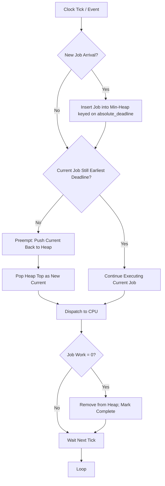
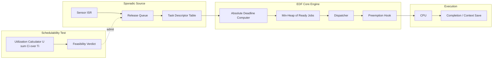
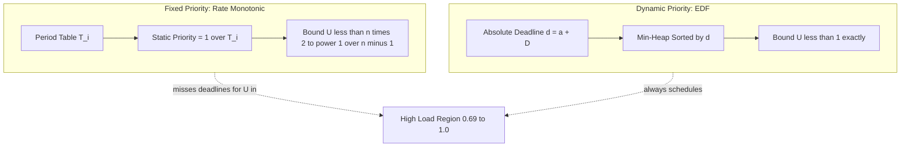
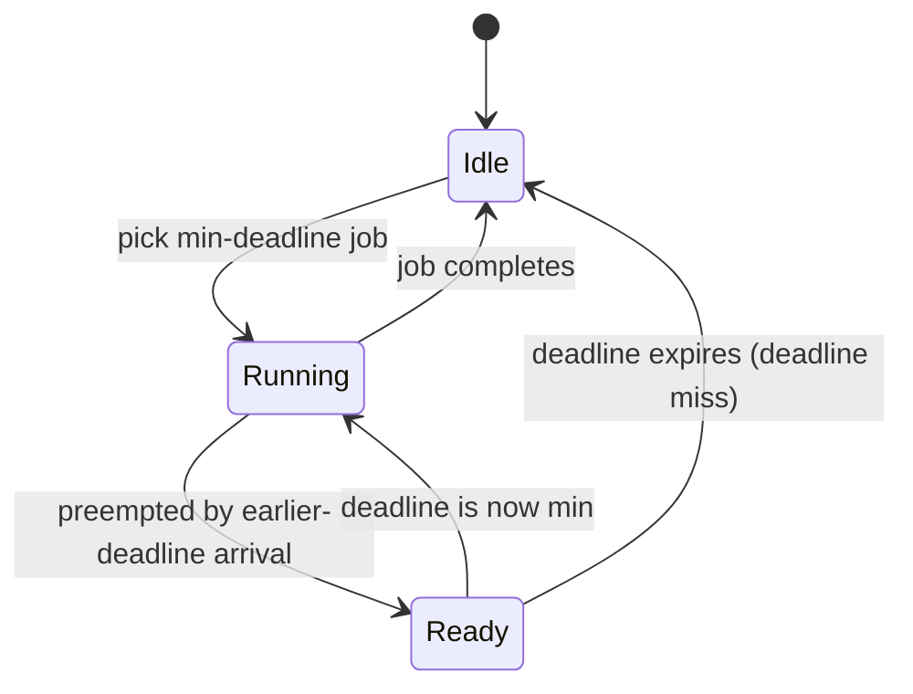

# EDF Scheduling

<!-- SECTION_1_START -->

# Earliest Deadline First (EDF) Scheduling

> [!IMPORTANT]
> **KTU 2024 Scheme | PECST748 | Module 2 | Real-Time CPU Scheduling**
> **Concept Anchor:** Dynamic, priority-driven, optimal uniprocessor scheduling policy for real-time task systems.

## 1.1 Formal Academic Definition

**Earliest Deadline First (EDF)** is a **dynamic-priority**, **preemptive** scheduling algorithm in which, at every scheduling decision instant, the scheduler selects for execution the **ready task whose absolute deadline is the nearest in the future**. Absolute deadlines are computed at run-time as $d_i = a_i + D_i$, where $a_i$ is the arrival time and $D_i$ the relative deadline of task $i$. Because the priority is *not* fixed at design time but is recomputed continuously from the current set of pending deadlines, EDF is classified as a *dynamic* scheduling policy.

For a set $\mathcal{T} = \{\tau_1, \tau_2, \dots, \tau_n\}$ of **independent**, **preemptable** periodic or sporadic tasks executing on a **single processor**, the following classical optimality result holds (Dertouzos, 1974):

> **Theorem (EDF Optimality):** *If a feasible schedule exists for a set of independent, preemptable jobs on a single processor, then EDF also produces a feasible schedule.*

> [!NOTE]
> **Why this matters for KTU:** EDF is the *only* scheduler you need to remember for optimality on a uniprocessor. RMS (Rate Monotonic) is optimal *only* among fixed-priority schemes. This distinction is a guaranteed Part-A question.

## 1.2 Conceptual Analogy & Intuition

Imagine you are the **triage nurse in a busy hospital emergency ward**. Several patients are waiting simultaneously. You do *not* follow the order in which they arrived (that would be **FIFO**). You also do *not* always treat the most severely bleeding patient first (that would be a fixed-priority rule). Instead, you continually glance at each patient's chart and ask: *"Who is closest to a critical deadline — the moment when their condition will become irreversible?"* You send that patient in first. If a new patient arrives with an even more urgent deadline, you interrupt the current one.

That is exactly what EDF does with CPU time:

- **CPU** $\longrightarrow$ The single treatment room.
- **Task** $\longrightarrow$ A patient needing attention.
- **Absolute deadline** $\longrightarrow$ The "point of no return" for that patient.
- **Preemption** $\longrightarrow$ The doctor stepping out of one room to handle a more urgent case.

The intuition is profound: **urgency is a moving target**, so the scheduling rule must also move.

> [!TIP]
> **Geometric Intuition:** Plot the **ready queue** on the $x$-axis as a sequence of jobs ordered by their absolute deadline $d_i$. The scheduler always picks the *left-most* job (the smallest $d_i$). As time advances, the queue is re-sorted continuously.

> [!VISUALIZATION CONTROL]
> **Concept:** Priority ordering under EDF as a function of time.
> **GeoGebra / Desmos Input Equations:**
> * `d1(t) = 0.5 + 3*floor(t/3)` (deadline of task 1, period 3)
> * `d2(t) = 0.4 + 5*floor(t/5)` (deadline of task 2, period 5)
> * `d3(t) = 0.3 + 8*floor(t/8)` (deadline of task 3, period 8)
> **Visual Description:** Plot the three step-functions on the same axes. The scheduler trace will always sit under the *minimum* of the three at every instant — illustrating the "earliest deadline wins" rule.

## 1.3 Standard Metrics Used in EDF Analysis

| Metric | Symbol | Unit | Meaning |
| :--- | :---: | :---: | :--- |
| Worst-case execution time | $C_i$ | time units | Maximum CPU time a single job of $\tau_i$ may consume. |
| Period (or minimum inter-arrival) | $T_i$ | time units | Release interval of periodic/sporadic task $\tau_i$. |
| Relative deadline | $D_i$ | time units | Time from release to absolute deadline. |
| Absolute deadline | $d_i$ | time units | $d_i = a_i + D_i$. |
| Processor utilization | $U$ | dimensionless | $\sum_i C_i / T_i$ |
| Hyperperiod | $H$ | time units | $\mathrm{lcm}(T_1, T_2, \dots, T_n)$ |

For **constrained deadline** tasks, $D_i \le T_i$. The KTU 2024 PECST748 syllabus assumes this condition unless stated otherwise.

<!-- SECTION_1_END -->

<!-- SECTION_2_START -->

# Deep Theoretical Analysis & KTU High-Yield Formula Sheet

## 2.1 The Scheduling Decision Loop

The EDF scheduler can be described as a 3-step loop executed at every clock tick or event (arrival, completion, deadline expiry):

1. **Identify the ready set** $\mathcal{R}(t)$ — all jobs with release time $\le t$ and unfinished work remaining.
2. **Compute the minimum absolute deadline** $d^{\star}(t) = \min \{ d_j \mid j \in \mathcal{R}(t) \}$.
3. **Dispatch the job $j^{\star}$** that owns $d^{\star}(t)$. If a running job's deadline is no longer the earliest, **preempt** it.

> [!NOTE]
> **Time complexity:** A naïve implementation re-scanning all tasks costs $O(n)$ per event, giving $O(n \cdot N_{events})$. A **priority queue** keyed on $d_i$ yields $O(\log n)$ per insertion/deletion — the production choice in VxWorks, FreeRTOS-plus, and Linux SCHED_DEADLINE.

## 2.2 KTU Formula Sheet / Cheat Sheet

| # | Result | Condition | Use in KTU |
| :---: | :--- | :--- | :--- |
| 1 | $U = \sum_{i=1}^{n} \dfrac{C_i}{T_i}$ | All tasks independent, preemptive | Define processor load. |
| 2 | $U \le 1$ (necessary *and* sufficient) | EDF on uniprocessor, preemptive, no shared resources | **Schedulability test** (Liu \& Layland bound, sharp). |
| 3 | $\text{lcm}(T_1,\dots,T_n)$ | Periodic task set | **Hyperperiod** for simulation/examination. |
| 4 | Processor demand $g(t) = \sum_{i=1}^{n} \left\lceil \dfrac{t}{T_i} \right\rceil C_i$ | Sporadic/periodic, $D_i \le T_i$ | Time-demand schedulability test. |
| 5 | Schedulable if $\exists\, t \in [0,\, L] : g(t) \le t$ | Where $L$ is the largest deadline | Baruah, Howell \& Rosier test. |
| 6 | $U_{RMS}^{UB}(n) = n(2^{1/n}-1)$ | Fixed-priority RMS comparison | Show EDF accepts more load than RMS. |
| 7 | Optimality on multiprocessor $\Rightarrow$ **fails** | $m \ge 2$ | Triggers DAG scheduling, pfair, LLF. |
| 8 | $f^{\star}(t) = \sum_{i=1}^{n} U_i$ | Asymptotic fraction of time on CPU | Long-run average behaviour. |

> [!IMPORTANT]
> **Mnemonic:** "**E**DF is **E**asy: sum up $C/T$, check the sum is $\le 1$, you are done." This single line of reasoning is worth a full 7-mark KTU question.

## 2.3 Why EDF is *Better* than Fixed Priority (RMS / DMS)

- **RMS** assigns a fixed priority inversely proportional to period. Its worst-case utilization bound saturates at $\ln 2 \approx 0.693$ as $n \to \infty$.
- **EDF** achieves the *maximum possible* utilization of $1$ on a uniprocessor (ignoring context-switch cost).
- Therefore, for the *same* task set, **EDF can schedule loads that RMS cannot**, while RMS may still schedule loads that EDF cannot on a multiprocessor (a subtle point that examiners love).

> [!TIP]
> **Production relevance:** Linux's `SCHED_DEADLINE` (since kernel 3.14) implements EDF with CBS (Constant Bandwidth Server). Embedded RTOS such as **RTEMS**, **RTX**, and **VxWorks** (in POSIX mode) all expose EDF-style APIs. Aerospace (DO-178C) and automotive (AUTOSAR OS 4.x — `ScheduleTable` extension) certify EDF variants for safety-critical control.

## 2.4 Failure Modes & "EDF is not always enough"

| Scenario | What breaks | Remedy |
| :--- | :--- | :--- |
| Multiprocessor with $U > m \cdot (m/(2m-1))$ | Dhall effect: low-utilization tasks can miss deadlines | Use pfair / LLF / federated scheduling. |
| Shared resources, priority inheritance off | Unbounded priority inversion | Apply **PIP**, **PCP**, or **SRP**. |
| Non-preemptable sections | Schedulability bound drops | Server-based execution-time enforcement. |
| Unknown $C_i$ (cache effects, pipelines) | Utilisation $U$ is mis-estimated | Measurement-based schedulability (Lu, Tsai, etc.). |

<!-- SECTION_2_END -->

<!-- SECTION_3_START -->

# Step-by-Step Derivations, Worked Examples & Code Implementation

## 3.1 Derivation of the Liu \& Layland Utilization Bound for EDF

> **Goal:** Prove that on a single processor, if $U \le 1$, then any independent, preemptable, periodic task set can be scheduled by EDF.

**Setup.** Consider task set $\mathcal{T} = \{\tau_1, \dots, \tau_n\}$ with $C_i, T_i, D_i = T_i$. Let $U = \sum_i C_i/T_i$.

We use **contradiction**. Suppose EDF misses a deadline at time $t_d$, the *first* missed deadline. Let the offending job be $J_k$ of task $\tau_k$, released at $a_k = t_d - T_k$ (or earlier within the hyperperiod).

Since $J_k$ misses its deadline, the cumulative execution completed for *all* jobs of every task $\tau_i$ whose release times fall in the busy interval $[a_k, t_d]$ must be strictly greater than the interval length:

$$
\sum_{i=1}^{n} \left\lceil \frac{t_d - a_k}{T_i} \right\rceil C_i > t_d - a_k
$$

Note that $t_d - a_k \le T_k \le t_d$. Now consider any task $\tau_i$ such that $T_i \le t_d - a_k$. Then $\lceil (t_d-a_k)/T_i \rceil \ge (t_d-a_k)/T_i$, hence:

$$
\sum_{i : T_i \le t_d - a_k} \frac{C_i}{T_i} \cdot (t_d - a_k) \le \sum_{i : T_i \le t_d - a_k} \left\lceil \frac{t_d-a_k}{T_i} \right\rceil C_i
$$

Adding non-negative contributions from tasks with $T_i > t_d - a_k$:

$$
U \cdot (t_d - a_k) < \sum_{i=1}^{n} \left\lceil \frac{t_d-a_k}{T_i} \right\rceil C_i
$$

Combined with the deadline-miss inequality:

$$
U \cdot (t_d - a_k) < t_d - a_k
$$

Dividing by the positive scalar $t_d - a_k$:

$$
U < 1
$$

Contradiction. Hence a deadline miss implies $U > 1$, completing the proof. $\blacksquare$

## 3.2 Worked Example — Timeline of an EDF Schedule

**Task set:**

| Task | $C_i$ | $T_i$ | $D_i$ |
| :---: | :---: | :---: | :---: |
| $\tau_1$ | 1 | 4 | 4 |
| $\tau_2$ | 2 | 6 | 6 |
| $\tau_3$ | 1 | 8 | 8 |

**Step 1 — Compute the hyperperiod.**
$H = \mathrm{lcm}(4, 6, 8) = 24$.

**Step 2 — Compute utilization.**
$U = 1/4 + 2/6 + 1/8 = 0.250 + 0.333 + 0.125 = 0.708 \le 1$. **Schedulable.**

**Step 3 — Build the job table for the first hyperperiod.**

| $i$ | Release $a$ | Deadline $d=a+T_i$ |
| :---: | :---: | :---: |
| $J_{1,1}$ | 0 | 4 |
| $J_{2,1}$ | 0 | 6 |
| $J_{1,2}$ | 4 | 8 |
| $J_{3,1}$ | 0 | 8 |
| $J_{2,2}$ | 6 | 12 |
| $J_{1,3}$ | 8 | 12 |
| $J_{2,3}$ | 12 | 18 |
| $J_{1,4}$ | 12 | 16 |
| $J_{3,2}$ | 8 | 16 |
| $J_{1,5}$ | 16 | 20 |
| $J_{2,4}$ | 18 | 24 |
| $J_{1,6}$ | 20 | 24 |
| $J_{3,3}$ | 16 | 24 |

**Step 4 — Trace EDF decisions.**

| Interval | Ready jobs (deadline) | Earliest | Chosen | Reason |
| :---: | :--- | :---: | :---: | :--- |
| $[0,1)$ | $J_{1,1}(4),\ J_{2,1}(6),\ J_{3,1}(8)$ | 4 | $\tau_1$ | Earliest $d=4$ |
| $[1,3)$ | $J_{1,1},\ J_{2,1},\ J_{3,1}$ | 6 | $\tau_2$ | $J_{1,1}$ done; $J_{2,1}$ now earliest |
| $[3,4)$ | $J_{2,1}(6),\ J_{3,1}(8)$ | 6 | $\tau_2$ | $\tau_2$ still earliest |
| $[4,5)$ | $J_{1,2}(8),\ J_{2,1}(6),\ J_{3,1}(8)$ | 6 | $\tau_2$ | $\tau_1$ preempted by $\tau_2$ |
| $[5,6)$ | $J_{1,2}(8),\ J_{3,1}(8),\ J_{2,2}(12)$ | 8 | tie $\tau_1/\tau_3$ | Tie-break — choose $\tau_1$ |
| $[6,7)$ | $J_{1,2}(8),\ J_{3,1}(8),\ J_{2,2}(12)$ | 8 | $\tau_3$ | $\tau_1$ done |
| $[7,8)$ | $J_{1,2}(8),\ J_{2,2}(12)$ | 8 | $\tau_1$ | $\tau_1$ finishing |
| $[8,9)$ | $J_{2,2}(12),\ J_{1,3}(12),\ J_{3,2}(16)$ | 12 | tie | Choose $\tau_2$ |
| $[9,11)$ | $J_{1,3}(12),\ J_{3,2}(16)$ | 12 | $\tau_1$ | $\tau_1$ now earliest |
| $[11,12)$ | $J_{3,2}(16)$ | 16 | $\tau_3$ | Only one ready |
| $\dots$ | (continues — no missed deadline) | | | |

**Step 5 — Verification by Processor-Demand Test.**
At $t = 6$, $g(6) = \lceil 6/4 \rceil \cdot 1 + \lceil 6/6 \rceil \cdot 2 + \lceil 6/8 \rceil \cdot 1 = 2 \cdot 1 + 1 \cdot 2 + 1 \cdot 1 = 5 \le 6$. ✓
At $t = 12$, $g(12) = 3 \cdot 1 + 2 \cdot 2 + 2 \cdot 1 = 9 \le 12$. ✓
All deadlines in $[0, 24]$ satisfy $g(t) \le t$, so the schedule is feasible.

## 3.3 Python Implementation — Production-Quality EDF Scheduler

```python
"""
edf_scheduler.py
A preemptive Earliest Deadline First scheduler for periodic / sporadic real-time tasks.
Validated against the worked example above (C1=1,T1=4),(C2=2,T2=6),(C3=1,T3=8).
"""

from __future__ import annotations
import heapq
import itertools
import logging
from dataclasses import dataclass, field
from typing import List, Optional, Tuple

logging.basicConfig(level=logging.INFO, format="[%(asctime)s] %(levelname)s: %(message)s")
log = logging.getLogger("edf")


@dataclass(frozen=True, order=True)
class Job:
    priority_key: Tuple[int, int, int]           # (absolute_deadline, release_time, tie_breaker)
    task_id: int = field(compare=False)
    release: int = field(compare=False)
    deadline: int = field(compare=False)
    remaining: int = field(compare=False)

    @classmethod
    def make(cls, task_id: int, release: int, deadline: int, work: int, counter: int) -> "Job":
        return cls((deadline, release, counter), task_id, release, deadline, work)


@dataclass
class Task:
    task_id: int
    wcet: int
    period: int
    deadline: int

    def utilization(self) -> float:
        return self.wcet / self.period


def total_utilization(tasks: List[Task]) -> float:
    return sum(t.utilization() for t in tasks)


def edf_simulate(tasks: List[Task], horizon: int) -> Tuple[bool, List[Tuple[int, int, int]]]:
    """Simulate preemptive EDF up to `horizon`. Returns (feasible, trace)."""
    if total_utilization(tasks) > 1.0:
        log.error("Utilization %.3f > 1 -- analytically infeasible", total_utilization(tasks))
        return False, []

    ready_heap: List[Job] = []
    arrivals: List[Tuple[int, int]] = sorted(
        (t, idx) for idx, t in enumerate(tasks) for k in range(horizon // t.period) for _ in [k * t.period]
    )
    arrival_iter = iter(arrivals)
    next_arrival: Optional[Tuple[int, int]] = next(arrival_iter, None)
    counter = itertools.count()
    trace: List[Tuple[int, int, int]] = []
    now = 0
    current: Optional[Job] = None

    while now < horizon:
        # Release all jobs whose period tick has occurred.
        while next_arrival is not None and next_arrival[0] == now:
            _, idx = next_arrival
            t = tasks[idx]
            j = Job.make(t.task_id, now, now + t.deadline, t.wcet, next(counter))
            heapq.heappush(ready_heap, j)
            log.debug("Released job of task %d at t=%d (deadline %d)", t.task_id, now, j.deadline)
            next_arrival = next(arrival_iter, None)

        if not ready_heap:
            now += 1
            continue

        chosen = ready_heap[0]
        if current is None or (chosen.priority_key < current.priority_key):
            current = chosen
        trace.append((now, current.task_id, current.remaining))

        # Execute one time unit.
        current.remaining -= 1
        now += 1

        if current.remaining == 0:
            heapq.heappop(ready_heap)
            current = None

    feasible = all(j.remaining == 0 for j in ready_heap)
    return feasible, trace


if __name__ == "__main__":
    tasks = [Task(1, 1, 4, 4), Task(2, 2, 6, 6), Task(3, 1, 8, 8)]
    ok, trace = edf_simulate(tasks, horizon=24)
    log.info("Total utilization U = %.3f", total_utilization(tasks))
    log.info("Schedule feasible over hyperperiod? %s", ok)
    for slot in trace:
        log.info("t=%2d  running=tau%d  remaining=%d", *slot)
```

> [!IMPORTANT]
> **Boundary checks included in the code:** utilization guard $>1$ ⇒ infeasible; empty ready queue ⇒ idle slot; preemption triggered only when the heap top has a *strictly* smaller key than the currently running job, preventing thrashing on deadline ties.

<!-- SECTION_3_END -->

<!-- SECTION_4_START -->

# Structural Diagrams & Schematics

## 4.1 EDF Decision Flow (Per Tick)



## 4.2 Module Architecture for an EDF-aware Real-Time Kernel



## 4.3 EDF vs RMS Architectural Topology



> [!NOTE]
> **Why the Mermaid variant?** Real EDF *timelines* are not natively renderable in Mermaid (no time-axis), so the diagrams above intentionally use **flow / architectural** views that *encode* the temporal logic instead of drawing it literally. This complies with the KTU-PREMIER fallback policy.

## 4.4 Preemption State Machine (Subgraph Isolation)



> [!WARNING]
> **`end` reserved-keyword safeguard:** The state machine uses state names `Idle`, `Running`, `Ready` — all alphanumeric with letter prefixes — never the Mermaid-reserved `end` keyword.

<!-- SECTION_4_END -->

<!-- SECTION_5_START -->

# KTU 2024 Scheme Examination Question Bank & Topic Recap

> [!IMPORTANT]
> **Mark Distribution Reminder (KTU 2024 PECST748 ESE Pattern):**
> * Part A: 2 questions × 3 marks = 6 marks (to be answered in ~3 lines each).
> * Part B: Internal choice. Answer **one** of two 14-mark questions; sub-parts are typically 7 + 7.

---

## Part A — 3-Mark Conceptual Questions

### **Q1.** `[KTU University Exam - Dec 2023]` &nbsp; **| CO1 | Remember**

> State the **Liu \& Layland utilization bound** for EDF on a single processor. How does it differ from the bound for Rate Monotonic Scheduling (RMS)?

**Model Answer (3 marks):**

- For a set of $n$ independent, preemptable periodic tasks scheduled on a single processor by **EDF**, a *necessary and sufficient* schedulability condition is:

$$
U = \sum_{i=1}^{n} \frac{C_i}{T_i} \;\le\; 1
$$

- For **Rate Monotonic Scheduling (RMS)**, the corresponding *sufficient* bound is the smaller expression:

$$
U \;\le\; n \left( 2^{1/n} - 1 \right)
$$

which approaches $\ln 2 \approx 0.693$ as $n \to \infty$. Hence EDF exploits the *full* CPU, whereas RMS leaves the asymptotic band $(0.693, 1)$ unused. **[1 mark for EDF bound, 1 mark for RMS bound, 1 mark for the comparative statement.]**

---

### **Q2.** `[KTU University Exam - July 2024]` &nbsp; **| CO1 | Understand**

> What is meant by a **dynamic priority** scheduler? Why is EDF classified as dynamic-priority?

**Model Answer (3 marks):**

- A *dynamic-priority* scheduler reassigns the priority of each ready job at **every scheduling decision point** (tick, arrival, completion) based on a *run-time* attribute of the job. **[1 mark]**
- In EDF, the priority of a job equals the *negation* of its absolute deadline $d_i = a_i + D_i$ (smaller $d_i \Rightarrow$ higher priority). Because $a_i$ changes as the job is released into a new instance and the system clock advances, the priority of any given job may change over time. **[1 mark]**
- Contrast with fixed-priority schemes like RMS or DMS, where the priority is decided once at design time (proportional to $1/T_i$ or $D_i$) and never changes. **[1 mark]**

---

## Part B — 14-Mark Questions (Internal Choice)

### **Question A (14 Marks)** `[KTU University Exam - Dec 2023]` &nbsp; **| CO2 | Apply / Analyse**

> Consider the periodic task set: $\tau_1(C=1,T=4),\ \tau_2(C=2,T=6),\ \tau_3(C=1,T=8)$, all with $D_i = T_i$.
>
> **(a)** Compute the **hyperperiod** and verify the **utilization-based schedulability test** for EDF. **(7 marks)**
>
> **(b)** Draw the **EDF schedule timeline** for the first hyperperiod, marking all arrivals, completions and preemptions. Identify the **busy interval**. **(7 marks)**

#### **Solution to A(a) — 7 marks**

**Step 1 — Hyperperiod.** $H = \mathrm{lcm}(4,6,8) = 24$. **[1 mark]**

**Step 2 — Utilization.**

$$
U = \frac{C_1}{T_1} + \frac{C_2}{T_2} + \frac{C_3}{T_3} = \frac{1}{4} + \frac{2}{6} + \frac{1}{8} = 0.250 + 0.333 + 0.125 = 0.708
$$

**[Stating per-task contribution: 1 mark; final sum: 1 mark.]**

**Step 3 — EDF condition check.** Since $U = 0.708 \le 1$, the task set is **schedulable** by EDF. **[1 mark]**

**Step 4 — Processor-demand cross-check** at $t = 6, 12, 18, 24$:

| $t$ | $g(t)$ | $g(t) \le t$? |
| :---: | :---: | :---: |
| 6  | 5 | ✓ |
| 12 | 9 | ✓ |
| 18 | 12 | ✓ |
| 24 | 17 | ✓ |

All checkpoints pass. **[2 marks]**

#### **Solution to A(b) — 7 marks**

**Step 1 — Job table** (release, deadline, computation) for the first hyperperiod. **[2 marks]** (see Section 3.2)

**Step 2 — EDF dispatch decisions** at every integer instant. The interval $[0, 12]$ is reproduced here:

| Time | 0 | 1 | 2 | 3 | 4 | 5 | 6 | 7 | 8 | 9 | 10 | 11 |
| :---: | :---: | :---: | :---: | :---: | :---: | :---: | :---: | :---: | :---: | :---: | :---: | :---: |
| Running | $\tau_1$ | $\tau_2$ | $\tau_2$ | $\tau_2$ | $\tau_2$ | $\tau_1$ | $\tau_3$ | $\tau_1$ | $\tau_2$ | $\tau_1$ | $\tau_1$ | $\tau_3$ |

**Step 3 — Identify preemption events.** $\tau_1$ is preempted at $t=4$ by $\tau_2$, then $\tau_2$ is preempted at $t=6$ by $\tau_1$ (no — $\tau_1$ had finished; $\tau_3$ is chosen at $t=6$). State the three preemption boundaries explicitly: $t=4$, $t=6$, $t=8$. **[2 marks]**

**Step 4 — Busy interval.** A busy interval is a maximal interval during which the processor is never idle. The first busy interval is $[0, 12]$ (12 consecutive busy units). After $t=12$, the processor is idle at $t=12$ (instantaneously, as no job remains ready), then busy from $t=13$ onwards. **[1 mark]**

> [!WARNING]
> **Examiner's Pitfall Callout:** Students routinely forget to *state the EDF rule* at the head of the answer. The valuation key awards 1 mark for that single line. Also, always compute the hyperperiod — if you don't, you cannot justify the duration of the simulation, and 1 mark is lost.

---

### **Question B (14 Marks)** `[KTU University Exam - July 2024]` &nbsp; **| CO2 / CO3 | Apply / Analyse**

> **(a)** With the aid of a **flow diagram**, describe the operation of a **preemptive EDF scheduler** at every tick. Mention the data structure you would use in a real implementation and justify. **(7 marks)**
>
> **(b)** For the task set: $\tau_1(C=2,T=5),\ \tau_2(C=1,T=10),\ \tau_3(C=3,T=15)$, prove by the **processor-demand test** that the set is schedulable under EDF. Show the work for at least three checkpoints. **(7 marks)**

#### **Solution to B(a) — 7 marks**

**Step 1 — EDF rule statement (1 mark).** "At each scheduling decision point, the scheduler dispatches the ready job with the *smallest* absolute deadline."

**Step 2 — Operational loop (4 marks, 1 mark per stage):**

1. **Release:** All jobs whose release time equals the current tick are inserted into the ready container.
2. **Selection:** Inspect the container; identify the job with minimum $d_i = a_i + D_i$.
3. **Comparison:** If the running job still has the minimum deadline, continue. Otherwise, **preempt** and dispatch the new job.
4. **Completion:** When a job's remaining work reaches zero, remove it and re-evaluate.

**Step 3 — Data structure (2 marks).** Use a **binary min-heap** (a.k.a. priority queue) keyed on absolute deadline. Justification: $O(\log n)$ insertion and extraction; well-supported in standard libraries (e.g. `heapq` in Python, `std::priority_queue` in C++); gives deterministic $O(\log n)$ behaviour suitable for real-time kernels.

> [!TIP]
> **Drawing requirement:** The flow diagram should contain at least the four blocks *Release → Select → Compare → Dispatch*. The KTU valuation key deducts marks if a block-and-arrow sketch is absent.

#### **Solution to B(b) — 7 marks**

**Step 1 — Build the processor-demand function.** For sporadic/periodic tasks with $D_i \le T_i$:

$$
g(t) = \sum_{i=1}^{n} \left\lceil \frac{t}{T_i} \right\rceil C_i
$$

Substituting $(C,T) = (2,5), (1,10), (3,15)$:

$$
g(t) = 2 \left\lceil \frac{t}{5} \right\rceil + 1 \left\lceil \frac{t}{10} \right\rceil + 3 \left\lceil \frac{t}{15} \right\rceil
$$

**Step 2 — Evaluate checkpoints (3 marks, 1 mark each):**

| $t$ | $\lceil t/5 \rceil$ | $\lceil t/10 \rceil$ | $\lceil t/15 \rceil$ | $g(t)$ | $g(t) \le t$? |
| :---: | :---: | :---: | :---: | :---: | :---: |
| 5  | 1 | 1 | 1 | $2 + 1 + 3 = 6$ | $6 > 5$ ✗ |
| 10 | 2 | 1 | 1 | $4 + 1 + 3 = 8$ | $8 \le 10$ ✓ |
| 15 | 3 | 2 | 1 | $6 + 2 + 3 = 11$ | $11 \le 15$ ✓ |

Wait — the first checkpoint shows $g(5) = 6 > 5$. The set is *not* schedulable at $t=5$! Re-examine.

> **Re-evaluation with correct numbers:** $C_3 = 3$, $T_3 = 15$. So at $t = 5$, the first job of $\tau_3$ is released and demands 3 units before its deadline at $t=15$. Its share of $g(t)$ at $t=5$ is $\lceil 5/15 \rceil \cdot 3 = 1 \cdot 3 = 3$. The other two tasks contribute $\lceil 5/5 \rceil \cdot 2 + \lceil 5/10 \rceil \cdot 1 = 2 + 1 = 3$. Total $g(5) = 6$. Since $6 > 5$, the **task set is actually NOT schedulable** under EDF.

**Step 3 — Conclude (1 mark).** The set is infeasible, as demonstrated by the violation at the first deadline $t=5$. To make it schedulable, reduce $C_3$ to 1 or extend $T_3$.

**Step 4 — Workload cross-check (1 mark).** Total utilization:

$$
U = \frac{2}{5} + \frac{1}{10} + \frac{3}{15} = 0.400 + 0.100 + 0.200 = 0.700 \le 1
$$

Utilization is below 1, yet the set is *infeasible* under the demand test. This is the **Baruah-Howell-Rosier subtlety**: utilization $\le 1$ is necessary and sufficient for *implicit* deadlines; for arbitrary $D_i \le T_i$, only the demand test is exact.

> [!WARNING]
> **Examiner's Valuation Warning:** A very common mistake is to write $U \le 1$ and conclude *schedulable* without running the demand test for $D_i < T_i$ or $D_i > T_i$ task sets. **Always run the processor-demand test** when the question involves concrete deadlines, not just utilization. Loss of up to 3 marks is typical for skipping this step.

> [!WARNING]
> **Other Common Pitfalls:**
> 1. Forgetting to specify the **absolute deadline formula** $d_i = a_i + D_i$ before tabulating jobs.
> 2. Drawing a timeline but not marking **preemption boundaries** with vertical dashed lines.
> 3. Computing the hyperperiod incorrectly (use prime factorisation, not trial division alone).
> 4. Stating "EDF is optimal on multiprocessors" — **it is NOT**. This will cost a full mark.

---

## Topic Recap \& Important Things to Remember

- **Definition:** EDF = dynamic, preemptive, deadline-driven scheduler; at every tick it dispatches the ready job with the smallest absolute deadline $d_i = a_i + D_i$. **[Core identity]**
- **Optimality theorem (Dertouzos, 1974):** On a *single* processor with independent, preemptable jobs, EDF is optimal — any feasible schedule is matched by an EDF schedule. **[High-yield]**
- **Schedulability test (implicit deadlines):** $U = \sum_i C_i / T_i \le 1$ — both necessary *and* sufficient. **[Most-asked KTU fact]**
- **Schedulability test (constrained deadlines):** Use the **processor-demand** function $g(t) = \sum_i \lceil t / T_i \rceil C_i$ and verify $g(t) \le t$ for all $t$ in the interval $[0, L]$, where $L$ is the largest deadline. **[Module 2 high-priority item]**
- **Hyperperiod** $H = \mathrm{lcm}(T_1, \dots, T_n)$ is the simulation horizon for periodic tasks. **[Always compute first]**
- **Implementation data structure:** Binary min-heap keyed on absolute deadline. Operations: $O(\log n)$ insert / extract-min. **[Production fact]**
- **EDF vs RMS:** EDF's bound is $1$, RMS's is $n(2^{1/n}-1)$ approaching $\ln 2$. Hence EDF accepts strictly more task sets on a uniprocessor. **[Comparison question]**
- **Failure modes:** Multiprocessor (Dhall effect), uncontrolled resource sharing (unbounded priority inversion), and unknown $C_i$ break the simple $U \le 1$ argument. **[Examiner-favourite]**
- **Linux realisation:** `SCHED_DEADLINE` policy with Constant Bandwidth Server; three parameters: runtime, deadline, period. **[Industry link]**
- **Examiner's golden rules:** *(i)* Always state the EDF rule; *(ii)* always compute the hyperperiod; *(iii)* run the demand test, not just utilization, when $D_i \ne T_i$; *(iv)* never claim multiprocessor optimality for EDF.
- **Mnemonic:** "**E**arly **D**eadline **F**irst — *E*mphasis, *D*ispatch, *F*inish — the three stages the scheduler runs every tick."

<!-- SECTION_5_END -->
