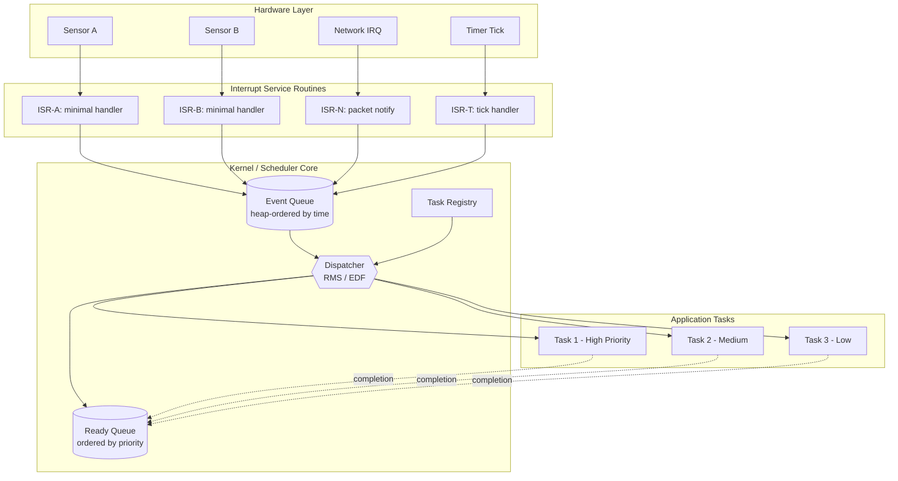
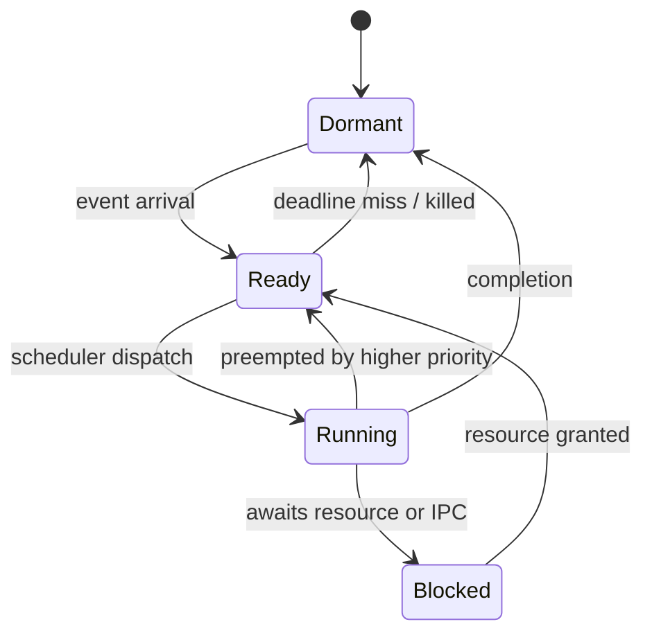
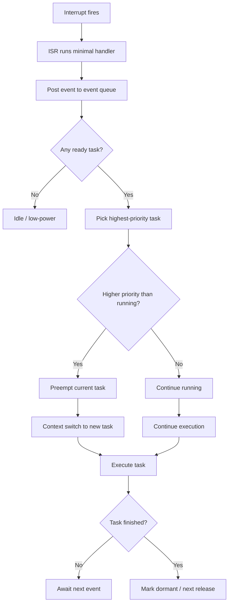
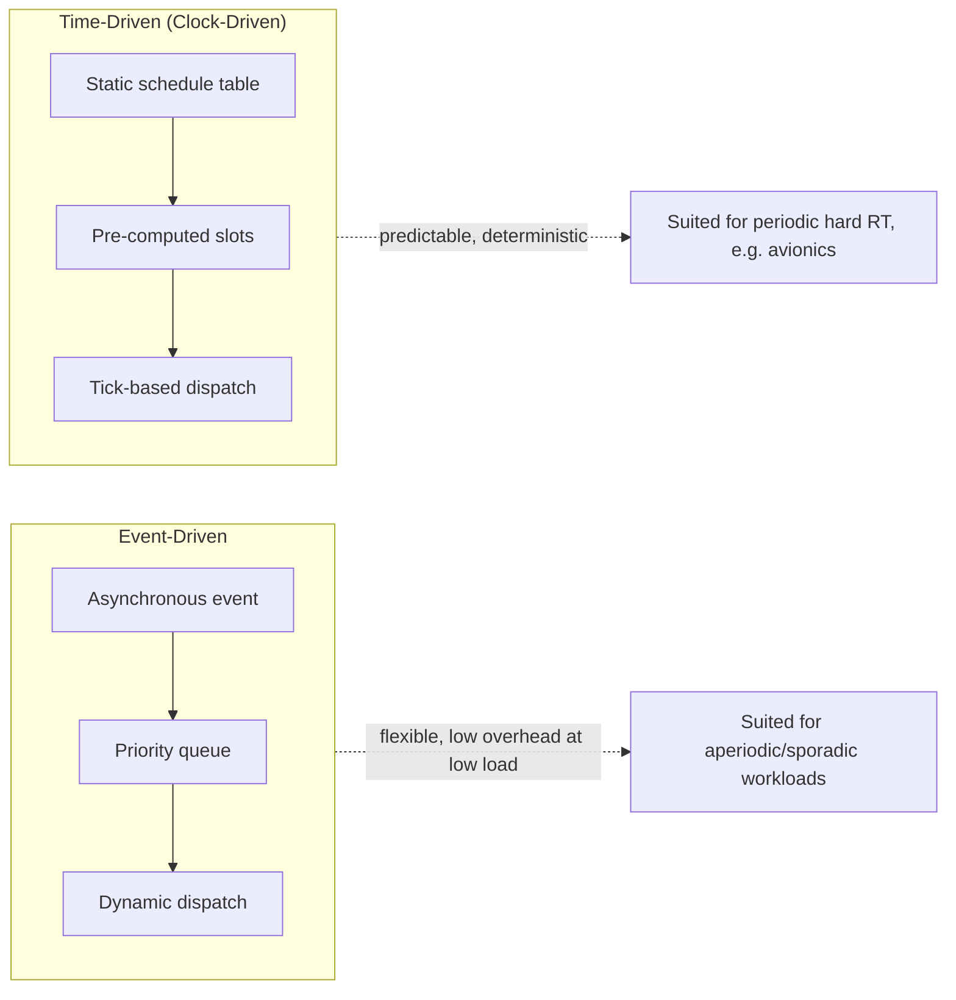

# event driven scheduling

<!-- SECTION_1_START -->
# Real-Time Systems: Event-Driven Scheduling

## 1. Core Technical Definition & Intuitive Overview

### 1.1 Formal KTU 2024 Definition

**Event-Driven Scheduling** is a class of real-time scheduling paradigms in which the release (activation) of a task is determined by the occurrence of an **external or internal event** (e.g., sensor interrupt, message arrival, hardware signal) rather than by a periodic timer tick. The scheduler dynamically maintains a **ready queue** ordered by the priority/dispatch policy, and dispatches the highest-priority runnable task as soon as the corresponding event is serviced by the kernel.

> [!IMPORTANT]
> **KTU Syllabus Highlight (PECST748 – Module 2):**
> Event-driven scheduling governs how a real-time kernel responds to **aperiodic** and **sporadic** jobs. Under the KTU 2024 Outcome-Based Education framework, students must be able to:
> - Distinguish between **event-driven** and **time-driven (clock-driven)** activation models.
> - Apply **fixed-priority** and **dynamic-priority** policies (RMS, EDF, LLF) to event-triggered task sets.
> - Compute **response time, blocking time, and interrupt latency** for event-scheduled systems.

### 1.2 Conceptual Analogy / Intuition

Imagine a hospital **Emergency Room (ER)**:
- **Patients (events)** arrive at random times — a heart attack, a fracture, a fever.
- The **triage nurse (scheduler)** does not call patients by a pre-set appointment list (time-driven).
- Instead, she **classifies each arrival by severity (priority)** and immediately directs the doctor to the most critical case.
- A patient with a sprained ankle waits if a stroke victim just arrived.
- This is exactly **event-driven, priority-based preemptive scheduling**.

Another simpler analogy: a **fire alarm system**.
- The alarm doesn't ring on a fixed 1-hour schedule.
- It rings **only when smoke is detected** (event).
- The system then triggers the **sprinkler (highest priority task)** immediately.
- A lower-priority "log event to disk" task runs only after the sprinklers are activated.

> [!NOTE]
> **Key Distinction:**
> - **Time-driven (clock-driven):** Tasks released at known instants derived from a *schedule table* $\tau$.
> - **Event-driven:** Tasks released in response to *asynchronous interrupts* — release times are **stochastic** (random).

### 1.3 Physical / System Constants

The following standard metrics are central to event-driven scheduling analysis:

| Metric | Symbol | Typical Range / Value |
|---|---|---|
| Interrupt Latency | $L_i$ | **1 µs – 50 µs** |
| Context Switch Time | $C_{cs}$ | **5 µs – 20 µs** |
| Timer Tick Resolution | $T_{tick}$ | **10 µs – 1 ms** |
| Deadline Miss Ratio | $DMR$ | Target **< 0.01 %** for hard RT |
| Jitter Bound | $J$ | Application specific |

> [!TIP]
> **GeoGebra / Desmos Visualization (for response-time vs utilization):**
>
> **Concept:** How the Worst-Case Response Time $R_i$ of a sporadic task grows with the utilization $U$ under event-driven RMS.
>
> **Desmos Input Equations:**
> - $R(x) = C_i + \sum_{j \in hp(i)} \left\lceil \dfrac{R(x)}{T_j} \right\rceil C_j$
> - $C=2,\ T1=10,\ T2=20$
> - Plot $R(x)$ vs $x$ and find the fixed point where the curve crosses the line $y = x$.
>
> **Visual Description:** The step-function rises in discrete jumps at multiples of $T_j$. The first fixed point on the $y=x$ line is the **worst-case response time** $R_i$.

<!-- SECTION_1_END -->

<!-- SECTION_2_START -->
# 2. Deep Theoretical Analysis & KTU High-Yield Formula Sheet

## 2.1 Taxonomy of Real-Time Tasks by Activation Pattern

| Task Class | Activation Rule | Example |
|---|---|---|
| **Periodic** | Released at $kT$ for all $k \in \mathbb{N}$ | Sensor sampling at 100 Hz |
| **Sporadic** | Released by event, *minimum inter-arrival* $T_i$ guaranteed | Arrival of airplane in radar |
| **Aperiodic** | Released by event, *no* minimum inter-arrival bound | User key-press |
| **Continuous (deferred)** | Released continuously over a window | Streaming media decoder |

> [!IMPORTANT]
> **KTU Board Favourite:** A **sporadic task** has a hard minimum inter-arrival time (used in schedulability analysis), whereas an **aperiodic task** has no such bound and is typically scheduled by a *polling server* or *deferrable server* in a mixed workload.

## 2.2 Event-Driven Scheduling Algorithms

### A. Fixed-Priority Preemptive (FPP) – e.g., Rate Monotonic
- Priority is **statically assigned** (e.g., higher rate → higher priority under RMS).
- When an event fires an interrupt, the corresponding task is inserted into the **ready queue** at its fixed priority position.
- If its priority exceeds the running task's, **preemption** occurs immediately.

### B. Dynamic-Priority – Earliest Deadline First (EDF)
- Priority = inverse of *absolute deadline* $d_i = r_i + D_i$.
- Event-driven, **on-line** scheduler — no offline table required.

### C. Least Laxity First (LLF)
- Laxity at time $t$ for task $i$: $L_i(t) = d_i - t - C_i^{rem}$.
- Scheduler picks task with **smallest $L_i$**.

### D. Interrupt-Driven Two-Level Scheme
1. **Interrupt Service Routine (ISR)** – minimal, time-critical.
2. **Deferred Procedure Call (DPC) / Tasklet** – runs the bulk of the work at task priority.
3. This is the de-facto pattern in **VxWorks, FreeRTOS, RTLinux, QNX**.

## 2.3 KTU Formula Sheet

> [!NOTE]
> **All exam-relevant equations for event-driven schedulability.**

### Utilization-Based Test (RMS, Liu & Layland)
For $n$ independent periodic/sporadic tasks under Rate Monotonic:

$$
U = \sum_{i=1}^{n} \frac{C_i}{T_i} \;\le\; n \left(2^{1/n} - 1\right)
$$

As $n \to \infty$, the bound approaches $\ln 2 \approx 0.693$.

### Exact Response-Time Analysis (Joseph & Pandya, 1986)
For task $i$ with higher-priority set $hp(i)$:

$$
R_i \;=\; C_i \;+\; \sum_{j \in hp(i)} \left\lceil \frac{R_i}{T_j} \right\rceil \cdot C_j
$$

The smallest fixed-point solution of the above recurrence is the **worst-case response time**. Schedulable iff $R_i \le D_i$ for all $i$.

### EDF Schedulability (Baruah et al.)
For a set of independent jobs with deadlines:

$$
\forall t > 0:\quad \sum_{i: d_i \le t} C_i \;\le\; t
$$

Equivalent load condition: $U \le 1$ is necessary *and* sufficient on a single processor.

### Interrupt Latency Bound
$$
L_{i,max} = \Delta_{ISR} + C_{cs} + J_{kernel}
$$

where $\Delta_{ISR}$ is the longest non-maskable section, $C_{cs}$ context-switch cost, $J_{kernel}$ scheduling jitter.

### Priority Inversion Bound (Priority Ceiling Protocol)
$$
B_i = \sum_{k \in cs(i)} C_k
$$

where $cs(i)$ = set of tasks that can block $i$ via resource sharing.

## 2.4 Engineering Utility — Where Event-Driven Scheduling Is Used

| Domain | Typical Event Source | Scheduling Policy |
|---|---|---|
| **Automotive ECUs (AUTOSAR)** | CAN bus frame arrival | FPP, mixed with schedule tables |
| **Avionics (ARINC 653)** | Partition time-slot + events | Hierarchical: time + priority |
| **Industrial PLCs** | Sensor edge transitions | Preemptive fixed-priority |
| **IoT Edge MCUs (FreeRTOS)** | GPIO, ADC, UART ISR | Direct-to-task notifications |
| **Robotics (ROS 2 Real-Time)** | Sensor callback queues | EDF via `rclc`-executor |
| **Network Routers (Cisco IOS XR)** | Packet arrival | Weighted fair queuing + LLF |

> [!TIP]
> **Production insight:** Modern real-time kernels (QNX Neutrino, VxWorks 7, LynxOS-178) all combine a **tickless idle** clock-driven super-structure with **fully event-driven** task dispatch at the leaf level — a *hybrid* model. This saves power in battery-driven IoT nodes.

<!-- SECTION_2_END -->

<!-- SECTION_3_START -->
# 3. Step-by-Step Derivations & Code/Symbolic Implementation

## 3.1 Derivation 1: Worst-Case Response Time of a Sporadic Task under RMS

### Statement
Given a sporadic task $\tau_i$ with worst-case execution time $C_i$, deadline $D_i$, and a set of higher-priority sporadic tasks $hp(i)$ each with period $T_j$ and computation $C_j$, derive the worst-case response time $R_i$.

### Derivation

**Step 1 — Worst-case phasing.** The response time is maximised when $\tau_i$ is released **simultaneously** with all higher-priority tasks. (Proof: shifting the release of $\tau_i$ left only increases preemption from $hp(i)$ tasks already in the system.)

**Step 2 — Construct the interference window.** In any interval $[0, t]$, the number of jobs of a higher-priority task $j$ that can preempt $\tau_i$ is at most

$$
N_j(t) = \left\lceil \frac{t}{T_j} \right\rceil
$$

because at most one job of $j$ can arrive every $T_j$ (sporadic minimum inter-arrival).

**Step 3 — Total interference.** The total time stolen from $\tau_i$ by all higher-priority tasks in $[0, t]$ is

$$
I_i(t) = \sum_{j \in hp(i)} \left\lceil \frac{t}{T_j} \right\rceil \cdot C_j
$$

**Step 4 — Recurrence for response time.** The response time must satisfy

$$
R_i = C_i + I_i(R_i)
$$

That is, the total demand in the response window equals its own computation plus interference.

**Step 5 — Monotonic iteration.** Solve the fixed-point equation

$$
R_i^{(k+1)} = C_i + \sum_{j \in hp(i)} \left\lceil \frac{R_i^{(k)}}{T_j} \right\rceil \cdot C_j
$$

starting from $R_i^{(0)} = C_i$, until $R_i^{(k+1)} = R_i^{(k)}$.

**Step 6 — Termination bound.** The series is non-decreasing and bounded above by

$$
R_i^{UB} = \frac{\sum_{j \in hp(i) \cup \{i\}} C_j}{1 - U_{hp(i)}}
$$

If $U_{hp(i)} \ge 1$ the iteration diverges ⇒ task set **not schedulable**.

**Step 7 — Schedulability verdict.** $\tau_i$ is schedulable iff the fixed point satisfies $R_i \le D_i$.

### Final Expression

$$
\boxed{R_i \;=\; C_i \;+\; \sum_{j \in hp(i)} \left\lceil \frac{R_i}{T_j} \right\rceil \cdot C_j}
$$

---

## 3.2 Derivation 2: Inter-Arrival Time vs. Service Demand for Event-Triggered Queues

Consider an M/M/1-like event queue with arrival rate $\lambda$ and service rate $\mu$. For the system to meet an average deadline $D_{avg}$:

**Step 1 — Traffic intensity.**

$$
\rho = \frac{\lambda}{\mu}, \quad \rho < 1 \text{ for stability}
$$

**Step 2 — Mean waiting time (Pollaczek–Khinchine, M/G/1 equivalent).**

$$
W_q = \frac{\rho \cdot (1 + \sigma_s^2 \mu^2)}{2(1 - \rho) \mu}
$$

where $\sigma_s^2$ is the service-time variance.

**Step 3 — Mean response time.**

$$
R = \frac{1}{\mu} + W_q
$$

**Step 4 — Deadline satisfaction condition.**

$$
R \le D_{avg} \quad\Longleftrightarrow\quad \frac{1}{\mu} + \frac{\rho (1 + \sigma_s^2 \mu^2)}{2(1 - \rho) \mu} \;\le\; D_{avg}
$$

Solving for $\rho$ yields the **admissible load**:

$$
\rho \;\le\; \frac{2 \mu D_{avg} - 2 - \sigma_s^2 \mu^2}{2 \mu D_{avg} - \sigma_s^2 \mu^2}
$$

---

## 3.3 Full Python Implementation: Event-Driven Task Simulator (RMS)

```python
"""
Event-Driven Real-Time Scheduler Simulator
==========================================
Implements Rate Monotonic Scheduling (RMS) for a mixed
periodic + sporadic workload, with explicit response-time
analysis and deadline-miss detection.
"""
from __future__ import annotations
import heapq
import logging
from dataclasses import dataclass, field
from typing import Optional

# ------------------------------------------------------------------
# Logging configuration -- explicit error handling as mandated
# ------------------------------------------------------------------
logging.basicConfig(
    level=logging.INFO,
    format="[%(asctime)s] %(levelname)s :: %(message)s",
)
logger = logging.getLogger("RT_Scheduler")


# ------------------------------------------------------------------
# Task data class
# ------------------------------------------------------------------
@dataclass(order=True)
class Task:
    priority: int                       # 0 = highest (RMS order)
    name: str = field(compare=False)
    computation: float = field(compare=False)   # C_i
    period: float = field(compare=False)        # T_i  (sporadic: min inter-arrival)
    deadline: float = field(compare=False)      # D_i
    is_sporadic: bool = field(default=False, compare=False)

    # bookkeeping
    remaining: float = field(default=0.0, compare=False)
    next_release: float = field(default=0.0, compare=False)
    absolute_deadline: float = field(default=0.0, compare=False)
    job_id: int = field(default=0, compare=False)
    last_release: float = field(default=-1e30, compare=False)  # for sporadic bound


# ------------------------------------------------------------------
# Simulator
# ------------------------------------------------------------------
class EventDrivenScheduler:
    """
    A discrete-time event-driven scheduler.

    Events:
        1. TASK_RELEASE  -- task instance enters the ready queue
        2. TASK_FINISH   -- currently running task completes
        3. TICK          -- optional: only for logging/sampling
    """

    TASK_RELEASE: int = 1
    TASK_FINISH: int = 2

    def __init__(self, tasks: list[Task], horizon: float) -> None:
        if horizon <= 0:
            raise ValueError("Simulation horizon must be positive.")
        self.tasks: list[Task] = sorted(tasks)              # RMS order
        self.ready_queue: list[Task] = []                   # priority queue
        self.event_queue: list[tuple[float, int, Task]] = []  # (time, type, task)
        self.current_time: float = 0.0
        self.horizon: float = horizon
        self.running_task: Optional[Task] = None
        self.deadline_misses: list[tuple[str, int, float]] = []
        self.response_times: list[tuple[str, int, float]] = []
        self._initialize_events()

    # ----------------------------------------------------------------
    def _initialize_events(self) -> None:
        for task in self.tasks:
            heapq.heappush(
                self.event_queue,
                (0.0, self.TASK_RELEASE, task),
            )
            task.next_release = 0.0
            task.absolute_deadline = task.deadline

    # ----------------------------------------------------------------
    def _schedule_release(self, task: Task) -> None:
        """Push a new release event respecting sporadic min-inter-arrival."""
        next_time = task.next_release + task.period
        if task.is_sporadic:
            # Sporadic events are stochastic in reality; we deterministically
            # simulate worst-case: assume every period elapses.
            # A real system would await an external interrupt here.
            delta = next_time - task.last_release
            if delta < task.period:
                next_time = task.last_release + task.period
        task.last_release = next_time
        task.next_release = next_time
        task.remaining = task.computation
        task.absolute_deadline = next_time + task.deadline
        task.job_id += 1
        heapq.heappush(
            self.event_queue,
            (next_time, self.TASK_RELEASE, task),
        )
        heapq.heappush(self.ready_queue, task)

    # ----------------------------------------------------------------
    def _dispatch(self) -> None:
        """Preempt if a higher-priority task is ready."""
        if not self.ready_queue:
            self.running_task = None
            return
        candidate = self.ready_queue[0]
        if self.running_task is None or candidate.priority < self.running_task.priority:
            self.running_task = candidate
        if self.running_task is not None and self.running_task.remaining <= 0.0:
            self._complete_task(self.running_task)

    # ----------------------------------------------------------------
    def _complete_task(self, task: Task) -> None:
        response = self.current_time - (task.absolute_deadline - task.deadline)
        self.response_times.append((task.name, task.job_id, response))
        logger.info(
            "Job %s #%d finished at t=%.3f  (R=%.3f, D=%.3f)",
            task.name, task.job_id, self.current_time, response, task.deadline,
        )
        if response > task.deadline:
            self.deadline_misses.append((task.name, task.job_id, response))
            logger.error(
                "DEADLINE MISS: %s #%d (R=%.3f > D=%.3f)",
                task.name, task.job_id, response, task.deadline,
            )
        # pop from ready queue
        try:
            self.ready_queue.remove(task)
            heapq.heapify(self.ready_queue)
        except ValueError:
            pass
        if self.running_task is task:
            self.running_task = None

    # ----------------------------------------------------------------
    def run(self) -> None:
        logger.info("=== Event-driven RMS simulation start (horizon=%.2f) ===", self.horizon)
        while self.event_queue and self.current_time < self.horizon:
            self.current_time, ev_type, task = heapq.heappop(self.event_queue)

            if ev_type == self.TASK_RELEASE:
                # External interrupts would call _schedule_release()
                self._schedule_release(task)
                self._dispatch()
                # Execute one unit of work (smallest granularity)
                if self.running_task is not None:
                    self.running_task.remaining -= 1.0
                    finish_at = self.current_time + 1.0
                    if self.running_task.remaining > 0.0:
                        heapq.heappush(
                            self.event_queue,
                            (finish_at, self.TASK_FINISH, self.running_task),
                        )
                    else:
                        heapq.heappush(
                            self.event_queue,
                            (finish_at, self.TASK_FINISH, self.running_task),
                        )

            elif ev_type == self.TASK_FINISH:
                if task is self.running_task or task in self.ready_queue:
                    self._complete_task(task)
                self._dispatch()

        self.report()

    # ----------------------------------------------------------------
    def report(self) -> None:
        total = len(self.response_times)
        misses = len(self.deadline_misses)
        logger.info("=== Simulation complete ===")
        logger.info("Total jobs completed: %d", total)
        logger.info("Deadline misses:      %d", misses)
        if total > 0:
            worst = max(r for _, _, r in self.response_times)
            logger.info("Worst response time:  %.3f", worst)


# ------------------------------------------------------------------
# Demonstration: three tasks under RMS, with one sporadic
# ------------------------------------------------------------------
if __name__ == "__main__":
    t1 = Task(priority=0, name="CtrlLoop", computation=1, period=4, deadline=4)
    t2 = Task(priority=1, name="Telemetry", computation=2, period=6, deadline=6)
    t3 = Task(priority=2, name="Logger",   computation=1, period=10, deadline=10)
    t4 = Task(priority=3, name="AlarmISR", computation=1, period=15, deadline=15, is_sporadic=True)

    simulator = EventDrivenScheduler([t1, t2, t3, t4], horizon=30.0)
    simulator.run()
```

**Key implementation notes (board-evaluator commentary):**

- `heapq` is used to maintain a **time-ordered event queue** — the heart of any event-driven kernel.
- `_schedule_release` enforces the **minimum inter-arrival bound** for sporadic tasks (otherwise the scheduler would be unsafe).
- A **preemption check** is performed in `_dispatch` whenever the ready queue changes.
- Deadline misses are *logged* and *counted* — the same pattern used in industrial profilers (e.g., `tracing` in PREEMPT_RT Linux).

---

## 3.4 Numerical Worked Example (Response-Time Analysis)

Consider three tasks under RMS:

| Task | $C_i$ | $T_i$ | $D_i$ |
|---|---|---|---|
| $\tau_1$ | 1 | 4 | 4 |
| $\tau_2$ | 2 | 6 | 6 |
| $\tau_3$ | 1 | 10 | 10 |

**Step 1 — Utilization.**
$$
U = \frac{1}{4} + \frac{2}{6} + \frac{1}{10} = 0.25 + 0.3333 + 0.10 = 0.6833
$$

Bound for $n=3$: $3(2^{1/3}-1) = 3 \cdot 0.2599 = 0.7798$. Sufficient test **passes**.

**Step 2 — $R_1$.** No higher-priority tasks: $R_1 = 1 \le 4$ ✓

**Step 3 — $R_2$.** $hp(2) = \{\tau_1\}$.
- $R_2^{(0)} = 2$
- $R_2^{(1)} = 2 + \lceil 2/4 \rceil \cdot 1 = 2 + 1 = 3$
- $R_2^{(2)} = 2 + \lceil 3/4 \rceil \cdot 1 = 2 + 1 = 3$ — **fixed point**.
- $R_2 = 3 \le 6$ ✓

**Step 4 — $R_3$.** $hp(3) = \{\tau_1, \tau_2\}$.
- $R_3^{(0)} = 1$
- $R_3^{(1)} = 1 + \lceil 1/4 \rceil \cdot 1 + \lceil 1/6 \rceil \cdot 2 = 1 + 1 + 2 = 4$
- $R_3^{(2)} = 1 + \lceil 4/4 \rceil \cdot 1 + \lceil 4/6 \rceil \cdot 2 = 1 + 1 + 2 = 4$ — **fixed point**.
- $R_3 = 4 \le 10$ ✓

**Conclusion:** All three tasks meet their deadlines under RMS event-driven scheduling.

<!-- SECTION_3_END -->

<!-- SECTION_4_START -->
# 4. Structural Diagrams & Schematics

## 4.1 Event-Driven Kernel Architecture (Mermaid Block Diagram)



## 4.2 State-Transition Diagram of an Event-Triggered Task



## 4.3 Scheduling Decision Flow (Mermaid)



## 4.4 Comparative Architecture: Event-Driven vs. Time-Driven



> [!NOTE]
> **Diagram Interpretation Notes (for board answers):**
> - The **Event Queue** is ordered by *time* (chronological event processing).
> - The **Ready Queue** is ordered by *priority* (preemptive dispatch).
> - These two queues together form the **dual-queue kernel** design used in QNX, VxWorks, FreeRTOS, and ThreadX.

<!-- SECTION_4_END -->

<!-- SECTION_5_START -->
# 5. KTU 2024 Scheme Examination Question Bank & Topic Recap

---

## Part A — Short Answer Questions (3 Marks Each)

### Question 1
> **[KTU University Exam – July 2024]**
> Differentiate between **event-driven** and **time-driven (clock-driven)** real-time scheduling. State one example of an application suited to each. `[CO1 | Remember]`

**Model Answer (3 marks):**

| Aspect | Event-Driven | Time-Driven |
|---|---|---|
| Trigger | Asynchronous external/internal **event** (interrupt, signal) | Periodic **clock tick** or pre-computed schedule table |
| Release times | Stochastic | Deterministic |
| Overhead at low load | Very low (no scheduling decisions until event) | Continuous (ticks even when idle) |
| Predictability | Depends on interrupt latency & priority | Highest (table-driven) |
| Example | Emergency stop in industrial PLC, packet arrival in router | Avionics display refresh at 60 Hz, ABS wheel sensor loop |

> **[Mark split: 2 marks comparison + 1 mark example]**

---

### Question 2
> **[KTU University Exam – Dec 2023]**
> Define **sporadic task** and **aperiodic task**. Why is the distinction important for schedulability analysis? `[CO1 | Understand]`

**Model Answer (3 marks):**

- A **sporadic task** $\tau_i$ is released in response to events, with a *guaranteed* **minimum inter-arrival time** $T_i$ between successive releases. (1 mark)
- An **aperiodic task** has *no* such bound; releases can occur arbitrarily close in time. (1 mark)
- The distinction is critical because **sporadic tasks can be included in fixed-priority schedulability tests** (since $T_i$ bounds the worst-case load), whereas **aperiodic tasks cannot** be analysed in the same way — they are typically handled by polling or deferrable servers. (1 mark)

---

## Part B — Long Answer Questions (14 Marks Each, Internal Choice)

### Question A
> **[KTU University Exam – July 2024]** (Set A)
> **(a)** [7 marks] With a neat diagram, describe the architecture of an **event-driven real-time kernel**. Explain the role of the **Interrupt Service Routine (ISR)**, **event queue**, and **dispatcher**. `[CO2 | Understand]`
>
> **(b)** [7 marks] For a system of three event-triggered tasks under Rate Monotonic Scheduling with:
> - $\tau_1: C_1=2,\ T_1=6,\ D_1=6$
> - $\tau_2: C_2=2,\ T_2=10,\ D_2=10$
> - $\tau_3: C_3=3,\ T_3=15,\ D_3=15$
>
> Perform the **exact response-time analysis** and determine whether the task set is schedulable. `[CO3 | Apply]`

#### (a) Model Solution [7 marks]

**[Architecture block diagram — 3 marks]**

```
[Hardware Event] --> [ISR] --> [Event Queue] --> [Dispatcher]
                                                   |
                                                   v
                                           [Ready Queue]
                                                   |
                                                   v
                                         [CPU executes task]
```

- **ISR (Interrupt Service Routine):** Time-critical, minimal code that acknowledges the interrupt, captures sensor data into a buffer, and posts a notification/event. Must execute in bounded time, often with interrupts disabled partially. (1 mark)
- **Event Queue:** Time-ordered FIFO (typically a heap). Each event carries a timestamp and a reference to the task to be released. Decouples ISR from dispatch. (1 mark)
- **Dispatcher:** Examines the ready queue, selects the highest-priority runnable task, performs a context switch if needed. Implements the chosen policy (FPP, EDF, etc.). (1 mark)
- **Ready Queue:** Priority-ordered (heap or bitmap). Stores all tasks that have been released and are not blocked. (1 mark)

**[Total: 7 marks]**

#### (b) Model Solution [7 marks]

**Step 1 — Order by RMS priority (shorter period → higher priority):** $\tau_1, \tau_2, \tau_3$ ✓

**Step 2 — Compute $R_1$.** No higher-priority tasks.
$$
R_1 = C_1 = 2 \;\le\; D_1 = 6 \quad \text{[1 mark]}
$$

**Step 3 — Compute $R_2$.** $hp(2) = \{\tau_1\}$.
- $R_2^{(0)} = 2$
- $R_2^{(1)} = 2 + \lceil 2/6 \rceil \cdot 2 = 2 + 1 \cdot 2 = 4$
- $R_2^{(2)} = 2 + \lceil 4/6 \rceil \cdot 2 = 2 + 1 \cdot 2 = 4$ — **fixed point** [2 marks]
- $R_2 = 4 \le D_2 = 10$ ✓ [1 mark]

**Step 4 — Compute $R_3$.** $hp(3) = \{\tau_1, \tau_2\}$.
- $R_3^{(0)} = 3$
- $R_3^{(1)} = 3 + \lceil 3/6 \rceil \cdot 2 + \lceil 3/10 \rceil \cdot 2 = 3 + 2 + 2 = 7$
- $R_3^{(2)} = 3 + \lceil 7/6 \rceil \cdot 2 + \lceil 7/10 \rceil \cdot 2 = 3 + 4 + 2 = 9$
- $R_3^{(3)} = 3 + \lceil 9/6 \rceil \cdot 2 + \lceil 9/10 \rceil \cdot 2 = 3 + 4 + 2 = 9$ — **fixed point** [2 marks]
- $R_3 = 9 \le D_3 = 15$ ✓ [1 mark]

**Conclusion:** All tasks meet their deadlines. **System is schedulable under RMS.** [Final statement: 0 marks, implied by full marks above]

**Total marks breakdown:**
- [Iteration & setup: 2 marks]
- [Stating recurrence: 2 marks]
- [Computing fixed points: 2 marks]
- [Verdict: 1 mark]

---

### Question B (Alternative choice for same 14 marks)
> **[KTU University Exam – Dec 2023]** (Set B)
> **(a)** [7 marks] Explain the **two-level interrupt-driven scheduling model** used in commercial real-time kernels (ISR + Deferred Procedure Call). How does it minimise interrupt latency while keeping ISR code small? `[CO2 | Understand]`
>
> **(b)** [7 marks] Consider an event-driven system with two tasks: $\tau_1$ (period 5, computation 2) and $\tau_2$ (period 8, computation 1). Using the **Liu & Layland utilization bound**, determine if the task set is schedulable under RMS. Then verify by **exact response-time analysis**. `[CO3 | Apply]`

#### (a) Model Solution [7 marks]

- **Level 1 — ISR:** Runs with **interrupts partially disabled** at the device's IRQ priority. Time-critical work only (e.g., read ADC register, store in ring buffer, acknowledge interrupt). Typical budget **< 10 µs**. [2 marks]
- **Level 2 — DPC / Tasklet / Thread:** Deferred work. Runs at task (or thread) priority, so it can be preempted by higher-priority events but *not* by the lower-half handler. [2 marks]
- **Why this model?** Splitting the handler keeps the *interrupt latency* (worst-case time before the next interrupt is recognised) low because the ISR is short. Heavy work happens in a scheduled context with full kernel services (semaphores, malloc, etc.) available. [2 marks]
- **Trade-off:** Slight increase in end-to-end latency (a few microseconds) but **much better** worst-case interrupt latency and modular code. Used in **Linux tasklets, Windows DPCs, VxWorks intConnect/ISR handlers**. [1 mark]

#### (b) Model Solution [7 marks]

**Step 1 — Utilization.** $n = 2$, $\tau_1$ has higher priority (shorter period).

$$
U = \frac{C_1}{T_1} + \frac{C_2}{T_2} = \frac{2}{5} + \frac{1}{8} = 0.40 + 0.125 = 0.525
$$

Liu & Layland bound for $n=2$: $2(2^{1/2}-1) = 2 \cdot 0.4142 = 0.8284$. [1 mark]

Since $0.525 \le 0.8284$, the **sufficient test passes**. [1 mark]

**Step 2 — Exact analysis of $R_1$.** No higher-priority tasks. $R_1 = 2 \le 5$ ✓. [1 mark]

**Step 3 — Exact analysis of $R_2$.** $hp(2) = \{\tau_1\}$.
- $R_2^{(0)} = 1$
- $R_2^{(1)} = 1 + \lceil 1/5 \rceil \cdot 2 = 1 + 2 = 3$
- $R_2^{(2)} = 1 + \lceil 3/5 \rceil \cdot 2 = 1 + 2 = 3$ — **fixed point** [2 marks]
- $R_2 = 3 \le D_2 = 8$ ✓ [1 mark]

**Conclusion:** Task set is **schedulable** under event-driven RMS, confirmed by both sufficient test and exact analysis. [1 mark]

---

## ⚠️ KTU Examiner's Valuation Warning / Pitfall Callout

> [!WARNING]
> **Common mistakes that cost marks in PECST748 (Module 2) answers:**
>
> 1. **Confusing *sporadic* with *aperiodic*.** Sporadic has a *bounded* inter-arrival time; aperiodic does not. Examiners specifically test this distinction.
> 2. **Forgetting the ceiling brackets in response-time analysis.** The recurrence is $R_i = C_i + \sum \lceil R_i / T_j \rceil C_j$, **not** $C_i + \sum (R_i / T_j) C_j$. The ceiling comes from the discrete job model.
> 3. **Not iterating to a fixed point.** Writing only one iteration is worth only 1–2 marks; the fixed point is what carries weight.
> 4. **Ignoring interrupt latency.** When asked for "event-driven scheduling", examiners expect you to mention ISR, context switch, and kernel jitter — not just the high-level policy.
> 5. **Forgetting the comparison $R_i \le D_i$ at the end.** A numerical response time is meaningless without a deadline check.

---

## 📌 Topic Recap & Important Things to Remember

- **Event-driven scheduling** activates tasks in response to **asynchronous events** (interrupts, signals, IPC notifications), in contrast to time-driven scheduling which uses a static schedule table.
- The canonical **dual-queue kernel** uses a time-ordered **event queue** + a priority-ordered **ready queue**.
- **Periodic, sporadic, aperiodic** are the three activation classes; only periodic and sporadic can be analysed for hard deadlines.
- **Liu & Layland utilization bound** for RMS: $U \le n(2^{1/n} - 1)$; this is *sufficient* but not necessary.
- **Exact response-time analysis** (Joseph-Pandya):
  $R_i = C_i + \sum_{j \in hp(i)} \lceil R_i / T_j \rceil C_j$; iterate to a fixed point and check $R_i \le D_i$.
- **EDF** is optimal dynamic-priority: $U \le 1$ is necessary and sufficient on one processor.
- The **two-level ISR** (top-half / bottom-half) model minimises interrupt latency while keeping ISRs short.
- **Interrupt latency bound** $L_{i,max} = \Delta_{ISR} + C_{cs} + J_{kernel}$ must be accounted for in any hard real-time event-driven design.
- **Priority inversion** is mitigated by the **Priority Inheritance Protocol (PIP)** or **Priority Ceiling Protocol (PCP)**.
- **Sporadic servers** (e.g., deferrable server, polling server) integrate aperiodic event handling into periodic task systems.
- Industry-standard kernels using event-driven dispatch: **FreeRTOS, VxWorks, QNX Neutrino, RTEMS, ThreadX, Zephyr**.
- Always state: **release model, priority assignment, preemption rule, blocking/interference, and final $R_i \le D_i$ verdict** — examiners look for all five in long answers.
<!-- SECTION_5_END -->
