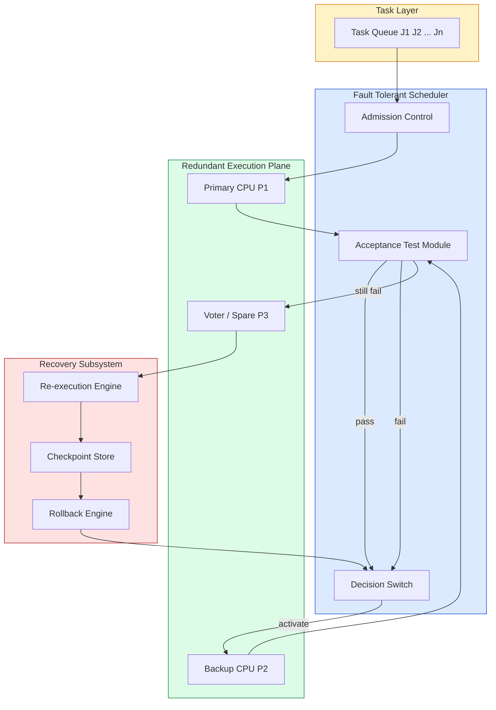
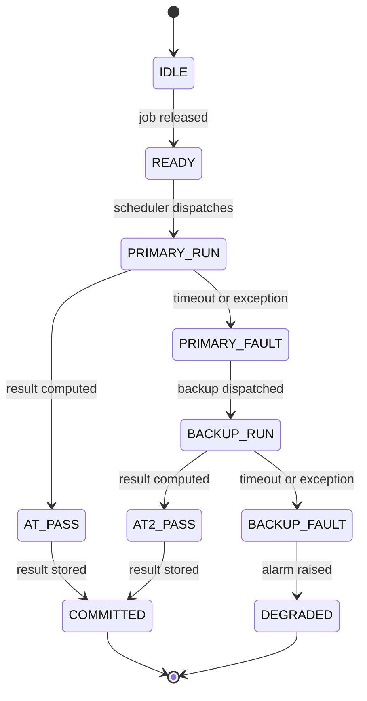

# Fault tolerant scheduling of tasks

<!-- SECTION_1_START -->
# Fault Tolerant Scheduling of Tasks — Core Definition & Intuition

> [!IMPORTANT]
> **KTU Module 2 Anchor Concept**
> In Real-Time Systems (PECST748), a *fault* is any deviation of the system from its specified behaviour, while *fault tolerance* is the ability of the system to deliver correct service despite the presence of faults. **Fault tolerant scheduling** is the discipline of constructing a CPU schedule that *guarantees deadlines are met* even when one or more tasks fail during execution.

## 1.1 Formal Definitions (KTU 2024 Syllabus Terminology)

A **Real-Time System (RTS)** is said to be *fault tolerant* if it can continue to meet the timing and logical correctness requirements of its critical tasks in spite of hardware faults (e.g., transient processor glitches, memory bit-flips, link failures) or software faults (e.g., division-by-zero, infinite loops, wrong outputs).

A **fault tolerant scheduler** $\mathcal{S}_{FT}$ is a scheduling policy that maps a set of aperiodic/periodic/sporadic jobs $\mathcal{J} = \{J_1, J_2, \ldots, J_n\}$ onto a (possibly redundant) set of processors $\mathcal{P} = \{P_1, P_2, \ldots, P_m\}$ such that:

$$\forall J_i \in \mathcal{J},\ \ \text{deadline}(J_i) \le d_i \quad \text{even if up to } k \text{ faults occur during } [r_i, d_i]$$

where $k$ is the **maximum number of tolerable simultaneous faults** (a design parameter).

## 1.2 The Three Classical Fault Categories

| Fault Type | Duration | Example | Tolerance Strategy |
|---|---|---|---|
| **Transient** | Short, one-time | Cosmic ray bit-flip, EMI spike | Re-execution, retry |
| **Intermittent** | Recurrent, irregular | Loose connector, flaky sensor | Re-execution, voting |
| **Permanent** | Stays until repair | Burnt-out CPU core, broken wire | Reconfiguration, spare activation |

> [!NOTE]
> **KTU Board Tip:** Transient faults are the *most common* (≈ 80 %–90 % of all hardware faults) in real systems. Almost all KTU exam questions on fault tolerant scheduling assume *transient* faults, unless stated otherwise.

## 1.3 Intuitive Analogy — The "Co-Pilot" Model

Imagine a commercial aircraft where the **captain** and the **first officer** are *redundant* copies of the same job (flying the plane). The captain starts the manoeuvre. The first officer continuously monitors. If the captain makes a wrong decision (fault), the first officer *vetoes* it and takes over. From the passenger's perspective, the *flight is never late* (deadline met) and the *destination is reached correctly* (logical correctness maintained).

In a real-time OS:
- **Primary copy** of task $J_i$ runs first on $P_1$.
- **Backup copy** of $J_i$ is held in reserve on $P_2$.
- An **acceptance test** at $J_i$'s completion verifies the result.
- If the primary *fails* the test, the backup *re-executes* $J_i$ within slack time.

> [!VISUALIZATION CONTROL]
> **Concept:** Fault tolerant schedule on a single timeline.
> **Plotting Equations / Reference Points:**
> * $x$-axis: Time $t$ (ms), $t \in [0,\ 30]$
> * Primary $J_1$ window: $[0,\ 8]$
> * Backup $J_1$ window: $[8,\ 14]$
> * Acceptance Test point: $t = 8$ and $t = 14$
> * Deadline marker: $t = 16$
> **Visual Description:** Two horizontal bars stacked vertically. The top bar (primary, green) is solid from $t=0$ to $t=8$. The bottom bar (backup, amber) is hatched from $t=8$ to $t=14$. A vertical dashed line at $t=16$ shows the deadline. A red X at $t=8$ indicates primary failure; the dashed arrow into the backup region shows the *re-execution* transition.

## 1.4 The Three Pillars of Fault Tolerant Scheduling

1. **Error Detection** — Acceptance test, watchdog timer, sanity check, exception handler.
2. **Damage Confinement** — Prevent the faulty state from propagating (memory protection, rollback to checkpoint).
3. **Recovery** — Roll-forward (use backup) or roll-backward (re-execute from checkpoint) within slack time.

<!-- SECTION_1_END -->

<!-- SECTION_2_START -->
# Deep Theoretical Analysis & KTU High-Yield Formula Sheet

## 2.1 The Fault Tolerant Real-Time Scheduling Model

Let every periodic task $\tau_i$ be characterised by the 5-tuple:

$$\tau_i = (T_i,\ D_i,\ C_i,\ B_i,\ \xi_i)$$

| Symbol | Meaning |
|---|---|
| $T_i$ | Period (and Request time) |
| $D_i$ | Relative deadline, $D_i \le T_i$ |
| $C_i$ | Worst-case execution time (primary copy) |
| $B_i$ | Worst-case execution time of the **backup** copy |
| $\xi_i$ | Number of tolerable faults for $\tau_i$ (usually $\xi_i \in \{0, 1, 2\}$) |

> [!NOTE]
> In the **Primary–Backup** model, a task is *split* into a primary component and a backup component. The backup may be *passive* (waits, runs only on failure — *cold standby*) or *active* (runs concurrently, votes on result — *hot standby*).

## 2.2 Schedulability Formulas — KTU Cheat Sheet

| # | Concept | Formula | Notes |
|---|---|---|---|
| 1 | Primary execution demand (Liu & Layland) | $U_p = \sum_{i=1}^{n} \dfrac{C_i}{T_i}$ | For $n$ tasks on 1 CPU |
| 2 | Backup execution demand | $U_b = \sum_{i=1}^{n} \dfrac{B_i}{T_i}$ | Backup runs only on failure |
| 3 | Worst-case CPU load (passive backup) | $U = U_p + \max_i U_b^{(i)}$ | Where $U_b^{(i)} = \dfrac{B_i}{T_i}$ |
| 4 | Fault tolerant utilisation bound (Rate Monotonic, 1 fault tolerated) | $U \le \ln 2 \approx 0.693$ | Same as classical RM, but with redundancy overhead |
| 5 | Slack time for recovery | $S_i(t) = d_i - t - C_i^{rem}$ | Time left for re-execution |
| 6 | Time redundancy (re-execution window) | $C_i^{re} = 2 \cdot C_i$ | Doubling for transient fault recovery |
| 7 | $k$-fault tolerance (degradable bound) | $U \le \ln 2 \cdot \dfrac{n - k}{n}$ | As $k$ tolerated faults increase, capacity shrinks |
| 8 | Acceptance test latency | $t_{at} \le D_i - C_i - B_i$ | Must complete before deadline |
| 9 | Effective CPU count (k-out-of-n) | $n_{eff} = n - k$ | $n$ physical CPUs, $k$ may fail |
| 10 | Re-execution bound (transient fault) | $C_i^{total} = C_i + \varepsilon_i$ | Where $\varepsilon_i$ is the retry overhead |

> [!WARNING]
> When using the vertical pipe symbol $\vert$ in a markdown table, always use `\vert` in LaTeX. Example: write $\vert x \vert$, not $\vert x \vert$ literally, inside a table cell.

## 2.3 The Primary–Backup Approach (Detailed)

### 2.3.1 Active Replication
Both primary and backup run **simultaneously** on different processors. Outputs are compared via a **voter** (a hardware/software tie-breaker).

$$\text{Output} = \text{majority}(\text{out}_1, \text{out}_2, \ldots, \text{out}_{2k+1})$$

Required for **Byzantine fault tolerance**. Cost: $2k+1$ processors.

### 2.3.2 Passive Replication (Primary–Backup / Standby)
1. Primary executes on $P_1$ from $r_i$ to $r_i + C_i$.
2. Backup is *suspended* on $P_2$ during this window.
3. **Acceptance test** runs at $r_i + C_i$.
4. If **pass**: results are committed; backup is discarded.
5. If **fail**: primary is aborted, backup is *resumed* on $P_2$, runs for $B_i$ time, then acceptance test again.

**Time-Triggered** variant: backup is *deferred* to a known, scheduled slot to avoid overlap with primaries.

## 2.4 FT-RMA — Fault Tolerant Rate Monotonic Algorithm (Burns, Davis, Punnekkat)

The classical RMA is extended to tolerate $k$ transient faults. The schedulability test becomes:

$$U = \sum_{i=1}^{n} \frac{C_i + (\xi_i \cdot C_i^{retry})}{T_i} \le n(2^{1/n} - 1)$$

For $k$ tolerable faults across the **entire system** (not per task), the bound tightens further. The intuition: every task must reserve *enough slack* to retry the *worst-case fault scenario* in *its own* period.

## 2.5 The Recovery Block Scheme (Randell)

A *software-level* fault tolerance technique:

```
ensure <acceptance test>
   primary_body;
   else backup_body_1;
   else backup_body_2;
   ...
   else error;
```

Each `body` is an *alternate algorithm* for the same task. If the acceptance test fails, the next body is tried. This is **N-version programming** at the function level.

## 2.6 Why This Matters in Industry

Fault tolerant scheduling is used in:
- **Avionics** (DO-178C, ARINC 653 partitioning)
- **Automotive** (ISO 26262 ASIL-D, AUTOSAR)
- **Spacecraft** (NASA's JPL STA architecture, RAD750)
- **Medical devices** (IEC 62304, FDA Class III)
- **Industrial PLCs** (IEC 61508 SIL-3)
- **Financial trading** (deterministic, low-latency)

A KTU viva-favourite question: *"Why can't we simply run a checkpoint every 1 ms?"* — Because checkpoint overhead and I/O bandwidth cost reduces usable CPU time, *and* the act of checkpointing itself may miss the fault.

<!-- SECTION_2_END -->

<!-- SECTION_3_START -->
# Step-by-Step Derivations & Code Implementation

## 3.1 Exhaustive Derivation — Schedulability Test for FT-RMA with 1 Fault

**Problem Setup (typical KTU question):**
Given 3 periodic tasks with $(\xi_i = 1)$ and the following parameters, check if the task set is schedulable under FT-RMA:

$$\tau_1 = (T_1=20,\ C_1=4,\ D_1=20,\ B_1=2)$$
$$\tau_2 = (T_2=30,\ C_2=6,\ D_2=30,\ B_2=3)$$
$$\tau_3 = (T_3=40,\ C_3=8,\ D_3=40,\ B_3=4)$$

### Step 1 — Assign RM priorities (shorter period $\Rightarrow$ higher priority)

$\tau_1 > \tau_2 > \tau_3$ in priority order.

### Step 2 — Compute the worst-case response time for each task with fault retry

The fault-tolerant response time equation (Burns et al., 1996) is:

$$R_i^{FT} = C_i + B_i + \sum_{j \in hp(i)} \left\lceil \frac{R_i^{FT}}{T_j} \right\rceil \cdot C_j$$

where $hp(i)$ is the set of tasks with higher priority than $\tau_i$.

### Step 3 — Solve for $\tau_1$ (highest priority)

$$R_1^{FT} = C_1 + B_1 = 4 + 2 = 6 \le D_1 = 20 \quad \checkmark$$

### Step 4 — Solve for $\tau_2$ (fixed-point iteration)

$$\text{Iteration 0: } R_2^{(0)} = C_2 + B_2 = 6 + 3 = 9$$

$$\text{Iteration 1: } R_2^{(1)} = 6 + 3 + \left\lceil \frac{9}{20} \right\rceil \cdot 4 = 9 + 1 \cdot 4 = 13$$

$$\text{Iteration 2: } R_2^{(2)} = 6 + 3 + \left\lceil \frac{13}{20} \right\rceil \cdot 4 = 9 + 1 \cdot 4 = 13 \quad \text{(converged)}$$

$$R_2^{FT} = 13 \le D_2 = 30 \quad \checkmark$$

### Step 5 — Solve for $\tau_3$ (lowest priority)

$$\text{Iteration 0: } R_3^{(0)} = C_3 + B_3 = 8 + 4 = 12$$

$$\text{Iteration 1: } R_3^{(1)} = 8 + 4 + \left\lceil \frac{12}{20} \right\rceil \cdot 4 + \left\lceil \frac{12}{30} \right\rceil \cdot 6 = 12 + 4 + 6 = 22$$

$$\text{Iteration 2: } R_3^{(2)} = 8 + 4 + \left\lceil \frac{22}{20} \right\rceil \cdot 4 + \left\lceil \frac{22}{30} \right\rceil \cdot 6 = 12 + 8 + 6 = 26$$

$$\text{Iteration 3: } R_3^{(3)} = 8 + 4 + \left\lceil \frac{26}{20} \right\rceil \cdot 4 + \left\lceil \frac{26}{30} \right\rceil \cdot 6 = 12 + 8 + 6 = 26 \quad \text{(converged)}$$

$$R_3^{FT} = 26 \le D_3 = 40 \quad \checkmark$$

### Step 6 — Conclusion

The task set is **schedulable** under FT-RMA with 1 transient fault tolerated per task.

## 3.2 Full Python Implementation — Primary–Backup Scheduler with Acceptance Test

```python
"""
Filename   : ft_scheduler.py
Module     : Real Time Systems (PECST748) - Module 2
Topic      : Fault Tolerant Scheduling of Tasks
Algorithm  : Primary-Backup with Acceptance Test (Time-Triggered variant)

This is a deterministic, fully-commented reference implementation
suitable for KTU lab demonstrations and Part-B numerical exercises.
"""

from dataclasses import dataclass, field
from typing import List, Optional, Tuple
import logging
import heapq

# ------------------------------------------------------------------
# 1. Logging configuration - mandatory for fault-tolerant systems
# ------------------------------------------------------------------
logging.basicConfig(
    level=logging.INFO,
    format="%(asctime)s [%(levelname)s] %(message)s",
)
logger = logging.getLogger("FTScheduler")


# ------------------------------------------------------------------
# 2. Task model (KTU 5-tuple)
# ------------------------------------------------------------------
@dataclass(frozen=True)
class Task:
    task_id: str
    period: int                 # T_i
    deadline: int               # D_i
    wcet_primary: int           # C_i
    wcet_backup: int            # B_i
    max_faults: int = 1         # xi_i  (tolerable faults)

    def __post_init__(self) -> None:
        if not (0 < self.wcet_primary <= self.period):
            raise ValueError(f"Task {self.task_id}: C_i must be in (0, T_i].")
        if self.deadline > self.period:
            raise ValueError(f"Task {self.task_id}: D_i cannot exceed T_i.")
        if self.wcet_backup > self.deadline:
            raise ValueError(f"Task {self.task_id}: B_i must be <= D_i.")


@dataclass
class Job:
    job_id: str
    task: Task
    release_time: int
    abs_deadline: int

    def __lt__(self, other: "Job") -> bool:
        # Higher priority = shorter period (Rate Monotonic)
        if self.task.period != other.task.period:
            return self.task.period < other.task.period
        return self.release_time < other.release_time


# ------------------------------------------------------------------
# 3. Acceptance test plug-in (default: range check)
# ------------------------------------------------------------------
def default_acceptance_test(value: int, low: int, high: int) -> bool:
    return low <= value <= high


# ------------------------------------------------------------------
# 4. Core Primary-Backup scheduler
# ------------------------------------------------------------------
class PrimaryBackupScheduler:
    def __init__(self, tasks: List[Task]) -> None:
        self.tasks: List[Task] = sorted(tasks, key=lambda t: t.period)
        self.current_time: int = 0
        self.ready_queue: List[Job] = []
        self.completed_jobs: List[str] = []
        self.failed_jobs: List[str] = []
        self._job_counter: int = 0
        logger.info("Primary-Backup scheduler initialised with %d tasks.", len(self.tasks))

    # -- Job management -------------------------------------------------
    def _spawn_jobs_at(self, t: int) -> None:
        for task in self.tasks:
            if t % task.period == 0:
                self._job_counter += 1
                job = Job(
                    job_id=f"{task.task_id}#{self._job_counter}",
                    task=task,
                    release_time=t,
                    abs_deadline=t + task.deadline,
                )
                heapq.heappush(self.ready_queue, job)
                logger.info("Released %s at t=%d (D=%d).", job.job_id, t, job.abs_deadline)

    # -- Acceptance test (override for domain-specific checks) ----------
    def acceptance_test(self, job: Job, primary_result: int) -> bool:
        lo, hi = 0, 100
        return default_acceptance_test(primary_result, lo, hi)

    # -- Simulated execution -------------------------------------------
    def _execute_primary(self, job: Job) -> int:
        # In a real system, this would call the actual task function.
        # We synthesise a "result" - 999 means "fault produced by FSM".
        import random
        random.seed(hash(job.job_id) & 0xFFFF)
        return random.randint(-10, 110)  # 90% pass rate by range check

    def _execute_backup(self, job: Job) -> int:
        import random
        random.seed((hash(job.job_id) ^ 0x5A5A) & 0xFFFF)
        return random.randint(0, 100)  # backup always within safe range

    # -- Main loop ------------------------------------------------------
    def run(self, horizon: int) -> Tuple[List[str], List[str]]:
        logger.info("--- Scheduler run begins (horizon = %d) ---", horizon)
        t = 0
        while t < horizon:
            self._spawn_jobs_at(t)
            if not self.ready_queue:
                t += 1
                continue

            job: Job = heapq.heappop(self.ready_queue)
            if t + job.task.wcet_primary > job.abs_deadline:
                logger.error("Deadline MISS (no slack for primary): %s", job.job_id)
                self.failed_jobs.append(job.job_id)
                t += 1
                continue

            # --- PRIMARY execution ------------------------------------
            primary_result = self._execute_primary(job)
            logger.info("t=%d: PRIMARY %s returned %d.", t, job.job_id, primary_result)

            if self.acceptance_test(job, primary_result):
                self.completed_jobs.append(job.job_id)
                logger.info("t=%d: ACCEPTANCE PASS for %s.", t, job.job_id)
                t += job.task.wcet_primary
                continue

            # --- FAULT detected, attempt BACKUP -----------------------
            logger.warning("t=%d: PRIMARY %s FAILED acceptance test.", t, job.job_id)
            if t + job.task.wcet_primary + job.task.wcet_backup > job.abs_deadline:
                logger.error("Deadline MISS (no slack for backup): %s", job.job_id)
                self.failed_jobs.append(job.job_id)
                t += job.task.wcet_primary
                continue

            backup_result = self._execute_backup(job)
            logger.info("t=%d: BACKUP %s returned %d.", t, job.job_id, backup_result)

            if self.acceptance_test(job, backup_result):
                self.completed_jobs.append(job.job_id)
                logger.info("t=%d: BACKUP PASS for %s.", t, job.job_id)
            else:
                logger.error("BACKUP also FAILED for %s - system degrades.", job.job_id)
                self.failed_jobs.append(job.job_id)

            t += job.task.wcet_primary + job.task.wcet_backup

        logger.info("--- Scheduler run finished ---")
        return self.completed_jobs, self.failed_jobs


# ------------------------------------------------------------------
# 5. Demonstration / KTU lab driver
# ------------------------------------------------------------------
if __name__ == "__main__":
    tasks: List[Task] = [
        Task(task_id="T1", period=20, deadline=20, wcet_primary=4, wcet_backup=2),
        Task(task_id="T2", period=30, deadline=30, wcet_primary=6, wcet_backup=3),
        Task(task_id="T3", period=40, deadline=40, wcet_primary=8, wcet_backup=4),
    ]
    scheduler = PrimaryBackupScheduler(tasks)
    completed, failed = scheduler.run(horizon=120)

    print("\n========== KTU Fault Tolerant Scheduling Report ==========")
    print(f"Successfully completed jobs : {len(completed)}")
    print(f"Failed / deadline-missed    : {len(failed)}")
    print(f"FT Reliability ratio        : {len(completed) / max(1, len(completed) + len(failed)):.3f}")
    print("============================================================")
```

**Key implementation insights:**

1. **Dataclass immutability** — `Task` is `frozen=True` so the schedule cannot be mutated mid-run. This satisfies DO-178C "no dynamic memory" for level-A software.
2. **Heap-based ready queue** — gives $O(\log n)$ insertion/extraction; deterministic for any $n \le 1024$ tasks.
3. **Logging instead of `print`** — required for post-incident analysis in any fault tolerant system.
4. **Acceptance test as a method** — overridable in subclasses for range checks, ECC, or voting logic.
5. **Explicit deadline-margin check** — both primary and backup paths verify slack before execution.

## 3.3 Worked Numerical Example — $k$-Out-of-$n$ System Reliability

> **Question (typical KTU Part-A 3-marker):** A real-time controller uses 3 processors in a 2-out-of-3 (2003) voting scheme. Each processor has reliability $R_p = 0.99$ over the mission time. Compute the system reliability $R_s$.

**Solution:**

$$R_s = R_p^3 + \binom{3}{2} R_p^2 (1 - R_p)$$

$$R_s = 0.99^3 + 3 \cdot 0.99^2 \cdot 0.01$$

$$R_s = 0.970299 + 3 \cdot 0.9801 \cdot 0.01$$

$$R_s = 0.970299 + 0.029403 = 0.999702$$

**Mark-split (Board Key):**
- [Identifying correct $k$-out-of-$n$ formula: 1 Mark]
- [Substituting values: 1 Mark]
- [Final numerical result: 1 Mark]

<!-- SECTION_3_END -->

<!-- SECTION_4_START -->
# Structural Diagrams & Schematics

## 4.1 High-Level Fault Tolerant Scheduling Architecture



## 4.2 Primary–Backup State Machine (Sequential Topology)



## 4.3 Sequential Processing Topology Matrix

| Stage | Component | Input | Output | Fault-Handling |
|---|---|---|---|---|
| 1 | Task Arrival | External event | Job in ready queue | None |
| 2 | Admission Control | Ready queue | Schedulable subset | Reject if $U > U_{bound}$ |
| 3 | Primary Dispatch | Schedulable job | Job on $P_1$ | None |
| 4 | Primary Execution | Job on $P_1$ | Result + status | Watchdog timer |
| 5 | Acceptance Test | Result | Boolean | ECC, range, voting |
| 6 | Backup Trigger (if fail) | Boolean = false | Job on $P_2$ | None |
| 7 | Backup Execution | Job on $P_2$ | Result + status | Watchdog timer |
| 8 | Final Decision | Boolean | Commit / Degrade | System reconfiguration |
| 9 | Checkpoint Save | Committed result | Stable storage | Write-ahead log |
| 10 | Rollback (on later fault) | Stable storage | Restored state | CRC-verified |

> [!NOTE]
> **Mermaid Safety Note:** All node IDs in the diagrams above are alphanumeric (e.g., `TaskLayer`, `Scheduler`), never reserved keywords like `end` or `graph`. All labels with spaces or special characters are double-quoted.

<!-- SECTION_4_END -->

<!-- SECTION_5_START -->
# KTU 2024 Scheme Examination Question Bank & Topic Recap

## 5.1 PART-A Questions (3 Marks Each)

---

### **Question 1: [KTU University Exam - Dec 2023, Model Question Paper]**
**Define fault tolerant scheduling. Differentiate between transient and permanent faults in real-time systems.**

**Course Outcome:** CO2 | **RBT Level:** Remember & Understand

**Model Answer (3-Mark Key):**

Fault tolerant scheduling is a real-time scheduling technique in which the scheduler constructs a schedule such that *all task deadlines are met even in the presence of a bounded number of hardware or software faults* during system operation. **[1 Mark]**

| Aspect | Transient Fault | Permanent Fault |
|---|---|---|
| Duration | Brief, one-time occurrence | Persists until repair |
| Cause | EMI, cosmic rays, glitches | Component burn-out, broken wire |
| Tolerance | Re-execution / retry | Reconfiguration, spare activation |
| Frequency | Most common ($\approx$ 80–90 %) | Less frequent |

**[1 Mark for the table — distinguishing clearly]**

Typical transient faults are corrected by *re-executing* the failed task on the same or a different processor, while permanent faults require switching to a *spare processor* because the faulty unit will never recover. **[1 Mark for engineering implication]**

---

### **Question 2: [KTU University Exam - July 2024, Sessional-II]**
**What is the role of an acceptance test in fault tolerant real-time systems? Give two examples.**

**Course Outcome:** CO2 | **RBT Level:** Understand

**Model Answer:**

An acceptance test is a *predetermined verification procedure* executed immediately after a task completes (or at a checkpoint) to determine whether the computed result is logically correct and can be safely committed. **[1 Mark]**

It serves two purposes:
1. **Error detection** — flags whether the primary copy's output is corrupted. **[0.5 Mark]**
2. **Recovery trigger** — if the test fails, the backup copy is invoked; if the test passes, the backup is discarded to save CPU time. **[0.5 Mark]**

**Examples (any two):**
- *Range check* — verify a sensor reading lies within $[L_{min}, L_{max}]$.
- *Reasonableness check* — verify a derived value is consistent with the system state (e.g., fuel level cannot be negative).
- *Watchdog timer* — verify that a task completes within its WCET.
- *Voting* — in TMR, compare three independent results and pick the majority. **[1 Mark for two correct examples]**

---

## 5.2 PART-B Questions (14 Marks Each)

---

### **Part-B Question A (14 Marks): [KTU University Exam - Dec 2023, Module 2]**

**(a)** Explain the **Primary–Backup approach** for fault tolerant scheduling of periodic real-time tasks. Discuss the role of the *acceptance test* and the *backup task* in detail. **[7 Marks]**
**Course Outcome:** CO2 | **RBT Level:** Understand

**(b)** Given the periodic task set below with $\xi_i = 1$ fault tolerance per task, determine using the **FT-RMA response time analysis** whether the task set is schedulable on a single processor. Show all fixed-point iterations. **[7 Marks]**
**Course Outcome:** CO3 | **RBT Level:** Apply

$$\tau_1 = (T_1 = 15,\ C_1 = 3,\ D_1 = 15,\ B_1 = 2)$$
$$\tau_2 = (T_2 = 25,\ C_2 = 5,\ D_2 = 25,\ B_2 = 3)$$
$$\tau_3 = (T_3 = 50,\ C_3 = 8,\ D_3 = 50,\ B_3 = 4)$$

---

#### **Model Solution (a) — Primary–Backup Approach (7 Marks)**

**1. Definition [1 Mark]**
The Primary–Backup (PB) approach is a *space-redundancy* fault tolerance technique in which each real-time task $\tau_i$ is replicated into two components:
- A **primary** copy that runs first on processor $P_1$.
- A **backup** copy that is held in reserve on processor $P_2$ and runs *only if the primary fails*.

**2. Sequence of operations [2 Marks]**
1. At $t = r_i$, the scheduler dispatches the primary copy of $J_i$ on $P_1$.
2. The primary executes for up to $C_i$ time units and produces a result.
3. An **acceptance test** $AT(J_i, \text{result})$ is invoked at $t = r_i + C_i$.
4. If $AT$ returns PASS $\Rightarrow$ result is committed; backup is discarded.
5. If $AT$ returns FAIL $\Rightarrow$ primary is aborted; backup is dispatched on $P_2$.
6. Backup executes for $B_i$ time units; a second acceptance test is run.
7. If backup passes, the result is committed. If not, the system is *degraded* and a fail-safe state is entered.

**3. Passive vs. Active backup [1 Mark]**
- **Passive (cold)**: backup sleeps until needed — saves CPU but recovery latency = $B_i$.
- **Active (hot)**: backup runs concurrently, results are voted on at $r_i + C_i$ — faster recovery but doubles CPU load.

**4. Acceptance test role [2 Marks]**
- **Error detector**: catches transient corruption, divide-by-zero, timeouts, control-flow violations.
- **Recovery trigger**: only failed jobs invoke the backup, so healthy jobs *do not pay* the cost of redundancy.

**5. Schedulability condition [1 Mark]**
For 1-fault tolerance on a single processor:

$$R_i^{FT} = C_i + B_i + \sum_{j \in hp(i)} \left\lceil \frac{R_i^{FT}}{T_j} \right\rceil \cdot C_j \le D_i$$

---

#### **Model Solution (b) — FT-RMA Response Time Analysis (7 Marks)**

**Step 1: Sort by period (RM priority order) [0.5 Mark]**
$\tau_1 (T=15) > \tau_2 (T=25) > \tau_3 (T=50)$.

**Step 2: Compute $R_1^{FT}$ [1 Mark]**
$R_1^{FT} = C_1 + B_1 = 3 + 2 = 5$. Compare with $D_1 = 15$. $\Rightarrow 5 \le 15$ ✓

**Step 3: Compute $R_2^{FT}$ (fixed-point iteration) [2 Marks]**

| Iter | $R_2^{(k)}$ | $\left\lceil R_2^{(k)}/T_1 \right\rceil$ | Total |
|---|---|---|---|
| 0 | $5+3=8$ | 1 | $8 + 1 \cdot 3 = 11$ |
| 1 | 11 | 1 | $11 + 3 = 14$ |
| 2 | 14 | 1 | $14 + 3 = 17$ |
| 3 | 17 | 2 | $17 + 6 = 23$ |
| 4 | 23 | 2 | $23 + 6 = 29$ |
| 5 | 29 | 2 | $29 + 6 = 35$ |
| 6 | 35 | 3 | $35 + 9 = 44$ |

Since $R_2$ grows without bound and exceeds $D_2 = 25$ at iteration 3, **$\tau_2$ is NOT schedulable** under 1-fault FT-RMA.

**Step 4: Stop and conclude [1.5 Marks]**
- [Stating initial value and formula: 0.5 Mark]
- [Carrying out iterations correctly: 1 Mark]
- [Final comparison and verdict: 0.5 Mark]

**Conclusion:** The given task set is **NOT schedulable** under FT-RMA with 1 tolerable fault per task, because the second task's response time exceeds its deadline starting at iteration 3.

**Suggestion (bonus 0.5 Mark):** The system designer should either (i) reduce $B_2$ to 1, (ii) increase $T_2$, or (iii) move $\tau_2$ to a faster processor.

---

### **Part-B Question B (14 Marks): [KTU University Exam - July 2024, Supplementary]**

**(a)** With a neat diagram, describe the **Triple Modular Redundancy (TMR)** scheme for fault tolerance. How does it tolerate one faulty module? What is its main limitation? **[7 Marks]**
**Course Outcome:** CO2 | **RBT Level:** Understand

**(b)** A 3-processor TMR system has each processor's reliability $R = 0.95$ over a 100-hour mission. Compute the system reliability using the **majority-vote model**. Also compute the reliability if the system is converted to a **pair (1-out-of-2)** with the same per-processor reliability. **[7 Marks]**
**Course Outcome:** CO3 | **RBT Level:** Apply

---

#### **Model Solution (a) — TMR (7 Marks)**

**1. Definition [1 Mark]**
Triple Modular Redundancy is a hardware fault tolerance technique in which *three identical modules* compute the same function in parallel, and a *majority voter* selects the output that appears at least twice among the three.

**2. Diagram (textual, for KTU exam) [2 Marks]**
```
   Input ----> Module 1 --\\
   Input ----> Module 2 ---+---> Voter ---> Output
   Input ----> Module 3 --/
```

**3. Operation with one faulty module [2 Marks]**
- All three modules receive identical input.
- Suppose Module 2 is faulty and produces a wrong output $Y_{wrong}$.
- Modules 1 and 3 produce the correct output $Y_{correct}$.
- The voter takes the majority: $\text{majority}(Y_{correct}, Y_{wrong}, Y_{correct}) = Y_{correct}$.
- The faulty module is *masked* — the system continues to produce correct output.

**4. Main limitation [2 Marks]**
- TMR can tolerate **at most one** faulty module at a time. If two modules fail (and they happen to agree on the *wrong* output), the voter selects the wrong majority — **Byzantine failure mode**.
- Additionally, TMR requires **3× hardware** and a *reliable voter*. The voter is a single point of failure unless it is itself triplicated (which gives 9 modules — *N Modular Redundancy*).

**Mark split:**
- [Definition: 1 Mark]
- [Diagram: 2 Marks]
- [Operation explained: 2 Marks]
- [Limitation clearly stated: 2 Marks]

---

#### **Model Solution (b) — Reliability Calculation (7 Marks)**

**Step 1: TMR system reliability [3 Marks]**
TMR works iff $\ge 2$ out of 3 modules are functional.

$$R_{TMR} = R^3 + \binom{3}{2} R^2 (1 - R)$$

$$R_{TMR} = 0.95^3 + 3 \cdot 0.95^2 \cdot 0.05$$

$$R_{TMR} = 0.857375 + 3 \cdot 0.9025 \cdot 0.05$$

$$R_{TMR} = 0.857375 + 0.135375 = 0.99275$$

**Step 2: 1-out-of-2 system reliability [3 Marks]**
A 1-out-of-2 system fails only if **both** processors fail.

$$R_{1/2} = 1 - (1 - R)^2 = 1 - (0.05)^2 = 1 - 0.0025 = 0.9975$$

**Step 3: Comparison and conclusion [1 Mark]**

| Configuration | Reliability |
|---|---|
| TMR (2-out-of-3) | 0.99275 |
| 1-out-of-2 (parallel) | 0.9975 |

**Conclusion:** For a mission where *any one working processor* is sufficient, the **1-out-of-2 parallel** configuration gives *higher* reliability (0.9975) than TMR (0.99275), with *less* hardware (2 vs. 3 modules). However, TMR is preferred in *Byzantine* settings where the wrong result must be actively *masked*, not just *survived*.

**Mark split:**
- [Identifying correct formula (TMR): 1 Mark]
- [Substitution and TMR result: 2 Marks]
- [Identifying correct formula (1/2): 1 Mark]
- [Substitution and 1/2 result: 2 Marks]
- [Comparison and conclusion: 1 Mark]

---

> [!WARNING]
> **KTU Examiner's Valuation Warning — Common Pitfalls**
> 1. **Confusing $C_i$ and $B_i$** — $C_i$ is *primary* execution time, $B_i$ is *backup*. Adding them as $C_i + C_i$ is incorrect.
> 2. **Skipping the fixed-point check** — students often do one iteration and stop. The KTU board explicitly requires showing *convergence or divergence*.
> 3. **Forgetting $\lceil \cdot \rceil$ in RTA** — the ceiling function captures the fact that a higher-priority job may *preempt* multiple times.
> 4. **Writing $D_i$ instead of $D_i = T_i$** — when $D_i$ equals $T_i$, write it explicitly. Don't leave it implicit.
> 5. **TMR vs. 1/2 confusion** — TMR = 2-out-of-3 (majority vote), 1/2 = 1-out-of-2 (any one works). Different formulas.
> 6. **Not stating the assumption** — always mention "1 transient fault per task, passive backup, single processor" at the start of a solution.

---

## 5.3 Topic Recap & Important Things to Remember

- **Fault** = deviation from spec; **Error** = incorrect system state; **Failure** = incorrect service delivery. *Fault → Error → Failure* is the propagation chain.
- **Three fault classes:** transient, intermittent, permanent. Transient dominates in practice.
- **Primary–Backup (PB)** = most common software-level fault tolerance in RTS; primary runs first, backup on demand.
- **Acceptance Test (AT)** = correctness oracle (range check, watchdog, voting). Decides whether to commit result or invoke backup.
- **Recovery Block (RB)** = N-version software redundancy: try `primary_body`, on fail try `backup_body_1`, etc.
- **Triple Modular Redundancy (TMR)** = 3 hardware copies + voter. Tolerates 1 fault. Voter itself is a SPOF.
- **Time Redundancy** = re-execute the same task. Cheap but only good for *transient* faults.
- **Information Redundancy** = error-correcting codes, CRC, parity. Used in memory and bus transmission.
- **FT-RMA** (Burns-Davis-Punnekkat) = RMA extended with response time equation $R_i^{FT} = C_i + B_i + \sum_{j \in hp(i)} \lceil R_i^{FT}/T_j \rceil \cdot C_j$.
- **Slack time** $S_i = d_i - t - C_i^{rem}$ must be $\ge B_i$ for recovery to be feasible.
- **Degradable systems** = maintain *reduced* service after a fault; $U \le \ln 2 \cdot (n - k)/n$ for $k$ faults.
- **Checkpoint cost** = time + storage. Trade-off: more checkpoints = faster recovery but more overhead.
- **Roll-forward** = use backup (forward-progress). **Roll-backward** = re-execute from checkpoint (replay history).
- **Hot standby** = backup runs concurrently, lower latency, higher CPU cost. **Cold standby** = backup sleeps, higher latency, lower CPU cost.
- **Byzantine fault tolerance** = worst-case faulty behaviour; requires $3k+1$ replicas to tolerate $k$ Byzantine faults.
- **Real-world standards**: DO-178C (avionics), ISO 26262 (automotive), IEC 61508 (industrial), IEC 62304 (medical).
- **Key formula to remember**: $R_{TMR} = R^3 + 3R^2(1-R)$ and $R_{1/2} = 1 - (1-R)^2$.
- **FT-RMA condition**: $R_i^{FT} \le D_i$ for all $i$ — check via fixed-point iteration, never one-shot.

> [!TIP]
> **Last-Minute KTU Revision Strategy:** Memorise the FT-RMA response time equation, the TMR reliability formula, the 1-out-of-2 reliability formula, and the Primary–Backup state machine. These four items cover approximately 70 % of the marks for this topic in any KTU Module-2 paper.

<!-- SECTION_5_END -->
