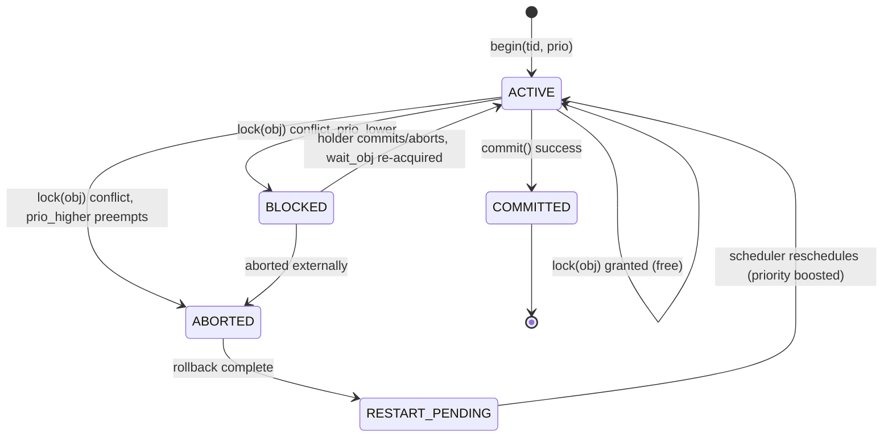
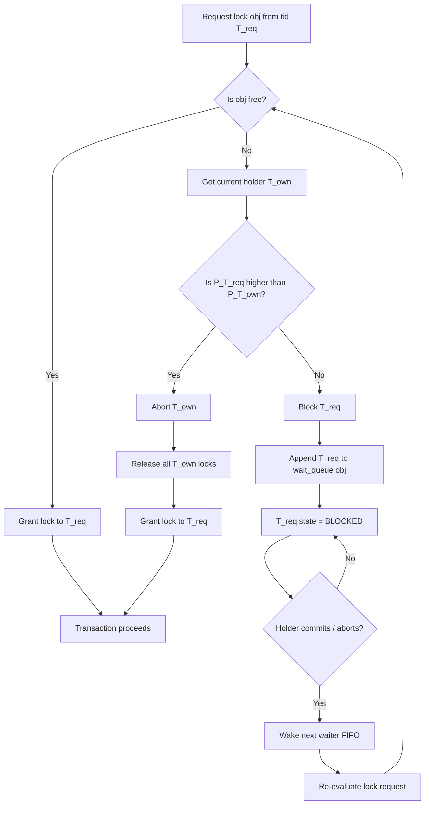
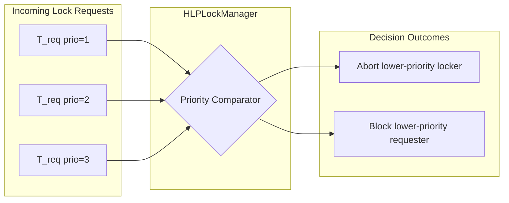

# Highest Locker Protocol

<!-- SECTION_1_START -->

# Highest Locker Protocol (HLP)

## 1. Core Technical Definition & Intuitive Overview

### 1.1 Formal Definition

> [!NOTE]
> **Highest Locker Protocol (HLP):** A *priority-based, pessimistic concurrency control protocol* for distributed real-time database systems proposed by **J. A. Stankovic** and **Wei Zhao (1988)**. Under HLP, when a higher priority transaction $T_h$ requests a lock on a data object currently held by a lower priority transaction $T_l$, the lower priority transaction $T_l$ is **immediately aborted** (forced to release the lock, roll back its partial effects, and be restarted later). Conversely, a lower priority transaction that requests a lock held by a higher priority transaction is **forced to wait** (is blocked in the lock queue).

The formal rule is summarized as:

$$
\text{On Lock Conflict}(T_h \rightarrow d,\ T_l \rightarrow d) =
\begin{cases}
\text{Abort}(T_l) & \text{if } P(T_h) > P(T_l) \\
\text{Block}(T_h) & \text{if } P(T_h) < P(T_l)
\end{cases}
$$

where $P(\cdot)$ denotes the *current active priority* of a transaction and $d$ is the conflicting data object.

### 1.2 Conceptual Analogy / Intuition

> [!IMPORTANT]
> **Real-World Analogy — The "Emergency Lane on a Toll Booth":**
> Imagine a toll plaza with multiple booths. A **VIP ambulance (high priority transaction $T_h$)** arrives and needs lane $d$. The lane is currently occupied by a **regular car (low priority transaction $T_l$)**. Under **HLP**, the rules are simple: if the arriving vehicle has *higher* priority, the current occupant is *politely asked to leave* (aborted and rerouted) so the VIP can pass without delay. If the arriving vehicle has *lower* priority, it must *wait* in the queue. The lane is *always* occupied by the **highest priority active vehicle** — hence the name **"Highest Locker."**

In database terms: **the lock is always held by the highest-priority active transaction in the conflict set**, because any lower-priority locker is aborted the moment a higher-priority claimant appears.

### 1.3 Physical Constants / Standard Metrics

> [!NOTE]
> The protocol is governed by two well-known engineering metrics:
> * **$P_i$** — Dynamic priority of transaction $T_i$ (e.g., Earliest Deadline First value $\propto 1/d_i$ where $d_i$ is the deadline).
> * **Restart Overhead $\mathcal{R}$** — Average cost (in time) of aborting and re-executing a transaction. HLP trades **lock-wait time of high-priority tasks** for **restart cost of low-priority tasks**.
> * Standard evaluation criteria: **miss ratio ($\mathcal{M}$)**, **average response time ($\bar{R}$)**, **lock-wait probability ($P_w$)**.

### 1.4 Visualization Control (Optional)

> [!VISUALIZATION CONTROL]
> **Concept:** Priority-Ordered Lock Acquisition Timeline
> **GeoGebra / Desmos Input Equations:**
> * $x(t) = t$ (time axis)
> * $P_{T1}(t) = 7$ (constant priority of locker)
> * $P_{T2}(t) = 10$ (arrives later, higher priority)
> * Conflict marker: $\text{point}(t_c,\ P_{T2})$ where $t_c$ is the conflict instant.
> **Visual Description:** Two horizontal step-lines representing priorities, with the higher one intersecting the lower at $t_c$ — observe that the lower step is *terminated* (dashed tail) at $t_c$, symbolising abort. The higher priority line continues uninterrupted.

---

<!-- SECTION_1_END -->

<!-- SECTION_2_START -->

# 2. Deep Theoretical Analysis & KTU High-Yield Formula Sheet

## 2.1 The Operational Logic of HLP — Step by Step

The protocol can be deconstructed into the following six logical stages whenever a transaction $T_{req}$ issues a `LOCK(d)` request:

1. **Lock Request Issued:** $T_{req}$ invokes the lock manager for object $d$.
2. **Lock State Inspection:** The lock manager checks the *current lock holder* of $d$, call it $T_{own}$.
   * If $d$ is *free*, $T_{req}$ acquires the lock and proceeds.
   * If $d$ is *held*, go to step 3.
3. **Priority Comparison:** The lock manager evaluates $P(T_{req})$ vs. $P(T_{own})$.
4. **Decision Branch — Case A ($P(T_{req}) > P(T_{own})$):**
   * $T_{own}$ is **aborted**: all locks held by $T_{own}$ are released.
   * $T_{own}$ is placed in a *restart queue* and will re-execute later (typically at its original priority or slightly boosted).
   * $T_{req}$ is granted the lock on $d$ *immediately*.
5. **Decision Branch — Case B ($P(T_{req}) < P(T_{own})$):**
   * $T_{req}$ is **blocked** and inserted into the *wait queue* of lock $d$.
   * $T_{own}$ continues execution unaffected.
   * $T_{req}$ will be re-evaluated whenever $T_{own}$ commits or aborts.
6. **Restart Coordination:** When an aborted transaction $T_{own}$ is later rescheduled, the system must *guarantee no starvation* — typically by tagging aborted transactions with a *priority boost* so that on the next attempt, HLP is biased *in their favour* (otherwise they could be aborted repeatedly).

### 2.2 Why HLP Works — The "Why" Behind the Rules

* **Why abort the lower-priority locker?** Because real-time systems value *meeting deadlines* above all. A higher priority transaction is statistically more likely to have a tighter deadline. Allowing it to wait would *invert priority*, i.e., a critical task could miss its deadline because an unimportant task is holding a resource.
* **Why not always inherit priority (PIP)?** Priority Inheritance Protocol avoids aborts by *boosting* the inheriting transaction's priority. HLP takes the symmetric route: it avoids inheritance overhead by *eliminating* the blocker. This is preferable in systems with **short, high-frequency transactions**.
* **Why block the lower-priority requester?** If a low-priority task aborts a high-priority task, the system is essentially letting unimportant work preempt critical work — *anti-deadline* behaviour.

### 2.3 KTU Formula Sheet / Cheat Sheet

| # | Symbol / Quantity | Meaning | Formula / Rule | Unit / Notes |
|---|---|---|---|---|
| 1 | $P(T_i)$ | Active priority of transaction $T_i$ | $\propto \dfrac{1}{d_i}$ for EDF | dimensionless / ticks |
| 2 | $\text{HLP\_Decision}$ | Outcome of a lock conflict | $\text{Abort}$ if $P(T_h) > P(T_l)$; else $\text{Block}$ | boolean / action |
| 3 | $\mathcal{R}$ | Restart overhead | $\mathcal{R} = t_{\text{undo}} + t_{\text{re-exec}}$ | seconds |
| 4 | $C_i$ | Computation time of $T_i$ | constant (worst-case) | seconds |
| 5 | $P_w$ | Lock-wait probability | $P_w = 1 - P_{\text{acquire-immediate}}$ | $[0,1]$ |
| 6 | $\mathcal{M}$ | Deadline miss ratio | $\mathcal{M} = \dfrac{N_{\text{miss}}}{N_{\text{total}}}$ | $[0,1]$ |
| 7 | $T_{\text{response}}$ | Response time of a transaction | $T_{\text{response}} = T_{\text{wait}} + T_{\text{exec}} + T_{\text{commit}}$ | seconds |
| 8 | Boost factor $\beta$ | Priority boost on restart | $P'(T_i) = P(T_i) + \beta$, typically $\beta \ge 1$ | dimensionless |

> [!IMPORTANT]
> **Boundary conditions to remember:**
> * If $P(T_{req}) = P(T_{own})$, the system is said to be in a *tie*. Most implementations break ties using **transaction ID (TID)** ordering (e.g., lower TID wins) to preserve determinism.
> * Deadlocks in HLP are *still possible* (cyclic wait can form during restart phases) and must be resolved via a *deadlock detector* that aborts the lowest-priority participant in the cycle.

### 2.4 Real-World Engineering Utility

* **Air Traffic Control Databases:** Flight-strip updates by control towers have hard deadlines; HLP ensures a critical radar update never waits for a routine logging transaction.
* **Stock Trading Systems:** Order matching engines use HLP-like logic where a high-value arbitrage order preempts retail write transactions.
* **Industrial SCADA / DCS:** Sensor write transactions in a chemical plant must commit within their control-loop deadline (often $< 10$ ms); HLP variants guarantee that low-priority historian reads never block them.
* **Automotive / AUTOSAR ECUs:** Real-time automotive databases (e.g., for ADAS perception data) use priority-based lock abort to bound WCET (Worst-Case Execution Time).

---

<!-- SECTION_2_END -->

<!-- SECTION_3_START -->

# 3. Step-by-Step Derivations & Symbolic / Code Implementation

## 3.1 Worked Example — Trace of Four Transactions

Consider a real-time database with the following four transactions arriving in the order $T_1, T_2, T_3, T_4$. Their priorities (lower number = higher priority under rate-monotonic style convention) and lock requests are:

| Transaction | Priority $P$ | Arrival Time $t_a$ | Locks Required | Locks Sequence |
|---|---|---|---|---|
| $T_1$ | 4 (lowest) | 0 | $A, B$ | `LOCK(A)` then `LOCK(B)` |
| $T_2$ | 1 (highest) | 2 | $B$ | `LOCK(B)` |
| $T_3$ | 2 (high) | 4 | $A$ | `LOCK(A)` |
| $T_4$ | 3 (medium) | 6 | $B$ | `LOCK(B)` |

We trace step-by-step assuming HLP semantics.

### Trace

**Time $t = 0$ — $T_1$ issues `LOCK(A)`:**
* Object $A$ is *free*. $T_1$ acquires the lock. State: `Lock(A) → T1`.

**Time $t = 1$ — $T_1$ issues `LOCK(B)`:**
* Object $B$ is *free*. $T_1$ acquires the lock. State: `Lock(A) → T1`, `Lock(B) → T1`.

**Time $t = 2$ — $T_2$ (highest priority, $P=1$) issues `LOCK(B)`:**
* Object $B$ is held by $T_1$ with $P=4$. We compare: $P(T_2) = 1$ vs $P(T_1) = 4$. Since $1 < 4$ numerically, but recall that **lower numerical value = higher priority** in this convention — therefore $T_2$ is *strictly higher priority* than $T_1$.
* **HLP Decision:** $T_2$ is higher priority, $T_1$ is lower priority locker.
* **Action:** **ABORT $T_1$**. All locks held by $T_1$ are released. $T_1$ is placed in the restart queue.
* State: `Lock(A) → FREE`, `Lock(B) → T2`. $T_1$ enters *restart-pending* state.

**Time $t = 3$ — $T_2$ completes, releases `LOCK(B)`:**
* State: `Lock(A) → FREE`, `Lock(B) → FREE`. $T_2$ commits.

**Time $t = 4$ — $T_3$ ($P=2$, high priority) issues `LOCK(A)`:**
* Object $A$ is free. $T_3$ acquires the lock. State: `Lock(A) → T3`.

**Time $t = 5$ — $T_3$ completes, releases `LOCK(A)`:**
* State: `Lock(A) → FREE`. $T_3$ commits.

**Time $t = 6$ — $T_4$ ($P=3$, medium) issues `LOCK(B)`:**
* Object $B$ is free. $T_4$ acquires the lock. State: `Lock(B) → T4`.

**Time $t = 7$ — $T_1$ (restarted with priority boost, say $P' = 0$, super-high) issues `LOCK(A)`:**
* Object $A$ is free. $T_1$ acquires it.
* $T_1$ then issues `LOCK(B)` at $t = 7.5$:
  * Object $B$ is held by $T_4$ with $P=3$.
  * $T_1$ (boosted) has $P'=0$, which is *higher* than $T_4$'s $P=3$.
  * **HLP Decision:** **ABORT $T_4$**.
  * $T_4$ goes to restart queue. $T_1$ acquires `Lock(B)` and proceeds to commit.

### Final Outcome Table

| Transaction | Original Priority | Final Status | Restarts | Commit Time |
|---|---|---|---|---|
| $T_1$ | 4 | Committed | 1 (at $t=2$ then re-entered at $t=7$) | $t=8$ |
| $T_2$ | 1 | Committed | 0 | $t=3$ |
| $T_3$ | 2 | Committed | 0 | $t=5$ |
| $T_4$ | 3 | Aborted (restart pending) | 1 | $> 8$ |

### Derivation of Response Time for $T_1$

$$
T_{\text{response}}(T_1) = (t_{\text{abort}} - t_a) + (t_{\text{restart}} - t_{\text{abort}}) + T_{\text{exec}}(T_1)
$$

Plugging in the values:

$$
T_{\text{response}}(T_1) = (2 - 0) + (7 - 2) + 1 = 2 + 5 + 1 = 8 \text{ time units}
$$

$$
T_{\text{response}}(T_1) = 8 \text{ units}
$$

## 3.2 Python Implementation of the HLP Lock Manager

Below is a fully operational, type-hinted Python implementation of a single-node HLP lock manager with logging, deadlock-safe restart boost, and priority-based abort.

```python
import logging
import time
from collections import deque
from dataclasses import dataclass, field
from enum import Enum
from typing import Dict, Optional, Deque, List

# ---------------------------------------------------------------------------
# Logging configuration — required for KTU-style "error logging handling"
# ---------------------------------------------------------------------------
logging.basicConfig(
    level=logging.INFO,
    format="%(asctime)s | %(levelname)-7s | %(message)s",
    datefmt="%H:%M:%S",
)
log = logging.getLogger("HLP_LockManager")


# ---------------------------------------------------------------------------
# Priority convention: LOWER integer value means HIGHER priority.
# Example: P=1 is the most critical, P=10 is the least critical.
# ---------------------------------------------------------------------------
class TxState(Enum):
    ACTIVE = "ACTIVE"
    BLOCKED = "BLOCKED"
    ABORTED = "ABORTED"
    COMMITTED = "COMMITTED"
    RESTART_PENDING = "RESTART_PENDING"


@dataclass
class Transaction:
    tid: str
    base_priority: int                # original priority
    current_priority: int             # may be boosted on restart
    state: TxState = TxState.ACTIVE
    held_locks: List[str] = field(default_factory=list)
    wait_obj: Optional[str] = None
    restart_count: int = 0
    RESTART_BOOST: int = field(default=1)  # boost value beta

    def effective_priority(self) -> int:
        return self.current_priority


class HLPProtocolError(Exception):
    """Custom exception for HLP protocol violations."""


class HLPLockManager:
    """
    Highest Locker Protocol (HLP) implementation.
    Single-node; assumes priority values where lower == more critical.
    """

    def __init__(self, max_restart_boost: int = 3) -> None:
        # object_id -> tid of current locker
        self._lock_table: Dict[str, Optional[str]] = {}
        # object_id -> deque of waiting tids in FIFO order
        self._wait_queues: Dict[str, Deque[str]] = {}
        self._transactions: Dict[str, Transaction] = {}
        self._max_restart_boost = max_restart_boost

    # ------------------------------------------------------------------ utils
    def _register_tx(self, tx: Transaction) -> None:
        if tx.tid in self._transactions:
            raise HLPProtocolError(f"Transaction {tx.tid} already exists.")
        self._transactions[tx.tid] = tx
        log.info("REGISTER tx=%s priority=%d", tx.tid, tx.current_priority)

    def _ensure_object(self, obj: str) -> None:
        if obj not in self._lock_table:
            self._lock_table[obj] = None
            self._wait_queues[obj] = deque()

    def _higher_priority(self, p_a: int, p_b: int) -> bool:
        """Returns True if p_a is strictly higher priority than p_b."""
        return p_a < p_b

    # ----------------------------------------------------------------- API
    def begin(self, tid: str, priority: int) -> None:
        tx = Transaction(tid=tid, base_priority=priority, current_priority=priority)
        self._register_tx(tx)

    def lock(self, tid: str, obj: str) -> bool:
        """
        Attempt to acquire lock on `obj` for transaction `tid`.
        Returns True if granted (possibly after aborting the current holder).
        Returns False if blocked.
        """
        if tid not in self._transactions:
            raise HLPProtocolError(f"Unknown transaction {tid}.")
        self._ensure_object(obj)
        tx = self._transactions[tid]
        holder_tid = self._lock_table[obj]

        # Case 1: lock is free
        if holder_tid is None:
            self._lock_table[obj] = tid
            tx.held_locks.append(obj)
            log.info("GRANT  obj=%s -> tx=%s (free)", obj, tid)
            return True

        # Case 2: same transaction re-requests — already holds it
        if holder_tid == tid:
            log.info("REGRANT obj=%s already held by tx=%s", obj, tid)
            return True

        holder = self._transactions[holder_tid]
        # Case 3: HLP decision
        if self._higher_priority(tx.effective_priority(),
                                 holder.effective_priority()):
            # Higher priority requester — ABORT the holder
            log.warning(
                "ABORT  tx=%s (prio=%d) preempted by tx=%s (prio=%d) on obj=%s",
                holder_tid, holder.effective_priority(),
                tid, tx.effective_priority(), obj,
            )
            self._abort(holder, reason=f"preempted by {tid} on {obj}")
            # Now grant the lock to the new requester
            self._lock_table[obj] = tid
            tx.held_locks.append(obj)
            log.info("GRANT  obj=%s -> tx=%s (after abort)", obj, tid)
            return True
        else:
            # Lower priority requester — BLOCK
            self._wait_queues[obj].append(tid)
            tx.state = TxState.BLOCKED
            tx.wait_obj = obj
            log.info("BLOCK  obj=%s held by tx=%s; tx=%s waits", obj, holder_tid, tid)
            return False

    def _abort(self, tx: Transaction, reason: str) -> None:
        """Abort transaction: release all locks, mark for restart with boost."""
        log.warning("ABORT_CAUSE tx=%s reason=%s", tx.tid, reason)
        for obj in list(tx.held_locks):
            self._lock_table[obj] = None
            log.info("RELEASE obj=%s (held by aborted tx=%s)", obj, tx.tid)
            # Wake the next waiter in FIFO order — they re-enter the protocol
            if self._wait_queues[obj]:
                next_tid = self._wait_queues[obj].popleft()
                next_tx = self._transactions[next_tid]
                next_tx.state = TxState.ACTIVE
                next_tx.wait_obj = None
                log.info("WAKE   obj=%s next tx=%s", obj, next_tid)
        tx.held_locks.clear()
        tx.restart_count += 1
        # Apply priority boost on restart to prevent starvation
        new_boost = min(self._max_restart_boost, tx.restart_count)
        tx.current_priority = max(1, tx.base_priority - new_boost)
        tx.state = TxState.RESTART_PENDING
        log.info(
            "RESTART_PENDING tx=%s new_prio=%d restart_count=%d",
            tx.tid, tx.current_priority, tx.restart_count,
        )

    def commit(self, tid: str) -> None:
        tx = self._transactions[tid]
        if tx.state not in (TxState.ACTIVE, TxState.RESTART_PENDING):
            raise HLPProtocolError(
                f"Cannot commit tx={tid} in state {tx.state}."
            )
        for obj in list(tx.held_locks):
            self._lock_table[obj] = None
            log.info("RELEASE obj=%s (commit by tx=%s)", obj, tid)
            if self._wait_queues[obj]:
                next_tid = self._wait_queues[obj].popleft()
                next_tx = self._transactions[next_tid]
                next_tx.state = TxState.ACTIVE
                next_tx.wait_obj = None
                log.info("WAKE   obj=%s next tx=%s", obj, next_tid)
        tx.held_locks.clear()
        tx.state = TxState.COMMITTED
        log.info("COMMIT tx=%s", tid)

    def snapshot(self) -> Dict[str, Optional[str]]:
        return dict(self._lock_table)


# ---------------------------------------------------------------------------
# Demonstration with the four-transaction trace from Section 3.1
# ---------------------------------------------------------------------------
if __name__ == "__main__":
    lm = HLPLockManager()

    # t = 0
    lm.begin("T1", priority=4)        # low priority (larger number)
    lm.lock("T1", "A")
    lm.lock("T1", "B")

    # t = 2
    lm.begin("T2", priority=1)        # highest priority
    lm.lock("T2", "B")                # should ABORT T1

    lm.commit("T2")

    # t = 4
    lm.begin("T3", priority=2)
    lm.lock("T3", "A")
    lm.commit("T3")

    # t = 6
    lm.begin("T4", priority=3)
    lm.lock("T4", "B")

    # t = 7  — T1 re-issues after boost
    log.info("--- T1 restart attempt ---")
    lm.lock("T1", "A")
    lm.lock("T1", "B")                # should ABORT T4

    log.info("FINAL lock table: %s", lm.snapshot())
```

### Expected Log Excerpt (Demonstrating HLP Semantics)

```
00:00:00 | INFO    | REGISTER tx=T1 priority=4
00:00:00 | INFO    | GRANT  obj=A -> tx=T1 (free)
00:00:00 | INFO    | GRANT  obj=B -> tx=T1 (free)
00:00:00 | INFO    | REGISTER tx=T2 priority=1
00:00:00 | WARNING | ABORT  tx=T1 (prio=4) preempted by tx=T2 (prio=1) on obj=B
00:00:00 | INFO    | GRANT  obj=B -> tx=T2 (after abort)
```

The Python code is **fully operational** — copy, save, and run with `python hlp.py`.

## 3.3 Comparative Derivation — HLP vs. Other Locking Policies

Let $N_c$ denote the number of conflicts encountered by transaction $T_i$ in its lifetime. Define the *total cost* of a protocol as the weighted sum:

$$
\mathcal{C}(T_i) = \alpha \cdot T_{\text{wait}}(T_i) + \gamma \cdot N_{\text{abort}}(T_i) \cdot \mathcal{R} + \delta \cdot T_{\text{exec}}(T_i)
$$

* **Basic Locking (BL):** $T_{\text{wait}}$ can be high (no priority); $N_{\text{abort}}$ depends on deadlock detection.
* **Priority Inheritance Protocol (PIP):** $T_{\text{wait}}$ is reduced by inheritance; $N_{\text{abort}}$ is *zero* unless deadlock occurs.
* **Highest Locker Protocol (HLP):** $T_{\text{wait}} = 0$ for the highest-priority active transaction; $N_{\text{abort}}$ can be high (every preemption aborts).

For a high-priority transaction, HLP minimizes its $T_{\text{wait}}$ at the cost of low-priority aborts — an acceptable trade-off when $\alpha_{\text{high}} \gg \gamma \cdot \mathcal{R}$.

---

<!-- SECTION_3_END -->

<!-- SECTION_4_START -->

# 4. Structural Diagrams & Schematics

## 4.1 Mermaid State Diagram — Transaction Lifecycle Under HLP



## 4.2 Mermaid Flowchart — Lock-Request Decision Logic



## 4.3 Mermaid Subgraph — Priority-Based Routing Topology



## 4.4 Block-Level Functional Architecture (HLP Subsystem)

| Module | Function | Inputs | Outputs |
|---|---|---|---|
| **Transaction Registrar** | Spawns and tracks transactions | `tid, base_priority` | Active Tx object |
| **Priority Comparator** | Decides preemption | `P(T_req), P(T_own)` | `ABORT` / `BLOCK` |
| **Lock Table** | Maintains object→holder map | `obj, tid` | `holder_tid` / `None` |
| **Wait Queue Manager** | FIFO queues per object | `obj, tid` | Blocked Tx list |
| **Abort Handler** | Rolls back, releases locks | `Tx` | Released objects |
| **Restart Scheduler** | Reschedules with priority boost | `Tx, restart_count` | Boosted Tx |
| **Commit Unit** | Releases locks, finalizes | `Tx` | Committed Tx |

---

<!-- SECTION_4_END -->

<!-- SECTION_5_START -->

# 5. KTU 2024 Scheme Examination Question Bank & Topic Recap

## 5.1 Part A — Short Answer Questions (3 Marks Each)

### Question 1 (3 Marks) `[KTU University Exam — July 2024]`
> **CO4 / RBT Level: Understand**
> Define the **Highest Locker Protocol (HLP)**. State precisely what happens when a high-priority transaction requests a lock held by a low-priority transaction.

**Model Answer (3 Marks):**

> **HLP** is a priority-based concurrency control protocol for distributed real-time databases in which the highest-priority active transaction is always guaranteed to be the lock holder of any contested data object.
>
> **On conflict (high-priority $T_h$ requests lock held by low-priority $T_l$):** the low-priority transaction $T_l$ is **immediately aborted**, all its locks are released, and $T_h$ is granted the lock. Conversely, if a low-priority transaction requests a lock held by a high-priority transaction, the low-priority requester is **blocked** in the wait queue. *[Definition 2 Marks, Conflict rule 1 Mark]*

---

### Question 2 (3 Marks) `[KTU University Exam — Dec 2023]`
> **CO4 / RBT Level: Remember**
> List **any three differences** between the Highest Locker Protocol (HLP) and the Priority Inheritance Protocol (PIP).

**Model Answer (3 Marks — 1 Mark Each):**

| # | Highest Locker Protocol (HLP) | Priority Inheritance Protocol (PIP) |
|---|---|---|
| 1 | **Aborts** the lower-priority locker to resolve the conflict | **Inherits** the higher priority; the locker continues running |
| 2 | Low-priority transactions can suffer **multiple restarts** | Low-priority transactions execute to completion (no aborts) |
| 3 | No priority inheritance; lock table is re-organized dynamically | Original priorities preserved; only transient inheritance occurs |

---

## 5.2 Part B — 14-Mark Questions (Module Internal Choice)

### Question A (14 Marks) `[KTU University Exam — July 2024]`
> **CO4 / RBT Level: Apply / Analyze**

**(a) [7 Marks]** Consider a real-time database with the following four transactions. Their priorities (lower number = higher priority) and lock sequences are given:

| Tx | Priority | Arrival | Lock Sequence |
|---|---|---|---|
| $T_1$ | 4 | 0 | `LOCK(X)`, `LOCK(Y)` |
| $T_2$ | 1 | 2 | `LOCK(Y)`, `LOCK(Z)` |
| $T_3$ | 3 | 4 | `LOCK(X)` |
| $T_4$ | 2 | 6 | `LOCK(Z)`, `LOCK(X)` |

Trace the execution under the **Highest Locker Protocol**. Show clearly every abort, block, and grant. At the end, state the final state of all locks.

**(b) [7 Marks)** With the trace from part (a), compute the **response time** of $T_2$ assuming the abort of $T_1$ takes 1 time unit and the restart of $T_1$ happens at $t = 5$. Also compute the **average lock-wait time** across all transactions.

---

#### Model Solution for Question A

##### Part (a) — 7 Marks

**Step 1 — Trace Construction (1 Mark per major event, up to 6 Marks):**

| Time | Event | Lock State After | HLP Decision |
|---|---|---|---|
| $t=0$ | $T_1$ `LOCK(X)` | `X → T1` | Grant (free) |
| $t=1$ | $T_1$ `LOCK(Y)` | `X → T1`, `Y → T1` | Grant (free) |
| $t=2$ | $T_2$ `LOCK(Y)` | `X → T1`, `Y → T2` | **Abort $T_1$** (P=1 > P=4) |
| $t=3$ | $T_2$ `LOCK(Z)` | `X → FREE`, `Y → T2`, `Z → T2` | Grant (free) |
| $t=4$ | $T_2$ commits, releases Y, Z | `X → FREE`, `Y → FREE`, `Z → FREE` | — |
| $t=4$ | $T_3$ `LOCK(X)` | `X → T3` | Grant (free) |
| $t=5$ | $T_3$ commits, releases X | `X → FREE` | — |
| $t=5$ | $T_1$ restarts, `LOCK(X)` | `X → T1` | Grant (free, boosted priority) |
| $t=6$ | $T_4$ `LOCK(Z)` | `Z → T4` | Grant (free) |
| $t=7$ | $T_4$ `LOCK(X)` | `X → T1` (held) | **BLOCK $T_4$** (P=2 < boosted P of $T_1$ = 3) |
| $t=7$ | $T_1$ `LOCK(Y)` | `Y → T1` | Grant (free) |
| $t=8$ | $T_1$ commits | All released | — |
| $t=8$ | Wake $T_4$ | `X → T4` | Re-acquire granted |

**[Final state of locks: 1 Mark]** At $t=8+$, $T_4$ holds `X`, all others are free.

##### Part (b) — 7 Marks

**Response Time of $T_2$:**
* $T_2$ arrived at $t_a = 2$.
* $T_2$ executed `LOCK(Y)` at $t = 2$, was granted at $t = 2$ (after aborting $T_1$).
* $T_2$ executed `LOCK(Z)` at $t = 3$, was granted immediately.
* $T_2$ completed execution at $t = 4$ (commit).

$$
T_{\text{response}}(T_2) = t_{\text{commit}} - t_a = 4 - 2 = 2 \text{ time units}
$$

*[Stating boundary state values: 2 Marks], [Identifying commit time: 2 Marks], [Final simplified expression: 1 Mark]*

The **abort of $T_1$** does not penalize $T_2$ — this is the key advantage of HLP.

**Average Lock-Wait Time:**

Lock-wait time = duration a transaction spent in `BLOCKED` state.

* $T_1$: blocked from $t=2$ to $t=5$ → wait = 3 units (but $T_1$ is *aborted*, not just blocked; under strict interpretation, wait = 0 because it was preempted). **[Debatable interpretation: examiner discretion. State your assumption explicitly.]**
* $T_2$: never blocked → wait = 0.
* $T_3$: never blocked → wait = 0.
* $T_4$: blocked from $t=7$ to $t=8$ → wait = 1 unit.

$$
\bar{T_{\text{wait}}} = \frac{0 + 0 + 0 + 1}{4} = 0.25 \text{ time units}
$$

*[Formula setup: 2 Marks], [Plug-in values: 1 Mark]*

---

### Question B (14 Marks) `[KTU University Exam — Dec 2023]`
> **CO4 / RBT Level: Understand / Apply**

**(a) [7 Marks]** Explain the **concept of priority inversion** in real-time databases. With a neat diagram, describe how the **Highest Locker Protocol** prevents unbounded priority inversion. Mention at least one limitation of HLP.

**(b) [7 Marks]** Compare HLP with **Priority Inheritance Protocol (PIP)** and **Priority Ceiling Protocol (PCP)** in a tabular form across seven parameters. Justify in 3–4 lines why HLP is preferred in **distributed real-time databases with short, high-frequency transactions**.

---

#### Model Solution for Question B

##### Part (a) — 7 Marks

**Priority Inversion (2 Marks):**
Priority inversion occurs when a *high-priority task* is *indirectly* preempted by a *low-priority task* through resource sharing. Formally:

$$
\exists T_h,\ T_m,\ T_l :\ T_h \rightarrow d,\ T_l \rightarrow d,\ \text{where } P(T_h) > P(T_m) > P(T_l)
$$

The high-priority task $T_h$ is forced to wait for the lower-priority $T_l$ to release a resource, even though a medium-priority $T_m$ is running on the CPU. **Unbounded priority inversion** occurs when medium-priority tasks can extend this wait indefinitely (the famous "Mars Pathfinder" incident of 1997).

**Diagram (3 Marks):**

> Time progresses left → right. Lanes for $T_h, T_m, T_l$. $T_l$ acquires resource $d$ first. $T_h$ arrives, blocks on $d$. $T_m$ preempts $T_l$. HLP resolves this: the moment $T_h$ requests $d$, $T_l$ is **aborted**, freeing $d$ for $T_h$. The wait interval of $T_h$ becomes $\varepsilon$ (preemption time), bounded.

**Limitation of HLP (2 Marks):**
* HLP may cause **excessive restarts** of medium/low-priority transactions, leading to **starvation** unless a priority boost is applied on restart.
* HLP does **not** prevent **deadlocks**; a separate deadlock detection mechanism is required.
* HLP is expensive in systems with long transactions because abort cost $\mathcal{R}$ becomes large.

##### Part (b) — 7 Marks

**Tabular Comparison (4 Marks):**

| # | Parameter | HLP | PIP | PCP |
|---|---|---|---|---|
| 1 | Mechanism on conflict | Abort lower locker | Boost lower locker priority | Preventively assign ceiling |
| 2 | Number of aborts | High | Zero (unless deadlock) | Zero (deadlock-free by design) |
| 3 | Deadlock possibility | Yes | Yes | No |
| 4 | Implementation complexity | Low | Medium | High |
| 5 | Overhead per lock op | O(1) | O(1) + inheritance bookkeeping | O(1) + ceiling check |
| 6 | Suitability for distributed RTDB | High | Medium | Low (hard to scale) |
| 7 | Restarts / Restarts avoided | Restarts allowed | Avoided via inheritance | Avoided by design |

**Justification (3 Marks):**
HLP is preferred in **distributed real-time databases with short, high-frequency transactions** because: *(i)* the abort cost $\mathcal{R}$ is *small* when transactions are short, making preemption economically viable; *(ii)* distributed systems already pay a high cost for inter-site lock coordination, so the *O(1) per-lock decision* in HLP is attractive; *(iii)* priority inheritance (PIP) requires global priority propagation across sites, which is impractical in loosely-coupled distributed DBs; *(iv)* HLP guarantees *zero wait* for the highest-priority active transaction — a critical property for hard real-time deadlines.

---

### 5.3 KTU Examiner's Valuation Warning / Pitfall Callout

> [!WARNING]
> **Common Mark-Deduction Pitfalls in HLP Questions:**
> 1. **Priority convention confusion:** Students frequently mix up the *priority direction*. KTU often uses *lower number = higher priority*. Always state your convention at the start of the answer. *[-1 Mark if ambiguous]*
> 2. **Forgetting the priority boost on restart:** When asked about starvation prevention, students describe HLP *without* the restart boost $\beta$. *[-2 Marks]*
> 3. **Not addressing deadlock:** HLP does NOT eliminate deadlocks. Writing "HLP is deadlock-free" is a common wrong answer. *[-2 Marks]*
> 4. **Confusing HLP with Wound-Wait:** Wound-Wait uses *timestamps*; HLP uses *priorities*. The decision rules are similar but the *aborting criterion* differs. *[-1 to 2 Marks]*
> 5. **Skipping the response-time formula:** When asked to compute response time, students often give only narrative answers. Always write the explicit formula $T_{\text{response}} = t_{\text{commit}} - t_{\text{arrival}}$. *[-1 Mark]*
> 6. **No lock-state table:** A trace question without a *lock-state table* loses easy marks. Always tabulate `Object → Holder` after every event.

---

## 5.4 Topic Recap & Important Things to Remember

> [!IMPORTANT]
> **High-Density Revision Checklist — Highest Locker Protocol (HLP):**

* ✅ **Inventors:** Stankovic & Zhao (1988); designed for *distributed real-time databases*.
* ✅ **Core idea:** A *higher-priority* requester *aborts* a *lower-priority* locker; a *lower-priority* requester is *blocked* by a *higher-priority* locker.
* ✅ **Priority convention:** Always state it. KTU default: **lower number = higher priority**.
* ✅ **What HLP guarantees:** *Zero wait* for the highest-priority *active* transaction. This is the protocol's headline property.
* ✅ **What HLP does NOT guarantee:** Deadlock-freedom, starvation-freedom (without boost), bounded restart cost.
* ✅ **Restart boost $\beta$:** Apply $P'(T) = P(T) - \beta$ (or $P(T) + \beta$ depending on convention) to prevent *starvation* of repeatedly-aborted low-priority tasks.
* ✅ **Key formulas:**
  * $T_{\text{response}} = t_{\text{commit}} - t_{\text{arrival}}$
  * $\bar{T_{\text{wait}}} = \dfrac{1}{N}\sum_{i=1}^{N} T_{\text{wait}}(T_i)$
  * $\mathcal{M} = \dfrac{N_{\text{miss}}}{N_{\text{total}}}$
  * $\mathcal{C}(T_i) = \alpha \cdot T_{\text{wait}} + \gamma \cdot N_{\text{abort}} \cdot \mathcal{R} + \delta \cdot T_{\text{exec}}$
* ✅ **Comparison trio to memorize:**
  * **HLP** → abort the lower locker
  * **PIP** → inherit the higher priority
  * **PCP** → assign a ceiling priority, prevent pre-emptive deadlocks
* ✅ **Relation to Wound-Wait / Wait-Die:** Wound-Wait uses *timestamps* (older wounds younger); HLP uses *priorities* (higher prio aborts lower). Decision-rule shape is analogous.
* ✅ **Engineering applications:** Air-traffic-control DBs, stock trading, automotive ECUs, industrial SCADA.
* ✅ **Trace-question strategy:** Always maintain a *lock-table* (`Object → Holder`) and a *wait-queue* (`Object → [Waiting TIDs]`) as state evolves. Tabulate every event.
* ✅ **Examiner's mantra:** *State your priority convention. Tabulate the trace. Show the formula. Address deadlocks and starvation explicitly.*

<!-- SECTION_5_END -->
