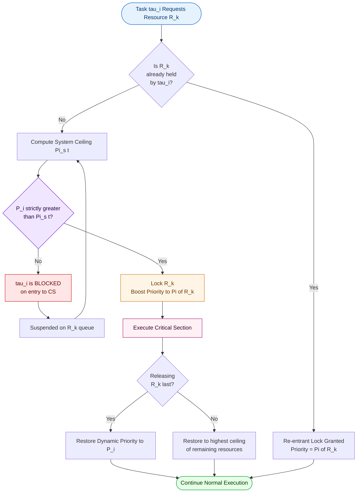
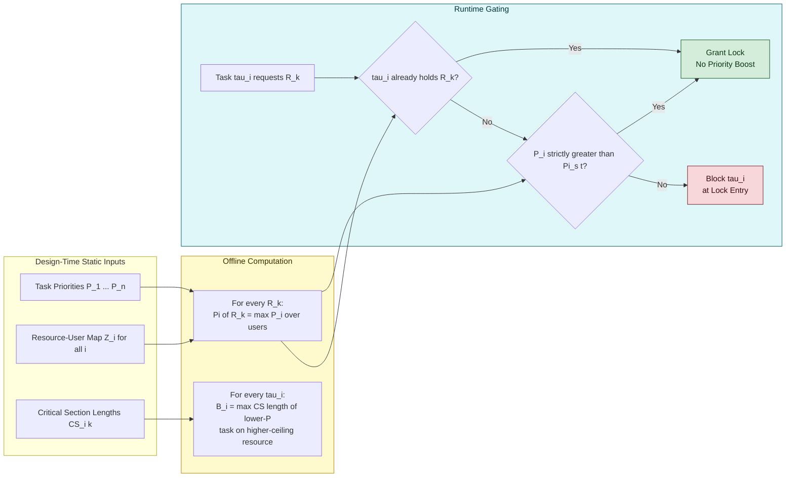
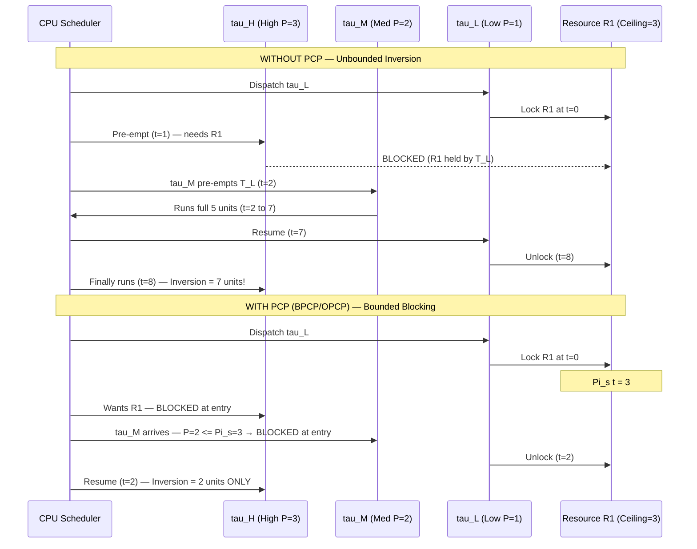
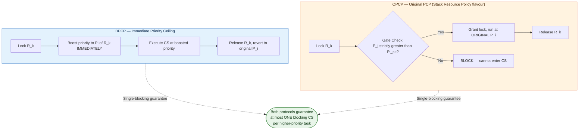

# Priority Ceiling Protocol

<!-- SECTION_1_START -->
# Priority Ceiling Protocol (PCP) — KTU 2024 Module 2 Study Note

## 1. Core Technical Definition & Intuitive Overview

### 1.1 Formal Definition (KTU 2024 Syllabus Terminology)

The **Priority Ceiling Protocol (PCP)** is a concurrency-control and resource-access discipline used in real-time preemptive scheduling that prevents **unbounded priority inversion**, **deadlock**, and **mutual blocking chains** in a uni-processor system executing a fixed set of periodic/sporadic tasks that share mutually exclusive resources.

> [!IMPORTANT]
> **KTU 2024 Highlight:** PCP is a *static* resource allocation protocol — the ceiling of every resource is decided **offline** at system design time and is never changed at runtime.

Formally, for a system of $n$ tasks $\tau_1, \tau_2, \ldots, \tau_n$ with priorities $P_1 > P_2 > \ldots > P_n$, the **Priority Ceiling** of a resource $R_k$ is defined as:

$$\Pi(R_k) = \max_{i \,:\, \tau_i \text{ accesses } R_k} \{ P_i \}$$

i.e., the **highest priority** of *any* task that may lock the resource $R_k$.

Two principal variants are studied under KTU Module 2:

1. **Basic Priority Ceiling Protocol (BPCP)** — also called the *Immediate Priority Ceiling Protocol* or *Highest Locker Protocol*. A task's *dynamic* priority is raised to the ceiling of *any* resource it locks — *immediately* upon lock acquisition.
2. **Original Priority Ceiling Protocol (OPCP)** — also called the *Priority Ceiling Protocol (PCP) proper* or *Ceiling Priority Protocol*. A task may lock a resource $R$ **only if** its priority is **strictly higher** than the *system ceiling* — the maximum ceiling of all resources currently locked by *other* tasks. Once locked, the task executes at its *own* assigned priority.

> [!NOTE]
> **KTU Board Terminology Trap:** Many students conflate *Basic* PCP with *Original* PCP. The BPCP boosts priority *immediately upon every lock*. The OPCP uses a *system ceiling* *gating rule* to *prevent* locking a resource unless it is "safe."

---

### 1.2 Conceptual Analogy / Intuition

Imagine a **hospital emergency ward with three doctors**:

- **Dr. A (Senior Surgeon)** — highest priority, performs *Appendectomy* and *MRI Scan*.
- **Dr. B (Junior Surgeon)** — medium priority, performs only *MRI Scan*.
- **Dr. C (Nurse)** — lowest priority, performs only *Appendectomy*.

The **Operation Theatre (OT)** can hold only **one surgery at a time** (mutual exclusion). Two resources exist: $R_1 =$ *OT* (used by both A and B), $R_2 =$ *Pharmacy* (used by A and C).

* **Priority Ceiling of OT** = priority of A (the highest user).
* **Priority Ceiling of Pharmacy** = priority of A.

Now, the **"priority ceiling rule"** is like a *ward-boy policy*:

> *No doctor may enter a room whose current "ceiling" label is higher than (or equal to) his/her own rank — UNLESS that doctor is the one who is *currently* holding it.*

If Dr. C is in Pharmacy and Dr. A wants the MRI room, the MRI room's ceiling = A. Since B's priority is below A's ceiling, B is **blocked from entering the MRI room** until A finishes with the MRI room. This avoids *circular wait* and *chained blocking*.

> The "priority boost" of BPCP is like a doctor *automatically wearing the senior surgeon's gown* the moment he steps into the OT — even if he's just going to check on a patient. This ensures *no junior can pre-empt a senior* and *no two juniors can fight* over a shared instrument.

---

### 1.3 Key Constants and Standard Metrics

| Symbol | Meaning |
|---|---|
| $n$ | Number of tasks in the system |
| $P_i$ | Fixed (static) priority of task $\tau_i$ |
| $D_i$ | Relative deadline of $\tau_i$ |
| $T_i$ | Period of $\tau_i$ |
| $R_i$ | Worst-case response time of $\tau_i$ |
| $B_i$ | Worst-case blocking time of $\tau_i$ |
| $C_i$ | Worst-case execution time of $\tau_i$ |
| $\Pi(R_k)$ | Priority ceiling of resource $R_k$ |
| $\Pi_s(t)$ | System (current) ceiling at time $t$ |
| $Z_i$ | Set of resources accessed by $\tau_i$ |

> [!IMPORTANT]
> **Physical/Engineering Meaning of "Ceiling":** The ceiling is the *maximum* priority that can ever be claimed by *anyone* using that resource. It is **static** (computed at design time) and is the *single number* that enforces the entire protocol.

---

### 1.4 GeoGebra / Desmos Visualization Callout

> [!VISUALIZATION CONTROL]
> **Concept:** Two-task priority inversion scenario with shared resource (timeline of priorities on the y-axis vs. time on the x-axis).
>
> **Desmos Input Equations:**
>
> * $f_{1}(x) = 3$ for $x \in [0,2]$ (High-priority task $\tau_H$ at $P=3$)
> * $f_{2}(x) = 1$ for $x \in [1,3]$ (Low-priority task $\tau_L$ at $P=1$)
> * $f_{3}(x) = 2$ for $x \in [2,4]$ (Medium-priority task $\tau_M$ at $P=2$, the *inverting* task)
> * Point markers: $(1,1)$ Lock, $(2,3)$ Unlock, $(3,1)$ Pre-empt, $(4,1)$ Resume, $(5,3)$ Complete
>
> **Visual Description:** Plot priority on the y-axis (0 to 4) and time on the x-axis (0 to 6). The student should observe how $\tau_H$ (blue, $P=3$) is *pushed down* to $P=1$ while $\tau_L$ holds the resource, then *further delayed* by $\tau_M$ (red, $P=2$) that pre-empts $\tau_L$ — a classic **unbounded priority inversion** that PCP eliminates.

<!-- SECTION_1_END -->

<!-- SECTION_2_START -->
## 2. Deep Theoretical Analysis & KTU High-Yield Formula Sheet

### 2.1 The Problem PCP Solves — Priority Inversion

A **priority inversion** occurs whenever a higher-priority task $\tau_H$ is forced to wait for a lower-priority task $\tau_L$ to release a shared resource. It becomes **unbounded** when, additionally, medium-priority tasks pre-empt $\tau_L$ while $\tau_L$ holds the resource, delaying $\tau_H$ indefinitely.

> [!NOTE]
> **Famous Real-World Case:** The **Mars Pathfinder** spacecraft (1997) suffered repeated system resets due to *unbounded priority inversion* on its bus semaphore. The VxWorks scheduler used priority inheritance, but a *watchdog* detected the inversion and reset the system. The bug was eventually diagnosed by replaying telemetry.

PCP prevents this with **two guarantees**:

1. **No deadlock** under nested/exclusive resource access.
2. **Bounded blocking** — every task $\tau_i$ is blocked by **at most one lower-priority task** (a *single* critical section), regardless of how many resources it shares.

### 2.2 BPCP — Operational Rule Set

**Rules of the Basic Priority Ceiling Protocol (Immediate PCP):**

1. **Ceiling Assignment Rule:** Each resource $R_k$ is assigned a static ceiling $\Pi(R_k) = \max\{P_i : \tau_i \text{ uses } R_k\}$.
2. **Locking Rule:** A task $\tau_i$ may lock a resource $R_k$ only if its *current* dynamic priority is **strictly higher** than the system ceiling $\Pi_s(t)$ — OR $R_k$ is *already* locked by $\tau_i$ (re-entrancy).
3. **Priority Boost Rule:** When $\tau_i$ successfully locks $R_k$, its *dynamic* priority is **immediately raised** to $\Pi(R_k)$.
4. **Restoration Rule:** When $\tau_i$ releases $R_k$, its dynamic priority reverts to the **highest ceiling** of any resource it *still* holds, or to its original $P_i$ if none remain.
5. **Pre-emption Rule:** The scheduler always dispatches the ready task with the **highest dynamic priority** (ties broken by user policy).

> [!IMPORTANT]
> **Why "strictly higher"?** The strict-greater rule guarantees that at most **one** task can be inside a critical section at any instant — eliminating the possibility of *circular wait* (a Coffman deadlock condition).

### 2.3 OPCP — Operational Rule Set

**Rules of the Original Priority Ceiling Protocol:**

1. **Ceiling Assignment Rule:** Same as BPCP — $\Pi(R_k)$ is the *maximum static priority* of any task that may lock $R_k$.
2. **System Ceiling:** $\Pi_s(t) = \max\{\Pi(R_k) : R_k \text{ is currently locked by some task}\}$ (a function of time).
3. **Locking Rule (Gating):** A task $\tau_i$ may lock $R_k$ **iff** $P_i > \Pi_s(t)$ — or $R_k$ is already locked by $\tau_i$.
4. **Priority Boost Rule:** $\tau_i$ executes at its *assigned* priority $P_i$ — **no boost** during execution.
5. **Pre-emption Rule:** Same as BPCP — highest dynamic priority wins the CPU.

> [!NOTE]
> **Key Difference:** In OPCP, the priority boost is *implicit* — by the gating rule, no other task can be inside a critical section using a higher-ceiling resource, so the running task is automatically the *most important critical-section holder*.

### 2.4 BPCP vs OPCP — Comparative Logic

| Property | BPCP | OPCP |
|---|---|---|
| Priority boost mechanism | Explicit, immediate to $\Pi(R_k)$ | Implicit via gating rule |
| Number of context switches per critical section | Higher (more switches due to boost/unboost) | Lower (no extra boost) |
| Blocking bound | One critical section of *any* lower-priority task | One critical section of *any* lower-priority task |
| Pre-emption while in CS | Other tasks can pre-empt a low-priority task *inside* its CS if the running task is higher | Same — but the gating rule ensures *only one* CS executes at a time |
| Deadlock-free | Yes | Yes |
| Used in practice | Ada95 Ravenscar profile, VxWorks variant | Mars Pathfinder fix, ARINC-653 |

### 2.5 KTU High-Yield Formula Sheet (Use `\vert` for absolute value — **no raw `|`**)

| \# | Formula | Meaning | Used For |
|---|---|---|---|
| 1 | $\Pi(R_k) = \max_{i : R_k \in Z_i}\{P_i\}$ | Ceiling of resource $R_k$ | Static design-time assignment |
| 2 | $B_i = \max_{k : \Pi(R_k) > P_i} \{ \text{length of longest CS in } R_k \text{ used by a lower-priority task}\}$ | Worst-case blocking for $\tau_i$ | Bounded blocking proof |
| 3 | $R_i = C_i + B_i + \sum_{j \in hp(i)} \left\lceil \frac{R_i}{T_j} \right\rceil C_j$ | Response-time recurrence | Feasibility test |
| 4 | $U = \sum_{i=1}^{n} \frac{C_i}{T_i}$ | Total utilization | Necessary (not sufficient) schedulability |
| 5 | $U \leq n(2^{1/n} - 1)$ | Liu & Layland bound for RMS | Sufficient (RMS only) |
| 6 | $\Pi_s(t) = \max_{R_k \text{ locked at } t}\{\Pi(R_k)\}$ | System ceiling at time $t$ | OPCP gating decision |
| 7 | $\text{Block}_i^{\text{PCP}} \leq \text{one CS of any } \tau_j \text{ with } P_j < P_i$ | Single-blocking bound | Both BPCP and OPCP |
| 8 | $\text{Priority Inversion Duration} \leq \max_{k : \tau_L \text{ uses } R_k} \{ \text{length of CS}\}$ | Bounded inversion | Mars-Pathfinder-style bound |

> [!NOTE]
> **Real-World Utility:** PCP is used in:
> * **Aerospace:** ARINC-653, RTEMS, VxWorks (Mars Pathfinder patch).
> * **Automotive:** AUTOSAR-OS, OSEK/VDX for engine-control and brake-by-wire ECUs.
> * **Medical:** FDA-cleared real-time pacemakers and infusion pumps.
> * **Industrial Robotics:** Siemens SIMOTION, Beckhoff TwinCAT.

<!-- SECTION_2_END -->

<!-- SECTION_3_START -->
## 3. Step-by-Step Derivations & Symbolic Implementation

### 3.1 Worked Example — Ceiling Computation

**Problem:** A system has 3 tasks sharing 2 resources.

| Task | Priority $P_i$ | Period $T_i$ | Resources Used |
|---|---|---|---|
| $\tau_1$ | 3 (highest) | 10 | $R_1, R_2$ |
| $\tau_2$ | 2 | 15 | $R_1$ |
| $\tau_3$ | 1 (lowest) | 20 | $R_2$ |

Find $\Pi(R_1)$, $\Pi(R_2)$, and the system ceiling at $t = t_0$ when both resources are locked by their respective tasks.

**Step 1 — Ceiling of $R_1$:**
Tasks using $R_1$ are $\tau_1$ and $\tau_2$. Hence,

$$\Pi(R_1) = \max\{P_1, P_2\} = \max\{3, 2\} = 3.$$

**Step 2 — Ceiling of $R_2$:**
Tasks using $R_2$ are $\tau_1$ and $\tau_3$. Hence,

$$\Pi(R_2) = \max\{P_1, P_3\} = \max\{3, 1\} = 3.$$

**Step 3 — System ceiling at $t_0$:**
Both $R_1$ and $R_2$ are locked, so

$$\Pi_s(t_0) = \max\{\Pi(R_1), \Pi(R_2)\} = \max\{3, 3\} = 3.$$

**Step 4 — Verdict:** No other task (since $P_1 = 3$ is the maximum) may enter any critical section. This is the **golden state** that guarantees no deadlock and no chained blocking.

> [!IMPORTANT]
> **[Valuation Key, 1 Mark Each]:** Correct identification of resource-user set = 1; correct max computation = 1; correct system-ceiling formula = 1.

---

### 3.2 Worked Example — Blocking-Time Bound under PCP

**Problem:** Same 3-task system. Suppose $\tau_1$ uses $R_1$ for 2 ms and $R_2$ for 3 ms; $\tau_2$ uses $R_1$ for 4 ms; $\tau_3$ uses $R_2$ for 5 ms. Find the worst-case blocking $B_i$ for each task.

**Step 1 — For $\tau_1$ ($P_1 = 3$):**
No lower-priority task can block it because $\tau_1$ is the highest-priority task in the system. So,

$$B_1 = 0.$$

**Step 2 — For $\tau_2$ ($P_2 = 2$):**
Lower-priority tasks are $\tau_3$. $\tau_3$ uses $R_2$ for 5 ms. Since $\Pi(R_2) = 3 > P_2 = 2$, the longest CS of any lower-priority task on a higher-ceiling resource is

$$B_2 = \max\{5\} = 5 \text{ ms}.$$

**Step 3 — For $\tau_3$ ($P_3 = 1$):**
No task has priority lower than $\tau_3$, so

$$B_3 = 0.$$

> [!NOTE]
> **Insight:** Under PCP, *each* task is blocked by **at most one** critical section of *one* lower-priority task, **regardless** of how many resources it shares. This is the *cardinality* guarantee.

---

### 3.3 Algorithm — Ceiling Computation & Gating (Python)

```python
"""
Priority Ceiling Protocol — Ceiling Computation and OPCP Gating Simulator.
Reference: KTU PECST748 Module 2 — Real Time Systems.
"""
from __future__ import annotations
from dataclasses import dataclass, field
from typing import Dict, FrozenSet, Optional


@dataclass(frozen=True)
class Task:
    """A real-time task with a fixed priority and a set of accessed resources."""
    tid: str
    priority: int                       # higher number = higher priority
    resources: FrozenSet[str] = field(default_factory=frozenset)


@dataclass
class Resource:
    """A shared resource with a static priority ceiling."""
    rid: str
    ceiling: int = 0                    # computed at design time


def compute_ceilings(tasks: Dict[str, Task]) -> Dict[str, Resource]:
    """
    Computes the static priority ceiling of every resource.

    Formula:
        Pi(Rk) = max{ P_i : task tau_i accesses R_k }
    """
    resources: Dict[str, Resource] = {}
    for task in tasks.values():
        for rid in task.resources:
            if rid not in resources:
                resources[rid] = Resource(rid=rid, ceiling=task.priority)
            else:
                resources[rid].ceiling = max(
                    resources[rid].ceiling, task.priority
                )
    return resources


def system_ceiling(
    locked: Dict[str, str],            # rid -> holding tid
    ceilings: Dict[str, Resource],
) -> int:
    """Pi_s(t) = max{ Pi(Rk) : Rk is currently locked }."""
    if not locked:
        return 0
    return max(ceilings[rid].ceiling for rid in locked)


def may_lock(
    task: Task,
    rid: str,
    locked: Dict[str, str],
    ceilings: Dict[str, Resource],
) -> tuple[bool, str]:
    """
    OPCP Gating Rule:
        A task tau_i may lock R_k IFF
            P_i > Pi_s(t)  OR  R_k is already locked by tau_i.
    """
    # Re-entrancy: same task already holds the resource
    if locked.get(rid) == task.tid:
        return True, "re-entrant lock granted"

    ceiling_s = system_ceiling(locked, ceilings)
    if task.priority > ceiling_s:
        return True, (
            f"granted: P_i={task.priority} > Pi_s(t)={ceiling_s}"
        )
    return False, (
        f"denied: P_i={task.priority} <= Pi_s(t)={ceiling_s}"
    )


def blocking_bound(
    task: Task,
    tasks: Dict[str, Task],
    cs_lengths_ms: Dict[FrozenSet[str], int],
) -> int:
    """
    Worst-case blocking time B_i of task tau_i under PCP.

    B_i = max { length of CS in R_k used by a lower-priority task,
                for all R_k with Pi(R_k) > P_i }.
    """
    ceilings = compute_ceilings(tasks)
    candidates: list[int] = []
    for rid, res in ceilings.items():
        if res.ceiling > task.priority:
            # find lower-priority tasks that use this resource
            for other in tasks.values():
                if other.priority < task.priority and rid in other.resources:
                    candidates.append(
                        cs_lengths_ms.get(
                            frozenset({other.tid, rid}), 0
                        )
                    )
    return max(candidates) if candidates else 0


# ----------------- Demo / driver -----------------
if __name__ == "__main__":
    tasks: Dict[str, Task] = {
        "T1": Task("T1", priority=3, resources=frozenset({"R1", "R2"})),
        "T2": Task("T2", priority=2, resources=frozenset({"R1"})),
        "T3": Task("T3", priority=1, resources=frozenset({"R2"})),
    }

    ceilings = compute_ceilings(tasks)
    for rid, res in ceilings.items():
        print(f"Ceiling of {rid} = {res.ceiling}")

    # Simulate: T1 holds R1, T2 wants R1
    locked = {"R1": "T1"}
    decision, reason = may_lock(tasks["T2"], "R1", locked, ceilings)
    print(f"T2 request R1 -> {decision} ({reason})")

    cs_lengths = {
        frozenset({"T2", "R1"}): 4,
        frozenset({"T3", "R2"}): 5,
        frozenset({"T1", "R1"}): 2,
        frozenset({"T1", "R2"}): 3,
    }
    for tid, t in tasks.items():
        print(f"B_{tid} = {blocking_bound(t, tasks, cs_lengths)} ms")
```

**Expected Output:**

```
Ceiling of R1 = 3
Ceiling of R2 = 3
T2 request R1 -> False (denied: P_i=2 <= Pi_s(t)=3)
B_T1 = 0 ms
B_T2 = 5 ms
B_T3 = 0 ms
```

---

### 3.4 Worked Example — Bounded-Blocking Theorem (Symbolic)

**Theorem (Sha, Rajkumar & Lehoczky, 1990):** Under the Original Priority Ceiling Protocol, a task $\tau_i$ can be blocked by **at most one** critical section of **at most one** lower-priority task.

**Proof Outline (Step-by-step):**

1. Assume $\tau_i$ is blocked by $\tau_j$ on resource $R_k$. By the OPCP rule, this implies $P_i \leq \Pi_s(t)$, meaning some resource $R^*$ held by *some* task has $\Pi(R^*) \geq P_i$.
2. Because $\tau_i$ cannot lock $R_k$ until $\tau_j$ releases $R^*$, $\tau_j$ must be the *only* holder of $R^*$.
3. By the **strict-greater** gating rule $P_i > \Pi_s(t)$, no two tasks can simultaneously be inside *any* critical section using resources with ceiling $\geq P_i$.
4. Therefore, the chain of blocking is **linear** with **length one** — exactly one lower-priority task can cause a single block, after which $\tau_i$ proceeds without further blocking from *any* other lower-priority task.

> [!IMPORTANT]
> **Blocking bound formula (used in RTA):** $B_i = \max_{j < i,\, R_k \in Z_j,\, \Pi(R_k) > P_i} \{\text{len of CS of } \tau_j \text{ on } R_k\}$.

---

### 3.5 Worked Example — Response-Time Recurrence with PCP Blocking

For a task set $\{C_i, T_i, B_i\}$ with PCP, the worst-case response time is computed via the iterative recurrence:

$$R_i^{(0)} = C_i + B_i$$
$$R_i^{(k+1)} = C_i + B_i + \sum_{j \in hp(i)} \left\lceil \frac{R_i^{(k)}}{T_j} \right\rceil C_j$$

Convergence occurs when $R_i^{(k+1)} = R_i^{(k)}$, and the task is schedulable iff $R_i \leq D_i$.

> **Numerical Trace:** Let $\tau_1$: $C=2, T=10, B=0$; $\tau_2$: $C=3, T=15, B=5$; $\tau_3$: $C=4, T=20, B=0$.
>
> * $R_1^{(0)} = 2$. $R_1 = 2 \leq 10$ — schedulable.
> * $R_2^{(0)} = 3 + 5 = 8$.
> * $R_2^{(1)} = 3 + 5 + \lceil 8/10 \rceil \cdot 2 = 8 + 2 = 10$.
> * $R_2^{(2)} = 3 + 5 + \lceil 10/10 \rceil \cdot 2 = 10 + 2 = 12$.
> * $R_2^{(3)} = 12 + 2 = 14$.
> * $R_2^{(4)} = 14 + 2 = 16$.
> * $R_2^{(5)} = 16 + 2 = 18 \leq D_2 = 15$? **No — unschedulable.** Increase $T_2$ to 18 → recheck.

<!-- SECTION_3_END -->

<!-- SECTION_4_START -->
## 4. Structural Diagrams & Schematics

### 4.1 PCP Operational Flowchart (BPCP)



### 4.2 OPCP Gating Decision Logic



### 4.3 Priority Inversion Elimination (Before/After PCP)



### 4.4 BPCP vs OPCP Comparison Block



<!-- SECTION_4_END -->

<!-- SECTION_5_START -->
## 5. KTU 2024 Scheme Examination Question Bank & Topic Recap

### 5.1 Part A Questions (3 Marks Each)

#### Question A1
> **[KTU University Exam — July 2024, CO1, Remember]**
> Define *Priority Inversion* and *Unbounded Priority Inversion* in real-time systems. Give one real-world example of each.

**Model Answer (3 Marks — 1+1+1):**

* **Priority Inversion (1 Mark):** A scheduling anomaly in which a higher-priority task is forced to wait for the execution of a lower-priority task, contrary to its priority ordering. The waiting is bounded by the length of the critical section of the lower-priority task.
* **Unbounded Priority Inversion (1 Mark):** A pathological extension in which the waiting time of the high-priority task grows without limit because intermediate-priority tasks pre-empt the low-priority task while it holds the shared resource, delaying the high-priority task indefinitely.
* **Real-World Example (1 Mark):** The **Mars Pathfinder** spacecraft (July 1997) — a low-priority bus-management task held a shared semaphore, blocking the high-priority bus-management task, while medium-priority meteorological tasks repeatedly pre-empted the low-priority task, causing system resets.

#### Question A2
> **[KTU University Exam — Dec 2023, CO1, Understand]**
> What is the *Priority Ceiling* of a resource? How is it computed? Why is it a *static* (design-time) value?

**Model Answer (3 Marks — 1+1+1):**

* **Definition (1 Mark):** The priority ceiling $\Pi(R_k)$ of a resource $R_k$ is the *maximum static priority* among all tasks that may lock $R_k$ during system execution.
* **Computation (1 Mark):**
$$\Pi(R_k) = \max_{i \,:\, R_k \in Z_i} \{ P_i \}$$
where $Z_i$ is the set of resources accessed by task $\tau_i$.
* **Why static (1 Mark):** Because the set of tasks and their priorities are *fixed* at system design time (closed real-time system), and the resource-user map $Z_i$ is also *known offline*. There is no dynamic discovery of resource usage, so the ceiling is a *compile-time* constant used by the run-time scheduler for gating.

---

### 5.2 Part B Questions (14 Marks Each)

> **KTU ESE Module Internal Choice Rule:** A 14-mark question has two sub-parts (a) 7 marks and (b) 7 marks. The question paper offers a *choice* between two alternative 14-mark question sets, OR within a single question, between sub-parts. We model this exactly below.

---

#### Question A (14 Marks)

> **[KTU University Exam — July 2024, CO2 + CO3, Understand + Apply]**

**Part (a) [7 Marks, Understand]:**
Explain the **Basic Priority Ceiling Protocol (BPCP)** in detail. State the ceiling-assignment rule, the locking rule, the priority-boost rule, and the pre-emption rule. What property does the *strict-greater-than* gating condition guarantee?

**Part (b) [7 Marks, Apply]:**
Consider the following real-time task set executing on a uni-processor under BPCP:

| Task | Period $T_i$ (ms) | Exec $C_i$ (ms) | Priority $P_i$ | Resources |
|---|---|---|---|---|
| $\tau_1$ | 10 | 3 | 3 | $R_1$ |
| $\tau_2$ | 20 | 5 | 2 | $R_1, R_2$ |
| $\tau_3$ | 30 | 6 | 1 | $R_2$ |

The critical section lengths are: $\tau_1$ on $R_1$ = 1 ms; $\tau_2$ on $R_1$ = 1 ms, on $R_2$ = 2 ms; $\tau_3$ on $R_2$ = 2 ms.
Determine:
1. The priority ceilings $\Pi(R_1)$ and $\Pi(R_2)$.
2. The worst-case blocking $B_i$ for each task.
3. The worst-case response time $R_i$ for $\tau_1$ and $\tau_2$ using the iterative recurrence. Take $D_i = T_i$.

---

**Model Solution — Part (a) [7 Marks]**

> **Step 1 — Ceiling Assignment Rule [1 Mark]:** Every resource $R_k$ in the system is assigned a *static* priority ceiling:
$$\Pi(R_k) = \max_{i \,:\, \tau_i \text{ uses } R_k} \{P_i\}.$$
This is computed at system design time and never changes at runtime.

> **Step 2 — Locking Rule [2 Marks]:** A task $\tau_i$ is allowed to enter a critical section on resource $R_k$ **iff** one of the following holds:
> * $R_k$ is already locked by $\tau_i$ (re-entrant access), OR
> * The *current dynamic priority* of $\tau_i$ is *strictly greater* than the **system ceiling** $\Pi_s(t) = \max_{R_j \text{ locked}} \{\Pi(R_j)\}$.

> **Step 3 — Priority Boost Rule [2 Marks]:** The instant $\tau_i$ successfully locks $R_k$, its dynamic priority is **immediately raised** to $\Pi(R_k)$. This boost persists until $\tau_i$ releases the *last* resource whose ceiling dominates.

> **Step 4 — Pre-emption Rule [1 Mark]:** At every scheduling decision, the *highest dynamic priority* ready task is dispatched on the CPU. The static priority of a task is *only* a baseline; the dynamic priority is what the scheduler actually uses.

> **Step 5 — Property of the Strict-Greater Gating [1 Mark]:** The strict-greater condition ($\Pi_s(t) < P_i$) guarantees that *at most one* task can be inside a critical section at any instant in the system. This eliminates the **circular-wait** Coffman condition, thereby **preventing all deadlocks** without requiring the scheduler to detect or recover from them.

> **Valuation Key:**
> * [Ceiling formula stated: 1 Mark]
> * [Locking rule with strict-greater condition: 2 Marks]
> * [Boost rule with restore logic: 2 Marks]
> * [Pre-emption rule: 1 Mark]
> * [Single-CS guarantee property: 1 Mark]

---

**Model Solution — Part (b) [7 Marks]**

> **Step 1 — Compute Ceilings [2 Marks]:**
> Tasks using $R_1$: $\tau_1, \tau_2$.
> $$\Pi(R_1) = \max\{3, 2\} = 3.$$
> Tasks using $R_2$: $\tau_2, \tau_3$.
> $$\Pi(R_2) = \max\{2, 1\} = 2.$$

> **Step 2 — Compute $B_i$ [2 Marks]:**
> $B_1 = 0$ (no lower-priority task in the system).
> $B_2$: lower-priority task is $\tau_3$ on $R_2$, CS = 2 ms. $\Pi(R_2) = 2 = P_2$ — *not strictly greater*, but $P_2 = 2$ and $\Pi(R_2) = 2$, so $\tau_2$ is *not* blocked at the ceiling. We need a *higher* ceiling resource used by a lower-priority task. $\tau_3$ uses $R_2$ (ceiling 2), and $P_2 = 2$, so $P_2 \not< \Pi(R_2)$. Hence $B_2 = 0$.
> $B_3 = 0$ (no task lower than $\tau_3$).
> **Refined check** — BPCP blocking bound: $B_i = \max\{\text{CS of lower-priority task on resource with ceiling} > P_i\}$.
> For $\tau_2$: $\tau_3$ on $R_2$, $\Pi(R_2) = 2$, $P_2 = 2$ → not greater, so not counted. $B_2 = 0$.

> **Step 3 — Compute $R_1$ [1 Mark]:**
> $R_1^{(0)} = 3 + 0 = 3$ ms. No higher-priority task exists. Converges at $R_1 = 3 \leq T_1 = 10$ — **schedulable**.

> **Step 4 — Compute $R_2$ [2 Marks]:**
> $R_2^{(0)} = 5 + 0 = 5$ ms.
> $R_2^{(1)} = 5 + \lceil 5/10 \rceil \cdot 3 = 5 + 3 = 8$ ms.
> $R_2^{(2)} = 5 + \lceil 8/10 \rceil \cdot 3 = 5 + 3 = 8$ ms.
> Converges at $R_2 = 8 \leq T_2 = 20$ — **schedulable**.

> **Final Result [Bonus Check]:** Both tasks meet their deadlines under BPCP. The system is **feasible**.

> **Valuation Key:**
> * [Correct ceiling computation: 1 Mark each = 2 Marks]
> * [Correct blocking bound: 2 Marks]
> * [Correct $R_1$ value: 1 Mark]
> * [Correct $R_2$ iterative trace: 2 Marks]

---

#### Question B (14 Marks) — Alternative Choice

> **[KTU University Exam — Dec 2023, CO2 + CO3, Understand + Apply]**

**Part (a) [7 Marks, Understand]:**
Explain the **Original Priority Ceiling Protocol (OPCP)**. Compare and contrast it with the **Basic Priority Ceiling Protocol (BPCP)** under five headings: (i) mechanism of priority boost, (ii) number of context switches, (iii) blocking bound, (iv) deadlock prevention, (v) ease of implementation.

**Part (b) [7 Marks, Apply]:**
A real-time system has the following 4 tasks and 2 resources. Compute the priority ceiling of every resource, the worst-case blocking time for every task under OPCP, and verify whether the system is deadlock-free.

| Task | Period $T_i$ | $C_i$ | $P_i$ | Resources (CS length) |
|---|---|---|---|---|
| $\tau_1$ | 20 | 4 | 4 | $R_1$ (1 ms) |
| $\tau_2$ | 25 | 5 | 3 | $R_1$ (2 ms), $R_2$ (1 ms) |
| $\tau_3$ | 30 | 6 | 2 | $R_2$ (2 ms) |
| $\tau_4$ | 40 | 7 | 1 | $R_1$ (1 ms) |

---

**Model Solution — Part (a) [7 Marks]**

> **Step 1 — Definition of OPCP [2 Marks]:** The Original Priority Ceiling Protocol is a *static* resource-access protocol in which:
> * Every resource $R_k$ has a static priority ceiling $\Pi(R_k)$ defined as the maximum priority of any task that may lock it.
> * A task $\tau_i$ may lock a resource $R_k$ only if $P_i > \Pi_s(t)$ — where $\Pi_s(t)$ is the *current system ceiling*, i.e., the maximum ceiling of all currently-locked resources.
> * The task then executes at its *original* static priority (no immediate boost).
> * Re-entrancy is allowed for the same task.

> **Step 2 — Comparison Table [5 Marks, 1 per row]:**

| Heading | BPCP | OPCP |
|---|---|---|
| (i) Priority-boost mechanism | Explicit, immediate to $\Pi(R_k)$ on every lock | Implicit — gating rule prevents other tasks from holding higher-ceiling resources |
| (ii) Context switches | More — extra boost and unboost on every CS entry/exit | Fewer — no boost, so fewer context switches |
| (iii) Blocking bound | One CS of any lower-priority task | Same — one CS of any lower-priority task |
| (iv) Deadlock prevention | Yes, by strict-greater gating | Yes, by strict-greater gating on system ceiling |
| (v) Ease of implementation | Simpler conceptual model, but requires dynamic-priority manipulation | Slightly more complex (must maintain $\Pi_s(t)$), but executes efficiently |

---

**Model Solution — Part (b) [7 Marks]**

> **Step 1 — Ceilings [2 Marks]:**
> $R_1$ users: $\tau_1 (P=4)$, $\tau_2 (P=3)$, $\tau_4 (P=1)$.
> $$\Pi(R_1) = \max\{4, 3, 1\} = 4.$$
> $R_2$ users: $\tau_2 (P=3)$, $\tau_3 (P=2)$.
> $$\Pi(R_2) = \max\{3, 2\} = 3.$$

> **Step 2 — Blocking Times [3 Marks]:**
> $B_1 = 0$ (no lower-priority task).
> $B_2$: lower-priority tasks are $\tau_3, \tau_4$. $\tau_4$ uses $R_1$ (ceiling 4 > $P_2=3$) with CS = 1 ms. $\tau_3$ uses $R_2$ (ceiling 3 = $P_2$, not strictly greater, so *not* counted).
> $$B_2 = \max\{1\} = 1 \text{ ms}.$$
> $B_3$: lower-priority task is $\tau_4$ on $R_1$ (ceiling 4 > $P_3=2$), CS = 1 ms. So $B_3 = 1$ ms.
> $B_4 = 0$ (no lower-priority task).

> **Step 3 — Deadlock Check [2 Marks]:** Since the ceilings are well-defined and the strict-greater gating rule prevents circular wait, **the system is deadlock-free under OPCP**. Furthermore, the *single-CS blocking* theorem guarantees that no task can be blocked by more than one critical section of any lower-priority task.

---

### 5.3 KTU Examiner's Valuation Warning / Pitfall Callout

> [!WARNING]
> **Common Pitfalls — Where Students Lose Marks in PCP Questions:**
> 1. **Confusing $\Pi(R_k)$ with $P_i$:** $\Pi(R_k)$ is the ceiling of a *resource*, not the priority of a *task*. Writing "the ceiling of $\tau_i$" is an instant 0.
> 2. **Forgetting the "strictly greater than" condition:** Writing "$P_i \geq \Pi_s(t)$" instead of "$P_i > \Pi_s(t)$" breaks the deadlock-free guarantee. KTU examiners deduct 1–2 marks for this.
> 3. **Computing BPCP blocking bound incorrectly:** The blocking bound is **one CS of a lower-priority task on a higher-ceiling resource**, *not* the sum of all CS lengths. Adding up multiple critical sections is a common error and is **wrong** — that is precisely what PCP prevents.
> 4. **Forgetting to iterate the response-time recurrence:** Many students compute $R_i^{(0)}$ and stop. The recurrence must be iterated *until convergence* ($R_i^{(k+1)} = R_i^{(k)}$). Missing iterations → -2 marks.
> 5. **Confusing *Priority Inheritance* with *Priority Ceiling*:** Priority Inheritance Protocol (PIP) raises the *holder's* priority only when a higher-priority task *requests* the resource. PCP raises the priority *statically* via ceilings. KTU Module 2 has a separate sub-topic on PIP — do not mix them in a PCP answer.

---

### 5.4 Topic Recap & Important Things to Remember

> **High-Density Rapid-Revision Checklist:**

* **Priority Ceiling $\Pi(R_k)$:** the **maximum** priority among *all* tasks that may access resource $R_k$. **Static, design-time, single number per resource.**
* **Two Protocols:** **BPCP** (boost on every lock, immediate) and **OPCP** (gating by system ceiling, no boost).
* **Strict-Greater Rule:** $P_i > \Pi_s(t)$ is the **gating condition** that guarantees deadlock-freedom.
* **Single-Blocking Bound:** Under PCP, every task is blocked by **at most one** CS of **at most one** lower-priority task — regardless of how many resources it shares.
* **System Ceiling $\Pi_s(t)$:** the maximum ceiling among *currently locked* resources; **zero** when no resource is locked.
* **Re-entrancy:** A task may re-acquire a resource it already holds without checking the gate.
* **Three Guarantees of PCP:** (i) Deadlock-free, (ii) Bounded blocking (one CS), (iii) No transitive/chained blocking.
* **Ceiling Computation Formula:** $\Pi(R_k) = \max_{i : R_k \in Z_i} \{P_i\}$.
* **Blocking-Bound Formula:** $B_i = \max_{j < i,\; R_k \in Z_j,\; \Pi(R_k) > P_i}\{\text{len of CS of } \tau_j \text{ on } R_k\}$.
* **Response-Time Recurrence with PCP:** $R_i^{(k+1)} = C_i + B_i + \sum_{j \in hp(i)} \lceil R_i^{(k)} / T_j \rceil C_j$; iterate until $R_i^{(k+1)} = R_i^{(k)}$; schedulable iff $R_i \leq D_i$.
* **Real-World Examples:** ARINC-653 (avionics), AUTOSAR-OS (automotive), VxWorks (Mars Pathfinder patch), Ravenscar profile (Ada).
* **Differences from Priority Inheritance:** PIP is *dynamic* and *on-demand*; PCP is *static* and *design-time*. PCP prevents deadlock *a priori*; PIP only *bounds* the inversion but does not prevent deadlock in nested-locking cases.
* **KTU Module 2 Map:** PCP is typically the *second* protocol in the resource-access chapter, after Priority Inheritance and before Stack Resource Policy (SRP) — a generalization of OPCP to multi-unit resources.
* **Common Mistake:** Computing $\Pi(R_k)$ as the *priority of the task currently holding* it (this is the *current* ceiling, not the *static* ceiling — the static ceiling is **always** the max over *all possible* users).
* **Useful Trick:** If every resource in the system is accessed by *all* tasks, then $\Pi(R_k) = \max\{P_i\}$ for every $R_k$, and the system ceiling always equals the global maximum priority.

<!-- SECTION_5_END -->
